# Frontmatter is missing

## 1. Introduction - It’s all about cycles

This book is about cycles. Cycles that influence our life here on Earth. Cycles that represent energy flows that influence people's moods and emotions. Cycles that represent energies originating from outer space. Cycles that manifest themselves in the measurable value of the stock market.

I want to introduce an approach on how to identify relevant cycles and how to use this information for trading. This approach is not entirely new. But the way I use the “cyclic approach” is. Moreover, I throw a few of the universe's energy cycles into the mix. This combination is truly unique in that all details are explained and that this approach is deciphered into a complete trading approach.

Cycles are important.

Cycles surround us and influence our daily lives. Many events are cyclical in motion, There is the ebb and the flow of waves and the inhaling and exhaling of humans.

Our daily work schedule is determined by the day and night cycles that come with the rotation of the Earth around its own axis. The orbit of the Moon around the Earth causes the tides of the oceans. Cycles also have an impact on women from their teenage years on — the menstruation cycle.

Gardeners have long understood the advantages of working with cycles to ensure successful germination of seeds and high-quality harvest. They work in harmony with the cycles to attain the best results, the best crops.

We experience four seasons every year, namely the changes in climate, resulting from the rotation of the Earth around the Sun. ‘This seasonal cycle creates the changes in conditions that affect all living beings on Earth. One common cycle based on seasonal conditions is the bird migration, a regular seasonal journey undertaken by many species of birds.

You would wait until early spring to plant new seeds to take advantage of the rise in pulsing energy of the warming spring temperatures. Knowing when the sun will rise may not seem like a prediction, because we associate prediction with uncertainty and risk, but it is, nonetheless, a prediction of future events that is highly accurate.

These eycles are largely based on the cyclical movements of the Sun and Moon. However, there is strong evidence chat other additional energy cycles in the universe influence our life here on Earth. Independent research by the University of California and the University of Kansas has revealed that the rise and fall of species on Earth seems to be driven by the motions of our solar system as it travels through the Milky Way. Some scientists believe that this cosmic force may provide the answer to some of the biggest questions about Earth's biological history (Schwarzschild, 2007).

Finally, cycles have a long history in explaining our behavior on Earth, We can go back a long, time in history to recognize that life follows a path of time cycles. We can even find reference to this in the Bible.

> A Time for Everything
>
> There is a time for everything,
> and a season for every activity under heaven:
>
> a time to be born and a time to die,
> a time to plant and a time to uproot,
>
> a time to kill and a time to heal,
> a time to tear down and a time to build,
>
> a time to weep and a time to laugh,
> a time to mourn and a time to dance,
>
> a time to scatter stones and a time to gather them,
> a time to embrace and a time to refrain,
>
> a time to search and a time to give up,
> atime to keep and a time to throw away,
>
> a time to tear and a time to mend,
> a time to be silent and a time to speak,
>
> a time to love and a time to hate,
> a time for war and a time for peace.
>
> Ecclesiastes 3:1-8

If there is indeed a time for everything that explains and predicts our behavior, this must also be applicable to people's economic hopes, which manifest themselves in the value of the stock market.

Two well-known pioneers who applied cyclic analysis in the stock market are W.D. Gann and J.M. Hurst. Gann used cyclic and geometric time and price patterns, but did not elaborate the details of his approach. His work is still a mystery to many of us.

Hurst was the first to introduce cycle analysis to the technical analysis of the stock market. Even today, a lot of cycle forecasters, like Peter Eliades, successfully use the techniques of Hurst's approach outlined in his seminal work “The Profit MAGIC of Stock Transaction Timing”. For example, Hurst demonstrated that the only difference between a head and of the cyclic components.

Additionally, a paper published by three authors from the MIT Laboratory for Financial Engineering in 2000 concludes that "technical patterns do provide information. It does raise the possibility thae [pattern] analysis can add value to the investment process.” (Lo; Mamaysky; Wang; 2000)

Today we have evidence that detecting patterns adds value to the investment process and that all technical patterns can be rebuilt by means of cyclic components. In this regard, it should be valuable to think in terms of cycles rather than using a framework that consists of static chart patterns.

If this is the case and has already been widely acknowledged, why are only a few traders and investors using cyclic analysis in the stock market?

The likely answer to that question is because cyclic analysis is extremely difficult to put into practice. It requires a great deal of work and some complex mathematics that is not easy for everyone to apply. Additionally, a number of obstacles exist that hamper the use of cycle analysis by traders:

1. The gap in speech/language between cycle researchers and traders:
   One reason cycle analysis is often limited to scientific researchers is the linguistic barrier. This becomes clear in the following example:
   - “The actual support level identified, coupled with Fibonacci retracement, suggests the presence of strong buying opportunities in the near-term.”
   - “The magnitude of the first six frequency patterns and the statistical significance of the Qcscore suggest the presence of a high-frequency predictable component in the stock market.”
   Despite the fact that both statements have the same meaning, most readers will understand the first statement but find the second puzzling.
2. Gap in knowledge: Trading expertise (visual) ve, cycles calculation (mathematicl)
   The second gap is attributable to different knowledge areas. Technical analysis is rimarily visual while cycle analysis is mostly numerical.

   ‘The visual mode of technical analysis is one of the few human cognitive activities where computers do not yet have an absolute advantage over us. Numerical analysis involves the study of data sets affer the fact. But in real-time environments, traders and investors have to decide in the now and their decisions are mainly based on visual pattern recognition from charts. In many cases, the human eye can perform this “signal extraction” quickly and accurately. There are no, or more precisely, only few available cycle tools that are able to present the visual information extracted from numerical cycle analysis to the trader and function as a visual guide.
3. Gap: Forecasting vs. trading (different types of market approachs)
   The third reason cyclic analysis is something of a rarity in trading is the distinction beeween forecasting and trading.

   Most traders are not interested in predicting the future; instead, they enter a trade based on probabilities, apply money management and exit the trade sticking to clear rules. They claim that this is “the real way of trading”. Traders are convinced that they can make money by simply entering the trade randomly and by applying money management and exit rules.

   On the other end of the spectrum are the “forecasters”. This group of experts is not interested in money management and exit strategies. They solely base their trading on predicting future market behavior. A gap exists in the mindsets of these two groups characterized by an ongoing debate about trading versus forecasting.

   Cyclic analysis is more of a forecasting method. It is therefore not surprising that this tool cannot be found in an active trader’s toolbox. The active trader is not interested in “forecasting”. He manages his trade.

I want to try to bridge these gaps with this publication, At least a litele bit. Because in the end, the essence of cyclic analysis for trading is pretty straightforward.

You don't have to dwell on how to arrive at these results on your own. It is all ready for use in the trading arena for the trader who wants it all in “visual” form. And the explanations I provide will give you the necessary insights and background on how to effectively use these tools.

This book differs from traditional ones on cycle approaches, because it does not deliver a static framework of cycles that data need to be squeezed into.

That is, I do not try to make the market “fit” into particular cycle framework which has at least two different possible outcomes. "Failures" within static frameworks are often explained with a complex set of named exceptions and deviations. The listing of exceptions after a static cycle framework fails (such as: “A cycle inversion took place”) is of little comfort to the investor who has made investments based on one of the delivered predictions.

I will begin with the raw data and search for those cycles that actually exist. We will not follow the path of static cycles with a fixed length or phase.

I will present a dynamic approach on how to use cycle analysis for trading. This cycle approach can be adjusted to the current vibration in the stock market.

All cycle tools are included and can easily be dragged ‘n dropped onto the chart, But always remember that a fool with a tool is still a fool.

Thope you treat this newly gained knowledge with respect and wisdom.

## 2. How to detect and measure cycles in the stock market

In this chapter I will introduce a completely new proprietary algorithm to detect active cycles in any financial instrument for any time frame. All my research results have been integrated into a comprehensive digital signal processing engine for cycle analysis. This engine works together with Wave59. The robustness and reliability of this algorithm will outperform all existing engines I personally am aware of. So you will get the best toolkit available on the market for detecting cycles. With this “weapon”, you will be able to discover new areas to apply cyclic information to trading.

### 2.1 The cyclic approach put into practice

Most approaches try to identify cycles based on known reasons / forces and apply them to the actual price chart by selecting the last visual trough or crest and plotting the known cycle length into the future.

Such approaches have two main problems:

1. You have to be able to “detect” the right high or low to establish the starting point for the cycle forecast. But markets are usually not so clear-cut and it is very difficult to identify the correct highs/lows with your eyes on the chart. The market does not only consist of one cycle ~ there are always lots of cycles active at the same time making it virtually impossible to detect the right ones.

2. You have to know the reasons/forces behind each cycle and which ones to select (like tidal movements, planetary positions/aspects, etc.). However, there simply are too many cycle factors that could be active. It is always easy to say one was right or wrong after the fact. There are also far too many cycles that have a potentially high probability of influencing the markets. In hindsight, it is always easy to identify which cycle was active at a given time and why. But this approach is only of limited utility for identifying the right moment in time to trade in real-time. Retrospectively, it also seems highly probable that such active cycles relate to important turning points in the market. However, there are simply too many potential cycles that would have to be taken into consideration in real-time, i.e., when looking forward. Assessing the probability in advance that a given cycle will actually be active at a particular time is like buying the winning loteery ticket.

From a research perspective, I include a large number of these approaches in the analysis of planetary movements and their influence on financial markets

However, my own experiences also tell me that these approaches are not suitable for trading in real-time, i.c., for planning ahead.

I would therefore like to present an alternative approach. In principle, I am convinced that astrological cycles have an influence on us, in particular those connected with the Sun and Moon.

With reference to trading the stock market, however, I am less interested in determining precisely which astrological cycle based on which constellation, ephemeris and planetary aspects is currently exercising influence on the market. Rather, I am interested "simply" in identifying the cycles that are actually active in select financial instruments (the index) and their relevance for trading the stock market. One could compare this approach to reverse engineering. The end point as it is (the index) is taken and broken down into its basic components to understand how everything is linked together. Insights gained thereby are then used for one's own purposes. In terms of the final outcome, it is of no significance why this or that basic component is used. In other words, the reason why specific cycles are active is not important - the fact of the matter is that they are. And this insight alone is significant to further process this information to conduct successful trading.

The pivotal point of this approach, therefore, is a method that can accurately determine which gydle is currently active with regard to the length, amplitude, and duration of the last high and low of a data series-

### 2.2. The Cycle Scanner: Introduction of a new & proprietary cycle detection algorithm

To borrow from the language of engineering, frequency analysis is used to measure cycles. As traders, however, we should not be deterred by these "technical" terms. Frequency is nothing other than “oscillations (cycles) per time frame". In technical-mathematical analysis, the measurement of frequency is therefore repeatedly described. Time-frequency analysis identifies the point in time at which various signal frequencies are present, usually by calculating a spectrum at regular time intervals.

The application of frequency analysis to financial data is in principle nothing new and has already been described in numerous articles. However, current methods often come up against bartiers in terms of application in financial markets. This is attributable to the specific features of the financial markets. Financial markets are influenced by numerous overlapping waves, whose strength and phases vary over time and are consequently not constant. The data are also overlaid by significant one-off events (noise) and quasi-linear trends. The classical methods of frequency analysis are not designed for the special characteristics of financial markets. Hence, the established methods are largely unable to provide reliable results as far as practical trading signals are concerned.

However, this book is designed for practical application in trading and forecasting and is not intended to be a scientific publication on new algorithms. Against this background, I would like, on the one hand, to abstain from the academic debate about the advantages and disadvantages of individual methods and, on the other, to avoid repeating what has already been said in other publications. For readers with an academic inclination and who are interested in the aspects addressed here, the publications. by Meyer Analytics ([www.meyeranalytics.com](www.meyeranalytics.com)) and John Ehlers ([www.mesa.com](www.mesa.com)) are recommended as introductory reading.

I have experimented with nearly all approaches and algorithms of frequency analysis, in particular with the algorithms of the Discrete Fourier Transform (DFT), Maximum Entropy Spectral Analysis (MESA), and wavelets.

Ultimately, however, none of these methods reliably and adequately identified cycles to meet my requirements. It has taken me approximately three years of intensive research and development to mold these methods for the purpose of cycle detection in financial instruments in a truly reliable way.

My method is specially designed for analysis of the financial time series datasets. It combines the advantages of current methods but tries to the extent possible to eliminate the disadvantages of the individual approaches with reference to the specific features of the financial time series.

By combining special DFT methods (including the Goertzel algorithm), validation by means of statistical measurement methods (including the Bartels Test) and my own approaches to pre-processing (detrending), I have been able to develop my own reliable method for measuring cycles in financial time series datasets.

Building on my expertise as an engineer, software developer, and trader, I have been able to develop this method into an add-on for Wave59.

My proposed method provides the spectrum of frequency analysis for every possible financial instrument and every possible time frame. The following results are thereby provided:

1. Presenting a visual spectrum of the wave analysis of a length of 5 - 300 price bars;
2. Determining the peaks in the spectrum analysis -ie., the relevant and significant cycles;
3. Filtering of the values derived from the frequency analysis through statistical validation, ie., identifying the cycles that are actually "active";
4. Determining the precise phase and amplitude of every active cycles
5. Output of the data in a form comprehensible to traders, i.e.,
   - the phase in the form of the date of the last low point
   - the amplitude in the form of the current price-scale, and
   - the length of the wave in the form of the number of bars on the chart;
6. Determining the "strength" of a cycle by establishing the price movement per bar ("eycle strength")

In classical cycle analysis, the waves with the largest amplitude are usually described as dominant. However, for us as traders the relative influence of a cycle per time unit - ie., per bar on the chart - is of much greater interest. Therefore, the so-called cycle strength is ultimately used as a measurement value for the cycle with the greatest influence per price bar. ‘The value with the highest cycle strength will be used again later as representing the dominant oycle,

These results and the mathematical method alone would fill an entire book on their own. As this publication is designed for mote practical purposes and aims to advance the method's successful application in trading, I prefer to focus on how the method is actually applied.

The following examples serve to illustrate the application of this analytical algorithm.

### 2.3 Example 1: Dataset with 2 cycles

This example is of a more theoretical nature, considering that this type of "pure" data is not, of course, available in financial markets. I would like to, however, begin with this example for illustrative purposes.

Before we turn to actual financial series, independent test data are used for verification. These test data are produced separately and read into Wave59 again for analysis as simple daily charts.

This case involves two simple, combined waves

- Cycle 1: Length of 30 / Amplitude of 40
- Cycle 2: Length of 95 / Amplitude of 55

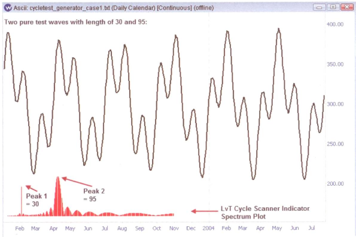

**Figure 2-1:** Sample Dataset 1

The indicator in the lower part of the chart shows the complete spectrum of the wave analysis. Two peaks can be clearly identified. The firs lies ata length of precisely 30 and the second at a length of exactly 95 days.

The data are also found in detail in the script log:

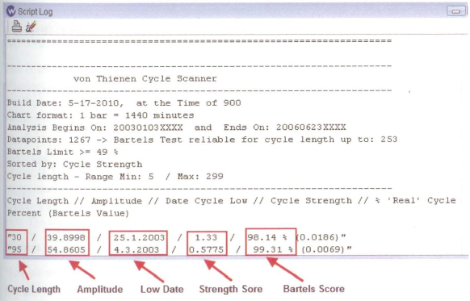

**Figure 2-2:** Cycle Scanner log file for sample Dataset 1

The method was thus able to identify the two waves with absolute precision with respect to their length and amplitude. You will also be able to identify the output of the phases based on the dae of the first low.

The additional statistical test result (Bartels score) of over 98% also confirms the actual presence of the cycles in the data series. When working with cycles in financial data, I recommend disregarding identified cycles with a Bartels score below 50%. A lower value indicates that this wavelength does not have a reliably stable presence in the data series over a specific period of time. Such information is particularly relevant for later use in trading. Although a cycle may have been correctly identified by spectrum analysis, it may very well be that that this cycle only occurs (or occurred) once or twice in the entire data series. We do not want to use cycles that only "appear once” as our trading signals. The Bartels Test is thus a measure that indicates whether the presence of the cycle statistically identified in the data series over several runtimes could be confirmed.

The fact that these two waves can be identified despite the use of a time frame for the analysis that does not even cover two complete wave lengths (in relation to 95 days) is of further significance. Below is the test analysis when only approximately 170 data points (ie., approximately five months of daily data) are used for analysis:

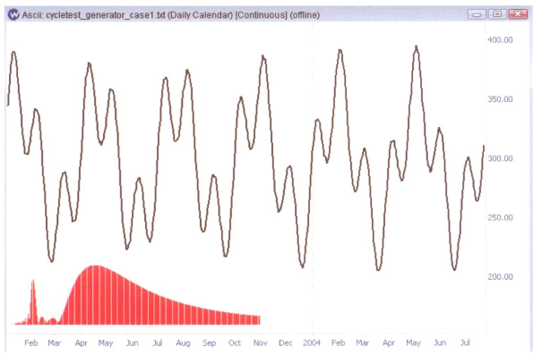

**Figure 2-3:** Spectrum plot for Dataset 1 with small amount of data

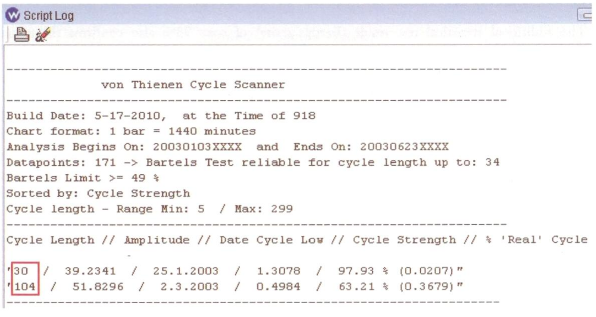

**Figure 2-4:** Detected cycles with small amount of data

Even the cycle with a length of 95 days (three months) is thus identified at a measured length of 104 days in this shore data series (a range of analysis of just five months) with an accuracy of over 90%.

This is another major advantage of this new combined method. Whereas classical methods offen require four or more complete waves to be present and the range of analysis to be at least 344 times as long as the largest wavelength to be identified, less than twice the longest wavelength of analytical data suffices to complete the analysis in this case.

### 2.4 Example 2: Dataset with 2 cycles + trend

In this example, we add trends of various strengths to the previously determined waves. This tefleas a key characteristic of financial markets and will therefore be of crucial importance Inter. The algorithm does not necessarily have to be affected by trends.

We have to ensure that the cycles can still be correctly identified despite the additional trends.

Here we will combine two waves again and add up, down, and sideways trends of varying strengths.

The following wavelengths were used for the test data:

- Wave 1: Length 30 / Amplitude 20
- Wave 2: Length 200 / Amplitude 80

Accordingly, the chart looks like this:

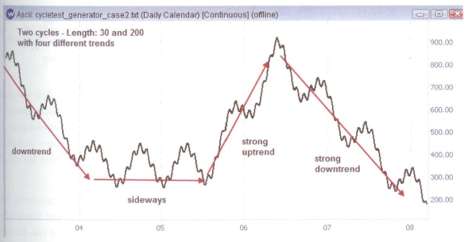

**Figure 2-5:** Sample Dataset 2 / Two waves with linear trends of different forces

The spectrum analysis over a short predefined time frame now provides the following result:

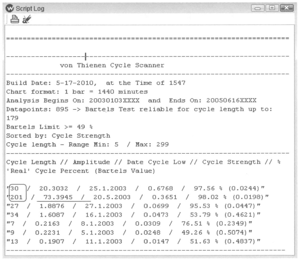

**Figure 2-6:** Result of the spectrum analysis for Dataset 2 in the script log

It is clearly visible that the algorithm was able to detect both cycles. The algorithm was not affected by the trends that were included. It was successful in “detrending” the data prior to the frequency analysis. That is, the algorithm has a proprietary detrending function because it can deal with different forms of trends and forces. As this example shows, we have included four different trends in the analysis. Notwithstanding, the algorithm was able to filter out all of these trends.

The other identified cycles printed in the log with a length of 27 and 34 days can easily be classified as non-relevant noise. This is clearly discernible when looking at the amplitude information. The first two had a price amplitude of 20 and 74 (as was precisely the case for the input cycles). And then there is a huge jump in the detected amplitudes, from 74 down to and below. This is a clear signal that you can disregard this information, because the “low” amplitude will have no effect.

Conclusion:

The Cycle Scanner is able to deal with different trends.

### 2.5 Example 3: Dataset with 2 cycles + trend + noise

Now we will increase the complexity and add the third feature of financial markets: A lot of fandom noise, This “noise” may, for example, be generated by news that compels the market t0 “jump” in one direction or the other.

We will use the same dataset from Example 2 (wavelength of 30 and 200 with trends) for this example and add a lot of noise to the data.

This is what our test dataset looks like now. Go ahead and compare it with the chart above.

You can clearly see how distorted the price data looks and that the smaller cycle is lost in all the noise.

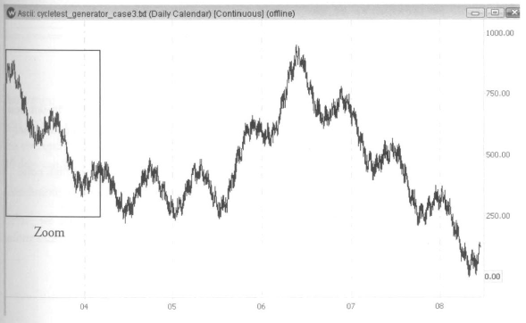

**Figure 2-7:** Sample Dataset 3 — 2 waves + trends + noise

On a side note: The noise level is a lot higher than the amplitude of the smaller cycle. So we have a low signal-to-noise ratio here with regard to the smaller cycle. A closer look at the data demonstrates what I am talking about:

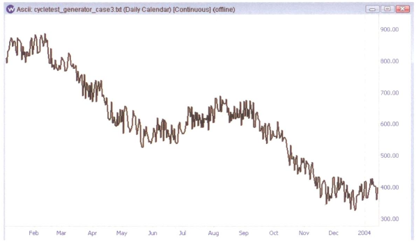

**Figure 2-8:** Close-up of the same data

Here comes the challenge for our new algorithm:

1. The longer-term cycle with a length of 200 days only occurs 1.5 times in the one-year dataset. It would therefore be difficult to detect the running 200 bars cycle if we only have such a short history of data to analyze.
2. The short-term wave with a length of 30 days is completely “lost” in the high noise ratio.
3. The actual downtrend also distorts and stretches the dataset.

Let's see if our algorithm is still able to detect the two cycles.

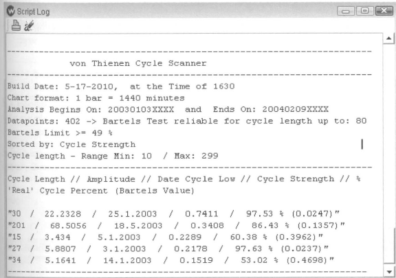

**Figure 2-9:** Analysis results for sample Dataset 3

And again:

The algorithm was not affected by all the noise and trend information. It correctly identified two cycles with a length of 30 and 201 days. The other cycles with a length of 15,27 and “34 days can be “overlooked” if you compare the amplitude with the first two cycles.

Conclusion: The algorithm is able to handle a high noise ratio!

Before we move on to real financial data, let me give you a brief outlook on why this information is so important and of particular interest for trading,

### 2.6 Step-by-step guide: How to build a forecast based on cycle detection

When we know which cycles are driving the market, we are able to use this information to build a forecast based on cycles. Let’s now go over this forecasting technique step-by-step.

#### Step 1: Cycle analysis

At any given point in time, perform a cycle analysis based on your favorite market/index and time frame. We will use the example from case 3 for this particular scenario. So let's say it’s February 9 and we're looking at the actual chart.

Start the Cycle Scanner which will perform the cycle analysis following the steps explained in the examples above. For an analysis of a daily chart, I would recommend using 1 — 2 years of daily data. In the present example, we are “only” using one year for our analysis.

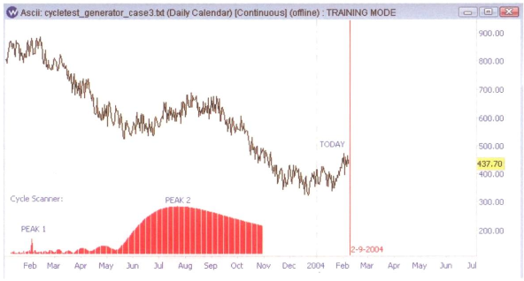

**Figure 2-10:** Step 1 — Cycle analysis for last year’s data

Results of this analysis (represented by the peaks in the chart):

```text
------------------------------
von Thienen Cycle Scanner
------------------------------
Build Date: 5-17-2010, at the Time of 1750
Chart format: 1 bar = 1440 minutes
Analysis Begins On: 20030103KXXX and Ends On: 20040209XXxx
Datapoints: 402 -> Bartels Test reliable for cycle length up to: 80
Bartels Limit >= 49 %
Sorted by: Cycle Strength
Oycle length - Range Min: 10 / Max: 299
------------------------------
Cycle Length // Amplitude // Date Cycle Low // Cycle Strength // + Re

"30 / 22.2328 / 25.1.2003 / 0.7411 / 97.53 % (0.0247)"
"201 / 68.5086 / 18.5.2003 / 0.3408 / 86.43 % (0.1357)"
"15 / 3.434 / 5.1.2003 / 0.2289 / 60.38 % (0.3962)"
"27 / 5.8807 / 3.1.2003 / 0.2178 / 97.63 % (0.0237)"
"34 / 5.1641 / 14.1.2003 / 0.1519 / 53.02 % (0.4698)"
```

#### Step 2: Plot active cycles and expand them into the future

Now that we know that the cycles with a length of 30 and 201 days are active, we can start developing a forecast. Hence, we will plot each cycle according to the information provided by the Cycle Scanner.

The first wave is plotted in line with the start date, amplitude, and length information. The second wave is also plotted in accordance with the given start date, amplitude, and length information.

As the illustration below shows, you can now plot the cycles in the future.

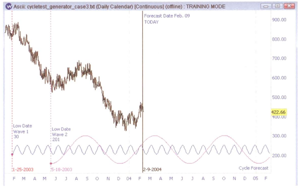

**Figure 2-11:** Plotting the cycles identified in the chart and in the future

#### Step 3: Build a composite cycle based on the cycles identified

If more than one cycle is active, you have to add all individual cycles into one “big” composite cycle. All you have to do is simply add the information of each cycle into one composite cycle. The following illustration presents the composite cycle derived from these two cycles.

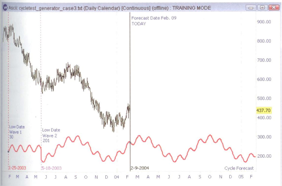

**Figure 2-12: Composite cycle based on two separate cycles.**

#### Step 4: Mark expected future turning points

Now we are able to see how this composite forecast will perform in the future, And we are also able to spot incidences where we expect a change in trend. This information is important for going long or short selling in the market.

I have marked some incidences on the next chart which denote a turn in the composite cycle.

These turns forecast market turns. The cycles have to, of course, remain active during the next few days/wecks.

We have just created our frst forecast based on cycles!

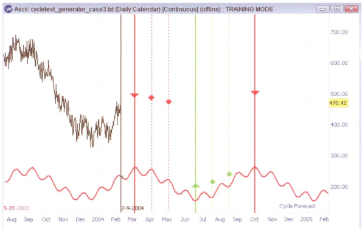

**Figure 2-13: Mark expected turning points forecasted by the composite cycle.**

#### Step 5: Just see how it plays out

Now we can move ahead in time. Our forecast will stay put. The forecast was done on February 9. And as you can see, the forecast was able to spot future turning points all the way up to the exact date

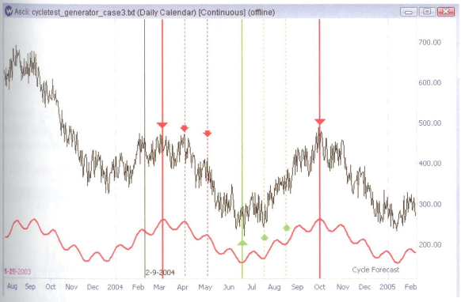

**Figure 2-14:** Real dataset and forecast of February 9

Here with a smoothed ploteed price curve for better illustration:

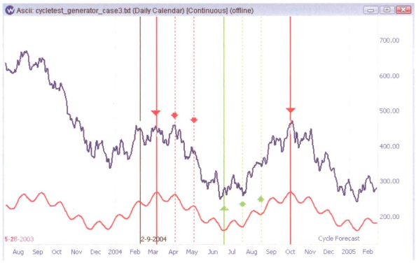

**Figure 2-15:** Real dataset and forecast: How it played out

As you can see, the cycles forecast is a detrended forecast. It is evident that the main trend changes from a downtrend to a sideways trend — but the cycles forecast has provided us with reliable information for trading, The trend change was not known at the time of the analysis.

This is, of course, only a theoretical example. The purpose of this example is to demonstrate how to build cycle forecast models. And you can see that if you have a reliable engine for identifying cycles, you will be able to build highly accurate forecast models. Despite a trend change and a lot of noise in the signal, our engine was able to detect the right cycles.

Using this forecasting method, you will now be able to plot cycles in the future to spot future turning points.

### 2.7 Example 4: Dataset with 4 cycles + trend + noise

Let's increase the degree of complexity once more with the next dataset. We will use four lifferent cycles with different phase offsets:

| Wave | Length | Amplitude |
| --- | --- | --- |
| 1 | 12 | 40 |
| 2 | 31 | 70 |
| 3 | 54 | 90 |
| 4 | 82 | 65 |

We will add different trends and a lot of noise. In this example, the average noise level is 1.5 gher than the max. amplitude of the wave with a length of 12 days. It will thus be difficult to rwhether the engine can detect this small cycle despite all the noise and trend change.

This is what Dataset 4 looks like:

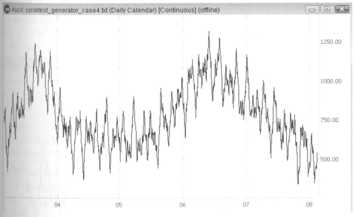

**Figure 2-16:** Sample Dataset 4

For or our test we will again only use one year of data history. This corresponds with reality later on, I would recommend using 1-2 years of data history if you are analyzing cycles on a daily frame.

Let's take a closer look at what I am talking about:

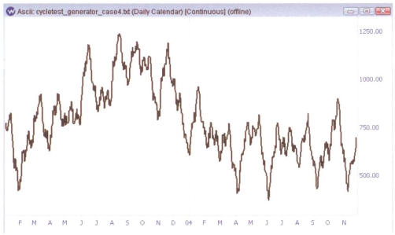

**Figure 2-17:** Zoom-in of Dataset 4

This example is also interesting, because we can compare traditional methods of detecting cycles. If you connect the high-high and low-low CIT on the chart, it seems we have a running cycle of around 65 calendar days.

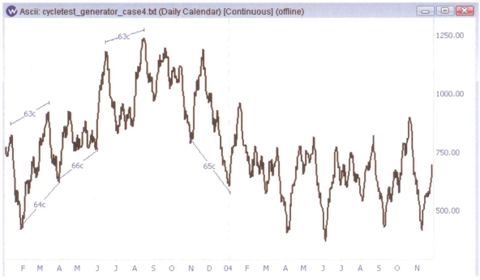

**Figure 2-18:** Dataset 4 — Visual impression of a cycle with a length of 65 days

However, we know that this is sample data with no cycle of 65 days! In other words, you cannot identify cycles using this “simple” method. It looks like we have an active 65 day cycle. But we will se shortly that this cycle is not useful for forecasting or trading.

To demonstrate this, et’s plot a 65 CD cycle from the last low of January 4 and see whether this is useful for future trading. The standard approach would be to use this 65 CD cycle that has been visually identified and plot it in the future:

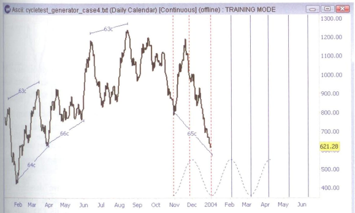

**Figure 2-19:** 65 CD cycle plotted ahead

The blue lines in the chart indicate the expected turning dates of this particular cycle. The information on the turning dates predict a:

- high at the beginning of February
- low during the first half of March
- high ac the beginning of April

Now let's see how it played out:

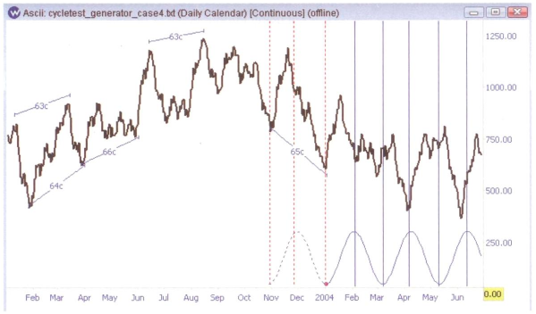

**Figure 2-20:** Dataset 4 - 65 CD cycle forecast and how it played out

As you can clearly see, there is no correlation between the 65 CD cycle we have “detected” and actual price behavior. If we had performed a cycles forecast using this classical method, we would have been totally wrong. Normally, you would deduce: “Ok, the 65 CD cycle was inverted”, because April did not have a high, but a low. So you would argue after the fact that the 65 CD cycle was inverted.

But we know from our example that this line of reasoning is totally wrong! There is no 65 CD cycle and there is no inversion. The detection of cycles by visual recognition of the highs/lows was completely wrong.

I want to use this example to show that the key component of all cycle models is a reliable and robust cycles detection method. And as I have already demonstrated, most of the common methods simply do not work.

Now ler’s use our new algorithm to determine the active cycles using only one year of data history.

Let's start with the plot of the spectrum from the cycle analyzer for the same dataset:

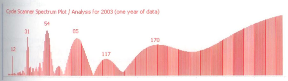

**Figure 2-21** Cycle Scanner plot of Dataset 4

We can clearly see the obvious peaks of the cycles that were used to generate the dataset. Even our small cycle of 12 days was recognized accurately with a sharp peak on the spectrum plot. Despite all the noise in this data.

The question now what we should do with the detected cycles 117 and 170? After all, these cycles are not present in the dataset.

This is the printout from the script log:

```text
-------------------------
von Thienen Cycle Scanner
-------------------------
Build Date: 5-18-2010, at the Time of 1518
Chart format: 1 bar = 1440 minutes
Analysis Begins On: 20030103KXXX and Ends On: 20040209XxXx
Datapoints: 402 -> Bartels Test reliable for cycle length up to: 80
Bartels Limit >= 49 %
Sorted by: Cycle Strength
Oycle length - Range Min: 5 / Max: 299
-------------------------
Cycle Length // Amplitude // Date Cycle Low // Cycle Strength // + Re
'Real' cycle Percent (Bartels Value)

"12 / 19.5581 6.1.2003 / 3.2965 / 86.08 ¥ (0.1392)"
"31 / 79.6039 28.1.2003 / 2.5679 / 83.95 * (0.1605)
"54 / 92.8326 1.2.2003 / 1.7191 / 98.26 % (0.0174)"
"86 / 77.2527 1.2.2003 / 0.8983 / 88.77 % (0.1123)"
"28 / .5847 30.1.2003 / 0.5923 / 69.27 * (0.3073)"
-------------------------
```

These cycles obviously do not appear on our result list, the reason being our post-processing using the statistical engine buile into the algorithm. These cycles are “sorted out” because they have a low Bartels score (below 49). And that demonstrates the power of the combined algorithm that was created for this Cycle Scanner.

The list accurately displays the real cycles: 12, 31, 54, and 86 days (the actual length would be 85 days). If you take a look at the 28 day cycle, you can see the low “amplitude”. This is also a full derivative of the 12er cycle (4 * 12). We can therefore skip the 28er cycle here.

The result is as clear as can be! All cycles have been identified correctly in terms of cycle length and amplitude. And the algorithm (correctly) did not detect a 65 day cycle as we have seen in the chart.

So, the next step would be to apply the cycle forecasting method I have introduced in case 3, Let's apply it to this case now.

### 2.8 Building the forecasting model for Example 4 based on the detected cycles

#### Step 1 Cycle analysis

We have just completed this step. The report above was published on February 9 using the data history of the year 2003. The engine provided us with information on the four cycles (12, 31, 54, and 86 days) including their LOW dates and amplitude. We will enter them into the chart in the next step.

#### Step 2 Plot active cycles and expand them into the future

We are now able to plot the four cycles with their correct low offset dates and perform a projection of these cycles in the future, The data is derived from the output of the Cycle Scanner shown below.

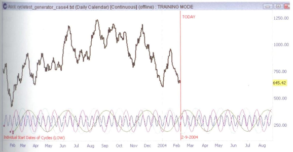

**Figure 2-23:** Dataset 4 — Single cycles forecast for detected cycles

#### Step 3 Build a composite cycle from the detected cycles

I'll get more complicated now when we enter four cycles into the chart and build a forecast based on these cycles. OF course you can plot each cycle individually to determine when they are in “alignment” in terms of their lows and/or highs in order to spot turning points. To do so you will need to build a composite model. But that involves nothing more than simply adding together all four cycles. It's easy. So let’s see what the composite of these four cycles looks like.

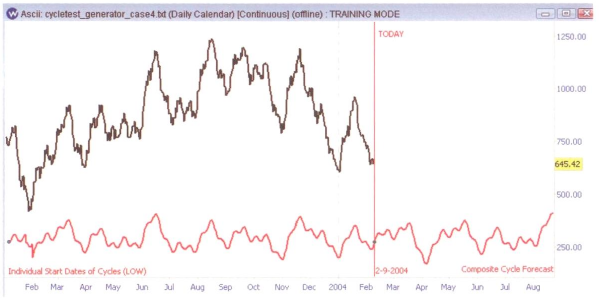

**Figure 2-24:** Composite cycle forecast for Dataset 4

#### Step 4 Mark expected future turning points

The next step involves identifying the main future turning points of the composite cycle. ‘These incidences are the dates when we expect a major change in market trend. For easier reading, I have only marked the expected major lows and highs. There is, of course, mote to it. But why don’t you just take a closer look!

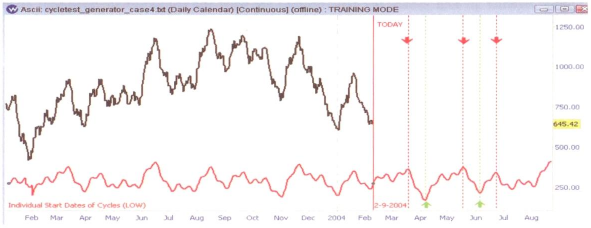

**Figure 2-25:** Forecasted turning points (CIT) in the coming months

#### Step 5 Just see how it plays out

Now let's check how this forecast would have played out.

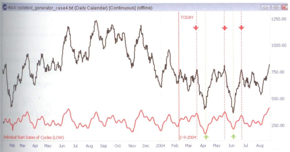

**Figure 2-26:** Composite forecast and result

I think there is no need to comment on this chart. You can see for yourself how accurate the composite forecast spotted the correct turning points. And not only are the marked ones correct. Each single turning point in the composite forecast corresponds with a turn in the sample marker.

Take a closer look at the chart and study it a little.

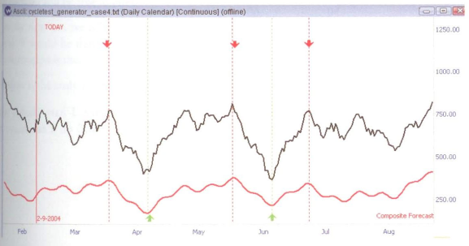

**Figure 2-27:** Comparison between composite forecast and sample dataset

Compare this result with the visual cycles detection method illustrated above on the 65 CD cycle. The benefits of the Cycle Scanner results are clearly visible.

This is, of course, only sample data and not real market data. But there are two important things I would like to mention about all these test data:

1. It is important to prove that the algorithm is able to detect cycles in simulated market conditions with noise, trends, and different cycles running in parallel.
2. You should gain a general understanding of a simple cycles forecasting method using the detected cycles to forecast future turning points.

Before we move on to real markets, let's conduct one last heavy stress test using our engine to see whether the new algorithm can master this test as well.

### 2.9 Example 5: Dataset with 5 cycles + noise + changing trends and forces

We will again increase the complexity by adding another cycle and by increasing the trend levels and trend changes. We will, of course, also add random noise on top of it all. We will use the following five cycles for the next dataset:

| Wave | Length | Amplitude |
| --- | --- | --- |
| 1 | 30 | 40 |
| 2 | 50 | 60 |
| 3 | 95 | 55 |
| 4 | 195 | 110 |
| 5 | 230 | 150 |

Just to demonstrate that you can use any time frame with this engine, I have chosen an intraday time frame similar to normal trading times from 09:30 to 16:00 on a one minute chart.

Here is what it looks like:

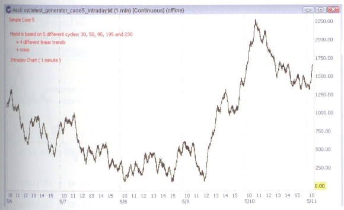

**Figure 2-28:** Sample Dataset 5

You can sce that this sample dataset looks very similar to real markets. And it is based purely on the five cycles, different trends, and noise. Therefore, it reveals that all features that come close to real markets are included in the model. Now let’s see what cycle information the new algorithm will be able to offer.

In the first run, we will only use one day of data history to analyze the cycles. This is also the way it would be done in real markets —the last trading day is used to extract cycles and this information is then used to forecast the next turning points.

Below is the analysis report for the intraday data of May 6.

```text
--------------------------------
von Thienen Cycle Scanner
--------------------------------
Build Date: 5-19-2010, at the Time of 1621
Chart format: 1 bar = 1440 minutes
Analysis Begins On: 201005060931 and Ends On: 201005070944
Datapoints: 403 -> Bartels Test reliable for cycle length up to: 81
Bartels Limit >= 49 %
Sorted by: Cycle Strength
Cycle length - Range Min: 20 / Max: 299
Cycle Length // Amplitude // Date Cycle Low // Cycle Strength // Real Cycle Percent (Bartels Value)
--------------------------------
"30 / 44.9954 / 6.5.2010.954.T / 1.4982 / 68.42 % (0.1158)"
"S51 / 69.1869 / 6.5.2010.939.T / 1.3566 / 81.16 % (0.1884)"
"90 / 80.623 / 6.5.2010.1044.T / 0.8958 / 72.57 % (0.2743)"
"179 / 153.8411 / 6.5.2010.1157.T / 0.8594 / 85.57 % (0.1443)”"
"27 / 19.5783 / 6.5.2010.932.T / 0.7251 / 86.48 % (0.1352)"
"21 / 7.4683 / 6.5.2010.931.T / 0.3556 / 65.96 * (0.3404)"
--------------------------------
```

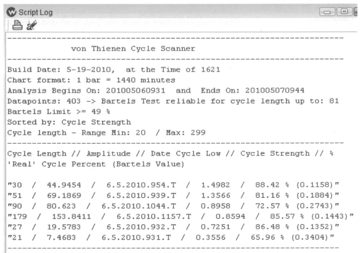

**Figure 2-29** Cycle Scanner result for Dataset 5 (one day of data history)

There is some information here we are seeing for the first time: The Cycle Scanner provides the exact LOW dates (phase offset) precisely to the minute when using intraday charts!

The scanner now was able to extract four cycles. The 30, 51, 90, and 179 minute cycles. The 21 and 27 minute cycles were skipped owing to their low amplitudes in comparison with the other four cycles. That is, the maximum error ratio here with reference to the longer cycle of 195 minutes (real) as compared to 179 minutes (detected) is only 8%. The cycle with a length of 230 minutes was not detected because we did not have sufficient data in the analysis windows (only one day). Ie is thus not surprising that the scanner was not able to detect the cycle with a length of 230 minutes (approx. 4 hours) in only 8 hours of test data.

In other words, we are now faced with the situation that the scanner did not detect all cycles and that one cycle with an error ratio of 8% was among those cycles identified. This is similar to reality —there will always be some errors in detection and we will inevitably miss some longer-term cycles. So this is not really surprising from an analytical point of view.

But now let’s see what happens if we use these four detected cycles including the erroneous cycle in a forecasting model. Will it be reliable enough for trading purposes?

Hence, we will enter the four detected cycles with their given LOW dates and amplitudes into the chart. This would have been the situation had we entered them just after the open on May 7 with one day of data history.

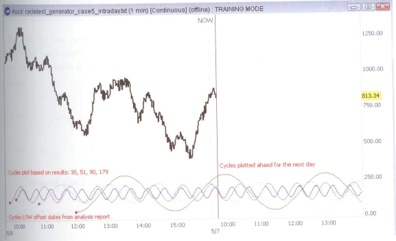

**Figure 2-30:** Dataset 5 and single cycles forecast

Again, the method needs to sum up all individual cycles into one composite. This is the composite picture for the detected individual cycles with the major turning points already included in the chart. This is the method used to build a trading forecast for the next day.

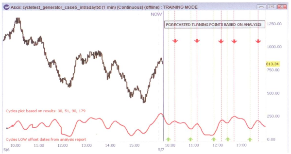

**Figure 2-31:** Dataset 5 with composite cycle forecast based on Cycle Scanner

This chart would have been our trading forecast for May 7. We would have identified the future times for the day on which we would expect the market to turn. Let's see what this forecast brings:

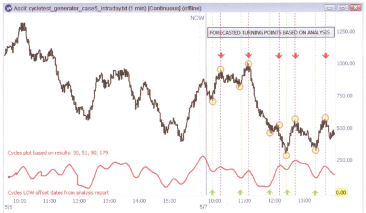

**Figure 2-32:** Composite forecast based on scanner and sample Dataset 5

Again, the Cycle Scanner was highly accurate in forecasting the turning points up to the minute! This example shows what you can expect in a real market. Even if there is an error in the correct cycle length and even if we “miss” one cycle, the forecast based on the Cycle Scanner results is reliable and robust for building tradable forecasts. And that's just it. We need tradable forecasts. And we will get them.

This was the last example to demonstrate the potential of the new algorithm using sample data. This last sample dataset comes very close to real market conditions. And we have seen new that the results of the Cycle Scanner are highly accurate for building forecasts.

### 2.10 The Cycle Scanner: Algorithm overview

If you are an engineer, you can imagine how difficult this course was; a full workload on all the mathematical stuff, the coding, the testing, and the individual development to optimize the existing algorithms. If you are into trading, it doesn’t matter in the end.

Just keep this figure in mind to gain an understanding of how the Cycle Scanner works:

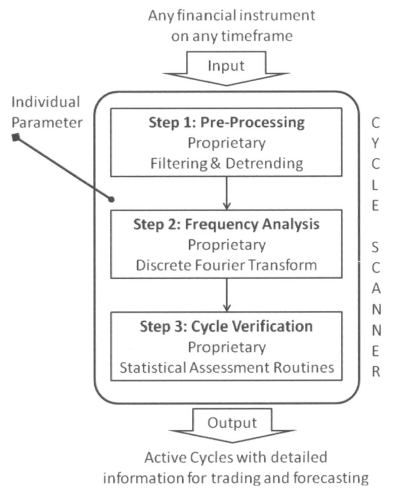

**Figure 2-33:** Overview “Cycle Scanner”

### 2.11 Final summary — A new area of cyclic analysis at your fingertips

So far, I have shown and proven how reliable and robust this new engine is. It is very important to test the engine on sample data for which we know the cycle information. But all examples and stress tests have demonstrated that this new algorithm is able to tackle al features of financial daa sets including noise, trends, and changing cycles over time. It can overcome the problems of all known individual analysis routines. The combination and adaptation of different algorithms produce this great result.

All sample datasets are included on the CD. I can assure you that I have carried out thousands of such examples. It is, after al, very important for you to be able to trust a new engine before you apply it to financial markets. I hope you have realized by now that you can trust this new algorithm. In the following chapters, I will show you how to use it for real trading purposes. You will chen be able to test and rebuild all shown examples. I have included this data in order for you to be able to become familiar with the Cycle Scanner before you apply it to real data.

The powerful toy is lying right in frone of you. You can attach the Cycle Scanner to any device and use any time frame, The full algorithm is buile into an add-on for Wave59. It's j away.

You are now also able to use the results of the Cycle Scanner to build the forecasts for Future points.

You have only just arrived at Chapter 2 of this book. And you already have the most powerful cycle detection engine for Financial markets at your fingertips.

### 2.12 The Cycle Scanner: A step-by-step guide for using the add-on with Waves59

The Cycle Scanner was developed in C++ to deliver the best analytical performance in a real-time environment. All algorithms were placed in a single DLL file. This DLL file has to be included in the Wave59 scripts/DLL folder. That is, make sure you copy the DLL from the CD into your Wave59 scripts/DLL directory. The engine works with all Wave59 versions (RT, PRO, PRIVATE).

All functions are called directly from Wave59 via new QScript functions. I have created all scripts required for carrying out cycles detection. You won’t have to write a single line of code. But I have left the QScript code readable for you. If you like, you can use the functions for your own scripts and trading systems at a later point.

The QScript which is responsible for the cycle detection is called:

LvT Cycle Scanner

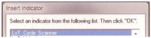

This script will be installed in your technical menu. So if you want to do a cycle analysis, simply open the chart with your instrument and favorite time frame. You can then switch on the Cycle Scanner QScript.

This tool has the following parameter options:

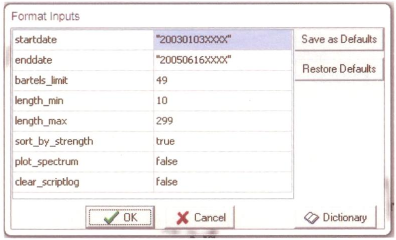

**Figure 2-34:** Cycle Scanner parameter input box

#### Startdate and enddate

The startdate and enddate define the period of data to be used in the algorithm to detect the cycles. These are very important parameters because they determine which dataset should be used for the analysis engine, As was the case in the examples, I recommend using 1-2 years of data when analyzing daily charts and 1-2 days of 1-minute data history when analyzing intraday charts. The best start- and end dates are highs and lows in the current market. So select the highs and/or lows for the startlenddate and try to build a period of 1-2 years (daily) or 1-2 days (intraday).

The input format works as follows (without spaces):

© dhily charts: “ YEAR MONTH DAY XXXX “
© intraday charts “ YEAR MONTH DAY HOUR MINUTE “
YEAR: 4 digits
MONTH: always 2 digits (1 has to be entered as 01, 2 as 02, and so on)
DAY: always 2 digits
HOUR: always 2 digits
MINUTE: always 2 digits

#### Bartels limit

The post-processing engine applies a cycle verification engine based on statistical routines. The Bartels score indicates the “reliability” of the presence of a cycle in the current data. The value is measured in percent. A low value implies low statistical alignment between the cycle and the real data. A high value indicates a high statistical alignment between the cycle and the real data.

This post-processing engine should be used as a second filter of the results. The frequency analysis delivers all cycles detected by this procedure. Subsequently, only cycles with a high Bartels score should be detected by the engine.

That is, I would recommend skipping cycles with a Bartels score lower than 40%.

#### Length min / Length max

This defines the cycle lengths that you want the data to be scanned for. If you only want to scan cycles with a length of between 50 and 100 days, enter 50 for length_min and 100 for length_max. You can define the range the Cycle Scanner should search. The maximum lengch of cycles is 299 and the minimum length is 5 (always measured in number of bats).

#### Sort by strength (true / false)

Cycles have two key features: Length and amplitude. Usually, cycles are sorted by amplitude because the cycle with the highest amplitude will have the highest influence on the movements of the market. But when it comes to trading, we are interested in the cyclic force per time unit, which is measured in bars on the price chart. A better value can be obtained if we sort the cycles according to level of influence with reference to price movement per bar. This value can be very easily calculated: Simply divide the amplitude by cycle length. You will then obtain the price change in terms of cycle per bar. This is termed “cycle strength” in my algorithm.

When set to true, the cycles in the script log will be sorted according to cycle strength value. When set to false, they will be sorted according to amplitude.

#### Plot spectrum (true / false)

As the examples have shown, the engine is capable of plotting the spectrum on the chart. The spectrum is plotted in the lower left corner of your chart beginning at bar number 5. The reason is simple: The bar number indicates the cycle length. You can use the chart pointer and move over the spectrum peaks to view the cycle length for the given peak by simply looking at the bar number.

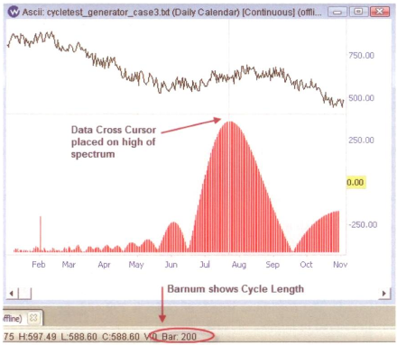

**Figure 2-35:** Cycle spectrum plot on chart

#### Clear scriptlog (true/false)

This parameter determines whether the script log should be cleared when the indicator is attached or not.

The result of the cycle analyzer is printed onto the script log. There you will find all relevant information about the detected cycles.

The header of the log provides basic information on when the analysis was done, which data was ised for the analysis, and on the set-up.

```text
----------------------------------
von Thienen Cycle Scanner
----------------------------------
Build Date: 5-20-2010, at the Tow of 2026
Chart format: 1 bar = 1440 minutes
Analysis Begins On: 20030103XXxX and Ends On: 20050616XXxxX
Datapoints: 895 -> Bartels Test reliable for cycle length up to: 179
Bartels Limit >= 49 %
Sorted by: Cycle Strength

Cycle length - Range Min: 10 / Max: 299
----------------------------------
```

**Figure 2-36:** Header of cycle analyzer log

The second part of the script log comprises the table with the results of the spectrum analysis. The detected cycles are sorted by cycle strength or amplitude (as indicated in the header).

Each cycle line includes the following information:

GydeLength Amplitude Date/Time of Cycle Strength Bartels Score
(in bars) Cycle Low Offset Score
on the chart
(Phase)

```text
----------------------------------
von Thienen Cycle Scanner
----------------------------------
Build Date: 5-20-2010, at the Tow of 2026
Chart format: 1 bar = 1440 minutes
Analysis Begins On: 20030103XXxX and Ends On: 20050616XXxxX
Datapoints: 895 -> Bartels Test reliable for cycle length up to: 179
Bartels Limit >= 49 %
Sorted by: Cycle Strength

Cycle length - Range Min: 10 / Max: 299
----------------------------------
Cycle Length // Amplitude // Date Cycle Low // Cycle Strength // + ‘Real’ Cycle Percent (Bartels Value)

"30 / 39.8998 / 25.21.2003 / 1.33 / 98.14 % (0.0186)"
"95 / 54.8605 / 4.3.2003 / 0.5775 / 99,31 % (0.0069)"

Cycle Length / Amplitude / Low Date / Strength Score / Bartels Score
```

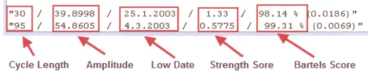

**Figure 2-37:** Cycle parameter

### 2.13 The cycle plotter script for Wave59

I have built a simple “Cycle Plotter Script”. This script was used to plot up to four different cycles as indicators. This script is also able to build a composite from all cycles. I used this script for the sample dataset and to “verify” the results of the Cycle Scanner. You can use this script yo manually plot different cycles on the chart. You can also use it for learning purposes and rebuild all examples presented here.

The script is named:

LyT_Cycle_Plotter

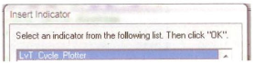

Parameters:

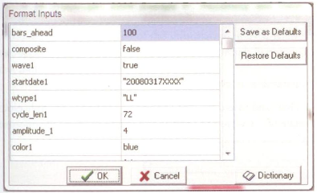

**Figure 2-38:** Cycle plotter parameter

The parameter should be self-explanatory. Just play with it a little. I want to mention one important benefit, however: You can directly cut and paste results from the Cycle Scanner’s script log into the cycle plotter. This makes it very easy to check the results of a detected cycle on the chart.

Here is how to do it:

#### Step 1: Copy fall line for cycle from script log

First, select one full line including the quotation marks and press CTRL + C or click the right mouse button.

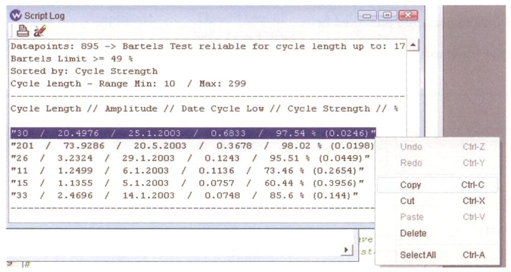

#### Step 2: Open parameter startdate in cycle plotter

Switch to the chart and insert the cycle plotter or configure the cycle plotter indicator and open the startdate of the wave you want to use. Mark or delete the information,

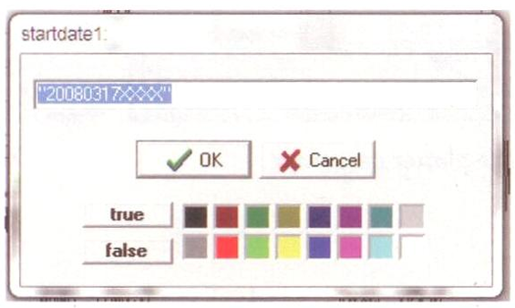

#### Step 3: Paste full line from cycle analyzer log

Press CTRL + V or click the right mouse button and “Paste” to insert the full line.

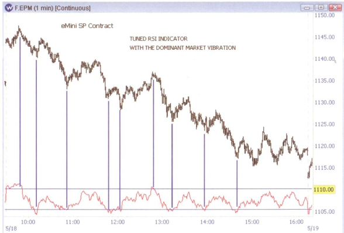

Subsequently, the script will recognize that all cycle information has been entered into this line and the next individual fields for cycle length and amplitude will therefore be disregarded.

Finally, the cycle will plot based on all of the information derived from the Cycle Scanner. And using the option “composite” (true/false), you can switch between a composite plot of all oycles or an individual plot.

## 3. The Dominant Market Vibration

Now that we are able to detect cycles with surgical precision, we can start to apply our new Cycle Scanner engine to real markets.

### 3.1 Definition of the dominant cycle

The most important information with reference to trading and cycles is the so-called “dominant cycle”. The most straightforward definition of the dominant cycle is the identified cyclic component with the greatest amplitude. The dominant cycle is described by its wavelength, measured in bars.

### 3.2 Definition of the Dominant Market Vibration

To arrive at more reliable and robust information on the dominant cycle, our new engine filters the dominant cycle with more proprietary algorithms.

#### Step 1

The algorithm has a dynamic filter for detrending, which is included for pre-processing. This ensures that our data is not affected by trending information. This algorithm is one of the best detrending filters I have found in digital signal processing.

#### Step 2

Subsequently, the engine performs a spectral analysis based on an optimized Discrete Fourier Transform and then isolates those cycles that are repetitive and have the largest amplitudes. The second step gives us the dominant cycle.

The second step includes the proprietary frequency analysis routines. Research results have shown that an adapted Goertzel algorithm is most suitable when it comes to detecting cycles in financial time series. Since this book is about trading, I do not want to publish my mathematical and statistical results here. For those who want to know more about the differences between the various algorithms, read Dennis Meyers’ paper "MESA vs. Goertzel-DFT" (meyersanalytics.com/publications/MesaVsGDFT.pdf )

I have adapted Goertze’s algorithm for my own cycles engine, specifically in terms of the characteristics of financial time series datasets, but we will take ita lot further in the next step.

#### Step 3

In the third step, the statistic reliability of each cycle is evaluated. The goal of the algorithm is to exclude cycles that have been influenced by one-time random events (news, for example).

One of the algorithms used for this is a more sophisticated Bartels Test. The test builds on detiled mathematics (statistics) which measures the stability of the amplitude and phase of each cycle.

Bartel’s statistical test for periodicity, published at the Carnegie Institution of Washington in 1932, was embraced by the Foundation for the Study of Cycles decades ago as the best single test for a given cycle's projected reliability, robustness, and consequently, usefulness.

The Bartels Test is based on von Neumann's Ratio Test for Randomness. Bartels introduced a way to build ranking scores for cycles in a dataset according to their measured ratio of randomness.

The method provides a direct measurement of the likelihood that a given cycle is genuine. The higher the Bartels score is (above 70%, up to 100%), the higher the likelihood that the cycle is genuine and has not been influenced by one-time events.

For futher readng ofthe last offical version, see: “The Rank Version of von Neumann's Ratio Test for Randomness", Author: Robert {Bates Journal ofthe American Seaisticl Asocation, Vol. 77, No. 377, (Mar. 1982), pp. 40-46

#### Step 4

As important final step in making sense of the cyclic information is to establish a measurement for the strength of a cycle. Once the third step is completed, we have cycles that are dominant (based on their amplitude) and genuine with reference to their driving force in the financial market. But for trading purposes, this does not suffice. The price influence of a cycle per bar on the trading chart is the most crucial information.

Let me give you some examples by comparing two cycles. One cycle has a wavelength of 110 bars an amplitude of 300. The other cycle has a wavelength of 60 bars and an amplitude of only 200.

So, if we apply the “standard” method for determining the dominant cycle, namely selecting the cycle with the highest amplitude, we would select the cycle with the wavelength of 110 and the amplitude of 300.

But let's look at the following information - the force of the cycle per bar:

- Length 110 / Amplitude 300 > Strength per bar: 300 / 110 = 2.7
- Length 60 / Amplicude 200 > Strength per bar: 200/60 = 3.3

For trading it is more important to know which cycle has the biggest influence to drive the price per bar, and not only which cycle has the highest amplitude!

That's the reason why I am introducing the measurement value “Cycle Strength”. The Cycle Scanner automatically calculates this value in the script log.

#### Step 5

Sort the outcome according to the calculated cycle strength score. Now we have a top to borcom list of cycles which have the highest influence on price movements per bar. And that's precisely what we need!

#### Summary: The dominant market vibration

After our new engine has completed all five steps, the cycle at the top of the list (with the highest cycle strength score) will give us information on the dominant market vibration. In fact, the wavelength of this cycle is the dominant market vibration, which is very useful for trading.

I will use the definition of the Dominant Market Vibration because this full algorithm and the idea behind it go far beyond the classical definition of a dominant cycle as found in the literature.

## 4. Fine-tuning technical indicators using the Dominant Market Vibration

It does not suffice to only measure cycles accurately. Cycles and the measured Dominant Marker Vibration must be applied in real trading environments. Let's start with a very old approach equipped with a brand new algorithm.

The first and easiest way to use the Dominant Market Vibration is to “fine-tune” technical standard indicators. This is not a new idea — but with the details presented in the last chapter, we can empower old ideas with a robust and dynamic cycle detection algorithm.

I will present a combination strategy that pairs the popular RSI oscillator with the cyclic concepts of the Dominant Market Vibration. This combination resolves the problem of flawed trading signals so common to traditional oscillator analysis by filtering them out.

The usage of the Cycle Scanner in combination with the RSI will show how the incorporation of cycle analysis greatly enhances the accuracy and value of oscillator signals.

### 4.1 The basic idea

A lot has already been written about the fine-tuning of technical indicators using information on the dominant cycle length. I will explain the basics next.

The reason we only use the technical indicators with their standard length setting of, for example, 13,is attributable to the lack of knowledge about how to set the correct length value ahead of time. One of the major drawbacks of using technical indicators with their standard length setting is the problem of filkering out flawed trading signals.

Based on the logic of the calculation algorithm, standard indicators perform best when their "inner" setting (the length parameter for the calculation) is aligned with the Dominant Market Vibration of the price movement that is to be tracked. ‘Aligned’ means that the length input parameter is a harmonic number of the full dominant wavelength. The easiest would be to use the full or half harmonic of the Dominant Market Vibration measured.

*Statement 1: set the length parameter of technical indicators tc Dominant Market Vibration.*

Another common approach (when you're not sure how to detect the dominant cycle) would be to apply some back-optimizing to determine which length setting would have performed best in the past and use this setting for future trading, But even a back-optimized setting is a fixed setting that is not able to adjust to the actual market characteristics.

The usage of back-optimized or standardized fixed length periods in technical indicators leads to inaccurate results on the right-hand side of the chart where all trading is done.

Since the dominant cycle lengths and phase offsets that drive the market change over time, the adjustment of the indicators to these lengths must be done dynamically.

*Statement 2: The length parameter must be adjusted dynamically.*

However, the key for putting this idea into practice is to have a reliable and accurate method for detecting the dominant cycle at any given time. Most articles usually only explain how to adjust the standard length parameter of technical indicators and then leave you on your own when it comes to putting it into practice, i. how to detect the actual dominant cycle on your own, You can subscribe to newsletters or pay a lot of money to obtain this type of information However, I will focus on putting this idea into practice. This publication will provide you with all the know-how you need to use this method on your own.

In the previous chapter, I introduced the proprietary algorithms needed in order to detect the dominant market cycle. This algorithm is included here and has been significantly simplified so you can apply it to any chart with only two mouse clicks. The last chapter has already indicated that you now have a powerful engine right at your fingertips that will deliver the wavelength.

Equipped with these tools, you are now able co dynamically detect the actual cycle length at any given point in time. You can start using this information to fine-tune your indicators right away.

Let's start by reviewing some examples.

### 4.2 A step-by-step guide: Trading the S&P 500 E-mini futures contract intraday

Let's review the market on an intraday chart using standard indicators. We will choose May 18, 2010 for this test (which is yesterday, i.e., the day before writing these lines, so no cherry picking here!). First, let’s take a look at the chart based here on a normal standard RSI indicator:

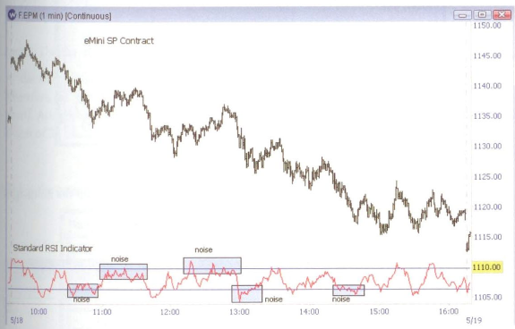

**Figure 4-1:** E-mini with standard RSI on May 18 — Not tradable information

You can clearly see from the noise information of the RSI that we would have had a lot of whipsaw trades with a great loss at the end of the day. Now let’s see whether we are able to fine-tune the RSI indicator with the information derived from the Dominant Market Vibration,

We will now go over the entire method in detail. Let's assume that it's the start of the trading day on May 18. Hence, we will have to prepare for the trading day in the morning just after the market has opened.

#### Step 1: Open chart and run cycle analyzer using (approx.) one day of data history

We have attached the Cycle Scanner toolkit to the chart with the following time setting:

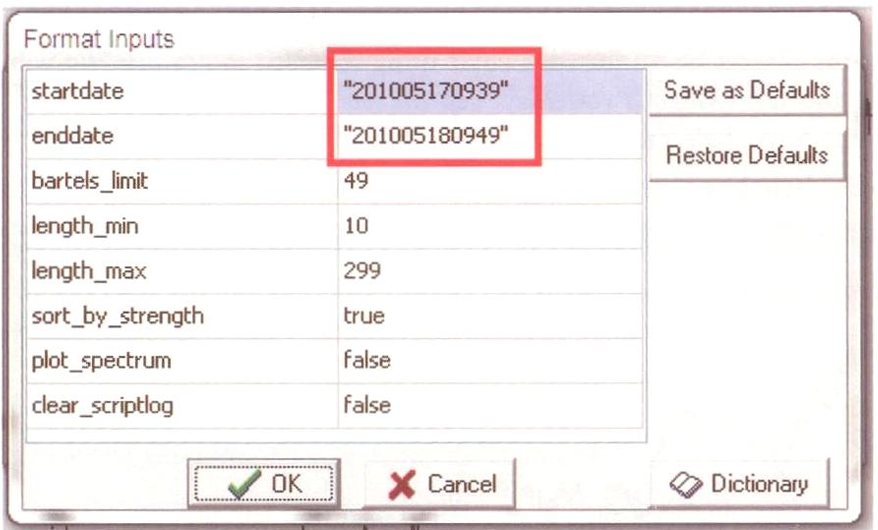

We have chosen the period from the start date of the trading on May 17 until the morning of May 18, ic., one complete day of data history.

Next, let’s have a look at the script log:

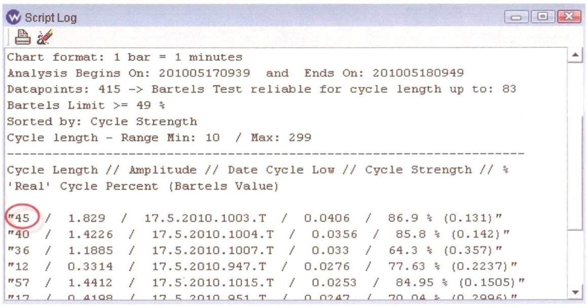

#### Stepp 2: Detect the Dominant Market Vibration

If we follow the definition of the Dominant Marker Vibration presented in the introduction of the chapter (highest score of cycle strength), the Dominant Market Vibration detected has a wavelength of 45 bars (minutes). The idea now is to use this information to fine-tune the indicators. The most effective approach is to take half of the identified wavelength as input for the  length parameter of standard indicators. In this case, the score of 22 would be the half-length of the Dominant Market Vibration (45 / 2 = 22.5 -> but we will use only full integer values for the length settings, here 22).

#### Step 3: Use the market vibration to fine-tune indicators

At the star of the trading day, we knew that the market vibration was about 45 minutes. Therefore, we will use 22 as the length input for standard indicators in the chart (1 minute chart). Accordingly, we will enter the standard RSI indicator into the chart with an individual length of 22.

This is the parameter box of the RSI indicator in the chart.

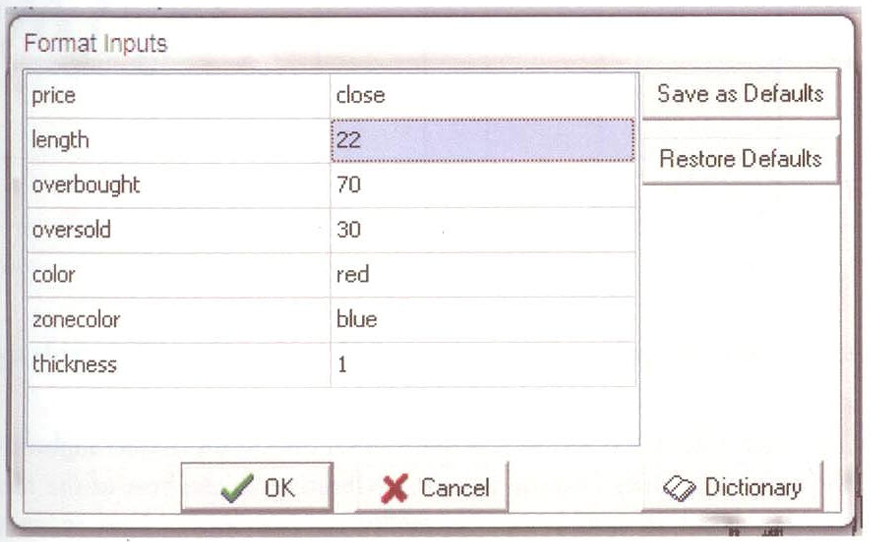

We have now completed our “cyclic” fine-tuning of the RSI indicator. That is it. I's all very straightforward if you know the dominant market cycle and vibration score. It is just about setting the right length value for the indicator to be in syne with the market vibration.

#### Performance review of the cyclic fine-tuned RSI indicator

Let's review whether this fine-tuned RSI indicator is able to perform better. The next chart shows the trading day including the cyclic fine-tuned RSI. The trading signals — a break below/above the upper/lower lines (30 and 70) ~ are marked as blue lines in the chart for easy reading.

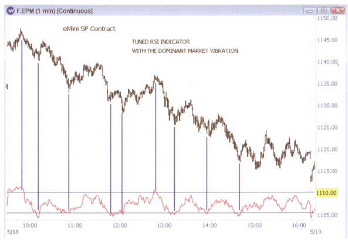

**Figure 4-2:** E-mini with cyclic fine-tuned RSI on May 18 — Clear trade signals

You can see that each RSI signal was in alignment with important market highs/lows. Now the RST is able to perform its duty because it is now vibrating to the beat of the market. This is very important for standard indicators. Normally, no one knows how to set the “length parameter of most of the technical indicators. Or, alternatively, you are able to see immediately after the fact which length input would have performed best. But in trading, what would have been the best parameter for the indicator is irrelevant after the fact.

Therefore, we need information on what the best parameter is ahead of time. The Dominant Market Vibration, which we can identify using our new engine, is able to deliver this information.

If you only use the standard length setting, which is not in alignment with the Dominant Market Vibration, the output of the indicator will be useless with regard to reliable trading signals. You can compare both charts at the end of this chapter. You will clearly see what I am talkking about (Figure 4-4 and Figure 4-5 on page 63).

But let’s take it even one step further.

Once we know the cyclic component of the market, we are also able co apply some noise filtering with nearly zero lag. Therefore, I have integrated a cyclic smoothing engine into the RSI indicator. It is the same RSI indicator, only that the RSI signal is smoothed by this new "cyclic super smoother".

The next chart shows the same RSI with a length setting of 22, supplemented by the smoothing engine. One major advantage becomes evident now: The signals referring to the break above/below the lower/upper indicator lines remain the same, the nearly zero lag filtering notwithstanding.

We are now able to clearly see the divergences between the price and the cyclic fine-tuned RSI indicator. These divergences would not have been easy to see in the normal RSI indicator. But in this cydic fine-tuned version, the divergences are easily visible. And these signals are even more important than the line breaks. ‘The divergences of this indicator are highlighted in the chart below.

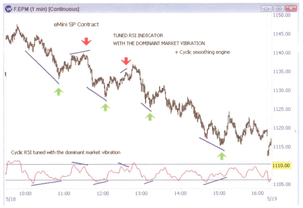

**Figure 4-3:** E-mini with cyclic fine-tuned & smoothed RSI on May 18 ~ Clear divergence signals

The most powerful signals are attained when there is a divergence AND a break of the upper/lower signal line as previously detected.

Please review these signals with the standard RSI indicator on the next page (Figure 4-4 and Figure 4-5 on page 63). You would not have been able to see these signals with the standard RSI settings.

To better understand, I have included a large chart here including both indicators. You can thus review the details of the chart on your own and compare these two RSI signals more closely (Figure 4-6, Page 64).

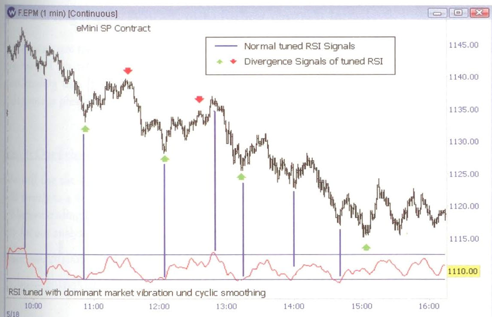

**Figure 4-4:** Trading signals of cyclic fine-tuned RSI

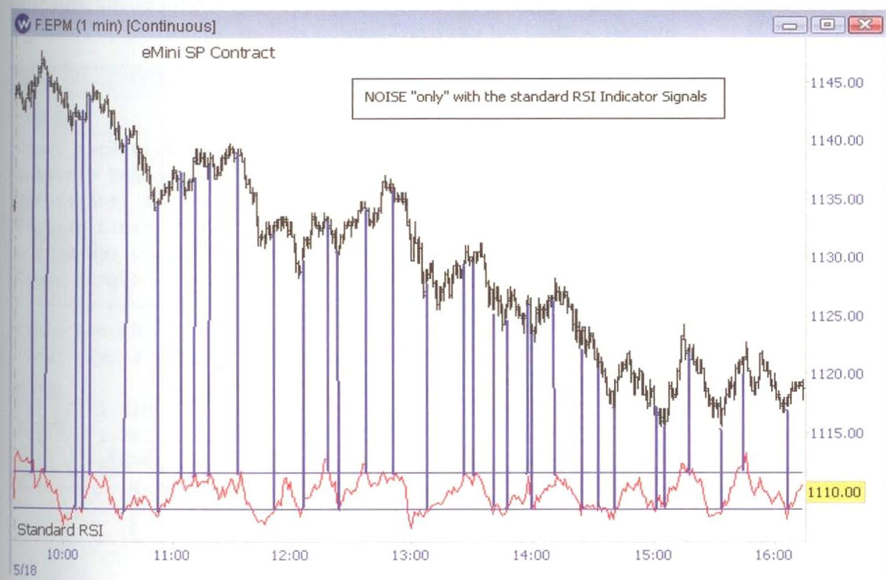

**Figure 4-5:** Trading signals of standard RSI

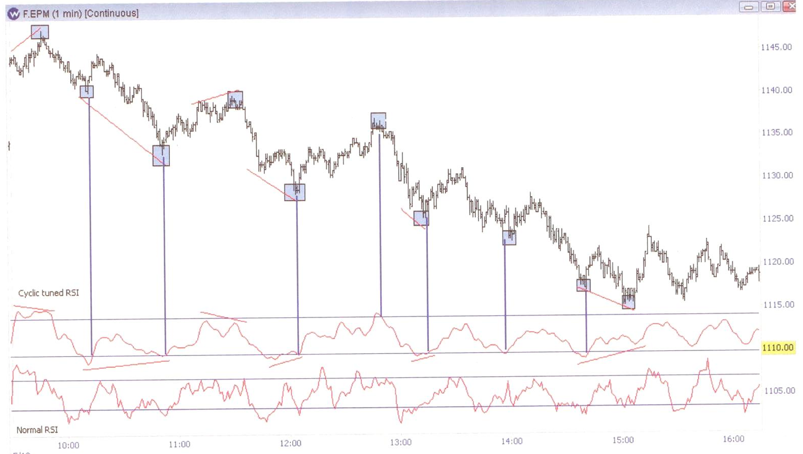

**Figure 4-6:** Comparison of both RSI versions / large chart

### 4.3 Trading the S&P 500 E-mini futures contract intraday — Example 2

To demonstrae that the fact that it worked was not only “good luck”, we will move on to the present as I am writing this and review whether this method would have also worked on the next tading day. To do so, we will use the standard procedure to fine-tune the technical indicators as presented in the previous chapter.

#### Step 1: Open chart and run cycle analyzer using (approx.) one day  of data history

We will use the same chart. To demonstrate that this method works on any time frame, we will switch to a 4-minute time frame. Hence, we will simply open the 4-minute chart for May  19 before trading starts using the data history of May 18 for analysis. We used the last trading day for our analysis engine. We ran the cycle analyzer with the following settings:

Starttime: 101005180934 (18 May / first bar on chart at 09:34)
Endtime: 201005181615 (18 May / last bar on chart at 16:15).

#### Step 2: Detect the Dominant Market Vibration

After applying the cycle analyzer with the time settings to the chart, we have to open the script log to look up the detailed analysis results. The script log looks as follows:


**Figure 4-7:** Cyclic analysis results for May 19

The Dominant Market Vibration has a length of 11 bars here. We will obtain this value before the trading starts on May 19. That is, we have crucial information ahead of time to fine-tune our indicators for the next trading day.

#### Step 3: Use the Market Vibration to fine-tune indicators

The setting for the cyclic fine-tuned indicator for the next day would be half the Dominant Market Vibration:

```text
11 / 2 = 5.5 -> 5
```

All we have to do is set up the RSI with a length setting of 5. Open the RSI and set the length to 5 and switch on the cyclic smoothing.

#### Performance review of  the cyclic fine-tuned RSI indicator

The following chart shows the trading day of May 19 including both indicators (i.e., the standard RSI and the RSI with a length of 5 and the switched-on cyclic smoothing). The trading signals for the break of the lower/upper indicator line are presented by small” arrows. The additional divergence signals are denoted by large arrows.


**Figure 4-8:** Trading signals of the cyclic fine-tuned RSI

The cyclic fine-tuned RSI identified 14 trading signals for May 19. Two of these 14 signals would not have been tradable, the sell signal around 12:15 p.m. and the sell signal around 12:40 pm. But all other signals would have been tradable. We thus arrive at a profitability score oF 85% for these signals.

You can compare these numbers to the signals from the standard RSI presented in the next chart. The standard RSI identified 8 trade signals (4 long, 4 short). But only two of them would have been tradable. The other signals would have produced losses and — more importantly ~ our confidence in this indicator would have vanished. I think that you would not take the fourth buy signal after having three “failed” buy signals. But let's stick to the numbers: 2 out of 8 signals implies a profitability of 25%.


**Figure 4-9:** Trading signals of the standard RSI

This is the second day the cyclic fine-tuned indicator was able to deliver tradable signals. And let's nor forget ~ the standard RSI was not able to deliver any reliable trading signals at all This is the standard situation which may apply every day, every week, and every month. You will have an edge on trading in the markets with the cyclic fine-tuned standard indicators!

| Indicator | Buy Signals | Sell Signals | Profitable Signals | Profitability |
| --- | --- | --- | --- | --- |
| Standard RSI | 4 | 4 | 2 | 25% |
| Cyclic fine-tuned RSI | 6 | 8 | 12 | 85% |

**Figure 4-10:** Profitability comparison of RSI and cyclic fine-tuned RSI

I chose the RSI for demonstration purposes only. But it works the same with all length parameter settings for the technical indicators. You can also fine-tune the stochastic or MACD with this information as well. Simply use half the value of the Dominant Market Vibration score.

### 4.4 Summary

The idea of fine-tuning technical indicators with the dominant cycle length is not new. As the new and reliable engine, the Cycle Scanner, can detect the Dominant Market Vibration, you are now able to apply this method to any chart and time frame. I recommend using approximately 1-3 days of intraday data history when using intraday charts. The method also works on daly charts. It is best to use around 1-2 years of data history to identify the best parameters for daily charts.

I have also included the RSI indicator with the cyclic smoothing engine. The indicator is named:

LvT_RSI_CycSmooth

You are now able to a) fine-tune your indicator(s) and b) smooth the signal even further. This method works with every technical indicator. But my research reveals that it works best with the RSI.

To fine-tune the RSI indicator, I recommend using half of the Dominant Market Vibration score (first score listed in the Cycle Scanner when sorted by cycle strength). You can also use The full number, but half of the Dominant Market Vibr: score works best. Furthermore, you have to look at the output and the second dominant vibration may also occasionally come into play. Just familiarize yourself with this method by replaying the examples shown here on your own.

Ideas and opportunities for further research using this method include:

- Cyclic fine-tuned channel indicators (Bollinger band, Kelener channel)
- Auto-adjust the length period at each new bar (not just every day)
- Breakout-system with cyclic length / speed adjustments.

## 5. Forecasting the next important market turn — Time, direction & polarity

Let’s move on to look at other ways of using the cyclic information we have for trading on the markets. In the previous chapter, I showed you how to fine-tune indicators by means of the Dominant Market Vibration score. However, the Dominant Market Vibration score can be used in different ways. One approach is to determine what the actual dominant cycle is at each new bar. When we know the wavelength of the given cycle, we can apply specific techniques to determine the actual phase of this cycle, The phase provides information on when to expect the next important high/low in the market.

I consider this a dynamic approach because it is characteristic of cycles for their phases and wavelengths to change continuously over time. That's also the reason why static cycle frameworks often fail when they are applied to financial markets. You can, of course, detect cycles based on past data, but when you apply this static information to the wavelength, amplitude, and phase of a cycle to build forecasts for a future time period, you do not take into account that the phase, amplitude, and wavelength of the identified cycle will vary over time (this effect is commonly paraphrased as: “Cycles appear and disappear”).

### 5.1 Introducing a new forecasting method based on the Dominant Market Vibration

I will now introduce a dynamic approach for building tradable forecasts. Every time a new bar appears, we will reassess the dominant cycle in terms of wavelength, amplitude, and phase offset. We will then plot this cycle in the future. However, we will only focus on the next expected turning point ~ that’s what we are interested in, We can call this eurning point ~ ETA ~ Expected Time of Arrival.

Then, as we move forward in time, every bar signifies an update on the next expected turning point. This dynamic forecast based on the Dominant Market Vibration provides information about the next turning point with regard to TIME and DIRECTION. We will get real-time information on when to expect the next major turning point in the marker. This information can be updated every time a new bar appears. That is, the ETA information is updated at every new bar.

Now the difference between many cycle researchers’ approach and mine should be evident. I do not apply a framework with static cycles and try to make the market fit into it. Often, you read about the significance of the 4-year cycle, the 50-week cycle, and the 7-year cycle and how these “static” cycles can be applied ro the actual market situation. That's not my approach here. I do not offer you a “static” cycle framework. I offer a dynamic model that determines which cycles are active ata given time.

I use this method in order to be “prepared” for important turning points in the market. I do not blindly trade these ETA points. But when used in combination with other tools or Fibonaccic levels, you will have very powerful set-ups to trade the market.

Charts can speak more than a thousand words. However, before we move on to review some real examples, let me introduce a few new indicators and tools.

### 5.2 Introduction of the Dynamic Cycle Explorer method

So far, we have arrived at a new method for detecting cycles in financial instruments. When we apply cycles to trading, we also need visual information about the presence of cycles in the given data, It does not suffice to focus on theoretical cycles alone. We need to isolate the current cycles with a detected wavelength from the available financial data. These cycles will not look like sine waves. The markets are not as clean as sine wave-like cycles. Cycles’ amplitudes, phases, and wavelengths change continuously over time. Hence, the detected cycle will look different from a theoretical sine wave structure. But we need visual information of the past to verify our “theoretical” cycle and the actual cyclic behavior of the financial instrument with this particular wavelength. We have to eliminate all cycles from the data that have higher and lower wavelengths than our cycle length. Ultimately, we only want to look at the behavior of the financial data in relation to our selected cycle length.

Now, we can plot the relevant information we have on the detected cycle length on top of each other:

- The isolated cyclic behavior of the price based on our wavelength;
- The theoretical cycle (sine wave plot) based on the detected phase and amplitude.

This information is very useful to analyze past price behavior. We now have the possib see the past phases and amplitude shifts of the cycle. We can build a “visual correlation” between the theoretical cycle and the cyclic price behavior.

#### 5.2.1 Plotting price cycles in financial markets — Visualization of price cycles

We firs need a method to isolate individual cycles from the price data. That is, we need to find a way to plot the cyclic behavior of the price data, nor the theoretical cycle. A way to filter out all the longer and shorter cycles.

A lot has been written about these techniques. I will not repeat all of the algorithms here. One very effective way of filtering out the longer and shorter cycles is to use a special sub-set of two centered moving averages. This method was first introduced by Brian J. Millard in his book “Channels & Cycles: A Tribute to J.M. Hurst. Ic is called “Average Minus Average” or “cycle highlighter”. His method of isolating cycles is far more superior to other techniques because it only requires one value to be specified, namely, the wavelength of the cycle that we want to isolate.

To apply this technique, a centered moving average with a length equal to the wavelength of the cycle to be isolated is set. A second centered moving average is then calculated with a length that is half of the first average. In the final step, the difference between these two averages is determined. If you are interested in more detailed information on how to use centered moving averages to extract cyclic information, I recommend reading Millard’s book.

Miillard’s technique is very useful for us because our new engine for cycle detection introduced in the previous chapter provided us with the value we need ~ the wavelength of the cycle.

We can use the given value for the detected Dominant Market Vibration as input for the cycle highlighter. We can now discern the cyclic behavior of the price for past data.

As is the case with centered averages, the difference between the two averages will expose a loss of points at the beginning and at the end of the plot. This technique thus does not help us build forecasts, But it does help us gain a visual understanding of the cycle and compare the detected cycle with the cyclic behavior of past data. Therefore, I will expand the cycle highlighter method and take the basic idea further. I will call this new approach “Dynamic Cycle Explorer”. This technique has a “built-in” cycle highlighter.

An important factor when using dominant cycles for forecasting is to compare the wavelength-isolated, past cyclic movement of price with the theoretical dominant cycle based on the information on the actual phase and amplicude.

When we build an overlay of all the information derived, we obtain a visual tool to detect past phase and amplitude shifts. This provides us information on how “reliable” or “stable” this cycle was in the past. We will also use this information to fine-tune our offset points (last low or high) for the cyclic analysis.

The following figure illustrates all elements of the Cycle Explorer technique. For demonstration purposes, I have used the example data from the first chapter. We know that the data included a cycle with a length of 30 calendar days. The date chosen for the actual analysis using this dataset was 1 April 2007.

This is what the Cycle Explorer will show you:


**Figure 5-1:** Elements of the Cycle Explorer tool

#### 5.2.2 Cycle Explorer - Interesting factors

**A.** Isolated price cycle (red line)

The red line is the extracted cyclic price behavior with a length of 30 calendar days. All other elements have been filtered out of the price data. The method used in this case is Brian J. Millard’s cycle highlighter.

**B.** Dominant cycle plot (dotted green line)

This includes a built-in mechanism to detect the actual offset and amplitude of the given 30 calendar day cycle. This offset is calculated on the basis of the last price information obtained. In this case the low offset is on 4 January 2007. We therefore know where the actual offset of the cycle is today. Using this information, the theoretical (sine wave like) cycle is plotted backwards as on overlay. We can now discern the relevant information: The real cyclic price behavior and the ideal cyclic movement for the given length of 30 calendar days.

**##### **C. Forecasted cycle**

According to the determined phase status of the 30 CD cycle, the cycle is projected and plotted in the future. Hence, you can spot future turning points of this ideal cycle.

**D.** Actual (detected dominant) cycle length

‘The length of the detected cycle is marked on the chart. You can see that it is the 30 CD ede. This length was automatically detected by the Cycle Explorer tool.

**E.** Difference of price and cycle amplitude

This is an important element that is visible: At each given cycle’s trough and crest, we can compare the ideal with the real amplitude of both plots. The difference in the amplitudes reveals whether this cycle length was present at the given time or not. You can thus observe the dynamic flow when cycles disappear (the amplitude falls to zero of the cyclic price movement) and when cycles are very active (the amplitude is the same as the ideal cycle amplitude).

This is the first indicator that is able to visually illustrate the points in time when a given cycle disappears or is present. This information is very useful at the current point in time (ie., today). You can thus check whether the amplitude of the cyclic price movement today is lower than the given ideal amplitude. In that case, the cycle is losing power. But if the amplitude is near the ideal cycle, then the cycle is real and present.

**F.** Difference of phase (high/low)

The other information we are able to obtain now is the deviation of past high/low offers between the cyclic price movements and the ideal cycle. We can determine whether the cyclic component based on the given wavelength is stable (ie., in sync) or not. To do so, we have co look at the last turning points of the ideal cycle. The closer the turning points of the isolated price cycle and the ideal cycle are, ie., the more in sync they are, the more reliable are the forecasted turning points with reference to information on time.

**G.** Loss of points

The algorithms used with centered moving averages for the cycle highlighter reveal a loss of points at the end of the plot. This amounts to half of the selected cycle length. We cannot see the real cyclic price movement for the last 15 calendar days on the chart in our example. For the purpose of forecasting, it is therefore very important to plot the theoretical cycle in the future with the actual phase offéet. You can see that the dotted green line is a smooth continuation of the red line.

We have used our sample cyclic data to demonstrate how this indicator works. The red line is obviously very close to the ideal green line since we have used theoretical cycles to build this model. The difference is attributable to the fact that trends and random noise information were added to the test data.

When you come across such a “match” between the cyclic price movement and the ideal cycle, there is a high probability that the projection on the right side of the chart will be useful for trading.

Let's see it in the example:

This would be our “ideal” forecast based on the 30 CD projection. It provides a closer look at the chart presented above.


**Figure 5-2:** Ideal 30 CD projection (example Dataset 3)

And this would be the outcome of this sample dataset:


**Figure 5-3:** Outcome of the 30 CD projection

In other words, if you have a “good match” for the identified cycle length between the isolated cyclic movement of the price and the ideal cycle, then the cycle projection will be of much value for the right side of the chart and for trading. Cycles can only be used in a predictive sense when they are going through a regular phase. That is what this example demonstrates.

Now, let's review another example with a cycle length that is not present in the data. For this, we will use the “Manual Cycle Explorer”. ‘The difference between the Dynamic and the Manual Cycle Explorer toolkit is that the dynamic engine automatically detects the Dominant Market Vibration. In the Manual Cycle Explorer, you have to manually set the cycle length you wish to review. Our example shows you how to “check” whether a static cycle frame will work for projection purposes or not. We will thus check whether a cycle length of 46 CD is present in the market. We have to manually enter the value 46 into the Manual Cycle Explorer tool (note: This cycle is not present according to the sample dataset introduced in the first chapter).

The Manual Cycle Explorer delivers the following figure:


**Figure 5-4:** Manual Cycle Explorer example

The important information is indicated in the chart. It is clearly visible that the ideal 46 CD cycle and the isolated cyclic price movement of the same length are not in sync. Neither the phase (high/low of both lines), nor the amplitude have a high correlation. As already mentioned above, these results indicate that we should not use this type of cycle for forecasting! However, if you do not have the possibility to review past data for a given cycle up to the present, you cannot check whether a cycle is actually valid or not. You can only blindly “rely” on newsletters and pray that they are right. Yet now you have a powerful tool that will help you analyze predictive information on different current cycles.

In our example, we knew by a visual check alone that we would not use this cycle length for trading. But let's review the complete example. The forecasted market turning points based on this cycle are marked with arrows in the charts.

The next chart displays the result if we had used this cycle for trading:


**Figure 5-5:** Review of 46 CD cycle

No information of this cycle would have been tradable at all. Now you can clearly see it: If you do not have a match in the past data, do not use the projection of the given cycle!

These examples serve to show how important information on the status of various cycles can be determined using market data. Through this means we can determine whether a particular cycle is going through a regular phase, namely, when its contribution to the overall movement can be estimated. We are also able co identify those cycles that go through a disordered phase based on price movement. You can now sort out the cycles that can be used for forecasting and those that should not.

#### 5.2.3 The "dynamic" component of the Cycle Explorer

Cycle Explorer is a combination of three crucial tools:

1. The plot of the isolated cyclic price movement.
2. The plot of the “ideal” cycle according to the actual phase and amplitude in the past.
3. The projection of the “ideal” cycle according to the actual phase and amplicude in the future

But this new tool has an additional built-in feature:

The automatic detection engine for the actual dominant cycle. This implies that you do not have to enter the wavelength that you want to examine using the Cycle Explorer. The wavelength is automatically detected through our powerful new algorithm introduced in the previous chapters, Simply select an important turning point in the past asthe starting point for the automatic cycle analysis. Subsequently, the tool will appear on the chart automatically presenting all relevant information mentioned above.

And che best is that a new calculation is done at every new bar. In other words, no “static” cycle is being used here. The actual dominant cycle is ascertained at every new bar. The Cycle Explorer Indicator is updated every time a new bar appears. You can apply this technique to any time frame.


You now have the new Dynamic Cycle Explorer toolkit at your fingertips. It is ready to be applied to your favorite financial instrument. If you want to check static cycles, you can also use the manual version of the indicator. Simply enter the cycle length you want to explore and its suitability will appear on the chart.

I will demonstrate how to build tradable forecasts built solely on this powerful new indicator in the next chapter.

### 5.3. Using the Cycle Explorer as a quality check for static cycle frameworks

Even if you do not plan to use this method, the Cycle Explorer is of much value when dealing with static cycle frameworks. Hence, if you read in the cycle newsletter that “the 50-week cycle is about co bottom now”, enter a weekly chart, set up the Manual Cycle Explorer with a length of 50 weeks and compare the actual cyclic price data for this length with the “ideal” cycle.

Now you have acquired the knowledge of how to “check” whether this information is reliable for usage on the right side of the chart where your trading takes place. You can perform a quality check for any given static cycle on your own. The Cycle Explorer will display the past phase and amplitude shifts of this cycle. You can review on your own whether any given cycle is active, whether it is in sync with the market or whether it has disappeared.

You now have a technical indicator to check the amount of actual cycle expansions or contractions at every new bar: Cycles continuously expand and contract from their original wavelength. This is what often causes “static” cycles approaches to fail. However, now you can measure the “flow” of the cycle. It was Walter Bressert who first proposed that trying to trade based on the idea that something must happen in a fixed interval of time (static cycle) was unrealistic. The Cycle Explorer builds on this idea and has developed it into a visual indicator for the first time to be put into ‘trading practice’.

This tool can also be used to check the information included in many cycle newsletters on static cycle frameworks of a given length.

### 5.4 The Cycle Explorer as a visual confirmation tool

Perhaps the following question comes to mind:

> “Why do we need the Dynamic Cycle Explorer when the algorithm presented in the first chapters is already able to detect the most dominant cycle?”

You have a point. If the algorithm is superior to others, we do not need this visual tool. But even I do not trust my own engine that delivers me information on the current Dominant Market Vibration. I know that the algorithm works. But putting money on the line is also a “brain game”. I need some visual confirmation that I can see with my own two eyes! The Cycle Scanner engine is thus a “left brain” tool. It involves proprietary digital signal processing, The visual plotting engine of the Cycle Explorer is a “right brain” tool. If I can actually see the correlation of the cyclic price movement and the ideal cycle of the given dominant cycle, my brain sends me a “green light” to put my money on the line.

That's very important. Most cycle research only presents ideas on how co build forecasts. wanted a visual confirmation tool that reveals the suitability of the cycles by simply looking at them.

When the Cycle Explorer picture on the left side of the chart presents a well-matched cycle, I can use the given projection on the right side of the chart to trade real money.

### 5.5 Building a forecast based on the Dynamic Cycle Explorer

I will now provide some examples on how to use this concept that has guided me over the last year. Again, my approach does not involve cherry picking or curve fitting. These examples have been posted in real-time to a small trusted cycles’ group. If any reader is still skeptical after reading my book, I will gladly prove that these examples were posted in real-time.

This book will, for the first time, present the technique I have applied to produce these charts and forecasts. After reading this book, you will also be able to use this technique. I am disclosing all relevant information and introducing all necessary tools in this book and am handling them over to you. Treat this newly acquired knowledge with the appropriate respect — if inappropriately used, this tool/script could be ineffectual. If dealt with appropriately, it will be crucial for unlocking the power of cycles for financial markets.

As we have seen in the introductory chapter on the cycle detection engine, there is always more than one cycle active in the market. I will now introduce a forecasting method for building forecasts with two dominant cycles. This model incorporates the idea that we have to watch long-term and short-term cycles, which have to be jointly considered. Consequently, we will monitor the dominant cycle for a short-term time frame as well as that for a long-term time frame.

All we need to do is set up our Dynamic Cycle Explorer which extracts the dominant cycle for a given window. We will use these two sets of windows to determine our dominant cycles:

- Window for short-term dominant cycle:
  Wavelength range between 20 — 100 bars
- Window for long-term dominant cycle:
  Wavelength range between 100 ~ 200 bars.

If you are working with daily charts, I recommend using calendar days for the cyclic analysis of daily charts, not trading days. The primary influence on daily charts originates from external forces (such as astrological cycles) and these forces don’t stop on weekends when no trading takes place.

### 5.6 A step-by-step guide to building a tradable forecast model / Daily S&P Index

We will start with this example, which occurred shortly before the major market low in February 2009. Let's see whether we would have been able to forecast the major low in March 2009 with our forecasting technique.

Actual Date: 25 February 2009.

#### Step 1: Detect and project the dominant short-term cycle

Use the Dynamic Cycle Explorer tool to determine the dominant short-term cycle. It can be
found in the WaveS9 software's menu option “Technical” as a new indicator.


**A.** Set the Dynamic Cycle Range Filter (Min, / Max.)

Set the cycle length range you would like to monitor when opening the script in the input parameter. For example, on a daily chart monitor the dominant short-term cycle using a range of 20 to 100.


After you have set the parameter, set the look-back period's starting point as a hot spot on the chart using the mouse. The range is needed because the embedded Cycle Scanner engine will automatically identify the most active cycle within this particular range.

**B.** Enter start anchor in the chart using hotspot

The tart anchor is used to identify the dominant cycle period by means of proprietary Fourier analysis routines from the actual data point (last bar on the chart) back to the anchor point. This determines the amount of data history to be used for cycle detection. If you would like to identify longer-term cycles, you should use a longer period of data history. Accordingly, if you wany to detect shorter-term cycles, you can use a shorter time frame.

Dominant cycle detection works better if you use major markets’ lows or highs as the anchor point.

Take a look at the correlation between the red and green-dotted plot. If you have a good match between both, then you can rest assured that the dominant cycle identified (dotted sine wave cycle) isin sync with the actual cyclic market behavior (red line).

Using the tow truck tool, you may adjust/move the actual anchor point to fine-tune it at a later point and to get a “good match” of the red and dotted cycles.

We will use the major low of 15 July 2008 as our starting point here. This is the fixed point for our look-back period for the cycle analysis: 15 July 2008 to 25 February 2009. It is acceptable co use 7-8 months of data for cycles up to a length of 80/100 days. We thus have an important low and sufficient data for the detection of algorithms.

Below is the example for the selected period of 20-100 calendar days on the daily S&P 500 with the anchor point set to 15 July 2008. The algorithm automatically identifies the most active cycle length between 20 and 100 days. The algorithm also checks the actual phase and amplitude settings. The identified cycle will be plotted on the chart as an indicator with a dotted line, The given cycle length is also extracted based on the current price and plotted as a solid line. We are thus able to compare the cyclic price behavior of the given length with the theoretical cycle.


**Figure 5-6:** Short-term dominant cycle

**C.** Check suitability of detected dominant cycle refarding the cyclic price movement

You can only follow the dominant cycle if there is a good match between the cyclic behavior of the price data (solid red indicator) and the sine wave cycle (dotted green line). Therefore, we have to visually check the final turning points of the theoretical cycle (dotced green line) and the real price behavior aligned with the detected wavelength (red line).


**Figure 5-7:** Check suitability of detected cycle and price behavior

The anchor point of a market low used here has identified a dominant cycle that has eight perfect turning points in the last four cycles. Only point 7 was off. This example demonstrates that this cycle was truly active in the past on the price movement.

**D.** Move the anchor hotspot point using the tow truck tool (fine-tuning)

You can only follow the dominant cycle if you have a good match between the cyclic behavior of the price data (red indicator) and the sine wave cycle (dotted). You can therefore conduct some visual fine-tuning. Move the anchor hotspot slightly to the left/right and, while doing so, look at the indicator. You will be able to see the results on the indicator by using the drag'n drop function with your mouse. You can thereby visually fine-tune the best anchor point to obtain the best match between the red and dotted past cycle information.

This is attributable to the fact that the visually selected low/high of the anchor point is not neccesarily the actual cycle low/high. To check this, we only have to slightly move the hotspot to the left and to the right to see whether a better match between the red and the dotted green line is atainable.


**Figure 5-8:** Move cyclic offset until best fit becomes visible

**E.** Check script log for additional information

If you have set the parameter “printlog” to true, any information on the identified dominant cycle will be printed there. In our case, we have a dominant short-term cycle with a wavelength of 46 bars (calendar days). We do not need this information for our trading forecast here. This number is for information purposes only.

```text
Dynamic Cycle Explorer
Dominant Cycle Length: 46
Actual lookback period in bars: 223
```

**F.** Use cycle for projection

You can now use the cycle information to project future market behavior based on the short-term dominant cycle. It projects an upcoming low at the beginning of March.

However, I do not recommend only using short-term dominant cycles for forecasting. The best forecasts — according to my research ~ are based on one dominant long-term cycle and one short-term cycle to better fine-tune the important turning points. Let's therefore add the projection of the dominant long-term cycle to our model as well.

#### Step 2: Identify and project the dominant long-term cycle

**G.** Set up additional Cycle Explorer

In this example, an additional Cycle Explorer has been added to monitor a long-term dominant cycle of 100 to 200 cycle length (input parameter).


**Figure:** Input parameter Range for long-term dominant cycle detection

Repeat the same steps from A to D as described above.

The hotspot will be set further in the past, because a longer cycle requires more data history for the routines to be able to detect the given cycle. Therefore, a major market high in 2007 was used (11 October 2007)


**Figure 5-9:** ETA forecast for the next major turning point

Now we can see both dominant cycles on one chart. Again, the visual check of the longer-term dominant cycle reveals that we have a good match between the ideal cycle and the cyclic price movement (red and green dotted lines). We can see that this will be achieved around the beginning of March. Both cycles project a future low at this point in time. These cycles are plotted separately, but are both included and added together in the price data. You can expect major turning points in the market when both dominant cycles forecast a low/high on the same date.

I call these situations “Estimated Time of Arrival” (ETA). It’s similar to the navigation system in your car. The system provides you information on what time you can expect to artive ata given point. Likewise, this technique gives us information about when (with reference to time and direction ~ not price) we will arrive at the next important market turn,

‘We would be alarmed about a market low at the beginning of March 2009 when looking at this picture. But bear in mind: We did not select a fixed cycle framework with known cycle lengths. We only selected important highs/lows and entered a random range to look for dominant cycles. The detection of the dominant cycles was conducted completely automatic.


**Figure 5-10:** Full chart view of ETA projection based on cycles

You can sce that we also have six good fitting curning points between the sine wave cycle and the market price behavior for this long-term length.

The turning points according to the detected cycles are marked in the chart with red and green arrows. We can thus see that these cycles have a high correlation with all major turning points over the last year.

#### Step 3: Project the next major turning point

Now we will apply the cyclic information derived from the dominant long- and short-term cycles to build our own projections. Both cycles point toward a low at the beginning of March ‘And both cycles will climb until the end of March. Crucial turning points will arise when the short and long-term dominant projections are in alignment, i.e., when both cycles reach a low at the same point in time, there is a high probability that the market will also hit a low.

So, we will be notified on February 25 with the S&P 500 at 773 that the long downtrend will possibly come co an end at the beginning of March. We should take a close look at other indicators during the next weeks to fine-tune the close of short positions and to get ready to go long in the marker.

Now we have built our first projection for the next Estimated Time of Arrival (ETA), the next major curning point based on two dominant cycles. The main point here is that the tools used have been able to identify the dominant cycles completely automatically ~ there is no need to apply a static framework to cycles on the chart. There is no need to pore over the chart for hours to detect these cycles. It’s all done for you if you enter the cycle range and select the lst important high/low.

One of my main goals was to code all these cycle factors with a high usability for trading purposes. From the viewpoint of a trader, this can be accomplished in minutes.

Ok, let's go ahead and see what happened at the beginning of March 2009.

### 5.7. Updating the forecast after the projected turning point / Polarity forecast

We will move forward in time to March 26.

We will use the same chart with the same indicators, ie., we will not change any parameter of the indicators. This particular date is interesting, because we are now able to see that we had a solid low ~ as projected ~ at the beginning of March. The next question is how the market will develop.

We will apply the same method. And I will introduce another forecasting method based on the the dominant cycles: A polarity forecast.

First, we wlll check when both cycles will reach the next alignment of their highs/lows. This is the case atthe beginning of May. Our next important ETA point will thus be May 10. This event is marked on the chart with a red arrow.

However, there is much more information we are able co use for predictive trading purposes. We do not only want to forecast important dates/times. We also want to forecast periods with a high probability in terms of trend. Will the market move up, down or sideways? I refer to the predictive information as the cycle’s polarity forecast. With this information, we can forecast periods of uptrends, downtrends, and sideways markets. This information will also be of much value for trading.

It is quite easy to build a polarity forecast when you have two active dominant cycles on the chart:

| Cycle Momentum | Expected Trend | Polarity |
| --- | --- | --- |
| Both cycles are movingin alignment UP | Uptrend | POSITIVE GREEN |
| Both cycles are movingin alignment DOWN | Downtrend | NEGATIVE RED |
| One cycle is moving up / the other is moving down | No trend sideways | YELLOW |

The following chart displays both types of information. The forecasted periods are highlighted with the polarity value in accordance with the introduced method. And the next ETA is also dispayed on the chart.


**Figure 5-11:** ETA & polarity forecast on March 26

This forecast provides us with the following information for trading:

- Expect a sideways/neutral market from now until mid-April;
- Expect an uptrend thereafter from mid-April until che beginning of May (around May 10);
- Afier May 10, expect the market to decline

At the next forecasted turning point would be May 10, let's move forward in time. The next
presents the result of this trading forecast.


**Figure 5-12:** Polarity review on May 10

Let's review our polarity forecast:

We had a solid sideways to slightly upward-moving market until mid-April. Precisely as projected. After this period, the market moved toward its next important turning point, the projected ETA — May 10. Will the market enter a downtrend now? That's the central question. Our polarity forecast was on the money and provided us with solid information on position and intraday-trading (you can use the daily polarity projection as a filter to only allow trading signals on intraday charts with reference to the daily polarity.) The updated cycle proection with both indicators on the chart is in alignment with our forecast performed on March 26: Both cycles reveal that the high has been reached at this point in time.

Our polarity forecast proved accurate ~ now let’s close our long position and open a short one (as shown by the ETA projection). And let's build/update our next polarity forecast based on the actual state of the dominant cycles.

### 5.8 Updating the polarity forecast and the next ETA CIT projection

The next chart displays upcoming expectations:


**Figure 5-13:** ETA & polarity review on May 10

We expect a down trending market with a sideways time window around the beginning of June. The downtrend should come to an end at the beginning of July. The polarity areas areagain marked on the chart based on the method presented above.

Let's quickly move on in time to the beginning of July.

### 5.9 Review of polarity and ETA and updating the next forecast

Firse, let's start with a review. Again, the polarity forecast guided us accurately from out last forecast built on May 10 up to now, July 8 (see Figure 5-14, page 95). We have moved down to our projected Estimated Time of Arrival (ETA) during the next important market low. The next ETA forecast reveals a market high somewhere in October. Hence, we are prepared now to look for an expected long upward trend in the market. I would recommend using technical indicators based on price to move into the market for a long trade. Trade the price ~ not the forecast.


**Figure 5-14:** Polarity review and ETA forecast on July 8

### 5.10 Complete review of all forecasted CIT dates and polarity windows

These examples have shown us the estimated position of the dominant cycles in the past and present. The underlying purpose of this example in terms of extracting dominant cycles is to predict how the combined data will develop in the near future. I have introduced a simple forecasting method on how to project the expected point in time for the next major market high or low. In addition, I have shown you how to predict trending phases of the market.

This is real example based on my trading last year. And this is the first time I am opening up my “books” to explain my approach in detail. This is the first time I will hand over the complete indicator set required for you to do this on your own.

The next chart presents all projections in one chart. The predicted polarity areas are highlighted in their respective color. The predicted ETA points are marked with arrows on the chart. Keep in mind that all CIT dates and color coded areas have been projected in advance.

Why don’t you review this trading method on your own. You will quickly understand the significance of identifying the dominant cycles.

Now we can start to connect the dots between the different chapters. Because the forecasted neutral polarity areas are the time-windows during which standard technical indicators work best on intraday charts! Hence, you will know in advance when to use technical indicators for trading intraday charts. The yellow areas are the times when I would recommend using the method presented in Chapter 4 (fine-tuning of indicators). Now you can see how it all comes together to represent a complete trading approach.


**Figure 5-15:** Complete Review of all ETA and polarity forecasts

### 5.11 Combining a semi-static and purely dynamic forecasting model for trading

In previous chapter has introduced a quasi semi-static forecasting technique based on two dominant cycles. I call it ‘semi-static’ because it involves the building of a forecast that will be static over the next month(s) until the next important ETA point arises. We will update the forecast when the predicted ETA point arises. Accordingly, the forecast is static from ETA to ETA. It is semi-static because we update the projection at each ETA point with a new current cycle evaluation in terms of phase and wavelength.

The next method combines the presented semi-static technique with a purely dynamic model. The dynamic model is again quite simple. Instead of waiting until the projected ETA arises, we will update the forecast at every new bar. We can do this because the calculations will be performed automatically.

There is a beneficial advantage to combining both methods. First, we will obtain a projection of the next ETA from the static projection. We will mark this ETA in the chart with a fixed line at the ideal cycle’s next given high/low. We will also gain an understanding of the timeline ahead.

Next, we will update this cycle projection at each new bar. The Dynamic Cycle Explorer will adjust the projection in accordance with the dominant cycle’s actual phase status. We also take into account that a cycle will not be static over time and that the phase and wavelength will vary. We accept this fact not only by following the static projection, we will identify the dominant cycle’s actual phase and wavelength shifts and arrive at a new projection at the dominant cycle’s next important turning point. We can then compare the last static projection (red line in the chart) with the actual updated projection including the ideal cycle’s revised plot. We can now “see” the cycle’s phase and wavelength shifts. And instead of following a static cycle framework, we can follow the dynamic flow of the cycle. In other words, our semi- static method gives us an Estimated Time of Arrival. And in addition, thanks to our Dynamic Cycle Explorer, we receive an update of the ETA at every new bar.

This is the method that was used in the preview video on the web page. I called this preview "The Magic Time Cycle". It is the Dynamic Cycle Explorer in action. In this example, I have removed the isolation of the cyclic price behavior represented by the red line. In the video, the Dynamic Cycle Explorer only plots the green ideal cycle. You have probably realized now that this indicator has even more capabilities. But I did not want to reveal it all in the preview videos. You can rebuild the video example with the Dynamic Cycle Explorer.

Using this combined technique, we have been able to identify the following turning points in the market ahead of time.


**Figure 5-16:** The Dynamic Cycle Explorer in action — The “Magic Time Cycle” (video)

Please watch the included video when you get to this example. If you want to rebuild this example for training purposes, use the following settings:

1. Open a daily chart of the S&P 500 Index (X.SPX) set to calendar days;
2. Switch to training mode and set the start bar to October 7, 2008.
   a. Attach the Dynamic Cycle Explorer to the chart with the following settings
      min_length = 100
   b. max_length = 200
      plot_cyclicprice = false
3. Anchor the starting point for analysis to the October high of 2007.

(*To reconstruct the approach, follow the steps as shown in the video*).

1. Mark the next ideal cycle high/low with a red line on a chart (fixed ETA forecast).
2. Move ahead in time by pressing “space”.
3. Follow the updated cycle projection of the Dynamic Cycle Explorer. The Cyde Explorer checks the actual wavelength, phase, and amplitude at each new bar and updates the plot.
4. Pay close attention to incidents when the updated or static forecast arrives at the forecasted high or low. Whatever comes first.
5. Please use additional technical indicators to time your trade entries and exits when using this technique for trading. Do nor trade the forecast ~ trade the price!

### 5.12 The combined semi-static and dynamic trading approach in action on the S&P 500

The following example illustrates the usage of the Dominant Cycle Explorer in real trading. I will review the last two years of trading and will show you how the Cycle Explorer was able to predict every major turning point ahead of time.

We begin wth our analysis on October 7, 2008. There has been a severe plunge in the market over the last few days. It is an interesting point in time to “turn” on our Cycle Explorer and check whether we can get an idea of when this downturn will come to an end. We will use the long-term market high of October 12, 2007 as the Cycle Explorer's anchor/starting point, as well as a calendar day chart.

This is the situation on Qctober 7, 2008:

- The blue dot indicates the actual day (last bar on chart).
- The blue line is manually drawn and is a fixed visual indication for the next expected time window of an expected high/low based on the predicted ideal cycle crest/trough.


**Figure 5-17:** October 2008: Next low around the end of October

The Cycle Explorer reveals that there still is room for the market to move even lower throughout the next week. The next market low is expected around the end of October.

Let's fast forward to the end of October now:


**Figure 5-18:** October 28 -> Next high around the end of 2008/beginning of 2009

From October 7 to October 28, the market dropped another 200 index points as predicted be the Dominant Cycle Explorer. We can now see the low on the dominant cycle precisely within the time window forecasted on October 7. So this is a good time to close the short and entera long trade. The next market high is expected around the end of 2008 or the beginning of 2009, as indicated by the actual dominant cycle plot.

Again, let’s see whar happened around that time window.


**Figure 5-19:** January 6, 2009 -> Next low around the beginning of March

We moved forward to the point at which the Dynamic Cycle Explorer reached the cycle high. The updated cycle high arrived precisely within the predicted time frame around the beginning of 2009 — on January 6, 2009.

The market climbed from 849 to 935 points, a jump of around +10%. We can now book the long profit, close the long trade and open a short position.

The next market low is expected around the beginning of March. This is indicated on January 6 by the next ideal dominant cycle low plotted at the beginning of March. Please keep in mind that the indicator setting was not touched or changed a all.

Consequently, we will go short and move forward in time until the Dynamic Cycle Explorer arrives at the cycle low in real-time.


**Figure 5-20:** March 12 -> Next high around the beginning of May

This is where we are on March 12, with the actual cycle low illustrated by the blue dot of the updated dominant cycle. Again, precisely as expected within the time window that vas predicted on January 6 - indicated by the blue line.

The market moved down 184 points (from 935 to 751 points). With a down move of around 19%, we are now able to close the short trade with a gainful profit according to the dominant cycle prediction. We will now establish a long position.

The next expected market high is expected around the beginning of May. This time windows indicated on the chart by the blue line. This is our time window of interest.

Again, the indicator settings are still the same. The algorithm adapts itself to the Dominant Market Vibration at each new bar. That’s what makes it so special. You don’t have to bother with cycle analysis and a lot of tools. It’s all done by the Dominant Cycle Explorer. This is where cycle trading really becomes straightforward.

Let’s move to the next dominant cycle high on the indicator.


**Figure 5-21:** May 8 -> Next low expected around mid-July

The Cycle Explorer detected the dominant cycle high on May 8 at the beginning of the forecasted time window (keep in mind: The blue line was fixed on the chart after the forecast was done to indicate the expected time window for the next turn, The ideal cycle plot - indicated by the dotted green line - can change after each new bar to specify where we are in the actual ideal dominant cycle).

The market gained 156 points during this time which again corresponds with a profit of 20%. The dominant cycle delivered yet another profitable trade and suggests closing the long postion here and establishing a short one.

The next expected market low is projected for the beginning of July. We have to watch the marker closely when we reach this point in time. We will move forward in time until the Dynamic Cycle Explorer arrives at the next dominant cycle low.


**Figure 5-22:** July 15 -> Next high expected around the end of September

On July 15, we arrived at the cycle low within the expected time window. The market moved down, but we have not been able to determine the precise high and low using the dominant cycle. That's a common situation. Don’t expect the dominant cycle to detect the exact turns, The dominant cycle offers high probability in terms of depicting the time window of the next important change in trend.

The market moved up from 907 on May 8 to 933 points on July 15. So we have to cover our short trade here with a loss of 26 points.

As the Dominant Cycle Explorer shows, the next market high is expected around the end of September. We will therefore establish a long position now and move forward until we artve at the next dominant cycle high.


**Figure 5-23:** September 15 -> Next market low around the beginning of November

We reach the actual dominant cycle high on September 15 as indicated by the blue dot on the updated dominant cycle indicator plot. The high lies within the expected fixed time frame forecasted two months ago.

The market moved up from 933 to 1051 points — a gain of 118 points or 12%. Hence, we close or long trade with a profit here and switch to a short position.

The time window for the next expected low is forecasted for the beginning of November, indicated by the dominant cycle low during this time. The occurrence is again marked on the chart by a fixed blue line.

That is, the next two months are still ahead of us and we will move forward until the Dominant Cycle Explorer signals a cycle low.


**Figure 5-24:** November 3 -> Next high at the beginning of January 2010

The Cycle Explorer denotes a cyclic low on November 3 as illustrated by the actual blue dot and cycle projection. This again lies precisely within the predicted time window of the September 15 forecast.

The market primarily moved sideways from 1053 to 1043 points during this period. As we have been short selling the market, we can book a profit of 10 points here.

The next move should be an upward trend until the beginning of January 2010. This is the next anticipated time window within which we expect the next important market top.

We will switch our short to a long position now and move forward until the Cycle Explore reaches the next dominant cycle high.


**Figure 5-25:** January 13 -> Next low around the beginning of March

The Cyele Explorer reaches the next cycle high on January 13 within the predicted time frame resulting from the analysis of November 3.

The S&P 500 index moved up from 1043 to 1136 points with a profit of 93 points or 9%. We would close our long trade here and expect the next move to drive the S&P down with the dominant cycle pointing downward at the beginning of March.

To reiterate, the indicator settings have not been changed at all. The anchor point is still the high of October 2007 and the range is still between 100 and 200 days for the Cycle Explorer to detect the dominant cycle.

In other words, you don’t have to spend hours analyzing different cycles and you don’t have to try to squeeze the market into a static cycle framework. The Cycle Explorer does this for you at every new bar. You only have to enter important points ~ the anchor date and the range to look for.


**Figure 5-26:** February 22 - Next high around the end of April

Now the dynamic phase adjustment of the indicator is visible. We have an interesting situation here because the wavelength of the dominant cycle shifted. On February 22, the Dynamic Cycle Explorer indicated the actual cycle low as demonstrated by the blue dot on the cycle projection.

In this particular case, the low comes before our expected time window which starts atthe beginning of March. The Cycle Explorer signifies that it has detected a bigger shift in the dominant cycle. The dynamic phase adjustment also took place earlier ~ but it can now be clearly seen on the chart. The price has already moved up, which confirms that the cycle low has been reached.

We will follow the current updated cycle forecast. This means that we will close our short trade here, The S8-P 500 lost 28 points, down from 1136 to 1108 points, implying that we booked a small profit of 28 points during this period.

We will now switch to a long position and expect the next important market top at the end of April. This time window is again marked with the blue line on the chart.


**Figure 5-27:** April 15 -> Next low around the beginning of June

The Cycle Explorer points to April 15 as the next dominant cycle high. As indicated by the blue line on the chart, again within the predicted time window from our analysis on February 22. You have two indications here — the projection and the actual situation — which are in alignment with the cycle high. The prediction gave a time window — the Cycle Explorer's actual updates present the exact same situation on April 15.

The S&P Index moved up from 1108 to 1211 points, a gain of 103 points or +9%. According to our rules, we will close our long position here with a profit of over 100 index points and switch to a short position.

The next expected time window for the market to bottom is the first half of June. So we will move forward to see what the Dominant Cycle Explorer will tell us.


**Figure 5-28:** June 9 -> Next high at the beginning of August

The indicator shows the next dominant cycle low on June 9 as represented by the blue dot on the ideal cycle trough. Again this occurs as expected within the time window forecasted in April.

The index lost 149 index points from 1211 to 1062 points, which equals a loss of 12%, However, as we have been shore during this period, we can book the profit now. As the updated Dominant Cycle Explorer indicates, we would expect an upturn from now until the beginning of August. That means that we will now enter a long position.

The next important time window is again marked on the chart with the blue line. We will be watching the market closely during this period.

As usual, let’s move forward bar-by-bar until the Cycle Explorer arrives at the updated ide cycle top in real-time.


**Figure 5-29:** August 11 -> Actual market high

The next occurrence arrives on August 11. The Dominant Cycle Indicator shows the arrival at the dominant cycle crest illustrated by the blue dot on the ideal cycle plot. Again, it is not Surprising thar this occurs within the predicted time window.

The market moved up from 1062 to 1124 points with a gain of 62 points. We can close our last long position with this profit and switch to a short position. We will follow the path of the dominant cycle with a short position now. The next expected move is a down move.

This chart was inserted after I finished the book to prove that these methods still work today. I don's have to search for a situation back in time where this tool worked. And I don’t have to choose a specific time frame within which it worked. I showed you that this tool worked Without any interruption over a period of two complete years.

Today is August 20 and the S&P Index is 1072. The high indicated was again correct with an actual profic of 52 points.

The final chart displays the indicated market turns. These signals have come in ahead of time via the ideal cycle top/bottom prediction and have been confirmed in real-time by the updated dominant cycle plot at each new bar. And throughout the entire period, the indicator setting was not modified. The anchor point was fixed on the market high in October 2007 and the setting was the detection of the dominant cycle between a range of 100 and 200 bars/calendar days.


**Figure 5-30:** Signals over the last two years

As you can see, it was not a static cycle or cycle framework that delivered this outcome. It was the adaptive characteristic of the Cycle Explorer that was able to detect and adapt to the actual market vibration. The result was a highly accurate forecast of the next market turn in terms of time and direction. The dynamic update of the next important cycle crest or trough at each new bar indicated the precise position.

You would have been able to follow this path alone by looking at the chart based on this cydie approach. Ic is fitted and coded into an easy-to-use technical indicator.

The following table summarizes the last two years of using this indicator as described in this chapter.

| Date | Cycle Indicator | S&P 500 Index | Profit / Loss | Total Profit Cycle Swing |
| --- | --- | --- | --- | --- |
| 10/27/2008 | -- stare | 1057 | - | - |
| 10/28/2008 | LOW | 849 | 208 | 208 |
| 1/6/2009 | HIGH | 935 | 86 | 294 |
| 3/12/2009 | LOW | 751 | 184 | 478 |
| 5/8/2009 | HIGH | 907 | 156 | 634 |
| 7/15/2009 | LOW | 933 | -26 | 608 |
| 9/15/2009 | HIGH | 1053 | 120 | 728 |
| 11/3/2009 | LOW | 1043 | 10 | 738 |
| 1/13/2010 | HIGH | 1136 | 93 | 831 |
| 2/22/2010 | LOW | 1108 | 28 | 859 |
| 4/15/2010 | HIGH | 1211 | 103 | 962 |
| 6/9/2010 | LOW | 1062 | 149 | 1111 |
| 8/11/2010 | HIGH | 1024 | 62 | 1173 |
| 8/20/2010 | -- end/ TODAY | 1072 | 52 | 1225 |

Total absolute profit: D&P 15 Swings 1225

**Figure 5-31:** Summary of Cycle Explorer signals

The table presents the impressive results in absolute numbers as illustrated in the charts. There have been 13 trades in total. Only one of these 13 trades was a loss. This gives us an accuracy rate of 92% over the last two years. This simple study gained a total of 1225 index points, which equals a profit of over 100% compared to the index start at 1057 points. The simple buy and hold strategy for the respective index would have resulted in a profit of 15 points (1.4%).

The numbers speak for themselves. Bear in mind that all this cycle analysis was carried out by the indicator itself. You could have read thousands of cycle newsletters during this two-year petiod which would have driven you crazy with all the possible outcomes.

You have probably realized by now that this indicator is a straightforward tool for trading. The mathematics and digital signal processing behind it is not. But that’s of no relevance for usage in the trading arena.

This method works on all time frames and data series. You can use it on intraday as well as on weekly charts. All you have to do is carefully select the anchor point, the range, and the senstivty of the statistical test that has to be passed (Bartels score). Play around a little with this new weapon to familiarize yourself with it and treat it with respect.

### 5.13 Measuring and trading dominant sentiment cycles

A popular measure of the market sentiment for the S8cP 500 Index is the Chicago Board Options Exchange Volatility Index (Ticker Symbol: VIX). It is often referred to as the fear index.

The VIX measures volatility and has an inverse relationship to the stock market. The more the VIX increases in value, the more panic there is in the market. The more VIX decreases in value, the more complacency there is in the market.

As a measure of complacency and panic, the VIX index is often used as a contrarian indicator, Extremely low VIX readings indicate a high degree of complacency and are generally regarded as bearish. Conversely, extremely high VIX readings indicate a high degree or anxiety or even panic and are regarded as bullish.

It would be useful to detect the cycles of trader sentiment. Because emotions swing from panic selling to over-confident buying in the form of cycles, sentiment indicators are a useful vehide to transfer our cycle’s toolkit to. If we are able to predict the expected sentiment highs or lows with our cycle analysis approach, we can use this leading information for trading purposes.

Let's use the conditions on February 20, 2009 for our example.


**Figure 5-32: S&P 590 on February 20 - Where is the low?**

The market fell hard at the beginning of the year 2009. This would be an interesting point in time to see what the sentiment cycles would tell us here. Will the market decline further or is this pethaps already the low? This was a hot question around this time. So let's see what the sentiment cycles would have shown us.

We will use two dynamic cycle explorer indicators to monitor the situation of the actual long- and short-term dominant cycles. We will use the standard setting of the Dynamic Cycle Explorer. So nothing special here with reference to the indicator settings. This case is presented next.

**1.** The long-term Dynamic Cycle Explorer

The long-term range is set to: 100 — 200 calendar days (CD). Open the Dynamic Cycle Explorer Script with the following information:


**Figure:** Long-term Dynamic Cycle Explorer settings

The long-term version is anchored to the October 10, 2007 low of the volatility index. This corresponds to the market all-time high of the S&P Index in 2007. The situation is one of extreme comfort buying sentiment in alignment with a major market high.

**2.** The short-term Dynamic Cycle Explorer

The short-term range for the next indicator is set to 30 — 100 calendar days (CD)

The short-term version is anchored to the July 15 high of the volatility index which is linked to the market low in the S&P 500. It’s another extreme market panic which is in alignment with a sentiment top.


**Figure:** Short-term Dynamic Cycle Explorer settings

The next chart shows the setting on the VIX index on February 20. You can see the raw VIX data and the two Dynamic Cycle Explorer indicators applied to the chart. The anchor dates are highlighted on the chart.

- Short Term Anchor Date: July 15th 2008 (Major VIX High <> Market Low)
- Long Term Anchor Date: October 10th 2007 (Major VIX Low <-> Market High)


**Figure 5-33:** Volatility cycles set-up on 20 February

Perhaps you are asking yourself why the last extreme highs around October/November 2008 have not been used here, There is a particular reason for this: The data history from February 2009 to November 2008 does not give us sufficient data points to perform our cycle analysis That's the reason we have used the sentiment extreme crest (market low) in July 2008 and the sentiment extreme trough (market high) in October 2007. These two VIX market turns correspond to market turns. So we have two points where market sentiment and price behavior are in alignment. Two good points in time to start our cycle analysis for the sentiment cycles.

The detected long-term dominant cycle has a length of 128 calendar days and the short-term dominant cycle a length of 48 calendar days. This can be seen in the script log or by measuring the cycle high-to-high length with the bar counter tool. Keep in mind that these cycle length were not derived from a static cycle framework - these cycles were completely automatically detected by our cycle analysis engine introduced in the second chapter.

But before we can use this analysis for forecasting, we have to review whether this setting would be reliable in accordance with our rules.

**a)** Fitness check of cycles between ideal and theoretical cycles

The first quality review involves a visual check of the correlation of the ideal detected (dotted green line) and the real sentiment cycle (red line). Especially the highs and lows of the ideal and real cycle should be in close alignment.

The next chart is a close-up view of the two indicator plots on the VIX chart. For better reading, che raw VIX data is nor shown because we are only interested in the state of the cycles here. We do not need the raw data because the red line is the cyclic movement of the raw data for the cycle length of the detected cycle and the dotted green line represents the plotted ideal cyle. All other cycle lengths have been filtered out of the original raw data.


**Figure 5-34:** Zoom-in on dominant volatility cycles plot (visual check)

The figure reveals that we have a good fit between the ideal (green) and real (red) cycles on both of the automatically detected dominant cycles. The incidences are marked with a small line and the text “OK”.

This analysis has passed our first quality check. The next quality review will cross-check the sentiment cycles with the behavior of the market index. Even if we have a nice fit of the sentiment cycles, we need confirmation that these sentiment cycles also represent important turning points in the stock markets.

**b)** Alignment check between dominant volatility cycle syncs and major market lows/highs

The next chart shows the VIX cycles in the lower windows and the S&P 500 Index in the upper windows. The time axis beeween both charts is in sync, We are able to track the important curns of the sentiment cycles on the market.

The arrows in the lower chart show incidences where the long- and short-term cycles are both at their lows/highs. When two cycles of different length are in sync with reference to thei highs/lows, it is important to monitor these incidences. Because the additive force will come into play in these incidences.

The incidences where we have an alignment of the long- and short-term dominant cycle in the past are also highlighted with green and red arrows and the price chart of the S8¢P 500 can be seen in the upper half.


**Figure 5-35:** S&P 500 Index and dominant volatility cycle alignments

As we can see, we have a good alignment between the major dominant sentiment cycle sync and major market turning points. We have passed our second test. Now, we can use this analysis for forecasting. And as the chart shows, the next incidence at which we expect the next sentiment cycle alignment between the long- and short-term dominant cycle in the first half of March 2009.

So this is the important information we want. We do not forecast months or years ahead. But the information we generated on February 20 would have signaled a high alert for the first half of March 2009. With regard to trading, this tells us that we would expect the selling to continue into March and to then hit a major bottom in the first half of March.

We can use other indicators to fine-tune our market entry. So we are looking for closing our short positions at the beginning of March and establishing a long-term bullish position in the fist half of March. The next chart shows how the forecast done on February 20 would have played out with the progressed price chart.


**Figure 5-36:** Volatility cycles forecast from February 20 and a progressed price chart

The dominant cycle technique - applied to sentiment indicators - warned us in February with clear precision that the selling climax would end in the first half of March 2009. And it was spot on.

Here are just some short follow-up progressions on the sentiment cycles.

The projection showed a possible sentiment extreme at the beginning of March. Here isthe update when the dynamic-updating indicators reached their precise cycle high on March 13.


**Figure 5-37:** Status of sentiment cycles on March 12

You can see in Figure 5-38 that there was a perfect prediction of the market bottom in March and an accurate forecast of the next expected market high at the beginning of June 2009. What makes it so special is that these forecasts are based on dominant cycles derived from sentiment measurements, not price.

The following chart highlights the outcome of the owo projected sentiment extremes in the first half of March and the beginning of June 2009 based on our sentiment cycle analysis from February and March 2009.

Again, please keep in mind that the detected dominant cycle length did not stay constant. The indicator detected the active market vibration and automatically adjusted the dominant cyle length. Even if the settings of the indicator have not changed (range and anchor), the indicator automatically adjusted the phase and wavelength at each new bar according to the actual market vibration. Just like the automatic navigation system in your car. It automatically updates your estimated time of arrival in accordance with the actual driving conditions, like traffic and speed. ‘This is exactly what the dynamic Dominant Cycle Explorer will do on the financial time series.

- projected June high (sentiment extreme)
- projected March low (sentiment extreme)


**Figure 5-38:** Outcome of dominant sentiment cycle projection from February/March 2009

The next chart is a “fast forward” to show you that each major market high/low is accompanied by a correct alignment of forecasted sentiment cycle extremes. The chart shows the actual analysis at the end of March 2010. Again, the anchor point and range settings have not been touched. The settings of both indicators are still the same as at the beginning of this example!


**Figure 5-39:** Sentiment extreme projection on March 28, 2010

You can see that both dominant cycles had their last extreme alignment in February 2010 which corresponded to the major bottom in 2010. Now, at the end of March 2010 the entie technical analysis community is discussing when the upturn will come to an end. Out dominant sentiment cycles approach gives us a clear picture. We would expect the net sentiment extreme in mid-April. The following chart displays this situation and how it would have played out.


**Figure 5-40:** Forecasted market high in mid-April

## 6. Trading the swing of the dominant cycle — Next level momentum trading

So far, I have presented a technique that can be used to fine-tune standard indicators with the dominant cycle, a dynamic forecasting method based on different dominant cycles and how to build polarity forecasts for use as a market map.

Now, let’s develop these ideas on cycles even further.

One of my personal goals was to build the “perfect” indicator. Just one indicator on my chart that is able to guide me through my trading. Just one indicator that points out high probability tades in real-time. Just one indicator that is visually easy to read. You know what I am taking about.

During my cycle research, I developed thousands of different indicators based on the fundamencal cycle engine presented in the second chapter. Good ones, bad ones, and ones that were so-so.

And one day, when I least expected it, there it was! After developing and throwing out thousands of coded indicators, I came across this plot which was somehow extraordinary. It was obvious that this one was special. It took a lot of sleepless nights to carry out further evaluations. And it was worth all those sleepless nights. Today, I often trade using only this indicator.

I am not presenting thousands of indicator studies here. I could, however, fill hundreds of pages with ideas on indicator coding. But I only want to focus on and write about “things that work for trading”.

Now is the right time to introduce my next idea, because it is a synthesis of the previous chapters. On the one hand, I will use the dominant cycle as the basic measurement vehicle, and, on the other, I want to build an oscillating indicator. So, instead of “fine-tuning” old indicators with the information about the actual dominant wavelength or building static cycle forecasts, I began to build a new indicator whose measurements are based on the identified ideal dominant cycle. It is not about forecasting the next important change in trend. I simply wanted to know in real-time what the actual state of the Dominant Market Vibration at this given bar is. It is not about projecting the ideal cycle in the future. It is about the actual state of the cy on this respective bar.

I decided to focus on the measurement of where we are in the actual swing of the cycle. That is, instead of forecasting the ideal cycle in the future, I only wanted to know where we ae in the swing of the dominant cycle, As I have already explained, my cycle engine is able to track the phase, amplitude, and wavelength shifts of the dominant cycle in accordance with the market vibration. Therefore, the actual swing’s state can change from bar to bar. Hence, I did not expect a smooth sine-wave type ideal plot. But the plot should give me a visual idea of where we are in the actual swing.

### 6.1. Calculation of the cycle acceleration

The measurement of the cycle’s state is achieved by measuring the momentum of the acual dominant cyclic component. To calculate the cyclic momentum, we need to forecast the oyde one bar ahead. Then we can build the momentum of the detrended cyclic component based on the following ideal formula: Cycle swing = acceleration of dominant cycle on the actual bar.

The cycle swing information will be calculated on every bar. And because we are able to follow the shifting of the phase, amplitude, and wavelength on every bar, we have dynamic, updated information on the cycle’s underlying forces ~ the cycle acceleration.

Keep in mind that this information is based on the detrended data. This indicator will show the cyclic force that swings around the actual trend.

The calculation is based on the acceleration of the actual dominant cycle, which is updated on each new bar. The output is plotted on the chart like any other indicator. The following picture summarizes the method:


**Figure 6-1:** The Cycle Swing method

### 6.2 Evaluation criteria for the new Cycle Swing Indicator

To determine this indicator’s effectiveness for use in the trading area, we need to establish our fmeasurement criteria, Therefore, I will introduce five main parameters for reliable indicators and compare these to the best-in-class indicator available today. One of the best indicators out there is Wave59’s Ultra Smooth Momentum curve. As the cycle swing concept is similar to the momentum of the price, I will use this indicator as a comparison guide.

The main criteria for technical indicators are:

- Smoothness
  There are two common ways to generate a smooth indicator curve:

  1) The length setting of the indicator calculation;
  2) An additional smoothing algorithm: Simple moving average, exponential moving average or weighted moving average in addition to the indicator calculation.
  
  However, moving averages are based con past data, which means they will lag behind current data. For trading, we need timely signals and any lags will destroy profitable entry and exit points. Therefore, we have to keep an eye on the lag of the signal,
- Zero lag
  The conflicting goals pose major challenges:

  If you add standard smoothness to an indicator, you are also adding lag and will get late entries after most of the move has already occurred. On the other hand, if you want a lag-free indicator, you will lose the smoothness and produce a lot of whipsaw trades.

  Yet we need both: Smoothness to avoid whipsaw trades and lag-free signals for timely trades, To achieve both goals, we can use a few useful proprietary smoothing algorithms that are out there. The main drawback of these advanced algorithms is that even if you have a smooth and lag-free signal, you will still lose sharpness. Hence, we have the next criteria for indicator evaluation: Sharpness
- Sharpness at turning points
  When adding smoothness to an indicator, one frequent problem is that you lose sharpness in the visual plot. Even when you have zero lag, you often cannot see the turn/signal in accordance with the high smoothness of the curve. We therefore also need the third criteria: Smooth, lag-free, and sharp. This characteristic is often important — it is not only about smoothness. To trade in real-time you need a sharp peak on the smooth indicator to actually see the signal under real-time conditions. In real-time situations, you cannot see the “right” side of the indicator. A sharp curn of the indicator in real-time with no lag is a prerequisite for using it successfully in trading.
- Robust and adaptive to market conditions
  This criterion was already addressed in one of the first chapters on the fine-tuning of standard indicators. Most indicators need a length setting for the calculations. And the length setting is often very important for the indicator to be in sync with the vibration of the market. A false setting of the length parameter will considerably influence the signal quality. I have presented ways to use the cycle engine to select the correct settings before the trading day starts. But it would be even better if the indicator could automatically adapt to the actual market vibration. A robust indicator is not dependent on the length setting, But the best, of course, would be an adaptive indicator that sets the right length in accordance with the dominant market vibration on its own.
- Accurate divergence detection
  A lot of indicators high probability signals are discernible by the divergences betveen the oscillator and the price curve (momentum, RSI). Therefore, if an indicator is able to detect market extremes with good divergence plots on the indicator, the better qualified it is for trading usage.

There are several advanced indicators out there with optimized algorithms to add smoothness without lag. These indicators can be found in Wave59: Adaptive Moving Average (AMA) and Ultra Smooth Momentum (USM). There is also the well-known indicator kit developed by Juries research. These indicators like the VEL and JMA are very similar to the W59 tools.

Here is an overview of these advanced indicators in consideration of the introduced criteria.

| Simple Indicator | Advanced Indicator (AMA, USM, Vel, JMA) | Leading Indicator "Cycle Swing" |
| --- | --- | --- |
| Noise: too much false signals | Proprietary Calculation, Waves9: USM / AMA, Jurik: Vel / JMA | Proprietary Calculation plus using leading momentum based on dominant cycles |
| Smoothness: adding lag, reduced sharpness | Result: Smooth without adding lag but losing sharpness at turning points | Result: same smoothness BUT + more sharpeness + leading / ahead of USM + more divergences |
| Fixed length: no one knows the length in advance | Fixed length: no one knows the length in advance | Adaptive length: auto-dynamic adjustment |

**Figure 6-2:** Criteria comparison for technical indicator evaluation

When you think you have found a better indicator, you have to compare it with the best-in-diss indicators out there. I do not choose the USM here to prove it's a “bad” indicator. Don't get me wrong. In fact, the USM is one of the best indicators out there. I am only using this comparison to check whether the new indicator really has additional value.

Now let’s evaluate the new Cycle Swing Indicator step-by-step against the introduced criteria. I will choose different types of financial instruments and time frames to show that this concept works on any market and for any time frame.

### 6.3. Super smooth with no lag ~ The cycle’s acceleration is the leading price momentum

Let's move on to the chart and review the characteristics of the Cycle Swing Indicator. A chart can say more than a thousand words. I will use the current month of trading, ie., while writing this. I do not have to cherry pick a date from the past on which this has worked. In fact it works every time. Over and over again. That's the reason I can use the current price data ~ no cherry picking here!

I will also use an uncut amount of time and not only focus on a few days. I will use the uncut history of last month’s trading behavior of the E-mini S&P 500 futures contract. We can now determine and study the signals from swing to swing.

First cycle swing characteristic

> Super smooth
>
>The Cycle Swing Indicator has the same smoothness as — for comparison purposes - the Ultra Smooth Momentum curve.
>
> The smooth curve is paired with a leading zero lag movement. This will result in a reduced amount of whipsaw trades.

The following chart presents the Ultra Smooth Momentum curve and the Cycle Swing Indicator on a 30-minute intraday chart of the S&P 500 E-mini futures contract. The red and green arrows with the price indication represent trade signals generated by the Cycle Swing Indicator in real-time. ‘These occurrences are marked on the chart for easy reading. You can clearly see how well the indicator is able co spot all major swings in the market. We wil go over these signals when I explain the chart. Let's turn to the first important criterion of the indicators — smoothness.

This chart visually demonstrates that the Swing Indicator looks very similar to the Ultra Smooth Momentum.

This chart is only used here to demonstrate that the cycle swing is a very smooth indicator. A smooth indicator is crucial for real-time trading.


**Figure 6-3:** Cycle swing — Super smooth

Instead of measuring price momentum, the cycle swing measures the strength of the dominant cyclic phase. It therefore looks similar, but has some “built-in” advantages based on the distinct calculation approach used here.

Second cycle swing characteristic

> Leading, zero lag & on time
>
> The cycle swing is precisely on time with reference to the turning points on the indicator and the market. Compared to the “best in-class” USM, the cycle swing leads by am average of 2-3 bars.

We will use the same chart as above to review this criterion. But now the turning points of the Cycle Swing and USM Indicator are linked with the bar counter tool on the chart. The corresponding turns of the cycle swing and the USM are interconnected with the blue lines. The number indicates the number of bars that lie between the connected turns.

All important turns are indicated. We can now see that the turns on the cycle swing are visible 2-3 bars earlier than on the USM curve. This is particularly significant because the USM cune is already a “zero lag” indicator ~ despite being super smooth. For those who are familiar with the tools based on Jurikes research, it's the same as comparing the turns with the RSX or VEL indicator.


**Figure 6-4:** Chart 2 - Cycle swing leads by 2-3 bars

This really fast performance of the Cycle Swing Indicator combined with the ultra smoothnes will give you a new competitive advantage in trading. On the 30-minute chart it means that you will be able to enter your trades 60-90 minutes earlier than the trader who uses the best-in-class indicators like the USM. his can significantly improve your trading profit.

To better understand the value of this performance, we will now examine the first three trades from May 12 - 18, 2010 in detail.

This is a close-up of the first trade signal from the Cycle Swing Indicator. The chart that illustrates the signal which appears on the Cycle Swing Indicator in real-time is seen on the left side, The chart on the right side displays the point at which the trade signal would have been visible on the USM indicator.


**Figure 6-5:** Competitive advantage of the cycle swing for trade entry (1 of 3)

We will analyze the difference between the two signals next.

1. Signal on the cycle swing (left chart)
   The trade signal was visible on the cycle swing in accordance with the clear divergence that formed between the price and indicator. The futures have moved to a higher high while the cycle swing recorded a lower high with the close of the actual bar.
   Had we only used the USM indicator, we would have gotten no clear divergens signal. The USM did not show us a turn now. Hence, the entry on the cycle swing signal would have been at 1163 points, whereas there was no signal on the USM.

2. Signal on the USM (right chart)
   The right chart displays an incidence involving 2 bars (= 60 minutes) later. Only now do we see the divergence on the USM curve. The USM only recorded a lower high on this bar and would now have indicated this divergence signal on the USM curve.
   The cycle swing is now lower, but recorded the turn 2 bars earlier. That is, the futurs contract is now trading at 1154, 9 points below the cycle swing’s entry signal.
   This is the poine in time when all other traders are able to spot this trade signal with the actual “best-in-class” ultra smooth momentum oscillators.

You can now clearly see the significance of being 2-3 bars ahead. By the time other taders would have begun entering for the expected downturn based on the divergence signal, we would have already booked a respectable profit of 9 points 60 minutes earlier.

The full swing of this signal encompassed 1164 to 1115 points — a considerable 50 point jump. Using the cycle swing to time this trade would have given you an advantage of 9 poins This equals 18% of the full swing! The cycle swing would have increased your profit on this trade alone by 18% compared with the current best-in-class indicators like the USM, VEL or RSX.

Please note:

To precisely trade the full swing is, of course, hypothetical. But this is used co measure the advantage of the cycle swing in real trading with reference to price movement, not just is terms of measurement of bars.

*Zoom-in on second signal on May 17:*

We will move on to the next divergence signal recorded by the cycle swing. The left chart shows the situation two trading days later when a bullish divergence signal was recorded on the Cycle Swing Indicator.


**Figure 6-6** Competitive advantage of cycle swing for trade entry (2 of 3)

1. Signal on the cycle swing (left chart)
   The futures have recorded a lower low while the cycle swing recorded a higher low with the close of the actual bar. The cycle swing turned up and the divergence signal was set on the Cycle Swing Indicator. And again no divergence signal is visible on the Ultra Smooth Momentum curve at that point in time. The USM is still turning downward and has not recorded a high low here.
   The entry for this buy signal on the cycle swing is at 1119 points.
2. Signal on the USM (right chart)
   The right chart presents the situation at 1 bar 30 minutes) later. Now divergence is also recorded on the USM curve with the upturn and the high k forming on the USM.
   Ac this point in time, the futures contract is already 6 points up and trading is at 112 points.

This trade again demonstrates the advantage of the cycle swing - the cycle swing would have triggered the trade 6 points earlier. In other words, we would have a 6 point profit “booked" once others begin to even notice this signal.

This second upswing jumped from 1115 to 1135 points ~ a 20 point move. The advantage of capturing 6 points more of this 20 point upswing using the cycle swing is equal to a 30% advantage compared to when using the other indicators. Even if it is only one bar in this second trade ~ compared to the complete swing, this results in a profit increase of 30%.

*Zoom-in on third signal on May 17:*

This is the next, uncut third trading signal recorded by the cycle swing, The chart illustrates the nex situation in which a clear bearish divergence appeared on the Cycle Swing Indicator.


**Figure 6-7:** Competitive advantage of cycle swing for trade entry (3 of 3)

1. Signal on the cycle swing (left chart
   The futures have moved to a higher high as of the actual closing bar. The Cycle Swing Indicator is also turning down — ultra smooth but on-time with the marker. But the cycle swing did not move to a higher high on this turn. Therefore, a bearish set-up is now evidently visible at the close of this bar. The futures contract is trading at 1137 points.
   This time, there is no turn on the Ultra Smooth Momentum curve. And~ what also differs from the first two swings ~ the momentum curve is already higher than the last high. So there is no turn or divergence on the USM.
2. Turn on the USM (right chart)
   The right chart illustrates the situation at 3 bars (= 90 minutes) later. Now the turn is also registered on the USM curve with the downturn of the indicator plot. But the USM curve has also moved to a higher high like the price. Therefore, NO divergence signal appears on the Ultra Smooth Momentum curve.

Please review this third situation illustrated in the first chart (see Figure 6-3 on page 129). This was one of the largest swings for the entire previous month. ‘The swing began at 1135 points and moved down to 1067 points only two days later: A substantial 68 point move in total This move and corresponding entry was NOT recorded by the Ultra Smooth Momentum curve, Instead, using the cycle swing, our real-time entry would have been 1137 points, are shown above.

When we compared the first ewo swings, the cycle swing gave us a profit increase of +18% and +30%. With regard to the third turn, it was only visible with the cycle swing. That is, the trader using only the advanced indicator would have perhaps completely missed this great trade entry.

This brings us to the third very important characteristic of the Cycle Swing Indicator.

Third cycle swing characteristic:

> Adaptive Divergence Detection
>
> The cycle swing self-adapts to the Dominant Market Vibration. Therefore, it has no “length” setting. The benefit is that it is able to spot each divergence signal between price and indicator with uncanny precision. We are thus able to identify more high probability trade set-ups.

These divergence signals are usually in alignment which each major turn of the gives
instrument you are measuring with the Cycle Swing Indicator. Due to the nature of the
algorithm - “measuring the momentum of the dominant cycle, not the price” ~ you will never
miss an important turn in the market.

My research shows that each important turning point in the market is accompanied by a divergence signal on the cycle swing. There is thus a high probability chat a significant turn will follow when you “see” a divergence on the cycle swing.

These three characteristics make the Cycle Swing Indicator especially unique. There is no indicator out there that is able to combine all these characteristics into just one indicator. That is the reason why I frequently only trade using this single indicator. A clean chart and just one indicator on it. Wait until the divergence comes — and simply push the button.

These characteristics will show up on any financial instrument. We will now examine this behavior and this type of trading signal on the S&P 500, gold, and forex market.

### 6.4 Adaptive divergence detection on any market: Repeating patterns at cycle tops and bottoms

The main purpose of the Cycle Swing Indicator is to spot the high probability trade set-ups that occur at cycle tops and bottoms. These cycle tops have a common pattern:

When a cycle tops out, the price lags, because the emotions that drive the price at extremw turning points restrain the energy of the pure cycle. Consequently, you will see the price forming a higher high (or lower low) in accordance with the “overshooting emotions’ of market participants, Despite the fact that the energy which drives these emotions is already decreasing and forming a lower high (or higher low). This is very common behavior at cycle extremes.

Using the Cycle Swing Indicator, we are now able to precisely measure these situations. This is the pattern that will show up at every important turning point: A divergence between the price and the cycle swing.

The explanation for this is straightforward and clear:

When the incoming cycle energy slows down (measured by the cycle swing) while the emotions of market participants are at extremes (price movement), there is an imbalance between cyclic forces and price movements that will be resolved very quickly. These are the high probability trade set-ups we are all looking for.

I have chosen three different financial instruments to demonstrate the precision of this pattern at cycle extremes.

- Example 1: S&P E-mini Futures / 30 min.
- Example 2: Gold Futures / 30 min.
- Example 3: GBP/USD Forex / Smin.

Please study the following three charts thoroughly to familiarize yourself with this trading pattern and the advantages of the Cycle Swing Indicator.


**Figure 6-8:** Example 1 / Cycle Swing Divergence Signals - S&P E-mini Futures / 30min

1. Review of the Cycle Swing Indicator on a 30-minute S&P 500 E-mini futures contract
   The 30-minute chart on the E-mini futures contract was used in the examples above (Figure 6-8). Each major turning point was captured by a divergence pattern using the Cycle Swing Indicator.
   There were three situations when the trade set-ups only appeared on the cycle swing:

   a) The bearish set-up at 1135 points on May 18
      This signal indicated the beginning of the biggest swing during the select period. The Ultra Smooth Momentum recorded a higher high, not a lower high.
   b) The bearish set-up at 1095 points on May 27
      This signal was the result of the “sharp” characteristics of the cycle swing. Often, when an indicator is too smooth, you will lose the ability to see turns. This is one example. The cycle swing, however, remains sharp — even when the indicator is smooth. However, the signal on smoothness was not visible on the Ultra Smooth Momentum.
   c) The bullish set-up at 1069 points on June 2
      This signal was followed by a straight 12 point upturn. Another good trade possibility that was again only visible on the Cycle Swing Indicator. This is attributable to the adaptive nature of the algorithm. The cycle swing is always in vibration with the market.

These three signals indicated the beginning of three swings over the last month:

- First swing: 68 point move (straight down move for three days)
- Second swing: 26 point move (straight down move for two days)
- Third swing: 12 point move (straight up move for one day)

Three high probability set-ups with a total of around 110 points that were only visible on the cycle swing.


**Figure 6-9:** Example 2 / Cycle Swing Divergence Signals - Gold Futures / 30 min

*2.* Review of the Cycle Swing Indicator on a 30-minute gold futures contract

The next chart shows the YG / gold futures contract on a 30 minute time frame (Figure 6-9). The divergence signals are highlighted on the chart. The trading signals are agin marked with green and red arrows. The signals that would have only been visible on the cycle swing are highlighted with a small box around the arrows.

In this chart, the cycle swing was able to capture 15 trade set-ups with the divergence pavtern, All trade set-ups have been followed by a price reversal of higher magnitude (= tradable set-ups).

However, 8 of the 15 trade signals have only been identified by the cycle swing. Or, in other words: The current state-of-the-art indicators would have missed 50% of the entry signals. That is, you get a lot higher probability set-ups with this new Cycle Swing Indicator.


**Figure 6-10:** Example 3 / Cycle Swing Divergence Signals - GBP/USD Forex

**3.** Review of the Cycle Swing Indicator on a 5-minute GBP/USD currency pair

The third chart (Figure 6-10) shows the Cycle Swing Indicator on the forex market. The “cable” pair — GBP against the USD ~ is used here. I am using a 5-minute intraday example to exemplify a different time frame. Also, forex traders often only trade small time frames.

All divergences are highlighted on the Cycle Swing Indicator with blue lines and corresponding red and green arrows on the price chart. Again, a box is placed around the arrows when the signal was only visible on the cycle swing.

We can conclude that the swings at the end of the day appeared only on the Cycle Swing Indicator. These three swings around 14:00, 17:00, and 20:30 were major turns with high probability trade set-ups. However, these swings would have only been tradable with the cycle swings.

These three financial instrument types were used here to demonstrate that this technique works on any instrument and any time frame.

### 6.5 Trading the turns of the cycle swing - Staying in vibration with the market

There are, of course, additional and different ways of using the Cycle Swing Indicator for trading. You can use any technique that is used with oscillator signals. I will introduce another very important method now. One major advantage of the cycle swing is that it is fast, sharp, and smooth. Therefore, it sounds interesting to use only the turns of the Cycle Swing Indicator for trading. Hence, we try to trade every cyclic high and low of the indicator,

This idea is very similar to the idea of trading overbought / oversold situations from classical oscilating indicators like the RSI or Stochastic. Bands are used on normal indicators to indicate an overbought or oversold market situation. When the indicators break above or below these bands, itis used as a “trading signal”.

Let’s combine these two ideas:

- Trade the cycle extremes (compared to overbought / oversold situations)
- Use bands to indicate when the price changes from the cycle high to the next cycle low and vice versa.

The Cycle Swing Indicator has no static scale from 1 to 100. The parameter scale can change according to the amplitude and strength of the cycles. We therefore need “adaptive bands” that are able to adjust to this situation. We have to re-calculate the oscillator zone which is dynamically set based on the recent behavior of the underlying Cycle Swing Indicator. In Wave59, we do not need to code this separately, we can use the built-in function to realize this idea.

Ok, now that we are ready, we can turn to the signals:

- SELL
  When the Cycle Swing Indicator breaks down below the upper adaptive band.

  We can refer to this as a sell because there is a high probability that the cycle has reached and just passed its crest. According to the nature of cycles, the subsequent cyclic move has to be down.
- BUY
  When the Cycle Swing Indicator breaks up above the lower adaptive band.

  We can refer to this as a buy because there is a high probability that the cycle has reached and passed its trough. Therefore, the next cyclic phase with an expected move upward has to follow.

The next chart shows an intraday example of this idea for the E-mini futures contract. The Cycle Swing Indicator is plotted with the adaptive bands. The signals are highlighted in the chart according to the rules.

I would, of course, not recommend using it as a stand-alone swing trading system. But you can recognize that the cycle swing extremes have a high correlation to changes in price trend. Hence, these signals indicate high probabilicy trade set-ups.

You can even increase the accuracy of these signals when you watch for cycle extremes (run abovelbelow the bands) followed by a divergence signal. These are very powerful set-ups.

This is another example to demonstrate how you can use the Cycle Swing Indicator for trading, To give you some ideas which you can expand on your own, I would like to introduce a simple automated trading system as a starting point in the next chapter.


**Figure 6-11:** Cycle swing with bands & signals

### 6.6 Developing automated trading systems based on the Cycle Swing Indicator

The idea is to use the introduced cycle’s extreme method and build a swing trading system around this single indicator. The system will trade each buy/sell signal. I have added a "take profit” rule to protect the profit. Ie isa simple rule that will close the trade if the profit reaches the average true range.

This is quite straightforward and presented here for demonstration purposes only. It will exemplify how to start building automated trading strategies around this single indicator. For the system evaluation, I will use the last three months of a 3-minute intraday history for the ES (E-mini futures contract).

Here are the facts for this study:

- System evaluation period: last 3 months (April - June 2010) / 3-minute chart
- Bars for analysis: 7820 bars
- Instrument: S&P 500 E-mini futures contract (ES)
- Trading: One contract
- Entry rule: Buy / Sell signals from cycle swing bands break
- Take profic rule: Close trade if profit = ATR
- Exit/Stop loss rule: none


**Figure 6-12:** System report (cycle swing test)

First, what's impressive is the accuracy rate of 75%. It is very rare to achieve such a high accuracy score with only one single indicator and a simple set of rules.

Second, the distribution of the short and long profit is equally well-distributed. Half of the profit came from short and the other half from long trades. That's very balanced.

On the other hand, the win/loss ratio of 0.5 is not acceptable. It is attributable to the fact that we have not used an exit/stop loss rule here. This would be the next step to optimize our results.

The profit factor of 1.6 is quite reasonable.

The overall profit for trading one contract is, of course, acceptable. With 316 trades distributed over 57 trading days, we have an average of approximately five trades per day That's satisfactory for a 3-minute time frame, but already at a maximum that would be acceptable. Perhaps we should add a filter rule to avoid some trades.

The absolute drawdown seems a little too high. The reason for this is that we have not applied a stop loss rule to the system. As already mentioned, a stop loss rule has to be applied in enhance the win/loss ratio and keep the drawdown lower.


**Figure 6-13:** Equity curve

The equity curve looks good. An analysis of the “fat” range in April is in alignment with the market, ie., the market was also flat during this period. Market volatility increased throughout May and June. We can see that the system performs very well in volatile markets in which the cycle swings can be identified and traded agreeably. But it is also interesting that during for periods the system profit does not decrease. This would normally be observed with standard indicators where we would have a lot of whipsaw trades. This is not the case with the cycle swing. The system remained flat during this period and did not enter negative territory. And that's just fine!


**Figure 6-14:** Monthly profit of system study

There is no month that ended with a loss. All three months would have been profitable.

This is only a demonstration on how to start building a trading system around this indicator. It would be a good starting point to expand on this idea. The QScript is included in the toolbox and can be used for further research and trade system development.

### 6.7 Cycle Swing Indicator parameter and usage in Wave59

Using the cycle swing is really simple. You only need to turn on the Cycle Swing Indicator in the technical menu. There is no length setting owing to the adaptive nature of the indicator. You can choose whether you want to see the adaptive bands or not.


**Figure 6-15:** Indicator from W59 technical menu

The swing study includes the trading rules shown above. You can use these if you want to analyze the trading system presented here.

## 7. The LvT Cycles Model

Once you have read the previous chapters, you will come to understand that I have spent thousands of hours working with cycle analysis on financial markets.

I have tried different approaches. One well-known forecasting approach is to work ‘with composite cycle models and to try calculating the composite model into the future. I have done a lot of my own studies on composite cycle models. They work just like the Cycle Scanner engine introduced in the second chapter. Take all dominant cycles with their phase offset, length, and amplitude. Add them up to a composite wave and plot it into the future This is what most of the software tools out there are doing, based on their own cycle detection algorithms.

In the end, I have come to the conclusion that you occasionally have an amazingly highly accurate outcome ~ and occasionally, the output of the composite model is simply garbage. But you only always know what the outcomes are affer the fact. That is interesting when you are in “research mode”, But you are losing money when you are in “trading mode”. As a result I don’t want to introduce yet another composite cycle forecasting model or static cycle framework. I am certainly researching many of these concepts. Don’t get me wrong, I have profound respect for the research and work that has been done on static cycle frameworks and composite forecasting tools.

The question that continued to be on my mind was: “How do I unlock the pover of composite cycles?” The mathematical routines to simply build composite waves from dominant cycles cannot be the final answer. And the subjective interpretation of static cycle frameworks left me unsatisfied. And one day, I suddenly had a basic idea I could use as a starting point and which I began to unearth, step-by-step. The outcome still thrills me today.

For this book, I will use a deductive method to narrow down my general assumptions into precise cycle calculation formulas. In the next chapters, I will introduce logical steps from general natural principles down to specific solutions on using cycles in financial markets.

I will begin with prevailing and self-evident facts on the universe. Perhaps even these facts will be of interest for you, because I do not know of many people in financial astronomy that keep track of these simple natural laws. This is the starting point of the assumption that everyone is “on the same track" (outline: Earth/Moon/Sun/Universe Alignment Cycle).

After introducing these facts, I will define several very simple statements and postulate a recurring pattern of gravitational and geomagnetic forces (abstract: These forces have a profound impact on the emotions of all living organisms on Earth).

In the following steps, I will transfer these statements to financial markets. The different sarements are combined and the mathematics of cycles applied (outline: Dominant cycle analysis is applied to financial markets).

In the final step, things will get interesting and eerie when we apply this deductive framework to financial markets to prove the hypotheses. Yes, I really do mean eerie, because even I did not expect such an amazing outcome (outline: Calculation of the Superposition Wave eight years ahead of time).

Although this is very scientific and complex physics, I felt like a detective working on a fascinating mystery. Now, let me take you along down this road.

### 7.1 Mental warm-up session

The name W.D. Gann is well-known to most traders. Gann was one of the greatest traders in the early twentieth century, His methods, which are based on mathematics, geometry, and astrology, have never been unequivocally unveiled. He provided numerous hints about his secrets in his books. However, upon close study of his work, the real secret has still not been resolved.

To darify: I am not a student and follower of Gann and his trading methods. I have not participated in one of the many seminars out there on the net. You have to be careful when using his name ~ most people use his name for promotional use only. That's the reason I will not use his name for marketing purposes of my own work. Yet his writings are fascinating. His novel “Tunnel Thru The Air” is, of course, a must-read. His style of writing is “brain opening”.

Therefore, to warm up for the next chapter, please read the following abridged text. And please re-read it after you have finished this chapter. I will also repeat and use excerpts of Gann’s writings on the next few pages of the step-by-step guide to my general approach.

> W.D. GANN
>
> “My calculations are based on the cycle theory and on mathematical sequences. History repeats itself. In order to know and predict the future of anything you only have to look up what has happened in the past and get a correct base or starting point.
>
> Everything works according to past cycles, and that history repeats itself in the lives of men, nations and the stock market.
> Remember, everything in this universe is elliptical or circular in motion; that applies both to the abstract and the concrete, the mental, physical and spiritual. Every thought you think makes a circle, and it comes back to you. It may take years but you will gee the effects, good or evil.
> In making my calculations on the stock market, or any future event, I get the past history and find out what cycle we are in and then predict the curve for the future, which is a repetition of past market movements.
> ‘The limit of future predictions based on exact mathematical law is only restricted by lack of knowledge of correct data on past history to work from. Ic is just a easy to figure 100 years or 1000 years in the future as one or two years ahead, if you have the correct starting point and know the cycle which is going to be repeated.
> Mathematical science, which is the only real science that the entire civilized world has agreed upon, furnishes unmistakable proof of history repeating itself and shows that the cycle theory, or harmonic analysis, is the only thing that we can rely upon to ascertain the future.”
>
> TUNNEL THRU THE AIR, Page 76 - 77

I do not claim thar I have “uncovered” some of Gann’s secrets. But when you have finished this chapter, you will understand that the following model corresponds with W.D. Gann statements.

### 7.2. Basic assumptions Part A: Emotions drive markets

the causes of cycles and how they affect market behavior. It is all based on two complex yet self-evident chains of events:

Chain of events:

  1. Financial markets are driven by emotions.
  2. Emotions swing from positive to negative over time in the form of interfering cycles.
  3. Markets swing from high to low in response to these emotions

Part A only provides a general outline of how markets work. It is all about expectations and the possible future realization of demand and supply. The way we currently think about expectations and the developments of future supply/demand is what drives today's markets. But are our decisions on financial actions based only on facts?

Let us review a framework developed by three professors working at business schools on how emotions influence financial markets (Ackert, Church and Deavesa in 2003):

  “Is a ‘rational’ investor cool, unemotional user of logic and the laws of probability? Two characters from the popular television and movie series Star Trek provide an answer.

  Mr. Spock - who is half Vulcan, a species that suppresses emotion and prizes logic - is presented as a rational thinker who thoroughly considers every piece of information.

  In contrast, Captain Kirk is likely to respond emotionally. Yet Kirk is portrayed as a good decision maker.

  Though Spock fully analyzes each situation, he gets too caught up in the details. Emotion allows Kirk to focus and enhances his ability to make critical decisions.”

In which category can we place ourselves, are we Mr. Spock or Captain Kirk? It's simple - we are all Captain Kirk-like characters. If markets were not affected by emotions, we would all have to behave like “Mr. Spock”. But we do not behave that way ~ Mr. Spock remains science fiction.

In other words, our current emotional state will influence financial decision-making. Today numerous neurobiological studies confirm that emotion influences decision-making in two ways:

  1. Emotion allows focusing without getting caught up in details
     Emotion pushes individuals to make a decision when making a decision is of high importance. However, because so many alternatives exist, an individual may frequently waste a substantial amount of time on the decision-making process. A trader may simply become overwhelmed by the many possibilities when studying too many technical indicator studies for different time frames. Emotions provide us with positive coping strategies when stress comes into play.

  2. Emotion can assist in making optimal decisions
     A sizeable literature on psychology ascertains that our emotional state can significantly affect decision-making. While strong emotional responses are often associated with poor decisions in managing finances, recent research in psychology indicates that the absence of emotions can also lead to suboptimal decision making. Emotion helps to optimize beyond the cost of optimization. Even mild emotional states can affect behavior. Positive feelings can make it easier to access information in the brain, promote creativity, improve problem solving, enhance negotiation skills, and foster efficient and thorough decision-making. Emotion facilitates optimal-choice behavior when a person is provided with several courses of action (Ackert, Church & Deaves 2003).

The direct impact of emotions on financial markets is an ongoing controversial debate. However, a large body of literature exists which determines that emotion is an important aspect of the human condition that can enhance decision making. As the economist David Laibson from Harvard once stated: “Our emotional brain wants to max out the credit card and smoke a cigarette, Our logical brain knows we should save for retirement and quit smoking. Hard times for decision making. Ultimately, however, we know that psychological factors other than pure reasoning drive people’s decisions.

Following this emotional path, let’s think about what forces have the most important impact on the emotions of all individual beings. This leads to the second chain of events: Natural forces play an important role in this regard.

### 7.3. Basic assumptions Part B: Natural forces drive emotions

Part B focuses on the hidden forces that drive our emotions.

Life on Earth owes its existence to Earth’s magnetic field and the Sun's energy cycles. Many effecs of the Sun seem trivial, such as, for instance, that changes in the conditions in different regions on Earth depend on the season, which, in turn, is determined by the position of the Earth and the Sun in space.

The Earth's magnetic field is more complex and provides a protective shield against cosmic rays, However, the interactions between the Sun and the magnetic field can also do great damage, such as in March 1989, when geomagnetically-induced currents caused the collapse of the electrical power distribution system in Québec.

The notion that variations in the Sun and Earth’s magnetic field can affect the emotions of human beings has global implications.

There is growing evidence that the interactions between the Sun, Moon, and Earth are a factor that affects our well-being, Changes in the geomagnetic field affect biological systems, such as the navigational abilities of pigeons. New studies indicate that physically stressed human biological systems may also respond to fluctuations in the geomagnetic field (NOAA Space Weather Prediction Center, 2010).

For example, NASA scientists have determined that something happens every month when the Moon gets a lashing from Earth's magnetic tail. This can have consequences ranging from lunar dust storms to electrostatic discharges. Our entire planet is enveloped in a bubble of magnetism. Out in space, the solar wind presses against this bubble and stretches it, thereby creating a long magnetotail. The Moon enters the magnetotail three days before itis full and takes about six days to cross and exit on the other side. It is during those six days that strange things may occur. Fine particles on the Moon’s surface can actually float off the ground when they become charged in the magnetotail (Phillips, 2008).

Here is a picture of this effect (taken by the SOHO joint mission NASAJ/ESA):


**Figure 7-1:** Earth's magnetotail influenced by the Sun and Moon cycles

This influence on the magnetorail may explain why lunar cycles are monitored in markets with the fading in and out characteristics. This implies that the Moon does not only have an influence on gravitation. It also has an influence on the geomagnetic forces on Earth in combination with the Sun's solar cycles.

Today, a large number of studies indicate that human beings respond to variations of these geomagnetic forces. For example, numerous scientific studies have identified statistical correlations between geomagnetic indices and the occurrence of various medical conditions. Mike Jackson, a senior scientist from the University of Minnesota, has presented several examples of the links between geomagnetism and human activity (Jackson, 2003).

Empirical data indicates that a correlation exists between solar activity and the physiological state of individuals. ‘This, for instance, includes changes in the frequency of traffic accidents (Kolesnik, 2005) and a positive association between geomagnetic activity and mental illness (Palmer, 2006)

Furthermore, a study from the Federal Reserve Bank of Atlanta found strong empirical evidence that people affected by high geomagnetic activity may be more inclined to sell stocks because they incorrectly attribute their bad mood to negative economic prospects rather than to the given environmental conditions. (Krivelyova, 2003)

Today we have found a scientifically verified link between geomagnetic forces and human emotions. And we know that the geomagnetic forces are influenced by the cyclic motion and interactions of the Sun, Moon, and Earth.

The following figure presents a simplified schematic.


**Figure 7-2:** Mechanism of Sun-Moon-Earth relations and the influence on the human organism (Kolesnik, 2005)

The cyclic processes that occur on the Sun and the gravitational impact of the Moon's movement around the Earth are accompanied by substantial changes in the factors that affect the Earth's atmosphere. These forces affect the Earth's ionosphere through an extensive range of fairly complicated physical and chemical processes. This means that fundamental characteristics of the natural near-Earth space undergo changes. As a result, the quality factors of these resonators and the frequencies of their fundamental modes change (Alfvén and Schumann resonators). Since the human organism has for millions of years been subjected to continual activity of the electromagnetic fields generated by the global near-Earth resonators, it is logical to assume that the human organism has fully adapted to these fields. As a result, changes in the characteristics of these electromagnetic fields must affect the state of separate systems of the human organism.

Research studies have convincingly demonstrated that variations in the biorhythmic activity of the human brain correlate with changes in the magnetic fields. This correlation is controled by the levels of solar and geomagnetic activities and grows with increasing solar activity, which confirms the qualitative mechanism of the Sun-Moon-Earth relations illustrated above.

The scientific debate about the possibility that conditions on the Sun and in the Earth's magnetosphere affect human behavior is in an early stage and is still ongoing.

There are, of course, additional complex external forces which have an impact on life on Earth. Alone the fact that these forces exist suffices. Alone the fact that the Universe's external forces are circular in motion makes this theory interesting. Interesting because we can use the available history of financial market data to decode these cyclic forces.

The basic assumptions based on the two chains of events presented are:

- Financial markets are driven by emotions.
- Emotions and the human organism are influenced by the forces of the interaction of the Sun, Moon, and Earth.
- Due to the internal cyclic movements of the Sun, Moon, and Earth within the Universe, various energy filter phases have to repeat over time. This is “the hidden rhythm’.
- As a result of the repetitive external forces and energy filter phases of the Universe that drive emotions, the movement of financial markets has to also be a repetition of cycles that have been active in the past.
- If we know “the hidden rhythm”, which originates from external forces, we ar able to measure which cycles have been active during the different phases of this rhythm by means of the dominant cycle analysis.
- We can use this information to predict the cycles that will be active again in the future when the Universe returns to the same energy and energy filter phase of the Sun. Moon, and Earth system.

As this publication focuses on trading, I would like to examine a way to identify the cyclic forces of the Sun-Moon-Earth system which influence the mood of traders and, hence, manifest themselves in the value of the stock market.

In the following chapters, we will analyze these general assumptions in more detail and explore their impact on financial markets, as well as the importance of cycles.

### 7.4. Decoding the Hidden Master Rhythm of the Universe

The most significant cycles that affect life on Earth are either geomagnetic or gravitational and
emerge as the result of interactions between the Sun, Moon, and Earth.

 > The Bible
 >
 > “What has been will be again, what has been done will be done again there is nothing new under the sun.

The outcomes of these cycles are visible every day: The recurring 24-hour thychm of day and night, the four seasons and the tidal ebb and flow on the coast. Knowing when the sun will rise and set may not seem like a prediction per se, because we generally associate predicion with uncertainty and risk, but it is in fact a prediction of future events that is highly accurate.

All these events belong to the cyclical movement of the Sun and Moon and they influence the emotions of all beings that live on Earth.

As emotions play an important role in investment decisions, it’s worth taking a closer look at
them.

There is a lot of literature out there about the influence of the Sun and Moon on financial markets. It would take a separate book to summarize all of the different approaches. I will, however, briefly summarize the main approaches here:

One approach focuses on gravitational or tidal forces and correlates these forces with financial markets, An important study on this approach is Robert Taylor's book “Paradigm”.

Another approach focuses on researching lunar/solar calendars and the corresponding analysis of correlations with the stock market. I recommend all publications by Christopher Carolan on this approach, in particular “Spiral Calendar” and his Solunar Forecasting Model.

The planetary movements through the zodiac and their relation have to be mentioned here as well. Raymond Merriman’s comprehensive research on solar-lunar correlations for important market turns has been published in his book series “The Ultimate Book on Stock Market Timing” (Volumes I - IV).

However, i's not only about the position and movements of the Sun, Moon, and Earth. The movement of these planets takes place on the stage of the Universe. That is, a lot of known and unknown interactions are also taking place with the Universe.

The German physicist Burkhard Heim developed the “unified field theory” as the common basis for all forces of the Universe. Heim calculated that the Universe consists of 12 dimensions, a conclusion that corresponds with che main esoteric findings. His unified field theory is used today to calculate the constants in physics, because they are more precise than conventional theories.

We will not use the complex mathematics underlying the “unified field theory” here. But we have to accept the fact that there are more forces (“dimensions”) out there in the Universe that influence our life on Earth and not only those “forces” of the visible planets, especially the Moon and the Sun. If we accept the fact that additional forces exist, which are much more complex, we have to take them into account ~ even if we are not able to calculate them in detail.

Puetz is the most recent scholar who has developed an approach to place all these external forces into a static cycle framework. His book “The Unified Cycle Theory” is also a must-read for all ‘cycle fans’.

But instead of developing and researching another “static cycle framework” with a given cycle length, I want to use a more dynamic approach. I am not interested in “fixed” cycles. I don't want to follow the researchers’ path and try co make the market “fit” into just another cycle framework with 2-4 possible alternative outcomes.

I am interested in a dynamic approach to detect and apply cycles. There is no fixed cycle framework that can be adapted to the market.

> W.D. GANN
> “Remember, everything in this  universe is elliptical or circular in motion; that applies both to the abstract and the concrete, the mental, physical and spiritual. Every thought you think makes circle, and it comes back to you. It may take years but you will get the effects, good or evil.
> TUNNEL THRU THE AIR page 76

As previously mentioned, the powers of the Sun and Moon have the most important impact on life on Earth. The cyclical movements of these planets influence gravity and geomagnetic forces. Hence, they influence our emotions. Markets are driven by social emotions.

You will find a great deal of scientific evidence in that statement.

Everything in our Universe is based on cyclic movement. As a result, the gravitational and geomagnetic phases will also repeat themselves. Hence, our emotions follow a recurring pattern as well.

However, we have to take into account that the cyclical movements of the Sun, Moon, and Earth also interact with the “field of the Universe”. This factor is very important when it comes to analyzing cycles. A cycle’s phase, amplitude, and length shift continuously. The external and complex field of the Universe is the reason for the floating character of cycles. But instead of throwing more complex mathematics onto the table, I want to introduce a simplified approach.

We do not only have to review the powers of the Sun, Moon, and Earth - we also have to review the Sun, Moon, and Earth in terms of their actual alignment in the sky/Univers.

The same alignment in the Universe of the Moon, Earth, and Sun gives us a good indication of how the forces for all known and unknown energy cycles interact and interfere. Thus, the same cyclic superposition wave will drive our emotions on Earth.

So let’s start with this simple question:

If you see the Full Moon in Sagittarius tonight, ask yourself when this constellation with the exact same arrangement of the three planets involved (Moon, Earth, and Sun) occurred last.

This is an important question, because if we know when in the past the position of these three planets within the stars of the Universe was the same, we can hypothesize that the same energy filters for gravitation and geomagnetic fields are active again. Thus, the same cyclic behavior that influences our emotions will be visible.

With reference to financial markers, there is no need to precisely calculate these forces using complex physics. We can instead measure how these forces have performed in the past. Here, our cycle analysis engine comes into play. All we have to do is determine the dominant cycles for the period in which the same constellation occurred in the sky! Simple, isn’t it?

However, before we are able to use this “simple” approach, we have to answer the above question: When was the last time you saw the Moon’s given phase and the same position of the stars?

We will use the following observation date for this example: June 26, 2010.

Take a breath and try to answer this question before you read on. Simple, isn’t it?

Close the book, think, write down the date or number of days you have to go back...

#### 7.4.1. Earth, Moon, and Sun alignment on 26 June 2010 — Observation date

This was the constellation in the sky observed on June 26, 2010 from New York. The picture below illustrates what the stars would have looked like had you looked at the sky on June 26, 2010.

  1. The position of the Moon is highlighted with the corresponding phase
  2. The position of the Earth's shadow is also highlighted (grey dot)
  3. The star signs are marked. We can see the position of the Moon against the background of the stars (red name).

These three factors are required to obtain a picture of the positions of the Earth, Moon, and Sun relative to the stars.


**Figure 7-3:** Earth, Moon, and Sun alignment on 26 June 2010

We can observe that we have a Full Moon (phase 100%). The Moon is in Sagittarius. The relative position of the Sun is indicated by the shadow of the Earth on the line of Saggitarius.

This is the observation date. Now back to the question: When was the last time we had this same planetary alignment?

#### 7.4.2. Earth, Moon, and Sun alignment — One tropical month before the observation date

The first answer would perhaps be that the Moon travels around the Earth in around 27.3 days
(tropical month). Therefore, the Moon must have been in the same position 27.3 days earlier.

That is, 27.3 days prior to June 26 was May 30.

This was the constellation in the sky as observed on May 30, 2010 from New York:


**Figure 7-4:** Earth, Moon, and Sun alignment on 30 May 2010

We were right about our idea: The Moon has exactly the same position in Sagittarius.

Yet something is different: We had no Full Moon, i.e., the Moon was in a different phase (93%). This is also evident by the location of the shadow of the Earth.

The Moon is thus in the same position against the background of the stars. But the corresponding position of the Sun and Earth are not the same, and we consequently observe a different phase of the Moon and a different location for the shadow of the Earth. This is attributable to the fact that the Earth is also rotating.

To conclude, the idea to use the tropical month was not the correct answer.

#### 7.4.3. Earth, Moon, and Sun alignment - One synodic month before the observation date

We also know that the Moon returns to the same phase every 29.5 days. This is also knownal asthe synodic month. The Moon, therefore, must have been in the same phase (and hence the position of the Earth in relation to the Sun) 29.5 days earlier. Let's see what the alignment in the sky looked like at this time.

So, 29.5 days prior to June 26 was May 27.

This was the constellation in the sky as observed on May 27, 2010 from New York


**Figure 7-5:** Earth, Moon, and Sun alignment on 27 May 2010

We were correct once again, We now have a Full Moon again!

However, something is different: The Moon is in a different location in the Universe and has moved out of Sagittarius completely! The position of the Moon on June 26 is also marked in the picture for comparison.

It's a bit more complex:

- After 27.3 days (one tropical month), the Moon takes the same position in the sky, however, the position of the Sun relative to the Earth differs. difference in the Moon's phase and in the location of the Earth’s shadow.
- After 29.5 days (one synodic month), we reach the same phase (the position of the Sun relative to the Earth), but the position of the Moon differs.

What do we do now?

#### 7.4.4. Earth, Moon, and Sun alignment — One lunar year before the observation date

The period of time known as the lunar year refers to the 12 returns of the Moon to the same phase. During this period, the Moon had exactly 13 returns to the same position. So we have a common full count here: 13 returns to the same position and 12 returns to the same shape, i.e., one lunar year. Sounds interesting for resolving our question.

The lunar year consists of 354.3 days. Let's try something else now.

This was the constellation in the sky one lunar year earlier as observed on July 7, 2009 from New York:


**Figure 7-6:** Earth, Moon, and Sun alignment on 7 July 2009

We are making some progress, but itis still not perfect:

The phase of the Moon is the same (Full Moon) and the position of the shadow of the Earth relative to the Moon is the same. We thus have a similar alignment between the Sun, Moon, and Earth. But the position of this alignment in the Universe against the background of the stars is not the same! This is visible by the marked position of the picture above.

That is, we do not have the same alignment we would need to attain the same active “energy” filters that influence the gravitational and geomagnetic forces of the Sun and Moon, which, in turn, influence the Earth.

Weare on the right track now, but how do we get the same position?

#### 7.4.5. Earth, Moon, and Sun alignment — 19 years before the observation date

We have to determine the approximate common multiple of synodic lunar months, tropical lunar months, and of tropical solar years ending at the same time.

Thus, 235 synodic months and 254 tropical lunar months end at the same time as 19 solar tropical years (= 6939 days) do. Let’s check this calculation in the sky: 19 years.

This was the constellation in the sky 19 years before the observation date of June 26, 2010 as observed on June 26, 1991 from New York:


**Figure 7-7:** Earth, Moon, and Sun alignment on 26 June 1991

Now we've hit the nail on the head.

We have the same position, same phase. This is the Metonic cycle, and it brings the Moon and its phase (the position of the Sun in relation to the Earth) back to where we first observed it in Sagittarius those long 19 years ago.

This is what we need to attain the same “energy state / energy grid” that also drives markets here on Earth - the same alignment in the Universe for the Moon, Sun, and Earth.

This is the direct comparison between the observation date (left chart) and the constellation 19 years earlier (right chart)


**Figure 7-8:** Earth, Moon, and Sun — Harmonic Energy Lock — Repetition every 19 years

For visualization purposes, here is the 3D view of what we are talking about (not exactly the same time/day, but it illustrates the idea in a 3D perspective). All elements are in different cyclical motions.


**Figure 7-9:** 3D view - Alignment of the Sun, Moon, Earth, and Stars

When energies are released in outer space, they create measurable impacts on Earth. But before this energy can reach us and create any impacts, it has to pass through the filter grid generated by the alignment of the Sun, Moon, and Earth. This is an important state at which energy can be measured and compared for different periods here on Earth — it is the important 19-year rhythm of this filter.

### 7.5. The Master Rhythm — The Universal Harmonic Energy Lock

Now we have found the recurring energy pattern that influences gravitational and geomagnetic forces, which drive our emotions on Earth: 19 years - the Hidden Rhythm.

> W.D. GANN
>
> “History repeats itself, In order to know and predict the future of anything you only have to look up what has happened in the past and get a correct base or starting point.”
> TUNNEL THRU THE AIR Page 76

We can also call it the “Universal Harmonic Energy Lock”: The dominant energy grid of the Universe that is important for life on Earth vibrates for 19 solar years. Every 19 years, a new base or starting point emerges based on which the “energy flow” from the Universe interferes with the Earth, the Sun, and the Moon.

This hidden rhythm is not perceptible by studying the movements of the planets through the signs of the zodiac only. However, what we have observed here is old knowledge. Very old knowledge.

This 19-year cycle was first used by the Babylonians a long time ago to calculate events. For example, this cycle can be used to predict eclipses. To this day, this cycle remains important: One significant use is for trajectory calculations and the launch of window analysis for lunar spacecraft missions. It represents the basis for the Hebrew calendar's 19-year cycle and is used to calculate the date of Christian Easter.

Its quite impressive. If you see the Moon tonight, watch its position and phase closely, because you won't see it returning to that exact position and phase for another 19 years.

This cycle is called the Metonic cycle. We have seen how this can be uncovered visually, without the need for complex mathematics and astronomical instruments. We do not need to know the actual day count because we can record the cycle with period counts - synodic months, tropical months, and solar years.

The “first calendar computer” (Antikythera Mechanism, dated 80 B.C.) was based on the Meronic cycle. This cycle played an important role in different periods. Please read: “Decoding an Ancient Computer”, “New explorations have revealed how the antikythera mechanism modeled Iunar motion and predicted eclipses, among other sophisticated tricks” (Scientific American Journal, December 2009, pp. 76-83)

Now let’s review the mathematical numbers behind this cycle. The Metonic cycle is a particular approximate common multiple of the solar year and the synodic (lunar) month. The Greek astronomer Meton of Athens observed that a period of 19 solar years is almost exactly equal to 235 synodic and 254 tropical months. The difference between the two periods is only 2 hours.

Here are the calculations for the Universal Harmonic Energy Lock of the three planets the Universe:

The 19-year Metonic cycle

| Cycle Type | Day Count | Multiple | Universal Harmonic Energy Lock |
| --- | --- | --- | --- |
| Solar Tropical Year | 365.24 days | 19 | = 6939.56 days |
| Lunar Tropical Month | 27.322 days | 254 | = 6939.78 days |
| Lunar Synodic Month | 29.5306 days | 235 | = 6939.69 days |

19-year cycle error: Aprox. 1 day in 219 years.

There are also two less accurate subeycles with an accuracy of 1.5 days: The 11 and 84 harmonic energy cycles.

The 11-year subcycle

| Cycle Type | Day Count | Multiple | Universal Harmonic Energy Lock |
| --- | --- | --- | --- |
| Solar Tropical Year | 365.24 days | 11 | = 4017.64 days |
| Lunar Tropical Month | 27.322 days | 147 | = 4016.33 days |
| Lunar Synodic Month | 29.5306 days | 136 | = 4016.16 days |

11-year subcycle error: Approx. 1 day in 7 years

The 8-year subcycle

| Cycle Type | Day Count | Multiple | Universal Harmonic Energy Lock |
| --- | --- | --- | --- |
| Solar Tropical Year | 365.24219 days | 8 | = 2921.92 days |
| Lunar Tropical Mor | 27.322 days | 107 | = 2923.45 days |
| Lunar Synodic Month | 29.5306 days | 99 | = 2923.52 days |

8-year subcycle error: Approx. 1 day in 5 years

You can also try and look up the 11-year and 8-year subcycles with the visual inspection method previously introduced. You will see that the location of the Moon and its phase will be very lose to that of the observation date ~ but not as close as the 19-year cycle. You can also try itusing a computer program like SkyMap.

Here is our final result:
> Every 19, 11 and 8 years our Universe has the same “Universal Harmonic Energy Lock” between the Moon, the Earth, the Sun, and the Stars.

That's the hidden rhythm that influences the gravitational and geomagnetic forces that drive emotions on Earth. Now we know when the same energy filters from the Universe were active in the past and will again be active in the fucure.

If you are familiar with static cycle frameworks, it probably didn’t escape your notice that the Universe's harmonic energy cycles are similar to other famous cycle discoveries. Just to name a few:

The Juglar Cycle with a length of 7-11 years vibrates with the 8 and 1-year Metonic subeycles. This known economic “business” cycle, which is typical for modern industrial economies, is named after the French economist Juglar who was one of the first to discover and describe this cycle.

Another economic cycle type is named after Nobel laureate Simon Kuznets who first discovered them in 1930. The Kuznets swings or “infrastructure investment cycles” (15-25 years) vibrate with the 19-year Metonic cycle. Kuznets connected these cycles with demographic processes. The important 19-year economic cycle was also researched and confirmed by Edward Dewey. He wrote extensively on this market cycle. And there are a lot of cycle publications out there, which claim to have identified a 19-year panic cycle in the stock market. For example, Steve Puetz presented charts in which the 19-year panic cycle appeared in commodity prices from ancient Babylonia (Puetz, 2009, p. 360ff). It is also interesting that the 19-year cycle fits nicely into a third harmonic of the Kondratiev wave (57 years).

Another important cycle that falls into a different category is the “Schwabe Sunspot Cycle” with a length of 11 years. This is one of the most important cycles impacting the geomagnetic fied of the Earth, This cycle also correlates with a Metonic subcycle.

You can add more cycles to this list. Please note that I have introduced these cycles from a completely different perspective, namely from the perspective that different states of energy from the Universe repeat themselves. However, I do not want to simply use these cycles (19, 11, 8 years) co build a static cycle framework, as done by most - if not all - well-respected cycle researchers. I want to introduce a more dynamic approach.

The next step is to use this information to identify the cyclic forces for years that have the same “Harmonic Energy Lock”. After extracting the cyclic forces for these periods, we can build a synthesis based on these cycles for forecasting: The so-called “Hidden Superposition Wave”.

### 7.6. Building the superposition wave that drives financial markets

Now that we have learned that the alignment of the Earth, Moon, and Sun repeats itself every 19 years, let's transfer this idea to cycles in financial markets.

This 19-year repetitive energy filter sets the pace for how gravity and geomagnetism influence life on Earth, and, in turn, how our emotions are influenced. The market's extreme highs and lows ‘memorialize’ the emotional shifts, thus providing a clear history of the energy path and the exact day of the emotional change. When properly analyzed, the distribution of these emotional changes gives us information about past active cycles for each active energy filter of the Universe.

> W.D. GANN
> “It is just as easy to figure 100 years in the future as one year ahead, if you have the correct starting poine and know the cycle which is going to be repeated.”
> TUNNEL THRU THE AIR - Page 76

We can decode every single year and analyze which cycles have been active this past year. Furthermore, we can “rebuild” past market behavior based entirely on these cycles.

In the assumption that external energy passes through the same harmonic energy filter every 19 (11, 8) years, wwe can use the cyclic behavior of the past years with the same harmonic energy alignment to build forecast models for the future.

This is not about strict repetitions of the market every 19 years. What I am stating here, however, is that the external cyclic forces which influence the market repeat themselves every 19 (11, 8) years. This is the repetition of timing — not of price! All we have to look up is which cyclic forces were active in the years with the same harmonic energy alignment.

There is a high probability that these time cycles will come into play again.

This is also an explanation why it seems like cycles randomly come and go in the “normal” observation of cycles. Without knowledge about the hidden master rhythm, it looks like this appearance and disappearance is random. It is not. You just have to know which harmonic energy filter is active.

But let's stick to our idea. Now we will go on and use this 19, 11, and 8-year energy pattern to build our superposition energy cycle, We will use two full Metonic cycles with the subcycles to build our superposition wave.

Market decomposition and cyclic market cloning

Now we have to adapt our statements to cycle analysis routines. First, we need cycle analysis tools to detect the dominant cycles for the years we are interested in. The hypothesis is that the measured dominant cycles are a market decomposition of the active energy cycles that drive emotions. We need these cycles to know when this situation will recur, i.c., when these dominant cycles will come into play again. This represents the starting point, the base, the non-linear recurring pattern where our mathematical cycle routines will come into play.

If you still have the second chapter in mind, you'll remember that I introduced a proprietary Cycle Scanner toolkit which can detect active cycles in financial data sets. Do you see it? We will start to connect the dots ~ from the beginning to the end. Now the time has come for this engine to unleash its power. We will use the engine to detect the active cycles and remodel the composite energy wave for the entire year. But instead of plotting this composite wave into the future (which is done by most of the known cycle models), we will use the wave to build a non-linear superposition wave based on the theory introduced on recurring energy pattems.

Here are the first two mathematical steps for our final model:

Step 1: Decode the active cycles for the year in review
    We will use the Cycle Scanner engine introduced in Chapter 2. The Scanner will analyze a complete year (based on trading days) from January 1 to December 31. The output will be a list of cycles that have been active during this period.

Step 2: Clone the market with a master wave based on the detected dominant cycles
    As we are not interested in every single wave, we need to build a composite wave that is able to replace the market data. Our hypothesis is that the market is driven by emotions, which in turn are driven by cyclic forces. Therefore, we only need the cyclic energy wave, not the noisy, raw market data elements.
    To realize this idea, I have built an automated routine to combine the detected cycles and build a master wave from the single cycles. Only up to seven single cycles can be used for the master wave. The routine involves checking all of the combinations for the identified dominant cycles and selecting the combination with the highest correlation to the detrended market data.
    The output is a composite energy wave, which is a clone for the market behavior of the year in review, based on the identified cycles.

This involves complex mathematics, but it is all automated for usage in Wave59. All routines are built into a single technical indicator.

|


**Figure 7-9:** Cycle Pattern Decoder as a technical indicator

Simply attach the script to the year you want to decode and clone. The output is the composite energy wave plotted on the chart and the raw data in the script log for further analysis.

Here isa short example. Only two parameters are included to set up this tool:


**Figure 7-10:** Parameter of Cycle Pattern Decoder Indicator

The first one identifies the year that you want to decode and which is to be remodeled based on pure cycles. With the second parameter, the script can output all single raw data points of the remodeled wave into the script log for further research. We will use the Dow Jones Index as our master vehicle, because we have a long history of available market data. This is what it would look like:


**Figure 7-11:** Cycle Pattern Decoder — Example plot

You can see that the output is a remodeled market based entirely on cycles. These cycles were detected by our Cycle Scanner engine and passed our “dominant cycle” test eatlier. These detected cycles were used to rebuild the market behavior. As the chart shows, we are able to rebuild the complete market behavior with a correlation score of 0.92 (+1.0 stands for perfect correlation, a value of +0.5 represents moderate correlation, 0 indicates no correlation) based on up to maximum seven dominant cycles. This shows us that 6-7 simple cycles can explain 92% of the market behavior. The built-in algorithm is still complex, but the output is kept simple for our approach here.

The composite cycle represents the change in “energy” flows. We are thus interested in the time at which the trend changes occur. This corresponds to the turns of the composite cycle plot. The remodeled wave does not give us an indication on price targets, only on time and direction. But that’s all we need. We do not predict price targets — we need the energy flow to predict changes in the “rhythm”.

To analyze this composite wave for other purposes, you can look up the detailed raw data in the script log. You can copy this data to a spreadsheet tool and experiment with different techniques later on your own.

The script log has two sections. The first section shows us which cycles were dominant in the year being analyzed and used to build the composite wave. The second section then provides us with the raw data of the composite energy wave.

```text
-------------------------------------------------------------
LvT Active Cycle Pattern Decoder
-------------------------------------------------------------
Period start: 20080101 period end: 20081231
-------------------------------------------------------------

Active Cycles
- Vave 1 / Length:231.00 / Amplitude:671.79 / Low Offset Bart: 13.37
- Vave 2 / Length:101.00 / Amplitude: 601.81 / Low Offset Bart: 28.36
- Vave 3 / Length:39.00 / Amplitude:150.16 / Low Offset Bart: 12.78
- Wave 4 / Length:25.00 / amplitude:140.78 / Low Offset Bart: 6.10
- Wave 5 / Length:32.00 / amplitude:139.14 / Low Offset Bart: 11.88
- Wave 6 / Length:22.00 / Amplitude:97.68 / Low Offset Bar*: 9.08
- Wave 7 / Length:20.00 / Amplitude:70.91 / Low Offset Bar*: 10.10

(* cycle low bar offset on chart = period start bar + low offset bar)

Total Cycle Pattern / Price Correlation: 0.92
-------------------------------------------------------------
Rav Data:
---------
-22.918711321518
-31.520390735457
-40.913606585542,
-50.709528115457
-60. 480772677188
```


**Figure 7-12:** Output of the Cycle Pattern Decoder tool in the script log

If you are able to connect the theory with cycle analysis now, try to answer the following question on your own:

When do we need the composite wave data of 2008 to build a cycles prediction model based on the previously introduced theory?

The answer is: The data of 2008 is not relevant until the year 2016. Therefore, the active gycles of 2008 are irrelevant for cycle forecasts from 2009 to 2015. This remodeled energy wave will not have a repeating character until 2015. Did it click? If not, please go back and read the last few chapters again.

We have our theory, we have our tools. Now all we have to do is connect both theory and tools and take a close look at the details. We have only decoded a year. Now we want to build a forecast ahead of time.

### 7.7. Example: How to build the superposition wave for the year 2008

Here is our example — we want co build the superposition cycle for 2008 ahead of time. In order to do that, we have to identify the years with the same active energy pattern:

| | |
| --- | --- | --- |
| Two Metonic Cycles | = 19 + 19 = -38 years | = 1970 |
| Sub-Pattern 1 | = 19 + 11 = -30 years | = 1978 |
| Sub-Pattern 2 | = 19 + 8 = -27 years | = 1981 |
| One Metonic Cycle | = -19 years | = 1989 |
| Sub-Pattern 1 | = -11 years | = 1997 |
| Sub-Pattern 2 | = -8 years | = 2000 |


**Figure 7-13:** Relevant years for building the superposition wave for 2008

The last similar Sun/Moon/Earth/Universe alignment for 2008 took place in 2000. That is what makes this technique so interesting and fascinating. The Energy Wave for 2008 can be calculated at the end of 2000 — eight years ahead of time. In short, we can calculate our cyclic energy forecast models eight years ahead of time. You simply have to repeat the procedure presented here to identify the years with the same lunar-solar alignment in the sky.

Once you have determined the relevant years, we can use our Cycle Pattern Decoder tool to extract those cycles that were active in each year.

So we will go ahead now and do this for the 2008 example:

#### 7.7.1. Active Cycles Model for 1970

We will use the Dow Jones Industrial Index on a trading daily basis. The black line is the daily close and the blue one the remodeled version based on pure cycles. Most of the high/low turns are indicated by green/red dotted lines (please note: All turns of the yearly wave are relevant. For easier reading, not all eurns are marked with lines on the chart. Check the high correlation score).

The next figure illustrates the remodeled composite cycle for 1970 based on the identified active dominant cycles.


**Figure 7-14:** Remodeled composite energy wave 1970

Active cycles 1970:

- Wave 1 / Length: 229.00 / Amplitude: 46.40 / Low Offset Bar*: 131.26
- Wave 2 / Length: 61.00 / Amplitude: 20.87 / Low Offset Bar*: 36.32
- Wave 3 / Length: 90.00 / Amplitude: 18.67 / Low Offset Bar*: 25.43
- Wave 4 / Length: 35.00 / Amplitude: 13.69 / Low Offset Bar*: 23.51
- Wave 5 / Length: 27.00 / Amplicude: 10.13 / Low Offset Bar*: 23.05
- Wave 7 / Length: 15.00 / Amplitude: 6.63 / Low Offset Bar*: 9.87

The remodeled version is based on six pure cycles. As our idea suggests, these cycles represent the combined gravitational and geomagnetic forces that influenced the emotions of investors in 1970. And we know that the same Moon/Sun/Earth/Universe alignment ~ considered the gigantic active energy filter — is also active in the year 2008, the year being reviewed in this example.

The remodeled composite cycle is a detrended version. As a result, major long-term trends are not included in the model wave. For example, in strong trending years the major trend is not modeled into the composite energy wave. In fact, my research shows that we can exclude these long-term trends. You will understand what I mean once you have read this complete chapter. Of course, there is always room for improvement. And the long-term trend components will be one factor for optimization.

Finally, I hope you now understand the significance of the Cycle Scanner engine introduced in the second chapter. The manual technique to build composite cycles models based on the active dominant cycles discussed in the second chapter is the same approach used here. Except that it is automated to keep things easy for research and trading. To fully understand the method presented in this last chapter, I had to write the book in the precise order I did. You can now rebuild and understand the final method from the beginning,

Let’s go ahead and move on to the next year with the same alignment in the Universe.

#### 7.7.2. Active cycles model for 1978

This is the active decoded cycle model for 1978:


**Figure 7-10:** Remodeled composite energy wave 1978

The remodeled composite energy wave is built on seven dominant cycles for the year 1978:

Active cycles:

- Wave 1 / Length: 212.00 / Amplitude: 42.35 / Low Offset Bar*: 42.08
- Wave 2 / Length: 95.00 / Amplitude: 32.20 / Low Offset Bar*: 44.22
- Wave 3 / Length: 30.00 / Amplitude: 9.47 / Low Offset Bar*: 10.97
- Wave 4 / Length: 39.00 / Amplitude: 8.67 / Low Offset Bar*: 22.17
- Wave 5 / Length: 55.00 / Amplitude: 8.01 / Low Offset Bar*: 20.24
- Wave 6 / Length: 21.00 / Amplitude: 6.49 / Low Offset Bar*: 1.57
- Wave 7 / Length: 26.00 / Amplitude: 5.44 / Low Offset Bar*: 14.89

#### 7.7.3. Active cycles model for 1981

This is the active decoded cycle model for 1981:


**Figure 7-11:** Remodeled composite energy wave 1981

The remodeled composite energy wave for 1981 is buile on six dominant cycles

Active cycles:

- Wave 1 / Length: 186.00 / Amplitude: 44.29 / Low Offset Bar: 13.68
- Wave 2 / Length: 89.00 / Amplitude: 20.48 / Low Offset Bar*: 20.20
- Wave 3 / Length: 42.00 / Amplitude: 11.03 / Low Offset Bar*: 13.41
- Wave 5 / Length: 20.00 / Amplitude: 6.04 / Low Offset Bar*: 10.29
- Wave 6 / Length: 14.00 / Amplitude: 2.78 / Low Offset Bar*: 4.87
- Wave 7 / Length: 8.00 / Amplitude: 2.44 _/ Low Offset Bar*: 6.90

#### 7.7.4. Aetive cycles model for 1989

This is the active decoded cycle model for 1989:


**Figure 7-12:** Remodeled composite energy wave 1989

The remodeled composite energy wave for 1989 is built on seven dominant cycles:

Active cycles:

- Wave 1 / Length:183.00 / Amplitude: 61.56 / Low Offset Bar*: 65.37
- Wave 2 / Length:82.00  / Amplitude: 39.41 / Low Offset Bar*: 58.99
- Wave 3 / Length:43.00  / Amplitude: 25.06 / Low Offset Bar*: 4.53
- Wave 4 / Length:31.00  / Amplitude: 21.35 / Low Offset Bar": 4.35
- Wave 5 / Length:24.00  / Amplitude: 14.61 / Low Offset Bar*: 16.15
- Wave 6 / Length:15.00 / Amplitude: 14.38 / Low Offset Bar*: 13.51
- Wave 7 / Length:36.00  / Amplitude: 12.37 / Low Offset Bar*: 3.80

#### 7.7.5. Active cycles model for 1997

This is the active decoded cycle model for 1997:


**Figure 7-13:** Remodeled composite energy wave 1997

The remodeled composite energy wave for 1997 is built on seven dominant cycles:

Active cycles:

- Wave 1 / Length: 183.00 / Amplitude: 319.79 / Low Offset Bar*: 58.82
- Wave 2 / Length: 51.00 / Amplitude: 121.38 / Low Offset Bar*: 17.77
- Wave 3 / Length: 82.00 / Amplitude: 118.38 / Low Offset Bar*: 78.17
- Wave 4 / Length: 37.00 / Amplitude: 96.73 / Low Offset Bar*: 32.63
- Wave 5 / Length: 30.00 / Amplitude: 64.91 / Low Offset Bar*: 13.10
- Wave 6 / Length: 21.00 / Amplitude: 53.09 / Low Offset Bar": 2.13
- Wave 7 / Length: 18.00 / Amplitude: 37.97 / Low Offset Bar*: 1.15

#### 7.7.6. Active cycles model for 2000

This is the active decoded cycle model for 2000:


**Figure 7-14:** Remodeled composite energy wave 2000

The remodeled composite energy wave for 2000 is built on seven dominant cycles:

Active cycles:

- Wave 1 / Length: 83.00 / Amplitude: 297.11 / Low Offset Bar*: 43.43
- Wave 2 / Length: 54.00 / Amplitude: 258.05 / Low Offset Bar*: 39.37
- Wave 3 / Length: 174.00 / Amplitude: 174.75 / Low Offset Bar*: 77.67
- Wave 4 / Length: 27.00 / Amplitude: 127.32 / Low Offset Bar*: 19.12
- Wave 5 / Length: 41.00 / Amplitude: 124.86 / Low Offset Bar*: 37.68
- Wave 6 / Length: 31.00 / Amplitude: 70.90 / Low Offset Bar*: 19.73
- Wave 7 / Length: 19.00 / Amplitude: 67.71 / Low Offset Bar*: 16.25

#### 7.7.7. Building the superposition wave for 2008

Now, we will build the superposition wave for 2008 from the six individual cyclic energy patterns, We have to simply add up all six energy patterns. As we cannot be exactly sure which of these energy patterns will repeat themselves, we will simply use a synthesis of all energy patterns that are equally weighted.

The scheme to build the superposition wave is based on the six remodeled energy waves for the years with similar energy filter grids in the Universe. The general approach is presented in the following figure.


**Figure 7-15:** Calculation scheme for the superposition wave (with data shown for 2008 forecast year)

The formula to obtain the superposition wave for 2008 is:

Superposition Wave 2008 [TD] = Wave 2000 [TD] + Wave 1997 [TD] + Wave 1989 [TD] + Wave 1981 [TD] + Wave 1978 [TD] + Wave 1970 [TD]

> W.D.GANN
> “In making my calculations on the stock market, I get the past history and find out what cycle we are in and then predict the curve for the future, which is a repetition of past market movements.”
> TUNNEL THRU THE AIR Page 77

The Cycle Decoder Script will provide us with the “raw” data for each yearly cycle model in the script log. Simply switch on the “raw data = true” option from the “Decoder” Script. Open the script log and you can use the raw data for any trading day, using cut and paste to move this information into a separate spreadsheet. We can use this data to manually build the superposition wave. We simply have to use the output and add it up manually in a separate spreadsheet.

Below is a manual spreadsheet with raw data to build the superposition wave for 2008 (extract):

Raw Data annually remodeled Cyclic Energy Pattern

| TD Count | 1970 | 1978 | 1981 | 1989 | 1997 | 2000 | Superposition Wave 2008 |
| --- | --- | --- | --- | --- | --- | --- | --- |
| 1 | 63.50341009 | 66.56642245 | -41.6705128 | -1.495508193 | 1.760057442 | 47.93625251 | 22.76668692 |
| 2 | 69.60918333 | 59.79998744 | -45.72415795 | 0.483085303 | -2.624651999 | 58.98466914 | 23.42135254 |
| 3 | 74.51816955 | 52.40568513 | -50.79313797 | 4.427002701 | -5.043303 | 69.61759024 | 24.18866779 |
| 4 | 77.89526403 | 44.53382592 | -57.68379223 | 9.1889141 | -6.251197126 | 79.30241255 | 24.49757121 |
| ... | ... | ... | ... | ... | ... | ... | ... |
| 257 | 95.21454644 | -73.72673334 | 40.42045131 | -67.91316953 | -72.5222822 | -1.84319269 | -13.39506333 |
| 258 | 90.24712408 | -64.54329791 | 43.98682546 | -61.30592002 | -67.22135811 | -7.168325779 | -11.00089208 |
| 259 | 83.46729964 | -54.7210911 | 47.81529304 | -52.95187625 | -60.66765155 | -12.75076276 | -8.301464681 |
| 260 | 75.09882768 | -44.66106371 | 49.79027578 | -43.77550329 | -53.345e3758 | -18.13784867 | -5.83859163 |
| 261 | 65.56252274 | | 48.96666294 | | -45.7227034 | | 31.44781922 |


**Figure 7-16:** Raw energy waves and superposition result (extract)

This is only an extract to show you that the superposition wave is simply an addition of all annually remodeled energy waves (divided by six). The entire calculation is attached in the Appendix for you to review.

The plot of the superposition wave based on this data is presented in the following figure.


**Figure 7-17:** Superposition wave plot

This is now the final result based on the theoretical foundation I have outlined. We have built a synthesis from the years with a similar Moon/Sun/Earth/ Universe position alignment. If our theoretical foundation is correct, then we should be able to determine how energy will influence the mood of investors in accordance with the gravitational and geomagnetic forces that will come into play. We assume that the way the forces affect the Earth is similar for all of the years used because of the identical alignment in the Universe.

There are different ways to use this energy plot. However, the main approach is to use the tums of the energy plot and to make use of its predictability to forecast market turns.

To transfer this idea into the trading arena, it would be helpful to build an automated superposition wave directly into the trading software. With the method outlined in full detail, you can rebuild this approach with every tool. The tool to do this with, namely Wave59, has already been included. That is, an automated script exists which will perform all individual manual steps I have explained. ‘The script attaches the cyclic decoder to the relevant years, captures the separate energy waves and automatically builds the superposition wave. Trust me it took a long time for me to get to this point (the QScript can be found in the technical menu under: “LvT Superposition Energy Wave”).

You simply have to select the years you want to include in the superposition wave and the rest is automatically done by the cycle decoder engine. You can now see how it all comes full circle. The engine introduced in Chapter 2 to detect cycles in financial data is only one piece of the puzzle.

The next chart reveals what the superposition wave for 2008 looks like in Wave59.


**Figure 7-18:** Automatically build the superposition wave for 2008 within Wave59

### 7.8. Decoding future market turns eight years ahead of time

Next, I will explain how to use this superposition energy wave.

In order to decode the curve, we simply extract the days on which a change in the energy flow occurs. These are the points in time when emotions shift from positive to negative or vice versa. These situations will result in trend changes in the stock market, as the stock market is merely a response to emotions. Emotions lead the way ~ the market will follow.

So don’t get confused by the amplitude of swings — the amplicude does not correlate with the power of price swings in the stock market. The synthesis of the six comparable years with the same energy lock is useful for identifying emotional turns, not price levels.

The next chart demonstrates how to use this model for forecasting. You can build it ahead of time — eight years ahead of time. It doesn’t matter when you build this forecast — it will become interesting when the year arrives. Now you have a concrete map with precise days on when to expect the market trend to change.


**Figure 7-19:** Decoding the superposition wave for exact days of trend change

All expected days are indicated on the chart with grey lines.

Decoding the superposition wave for trading implies that we are looking for curns on the curve. These turns are aligned with concrete trading days in the future. Just look up the exact calendar day of these marked trading days from the predicted future chart. In addition, the direction of the turn will show you whether to expect a high or low on these trading days. That is, ou will obtain two pieces of information while decoding: 1) The days on which a change in trend (CIT) is expected, and 2) whether this CIT will be a high or low. Finally, you also obtain information on the time of the CIT and the direction of the next move. Write them down. These days represent the decoded map of the energy cycles which will correlate with changes in the trend of the stock market. Now you have it ~ a decoded version of this cycle model for trading.

### 7.9. Swing trading the superposition wave

Now that we have decoded this wave, we can use this information for trading. The easiest way would be to simply swing trade the decoded dates.

Go long on the market when there is a trough and go short when you are at the top of the superposition cycle. Simple, isn’t i?

The next step will lead us to the final part of this detective story. Will our solution work? Have we found all relevant pieces of this puzzle? Did we draw the right conclusions?

Let's add the trading component to this model. The chart below presents the same energy wave with the decoded trading days in advance. Now the real market behavior is plotted and the trades are executed “blindly”. Bear in mind that the trades are executed based on the energy cycle only. The real market behavior of the price was and is not taken into account here. That's why I have mentioned here that the trades are executed “blindly”. They are executed based purely on the energy wave which has been calculated eight years ahead of time.

The trades are highlighted on the chart as follows:

- Red Line: Profitable Short Trade
- BlueLine: Profitable Long Trade
- Yellow Line: Losing Trade (Short or Long)


**Figure 7-20:** Swing trading the superposition wave 2008

There are 22 closed trades during the year 2008. Twelve short and ten long trades. When you review these trades, the following facts crystallize:

- 77% profitability/accuracy
  There are only five losing trades. The duration of these losing trades was very short. The loss was covered quickly with the next swing trade.

- Long trades were profitable despite this being a big down year
  The Dow lost 34% in 2008. However, the “long only” strategy of this system would have been profitable. Eight out of 11 long trades were profitable. This equals an accuracy of 72% on the long side.

These results would not have been possible by chance. The following chart displays the full system report for trading the superposition wave in 2008. Keep in mind that the profit is measured in index points, not dollars.


**Figure 7-21:** System report for the superposition wave 2008

The system traded + 5353 index points while the Dow lost -4485 points during the same petiod, The equity curve for this year looks like a straight line continuously moving upward.


**Figure 7-22:** Superposition equity curve 2008

Impressive, isn’t it? And this by trading in the year 2008 using a swing trading forecast which was built in 2000, eight years ahead of time!

I have outlined the complete process of how to build this forecast. You can now do this on your own. The trading rules are very simple: The system is always in the market and swings from short to long on the turn dates of the superposition wave.

You now have all the tools in front of you to check this on your own.

### 7.10. Swing trading the Harmonic Energy Cycles — 1995 - 2010

The real challenge will be a test of this theory on a longer select period. Let's take 15 years. A common length for backtesting trading systems on a daily time frame. The rules remain the same — the decoding engine works automatically for every year. We can thus be assured that curve-fitting or over-optimizing is not possible. Simply extract the cycles for the relevant years. Build the superposition wave. Trade the turn dates. An entirely automatic system. No subjective interpretation needed.

The years we used for this analysis are depicted in the following table and are based on the approach introduced in the previous chapters.

Relevant years for superposition wave with similar energy alignment of Earth, Sun, Moon, and the Universe.

| Forecast / Trade Year | | | | | | |
| --- | --- | --- | --- | --- | --- | --- |
| 2010 | 2002 | 1999 | 1991 | 1983 | 1980 | 1972 |
| 2009 | 2001 | 1998 | 1990 | 1982 | 1979 | 1971 |
| 2008 | 2000 | 1997 | 1989 | 1981 | 1978 | 1970 |
| 2007 | 1999 | 1996 | 1988 | 1980 | 1977 | 1969 |
| 2006 | 1998 | 1995 | 1987 | 1979 | 1976 | 1968 |
| 2005 | 1997 | 1994 | 1986 | 1978 | 1975 | 1967 |
| 2004 | 1996 | 1993 | 1985 | 1977 | 1974 | 1966 |
| 2003 | 1995 | 1992 | 1984 | 1976 | 1973 | 1965 |
| 2002 | 1994 | 1991 | 1983 | 1975 | 1972 | 1964 |
| 2001 | 1993 | 1990 | 1982 | 1974 | 1971 | 1963 |
| 2000 | 1992 | 1989 | 1981 | 1973 | 1970 | 1962 |
| 1999 | 1991 | 1988 | 1980 | 1972 | 1969 | 1961 |
| 1998 | 1990 | 1987 | 1979 | 1971 | 1968 | 1960 |
| 1997 | 1989 | 1986 | 1978 | 1970 | 1967 | 1959 |
| 1996 | 1988 | 1985 | 1977 | 1969 | 1966 | 1958 |
| 1995 | 1987 | 1984 | 1976 | 1968 | 1965 | 1957 |


**Figure 7-23:** Relevant years for trade system

Before we review the 15-year period step-by-step, let's start with the equity curve. If you are familiar with the evaluation of trading systems, you know that a look at the equity curve says it all. So, here it is, the equity curve for swing trading the DJl from 1995 all che way up to 2010 (une 2010, as I am writing this chapter). The profit is calculated in terms of index points. All trades are executed without regard to actual price. Imagine forwarding theses trading dates to your broker eight years ahead of time and telling him: “Please execute the trades a indicated oon the list.”


**Figure 7-24:** Equity curve - Swing trading the superposition wave

The equity curve reveals a constant upsloping — near ideal — line. One important benefitist constant and smooth upsloping equity. You can be sure that the profit is not based on wild and down swings. The volatility is low and the drawdowns are acceptable.

During the uptrend years between 1995 and 2000, the system was able to move ahead at a similar pace. However, after the market high in 2000, the market reversed and lost around 30%. The superposition wave system was not impressed by the market and continued to stairstep higher with the same pace from 2000 to the market low in 2003. After 2003, there was a market reversal to the upside again. Our system was also not impressed by the turn in the main market trend. The equity curve smoothly moved higher as if there was nothing in the way. Between 2003 and the market top in 2007, the market and system again moved higher in syne. It is interesting, because it looks as though there was a connection during this period, but there wasn't. The trade dates are all based on years long before 2003. After the market top in 2007, the market again lost around 50%. It does not surprise us now ~ the superposition wave system was only impressed a short time at the end of 2007 when it dipped down (perhaps the market emotions ran far beyond the cyclic forces). But just after a short period, the system was immediately in vibration again with the market and during the sharp down move, the system took a run up move not seen before.

The equity curve does not show any longer term trends. The system was perfectly able to vibrate with the market. This is attributable to the fact that our system is in syne with the external energy cycles that impact life on Earth. We simply have to adjust to this hidden rhythm. The main sign is the different starting points used for the cycle analysis ~ or as Gann asserted: “[...] you only have to look up what has happened in the past and get a correct base or starting point.”

If you are familiar with the analysis of equity curves, you will have noticed straight away. I must say, I have not seen an equity curve like this with predicted turns eight years ahead of time.

Please keep in mind that the parameters for the system have remained constant during this entire 15-year period. And there is no way to over-optimize or curve-fit this system. Ie involves the automatic detection of dominant cycles for the relevant years and a simple synthesis of all of these composite waves for the year in question.

Each forecast was calculated once a new year began, applying the same rules and calculations. Then all trades were executed blindly as explained in the chapter “Decoding the superposition wave”.

Let's review some additional facts of this swing trading system. The system has an accuracy of over 62%. The total of 330 trades over the 15-year period show an average of 22 trades each year. This is a good number for daily swing trading. Not too edgy — not too long-term oriented.

The system report presents the traded index points (not dollars). The system pulled 20560 points out of the market while the Dow only gained around 5000 points from 5100 (1995) to 10400 (2010). The system thus outperformed the Dow by a factor of 4 during this period. In other words, it is not only the smooth upsloping equity curve that makes this approach interesting. The absolute numbers also support our theory with impressive gains.


**Figure 7-25:** System report 1995-2010 (simple swing trading)

But let’s dive deeper into the system's statistics. For now, we have seen the impressive equity curve and the absolute numbers.

Now let's review these numbers year-by-year:

Annual Returns

| Year | Net Profit | Trades | Wins(%) |
| --- | --- | --- | --- |
| 2010 | $1303.20 | 8 | 75.00 |
| 2009 | $1983.10 | 14 | 71.43 |
| 2008 | $5916.90 | 22 | 77.27 |
| 2007 | ($2510.90) | 23 | 39.13 |
| 2006 | $2114.40 | 24 | 79.17 |
| 2005 | $285.10 | 19 | 63.16 |
| 2004 | $1378.70 | 20 | 65.00 |
| 2003 | $1421.30 | 27 | 59.26 |
| 2002 | $971.90 | 7 | 47.06 |
| 2001 | $2236.20 | 21 | 71.43 |
| 2000 | $1118.00 | 24 | 58.33 |
| 1999 | $764.90 | 21 | 61.90 |
| 1998 | $1357.50 | 7 | 58.82 |
| 1997 | $1408.20 | 19 | 63.16 |
| 1996 | $288.30 | 21 | 61.90 |
| 1995 | $523.90 | 33 | 54.55 |
| Ave | $1285.04 | 20.63 | 62.91 |
| SD | $1652.48 | 5.536 | 10.66 |


**Figure 7-26:** Annual results (1995-2010)

When you review this table, you will see chat there is only one single year with a loss (2007) out of a total of 16 years. This is a result of the smooth equity curve, but again shows that the predicted energy swings were right on track year after year.

Secondly, the trade distribution was also constant ~ there were around 20 trades per year on average. The deviation has been minimal over the entire period. Not only did the profit move up smoothly, the trade distribution was of equally similar distance over the years. This also makes this system interesting because trading activities are distributed over the full year and not pressed into small periods.

Furthermore, the accuracy of predicting turns also remained constant over the years with an average of 62.91% winning trades per year. This is the third factor chat substantiates the robustness of this system. The profit is not based on random trades with big profits that in the end overrun all losing trades. The profit is based on the majority of trades with no exception over the period shown.

The next chart provides some final figures for the trading system. Even the distribution between short and long trades demonstrates that both strategies would have been profitable on their own. And the results of long only (accuracy: 67%) and short only trades (accuracy of 56%) is nearly equal. Another aspect of a robust swing trading system.


**Figure 7-27:** System statistics (All / Long / Short)

We have arrived at a final point here. We started with a theory with general assumptions and are now conducting a detailed analysis of the results. Let’ compare just some facts from an investor's perspective.

The investor would be interested in trading strategies which:

- outperform the underlying basic stock index,
- assure stable and reliable growth of the equity curve,
- are of low volatility compared to the original market,
- ideally have no yearly losses in the account,
- outperform the best fund managers with a long track record.

Let's see how our approach would meet these requisites. We will review our system comparing it against the underlying index and one of the best-known investment gurus ~ Warren Buffet. The following table provides a comparison between the following three systems on an annual basis.

- Dow Jones Index, Warren Buffet, and the LvT Swing Cycles system


**Figure 7-28:** Comparison of annual results for different trading strategies (Dow, Buffet, Cycles)

The table shows the current year, the index value at the end of the year, the percentage gain of the index, the Buffet, and the Cycles system. In addition, the trade distribution and accuracy of the Cycles system is displayed for every year. The annual profit is measured in percentage for each system. The percentage in the Dow is calculated by the gain of the index for the given year. Warren Buffet's gain is based on an investment in his company “Berkshire Hathaway” (BKR). The Cycles system's percentage profit is based on the index points traded by one contract for the Dow relative to the index at the beginning of the year. We thus use the same time frame and annual gain approaches to compare these three investments.

Let's review each category introduced above. The Cycles system results in only one negative year. This compared to the Dow with five losing years and Buffer’s investment company with three negative years.

Second, if you review the drawback of the system on an “end of year” basis, you can see that the worst and only negative year in the Cycles system was 2007 with a loss of 20%. The biggest loss of Buffer’s company and the Dow was over 30%.

Third, let's review the average annual return of the three investments. One problem when talking about average investment returns is what precisely people mean by "average’. Many people don't really understand what the return on their investment is.

For example, if an investment went up 100% one year and then came down 50% the next, you wouldn't claim that you had an average return of 25% per year (the average formula is: 100% + (- 50%) / 2 = 25%). The investment is back where it started off: The real annualized gain is zero.

In this example, 25% represents the simple average, the "arithmetic mean". The zeto percent that you actually get is the "geometric mean", also called the "annualized return" or the "CAGR" (Compound Annual Growth Rate).

It is particularly misleading when you read fund advertisements that claim to have certain attractive "average annual returns". The average numbers make the funds look better than really are.

The average return is incorrect because the value of the portfolio changes over time, Therefore, the order in which the returns occur is important. But if we take an arithmetic average, the order is not relevant. It would be the wrong approach to replace a method in which order is important (calculation of profit) by a method in which order is not important (=arithmetic) average). By using the geometric average, on the other hand, we obtain a number that is identical for each period. The more volatile an investment is, the higher the error between the average return and the CAGR you actually get. Ie is not surprising that investment firms often use the average return. Finance professionals use geometric averages.

Finally, we will use the compound annual growth rate that allows us to arrive at a clearer valuation of the performance.

Thus, our CAGR for the investment is equal to 12.93%, representing the smoothed annualized gain we earned over our investment period of 15 years. The CAGR of the Dow is only at around 5% and Buffet’s investment company at around 10%. The Cycles system was again able to outperform the other two systems. It was even able to outperform one of the most important investors in all of the categories: Toral profit, annual profit, and CAGR.

These numbers are promising.

The approach of swing trading the calculated trading dates, which were generated eight years in advance, has not only outperformed the underlying index. It also outperformed one of the best-known investment managers over a period of 15 years. It’s not only that the total profit is higher —the Cycles system outperformed the other two in all presented categories over a 15-year period.

For me, this is valid evidence that markets are not random. This method does not perhaps meet all criteria of scientific measurements, but I will leave the rest open to be done by experts of mathematical statistics.

Obviously, a dynamic approach involving the use of composite cycles models with non-linear offset and starting dates can have an edge in the market. Thae’s what I missed in most of the cycle approaches out there. Most are static cycle frameworks that have to be “adapted” and “interpreted” according to the actual market conditions. And the worst with regard to trading is that there are at least two possible alternatives for the further development of these static cycle frameworks.

I also try to overcome one of the main problems with cycle forecasts: The superposition cycle model is clean and clear to the point. There is no room for subjective interpretations. There are no alternative outcomes. The model cannot be re-fitced after the fact.

With all the introduced rules, the model turns into a purely automatic trading system. And general physics can explain all rules.

### 7.11. Automated trading system with Wave59 — The code and scripts

The trading system presented is the final consolidation of all of the theories and concepts claborated in this book, compressed into one tool for use on the trading chart. It is a fully mechanical system. That is, mechanical code can be applied to implement this approach.

All scripts needed to use this approach in Wave59 are included on the CD. The QScript for the trading system is in open mode. Therefore, you can change and adapt it to your own rules. And you can expand the research and add different ideas.

The script is called “LvT_Superposition_Energy_Wave_EoD_System":


**Figure 7-29:** Energy Wave Swing Trading Indicator and QScript

You can use this system and script to plot the energy wave ahead for the next years. The trading rules are already included.

### 7.12. Adding position sizing according to market risk

So far, we have not taken the actual market behavior into account in our trade decisions. We have only blindly executed the trades on the given dates. Let's just add a simple approach to heed the market a little, Just a little. Because it will not influence our trade decision - to reiterate, the trades are executed at the given times. No trade will be skipped.

We can add rules to reduce the risk of our system:

That means that if the market is in a deep oversold condition, for example, and our next predicted trade is to go short, we will reduce our position size. On the other hand, when the market is deeply oversold and the next trade is to go long, we will increase our postion size. And vice versa: When we have an overbought condition and the predicted trade isto go long, we will reduce our position size. If we have overbought conditions and the next trade is to go short, we will increase our position.

The main rules of the model are not touched here. We will swing trade the market with the predicted energy flow over the year. But we will adjust the position size of each tade in accordance with the technical conditions of the market.

We will use simple technical indicators that can tell us whether we have oversold or overbought conditions. In this example, we will use the RSI, momentum, and Keltner Channel Indicator. When these indicators signal an overbought condition, the position size for a possible long trade will be reduced and the position size for a possible short trade increased. On the other hand, when these indicators signal an oversold condition, the position size for a possible short trade will be reduced and that for a possible long trade increased. The signal for the trade execution is still given by the superposition energy wave.

In this example, we will let the trade size float between 1 and 5 contracts. Hence, three contracts imply a neutral status of the market ~ not overbought and not oversold. If the market is extremely overbought and a long trade is around the corner, just one contract will be traded. If the marker is extremely oversold and a long trade is around the corner, five contracts will be bought.

The following table shows the simple position-sizing method:


**Figure 7-30:** Position size according to market risk

You can, of course, add more complex rules. I just want to give you some ideas of where to go from here and what is possible with the basic system outlined in this book. These are simple rules for position sizing according to the technical conditions of the market. The next chapter uses the same simple swing trading system but includes the engine for position sizing.

A separate QScript is included for you to review this example and to use the position sizing approach on your own. You can go ahead and use the code as a starting point for your own systems.

To use the swing trading system with the market risk-adjusted position size, simply set the parameter “market_risk_adjusted” to true.


**Figure:** Parameter to turn on position sizing engine

### 7.13. Swing trading system with market risk-adjusted position size

The following chare presents the new equity curve for the market risk-adjusted cycles model and compares it to the original “blind” one and the Dow Jones Industrial Index.


**Figure 7-31:** Equity curve with risk-adjusted position size (red)

You can see that the risk-adjusted position size is capable of pulling even more points out of the market. The accuracy score is the same, of course, because the same trades are being executed. However, the net profic is continually increasing. The averaged total net profit for one contract (the system trades three contracts on average) is around + 25000 points compared with approximately 20500 points when using the original system. In other words, this risk-adjusted position size is able to increase the original net profit by 20%.

I hope you have acquired a new way of thinking here. Instead of using the technical indicators for market timing, we simply use the technical indicators for position sizing. We derive the market timing from our cycles model. Most trading systems use technical indicators to build entty and exit signals. But technical indicators do not guide, they only sum up the actual conditions, ic. they have no predictive value for trade entry or exit. But if you have reliable tools to time your trades, the power of technical indicators comes back to life for position sizing.


**Figure 7-32:** System statistics with risk-adjusted position size

One major benefit is that the net profit distribution on long and shore trades is very smooth The total profit equally consists of 50% short trades and 50% long trades, This is only attributable to the fact that we are able to adjust our trade risk in accordance with the market condition. Please compare the numbers with those shown in Figure 7-27: System statistics (All / Long / Short) on page 204. The distribution for the original system was 65% net profit resulting from long and 35% net profit resulting from short trades.

Let’ summarize the investment results for the system so far.

### 7.14. Hypothetical investment comparison

We will now build a hypothetical investment portfolio with 100,000 USD. Each investment portfolio will be used to invest in our three investment types: Long only on the Dow, managed investment with Warren Buffet, and the Cycles system. The total return after the 15-year period is presented in the table below.

It is interesting that the swing trading system with a market risk-adjusted position size generates two times the profit of the managed investment. A compounded annual return rate of around 15% combined with the smooth equity curve underpins our theory about energy cycles.


**Figure 7-33:** Investment comparison

The calculation for the total equity after 15 years is based on the annual profit (measured in percentage) for each approach as shown in Figure 7-28: Comparison of annual results for different trading strategies (Dow, Buffet, Cycles) on page 205.

For the Cycles model, a simple switch of the investment sum placed in a non-leveraged Dow long or short ETF would have provided this result. So imagine what the profit could look like if you traded future contracts, options or leveraged ETFs!

These results — in terms of total net profit and the characteristics of the system — would not have been possible by chance. The next step verifies what the system would look like when using random signals.

### 7.15. Robustness test

Al trade dates have been generated eight years in advance by decoding the turns of the synthetic energy wave. We know that around 21 signals are distributed over one year.

Let’s ask a final question now: How would our system have performed if we had used random trade dates with the same characteristics?

I have developed a random number generator that produces random sell/buy dates in a changing cyclic frequency with a total of 22 signals per year. Hence, the random signal generator's output has the same characteristics as the decoded signals from our superposition wave: Approximately 21 signals annually with a cyclic distribution over one full year.

Instead of using the dates from the decoded superposition wave, we will use these dates now for trading from 1995-2010.

I don’t have to present the system details. The results are what you would expect from a random swing system. I have conducted numerous different tests with random signals. This is the average outcome we can expect. I will leave the Monte Carlo simulation and all other statistical matters up to the experts. For me, the visual plot of 30 random runs suffices to prove that the outcomes of the superposition wave cannot be achieved by chance.

- Average Accuracy: between 46% and 54%
- Average Win/Loss Ratio: between - 0.9 and + 1.1
- Average Profit Factor: between -0.9 and + 1.1

Again, the equity curve says it all. We have not been able to build a “profitable system" by using randomly generated dates with the same characteristics like the superposition dates. This is no surprise. And even if you had a profitable system ~ like the ones shown in the upper left and right — there is no continually growing equity curve.


**Figure 7-34:** Equity curve comparison: Superposition and random dates (15 years)

### 7.16. System analysis of the Harmonic Energy Cycles model - 1980 - 2010 / 30 years

For the final test, we will again increase the analysis’ time frame. We began with a detailed analysis of one year (2008) in Chapter 7.9 and then moved to a 15-year time frame, Now we will use the cycles model for a 30-year time frame. The new time frame encompasses 1980 up to today, 2010. The approach will remain constant, entirely automatic and will not change over this 30-year period.

The trading dates for 1980 build on an energy synthesis of 1942, 1950, 1953, 1961, 1969, and 1972. The trading system from 1980 to 2010 uses historical data from 1942 up to 2002. This is a real long-time test for a “static” automatic system.

In this test, the profit is not counted in index points. I used a hypothetical account with a starting equity of 15,000 USD. The number of total allowed contracts per trade was increased by 1 for each 10,000 USD in equity. At the beginning, the system was thus only allowed to trade one contract until another 10,000 USD in net profit were gained.

For this test, we simulated a futures contract in which 1 point equals 25 USD. The position size was calculated using the market risk function outlined above. The system traded all signals — no signal was skipped. That is, the timing is 100% based on the forecasted superposition wave. The maximum number of tradable contracts was limited to 10 contracts - regardless of the total equity.

The next chart shows the equity curve for the period from 1980 to 2010. It is set to log scale due to the long time frame we are using and comparing here. Again, the equity curve is still constantly upsloping in an ideal line (dotted red line) ~ even over this long period.

The main figures for the evaluation of our superposition energy theory for a 30-year period are:

- Accuracy / Profitability: 58%
- Profit Factor: 18
- Win/Loss Ratio: 13
- Compounded Annual Growth Rate: 20%


**Figure 7-35:** Equity curve for trading cycles model 1980 ~ 2010 (log scale)

Here are the detailed statistics for review. Some interesting facts are highlighted.


**Figure 7-36:** System report - 1980-2010 (Part I)

It is evident that this superposition energy wave system is very robust and delivers constant performance measures:

- Both trading strategies would have been profitable on their own. Even the short only trading strategy would have generated a considerable profit.
- The profie factor of 1.79 is equal to the factor we achieved for the 15-year period (profit factor of 1.72 for the 15-year period). Ie verifies that the numbers are stable even over the 30-year period.
- The total number of trades lies at 623 over the 30-year period and confirms that we again have around 21 trades per year.
- The accuracy of 58% remains in the same high range we got for the 15-year system (62%).


**Figure 7-37:** System report - 1980-2010 (Part II)

Here are some additional facts that reveal that the results of the 30-year period were better than those of the 15-year period:

- The win/loss ratio is slightly higher for the 30-year period with 1.29 compared to 1.1 for the 15-year period.
- The average annual compounded growth rate is also higher from 12.91% for the simple swing trading system to 20.01% for the 30-year period with the added position sizing.

The “end-of-year” statistics indicate that the system performs really well - nearly every year is profitable. Only 6 out of 30 years ended with a negative return. So we have an 80% annual winning rate.

The average drawdown is around 12%, and it looks good at first glance. However, when we take a second, closer look we find some interesting facts: The “intra-year” drawdown, in particular, is worth mentioning and there is definitely room for improvement.

The worst drawdown was achieved on 7/7 in 1997 ...nonetheless... please look at the annual table of profits for this year (see Figure 7-39: Annual results - 1980-2010 (Part III) on page 221).

On the one hand, the year of 1997 was the one with the largest drawdown of 63%. On the other hand, it was also the year with the highest profit of over 100% for 1997. What a heavy tide for 1997.


**Figure 7-38:** Intra-year drawdown

The system presented can be used as a starting point for further optimization. There is no integrated stop-loss, profit trailing or profit-taking rule. This becomes visible in the drawdown figures. As the figures in the table demonstrate, the “intra-year” noise can lead to heavy swings However, at the end of each year, these intra-year swings are no longer visible.

The next step would be to begin applying and optimizing trading rules. I just outlined the basic swing trading system, which is already highly accurate and profitable. This is attributable to the fact that the timing information can be decoded from the superposition energy wave with a high probability.


**Figure 7-39:** Annual results - 1980-2010 (Part III)

### 7.17. Summary

We have arrived at the end of this detective story.

The story started out with the general assumption that markets are driven by emotions and that our emotions are influenced by external energy cycles from our Universe, like geomagnetic and gravitational forces. This energy “comes down to earth” in composite waves, The key to unlock the power of cycles for this theory is the recurring harmonic energy state of the most important planets that influence life on Earth: The Earth, Moon, Sun, and Universe. This repetitive pattern builds a solid backbone and the basis to start the dominant cycle analysis.

I have presented a detailed automatic approach to corroborate my theory. The results are fascinating, The equity curve presented and its characteristics perform beter than most of the professional fund managers out there. The fact that there has not been any back-optimizing or curve-fitting adds even more significance to these positive results.

My primary objective was not to publish a book on a trading system. The trading system approach was only used here to test my theory. A theory can only be substantiated by a practical approach. All cycle approaches with subjective interpretation rules and which allow alternative outcomes that can only be determined after the fact cannot be judged and compared in such a way. That's one of the negative aspects of all subjective cycle frameworks which have to be adapted to the market.

The approach presented here is a dynamic cycle approach which can decode future market turns eight years ahead of time entirely automatically. It gives you plenty of opportunities to further build on this:

- TRADE:
  Just trade it - 12 - 21% Compounded Annual Growth Rate (CAGR).
- IMPROVE:
  Add position sizing, money management, and technical indicators to improve results.
- READ:
  Re-read Gann’s novel “Tunnel Thru the Ait” keeping the approach presented here in mind.
- TRANSFER:
  Transfer approach to other financial instruments like Gold, Silver, Oil, Indices.
- FINE-TUNE:
  Use the presented “Astro Filter / Master Rhythm” to fine-tune other astrology-based techniques.
- COMBINE:
  Combine with and/or add to other techniques.

I would love to hear about other ideas and approaches that will further expand the approach outlined here. You don’t have to be a scientist or expert in each of the presented areas. Take me as an example, I am not an expert in these areas ~ I just tried to connect the dots.

You can do it, too. Try it, because
> “Imagination is more important than knowledge.”
> Albert Einstein

## 8. Wave59 Cycle Toolbox Plug-In

This book also contains all scripts and codes that are required to rebuild the examples presented here and to use the tools introduced for your own trading. The tools are also mentioned in the different chapters. This is a summary of all tools included here.

The main cycle engine is built into a separate Dynamic Link Library File (DLL). The core algorithms use heavy mathematics and signal processing algorithms. These calculations cannot be done in a script language due to coding limitations and executing speed. The DLL file includes all proprietary cycle detection engines. The DLL functions can be accessed from the Wave59 script language. That is, you do not have to tackle the heavy mathematics. The functions are derived from the Wave59 script processor. All scripts are included in “open mode” which means that you are able to adjust and change the indicators or trading systems based on your needs. My aim was to provide you with professional cycles tools that can be used for your own trading and research purposes. Therefore, the cycle toolbox is not only limited to what was presented here. You can now use these cyclic tools to expand and research your own ideas.

### 8.1. The cycle core engine is built into a DLL

The DLL is connected with your individual Wave59 version. In order to get the DLL to work, we here at whentotrade.com need your Wave59 serial number. You will then receive an individual licensed DLL connected to your Wave59 client. That's all.

This DLL has to be linked to your personal Wave59 version. It will be sent to you individually by e-mail, Please send us your Wave59 UserlD, which can be found in the Wave59 "Menu" "Help" -> "About". It is located in the highlighted green box on the screen that pops up. We will then send you the personal DLL file. Allow 2-3 days for delivery by e-mail.

Send your Wave59 version information with the book order receipt to: [cycledll@whentotrade.com](cycledll@whentotrade.com)

In order to use the cycle toolbox, the DLL file has to be inserted into the following W59 folder on your hard drive:


**Figure 8-1:** Folder for Cycle Toolbox DLL

The path is called: `C:\Programs\Wave59 Private\scritps\DLLs`

Please place the delivered file `cycledecoding.dll` in this folder. The path name is similar if you use Wave59 PRO or RT. You can use the same DLL for all Wave59 versions.

After the DLL has been inserted into the directory, you can install the pre-build and included QSeripts. Just run the delivered QScript installer file by double-clicking: `decoding_cycles_qscripts.tr59`

Once the import via the Wave59 Transfer Manager has been completed, you should see the following new indicators and studies in the technical menu:


**Figure 8-2:** Included new technical indicators

The QScripts were introduced in previous chapters of this book. Here is a brief summary of these indicators from the order in the Wave59 technical menu.

### 8.2. Cycle Pattern Decoder

The Cycle Pattern Decoder decodes all dominant cycles that have been active in any given complete year. The tool then builds a composite wave that remodels the market behavior for this year based on the detected dominant cycles. The result is a remodeled market on pure cycles only. The Cycle Pattern Decoder was introduced in Chapter 7.6 “Building the superposition wave that drives financial markets” on page 177ff.

Script input:

- Year for review
- Plot raw data (to script log) = true / false

The output is the composite wave as a visual plot and/or the raw numbers for further procedures. Additionally, the active dominant cycles with the length, offset, and amplitude values are printed in the script log.

Script output:

- Detailed plot of the active dominant cycles with length, amplitude, phase (script log)
- Remodeled composite market wave based entirely on the composite cycles
- Raw data output for the composite cycle model
- Correlation score for the remodeled wave and price behavior.

This script gives us the information on which cycles have been active in each year and on the market up and downs based on cycles only.

### 8.3. Cycle Plotter

The Cycle Plotter is a tool that can plot up to four individual cycles with different start, length and amplitude set-ups. Additionally, the tool can build the composite cycle model from these maximum four cycles and plot the composite as an indicator on the chart. There are some additional configuration options to plot the cycles as sine waves (standard setting) or as linear zig-zag waves.

Script input:

- Up to four single cycles with length, amplitude, and offset information
- Configuration option to plot single cycles or a composite wave.

Script output:

- Plots all activated individual cycles on the chart as an indicator
- plots composite wave on the chart.

The Cycle Plotter was designed to identify individual cycles that are set up manually and are then plotted onto the price chart as an indicator. You can visually review different cycles with this tool and check different static cycle frameworks that you use or that have been developed by different researchers.

The Cycle Plotter tool helps to visually verify whether specific cycles (or a composite wave) have a correlation with market tops or bottoms. The Cycle Plotter tool was used in Chapter 2: “How to detect and measure cycles in the stock market” on page 8fF. to plot the detected cycles on the chart. The detailed description for the script can be found on page 49ff.

### 8.4. Cycle Scanner

The Cycle Scanner is the main script for interacting with the proprietary cycle’s detection algorithms inserted into the separate DLL file, The algorithms are based on high-end digital signal processing and statistical functions.

The Cycle Scanner checks the given dataset for active cycles and returns this information onto the chart as a spectral plot. Detailed information about the detected waves is also printed in the script log.

Script input:

- Start and end date to set relevant data for analysis
- Cycles range which should be checked (min. and max. length settings)
- Configuration option to plot spectrum on chart (true / false)

Script output:

- Detailed informastion about detected cycles in data set is printed to script log
- Graphical spectrum plot on the price chart for visual spectral analysis.

The Cycle Scanner was introduced in Chapter 2.2: “The Cycle Scanner: Introduction of a new & proprietary cycle detection algorithm” on page 9fF.

### 8.5. Cycle swing / Cycle swing study

The cycle swing plot and usage is similar to the common technical indicators. It plots on the chart as a technical indicator and is updated after each new bar. Ie is used for real-time trading environments for daily or intra-day time frames.

The cycle swing has a built-in algorithm to detect the actual market vibration and the dominant cycles. It measures the actual acceleration phase of the dominant cycles (not price) and plots the result as an oscillating indicator onto the chart.

Script input:

- None for data handling (adaptive built-in mechanism)
- Only plotting configuration settings.

Script output:

- Cycle swing plot as a technical indicator.

The indicator is not self-optimizing and does not adjust the history of the indicator after the fact. What you see in historical data is identical to what you would have seen in live/real-time mode, The indicator simply analyzes the actual state with its adaptive mechanism and plots a new value at each new bar.

The cycle acceleration delivers a lot of useful information for trading and is a leading indicator. It has a number of advantages over “normal” indicators which are introduced in a separate chapter. The indicator is introduced in Chapter 6: “Trading the swing of the dominant cycle - Next level momentum trading” on page 123ff.

The cycle swing study has a built-in logic for entering trades. That is, a small trade system is included. This trade system is for demonstration purposes only. As the open script allows you to modify the rules based on your own needs, it is directed at people who want to include this indicator in their individual trading systems.

### 8.6. Dynamic / Manual Cycle Explorer

The Dynamic Cycle Explorer script combines different cycle analysis and calculation routines into one script. Itis primarily used to check static cycles and the presence of these cycles in the price. Accordingly, the cycle’s detection algorithms are used and combined with a visual plotting mechanism.

The visual plot makes it possible to verify whether specific cycles have been active over time and to “see” the phase and amplitude shifts of the cycle under review. Dynamic in this regard means that it re-checks the most dominant cycle at each new bar and adjusts the visual plot based on this information. Ic has a fixed look-back period that is anchored to one bar.

It combines techniques introduced by Hurst and Millard with my own forecasting techniques, which are introduced in Chapter 5.2: “Introduction of the Dynamic Cycle Explorer” on page 7iff.

Script input:

- Range for cycle lengths that should be taken into account for auto-detection (dynamic model only)
- Specific cycle length that should be used (manual model only)
- Set anchor to bar on chart where the data analysis should begin (up to current bar)
- Different plotting configuration settings.

Script output:

- Ideal cycle plot of the cycle length
- Real extracted cyclic price behavior of the cycle length (average-minus-average method)
- Overlay of both plots to identify phase, amplitude, and length fittings, correlations and shifts
- Projection plot of ideal cycle into the future.

The difference between the Dynamic and Manual Cycle Explorer is that the dynamic model automatically detects and adjusts itself to the dominant cycle whereby the manual model requires fixed input for the cycle length to be reviewed.

### 8.7. RSI cyclic smooth

This is a standard RSI indicator optimized with a cyclic smoothing engine. The RSI indicator is smoothed based on the intrinsic vibration. This results in an ultra smooth plot without lag.

This indicator is then tweaked further by settings the manual length setting according to the actual Dominant Market Vibration of the price behavior. This technique is introduced in Chapter 4: “Fine-tuning technical indicators using the Dominant Marker Vibration” on page 55.

This technique can be applied to other technical indicators - especially oscillators - in the same way.

### 8.8. Superposition energy wave

This script decodes the relevant cycles of years with the same state of energy alignment for the year / years in review. It then builds a composite wave for the year in question based on all decoded years with the same energy alignment in the Universe. This is called the superposition energy wave. This wave is used to identify relevant highs and lows of energy shifts for the complete year.

Script input:

- Period of years (start year / end yeat) to build and calculate the superposition wave.

Script ourput:

- Plot of wave on the price chart as an indicator.

The algorithm is explained in Chapter 7.6: “Building the superposition wave that drives financial markets” on page 177ff.

The script uses the proprietary cycle detection algorithms of the cycle DLL toolkit. It is based on scripts and ideas from the cycle detection engine.

### 8.9. Superposition Energy Wave EoD system

This is the same script as the superposition energy wave. However, the trading rules to buy at troughs and to sell at crests of the superposition energy wave are included.

The script is open to be able to add individual trading rules. The system was used here for demonstration purposes to show the statistic robustness of the superposition wave. For those who want 0 learn how to properly use this method, a routine to calculate the position size based on the actual marker risk is also included.

This script is used to build the results for the trading systems initially explained in Chapter 79 “Swing trading the superposition wave” on page 195.

## 9. Years with a similar energy alignment

Years with similar energy alignment of Earth, Sun, Moon & the Universe

| Forecast / Trade Year | Sub-Cycle 8 years | Sub-Cycle 11 years | Sub-Cycle 19 years | Sub-Cycle 27 years | Sub-Cycle 30 years | Metonic 38 years |
| --- | --- | --- | --- | --- | --- | --- |
| 2020 | 2012 | 2009 | 2001 | 1993 | 1990 | 1982 |
| 2019 | 2011 | 2008 | 2000 | 1992 | 1989 | 1981 |
| 2018 | 2010 | 2007 | 1999 | 1991 | 1988 | 1980 |
| 2017 | 2009 | 2006 | 1998 | 1990 | 1987 | 1979 |
| 2016 | 2008 | 2005 | 1997 | 1989 | 1986 | 1978 |
| 2015 | 2007 | 2004 | 1996 | 1988 | 1985 | 1977 |
| 2014 | 2006 | 2003 | 1995 | 1987 | 1984 | 1976 |
| 2013 | 2005 | 2002 | 1994 | 1986 | 1983 | 1975 |
| 2012 | 2004 | 2001 | 1993 | 1985 | 1982 | 1974 |
| 2011 | 2003 | 2000 | 1992 | 1984 | 1981 | 1973 |
| 2010 | 2002 | 1999 | 1991 | 1983 | 1980 | 1972 |
| 2009 | 2001 | 1998 | 1990 | 1982 | 1979 | 1971 |
| 2008 | 2000 | 1997 | 1989 | 1981 | 1978 | 1970 |
| 2007 | 1999 | 1996 | 1988 | 1980 | 1977 | 1969 |
| 2006 | 1998 | 1995 | 1987 | 1979 | 1976 | 1968 |
| 2005 | 1997 | 1994 | 1986 | 1978 | 1975 | 1967 |
| 2004 | 1996 | 1993 | 1985 | 1977 | 1974 | 1966 |
| 2003 | 1995 | 1992 | 1984 | 1976 | 1973 | 1965 |
| 2002 | 1994 | 1991 | 1983 | 1975 | 1972 | 1964 |
| 2001 | 1993 | 1990 | 1982 | 1974 | 1971 | 1963 |
| 2000 | 1992 | 1989 | 1981 | 1973 | 1970 | 1962 |
| 1999 | 1991 | 1988 | 1980 | 1972 | 1969 | 1961 |
| 1998 | 1990 | 1987 | 1979 | 1971 | 1968 | 1960 |
| 1997 | 1989 | 1986 | 1978 | 1970 | 1967 | 1959 |
| 1996 | 1988 | 1985 | 1977 | 1969 | 1966 | 1958 |
| 1995 | 1987 | 1984 | 1976 | 1968 | 1965 | 1957 |

**Figure 9-1:** Years with a similar energy alignment 1995-2020

## 10. Harmonic Energy Cycles model - Detailed annual trade reviews 1995-2010

The following charts show the detailed trade review for each year from 1995 to today (June 20, 2010) with the following information:

- Superposition wave generated eight years ahead of time as an indicator plot
- Trades indicated in blue +1 (long) and red -1 (short) arrows
- Profitable closed trades in blue (long) or red (short) lines
- Losing trades indicated in yellow lines.

The table presents the trade statistics for each year as presented in Chapter 7.10: “Swing trading the Harmonic Energy Cycles - 1995 - 2010” on page 198. The net profit is indicated in DJ Index Points (not $).

Annual Returns

| Year | Net Profit | Trades | Wins(%) |
| --- | --- | --- | --- |
| 2010 | $1303.20 | 8 | 75.00 |
| 2009 | $1983.10 | 14 | 71.43 |
| 2008 | $5916.90 | 22 | 77.27 |
| 2007 | ($2510.90) | 23 | 39.13 |
| 2006 | $2114.40 | 24 | 79.17 |
| 2005 | $285.10 | 19 | 63.16 |
| 2004 | $1378.70 | 20 | 65.00 |
| 2003 | $1421.30 | 27 | 59.26 |
| 2002 | $971.90 | 7 | 47.06 |
| 2001 | $2236.20 | 21 | 71.43 |
| 2000 | $1118.00 | 24 | 58.33 |
| 1999 | $764.90 | 21 | 61.90 |
| 1998 | $1357.50 | 7 | 58.82 |
| 1997 | $1408.20 | 19 | 63.16 |
| 1996 | $288.30 | 21 | 61.90 |
| 1995 | $523.90 | 33 | 54.55 |
| Ave | $1285.04 | 20.63 | 62.91 |
| SD | $1652.48 | 5.536 | 10.66 |


**Figure 10-1:** Detailed trade review 1995-2010


## 11. Manual calculation sheet for the superposition wave 2008

Manual spreadsheet with raw data to rebuild the superposition wave for 2008 (first 100 days):


## 12. Bibliography

Ackert L., Church B., Deaves R. (2003): “Emotion and Financial Markets”, Federal Reserve
Bank of Atlanta, Economic Review, Second Quarter 2003, Page 33-41

Bartels, R. (1982): “The Rank Version of von Neumann's Ratio Test for Randomness”,
Journal of the American Statistical Association, Vol. 77, No. 377, (Mar., 1982), pp. 40-46.

Bressert, Walter (1991): “The Power of Oscillator/Cycle Combinations”, Published by
Bressert Marketing Group, Chicago.

Carolan, C. (1993): “The Spiral Calendar and Its Effect on Financial Markets and Human
Events”, New Classics Library.

Freeth, Tony (2009): “Decoding an Ancient Computer: New explorations have revealed how
the antikythera mechanism modeled lunar motion and predicted eclipses, among other
sophisticated tricks”, SCIENTIFIC AMERICAN, December 2009, Page 76-83.

Hurst, J.M. (1970): “The Profit MAGIC of Stock Transaction Timing”, Traders Press,
Reprinted February 2000.

Jackson, M. (2003): “Out, Dammed Spot!”, The IRM Quarterly, Volume 13 Number 1

Krivelyova, A., Robotti, C. (2003): “Playing the Field: Geomagnetic Storms and the Stock
Market‘, Working Paper, October 2003, Federal Reserve Bank of Atlanta.
[online](http://www.frbatlanta.org/filelegacydocs/wp0305b.pdf)

Kolesnik, A. Borodin, A.; Pobachenko, S.; Kolesnik, S. (2005): “An electromagnetic
mechanism of solar-terrestrial relations”, Discussion paper, INTERNATIONAL JOURNAL
OF GEOMAGNETISM AND AERONOMY, VOL. 6, 18 October 2005.

Lo, A; Mamaysky, H.; Wang, J. (2000): “Foundations of Technical Analysis: Computational
Algorithms, Statistical Inference and Empirical Implementation”, Working Paper 7613,
National Bureau of Economic Research, MIT laboratory for Financial Engineering,

Merriman, R. (1997): “The Ultimate Book on Stock Market Timing, Vol. IV: Solar-Lunar
Correlations to Short-Term Trading Cycles”, Seek It Publications.

Meyer, D. (2003): + “MESA vs Goertzel-DFT“, Working Paper,
[online](http://www.meyersanalytics.com/publications/MesaVsGDFT.pdf)

Millard, B. (1999): “Channels & Cycles: A Tribute to J.M. Hurst”, Traders Press,

Muller, R., Rohde R. (2005): “Biodiversity Comes and Goes”, University of California at
Berkeley, [online](http://www.lbl.gov/Science-Articles/Archive/Phys-fossil-biodiversity.html)

NOAA Space Weather Prediction Center (2010): “A Profile of Space Weather”,
[online](http://www.swpe.noaa.gov/primer/primer_2010.pdf)

Palmer, S.; Rycroft, M.; Cermack, M, (2006): “Solar and geomagnetic activity, extremely low
frequency magnetic and electric fields and human health ac the Earth’s surface”, Surveys in
Geophysics, Volume 27, Number 5, page 557-595.

Puetz, Stephen J. (2009): “The Unified Cycle Theory: How Cycles Dominate the Structure of
the Universe and Influence Life on Earth”, Outskirts Press.

Phillips, T. (2008): “The Moon and the Magnetorail.” NASA Goddard Space Flight Center,
[online](http://www.nasa.gov/topics/moonmars/features/magnetotail_080416.html)

Schwarzschild, B. (2007): “Varying cosmic-ray flux may explain cycles of biodiversity”, Physics
Today, American Institute of | Physics, October 2007, Page ‘18-20.
[online](http://www.physics.ku.edu/top/PTO000018.pdF)

Taylor, R. (2006): “Paradigm”, Savas Beatie,

Tomes, R. (1989): “Towards a Unified Theory of Cycles”, Foundation for the Study of
Cycles, Conference Proceedings February 1990, Cycles Research Institute.
