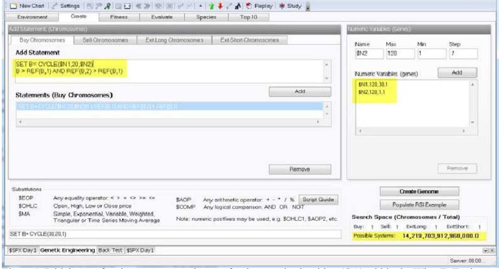
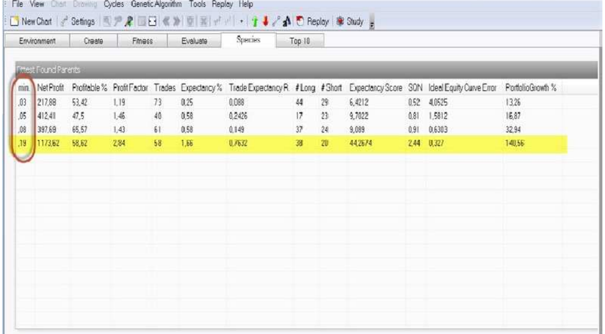
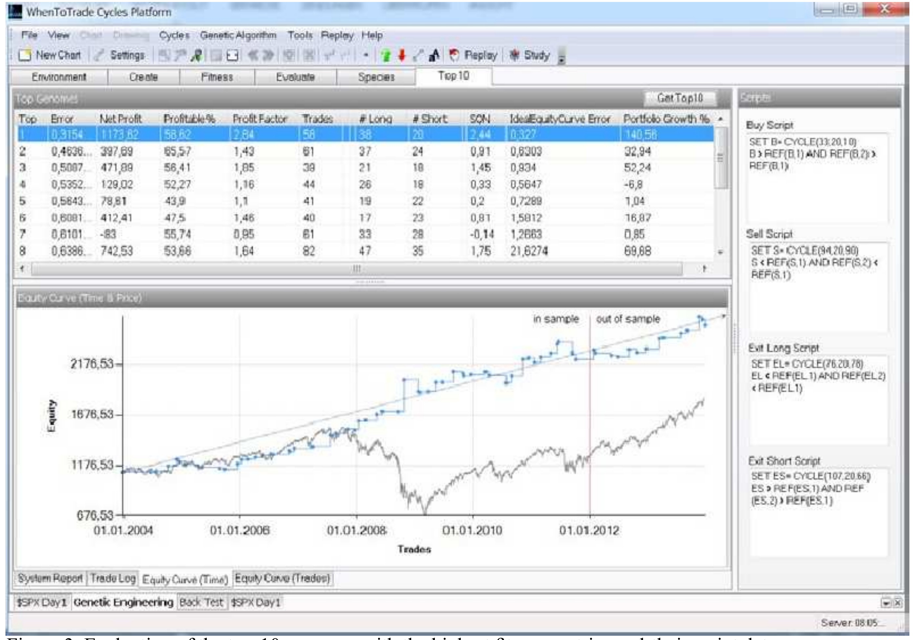
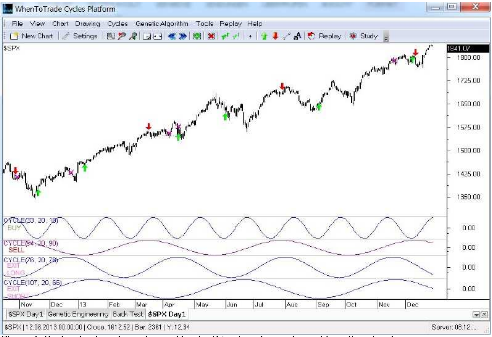

# Detection of Dynamic, Dominant Cycles in Financial Data with a Genetic Algorithm

**by Lars von Thienen**

> Trader's World Magazine, Issue 56, Jan/Feb/Mar 2014
> [tradersworldmagazine.com/issue56.pdf](https://tradersworldmagazine.com/issue56.pdf)

Because financial markets are cyclical, it is important for traders to detect current, dominant, active cycles. To accomplish this, different types of routines and algorithms from the areas of digital signal processing and frequency analysis are often applied to financial data series. However, these routines assume that embedded cycles in the data are static over long time periods. In reality, cycles in financial time series are dynamic, morphing over time in length, amplitude, and phase offset. As a result, it is often difficult to detect the correct underlying dominant cycles using digital signal processing.

Cycle forecasts have been traditionally made based on the current active cycle, where the detected dominant cycle (i.e., a snapshot of the cycle in time) is considered static and extrapolated into the future. However, this assumption oversimplifies the behavior of the market and often results in poorly estimated future cycles without consideration of the dynamic components. Thus, a successful cycle-based trading approach should allow the user to follow the dynamic component of the dominant cycle and adjust the cycle forecast continuously, similar to the way in which a geographic positioning system (GPS) continuously adjusts the projected arrival time based on current traffic conditions.

Genetic algorithms (GAs) could provide such an approach by tracking market conditions and adapting parameters dynamically over time based on the underlying dataset. The GA approach differs from traditional digital signal processing in that, instead of attempting to evaluate all possible combinations, it uses a process of natural evolution to determine optimal solutions.

GAs are based on the principles of evolution, including the "survival of the fittest," and are applicable to many optimization problems. This technique mimics biological evolution as a problem-solving strategy, where the GA uses a set of encoded potential solutions to a problem as inputs and a metric called the "fitness function" that allows each candidate solution to be quantitatively evaluated. In addition, GAs can be used to optimize functions that have dynamic, nonlinear constraints (e.g., length, phase, and amplitude).

GAs can also be used to detect dominant cycles. To use this cycle detection approach within the process of natural evolution, the financial mathematics of cycles need to be encoded into the GA. Therefore, the cycle function is similar to the chromosome and the cycle parameters are similar to the genes. Consider, for example, a genome that contains a set of chromosomes representing a sine wave cycle, where each chromosome holds specific genes with length, phase offset, and amplitude. The genes that constitute chromosome can evolve over time through crossover, mutation, and natural selection. A random population is then built with a specified number of genomes containing different chromosomes and genes. A fitness function rates the quality of each genome, for example according to the trade performance based on the cycle parameters (sell cycle highs, buy cycle lows).

From this population, the GA then evaluates each remaining candidate in the random cycle population according to the fitness function. Candidates with very poor fitness functions are deleted. However, purely by chance, some candidates may have higher fitness, showing profitable trading system performance while selling the cycle highs and buying the cycle lows.

Promising cycle candidates are retained and allowed to reproduce, with some of the copies containing random mutations (or changes). These offspring comprise the next generation, forming a new pool of cycle candidate solutions that are subjected to a second round of fitness evaluations. New candidates with poor fitness are again removed, and, by chance, some mutations may further improve fitness in other candidates. Improved candidates are again preferentially selected and allowed to reproduce, iteratively increasing the average fitness of the solution set with each round. By repeating this process for hundreds or thousands of rounds, strong cycle solutions with ideal trading performance results can be discovered. Using this approach, we can inject random cycles and allow the GA to evolve the cycle parameters according to the rules of natural evolution until we find the optimal "fit cycles" for trading.

The end result is a static cycle length based on the fittest candidate. Although this result is similar to those of digital signal processing techniques, other aspects of the approach offer additional benefits. A GA consists of a fit population of candidates that can continue to evolve. Therefore, the complete algorithm does not need to be reapplied to the original data set as new data are introduced. The new population simply continues to evolve with new price data arriving. Thus, the fittest candidates evolve and adapt continuously with the market, simulating the natural dynamics of the system with the GA.

GAs have proven to be an enormously powerful and successful problem-solving strategy, dramatically demonstrating the power of evolutionary principles. GAs have been used in a wide variety of fields to evolve solutions that are often more efficient, elegant, and complex than anything produced by a human engineer.

The principles underlying GAs can be easily applied to financial trading with the WhenToTrade Cycles Platform (the "WTT platform") and the new genetic engineering module.

For demonstration purposes, data from the daily Standard and Poor's (S&P) 500 Index from 2004 to 2011 were used as inputs into the GA, and S&P data from 2012 to 2013 were used for validation purposes. The following logic was used and encoded via a script into the GA for this showcase (see figure 1): An individual, independent static cycle should be used for long entry (i.e., buy the cycle lows), short entry (i.e., sell the cycle highs), long exit (i.e., sell to cover at the cycle highs), and short exit (i.e., buy to cover at the cycle lows) signals. Within the encoded GA, the range for each cycle length (=bars) was allowed to mutate between 30 and 120 bars, and the range for the possible cycle phase offset was allowed to mutate between 1 and 120 bars. Therefore, each single cycle had a count of 91*120 = 10,920 possible combinations. Because each buy could be combined with any sell and with any exit-long or exit-short signal, the total search space consisted of 14,219,703,912,960,000 cycle combinations. Thus, this example consisted of over 14 quadrillion possible trading systems, a number that cannot be evaluated with brute force algorithms even over years on normal computers.

The following figure shows the initial setup of the WTT platform as an individual script for the buy, sell, exit-long and exit-short chromosomes and genes:

**Figure 1: Initial setup for chromosomes and genes for the genetic algorithm (GA) within the WhenToTrade Cycles Platform**

The WTT platform consists of a script language that creates individual chromosomes based on standard technical analyses and cycle functions. After the chromosomes and genes have been populated and the individual fitness function has been applied, the GA can be initiated. The fitness function then examines the cycle combinations that lead to a consistent up-slope in the equity curves based on the trading rules.

The following "Species" screen shows the points in time when better top genomes have been born by the GA:

**Figure 2: Evaluation of the fittest genomes during the processing of the GA**

In this screen, a new line is added to the table at the points when an improved genome is generated. The first column shows the elapsed time in minutes. In this example, after just 19 seconds, a very profitable cycle combination was generated by the GA (which can be monitored in real time). This screen also shows the necessary performance metrics, including the system quality number and the theoretical growth of a test portfolio account. The highlighted line shows the trading results for the selected cycle; 1173 S&P points were traded within the in-sample period with a profitability of 59% and a profit factor of 2.84.

The following screen shot shows the "TOP10 tab," which lists the current 10 genomes with the highest fitness levels from the overall population:

**Figure 3: Evaluation of the top 10 genomes with the highest fitness metrics and their script data**

This information can be used to review the performance statistics for the current cycle population. The upper table shows the performance metrics while the lower chart shows the equity curve. In addition, the lower equity curve is also plotted for the in-sample period on the left side of the red line and also for the out-of-sample period on the right side of the red line. The grey data describes the S&P index while the blue dots represent the equity of the system. The right area of the window shows the corresponding scripts with the cycle parameters used. Thus, while browsing the upper table with all genomes, the lower performance metrics and right-hand scripts are updated and show the corresponding system parameters.

In the example shown in Figure 3, the equity curve for the out-of-sample area was consistently up-sloping, showing a robust cycle combination. The evolved cycles were also profitable for two years in the out-of-sample period, which was not used to parameterize the GA. In addition, for each genome, the detailed performance metrics for the in- and out-of-sample period are available in the "System Report" tab.

This approach offers a number of advantages over classical methods for cycle detection and standard brute-force algorithms to optimize trading systems. First, a GA can be used to evaluate a very large search space within minutes to find profitable solutions, which is particularly valuable for intra-day datasets. Second, this approach can be used to detect dominant cycles within a financial data series by encoding the characteristics and parameters of cycles into the genome. Third, an analyzed population can be saved and re-run with new data points, removing the need to rescan complete datasets. This way, the cycle solution adapts dynamically and therefore captures the real characteristics of dynamic cycles in financial markets. Finally, the detected parameters and signals can be plotted on a chart and used to spot future turning points, as displayed in the following screen shot:

**Figure 4: Cycles that have been detected by the GA; plotted on a chart with trading signals**

With this approach, the user can remain in-sync with dynamic components, and the cycles can evolve based on a process of natural evolution. In addition, over-engineered black-box mathematics from the domains of frequency analysis and signal processing are unnecessary. The WTT platform, with an integrated GA module, is the first of its kind, with the ability to integrate a variety of steps described here.

*The WTT platform with included GA module is available through my course "Decoding The Hidden Market Rhythm" at no additional cost via the Wave59.com bookstore. Additional examples with more details on this approach can be viewed at the following location: www.whentotrade.com/gacycles*

*Lars von Thienen, December 2013*
*www.whentotrade.com*
