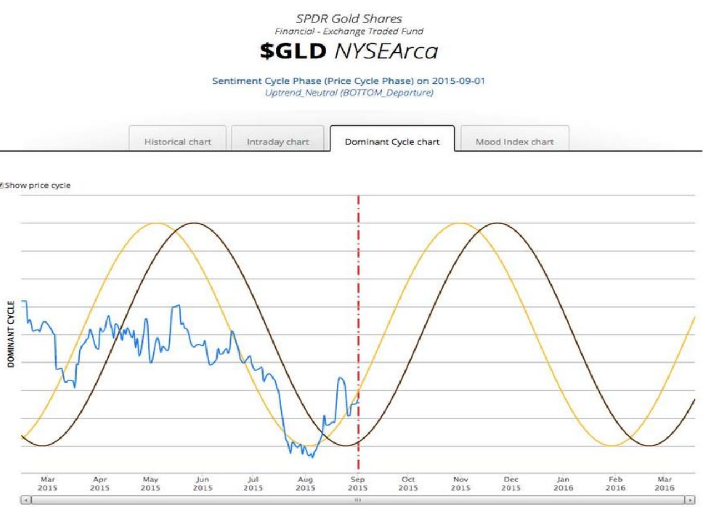
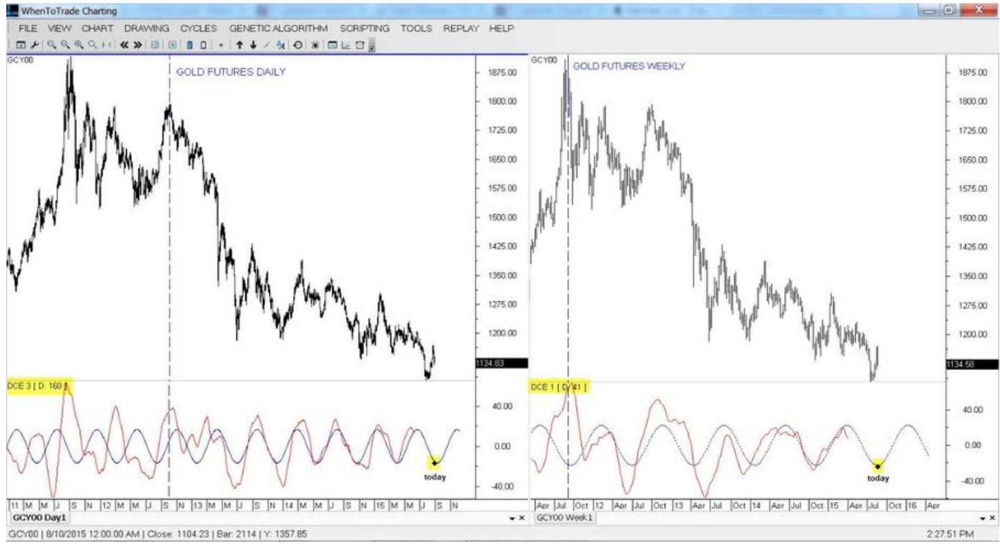

# A Major Price and Sentiment Cycle Alignment in Gold and Silver

**by Lars von Thienen, www.whentotrade.com**

> Trader's World Magazine, Issue 61, 2016
> [tradersworldmagazine.com/issue61.pdf](https://tradersworldmagazine.com/issue61.pdf)

Back in 1949, investing legend Benjamin Graham eloquently characterized the cyclical nature of financial markets in his book "The Intelligent Investor":

> "The market is a pendulum that forever swings between unsustainable optimism and unjustified pessimism."

Today, the emerging field of social media sentiment datasets supports Graham's point of view, providing a strong empirical foundation for the overreaction bias that is often the driving factor in cyclical markets. In recent years, social media has become ubiquitous and important for social networking and online communication among market participants for stock market news.

According to many behavioral economics' studies, mood can profoundly affect individual behavior and decision-making. Mood predisposes people toward certain decision-making processes, and crowd mood can cause events and trends to occur. The ability to find and quantify the underlying mood trends can enable the informed trader the probability of trade direction in advance of news events. Positive or negative underlying crowd mood can trigger the buying, or selling of stocks.

Public sentiment ebbs and flows over time as a function of the general public's disposition and can be analyzed and quantified as a result. The challenge and objective for this study is to analyze sentiment and price data for purposes of discovering underlying cycles, in order to make forecasts and predictions based on historical and current data. The successful analysis of said data can arm the sophisticated trader with foresight into the progression and turns of the overall sentiment / mood cycle, and market turns as a result.

Normally, social mood waxes and wanes positively and negatively in the form of dynamic cycles. Social mood refers to a feeling, emotion or attitude about something, and, of course, it can have a range of values. Whenever mood is related to corporations or the economy, the character of events will unfold in the related financial assets.

Sentiment information can be a very useful tool for trading professionals. Historically, professional traders would listen to the activity on the market floor through a series of microphones and desktop speakers known as "Squawk-Boxes" to "feel the mood", and anticipate turns in the market's direction based upon the tone and activity level on the trading floors. However, due to the advent of electronic and computer trading methodologies, the market floors have largely moved from people shouting at each other on the market floor, to datacenters with automated trading strategies and execution platforms. This has rendered the trading desks unable to listen to the "mood of the market," thereby eliminating a crucial piece of data from trading desks worldwide.

At the same time as the markets were moving from human-based to electronic-based trading activity, social media and internet chatrooms have been undergoing rapid growth. The financial market conversations which used to happen on the trading floors, are now happening online, thanks to websites like Twitter, StockTwits and private chatrooms.

Consequently, the team at PsychSignal created a way to mine the data sets from these online providers, in order to restore the lost connection between the trading floor, markets and traders. They call their product the "Next-Generation robotic Squawk-Box", or "SquawkrBOT" for short. The product acts in the same way that Squawk-Boxes used to connect trading pits to trading floors, but brings the concept to the 21st century by connecting social media datacenters and trading datacenters to trading floors by complex datamining and language processing algorithms instead of microphones and speakers.

The PsychSignal SquawkrBOT operates by using a natural language processing engine employing a linguistic approach, in order to mine raw social "mood" information related to financial assets. It does this to learn how the financial trading public feels about specific securities. In this study, we combine that data, mined from a combination of StockTwits and Twitter data with the WhenToTrade cyclical pricing analysis tools, in order to decipher and track the dominant cycles for both live and historical price and sentiment data, going back to 2011. With the pair of tools working in tandem, we have created the ability to predict and forecast financial market turns in advance as a result of historical cycle analysis.

The study used sentiment and price cycle discovery algorithms to investigate the current market conditions, in context to historic data. The objective was to investigate how social media sentiment can be used to predict financial cycles. In particular, the study's intent was to analyze how social chatter, pre-processed from PsychSignal, can be used to forecast market turns in Gold & Silver.

**Chart 1: PsychSignal live website dashboard screenshot with WhenToTrade Cycle algorithms shown**

The WhenToTrade cycle algorithms were applied in order to discover the underlying sentiment and price data cycles, and generate forward-looking cycle predictions based upon those historic cycle results. The detected cycles are presented as a dominant price cycle (brown line) and sentiment cycle (yellow line). (See Chart 1)

The algorithms have detected an alignment between both sentiment and price cycles bottoming out on Aug 27, 2015 with an upward projection through September and October, reaching a peak by the end of November, which then reverses direction towards the end of the year. In theory, as with all sentiment vehicles, the scores work as contra-indicators. Thus, extreme points of bullishness should correspond to market tops, and extreme bearish composite scores should correspond to market bottoms. This is what we called the "hot-spots" of maximum financial risk or opportunity. The sentiment cycles for Gold (and also Silver, please review the website with all charts) now shows the hot-spot we like to detect of maximum financial opportunity. We would expect the sentiment to turn during the first half of September and this should also be reflected in the price of the metals following the sentiment.

Situations like these, where both cycles are in alignment, coupled with our internal alerting threshold levels can pinpoint important market situations.

However, never trade just a forecast on sentiment alone. You need some more confirmations before you put money on the line. Therefore, it is important to also analyze the cycles on the price of the metals. If we can detect an alignment of price an sentiment cycles, we have a valid signal to enter real trades. This is the classic cycles-within-cycles alignment between price and sentiment. The following two charts show a more detailed dominant cycle analysis on the price chart for Gold to confirm the detected sentiment cycle alignment. (See Chart 2)

**Chart 2: Price cycle analysis confirmed the bottom for Gold on daily and weekly charts**

*Chart 2: Price cycle analysis confirmed the bottom for Gold on daily and weekly charts. The daily chart on the left side shows a detected cycle length of 160 days in the lower panel, which is exactly in sync with the bottoms and tops of the futures price. These charts have been created on Aug. 28th 2015 and have been made public at the time of the analysis on the whentotrade website and news section.*

Another dominant cycle on the weekly chart is also in alignment with the projected cycle low in the futures.

So we have an alignment of the sentiment cycle with the current price cycles on daily and weekly timeframe. On top of that, the price cycles are in alignment with the sentiment swings shown in the beginning of the article.

This is similar to a situation when the music of an orchestra is in tune and vibrates with the "crowd". You know, now it is time to dance. Your feet's will click with the beat automatically. In the financial environment, now the trader's finger vibrates with the keyboard to place a trade. Financial sentiment cycles are like good music - you can hear if they are in tune or out of tune. PsychSignal and WhenToTrade have invented a platform to show if the sound is in or out of tune.

According to the cycle alignment, the forecast is indicating that a bull cycle for the gold sector is positioned to start in the beginning of September, 2015. Such cycle alignment on sentiment, price, daily and weekly charts happening at the same time is usually indicative of a strong signal with high probability of realization. According to the study, the current cycle position situation indicates that $GLD is currently at a bear-market bottom, and is likely to see upward price and sentiment pressure into the November period.

As we deal and follow a real dynamic behavior of cycles, the situation is subject to change and needs to be updated and reviewed daily. This forecast and the related charts have been published live in the public forum in our WhenToTrade magazine on August 29th just some days before the bottom happened in gold. The charts and forecast can be reviewed at the following link: https://www.whentotrade.com/?p=7624

This article underpins the importance of cyclic research in social sentiment data sets in order to forecast important market turns. Thus, the combination of state-of-the-art sentiment data from PsychSignal with the latest cycle analysis and prediction tools from WTT delivers a truly unique view on financial markets.

Lars von Thienen
www.whentotrade.com
www.psychsignal.com
