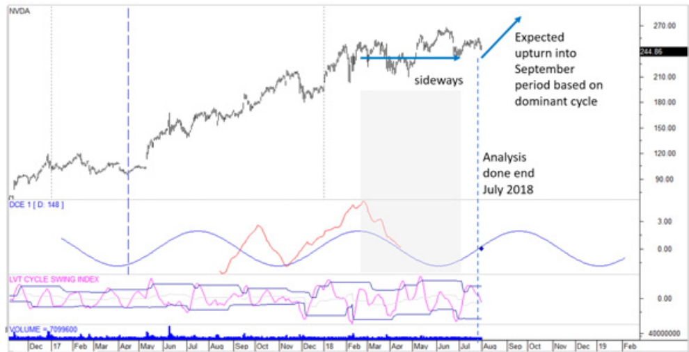
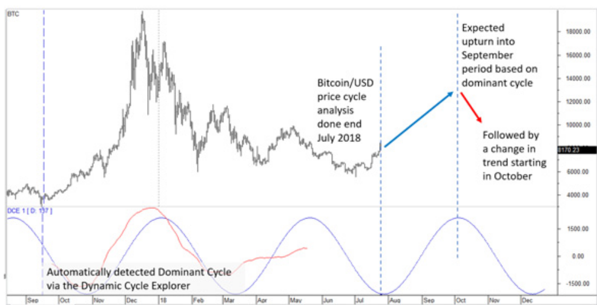
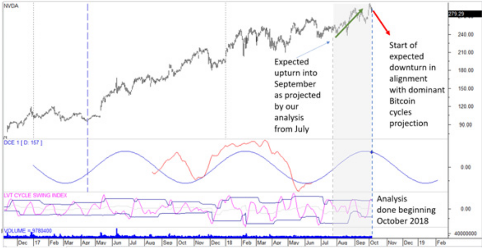
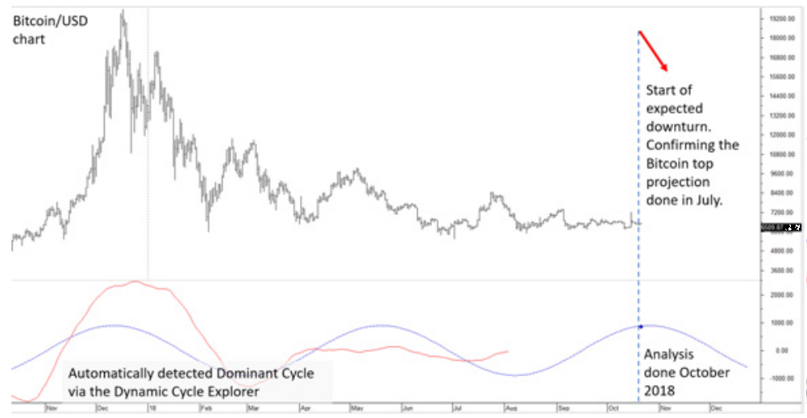
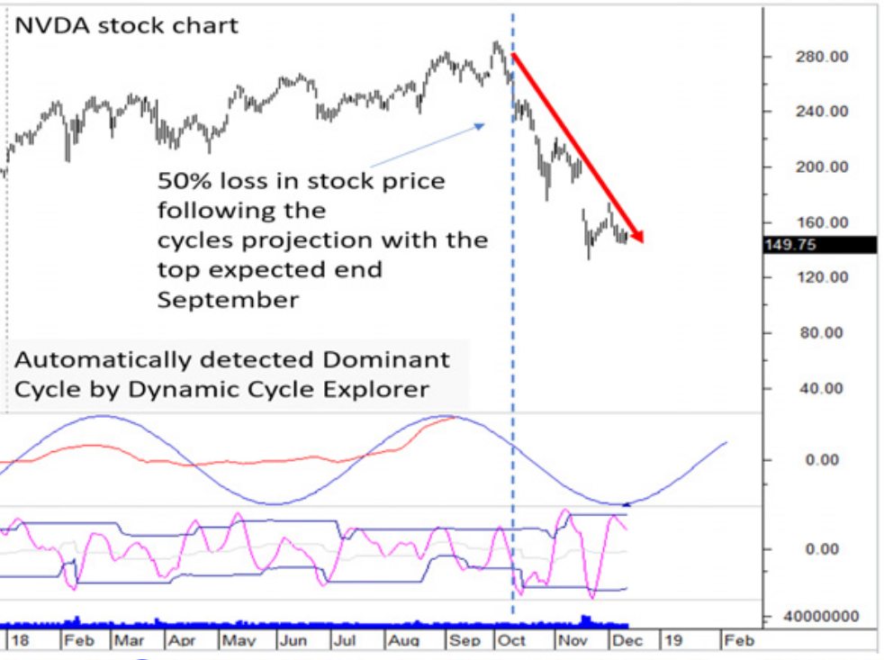

# Rise and Fall of a Crypto Star: How Cycles Predicted the Crash of Nvidia

**by Lars von Thienen, www.whentotrade.com**

> Trader's World Magazine, Issue 72, Feb/Mar/Apr 2019
> [tradersworldmagazine.com/issue72.pdf](https://tradersworldmagazine.com/issue72.pdf)

Cycles are important not only in physics, but also in behavioural economics. The impact of psychological, social, cognitive and emotional factors on the economic decisions of individuals and institutions does not lead to market prices moving abruptly but in cyclical waves.

Understanding behavioural cycles is critical to achieving returns in the current market environment. According to many behavioural economics studies, mood can strongly influence individual behaviour and decision making. Mood predisposes people for certain decision-making processes, and the mood in the crowd can lead to trends occurring. The ability to find and quantify the underlying mood cycles can enable the informed trader to predict the likelihood of a trading direction.

Normally the mood in the form of dynamic cycles in markets driven by a certain primary level of greed and fear increases and decreases positively and negatively. A current market driven mainly by fear and greed is the crypto currency market. So far, most crypto assets have no real basis for fundamental analysis. In a market like crypto, where emotions drive price movements, cycles can often be identified and used to analyze market movements. Sentiment cycles can even play a more important role in market analysis if both more traditional assets (e.g. stocks) and novel assets (e.g. crypto currencies) have significant correlations. The ability to find these types of situations, referred to as 'cycles within cycles', can lead to highly profitable trading set-ups.

This type of setup has been easy to see over the past 24 months. The emotional behavior of crypto currency values was obvious with a lot of publicity. The rise of the new crypto-assets drove demand for the underlying technologies. Nvidia's GPUs were in high demand in crypto-currency mining and Nvidia was described as the "hottest stock" and top performer in the entire S&P 500 due to its high correlation to crypto mining. Therefore, it makes more sense not only to perform technical analyses of Nvidia's market prices, but also to analyze the underlying dominant cycles and the correlation of Nvidia's to crypto market cycles.

In this report, we emphasize the importance of identifying cycles in emotional markets to identify turning points in correlated traditional financial assets. In this case we analyze the driving cycles of Nvidia and correlate them with the crypto-cycles. Recognizing cycles within cycles is susceptible to trading set-ups with high profitability. The following case study illustrates the importance of cycle analysis and predictive power of 'Dynamic Cycle Explorer' (DCE). The Dynamic Cycle Explorer algorithm has been made available in a public available book "Decoding The Hidden Market Rhythm".

Let's start with the market situation in July 2018. Nvidia's share price moved sideways over the course of the year. This movement took place in line with the perceived dominant downward cycle since February with a cycle length of 147 days. In strong uptrends, downward dominant cycles cause the larger trend to pause and prices to stagnate rather than fall. In this case, we could see that Nvidia was moving sideways until June 2018. This shows that the dominant cycle is in place and that the uptrend since February has been suspended for a moment as expected. The dominant cycle is now turning upwards in June according to the recognized cycle and a further revival of the Nvidia stock price can be expected until mid-September. The next downward cycle is expected to begin at the end of September.

**Figure 1: Nvidia price chart and dominant cycle in July 2018**

An isolated, individually identified cycle should never be the sole basis for trading decisions. Since we are confident that there is a strong correlation between Nvidia and the crypto markets in this case, we also need to review the current dominant cycles in the crypto market. For this purpose we use the Bitcoin/USD rate as proxy for the underlying crypto cycle. The following chart 2 shows the Bitcoin price and the dominant cycle with a length of 157 days detected in July 2018 via the 'Dynamic Cycle Explorer' algorithm.

**Figure 2: Bitcoin/USD price chart and dominant cycle in July 2018**

This analysis also forecasts the next expected cycle high for early October.

**Conclusion: July:**
In July 2018, we had a cycle-in-cycle lock-in situation between two independent markets:
- the crypto markets with a dominant cycle duration of 157 days point to the next cycle high in early October, and
- the Nvidia share price with a dominant cycle duration of 148 days is forecasting a price high around the mid-September date.

This suggests that we can expect a rising Nvida price by the end of September followed by a subsequent change in trend. It should be noted that this analysis, which is derived based on cycles, cannot be interpreted statically and must therefore be checked daily for changing influences.

The next chart shows the development of the Nvidia share price at the beginning of October, the forecasted next important turning point.

**Figure 3: Nvidia's share price rose as expected and reached the forecasted cycle high for late September**

In the forecast period between July and October, Nvidia prices rose by +15% from USD 244 to USD 279 within 4 months, according to our dominant cycle analysis. Since the expected turning point was reached in October according to the forecast time and the daily review of the cycles still confirms the forecast, we must be on our guard against an imminent dominant cycle top. It needs to be examined whether the same dominant cycle is still active on the crypto markets. This is shown in Figure 4.

**Figure 4: Dominant cycle in Bitcoin mid-October - confirmation of forecasted cycle Top from July**

The crypto-cycle analysis confirms the dominant cycles. A turnaround in Nvidia stock prices is therefore expected for October 2018, as the underlying dominant cycle of both the stock and the crypto market is now expected to turn.

**Conclusion October:**
Two possible scenarios can be derived from this situation:

- The strong base uptrend will be stopped again when the next downward dominant cycles occur in October. Which is consistent with a sideways movement of the share.

- The uptrend is stopped and transformed into a stronger downtrend of Nvidia as we see a cycle-in-cycle situation in two independent markets.

Correlating cycles within independent markets with the same forecast often do more than just "stopping" an existing trend. Either way, a trader would now close existing long positions to be on the safe side. If he trades more aggressively, additionally open a short position with low risk. With an exit setting at the current level of around USD 279 according to the cycle peak observed for the Nvidia share at the beginning of October.

The next chart shows the price development according to this forecast of the expected cycle high in October.

**Figure 5: As expected, the Nvidia price is falling strongly, in line with the perceived downward dominant cycles**

This is the perfect result of synchronous cycles in independent markets. The share price lost 50% after our expected dominant cycles peaked. This is the result of a cycle analysis in an emotionally driven market (crypto) with highly correlated traditional assets (stocks).

The cycle detections used and shown in this example were detected fully automatically and without manual settings by a programmed cycle indicator. Our publicly published 'Dynamic Cycle Explorer' algorithm discovered the highlighted dominant cycles and their derived predictions about the timing of the coming highs and lows.

The Dynamic Cycle Explorer works on the assumption that cycles are not static over time. Dominant cycles morph over time because of the inherent nature of the parameters of length and phase. Typically, one dominant cycle will remain active for a longer period and vary around the core parameters compared to other cycles. Every time a new bar appears on the chart, the Dynamic Cycle Explorer reassesses the state of the current dominant cycle in terms of length, strength, and phasing. Subsequently, it updates this cycle by plotting it onto future projections. As we move forward in time, every bar signifies an update of the expected turning point by a reassessment of the current state of the dominant cycle length and phase. This dynamic forecast based on the actual state of the dominant cycle provides information about the time and direction of the next turning point. We obtain real-time information about when to expect the next major turning point in the market as we continuously reassess the parameters of the dominant carrier wave. This information is updated every time a new bar appears.

This technique was used in this market report. You can find more information in the publicly available WhenToTrade website or in our book providing the DCE algorithm available at Amazon.

Lars von Thienen
www.whentotrade.com
