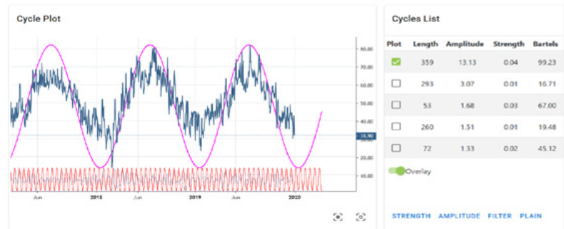
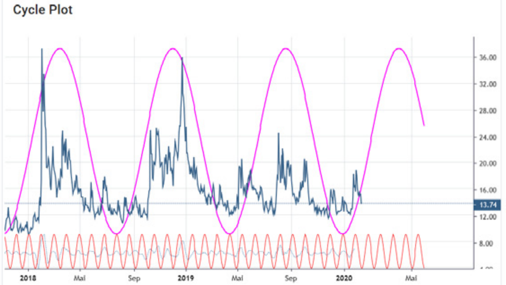
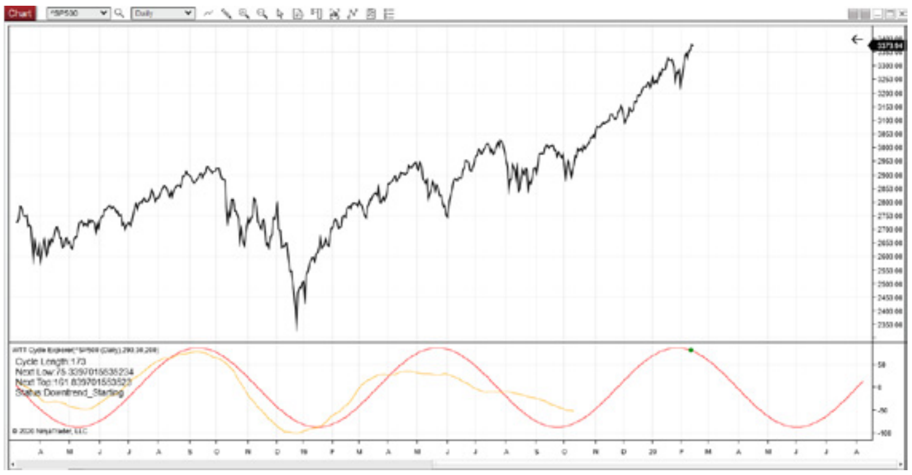
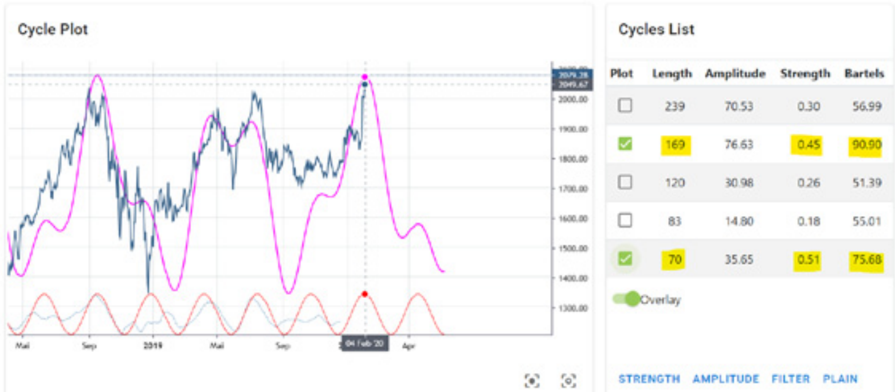

# The Importance of Cycles in Predicting Future Turning Points

**by Lars von Thienen, www.whentotrade.com**

> Trader's World Magazine, Issue 76, Mar/Apr/May 2020
> [tradersworldmagazine.com/issue76.pdf](https://tradersworldmagazine.com/issue76.pdf)

Cycles are important. Cycles surround us and influence our daily lives. Many events are cyclical in motion. There is the ebb and the flow of waves and the inhaling and exhaling of humans.

Our daily work schedule is determined by the day and night cycles that come with the rotation of the Earth around its own axis. The orbit of the Moon around the Earth causes the tides of the oceans.

Gardeners have long understood the advantages of working with cycles to ensure successful germination of seeds and high-quality harvest. They work in harmony with the cycles to attain the best results, the best crops.

These are just a few cycles with recurring, dominant conditions that affect all living beings on Earth. So if we are able to recognize the current dominant cycle, we are able to project and predict behavior into the future.

Let us start with a simple example to illustrate the power of today's digital signal processing.

Figure 1 shows the daily outdoor temperature in Hamburg, Germany (blue). This raw data was fed into a digital signal processor to derive the current underlying dominant cycle and project this cycle into the future (purple).

**Figure 1: Local temperature Hamburg Germany, Dominant Cycle Length: 359 days, Source: https://cycle.tools (Jan. 2020)**

The cycle detection analyzed the dataset and provides us with useful information about the underlying active cycles in this dataset. For the daytime temperature this may be obvious to any eye anyway, but should serve as an introductory example. There are three important structures that have to be identified by any cycle detection engine:

1) Which cycles are active in this dataset?
2) How long are the active dominant cycles?
3) Where is the high/low of these cycles aligned on the time scale?

Any cycle detection algorithm must output this information from the analyzed raw data set. In our case, the information is displayed on the right side of the graph as a "cycle list". It provides an answer to the first question, namely which cycles are currently active, with the most active cycle being plotted at the top of the list. We can identify the most dominant cycle by its amplitude relative to the other detected cycles. In this case there is only one dominant cycle with an amplitude of 13, followed by the next relevant cycle with an amplitude of about 3. The second cycle's relative size is too small compared to the first to play an important role. We could therefore skip each of the "smaller" cycles in terms of their amplitude compared to the highest ranking cycle with an amplitude of 13.

To answer the second question, the "lengths" information is displayed. For the highest-ranking cycle we see the length of 359 days. This is nothing other than the annual seasonal cycle for a location in Central Europe. But you can see that the recognition algorithm does actually not know that it is "weather", but is capable of extracting the length from the raw data for us.

After all, the cycle status is the third important piece of information we need: When have the ups and downs of the cycle with a length of 358 days occurred in the past? In technical terminology, this is called the current phase of the dominant cycle. It is represented by the recorded overlay cycle in which the highs and lows are shown in the output as purple line: The low occurs in January/February, while the highs take place in July of that year.

Using these 3 pieces of information about the dominant cycle, we can start with a prediction: We would expect the next low in early February and the next high in July. The dominant cycle is extended into the future. Well, this is an overly simple example, but it shows that identifying and forecasting cycles will provide useful information for future planning.

So that's the trump card: Any cycle detection algorithm must provide information about

a) What are the currently active dominant cycles?
b) How long is the active cycle?
c) When are past and future highs / lows?

Allow us to continue and apply this algorithm to the financial data set. Similar to the weather cycle, sentiment cycles are often the driving force behind ups and downs in the major markets. Understanding the sentiment cycles in financial stress is critical to generating returns in the current market environment. Sentiment cycles influence the movement of financial markets and are directly related to people's moods. Getting a handle on sentiment cycles in the market would substantially improve one's trading ability.

Figure 2 shows the same technique applied to the VIX index, also called the "fear index". The blue plot is the raw data of the daily VIX data at the time of today's writing. The detected dominant cycle is shown as an overlay with its length and its phase/time alignment, making it possible to draw the mood cycle into the future.

**Figure 2: VIX Cycle, Dominant Cycle Length: 180 bars, Source: https://cycle.tools (13. Feb. 2020)**

The reading of the VIX sentiment cycles is somewhat different when applied to stock market behavior: Data lows show windows of high confidence in the market and low fear of market participants, which in most cases refer to market highs of stocks and indices. On the other hand, data highs represent a state of high anxiety, which occurs in extreme forms at market lows in particular. Reading the cycle in this way, one would predict a market high that will happen in the current period at the end of December 2019/beginning of 2020 and an expected market low that, according to the VIX cycles, could occur somewhere around April.

Similar to the identification and forecasting of weather/temperature cycles, we can now identify and predict sentiment cycles.

In terms of trading, one should never follow a purely static cycle forecast. The cycle-in-cycles approach should be used to cross-validate different related markets for the underlying active dominant cycles. If these related markets have cyclical synchronicity, the probability for successful trading strategies increases.

Figure 3 now shows the same method applied to the S&P500 stock market index. The underlying detected cycle has a length of 173 bars and indicates a cycle high at the current time. This predicts a downward trend of the dominant cycle until mid 2020.

**Figure 3: SP500, Dominant Cycle Length: 173 bars, Source: https://cycle.tools API / NT8 (13. Feb. 2020)**

We have now discovered two linked cycles, a sentiment cycle with a length of about 180 bars, which indicates a low stress level in December 2019 with an indicative rising anxiety level. And a dominant S&P500 cycle, which leads a market with an expected downtrend until summer 2020. Both cycles are synchronous and parallel in length, timing and direction. This is the key information of a cycle analysis: Synchronous cycles in different data sets that could indicate a trend reversal for the market under investigation.

Well, we can go one step further now. Since more and more dominant cycles are active, you should also look at the 2-3 dominant cycles in a composite cycle diagram.

Figure 4 shows this idea when analyzing the dominant cycles for the Amazon stock price. See the list on the right for the Dominant Cycles identified. The most interesting ones have been marked with the length of 169 bars and 70 bars. It is possible to select the most important ones based on the cycle Strength information and the Bartels Score. Not going into the details for these two mathematical parameters, let us simply select the two highest ones for the example. Now, instead of simply drawing the dominant cycle into the future, instead we use both selected dominant cycles for the overlay composite cycle display (purple) which is also extended in the unknown future.

**Figure 4: Amazon Stock, Dominant Cycle Length: 169 & 70 bars, Source: https://cycle.tools (04. Feb. 2020)**

The purple line shows the cycles with the length of 169 and 70 as well as their detected phase and time alignment in a composite representation. A composite plot is a summary of the detected cycles adding their phase and amplitude at a given time. One can see how well these two cycles in particular can explain the most important stock price movements at Amazon in the last 2 years. And it is interesting to note in this case that a similar composite cycle, as previously shown by Sentiment and the S&P500 index cycle, indicates a cyclical downtrend from January to summer 2020.

By combining different data sets and the analysis of the dominant cycle, we can detect a cyclical synchronicity between different markets and their dominant cycles.

The mathematical parameters of cycles allow us to project a kind of "window into the future". With a projection of the next expected main turning points of the cycle or composite cycle. This information is valuable when it comes to trading and trading techniques. Especially when you are able to identify similar dominant cycles and composite cycles in related markets which are "in-sync".

How does the shown approach work used in these examples?

The technique applied is based on a digital processing algorithm that does all the hard work and maths to derive the dominant cycle in a way that is useful for the non-technical user. It works on the assumption that cycles are not static over time. Dominant cycles morph over time because of the inherent nature of the parameters of length and phase. Typically, one dominant cycle will remain active for a longer period and vary around the core parameters compared to other cycles. As real cyclic motions are not perfectly even, the period varies slightly from one cycle to the next because of changing physical environmental factors. This dynamic behavior is valid for financial market cycles as well.

Every time a new bar appears on the chart, the Dynamic Cycle Explorer reassesses the state of the current dominant cycle in terms of length, strength, and phasing. Subsequently, it updates this cycle by plotting it onto future projections. However, a trader will focus only on the next expected turning point, which is what a market analyst is interested in. The DCE is not used to predict a complete static cycle far into the future. We are interested in determining and monitoring the next turning point based on the detected dominant carrier wave phasing, which is the point in time where we expect the market to turn.

As we move forward in time, every bar signifies an update of the expected turning point by a reassessment of the current state of the dominant cycle length and phase. This dynamic forecast based on the actual state of the dominant cycle provides information about the time and direction of the next turning point. We obtain real-time information about when to expect the next major turning point in the market as we continuously reassess the parameters of the dominant carrier wave.

The examples used have been kept simple and fairly static to show the basic use for cycle detection and prediction. The projections obtained must be updated with each new data point. It is therefore essential to not only perform this analysis once, statically, but to update it with each new data point.

Knowing how to use cyclical analysis should be part of any serious trading approach and can increase the probability of successful strategies. Because if a rhythmic oscillation is fairly regular and lasts for a sufficiently long time, it cannot be the result of chance. And the more predictable it becomes.

There is often a lack of simple, user-friendly applications to put this theory into practice. We have to work on spreading this knowledge and its application. Instead of the scientific-mathematical deepening of algorithms. The Foundation For The Study Of Cycles (FSC) is an institution dedicated to this task with more information to be found at www.cycles.foundation .

This theory can be applied to any change on our earth as well as to any change of human beings in order to understand their nature and predictable behaviour.

Lars von Thienen

www.whentotrade.com
