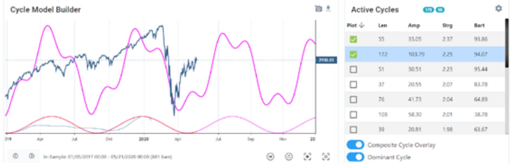
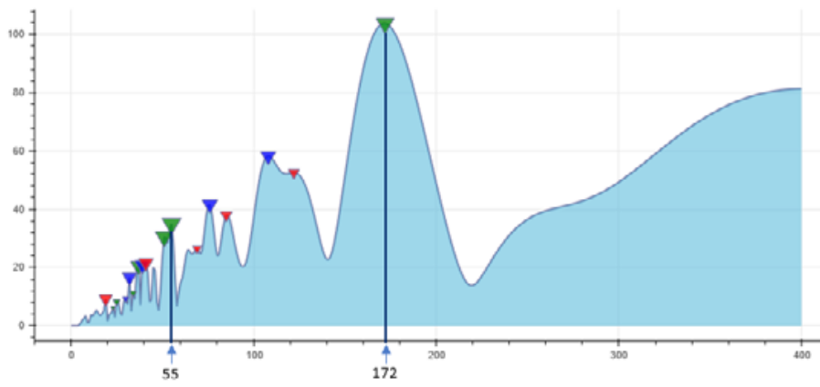

# How to select the appropriate cycles for forecasting

**by Lars von Thienen, www.whentotrade.com**

> Trader's World Magazine, Issue 78, 2020
> [tradersworldmagazine.com/issue78.pdf](https://tradersworldmagazine.com/issue78.pdf)

Back in February, before the recent market top occurred, I published some real-time daily charts in the Traders World Magazine #76 on page 104ff indicating a cycles top for the month of February, while explaining some cycle knowledge. The decline occurred only 2 weeks after the article. I would recommend reading this article again as it contains educational knowledge about the use of cycle analysis.

In a private conversation with the magazine's editor, and after the markets followed and revived the predicted February downturn, Larry asked me on May 18: "Lars, based on your cycle program, what is your analysis of the S&P?"

I pulled up the following chart and wrote back: "We could expect a sideways to upwards moving market into the summer period, forming a top around July/August. Then turning the direction ..."

**Chart: S&P cycle analysis done May 21, using cycle with length of 172 and 55 days, predicting a top between August-September**

Today, we know the outcome. The market rallied through August and peaked on September 2, just as the cycles predicted. However, this article is not intended as self-praise. It is intended to recapitulate the power of the cycles, and therefore I would like to explain further basics of how I came to the choice of exactly these cycles back in May.

So, let's use this example to explain why to chose the cycles with a length of 55 and 172 for the prediction at that time.

## The Cycle Spectrum to detect all possible cycles

We use a special form of Fourier analysis to detect active cycles in a data series. There are many possible algorithms that can be used to apply cycle analysis to data series. So, you are free to choose which tool set you want to use as Fourier framework. The approach explained here would be the same.

This cycle analysis generates a so-called spectrum plot. This spectrum shows all possible cycle lengths on the x-axis and the corresponding amplitudes on the y-axis. To detect cycles in the data set, you select the peaks in this spectrum. Each peak in the spectrum represents an existing cycle in the underlying data set. These peaks are marked by triangles in our spectrum diagram.

**Fourier spectrum plot: S&P daily spectrum analysis, May 21 2020**

This spectrum shows many peaks. So which cycles (=peaks) should we use for a forecast? Therefore, you need more than just a Fourier analysis.

The cycle spectrum only gives you information about which cycles were detected in the data set. However, it does not tell you whether the detected cycles are "one-time" cycles with only one repetition, or whether the cycle was constantly active throughout the data set with many repetitions.

However, we would like to select those cycles that are constantly repeated in the data set for forecasting and prediction purposes. We would not select cycles that might have been present only once but could be based on a one-time effect. At this point, the spectrum analysis runs out of answers and we need additional measures.

## The Bartels Test

This is where the Bartels test comes in. The Bartels score provides a direct measure of the probability that a given cycle is real and not random. It measures the stability of the amplitude and phase of each cycle during the full dataset. In this step of cycle validation, the statistical reliability of each cycle is evaluated. The goal is to exclude cycles that were influenced by one-time random events (e.g. news) as well as cycles that are not real. The higher the Bartels rank between 0 and 100 shown in the list above, the less likely it is that this cycle is random or accidental. Since we have a final percentage value, we only need to define an individual threshold below which the detected cycles from the Fourier analysis should be skipped. I would simply recommend using a threshold value of 49%, and therefore cycles from the Fourier spectrum with a Bartels percentage below 49% should be skipped by all cycle prediction techniques.

The cycle spectrum displayed shows low Bartels values with a red triangle and good Bartels values with a green triangle.

This is an additional feature of this special spectrum as it adds further characteristics beyond the standard spectrum analysis. However, all the approaches, Fourier, and Bartels, are not hidden secrets and could be used by anyone on his own.

For this reason, I only concentrate on the cycles with "green" triangles, or as with the selection of cycles with a high Bartels value.

## The Strength or Power of a Cycle

An important final step in making sense of the cyclic information is to establish a measurement for the strength of a cycle. The price influence of a cycle per bar on the trading chart is the most crucial information. Because each cycle related to the timeframe you are interested on.

Let me give you some examples by comparing two cycles. One cycle has a wavelength of 110 bars and an amplitude of 300. The other cycle has a smaller wavelength of 60 bars and a smaller amplitude of only 200.

So, if we apply the "standard" method for determining the dominant cycle, namely selecting the cycle with the highest amplitude, we will select the cycle with the wavelength of 110 and the amplitude of 300.

But let us look at the following information - the force of the cycle per bar:
- Length 110 / Amplitude 300 = Strength per bar: 300 / 110 = 2.7
- Length 60 / Amplitude 200 = Strength per bar: 200 / 60 = 3.3

For trading, it is more important to know which cycle has the biggest influence to drive the price change per bar in regard to the timeframe you are on, and not only which cycle has the highest absolute total amplitude! Therefore, we would not select the cycle with the highest amplitude of 300, we would select the cycle with a length of 60 and amplitude of 200 as it has the higher strength score.

That is the to pay attention to a third measurement, the so called "Cycle Strength." That said, to build a ranking based on the cycles left, we recommend sorting these cycles based on their "influence" per bar. As we are looking for the most dominant cycles, these are the cycles that influence the movement of the data-series the most per single bar.

## Summary - The final approach to select relevant cycles for forecasting

Start with a frequency analysis of your pre-processed data set. For example, use a Fourier analysis to obtain all relevant cycles in the data series. Then evaluate each cycle using the Bartels test to filter the valid cycles above a threshold. Third, these filtered lists of cycles should be ordered by strength, with the power of each cycle per bar. Finally, select the top 2-3 cycles from this list to create a cycle projection.

This was exactly the approach used to predict the top of the market for August around mid-May by selecting the top cycles on the list with a length of 172 and 55.

In the end, the approach is simple and without subjective selection. Once you have learned these steps, it becomes a fairly automatic approach.

As mentioned above, publicly known and accessible procedures have been used for this approach. We use this ourselves to display the Fourier results, the Bartels score and the strength value side by side for each data series with our cycle.tools platform here at whentotrade. But you could also use other frameworks that provide these research results.

Lars von Thienen
www.whentotrade.com
