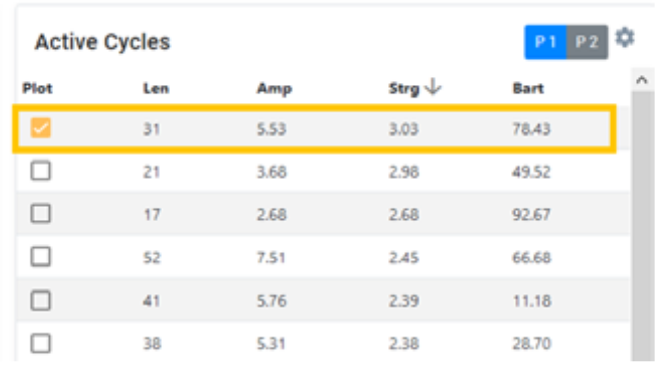
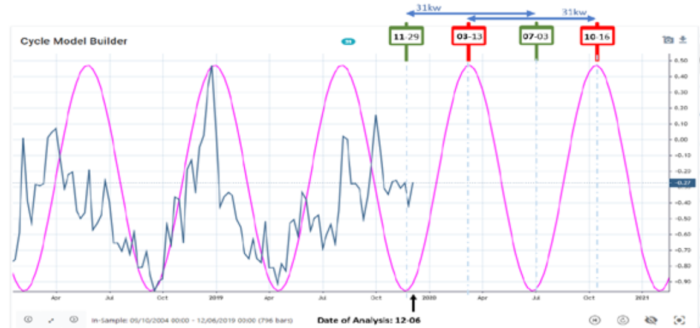
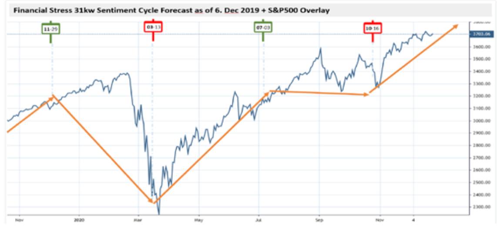
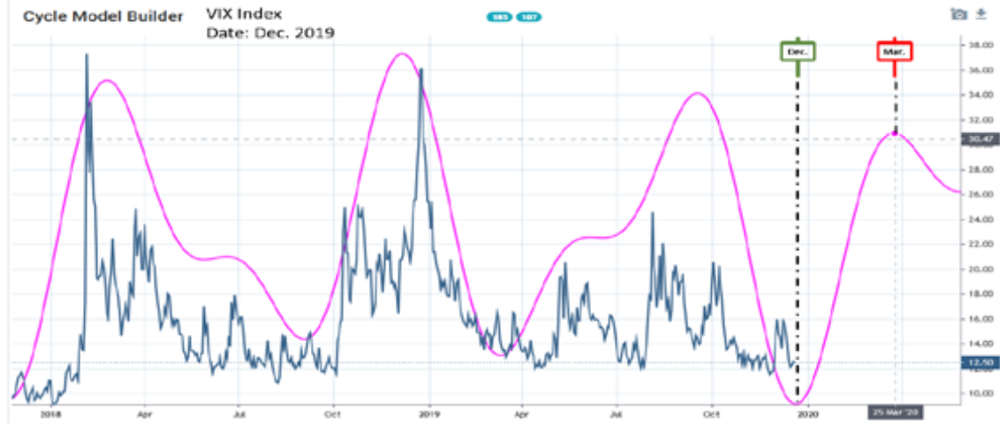
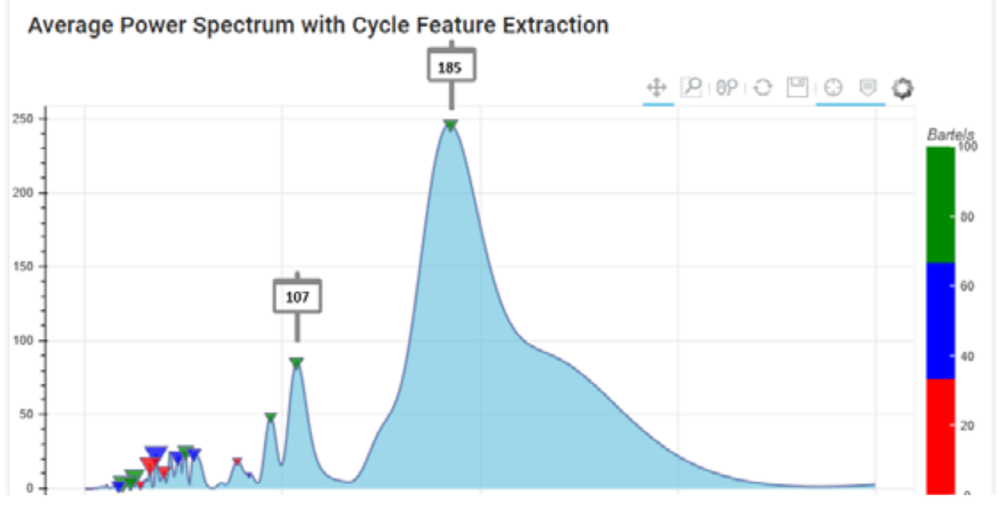

# How the Financial Stress Index predicted turning points in 2020 with pre-pandemic data

**by Lars von Thienen**

> Trader's World Magazine, Issue 79, Jan/Feb/Mar 2021
> [tradersworldmagazine.com/issue79.pdf](https://tradersworldmagazine.com/issue79.pdf)

Understanding the sentiment cycles in financial stress is critical to generating returns in the current market environment. Sentiment cycles influence the movement of financial markets and are directly related to people's moods. Getting a handle on sentiment cycles in the market would substantially improve one's trading ability.

This article underpins the power and importance of sentiment cycles. I want to highlight the importance of detecting cycles in sentiment to spot turning points in financial data. The following case study exemplifies the importance of sentiment cycles and the predictive power of Cycle Analysis.

Typically, one dominant cycle will remain active for a longer period and vary around the core parameters compared to other cycles. As real cyclic motions are not perfectly even, the period varies slightly from one cycle to the next because of changing physical environmental factors. This dynamic behavior is valid for financial market cycles as well.

The St. Louis Fed Financial Stress Index (STLFSI2) is a vehicle that can be used to analyze sentiment data. It is created using principal component analysis, a statistical method for extracting the factors responsible for the correlation of a set of variables. Financial stress has been identified as the chief factor influencing the co-movement of its designated market variables; extracting this factor allows St. Louis Fed to create an interpretable index. The index is constructed using weekly data series for a variety of interest rate, credit spread, and volatility measures. We have often referred to measure cycles on this dataset to predict important market turns in past articles.

We can apply our cycle analysis tools to this dataset and see if we would have been able to detect important dominant cycles that forecast financial stress extremes for 2020. The dataset is available in our Cycle Scanner and can be loaded with our wrapper around the FRED data source with just one click in the Cycle Tools.

There is a reason why we go back to 2019 and analyze the sentiment cycles for 2020: In December 2019, there were no COVID breakouts in the Western world. So, we analyze the predicted stress cycles for 2020 before the pandemic period, which started in February 2020. Was it possible to recognize the expected "stress" for the financial markets in 2020 already at the end of 2019 based on pre-COVID market data?

This exercise was performed on 6. December 2019 with the Cycle Analysis Toolbox. Just using standard settings without any customization. This tool can automatically detect the current active dominant cycle and track the current phasing to forecast the next expected turn. The approach is described in the following publicly available online article (docs.cycle.tools). The used in-sample period includes weekly data from September 2004 up to December 2019. The standard cycle analysis based on the cycle spectrum gave us the following list of detected cycles on December 6th as seen in Table 1.

**Table 1: Detected cycles in the financial stress index on 6th December**

The detected cycles are sorted by their "Cycle Strength" in descending order. That is, the cycles with the greatest impact on the change in market sentiment per week are at the top. More information about "Cycle Strength" can be found at this online article.

For the stake of simplicity, we select the active cycle listed at position 1 with the length of 31 calendar weeks to predict the expected sentiments extremes in the future. This cycle is plotted as an overlay on the sentiment data and continued for the full year of 2020. The expected turning points in 2020 have been highlighted.

**Chart 1: St. Louis Fed Financial Stress Index and dominant cycle forecast for 2020 (6 Dec 2019)**

The cycle scanner detected an active "financial stress" cycle with a length of 31 weeks that tracked the latest major market movements in the past. This is shown in the left section of the chart where the cycle analysis on the FRED data took place. The source data was accessed via FRED API through the symbol ID STLFSI2-W:FDS and was analyzed with the standard Cycle Scanner in the WhenToTrade platform. The fuchsia-colored cycle overlay shows the automatically detected dominant cycle; the major turns are indicated with red and green time markers to show the anticipated turning points in 2020.

Sentiment cycles such as the "stress" index analyze the uncertainty of market participants, also often referred to as the "fear index". High points therefore indicate a very high level of "fear" among market participants. In markets, a market low usually forms at points of highest uncertainty.

Therefore, for the analysis of sentiment data, it should be noted that these cycles are inversely proportional in the market index. Sentiment cycle lows correlate with market tops. While sentiment cycle highs correlate with market bottoms.

As can be seen, the static sentiment stress forecast for 2020 indicated the following turning points based on the major active dominant financial stress index at the end of 2019:
- Market top: Nov/Dec 2019
- Market bottom: March 2020
- Market top: July 2020
- Market bottom: October 2020

As mentioned, this cycle analysis was done pre-COVID without any indication on the upcoming pandemic and negative business outlook. Now, lets see how this sentiment cycle played out in the following year 2020, shown in Chart 2:

**Chart 2: S&P500 overlaid with forecast sentiment stress cycle turning points from December 2019**

The time markers on the chart have just been pulled forward from the financial stress index cycle analysis from December 2019. So, these predicted turn-dates have been "pinned" there one year in advance – pre-pandemic.

As the analysis was done in December 2019, the market top, or financial stress low, was predicted. So any investor would have been cautioned in the final market exhaustion during December and January 2020. You would have added close stops to running longs or would have closed any long position based on the sentiment prediction at the end of 2019. Then, the market bottom, which was predicted for March 2020, was nailed on the point based on the financial stress cycle. The upswing into the summer was predicted. Just the predicted down-turn during July to October 2020 manifested into a sideways move in the market index. However, from cycle analysis, in a strong uptrend, a cycle downtrend is inline with a sideways moving market. Please review the cycle swings and market behavior on your own. For sure, a weekly forecast can not be used for entry and exit management. But it acted as a near perfect guide for the full year of 2020.

Moreover, it may explain why markets are reacting very independently of the COVID crisis. And it shows the enormous importance for the analysis of sentiment cycles. Indeed, what we see in the market index is only the result of the underlying cycles. So if we can find suitable data series that are useful for measuring market sentiment, the cycle analyst will be rewarded.

As is often discussed in our articles, one should always crosscheck for other dominant cycles, especially in other timeframes/vehicles. Another sentiment vehicle that is commonly referred to is the Volatility Index (VIX)—often called the "fear" index. A dominant cycle analysis on the VIX showed another sentiment extreme on the daily timeframe. Analysis was also done in December 2019 to cross-validate the weekly stress cycle on another dataset and another timeframe. The daily composite cycle, which was automatically detected with a length of 185 and 107 bars, projected a daily sentiment "fear" low for December 2019 (market top) and the next fear low for mid-March 2020 (market low):

**Chart 3: Dominant sentiment cycles with length of 185 and 107 days in the VIX index, December 2019**

The reader might ask: "Why are the cycles with a length of 185 and 107 picked for this analysis? Wont you always find some cycles which have worked after the fact?" The answer is quite simple, the cycles have been picked without any subjective filtering after the fact: These two cycles are the clearly visible peeks in the spectrum plot in December 2019 as shown in Chart 4. It is a standard procedure, which is explained in every spectrum analysis book: One selects the cycles with the strongest swing in the spectrum.

**Chart 4: Spectrum plot for the VIX cycles in December 2019, showing the key cycles 185 and 107**

The interesting point is that we have two different dominant sentiment cycles from different datasets and different timeframes coming into alignment, and both dominant cycles project a current market high around December 2019 with the next major low to occur mid-March 2020. We all know how the story played out.

As a cycle analyst which observes the markets for over 20 years based on cycle analysis, I can just emphasize that these pictures repeat again and again. For users of the WhenToTrade Cycle Toolbox, you can load the cycle analysis workbook at the following links and review the analysis on your own. You can check these examples on our cycle analyzer with the 7-day free trial, without any obligation.

**Links to cycle analysis workbooks used in this article:**
- Cycle Analysis Workbook on Financial Stress Index
- Cycle Analysis Workbook on VIX Index

Try an improve your cycle analysis knowledge and you will be rewarded.

*Lars von Thienen*
*WhenToTrade.com*
