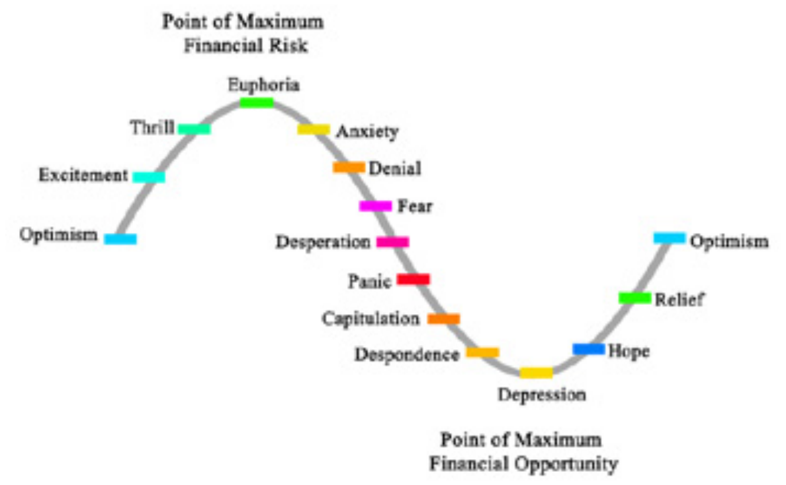
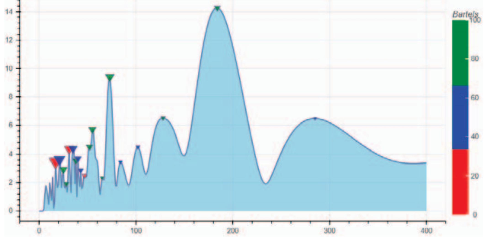
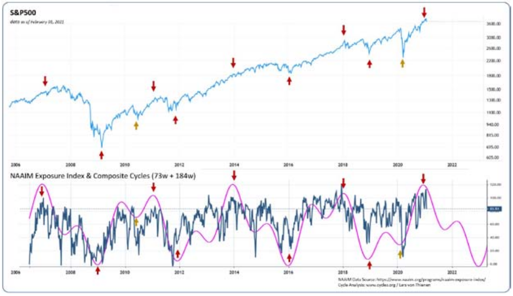

# Dominant Cycles in Investment Managers' Exposure to U.S. Equity Markets Indicate Impending Turnaround

**by Lars von Thienen, www.whentotrade.com**

> Trader's World Magazine, Issue 80, Apr/May/Jun 2021
> [tradersworldmagazine.com/issue80.pdf](https://tradersworldmagazine.com/issue80.pdf)

The importance of analyzing sentiment cycles of active money managers plays a critical role in assessing financial risk. Dominant cycles in the National Association of Active Investment Managers Exposure Index have been identified with high correlation over the past 15 years. The current state of the dominant cycles indicates a possible reversal for U.S. equity markets.

Back in 1949, investing legend Benjamin Graham eloquently characterized the cyclical nature of financial markets in his book "The Intelligent Investor":

> "The market is a pendulum that forever swings between unsustainable optimism and unjustified pessimism."

Today, the emerging field of social media sentiment datasets support Graham's point of view, providing a strong empirical foundation for the overreaction bias that is often the driving factor in cyclical markets.

Normally, social mood waxes and wanes positively and negatively. Thus, sentiment waxes and wanes in the form of dynamic cycles. Mood refers to a feeling, emotion, or attitude about something, and, of course, it can have a range of values. Whenever mood is related to corporations or the economy, the character of events will unfold in the related financial assets. Fear and despondency represent one extreme, while thrill and euphoria represents the other end of the spectrum.

Cycles are the important structure because sentiment does not jump rapidly from one state to another.

**Chart 1: Market cycle that forever swings between bullish and bearish extremes**

A change of mood requires time; therefore, sentiment moves in dynamic cycles or waves. Therefore, the challenge is to spot and predict the extreme turning points shown in Chart 1, as observed at market tops ("Maximum Financial Risk" - Euphoria) and at markets lows ("Maximum Financial Opportunity" - Panic).

The fascinating aspects of market cyclicality is that the active investor badly underperforms across the board because he or she is prone to chasing performance near market tops and panicking near market bottoms. Identifying the behavioral patterns of investment managers, using cycle analysis techniques, can therefore provide clues to focal points of "euphoria" or "panic".

Consequently, if you have data sets that provide raw "mood" information related to financial assets on the one hand, and on the other hand have cyclic tools that can decipher and track dominant cycles, we are able to provide supporting market analysis to adjust your active investment risk.

Against this background, a cycle analysis of the NAAIM Exposure Index was performed. The NAAIM Exposure Index represents the average exposure of active investment managers to the U.S. equity markets. A value above 100 indicates leveraged long positions. The raw data of this publicly available index is not predictive in nature. However, the exposure index provides insights into the actual risk management of investment managers. In the case that cycles are found in that data set, it will allow a prediction of future exposure and risk management efforts of that group.

**Chart 2: Spectrum analysis of the NAAIM exposure index revealed two peaks at 73 and 184 weeks**

The spectrum answers the question "How much of the data is at a cycle length x?". As we use a weekly dataseries, the peeks indicate cycles with a length of x-weeks. A cyclic data series consists of more than just one cycle. The amplitude represents the most important cycles which can bee seen on the y-axis. The colored triangles show an additional verification in regards how reliable a given cycle length is. From "red" = not trusted to green = very strong. This is called the Bartels Score which acts as second measurement in addition to the spectral analysis. The spectrum clearly shows two peaks with green triangles at 73 weeks and 184 weeks.

Once we have derived dominant cycles, we can use the information about cycle length, phase and amplitude to plot a superposition wave. Both cycles were added to a superposition wave, which simply combines both cycles in terms of their phase, amplitude, and length into one combined wave (Chart 3).

The superposition wave is the purple indicator overlay at the bottom of the chart. While the dark blue line at the bottom area is the raw NAAIM exposure index.

**Chart 3: Superposition Composite Cycle (73w + 184w) in the NAAIM Exposure Index, S&P500 Index, Data as of Feb. 2021**

Our performed cycle analysis for the entire NAAIM dataset revealed two dominant cycles combined into one superposition wave.

The composite cycle shown is significant because >90% turning points from the exposure index composite cycle correlate with important market reversals.

The composite cycle indicated:
- the 2007-2009 17-month bear market during the financial crisis,
- the 2009 market low,
- the short-lived bear market between May and October 2011, which was indicated by the high of the sentiment cycle just before Black Monday on Aug. 8, 2011, when the U.S. was downgraded,
- the 2014-2015 period began with an indicated sentiment cycle top and resulted in a sideways moving market,
- the 2016 sentiment cycle low, which indicated the start of a truly remarkable year for financial markets,
- predicting the end of the boom in early 2018, with 2018 being a worse year for financial assets. Since January 2, 2018, the S&P has fallen 8% until year end,
- pointing to the start of the next market upswing beginning in early 2019, indicated by the low of the composite cycle. With a gain of +60% to date since the indicated December 2018 composite cycle low.

Now, at early March 2021, we have reached the next projected composite cycle high for the NAAIM Exposure Index.

Based on the dominant cycle composite analysis of investment managers exposure to the U.S. equity markets shown, the current cycle top and past correlations suggest a trend reversal in US equity markets is imminent. The shown analysis can be done with our cycle analysis toolbox provided at whentotrade right out of the box without any special settings.

*Lars von Thienen*
*www.whentotrade.com*

**REFERENCES**
- NAAIM Exposure Index: https://www.naaim.org/programs/naaim-exposure-index/
- Interactive NAAIM Cycle workbook: https://cycle.tools/workbook/BDexn5Glm
