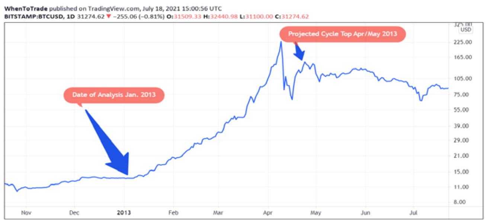
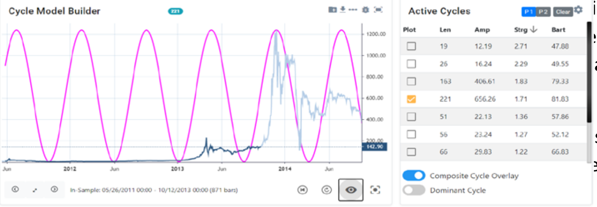
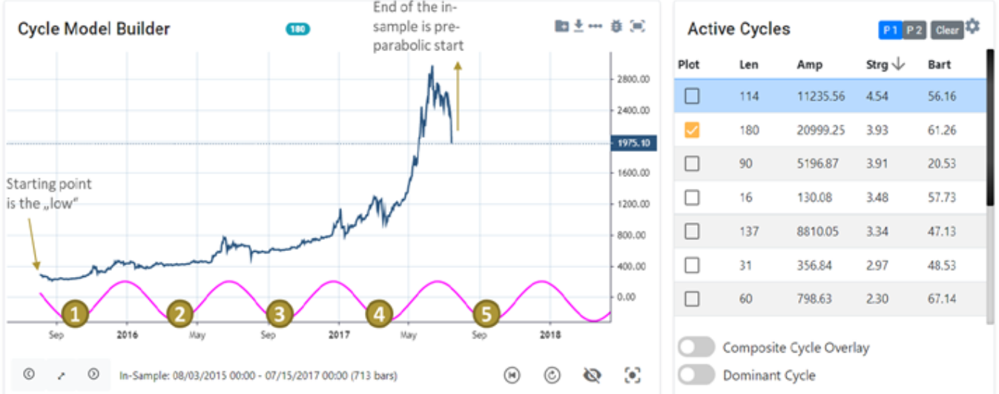
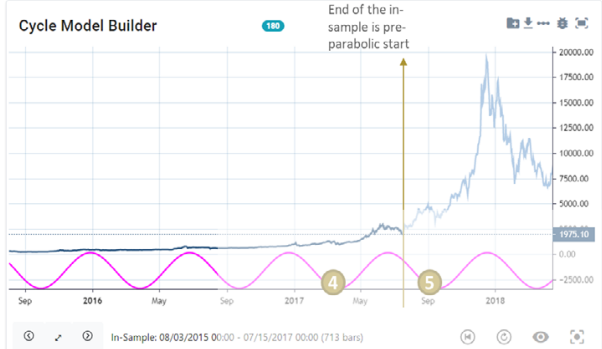
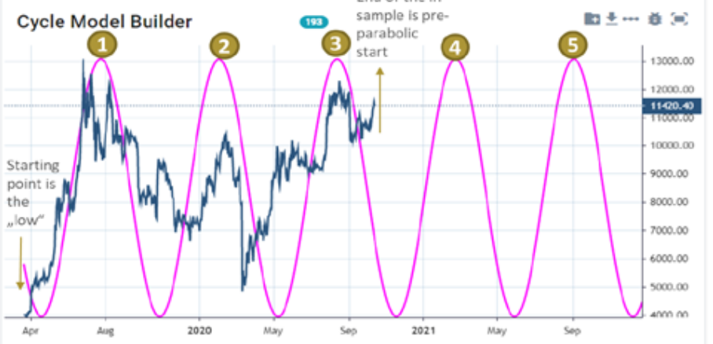
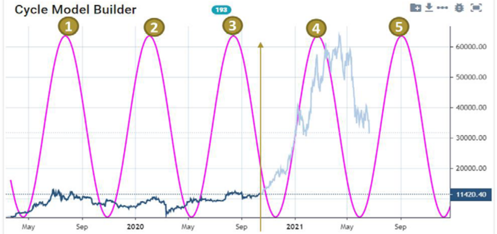

# The hidden dominant cycle of Bitcoin price extremes

**by Lars von Thienen, whentotrade.com**

> Trader's World Magazine, Issue 81, Jul/Aug/Sep 2021
> [tradersworldmagazine.com/issue81.pdf](https://tradersworldmagazine.com/issue81.pdf)

Bitcoin experienced a fabulous rise from 10,000 to 60,000 USD within 12 months. Only to lose 50% immediately afterwards in July 2021. Raising the exciting question of whether the current Bitcoin hype has come to an end and how far the expected price drop may still go. Or whether the Bitcoin price may recover quickly.

A question the entire crypto-currency community is addressing these days. The obvious approach, therefore, is to use our cycle analysis methods to see if certain cycle patterns in the past can provide insight into how Bitcoin might perform in the future.

For any cycle analyst, it is crucial to understand the historical development of the dominant cycles in the data set under consideration before analyzing the current situation. In Bitcoin in particular, it is noticeable that extreme parabolic movements have been observed several times. That is, the steep parabolic move in 2021 to $60,000 is not the first of its kind. The following parabolic eruptions of the Bitcoin price are impossible to ignore:

1. A first parabolic move took place in June 2011 with a rise from 0.2 to 28 USD.
2. A second extreme rise occurred in April 2013 from 2.20 to 230 USD.
3. In November 2013, a third parabolic move from 10 to 1,200 USD took place.
4. In December 2017, the fourth parabolic move occurred from 200 to 29,000 USD.

What all the cited rises have in common is that the bitcoin price has risen +10,000% each time. It is also noticeable that after each parabolic top, the BTC price quickly fell by 70%-90%. Thus, gains and losses are close together. One only tells the story about the rise - but if you came late to the party, a 70% loss after each rise becomes a nightmare.

Being a cycle analyst, it will be interesting to see if these cited parabolic moves were preceded by cyclical patterns. So, the purpose of this article is to look at the historical moves and the underlying dominant cycles before the extreme price breakouts occurred.

## I. The dominant cycle pattern prior to the April 2013 parabolic move (#2)

The analysis is based on Bitcoin price data from May 2010 to January 2013 and is performed well before the beginning of Bitcoin's parabolic upswing. This way we ensure that the algorithm does not receive data of the following parabolic upswing. Bitcoin price at the time of this analysis was $15. The primary dominant cycle was detected with a length of 231-days.

The detected primary cycle with the length of 231 days is visually shown in the chart with its current phase and its projection into the future. We can see at the time of the analysis in Jan. 2013 that the cycle predicts a rise into the May 2013 time window (see "point 4").

Chart 1 shows the 231-day cycle at the time of analysis in Jan. 2013 and its future projection.

**Chart 1: Bitcoin Cycle Analysis January 2013 - Dominant Cycle Length 231 Days**

As predicted by the 231-day cycle, Bitcoin started a parabolic rise from USD 15 to USD 230. Not only was the predicted top for May 2013 "on time". Also, as predicted by the 231d cycle, the expected downturn finally occurred in August 2013 at about USD 65. After-the-fact price behavior is not shown in Chart 1, but can be found in any public BTC chart, as illustrated in the next chart, for the Jan-May 2013 period.

So far, so good - a single cycle analysis alone may only appear to be a random hit. Therefore, we now need to turn our attention to Bitcoin USD's further parabolic rises to see if a similar cycle or pattern was visible before the respective upward movement.

## II. The dominant cycle pattern prior to the December 2013 parabolic move (#3)

As such, we repeat the analysis procedure used. Updating the cycle analysis time frame, we will now use bitcoin prices up to October 2013, and the in-sample data series is now set to the window between May 2011 and October 2013. Once again, we end the cycle analysis time frame well before the start of the next extreme increase. Doing so again ensures that the digital algorithm does not receive any data from the following upward movement and thus has no "knowledge" of the parabolic rise that is about to begin.

**Chart 2: Bitcoin Cycle Analysis October 2013 - Dominant Cycle Length 221 Days**

Chart 2 shows the outcome of this cycle analysis. In this case, the active dominant cycle length is detected as 221 days. Very similar to the previously detected cycle with a length of 231 days. The cycle amplitude stands out in the spectrum plot and was selected in the "Active Cycles" area on the righthand panel of the window.

For better illustration, the "out-of-sample" price data is displayed in light blue. Note that the price data shown in light blue was not known to the cycle detection algorithm and is only included for visualization purposes.

By the time of the analysis in October 2013, the bitcoin price was at $147. The 221-day cycle predicted an anticipated rise with an estimated peak around November/December 2013. Following the analysis, the bitcoin price exploded, rising from $147 to $1200. Not only was the upswing predicted by the 221-day cycle, but also the expected topping window came in December 2013. After December 2013, Bitcoin fell from $1200 to $200 and formed the bottom of the indicated 221d cycle period around spring 2014.

At this point, the findings of our study start to become interesting to a cycle analyst like us. Why? Simply because again, prior to the parabolic rise, the same dominant cycle was detected with a nominal length of ~200 days in advance. It turned out that this cycle had a high predictive power in terms of projecting the next time window of the upcoming BTC top and the subsequent window of bottoming.

Let's now turn our attention to Bitcoin's next extreme parabolic move to see if the nominal 200 days cycle shows up repeatedly with the same predictive quality.

## III. The dominant cycle pattern prior to the 2017 parabolic move (#4)

Therefore, we now set the end of the analysis period to a point before Bitcoin's extreme rise to $20,000 in November 2017. Again, we will have our analysis data end before the start of the extreme rise so that the algorithm does not "see" any data from the start of the run-up. Hence, the analysis period for this study is chosen from August 2013 to July 2017. Thus, with a price of 1900 USD and the preceding decline from 2800 to 1900 USD in July 2017, the next meteoric rise is not seen in the data.

The cycle analysis shown in Chart 3 revealed a current dominant cycle with a length of 180-days. We have selected only the cycle that stands out in the spectral analysis for our forecast.

**Chart 3: Bitcoin Cycle Analysis July 2017 - Dominant Cycle Length 180 Days**

The cycle with the length of 180 days is drawn in chart 3 as an indicator with the cycle extended into the future. The "1 to 5" count shown has an additional rationale and is commented on in the conclusion.

At this point, only the interpretation of the prevailing cycle and its phase in July 2017 is of importance: the cycle indicates an imminent bottom for September 2017, followed by a subsequent upward movement with an expected final top around December 2017. The forward projection and the expected turning points are easily seen in the chart.

**Chart 4: Bitcoin cycle analysis July 2017 and after the fact results for the detected 180-days cycle**

Chart 4 now shows the course of the Bitcoin price after the 180-days cycle prediction. Price data after the fact, which was not included in the analysis, is plotted in light blue. After the projected bottom window for September 2017, the upward phase from the 180-day cycle was accompanied by the sharp rise in BTC from 1.900 to 20,000 USD.

With a high timing accuracy, the cycle was able to detect the parabolic rise in advance. Not only that. In this juncture the cycle length with 180 days was smaller than the previous one but still in the rage of a nominal 200d cycle. This is a quite usual phenomenon for active cycles to vary their length around a core nominal value. Thus, one can name it a nominal 200-day cycle with a permissible variance of +/- 10%.

We have now, for the third time in a row, been able to identify the nominal cycle with a length of 200 days before the extreme breakout of the bitcoin price in advance. It appears that this is a rather cycle pattern and not a randomly detected one-time cycle.

With that in mind, let's fast forward to the current price action and take a closer look at the price performance this year with the same cycle analysis routine.

## IV. The dominant cycle pattern prior to the 2021 parabolic move (#5)

Once more we set the endpoint of the analysis well before the actual extreme rise of Bitcoin. In October, the Bitcoin price was at $11,000 and fluctuating sideways in a range between $5,000 and $10,000. There is no indication of the following extreme rise here once again. Thus, we feed our cycle scanner with the data from March 2019 to October 2020.

Chart 5 shows the result of the cycle analysis. A dominant cycle with a length of 193 days was found for the analyzed period. The 193-day cycle again stood out clearly in the spectrum diagram. For this reason, the cycle is selected and displayed as an overlay plot in the left area of the chart.

**Chart 5: Bitcoin Cycle Analysis October 2020 - Dominant Cycle Length 193 Days**

In this case, the current BTC price is at $11.420 in October 2020 and the cycle points to an upcoming bottom followed by a rise into March/April 2021 (see point 4 in chart 5). Chart 6 below shows the price development according to this forecast.

**Chart 6: Bitcoin cycle analysis October 2020 and result of 193 days cycle**

Along the projected phase for the upcoming 193-day cycle rise in the period November 2020 to March 2021, the bitcoin price rose from $11,000 to over $60,000. And once again, not only could the rise be predicted as a period, but also the expected top for April 2021 could be projected accurately.

Finally, the pattern is becoming evident. While the actual length of the dominant cycle was 193 days on this occasion, this is well within the range of previous dominant cycles with a length of 180-231 days. Therefore, as a result, we can conclude that the nominal cycle of 200 days also predicted this parabolic rise and downswing afterwards.

## Summary and Outlook

Consequently, we can conclude the cycle analysis with an astonishing finding. For every parabolic movement of Bitcoin, a dominant cycle with a nominal length of 200 days has been identified in advance. As such, each parabolic move followed a dominant cycle length of 200 days. In each scenario, that cycle was visible in the spectrum plot months before the actual extreme surge. The actual variance of this nominal 200-day cycle was 231, 221, 180, and 193 days, respectively, which is within an acceptable range.

Not only do we see, therefore, a clear cyclic pattern preceding each rise. In each case, the largest parabolic move occurred on the fifth repetition of that 200-day cycle. It is therefore the 5th upswing phase of that cycle that is most important to note. This is why these junctures have also been numbered and marked in the previous charts. I showcased this analysis live in the Financial Summit of the Foundation for the Study of Cycles on June 24th this year. The video is available on YouTube.

As a result, we now have a clear picture for the possible price development of Bitcoin. For future analyses, it is recommended to always keep an eye on the nominal 200-day cycle pattern in Bitcoin.

The analyses were performed using our Cycle Tools cloud platform. A cycle analysis tool that allows various data series to be analyzed and evaluated in terms of the cycles they contain. The Cycle Modelling feature tool makes it possible to create cycle forecasts based on the detected cycles. The tool is cloud-based and available with a free trial at whentotrade.com.

*Lars von Thienen*
*whentotrade.com*
