# Введение в систему «Книги перемен»

## 1. Основные понятия и принципы

Предлагаемое ниже введение в систему является сокращённым изложением вступления Ю. К. Щуцкого к его работе «Китайская классическая „Книга перемен"», изданной впервые в 1960 году [1] и переизданной в 1993 году [2].

Вступление Ю. К. Щуцкого было обращено к читателю — не китаеведу (прямое цитирование вступления приводится нами в кавычках) [2, стр,85—87].

Как уже было отмечено выше, формализованная модель «Книги перемен» представляет собой вполне определённую очерёдность черт двух типов.

«Один тип, — писал Ю. К. Щуцкий, — представляет собою целые горизонтальные черты: они называются *ян* (световые), *гон* (напряжённые), или чаще всего по символике чисел, *цзю* (девятки). Другой тип черт — это прерванные посредине горизонтальные черты: они называются *инь* (теневые), *жоу* (податливые), или чаще всего по символике чисел, *лю* (шестёрки)».

Группы из 6 таких черт образуют в различных комбинациях значки, например:

== ^^ и т.д.

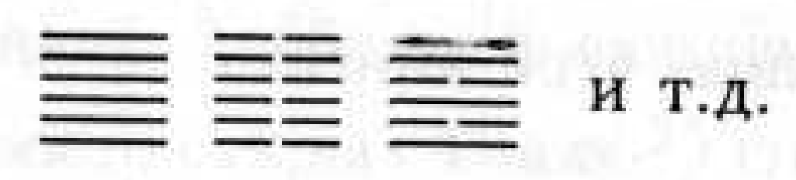

«По теории „Книги перемен", весь мировой процесс представляет собою чередование ситуаций, происходящее от взаимодействия и борьбы сил света и тьмы, напряжения и податливости, и каждая из таких ситуаций символически выражается одним из этих знаков, которых в „Книге перемен" всего 64... В европейской китаеведческой литературе они называются гексаграммами. Гексаграммы, вопреки норме китайской письменности, пишутся снизу вверх, и в соответствии с этим *счёт черт в гексаграмме начинается снизу* (См. рис. 1.). Таким образом, первой чертой гексаграммы считается нижняя, которая называется начальной, вторая черта — это вторая снизу, третья — третья снизу и т.д. Верхняя черта называется не шестой, а именно верхней (*шан*). Черты символизируют этапы развития той или иной ситуации, выраженной в гексаграмме. Места же от нижнего, начального, до шестого, верхнего, которые занимают черты, носят название *вэй* (позиции). Нечётные позиции (начальная, третья и пятая) считаются позициями света — *ян*; чётные (вторая, четвёртая и верхняя) — позициями тьмы — *инь*. Естественно, только в половине случаев световая черта оказывается на световой позиции и теневая — на теневой. Эти случаи называются „уместностью" черт: в них сила света или тьмы „обретает свое место". Вообще это рассматривается как благоприятное расположение сил, но не всегда считается наилучшим.

...Таким образом, гексаграмма с полной „уместностью" черт — это 63-я 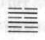, а гексаграмма с полной „неуместностью" черт — это 64-я 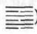.

Уже в древнейших комментариях к „Книге перемен" указывается, что первоначально было создано восемь символов из трёх черт, так называемые триграммы. Они получили определённые названия и были прикреплены к определенным кругам понятий. Здесь мы указываем их начертания и их основные названия, свойства и образы.

Из этих понятий можно заключить, как в теории „Книги перемен" рассматривался процесс возникновения, бытия и исчезновения. Творческий импульс, погружаясь в среду меона (От латинского *тео* — двигаться) — исполнения, действует прежде всего как возбуждение последнего. Дальше наступает его полное погружение в меон, которое приводит к созданию творимого, к его пребыванию. Но так как мир есть движение, борьба противоположностей, то постепенно творческий импульс отступает, происходит утончение созидающих сил, и дальше по инерции сохраняется некоторое время лишь сцепление их, которое приходит в конце концов к распаду всей сложившейся ситуации, к её разрешению.

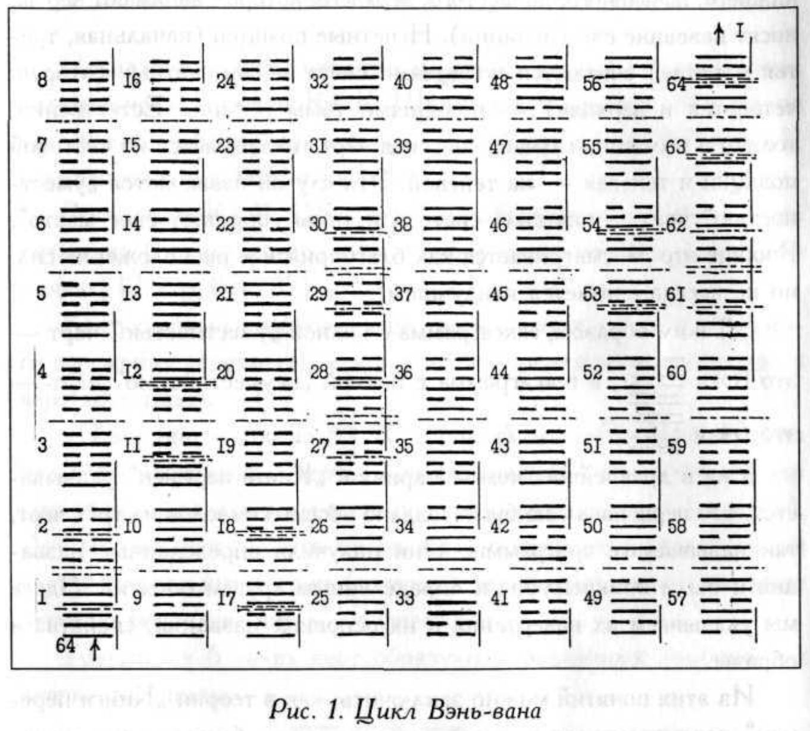

*Рис. 1. Цикл Вэнь-вана*

Каждая гексаграмма может рассматриваться как сочетание двух триграмм. Их взаимное отношение характеризует данную гексаграмму. При этом в теории „Книги перемен" принято считать, что нижняя триграмма относится к внутренней жизни, к наступающему, к созидаемому, а верхняя — к внешнему миру, к отступающему, к разрушающемуся, то есть

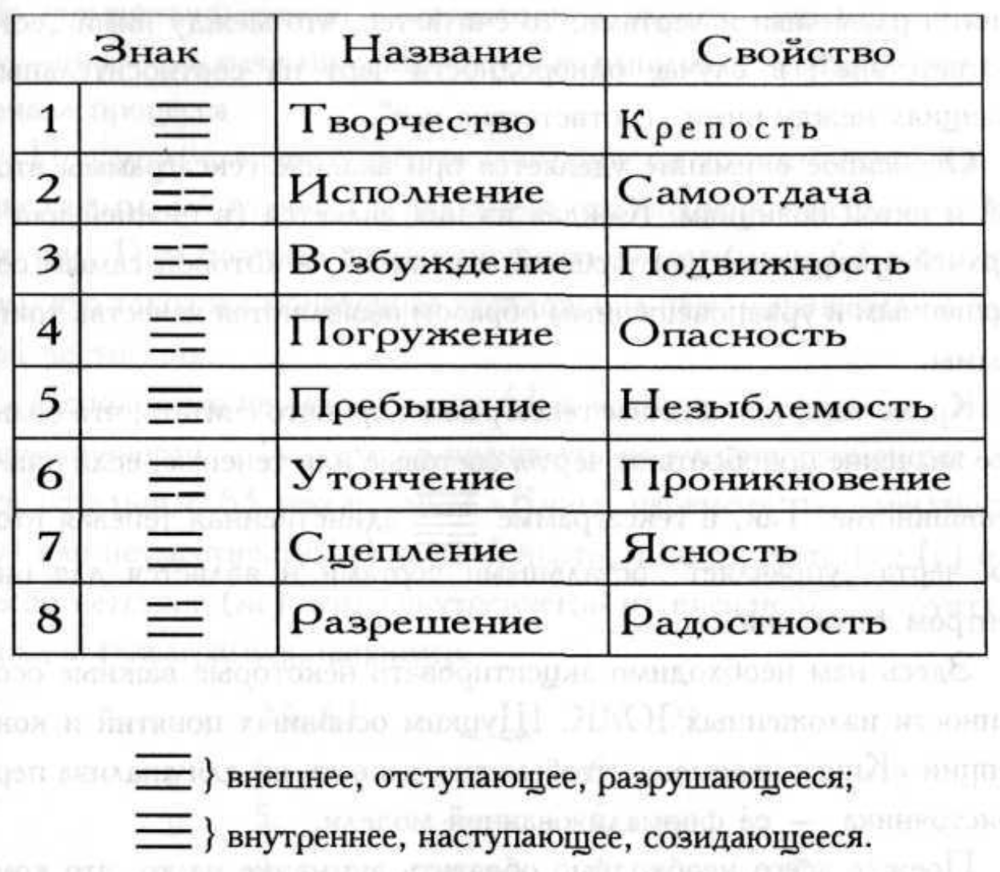

Каждая гексаграмма может рассматриваться как сочетание двух триграмм. Их взаимное отношение характеризует данную гексаграмму. При этом в теории „Книги перемен" принято считать, что нижняя триграмма относится к внутренней жизни, к наступающему, к созидаемому; верхняя — к внешнему, к отступающему, к разрушающемуся.

Кроме того, гексаграмма иногда рассматривается и как состоящая из трёх пар черт. По теории „Книги перемен" в мире действуют три космические потенции — небо, человек, земля (то есть мир сверхчеловеческий, мир людей и мир природы):

- верхние две черты — небо;
- нижние две черты — земля;
- средние две черты — человек.

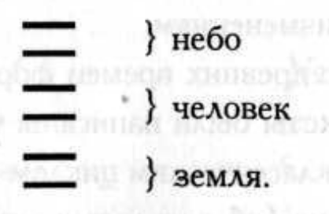

...В верхней и в нижней триграмме аналогичные позиции имеют ближайшее отношение друг к другу. Так, первая позиция стоит в отношении аналогии к четвёртой, вторая — к пятой и третья — к шестой.

Далее, полагали, что свет тяготеет к тьме так же, как тьма к свету. Поэтому и в гексаграмме целые черты корреспондируют прерванным. Если соотносительные позиции ($1—4$, $2—6$, $3—6$) заняты различными чертами, то считается, что между ними „есть соответствие"; в случае однородности черт на соотносительных позициях между ними „соответствия нет"

Особенное внимание уделяется при анализе гексаграммы второй и пятой позициям. Каждая из них является (в нижней или в верхней триграмме) центральной, т.е. такой, в которой самым совершенным и уравновешенным образом выявляются качества триграммы.

Кроме того, при анализе гексаграммы принято считать, что большее значение приобретают черты световые или теневые, если они в меньшинстве. Так, в гексаграмме 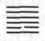 единственная теневая вторая черта „управляет" остальными чертами и является для них центром тяготения».

Здесь нам необходимо акцентировать некоторые важные особенности изложенных Ю. К. Щуцким основных понятий и концепции «Книги перемен», чтобы использовать их для анализа первоисточника — её формализованной модели.

Прежде всего необходимо обратить внимание на то, что комментаторы модели «Книги перемен» наибольшее внимание уделяли именно структурному анализу гексаграмм, и это понятно, так как очередность гексаграмм, как первоисточник, была жёстко предопределена и не подлежала изменениям.

Из трёх известных с древних времен формализованных моделей «Книги перемен» тексты были написаны только к очерёдности гексаграмм, именуемой «классическим циклом Вэнь-вана», который использовался для гадания (об остальных двух классических циклах речь пойдёт ниже).

По нашему мнению, структурный анализ гексаграмм, описанный Ю. К. Щуцким, был бы невозможен, если бы не были найдены критерии их гармоничности по полной «уместности» и полной «неуместности» (гексаграммы 63-я  и 64-я ). Этот принцип прямо вытекает из философской основы «Книги перемен» — единства и взаимозависимости противоположностей *Ян* и *Инь*. Если рассматривать процесс как чередование этих состояний, то наиболее гармонично именно их монотонное чередование (*ян*—*инь*—*ян*—*инь*—...), начинающееся с ян, как импульса, необходимого для начала процесса.

При этом следует обратить внимание на то, что «неуместная» гексаграмма 64 является зеркальным отражением «уместной» (63, см. рис. 1), и поэтому негармоничность гексаграммы 64 состоит в том, что такое же монотонное чередование черт начинается со слабой черты *инь*.

Использование гексаграммы 63 в качестве матрицы — меры гармоничности — позволяло оценивать на степень гармоничности все остальные 63 гексаграммы «Книги перемен»: по уместности (*у*) или неуместности (*н*) каждой черты и на соответствие (*с*) или несоответствие (*не*) черт «внутреннего» и «внешнего» в структуре каждой гексаграммы, например:

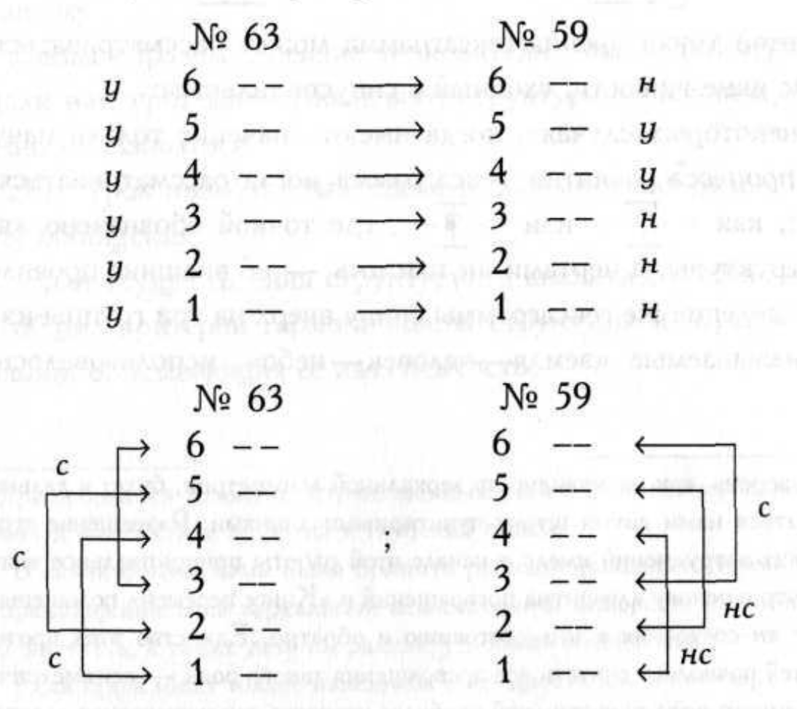

Такой критерий гармоничности, как соответствие разных черт во внутреннем и внешнем объясняется тем, что при переходе от нижней триграммы к верхней в полностью уместной гексаграмме 63 и полностью неуместной гексаграмме 64 происходит инверсия всех черт в триграммах на противоположные, а в остальных гексаграммах это происходит лишь частично $^*$, например:

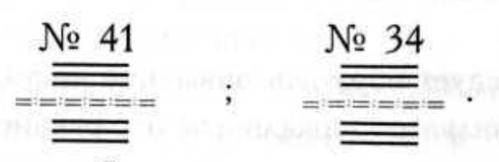

Естественно, что такой переход от внутреннего к внешнему рассматривается в текстовых комментариях к гексаграммам как «кризис», а вторая и пятая позиции в нижней и верхней триграммах считаются «центральными». В связи с этим изменчивость в гексаграмме, как чередование в ней снизу вверх состояний *ян* и *инь*, выглядит так:

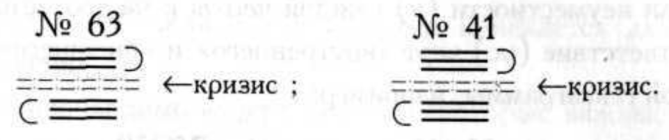

С этой точки зрения гексаграмма может рассматриваться как процесс изменчивости, сходный с синусоидальным:

В некоторых случаях, когда имеют значение только начало и конец процесса развития, гексаграмма могла рассматриваться, например, как 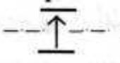 или 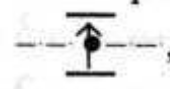 , где точкой обозначено «ядро» этой структуры, а чертами *ян* или *инь* — её внешние проявления.

Разделение же гексаграммы снизу вверх на три группы из двух черт, называемые «земля — человек — небо», использовалось при структурном анализе гексаграммы для соединения «внутреннего» с «внешним» в соответствии с философской концепцией *ян*-*инь*:

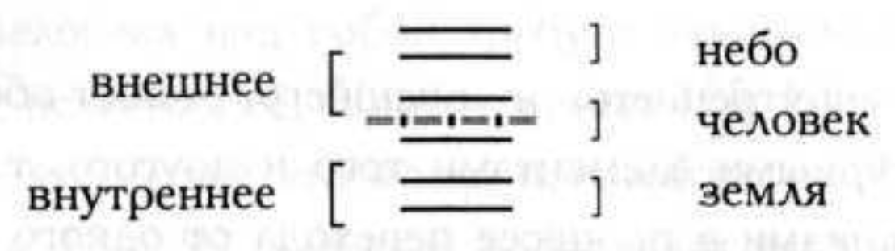

С этой же целью «ядро» гексаграммы в некоторых случаях рассматривалось комментаторами как состоящее из двух триграмм, проникающих одна в другую. Например,

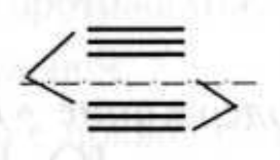

В этом примере есть нечто, относящееся к внутреннему и к внешнему.

Таким образом, древние толкователи смысла гексаграмм преподали нам урок многоуровневого структурного анализа, которым можно пользоваться.

Этот урок позволил нам сделать полезные для дальнейшей работы обобщения:

- для осуществления структурного анализа системы необходимы общие критерии гармоничности структуры и чередования состояний, описывающих её изменчивость;
- структура, или её периодическая изменчивость, может рассматриваться как состоящая из её «внутреннего» и «внешнего» проявлений;
- единство «внутреннего» и «внешнего» может обеспечиваться общими структурными элементами того и другого, т.е. промежуточными состояниями в процессе перехода от одного к другому;
- структурная изменчивость и чередование состояний существуют одновременно.

> $^*$ Инверсия, как разновидность зеркальной асимметрии, будет в дальнейшем обозначаться нами двумя штрих-пунктирными линиями. Разрешение терминологических затруднений имело в начале этой работы принципиальное значение, потому что в основу алгоритма превращений в «Книге перемен» положены переходы от *ян*-состояния к *инь*-состоянию и обратно. Единство этих противоположностей позволяет считать все превращения такого рода — асимметричными.
>
> Из такого рода превращений наиболее известна так называемая «зеркальная симмметрия», когда при зеркальном отражении объекта его «правое» меняется на «левое» (и наоборот), а очерёдность расположения одних и тех же предметов (позиций) относительно плоскости или оси отражения меняется на обратную. Всё это может быть описано термином «инверсия» (от латинского *inverto* — переворачивать). Однако в философской концепции *Ян*-*Инь* инверсия *ян*$\leftrightarrow$*инь* не ограничивается только пространственным расположением зеркальных «двойников» и имеет более широкий и глубокий смысл.
>
> В связи с этим нами было принято решение разделить терминологически превращения типа зеркальной асимметрии и инверсию противоположностей *ян*$\leftrightarrow$*инь*, а также дать им разные условные обозначения.
>
> Если происходит только изменение очерёдности *ян*- и *инь*-черт на противоположную (см. рис. 1), то такое превращение будет называться «зеркальным», и обозначаться штрих-пунктирной линией $-\cdot -\cdot -\cdot -$, а если при этом происходит также смена *ян*-черт на *инь*-черты (и наоборот) на тех же позициях, то такое превращение будет называться «инверсионным» и обозначаться двумя параллельными штрих-пунктирными линиями $=\cdot =\cdot =\cdot =$.

## 2. Краткое содержание «Книги перемен» (по комментариям Ю. К. Щуцкого)

Процесс *Творчества* (№ 1), как импульс силы, первоначально происходит в скрытом виде, затем становится видимым всем людям, претерпевает опасный кризис и, достигнув своего предела возможного, вырождается в человеке в гордыню и раскаяние.

*Исполнение* (№ 2) того, что задумано, означает отказ от творчества, подчинение себя необходимости и чужой воле. Это время действия «ничтожеств» — аморальных людей. Символ процесса исполнения — слабость.

Но это только *Начальная трудность* (№ 3) на пути становления личности, и в это время человеку нужна стойкость в его правоте. Никакого движения вперёд здесь нет.

Движению мешает *Недоразвитость* (№ 4) человека; ему нужно её осознать и преодолеть с помощью учителя (наставника)

Время активной деятельности ещё не наступило, так как самовоспитание человека ещё не завершено. Из этого следует *Необходимость ждать* (№ 5),

Результатом самопознания является *Суд* (№ 6). Это суд человека над самим собой как необходимость преодоления его недостатков. Однако, если решить дело судом над собой не удаётся, то человеку нужно собрать все свои силы, своё *Войско* (№ 7), чтобы коренным образом, хотя и с тяжёлыми потерями, изменить сложившуюся ситуацию.

Победа человека над собой требует закрепления его в новой сфере жизни, освоения её, *Приближения* (№ 8) к ней.

Для того, чтобы всё это могло произойти, необходимо *Воспитание малым* (№ 9), которое происходит в условиях больших затруднений и разлада с окружением человека; ему необходимы в это время правдивость и осмотрительность.

Только теперь появляется возможность начать *Наступление* (№ 10) вперёд, которому противостоит разрушительное влияние прошлых ошибок и заблуждений.

Решительное наступление приводит человека к *Расцвету* (№ 11). Этому состоянию свойственны гармония силы и слабости, возврат к творчеству. Но и расцвет имеет пределы возможного, и поэтому за ним с неизбежностью следует *Упадок* (№ 12).

После уничтожения упадка начинают совместно действовать *Единомышленники* (№ 13) — всё оказывается в их руках. Сообща они могут осуществить *Обладание великим* [*Владение многими*] (№ 14). Казалось бы, достигнут максимум возможного, но это застой.

Чтобы продолжить развитие, надо найти в себе решимость пройти через *Смирение* (№ 15), т.е. отказаться от всего достигнутого ранее ради сближения высших с низшими путём сознательного самоограничения. Достигнутая в результате этого *Вольность* (№ 16) создаёт условия общего равенства, в которых господствует настроение радости, когда возможно *Последование* (№ 17) за ведущим человеком.

Однако радость в последовании приводит человека к застою в его развитии, и поэтому от него требуется *Исправление* [порчи] (№ 18) предыдущих ошибок. Когда же пережитки и заблуждения устранены, наступает *Посещение* (№ 19), понимаемое здесь как сближение человека с реальной жизнью, познание её, которое достигается через спокойное и объективное *Созерцание* (№ 20).

При этом возникают чуждые человеку разрушительные силы, в борьбе с которыми ему требуется пройти через состояние, именуемое *Стиснутые зубы* (№ 21).

Искушение человека трудностями может привести человека к *Убранству* (№ 22) как чисто внешнему развитию без развития его сущности, но тогда начинается его упадок и *Разрушение* (№ 23) со многими потерями и великими трудностями.

Если же разрушение преодолено, становится возможным *Возврат* (№ 24) человека на правильный путь развития через погашение его вины, чтобы обрести *Беспорочность* (№ 25).

Беспорочность вырабатывает в человеке его лучшие качества и может привести к развитию в нем громадных моральных сил, к тому, что именуется *Воспитанием великим* (№ 26). Это воспитание делает человека более самостоятельным, как *Питание* (№ 27), без помощи извне. Но при этом как неизбежное наступает *Переразвитие великого* (№ 28), возникает новый застой в развитии человека, а за ним, также с неизбежностью, в развитии человека наступает *Повторная опасность* [*Двойная бездна*] (№ 29).

Чтобы действовать в этой крайне опасной ситуации, человеку необходимо крепко держаться своей внутренней правдивости, как *Сияние огня* (№ 30), который цепко держится за горящий материал.

Началом второй части «Книги перемен» является *Взаимодействие* [*Сочетание*] (№ 31), что означает синтез всех приобретённых человеком свойств и сил в их новом качестве. Возникает необходимость подчинения этих сил какому-нибудь постоянному закону, что и называется *Постоянством* (№ 32). Этот закон должен быть проверен и углублён человеком в уединении, для чего необходимо его *Бегство* (№ 33) от всякой деятельности на какое-то время. Это уединение развивает в человеке *Мощь великого* (№ 34), которая может в дальнейшем гарантировать ему благоприятную деятельность во внешнем мире. Этот выход вовне подобен тому, как происходит *Восход* (№ 35) солнца. Человек стремится добиться доверия других людей, но не в силах выполнить все свои обещания, и тогда неизбежно происходит *Поражение света* (№ 36), как заход солнца.

Человеку же остаётся только тихая радость в семейном кругу — *Домашние* (№ 37). Это тоже застой, и если в нём человек не выработал необходимые моральные качества, то *Разлад* (№ 38) неминуем. В разладе нельзя ему содействовать, он препятствует всякой деятельности; пока застой не преодолен, и не наступила разрядка, до тех пор он являет собой *Препятствие* (№ 39).

После того, как это препятствие преодолено, и произошло *Разрешение* (№ 40) конфликта, на некоторое время наступает неразбериха, хаос. Для преодоления хаоса человеку нужны многие самоограничения, *Убыль* (№ 41) того, чем надо пожертвовать.

Только теперь становится возможным *Приумножение* (№ 42) положительных сторон человека через создание им добра, и позволяется решимость И возможность прорыва, *Выход* (№ 43) в новую жизнь.

Но зло здесь получает возможность действовать вновь, и никакой компромисс с ним недопустим; требуется *Перечение* (№ 44) злу.

В процессе противления злу становится возможным *Воссоединение* (№ 45) людей как серьёзное и крупное дело, для которого необходимы великие жертвоприношения.

Результатом воссоединения является *Подъём* (№ 46), но силы для подъёма не беспредельны, поэтому рано или поздно наступает их *Истощение* (№ 47).

После истощения наступает внутреннее преображение человека; он как *Колодец* (№ 48), который надо очистить, чтобы он начал соответствовать своему назначению — быть полезным людям. Колодец очищен, из него пьют, и тогда наступает *Смена* (№ 49) — накопление сил. *Смена* — это момент начала нового творчества.

Для дальнейшего движения человека вперёд требуется *Жертвенник* (№ 50). Образ жертвенника — это символ внутренней переплавки человека. Эта статичная ситуация внутренней изменчивости сменяется максимальной динамичностью, образ которой — *Молния* (№ 51). Удар молнии может испугать человека, но не навредит ему, и тогда испуг сменяется радостью.

После бурного развития закономерно должно произойти противоположное — *Сосредоточенность* (№ 52) человека в самом себе, покой, остановка перед дальнейшим движением, которое подобно *Течению* (№ 53) реки: она течёт всё дальше и становится всё шире.

Наступает необходимость коренного изменения жизни, и человека мучают сомнения, как *Невесту* (№ 54) перед свадьбой. Казалось бы, цель достигнута, брак состоялся, дом заведен, и предстоит *Изобилие* (№ 55), но итог изобилия — одиночество наедине со своим богатством.

Человек не может остановиться на этом, и его ждет *Странствие* (№ 56) в поиских смысла жизни; в этом странствии он теряет всё ранее достигнутое и начинает *Проникновение* (№ 57) в новую среду своего существования.

Если проникновение приводит к достижению известной цели, и в этом человек находит большое удовлетворение, то он испытает *Радость* (№ 58), которая может затем переродиться в самодовольство и рассеяние.

На этом этапе развития человека наступает *Раздробление* (№ 59), когда он выделяется из числа других людей как личность и тогда способен выполнить свой долг перед людьми, передав им свою радость от достижения цели. При этом человеку следует соблюдать *Ограничение* (№ 60) своей индивидуальности, чтобы не ограничивать возможности выхода вовне других людей.

Чтобы человек мог быть самостоятельным, ему необходимо развивать в себе качество, которое в «Книге перемен» названо *Внутренней правдой* (№ 61); если его мысли, слова и дела совпадают, то он может легко объединяться с другими людьми для добрых дел.

Достигнув состояния внутренней правды, человек ещё может изменяться, но это будет лишь *Переразвитие малого* (№ 62); ему в этой ситуации следует лишь держаться дальше от крайностей.

В ходе творчества здесь достигнут уже этап, когда индивидуальность создана, процесс её развития завершён, и *Уже конец* (№ 63).

Конец в системе «Книги перемен» означает лишь начало нового цикла, но, чтобы его начать, нужно найти в себе моральные силы, чтобы быстро пройти через хаос, который бывает перед новым циклом, новым творчеством и потому — *Ещё не конец!* (№ 64).
