# Глава I. Модели изменчивости «Книги перемен»

## Введение

Предлагаемая работа не относится к области востоковедения.
«Книга перемен» («И цзин»), или «Канон перемен», интересовала нас только как модель естественного саморазвития, причём только в её формализованном виде. Поэтому целью работы изначально было обнаружение алгоритма её построения и моделей изменчивости, которые затем проверялись на соответствие известным диалектическим законам.

Поскольку «Книга перемен» существует в востоковедческой литературе [2] в трёх вариантах как цикл Вэнь-вана, цикл Фу-си и Мавандуйский цикл, нам предстояло исследовать алгоритм построения каждого и сравнить их между собой.

Известно, что только цикл Вэнь-вана использовался для гадания применительно к человеку, тогда как назначение цикла Фу-си и Мавандуйского цикла оставалось неясным.

Все классические варианты «Книги перемен» в их формализованном виде построены из одного и того же набора из 64 гексаграмм.

Переводчик основного текста «Книги перемен» на русский язык Ю. К. Щуцкий написал о них в своих комментариях следующее: «Каждая гексаграмма представляет собой символ той или иной жизненной ситуации, которая развёртывается во времени» [2, стр. 234].

В классических вариантах «Книги перемен» очерёдность гексаграмм жёстко определена. Ю. К. Щуцкий в своём комментарии к циклу Вэнь-вана констатировал следующее: «...связь афоризмов друг с другом, их смену необходимо рассматривать как конкретизацию семи основных положений „Книги перемен", унаследованных от этого реального текста всеми комментаторами, несмотря на их различие. Вот они в общих чертах:

1. мир представляет собой и изменчивость, и неизменность, и, более того, их непосредственное единство;
2. в основе этого лежит проходящая через весь мир полярность, антиподы которой столь же противоположны друг другу, сколь и тяготеют друг к другу, в их отношениях проявляется мировое движение как ритм;
3. благодаря этому ритму ставшее и ещё не наступившее объединяются в одну систему, по которой будущее уже существует и в настоящем как „ростки" наступающих событий;
4. необходимо и теоретическое понимание, и практическое осуществление этого, и, если деятельность человека нормирована таким образом, то он гармонично включается в своё окружение;
5. таким образом исключается конфликт внутреннего и внешнего, и они лишь развивают друг друга тем, что внутреннее определяется внешним и творит во внешнем;
6. при этом личность уделяет достаточное внимание как себе, так и окружающему обществу, и, довольствуясь своим положением, находит возможность высшей формы творчества — творчества добра, — а не выполнения каких-либо правил прописной морали;
7. так, благодаря выраженному единству абстракций и конкретности, достигается полная гибкость системы» [2, стр. 235].

Приведенный комментарий Ю. К. Щуцкого послужил основой для работы по анализу структуры «Книги перемен» и обнаружению алгоритмов построения вариантов формализованных моделей «Книги перемен».

Эта работа началась с обнаружения алгоритма цикла Вэнь-вана, как наиболее исследованной системы.

Для этого нам понадобилось отступить от традиционного подхода к исследованию формализованной модели цикла Вэнь-вана, сделав основой для исследования известные законы диалектической изменчивости.

Как уже было отмечено нами во введении в систему «Книги перемен», она состоит из структурных единиц, называемых гексаграммами, как очерёдности из 6 черт *ян* и *инь*. Каждая такая структурная единица рассматривалась как завершённое целое.

Цикл из таких структурных единиц также можно рассматривать как единое целое.

Модели классического цикла Вэнь-вана (как и цикла Фу-си) представлены в специальной литературе в двух вариантах: как круговое и как квадратное расположение гексаграмм в порядке их установленной очерёдности. Известно также, что в цикле Вэнь-вана гексаграммы размещены зеркально симметричными парами, что должно было наводить на мысль, что вместе они должны образовывать новую структурную единицу.

Принцип построения таких структурных единиц можно рассматривать на основе древнекитайских понятий чётного и нечётного [3, стр. 234]: «Нечётное содержит и выделяет из себя чётное, которое есть лишь внешнее двустороннее (правое и левое, *инь* и *ян*) проявление нечётного... в этом смысле все чётные одинаковы между собой как выражение симметричного размещения, а нечётные — как выражение иерархического расположения. В этом смысле все нечётные являются выражением целого, то есть единого, рассматриваемого в качестве сложной составной единицы». Эти понятия существуют вне количественных представлений, поэтому, например, простейшие единицы типа $\overbrace{010}$ и $\underbrace{101}$ принципиально не отличаются от единиц типа $\underbrace{0\cdot 0}$ и $\overbrace{1\cdot 1}$, где точкой обозначено нечто целое любой степени сложности.

Раньше это было показано нами на примерах того, как древними исследователями «Книги перемен» осуществлялся структурный анализ гексаграмм как целого, имеющего центральное ядро и внешние по отношению к нему позиции.

Характерно то, что и в круговом, и в квадратном классическом расположении гексаграмм цикла Вэнь-вана каждая гексаграмма рассматривается как отдельная структурная единица, а связь между ними прослеживается только в комментаторских текстах. Поскольку же, как отмечал Ю. К. Щуцкий, цикл представляет собой развитие ситуации во времени, такой принцип построения цикла Вэнь-вана противоречит принципу единства непрерывности и дискретности как одному из законов естественного развития мира.

Чтобы устранить это противоречие, нами было принято решение применить принцип построения гексаграммы — столбиком из 6 черт снизу вверх — ко всему циклу Вэнь-вана так, чтобы следующая гексаграмма «надстраивалась» на предыдущую как этаж при постройке многоэтажного дома. В этом случае цикл Вэнь-вана превращается в очерёдность из 384 *ян*- и *инь*-черт, то есть в очерёдность состояний. Именно в таком виде цикл Вэнь-вана представлен на рис. 1 и 2.

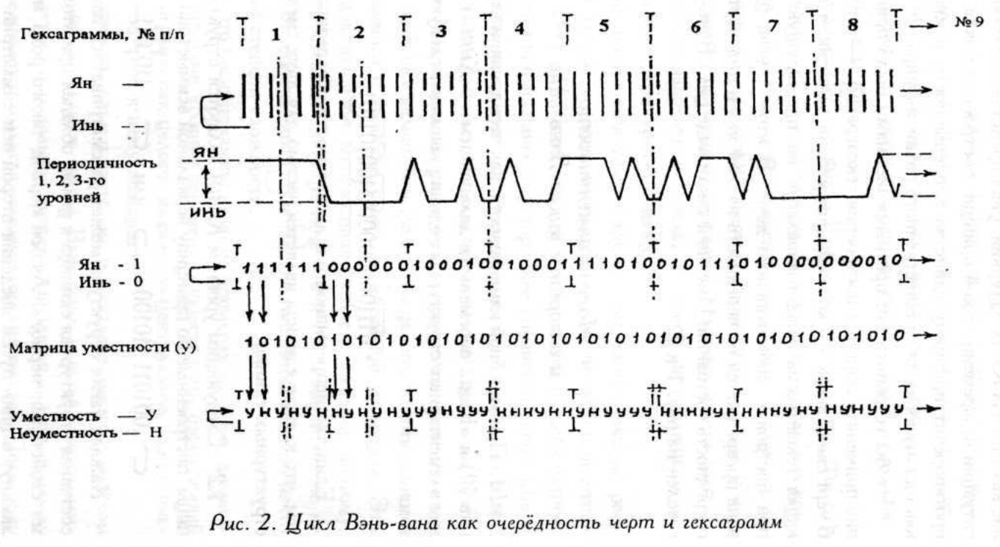
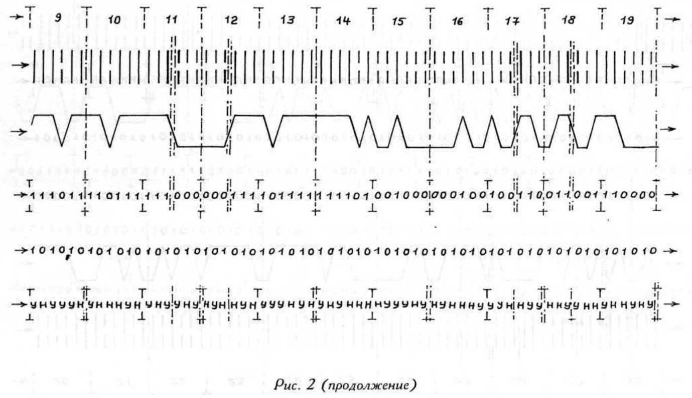
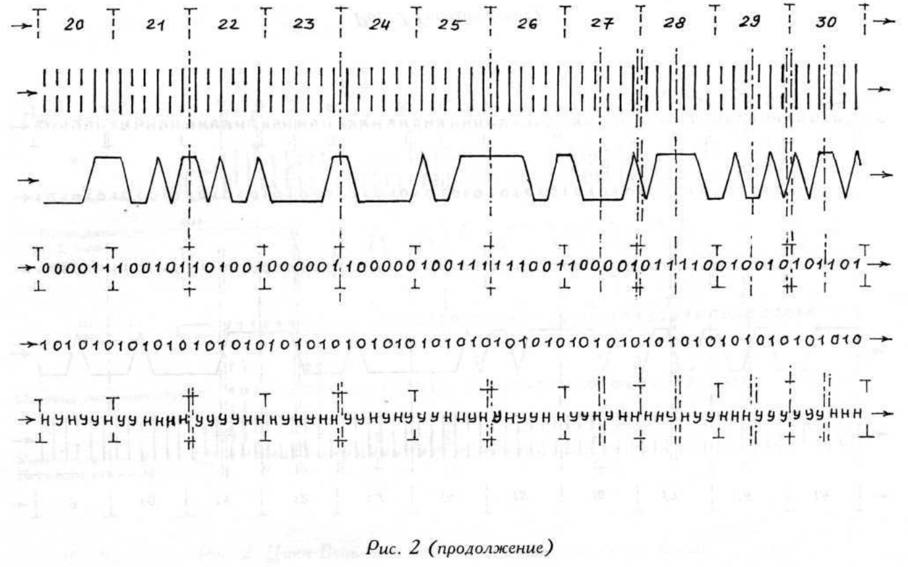
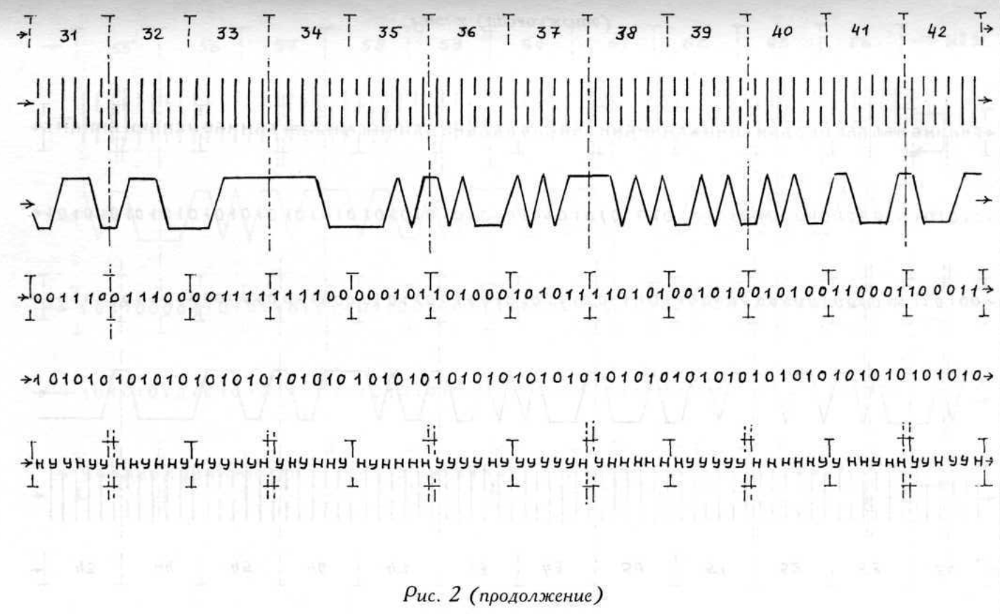
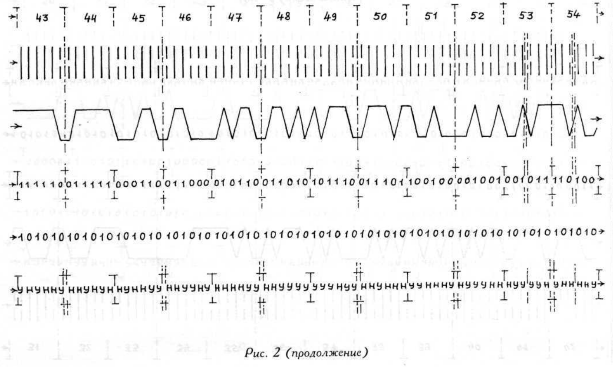
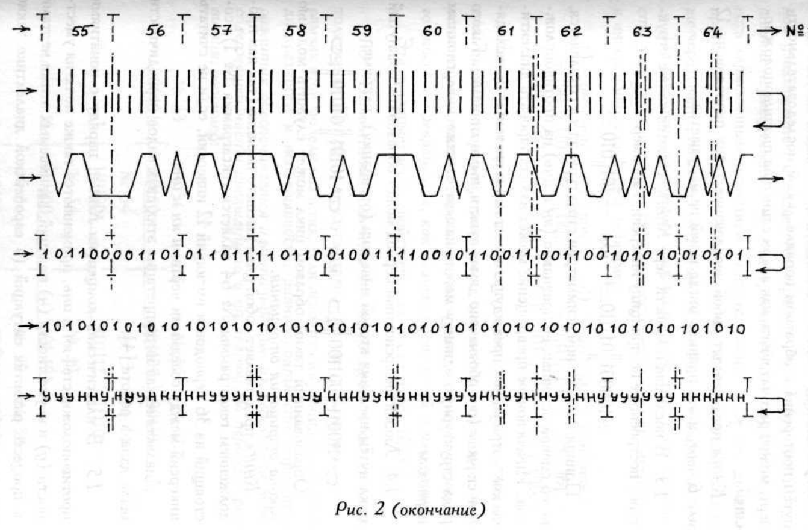

*Рис. 2. Цикл Вэнь-вана как очерёдность черт и гексаграмм (Формализованная структура цикла Вэнь-вана)*

## Модели изменчивости и алгоритм цикла Вэнь-вана

### 1.1

При линейной изменчивости, как чередовании черт *ян* $(1)$ и *инь* $(0)$ в «Книге перемен» (в дальнейшем — *КНИГА*), образование элементарных структурных единиц выглядит следующим образом:

$$\overrightarrow{\ldots} \overline{011\underline{10}}\underline{000000\overline{01}}\overline{110}0101101 \overrightarrow{\ldots}\leadsto$$

$$\overrightarrow{\ldots} \widetilde{011\underline{10}}\underline{000000\widetilde{01}}\widetilde{110}0101101 \overrightarrow{\ldots}\leadsto$$

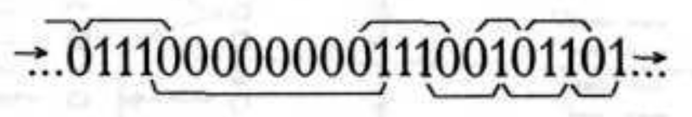

Единство непрерывности и дискретности обеспечивается здесь тем, что каждая единица является частью для двух смежных с ней структурных единиц.

### 1.2

Следующим уровнем *КНИГИ* являются структурные единицы, построенные по принципу зеркальной асимметрии, например:

```
...001011 110100...  или  ...11 0 0 11...
```

$$\subset^{\rightarrow} \hookrightarrow _{\leftarrow}\supset ☰ ☱ ☲ ☳ ☴ ☵ ☶ ☷ ⚊ ⚋ ⚌ ⚍ ⚎ ⚏ ‖ ⁀ ‿ ⸽ ⸾ ⤾ ⤿ ⸦⸧ ⸡ ⸠ ⊂ ⊃ ⫴ ⫲ ⫳ $$
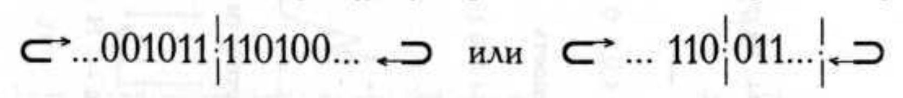

Каждая такая структура может рассматриваться как нечётное, составная структурная единица и целое, обладая при этом основными свойствами периода. Любой период такого рода может быть замкнут в цикл путём введения второй оси симметрии.

Образование периода из двух асимметричных частей, то есть путём повторения в обратном порядке любой последовательности черт, можно рассматривать как закон единства противоположностей.

*КНИГА* представляет собой чередование таких периодов из 12 или 6 черт, и это правило нигде в ней не нарушается.

### 1.3

В последовательности черт *КНИГИ* имеются также структуры, построенные по принципу инверсии, например:

```
...1000011|011110...  или  ...1 1 10 01...
```
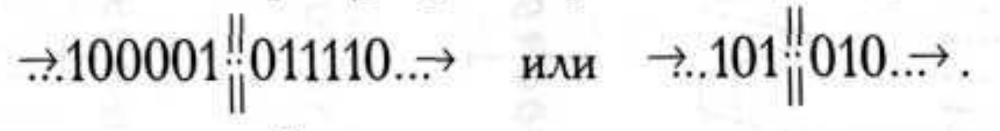

Принцип зеркальной асимметрии структуры здесь сохраняется, но со сменой основных её признаков (*ян* и *инь*) на противоположные. Инверсионное превращение может иллюстрировать диалектическое «отрицание» предыдущего состояния системы, происходящее скачком (оно обозначено двумя пунктирными линиями). Такого рода структурную единицу можно называть также инверсионным периодом.

### 1.4

Любой инверсионный период может образовать замкнутый цикл путём введения второй инверсии (отрицания), например:

```
10011 10011001  или  10101..01010..
```
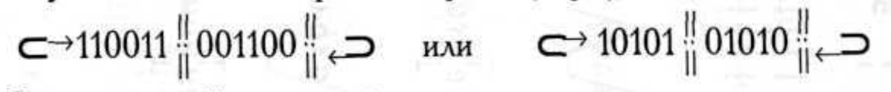

Образованный таким образом цикл может служить моделью закона *отрицания отрицания*.

*КНИГА* представляет собой цикл высшего порядка (так как продолжением гексаграммы № 64 является гексаграмма № 1), состоящий из 36 периодов и имеющий 12 инверсий, если не считать инверсий между соседними чертами *ян* и *инь*.

Диалектическая интерпретация этих двух видов периодичности была дана в работе [4].

### 1.5

В классической концепции *КНИГИ*, наряду с понятиями противоположностей *ян* и *инь*, применяются также понятия уместности (*у*) и неуместности (*н*) позиций, занимаемых этими чертами в процессе развития ситуаций (в европейской диалектике такие понятия отсутствуют).

В системе анализа гексаграмм *КНИГИ* постулируется, что *полной уместностью* обладает гексаграмма № 63 (*у*) $101010 \overrightarrow{\ldots}$, а *полной неуместностью* — гексаграмма № 64 (*н*) $010101 \overrightarrow{\ldots}$, то есть гармоничным развитием считается монотонное чередование противоположных состояний, начиная с черты *ян* (сильной), а такое же чередование, начиная с черты *инь* (слабой), — негармоничным.

На важность применения понятий *уместности* и *неуместности* указывает оценка на гармоничность зеркально симметричных и инверсионных периодов, например:

```
а)  уун нуу | |нну | унн       б)  ннн) |ууу | ууу| | ннн
    100 11| 110 1|1 011 11| 001
    (у) 101 1 | 010 | 101 1 |010       (у) 101 | 010 1 |101 1 |010
```
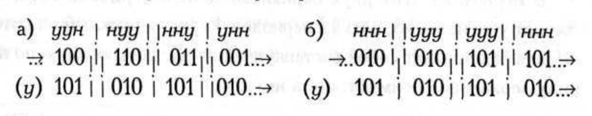

*Приведённые примеры демонстрируют диалектическую дуалистичность процесса развития, проявляющуюся через синхронность и единство зеркально-симметричного и инверсионного способов превращения, как разных проявлений асимметрии.*

Эта закономерность свойственна всей структуре *КНИГИ*.

### 1.6

Вариантность развития (полифуркация) в классическом толковании Книги не предусмотрена, но она вполне возможна в рамках этой модели развития, если исходить из принципа единства дискретности и непрерывности: *равновероятность вариантов развития обеспечивается идентичностью их переходной зоны, содержащей части предыдущего и последующего периодов развития*, например:

```
      №53     № 54           ПФ          № 55        № 56
-> ...101011 | 110100          |      101100 | 001101...
                  |           |
                  |     № 13  |  № 14
                  | 101111    | 111101..
                  |           |
                  |  № 54     |  № 30
                  | 110100    | 101101..
                  |           |
                  |  № 54     |  № 31  № 38
                  | 110100    | 101011 | 110101..
```
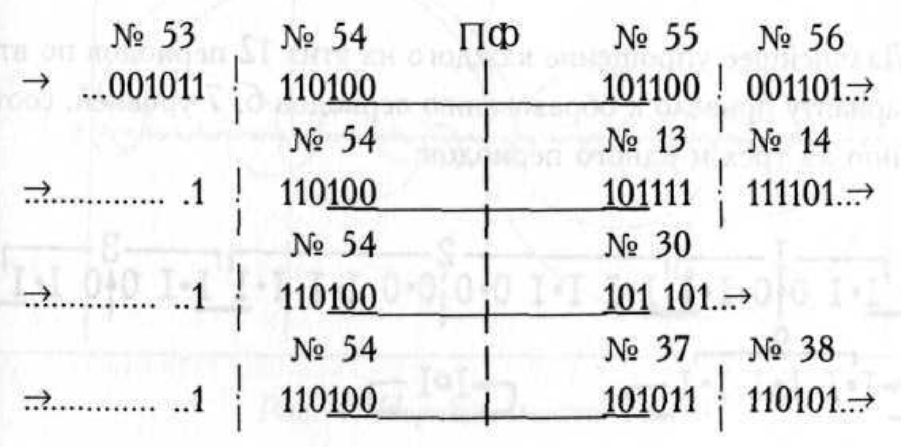

### 1.7

Как было отмечено ранее, *структура КНИГИ* представляет собой чередование 36 периодов, построенных по принципу зеркальной асимметрии из 6 и 12 черт, то есть состоит из 1, 2, 3-го уровней периодичности, соответственно, из триграмм, гексаграмм и пар гексаграмм.

Каждый такой период, как *Нечётное*, *Целое* и составная *Единица*, например $01001|100110$, может быть представлен в упрощённом виде, как $0\cdots 1|1\cdots 0$ или $0\cdot 0$.

В первом из этих двух вариантов записи периодов *КНИГИ* она состоит уже не из 36, а из 12 периодов 4 уровня, каждый из которых также представляет собой составную единицу, построенную по принципу зеркальной асимметрии, а именно:

```
4 — -00-10-00-0 1-1 1-1 1-010-1-
   -1-1 1-1 0-00-0 1-0 0-1" 1-0 0-1 1-1 1-1 0-П1-0 1-1 1-1-
   ...
```
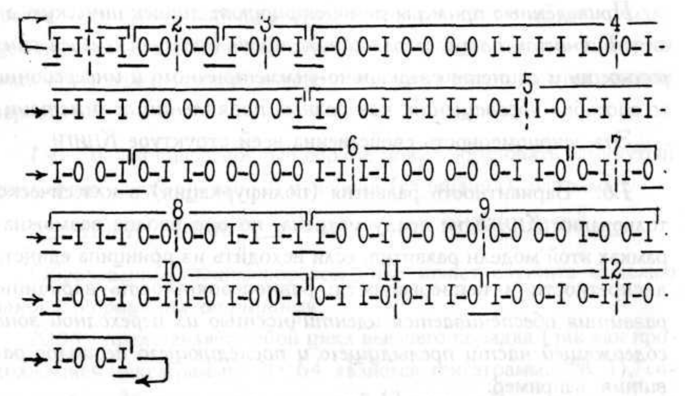

Дальнейшее упрощение каждого из этих 12 периодов по второму варианту привело к образованию периодов 6, 7 уровней, соответственно из трёх и одного периодов:

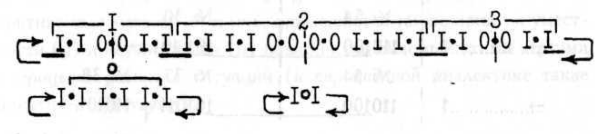

При упрощении типа 1-1 или 0-0 периодов *КНИГИ* 2-го и 3-го уровней, т.е. из 6 и 12 черт, образуется цикл 5 уровня из 4 или 5 периодов (рис. 3а). Первым периодом 5 уровня является гексаграмма № 1 (Творчество). Второе упрощение типа $1\cdot 1$ или $0\cdot 0$ даёт периоды 7 уровня (рис. 3б). Периодичность *КНИГИ* 2, 3, 4, 5, 6, 7-го уровней, представленная нами в виде синусоидальных кривых, показана на рис. 4.

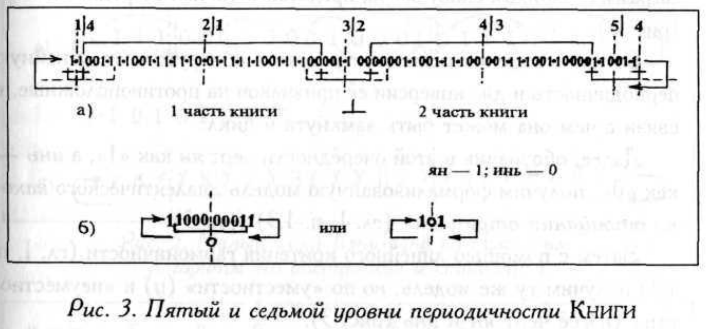

*Рис. 3. Пятый и седьмой уровни периодичности КНИГИ*

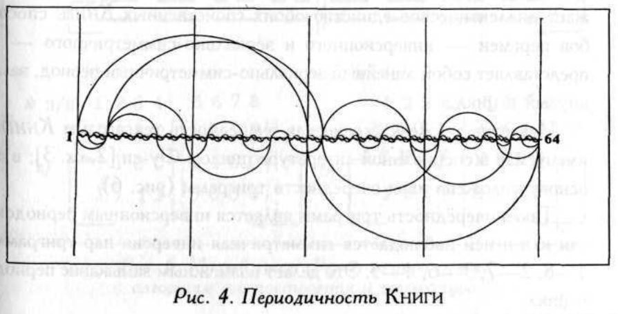

*Рис. 4. Периодичность КНИГИ*

Таким образом, было установлено, что периодичность высшего порядка обнаруживается в переходных зонах между периодами низшего порядка и в зонах асимметричных превращений, что обеспечивает единство непрерывности и дискретности развития. Всего в цикле Вэнь-вана нами было обнаружено семь уровней периодичности (рис. 4).

### 1.8 Классические модели периодичности и цикличности из триграмм

Ранее нами была проанализирована формализованная структура *КНИГИ*, именуемая циклом Вэнь-вана и представленная на рис. 1 и 2.

Принято считать, что в основу этого варианта *КНИГИ* положена следующая очерёдность 8 триграмм как сочетаний *ян*- и *инь*-черт [2, сх. 4] (рис. 5).

Применив к этой очерёдности триграмм приём построения гексаграмм столбиком снизу вверх, представим их как очерёдность черт (рис. 5).

В таком виде очерёдность триграмм обнаруживает линейную периодичность и две инверсии её признаков на противоположные, в связи с чем она может быть замкнута в цикл.

Далее, обозначив в этой очерёдности черт *ян* как «1», а *инь* — как «0», получим формализованную модель диалектического *закона отрицания отрицания* (гл. I, п. 1.3) (рис. 5).

Затем с помощью линейного критерия гармоничности (гл. I, п. 1.5) получим ту же модель, но по «уместности» (*у*) и «неуместности» (*н*) её черт *ян* и *инь* (рис. 3).

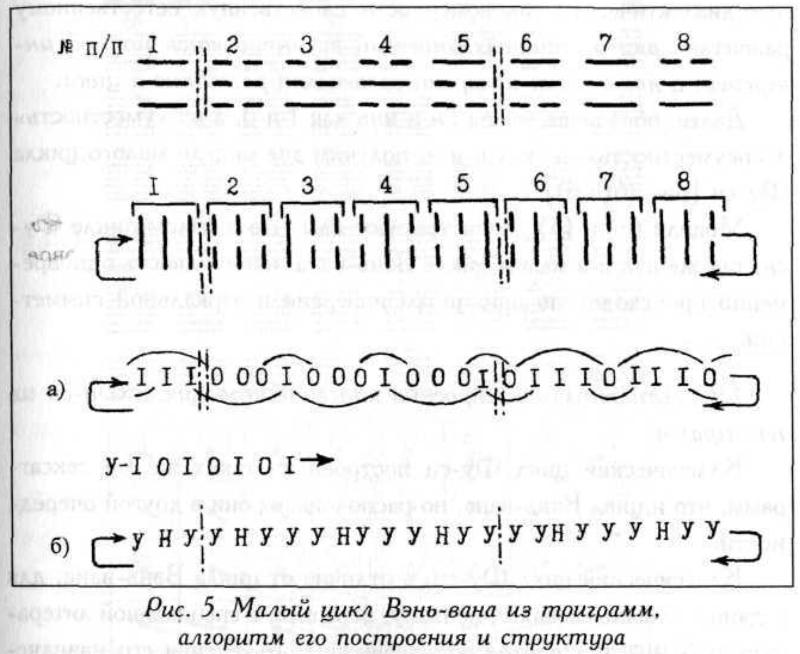

*Рис. 5. Малый цикл Вэнь-вана из триграмм, алгоритм его построения и структура*

Таким образом, нами обнаружено, что эта модель также отражает диалектическое единство обоих свойственных *КНИГЕ* способов перемен — инверсионного и зеркально-симметричного — и представляет собой линейный зеркально-симметричный период, замкнутый в цикл.

Известна также классическая очерёдность гексаграмм *КНИГИ*, именуемая в специальной литературе циклом Фу-си [2, сх. 3]; в её основу положена иная очерёдность триграмм (рис. 6).

Такая очерёдность триграмм является инверсионным периодом, так как в ней наблюдается симметричная инверсия пар триграмм: $1—8$, $2—7$, $3—6$, $4—5$. Это делает возможным замыкание периода в цикл.

В данном цикле отличие двух соседних триграмм в очерёдностях $1\rightarrow 2\rightarrow 3\rightarrow 4$ и $5\rightarrow 6\rightarrow 7\rightarrow 8$ выглядит как инверсия одной или двух черт, а между триграммами $4\rightarrow 5$ и $8\rightarrow 1$ — как инверсия всех трёх черт одновременно.

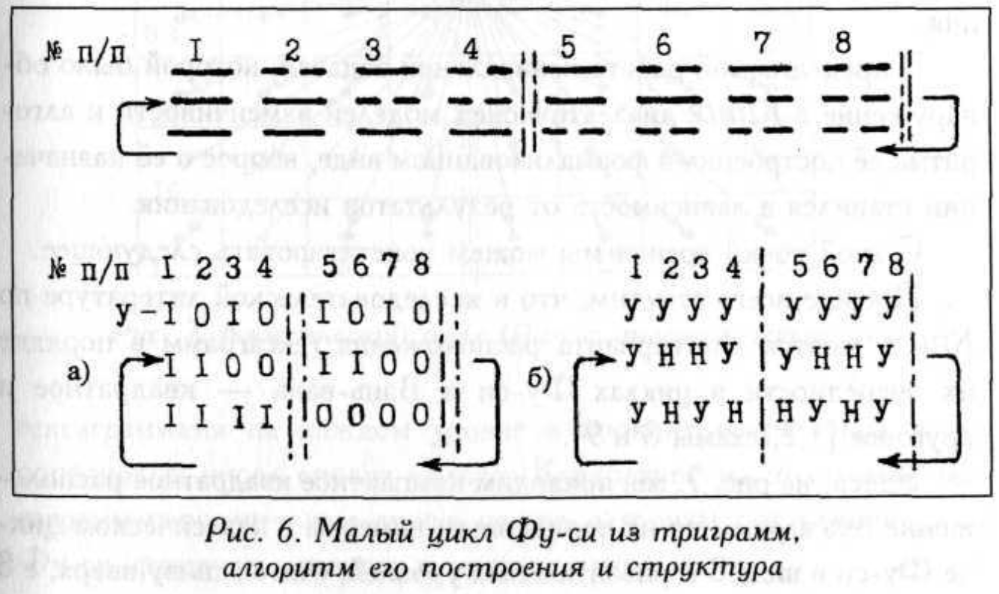

*Рис. 6. Малый цикл Фу-си из триграмм, алгоритм его построения и структура*

Эта особенность строения малого цикла Фу-си отражает важную диалектическую закономерность, свойственную естественному развитию: *ряд частичных инверсий заканчивается полной инверсией, а две полные инверсии замыкают развитие в цикл*.

Далее, обозначив черты *ян* и *инь* как $1$ и $0$, а их «уместность» и «неуместность» — как *у* и *н*, получим две модели малого цикла Фу-си [рис. 6(а,б)].

Модели (а) и (б) демонстрируют нам, что в малом цикле Фу-си, так же как и в малом цикле Вэнь-вана, изменчивость одновременно происходит по принципам инверсии и зеркальной симметрии.

### 1.9 Алгоритмы построения классического цикла Фу-си из гексаграмм

Классический цикл Фу-си построен из таких же 64 гексаграмм, что и цикл Вэнь-вана, но расположены они в другой очерёдности.

Классический цикл Фу-си, в отличие от цикла Вэнь-вана, для гадания не использовался, поэтому, наверное, в специальной литературе о *КНИГЕ* нет вполне определённого объяснения его назначения.

В предлагаемой работе изначальной задачей, которой было обнаружение в *КНИГЕ* диалектических моделей изменчивости и алгоритма её построения в формализованном виде, вопрос о её назначении ставился в зависимость от результатов исследования.

С этой точки зрения мы можем констатировать следующее.

Прежде всего отметим, что в исследовательской литературе по *КНИГЕ* даются два варианта расположения гексаграмм в порядке их очерёдности в циклах Фу-си и Вэнь-вана — квадратное и круговое [1,2, схемы 8 и 9].

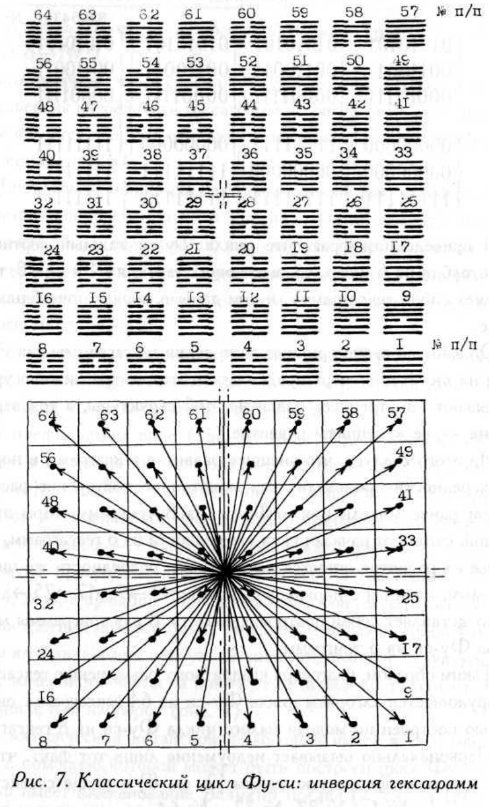

*Рис. 7. Классический цикл Фу-си: инверсия гексаграмм*

Здесь, на рис. 7, мы приводим компактное квадратное расположение гексаграмм по их порядковым номерам в классическом цикле Фу-си в виде 8 горизонтальных уровней, считая снизу вверх, с 8 гексаграммами на каждом уровне в порядке возрастания в них порядковых чисел справа налево. Квадратное расположение гексаграмм позволяет нам лучше понять алгоритм построения цикла Фу-си, фрагмент которого приводится нами ниже.

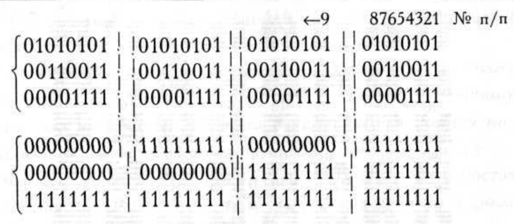

В приведенном фрагменте цикла Фу-си каждый вертикальный столбик из 6 цифр, обозначающих черты *ян*-$1$ и *инь*-$0$, представляет собой гексаграмму, и они даны в порядке очерёдности в цикле.

Описанный выше принцип построения гексаграммы как структуры из *ян*- и *инь*-черт предполагает, что её три нижние уровня описывают «внутреннее» развитие этой структуры, а три верхние уровня — её «внешнее» развитие.

Из этого следует, что внешнее развитие гексаграмм в порядке их очерёдности происходит как монотонное повторение рассмотренной ранее модели цикла Фу-си из 8 триграмм. При этом в каждой, считая от начала цикла, очерёдности из 8 гексаграмм, внутреннее их развитие остается неизменным; очерёдность же нижних триграмм, начиная с порядковых номеров $1\rightarrow 9\rightarrow 17\rightarrow 25\rightarrow \ldots$ также представляет собой повторяющиеся по 8 раз триграммы малого цикла Фу-си из 8 триграмм.

Таким образом, благодаря квадратному размещению гексаграмм, обнаруживается алгоритм цикла Фу-си из 64 гексаграмм: он полностью построен по модели малого цикла Фу-си из 8 гексаграмм.

Первоначально вызывает недоумение лишь тот факт, что при круговом размещении гексаграмм [2, сх. 8] в цикле соседствуют гексаграммы № 1 и № 33, № 32 и № 64, то есть номера гексаграмм в круговом цикле сначала возрастают в очерёдности № 1 $\rightarrow$ № 32 и затем убывают в очередности № 64 $\rightarrow$ № 33. В круговом цикле, в отличие от квадратного размещения гексаграмм, очерёдность триграмм в середине цикла изменяется также по модели малого цикла Фу-си, но на обратный порядок триграмм с номерами № 8 $\rightarrow$ № 5.

Это означает, что в середине кругового цикла Фу-си происходит инверсия очерёдности гексаграмм и триграмм на обратную, что также является, как уже отмечалось нами ранее, условием образования периода и цикла.

Цикл Фу-си можно рассматривать также как линейную периодичность одновременно на 6 уровнях. Тогда, как это видно на фрагменте цикла, оказывается, что «внутреннему» развитию структур гексаграмм свойственно сочетание зеркальной и инверсионной периодичности, а «внешнее» развитие происходит только в виде инверсионных периодов.

Не изменяя алгоритма построения цикла Фу-си и следуя философской концепции *КНИГИ*, мы посчитали целесообразным изменить классическое построение этого цикла.

В предлагаемом виде (рис. 8) цикл Фу-си состоит из двух циклов: в одном из них преобладают черты *ян* (112 черт *ян* и 80 черт *инь*), а в другом — черты *инь* (112 черт *инь* и 80 черт *ян*), при этом в *ян*-цикле все гексаграммы начинаются с нижней черты *ян*, а в *инь*-цикле — с черты *инь*. Переход от цикла *ян* к циклу *инь* и обратно происходит как полная инверсия гексаграмм № 1 и № 64, хотя, в принципе, он возможен с любой гексаграммы, так как при построении полного цикла описанным образом каждая гексаграмма *ян*-цикла имеет парную ей, инвертированную структурно (то есть с заменой *ян*-черты на *инь*-черту или наоборот) гексаграмму в *инь*-цикле или наоборот (рис. 7).

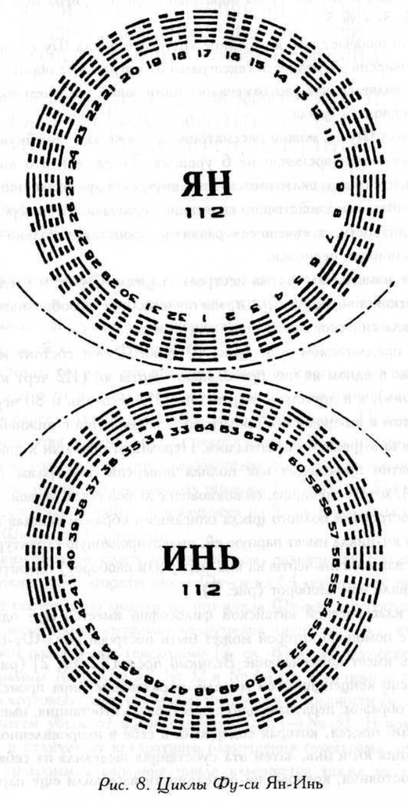

*Рис. 8. Циклы Фу-си Ян-Инь*

В классической китайской философии имеется ещё одна модель, с помощью которой может быть построен цикл Фу-си. Эта модель имеет наименование *Великий предел* [2, сх. 2] (рис. 9а).

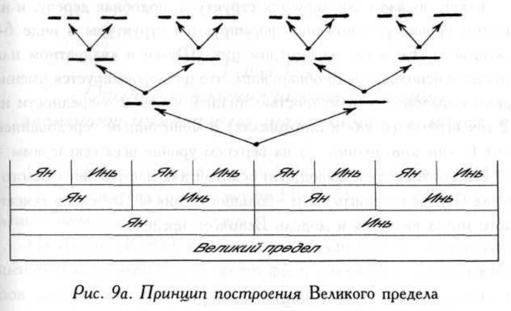

*Рис. 9а. Принцип построения Великого предела*

Согласно концепции этой модели, образование мира происходило таким образом: первоначально существовала субстанция, именуемая *Великий предел*, которая содержала в себе в непроявленном виде состояния *ян* и *инь*, затем эта субстанция выделила из себя *ян*- и *инь*-состояния, которые по-отдельности выделили ещё пару *ян* и *инь* и т.д. Этот принцип «размножения» *ян*- и *инь*-состояний показан на рис. 9а. *Великий предел* может быть превращён в цикл путём введения двух инверсий: смену тенденции к «размножению» *ян*- и *инь*-состояний на обратную (рис. 9б) — их «свёртывание».

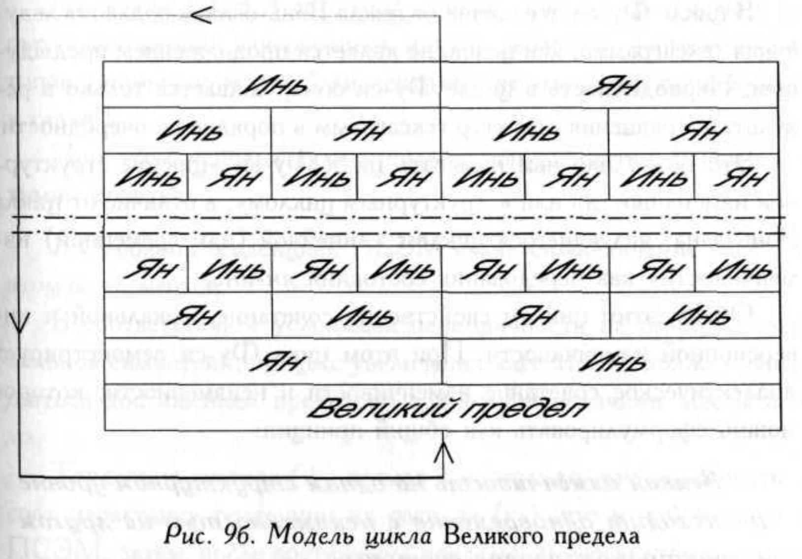

*Рис. 9б. Модель цикла Великого предела*

Таким образом формируется структура, подобная дереву, и на шестом уровне размножения формируются структуры в виде 64 гексаграмм. Если мы рассмотрим цикл Фу-си в квадратном или круговом исполнении, то обнаружим, что цикл формируется именно таким образом: с неизменностью нижней черты в очерёдности из 32 гексаграмм (в *ян*- и *инь*-циклах) и монотонным чередованием черт ($\ldots \rightarrow$*ян*$\rightarrow$*инь*$\rightarrow$*ян*$\rightarrow$*инь*$\rightarrow\ldots$) на верхнем уровне всех гексаграмм.

Из этого следует вывод, что основой для построения «малого» цикла Фу-си из триграмм и «большого» цикла Фу-си из гексаграмм могла являться и модель *Великого предела*.

## Общие выводы

В цикле Фу-си, в отличие от цикла Вэнь-вана, каждая последующая гексаграмма, как целое, не является продолжением предыдущей. Периодичность в цикле Фу-си обнаруживается только в результате сравнения структур гексаграмм в порядке их очерёдности.

Это позволило нам называть цикл Фу-си «циклом структурной изменчивости» или «структурным циклом», в отличие от цикла Вэнь-вана, являющегося циклом «линейной (или временной) изменчивости» как чередования состояний *ян*-*инь*.

Обоим этим циклам свойственно сочетание зеркальной и инверсионной изменчивости. При этом цикл Фу-си демонстрирует диалектическое сочетание изменчивости и неизменности, которое можно сформулировать как общий принцип:

> **Всякая изменчивость на одном структурном уровне происходит одновременно с неизменностью на другом структурном уровне системы.**

В следующих двух главах мы попробуем применить эти модели изменчивости в конкретном исследовании.
