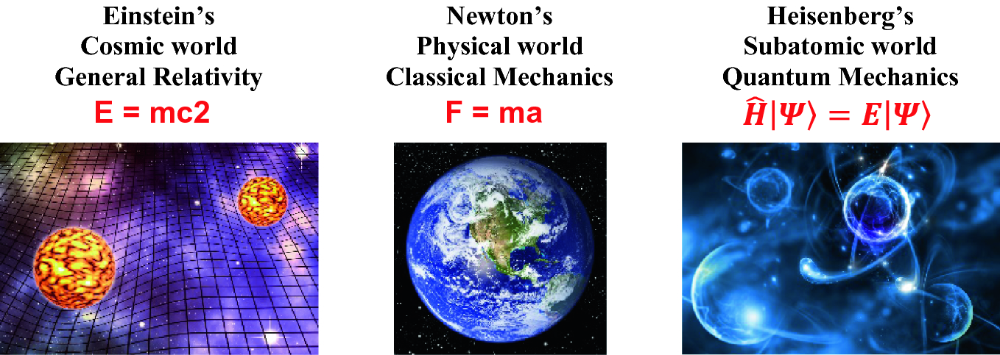
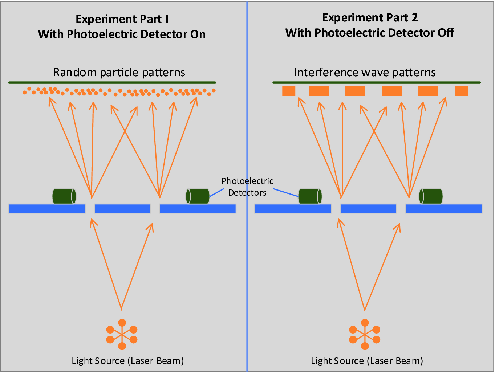
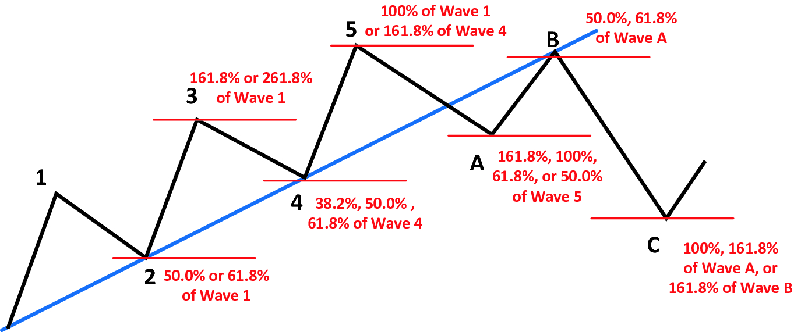
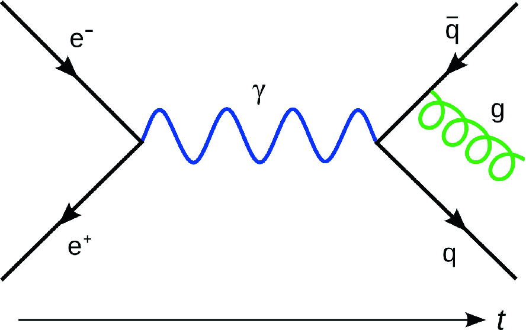
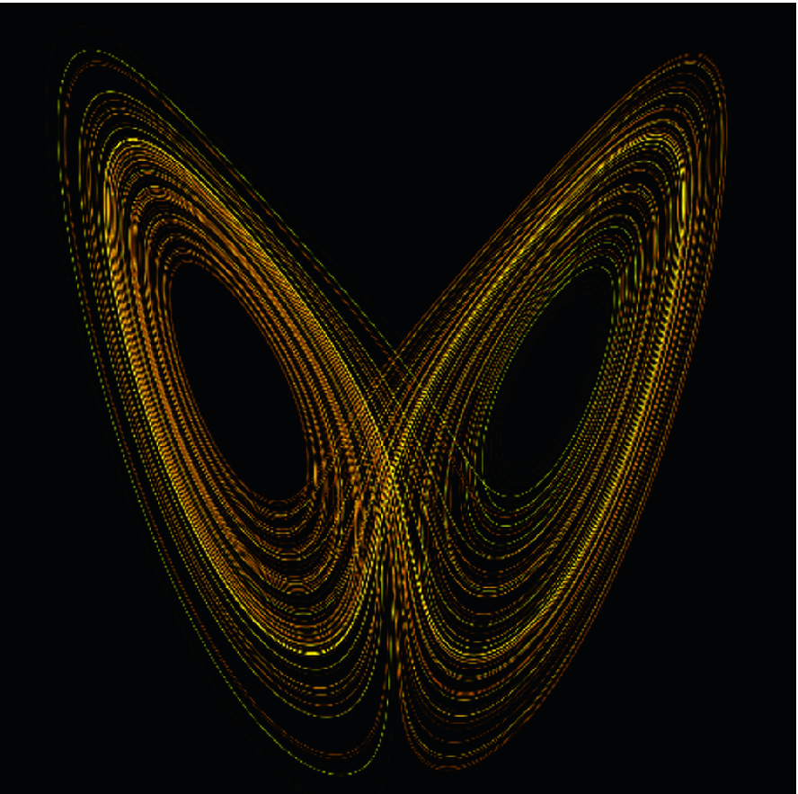
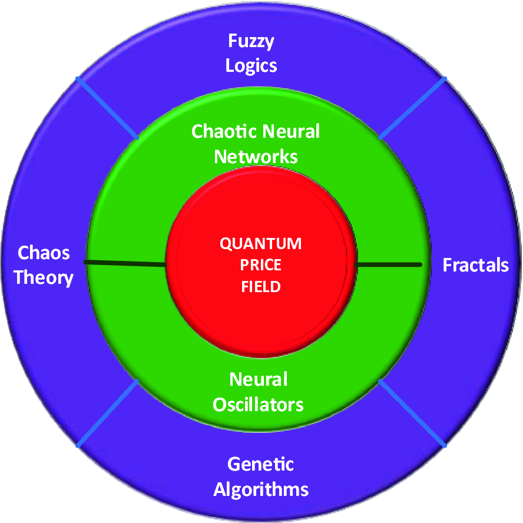

# 1\. Introduction to Quantum Finance

 _As far as the laws of mathematics refer to reality, they are not certain; and as far as they are certain, they do not refer to reality._

Albert Einstein (1879–1955)

- _What is the world of reality?_

- _Is there any physical laws governing our world?_

- _Does everything happen simply by chance or predetermined?_

Professor Albert Einstein’s quotation gave us an exceedingly admirable description of the true nature as regards _reality_. The fact is that this fundamental question remains unsolved throughout the evolution of human civilization. Does it mean that we can’t do anything about it? The answer is definitely _no_.

Human beings by nature are exceptionally adequate with one trait in countless years—live in our predefined models. Even though we never know the real aspect of the _world of reality_ , our minds can unconsciously create the _model of reality_ and make us _believe_ that this is the real world (reality) we live in. In science, we follow the same logic. To study any phenomenon that occurs in the real world (for instance, _weather_), we build a so-called _model_ to represent it. By observing and studying object and matter dynamics within this model, we try to formulate some laws of dynamics and/or equations to generalize their activities to find out some patterns or even to predict what will happen in the future. In finance, we follow the same footsteps. Quantum finance, as a new age of finance technology that tackles the ultimate problem of finance—the quantum world of finance—is no exception.

In this chapter, we will begin with the origin of quantum finance—the way we percept and model our physical world, from Newtonian’s classical physical world to Heisenberg’s quantum world of subatomic particles. Next, we will study a unique feature of the quantum world, the wave–particle duality phenomena of quantum particles, and how such phenomena are related to quantum finance. After that, we will study quantum field theory and the birth of quantum finance followed by the Heisenberg’s uncertainty principle in quantum mechanics, and how it relates to two important theories in AI—chaos theory and fuzzy logic. Lastly, we will explore major components of quantum finance—the four-tier concentric sphere quantum finance model.

## 1.1 A Tale of Two Worlds—From the World of General Relativity to the World of Quantum Mechanics 

From ancient Greeks to the dawn of science, philosophers, mathematicians, physicists, psychologists, and natural scientists over centuries strive to better understand the _world of reality_ we live in. We observe all sorts of phenomena, ranging from weather changes in our atmosphere to comets and supernova of the universe. Based on these observations, we discover some common patterns and dynamics. Above these common patterns and dynamics, we build certain physical and mathematical models, equations, and laws of dynamics to make sense of them and to generalize them to what we called _knowledge_. If we are fortunate to exert our sagacity, we can derive from these laws of dynamics and mathematical models not only to extract the patterns that had already occurred but also have a chance to _glimpse_ the future.

Finance, especially the worldwide financial markets, is believed to be the phenomena that resulted in _high_ -_level intellectual activities_ and _the collective behaviors_ of worldwide investors and market regulators. Different from classical finance which focuses on the statistical models and analysis of financial markets and market patterns, quantum finance applies the latest research of quantum field theory and quantum mechanics to study the _actual dynamics_ of quantum particles (so-called _quantum financial particles_ , QFPs) in every financial market. By exploring these quantum financial dynamic activities, we would have a better chance not only to observe the financial patterns but also to predict their future movements.

To study the actual dynamics of financial particles, why do we use quantum model, but not others?

To answer this question, we need to explore a more fundamental question: What are the laws of dynamics governing the world of reality we inhibit?

Thanks to the prominent minds and scientific discovery in the past centuries, contemporary physics and cosmology tell us that the world of reality can be defined by three physical models: world of classical mechanics discovered by Isaac Newton (1643–1727), cosmic world of general relativity discovered by Albert Einstein (1879–1955), and the subatomic world of quantum mechanics discovered by Werner Heisenberg (1901–1976), together with the three distinctive _laws and equations_ to govern these worlds as shown in Fig. 1.1.  **Fig. 1.1. Laws of physical worlds (Tuchong2019a,bandc)** 

### 1.1.1 Newton’s Physical World of Classical Mechanics

Sir Isaac Newton (1643–1727) was an English mathematician, physicist, astronomer, and theologian. His book _Mathematical Principles of Natural Philosophy_ (Brackenridge 1999) published in 1687 laid out the foundations of classical mechanics, together with his remarkable works on optics and calculus. These three great contributions bestowed on him as one of the most important prominent minds and influential scientists in the human history (Pourciau 2006; Stewart 2004).

In Newton’s model, the world of reality is called the _physical world_ —the world we live and experience physically. All matter and object motions in this _physical world_ are strictly governed by his three laws of dynamics known as _Newton’s laws of motion_. Causes and effects (so-called _causation_) of these matter and object motions must follow these laws agreeably in this world almost without any exceptions. Yet, modern cosmology and quantum mechanics tell us that it is not always the case. The fact is that the laws of physics only hold under two conditions:

1. Objects and matters of _normal_ size, what we called _macroscopic objects_ ; and

2. Object motions at _normal_ speed, as compared with the speed of light (c = 3 × 108ms−1).

### 1.1.2 Einstein’s Cosmic World of General Relativity

 _General relativity_ (GR, also known as the _general theory of relativity_) is the geometric theory of gravitation coined by Professor Albert Einstein (1879–1955) at the presentation of his work _The Field Equations of Gravitation_ at the Prussian Academy of Science in November 1915 (Einstein 1915), and _The Foundation of the General Theory of Relativity published by Annalen der Physik_ in _1916_ (Einstein 1916), which set the cornerstone of general relativity along with quantum mechanics as the two pillars of modern physics (Woodhouse 2007). He is best known to the general public for his groundbreaking mass–energy equation _E_ = _mc_ _2_ , which has been considered as “ _the world’s most famous equation_ ” after Newton’s second law of motion _F_ = _ma_.

Different from centuries of beliefs that _time_ as a special one-way, linear, and nonreversible quantity, the groundbreaking idea of general relativity is the consideration of _time_ as a dimension identical to the three dimensions of _space_ we are known of. General relativity generalizes Einstein’s special relativity and Newton’s law of universal gravitation, providing a unified description of gravity as a geometric property of space and time, known as _spacetime_ —a critical mass of modern cosmology (Woodhouse 2007; Böhmer 2016; Carroll 2016).

In Einstein’s world of general relativity, _space_ , _time_ , and _matters_ are inter-connected to each other. Even his early work on special relativity already introduced the notion of _time dilation_ —in which _time_ is not an absolute constant quantity but can vary according to the observer’s so-called _frame of reference_ (Chaturvedi et al. 2006). In layman’s term, to describe matters and objects with normal mass and velocity (i.e., much slower than the speed of light), Newton’s laws of motion are good enough to do the job. But, when matters and objects with normal mass move close to the speed of light, it is the time to apply special relativity. In case that matters and objects are extremely massive, such as planets and black holes in which even light and time can be distorted by their massive gravitational fields as visual interpretation is shown in Fig. 1.1a, general relativity should be applied. In fact, general relativity is the basis of current cosmological models of a consistently expanding universe and _Big Bang Theory_.

### 1.1.3 Heisenberg’s Subatomic World of Quantum Mechanics

Professor Werner Karl Heisenberg (1901–1976) was a German theoretical physicist and one of the key figures of quantum mechanics. He coined the term quantum mechanics in his influential paper _Quantum theoretical re_ -_interpretation of kinematic and mechanical relations_ published at _Zeitschrift für Physik_ in September 1925 (Heisenberg 1925). Quantum mechanics (QM) and quantum field theory describe nature at the smallest scales of energy levels of atoms and subatomic particles. Differing from Newtonian classical physics, quantum mechanics (Norsen 2017) has five characteristics:

1. Objects and matters in this quantum world (or what we called _subatomic world_) are called quantum particles, and their dynamics are governed by the famous _Schrödinger equation_.

2. _Quantization_ —a unique phenomenon in quantum mechanics—describes energy, momentum, angular momentum, and related quantities in this subatomic world as _discrete states_ and _energy levels_.

3. _Wave_ – _particle duality_ states that objects and matters in this world have characteristics of both particles and waves simultaneously.

4. _Heisenberg’s uncertainty principle_ states that there are _natural_ limits of precision for _paired quantity_ of every quantum particle, for example, _position_ and _momentum_ of any quantum particle.

5. _Quantum entanglement_ —a unique phenomenon in quantum mechanics—states that multiple quantum particles are linked (interacted) together in a way such that the measurement of one particle’s quantum state determines the possible quantum states of the other particles, even they are separated by very far distance (Sen 2017).

As a groundbreaking theory to describe all fundamental particles and their events, quantum mechanics believes to be a perfect tool to model any fundamental phenomena in the physical world such as finance, for example. Figure 1.1c shows a visual interpretation of Heisenberg’s subatomic world of quantum mechanics.

## 1.2 Two Sides of the Same Coin—Wave–Particle Duality in Quantum Finance 

### 1.2.1 Wave–Particle Duality and Double-Slit Experiment

 _Wave_ – _particle duality_ is the fundamental concept in quantum mechanics which states that every quantum particle (or so-called _subatomic particle_) coexists in two different states, _waves_ and _particles_. In classical physics, we all learnt that _waves_ and _particles_ are two totally different entities and notions governed by two distinct physical laws: Newton’s laws of motion govern all motions of physical objects and matters, whereas Maxwell’s wave equations govern all the physical dynamics of waves. As we will explain the details in the coming chapters, Schrödinger equation is the foundation of quantum mechanics that provides a unique way to visualize how wave and particle dynamics are related and coexist from the mathematical perspective in this quantum world.

Can we visualize wave–particle duality in the physical world?

The answer is yes: The famous _double_ -_slit experiment_ for photon particles.

Figure 1.2 shows the experiment setup of double-slit experiment.  **Fig. 1.2. Experimental setup of double-slit experiment of photon particles** 

The setup of double-slit experiment in quantum mechanics borrows from Professor Thomas Young’s famous double-slit experiment of interference phenomena in classical wave theory. But this time, laser beam was used as the light source to emit photons in the experiment as shown. Same as the classical double-slit experiments, a wall with two slits of openings was set between the light source and the screen. The whole experiment consists of two parts: part 1 experiment used photoelectric detector to detect the motion of every photon emission reflecting its full path to the destination (screen) and part 2 experiment was the same setup except that the detector was switched off.

Although the two setups were basically the same, yet interesting effects occurred. Part 1’s experiment that used photoelectric detector showed that particle motions of light photon projection were randomly distributed as every photon path is a particle motion-independent event. Part 2’s experiment that did not use photoelectric detector showed that alterative bright-and-dark bands are similar in any typical wave interference phenomena. What do they mean? What we watch (observe) can really affect the experimental results? How can light particles (photon) be sometimes _particle_ -_like_ and sometimes _wave_ -_like_?

Quantum mechanics provides a simple but extraordinary explanation: first, all quantum particles coexist in two totally different states: _wave_ and _particle_ states, we called it wave–particle duality. Second, how they behave all depend on how we observe (detect) their motions (phenomena). In other words, if we use photoelectric detector to detect light, it will behave as photon particles, that is, photoelectric detector can only detect photons. On the other hand, if we don’t use any photoelectric detector, it will behave as its usual state, that is, light waves with typical interference phenomena, which means that the observer oneself (or the detector itself) will affect the experimental results; it is rather against the traditional beliefs in science in which the observer should not be part of the experiment. Is it true?

Despite the notion that was extraordinary among science community in the early twentieth century, it was not a novel concept in philosophy. Professor Immanuel Kant’s (1724–1804) remarkable work _Critique of Pure Reason_ published in 1781 (Kant 2008) stated that: _the world of reality we percept is just the model reality shaped by the senses and mind_. In layman’s term, it can be interpreted as wearing a pair of colored spectacles to see the world. Different colors of the world naturally depend on the color of the spectacles we wear. As mentioned at the beginning of this chapter, humans are good at creating models to reflect everything we see and percept in our minds, and the observation results we obtain naturally depend on the model we create.

In fact, the major significance of the wave–particle duality is that all behaviors of light and matter can be explained through a single equation which relates quantum particle’s wave dynamics with its particle dynamics—the Schrödinger equation. This ability to describe reality in the form of waves is the core of quantum mechanics and is also the quintessence of this book.

### 1.2.2 Wave–Particle Duality in Finance

In financial markets, can we observe any wave–particle duality?

The answer is definitely “ _yes_ ” and “ _always_ ”.

Experienced financial analyst or trader will tell us that financial markets appear with both _particle_ and w _ave_ properties constantly.

The two pillars of modern financial analytical tools, technical analysis and chart analysis, are very good examples of such wave–particle duality.

Technical analysis (Murphy 1999) describes the financial markets as physical motion of price (or index); we analyze the price movement in respect of moving averages, momentums, and acceleration, just like any physical objects we encounter in the physical world, whereas chart analysis shapes the financial markets as financial waves and patterns. From that, it creates and defines various major reversal and trend patterns such as golden ratio patterns, Fibonacci patterns, and the famous Elliott wave patterns shown in Fig. 1.3 that gave credence to affect the market price trends, trading patterns, and individual reasonings for investors to decide the pre-eminent time to trigger the buy or sell decisions (Borden 2018; Brown 2012; Bulkowski 2005).  **Fig. 1.3. Elliot waves chart principle in financial analysis** 

In other words, in the financial world at any particular instance, when we can observe (or measure) the price (or index value) of any financial product such as the Dow Jones index (DJI), we treat this as a _particle_ , and use technical analytical tools to study and analyze it. At the same time, we can also observe not only on price but also the entire financial time series as waves and patterns; use chart analysis to discover the embedded waves and patterns.

In quantum finance, can we model financial market using quantum mechanics and quantum field theory?

## 1.3 Quantum Field Theory and the Birth of Quantum Finance 

Quantum field theory is a unified theoretical framework to describe motion and dynamics of fundamental particles. It consists of

- Maxwell field theory,

- Special relativity, and

- Quantum mechanics.

Quantum field theory regards all fundamental particles as excited states (quanta) of their underlying fields (quantum fields).

In quantum field theory, atoms absorb and emit electromagnetic radiation, as tiny oscillators with their energies can only take on a series of discrete values—quantum anharmonic oscillators (QAHOs).

This process of restricting energies to discrete values is called _quantization_.

Their interactions and dynamics can be visually represented by the famous Feynman diagrams as shown in Fig. 1.4.  **Fig. 1.4. Feynman diagram** 

Quantum finance (QF) is a newly developed interdisciplinary subject applying quantum mechanics (QM) and quantum field theory (QFF)—econophysics. The first published work _An Introduction to Econophysics_ — _Correlations and Complexity in Finance_ was written by Mantegna and Stanley in (1999).

Modern econophysics view this as an application of Brownian motion—fundamental phenomenon of statistical physics.

During the past decades, various methods and theories had been proposed for stock price/returns analysis, option pricing, and portfolio analysis.

In this book, we will study how to combine quantum mechanics and quantum field theories including Feynman’s path integrals, Hamiltonians, quantum wave functions, quantum oscillators with contemporary AI tools such as fuzzy logics, genetic algorithms, and chaos and fractals to model and interpret worldwide financial markets for financial forecast and quantum trading.

## 1.4 Heisenberg’s Uncertainty Principle in Finance and Modern AI Technology 

In 1927, German physicist Professor Werner Heisenberg stated that the more precisely the _position_ of some particle is determined, the less precisely its _momentum_ —the famous _Heisenberg’s uncertainty principle_ (Gribbin 1984). $$\sigma_{x} \sigma_{p} \ge \frac{\hbar }{2}$$ (1.1) 

_where_ $\hbar$ _is the reduced Planck constant_.

Unlike classical physics, uncertainty principle states that all events occur in quantum states and will (only will) _collapse_ into a particular reality when the observer takes the measurement (or observe the event).

This phenomenon is associated with the famous _Schrödinger’s cat paradox_ (Gribbin 1984; Monroe et al. 1996).

### 1.4.1 Schrödinger’s Cat Paradox

- In this paradox as shown in Fig. 1.5, a cat, a flask of poison, and a radioactive source are placed in a sealed box.  **Fig. 1.5. Schrödinger’s cat paradox in quantum mechanics** 

- If an internal monitor (e.g., GM counter) detects radioactivity (i.e., a single atom decaying), the flask is shattered and releases poison which kills the cat.

- The interpretation of quantum mechanics implies that after a while, the cat is simultaneously alive and dead. Yet, when one looks in the box, the cat is either alive or dead (Bhaumik 2017).

- This poses the question of when exactly quantum superposition ends and reality collapses into one possibility or the other (Stamper-Kurn et al. 2016).

### 1.4.2 Uncertainty Principle in Finance

One may wonder, does uncertainty principle (phenomena) occur in financial markets?

The answer is: _always_.

Any experienced traders can tell us that there is no 100% sure in financial market. Anything can happen in every second. The only thing we are 100% sure and confirm is the time when we look at the market, which is similar to what Einstein said in his famous quote:

> I like to think that the moon is there even if I am not looking at it
> 
> Albert Einstein (1879–1955)

In other words, without _actually_ observing the market, anything can occur.

If that is the case, how can we model it by using the technology we have? Or, is it merely a fancy thought?

In fact, there are two technologies that provide an excellent analog to uncertainty principle in modern AI (Russell and Norvig 2015).

They are _fuzzy logics_ and _chaos theory_.

Fuzzy logics (FLs): In the world of fuzzy logic, everything is uncertain. Fuzzy logic (Zadeh and Aliev 2019) provides an easy-to-implement solution to model multiple attributes that can be occurred at the same time the so-called fuzzy variables (FVs).

Chaos theory (CT): In the world of chaos theory, everything is a complex system, so-called _deterministic chaos_ (Schuste 2005) (Fig. 1.6). Chaos theory provides a framework and mathematical model to simulate highly chaotic or random-like phenomena, such as weather patterns and financial markets (Lee 2005).  **Fig. 1.6. Deterministic chaos in chaos theory and butterfly effect** 

We will study these two fascinating and useful topics in Chap. [7](<480082_1_En_7_Chapter.xhtml>)—AI powerful tools in quantum finance.

## 1.5 Basic Components of Quantum Finance 

In this book, we will explore how quantum mechanics and quantum field theory can be used to model financial markets. More importantly, we will study how modern AI technologies such as artificial neural networks, fuzzy logics, genetic algorithms, chaos theory, and fractals can be integrated with quantum finance model to design and implement intelligent real-time financial forecast and quantum trading systems.

Figure 1.7 shows the _concentric sphere model of quantum finance_.  **Fig. 1.7. Concentric sphere model of quantum finance** 

1. First Tier—Energy Field Layer

     * The core,

     * Provides quantum field—quantum price field (QPF).

2. Second Tier—Chaotic Neural Network Layer

     * Provides the neural dynamics in quantum finance,

     * Supports neural oscillators and chaotic neural networks.

3. Third Tier—AI-fintech Layer

     * Provides AI-finance technology tools,

     * Supports fuzzy logics (FLs), genetic algorithms (GAs), chaos theory (CT), fractals, support vector machine (SVM), etc.

4. Fourth Tier—Application Layer

     * Quantum price levels (QPLs),

     * Short-term price prediction,

     * Long-term trend prediction, and

     * Intelligent multiagent-based trading systems.

## 1.6 Conclusion 

In this chapter, we introduced the foundation of quantum finance with exploration of basic dynamics laws of the world we live in from three different perspectives, ranging from macroscopic world of general relativity to microscopic world of quantum mechanics. We also reviewed key properties and features of quantum mechanics including quantization, wave–particle duality, and Heisenberg’s uncertainty principle. More importantly, we studied how these unique and extraordinary quantum phenomena are related and can be observed in real-world financial markets, which constituted the motivation in developing quantum finance model in the following chapters.

In the last section, we introduced quantum finance four-tier concentric sphere model, the central framework to integrate quantum finance system core model with modern AI technology as the neural network, AI-fintech, and application tiers which constituted Part I of this book—quantum finance theory.

In Part II, we will study AI-fintech application including the implementation of quantum price level (QPL) for worldwide financial products in Chap. [10](<480082_1_En_10_Chapter.xhtml>), design and implementation of worldwide 120+ quantum finance forecast system in Chap. [11](<480082_1_En_11_Chapter.xhtml>), quantum finance prediction using _chaotic transient_ -_fuzzy deep network_ in Chap. [12](<480082_1_En_12_Chapter.xhtml>), and the implementation of intelligent agent-based _quantum trading system_ in Chap. [13](<480082_1_En_13_Chapter.xhtml>).

### Problems

1. 1.1

What is quantum finance? State and explain briefly the major difference between quantum finance and traditional finance theory.

2. 1.2

What is the four-tier concentric sphere model of quantum finance? How can it relate to contemporary AI technology?

3. 1.3

What is wave–particle duality phenomenon in quantum theory? Give an example of wave–particle duality phenomenon in financial market and explain how it works.

4. 1.4

State and explain the three major components of quantum field theory and discuss how they are related to quantum finance.

5. 1.5

State and explain the difference between quantum mechanics and quantum field theory.

6. 1.6

What are the basic limitations of Newtonian classical mechanics?

7. 1.7

Why the understanding of nature of time is critical in modern finance?

8. 1.8

State and explain the five characteristics of quantum mechanics, and how they are related to quantum finance.

9. 1.9

State and explain the double-slit experiment in quantum mechanics, and its analog to the financial market.

10. 1.10

State and explain how Kant’s theory provides a probable explanation to wave–particle duality in quantum theory, and hence quantum finance.

11. 1.11

What are technical analysis and chart analysis in finance engineering? Discuss and explain how these analytical techniques are related to wave–particle duality in quantum finance.

12. 1.12

State and explain the Schrödinger’s cat paradox in quantum mechanics. So, at any moment, is the cat alive or die? why? and how it relates to the financial markets?

13. 1.13

What are Elliot waves in finance? Discuss and explain how Elliot waves can be interpreted by quantum finance.

14. 1.14

If everything is uncertain according to uncertainty principle, how can we predict the future such as financial prediction?

15. 1.15

What are the roles of fuzzy logics and chaos theory in quantum finance?
