# 2\. Quantum Field Theory for Quantum Finance

 _Anyone who is not shocked by quantum theory has not understood it._

Niels Bohr (1885–1962)

- _What is quantum field theory?_

- _How does it relate to quantum mechanics?_

- _How does it relate to quantum finance?_

The quote by Professor Niels Bohr, renowned Danish physicist and Nobel prizewinner for Physics in 1922, is exceptionally accurate. Anyone studies in quantum theory will soon discover that models, basic concepts, and the related phenomena associated with quantum theory are completely different from what we have learnt in classical physics. It involves many riveting topics and phenomena that have never been considered or even thought about from the world of classical physics. In fact, it shows us an entirely new perspective to interpret the world of reality we live in.

As mentioned in Chap. [1](<480082_1_En_1_Chapter.xhtml>), the major component in quantum theory (QT)—quantum field theory—is originated from quantum mechanics (QM), which is an integrated theoretical physics theory with the combination of classical field theory, quantum mechanics, and special relativity.

In this chapter, we will first begin with a brief history of quantum mechanics.

Second, we will explore four unique features and phenomena in quantum mechanics which include wave–particle duality, Heisenberg’s uncertainty principle, quantization of energy, and quantum entanglement.

Lastly, we will study four main topics in quantum field theory: classical field versus quantum field, Feynman’s path integral, and quantum oscillators which are related to our study of quantum finance theory.

In Chaps. [4](<480082_1_En_4_Chapter.xhtml>) and [5](<480082_1_En_5_Chapter.xhtml>), basic understanding of quantum mechanics and quantum field theory are vital not only to realize the motivation in acquiring quantum theory to model the dynamics of financial markets but also to set out a concrete foundation for further study and research on quantum finance theory with related theoretical and mathematical models.

## 2.1 Quantum Mechanics—The Basics 

Quantum mechanics (QM), known as quantum physics or quantum theory, is a theoretical physics coined by Professor Werner Heisenberg in 1925 (Heisenberg 1925) which describes the nature and dynamics of matters at the smallest scales including atoms and subatomic particles.

Prior QM, the whole world of physics (so-called _physical world_), is governed by two distinctive laws of physics:

1. Newton’s law of motion governs nature, dynamics, and motions of all objects (macroscopic objects);

2. Maxwell’s electromagnetic wave equation governs nature, properties, and the propagation of electromagnetic waves within the material world.

Quantum mechanics differs from classical physics in four aspects:

1. Wave–particle duality—objects have characteristics of both particles and waves;

2. Quantization—all energy, momentum, angular momentum, and other quantities of a bound system are restricted to discrete values;

3. Heisenberg’s uncertainty principle—limits to the precision with which quantities can be measured;

4. Quantum entanglement—instantaneous interactions between subatomic particles even a great distance.

See Fig. 2.1.  **Fig. 2.1. Wave functions of the electron in a hydrogen atom at different energy levels (PoorLeno2019).NoteQuantum mechanics cannot predict the exact location of a particle in space, only the probability of finding it at different locations. The brighter areas represent a higher probability of finding the electron** 

### 2.1.1 A Brief History Quantum Mechanics

Table 2.1 shows a snapshot of distinguished figures in the course of quantum mechanics since 1800s.

Table 2.1

A brief history of quantum mechanics

**Professor Michael Faraday (1791–1867)** A British scientist who contributed to the study of electromagnetism and electrochemistry. He discovered cathode rays in 1838, which triggered the study of blackbody radiation—the dawn of quantum mechanics  
---  
**Professor James Clerk Maxwell (1831–1879)** A Scottish scientist who formulated the classical theory of electromagnetic wave that integrated electricity, magnetism, and light as different forms of the same phenomenon. His works are also known as the _second great unification in physics_ after Sir Isaac Newton  
**Professor Ludwig Boltzmann (1844–1906)** An Austrian physicist and philosopher whose greatest achievement was in the development of statistical mechanics and second law of thermodynamics. In 1877, he proposed energy states of a physical system that can be discrete  
**Professor Max Planck (1858–1947)** A German theoretical physicist whose discovery of energy quanta awarded the Nobel Prize for Physics in 1918. Planck’s hypothesis that energy is radiated and absorbed in discrete _quanta_ precisely matched the observed patterns of blackbody radiation  
**Professor Albert Einstein (1879–1955)** A German-born theoretical physicist who developed the theory of relativity. In 1905, Albert Einstein interpreted Planck’s quantum hypothesis realistically and used it to explain the photoelectric effect awarded the Nobel Prize for Physics in 1921  
**Professor Erwin Schrödinger (1887–1961)** An Austrian physicist who developed a number of fundamental results in the field of quantum theory: the Schrödinger equation provides the calculation on wave function of a system how it changes dynamically in time awarded the Nobel Prize for Physics in 1933  
**Professor Werner Heisenberg (1901–1976)** A German theoretical physicist and one of the key pioneers of quantum mechanics. He published his work in 1925 in a breakthrough paper for the creation of quantum mechanics awarded the Nobel Prize for Physics in 1932  
**Professor Richard Feynman (1918–1988)** American theoretical physicist, best known for his work in the path integral formulation of quantum mechanics and quantum electrodynamics. For his contributions to the development of quantum electrodynamics awarded the Nobel Prize for Physics in 1965  
  
### 2.1.2 Quantum Mechanics—Wave–Particle Duality Phenomena

Prior quantum mechanics (QM), waves (governed by Maxwell’s electromagnetic wave equation) and particles motion (governed by Newton’s laws of motion) are two totally different realms in the physical world:

1. Maxwell electromagnetic wave equation (Becherrawy 2012), given by $$\nabla \times E = - \frac{\partial B}{\partial t}$$ (2.1) 

2. Maxwell electromagnetic wave equation, given by $$F = m \cdot \ddot{x}$$ (2.2) 

Wave–particle duality is the central philosophy of QM which describes every matter (quantum particle) not only in terms of particle dynamics but can also be considered (more importantly observed) as waves, which is governed by Schrödinger equation.

Time-dependent Schrödinger equation, given by (Schrödinger 1926), $$i\hbar \frac{\partial }{\partial t}\psi \left( {x,t} \right) = \hat{H}\psi \left( {x,t} \right)$$ (2.3) 

Such important property is clearly demonstrated by three important findings and experiments in the history of quantum mechanics, and they are as follows:

1. Planck’s blackbody radiation (Planck 1901) and the discovery of Planck’s law: $$E = hv$$ (2.4) 

_where_ $E$ _is Energy,_ $h = 6.55x10^{ - 34}$ _J_ -_s (Planck’s constant),_ $v$-_frequency of blackbody radiation._

Figure 2.2 shows the intensity of light emitted from a blackbody at any given wavelength. Each curve represents behavior at a different body temperature. Planck was the first to explain the shape of these curves. His works on blackbody radiation and the discovery of Planck constant provided the foundation of quantum mechanics. 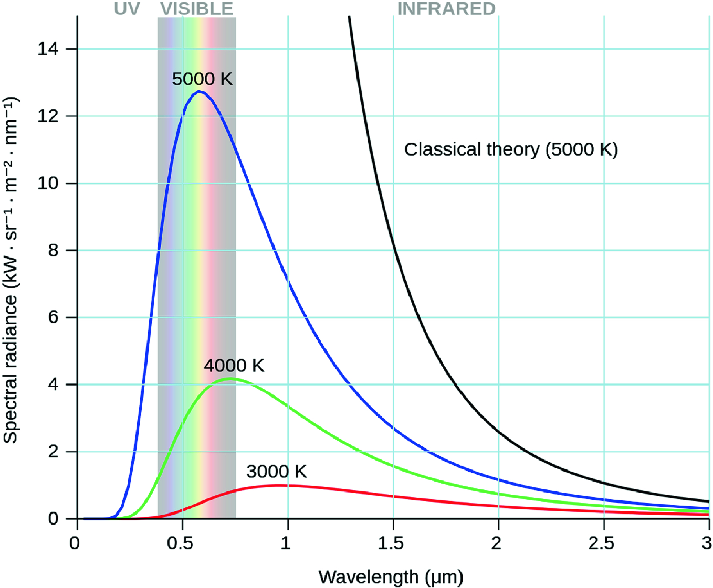 **Fig. 2.2. Blackbody radiation** 

2. Double-Slit Experiment

Double-slit experiment of photon particle is an important experiment in quantum mechanics that reveals the wave–particle duality of quantum particles (Fig. 2.3). Moreover, it displays the fundamentally probabilistic nature of quantum-mechanical phenomena. The experiment was first performed with light by Professor Thomas Young (1802). In 1927, The Davisson–Germer experiment demonstrated that electrons were shown the same behavior, which was later extended to atoms and molecules (Davisson and Germer 1928). 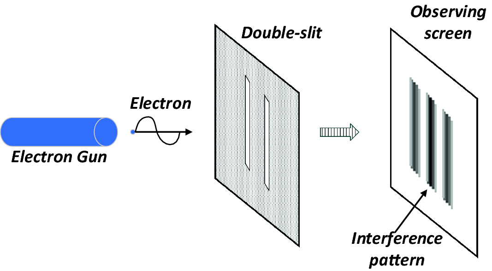 **Fig. 2.3. Double-slit experiment** 

3. Einstein’s Photoelectric Experiment

Photoelectric effect is the emission of electrons when light (or laser beam) falls on a metal plate in a vacuum tube, which can form a complete with the generation of electricity. The electrons emitted in this manner can be called photoelectrons. In 1905, Professor Albert Einstein published a paper (Einstein 1905) proposed that light energy is carried in discrete quantized packets to explain experimental data from the photoelectric effect (Fig. 2.4). This model contributed to the development of quantum mechanics and awarded him the Noble Prize in 1921 for “The discovery of the photoelectric effect.” 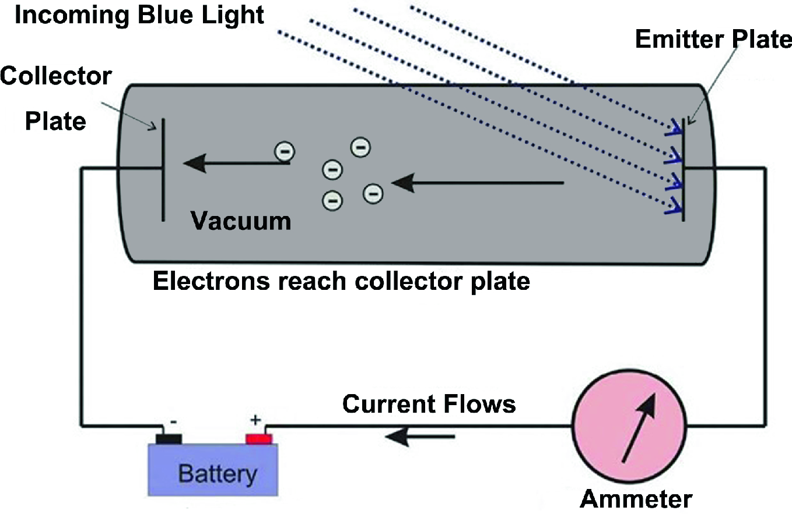 **Fig. 2.4. Photoelectric experiment** 

Quantum finance mentioned in Chap. [1](<480082_1_En_1_Chapter.xhtml>) is a common belief in financial community. In fact, the two major branches of modern technical analysis techniques—chart pattern analysis versus technical indicators/oscillators analysis—are typical examples of how we percept and interpret worldwide financial markets by their wave (market patterns)–particle (market indicators) duality. The difference is: in quantum finance, we have concrete mathematical and computer algorithms to model and study the wave–particle duality of financial markets.

### 2.1.3 Heisenberg’s Uncertainty Principle

The uncertainty principle (also known as Heisenberg’s uncertainty principle) is a unique and the most important property in quantum mechanics (Plotnitsky 2010).

In the principle of uncertainty, Professor Werner Heisenberg (1901–1976) described the fact that there is a natural limit of precision for the measurement (observation) of certain pairs of physical properties on any matters, which known as complementary variables (or what we called _quantum pairs_) such as position (x) and its momentum (p), given by $$\Delta p \cdot \Delta x = \frac{\hbar }{2}$$ (2.5) 

_where_ $\hbar$ _is the reduced Planck’s constant_ = $\hbar /2\pi$.

As explained in his famous quote:

> The uncertainty principle refers to the degree of indeterminateness in the possible present knowledge of the simultaneous values of various quantities with which the quantum theory deals; it does not restrict, for example, the exactness of a position measurement alone or a velocity measurement alone.
> 
> Werner Heisenberg (1901–1976)

In fact, uncertainty principle is an inherent property of matter due to its own wave property. It must be emphasized that measurement does not mean only a process in which a physicist observer takes part but rather any interaction between classical and quantum objects regardless of any observer.

This principle has profound influence in modern physics (especially experimental physics) such as mesoscale _numerical weather prediction_ (NWP) in computational meteorology, superconductivity, and quantum optics.

In quantum finance, principle of uncertainty provides a way to describe the natural limit of precision for the observation of intrinsic pair in financial market, which will be revealed in Chap. [4](<480082_1_En_4_Chapter.xhtml>).

### 2.1.4 Quantization of Energy

In quantum physics, quantization is the process of transition from a classical understanding of physical phenomena to a brand new interpretation in using quantum mechanics. Quantization converts classical fields into operators acting on quantum states of the field theory.

Rutherford–Bohr model (or _Bohr model_ in short), presented by Professors Niels Bohr and Ernest Rutherford in 1913, proposed the quantization of energy levels in atoms (Bohr 1913) with three unique properties:

1. Discrete orbits (energy levels)—like planets in the solar system, electron is able to revolve in certain stable orbits around the nucleus which contrary to what classical electromagnetism suggests. These stable orbits are called _stationary orbits_ and are attained at certain discrete distances from the nucleus. The electron cannot have any other orbit in between the discrete ones.

2. These discrete orbits are attained at distances for which the angular momentum of the revolving electron is an integral multiple of the reduced Planck’s constant given by.

3. Electrons can only gain and lose energy by jumping from one allowed orbit to another, with the absorption or emission of discrete amount of electromagnetic radiation given by.

Figure 2.5 shows the Bohr model that the planetary-like model of the hydrogen atom (Z = 1), where the electron confined to an atomic shell encircles a small, positively charged atomic nucleus; and where an electron jumps between orbits is accompanied by an emitted or absorbed amount of electromagnetic energy (_hf_). The orbits in which the electron may travel are shown as gray circles, where n is the principal quantum number. The 3 → 2 transition depicted here produces the first line of the Balmer series, and for hydrogen (Z = 1) results in a photon of wavelength 656 nm (red light). 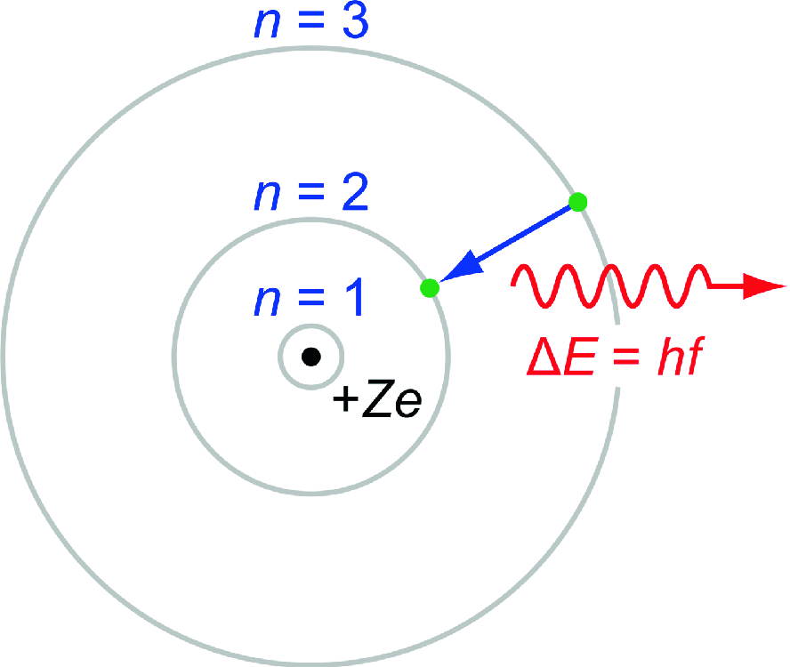 **Fig. 2.5. The Bohr model** 

### 2.1.5 Quantum Entanglement

Quantum entanglement (Schrödinger 1935) is a quantum phenomenon which occurs when pairs or groups of quantum particles generate, interact, or share spatial proximity in ways such that the quantum state of each particle cannot be described independently of the state of the other(s), even when the particles are separated by a very large distance—described by Einstein as _spooky action at a distance_ (Einstein et al. 1935). Quantum entanglement has been demonstrated experimentally on photons, neutrinos, electrons, and even on small diamonds.

Figure 2.6 shows a laser beam fired through a certain type of crystal that can cause individual photons to be split into pairs of entangled photons. 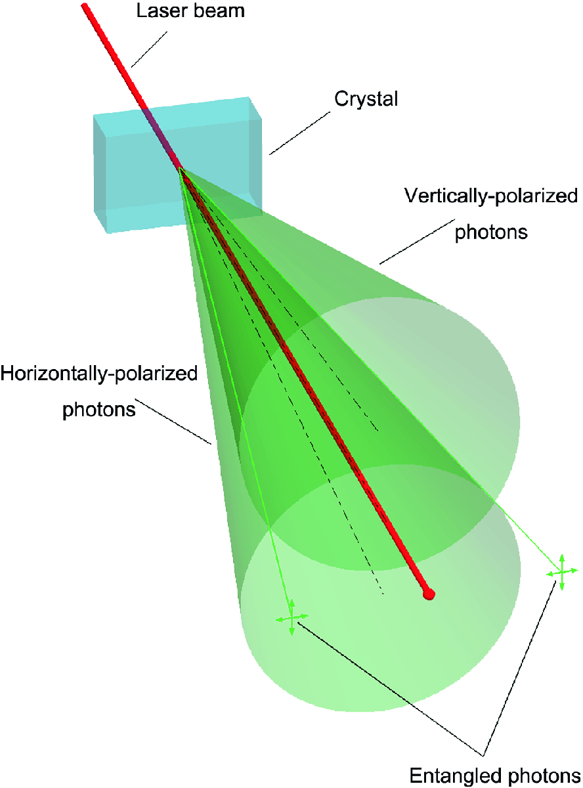 **Fig. 2.6. Quantum entanglement** 

The utilization of entanglement in communication and computation is a very active research area. In fact, quantum entanglement has many applications in quantum information theory (Sen 2017; Laloë 2012):

1. Quantum computing (Yanofsky and Mannucci 2008) is computed using quantum-mechanical phenomena, such as superposition and entanglement. Such a computer is completely different from binary digital electronic computers based on transistors and capacitors. Whereas common digital computing requires that the data be encoded into binary digits (bits), each of which is always in one of the two definite states (0 or 1), quantum computation uses quantum bits or qubits, which can be within the superpositions of states.

In January 2019, IBM launched IBM Q System One, its first integrated quantum computing system for commercial use.

2. Quantum cryptography (Assche 2006) is an application of quantum entanglement in real-time encryption and message communication between two remote parties which share the same quantum state.

3. Quantum teleportation is a process by which quantum information (e.g., the exact state of an atom or photon) can be transmitted (exactly, in principle) from one location to another, with the help of classical communication and previously shared quantum entanglement between the transmitting and receiving locations.

4. Quantum finance is accompanied by the intrinsic property of quantum entanglement. Operational researches were carried out in the previous 15 years on how various financial markets, major forex markets, or major commodity markets such as gold and crude oil markets are affected when quantum entanglement occurred, and hence the prediction of major market reversal event.

Important applications of spin-off from quantum theory include

- Semiconductors and microprocessors;

- Laser technology;

- Quantum computing;

- Quantum cryptography;

- Quantum finance;

- Quantum optics;

- Superconductivity (high-speed transportation); and

- Medical and images’ research such as magnetic resonance imaging (MRI) and DNA editing.

## 2.2 From Quantum Mechanics to Quantum Field Theory 

Quantum field theory is a theoretical framework that combines three important theoretical physics theories (Padmanabhan 2016).

They are

1. Quantum mechanics—provides basic mathematical, physical and philosophical framework;

2. Classical field theory—provides mathematical, physical model, and framework on quantum fields’ composition and dynamics;

3. Special relativity—provides mathematical, physical model and framework regarding interchange between quantum particles and their intrinsic energies, the creation and annihilation mechanisms of subatomic particles, and their mathematical interpretations.

4. Einstein’s famous mass–energy formulation: $$E = mc^{2}$$ (2.6) 

Note: This formulation not only explains the intrinsic energy of a matter with mass m or its mass–energy equivalent property, but more importantly it provides a way to describe and interpret how fundamental (quantum) particles can be created or annihilated to/from pure energy. The interpretation is not only the central concept of special and general relativity but also is an important component in quantum field theory to explain the existence and dynamics of various subatomic particles. 

As there are a great deal of topics and phenomena in quantum field theory, this book will focus on key topics which are essential for constructing the mathematical and physical framework on quantum finance.

They are

- Classical field versus quantum field,

- Feynman path integral, and

- Quantum oscillators.

## 2.3 Classical Field Versus Quantum Field 

Before we learn more in-depth understanding of what is quantum field theory, let’s have a look on what is the major difference between a _classical field versus quantum field_.

A classical field (_field_ in short) can be thought of as the assignment of a physical quantity at each point of space and time.

In the physical world, there are two major classical fields (nonrelativistic):

1. Newton’s gravitational field (G field) $$g\left( r \right) = - \frac{GM}{{r^{2} }}$$ (2.7) _where G_ = _gravitational constant, M_ = _mass of the massive body (e.g., Earth) exerts on a comparably small object with mass m,_ and _r_ = _distance._

2. Maxwell’s electromagnetic field (EM field) $$E = - \frac{1}{{4\pi {\epsilon}_{0} }}\frac{q}{{r^{2} }}$$ (2.8) _where q_ = _charge of the test charged object,_ $\epsilon_{0}$ = _permittivity of free space, and r_ = _distance._

In quantum field theory, particles are described by quantum fields that satisfy the Schrödinger equation, which is given by (nonrelativistic): $$i\hbar \frac{\partial }{\partial t}\Psi \left( {r,t} \right) = \left[ { - \frac{{\hbar^{2} }}{2\mu }\nabla^{2} + V\left( {r,t} \right)} \right]\Psi \left( {r,t} \right)$$ (2.9) 

Figure 2.7 shows the 2D illustration of a classical field, in which there are discrete numbers at every point of the space, whereas in a quantum field, the field value at single point in the space is not an exact number but rather some sort of distribution— _probability density function (pdf)_ or _wave function_ in terms of quantum mechanics in Fig. 2.8. 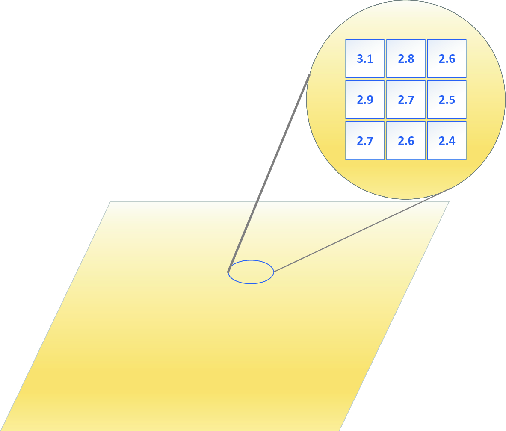 **Fig. 2.7. Classical field** 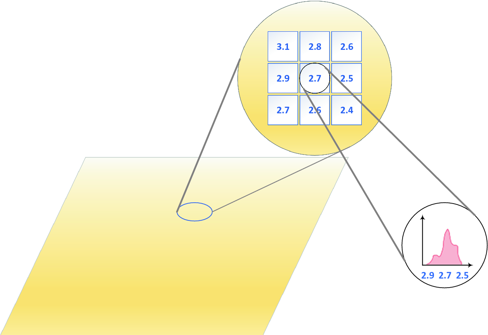 **Fig. 2.8. Quantum field** 

## 2.4 Feynman’s Path Integral 

### 2.4.1 A Thought Experiment

Developed by Professor Richard Feynman in 1948 (Feynman 1948; Feynman and Hibbs 1965), the path integral formulation of quantum finance theory is concerned with the direct computation of scattering amplitude of a certain interaction process, rather than the establishment of operators and state spaces. To understand path integral, let’s begin with a _thought experiment_ on standard double-slit thought experiment (DSTE).

Figure 2.9 shows the configuration of a standard DSTE, photon particle emits from source (S) (at T = 0) either go through opening O1 or O2 and strike the projection screen at final point F (at T = t). 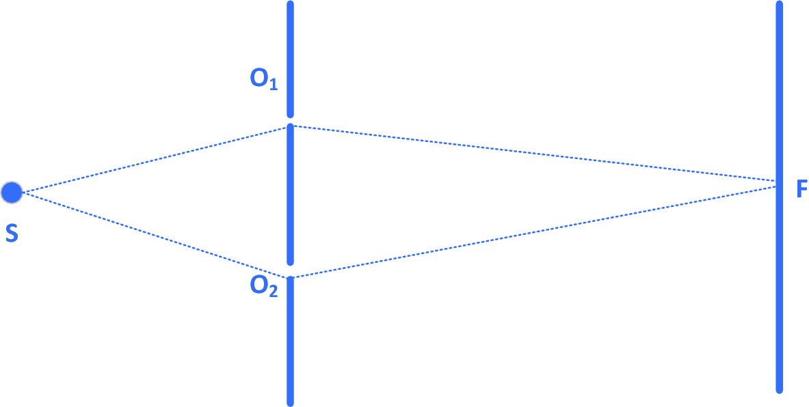 **Fig. 2.9. Double-slit thought experiment (single layer)** 

By using the superposition principle in QM, the amplitude of detection at final point F is the sum of the amplitude for the paths S-O1-F and S-O2-F.

How about if we drill another opening O3?

By common sense, it should be simply done by the superposition of one more path amplitude S-O3-F to the evaluation function, as shown in Fig. 2.10. 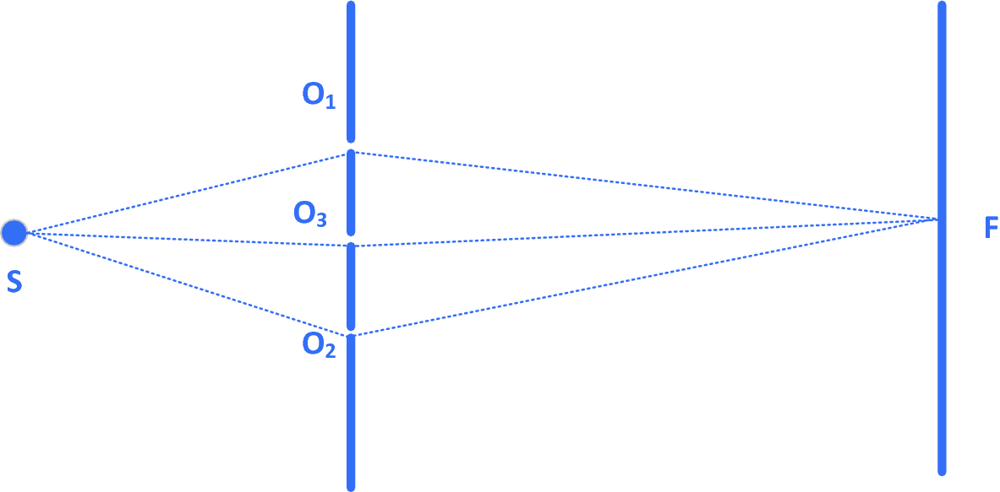 **Fig. 2.10. Triple-slit thought experiment (single layer)** 

The resulted amplitude ($\psi_{F} )$ measured at F will be $$\psi_{F} = \sum_{i}^{n} {\psi_{F} \left( {S - O_{i} - F} \right)}$$ (2.10) 

Let’s move on to the next level.

How about if we add one more layer and start with three openings?

Figure 2.11 shows the multi-slit thought experiment with double layer. 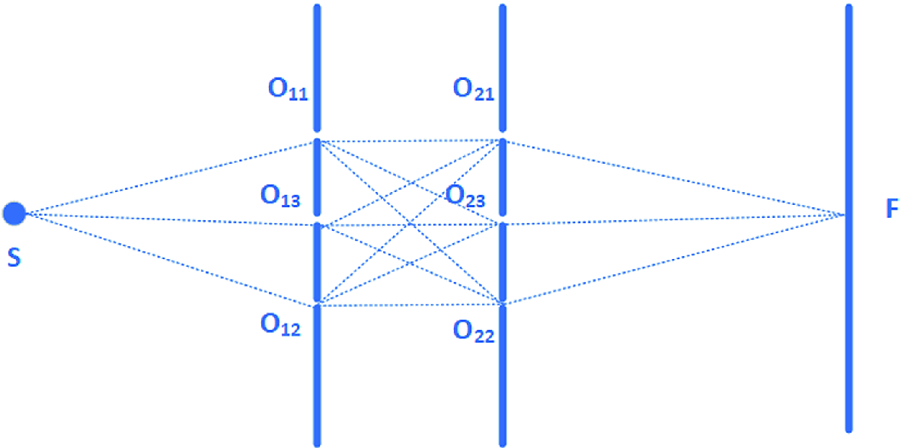 **Fig. 2.11. Multi-slit thought experiment (double layers)** 

Generally, the path integration (path integral) equation multi-slit thought experiment with double layers will look like $$\psi_{F} = \sum_{j}^{n} {\sum_{i}^{n} {\psi_{F} \left( {S - O_{1i} - O_{2j} - F} \right)} }$$ (2.11) 

In fact, it is what Feynman did in 1948 during his famous Feynman’s lectures on path integral and quantum mechanics.

Now then, what would happen if we add infinite number of layers; at the same time drill infinite number of openings onto it?

Figure 2.12 shows all layers between S and F will simply _disappear_ into empty space. Why do they behave like this? 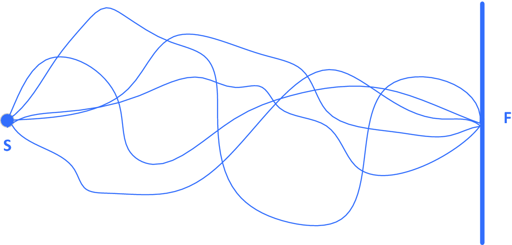 **Fig. 2.12. Infinite-slit thought experiment (infinite layers)—path integral** 

The answer is: photons emit from point source S and arrive at detector F through empty space. The wave function detected at F is the sum of _infinite paths_ beginning from source S to detector F—known as _path integral formulation_ proposed by Feynman in 1948. $$\psi_{F} = \sum_{i} {\psi_{All \;Path} \left( {S - F} \right)}$$ (2.12) 

### 2.4.2 Feynman’s Path Integral Formulation

In quantum field theory (Padmanabhan 2016), the wave function value detected the path from point source qS to a final point qF in time T which is governed by the unitary operator $e^{ - iHT}$ where H is the Hamiltonian.

Using Dirac’s _bra_ and _ket_ notation, we have $$\left\langle {q_{F} |e^{ - iHT} |q_{S} } \right\rangle$$ (2.13) 

Using Feynman’s path integral formulation (Feynman and Hibbs 1965), we divided the whole T into N segments of width $\delta t = T/N$. We have $$\left\langle {q_{F} \left| {e^{ - iHT} } \right|q_{S} } \right\rangle = \left\langle {q_{F} \left| {e^{ - iH\delta t} e^{ - iH\delta t} e^{ - iH\delta t} \ldots } \right|q_{S} } \right\rangle$$ (2.14) 

Then, we can break it down into N intervals: $$\left\langle {q_{F} \left| {e^{ - iHT} } \right|q_{S} } \right\rangle = \left[ {\prod_{k = 1}^{N - 1} {\smallint dq_{k} } } \right]\left\langle {q_{F} \left| {e^{ - iHT} } \right|q_{N - 1} } \right\rangle \ldots \left\langle {q_{1} \left| {e^{ - iHT} } \right|q_{S} } \right\rangle$$ (2.15) 

After relative calculation, we obtain the famous path integral formulation of QFT: $$\left\langle {q_{F} |e^{ - iHT} |q_{S} } \right\rangle = \smallint Dq\left( t \right)e^{{i\int_{0}^{T} {dt\left[ {\frac{1}{2}m\dot{q}^{2} - V\left( q \right)} \right]} }}$$ (2.16) $$\left\langle {q_{F} |e^{ - iHT} |q_{S} } \right\rangle = \smallint Dq\left( t \right)e^{{i\int_{0}^{T} {dt\;L\left( {\dot{q},q} \right)} }}$$ (2.17) where $L\left( {\dot{q},q} \right) = \frac{1}{2}m\dot{q}^{2} - V\left( q \right)\,and$ $$\int {Dq\left( t \right)} = \lim_{n \to \infty} \left( { - \frac{im}{2\pi \delta t}} \right)^{N/2} \left[ {\prod_{k = 1}^{N - 1} {\int {dq_{k} } } } \right]$$ (2.18) 

### 2.4.3 Path Integral Formulation in Quantum Finance

In quantum finance, path integral formulation (Baaquie 2018) plays an important role in the modeling of the most fundamental financial instrument—worldwide interest rate (r) modeling.

Image the following scenario:

If we consider worldwide interest rate, say, US interest rate r as the propagation of quantum particle _Qr_.

The change of interest rate Qr during a period of time T from state $Qr_{S}$ to $Qr_{F}$ can be formulated by Feynman path integral formulation: $$Qr_{F} \left| {e^{ - iHT} } \right|Qr_{S} = \smallint DQr\left( t \right)e^{{i\int\limits_{0}^{T} {dtL\left( {\dot{Qr} ,Qr} \right)} }}$$ (2.19) 

In fact, it is one of the major applications of QFT in finance for the past 15 years.

Besides path integral formulation, are there any other similar financial instrument(s) can be used?

Figure 2.13 shows the US federal interest rate from 1955 to 2015 in four different timeframes. In Chap. [3](<480082_1_En_3_Chapter.xhtml>), we will explore how to model forward interest rates in different timeframes with quantum finance by using Feynman’s path integral technique. 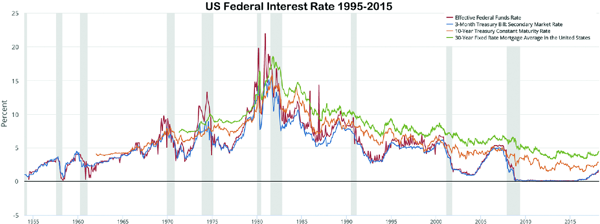 **Fig. 2.13. US federal interest rate 1995–2015** 

## 2.5 Quantum Oscillators 

### 2.5.1 Quantum Harmonic Oscillator—The Basics

Quantum harmonic oscillator (QHO) is the quantum mechanics analog of a classical harmonic oscillator (Blaise and Henri-Rousseau 2011).

Simple harmonic oscillator: $$F = m\ddot{x} = - kx$$ (2.20) 

_where k is the force constant._

Damped harmonic oscillator: $$F = F_{ext} - kx - c\dot{x}$$ (2.21) 

_where c is the damping coefficient and_ $\zeta = \frac{c}{2\sqrt{mk}}$_is the damping ratio_

$\omega_{0} = \sqrt {\frac{k}{m}}$_is the “Undamped angular frequency of the oscillator.”_

_(Recall conditions for critically damped/overdamped/underdamped oscillations)_

QHO is one of the most important model systems in QM and QFT.

In one dimension QHO, the Hamiltonian $\hat{H}$ is given by $$\hat{H} = \frac{{\hat{p}^{2} }}{2m} + \frac{1}{2}k\hat{x}^{2} = \frac{{\hat{p}^{2} }}{2m} + \frac{1}{2}m\omega^{2} \hat{x}^{2}$$ (2.22) where m = mass of the quantum particle; k is the force constant; $\hat{x}$ is the position operator; $\hat{p} = - \frac{i\hbar \partial}{\partial x}$ is the momentum operator; and $\omega$ is the angular frequency.

The solution of 1D-QHO is given by $$\psi_{n} \left( x \right) = \frac{1}{{\sqrt {2^{n} n!} }} \cdot \left[ {\frac{m\omega }{\pi \hbar }} \right]^{1/4} \cdot e^{ - i\omega t} \cdot H_{n} \left( {\sqrt {\frac{m\omega }{\hbar }} x} \right)$$ (2.23) n = 0, 1, 2, …

where n = 0, 1, 2, …; $\psi_{n}$ is the wave function and n is the quantum number.

The corresponding discrete energy levels are given by $$E_{n} = \hbar \omega \left( {n + \frac{1}{2}} \right) = \left( {2n + 1} \right)\frac{\hbar }{2}\omega ,\quad n = 0,1,2, \ldots$$ (2.24) 

Note that $E_{0}$ corresponds to the ground state and all n > 0 are discrete excited states.

Figure 2.14 shows the different dynamics in classical versus quantum harmonic oscillators. Figure 2.14A and B illustrate the classical harmonic oscillators; Fig. 2.14C–H illustrate the quantum harmonic oscillators—solutions according to Schrödinger equation, where the horizontal axis is particle position, and the vertical axis is the real part (blue) or imaginary part (red) of the wave function. 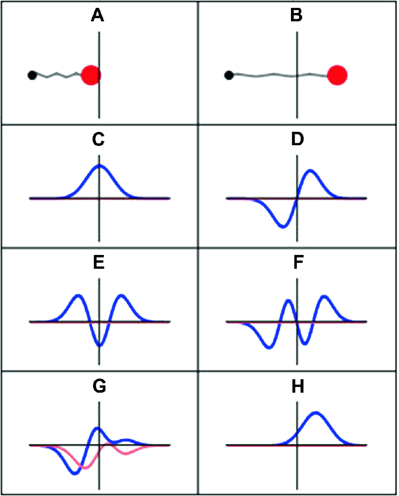 **Fig. 2.14. Illustrations of classical versus quantum harmonic oscillators** 

### 2.5.2 N-Dimensional Quantum Harmonic Oscillators

Using the same logic of 1D QHO, the N-dimensional QHO is exactly analogous to N independent one-dimensional harmonic oscillators with identical mass and spring constant.

In this case, the quantities x1, …, xN would refer to the positions of each of the N quantum particles.

The Hamiltonian is given by $$H = \sum_{i = 1}^{N} {\left( {\frac{{p_{i}^{2} }}{2m} + \frac{1}{2}m\omega^{2} x_{i}^{2} } \right)}$$ (2.25) 

For a particular set of quantum numbers (n), the energy eigenfunctions for the N-dimensional oscillator are expressed in terms of the one-dimensional eigenfunctions as $$\left\langle {x\left| {\psi_{n} } \right.} \right\rangle = \prod_{i = 1}^{N} {\left\langle {x_{i} \left| {\psi_{n} } \right.} \right\rangle }$$ (2.26) 

The energy levels of the systems are given by $$E_{n} = \hbar \omega \left[ {\left( {n_{1} + n_{2} + \cdot \cdot \cdot + n_{N} } \right) + \frac{N}{2}} \right]$$ (2.27) where $n_{i}$ = 0, 1, 2 … are the energy level in dimension i. 

Figure 2.15 shows a 2D trampoline model of quantum harmonic oscillators. As shown, the quantum anharmonic oscillator model (in 2D perspective) can be illustrated as trampoline in which every quantum oscillator is connected with four neighboring oscillators in the 2D plane, resulted in the anharmonic vibration (from its stationary level) as vertical movement which analog to the amplitude of the wave function shown in the above QHO equations. 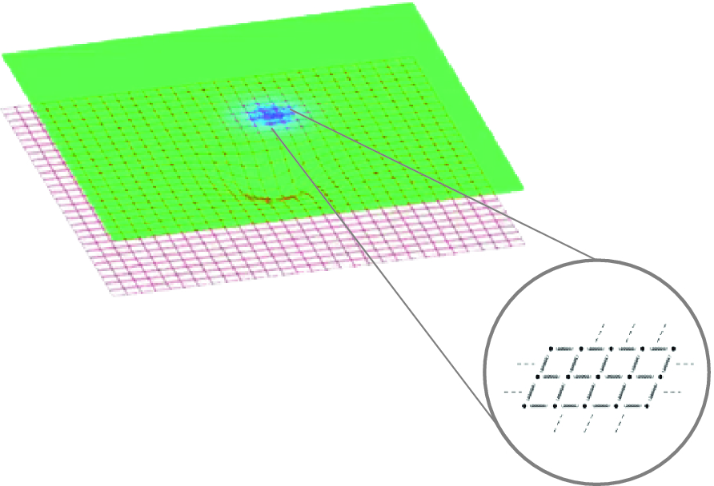 **Fig. 2.15. 2D trampoline model of quantum harmonic oscillators** 

### 2.5.3 Quantum Anharmonic Oscillators

Even though quantum harmonic oscillator (QHO) can explain many quantum phenomena and wave–particle dualities for simple quantum particles, however, for real-world applications, many quantum particles and quantum phenomena involve the anharmonic oscillations (Gilyarov and Slutsker Slutsker 2010). 

Figure 2.16 shows an HCl molecule as an anharmonic oscillator (Padilla and Pérez 2012) vibrating at energy level E3. D0 is the dissociation energy, r0 is the bond length, and U is the potential energy. Energy is expressed in wavenumbers. The hydrogen chloride molecule is attached to the coordinate system to show bond length changes on the curve. 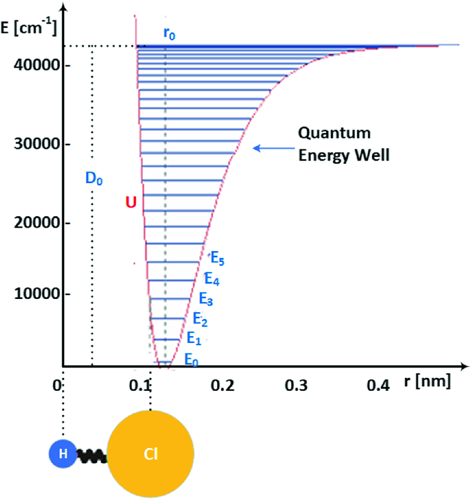 **Fig. 2.16. Quantum anharmonic oscillations of HCI molecules’ illustrations** 

The Hamiltonian of a typical quantum anharmonic oscillator (QAHO) is given by $$H = \frac{{p^{2} }}{2m} + \frac{1}{2}m\omega^{2} x^{2} + \lambda x^{k}$$ (2.28) where $\lambda$ is the damping coefficient and k is the order of QAHO.

Commonly found QAHOs include

Cubic QAHO with k = 3: $$H = \frac{{p^{2} }}{2m} + \frac{1}{2}m\omega^{2} x^{2} + \lambda x^{3}$$ (2.29) 

Quartic QAHO with k = 4: $$H = \frac{{p^{2} }}{2m} + \frac{1}{2}m\omega^{2} x^{2} + \lambda x^{4}$$ (2.30) 

Sextic QAHO with k = 6: $$H = \frac{{p^{2} }}{2m} + \frac{1}{2}m\omega^{2} x^{2} + \lambda x^{6}$$ (2.31) 

$\lambda x^{2m}$-class QAHO—a special class of QAHO which provides a genius way of solving these high-order AHO equations. $$H = \frac{{p^{2} }}{{2m_{q} }} + \frac{1}{2}m_{q} \omega^{2} x^{2} + \lambda x^{2m}$$ (2.32) 

In quantum finance theory, we have deduced that the quantum dynamics of price return (r) for any financial market is in fact a kind of quartic quantum anharmonic oscillations, which is also a special case of $\lambda x^{2m}$-class QAHO with m = 2. Detail mathematical derivation along with numerical analysis to solve important quantum finance equation will be studied in Chaps. [4](<480082_1_En_4_Chapter.xhtml>) and [5](<480082_1_En_5_Chapter.xhtml>).

## 2.6 Conclusion 

In this chapter, we introduced a general overview of four major concepts and models in quantum theory: (1) quantum mechanics, (2) quantum field theory, (3) Feynman’s path integral, and (4) quantum anharmonic oscillators.

These four concepts with models in quantum theory form critical mass to establish the basic theoretical and mathematical models in quantum finance theory in next chapter, namely, (1) Feynman’s path integral model of quantum finance (also known as first generation of quantum finance); and (2) quantum anharmonic model of quantum finance (also known as second generation of quantum finance).

To avoid complex mathematical derivations, this chapter focused on the basic concepts of quantum theory with its related models which are critical to understand the mathematical and quantum model in quantum finance. For readers who are interested to explore in-depth mathematical models and quantum theory, please refer to the reference section at the end of this chapter.

### Problems

1. 2.1

Before quantum mechanics, what are the two main streams of theories govern the laws of physics and how quantum mechanics are difference with these theories?

2. 2.2

We always say 1920s are the key years for the birth of quantum mechanics. Who are the two key figures in the course of the development of the basic concepts and theories in quantum mechanics and discuss their major contributions?

3. 2.3

What is the physical importance of Schrödinger equation in terms of the interpretation of wave–particle duality phenomena?

4. 2.4

What are the three most important experiments in the 1920s for the interpretation and illustration of wave–particle duality in quantum mechanics? Discuss and explain their findings and importance. Can they be interpreted in financial markets? How?

5. 2.5

Discuss and explain briefly Heisenberg’s uncertainty principle in quantum mechanics. How can such phenomena relate to modern finance?

6. 2.6

What is the basic difference between a quantum field and classical field? How can quantum field be interpreted in terms of financial markets?

7. 2.7

Discuss and explain quantization phenomena in quantum theory. How can it have been related to quantum finance? What are the ground-state and various excited energy levels in quantum finance?

8. 2.8

Discuss and explain quantum entanglement in quantum theory. How can it be interpreted in quantum finance?

9. 2.9

What is quantum computing? Discuss and explain briefly the basic concept and how it is related to quantum finance.
