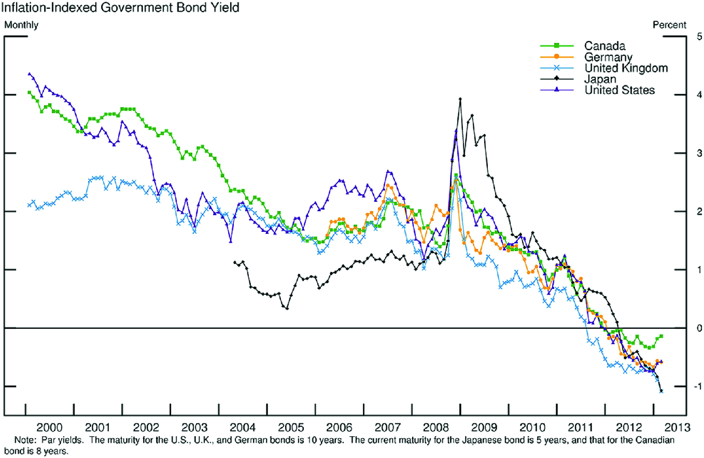
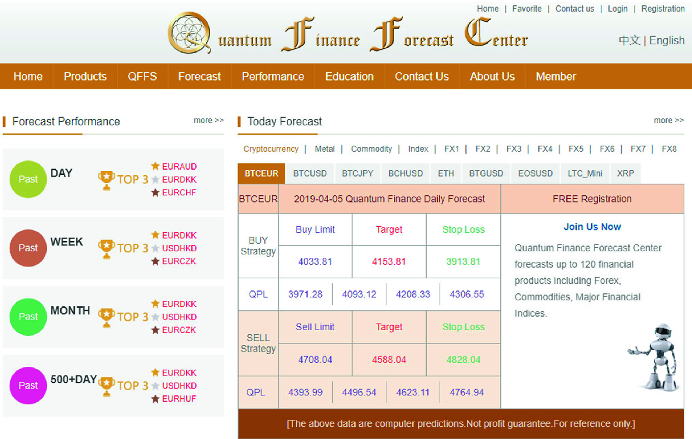
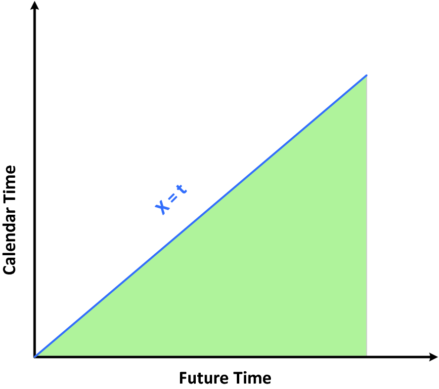
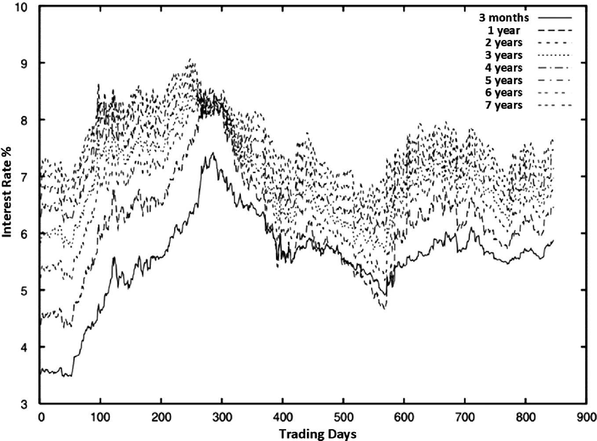
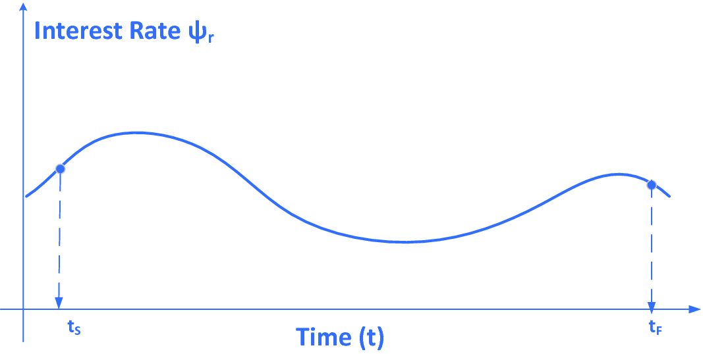
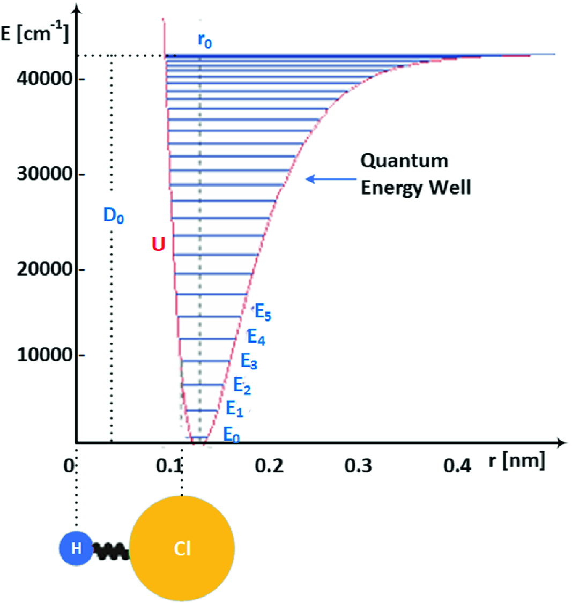
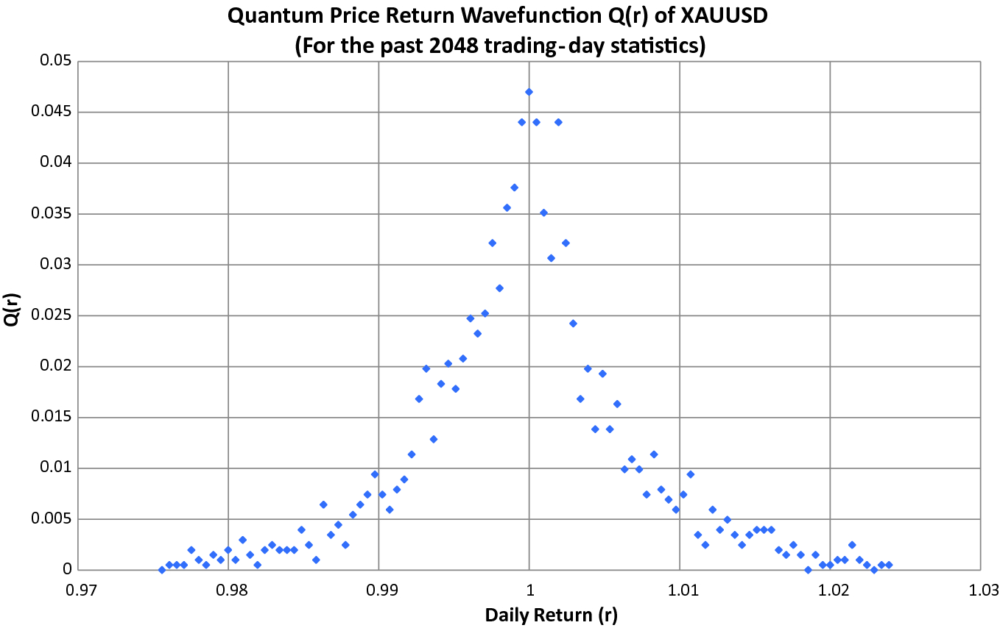

# 3\. An Overview of Quantum Finance Models

 _It is a curious historical fact that modern quantum mechanics began with two quite different mathematical formulations: the differential equation of Schrödinger and the matrix algebra of Heisenberg. The two apparently dissimilar approaches were proved to be mathematically equivalent._

Richard P. Feynman (1918–1988)

- _What is quantum finance?_

- _What are the major quantum finance models?_

- _Quantum finance_ – _which way to go?_

In this famous quotation on quantum mechanics, Professor Feynman pointed out the vital feature of quantum mechanics mathematical derivation, the two totally different approaches to formulate and model the quantum world which end up being mathematically equivalent.

Did it sound familiar?

As we learnt from quantum mechanics’ basic concept, whether we observe the quantum world as particle dynamics or wave dynamics, it only affects the way we model the quantum world, and the mathematical tool along with the model we are using. The reality of the quantum world doesn’t change, and from the mathematical perspective, they are mathematical equivalent.

As mentioned in Chap. [1](<480082_1_En_1_Chapter.xhtml>), quantum finance is a newly developed interdisciplinary subject with the integration of

1. Quantum theory—the provision of quantum mechanics and quantum field theory as the quantum finance dynamics with field analysis; and

2. Computational finance—the provision of computational finance models as the system framework and the application basis.

To meet the demand from the exponential growth of program trading and intelligent financial forecast service, in 2012, the author had integrated contemporary quantum finance theory with AI technology to implement quantum finance forecast system for the real-time forecast of worldwide commodity markets.

In this chapter, we will first review a brief history of quantum finance.

Second, we will study the two main branches of quantum finance models—Feynman’s path integral model and the quantum anharmonic oscillator model.

Lastly, we will explore the future of quantum finance, and how it relates to the development of intelligent finance systems.

## 3.1 A Brief History of Quantum Finance 

Quantum finance is a newly developed interdisciplinary subject introduced in 1990s by applying quantum mechanics and quantum field theory to theoretical economics—so-called _econophysics_.

Nevertheless, _econophysics style_ of R&D was established much earlier.

In 1900, Professor Louis Jean-Baptiste Alphonse Bachelier (1870–1946), a French mathematician in his Ph.D. thesis Théorie de la speculation (translated as The Theory of Speculation) published by Annales Scientifiques de l’École Normale Supérieure, set the foundation of a mathematical model with Brownian motion in valuing stock options (Bachelier 1900).

It was historically the first paper to use advanced mathematics in the study of finance. He is also considered as the forefather of mathematical finance and also a pioneer in the study of stochastic processes.

His thesis contained three different versions of the first mathematical theory of Brownian motion. In modern terminology, Brownian motion was characterized as

1. A process with independent homogeneous increments whose paths are continuous;

2. The continuous-time process, which is the limit of symmetric random walks; and

3. The Markov process whose forward Kolmogorov equation is the heat equation.

Owing to the above reasons, most mainstream _econophysicists_ consider finance as an application of _Brownian motion_ —the fundamental phenomenon of statistical physics for the modeling of financial market.

The first published work on Econophysics— _An Introduction to Econophysics_ \- _Correlations and Complexity in Finance_ —was written by Professors Rosario Mantegna and Eugene Stanley in 1999 (Mantegna and Stanley 1999). This pioneering text explored the use of statistical physics concepts such as stochastic dynamics, short- and long-range correlations, self-similarity, and scaling concepts of financial systems’ description. These were the dynamic new specialty of econophysics.

For the last two decades, various methods and theories were proposed for stock price/returns analysis, interest rate modeling, option pricing, and portfolio analysis.

## 3.2 Major Works and R&D in Quantum Finance 

Although statistical physics is the mainstream theory of Econophysics, active R&D with the adoption of quantum mechanics, quantum field theory with related concepts, and frameworks such as Feynman’s path integral model and quantum oscillator model to model financial markets can be found which include the following:

1. B. Baaquie in his book _Quantum Finance_ (Baaquie 2004) reviewed the application of Feynman’s path integral theory for option pricing and interest rate modeling. Professor Baaqui is also the first scholar who consolidated a complete concept and theory of quantum finance using quantum field theory (Baaquie 2007, 2013, 2018);

2. Other research works on path integral including the sensitivity analysis using path-independent quantum finance model by Kim et al. (2011);

3. Quantum anharmonic oscillator modeling on finance analysis included Gao and Chen (2017) work on quantum anharmonic oscillator model for the stock market; Ye and Huang (2008) work on nonclassical oscillator model for persistent fluctuations in stock markets; Meng et al. (2015) work on quantum spatial-periodic harmonic model for daily price-limited stock markets;

4. Quantum wave function for stock market analysis by Ataullah et al. (2009);

5. Quantum statistical approach to simplified stock markets by Bagarello (2009);

6. A finite-dimensional quantum model for the stock market by Cotfas (2013);

7. Nakayama (2009) works on gravity dual for Reggeon field theory and nonlinear quantum finance;

8. Piotrowski and Sładkowski (2005) studied the quantum diffusion model of prices and profits;

9. Probability wave approach on security transaction volume–price behavior analysis by Shi (2006); 

10. Bohmian quantum potential approach on stock market credibility analysis by Nasiri et al. (2018);

11. Schaden (2002) applied quantum theory to model secondary financial markets;

12. Zhang and Huang (2010) defined wave functions and operators of the stock market to establish the Schrödinger equation for stock price.

## 3.3 Two Pillars of Quantum Finance Models 

In respect of quantum finance R&D of the past decades, there are basically two main quantum models with significant impacts and research results in financial modeling and applications. They are

1. Feynman’s path integral approach (Zee 2011; Swanson 2014) and

2. Quantum anharmonic oscillator approach (Bloch 1997).

In the next two sections, we will review the basic concept and framework of these two approaches in quantum finance. Figures 3.1 and 3.2 show the typical applications of these two mathematical models on the modeling of forward interest rate and quantum price levels in secondary financial markets, respectively.  **Fig. 3.1. Feynman’s path integral approach in quantum finance for government bond and interest rate modeling**  **Fig. 3.2. Quantum anharmonic model in quantum finance for quantum price level modeling (QFFC2019)** 

## 3.4 Feynman’s Path Integral Approach in Quantum Finance 

### 3.4.1 Forward Interest Rate in a Nutshell

Before we study the Feynman’s path integral approach in quantum finance for the modeling of forward interest rate, let’s have an overview of forward interest rate in finance.

From computational finance perspective, forward interest rate $f\left( {t,x} \right)$ is the interest rate fixed at time $t \le x$ for an instantaneous (overnight) loan taken at future time x.

So, at any instant t, $\mathbf{f}\left( {\mathbf{t},\mathbf{x}} \right)$ is a function of x (not t) that can be visualized as a 1D path in the future time domain (x) satisfy $(x \ge t)$, as shown in Fig. 3.3.  **Fig. 3.3. Forward interest rate function domain (green area)** 

With the initial condition $\mathbf{f}(t_{S} ,\mathbf{x})$ is fixed by the financial market, each point $\left( {\mathbf{t},\mathbf{x}} \right)$ manifests itself in the _functional domain_ (green area) and corresponds to one _forward interest rate_ incidence $\mathbf{f}\left( {\mathbf{t},\mathbf{x}} \right)$.

### 3.4.2 Zero Coupon Bond (Treasury Bond)

Treasury bond is a risk-free financial instrument which has a single cash flow consisting of a fixed payoff of, say, $1 at some future time T; its price at time t < T is denoted by $P\left( {t,T} \right)$, with $P\left( {T,T} \right) = 1$.

So, for a bond maturing at time T, its value $P\left( {t,T} \right)$ before maturity is given by discounting $P\left( {T,T} \right) = 1$ to the time t by the spot interest rate, given by $$P\left( {t,T } \right) = {\text{E}}\left[ {e^{{ - \int_{t}^{T} {dsr(s)} }} P\left( {T,T} \right)} \right] = {\text{E}}\left[ {e^{{ - \int_{t}^{T} {dsr(s)} }} } \right]$$ (3.1) 

_where_

1. _E[] is the expectation value;_

2. $r(s) = f\left( {s,s} \right)$_is the spot interest rate._

Figure 3.4 shows the forward interest rate of Eurodollar futures from 1990 to 1996 with eight different maturities, ranging from 3 months up to 7 years.  **Fig. 3.4. Forward interest rate of Eurodollar Futures from 1990 to 1996** 

### 3.4.3 Quantum Field Theory of Interest Rate Model

To model the interest rate in respect of quantum field theory using Feynman’s path integral, first take a look at the forward interest rate of Eurodollar futures from 1990 to 1996 with eight different maturities, ranging from 3 months up to 7 years as shown in Fig. 3.5.  **Fig. 3.5. Feynman’s path integral model for interest rate** 

If we look carefully, we can find certain interesting features from this chart:

1. All these forward interest rate time series appeared to be highly chaotic but have a certain shared pattern. In Chap. [8](<480082_1_En_8_Chapter.xhtml>)—chaos and fractals in quantum finance—we will study such kind of chaotic phenomena—so-called _deterministic chaos_ , a vital feature and phenomena in financial engineering.

2. All these curves are basically randomly evolved in time, but in a highly co-related manner, basically without any line crossings.

In other words, the interest rate function $\mathbf{f}\left( {\mathbf{t},\mathbf{x}} \right)$ can be assumed to be independent variable w.r.t. to all x and t values.

Let A(t, x) be a two-dimensional quantum field, and the quantum interest rate model is given by Baaquie (2004) $$\frac{{\partial f\left( {t,x} \right)}}{\partial t} = \alpha \left( {t,x} \right) + \sigma \left( {t,x} \right)A\left( {t,x} \right)$$ (3.2) 

### 3.4.4 Feynman’s Path Integral Formulation of Forward Interest Rate

The Feynman’s path integral for the forward interest rate is given by Baaqie (2013) $$E\left( {{\text{F}}\left[ A \right]} \right) = \frac{1}{Z}\int DA \, e^{S\left[ A \right]} {\text{F}}\left[ A \right]$$ (3.3) where $\int {DA} = \prod\limits_{{\left( {t,x} \right) \in {\mathcal{B}}}} \int_{ - \infty }^{ + \infty } {dA\left( {t,x} \right)}$ and $Z = \int DA \, e^{S\left[ A \right]}$

The time-dependent Hamiltonian is given by $$H(t) = \frac{ - 1}{2}\int_{t}^{\infty } {dxdx^{{\prime }} } {\mathcal{M}}\left( {x,x^{{\prime }} ;t} \right)\frac{{\delta^{2} }}{{\delta f(x)\delta f(x^{{\prime }} )}} - \int_{t}^{\infty } {dx\alpha } \left( {t,x} \right)\frac{\delta }{\delta f(x)}$$ (3.4) where ${\mathcal{M}}\left( {x,x^{{\prime }} ;t} \right) = \sigma \left( {t,x} \right)D\left( {x,x^{{\prime }} ;t} \right)\sigma \left( {t,x^{{\prime }} } \right)$

Note:

1. S[A] is the stiff action function, given by Baaqie (2013) $$S\left[ A \right] = - \frac{1}{2}\int_{{t_{S} }}^{ + \infty } {dt} \int_{0}^{ + \infty } {dz} \left[ {A^{2} \left( {t,z} \right) + \frac{1}{{\mu^{2} }}\left( {\frac{\partial A}{\partial z}} \right)^{2} \left( {t,z} \right) + \frac{1}{{\lambda^{4} }}\left( {\frac{{\partial^{2} A}}{{\partial z^{2} }}} \right)^{2} \left( {t,z} \right)} \right]$$ (3.5) 

2. _D_ is the domain of $(t,x)$ for the path integration;

3. The initial value of the forward interest rate $f\left( {t_{S} ,x} \right)$ is an important boundary condition for Feynman’s path integral calculation.

4. As shown in Eq. 3.3, to calculate the expectation value $E\left( {{\text{F}}\left[ A \right]} \right)$, one has to perform integration of F[A] over all possible functions $A\left( {t,x} \right)$ of all possible $\left( {t,x} \right)$ in the domain space _D_.

5. In other words, to evaluate the forward interest rate using Feynman’s path integral method, one has to perform many integrations infinitely, one integration of $\int {dA} \left( {t,x} \right)$ for each state variable (t, x), which is natural as the core concept of Feynman’s path integral is the integration of (superposition in quantum theory) all possible paths that lead from S to F, as indicated in Chap. [2](<480082_1_En_2_Chapter.xhtml>).

## 3.5 Quantum Anharmonic Oscillator Approach in Quantum Finance 

### 3.5.1 Motivation

One of the major characteristics of quantum theory is the wave–particle duality which can be described by the Schrödinger equation.

Time-dependent Schrödinger equation: $$i\hbar \frac{\partial }{\partial t}\varPsi \left( {x,t} \right) = \left[ { - \frac{{\hbar^{2} }}{2m}\frac{{\partial^{2} }}{{\partial^{2} x}} + V\left( {x,t} \right)} \right]\varPsi \left( {x,t} \right)$$ (3.6) 

Time-independent Schrödinger equation: $$\left[ { - \frac{{\hbar^{2} }}{2m}\frac{{\partial^{2} }}{{\partial^{2} x}} + V(x)} \right]\varPsi (x) = E\varPsi (x)$$ (3.7) 

Instead of solving quantum dynamics’ problem by integrating all (in fact is infinity) the possible paths from starting point S to end point F, why not focus on solving the Schrödinger equation directly using numerical method (numerical approximation)?

Imagine: if we can solve this equation numerically (i.e., instead of analytically), say, into an n-order polynomial with differential operators, together with the integration of finite difference method (FDM). Technically speaking, we can implement such algorithm into a computer program for actual implementation (not simulation).

Actually, such notion is more important to tackle real-world problems with numerous time series data such as weather and finance.

As we will see, anharmonic oscillation (AHO) provides an excellent analog of Schrödinger equation for the modeling of quantum dynamics (3.6) and quantum energy levels (3.7).

In fact, many atomic/subatomic particles’ dynamics in the real world can be described in terms of quantum anharmonic oscillation (QAHO) as shown in Fig. 3.6.  **Fig. 3.6. Quantum anharmonic oscillations of HCI molecules** 

It shows the quantum anharmonic oscillator model for HCI molecules and their corresponding quantum energy well.

### 3.5.2 QAHO Modeling—Prices Versus Returns

Different from Feynman’s path integral method, quantum anharmonic oscillator (QAHO) method directly models the wave–particle dynamics—Schrödinger equation.

Owing to this reason, QAHO method tailored for the modeling of secondary financial markets such as the trading of stocks and futures among investors or OTC trading such as commodities, financial indices, and forex between market maker (MM) and investors.

In other words, the objective of QAHO modeling in quantum finance targets at quantum dynamics and quantum energy levels for market instruments involve in the secondary markets, forex market, for example (Fig. 3.7).  **Fig. 3.7. Worldwide financial products** 

So, the natural and most fundamental question is: What market instrument(s) we should model? Prices, indices, price returns, price deviations…?

To answer this question, we should ask this vital question:

If financial market is really a quantum phenomenon, that is, the motions, fields, and dynamics of quantum particles, what are the financial particles we are talking about? Or what is the best analog of the displacement _x_ (from the equilibrium state)?

Price or price returns or …?

Why?

### 3.5.3 Quantum Anharmonic Oscillations of Returns

The answer is … _price returns_ (_r_ or _return_ in short).

If we want to make the best analog of quantum particle displacement from the equilibrium position, naturally we should choose price return (r) with two major reasons:

1. Return (r) in finance is an important financial instrument to reflect the relative change of financial behavior (say stock price) within a fixed period of time (say, daily returns), which directly analog to physical meaning of quantum theory for the definition of x which relates to displacement to the equilibrium position; and

2. Use of return (r) to model financial market in quantum finance is totally coherent classical and statistical finance theories which all use price return for financial market modeling and statistical analysis.

So how about Prices? Is there any significance of price in quantum finance?

The answer is: very important.

As analog to gravitational field, one can imagine if all financial instruments are quantum financial particles, what will be the quantum field?

The natural logic should be the _quantum financial energy field_ , QFEF (or _quantum energy field_ in short) created by itself (just like gravitation field created by _graviton_) and/or QFEF created by other financial particles (in other financial markets).

So, to analog the potential energy in gravity and electromagnetic field (EM field), quantum price energy levels (or quantum price levels, QPLs in short) are the quantum finance quantity to describe the quantized energy field acting onto the quantum financial particles.

### 3.5.4 A Quantum Anharmonic Oscillator Model of Financial Markets

Let’s begin with QAHO modeling in quantum finance.

First, define _quantum financial particle_ r—price return (e.g., stock).

For numerical computation, we define the fractional price change as $$r\left( {t,\Delta t} \right) = \frac{{p\left( t \right) - p\left( {t - \Delta t} \right)}}{{p\left( {t - \Delta t} \right)}}$$ (3.8) where $p\left( t \right)$ is the price (say stock price) at time t and $\Delta t$ denote the time interval.

The analog motions and dynamics of (stock) price to a quantum particle (namely, _quantum financial particles_ , QFPs), price return (r) will be a direct analog to the displacement (x) of a quantum particle from its equilibrium state, assuming they are performing anharmonic oscillation (as we will see shortly).

So, quantum dynamics of the quantum financial particle are given by Schrödinger equation: $$i\hbar \frac{\partial }{\partial t}\psi \left( {r,t} \right) = H\psi \left( {r,t} \right)$$ (3.9) 

H is the Hamiltonian operator given by $$H = - \frac{{\hbar^{2} }}{2m}\frac{{\partial^{2} }}{{\partial^{2} r}} + V\left( {r,t} \right)$$ (3.10) 

### 3.5.5 Physical Meaning of Hamiltonian in Quantum Finance

The Hamiltonian (H) in Schrödinger equation $$H = - \frac{{\hbar^{2} }}{2m}\frac{{\partial^{2} }}{{\partial^{2} r}} + V\left( {r,t} \right)$$ (3.10) consists of two parts, K.E. (first part) and P.E. (second part). K.E. corresponds to quantum motion of the quantum financial particle (QFP), and P.E. corresponds to potential energy (well) generated by the quantum energy field of QFP itself (or other QEF generated by other QFPs in multidimensional financial markets).

The reduced Planck’s constant $\hbar$ can be considered as the uncertainty of irrational transaction and m represents the intrinsic properties of financial market such as market capital in a stock market.

Corresponding to the stationary market environment in classical computational finance theory (CFT), we can analog such quantum dynamics as time-independent Schrödinger equation, given by $$H(r)\varphi (r) = E\varphi (r)$$ (3.11) 

Or $$\left[ { - \frac{{\hbar^{2} }}{2m}\frac{{\partial^{2} }}{{\partial^{2} r}} + V(r)} \right]\varphi (r) = E\varphi (r)$$ (3.12) where $\varPsi \left( {r,t} \right) = \varphi (r)e^{ - iEt/\hbar }$; _E_ is the eigenenergy of financial market; and $\varphi (r)$ is the corresponding eigenfunction.

Inherent from uncertainty principle in quantum theory, return (r) should be existed as wave function until we make the observation, which in fact will be affected by time frame of measurement that is again consistent with modern finance and fractal theories in particular.

### 3.5.6 Probability Density Function in Quantum Finance

In an efficient market and stationary market environment, quantum dynamics of the QFP r can be visualized as wave function with probability density function (pdf) given by $$Q\left( {r,t} \right) = \left| {\psi \left( {r,t} \right)} \right|^{2} = \left| {\psi (r)} \right|^{2}$$ (3.13) where Q(r, t) is the probability density function for a series of observations (measurements) of a financial market.

Figure 3.8 shows the statistics (i.e., _probability density function_) of XAUUSD (gold w.r.t. USD) daily returns in the past 2048 time series observations. We will study in detail quantum price level (QPL) evaluation in Chap. [5](<480082_1_En_5_Chapter.xhtml>).  **Fig. 3.8. Probability density function of XAUUSD** 

In an efficient market with stationary market environment, the probability density function should behave as normal distribution coherent classical statistical finance theory. The distribution itself should be characterized by its statistical indicators such as mean, variance, and kurtosis.

What is the physical meaning of distribution in terms of quantum theory?

As recalled from the famous _double-slit experiment_ of photon particles, the observed (detected) pattern in the backdrop screen is, in fact, the measurements (observations) of the quantum behavior of the wave-to-particle realization and resulted as probability density function (pdf). In other words, in quantum theory (quantum finance theory in particular), classical statistical (finance) theory is one of the _realizations_ of the quantum (finance) theory, which can help us to examine the characteristics of the quantum (finance) behaviors.

### 3.5.7 Quantum Anharmonic Oscillator Formulation

In computational finance, there is an important financial instrument which is the _excess demand_ (z), defined as follows.

At any time t, $z_{ + } (t)$ and $z_{ - } (t)$ denote the instantaneous demand and supply for the financial asset.

The excess demand (z) at any instance is given by $$\Delta z = z_{ + } - z_{ - }$$ (3.14) 

Let $r(t)$ is the instantaneous returns, which is given by $$\frac{dp}{dt} = r(t) = F\left( {\Delta z} \right)$$ (3.15) 

For small $\Delta z$, _F_ can be approximated by a scaling factor $\gamma$ and become $$r(t) = \frac{\Delta z}{\gamma }$$ (3.16) where $\gamma$ represents _market depth_ , the excess demand z required to move quantum price _p_ by one single quantum.

So we have $$\frac{dr}{dt} = \frac{{d^{2} p}}{{dt^{2} }} = \frac{1}{\gamma }\frac{{d\left( {\Delta z} \right)}}{dt}$$ (3.17) 

After learning the financial dynamics of various parties in an efficient market, we will deduce that $$\frac{dr}{dt} = \gamma \frac{d\Delta z}{dt} = - \gamma \delta {\text{r}} + \gamma \upsilon r^{3}$$ (3.18) where $\delta$ and $\upsilon$ are the damping terms and volatility factors of financial market.

The Brownian price return can be described by Langevin equation: $$m_{r} \frac{{d^{2} r}}{{dt^{2} }} = - \eta \frac{dr}{dt} - \frac{dV(r)}{dr}$$ (3.19) where

$m_{r}$
    

mass of the financial particle _p_ ;

$\eta$
    

damping force factor;

$V(r)$
    

time-independent quantum potential.

For overdamping case where $\frac{{d^{2} r}}{{dt^{2} }} = 0$, we have $$- \frac{dV\left( r \right)}{dr} = \eta \frac{dr}{dt} = - \gamma \eta \delta {\text{r}} + \gamma \eta \upsilon r^{3}$$ (3.20) $$V(r) = \int {\left( { - \gamma \eta \delta {\text{r}} + \gamma \eta \upsilon r^{3} } \right)} dr = \frac{\gamma \eta \delta }{2}r^{2} - \frac{\gamma \eta \upsilon }{4}r^{4}$$ (3.21) 

### 3.5.8 Quantum Finance Schrödinger Equation—QFSE

Combining Eqs. (3.17)–(3.21), we obtained the _Quantum Finance Schrödinger Equation_ (aka QFSE) of a quantum finance particle as $$\boxed{\left[ {\frac{ - \hbar }{2m} \frac{{d^{2} }}{{dr^{2} }} + \left( {\frac{\gamma \eta \delta }{2}r^{2} - \frac{\gamma \eta \upsilon }{4}r^{4} } \right)} \right]\varphi (r) = E\varphi (r)}$$ (3.22) 

Certain main characteristics can be found in QFSE:

1. The time-independent Schrödinger equation of a quantum finance contains both K.E. and P.E. terms.

2. Different from classical quantum harmonic oscillator, quantum finance oscillator is an anharmonic quantum oscillator which consists of two high-order P.E. terms to represent (1) damping (trading restoration and market absorption) potential and (2) volatility (risk control) potential.

3. Although market is visualized (observed) as price, the quantum dynamics are constrained by price return $\left( {r = {\frac{dp}{dt}}} \right)$, which is consistent with classical financial theory.

### 3.5.9 Significance of QFSE in Quantum Finance

The significance of QFSE in quantum finance includes the following:

1. Once we formulate QFSE in terms of quantum anharmonic oscillation (QAHO), solving the quantum anharmonic oscillator will become clear. It is one of the popular mathematical and high-energy physics topics. The solution is also applied to modern physics technology which includes superconductivity, quantum theory on laser and optics, quantum computing, and naturally quantum finance.

2. This exquisite equation sets an important path to (actually) evaluate the “holy grail” of quantum finance—quantum finance price energy level (or quantum price level, QPL) for all financial instruments in the secondary financial markets.

3. In Chap. [4](<480082_1_En_4_Chapter.xhtml>), we will study the complete quantum finance theory’s mathematical modeling based on quantum anharmonic oscillation theory.

4. In Chap. [5](<480082_1_En_5_Chapter.xhtml>), we will explore how to formulate, implement quantum finance theory to calculate quantum price levels (QPLs) for worldwide financial products, and more importantly, build a workable MT4 program for actual calculation in any PC machines.

## 3.6 Quantum Finance—Which Way to Go 

### 3.6.1 Feynman Feynman’s Path Integral Approach Versus Quantum Anharmonic Oscillator Approach

| Feynman’s path integral| Quantum anharmonic oscillator  
---|---|---  
PROS| • Technically speaking, this method can be used to evaluate basically all financial instruments in primary financial market, such as forward interest rate and, option pricing• Strict implementation of Feynman’s path integral technique on finance modeling and technically sensible| • Technically speaking, this method can be used to evaluate any financial instruments in secondary financial market including financial derivative, forex prices, and financial indices such as DJI and FTSE• With proper integration of numerical computational technique(s), QAHO can also be used to calculate the quantum energy levels—so-called quantum price levels (QPLs) for any financial markets• With the adoption of numerical computational techniques and finite difference method (FDM), QAHO can be easily implemented by computer/trading program, MQL/MT4, for example  
CONS| • To calculate expectation value of wave function, integrations of all the possible paths are required• Technically possible, but mathematically too complex to calculate and implement for commercial use| • As QAHO is based on polynomial approximation of differential equation(s) of QM and QFT, calculation results are basically the best approximation of these quantum finance instrument values• Owing to the polynomial approximation nature and sensitivity to initial conditions (which is approximation in natural), error-prone for market forecast, especially when the time horizon extends  
  
### 3.6.2 Quantum Finance—Which Way to Go

The comparison chart listed in Sect. 3.6.1 showed that both Feynman’s path integral approach and quantum anharmonic oscillator approach have pros and cons. Further, both approach methods head to different area applications in finance engineering.

Owing to its intrinsic property of modeling the detail paths with their dynamics of every quantum financial particle, Feynman’s path integral approach is well suited for modeling quantum dynamics on _primary financial markets_ (_PFMs_) such as interest rates, forward interest rates of contracts and bonds, plus issue new securities in stock markets. It is the first generation of quantum finance modeling technique being studied and explored in the finance engineering realm, also known as _first_ -_generation quantum finance_. However, the intrinsic property of its computational complexity entails Feynman’s path integral method, especially when dealing with financial big data which consist of infinite numbers of possibility (i.e., paths), such methods are difficult to be applied to real-time worldwide financial engineering (Fig. 3.9).  **Fig. 3.9. Quantum finance—which way to go? (Tuchong2019)** 

Quantum anharmonic oscillator approach, on the other hand, models quantum financial world as anharmonic oscillations of quantum financial particles. The major breakthrough is the conversion of classical Schrödinger equation into simpler quantum anharmonic equations. Thus, the equations can be solved by simple numerical calculation using digital computational method to be revealed in Chaps. [4](<480082_1_En_4_Chapter.xhtml>) and [5](<480082_1_En_5_Chapter.xhtml>). Such major breakthrough leads us to apply quantum finance technology into real-world financial engineering, with the integration of contemporary AI tools to implement real-time financial prediction and quantum trading systems. This approach is the latest mathematical technique for quantum finance modeling, also known as _second generation of quantum finance_. However, since this model is tailored for solving QFSE and the evaluation of all related quantum financial energy level known as quantum price levels (QPLs) to be revealed in Chaps. [4](<480082_1_En_4_Chapter.xhtml>) and [5](<480082_1_En_5_Chapter.xhtml>), it is well suited for the application to all financial products in secondary financial markets (SFMs) such as worldwide forex markets, commodity markets, financial indices, and cryptocurrency market.

Like any other theory and technology, quantum finance—as a newly emerging theory—should and ought to adopt any possible and workable theory, methodology, and technology to make it more useful, practical, and comprehensible, not solely on research but also for public and financial community.

Especially for the exponential growth of program trading, there are tremendous needs for intelligent financial forecasting and trading tools, not solely for the institutional clients and fund houses but more importantly for independent traders and investors—to provide an open and fair environment for worldwide investment.

As one would expect, the implementation of quantum price levels calculation is a good start, but it is also just the beginning of the journey.

The major challenges we are facing are how to make use of it, together with other AI tools and technology, and to design and build intelligent financial forecast and smart trading programs, which will be studied in the following chapters.

## 3.7 Conclusion 

Every discipline of technology has its own course and history. In this chapter, we discussed the brief history of quantum finance, from Professor L. Bachelier’s _Theory of Speculation_ in 1900 to the latest works on quantum anharmonic oscillator theory of quantum finance. We also studied the latest research and studies of quantum finance in the past 30 years.

Through these, we focused on the discussion of two major mathematical approaches and models of quantum finance—(1) Feynman’s path integral approach and (2) quantum anharmonic oscillator approach. We reviewed their basic concepts, principal features, and financial and mathematical implications with their significances in the modeling of real-world financial markets.

The applicability of any new theory and technology must fulfill three challenges:

1. physically sound,

2. mathematically logical, and

3. computationally feasible.

_Physically sound_ means that such model and theory must be aligned with the physical world of reality it represents, in our case, the quantum world of worldwide financial markets.

_Mathematically logical_ means that all the mathematical models and frameworks should be aligned with contemporary theoretical, mathematical research and studies.

_Computationally feasible_ means that the new model and theory must be practically feasible to be adopted as computer models, algorithms, and computer systems for real-time modeling of financial market.

In next chapter, we will study how quantum anharmonic oscillator of quantum finance can be physically and mathematically sound for the modeling of worldwide secondary financial markets. In Chap. [5](<480082_1_En_5_Chapter.xhtml>), we will further explore how such technology is computationally feasible and effective to model and evaluate quantum price levels (QPLs), which provides a critical mass to implement real-time worldwide financial predication and quantum trading systems.

### Problems

1. 3.1

Why Richard Feynman in his famous quotation said the two apparently dissimilar approaches in quantum mechanics (1) differential equation formulation of Schrödinger and (2) matrix algebra formulation of Heisenberg are in fact to be mathematically equivalent?

2. 3.2

What is computational finance? Discuss and explain what are the major differences between computational finance and classical finance.

3. 3.3

State and explain the two major branches of quantum finance models and how they are related with quantum field theory and modern quantum mechanics.

4. 3.4

What is econophysics? Discuss and explain how modern physics affect and contribute to the development of modern economic and finance theories. Give three modern economic/finance theories as example.

5. 3.5

What is/are the major contribution(s) of L. Bachelier in modern finance?

6. 3.6

Why mainstream econophysicists traditionally considered finance as an application of Brownian motion? And how such notion is important to the development of finance and economic theories in the past century?

7. 3.7

State and discuss three applications and R&D works of quantum finance done in the past two decades.

8. 3.8

What is Feynman’s path integral approach in quantum finance? And how it can be applied to forward interest rate modeling?

9. 3.9

What are the differences between primary versus secondary financial markets? Discuss and explain why Feynman’s path integral approach is best to be applied in primary financial markets instead of secondary financial markets.

10. 3.10

What is forward interest rate? Why is it important to financial markets?

11. 3.11

Figure 3.5 shows the forward interest rates of Eurodollar futures from 1990 to 1996, with eight different maturities ranging from 3 months to 7 years. State and explain three characteristics found from Fig. 3.5 in terms of

     1. (i)

the coherence of the eight chart patterns;

     2. (ii)

the ordering of these patterns in terms of the period of maturity; and

     3. (iii)

the crossings of chart patterns.

12. 3.12

State and explain the formulation of forward interest rate modeling using Feynman’s path integral in quantum finance.

13. 3.13

Describe and explain the physical meaning and logic behind interest rate modeling using Feynman’s path integral in quantum finance.

14. 3.14

What are the major pros and cons for the modeling of forward interest rate using Feynman’s path integral in quantum finance?

15. 3.15

In addition to the modeling of forward interest rate, what are the other potential applications of Feynman’s path integral in quantum finance?

16. 3.16

What is quantum anharmonic oscillator approach in quantum finance? State and explain how it works.

17. 3.17

For financial markets modeling, we usually use price returns (r) instead of price (p) directly, why? Give two examples of financial markets to support your explanation.

18. 3.18

What is the major difference between quantum anharmonic oscillator approach versus Feynman’s path integral approach in quantum finance?

19. 3.19

Discuss and explain why quantum anharmonic oscillator approach is tailored for the modeling of secondary financial markets instead of primary financial markets.

20. 3.20

Discuss and explain physical and mathematical meanings of price (p), price returns (r), and quantum price levels (QPLs) in quantum finance using anharmonic oscillator model, using Dow Jones Index (DJI) as example to support your explanation.

21. 3.21

What is the physical meaning of Hamiltonian (H) in Schrödinger equation of quantum finance? What are K.E. and P.E. parts? And how they are related in financial market’s dynamics in quantum finance?

22. 3.22

What is the physical meaning and importance of eigenenergy values of the time-independent Schrödinger equation in quantum finance?

23. 3.23

What is the physical meaning and importance of _probability density function_ (and its values) in quantum finance? And how can we observe/ measure it in real-world financial markets?

24. 3.24

How can we interpret classical statistical finance theory using quantum finance theory? And how it is related to wave–particle duality phenomena in quantum theory?

25. 3.25

What is _market depth_ in modern finance? What is its importance? What is the mathematical interpretation of _market depth_ in quantum finance?

26. 3.26

State and explain the formulation and physical meaning of each mathematical term of Langevin equation in quantum finance.

27. 3.27

State and explain the main characteristics of quantum finance Schrödinger equation (QFSE).

28. 3.28

What are the significances of quantum finance Schrödinger equation (QFSE)? Give two examples of how to apply QFSE for the modeling of financial markets.

29. 3.29

Discuss and explain the pros and cons for the modeling of quantum finance using (1) Feynman’s path integral approach and (2) quantum anharmonic oscillator approach.

30. 3.30

For the modeling of forex/cryptocurrency market, such as short-term financial prediction, which approach is more referable? Why?
