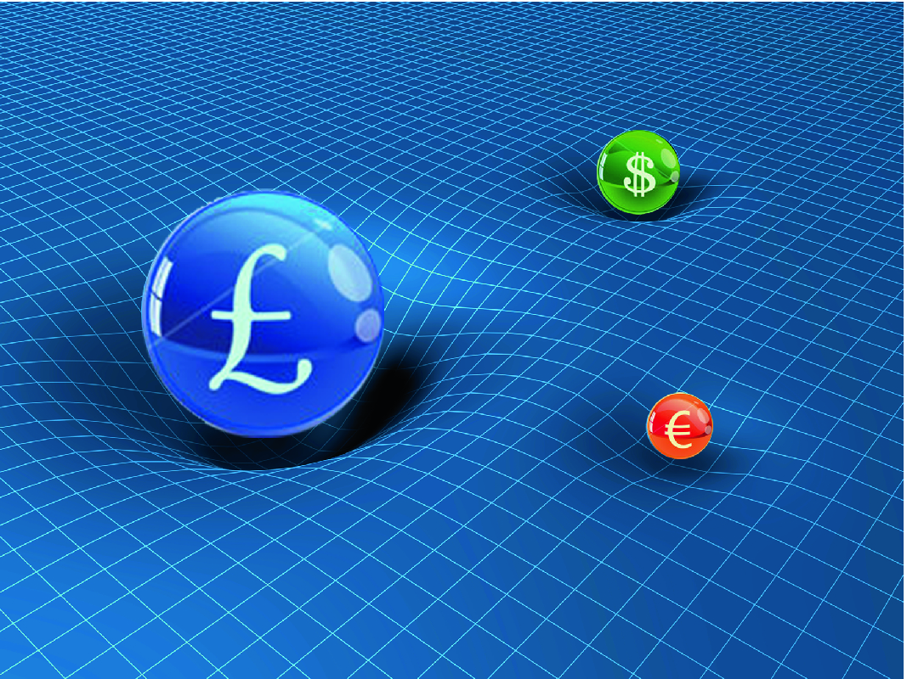
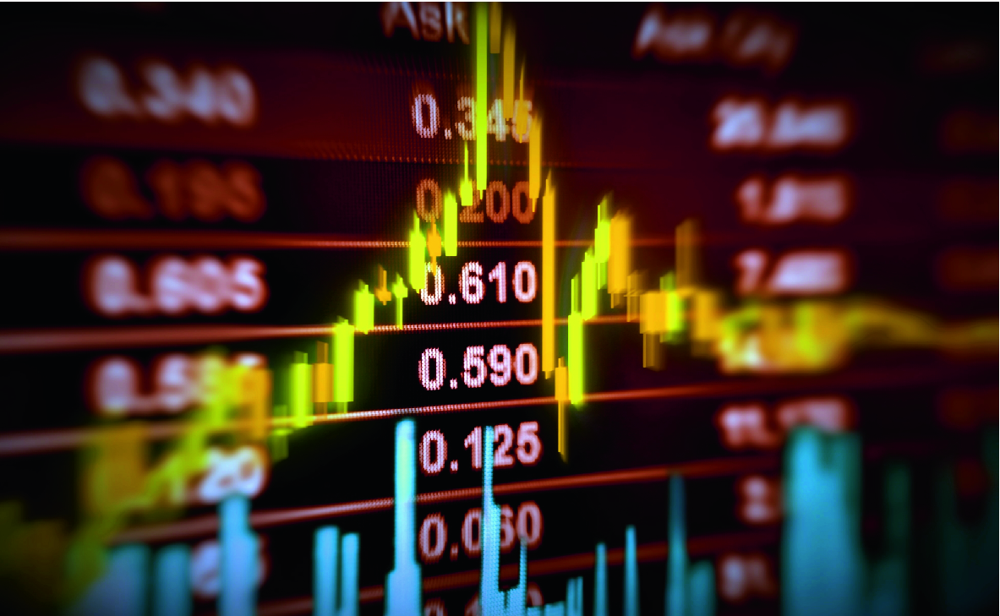
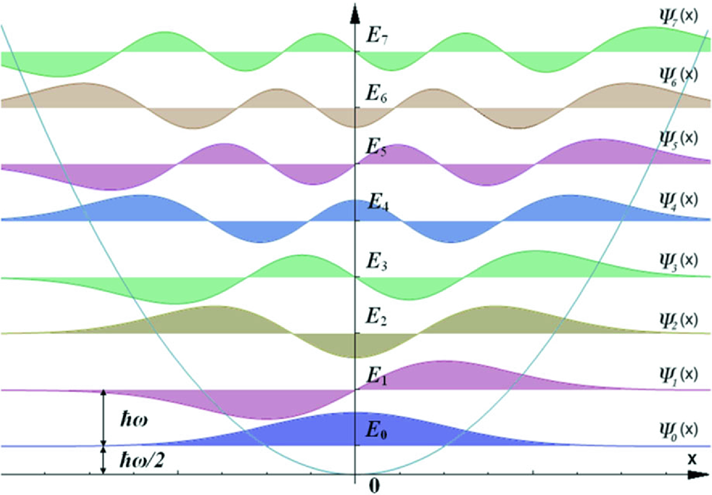
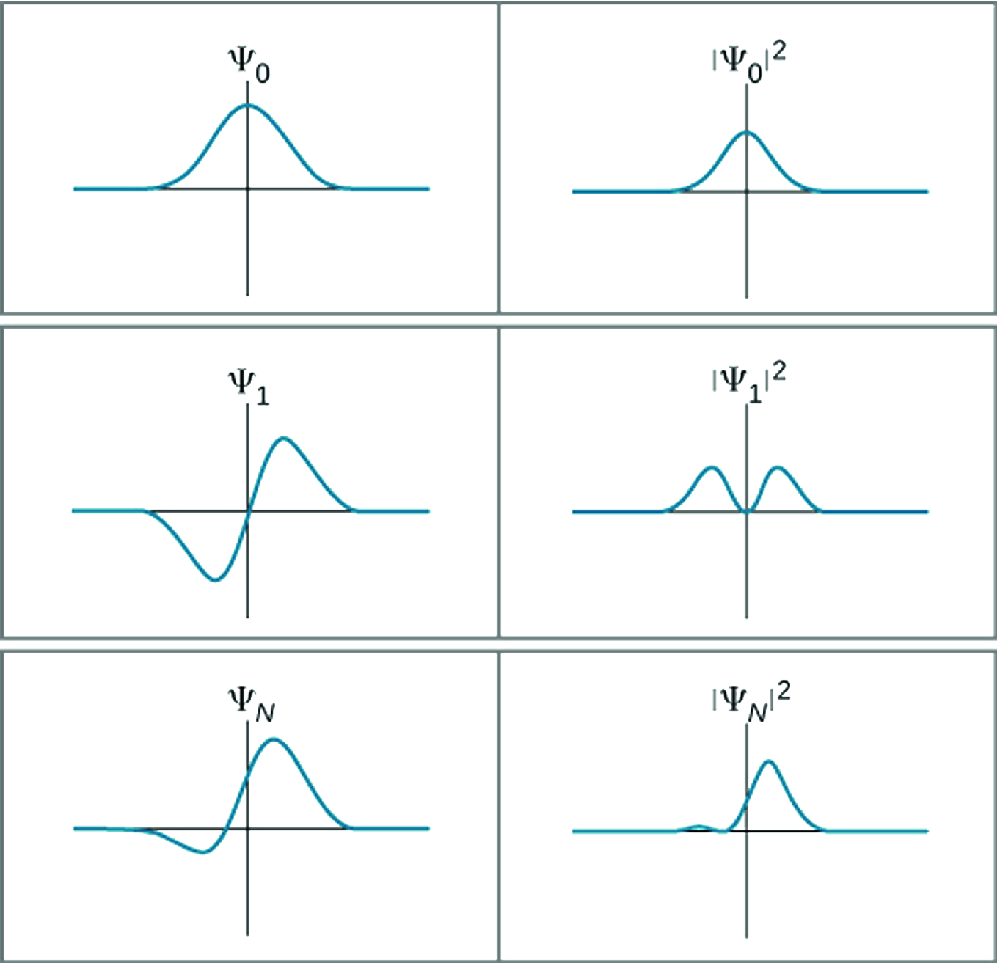
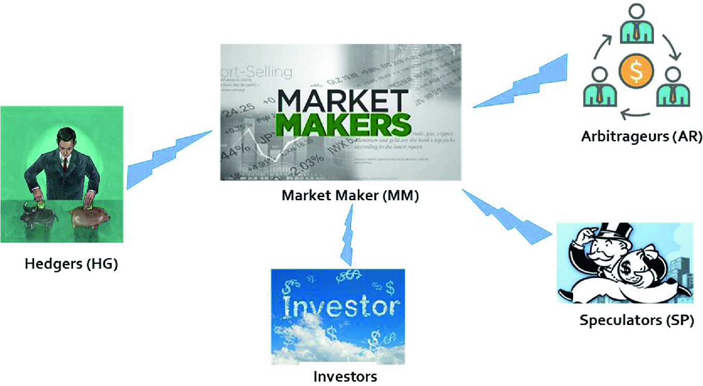
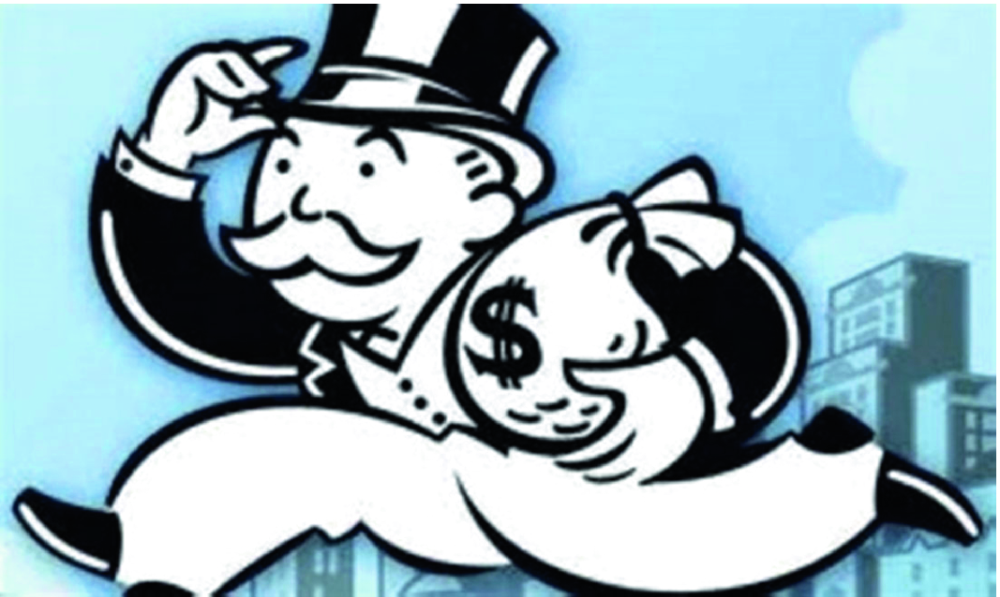
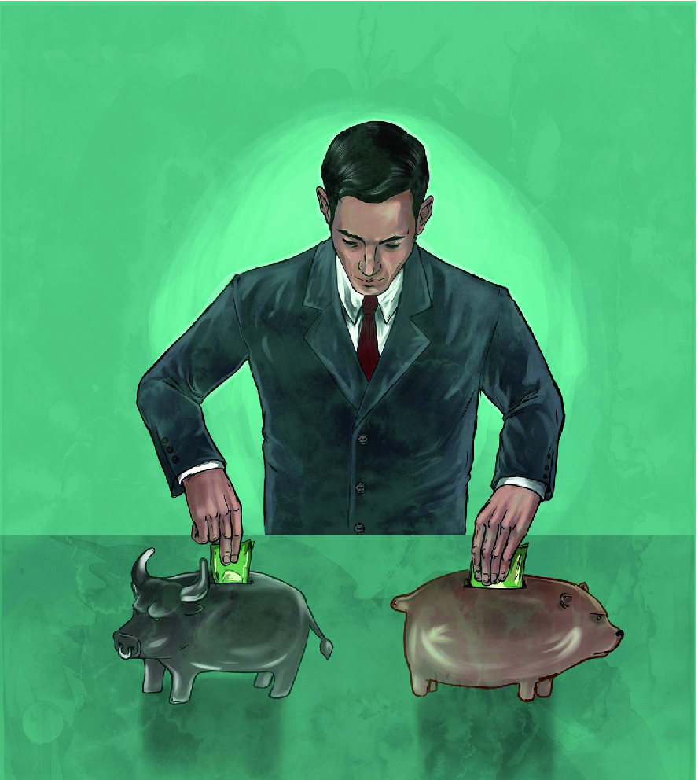
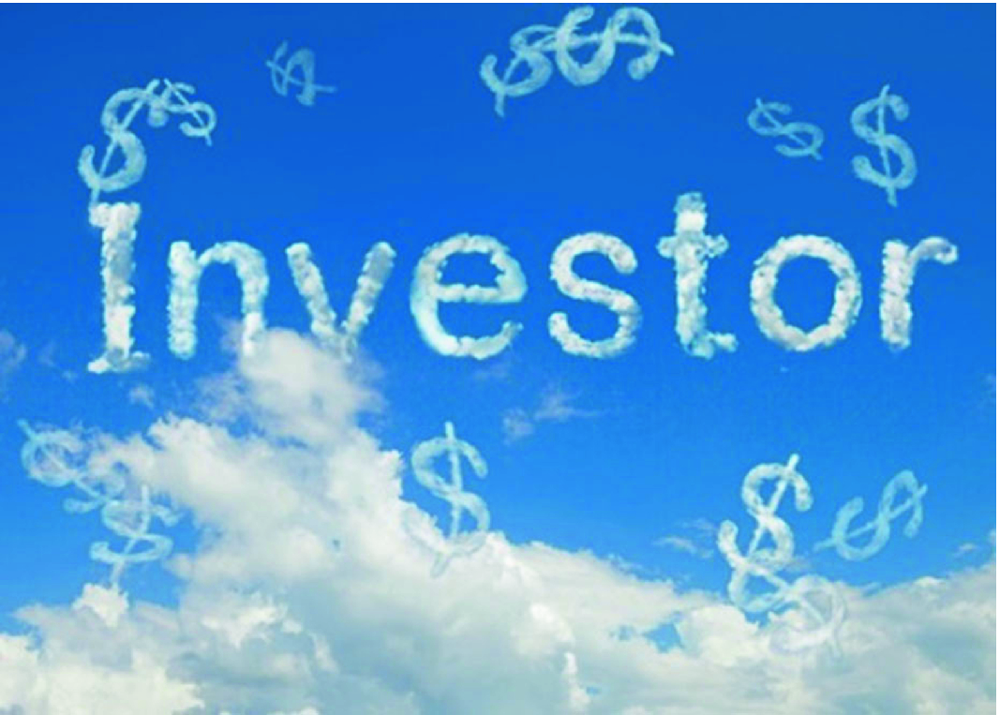
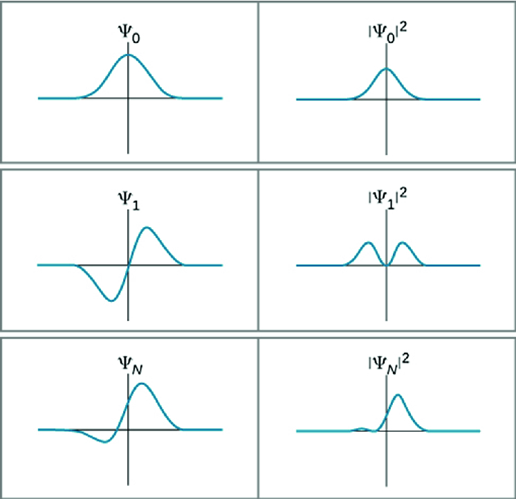

# 4\. Quantum Finance Theory

 _The mathematical framework of quantum theory has passed countless successful tests and is now universally accepted as a consistent and accurate description of all atomic phenomena._

Erwin Schrödinger (1887–1961)

- _If financial markets really exhibit quantum properties_

- _How can we model it??_

- _What do we want to achieve?_

Since Professor Erwin Schrödinger proposed his influential Schrödinger equation in 1925 (Schrödinger 1926)—the core of quantum mechanics and quantum field theory—the studies and research of this “spooky” quantum world were thrived. The advance of computing technology nurtured the study of this unique subatomic world with the possibility of solving these highly complex quantum equations using contemporary computer technology is no more a reverie.

If we say 1920s was quantum theory’s first golden age, the launch of IBM System ONE—first commercial-used quantum computer road show in Las Vegas at CES2019 early this year coined quantum theory’s second golden age—the age of quantum computing.

Why now?

As there is a saying, things wouldn’t happen simply by chance. The only thing is whether we know their cause-and-effect—the _causality_.

If we say quantum computer is the _machine_ that drives this second golden age of quantum theory, the quantum dynamics model we will study in this chapter—the quantum anharmonic oscillator (QAOH) model—can be considered as the _soul_ of this giant _machine_.

Based on concepts and theories of quantum mechanics and quantum field theory studied in previous chapters, in this chapter, we will introduce the core concept of this book—quantum finance theory. First, we will study basic conceptual model of quantum finance theory—the quantum anharmonic oscillator model and introduce quantum price level (QPL) concept for the modeling of quantum finance energy levels. After that, we will revisit Schrödinger equation and combine with the author’s latest work on quantum dynamics modeling of various parties in a secondary financial market (SFM), along with a step-by-step mathematical derivation of quantum finance Schrödinger equation (QFSE).

## 4.1 Quantum Finance Theory 

### 4.1.1 The Concept

In quantum finance, we model the dynamics of financial instruments (such as currencies, financial indices, cryptocurrencies) of worldwide financial markets as quantum financial particles (QFPs) with wave–particle duality characteristics.

The motions and dynamics significance of these quantum financial particles are subject to their intrinsic quantum energy fields, the so-called quantum price fields (QPFs) and appeared to us as quantum price levels (QPLs) in financial markets. They are similar to quantum particles that are affected by the superposition of their own energy levels and the energy field generated by other neighboring quantum particle(s). Figure 4.1 illustrates the quantum financial energy fields created by three types of financial particles: US dollars, Euros, and British pounds.  **Fig. 4.1. Illustration of quantum financial field for worldwide financial products** 

From technical finance perspective, these quantum price levels correspond to the support and resistance (S & R) levels as we know of.

In other words, one of the major objectives of quantum finance theory is to establish an effective and logical quantum finance model and help us to locate all these QPLs of worldwide financial markets using quantum mechanics and quantum field theories. Such quantum finance model must be logically sound and should be a coherent body of classical finance concepts and models.

If dynamics and motions of all fundamental particles found in the physical world are governed by quantum mechanics and quantum field theory as mentioned in Chap. [3](<480082_1_En_3_Chapter.xhtml>), it is reasonable and rational to say that the worldwide financial markets—more precisely—are the price/index movements of all different financial instruments in every single time step, which are believed as results of the _collective conscious, behavior_ , and _decision_ -_making_ of all participants in the markets that can also be modeled by quantum theory without exception.

The only problem is: How can we model them in terms of quantum mechanics and quantum field theory?

More importantly, how to implement these mathematical models in a logical, sensible, and effective manner so that they can apply and implement them in any digital computers?

### 4.1.2 The Notion of Quantum Price

There is one pivotal analog of quantum finance theory and classical quantum theory is the notion of the fundamental particles in quantum finance—quantum price.

From the finance perspective, we are all familiar with that the _current price_ (_spot price_) of any financial product not only represents instantaneous _price value_ but also the _price level_ (a kind of _energy level_ in finance) that resides at every particular moment as shown in Fig. 4.2.  **Fig. 4.2. Stock market price movement (Tuchong2019a)** 

In other words, in classical finance, _price_ itself is not only a scalar value, but in some way; it also represents the _intrinsic energy_ it possesses (analog to the potential energy in classical mechanics). In terms of classical finance, the meaning of _price_ for any financial market has three different interpretations:

1. It represents the instantaneous price value of that particular financial product at a particular time;

2. It represents the _time_ of the particular financial product which reaches that particular price value. That’s why when we say the price of a particular financial product (e.g., stock), we also speak about the time;

3. It represents that intrinsic energy of that financial product at a particular time, which similar to the interpretation for the potential energy of objects and matters in the physical world.

As analog to quantum theory, it is similar to the particle existed and influenced by its own _quantum potential well_ (Harrison and Valavanis 2016). Figure 4.3 shows a typical example of the quantum potential energy well generated by a quantum particle (e.g., an atom).  **Fig. 4.3. Quantum potential energy level well generated by a quantum particle (e.g., an atom)** 

The truth is: the analog of financial particles in quantum finance theory using quantum theory is even more sensible and understandable in the finance community than the notion of quantum particles in its quantum field. The only concern is: How can we make use of classical finance concepts and beliefs to establish quantum dynamics of quantum finance particles?

### 4.1.3 Revisit of Schrödinger Equation

It was recalled that in quantum theory, any quantum particle shown in Fig. 4.4 at position x, the time-dependent Schrödinger equation (Zee 2011) is given by  **Fig. 4.4. Illustration of quantum particle in the subatomic world (Tuchong2019b)** $$i\hbar \frac{\partial }{\partial t}\psi \left( {x,t} \right) = \hat{H}\psi \left( {x,t} \right)$$ (4.1) 

_where_ $\psi \left( {x,t} \right)$ _is the wave function,_ $\hat{H}$ _is the Hamiltonian operator, and_ $\hbar$ _is the reduced Planck constant_ , whereas the corresponding time-independent counterpart is given by $$\hat{H}\,\varphi \left( x \right) = E\varphi \left( x \right)$$ (4.2) where $$\psi \left( {x,t} \right) = \varphi \left( x \right)\,e^{ - iEt/\hbar }$$ 

Note that the time-independent Schrödinger equation is a standard eigenfunction where E is the eigenenergy with discrete energy levels, and the Hamiltonian operator $\hat{H}$ is given by $$\hat{H} = \frac{ - \hbar }{2m} \frac{{\partial^{2} }}{{\partial x^{2} }} + V\left( x \right)$$ (4.3) where ${\hat{\text{H}}}$ comprises kinetic energy, K.E. (first term) + potential energy, P.E. (second term).

## 4.2 Quantum Finance Model 

### 4.2.1 The Mathematical Model

Let _r_ be the _price return_ of a particular _quantum financial particle_ (_QFP)_ at time t (say USD/CAD or simply US Index).

We can rewrite Schrödinger equation in (4.1) as $$i\hbar \frac{\partial }{\partial t}\psi \left( {r,t} \right) = \hat{H}\psi \left( {r,t} \right)$$ (4.4) and the corresponding $\hat{H}$ is given by $$\hat{H} = \frac{ - \hbar }{2m} \frac{{\partial^{2} }}{{\partial r^{2} }} + V\left( {r,t} \right)$$ (4.5) where

1. ${\hat{\text{H}}}$ comprises K.E. (kinetic energy, the first term) and P.E. (potential energy, the second term);

2. $\hbar$ is the Planck constant representing the uncertainty of financial behavior;

3. m is the mass representing the intrinsic potential of financial market, such as the market capitalization of a particular financial product in financial market.

As mentioned in Chap. [3](<480082_1_En_3_Chapter.xhtml>), the usage of _price returns_ (_r)_ instead of _price_ (_p)_ itself is threefold:

1. Use _price returns_ (_r)_ instead of price (p) on mathematical and statistical modeling is a kind of de facto standard in classical financial and statistical finance theory;

2. It is more sensible and easier to implement, especially if we want to compare the performance of two (or more) financial products. By using price return (r) instead of price (p), even when the two financial products have totally different orders of magnitude, e.g., Dow Jones Index versus CADUSD, one is at order 1 × 104 and the other at order of 1 × 101;

3. In terms of quantum theory, the physical meaning of x in time-dependent Schrödinger equation (4.1) is the displacement of quantum particle relative to its equilibrium position, and not the distance of travel in classical mechanics as in Newton’s laws of motion. Therefore, it is obvious and more sensible to use price return (r) instead of price (p) as physical interpretation of r (say daily return) can be considered as the relative price change of that particular financial product at present compared with its closing price of the previous trading day.

### 4.2.2 Physical Meaning of Wave Function $\mathbf{\psi}$

Wave function ($\psi$) is the most important component in the entire quantum theory. It is the realization of wave–particle duality of quantum particles, which can be considered as the bridge to link up between particle and wave realms in the subatomic world as shown in Fig. 4.5.  **Fig. 4.5. Solution of Schrödinger’s equation for quantum harmonic oscillators (left) with their amplitudes (right)** 

What is the wave function ($\psi$) in quantum finance?

Can we observe it, or measure it?

As recalled that in the “double-slit experiment” (Aharonov et al. 2017), what we saw in the backdrop screen is the realization of wave function from quantum particle projections.

However, if we measure it “closely”, all wave-like phenomena will disappear. Can we also recall that?

So, what shall we do?

In quantum theory, we measure the _pdf_ (probability density function, $\rho$) of observations instead, which is given by $$\rho \left( {x,t} \right) = \left| {\psi \left( {x,t} \right)} \right|^{2} = \left| {\varphi \left( x \right)} \right|^{2}$$ (4.6) 

The wave function in quantum finance can be observed by using similar method.

For example, for a time series of 1000 trading days, we measure the closing price return of these 1000 time steps and plot the probability density function (_pdf_) of price return r versus _pdf_ of occurrence $\epsilon$ [0, 1] in order to analog $\psi .$

That is, $$\rho \left( {r,t} \right) = \left| {\psi \left( {r,t} \right)} \right|^{2} = \left| {\varphi \left( r \right)} \right|^{2}$$ (4.7) 

## 4.3 Financial Dynamics 

### 4.3.1 Key Players in Secondary Financial Markets

Once we have the financial model, the next step is to explore _the dynamics_ which means all motions and activities occur inside the model. That is: what are the _dynamics_ in a typical secondary financial market such as forex, commodity, or cryptocurrency?

In other words, what are the major participants in a financial market? What are their behaviors?

For example, in forex market—the biggest OTC (over the counter) market in the worldwide finance (Hull 2016), what are the key participants?

Figure 4.6 shows a framework in a typical secondary financial market (SFM) such as worldwide forex markets (Strumeyer 2017).  **Fig. 4.6. Key Players in a typical secondary financial market (SFM)** 

### 4.3.2 Market Maker (MM)

_Market maker_ (_MM), also known as liquidity provider_ , is a company or an individual that quotes both a buy and a sell price in a financial instrument or commodity held in inventory, hoping to make a profit on the bid-offer spread, or turn (Čekauskas et al. 2012; Zhu et al. 2009).

The U.S. Securities and Exchange Commission defines market maker as firms that stand ready to buy and sell stock on a regular and continuous basis at a publicly quoted price.

Most foreign exchange trading firms are market maker and so are many banks.

The most common type of market maker is brokerage houses that provide purchase and sale solutions for investors, in an effort to keep financial markets liquid.

Market maker can also be an individual intermediary, but due to the size of securities needed to facilitate the volume of purchases and sales, the vast majority of market makers work on behalf of large institutions.

They sell to and also buy from clients, compensated by means of price differentials for services in providing liquidity, reducing transaction costs, and facilitating trade.

They earn profit by the difference between the price at which they are willing to buy a stock and the price that the firm is willing to sell it, also known as the market _spread_ or _bid_ -_ask spread_.

Market maker also provides liquidity to their own firm’s clients, for which they earn a commission.

In terms of investment dynamics, the main function is to maintain healthy market liquidity or facilitate the efficient absorption of buy/sell orders (Fig. 4.7).  **Fig. 4.7. The Market Maker (MM)** 

### 4.3.3 Arbitrageurs (ARs)

Arbitrageurs are traders that take advantage of a price difference between two or more markets.

They look for an imbalance in the pricing of a security in two different markets and buy it at the cheap price in one market to immediately sell it at the higher price in the other market, making a profit on the difference (Hong et al. 2012; Matsushima 2013).

This kind of operation is called arbitrage.

Arbitrageurs are typically very experienced investors since arbitrage opportunities are difficult to find and require relatively fast trading. Arbitrageurs also play an important role in the operation of capital markets, as their efforts in exploiting price inefficiencies keep prices more accurate than they otherwise would be.

However, in an _efficient market_ nowadays with open information and high-speed trading, there are basically no rooms for arbitragers trading (Malkiel 2003).

_**Example of Arbitrage Trading**_

Suppose that the exchange rates of EUR/USD in Frankfurt quotes at $1.25, while in New York it quotes at $1.3 at the same time.

Hence, the euro is undervalued in Frankfurt and overvalued in New York. An arbitrageur would exploit this imbalance to exchange dollars for euros in Frankfurt and immediately exchange the euros for dollars in New York.

The profit for each dollar in this double exchange is 0.8 − 0.769 = 0.031 or a 3% on the amount invested (Fig. 4.8).  **Fig. 4.8. The Arbitrageurs (ARs)** 

### 4.3.4 Speculators (SPs)

Speculators take risk on purpose by betting on future movements of the security’s price (Brunetti et al. 2016; Yi 2017).

For example, a speculator buys a stock under the conviction that its price will rise without any logical and rational reasons most of the time.

Many speculators pay little attention to the fundamental value of a security and instead purely focus on price movements.

In finance, speculation is also the practice of engaging in risky financial transactions in an attempt to profit from short-term fluctuations in market value of a tradable financial instrument—rather than attempting to profit from the underlying financial attributes embodied in the instrument such as capital gains, dividends, or interest.

Speculators are important to market because they bring liquidity besides assume market risk and, conversely, they can also have a negative impact on markets when their trading actions result in a speculative bubble that drives up an asset’s price to unsustainable levels. If a speculator believes that a particular asset is going to increase in value, they may choose to purchase as much of the asset as possible. This activity, based on the perceived increase in demand, drives up the price of the particular asset. If this activity is seen across the market as a positive sign, it may cause other traders to purchase the asset as well, further elevating the price. This can result in a speculative bubble, where the speculator activity has driven the price of an asset above its true value.

In terms of investment behavior, speculators differ from _common investors_ in the sense that they don’t have any risk control mindset. In other words, there is no _damping factor_ against _market volatility_ in their investment strategies (Fig. 4.9).  **Fig. 4.9. Speculators (SPs)** 

### 4.3.5 Hedgers (HGs)

Hedgers trade so to reduce or eliminate the risk of taking a position on security.

The main goal is to protect the portfolio from losing value at the expense of lowering the possible benefits.

This attitude (or trading strategy) is called _hedging_.

A hedging strategy usually involves taking contrarian positions in two or more securities. That’s why many people also call hedgers as contrarians, but actually they are not always 100% acting against the market trends (Radalj 2006; Röthig 2011). 

Speculators and hedgers are different terms that describe traders and investors. Speculation involves trying to make a profit from a security’s price change, whereas hedging attempts to reduce the amount of risk, or volatility, associated with a security’s price change (Yung and Liu 2009; Lin et al. 2009).

Hedging involves taking an offset position in a derivative in order to balance any gains and losses of the underlying asset. Hedging attempts to eliminate the volatility associated with an asset price by taking offset positions contrary to what the investor currently has. The main purpose of speculation, on the other hand, is to profit from betting on the direction in which an asset will be moving.

For example, taking a long position on a stock and a short position on another stock with inverse price behavior or the portfolio risk control strategy we have just mentioned (Fig. 4.10).  **Fig. 4.10. Hedgers (HGs) (Tuchong2019c)** 

### 4.3.6 Investors (IVs)

An _investor_ is a person who allocates capital with the expectation of a future financial return.

Types of investments include equity, debt securities, real estate, currency, commodity, token, derivatives such as put and call options, futures, forwards, etc.

That is, someone who provides a business with capital and someone who buys a stock are both investors.

There are two types of investors, individual (independent) investors and institutional investors.

Individual investor is a nonprofessional investor who buys and sells securities, mutual funds, or exchange-traded funds (ETFs) through traditional or online brokerage firms or savings accounts. Retail investors invest much smaller amounts than large institutional investors, such as mutual funds, pensions and university endowments, and trade less frequently. But wealthier retail investors can now access alternative investment classes like private equity and hedge funds.

Institutional investors (Davis and Steil 2004; Gabaix et al. 2006) are major players in the financial market. They are the pension funds, mutual funds, and also some private equity investors. Institutional investors account for about three-quarters of the volume of trades on the New York Stock Exchange. They move large blocks of shares and have tremendous influence on stock market’s movements.

In terms of investment dynamics, investors normally act as _Trend Followers_ together with certain degree of sense of risk control (i.e., certain degree of _damping factor_ against _market volatility_ in their investment strategies) (Fig. 4.11).  **Fig. 4.11. Investors (IVs)** 

## 4.4 Financial Dynamics and the Notion of Excess Demand 

Once we have the key player in financial market, how can we model their financial dynamics?

The notion of _excess demand_ (_z)._

In classical finance and microeconomics, _excess demand_ is a function expressing excess demand for a product—the excess of quantity demanded over quantity supplied—in terms of the product’s price and possibly other determinants. In a mathematical perspective, it is the product’s demand function minus its supply function. In a pure exchange economy, the excess demand is the sum of all agents’ demands minus the sum of all agents’ initial endowments (Tian 2016; Momi 2010).

The price of the product is said to be the equilibrium price if it is such that the value of the excess demand function is zero: which means, when the market is in equilibrium, the quantity supplied equals the quantity demanded. In this case, it is said that the market clears. If the price is higher than the equilibrium price, excess demand will normally be negative, meaning that there is a surplus (positive excess supply) of the product, and not all of it being offered to the marketplace is being sold. If the price is lower than the equilibrium price, excess demand will normally be positive, meaning that there is a shortage of demand in the financial market.

_**Mathematical Derivations**_

At any time t, $z_{+}\left( t \right)$ and $z_{ - } \left( t \right)$ denote the instantaneous demand and supply for the financial asset.

The excess demand (z) at any instance is given by $$\Delta z = z_{ + } - z_{ - }$$ (4.8) 

Let r(t) is the instantaneous returns, which is given by $$\frac{dp}{dt} = r\left( t \right) = F\left( {\Delta z} \right)$$ (4.9) 

For small $\Delta z$, $F$ can be approximated by a scaling factor $\gamma$ and become $$r\left( t \right) = \frac{\Delta z}{\gamma }$$ (4.10) where $\gamma$ can be used to represent the _market depth_ , the excess demand z required to move the quantum price _p_ by one single quantum. Note that, when $\gamma$ is high, it means that the market has a higher _absorbability_ to excess demand z against price changes.

So, we have $$\frac{dr}{dt} = \frac{{d^{2} p}}{{dt^{2} }} = \frac{1}{\gamma }\,\frac{{d\left( {\Delta z} \right)}}{dt}$$ (4.11) 

## 4.5 Quantum Dynamics in Financial Markets 

According to the investment behaviors of all these five key participants in financial markets, their corresponding quantum dynamics can be interpreted as follows.

### 4.5.1 Market Makers (MMs)

The quantum dynamics for market makers is given by $$\left. {\frac{{dz_{ + } }}{dt}} \right|_{MM} = - \alpha_{ + } z_{ + } \,{\text{and}}$$ (4.12a) $$\left. {\frac{{dz_{ - } }}{dt}} \right|_{MM} = - \alpha_{ - } z_{ - }$$ (4.12b) 

Note:

1. Market makers (MMs) provide market facilitator services to absorb ALL outstanding excess order $z_{ + }$ and $z_{ - }$.

2. $\alpha_{ + }$ and $\alpha_{ - }$ are the market absorbability factors.

3. In terms of quantum dynamics, basically it is a quantum harmonic oscillator (QHO) with $\dot{z}_{ \pm } \propto z_{ \pm }$.

Combining with Eq. (4.8), we have $$\begin{aligned} \left. {\frac{d\Delta z}{dt}} \right|_{MM} & = \left. {\frac{{d\left( {z_{ + } - z_{ - } } \right)}}{dt}} \right|_{MM} \\\ & = \left. {\frac{{dz_{ + } }}{dt}} \right|_{MM} - \left. {\frac{{dz_{ - } }}{dt}} \right|_{MM} \\\ & = - \alpha_{ + } z_{ + } + \alpha_{ - } z_{ - } \\\ \end{aligned}$$ (4.13) 

For an _efficient market_ , we can assume $$\alpha_{ + } = \alpha_{ - } = \alpha_{MM}$$ (4.14) 

So, we have $$\left. {\frac{d\Delta z}{dt}} \right|_{MM} = - \alpha_{MM} \,\Delta z$$ (4.15) 

Using Eq. (4.10), we have $$\left. {\frac{d\Delta z}{dt}} \right|_{MM} = - \gamma \alpha_{MM} \,r$$ (4.16) 

### 4.5.2 Arbitrageurs (ARs)

As mentioned, in an _efficient market_ nowadays with open information and high-speed trading, there are basically no rooms for arbitrageurs’ trading.

### Principle of No Arbitrage on Security Markets

> _There are no_ -_arbitrage opportunities in Reality._

Extended No Arbitrage on security markets states:

1. Arbitrage is not possible.

2. There are no transaction costs, no taxes, and no restrictions on short selling.

3. It is possible to borrow and lend at equal risk-free interest rates.

4. All securities are perfectly divisible.

The principle of no-arbitrage conditions states that market participants cannot claim risk-free return/profit unless there are conditions that facilitate to those claims. The no-arbitrage rule maintains a key position in analyzing price and price movements in financial markets as well as being a central component of such theories and concepts as efficient market hypothesis.

So, assume _Principle of No Arbitrage_ is in every quantum time step, there is no quantum dynamics for arbitrageurs.

In reality, even though there might have a chance of arbitrageurs for an instance of time, but within an efficient market and high-speed trading, such dynamics will soon be _died_ -_down_ and absorbed by the market makers (MMs).

In respect of quantum finance dynamics of the quantum financial particles (QFPs) and the high speed of electronic transactions in every moment of time, it is practically impossible nowadays for arbitrageurs to make profit by looking for the price difference between different financial markets of the same product. The quantum dynamics of the same product between different markets synchronize to their equilibrium states at every moment.

### 4.5.3 Speculators (SPs)

Contradictory, speculators always emerge in every financial market.

Their quantum dynamics are given by $$\left. {\frac{d\Delta z}{dt}} \right|_{SP} = - \delta_{SP} r$$ (4.17) 

Since speculators have no idea of risk control, their quantum dynamics only contain the harmonic oscillator term (the delta term, $\delta_{SP} r$), without any higher order volatility term.

Note that, although speculators might happen to be trend follower ($+\delta_{SP}$), most of the time their risk-taking nature will drive them to irrational speculation of market reversals and act against the market ($- \delta_{SP}$).

As shown in Eq. (4.17), the existence of the only first-order return r means that the entire quantum dynamics of speculators (SPs) is a simple quantum harmonic oscillator (QHO) without any anharmonic component.

From the physical meaning perspective, the existence of the only first order of return (r) in Eq. (4.17) means that dynamics of the speculators only exist the _force constant_ which is the same as the _force constant_ for spring in Newton’s mechanics.

### 4.5.4 Hedgers (HGs)

_Hedgers_ (HGs) represent experienced and skillful traders (also known as _sophisticated traders_) that apply sophisticated hedging strategies across different products and markets. Further will be studied in Chap. [6](<480082_1_En_6_Chapter.xhtml>).

Although they do not always act against the trend, their skills usually demonstrated by reverse trading or prediction of market reversal and act before common investors.

So, their quantum dynamics are given by $$\left. {\frac{d\Delta z}{dt}} \right|_{HG} = - \left( {\delta_{HG} - \upsilon_{HG} r^{2} } \right)r$$ (4.18) 

Note that the quantum dynamics for a hedger has two terms: (1) quantum harmonic oscillatory term (delta term)—proportion to return (r) and (2) quantum anharmonic term (υ) stands for the market volatility, risk control factor proportional to $r^{2}$.

In terms of quantum dynamics, the existence of both first-order and third-order terms of return r cause it to become a typical _quantum anharmonic oscillator_ (QAOH) (Bhargava et al. 1989; Gao and Chen 2017).

### 4.5.5 Investors (IVs)

As mentioned, _investors_ represent common investors and rational investors with certain degree of risk control.

Their unusual strategies (1) follow the trend to gain profit and (2) minimize risk.

So, their quantum dynamics are given by $$\left. {\frac{d\Delta z}{dt}} \right|_{IV} = \left( {\delta_{IV} - \upsilon_{IV} r^{2} } \right)r$$ (4.19) 

Note that, similar to hedgers, the quantum dynamics of an investor has two terms: (1) quantum harmonic oscillatory term (delta term)—proportion to return (r) and (2) quantum anharmonic term (υ) stands for the market volatility, risk control factor proportional to $r^{2}$.

But different from hedgers, common investors are usually _trend followers_ (TFs), so they are basically acting toward returns (r).

### 4.5.6 Overall Dynamics for All Different Parties

By combining quantum dynamics of all key participants in the financial market, the overall quantum dynamics in a typical financial market is given by $$\left. {\frac{d\Delta z}{dt} = \frac{d\Delta z}{dt}} \right|_{MM} + \left. {\frac{d\Delta z}{dt}} \right|_{SP} + \left. {\frac{d\Delta z}{dt}} \right|_{HG} + \left. {\frac{d\Delta z}{dt}} \right|_{IV}$$ (4.20) $$\frac{d\Delta z}{dt} = - \gamma \alpha_{MM} r - \delta_{SP} r - \left( {\delta_{HG} - \upsilon_{HG} r^{2} } \right)r + \left( {\delta_{IV} - \upsilon_{IV} r^{2} } \right)r$$ (4.21) 

That is, $$\frac{d\Delta z}{dt} = - \delta {\text{r}} + \upsilon r^{3}$$ (4.22) 

Combining Eq. (4.11), we have $$\frac{dr}{dt} = \gamma \frac{d\Delta z}{dt} = - \gamma \delta {\text{r}} + \gamma \upsilon r^{3}$$ (4.23) where

$\delta = \gamma \alpha_{MM} + \delta_{SP} + \delta_{HG} - \delta_{IV}$ (damping term) and

$\upsilon = \upsilon_{HG} - \upsilon_{IV}$ (volatility term)

The Brownian price return can be described by Langevin equation: $$m_{r} \frac{{d^{2} r}}{{dt^{2} }} = - \eta \frac{dr}{dt} - \frac{dV\left( r \right)}{dr}$$ (4.24) where

$m_{r}$
    

mass of the financial particle _p_ ;

$\eta$
    

damping force factor;

$V\left( r \right)$
    

time-independent quantum potential.

For the consistency of Eqs. (4.23) and (4.24), i.e., overdamping case where $\frac{{d^{2} r}}{{dt^{2} }} = 0$, we have $$- \frac{dV\left( r \right)}{dr} = \eta \frac{dr}{dt} = - \gamma \eta \delta {\text{r}} + \gamma \eta \upsilon r^{3}$$ (4.25) $$V\left( r \right) = \int {\left( { - \gamma \eta \delta {\text{r}} + \gamma \eta \upsilon r^{3} } \right)dr = \frac{\gamma \eta \delta }{2}r^{2} - \frac{\gamma \eta \upsilon }{4}r^{4} }$$ (4.26) 

So, the time-independent Schrödinger Eqs. (4.4)–(4.5) of a quantum finance particle can be written as follows:

### Quantum Finance Schrödinger Equation, QFSE

$$\left[ {\frac{ - \hbar }{2m} \frac{{d^{2} }}{{dr^{2} }} + \left( {\frac{\gamma \eta \delta }{2}r^{2} - \frac{\gamma \eta \upsilon }{4}r^{4} } \right)} \right]\varphi \left( r \right) = E\varphi \left( r \right)$$ (4.27) 

Note:

1. The time-independent Schrödinger equation of a quantum finance contains both KE and PE terms.

2. Different from classical quantum harmonic oscillator, the quantum finance oscillator is a quantum anharmonic oscillator which consists of two high-order PE terms that represent (1) damping (trading restoration and market absorption) potential and (2) volatility (risk control) potential.

3. Although the market is visualized (observed) as price, the quantum dynamics are controlled by price return ($r = {\frac{dp}{dt}}$), which is consistent with classical financial theory.

## 4.6 Conclusion 

In this chapter, we introduced the main theme of this book: quantum finance theory using quantum anharmonic oscillator (QAOH) model. We began with quantum financial particles (QFPs) concept and their intrinsic quantum energy fields, the so-called quantum price field (QPF). We also studied the notion of quantum price in quantum finance and its relationship with quantum energy level. After that, we examined the Schrödinger equation and explored the physical meaning of wave function ($\psi$).

We then studied the core of this chapter—the five key players in secondary financial markets (SFMs)—market makers, arbitrageurs, speculators, hedges, and investors. First, we analyzed their roles, characteristics, and behaviors in the financial market. After that, we introduced classical financial dynamics and the notion of _excess demand_.

Based on the definition of excess demand, we derived quantum dynamics of these five key parties and deduced the overall quantum dynamic equation of their combined behaviors in secondary financial market. By combining with Eq. (4.11) and the assumption of overdamping case, we derived the quantum finance Schrödinger equation (QFSE) in form of an order-4 quantum anharmonic oscillator system.

An important issue of our step-by-step derivation of the QFSE is that we began the entire mathematical modeling quantum dynamics of secondary financial market based on classical _belief_ and _understanding_ in terms of classical finance and microeconomic theory. By doing so, we can ensure that the QFSE derived can be consistent with basic financial concept and theory, despite we are now using completely new perspective and tool to model the dynamics for secondary financial markets.

In the next chapter, we will explore how to use QFSE, in conjunction with numerical computational technique and _finite difference method_ (FDM) to derive and evaluate quantum finance energy level (QFEL), together with quantum price levels (QPLs) for any financial products in secondary financial markets.

### Problems

1. 4.1

In the past, quantum theory including quantum mechanics and quantum field theory are queried by many mainstream scientists and believed to be some sort of “ _spooky_ ” science. However, nowadays many scientists and general community accept the general idea of quantum theory and the existence of subatomic world. Why?

2. 4.2

What is quantum computer? What is the major difference between quantum computer and the contemporary computers we are using?

3. 4.3

What is the analog between quantum particles in quantum theory and the dynamics of the _financial particles_ in financial markets? Give a live example such as forex market for illustration.

4. 4.4

As a basic concept in finance, “ _prices_ ” in a financial market, such as Dow Jones index (DJI), have three physical and mathematical meanings and interpretations, what are they? How can these three characteristics of prices relate to quantum finance theory?

5. 4.5

What are the major similarities and differences between _prices_ in financial markets versus quantum particles in quantum theory?

6. 4.6

 _Quantization_ phenomena are easily found in financial markets and commonly accepted in technical analysis. Why? Give three examples of technical analytical tools and explain how they work in the realm of quantum finance.

7. 4.7

State the time-dependent Schrödinger equation and its Hamiltonian operator.

     1. (i)

Identify kinetic energy (KE) and potential energy (PE) terms in the formulation;

     2. (ii)

State and explain how these two terms are interpreted in quantum finance.

8. 4.8

In computational finance and quantum finance, we usually use price returns (r) instead of prices (p) for the mathematical formulation and financial analysis. Why? What is/are the advantage(s) of using _returns_ instead of _prices_ for mathematical formulation? Use two financial products as examples for illustration.

9. 4.9

What are the physical meanings of wave function ($\psi$) in (1) quantum theory of quantum particles; (2) quantum finance of quantum financial particles?

10. 4.10

How can we observe and measure wave function ($\psi$) values (and distribution) in terms of (1) quantum theory of quantum particles such as photons; (2) quantum finance theory of quantum financial particles such as Dow Jones index?

11. 4.11

The below figure shows the solutions of Schrödinger’s equation for quantum harmonic oscillators (left) and their amplitudes (right).  **** 

     1. (i)

Write a MATLAB program to solve the Schrödinger’s equation for quantum harmonic oscillators and plot these figures;

     2. (ii)

Describe their physical meanings in terms of quantum finance theory of financial particles such as Dow Jones index (DJI);

     3. (iii)

Can we simply model quantum finance particles such as DJI using quantum harmonic oscillators in reality? Why?

12. 4.12

What is a secondary financial market (SFM)? What are the major differences between primary financial market (PFM) and SFM? In each case, please give two examples for illustration.

13. 4.13

What is a market maker (MM)? Discuss and explain the role(s) and importance of market maker in financial markets.

14. 4.14

What are arbitrageurs? What are the major differences between arbitrageurs and common investors in terms of (1) trading/investment strategy; (2) risk control? Give two examples of financial markets for illustration.

15. 4.15

What are speculators? What are the major differences between speculators and common investors in terms of (1) trading/investment strategy; (2) risk control? Why speculators are important in financial markets? Give two examples of financial markets for illustration.

16. 4.16

What are hedgers? What are the major differences between hedgers and common investors in terms of (1) trading/investment strategy; (2) risk control? Why hedgers are important in financial markets? Give two examples of financial markets for illustration.

17. 4.17

Can an investor be both a hedger and speculator at the same time? Why or why not? Give two examples of financial markets for illustration.

18. 4.18

What are _common investors_ (or _investors_ in short)? What are the characteristics of investors in terms of (1) trading/investment strategy; (2) risk control? Why common investors are vital in financial markets? Give two examples of financial markets for illustration.

19. 4.19

Discuss and explain excess demand (z) in terms of (1) physical meaning in financial markets; (2) mathematical formulation. How can it relate to quantum finance?

20. 4.20

State and explain the quantum finance formulations of the five key participants in a typical financial market.

21. 4.21

State and explain the _principle of no arbitrage_. Explain why it is important in the formulation of the quantum dynamics of arbitrageurs in quantum finance.

22. 4.22

What is an _efficient market_? Explain why it is important in the formulation of the quantum dynamics of market maker in quantum finance.

23. 4.23

What is quantum anharmonic oscillator (QAHO)? What is the major difference between quantum harmonic oscillator (QHO) and its anharmonic counterpart QAHO in terms of (1) quantum dynamics and (2) energy levels?

24. 4.24

For the formulation of real-world financial market, should we choose quantum harmonic oscillator (QHO) or quantum anharmonic oscillator (QAHO) for system modeling and mathematical formulation? Why?

25. 4.25

Combine the quantum finance mathematical formulation of all five key participants in a typical financial market and derive the quantum finance Schrödinger equation.

26. 4.26

State the time-independent quantum finance Schrödinger equation (QFSE).

     1. (i)

Describe and explain the physical meaning of each term in QFSE;

     2. (ii)

What is the physical meaning of (1) Planck constant, (2) mass, (3) damping factor $\eta$, gamma $\gamma$, and (4) delta $\delta$ terms in QFSE?

27. 4.27

Discuss and explain the importance of quantum finance Schrödinger equation (QFSE) in terms of (1) modeling of secondary financial markets and (2) real-time financial prediction. Give two examples of secondary financial markets as explanation.
