# 5\. Quantum Price Levels—Basic Theory and Numerical Computation Technique

 _It is true that in quantum theory we cannot rely on strict causality. But by repeating the experiments many times, we can finally derive from the observation’s statistical distributions, and by repeating such series of experiments, we can arrive at objective statements concerning these distributions._

Werner Heisenberg (1901–1976)

- _What are quantum price levels?_

- _Do they really exist?_

- _How can we model them?_

- _How can we make use of them?_

Professor Werner Heisenberg in this famous quotation stated an important fact: To prove or disprove any new concept or theory, simple concepts and ideas are just not enough. What we need are some _hard evidences_ from repeating the experiments many times to explore the general observation’s statistical distributions. Based on these statistical distributions, we discover some critical patterns. From that, we can conclude with some objective statements and findings to prove or disprove our proposed concept or theory.

It is consistent with German philosopher Immanuel Kant’s remarkable quotation regarding the relationship between _theory_ and _experience_ :

> Experience without theory is blind, but theory without experience is mere intellectual play.
> 
> Immanuel Kant (1724–1804)

In his famous quotation, Immanuel Kant pointed out that the important relationship between _concepts_ and _ideas_ versus _experiences_ and _experimental observations_ is that although concepts, ideas, and theories are the foundation and critical mass for new knowledge, without solid objective experimental observations and experiences, they are merely intellectual fantasies.

The merit of science against pseudoscience is that scientific theories and concepts can be proved, deduced, and observed in the form of mathematical proven, deduction, and tested objectively through experiments. Thus, scientific attitude is even more critical in quantum theory because basic concept and theory of subatomic world and its quantum phenomena are very different from our general belief of this physical world.

The truth is: the mathematical framework of quantum theory has passed countless successful tests with experiments and is now accepted universally as a uniform and accurate description of all quantum phenomena in the subatomic world.

In this book, we follow the same footsteps.

In Chaps. [1](<480082_1_En_1_Chapter.xhtml>)–[3](<480082_1_En_3_Chapter.xhtml>), we introduced the world of quantum finance and studied its basic concept and theory. Based on the quantum anharmonic oscillator (QAOH) model learnt in Chap. [4](<480082_1_En_4_Chapter.xhtml>), we examined its quantum dynamics and mathematical formulation in a typical secondary financial market.

In this chapter, we discuss how such mathematical formulation can be applied in terms of objective experimental results with distribution to evaluate the quantum finance energy levels (QFELs) and quantum price levels (QPLs).

First, we will begin with the investigation of QPL as an analog to quantum energy levels (QELs) in classical quantum world.

Next, we will explore Schrödinger equation and the physical meaning of wave function in this equation. From that, we will study the experiments (time series trading results) of financial products for over 2000 trading days and obtain the observation’s statistical distributions. By repeating such series of experiments onto various financial products, we can arrive at objective statements concerning these distributions. After that, we will combine these observation results with finite difference method (FDM) to derive the value of λ in the quantum finance Schrödinger equation (QFSE).

Finally, we will employ the latest research on λ2m QAOH model, together with _Cardano’s depressed cubic equation solver_ to solve quantum finance Schrödinger equation (QFSE) and calculate all quantum finance energy levels (QFELs); and hence the corresponding QPL using numerical computation method.

## 5.1 Quantum Price Levels (QPLs) 

### 5.1.1 The Concept

What are quantum price levels?

As a direct analog to energy levels in an atom shown in Fig. 5.1, quantum finance energy levels (QFELs) can be considered as invisible energy levels that exist in every financial market; and quantum price levels (QPLs) can be interpreted as the realization of these financial energy levels shown in every secondary financial market. 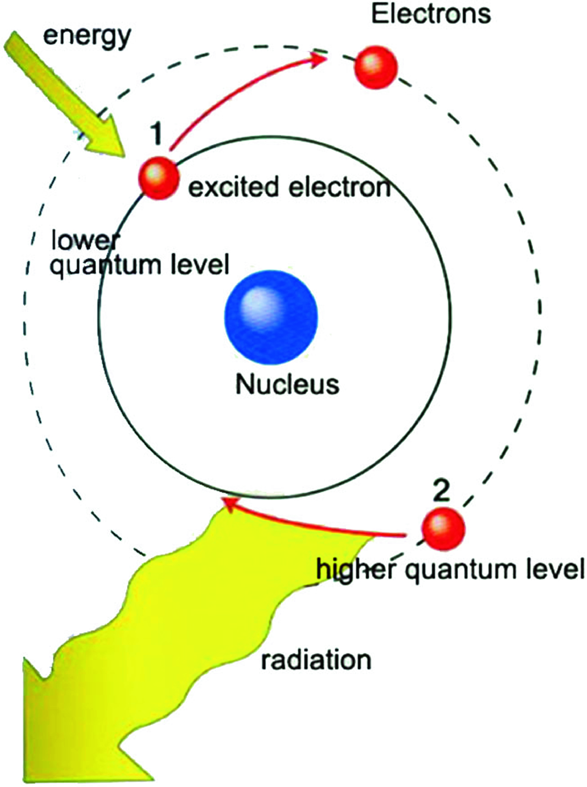 **Fig. 5.1. Quantum energy levels in an atom** 

They are similar to quantum energy levels in an atom; these quantum price levels exist intrinsic in nature as shown in Fig. 5.2. 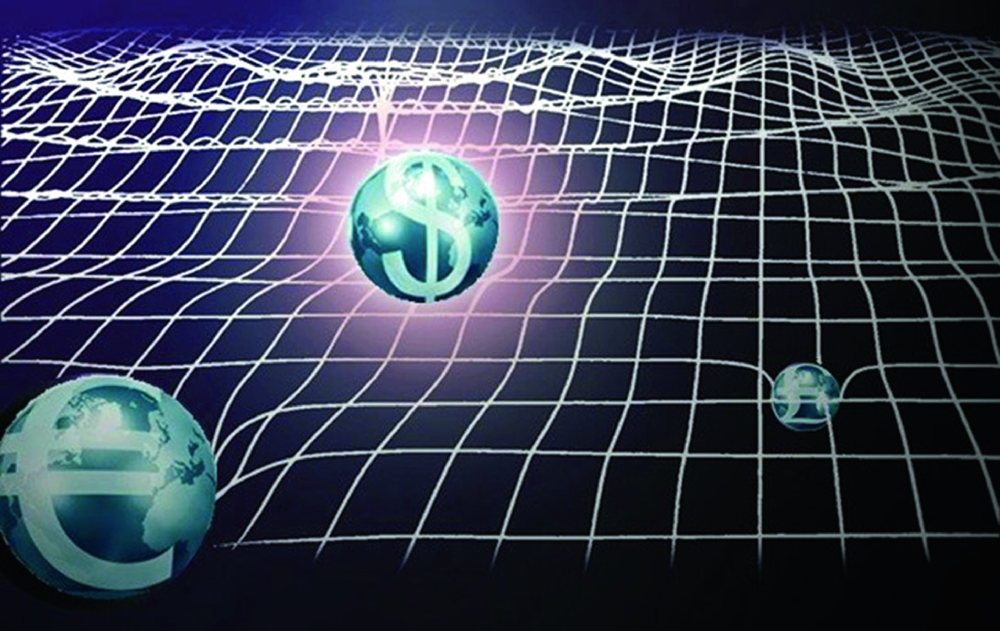 **Fig. 5.2. Quantum price levels in quantum financial energy field** 

In other words, they coexist with the continuance of financial particles in every financial market.

From the finance perspective such as forex market, which means when market opens every time, the quantum financial particles of various currency pairs (e.g., CADUSD, AUDEUR, JPYUSD) will automatically exist and generate their quantum energy field instantaneously, visualized as quantum price levels (QPLs) shown in every financial market and start their quantum finance anharmonic oscillations and motions.

More importantly, these QPLs exist in discrete states with level 0 as the _ground states_ (_E_ 0) (during market open) and all excited states _E_ _n_ in discrete energy levels.

### 5.1.2 The Quantum Dynamics

In terms of quantum dynamics, these energy states are eigenenergy levels described in Schrödinger equation of quantum financial particles—the Quantum Finance Schrödinger Equation (QFSE) derived in Chap. [4](<480082_1_En_4_Chapter.xhtml>), which is given by the following order-4 quantum anharmonic oscillator (5.1): $$\left[ {\frac{ - \hbar }{2m} \frac{{d^{2} }}{{dr^{2} }} + \left( {\frac{\gamma \eta \delta }{2}r^{2} - \frac{\gamma \eta \upsilon }{4}r^{4} } \right)} \right]\varphi (r) = E\varphi (r)$$ (5.1) 

Like an electron in an atom, without external force in action, the electron will remain in its stable ground-state _orbit_.

Similarly, without external financial stimulus such as financial events, major financial news, significant worldwide events, the release financial index figures such as PMI, CPI, PPI, etc., these financial particles will remain in their stable and equilibrium states (so-called _ground states_) and _vibrates_ in the form of _random_ -_like quantum anharmonic oscillations_ as described by QFSE.

However, when there is a significant _financial stimulus_ (either positive or negative events and stimulus), these financial particles will _jump_ to another higher or lower energy levels (i.e., QPLs), not continuous, but in the form of discrete jumps.

After that, _market makers_ (MMs) will _absorb_ the stimulus and financial particles will be back to equilibrium states but reside at a new QPL.

### 5.1.3 QPLs Versus S & R Levels

Do such _quantum price levels_ (QPLs) really exist?

The truth is … we don’t know.

But if we ask any experienced financial analysts and traders, they will all tell us that financial markets are neither random motions nor continuous movements. Discrete and _quantized price levels_ do exist in all financial markets, ranging from stock, forex, worldwide commodity, and even the latest cryptocurrency markets. That’s why we have the concept of _support and resistance levels_ (S & R levels) for over centuries in the financial realm.

In fact, the technical analysis developed since the eighteenth century is based on this fundamental concept and idea (Murphy 1999).

The difference is that, with the exponential growth of program trading, especially the popularity of high-frequency program trading (HFPT), the financial markets become so complex and chaotic that we don’t believe one can observe (locate) all these _hidden energy levels_ manually (Fig. 5.3). 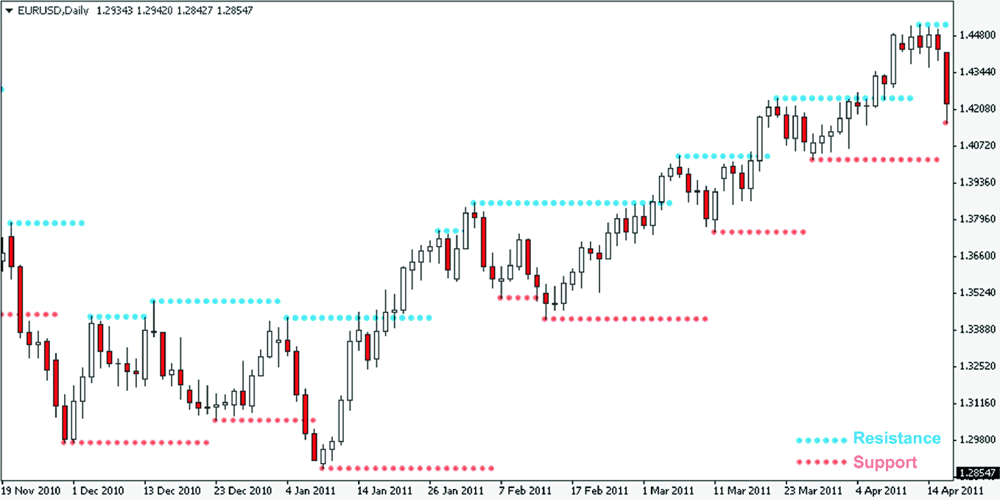 **Fig. 5.3. Support and resistance levels in technical analysis** 

## 5.2 Schrödinger Equation Revisit 

As recalled in quantum dynamics (Zee 2011; Schmitz 2019), for a particle at position x, the time-dependent Schrödinger equation is given by $$i\hbar \frac{\partial }{\partial t}\psi (x,t) = \widehat{H}\psi (x,t)$$ (5.2) where $\uppsi({\text{x}},{\text{t}})$ is the wave function, $\widehat{\text{H}}$ is the Hamiltonian operator, and $\hbar$ is the reduced Planck constant.

Note that the position x in Schrödinger equation is the displacement of quantum particle from its equilibrium states, rather than the displacement stated in the classical Newtonian dynamics, whereas the corresponding time-independent counterpart is given by $$\widehat{H}\varphi (x) = E\varphi (x)$$ (5.3) where $\psi (x,t) = \varphi (x)e^{ - iEt/\hbar }$.

Note that the time-independent Schrödinger equation is a standard eigenfunction where E is the eigenenergy with discrete energy levels and the Hamiltonian operator $\widehat{H}$ is given by $$\widehat{H} = \frac{ - \hbar }{2m} \frac{{\partial^{2} }}{{\partial x^{2} }} + V(x)$$ (5.4) where $\widehat{\text{H}}$ composes of kinetic energy, K.E. (kinetic energy, the first term) + potential energy, P.E. (potential energy, the second term).

## 5.3 Quantum Finance Model 

Let _r_ be the price return of a particular _quantum financial particle_ (_QFP_) at time t (say USD/CAD or simply US Index).

In typical secondary financial markets such as forex or stock market with over 2000-trading day historical records. Normally, we can use the daily returns to represent _r_ in QFSE. In that case, the daily return _r_ will be given by $${\text{r}} = \frac{Today\,Closing\,Price}{Yesterday\,Closing\,Price}$$ (5.5) 

Of course, in case of real-time high-frequency program trading (HFPT), such return price _r_ can use the hourly or 5-min returns as the basis of timeframe.

So, we can rewrite Schrödinger equation in (5.2) as $$i\hbar \frac{\partial }{\partial t}\psi (r,t) = \widehat{H}\psi (r,t)$$ (5.6) and the corresponding Hamiltonian operator $\widehat{H}$ is given by $$\widehat{H} = \frac{ - \hbar }{2m} \frac{{\partial^{2} }}{{\partial r^{2} }} + V(r,t)$$ (5.7) 

Note:

- The Hamiltonian operator $\widehat{\text{H}}$ composes of K.E. and P.E.;

- $\hbar$ is the Planck constant representing the uncertainty of investors’ behavior in the financial market;

- m is the mass representing the intrinsic potential of financial market (such as the overall market capitalization of secondary financial market).

## 5.4 Physical Meaning of Wave Function $\mathbf{\varPsi }$ 

In quantum mechanics and quantum field theory, wave function $(\psi )$ is the most important component in the complete mathematical model, as it is the _realization_ of wave–particle duality of quantum particles in this unique subatomic world of reality.

What is the corresponding wave function in quantum finance?

Can we observe it, or measure it?

Remember in the _double-slit experiment_ of quantum particle, what we have seen in the backdrop screen is the _realization_ of the wave function of quantum particle projections.

However, if we measured it _closely_ at every single path of motion of these quantum particles, all the wave-like phenomena will disappear. Remember that?

In other words, if finance particles really possess such _quantum duality property_ , technically speaking, we cannot observe or measure these discrete quantum energy levels (quantum price levels, QPLs, in our case) _intentionally and directly_. What we can observe is the _random-like_ price fluctuations in market movement chart.

So, what should we do?

_The answer is to_

1. follow Professor Heisenberg’s suggestion in his famous quote cited at the beginning of this chapter; and

2. do the experiment many times and observe wave functions’ distribution.

When we studied classical quantum mechanics in Chap. [2](<480082_1_En_2_Chapter.xhtml>), remember we talked about evaluating the quantum wave function of a quantum particle; all we can do is by measuring _pdf_ (probability distributed function, $\rho$) of the observations instead, which is given by $$\rho (x,t) = \left| {\psi (x,t)} \right|^{2} = \left| {\varphi (x)} \right|^{2}$$ (5.8) 

In quantum finance, wave function can be observed and evaluated by using similar method.

For example, for a time series of 2048 trading days of Gold versus US Dollar (XAUUSD), we measure the daily closing price returns (r) of these 2048 time step and plot the pdf of r versus pdf of occurrence $\epsilon$ [0, 1] to analog the quantum finance wave function $\psi$ of XAUUSD.

That is, $$\rho (r,t) = \left| {\psi (r,t)} \right|^{2} = \left| {\varphi (r)} \right|^{2}$$ (5.9) 

Figure 5.4 shows the _quantum price return wave function_ Q(r) of XAUUSD for the past 2048 trading days (as of January 6, 2019 market information). 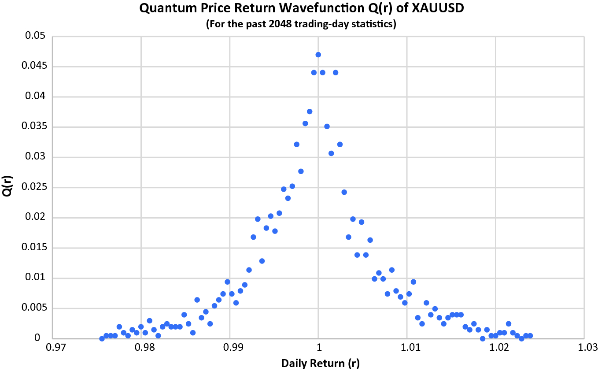 **Fig. 5.4. Quantum price return wave function Q(r) of XAUUSD for the past 2048-trading day (As of January 6, 2019 market information)** 

It is calculated by evaluating the distribution function of _daily price returns_ (r) and plot against the _total number of occurrences_ , given by $$r = \frac{no.\,of\,occurences\,of\,event\,r}{total\,no.\,of\,events\,E}$$ (5.10) where E is the total number of events, 2046 events in our case (with the exclusion of the boundary cases).

Several features can be found:

1. The wave function falls into a standard normal distribution.

2. Maximum (also the mean) occurrence of r is close to 1, which is also the ground state (without any stimulus). Such finding is quite surprising in the financial perspective. As one may think of the returns with the most frequency events should be either greater than or less than 1, it won’t be 1 which means _no change_ from yesterday’s price. But the truth is, after calculating all the 129 worldwide financial products, almost all of them have similar patterns, in which the maximum returns occur when r is close to (or equal to) 1.

3. Basically, the wave function is symmetric with the _central axis_ which corresponds to the mean (which is also the maximum) wave function value that can be reflected by the fact that quantum finance Schrődinger equation (QFSE) is symmetric with respect to the ground state. In other words, once we evaluate the _excited_ states of quantum finance energy levels (E1, E2, E3, …) which corresponds to _positive QPL_ (_the QPLs above the ground-state QPL when market open_), all _negative QPL_ (_the QPL below the ground-state QPL_) can be deducted automatically, as we will see in the upcoming numerical calculations.

## 5.5 Solving Quantum Finance Schrödinger Equation 

Quantum finance Schrödinger equation (QFSE) is given by $$\left[ {\frac{ - \hbar }{2m} \frac{{d^{2} }}{{dr^{2} }} + \left( {\frac{\gamma \eta \delta }{2}r^{2} - \frac{\gamma \eta \upsilon }{4}r^{4} } \right)} \right]\varphi (r) = E\varphi (r)$$ (5.11) 

Once we have the method to evaluate $\varphi (r)$ (i.e., Q(r) in the last section), the center question is to find all corresponding quantum price levels (QPLs).

That is, all the eigenenergy values in QFSE.

Numerous physicists and mathematicians in the past 50 years had devised many methods and techniques to solve this important equation, such as the Hill determinant, Bargmann representation, coupled-cluster method, and variation–perturbation expansion (Grosse and Martin 2005; Muller-Kirsten 2012; Popelier 2011; Bouard and Hausenblas 2019; Rampho 2017; Kisil 2012; Witwit 1996; Rohwedder 2013; Carbonnière 2010).

However, most of them are either technically or mathematically complex in numerical computations.

In 2007, Dasgupta et al. in their paper _Simple systematics in the energy eigenvalues of quantum anharmonic oscillators_ published in the _Journal of Physics A: Mathematical and Theoretical_ provided a genius numerical method to solve a class of Schrődinger equations known as “$\lambda x^{2m}$ _quantum anharmonic oscillators._ ”

In the next section, let’s take a look at how we can adopt this numerical calculation method to solve QFSE within seconds by simple PC computers.

We will be surprised by how genius and simple numerical methods can be by changing the reference horizon.

## 5.6 Numerical Computation of Quantum Anharmonic Oscillators 

A typical $\lambda x^{2m}$ quantum anharmonic oscillators (aka AHO) is given by (Dasgupta et al. 2007): $$H^{(m)} (\lambda )\psi = - \frac{{d^{2} \psi }}{{dx^{2} }} + \left( {x^{2} + \lambda x^{2m} } \right)\psi = E\psi$$ (5.12) in which the excited energy levels can be closely approximated by the following polynomials: $$\left( {\frac{{E^{(m,n)} }}{2n + 1}} \right)^{(m + 1)} - \left( {\frac{{E^{(m,n)} }}{2n + 1}} \right)^{(m - 1)} = \left( {K_{0}^{(m,n)} } \right)^{(m + 1)} \lambda$$ (5.13) where $E^{(m,n)}$ is the nth excited state energy of $\lambda x^{2m}$ AHO and $K_{0}^{(m,n)}$ are constants.

If we look QFSE closely, it is in fact a typical _quartic anharmonic oscillator_ in Chap. [2](<480082_1_En_2_Chapter.xhtml>) (Sect. [2.​5.​3](<480082_1_En_2_Chapter.xhtml>)) with a quartic term in P.E. dynamics.

So, we can convert QFSE (5.11) into a $\lambda x^{2m}$ AHO: $$\frac{{d^{2} \varphi_{r} }}{{dr^{2} }} + \left( {r^{2} + \lambda r^{2m} } \right)\varphi_{r} = E\varphi_{r}$$ (5.14) 

Put m = 2, we have $$\frac{{d^{2} \varphi_{r} }}{{dr^{2} }} + \left( {r^{2} + \lambda r^{4} } \right)\varphi_{r} = E\varphi_{r}$$ (5.15) 

Note: We normalize quadratic term $r^{2}$ with quartic term $r^{4}$ and combine it to coefficient $\lambda$. Note that this $\lambda$ is different from the previous one in the original QFSE. Put in order to honor with Dasgupta’s work, the author intends to keep it in here (and also in the book). Besides, K.E. is also normalized with coefficient set to 1, which is a usual practice in numerical derivation of Schrödinger equation as one may find out that we can discard K.E. during the course of evaluation of different energy levels.

Once we have QFSE in the form of (5.15), we can make use of numerical solution of quantum energy levels in (5.13) by setting m = 2 and further simplify the equation into $$\begin{aligned} & \left( {\frac{E(n)}{2n + 1}} \right)^{3} - \left( {\frac{E(n)}{2n + 1}} \right) = \left( {K_{0} (n)} \right)^{3} \lambda \;{\text{or}} \\\ & \left( {\frac{E\left( n \right)}{2n + 1}} \right)^{3} - \left( {\frac{E\left( n \right)}{2n + 1}} \right) - \left( {K_{0} \left( n \right)} \right)^{3} \lambda = 0 \\\ \end{aligned}$$ (5.16) where $$K_{0} (n) = \left[ {\frac{{1.1924 + 33.2383n + 56.2169n^{2} }}{1 + 43.6196n}} \right]^{1/3}$$ (5.17) 

Note:

The numerical Eqs. (5.16) and (5.17) can be easily calculated by using MATLAB (Chapra 2017; Marghitu and Dupac 2012) and any other computational packages, and of course, using MQL (Young 2015) and integrated with MT (metatrader) platforms—the biggest international online trading and program development platform for real-world financial applications. Details can be found from the _education corner_ of _quantum finance forecast center_ official site, [QFFC.​org](<http://QFFC.org>).

In summary, once we know coefficient $\lambda$, all the quantum energy levels (or quantum price levels) can be found (Fig. 5.5).  **Fig. 5.5. Education corner ofQFFC.​org(QFFC2019)** 

The question is: How can we find $\lambda ?$

## 5.7 Evaluate Quantum Price Levels Using Numerical Computation Technique 

In order to find $\lambda$, we have to revisit QFSE (5.15), given by $$\frac{{d^{2} \varphi_{r} }}{{dr^{2} }} + \left( {r^{2} + \lambda r^{4} } \right)\varphi_{r} = E\varphi_{r}$$ (5.15) 

As mentioned, this quantum finance Schrödinger equation (QFSE) has four characteristics:

1. QFSE is a complex quantum anharmonic oscillator with the combination of harmonic term $(E\varphi_{r} )$ + anharmonic term (i.e., $\left( {r^{2} + \lambda r^{4} } \right)\varphi_{r}$)—also known as _perturbation term_.

2. It consists of two parts: K.E. part (the first term, kinetic energy) and P.E. part (the second term, potential energy).

3. The quantum finance wave function $\varphi_{r}$. If we observe (measure) it with sufficient samples (say over 2000 samples, e.g., 2000 trading days), it will become a typical normal distribution with the maximum value appears at the mean, which is also the stable (ground) state with K.E. = 0.

4. The quantum finance wave function is symmetric with the ground state as the central axis when the samples are sufficiently large.

Using computer to solve this complex equation, we can apply numerical technique with finite difference method (FDM).

## 5.8 Finite Difference Method (FDM) 

With the advance of computer technology, finite difference method (aka FDM) provides an intuitive practical method to solve complex differential and high-order equations by numerical approximation and implemented by computer algorithms (Dimov et al. 2004; Duffy 2006; Tavella and Randdall 2000).

Although the technique is using numerical approximation, when the number of samplings/observations is sufficiently large, the finite step $(\Delta x)$ is sufficiently small (as compared with sampling/observation horizon x). Such method can give a very close approximation to the “actual” analytical solution.

In fact, FDM is commonly used in many large-scale real-time problems such as worldwide weather prediction (also known as _numerical weather prediction_), earthquake modeling, traffic control systems, and naturally worldwide financial analysis.

The finite difference method is a threefold process:

1. For any function y = Q(x), subdivide the x-axis into N subdivisions, i.e., $x_{1}$, $x_{2}$, $x_{3}$, … $x_{N}$.

2. Set the value of y at $x_{i}$ as $y_{i}$.

3. The finite difference formulations for all differential operators will be $$dx = \Delta x$$ (5.18a) $$\frac{dy}{dx}(x_{i} ) = \frac{{y_{i + 1} - y_{i} }}{\Delta x}$$ (5.18b) $$\frac{{d^{2} y}}{{dx^{2} }}(x_{i} ) = \frac{{y_{i + 1} + y_{i - 1} - 2y_{i} }}{{\Delta x^{2} }}$$ (5.18c) 

Let’s take a look at how we can apply FDM to solve our QFSE. Figure 5.6 illustrates the basic idea of FDM. 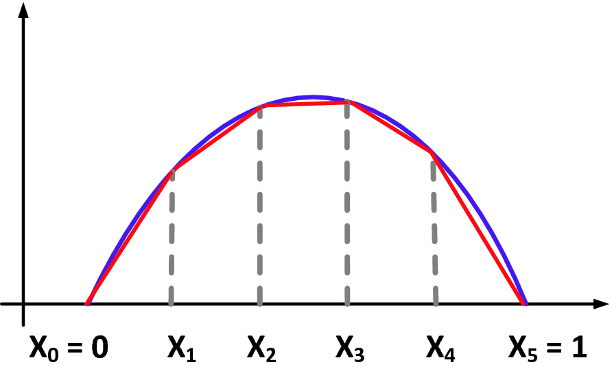 **Fig. 5.6. Basic concept of FDM** 

## 5.9 Finite Difference Method (FDM) to Evaluate QF Wave Function 

Figure 5.7 illustrates the quantum price return wave function Q(r) ($\varphi_{r}$ in our QFSE) mentioned in Sect. 5.4, that is, the wave function distribution statistic of XAUUSD by plotting the pdf of daily returns in the past 2048 trading days. 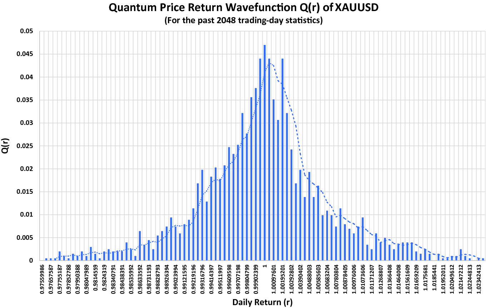 **Fig. 5.7. Quantum price return wave function Q(r) of XAUUSD** 

But the difference is that this time we display this pdf function by dividing the x-axis (r) into 100 equal divisions, with each width $\Delta x$ given by $$\Delta x = \frac{3\sigma }{50}$$ (5.19) where $\sigma$ is the standard deviation of r for the past 2048 trading days (totally, we have 2046 r sample observations by excluding the boundary records).

This figure also shows the regression curve of the wave function for illustration purpose.

As mentioned, when the number of observations/sampling is sufficiently large, all four characteristics of QFSE mentioned in Sect. 5.7 hold.

Besides, certain important findings can be concluded from Fig. 5.7:

1. $\varphi_{Max}$ at r $\cong$ 1 (ground state, denotes as $r_{0}$).

2. $\varphi_{r} = \varphi (r_{0} )$ is symmetric with $r \cong 1$ as symmetry axis, especially when r-segment close to the symmetry axis.

3. So, we can take the first left and right r-segment for calculation, denoted as $r_{ - 1} \,and\,r_{+1}$, respectively.

Figure 5.8 shows three major r-segments in the QF wave function of r; they are $r_{0} ,r_{ - 1} ,and\,r_{+1}$. 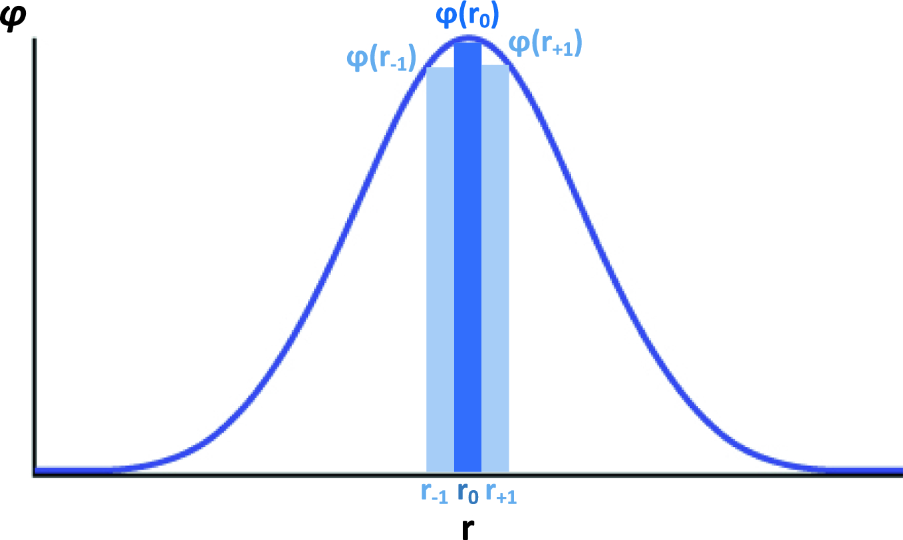 **Fig. 5.8. Illustration of FDM calculation in quantum finance** 

It also corresponds to ground state $\varphi (r_{0} )$ and first +ve and –ve r states, $\varphi (r_{ - 1} )$ and $\varphi (r_{+1} ),$ respectively.

According to QFSE (5.15), the wave function is symmetric with $r_{0}$ as the symmetry axis and $\varphi (r_{0} )$ is the max wave function values.

Since we have all 2046 r observations and also their distribution, i.e., $\varphi$(_r_ ’s), technically we have sufficient information to evaluate $\lambda$ for every financial product.

To evaluate $\lambda$ using finite difference method, we have two options:

1. Using FDM to evaluate the boundary continuously of $r_{0}$ and $r_{+1}$ segments (i.e., The rightmost approximation of $\varphi (r_{0} ) \cong$ leftmost approximate of $\varphi (r_{+1} )$).

2. Using FDM and symmetric property of $\varphi_{r}$, we make use of the symmetric property of $r_{ - 1}$-segment and $r_{+1}$-segment to “cancel out” the K.E. term, and then using FDM to evaluate $\lambda$ using the symmetric property of their P.E. component.

Which option we could choose? Why?

## 5.10 Numerical Evaluation of $\mathbf{\lambda}\left| {_{{\mathbf{XAUUSD}}} } \right.$ Using FDM 

For illustration purpose, we will continue to use XAUUSD as an example to demonstrate how to evaluate $\lambda$ using FDM.

For the 2048 trading days of XAUDUSD (as of January 16, 2019), we have the following statistics information in Table 5.1.

Table 5.1

Statistic results of the quantum price return wave function Q(r) of XAUUSD (as of January 16, 2019)

Product: XAUUSD  
---  
No. of r = 2046| $r_{0} = 0.999604$| $\varphi (r_{0} ) = 0.047785$  
$\Delta r$ = 0.000793| $r_{{{+}1}} = 1.000396$| $\varphi (r_{{{+}1}} ) = 0.038825$  
$Max(\varphi ) = 0.047785$| $r_{ - 1} = 0.998811$| $\varphi (r_{ - 1} ) = 0.039821$  
$Max(\varphi )_{No} = 50$| $\mu = 0.999821$| $\sigma = 0.013213$  
  
_Data source_ [Forex.​com](<http://Forex.com>) MT4 system

As recalled from the QFSE, we have $$\frac{{d^{2} \varphi_{r} }}{{dr^{2} }} + \left( {r^{2} + \lambda r^{4} } \right)\varphi_{r} = E\varphi_{r}$$ (5.15) 

Since QFSE (5.15) is symmetric with respect to the central axis r0, when we consider quantum dynamics for $r_{+1}$ and r−1 segments, their K.E. terms can be canceled out, so we have $$\left( {r_{+1}^{2} + \lambda r_{+1}^{4} } \right)\varphi_{{r_{+1} }} = \left( {r_{ - 1}^{2} + \lambda r_{ - 1}^{4} } \right)\varphi_{{r_{ - 1} }} \;{\text{or}}$$ $$\lambda = \left| {\frac{{r_{ - 1}^{2} \varphi_{{r_{ - 1} }} - r_{+1}^{2} \varphi_{{r_{+1} }} }}{{r_{+1}^{4} \varphi_{{r_{+1} }} - r_{ - 1}^{4} \varphi_{{r_{ - 1} }} }}} \right|$$ (5.20) 

For XAUUSD, after calculation, we have _λ_ = 1.16813758.

Table 5.2 shows _λ_ values for all 120 forex products using MQL program (One can visit [QFFC.​org](<http://QFFC.org>) _education corner_ for detailed implementation procedure).

Table 5.2

 _λ_ values for ALL 120 forex products using MQL program

CODE|  _λ_ values| CODE|  _λ_ values| CODE|  _λ_ values  
---|---|---|---|---|---  
XAGUSD| 1.16813758| US2000| 1.01691648| GBPDKK| 0.50015095  
CORN| 0.98147439| AUDCAD| 0.99800233| GBPHKD| 0.49946476  
US30| 1.00927814| AUDCHF| 1.00650666| GBPJPY| 1.02721719  
AUDUSD| 1.01090471| AUDCNH| 0.99788161| GBPMXN| 1.00743969  
EURCHF| 0.9922947| AUDJPY| 1.01297607| GBPNOK| 0.97866528  
GBPCAD| 0.98033867| AUDNOK| 1.01297576| GBPNZD| 1.01766392  
NZDJPY| 0.99409385| AUDNZD| 0.99883417| GBPPLN| 0.98982647  
USDCNH| 1.00129406| AUDPLN| 0.99972703| GBPSEK| 1.00541074  
XAUAUD| 0.97310053| AUDSGD| 0.99145652| GBPSGD| 0.99543469  
XAUCHF| 1.28307613| CADCHF| 1.05615292| GBPUSD| 0.99737283  
XAUEUR| 1.03339416| CADJPY| 0.97655725| GBPZAR| 0.99672306  
XAUGBP| 1.10858157| CADNOK| 0.9981341| HKDJPY| 1.01256568  
XAUJPY| 1.20798503| CADPLN| 1.02762915| NOKDKK| 1.00723481  
XAUUSD| 0.87114449| CHFHUF| 0.99232627| NOKJPY| 1.00878002  
COPPER| 0.98546677| CHFJPY| 0.94512371| NOKSEK| 0.99266368  
PALLAD| 0.97495035| CHFNOK| 1.00053241| NZDCAD| 1.0105619  
PLAT| 0.93898709| CHFPLN| 1.00582673| NZDCHF| 0.97178881  
UK_OIL| 1.01219635| CNHJPY| 1.00000253| NZDUSD| 1.00708451  
US_OIL| 1.07644811| EURAUD| 1.00721165| SGDHKD| 1.0028679  
US_NATG| 1.76511177| EURCAD| 0.96576866| SGDJPY| 0.95994849  
HTG_OIL| 0.90630263| EURCNH| 1.01233192| TRYJPY| 0.5018959  
COTTON| 1.02930805| EURCZK| 0.99233097| USDCAD| 1.00299693  
SOYBEAN| 0.50226883| EURDKK| 0.99994162| USDCHF| 0.96609929  
SUGAR| 0.99525331| EURGBP| 0.99797319| USDCZK| 0.99456678  
WHEAT| 0.99615377| EURHKD| 1.00358691| USDDKK| 0.99719426  
IT40| 1.01850019| EURHUF| 0.98265533| USDHKD| 1.00178794  
AUS200| 0.99426146| EURJPY| 0.91939902| USDHUF| 1.01153898  
CHINAA50| 0.9806911| EURMXN| 1.02025986| USDILS| 1.0047121  
ESP35| 0.93834053| EURNOK| 0.99508525| USDJPY| 0.50079764  
ESTX50| 1.00351004| EURNZD| 0.50156959| USDMXN| 0.99266275  
FRA40| 1.00704187| EURPLN| 1.06863464| USDNOK| 0.9984592  
GER30| 1.03777101| EURRON| 0.99952845| USDPLN| 1.01260473  
HK50| 0.99188819| EURRUB| 0.99533066| USDRON| 1.00335247  
JPN225| 0.9884408| EURSEK| 1.03002348| USDRUB| 0.98921247  
N25| 0.98915404| EURSGD| 1.00701412| USDSEK| 1.0196364  
NAS100| 0.99279678| EURTRY| 1.01094015| USDSGD| 1.00527642  
SIGI| 1.0158226| EURUSD| 1.01141223| USDTHB| 0.9990309  
SPX500| 1.00436699| EURZAR| 1.04497648| USDTRY| 1.02358136  
SWISS20| 1.00564252| GBPAUD| 1.0092642| USDZAR| 0.9828679  
UK100| 0.98794556| GBPCHF| 0.99417175| ZARJPY| 1.08799327  
  
 _Source_ Experimental results using MQL program, 2019

## 5.11 Numerical Computation of Quantum Energy Levels En

Once we have $\lambda$, we can use (5.16)–(5.17) to evaluate all energy levels En. $$\left( {\frac{E(n)}{2n + 1}} \right)^{3} - \left( {\frac{E(n)}{2n + 1}} \right) - \left( {K_{0} (n)} \right)^{3} \lambda = 0$$ (5.21) $$K_{0} \left( n \right) = \left[ {\frac{{1.1924 + 33.2383n + 56.2169n^{2} }}{1 + 43.6196n}} \right]^{1/3}$$ (5.22) 

Note that (5.16) is a typical cubic polynomial which can be easily solved by MATLAB using “root” command.

For XAUUSD, by using $\lambda =$ 1.16813758, we can write a simple MATLAB program (in the next section) to calculate all first 21 energy levels. Table 5.3 shows the experimental results for the calculation of the first 21 quantum finance energy levels (QFELs) of XAUUSD.

Table 5.3

K values and QFEL values of the first 21 quantum finance energy levels

Product: XAUUSD (_λ_ = 1.16813758)  
---  
Energy level| K| QFEL  
0| 1.060410426| 1.409932766  
1| 1.266594551| 4.744287679  
2| 1.491211949| 8.908118719  
3| 1.663522514| 13.59094957  
4| 1.806129863| 18.6925368  
5| 1.929228428| 24.15086474  
6| 2.038364753| 29.92294434  
7| 2.136927359| 35.97686567  
8| 2.227155031| 42.28781818  
9| 2.310613024| 48.8358504  
10| 2.388443595| 55.60450183  
11| 2.4615088| 62.57991521  
12| 2.530477086| 69.75023292  
13| 2.595878459| 77.10517084  
14| 2.658141083| 84.635708  
15| 2.717616385| 92.33385484  
16| 2.77459678| 100.1924762  
17| 2.829328496| 108.2051536  
18| 2.882021043| 116.3660765  
19| 2.932854345| 124.6699548  
20| 2.981984198| 133.1119479  
  
 _Source_ Experimental results using MATLAB development tool, 2019

## 5.12 Numerical Computation of Quantum Finance Energy Levels (MATLAB Version) 

In this MATLAB program shown in Fig. 5.9, we use λ value 1.16813758 to calculate the first 21 K and quantum finance energy levels (QFELs) of XAUUSD. 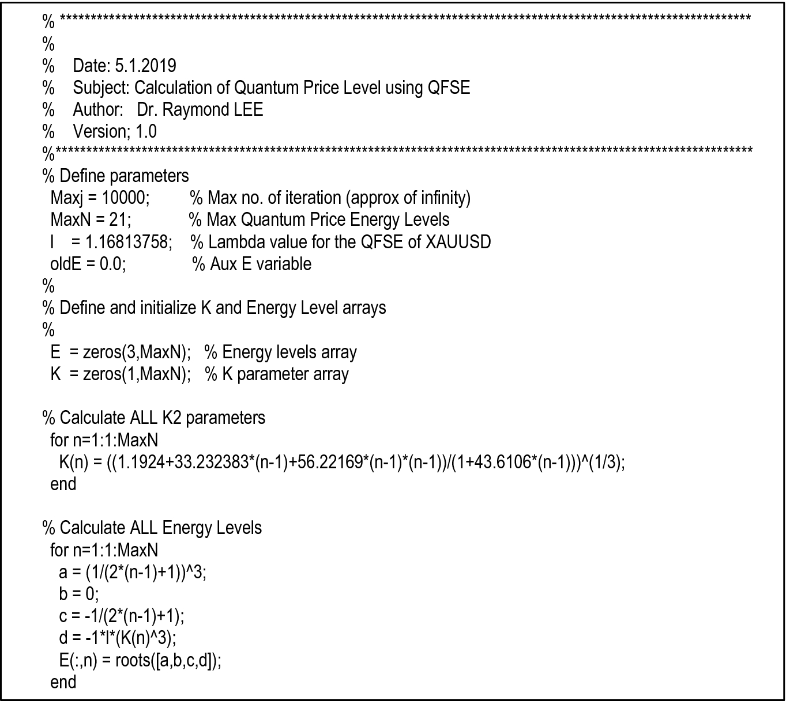 **Fig. 5.9. MATLAB program for the numerical computation of QFEL for XAUUSD** 

To solve the cubic equation, MATLAB command _roots()_ is used to evaluate the solution set. Since (5.21) is a typical cubic equation, normally it will have solution set of three values, with one real number and two complex solutions.

So, we set the real number solution as QFEL value.

## 5.13 Depressed Cubic Equation Solver—Gerolamo Cardano 

Actually, the MATLAB version is just for illustration.

In real-time situation, we will implement quantum energy level calculation using MQL.

Why?

The answer is simple, so that we can fully automate the time series financial data extraction process with statistic calculation of quantum finance wave function and calculate all quantum finance energy levels in a single MT program.

The only problem is: Without the fantastic cubic solver like _roots() i_ n MATLAB, how can we solve the cubic (5.21) in MQL?

The solution is … Cardano’s method.

Gerolamo Cardano (1501–1576) was a close friend of Leonardo da Vinci, an Italian mathematician, physician, biologist, physicist, chemist, astrologer, astronomer, philosopher, writer, and gambler.

He was one of the most influential mathematicians of the Renaissance and was one of the key figures in the foundation of probability as well as the earliest introducer of binomial coefficients and binomial theorem in the western world.

Cardano was the first mathematician to make systematic use of negative numbers.

One of his most influential discoveries is the solution to one particular case of the cubic equation, so-called “depressed cubic equation” (cubic equation without quadratic term): $$ax^{3} + bx + c = 0$$ (5.23) 

## 5.14 Cardano’s Method for Calculating QFEL 

Published in his book _Ars Magna_ in 1545, Cardano devised a genius way to solve the _depressed cubic equation_ as follows:

Given a depressed cubic equation: $$t^{3} + pt + q = 0$$ (5.24) 

Cardano introduced variables u and v such that $$u + v = t$$ (5.25) 

With additional condition, $$3uv + p = 0$$ (5.26) 

By simple substitution of (5.19) into (5.18a, 5.18b, 5.18c), we have $$u^{3} + v^{3} + (3uv + p)(u + v) + q = 0$$ (5.27) 

Using (5.26), we have $$u^{3} + v^{3} = - q\;{\text{and}}$$ (5.28a) $$u^{3} v^{3} = - \frac{{p^{3} }}{27}$$ (5.28b) 

The tricky point is that the combination of (5.28a and 5.28b) will lead to the following quadratic equation where $u^{3} \,and\,v^{3}$ are the roots of the equation: $$z^{2} + qz - \frac{{p^{3} }}{27} = 0$$ (5.29) 

By solving (5.29), we can find $u^{3} \,and\,v^{3}$: $$u^{3} = - \frac{q}{2} + \sqrt {\frac{{q^{2} }}{4} + \frac{{p^{3} }}{27}} ,\quad v^{3} = - \frac{q}{2} - \sqrt {\frac{{q^{2} }}{4} + \frac{{p^{3} }}{27}}$$ (5.30) 

Finally, we have $$t = \sqrt[3]{{ - \frac{q}{2} + \sqrt {\frac{{q^{2} }}{4} + \frac{{p^{3} }}{27}} }} + \sqrt[3]{{ - \frac{q}{2} - \sqrt {\frac{{q^{2} }}{4} + \frac{{p^{3} }}{27}} }}$$ (5.31) 

At the time of Cardano, there is no concept of complex number. As we now know, the solution of this cubic equation will normally has three roots, one real and two symmetric complex roots. In our case, we take the first real root as solution, which can be done easily by any programming platform, MQL naturally.

## 5.15 Numerical Computation of Quantum Energy Levels (MQL Version) 

By substituting (5.21) with Cardano’s formula, $$\left( {\frac{E(n)}{2n + 1}} \right)^{3} - \left( {\frac{E(n)}{2n + 1}} \right) - \left( {K_{0} (n)} \right)^{3} \lambda = 0$$ (5.21) 

Finally, we have $$E\left( n \right) = \sqrt[3]{{ - \frac{q}{2} + \sqrt {\frac{{q^{2} }}{4} + \frac{{p^{3} }}{27}} }} + \sqrt[3]{{ - \frac{q}{2} - \sqrt {\frac{{q^{2} }}{4} + \frac{{p^{3} }}{27}} }}$$ (5.31) where $$p = - (2n + 1)^{2}$$ (5.32a) $$q = - \lambda (2n + 1)^{3} \left[ {K_{0} (n)} \right]^{3} \;{\text{and}}$$ (5.32b) $$K_{0} (n) = \left[ {\frac{{1.1924 + 33.2383n + 56.2169n^{2} }}{1 + 43.6196n}} \right]^{1/3}$$ (5.32c) 

Figure 5.10 shows the program section in MQL for the calculation of first 21 energy levels of a financial product (with given _λ_ determined in the previous section). 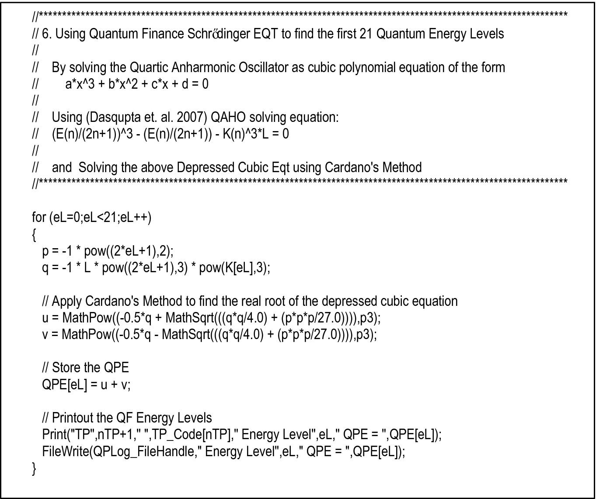 **Fig. 5.10. Program section in MQL for the calculation of first 21 energy levels of a financial product** 

Once all QF energy levels are calculated, the determination of the quantum price levels will be a straightforward scaling problem.

Figure 5.11 shows the overall algorithm for the determination of first 21 quantum finance energy levels (QFELs) and hence the quantum price levels for 120 financial products using MQL. 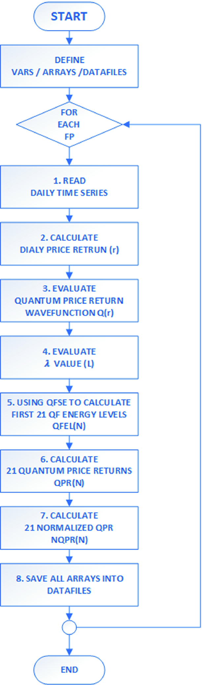 **Fig. 5.11. Flowchart for the determination of the first 21 QFELs and QPLs** 

For details, please visit the programming workshop at the _Education Corner_ of [QFFC.​org](<http://QFFC.org>).

## 5.16 Numerical Algorithm to Calculate QPL Using MQL 

For each financial product, do the following:

- Read the daily time series and extract (Date, O, H, L, C, V)

- Calculate dally price return r(t)

- Calculate quantum price return wave function Q(r) (size 100)

- Evaluate λ value for the wave function Q(r) using FDM and Eq. (5.21) and evaluate other related parameters:

    * sigma (std dev of Q)

    * maxQPR (max quantum price return—for normalization)

- Once λ is found, using Quantum Finance Schrodinger Equation (numerical solution) by solving the depressed cubic equation using Cardano’s method (5.32a–5.32c) to calculate first 21 quantum finance energy levels, QFEL(n), n = [1 … 20]

- Calculate quantum price return, QPR(n) $$p = - (2n + 1)^{2}$$ (5.33) $${\text{QPR}}({\text{n}}) = \frac{QFEL(n)}{QFEL(0)}$$ (5.34) where n = [1 … 20]

- Calculate normalized QPR(n) $${\text{NQPR}}({\text{n}}) = 1 + 0.21*{\text{sigma}}*{\text{QPR}}({\text{n}})$$ (5.35) where n = [1 … 20]

- Save two level of data files:

    * For each financial product, save the QPL table contains QPE, QPR, and NQPR for the first 21 energy levels

    * For all financial product, create a QPL summary table containing NQPR for all FP, which will be used for financial prediction using recurrent neural networks.

## 5.17 QPLs for XAUUSD 

Table 5.4 shows QPE, QPR, and NQPR for the first 21 energy levels of XAUUSD by using the 2048 daily time series data from [Forex.​com](<http://Forex.com>).

Table 5.4

QPE, QPR, and NQPR for the first 21 energy levels of XAUUSD by using the 2048 daily time series data from [Forex.​com](<http://Forex.com>)

Product: XAUUSD (_λ_ = 1.16813758)  
---  
Energy level| QPE| QPR| NQPR  
0| 1.40993277| 1| 1.00277473  
1| 4.7443013| 3.36491314| 1.00933673  
2| 8.90806181| 6.3180756| 1.01753097  
3| 13.590797| 9.63932275| 1.02674654  
4| 18.69227098| 13.25756193| 1.03678619  
5| 24.15047183| 17.12881096| 1.04752787  
6| 29.9224128| 21.22258132| 1.05888698  
7| 35.97618549| 25.51624187| 1.07080074  
8| 42.28698048| 29.99219642| 1.08322032  
9| 48.83484717| 34.63629495| 1.09610645  
10| 55.60332572| 39.43686325| 1.10942674  
11| 62.57855942| 44.38407341| 1.12315392  
12| 69.74869114| 49.4695157| 1.13726466  
13| 77.10343711| 54.68589633| 1.15173872  
14| 84.63377674| 60.0268174| 1.16655835  
15| 92.33172074| 65.48661249| 1.18170782  
16| 100.1901342| 71.06022114| 1.19717309  
17| 108.2025989| 76.74309121| 1.21294154  
18| 116.3633045| 82.53110164| 1.22900172  
19| 124.666961| 88.42050054| 1.24534322  
20| 133.108728| 94.40785487| 1.26195653  
  
 _Source_ Experimental results using MQL for implementation, 2019

According to quantum finance theory and the symmetric property of QFSE, at the beginning of each trading day, the first 21 QPL+ is calculated by $$QPL_{0} = P_{Open} *NQPR(0)$$ (5.30a) $$QPL_{+n} = P_{Open} *NQPR(n),\quad {\text{n}} = [1 \,\ldots\, 20]$$ (5.30b) $$QPL_{ - n} = P_{Open} /NQPR(n),\quad {\text{n}} = [1\, \ldots \, 20]$$ (5.30c) 

In real application, every day at 08:00 HKT/UTC0, QFFC will calculate the forecast H/L for worldwide 129 financial products, together with daily eight closest QPLs for each FP, upload onto QFFC official site for public access.

## 5.18 Conclusion 

In this chapter, we studied the basic theory of quantum price level (QPL).

More crucially, this chapter shows how to evaluate the quantum finance energy level (and hence the QPL) by solving quantum finance Schrödinger equation (QFSE) using simple numerical computation methods.

Prior to this book, quantum finance and path integral analysis seem to be a mathematically complex and far-reaching techniques for data scientists, quants, and financial analysts to comprehend; let’s alone with the actual calculation/ program design of QPL.

But now, quantum finance and hence QPL can be easily and practically applied to real-world financial situation by using common PC systems.

Any quants and analysts can now use their own PC/MAC systems to program and calculate any QPL, and QPL they want to integrate into their own trading systems.

In fact, quantum price level (QPL) evaluation is only the first step of quantum finance.

More important is how to make use of it, together with other AI tools to design and implement real-time financial prediction and intelligent trading systems.

### Problems

1. 5.1

Why experiments and experimental results are key factors in quantum theory? And how can we do that in quantum finance? Give two examples in financial markets in your explanation.

2. 5.2

What is _pseudoscience_? What is the major difference between _science_ and _pseudoscience_? Give two examples of pseudoscience examples in finance and explain why they are not scientific methods.

3. 5.3

What are the three major similarities and differences between quantum energy levels (QELs) in quantum theory versus quantum price level (QPL) in quantum finance?

4. 5.4

What are _support and resistance levels_ (S & R) in technical analysis? Why they are important in modern finance and financial trading?

5. 5.5

Discuss and explain the similarities and differences between quantum price levels (QPLs) and _support and resistance levels_ (S & R). Give two examples in financial markets in your explanation.

6. 5.6

What is the physical meaning of wave function $(\psi )$ in quantum finance? And how wave function can be interpreted by double-slit experiment?

7. 5.7

What is a $\lambda x^{2m}$ quantum anharmonic oscillator? What is the major difference between a typical quantum anharmonic oscillator and a $\lambda x^{2m}$ quantum anharmonic oscillator? What is the mathematical significance of $\lambda x^{2m}$ quantum anharmonic oscillator?

8. 5.8

State and explain the physical meaning of each term in the mathematical formulation of excited energy levels in a $\lambda x^{2m}$ quantum anharmonic oscillator.

9. 5.9

State and explain the mathematical derivation of the quantum finance Schrödinger equation (QFSE) with the integration of $\lambda x^{2m}$ quantum anharmonic oscillator formulation. Explain how it can be used to evaluate quantum price levels (QPLs) in quantum finance.

10. 5.10

How can we evaluate the wave function $(\psi )$ of any financial product in quantum finance? The following figure shows the wave function distribution of Gold (XAUUSD) using the past 2048-trading day time series. 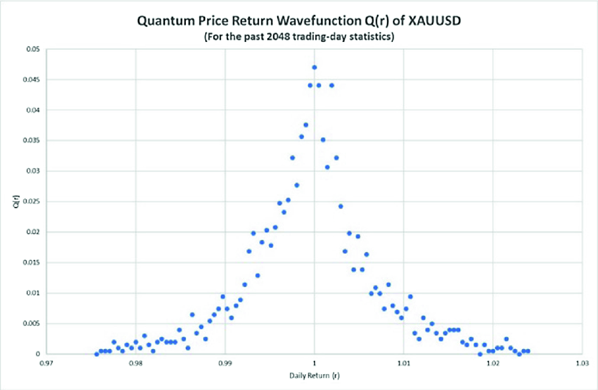 **** 

     1. (i)

Using MQL (tutorials can be found in [QFFC.​org](<http://QFFC.org>) official site) or R to plot wave function distribution of (1) CORN; (2) Dow Jones Index (DJI) and crude oil (US Oil);

     2. (ii)

Compare these three wave function distribution charts with XAUUSD, what are the major similarities and difference between these four distribution charts? Why?

11. 5.11

Given the following experiment results for the wave function distribution of Silver (XAGUSD) in 2046-trading days:

No. of r = 2046| $r_{0} = 0.999604$| $\varphi (r_{0} ) = 0.047785$  
---|---|---  
$\Delta r$ = 0.000793| $r_{+1} = 1.000396$| $\varphi (r_{+1} ) = 0.038825$  
$Max(\varphi ) = 0.047785$| $r_{ - 1} = 0.998811$| $\varphi (r_{ - 1} ) = 0.039821$  
$Max(\varphi )_{No} = 50$| $\mu = 0.999821$| $\sigma = 0.013213$  
  
Calculate $\lambda$ term for XAGUSD.

12. 5.12

Write the flowchart to show the steps and processes to calculate the 20 closest quantum price levels (QPLs) of XAGUSD using MT4 system with 2000 past trading day time series.

13. 5.13

Based on the $\lambda$ term calculated for XAGUSD in Question 5.11, and the numerical formulation of QAHO given by $$\left( {\frac{E(n)}{2n + 1}} \right)^{3} - \left( {\frac{E(n)}{2n + 1}} \right) - \left( {K_{0} (n)} \right)^{3} \lambda = 0$$ where $K_{0} (n) = \left[ {\frac{{1.1924 + 33.2383n + 56.2169n^{2} }}{1 + 43.6196n}} \right]^{1/3}$

And today opening price for XAGUSD is 14.31, calculate the 21 closest _quantum price levels_ (_QPLs_) for XAGUSD today.

14. 5.14

Below given the quantum finance Schrödinger equation in QAHO format. $$\frac{{d^{2} \varphi_{r} }}{{dr^{2} }} + \left( {r^{2} + \lambda r^{4} } \right)\varphi_{r} = E\varphi_{r}$$ 

     1. (i)

State and explain the physical meanings of each term in terms of quantum finance theory;

     2. (ii)

What is importance of the anharmonic term in the QFSE?

     3. (iii)

Discuss and explain the major characteristics of QFSE in QAHO format;

     4. (iv)

What is the importance of QFSE in QAHO format in terms of (1) modeling of quantum financial markets; (2) computational and implementation perspective for the evaluation of QPL?

15. 5.15

What is _finite difference method_ (FDM)? How it works?

16. 5.16

State and explain the basic assumptions and formulations of finite difference method.

17. 5.17

Discuss and explain how to apply finite difference method (FDM) for the evaluation of quantum finance wave function.

18. 5.18

Based on the wave function distributions evaluated in 5.10 for CORN, DJI, and US Oil:

     1. (i)

Choose the best _dr_ to evaluate their $\lambda$ values.

     2. (ii)

How to choose the best _dr_ interval? Why? and What is the importance?

19. 5.19

What is a _depressed cubic equation_? Discuss and explain Cardano’s technique for solving _depressed cubic equation_.

20. 5.20

By solving the _depressed cubic equation_ to evaluate QFEL, normally three roots will be evaluated with two of them are imaginary roots.

     1. (i)

What is the physical meaning of these three roots of QFEL in terms of quantum theory and quantum finance?

     2. (ii)

Is it possible to have three roots are all real numbers? Why? and what is the physical meaning in terms of quantum finance?

     3. (iii)

Which root we should take as the solution of QFEL? Why?

21. 5.21

MQL programming assignment.

Study the MQL tutorial from [QFFC.​org](<http://QFFC.org>) official site. Write an MQL program to

     1. (i)

Read the previous 2000-trading day time series of CORN, DJI, and US Oil.

     2. (ii)

Plot their wave function distribution charts.

     3. (iii)

Evaluate $\lambda$ values of their wave function distribution.

     4. (iv)

Implement Cardano’s technique to evaluate QFELs and QPRs of these products.

     5. (v)

Using the opening price of these financial products, modify your MQL to calculate the first 41 quantum price levels (i.e., QPL−20, QPL−19, …, QPL0, …, QPL+19, QPL+20).

     6. (vi)

State and explain how you can test the accuracy and performance of using these QPLs to replace _support and resistance levels_ (S & R) for financial analysis.

     7. (vii)

Modify your MQL to implement (vi) for the performance evaluation of these QPLs for CORN, DJI, and US Oil and compare their overall performance.

     8. (viii)

Perform the same procedure as (vii) to write an MQL program to calculate and evaluate the performance of QPLs for ALL forex products in your MT4 platform. Check for any patterns and characteristics you can find out and explain why.
