# 6\. Quantum Trading and Hedging Strategy

 _Self-discipline is what separates the winners and the losers._

Thomas Peterffy (born at 1944)

- _What are financial trading and hedging strategies?_

- _What is quantum trading?_

- _What is trading discipline?_

Anyone working in program trading may be familiar with Mr. Thomas Peterffy. Mr. Peterffy was born in 1944, a Hungarian-born American billionaire businessman. He was the founder, chairman, CEO, and the largest shareholder of Interactive Brokers. He emigrated to United States and worked as an architectural draftsman and later became a computer programmer. In 1977, he purchased a seat at the American Stock Exchange and played a role in developing the first electronic trading platform for securities in US. He stated in his inspiring quotation a very important fact in financial investment— _self_ -_discipline_. The truth is: if a trader has neither self-discipline nor self-control, one may incur vast losses in the long run.

As the author always mentioned in investment talks and seminars, humans are species of _habit_ and _arrogance_. Subsequent profits were yielded from financial market, we inclined to be arrogant and persist in investing without any self-discipline and self-reflection, until one day it was lost in all respects. It is similar to an old saying in Wall Street: “ _Failure is the common factor of successful investment. The only one who can truly win (profit) from the market as a long run is the one that has self_ -_discipline and know when to cut loss and stop._ ”

How can we maintain _self_ -_discipline_ in financial trading?

Although there are many ways to achieve this, the most effective method is scientific _trading techniques_ and _strategies_. The logic behind is: If we perform trading or hedging by our own subjective judgements, we won’t incessantly stop loss when the market goes to the opposite direction. As regards to behavior psychology, we always have the belief and see what we believe. For instance, if we believe the stock market is bearish and do a short sell by our own judgement (or feeling) without any scientific backup and evidence, even though the market goes to the opposite direction, we tend to always find evidence either from market charts or financial news to support our judgement that “ _the market will go down very soon, just wait for a couple of hours_ ”, until we have already lost a fair amount.

The merits of scientific trading strategy and hence program trading is that we won’t let our subjective opinions affect our trading activities. If the market goes to the opposite direction, we simply follow the objective trading strategy to stop loss or trigger the hedging algorithm.

In this chapter, quantum finance forecast center ([QFFC.​org](<http://QFFC.org>)) provides a more preferable solution—daily/weekly financial forecast for worldwide 120+ financial products. Every day at 00:00UTC (08:00 HKT), QFFC will compute the daily high/low of worldwide 120+ financial product including worldwide forex, major commodity, international financial indices, major cryptocurrencies, and broadcast via QFFC official site [QFFC.​org](<http://QFFC.org>). Worldwide investors and traders can base on these forecast results, which together with quantum trading and hedging strategies is revealed in this chapter to perform their quantum trading.

This chapter is organized as follows: First, we begin with basic concept of financial trading and hedging strategies, with an overview of latest R&D on AI-based trading and hedging strategies. Second, we introduce seven major classical trading the hedging strategies, which is the author’s collection of over 20 years of experiences on financial analysis and trading in various financial markets. In fact, they are also the building blocks of quantum trading methodology. Third, we explore basic concepts and techniques on quantum trading—the main theme of this chapter. In the conclusion section, we study investment attitude and the importance of objectivity in trading and investment.

## 6.1 Financial Trading and Hedging Strategies in a Nutshell 

In classical finance, trading strategy refers to the design and implementation of buying/selling algorithm (or composition of these actions) to gain profit in financial market.

Conventional trading strategies are based on fundamental or technical analysis (Murphy 1999) or both. They are usually verified by backward testing, where the process should follow scientific method, and by forward testing performed in a simulated trading environment.

Technical trading strategies are relied on technical indicators to generate trading signals. For example, a simple trading strategy may be a moving average (MA) crossover whereby a short-term moving average crosses above or below a long-term moving average (Kaufman 2013).

Hedging strategy (or _hedging_ in short), on the other hand, refers to the design of composite trading algorithm to provide risk control and/or possible profit in adverse market movements.

Owing to the requirement of complex financial analysis and computations in 70s–80s, hedging was solely performed by major fund houses and financial institutions.

But thanks to the advance of computer technology, there is an improvement on personal computer and workstations along with the popularity of online trading platforms; nowadays, hedging becomes a possible and useful tool even for independent investors and traders.

In fact, modern finance includes hedging being one of the major strategies for the design and implementation of trading strategy, and it becomes a standard trading tool for the design of high-level trading algorithms and strategies (Leshik and Cralle 2011; Nelken 1999; Rhoads 2011) (Fig. 6.1).  **Fig. 6.1. Intelligent trading and market analysis (Tuchong2019)** 

## 6.2 Traditional Trading and Hedging Strategies 

Traditional finance involved trading and hedging strategies in 70s–80s (i.e., before the age of online and program trading) on investment funds, bonds, and stocks which was mainly performed by major fund houses and financial institution in major financial markets.

Conventional trading and hedging strategies include the following:

1. Single-product trading/hedging strategy—long buy/short sell of stocks, or composition of these actions with their options counterparts.

2. Mutual product trading/hedging strategy—also known as _pair_ -_trading_ —is the long buy/short sell of one particular stock (e.g., Coca-Cola) with the counter-direction buy/sell or a mutual stock (highly correlated stock with different expected returns/variance returns) as safeguards and risk controls (e.g., Pepsi in this example).

3. Trading of a particular stock together with risk control by counteraction on co-related financial index, e.g., the trading of GM Inc. with hedging on DJIA.

4. Multi-market trading/hedging strategy (_portfolio trading_) become favored by major fund houses from 80s due to the widespread of _portfolio analysis_ , portfolio trading which involves buy/sell composition of a batch of financial products (called _portfolios_) to maximize returns on one hand, and minimize risks—return variances—on the other hand.

Also, the surface of major investment funds, mutual funds products, and services began in 80s (or commonly called _wealth investment_) in financial community-enabled worldwide investment. The importance of financial values in portfolio investment resulted in a mass of R&D conducted in major universities and financial institutions in the past decades. Typical examples include R&D on chaos and fractals on finance, as well as quantum finance (Fig. 6.2).  **Fig. 6.2. Program trading** 

## 6.3 Latest R&D on Trading and Hedging Strategies 

Over the years, financial engineering ranging from financial signals, chart patterns study for the modeling of financial prediction and trading systems is one of the most stimulating topics for both academia and financial community. Not only because of its utmost importance in terms of financial and commercial values, but it vitally poses a real challenge to worldwide researchers and quantitative analysts (a.k.a. _quants_) throughout the world.

The flourishing of AI technology in the past 30 years such as various hybrid intelligent financial trading and hedging systems with the integration of various AI and related technology was proposed. Latest R&D on intelligent trading and hedging system include the following:

1. Artificial neural network (ANN) was proposed by Li et al. (2017) for the development of quantitative trading strategy.

2. AI clustering technique was proposed by Hsu et al. (2009) for the design of profit refiner on futures trading strategy.

3. Genetic algorithm (GA) technology was proposed by Allen and Karjalainen (1999) for the determination of technical trading rules and Shiau (2009) using multi-objective GA for the optimization of reservoir hedging rules.

4. Principle component analysis (PCA) technology was proposed by Byun et al. (2015) for multi-currencies trading in the forex market.

5. Fuzzy logic system (FLS) was proposed by Naranjo et al. (2015) for the development of fuzzy capital management and trading system; Vella and Ng (2015) used dynamic fuzzy money management approach for controlling the intraday risk-adjusted performance of AI trading algorithms.

6. Data mining system was proposed by Pauna (2019) for time price series for algorithmic trading systems.

7. Decision support system (DSS) was proposed by Schmidt et al. (2010) for experimental analysis of online trading algorithms.

8. Reinforcement-learning system (RLS) was proposed by Yang et al. (2018) for the design of investor sentiment reward-based trading systems.

9. Stochastic technique was proposed by Helseth (2016) for the design of linearized progressive hedging algorithm on secondary financial markets.

10. Hybrid AI system was proposed by Chang and Lee (2017) with the integration of Markov decision process (MDP) and GA to formulate trading strategies for stock markets; Evan et al. (2013) with the integration of ANN and GA developed algo-trading model for intraday foreign exchange speculation; Liu et al. (2017) with the integration of fuzzy logic rules and GA developed a method to quantify moving average strategy of crude oil future markets; Zhang and Maringer (2016) integrated recurrent reinforcement learning (RRL) with GA for equity trading.

## 6.4 Technical Analysis and Program Trading 

Although both _fundamental_ and _technical analyses_ are the most popular and commonly used in financial analysis, the design of trading algorithm, technical analytical tools—indicators such as RSI, MA, and MACD are commonly used for program trading because they are

1. Easy to implement and program for program trading;

2. Fully integrated to time series financial data which are now openly provided by many online trading platforms (e.g., MT platform—the largest forex online trading platform in the world with over hundreds of financial service platforms/operators);

3. Easy to understand and learn, only basic financial and statistical knowledge is required to understand technical analysis;

4. Easy to program and visualize on the trading platform. Unlike traditional stock market in 60s–70s, only financial analysts and brokers can access real-time figures (patterns) of financial markets. Nowadays, every investor and trader with basic computing (programming) knowledge can not only visualize the financial markets, but can also design and program their own trading and hedging algorithms into their investment portfolio. The additional knowledge they require are methods and techniques such as financial forecasts, AI-based trading algorithms, etc. which is also the aim of this book (Fig. 6.3). 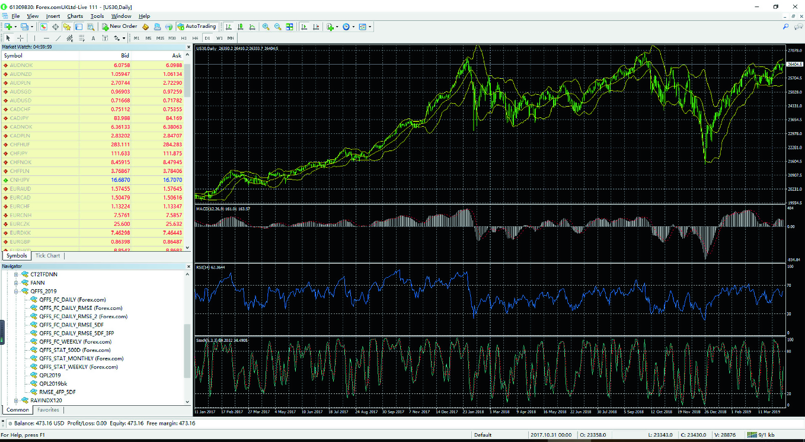 **Fig. 6.3. Program trading using technical indicators on MT4 trading platform** 

## 6.5 Technical Analytical Tools and Indicators 

Technical analysis is a trading discipline employed to evaluate investments and identify trading opportunities by analyzing statistical trends gathered from trading activity, such as price movement and volume.

_Technical analysts_ (_TA_) believe that all knowledge regardless of type (fundamental, economic, political, psychological, or other) is already reflected and discounted in market prices.

Unlike fundamental analysts, they believe that it is meaningless to study company financial statements, earnings and dividend reports, industry developments, and other data in an attempt to determine the _intrinsic value_ of a stock or other market instrument since it is common to have a wide divergence between intrinsic value and actual market price.

For example, it is not unusual for a company’s stock to be trading at a price well above or below its book value per share.

Price movements are simply the reflection of changes in supply and demand without concern of their underlying forces. Technical analysts are only interested in what happens to the price according to supply and demand. Say, if demand is greater than supply, price will increase. On the other hand, if supply is greater than demand, price will decline. The study of market prices is all that is necessary.

The components of technical analysis are as follows:

- Major market patterns (e.g., major reversal patterns),

- Trend lines and channels,

- Supports and resistance (S & R) analysis, and

- Technical indicators and oscillators (e.g., MA, RSI, MACD, stochastics, Bollinger Bands).

Nowadays, the design of trading and hedging algorithms (and hence programs) mainly makes use of technical indicators, oscillators, supports, and resistance lines for easy implementation, since most of them have already built-in functions bundled with the program trading development platform, such as MQL trading indicator function library in MT platform.

## 6.6 Seven Major Financial Trading and Hedging Algorithms 

In previous chapters, we have studied basic concepts and theory of quantum finance, especially on how to apply quantum finance theory to model and evaluate quantum price (energy) levels (QPLs) which is an important tool in technical analysis.

Before we move on to learn how to design and implement AI-based quantum financial forecast and trading system, let’s study a practical financial investment topic—trading and hedging strategy.

First, we will review seven major trading and hedging techniques—which is the author’s collection of over 20 years of trading experience in stock, commodity, and forex trading, along with the numerous technical trading courses conducted in China and Hong Kong.

Traders study various kinds of trading techniques and strategies throughout the years which are summarized into following seven types:

1. Trend trading strategy,

2. Breakout trading strategy,

3. Reversal trading strategy,

4. Channel trading strategy,

5. Averaging trading strategy,

6. Stop-loss trading strategy, and

7. Hedge trading strategy.

Note that these seven trading strategies despite are independent in nature, and most of the time they can be combined to use in order to produce the best performance. Figure 6.4 shows the snapshot of program trading using RSI oscillator. 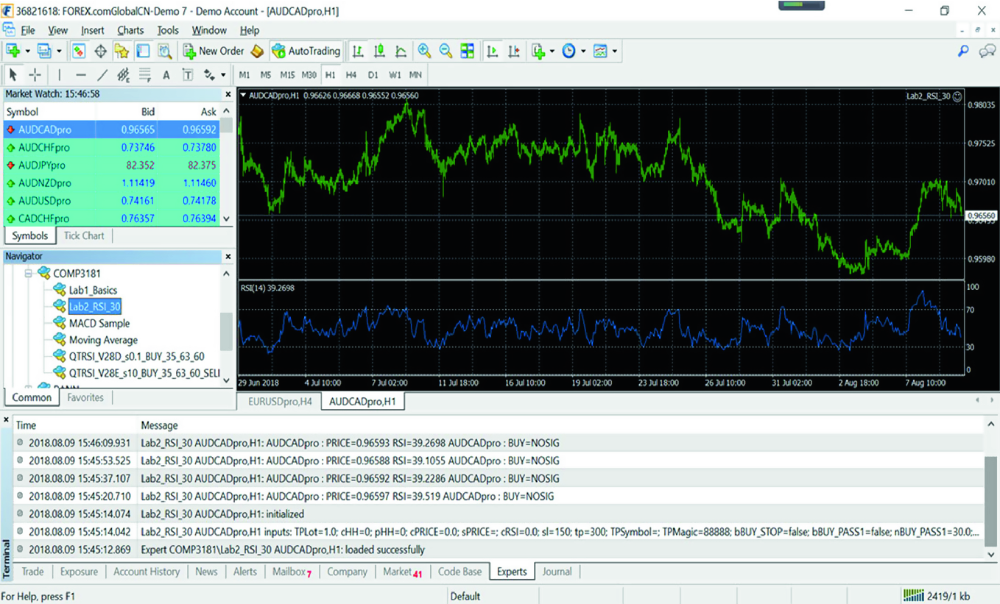 **Fig. 6.4. Snapshot of program trading using RSI oscillator** 

### 6.6.1 M1.1 Trend Trading Strategy—Key Patterns

Trend trading is also known as _forward trading._ The main concept is to trade following the market trend, if exists. Trend trading is a trading strategy that attempts to capture gains through the analysis of a security’s momentum in a particular direction. Trend traders enter into a long position when a security is trending upward and/or enter a short position when a security is trending downward.

Trend trading strategy assumes that a financial instrument will continue to move along its current trend and often contain a take-profit or stop-loss provision if there are any signs of a reversal. It can be used by short-, intermediate-, or long-term trading. Regardless of their chosen timeframe, traders will remain in their position until they believe the trend has reversed, although reversals may occur at different times for each timeframe.

In technical analysis, we have studied all major patterns and trends identification techniques.

Trend trading strategy #1 using major key patterns include the following:

- Nine major reversal patterns such as head-and-shoulder patterns, round-top/bottom patterns, ascending/descending triangles, rectangles, etc.;

- Trend lines and channels;

- Consolidation patterns;

- Gaps; and

- Supports and resistances.

Once a trend is clearly identified, we have to execute the sell/buy command according to the trend direction.

Let’s have a look at the up/down trend lines as shown in Fig. 6.5. 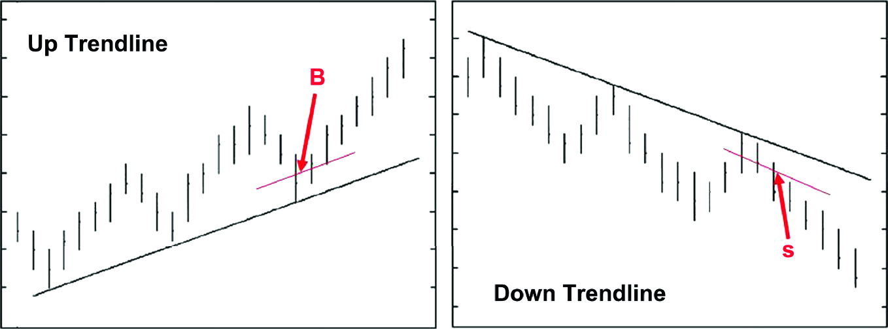 **Fig. 6.5. M1.1 Trend trading strategy—key patterns** 

Note that the buy and sell should execute

- When the trend is well developed, i.e., at least hits two low/high.

- Execute at least 10% above (uptrend)/below (downtrend) price.

### 6.6.2 M1.2 Trend Trading Strategy—MA Crossing

In technical analysis, most of the time financial patterns are moving in trends, either bullish or bearish (or oscillation in some cases).

In other words, once we have identified the current pattern is bullish/bearish, we can trigger the buy/sell command according to the trend.

Typical example is _moving average_ (MA) trend identification.

The decision of using MA crossing is simple:

1. If day-line down-crossing MA line is bearish, trigger sell signal;

2. If day-line up-crossing the MA line is bullish, trigger buy signal.

Again, one should place the selling signal at the price at least 10% below the down-cross point as a kind of buffer.

Same cases apply to other technical indicators and oscillators.

Figure 6.6 shows a typical example of the price (S&P 500) bar chart down-cross the 200-day MA line. It shows the fast signal line (i.e., the _day_ -_line_) down-crossing the slow 200-day _simple moving average_ (SMA)—means _bearish_ , trigger the sell signal. 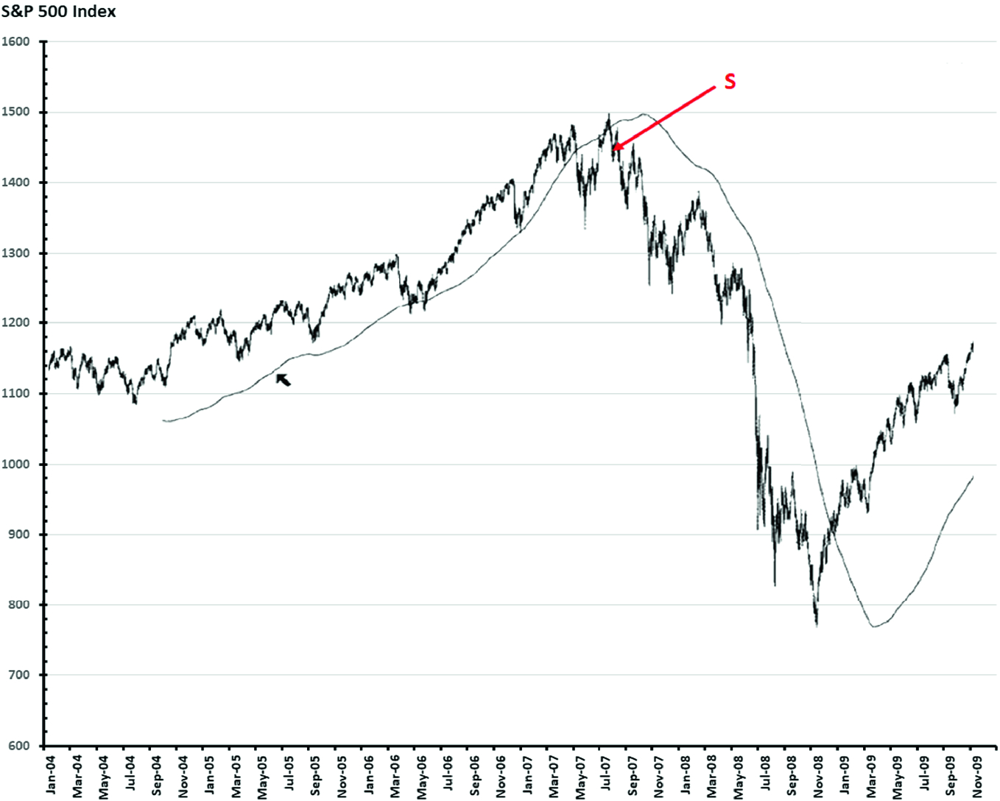 **Fig. 6.6. M1.2 Trend trading strategy—MA crossing** 

As an exercise, based on what we have learnt here, try to figure out other bullish/bearish trends from any market chart and determine the buy/sell thresholds.

### 6.6.3 M1.3 Trend Trading Strategy—Signal Lines Crossing

Instead of single technical indicator up-/down-crossing, many TAs are using multiple technical signal crossing method, in which one short-term indicator acts as fast-moving signal and the other long-term indicator acts as slow-moving signal.

The decision of using signal crossing is simple:

1. If a fast signal line down-crossing a slow signal line— _bearish_ , trigger sell signal and

2. If a fast signal line up-crossing a slow signal line— _bullish_ , trigger buy signal.

Figure 6.7 shows two MA signal lines: 5-day MA (fast-moving) versus 20-day MA (slow-moving) lines. When 5-day fast-moving MA line down-crosses a 20-day slow-moving MA line from above, a _bearish_ trend appears. 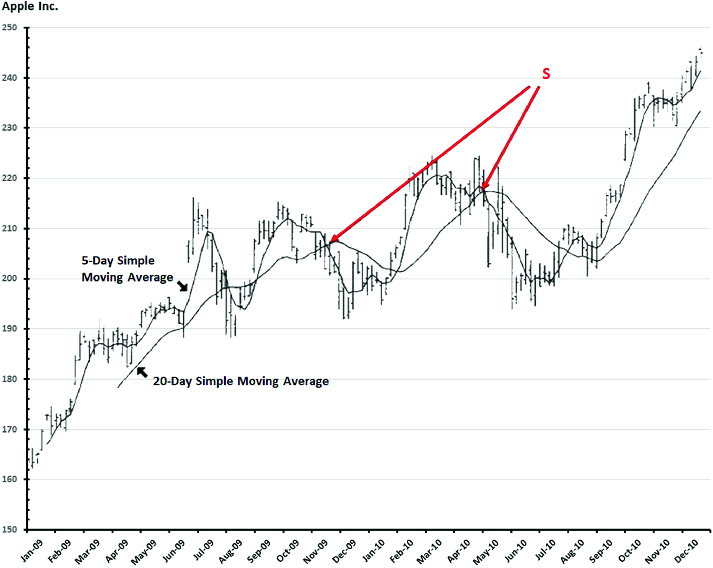 **Fig. 6.7. M1.3 Trend trading strategy—signal lines crossing** 

Again, can place a sell command 10% below the down-cross point.

One may wonder: For MA signal lines crossing, what are the two MA lines being used?

Actually, there is no definitive answer. But many TAs prefer to use the Fibonacci number sequence (i.e., 1, 1, 2, 3, 5, 8, 13, 21, 34, 55, 89, 144…) to select the MA lines. For example, the signal crossing of MA-5 versus MA-21 (or MA-20 for simplicity) is used to simulate the comparison between weekly (short-term) trend with monthly (mid-term) trend.

### 6.6.4 M2.1 Breakout Trading Strategy—Key Patterns

Breakout trading strategy, similar to trend trading strategy is to trade by following the trend.

But different from trend trading strategy, it will only execute when the price has reached the _breakou_ t point.

In technical analysis, we have studied certain patterns such as _flag consolidation_ pattern with well-defined _breakout_ price as shown in Fig. 6.8. 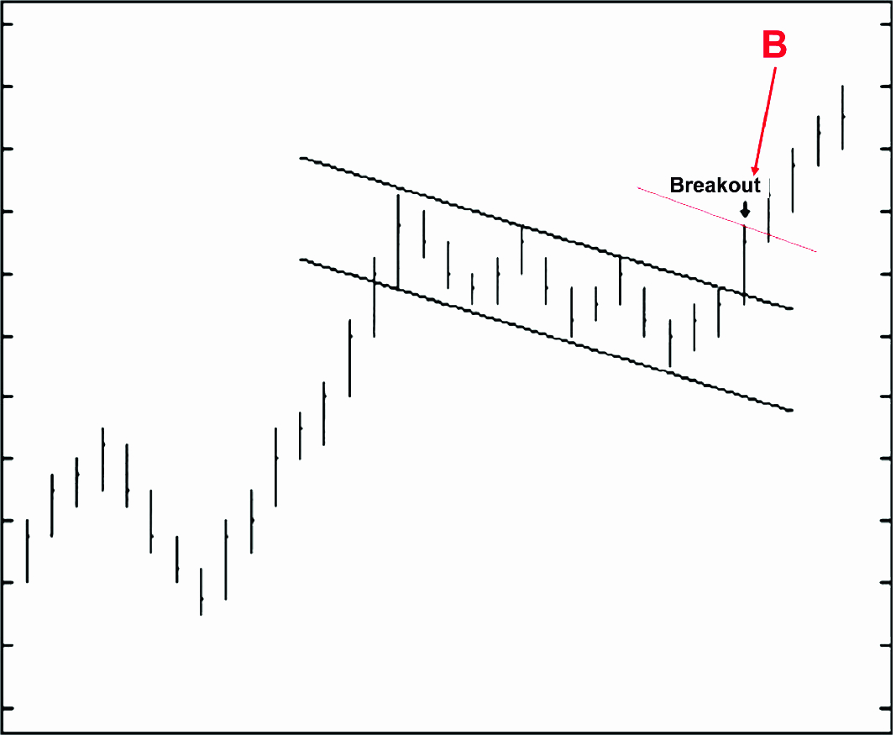 **Fig. 6.8. M2.1 Breakout trading strategy—key patterns (e.g., flag consolidation)** 

It shows a typical flag consolidation pattern in technical analysis with well-defined channel lines. Once the pattern is confirmed, one can trigger a buy order while the market breaks from the breakout price.

Similar to trend trading strategy, the breakout price must be at least 10% away from the breakout price.

This strategy can also be used once we have clearly identified the support/resistance lines. In other words, when the price of an asset moves above a resistance area or moves below a support area. Breakouts indicate the potential for the price to start trending in breakout direction.

For example, a breakout to the upside from a chart pattern could indicate the price will start trending higher. Breakouts that occur on high volume (relative to normal volume) show greater conviction which means the price is more likely to trend in that direction.

### 6.6.5 M2.2 Breakout Trading Strategy—S & R Lines

Figure 6.9 shows two typical cases of breakouts from support and resistance lines. 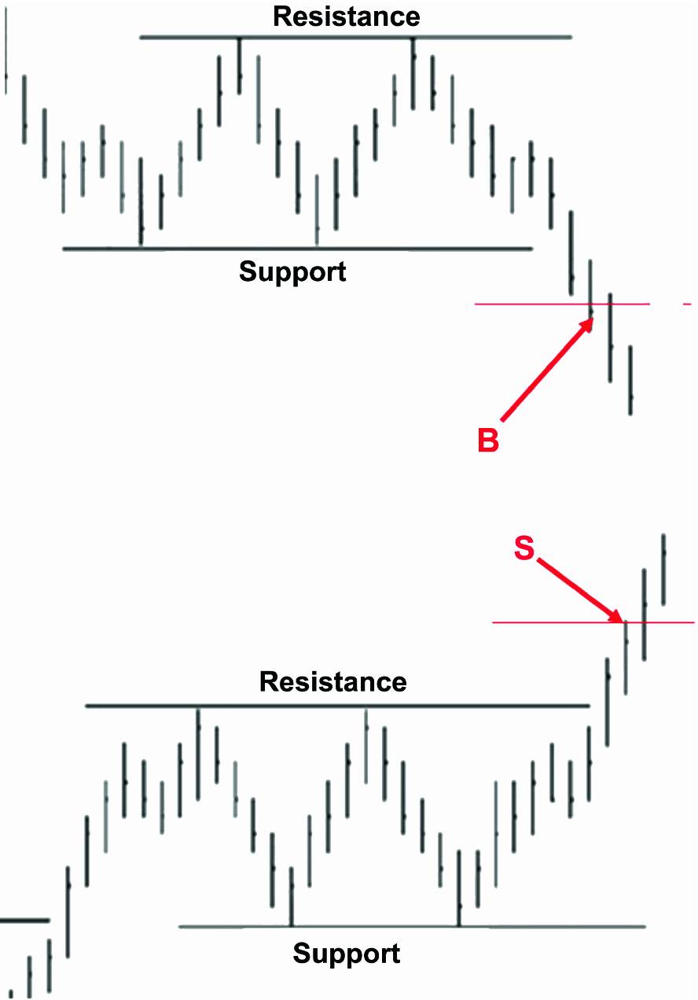 **Fig. 6.9. M2.2 Breakout trading strategy—S & R lines** 

Note that, once we identify the support/resistance lines, we can execute the buy/sell command when the price breakout from breakout thresholds of, say, 10% buffer.

In fact, breakout trading using supports and resistance lines is commonly exercised on stock and commodity trading using the day chart to identify _support_ and _resistance_ lines by applying standard technical analysis techniques. However, it may be difficult to identify at forex and cryptocurrency trading as they are more chaotic, especially during US trading time zone, i.e., US time 09:00–16:00.

### 6.6.6 M3.1 Reversal Trading Strategy—Key Reversal Patterns

Reversal trading as its name is executed at least at one of these three scenarios:

1. Clearly identify the key reversal pattern(s);

2. Clearly identify effective support/resistance; and

3. Reversal occurs in over-buy/over-sell regions of technical indicator such as RSI.

Naturally, reversal trading strategy is a perfect tool once we have identified the eight _key reversal patterns_ by technical analysis, which include key reversals, head-and-shoulders tops and bottoms, rounding tops and bottoms (saucers), ascending and descending triangles, rectangles, double and triple tops and bottoms, diamond, rising and falling wedges, V-shape formations (spikes).

Figure 6.10 shows a typical head-and-shoulder top pattern. 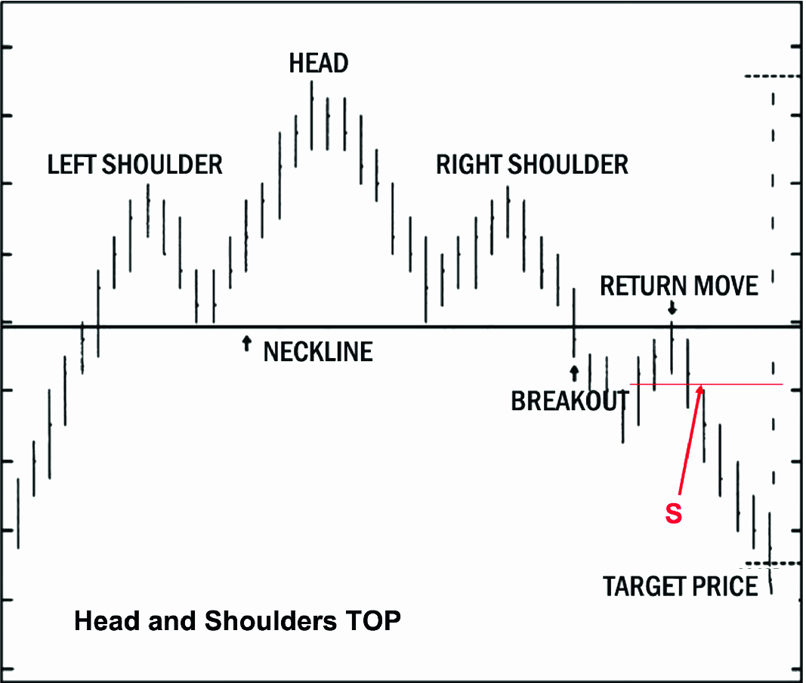 **Fig. 6.10. M3.1 Reversal trading strategy—key reversal patterns** 

Once the pattern is clearly identified, we can place a sell command 10% below the return move of the head-and-shoulder pattern.

As an exercise, try to figure out the position of sell/buy signal point for all the key reversal patterns using technical analysis.

### 6.6.7 M3.2 Reversal Trading Strategy—S & R Lines

Reversal trading strategy using support and resistance lines (S & R lines) is exactly the counterpart of breakout trading strategy #2—S & R lines in the sense that the S & R lines continue as an effective price level to support or resist from price breakout.

In many worldwide financial products trading such as forex and commodity trading, this situation usually occurs during Asia market period, i.e., 09:00 HKT–16:00 HKT in which the financial markets are oscillating within the daily S & R lines.

Figure 6.11 shows a typical reversal trading based on S & R Lines. 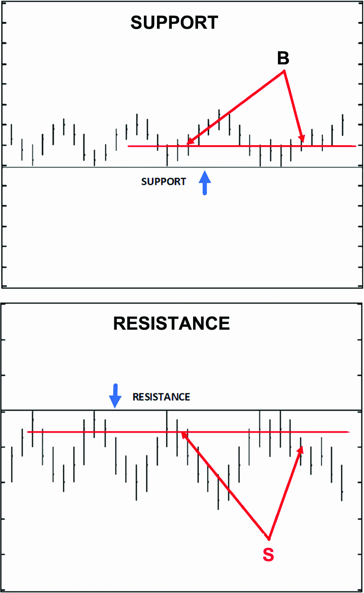 **Fig. 6.11. M3.2 Reversal trading strategy #2—S & R lines** 

Once the S & R lines are identified, buy/sell command can be triggered after third reversal from the S & R. (Note: at least two times of reversals are required for S/R confirmation).

Again, a 10% threshold is required to dispatch signal.

### 6.6.8 M3.3 Reversal Trading Strategy—Technical Indicator RSI

Relative strength index (RSI) is a price momentum indicator developed by Mr. J. Welles Wilder in 1978. Since its introduction of Wilder’s New Concepts in Technical Trading Systems book published in 1978, it has been widely used by worldwide technical analysts, particularly those who are commodities and future oriented.

From the technical analysis perspective, relative strength index (RSI) is a very reliable technical indicator to indicate the strength of supply versus demand in secondary financial market. RSI compares bullish and bearish price momentum plotted against the graph of an asset’s price.

Traditional interpretation and usage of RSI are that reading values of 70 or above indicate that a security is becoming overbought or overvalued and may be primed for a trend reversal or corrective pullback in price. RSI reading values of 30 or below indicate an oversold or undervalued condition.

The fact is: most TAs believe that 70–30 is sufficient to reflect the over-buy/over-sell in the market.

Figure 6.12 shows the daily bar chart of Dow Jones Index, DJI (top) versus 14-day RSI (bottom). 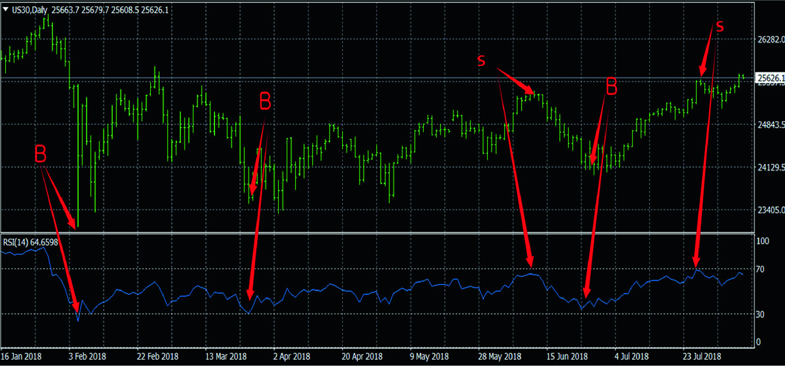 **Fig. 6.12. M3.3 Reversal trading strategy—technical indicator RSI** 

It is apparent in using 70–30 as selling/buying threshold is an acceptable choice.

For experienced traders, they usually trigger selling signal only when RSI rise to above 70, reach the max RSI, and return back to 70 RSI line. It is called _second_ -_time_ -_hit_ -_top_.

Similar to RSI 30 case, it is called _second_ -_time_ -_touch_ -_base_.

### 6.6.9 M4.1 Channel Trading Strategy—Trend Channel Trading

A _trend channel_ (or _channel_ in short) is a channel drawn on a security price series chart by graphing two trend lines drawn at resistance and support levels. Trading channels can be drawn using a variety of methodologies. Generally, traders believe that security prices will remain within a trading channel. Therefore, traders use trading channels to develop buy-and-sell trading signals.

In many instances, prices repeatedly move about the same distance away from a trend line before returning to the trend line. In these cases, a straight line can be drawn connecting the peaks of rallies in an uptrend or the bottoms of declines in a downtrend. That line is often parallel to the trend line and is called a return or channel line. Between the channel line and trend line creating a trend channel is a range within which prices move.

Well-defined trend channels appear most frequently in charts of actively traded securities. Thinly traded securities offer little opportunity for trend channels to develop. Inexperienced TAs often use trend channels to determine good profit-taking levels. For example, in an uptrend, they will sell a stock when it reaches the upper level of its trend channel. Experienced TAs watch price movements within the two boundary lines of the trend channel looking for a warning signal that the trend direction is changing.

Channel trading strategy can be applied when one of the following occurs:

- Clearly identify the channel pattern and S/R lines.

- Clearly identify the price oscillator between S/R lines pair.

- Clearly identify the Bollinger Band.

Figure 6.13 shows typical cases for channel trading using uptrend and downtrend channels. 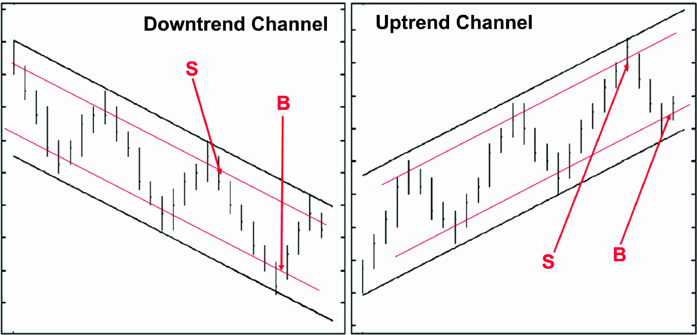 **Fig. 6.13. M4.1 Channel trading strategy—channel patterns** 

Again use at least 10% as threshold and trigger the signal when the price oscillates at least two times to confirm the effectiveness of the channel.

### 6.6.10 M4.2 Channel Trading Strategy—S & R Channel Trading

As mentioned in previous section, prices oscillating between supports and resistance lines (S & R lines) are commonly found during Asia trading period, i.e., HKT 09:00–16:00 in which most international forex prices “oscillating” between daily S-R lines, especially when there is no significant market news and financial figures release.

Figure 6.14 shows the day-trade chart for AUDCAD in MT platform of [Forex.​com](<http://Forex.com>). 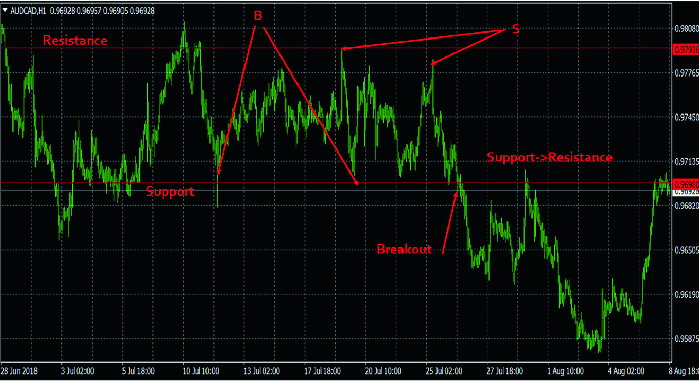 **Fig. 6.14. M4.2 Channel trading strategy—S & R channel trading** 

We can clearly identify an effective S-R line pair to trigger two buy/sell signals.

However, at the third time of oscillation, a breakout occurs in which the previous support line now becomes the resistance (i.e., support → resistance). In this case, a sell signal can be triggered when the price arrived at the breakthrough 10% threshold of the breakout line.

The fact is: in traditional technical analysis, support and resistance lines are completely two different kinds of trading patterns. In other words, a support cannot turn into resistance lines (or vice versa). However, due to the popularity of program and algorithm trading, support and resistance lines mentioned in previous chapter are now considered as some sorts of discrete energy levels, similar to quantized energy levels in an atom. In other words, a support line for a financial product at a particular moment can become a resistance line at another moment due to the change of _market stimulus_.

### 6.6.11 M4.3 Channel Trading Strategy—Bollinger Bands

 _Bollinger Bands_ technique (BB in short) was developed by Mr. John Bollinger in 1980s for the purpose of factoring in price volatility. Bollinger Bands are effective for virtually any security or market and for any investment time horizon. Rather than placing bands at a certain percentage distance from a moving average line as is done with trading bands, Bollinger Bands are placed two moving standard deviations above and below a simple moving average line.

More specifically, the bands are placed above and below a simple moving average at a distance of 1.5–2.0 times the root mean square of the deviations (σ) from the average. The amount of data used in the calculation is equal to the number of periods used for the simple moving average.

For example, if we use a 20-day simple moving average, all calculations should be based on 20 days of data. Similar to moving average, Bollinger Bands are so important and commonly used that almost all financial trading software/systems are bundled with the BB tools.

In fact, Bollinger Bands are very reliable with effective technical signal and trading tool, especially in day trade of forex products which are usually oscillating between upper–lower _Bollinger Bands_ (so-called _Bollinger channel_).

Figure 6.15 is the same H1 chart of AUDCAD with period-20 Bollinger Band. 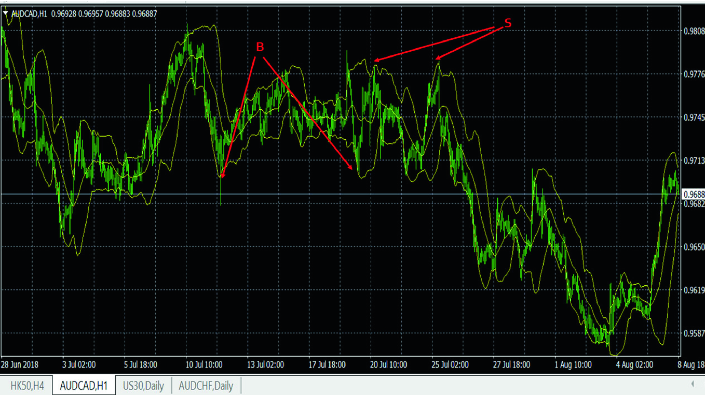 **Fig. 6.15. M4.3 Channel trading strategy—Bollinger bands** 

Note that it provides least three chances (maybe more) to trigger buy/sell signals. But remind that such channel always breakthrough during Europe–US trading period. It is wise to set stop-loss as risk control.

### 6.6.12 M5 Averaging Trading Strategy

 _Averaging method_ (or _averaging_ in short) is a very important and commonly used trading strategy for experienced traders and hedge fund traders.

The logic is very simple: instead of putting 100% of investment at a single price (either buy or sell), we divide the investment into at least two (or more, usually three) batches, each of equal amount (or different proportion, according to the trader’s preference).

So even when the price moves in reverse direction, the overall execution price will be the average of two (or three) triggering prices.

The merits of averaging trading are threefolds:

1. Provide risk sharing especially during adverse market situation;

2. Provide more chances for investors and traders to enter market at one hand, and locate a good averaging position even the market swings sideway; and

3. Provide a good trading strategy with the integration of S & R lines or/and quantum price levels (we will discuss that in detail in the upcoming section—quantum trading strategy).

Figure 6.16 shows a realistic case of forex trading chart of AUDCAD using averaging trading strategy. As shown in Fig. 6.15, if we use S1 and S2 as support lines, we can execute 50% buy at T1-S2 price. When price reaches S1 at T2, at this “better position”, we trigger the other 50% buy. Once it reaches S3, we close the order. In that case, the average gain will be S3 − (S2 + S1)/2, which is much better than solely investing 100% at S2-T1. Same method can be applied and through a combination to any kind of trading strategy. 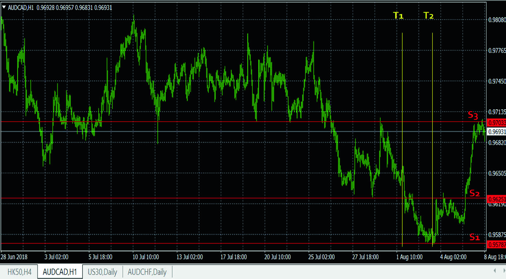 **Fig. 6.16. M5 averaging trading strategy** 

In fact, professional traders and investors usually combine averaging trading strategy with other trading and hedging methods to provide a more flexible, dynamic trading and risk control strategy.

### 6.6.13 M6 Stop-Loss Trading Strategy

Stop-loss strategy seems to be very simple, but it is the most important trading strategy especially for derivatives trading and margin trading products such as forex and cryptocurrency trading.

Usually, stop-loss strategy is combined with target profit in which the ratio is normally 1:2. For example, if the target profit is 240 pts, the stop-loss should be around 120–150 pts.

How to set stop-loss?

Traditionally, there are two methods:

1. Fixed stop-loss according to the investor’s risk control preference. It varies for different products. For forex trading, normally we set 150–200 points. It can also be the proportion of the average daily range (i.e., range between day-high and day-low) and

2. Dynamic stop-loss according to some technical indices such as S & R lines.

In the next section, we will see quantum trading to provide a third solution for stop-loss strategy using quantum price levels (QPLs).

Using previous example on AUDCAD trading in Fig. 6.15, if we trigger a buy order at time T1 0.96251, we set the stop loss of 125 pts (i.e., 0.96126). So even though price finally drops 464 pts to S1 0.95787 at time T2, the loss is controlled to 125 pts only. Figure 6.17 shows another example based on the trading of Dow Jones Index (DJI) in MT platform. As shown, DJI breakouts at T1-S2 level (23180) and drop 1728 points to S1 (21452) before it finally rebound. So, if we set the stop loss with 200 points, we can control the potential loss to an acceptable level. 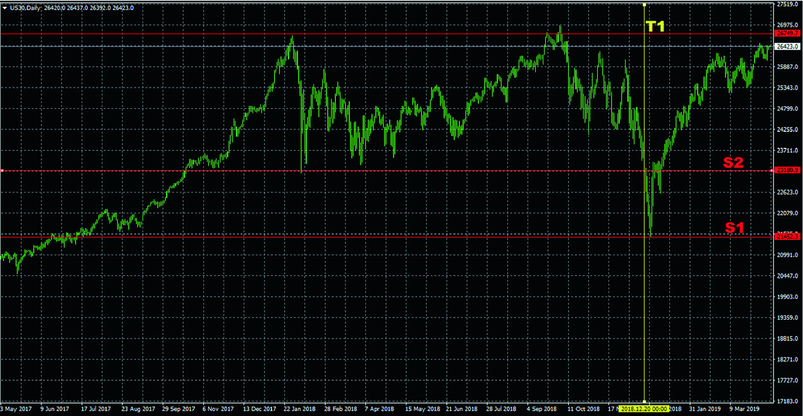 **Fig. 6.17. M6 Stop-loss trading strategy** 

As an old saying in Wall Street: The best and most successful trader is not the one that can always win, but the one that has self-discipline to follow stop-loss strategy in every trading battle.

### 6.6.14 M7.1 Hedge Trading Strategy—Single-Market Single-Product (SM-SP) Hedge

Hedge trading (or _hedging_ in short) is the second kind of risk control-based trading strategy. A hedge is an investment position intended to offset potential losses or gains that may be incurred by a companion investment. A hedge can be constructed from many types of financial instruments including stocks, forex, insurance, forward contracts, swaps, and options.

Technically speaking, _hedging_ is the practice of taking a position in one market to offset and balance against the risk adopted by assuming a position in a contrary or opposing market or investment.

It is a common tool for experienced traders as it involves more technical skill to so-called _release the hedge_.

Hedge trading basically is of three types as given below:

1. single-product hedging,

2. multi-product hedging, and

3. cross-trading-platform hedging.

First, let’s have a look at a basic case: single-market single-product (SM-SP) hedge.

In a single-product trading, when we execute a buy/sell order at a certain price P, we execute the same amount of reverse order at a price “P” at the stop-loss level to control loss when the market goes in opposite direction.

Same example of AUDCAD trading is used for illustration in Fig. 6.18. Instead of using stop loss, we set a sell hedge at the stop-loss level below S2. When price drops to S1 and rebound, we harvest the hedge order and release the hedge.  **Fig. 6.18. M7.1 Hedge trading strategy—single-market single-product (SM-SP) hedge** 

### 6.6.15 M7.2 Hedge Trading Strategy—Single-Platform Multi-product (SP-MP) Hedge

With the advance in computer technology and online trading, real-time calculation of co-relation and co-variance between different financial products under the same trading platform, e.g., forex, is no more a reverie.

Single-platform multi-product (financial products) hedging strategy is a kind of composite hedging strategy with market momentum evaluation of two (or more) similar products in a financial platform. It is commonly used in forex platform which contains over 100+ forex products to study.

SP-MP hedge ranging from simple two products hedge (i.e., traditional _paired_ -_hedge_) to multi-product hedge with a portfolio of products (so-called _portfolio_ -_hedge_) with the help of AI tools such as fuzzy logics, neural networks, and genetic algorithms for portfolio weighting factor “ _ω_ ” evaluation (we will study all major AI tools in the next chapter).

Figure 6.19 shows a typical five-product cyclic hedge (5PC-hedge) for the cyclic hedge of top five foreign currencies: AUD, CAD, EUR, GBP, and USD. Try to figure out how it works and the logic behind. 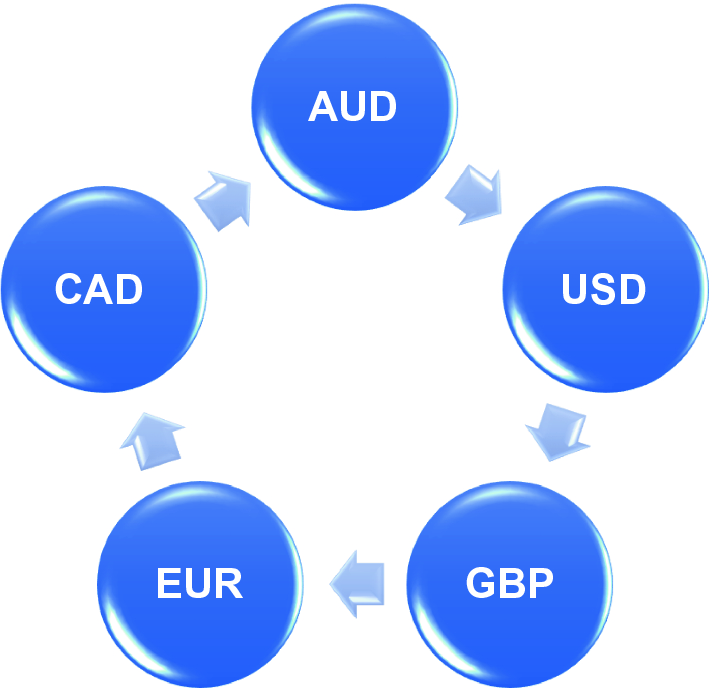 **Fig. 6.19. Five-product cyclic hedge (5PCH) in forex** 

Note that most often such kind of high-level and composite hedging strategy can only be valid and effective within a period of time and restricted to number of financial products. That’s why all major fund houses and laboratories recruited top mathematicians and AI scientists to develop complex trading and hedging algorithms.

In the same way that the author always mentioned in investment talks; nowadays, the design and implementation of trading and hedging algorithms resemble more to mathematical and AI problems than classical financial problems.

### 6.6.16 M7.3 Hedge Trading Strategy—Multi-platform Multi-product (MP-MP) Hedge

Considering the complexity of world financial market, one of the most important and complex hedging systems is the multi-platform multi-product (MP-MP) hedge which involves multiple-financial products across different financial trading platforms.

The logic behind came from the fundamental concept of financial theory that all financial markets are the currency flow, e.g., USD behind different major worldwide financial markets. So, in the perfect case of hedging for risk control, the best solution should be the hedging across different products and platforms to protect adverse market change of a particular product/financial market.

Traditional wisdom tells us that USD currently remains as major clearance currency for three types of worldwide major financial and commodity markets which include (a) US Index, (b) crude oil, and (c) precious and colored metals gold (or silver) along with agricultural products such as cotton and sugar that they are of great consideration as shown in Fig. 6.20. 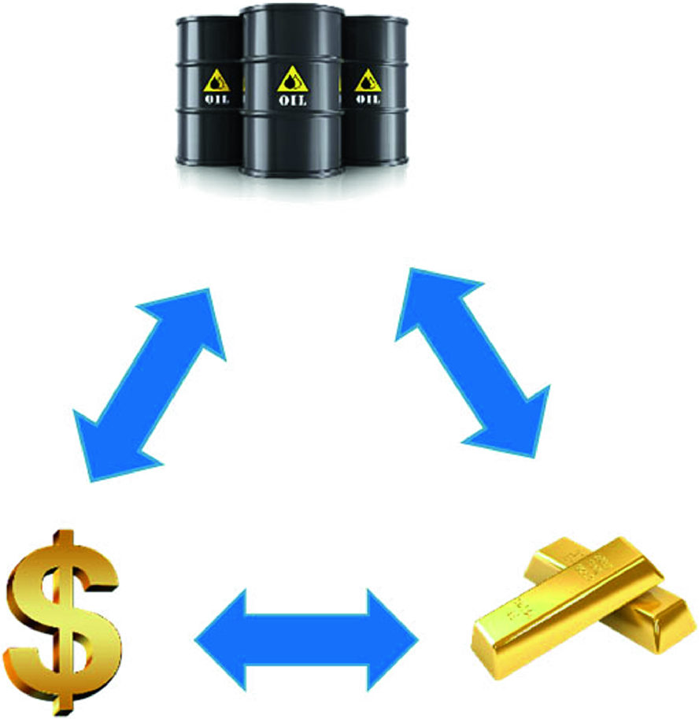 **Fig. 6.20. MP-MP hedge of world three major markets (gold, crude oil, and US index)** 

Many fund houses and financial institutions have active research for the _mining_ of such _golden combination_ using various AI techniques such as fuzzy-neuro networks, hybrid EC (evolutionary computing) systems, deep neural networks, etc. Active R&D on this challenging topic is being carried out at worldwide fund houses, financial institutions, and universities (Iba and Aranha 2012).

## 6.7 Quantum Trading and Hedging Strategy 

### 6.7.1 Basic Concept

In previous chapters, we have learnt that basic concepts of quantum finance stem from two different aspects:

- Path integral approach and

- Quantum anharmonic oscillator approach.

Path integral approach is based on Feynman’s path integral by the modeling and integration of all possible paths of the quantum financial particles. Major applications are exercised on the modeling and primary financial markets evaluation such as forward interest rate and option pricing.

Quantum anharmonic oscillator (QAHO) approach is based on the modeling and numerical approximation of the quantum finance Schrödinger equation (QFSE) into quantum anharmonic oscillation—a quartic polynomial equation that can be solved numerically by simple numerical computational model. Major applications are exercised on the evaluation of quantum finance energy levels (so-called quantum price (energy) levels, QPL) for any financial products in the secondary financial markets (Fig. 6.21). 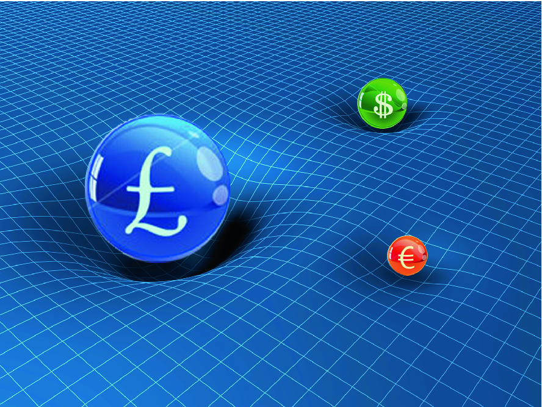 **Fig. 6.21. Illustration of quantum finance energy fields in financial markets** 

Which one should we employ to design quantum trading and hedging strategy? and why?

### 6.7.2 Quantum Price Levels Versus S & R Analysis

The answer is clearly to employ quantum anharmonic oscillator (QAHO) approach since all abovementioned trading and hedging strategies fall within the domain of secondary financial markets ranging from stocks and options to online forex and cryptocurrency trading activities.

In addition, one of the major breakthroughs in quantum finance using QAHO model is the quantum price (energy) level (QPL) evaluation, which forms a direct analog to supports and resistances (S & R) in technical analysis.

If we consider the financial world is a quantum finance energy field formed by financial particles, it is a natural logic to presume that these inherited QPL are exactly the same concept of support and resistance we defined in classical technical analysis.

But there is only one difference. If quantum dynamics of the financial particles is strictly followed from quantum theory, there should be no difference between support and resistance levels. They should all be the same as discrete energy levels that the financial particles can jump from one to another (in both directions). In fact, this logic is entirely equivalent to nowadays assumption on support and resistance lines in program trading, which we generally assume that support and resistance lines are simply quantized price levels in price motions.

In other words, once we adopt quantum finance method to evaluate all QPLs for any financial product automatically, we literally evaluate all the possible S & R levels, which can be applied in turn to the seven trading and hedging strategies learnt previously (Fig. 6.22). 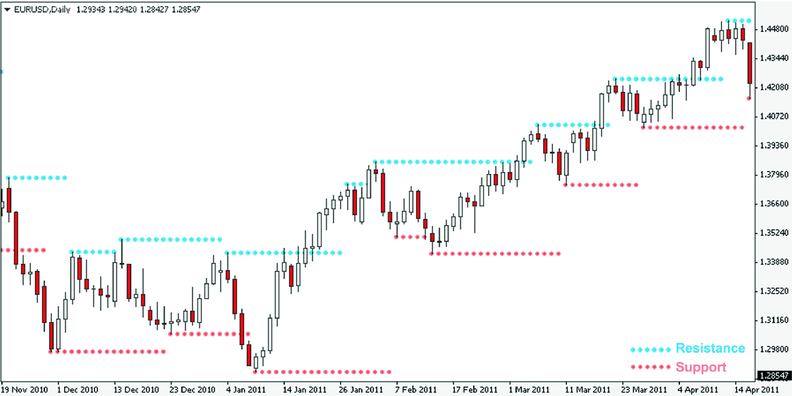 **Fig. 6.22. Support and resistance levels in financial analysis** 

### 6.7.3 Quantum Finance Forecast Center—Daily Forecast and QPLs

Since December 1, 2017 with patented quantum finance technology, quantum finance forecast center ([QFFC.​org](<http://QFFC.org>)) provides daily (and weekly) free financial forecasts for worldwide 120+ financial products which include the following:

- 9 major cryptocurrencies,

- 84 forex,

- 19 major commodities, and

- 17 worldwide financial indices.

Up to December 31, 2018, QFFC has over 10000+ registered users which include worldwide professional traders and investors.

Figures 6.23 and 6.24 show snapshots of daily forecast results of BTCUSD (Bitcoin versus USD) and forex pair USDCAD on April 15, 2019. At 08:00 HKT (UTC 00:00), QFFC calculates the following for 120+ worldwide financial products: 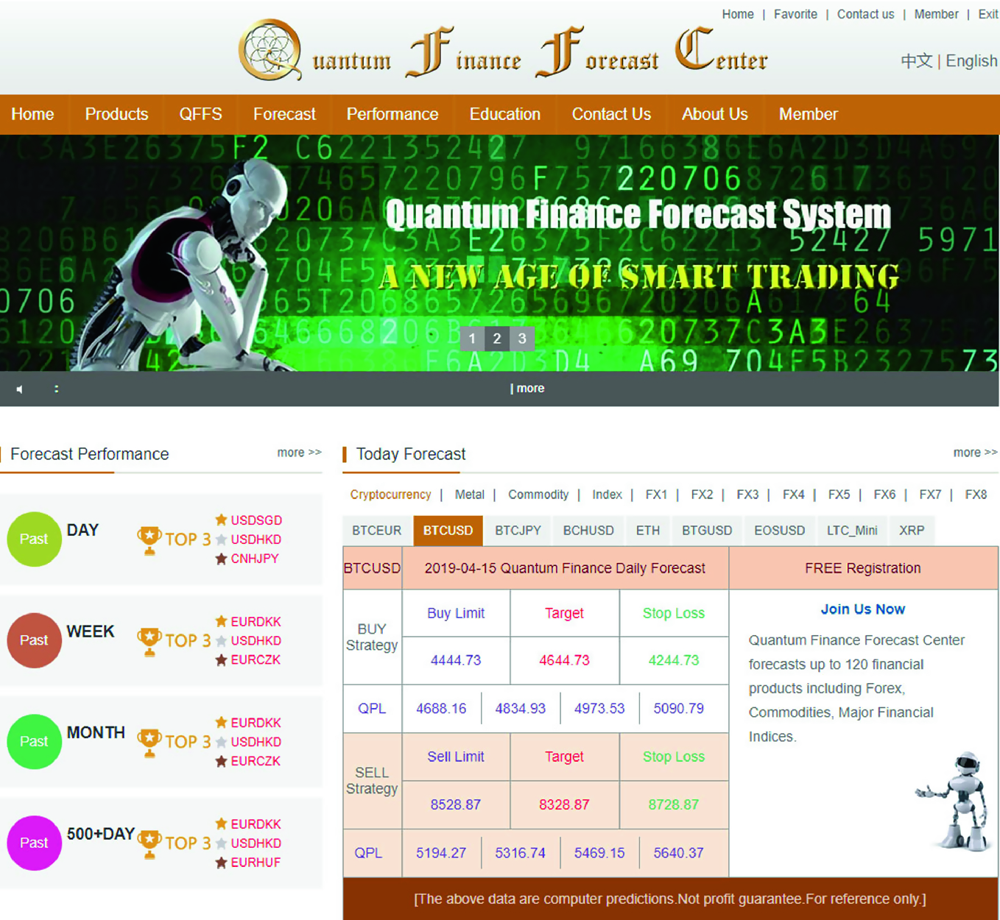 **Fig. 6.23. Quantum finance forecast of BTCUSD on April 15, 2019** 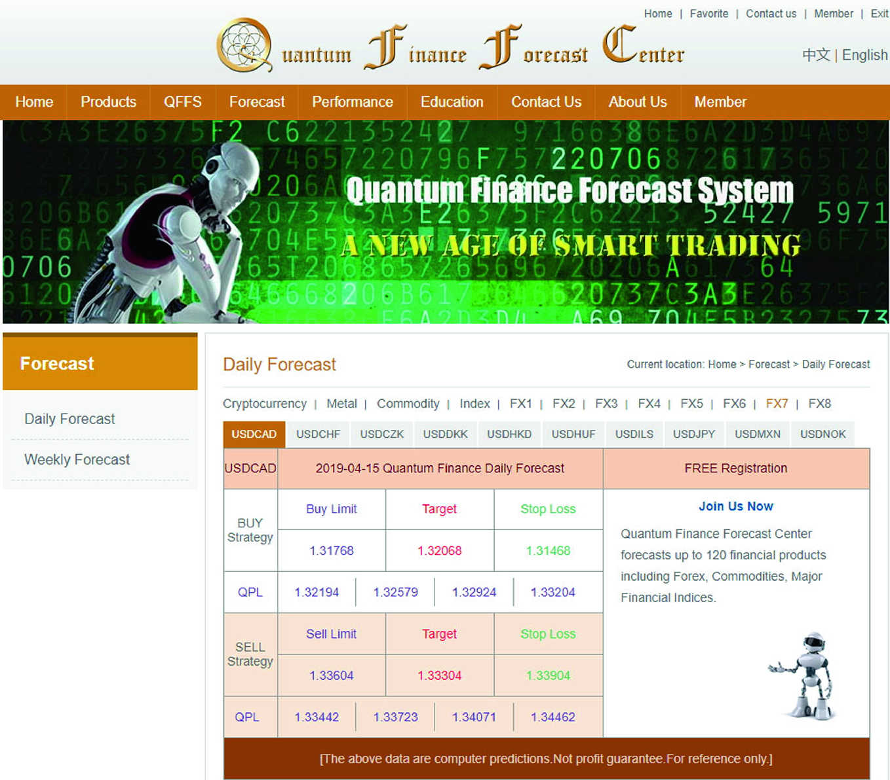 **Fig. 6.24. Quantum finance forecast of USDCAD on April 15, 2019** 

- Forecast high/low and

- Eight closest QPLs.

Professional traders and investors can base on these forecasts with QPLs and integrate with their program trading strategies for intelligent trading.

QFFC members can also make use of QFFC’s API to integrate the daily forecasts/QPLs into their MT4 EA programs for intelligent trading.

In the next section, we will study some basic quantum trading and hedging techniques/strategies.

### 6.7.4 Basic Quantum Trading and Hedging Strategies

In comparison with technical and fundamental analysis used in the past 50 years, the major breakthroughs of quantum finance technology are the scientific computations of

- Daily (weekly) high/low for day-trade and mid-term trading, with

- QPLs to replace subjective evaluation of support and resistance lines that can be used for breakout analysis and mid-term/long-term trading/market trend analysis.

The following quantum trading and hedging techniques/strategies are the theoretical characteristics collection of these quantum financial instruments (i.e., forecast high/low and QPLs) and feedbacks from professional traders and investors using QFFC forecast services in the past 2 years.

As a friendly advice, for any new trading and hedging, please study carefully and thoroughly, together with sufficient simulations and test run (at least 100 trading days as industrial norm) before putting into actual practice.

Different from the major seven trading and hedging strategies, at quantum finance trading, since we already have scientific daily forecasts and QPLs, the quantum trading (includes hedging) techniques are categorized in terms of users’ trading experiences, which is also the way we have conducted investment seminars in the financial community nowadays.

### 6.7.5 QT#1.1 Inexperienced Investors—Quantum Forecast Oscillation Trading Strategy (QFOTS)

Just like driving, financial trading is a kind of _practical activity_ that not only require professional knowledge but also practical experience. Any experienced investor with over decades of trading experience must realize that trading (and especially “failure”) experiences are very important elements for every investor and trade. Especially nowadays program trading is accompanied by monitoring and handling trading strategies of multiple products in multiple-financial markets.

As an industrial norm, we set 3–5 years (around 1000 transactions) to define whether an investor is _experienced_ or _inexperienced_.

For inexperienced investors who don’t have sufficient skills on _high_ -_level_ trading techniques such as _breakout trading_ , _hedging, and release_ -_hedge_ skills, they are suggested to perform basic quantum forecast oscillation trading strategy (QT#1-QFOTS).

QT#1-QFOT are based on daily forecasts, together with daily calculated QPLs as SL (stop loss) and TP (target profit) to perform day trade.

The logic behind is: for any financial market, over 80% of time are undergoing so-called _oscillation_ between the day-high and day-low. Since we already have evaluated the forecast high/low, we can simply use them as approximation of the day-high/low for reversal trading. That is, set the buy limit at the forecast low and sell limit at the forecast high.

Also, for SL and TP, we can simply use daily QPLs as reference levels as example shown in Fig. 6.25 for XAUUSD on April 15, 2019. 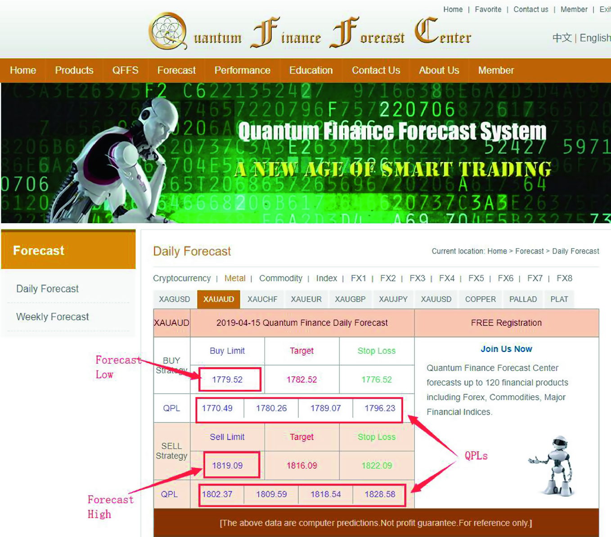 **Fig. 6.25. Quantum finance forecast of XAUUSD on April 15, 2019** 

### 6.7.6 QT#1.2 Inexperienced Investors—Quantum Forecast Oscillation Trading with Averaging Strategy (QFOTAS)

As we have learnt from the beginning of this chapter, _averaging_ is a simple and good technique not only as risk control but also for investment diversification.

Naturally, we can adopt _averaging technique_ into our quantum forecast oscillation trading strategy.

Just like working S/R lines as averaging levels, we can now employ QPLs for averaging levels, which, in fact, is entirely inherent to quantum theory and quantum field concepts also learnt in previous chapters.

Use UK oil forecast on April 15, 2019 as example shown in Fig. 6.26. If we set first buy limit at the forecast low 7149, we can set the second buy limit at the lower QPL, i.e., 7128, and the third one at 7069, each with one-third of the day-trade investment. Of course, remember to set SL, say, at the fourth QPL 6997. 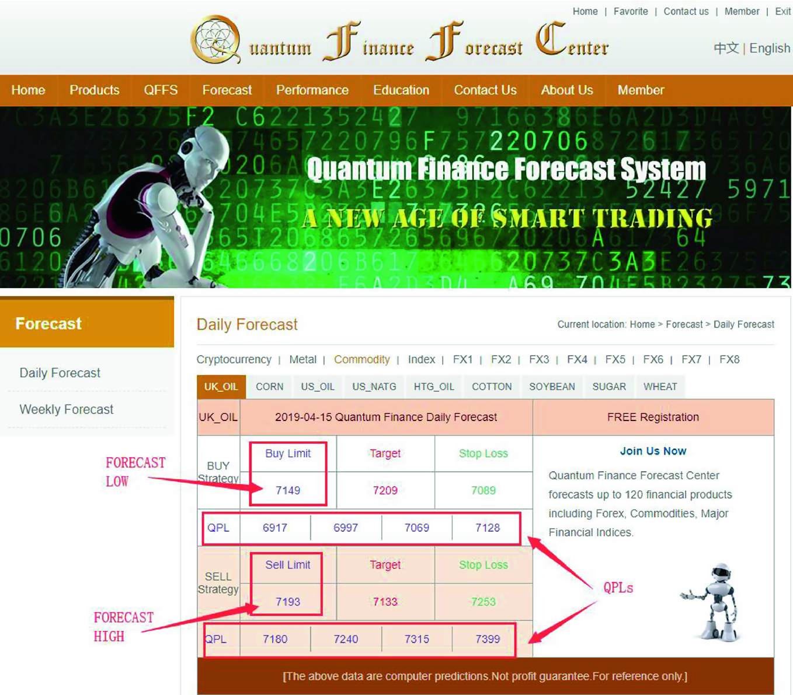 **Fig. 6.26. Quantum finance forecast of UK oil on April 15, 2019** 

By doing so, we can, on one hand, self-guard investment with a reasonable level of oscillations for the financial product, and on the other hand, provide a reasonable investment diversification with reasonable level of stop-loss mechanism.

In fact, not only inexperienced investors, many professional traders usually perform this strategy when they identify a particular financial market has a very high chance of oscillation that always occurs during Asia trading period.

### 6.7.7 QT#2.1 Experienced Traders—Quantum Forecast Breakout Trading Strategy (QFBTS)

Among the seven major trading and hedging techniques, _breakout trading_ is an important trading skill for experienced traders and investors.

In actual fact, the success in identifying financial market whether it is an _oscillating market_ or high chance of _market breakout_ defines whether one is an experienced or inexperienced trader.

According to quantum finance theory, if a financial market undergoes severe _excitations_ , either by some financial news outbreaks or some important financial figures/indices (e.g., GDP, PMI, etc.) announcement, the financial quantum particle should jump from one QPL to another one, in a discrete manner. In fact, the author customarily observed this phenomenon while working as chief analyst in a fund house and conducting R&D on quantum finance.

The truth is: The more _excited_ the stimulus is, the more accurate and precise is the _quantum jump_. That’s why _breakout trading_ is so important in financial investment. Use UK100 index forecast on April 15, 2019 as example shown in Fig. 6.27. For a day-low breakout, we can use the lower three QPLs (or more) for breakout strategy, i.e., 7395.2, 7364.6, and 7330.5. Similar case for day-high breakout. 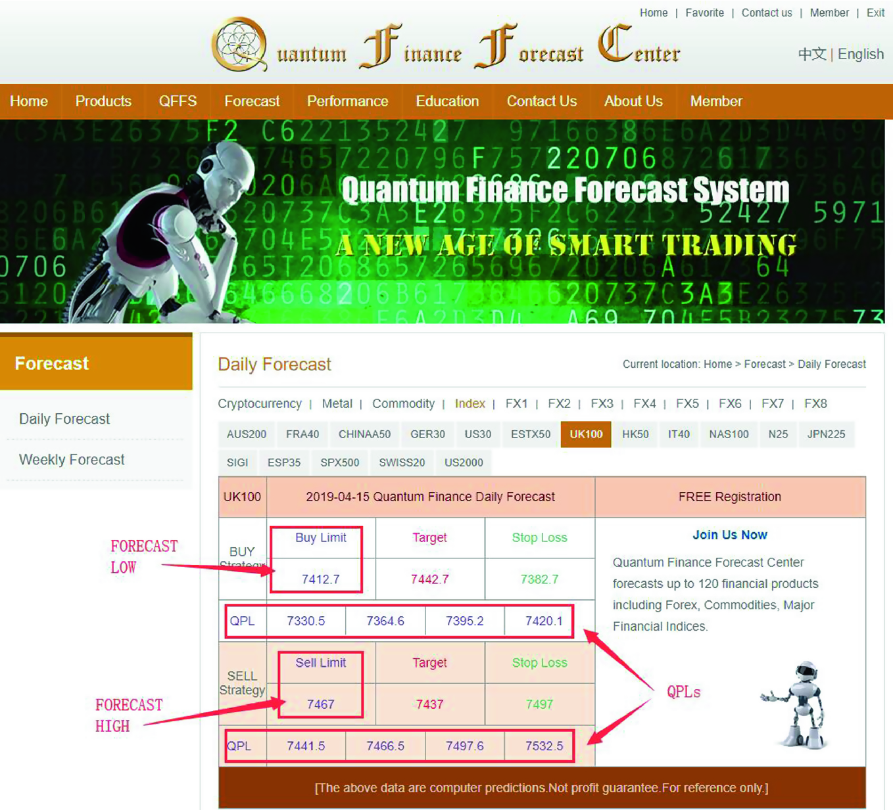 **Fig. 6.27. Quantum finance forecast of UK100 index on April 15, 2019** 

One important reminder, according to quantum finance theory, the range between day-high and day-low is the ranging of _normal daily oscillation_ of the financial market. We should determine the market as _breakout_ if the market jump/fall beyond the oscillating region.

### 6.7.8 QT#2.2 Experienced Traders—Quantum Forecast Breakout Trading with Averaging Strategy (QFBTAS)

The integration of averaging technique and breakout strategy is a direct enhancement of quantum finance breakout strategy. That is, naturally, the integration of _averaging technique_ at every QPL breakouts, such as 30019, 29871 for Forecast Low breakouts and 30482, 30691 for Forecast High breakouts, is shown in Fig. 6.28 for HSI. 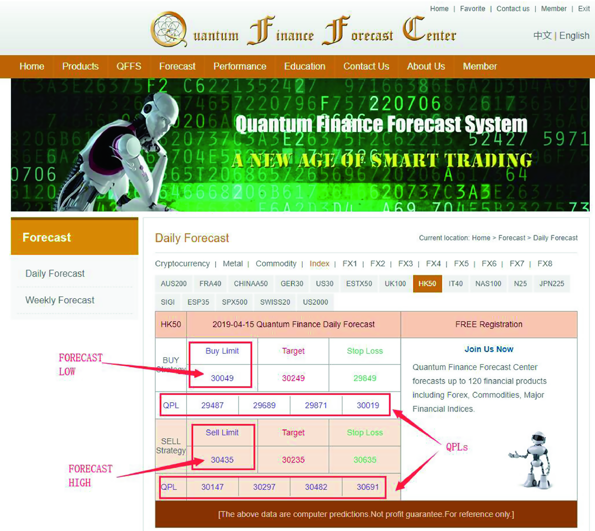 **Fig. 6.28. Quantum finance forecast of HSI (Heng Seng Index) on April 15, 2019** 

It is the usual (in fact standard) technique being adopted by almost every experienced trader. Even if we can identify it is a breakout market, it is impossible for us to predict how much it can breakout.

Thus, averaging is the most viable solution and is also a smart move.

One important reminder is that: as we all know, once the market breakout, it can be very serious.

So, (1) it is important to set (and calculate) as many QPLs as possible and (2) Don’t try to do _reverse trading_ during a severe market _breakout_. It is a very dangerous act to do so.

The truth is: once market _breakout_ , anything can occur. So, for those use breakout strategy, all we need to do (and should) is to choose a good position to harvest the gain. That’s all. Nothing else (_traditional wisdom_).

In fact, this also differentiates between an _experienced_ versus _inexperienced_ trader. For an experienced trader, one will know that statistically speaking it is very difficult to harvest a good breakout gain and followed by a reversal gain. So, one will harvest the big gain and take a rest. But for inexperienced investor, one will make a usual human mistake, _hubris_ —thinking one is _invincible_ and continue with reverse trading until a huge loss had incurred.

### 6.7.9 QT#3.1 Experienced Traders—Quantum Forecast Single-Product Hedging Strategy (QFSPHS)

As mentioned, _hedging_ is one of the most important trading techniques in modern finance. It does not only function as risk control but is also a vital technique in _high_ -_level_ trading activity. It is an important component in quantum trading.

According to quantum finance theory and actual practice, 80% of time the market undergoes _oscillation mode_ between the forecast high–low region. However, what we are interested in is actually the other 20% _breakout_ cases that are usually triggered by _excited events_ such as financial news outbreaks or unexpected financial figures announcement, which will push/pull the market from one QPL to another QPL (normally with more than two to three QPL jumps/drops).

So, experienced traders can perform quantum forecast single-product hedging strategy (QFSPHS) like this:

- To capture the 80% _oscillation_ market, set buy limit and sell limit at the forecast low and forecast high, respectively, such as 1.57314 and 1.59218, respectively, as shown in Fig. 6.29. 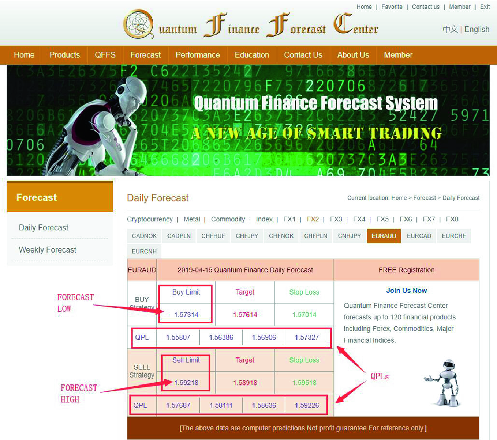 **Fig. 6.29. Quantum finance forecast of EURCAD on April 15, 2019** 

- To cater for the 20% _breakout_ scenario, do the SP hedging, i.e., set sell at each QPL beyond the forecast low, combine with averaging and hedging techniques for breakout market. Similar for buy-side breakout.

Depends on the trading skills and/or actual market movement, professional traders can have some variations of QFSPHS. For example, one can release the hedge using QPL(s), i.e., do a hedge at each breakout QPL, and partial cut-loss (release the hedge) simultaneously. That is to conform with quantum finance theory and is a wise move to partial release the hedge.

By using the same technique, one can naturally design and implement more complex, cleverness multi-product and multi-platform quantum hedging strategies.

As an old saying, anything is possible. It all depends on our imagination.

## 6.8 Conclusion 

In this chapter, we have studied seven major trading strategies which can be applied to financial products and trading platform.

Also, we have studied how to apply quantum finance to design quantum trading and hedging strategy.  **** 

Note that these methods can be applied effectively only if one has sufficient knowledge and actual experience of technical analysis and quantum finance.

In addition, trading activities can be (and should be) carried out by a combination of these techniques and strategies to yield the best performance.

A final reminder: risk control strategy is the most important strategy that we must always bear in mind. The fact is: The biggest failure is always the one at most confident and lack of risk awareness. 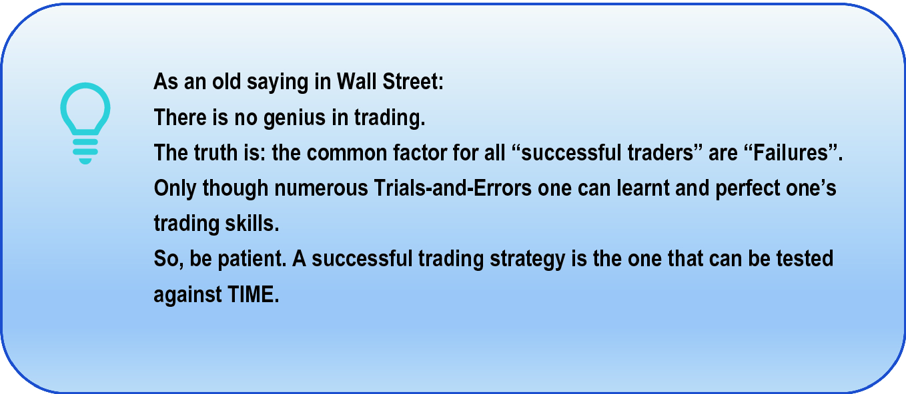 **** 

### Problems

1. 6.1

Why _self_ -_discipline_ is important to financial trading as mentioned in the opening quotation of this chapter?

2. 6.2

How to maintain _self_ -_discipline_ in financial trading? State three techniques or methods and explain how they work.

3. 6.3

Discuss and explain why program trading (or algorithmic trading) becomes so popular nowadays.

4. 6.4

What are the major similarities and differences between cryptocurrency trading versus traditional forex trading?

5. 6.5

Why conventional trading strategies are mainly based on technical analysis tools and techniques? Give any three technical analysis tools and techniques to support your explanation.

6. 6.6

What is the definition of hedging strategy? Describe briefly how it works in a financial market such as forex market.

7. 6.7

What are the major difficulties and challenges to design a good trading/hedging strategy? And how can we overcome them by using quantum finance technology?

8. 6.8

State and explain four commonly used technical analysis tools and indicators for the design of trading and hedging strategies.

9. 6.9

State and explain seven major types of trading and hedging techniques. For each type of technique, use a financial product and its corresponding financial charts as example for explanation.

10. 6.10

Trend trading is the most commonly used trading method, why? What is/are the major limitation(s)?

11. 6.11

Trend trading using multiple MA signal line crossing technique:

     1. (i)

What is Fibonacci number sequence?

     2. (ii)

How it works for the design of trading strategy using multiple MA signal lines crossing techniques?

     3. (iii)

If we want to use three MA signal lines crossing technique, what is the best combination of MA number from the Fibonacci to represent: daily, weekly, and monthly pattern crossing? Why?

     4. (iv)

What are major advantages and shortcomings using Fibonacci number sequence for the selection of MA signal lines?

12. 6.12

Discuss and explain breakout trading strategy. Why it is commonly used by experienced traders and hedgers?

13. 6.13

What are the major challenges in breakout trading strategy and how quantum finance can be helped to solve these problems?

14. 6.14

How can we relate and interpret market breakouts in terms of quantum finance theory? And how we can use QPL to design a scientific breakout strategy?

15. 6.15

Discuss and explain what is reversal trading in finance? And how quantum finance technology can be used for reversal trading?

16. 6.16

Discuss and explain why portfolio trading becomes a popular strategy for the design of trading and hedging strategy. How it works?

17. 6.17

Discuss and explain any three latest R&D of trading and hedging strategies using AI and related technology.

18. 6.18

Why AI technologies such as fuzzy logic and genetic algorithms are commonly used in the design of intelligent trading and hedging systems?

19. 6.19

What are the major limitations of using technical analytical techniques and tools for the design of trading strategies? and how quantum finance provides an alternative solution?

20. 6.20

In the old days, financial trading and hedging are totally two different concepts and methodologies, but now the distinction between them becomes obscure. Why? Is it related to the popularity of program trading?

21. 6.21

What are Bollinger Bands? Discuss and explain how to use Bollinger Bands to design trading strategy. What are the major limitations and how quantum finance can be applied to resolve these problems?

22. 6.22

What is stop-loss strategy? Why it is important especially for the design of program trading strategies?

23. 6.23

State and discuss three major hedging strategies. Give an example of financial product for explanation.

24. 6.24

Discuss and explain the major concepts and approach of quantum trading. Which one is more preferable for the application to program trading? Why?

25. 6.25

Discuss and explain the major similarities and differences between QPL and S & R in technical analysis. How we can use QPL to replace S & R for the design of program trading and hedging algorithms?

26. 6.26

State and explain three levels of quantum finance trading and hedging strategies. Why they are divided into three levels? Each of them uses a financial product as example to explain how it works.

27. 6.27

For inexperienced investors, it is preferable to use daily forecasts together with simple stop-loss strategy instead of hedging technique. Why?

28. 6.28

Quantum trading program.

     1. (i)

Study MQL workshop from [QFFC.​org](<http://QFFC.org>) to learn the basic skill of design and writing MQL-based trading programs.

     2. (ii)

Finish workshop #1 to learn how to design and implement an MQL program to calculate all the QPR and QPL of any financial product based on the past (says) 2000-trading day time series.

     3. (iii)

Finish workshop #2 to learn how to design and implement quantum finance forecast system to calculate the daily forecast high/low of any financial product.

     4. (iv)

Based on the level 1 quantum trading strategies to implement: (1) QT#1.1 quantum forecast oscillation trading strategy (QFOTS) and (2) QT#1.2 quantum forecast oscillation trading with averaging strategy (QFOTAS) using QPL for at least five forex products (e.g., AUDCAD, EURJPY, USDCAD, EURGBP, etc.).

     5. (v)

First, use MT4 simulator to test for the trading performances of these five products for at least 1 year.

     6. (vi)

Second, use demo account to perform the mock trading for at least 20 trading days (i.e., 1 month) and compare their trading performance and overall monthly returns.

     7. (vii)

Once you are experienced in quantum trading, implement the level 2 and level 3 quantum trading strategies and compare their trading performances.
