# 7\. AI Powerful Tools in Quantum Finance

 _A computer would deserve to be called intelligent if it could deceive a human into believing that it was human._

Alan Turing (1912–1954)

© Portions of this chapter are reprinted from Lee (2006), with permission of Springer Nature.

- _What is intelligence?_

- _What is artificial intelligence?_

- _What are the core AI technologies?_

- _How can we apply AI to quantum finance?_

All who have heard about artificial intelligence (AI) must be familiar with Sir Alan Turing—the father of AI with his famous Turing test. He was an English mathematician, computer scientist, cryptanalyst, and theoretical biologist. He was highly influential in the development of theoretical computer science, provided a formalization on algorithm concepts and computation with his famous invention— _Turing machine_ was deemed as original computer prototype. His famous quotation brought out the foundation concept and AI notion—machine or software to mimic and exemplification of human behaviors, which is also the core concept of _Turing test_.

In previous chapters, we have learnt the basic concepts of quantum finance.

More importantly, we have learnt how to make use of time series returns, together with quantum anharmonic oscillator model of quantum finance Schrödinger equation to evaluate quantum price levels (QPLs) on any financial market, which provide us a new way and concrete solution to model financial markets.

We have also learnt how to apply QPLs, together with the seven major financial trading (hedging) techniques to design and implement quantum trading and hedging systems. The only component left behind is: how to make use of time series financial information, together with QPLs to forecast financial markets using state-of-the-art AI techniques?

In this chapter, we will study the three _pillars_ of AI:

- Artificial neural networks,

- Fuzzy logics, and

- Genetic algorithms.

In Chap. [8](<480082_1_En_8_Chapter.xhtml>), we will study other two important computational intelligence (CI) techniques in finance: chaos theory and fractals, how they can be used in quantum finance. Prior to that, let’s review a brief history of artificial intelligence.

## 7.1 An Overview of Artificial Intelligence 

### 7.1.1 From Greek Mythology to Turing Test

Many textbooks on artificial intelligence named Dartmouth conference in 1956 as the _Birth of AI_.

Was it?

The answer is yes and no.

“Yes” in the sense that five AI founders: Professors Allen Newell (CMU), Herbert Simon (CMU), John McCarthy (MIT), Marvin Minsky (MIT), and Arthur Samuel (IBM) coined the word of _artificial intelligence (aka AI_) at this conference. Since then, R&D on AI had commenced officially as a newly emerged discipline. They also became leaders of AI research in different AI domains for the following decades.

“No” in the sense that: the notion of _man_ -_made intelligence_ , or what we called _artificial intelligence (AI)_ is not a new concept.

According to Greek mythology (Greek epic poet Hesiod’s Theogony 700B.C.), Prometheus (Hansen 2005), a titan and culture hero who created first human from clay (“humanoid-robot” in today’s term) and defied Zeus to steal fire (intelligence) from the chariot of the sun for further progress and comfort of human civilization.

If we review the formal conceptualization of AI theory, one may think of Sir Alan Turing and his celebrated invention—Turing test.

In 1950, he published _Computing Machinery and Intelligence_ (Turing 1950). In his paper, he designed a method to evaluate whether a machine can be characterized as human and pondered the way to measure technology progression. To study the basic problem: _Can machines think?_ He initiated a series of tests that were meant to help human answer the question— _Turing test_ (at that time he called this test as _imitation game_).

The test comprised of an interrogation room conducted by a _judge_. Figure 7.1 illustrates that there are two unseen subjects in individual terminals being judged: a human and a computer program. Based on the quality of conversation, the judge makes dialogue to ensure both subjects within a designated timeframe and attempts to identify persona between human and computer program. He concluded that if the judge is likely to pick out either subject, it showed that the computer has succeeded in revealing to _think_ with human intelligence.  **Fig. 7.1. Illustration of Turing test** 

Modern version of the _Turing test_ has employed more than one human judge to converse and interrogate with both subjects. The test is marked success if more than 30% of the judges contemplated the computer program as human subsequent to five minutes’ conversation. The _Loebner Prize_ is an annual _Turing test_ competition that was started by American inventor and activist Dr. Hugh Loebner (1942–2016) in 1991. He created additional rules to the original Turing test, calling for human and computer program to have 25-min conversation with each of the four judges presiding over the competition. The winner of the competition (not necessarily one that passes the Turing test) is the one whose computer bot received the most votes and highest ranking from the judges, regardless of whether there were 30% judges’ votes. Despite Sir Alan Turing predicted that by year 2000 machines would eventually pass the Turing test, this did not occur until 2014. In 2014, Professor Kevin Warwick organized a Turing test competition to mark the 60th anniversary of Sir Alan Turing’s death. A computer chatbot called Eugene Goostman with the persona of a 13-year-old boy had passed the Turing test in this competition. He secured 33% judges’ votes who were convinced that he was human.

### 7.1.2 Definition of AI

Although there is no official definition of AI, one refers to definition of AI from Webster’s Dictionary and the American Association for Artificial Intelligence (AAAI) as

> The capacity of computers or programs to operate in ways to mimic human thought processes, such as reasoning and learning.
> 
> —Webster’s New College Dictionary
> 
> The scientific understanding of the mechanisms underlying thought and intelligent behavior and their embodiment in machines.
> 
> —AAAI

Professors Stuart Russell and Peter Norvig in their remarkable book: _Artificial Intelligence_ — _A Modern Approach_ (2015) provided a substantial survey on AI definition in four major categories:

- Systems that think like human;

- Systems that think rationally;

- Systems that act like human; and

- Systems that act rationally.

In author’s book— _Fuzzy_ -_Neuro Approach to Agent Applications_ published by Springer in 2006 (Lee 2006) defined AI as (Fig. 7.2) 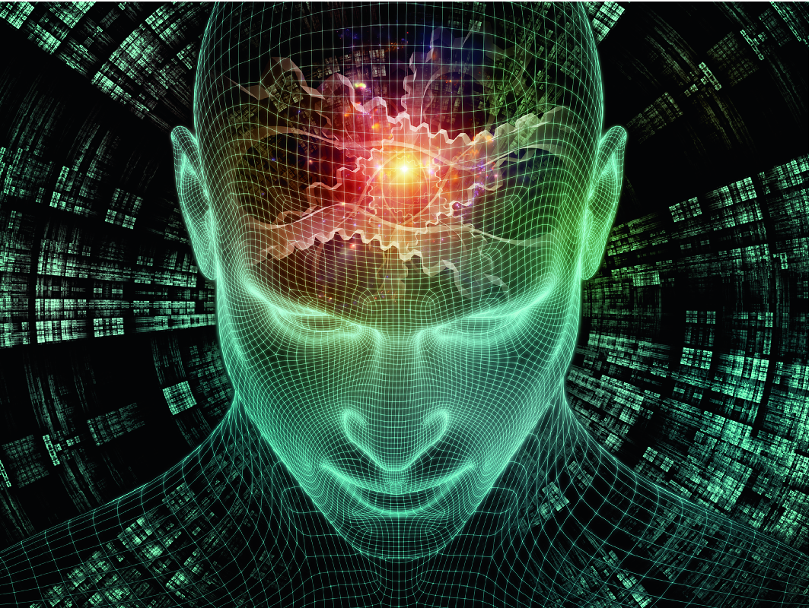 **Fig. 7.2. Illustration of AI (Tuchong2019a)** 

> The exemplification of human intellectual thoughts, acts and behaviors for the design and implementation of intelligent systems, software objects (agents) and robotic systems.

### 7.1.3 Strong Versus Weak AI

Since Dartmouth conference, many AI scientists at that time predicted that a machine with human intelligent would exist in no more than a generation and they were given millions of dollars to make this vision come true. However, it became apparent that the difficulties of constructing human-like robot were underestimated.

In 1973, in response to criticism of prolonged progress, shortages of practical and promising AI applications, both U.S. and British Governments terminated funding undirected research on artificial intelligence subsequent to _winter of AI_. Seven years later, a visionary initiative by the Japanese Government inspired governments and industry to provide billions of dollars on AI research, but by the late 80s investors became disillusioned by insufficient computer capacity (hardware) and withdrew funding again.

It was not until the first decades of twenty-first century, investment and interest in AI revived, while machine learning was successfully applied to many problems in academia and industry due to the presence of powerful computer hardware. It was called the second golden age of AI.

One special feature of AI is the conformity with AI. There were debates after Dartmouth conference even ongoing at present, on AI general definition and classification.

Professor Robert Wilensky (1951–2013), an influential AI scholar mentioned in his work— _Planning and Understanding: A Computational Approach to Human Reasoning_ stated that:

> Artificial Intelligence is a field renowned for its lack of consensus on fundamental issues.

One typical example was the argument between strong (hard) AI versus weak (soft) AI. Some AI scientists believed that AI should focus on the design and systems/programs implementation that mimic and simulate how human think and act—the so-called _weak AI_. Opponents believed that AI systems should not only think and act like human, but rather should _think_ and _behave_ consciously like human—so-called s _trong AI_.

In fact, Turing test is an exemplification example of _strong AI_.

### 7.1.4 Strong (Hard) AI

 _Strong AI_ refers to the study of machine intelligence that could successfully perform any intellectual task as per human. It is also called _artificial general intelligence (AGI)_.

Key characteristics of strong AI include the ability to reason, solve puzzles, make judgments, plan, learn, and communicate. It should have consciousness, objective thoughts, and self-awareness.

Some AI scientists argue that a machine with strong AI should be able to go through the same human development process, starting with a childlike mind through learning in developing an adult mind. It should be able to interact with the world, learn from it, acquire its own common sense, and language. Another argument is that we will not know when we have developed strong AI (if it can indeed be developed) because there is no consensus on what constitutes intelligence.

Core areas of strong AI research include the following:

- Construct intelligent machines, robotic in particular;

- R&D on generalized rule-based and case-based systems, e.g., IBM Deep Blue supercomputer on chess playing; and

- R&D on consciousness, objective thoughts with self-awareness.

Owing to its complexity, the progress of strong AI was prolonged between 1950–1980s.

The celebrate AI versus human contests—Deep Blue versus Mr. Garry Kasparov—six-game chess matches between world chess champion and an IBM supercomputer Deep Blue. The first match was played in Philadelphia and won by Kasparov in 1996. The second was played in New York City and won by Deep Blue in 1997. The 1997 match was the first defeat of a reigning world chess champion by a computer under tournament condition.

### 7.1.5 Weak (Soft) AI

The emergence of computer technology such as software engineering is the software design (programs) that can be executed by computer (systems) to work out problems. In this respect, we have a new area on AI R&D which is not focused on _general intelligence_ implementation, but rather mimic human behaviors, especially on _thinking_ and _problem_ -_solving_ —so-called weak (soft) artificial intelligence.

_Weak AI_ simulates human cognition and benefits mankind such as data analysis and automates time-consuming functions in ways that human is unable to do on occasions. In order to surpass this limitation, mimic human intelligence grew exponentially in the last 20 years. In fact, weak AI helps big data transform into usable information by detecting patterns and making predictions—data mining. Examples include Facebook’s news feed, Amazon’s suggested purchases, Apple’s Siri, and iPhone’s technology that answer users’ verbal enquiries.

Major R&D on soft AI include the following:

- Artificial neural networks (ANNs)—using computer models to mimic human brain (neural) structure on thinking and problem-solving.

- Genetic algorithms (GAs)—using computer models to mimic human genetic evolution, also called evolutionary computing (EC) or evolutionary programming (EP).

- Fuzzy logic (or fuzzy logic system, FLS)—using computer models to mimic human imprecise (so-called fuzzy) determination of matters and events, typical applications on real-time control systems.

As we can see, the boundary between hard and soft AI becomes obscure. Modern AI nowadays entails integrated disciplines including cognitive science, neuroscience, biological and artificial neural networks, evolutionary computing technology, robotic (engineering), data mining and deep learning, active vision, natural language processing (NLP), etc. (Fig. 7.3). 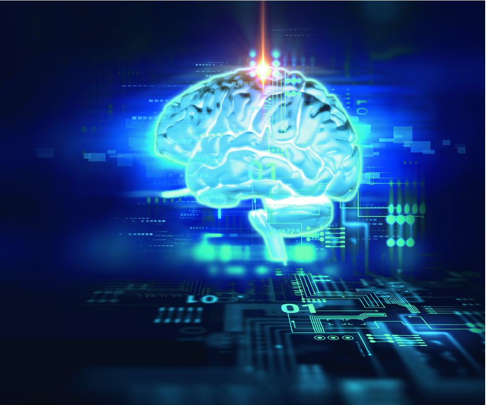 **Fig. 7.3. Weak AI (Tuchong2019b)** 

### 7.1.6 Classification of Artificial Intelligence

Owing to the advance of computing technology and the diversification of AI application in different areas, the author had defined AI classification into two main categories: macroscopic versus microscopic AI (Fig. 7.4). 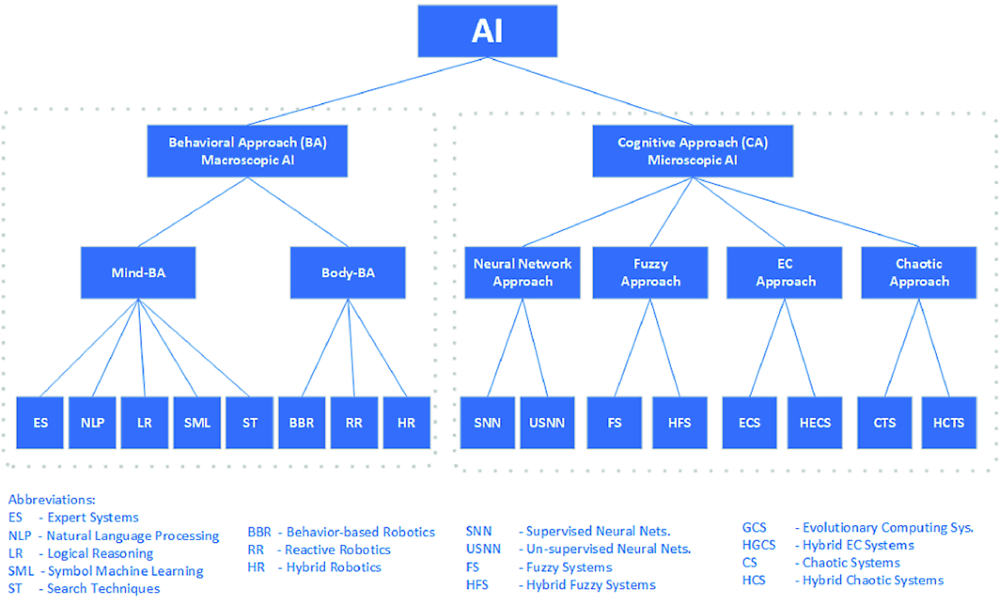 **Fig. 7.4. Classification of artificial intelligence** 

_Macroscopic AI_

- Also called _behavioral approach_ (BA) AI refers to the _acts_ and _behaviors._

- Focus on the design and implementation of intelligent machines (systems) that mimic high-level (appears to be seen) human intellectual behavior.

- BA-AI is further sub-divided into two sub-categories: mind-BA—high-level mental activities and body-BA—high-level body and control activities.

_Microscopic AI_

- Also called _cognitive approach_ (CA) AI refers to the _thoughts_ and _mental processes_.

- Focus to mimic human low-level mental activities, referred by cognitive scientists as human cognitive mental activities.

- According to various types of mental process, CA-AI approach is sub-divided into four major types: neural network, fuzzy logics, evolutionary computing, and chaotic systems.

## 7.2 Neural Networks—The Brain of AI 

### 7.2.1 Biological Neural Network—Our Brain

Artificial neural networks (ANNs) (or _neural networks_ in short) is one of the major components of microscopic AI, which focus on the study and modeling of intelligent system to mimic one of the most important human organs—the _brain_.

The first scientist to work in the area of _brain science_ was Italian physician Professor Camillo Golgi (1843–1926) who invented the _stain method_ to investigate neural activities inside the brain (Bentivoglio 2014). By using this method, he proposed that the brain is made up of _syncytium_ —a sponge-like tissue that is _activated_ by the staining operation. Based on his discovery, Spanish neuroanatomist Professor Santiago Ramón y Cajal (1852–1934) proposed an innovative idea that “ _these staining tissues were not sponge_ -_like elements, but rather the collections of the brain cells called neurons_ ”, which were interlinked together to form a complex group— _neural networks_ as shown in Fig. 7.5. Both esteemed medical professionals were awarded the Nobel Prize for Physiology or Medicine in 1906. 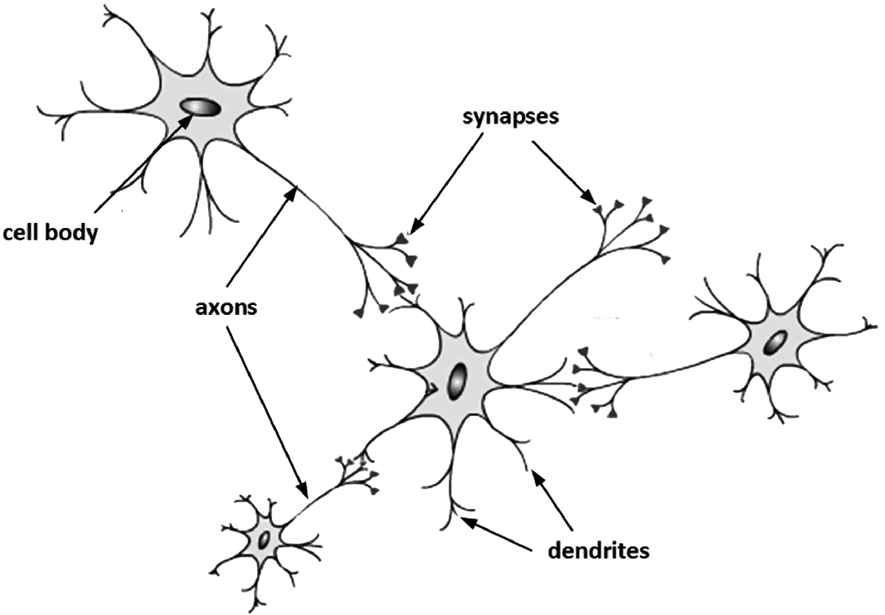 **Fig. 7.5. Biological neural network** 

Figure 7.5 shows each neural cell (neuron) consists of

- nucleus—central body of the neuron;

- axon—prolonged filament which connects to other neurons;

- dendrites—tree-like structures which branch from the neuron; and

- synapse—the axon tips (junctions) that make contact with other neurons by attaching to the dendrites of these neighboring neurons.

Latest neuroscience revealed that human brain consists of around 1011 neurons. The enigma is: the volume of neurons in human brain is so massive that we can only make use of less than 10% of neurons throughout our lives, which is rather against the basic evolution theory.

In fact, how such biological neural network works was still a mystery at that time.

### 7.2.2 Integrate-and-Fire Operations in Biological Neural Network

Prior 1943, almost all neuroscientists believed that the sole purpose of neurons was to process energy. Yet the way they work such as how to process information and store memory was unsolved.

In 1943, neurophysiologist Professor Warren McCulloch (1898–1969) and mathematician Professor Walter Pitts (1923–1969) published an influential paper _A logical calculus of the ideas immanent in nervous activity_ (McCulloch and Pitts 1943) which set off the birth of artificial neural networks, _ANN_ in short (Abraham 2016).

In the paper, they proposed that the main function of neural activities was to _process information_ —not energy storage. They maintained that the functions of the neurons were just like _logical switches_. Signal transmission from one neuron to another at synapses is the result of a complex chemical process in which specific transmitter substances are released from the sending points of the junctions. If the potential reaches a certain _threshold_ , a pulse will be generated down the axon, known as _firing_ , as shown in Fig. 7.6. More importantly, in the paper, they demonstrated how their proposed network (now called _artificial neural network_) could be used to perform basic logical operations such as and, or, and not operations. 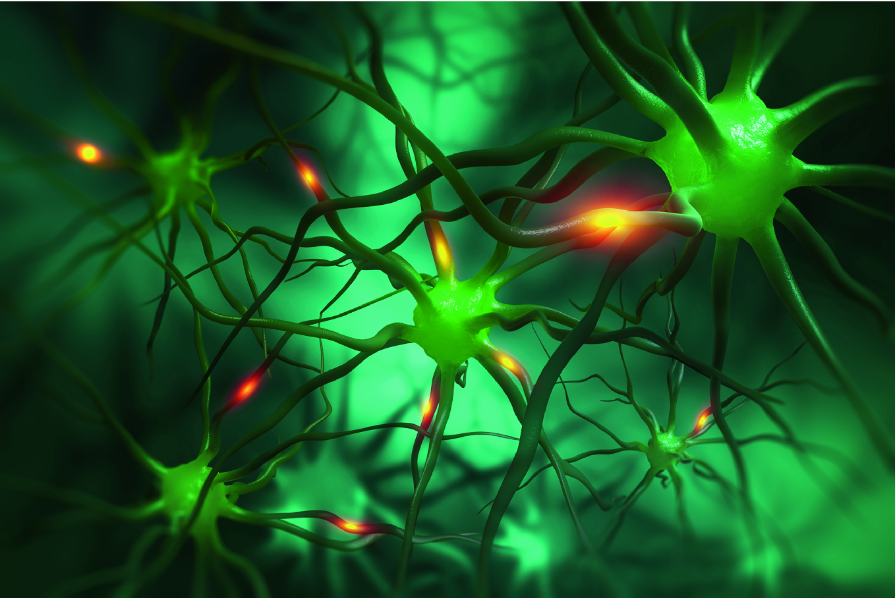 **Fig. 7.6. 3D illustration of integrate and fire in neural network (Tuchong2019c)** 

This breakthrough has not only merely solved the _century mystery_ of how _biological neural network_ works, but also provided a solid foundation for digital computing technology development.

Although we now understand that the neural activities in our brains are quite different from logical switches such as transistors in digital computer, they behave somewhat nonlinear (or even chaotic) _integrate_ -_and_ -_fire_ operators for information process and transmission. This discovery in 1943 coined the _first golden age of artificial neural networks_.

### 7.2.3 A Neuron Model

As a direct analog of the biological neuron, the schematic diagram of neuron structure can be interpreted as a computational model in which synapses are represented by weights that modulate the effect of associated input signals, the formulation is given by $$y = f\left[ {\sum_{i = 1}^{n} {w_{i} x_{i} } } \right]$$ (7.1) where x is the input signals, w’s are the weights, and y is the output.

The nonlinear characteristics exhibited by the neuron is represented by a transfer function $f\left( x \right)$ such as a binary or bipolar sigmoid function, given by

Binary sigmoid function: $$f\left( x \right) = \frac{1}{{1 + e^{ - \sigma x} }}$$ (7.2) 

Bipolar sigmoid function: $$f\left( x \right) = \frac{{1 - e^{ - \sigma x} }}{{1 + e^{ - \sigma x} }}$$ (7.3) in which $\sigma$ is the _steepness parameter_ to control the curvature of the transfer function. The learning capability of an artificial neuron is achieved by adjusting the weights in accordance with a predefined learning algorithm, usually in the form of $$\Delta w_{j} = \alpha \sigma x_{j}$$ (7.4) where $\alpha$ is the _learning rate_ and $\sigma$ is the _learning momentum_.

Figure 7.7 illustrates the analog between the biological neuron and its neuron model. 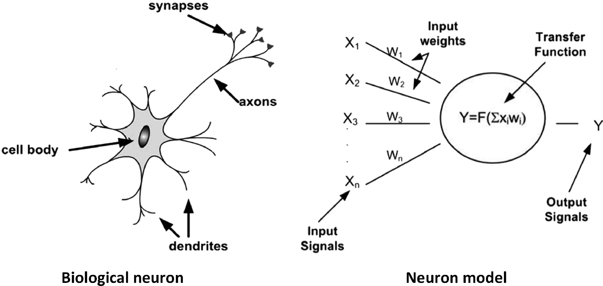 **Fig. 7.7. Biological neuron versus neuron model** 

### 7.2.4 Single Hidden Layer Artificial Neural Network Model

 _Artificial neural networks_ (ANNs, or neural network in short) are the pieces of a computing system designed to simulate the way human brain analyzes and processes information. They are the foundations of artificial intelligence (AI) and solve problems that would prove impossible or difficult by human or statistical standards. ANN has self-learning capabilities that enable them to produce better results as more data become accessible.

A typical artificial neural network consists of intermediate layer(s) known as _hidden layers_ to facilitate nonlinear computational capabilities of the network system.

Classical ANNs, such as feedforward neural network (FFNN) shown in Fig. 7.8, allow signals (information) to flow from input units to output units in a forward direction. 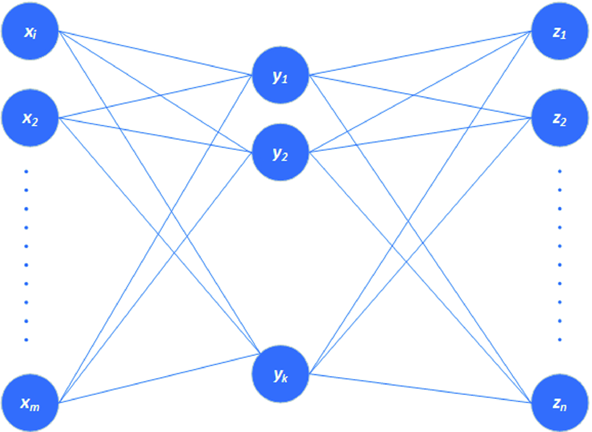 **Fig. 7.8. A typical single hidden layer artificial neural network model** 

Other basic ANNs include classical Kohonen self-organizing map (SOM) and learning vector quantization (LVQ) that are based on competition, along with the adaptive resonance theory (ART), and also our main theme—feedforward backpropagation neural network (FFBPN).

From mathematical perspective, ANNs can be regarded as multivariate nonlinear analytical tools. They are known to be superior at recognizing patterns from noisy, complex data, and estimating their nonlinear relationships.

Many studies revealed that ANNs possess distinguished learning proficiency in the underlying mechanics of time series problems ranging from stocks prediction and foreign exchange rates in various financial markets to weather forecast.

### 7.2.5 Classification of ANNs by Machine Learning Technique

Following half a century of development, numerous neural networks have been proposed with over 20 different types of commonly used ANNs.

Generally, ANNs are commonly classified by (1) machine learning techniques (Fig. 7.9) and (2) areas of application (Fig. 7.10). 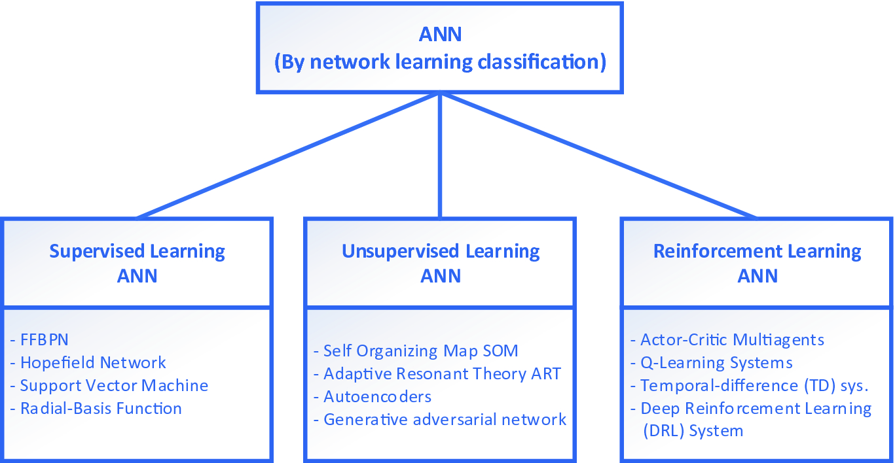 **Fig. 7.9. Classification of ANNs by machine learning technique** 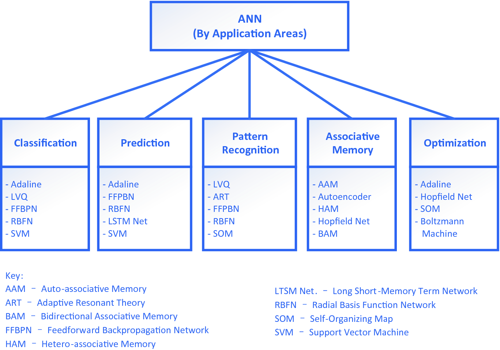 **Fig. 7.10. Classification of ANNs by areas of application** 

In terms of machine learning techniques, ANNs can be categorized into three main types:

1. Supervised-learning (SL) neural networks—network learning (training) based on input–output (target output) pairs. Typical examples include feedforward backpropagation neural network (FFBPN), Hopfield network, support vector machine (SVM), radial basis function (RBF) network, etc.

2. Unsupervised-learning (UL) neural networks—neural networks that do not need any supervised learning and training strategies, include all kinds of self-organizing, self-clustering, and learning networks such as SOM, ART (adaptive resonant theory), etc.

3. Reinforcement-learning (RL) neural networks—different from supervised-learning counterpart with well-defined input–output pairs, reinforcement learning trains the neural network to adopt with feedback signals, namely, reinforcement signal (RS). For the right behavior, the network will respond with a positive RS to _award_ the RL network, whereas the wrong behavior, the network will respond with a negative RS to _punish_ the RL network. This method is particularity useful to tackle optimization problem without exact target solutions such as trading strategy optimization. We will study the advanced topics in detail on multiagent-based intelligent trading strategies in Chap. [13](<480082_1_En_13_Chapter.xhtml>).

### 7.2.6 Classification of ANNs by Areas of Application

In terms of _areas of application_ , ANNs can be categorized into five major types:

- classification,

- prediction,

- pattern recognition,

- associative memory, and

- optimization.

Figure 7.10 shows the classification of ANNs by areas of application. As shown in Fig. 7.10, there are certain ANNs such as feedforward backpropagation network (FFBPN) and radial basis function network (RBFN) that can be used on multiple area applications such as classification, prediction, and pattern recognition, whereas other ANNs such as bidirectional associative memory (BAM) and Boltzmann machine are specialized to a particular application area.

In this chapter, we will study three basic and commonly used ANNs, they are as follows:

- Associative network,

- Hopfield network, and

- Feedforward backpropagation network (FFBPN).

### 7.2.7 Auto-associative Network—Network Architecture

 _Associative learning_ is one of the major fundamental characteristics of human intellectual behavior.

It is also widely used by human and machines for pattern recognition such as visual pattern identification and recognition include recalling human faces, voices, and music. Significantly, it relates to recalling knowledge and memory association.

Figure 7.11 shows the system architecture of an auto-associative network. It is a single-layered neural network to store a set of patterns for pattern association (or what we call _recalling_). 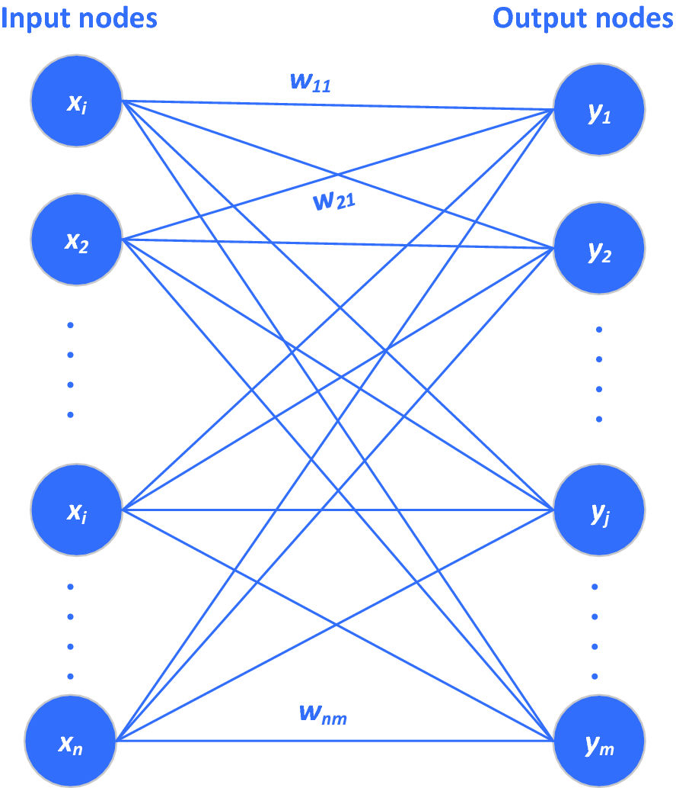 **Fig. 7.11. System architecture of auto-associative network** 

The training of the associative network is conducted by stored patterns iterative presentation updated by weights in accordance with the training algorithm.

Once the training is completed, the network can associate not only with the stored pattern but can also associate with the correct incomplete or noisy query stored pattern.

Basically, there are two major kinds of associative networks:

1. _auto_ -_associative networks_ —in which input (and query) patterns are the same type (and nature) as the associated pattern; and

2. _hetero_ -_associative networks_ —in which input (and query) patterns are completely different types (and nature) from the associated patterns.

### 7.2.8 Auto-associative Network—Network Training Algorithm

The Hebb rule (Hebb 1949) is commonly used for network training. Figure 7.12 shows the network training algorithm of auto-associative network (Fausett 1994; Patterson 1996). 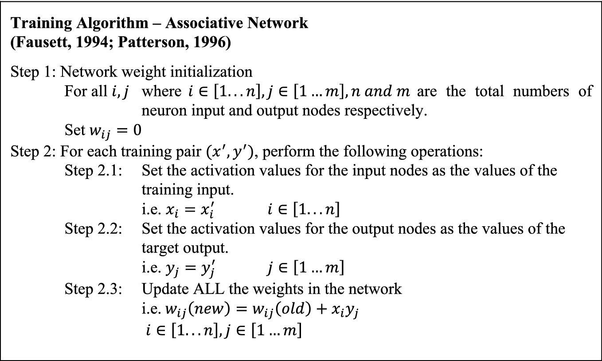 **Fig. 7.12. Network training algorithm of auto-associative network** 

Binary and bipolar vectors can be used in associative networks. Both training vectors will be a set of training input and target output pairs $\left( {x^{{\prime }} ,y^{{\prime }} } \right)$.

Hebb rule is simple to exercise on weight adjustments, and other methods such as the delta rule can also be adopted. In that case, the weight adjustment formula (in Step 2.3) will be replaced by $$w_{ij} \left( {new} \right) = w_{ij} \left( {old} \right) + \alpha \left( {y_{j}^{'} - y_{j} } \right)x_{i} \;where\,i \in \left[ {1\, \ldots \,n} \right],j \in \left[ {1\, \ldots \,m} \right]$$ (7.5) in which $\alpha$ is the learning rate of the network.

Since associative network architecture is plain to discern complex patterns such as human face association and character recognition, it does provide an innovative means to apply neural networks in association with memory storing and pattern recalling.

Inspired by these discoveries in neuroscience and neurophysiology, the author (Lee, 2004) proposed a chaotic neural associative network—the Lee-associator—to model chaotic and progressive human memory recalling mechanisms.

### 7.2.9 Hopfield Network—Network Training Algorithm

Professor John Hopfield published his influential paper in 1984, _Neurons with graded response have collective computational properties like those of two_ -_state neurons_ (Hopfield 1984). In this paper, he described how a simple recurrent auto-associative network can be used for content-addressable memory systems. Hopfield network also provided a model for the understanding of human memory, which can also be used in pattern recognition to tackle complex optimization problems such as the typical traveling salesman problem (TSP).

The architecture of Hopfield network (Fig. 7.13) is similar to a classical auto-associative network but with three basic differences: 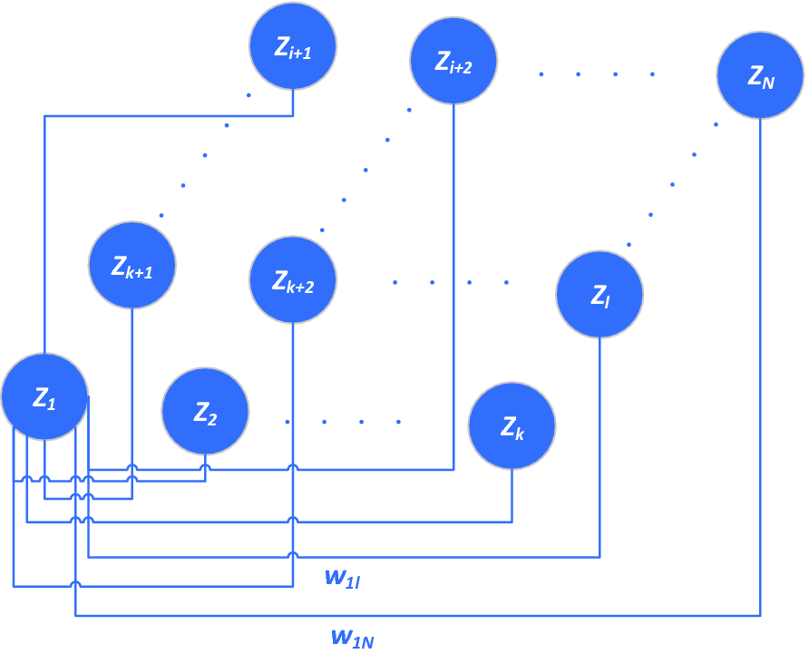 **Fig. 7.13. System architecture of discrete Hopfield network** 

1. Hopfield network is a recurrent network in the sense that output nodes in one time step are fed as input in the next time step.

2. In classical associative network, all neurons update their activations simultaneously, whereas in Hopfield network, one neuron selects solely at a time to update its activation and then _broadcast_ its new state to other members of the network.

3. Each neuron keeps on receiving the _stimulus_ from external signal during the entire auto-association process.

### 7.2.10 Hopfield Network—Network Training Algorithm

Hopfield network’s key aspect is that it demonstrated how a powerful memory storage and retrieval device can be composed of simple auto-associative network modification. Figure 7.14 shows the training algorithm of a classical _discrete Hopfield network_. 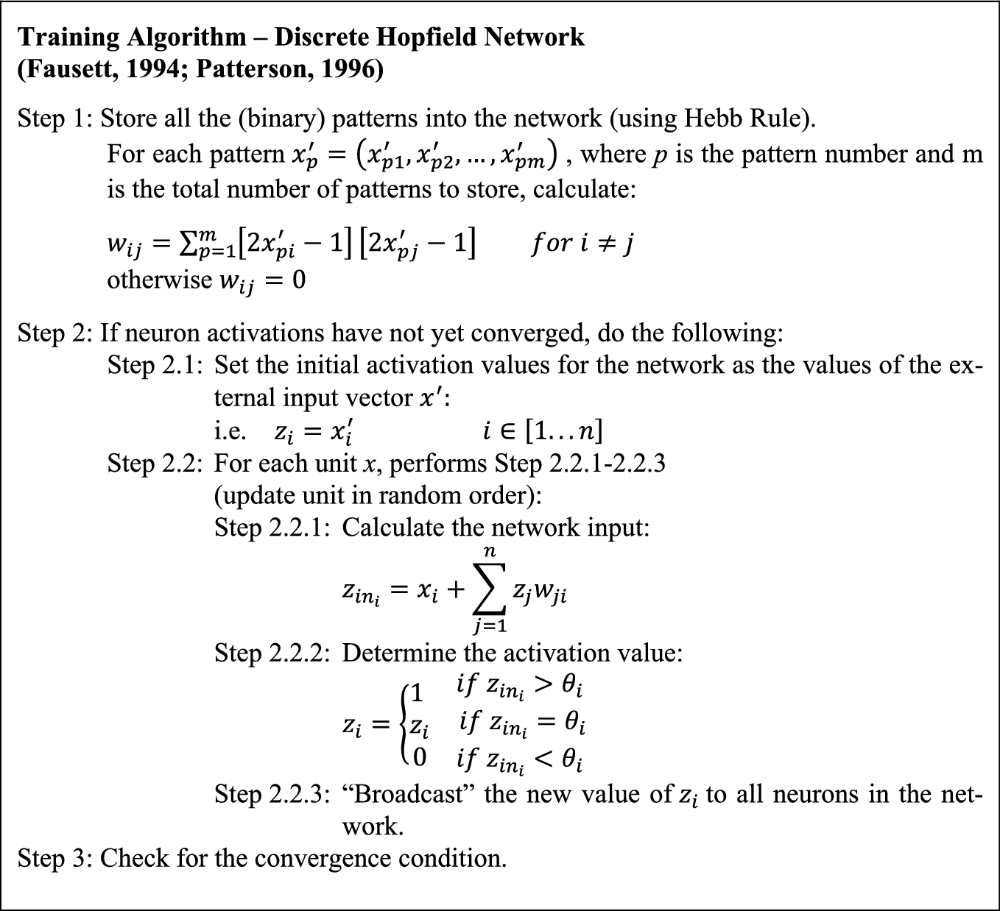 **Fig. 7.14. Network training algorithm of Hopfield Network** 

In Hopfield network’s associative memory, there are two types of association: auto-association and hetero-association. The former is a vector in association with itself, whereas the latter are two different vectors in association with storage. It is important to note that Hopfield’s network learning model used the identical to Hebb rule (1949), which basically strived to show that learning occurs as a result of the weights strengthening when the auto-association activity occurs.

In reality, Hopfield network’s vast application areas also set off the rebirth of ANNs and explored on how neural networks can be applied to complex problems in daily operations.

Hopfield network also provided a viable model for the understanding and modeling of human memory—a significant component in artificial intelligence.

### 7.2.11 Feedforward Backpropagation Network (FFBPN)—Network Architecture

Different from the previous two neural networks, feedforward backpropagation networks (FFBPNs) provide a multilayer network architecture (Lee 2006; Silva et al. 2017).

A typical FFBPN consists of an input layer, a hidden layer, and an output layer as shown in Fig. 7.15. Although FFBPN can consist of several hidden layers, one or maximum two hidden layers are usually sufficient in most of the cases. 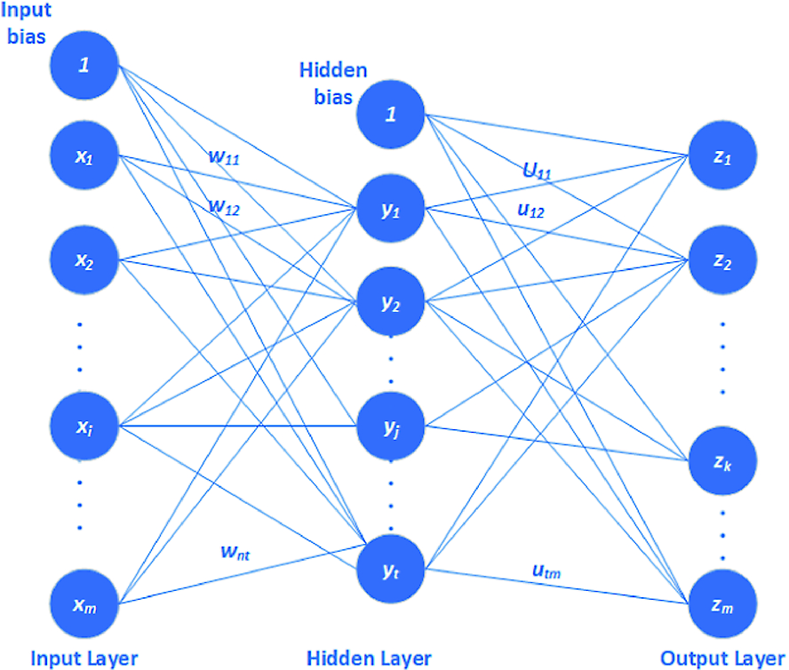 **Fig. 7.15. System architecture of FFBPN** 

The network training of FFBPNs consists of three main processes:

1. The _feedforward_ process of network training;

2. The _error evaluation_ process to calculate the errors between calculated output values and target output values; and

3. The _backpropagation_ process of the errors for weight adjustments.

Similar to most other networks, training terminates when errors are bound within the tolerance level.

Note:

- In the network architecture, w’s denote network weights between the input and hidden layers, and u’s denote network weights between the hidden and output layers.

- The total numbers of neurons located in input (n), hidden (t), and output layers (m), respectively.

- For activation functions, normally a sigmoid function is adopted.

Figure 7.18 shows the training algorithm of a typical FFBPN.

### 7.2.12 Feedforward Backpropagation Network (FFBPN)—Training Algorithm

An FFBPN can model various kinds of problems such as weather prediction and stock forecasting, pattern recognition such as character recognition, classification, and even optimization. In quantum finance stock (or forex) prediction, after time series financial data (e.g., Daily O, H, L, C, V) are normalized, they are used together with QPLs as input signals for network training in order to calculate next day’s H/L forecasts. Figure 7.16 shows the training algorithm of FFBPN. 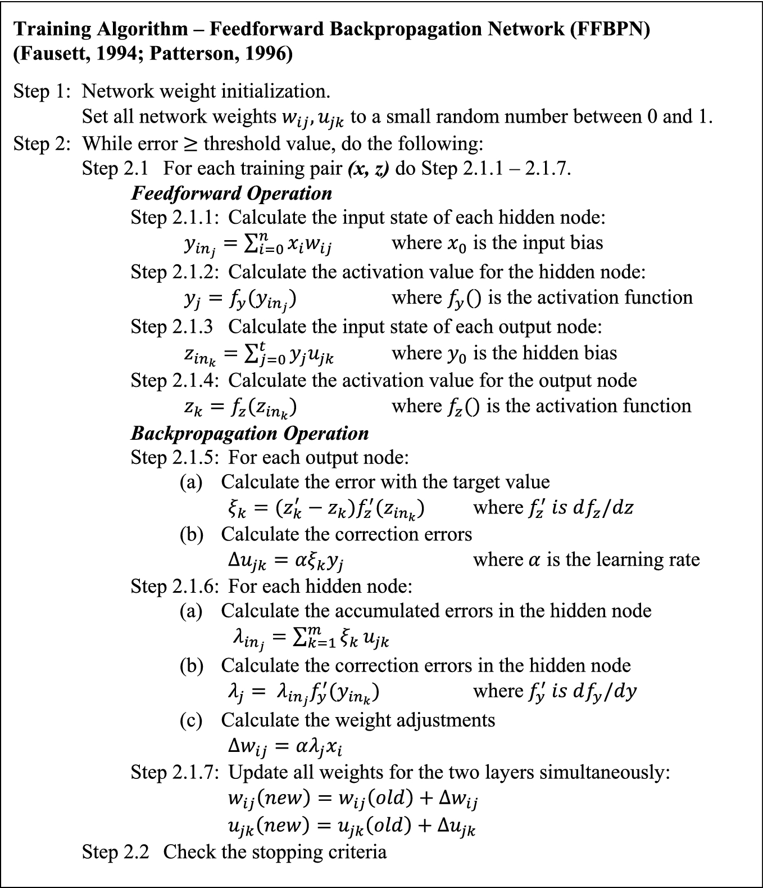 **Fig. 7.16. Network training algorithm of FFBPN** 

However, FFBPN has certain intrinsic limitation such as trapping in local minima along with difficulty in choosing optimal parameter settings (and input vectors). Lengthy convergence rate is also another major concern. A possible solution is the integration with chaotic neural oscillator technique will be studied in Chap. [9](<480082_1_En_9_Chapter.xhtml>).

### 7.2.13 Neural Network—Where to Go?

In this section, we have studied an overview of neural networks, their basic structure, and mechanisms.

Current trends of neural networks research and development are focused on three major areas:

1. The integration of other AI techniques to remedy certain classical neural networks intrinsic limitations includes fuzzy logic—fuzzy-neuro systems, genetic algorithms (GAs) to overcome parameter selection problem and to fine-tune networks;

2. The investigation and study in neural dynamics, especially in neural oscillators, neural oscillatory models; and

3. The investigation and study in chaotic neural dynamics of chaotic neural networks to model complex AI problems (Figs. 7.17 and 7.18). 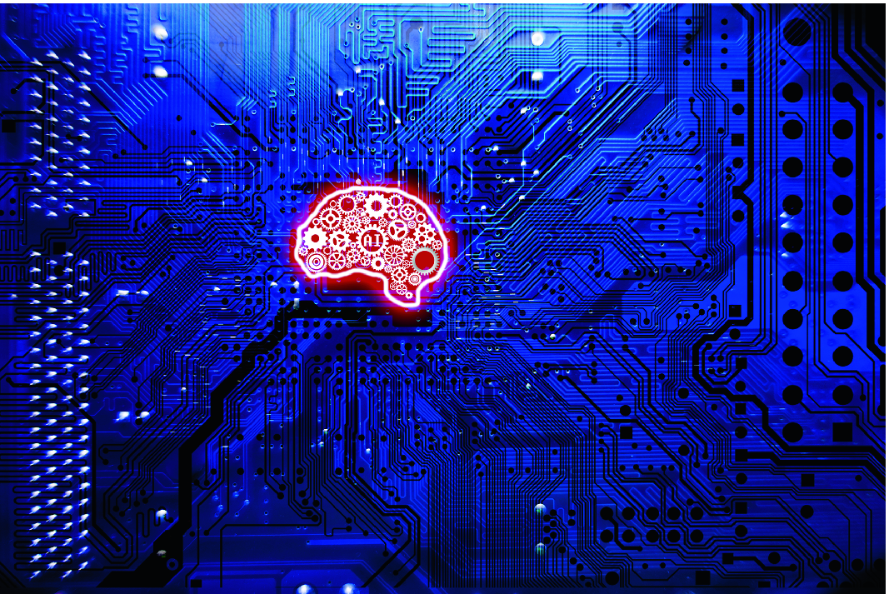 **Fig. 7.17. Neural network and AI (Tuchong2019d)** 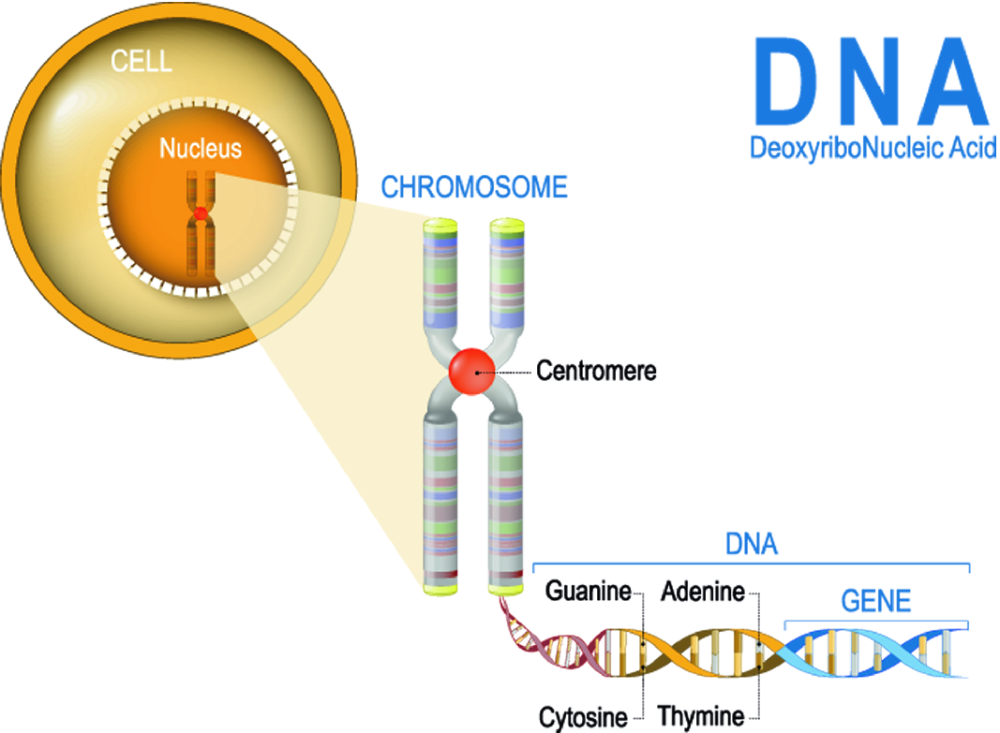 **Fig. 7.18. Illustration of DNA and chromosome in a eukaryotic cell** 

## 7.3 Genetic Algorithms—The Optimization Engine 

### 7.3.1 Nature of Evolution—Genetic Algorithms

Evolution refers to encode the operations of biological entities (chromosomes) rather than the engineering of the whole living beings themselves.

According to Darwin’s evolution theory (Darwin and Huxley 2003), natural selection is based on _survival of the fittest_ —in effect, chromosomes with high fitness values will reproduce more than those with low fitness values.

Professor John Holland (1929–2015) introduced genetic algorithms (GAs) in 1960 based on Darwin’s concept of evolution theory. In 1975, he wrote a groundbreaking book on genetic algorithms: _Adaptation in Natural and Artificial Systems_ (Holland 1992). Afterward, his student Professor David E. Goldberg extended his work on GA and published his distinguished book: _Genetic Algorithms in Search, Optimization and Machine Learning_ , which becomes one of the most cited books in computer science and AI (Goldberg 1989).

Basic entity of GAs is the chromosome, which is a sequence of values/states.

Genetic algorithms are commonly used to generate high-quality solutions to optimization and search problems by relying on bio-inspired operators such as mutation, crossover, and selection (Kramer 2017).

### 7.3.2 Nature of Evolution—Genetic Algorithms

Figure 7.19 shows a typical GA with the following operations: 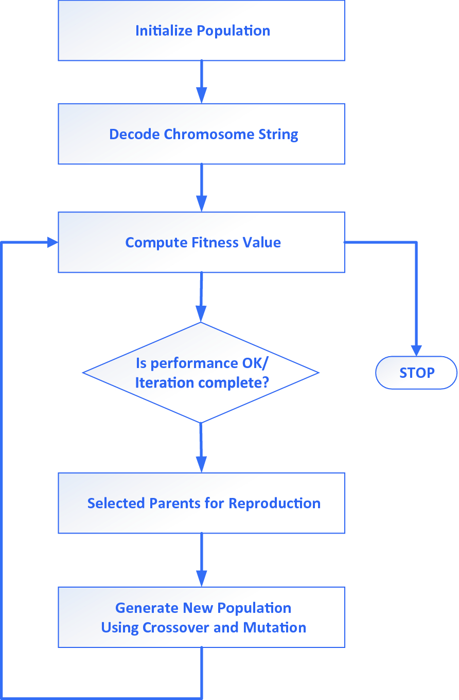 **Fig. 7.19. Flowchart of genetic algorithms (GAs)** 

1. Initialization of the population.

2. Parent selection process.

3. Reproduction process involving _crossover_ and _mutation_ operations.

4. Fitness value evaluation.

5. Iterative execution on the new population until satisfactory performance is attained.

According to this _evolutionary theory_ , an offspring is normally _fitter_ if its ancestors are _better_. Also, chromosomes will grow better as the generations grow.

### 7.3.3 GA—Population Initialization

A _population_ is a collection of chromosomes with the representation of a parameter set {x1, x2, x3, …, xm}. This parameter set is to be encoded as a finite length string over an alphabet of finite length.

It is usually encoded as a binary value of zeros and ones, or list of _normalized real number between 0 and 1_ in parameters optimization problem.

The population size depends on the problem nature, but typically contains several hundreds or thousands of possible solutions. Often, the initial population is generated randomly, allowing the entire range of possible solutions (the search space). Occasionally, the solutions may be _seeded_ in areas where optimal solutions are likely to be found.

For a chromosome of length m, the possible number of different chromosome strings is 2m (Fig. 7.20). 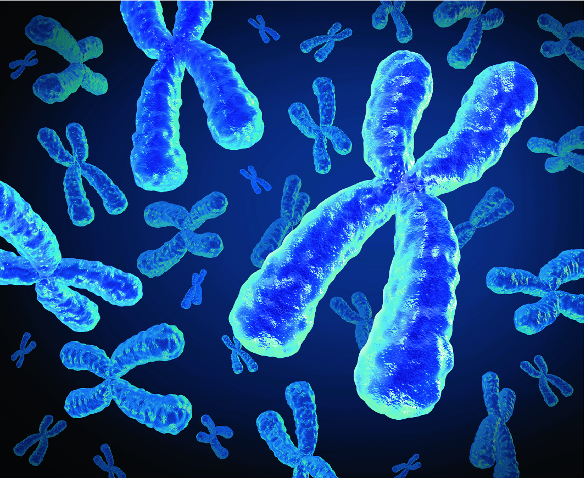 **Fig. 7.20. Populations of chromosomes (Tuchong2019e)** 

### 7.3.4 GA—Fitness Evaluation Function

An _evaluation function_ $f\left( x \right)$ is applied to the population to compute the fitness value of a chromosome.

This evaluation function varies among different problems.

For example, in a parameter optimization problem of a trading system, $f\left( x \right)$ might be the accumulated returns in a certain period of time, say, 2-month period.

It is vital that a complete GA remains in a form as it is the only selection criterion for chromosome performance of the entire population and increases the possibility for reproduction.

To justify stopping criterion of the GA, it usually depends on whether the best chromosome in the population has attained a sufficient level or _evolution_ (i.e., iteration of reproduction) which exceeded the generation limit (say a maximum of 1000 generations).

The fitness function must not only correlate closely with the designer’s goal, but it must also be computed rapidly. Execution speed is very important. A typical genetic algorithm must be iterated many times in order to produce a usable result for a nontrivial problem.

Fitness approximation may be appropriate, especially in the following cases:

- Fitness computation time of a single solution is extremely high.

- Precise model for fitness computation is missing.

- The fitness function is uncertain or noisy.

### 7.3.5 GA—Parents Selection Scheme

For _parents selection_ , a _fitness proportionate selection_ (also known as _roulette_ -_wheel selection scheme_) is commonly adopted. Fitness proportionate selection is a genetic operator used in genetic algorithms to select prospective beneficial recombination.

The fitness function assigns a fitness to all chromosomes. This fitness level is used to associate a probability of selection with each individual chromosome.

If _f_ _i_ is the _fitness value (FV)_ of a member _i_ of the population, its probability of being chosen (i.e., reproduction) will be $$p_{i} = \frac{{f_{i} }}{{\sum_{j}^{m} f_{j} }}$$ (7.6) 

Those chromosomes selected for the possibility of reproduction are directly proportional to their fitness value, and they conform to the basic feature of natural selection that: _A fitter organism has a higher chance of survival, hence reproduction_.

### 7.3.6 GA—Crossover Operations

In GA, there are two main operators for reproduction, namely, _crossover_ and _mutation_.

In typical crossover operation, a pair of parent chromosomes is selected from the population.

In _one_ -_point crossover_ , a random location is selected from the chromosome strings, and chromosome elements beyond this crossover point are exchanged to form a pair of new offspring according to the crossover rate.

Similarly, for _two_ -_point and uniform crossover_ , multiple points are selected for crossover operations.

Figure 7.21 illustrates _one_ -_point versus multi_ -_point crossover_ operations. 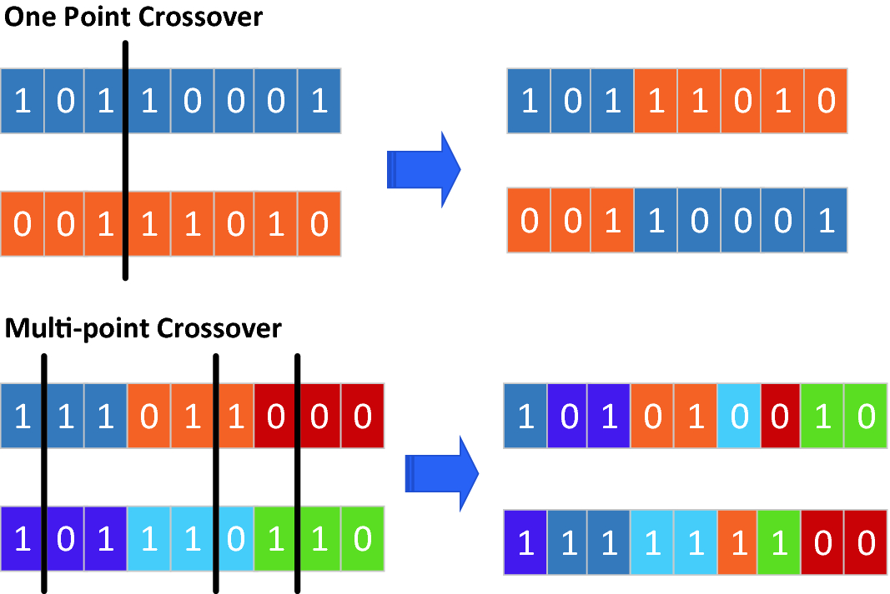 **Fig. 7.21. One-point versus multi-point crossover operation** 

Different algorithms in evolutionary computation may use different data structures to store genetic information, and each genetic representation can be recombined with different crossover operators.

Typical data structures that can be recombined with crossover are bit arrays, vectors of real numbers, or trees.

### 7.3.7 GA—Mutation Operations

For _mutation operations_ , a single chromosome is selected from the population which will be _screened_ throughout the entire list.

Basically, there are five basic types of mutation (Fig. 7.22): 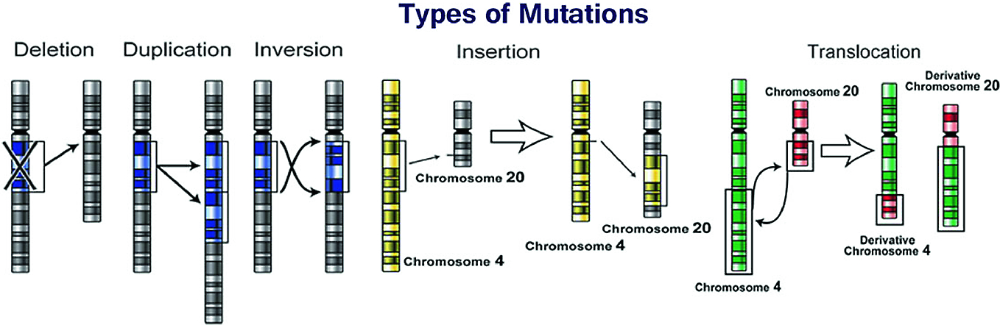 **Fig. 7.22. Five basic types of mutation operations** 

- Deletion,

- Duplication,

- Inversion,

- Insertion, and

- Translocation.

A particular element will be changed according to the mutation rate, which is normally much lower than the crossover rate, say 1–5% of probability.

The classic example of a mutation operator involves a probability that an arbitrary bit in a genetic sequence will be changed from its original state. A common method of implementing the mutation operator involves generating a random variable for each bit in a sequence. This random variable tells whether or not a particular bit will be modified. This mutation procedure, based on the biological point mutation, is called single point mutation. Other types are inversion and floating-point mutation. When the gene encoding is restrictive as in permutation problems, mutations are swaps, inversions, and scrambles.

The main purpose of crossover is to _exchange information_ between randomly selected parent chromosomes with the aim of not losing any improvement of information. The purpose of mutation in GAs is preserving and _introducing diversity_. Mutation should allow the algorithm to avoid local minima by preventing the population of chromosomes from becoming too similar to each other, thus slowing or even stopping evolution.

This reasoning also explains the fact that most GA systems avoid only taking the fittest of the population in generating the next but rather a random (or semi-random) selection with a weighting toward those that are fitter.

Although the main objective of mutation is to introduce some _genetic diversity_ into the population, it must remain at a slow rate (normally less than 5%) in order not to disrupt the genetic characteristic of the “ _good genes_ ”.

### 7.3.8 GA—Implementation

Based on different parent selection criteria, reproduction scheme, crossover, and mutation methods, there are numerous versions of schema for GAs implementation.

The fundamental one is reproduction to replace all parent population, using one-point crossover and bit mutation.

For parent selection, the roulette-wheel parent selection scheme based on parent fitness value is applied.

In the _elitism scheme_ , parents with the highest fitness value will be retained in next generation in order to guarantee the performance of the population at a certain standard.

For crossover operation, a two-point crossover in the other extreme to uniform crossover can be applied for other GA schemes.

For setting GA parameters, besides using a fixed crossover and mutation rates throughout the whole evolutionary process, a dynamic crossover and mutation rate assignment scheme can also be used.

The ratio of mutation rate will normally be set to a higher value when the number of generations increases to a higher level, such as 500 iterations.

The main reason for this is to induce a higher diversity of the chromosomes when the entire population evolves to a more mature stage, whereas a higher mutation rate can bring more “ _freshness_ ” to the population.

### 7.3.9 GA—Applications

As one can see, genetic algorithm (GA) is based on the foundation of evolution theory that focuses on target system improvement after generations of _evolution_.

Naturally speaking, GA is particularly useful to tackle two main categories of problem:

- Optimization problem and

- Scheduling problem.

Besides, GAs have been widely used with neural networks in two specific areas:

- Topology optimization

- Genetic training algorithms

In topology optimization, GAs are used to select the optimal topology (or parameter setting) for neural network which in turn is trained using some fixed training scheme such as FFBP training.

In genetic training algorithms, the learning of a neural network is formulated as a weight optimization problem, usually using the inverse mean square error as the fitness evaluation scheme.

In Part II of the book—applications of quantum finance, we will study how GA can be used for the selection of top-10 fuzzy financial signals in a quantum finance transient-fuzzy DNN (deep neural network) for financial prediction as in Fig. 7.23. 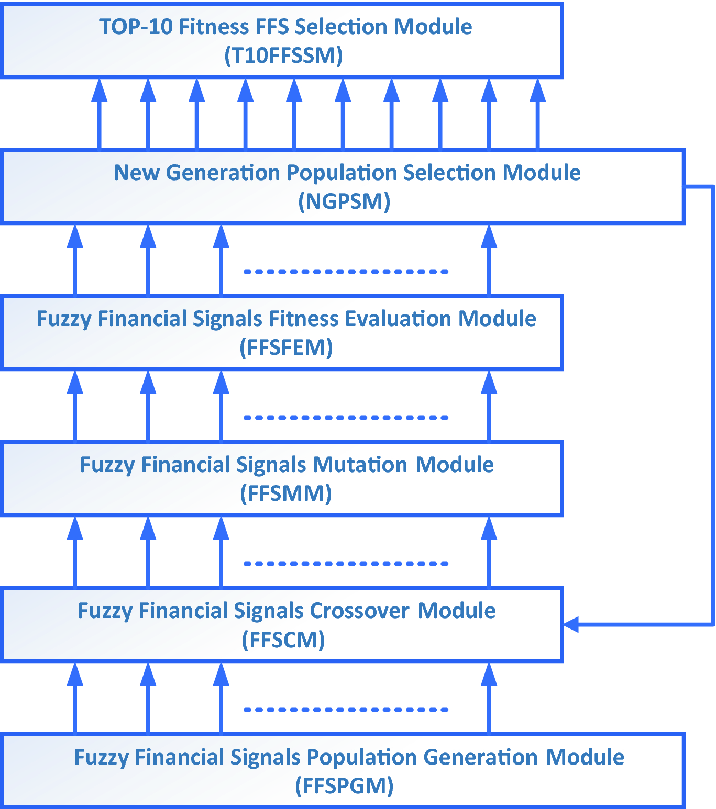 **Fig. 7.23. GA-based top-10 fuzzy financial signals selection scheme** 

## 7.4 Fuzzy Logic—The Fuzzification Engine 

### 7.4.1 The World of Fuzziness, Chaos, and Uncertainty

In our daily lives, we have to handle numerous things all the time—solving problems, asking and answering questions, etc.

At the end of the day, if we sit down and recall how many things were handled that day, we will find that this number is surprisingly large.

If you take a _closer look_ at all these things, we will find that most (or almost all) of them have the following three basic properties:

- They are fuzzy and highly uncertain in nature.

- We need our knowledge and/or experience to handle them.

- The methods and/or solutions to handle them are usually highly dynamic (or sometimes chaotic) in nature.

In fact, we might be aware that things that happen always seem to be highly _chaotic_ and _unpredictable_.

Does this mean that we cannot do anything to predict them, or cannot model all these phenomena to be solved and handled automatically?

### 7.4.2 The Birth of Fuzzy Logic

The notion of _fuzzy_ is not a new idea. The first scientific and mathematical interpretation for the _phenomenon of fuzzy_ (or one can say the _fuzzy property of matter_) attracted little attention from scientists until the feverish study of Heisenberg Uncertainty Principle of matter in the late 1920s and 1930s.

In 1937, Professor Max Black (1909–1988) published his paper _Vagueness: an exercise in logical analysis_ in the distinguished journal _Philosophy of Science_ proposed to use continuous logic component-wise techniques in sets and lists of elements (Black 1937).

However, instead of using the name fuzzy sets to describe these _vague sets_ , he referred to these structures as _vagueness_. Nevertheless, he was considered to be the forerunner to propose and define the first fuzzy membership function.

The term fuzzy set was coined by Professor Lotfi A. Zadeh (1921–2017) in 1965 in his influential paper _fuzzy sets_ published in the journal Information & Control (Zadeh 1965). In this paper, he proposed a modified new kind of set theory (so-called _fuzzy set theory_), which was used to describe the belonging degree of an individual member that can exist as any real value between 0 and 1, instead of just either 0 or 1 (Lee 2006; Ross 2016). Later, in his distinguished 3-Part journal papers _The Concept of a Linguistic Variable and Its Application to Approximate Reasoning_ published by _Information Sciences_ in 1975, he established a concrete theoretical and mathematical foundation on _type_ -_1_ and _type_ -_n fuzzy logics_ which began the age of fuzzy logic in the following half-century (Zadeh 1975a, b, c).

Moreover, he also demonstrated how these fuzzy sets could be operated, including fuzzy set union and intersection, and also developed a consistent framework for dealing with all of these structures and operations.

He believed that fuzzy sets, instead of crisp sets, should intuitively exist in our world of experience (Zadeh and Aliev 2019).

More importantly, these kinds of existence were even more naturally accepted by us and consistent with what we understood as our world of existence.

### 7.4.3 Fuzzy Theory and the Uncertainty Principle

In fact, Professor Zadeh’s observations were very sensible.

Most people might think that a fuzzy set tries to turn everything in our perceived world _blurry_ , _unclear_ , or _uncertain_ , while a _crisp set_ is the reality.

Actually, it is just the opposite situation.

_Lack of crispness_ should instead be the truth face of a real world.

According to the Heisenberg uncertainty principle learnt in previous chapter, we cannot exactly (100%) determine (measure) the position and momentum of an object at the same moment.

From fuzzy theory point of view, what Heisenberg’s uncertainty principle tells us is that all measured qualities appearing in our world of perception are fuzzy in the sense that it is not the quality itself that is fuzzy, but rather that we cannot always measure these physical qualities with 100% certainty.

In fact, there are three types of uncertainties that are now recognized:

1. _fuzziness_ (or _vagueness_), which results from the imprecise boundaries of fuzzy sets;

2. _non_ -_specificity_ (or _imprecision_), which is connected with sizes (cardinalities) of relevant sets of alternatives; and

3. _strife_ (or _discord_), which expresses conflicts among the various sets of alternatives.

Figure 7.24 shows the taxonomy of uncertainty and decisions. _Vagueness_ is a form of uncertainty where the analyst is unable to clearly differentiate between two different classes, such as _person of average height_ and _tall person_. This form of vagueness can be modeled by some variation on fuzzy logic. We will return to this interesting topic again when we study chaos theory in Chap. [8](<480082_1_En_8_Chapter.xhtml>). 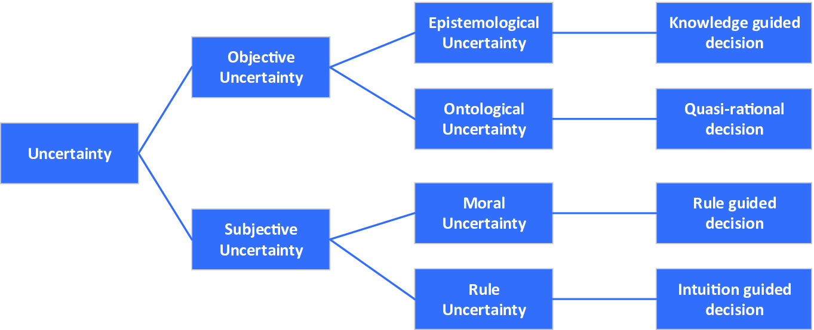 **Fig. 7.24. A taxonomy of uncertainty** 

### 7.4.4 ICMR Model—Fuzzy Identification Module

Structurally speaking, fuzzy logic can be decomposed into four basic components—the so-called _ICMR structural framework of fuzzy logic_ as shown in Fig. 7.25. 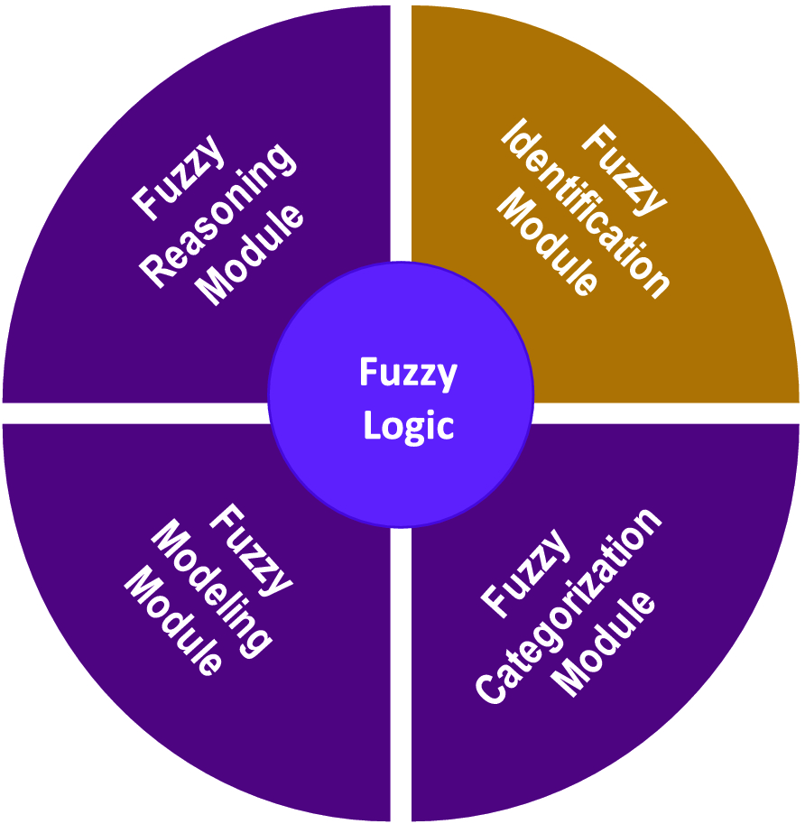 **Fig. 7.25. Fuzzy identification module of ICMR model** 

**Fuzzy Identification Module**

This module focuses on determination and identification of _fuzzy variable(s)_ (_FV_) being used in the system.

It is the most important and foremost stage in the entire system design, because an incorrect (or inappropriate) identification of the FV(s) will defeat the whole purpose of system modeling.

One important fact is that the same _quality_ (_variable_) can play totally different roles in different scenarios for the design of fuzzy systems.

For example, if one wants to use fuzzy logic to represent the following statement: _John is tall_ —the fuzzy variable being used is the quality _height_. Although this quality does not appear in the statement, conceptually speaking it is exactly what we mean by common sense, or what we called _priori knowledge_.

However, consider another statement: _Most of the students in the class are tall_.

In this case, if we want to represent this statement using fuzzy logic, the FV being used should not be the quality _height_ , but rather it should be the quality _most_ —it depicts the quality of students’ proportion who are tall in this class! In other words, we should be very careful in selecting the FV(s) being used in a fuzzy system.

### 7.4.5 ICMR Model—Fuzzy Categorization Module

Based on FV(s) being identified in the last module, this module focuses on how to categorize the selected FV(s) into different fuzzy sets.

By using the example in previous case, for FV _height_ , the possible fuzzy sets will be _short_ , _average_ , and _tall_ —in which each of them is a fuzzy set with a range of values:

- _short_ —for student height below 1.55 m.

- _average_ —for student height between 1.5 and 1.65 m.

- _tall_ —for student height over 1.6 m.

As shown in the above example, one major characteristic of fuzzy sets is that there exists _fuzziness_ in their boundaries.

In other words, there is not always a clear boundary between one _fuzzy set_ and another, which is totally unacceptable in a traditional _crisp set_.

Of course, the categorization of fuzzy sets is up to system designer in the sense that there are no strict criteria for one to decide the number, the type, and nature of fuzzy sets being used. But it should be logical and make sense.

For instance, instead of using three fuzzy sets, one can further categorize _height_ into five categories: _very short_ , _short_ , _average_ , _tall_ , and _very tall_ (Fig. 7.26). 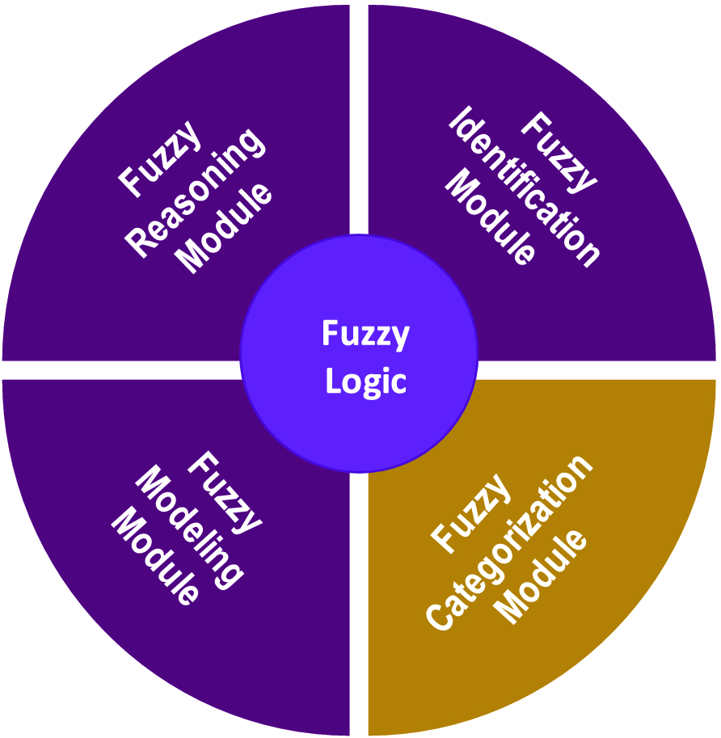 **Fig. 7.26. Fuzzy categorization module of ICMR model** 

### 7.4.6 ICMR Model—Fuzzy Modeling Module

For each fuzzy set, the designer has to define its _membership function_ (_MF_). The membership function is one of the most important components in fuzzy logic. It defines fuzzy mapping—the fuzzy belongings of each element within its fuzzy set.

From the mathematical point of view, let X be a collection of objects denoted by

$\left\\{ { \left. x \right| x \in X} \right\\}$ which is the so-called _universe of discourse_.

A fuzzy set A in this universe of discourse X is characterized by a membership function P A(x) which takes values in the interval [0, 1].

For instance, if we define the fuzzy set A as $$A = \left\\{ {\left( {x,\mu_{A} \left( x \right)\left| {x \in X} \right.} \right)} \right\\}$$ (7.7) 

If X is continuous, the fuzzy set A will be written as $$A = \int_{X} {\mu_{A} \left( x \right) /x}$$ (7.8) 

Otherwise, if X is discrete, the fuzzy set A will be written as $$A = \sum_{N} {\mu_{A} \left( {x_{i} } \right)/x_{i} }$$ (7.9) where N is the total number of possible discrete values in A.

By using the above example, one can model the fuzzy membership functions of each fuzzy element for the FV _height_ as shown in Fig. 7.27.  **Fig. 7.27. Fuzzy membership function.NoteAccording to the above fuzzy membership functions. If we say:the height of a student (Jack) is 1.63, the membership functions for fuzzy setsaverageandtallwill be 0.23 and 0.63, respectively. The implications for these fuzzy values are:Jack is tall, but he is not among the tallest ones in the class. But overall speaking, he is taller than the average students in the class** 

### 7.4.7 ICMR Model—Fuzzification Versus Defuzzification

The above example also demonstrates a very important concept in fuzzy logic—the _fuzzification_ versus _defuzzification_ scheme. As said, the main concept of fuzzy logic is to reflect the reality experience of our world (our perceived world), which is uncertain and fuzzy.

In other words, the main job of fuzzy logic is to act as a bridge (or a _crystal ball_ as shown) for us to convert _precise_ values (and measurements) from machine world (the so-called digital world) to _imprecise_ values in real world (the so-called _perceived world_) which is full of _fuzziness_ and _uncertainty_.

From the operational point of view, we denote the forward operation, which is the conversion of _digital measurements_ from machine world to _fuzzy values_ in the real world as the fuzzification scheme, while the reverse one is the defuzzification scheme. From the mathematical point of view, _fuzzification_ is the forward mapping of membership function, whereas _defuzzification_ is reverse mapping (inverse function) of the membership function as shown in Fig. 7.28.  **Fig. 7.28. Fuzzification versus defuzzification** 

### 7.4.8 ICMR Model—Fuzzy Reasoning Module

This module is the _brain_ of the entire fuzzy system that aims to explore system’s heuristics by applying the so-called fuzzy reasoning technique.

This module consists of three main processes:

- fuzzy rules construction process (FRCP),

- fuzzy knowledge-based construction process (FKCP), and

- fuzzy inference process (FIP).

_**Fuzzy Rules Construction Process**_**—** _**Fuzzy Relations (FRs)**_

During the construction process, it is essential to define a set of rules. Fuzzy rules are basically set of _fuzzy relations (FRs)_ that normally appear in the form of _if_ -_then_ propositions. They are also called fuzzy implication functions (FIFs) (Fig. 7.29). 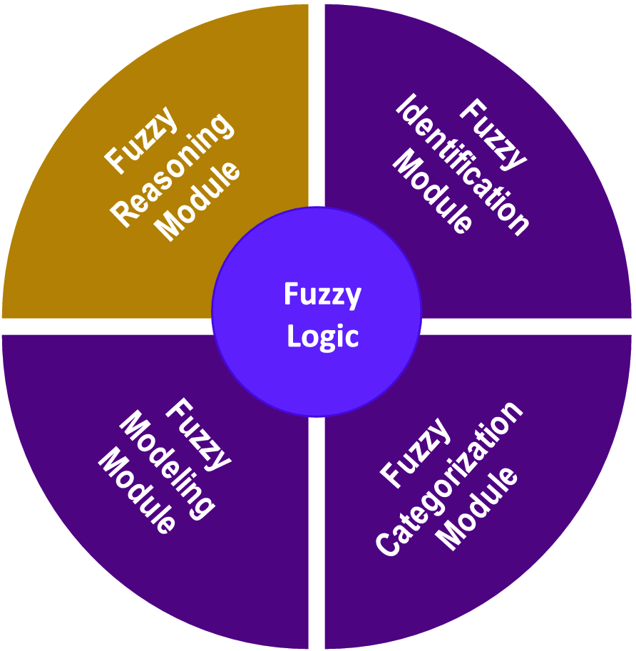 **Fig. 7.29. Fuzzy reasoning module of ICMR model** 

Mathematically speaking, a FIF is denoted in the following form: $$If\,x\,is\,A\,then\,y\,is\,B,\,where\,x,\,A\, \in \,X,\,y,\,B\, \in \,Y$$ (7.10) 

_or written as_ $$R = A\, \to \,B\,where\,R\,is\,the\,fuzzy\,rule$$ (7.11) 

_**Fuzzy Knowledge**_**-**_**Based Construction Process**_**—** _**Fuzzy Knowledge Base (FKB)**_

The _fuzzy knowledge base (FKB)_ is the _knowledge center_ of a fuzzy system.

In a typical fuzzy system, the FKB normally appears as a collection of fuzzy rules to represent a particular domain (or domains) of knowledge.

Following the FIF’s notation used in Table 7.1, the FKB of a fuzzy system is denoted by a collection of fuzzy rules: $$R_{k} = A_{k} \to B_{k} ,\,k \in \left[ {1\, \ldots \,N} \right]$$ (7.12) _where N is the total number of fuzzy rules used in the FKB._

Table 7.1

Fuzzy rules and methods being used

Methods used| Fuzzy rule _“If x is A then y is B” where x, A ∈ X, y, B ∈ Y_  
---|---  
Mini rule| $R_{mini} = A \times B = \int_{X \times Y} {\mu_{A} \left( x \right) \wedge \mu_{B} \left( y \right)/\left( {x,y} \right)}$  
Product rule| $R_{product} = A \times B = \int_{X \times Y} {\mu_{A} \left( x \right) \cdot \mu_{B} \left( y \right)/\left( {x,y} \right)}$  
Max-min rule| $\begin{aligned} R_{max - min} & = \left( {A \times B} \right) \cup \left( {not\,A \times Y} \right) \\\ & = \int_{X \times Y} {(\mu_{A} \left( x \right) \wedge \mu_{B} \left( y \right)){ \vee }\left( {1 - \mu_{A} \left( x \right)} \right)/\left( {x,y} \right)} \\\ \end{aligned}$  
Arithmetic rule| $\begin{aligned} R_{arith} & = \left( {not\,A \times Y} \right) \oplus \left( {X \times B} \right) \\\ & = \int_{X \times Y} {1 \wedge (1 - \mu_{A} \left( x \right) + \mu_{B} \left( y \right))/\left( {x,y} \right)} \\\ \end{aligned}$  
  
From the implementation point of view, there are various approaches to implement the fuzzy relation operations.

It is up to the system developers to select the most suitable one for their applications.

_The following figure shows the four commonly used fuzzy rule implementation schemes._

_**Fuzzy Inference Process (FIP)**_

_Fuzzy inference_ refers to the _fuzzy reasoning (heuristic)_ operations based on facets (or fuzzy facets) and knowledge (FKB) in the fuzzy systems.

There are two kinds of fuzzy inference methods:

1. The generalized modus ponens (GMP) and

2. The generalized modus tollens (GMT).

Owing to their characteristics of inference operations, GMP and GMT are also called direct reasoning and indirect reasoning, respectively.

_For example, given two groups of fuzzy set A, A′ ∈ X while B, B′ ∈ Y:_

_GMP_ — _For any two fuzzy variables x and y, suppose we are given:_

1. (a)

_Implication (the fuzzy rule): if x is A then y is B._

2. (b)

_Premise: x is A′._

3. (c)

_Conclusion y is B′._

_which can be denoted by_ $$B^{\prime } = A^{\prime } \,o\,R\,\left( {where\,R\,is\,the\,relation} \right).$$ (7.13) 

_GMT_ — _For any two fuzzy variables x and y, suppose we are given:_

1. (a)

_Implication (the fuzzy rule): if x is A then y is B._

2. (b)

_Premise: y is B′._

3. (c)

_Conclusion x is A′._

_which can be denoted by_ $$A^{{\prime }} = R \circ B^{{\prime }} \,\left( {where\,R\,is\,the\,relation} \right).$$ (7.14) 

_**Fuzzy Compositional Rule**_

One of the most important and powerful functions of fuzzy reasoning is the _fuzzy compositional rule (FCR)_ at fuzzy inference.

This situation arises when there is a complex knowledge base containing a list of _fuzzy rules (R_ _k_ _)_ that correspond to the measured input signals A′k for each fuzzy set Ak.

That is, $$x = (A_{1}^{'} ,A_{2}^{'} ,\, \ldots A_{k}^{'} ,\, \ldots A_{n}^{'} ),\quad y = B_{j}^{'} ,\;j = \left[ {1 \ldots n} \right]$$ (7.15) 

Based on the GMP defined in (7.13), the fuzzy variable B′ can be inferred as the composition operation between the fuzzy set Ak and the _fuzzy relation R_ : $$B^{\prime} = (A_{1}^{'} ,A_{2}^{'} ,\, \ldots A_{k}^{'} ,\, \ldots A_{n}^{'} ) \circ R$$ (7.16) 

From the implementation point of view, two composition schemes are commonly adopted: (1) the sup-min operation and (2) the sup-product operation.

In the sup-min operation, the membership function value $\mu_{B'}$ after the composition operations, is given by $$\mu_{{B^{{\prime }} }} = \bigcup\nolimits_{k = 1}^{n} {\left[ {supr_{x} \left( { \bigwedge\nolimits_{i = 1}^{n} \mu_{{A_{i}^{\prime} }} } \right) \bigwedge \left( { \bigwedge\nolimits_{i = 1}^{n} \mu_{{A_{ki} }} { \to }\mu_{{B_{k} }} } \right)} \right]}$$ (7.17) 

Basically, a composite fuzzy reasoning process consists of the following steps:

1. Identify each fuzzy rule and determine the _connectives_ for each condition in the rule base, in which an _OR_ clause represents a union operation and an _AND_ clause represents an intersection operation.

2. For each fuzzy rule ($R_{k}$), locate the _fire strength_ $\alpha_{k}$.

3. Use either the sup-min or sup-product method and infer the overall defuzzification control action.

### 7.4.9 Case Study—Fuzzy Air-Conditioning Control Systems, FACS

In this section, we will use a simple fuzzy air-conditioning control system (FACS) to illustrate how fuzzy composite reasoning works.

First of all, suppose the FACS can vary its power control (Power) by two environmental factors, namely, air _temperature (Temp)_ and _relative humidity (RH)_ , which are given by two sets of fuzzy variables:

- _Temp_ =_{Very Cold, Cold, Cool, Mild, Warm, Hot, Very Hot}_

- _RH_ =_{Very Dry, Dry, Humid, Very Humid}_

and ranges of _temperatures_ and _relative humidity_ for each fuzzy variable are given by Table 7.2. The membership function of _Temp (x)_ and _Relative Humidity (y)_ are shown in Figs. 7.30 and 7.31.

Table 7.2

Ranges of temperatures and relative humidity for each fuzzy variable

Temperature description (Fuzzy variables)| Fuzzy temp range (°C)| Relative humidity (Fuzzy variable)| Fuzzy RH range (%)  
---|---|---|---  
Mild| 17–25| Dry| ≤60  
Warm| 23–31| Moderate| 55–85  
Hot| 25–33| Humid| 65–95  
Very hot| ≥28| Very humid| >75  
  
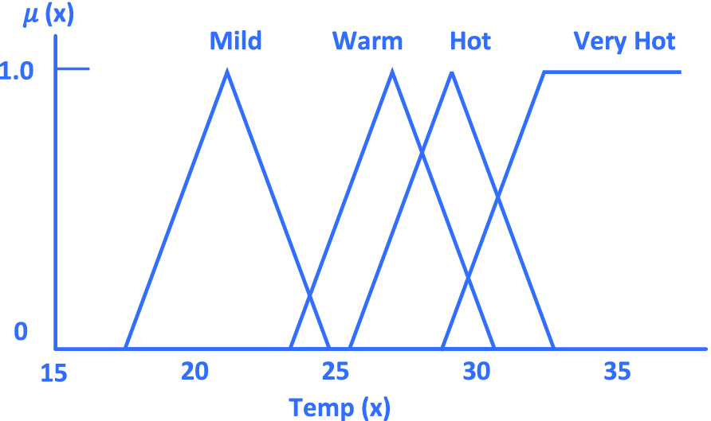 **Fig. 7.30. Fuzzy membership function oftemperature** 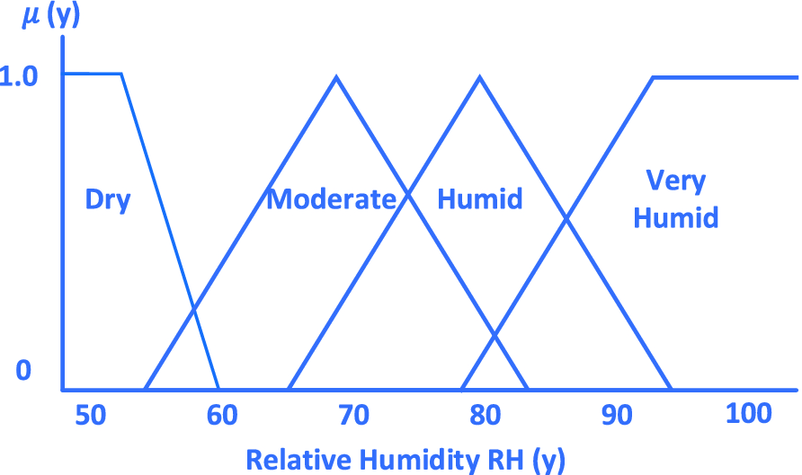 **Fig. 7.31. Fuzzy membership function ofrelative humidity** 

Suppose that the power setting of FACS has three different fuzzy states, given by

- Power = {Low, Medium, High}

with the membership function shown in Fig. 7.32. 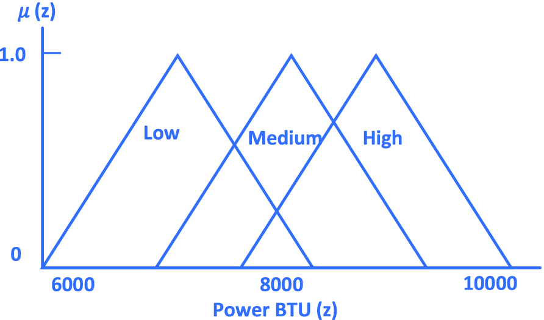 **Fig. 7.32. Fuzzy membership function ofpower** 

Assume this power switch is controlled by the following three fuzzy rules:

- Rule 1: If Temp is _very hot_ and RH is _very humid_ then switch to _high._

- Rule 2: If Temp is _hot_ and RH is _humid_ then switch to _medium._

- Rule 3: If Temp is _warm_ or RH is _moderate_ then switch to _low._

Figure 7.33 illustrates a conceptual diagram of a fuzzy logic air-conditioning system. 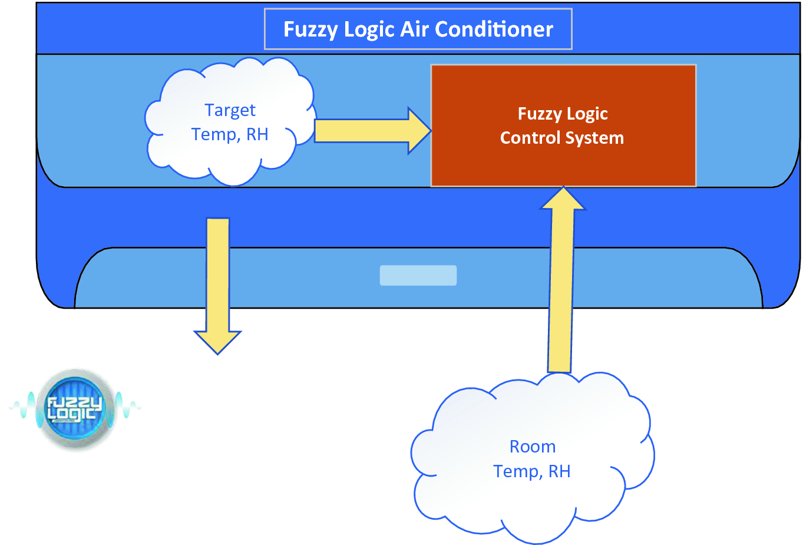 **Fig. 7.33. Conceptual diagram of fuzzy logic air-conditioning system** 

Now, given that the temperature is 30 °C and the relative humidity is 80%, the defuzzification schemes of the power by using the sup-min method and sup-product method are illustrated in Figs. 7.34 and 7.35. 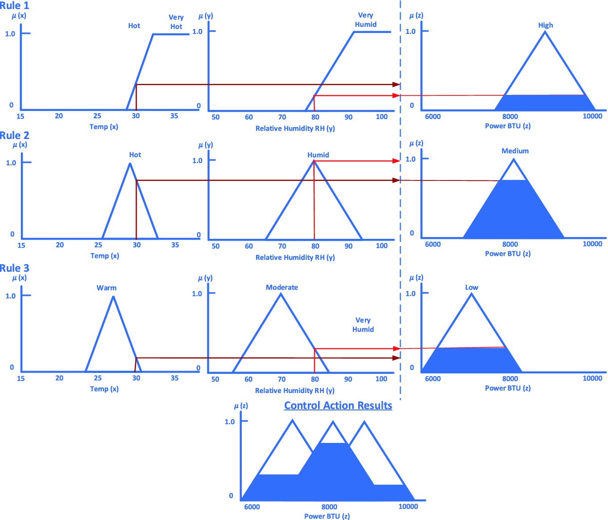 **Fig. 7.34. Fuzzy reasoning of FACS by using the sup-min method** 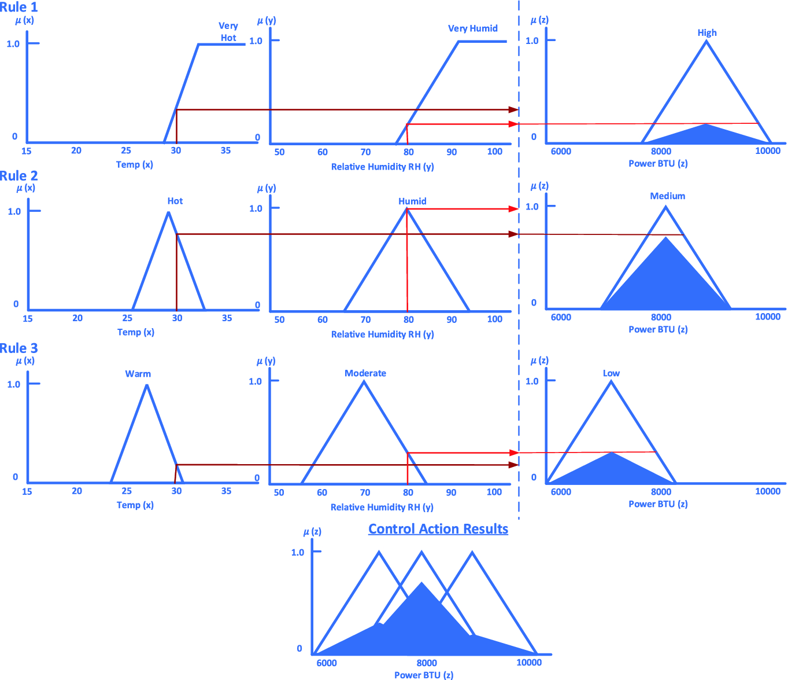 **Fig. 7.35. Fuzzy reasoning of FACS by using the sup-product method** 

### 7.4.10 Applications of Fuzzy Logic in Daily Life

Nowadays, fuzzy logic (FL) is widely adopted in many real-world applications ranging from fuzzy electronic appliances such as rice cookers, air conditioners, and washing machines as in Fig. 7.36 to sophisticated control systems such as robotics and fuzzy-based ABS (automatic braking systems).  **Fig. 7.36. Smart home with fuzzy logic electronic home appliances (Tuchong2019f)** 

In reality, many Japanese car manufacturers incorporate fuzzy systems for antilock braking, active suspension systems, automatic transmissions, and engine emission controls into their automobiles.

Fuzzy systems are easy to set up, typically require less processing power than alternative approaches and provide robust performance.

### 7.4.11 Fuzzy Expert Systems on Financial Trading

From the implementation point of view, current fuzzy logic is mainly integrated with other AI technologies in order to solve complex problems and produce more sophisticated and comprehensive systems (Lee 2006; Siler and Buckley 2004). This type of hybrid system integration technique is so-called “hybridization”.

Basically, there are two major kinds:

- Fuzzy expert systems (or fuzzy-ES for short) and

- Fuzzy-neuro systems.

_**Fuzzy Expert Systems on Financial Trading**_

Owing to the capability of fuzzy systems that can handle imprecise concepts and values, fuzzy logic has been widely used in many practical commercial and industrial applications. Fuzzy-ES focus on the integration of fuzzy with expert knowledge in classical expert systems.

When fuzzy logic applies in financial trading, a typical schematic diagram of a fuzzy expert system is required to incorporate a fuzzy knowledge base (KBS) together with the fuzzification of technical indicators, in order to drive expert advice and perform day trade.

Figure 7.37 illustrates the conceptual diagram of fuzzy expert systems on financial trading. 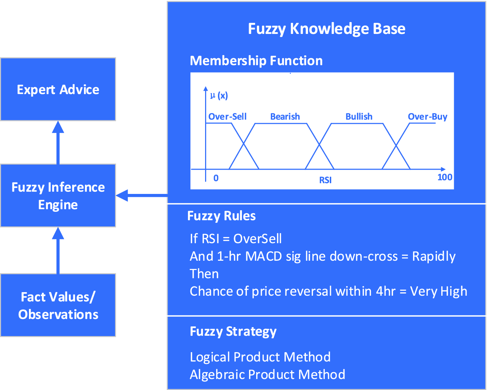 **Fig. 7.37. Conceptual diagram of fuzzy expert systems on financial trading** 

### 7.4.12 Fuzzy-neuro System in Quantum Finance

The major shortcoming of the fuzzy system is the lack of learning capability.

The design of fuzzy sets and the assignment of all fuzzy relations are done by system designers (or experts) without any way of acquiring membership functions and inference rules automatically.

To solve this problem, hybridization with other AI models that provide automatic machine learning such as neural networks—the so-called fuzzy-neuro systems were developed.

Nowadays, fuzzy-neuro systems are widely adopted for solving complex problems such as stock prediction, severe weather forecasting (e.g., rainstorm prediction), adaptive tracking systems (e.g., tropical cyclone (TC) tracking systems, missile tracking systems), robot vision, etc.

Figure 7.38 shows the integration of fuzzy logic with chaotic neural network for stock prediction, and we will study quantum finance advance applications in Chap. [12](<480082_1_En_12_Chapter.xhtml>). 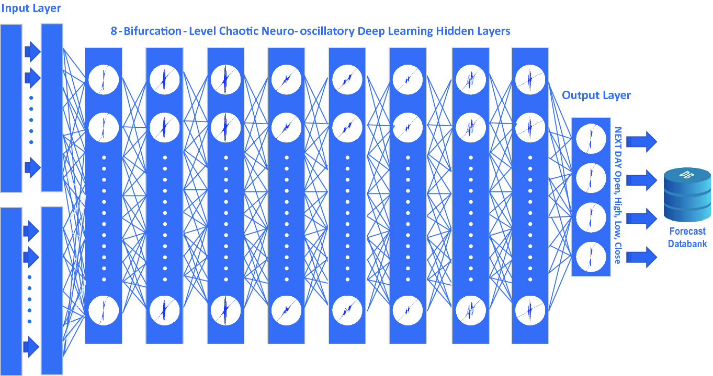 **Fig. 7.38. System architecture of chaotic type-2 fuzzy deep neural network for financial prediction (CT2TFDNN)** 

## 7.5 Conclusion 

In this chapter, we have learnt the basic concept of artificial intelligence, what it is and how it works.

We had also studied three major components of modern AI technology:

- Artificial neural networks,

- Genetic algorithms, and

- Fuzzy logic.

As mentioned, owing to the advancement of computer technology, the popularity of Internet technology along with social medium and mobile computing, the needs of AI and intelligent systems are more than anytime in this new era.

In fact, there are many new AI technologies, algorithms, techniques, and applications emerging on daily basis.

This chapter is only an introductory course for the path of AI.

The truth is: Different from other disciplines, AI is an integrated and cross-discipline doctrine ranging from neuroscience and visual psychology to quantum computing without any boundary. The only limitation is imagination and thoughts.

In next chapter, we will discuss two innovative AI technologies which are related to financial engineering, and also important components of quantum finance—chaos theory and fractals.

### Problems

1. 7.1

What is artificial intelligence (AI)? Give any three applications of AI in finance industry and explain how they work.

2. 7.2

What is Turing test? Discuss and explain how it works?

3. 7.3

What discipline of AI does Turing test focus on? Why such test is believed to be the best method to evaluate a machine (robot) is truly intelligence or not? Give a live example in daily human interactions and communication to support your explanation.

4. 7.4

John Searle in 1980 proposed a thought experiment so-called “Chinese room experiment” to challenge the validity of Turing test for the evaluation of machine intelligence. 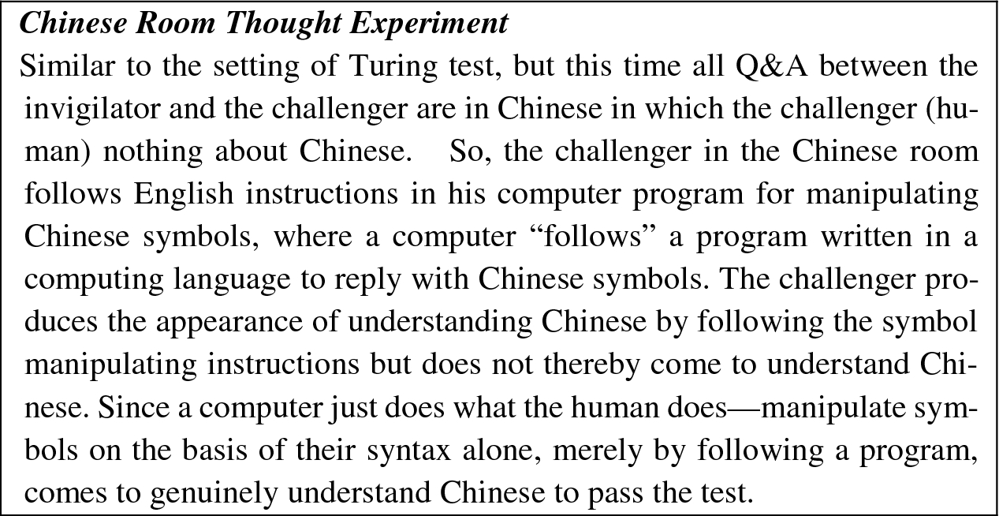 **** 

     1. (i)

What is the main argument of John Searle’s Chinese room experiment to challenge the validity of Turing test for the evaluation of machine intelligence in AI?

     2. (ii)

Does the argument and challenge by John Searle’s Chinese room experiment against Turing test is valid or not? Why?

5. 7.5

What is an _intelligent agent_ in AI? State and explain the three main difference between an intelligent agent versus traditional computer program (system)? Give two examples of how intelligent agents can be applied to finance.

6. 7.6

Discuss and explain the major differences between strong AI versus weak AI. Give two examples of strong AI and weak AI applications and explain how they work.

7. 7.7

In 1997, IBM Deep Blue defeated world chess champion Mr. Garry Kasparov. It is also the first time AI computer program defeat world chess champion.

     1. (i)

Why this is an important event and milestone in AI history? In other words, why chess playing with chess master is an important challenge in AI community?

     2. (ii)

In fact, IBM Deep Blue system at that time is a classical AI-based expert system tailored for chess playing. Discuss and explain what is an expert system. How it works?

     3. (iii)

However, after the world chess contest in 1997, Kasparov in the TV interview complained that it was not a fair game and not really a kind of human versus machine intelligence. What was his argument behind? Do you agree? How this event influences the future development of AI?

8. 7.8

Why was the past 20 years can be claimed as the second golden age of AI? and what kind of AI is focused on—strong AI or weak AI? What are the logics behind?

9. 7.9

State and explain the three main disciplines of weak (soft) AI. For each disciple, give one real-world application of soft AI and explain how it works.

10. 7.10

What is soft AI? Discuss and explain why soft AI is also known as cognitive approach (CA) AI technology. Name the major four soft AI technologies and briefly explain how they work.

11. 7.11

What is artificial neural network (ANN)? What is the main difference between ANN and contemporary computer system in terms of (1) memory storage and (2) machine learning and computational methods.

12. 7.12

What are integrate-and-fire operations in biological neural networks? Why it is important in machine learning? And how artificial neural networks model these operations?

13. 7.13

Describe and state the roles and importance of transfer function in typical artificial neural networks (ANNs). How can we model transfer function in traditional ANN?

14. 7.14

Describe and explain the major pros versus cons of using sigmoid function as transfer function in typical ANN. Give a real-time example in finance prediction to support your explanation.

15. 7.15

What is a multilayer feedforward backpropagation network (FFBPN)? Describe and explain how it works? State and explain two examples for the application of FFBPN in finance engineering.

16. 7.16

In a typical multilayer FFBPN, how can we determine the: (1) number of input and output nodes? (2) number of hidden layers and the number of neurons in each hidden layer?

17. 7.17

Describe and explain the three major categories of artificial neural networks (ANNs) in terms of machine learning technique. For each category of ANN, give one example of application in financial engineering and describe briefly how it works.

18. 7.18

In machine learning, pattern recognition and time series prediction are sides of the same coin. Discuss and explain why. Give an example in finance engineering to support your explanation.

19. 7.19

Programming exercise I

     1. (i)

Write the flowchart and system training algorithm of feedforward backpropagation network (FFBPN).

     2. (ii)

Write a MATLAB program to implement the FFBPN training algorithm by using the time series of any financial product (e.g., DJI) exported from MT4/R platform for short-term financial prediction.

     3. (iii)

First, using 5 days to predict next day open/high/low/close.

     4. (iv)

Second, using 10 days to predict next day open/high/low/close.

     5. (v)

Third, using 20 days to predict next day open/high/low/close.

     6. (vi)

Compare their performance in terms of (1) training performance and (2) forecast performance.

     7. (vii)

Which one is better? Why?

20. 7.20

Describe and explain what is genetic algorithm (GA)? What kind(s) of AI applications and problems GA tackles with? Why? Draw the flowchart of GA and explain how it works.

21. 7.21

What is the core idea and innovation of genetic algorithms (GA) in machine learning? Give two examples of how we can apply GA on finance engineering and hence quantum finance.

22. 7.22

Discuss and explain the roles and functions of crossover and mutations in GA. As compared with crossover, explain why mutation must keep at a much lower rate. What is the logic behind?

23. 7.23

State and explain two typical applications for the integration of ANN with GA in financial engineering.

24. 7.24

Discuss and explain the relationship between fuzzy logic and uncertainty principle in quantum theory. Use two financial markets as example to support your explanation.

25. 7.25

Discuss and explain how fuzzification process works in fuzzy logic? How can we apply fuzzification in financial engineering? Give two examples to support your explanation.

26. 7.26

State and discuss two main types of fuzzy expert systems. For each type of fuzzy expert system, give one potential application on (1) finance engineering and (2) quantum finance and explain how they work.

27. 7.27

Discuss and explain why the integration of fuzzy logic with artificial neural networks (or recurrent neural networks) is commonly used in AI applications. Give two examples of how fuzzy-neuro systems can be used in quantum finance.

28. 7.28

Programming exercise II

     1. (i)

Repeat 7.19, but this time using MQL to implement the FFBPN in MT4 platform.

     2. (ii)

For the input nodes, in addition to the time series information, add 10 commonly used technical indicator as input nodes, which include iAlligator (alligator oscillator), iMA (moving average), iBands (Bollinger bands), iMomentum (momentum indicator), iMACD (MACD oscillator), iRSI (RSI indicator), iRVI (RVI indicator), iStdDev (standard deviation indicator), iStochastic (stochastic oscillator), and iWPR (Williams’ percent range indicator).

     3. (iii)

Apply fuzzy logic to fuzzification of these 10 technical indices, using the fuzzification scheme for RSI discussed in this chapter as example.

     4. (iv)

Apply genetic algorithm (GA) to choose the TOP 5 technical indicators for live application.

     5. (v)

Implement this GA-based fuzzy-neuro network and compare its performance with the traditional FFBPN implemented in (i).

(Note: For detail training workshop on MQL, please visit [QFFC.​org](<http://QFFC.org>) official site.)
