# 8\. Chaos and Fractals in Quantum Finance

 _The theory of chaos and theory of fractals are separate but have very strong intersections. That is one part of chaos theory is geometrically expressed by fractal shapes._

Benoit Mandelbrot (1924–2010)

- _What is chaos theory?_

- _What are fractals?_

- _What is the relationship between chaos and fractals?_

- _How to apply chaos theory and fractals in quantum finance?_

In previous chapters, we have learnt the basic concepts of quantum theory.

Wave–particle duality—as the foundation and basics of quantum theory—relates to the nature of all fundamental particles (quantum particles) that exist in two kinds of dynamics— _particles_ (motions and dynamics) and _waves_ (energy field and patterns) can be narrated agreeably by Schrödinger equation.

In modern mathematics and computational physics, we also have two mathematical models that are agreeably analog to this unique phenomenon— _chaos_ and _fractals_ , like a coin with both sides, such as Professor Benoit Mandelbrot—the father of fractal said in his remarkable quotation.

More importantly, these two mathematical models have important implications in computational finance and modern AI, which are classified as a branch of computational intelligence (CI) and a major component in quantum finance model.

As mentioned in Chap. [1](<480082_1_En_1_Chapter.xhtml>), financial markets refer to a range from stock markets to cryptocurrency markets. If we look closely at their market dynamics, it is not difficult to discover that they exist in both _particle_ (market price movements) and _wave_ (market pattern movements) nature.

By applying numerical computation method in quantum finance Schrödinger equation (QFSE), we have successfully evaluated all the quantum energy levels (quantum price levels—QPLs).

So, can we model the _particle_ and _wave_ dynamics as well, without the need to solve the complex path integral formulation?

The answer is yes— _chaos_ and _fractals_.

## 8.1 Basic Concepts and Formulation on Chaos Theory 

### 8.1.1 The World of Nonlinear Dynamics

What is the nature of our world?

This problem has puzzled philosophers, scientists, poets, and scholars of various disciplines for centuries.

What is the importance of knowing the dynamics of all matter in the world (and universe)?

To understand this question, let us have a look at this topic of _dynamics_ which include the following:

- The dynamics of free-falling objects—governed by Newton’s laws of motion.

- The formation and dynamics of black holes—governed by Einstein’s theory of general relativity.

- The dynamics of subatomic particles such as neutrinos and positrons—governed by Heisenberg’s quantum mechanisms.

- The formation and dynamics of tropical cyclones, hurricanes, tornadoes, and earthquakes.

- The fluctuation of stocks.

- The chance of catching the bus this morning.

- The theory of causation.

- Our fate.

- Our future.

The fact is that this world of dynamics covers not only the _physical_ motion of matter in the universe, but also the _nonphysical_ occurrence of _events, notions, and ideas_.

Chaos theory is the study of such _dynamics_ , which is believed to be highly nonlinear—chaotic. In other words, if one wants to explore the nature of the dynamics governing matter (and notions) in the universe, one must _enter_ the world of chaos theory.

Figure 8.1 shows the famous analog in chaos theory—the _butterfly effect_ —the phrase was first coined by Professor Edward Lorenz (1917–2008) the father of chaos theory gave a talk at a scientific meeting in 1972 (Krishnamurthy 2015; Lorenz 1995) on his work regarding the chaotic phenomena found from his weather prediction model—the _Lorenz equations_. The phrase suggests that the flap of a butterfly’s wings in Africa could create a small change in the atmosphere that might eventually lead to a hurricane in Florida. The butterfly effect concept has become important in the finance world due to the continuous interdependence between capital markets subsequent to increased globalization of the world economy. The volatility of a minor sector at international markets can dilate rapidly and bleed into other markets. Broadened Internet access and technology improvements also contribute to episodes of extreme market volatility. 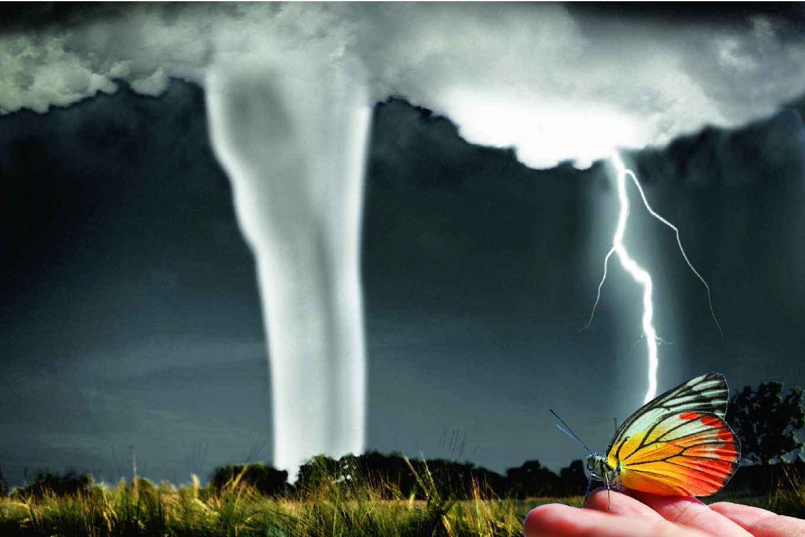 **Fig. 8.1. The butterfly effect in chaos theory** 

### 8.1.2 Deterministic World Versus Probabilistic World

As everything that happens in the world is highly _dynamical_ (or _chaotic_ , as we said) and uncertain, does this mean that chaos theory is a study of probability?

The answer is absolutely _not_.

The truth is: chaos theory has a basis that is entirely different from probability.

Although chaos theory is the study of the world of dynamics, it is not a world of uncertainty or a matter of chance.

Strictly speaking, chaos theory deals with the world of _determinism_ rather than _probabilism_.

Chaos theory maintains that all the dynamics in the world, no matter the complexities involved, can be (and must be) somehow modeled deterministically by certain chaotic motions. But whether we can find these chaotic motions is another question.

In fact, the formal name for chaos is _deterministic chaos_ in order to reflect this characteristic (Schuste and Just 2005; Lee 2005).

From the mathematical point of view, no matter the complexity of a physical phenomenon, the challenge of chaos theory is to model its _dynamics_ by a set of equations (of time) as follows:

In discrete format: $$\vec{{x_{t + 1} }} = \vec {f} \left( {\vec{{x_{t} }} } \right)$$ (8.1) where $\vec{{x_{t} }}$ is n-dim vectors (with n-variables) and $\vec {f}$ is its dynamics.

In continuous format: $$\dot{\vec {x} } = \vec {f} (\vec {x} ,t)$$ (8.2) where $\vec {x}$ is n-dim vectors of variable x and $\vec {f}$ is its dynamics.

Figure 8.2 shows the _Lorenz’s attractor_ and _butterfly effect_ —the second implementation of chaos theory, in which the chaos dynamics of classical Lorenz’s attractor resembles the flipping wings of a butterfly. 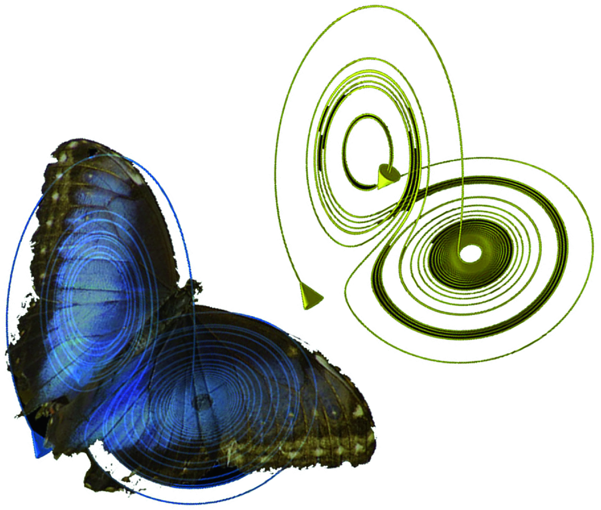 **Fig. 8.2. Lorenz attractor (upper right) and the butterfly flapping wings (lower left)** 

### 8.1.3 Chaotic Flow Versus Chaotic Maps

In chaos theory, the discrete chaotic motions are also called _chaotic maps_ , and the continuous motions are called _chaotic flows_.

From the physical point of view, the discrete maps can be regarded as taking _snapshots_ (or _cross sections_) of the continuous flow on a regular (or timely) basis as shown in Fig. 8.3. 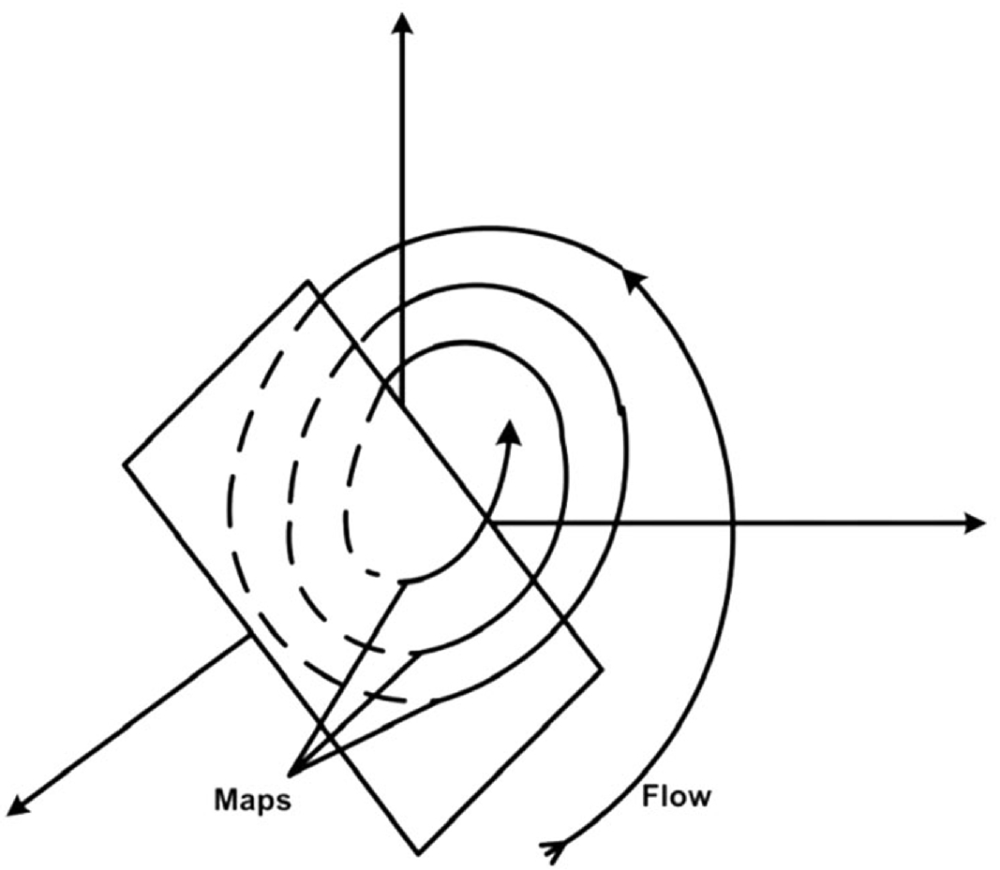 **Fig. 8.3. Chaotic flow versus chaotic map** 

What is the significance of the findings of maps and flows?

The answer is: It is extremely important!

For example, if the variables under consideration are weather elements such as air temperature or rainfall, and the time step (say for a discrete map) is 5 days, then if we can find such chaotic function(s), what we have really done is solving a weather forecasting problem!

Imagine if functions are used to model the next-day stock market or the 15-day financial pattern!

We can expect that what chaos theory is telling us is not something uncertain (or chaotic), but rather how to _identify_ the uncertain event in a chaotic way!

### 8.1.4 Origin of Chaos Theory—Lorenz Attractor

Chaotic phenomena—the first time they were noticed by scientists was in the late nineteenth century by Professor Henri Poincaré (1854–1912) during his exploration of planetary motions in 1886.

However, the major breakthrough in chaos theory was made by mathematician and research meteorologist Professor Edward Lorenz (1917–2008) during his experiment on a _miniature_ weather modeling system (Lorenz 1963), using three simple differential equations (the so-called _Lorenz equations_) instead of using complex statistical models which were commonly used by meteorologists at that time.

The Lorenz equations are $$\dot{x} = - \sigma x + \sigma y$$ (8.3a) $$\dot{y} = - xz + rx - y$$ (8.3b) $$\dot{z} = xy - bz$$ (8.3c) 

These equations were based on the fundamental _Navier_ – _Stokes equations_ of fluid dynamics, which describe weather formation as the fluid circulation of air upon distant heating by the sun.

In Lorenz equations, x is the fluid stream function, whose value is proportional to speed of motion of the fluid due to convection. y is proportional to the temperature gradient between rising and falling parts of the fluid at a given height—the so-called _horizontal flow_. z is proportional to the deviation from temperature linearity as a function of vertical position—the so-called _vertical flow_.

In such a highly simplified weather model, he unexpectedly discovered two important things about this nonlinear model:

1. The nature of dynamics for the system itself can be entirely altered with an adjustment in parameters. In his original work, he discovered that when parameters _σ_ and _b_ are set to 10 and 8/3, respectively, the entire system will turn out to be highly chaotic without any steady states (and limit cycles), whenever the _Rayleigh number_ (r) exceeds critical value of 24.74. In other words, all the solutions would evolve to be neither periodic nor convergent to any solution or equilibrium state.

2. The weather solution of this model, under such chaotic conditions, will be extremely sensitive to its initial conditions. In other words, within the chaotic region, only a very small deviation of initial conditions, say minor variations (or a _mistake_) in inputting the initial weather conditions (even of the order of 10−5), will result in an entirely different weather situation in the following days, as shown in Fig. 8.4.  **Fig. 8.4. Lorenz attractor (3D illustration)** 

Such discovery is essential to the scientific world because for any system with dynamic equations _y_ = _f_(_x_ , _a_), _where x is the variable and a is the parameter. Common sense_ tells us that only variable _x_ will change the dynamics of the system (that’s why we called it _variable_), the changes of parameter _a_ will only cause some minor changes of the overall system, the overall physical behavior of system will not be changed. Besides, traditional experimental science tells us that the overall experimental errors of a system (e.g., prediction system) should be proportional to the errors of variables. However, his discovery told us another story of reality. In which for some systems, just like Lorenz’s equations, if we change the parameters to certain range or values, the overall physical behavior and dynamics of the system will be changed entirely into what we called _deterministic chaos_ ; or _chaos systems_. In that situation, merely a very minor change on initial condition of the system will cause a huge difference of experimental results in future.

## 8.2 Characteristics of Chaotic Systems 

In summary, there are several features and characteristics that can be found in a typical chaotic system.

They are

1. sensitivity to initial condition;

2. highly nonlinear but deterministic in nature;

3. consisted of bifurcation points that lead to chaos; and

4. consisted of self-similarity and fractals.

### 8.2.1 Sensitive Dependence on Initial Conditions

It is one of the most remarkable features of chaotic system, but it alone does not mean that a system is chaotic, but every chaotic system must possess this property.

Dependence of initial conditions means that for a very slight change in initial conditions or measurements (observations) of a chaotic system, the result produced differ tremendously after exhibiting for a period of time.

People like to quote _butterfly effect_ to express such characteristics.

In layman’s term, it states that a butterfly wings’ flapping in Africa could result in hurricane in Florida.

Figure 8.5 illustrates the sensitivity to initial condition of Lorenz’s equation of two systems, one with x(0) = 1.00001 and the other with x(0) = 1.00000, given $\sigma = 10;r = 28;b = 8/3$. 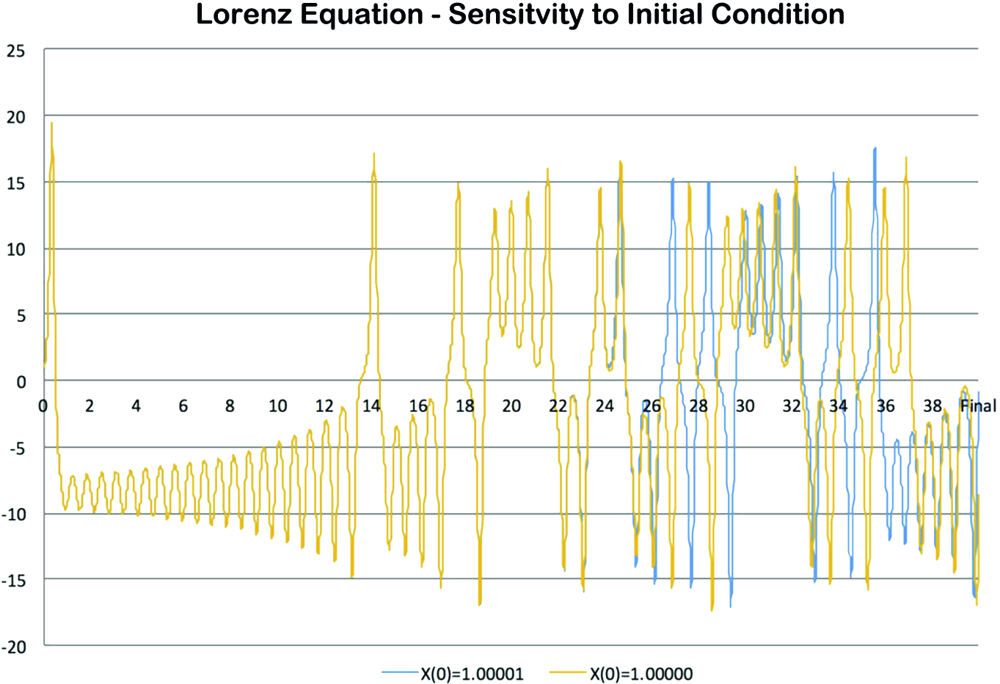 **Fig. 8.5. Lorenz’s equation—sensitivity to initial conditions** 

One should note that the sensitivity to initial conditions, although are very similar to the concept of _% errors of measurements_ in experimental physics, they are two totally different concepts.

In classical _% error of measurements_ problem, the resulted % errors of a dynamical system are normally proportional to the _degree_ -_of_ -_discrepancy_ for the measurement of observations. However, in chaos theory, the sensitivity dependence nature is unrelated to such discrepancy, it is the intrinsic nature of chaotic system itself.

### 8.2.2 Highly Nonlinear but Deterministic in Nature

Even though a slightest difference in initial conditions can reach extremely different results, all chaotic systems are _deterministic_ in nature.

_Deterministic_ means that _equal causes having equal effects_.

Or, from another viewpoint, _equal effects have equal causes_.

_Equal causes having equal effects_ means _predictability_. That is, given e1 is the effect of cause c1, if there is another cause c2 which is equal to c1, we can _predict_ that c2 will have an effect e2 equals to e1.

_Equal effects have equal causes_ means _reversibility_. That is, given e2 and e1 are two equal effects, if e1 is caused by c1, then we can say the cause c2 equals to c1 of e2. Figure 8.6 illustrates two time series: one is _deterministic chaos_ and the other is a _random walk_. As shown, although they look alike, however, they are totally different in terms of dynamics behavior. 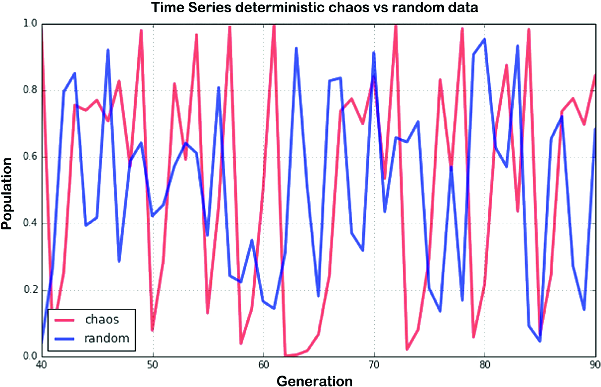 **Fig. 8.6. Deterministic chaos versus random walk** 

### 8.2.3 Bifurcation Phenomenon

Does it mean that only complex nonlinear equations such as the Lorenz equations have chaotic effect?

The answer is _no_.

As mentioned, chaotic phenomena are so common and usual that even simple nonlinear dynamics as in the logistic Eq. (8.4) can have this chaotic phenomenon. $$x_{t + 1} = rx_{t} \left( {1 - x_{t} } \right)$$ (8.4) 

Figure 8.7 depicts a typical bifurcation diagram for the logistic equation with control parameter r ranging from 0 to 4 (Kapitaniak 2000; Lee 2005). 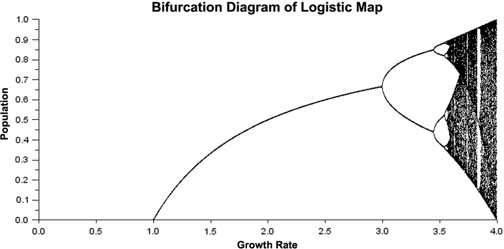 **Fig. 8.7. Bifurcation diagram of a logistic map** 

Bifurcation is a common phenomenon found in chaotic systems which indicates sudden, qualitative changes in the dynamics of the system under investigation either:

1. From one kind of periodic case (with limit cycle(s) and fixed point(s)) to another kind of periodic situation, such as the change in bifurcation of the logistic map from r = 3 (from one fixed point to two fixed points) or

2. From a periodic stage to a chaotic stage, such as dramatic changes in the dynamics of the logistic map for r increasing from 3.5 to 4.

### 8.2.4 Applications of Chaos Theory

Although chaos theory is rather new and its technology yet emerging, there are already numerous applications in various industries which adopted this innovative technology.

- consumer electronics,

- computer systems,

- health care,

- life sciences,

- engineering, and

- business and finance.

Table 8.1 summarizes the potential applications derived from this fascinating technology.

Table 8.1

Applications of chaos theory

Application areas| Potential applications  
---|---  
Consumer electronics (Chau and Wang 2011)| • Chaotic kerosene fan heater (Katayama 1993)• Chaotic dishwasher• Chaotic air conditioners• Chaotic mixer  
Computer systems| • Lee-associator for progressive memory recalling (Lee 2006)• Temporal pattern search (Davis 1990)• Chaotic mobile robot navigation (Sambas et al. 2016)• Chaotic network design and implementation (Soriano-Sanchez et al. 2018)• Chaotic cryptosystems (Lee 2005)  
Health care and life science| • EEG analysis of heart rhythms (Freeman 2001)• Chaos-aware defibrillator (Munakata 1998)• Chaotic brain wave analysis (Freeman 2001)  
Engineering (Kapitaniak 2000)| • Circuit stability analysis• Vibration control and study• Heat combustion  
Business and finance| • Fractal market pattern analysis (Mandelbrot 1997)• Financial prediction (Lee 2005; Kazem et al. 2013)• Market prediction (Peters 1994)  
  
### 8.2.5 Chaos Theory Versus Uncertainty Principle

In Chap. [7](<480082_1_En_7_Chapter.xhtml>), we have learnt the implication of Heisenberg’s uncertainty principle on fuzzy logic. In fact, the principle is also closely related to chaos theory.

Professor Heisenberg mentioned from his work _Physics and Philosophy_ (Heisenberg 2007) that:

_The Revolution in Modern Science, quantum mechanisms and the Uncertainty Principle should not be unusual or unique phenomena, but rather should be universal phenomena that exist in all matter (at the subatomic level)_.

If this is the case, the subatomic phenomena somehow might be coherent with chaos theory.

Taking weather forecasts as an example, we know that most of the international weather centers use numerical weather prediction (NWP) techniques to perform forecasts. For every single forecast, we need to know the so-called _boundary conditions_ , that is, grid-point weather observations include wet- and dry-bulb temperatures, mean sea-level pressure (MSLP), upper level wind speed and direction, and so on. According to chaos theory, slight differences (errors) in the measured values may result in completely different weather situations in the future.

Moreover, according to the Heisenberg’s uncertainty principle, it is quite _impossible_ for us to obtain 100% accuracy in measuring all different weather conditions at the same time.

The same situation applies to finance, uncertainty principle in quantum finance tells us that we cannot be 100% sure about the quantum finance pair: return $(r)$ and return-rate $(\dot{r})$ given by $$\Delta r \cdot \Delta \dot{r} \ge \hbar /2$$ (8.5) 

Does this really mean that we can never predict our future accuracy?

The answer is _yes_ and _no_.

_Yes,_ in the sense that if Heisenberg’s uncertainty principle is really true, we should have no way to “measure” the quantum variables for any chaotic system 100% correctly that will lead to tremendous deviation according to first rule of chaotic system.

_No,_ in the sense that although we cannot be 100% sure about the initial condition, we have one mathematical model that can help us to solve this forecast problem, one model that can predict the future without knowing the exact initial condition, which is

Neural network, time series neural network to be exact.

In the coming chapters on quantum finance application, we will study a special kind of neural network, so-called _chaotic neural oscillator_ , that can solve this problem agreeably with the integration of chaos theory and neural network in quantum finance prediction.

## 8.3 Fractals in Quantum Finance 

### 8.3.1 Fractal Versus Chaos—Two Sides of a Coin

The bifurcation diagram of logistic map learnt in last section also revealed other interesting phenomena of a typical chaotic system—namely, the existence of self-similarity in chaotic dynamics.

If we take a closer look at the bifurcation pattern in the first chaotic region (i.e., 3.5 < r < 4), we will discover that similar bifurcation patterns can be found within the original pattern, but in a smaller or scaled-down size. Figure 8.8 shows self-similarity between bifurcation at μ1, μ2, and μ3 with same pattern but decrease in scale to infinity. 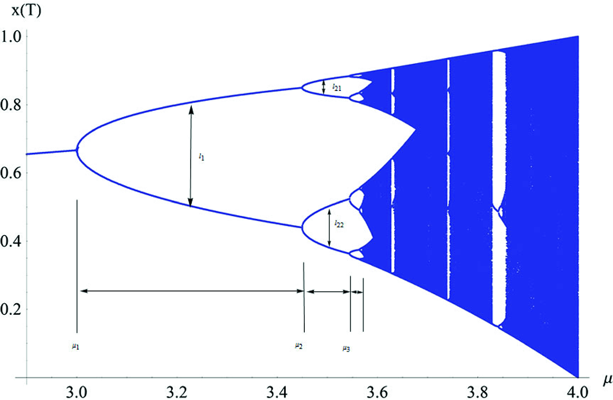 **Fig. 8.8. Self-similarity in logistic map** 

More surprisingly, if we continue to _zoom in_ to these bifurcation patterns, we will discover that they, in turn, contain even more scaled-down features with completely same shapes and patterns—what we called the _self_ -_similarity_ nature of chaotic systems.

Based on these interesting findings, a group of scientists established a new doctrine of applied mathematical geometry— _fractal geometry_ (or simply _fractals_).

In fact, fractals are the graphical (visual) presentations of chaos while chaos is the physical dynamics of fractals.

In this section, we will explore what fractals are, their formulations, and how they can be applied to quantum finance.

### 8.3.2 A Brief History of Fractals

The study of self-similarity in graphs and patterns is not a new thing. German polymath and philosopher Gottfried Leibniz (1646–1716) studied recursive self-similarity and used the term _fractional exponent_ to describe such phenomena.

In 1872, German mathematician Professor Karl Weierstrass (1815–1897) presented the first definition of a function with a graph that would be considered as fractal today.

In 1883, German mathematician Professor Georg Cantor (1845–1918) who attended lectures by Weierstrass, published examples of subsets of the real line known as _Cantor sets_ —one of the fundamental fractals.

At the same period, German mathematician Professor Felix Klein (1849–1925) and French mathematician Professor Henri Poincaré (1854–1912) introduced a category of fractal that has come to be called _self_ -_inverse fractals_.

In 1904, Swedish mathematician Professor Helge von Koch (1870–1924) extended Poincaré’s ideas and gave a more geometric definition of fractal geometric with famous fractal discovery known as the _Koch snowflake_.

By 1918, two French mathematicians, Professors Pierre Fatou (1878–1929) and Gaston Julia (1893–1978) discovered fractal behavior associated with mapping complex numbers and iterative functions leading to further ideas about _attractors_ and _repellers_.

In 1967, Professor Benoit Mandelbrot (1924–2010) published a paper about self-similarity: _How Long Is the Coast of Britain?_ (Mandelbrot 1967) aroused public interests in fractal geometry in nature. Later in 1985, he published the remarkable work in _New Scientist: Fractals_ — _Geometry Between Dimensions_ and coined the term _fractals_ and illustrated his mathematical definition with striking computer-constructed visualizations—the _Mandelbrot set_ (Mandelbrot 1982). 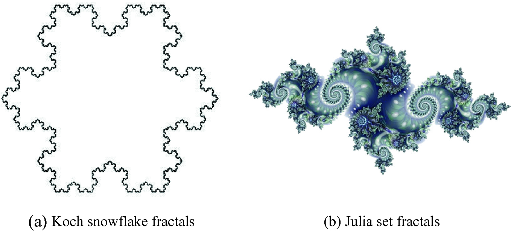 **Fig. 8.9. Koch snowflake and Julia set fractals** 

Figure 8.9a and b illustrates the _Koch snowflake fractals_ and _Julia set fractals,_ respectively. 

### 8.3.3 Self-similarity in Mandelbrot Set Fractals

Four main properties of fractals are as follows:

- self-similarity;

- simple but non-differentiable;

- fractal dimension; and

- one-to-many, many-to-one.

Figure 8.10a–c shows the self-similarity of Mandelbrot set fractals under different scales. 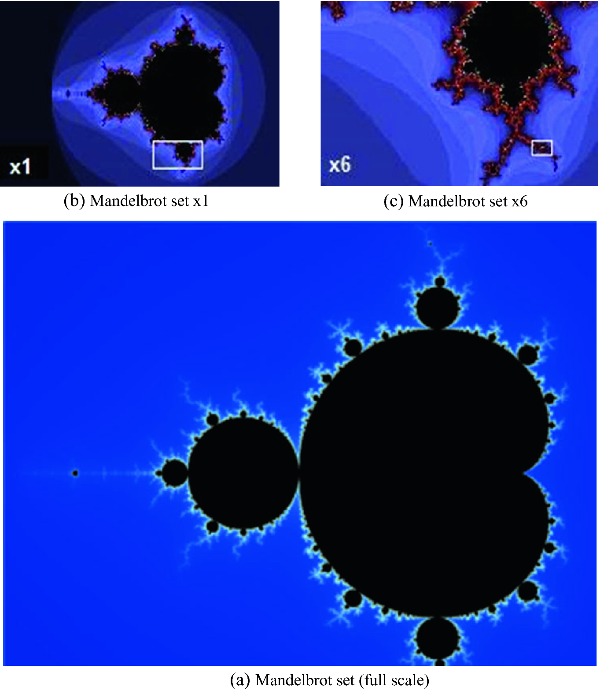 **Fig. 8.10. Mandelbrot set fractals (self-similarity under different scales)** 

The Mandelbrot set is the set of c values in the complex plane for which the orbit of $z_{0} = 0$ under iteration of the quadratic map remain bounded: $$z_{n + 1} = z_{n} + c,c \in M \Leftrightarrow {\text{lim sup}}_{n \to \infty } \left| {z_{n + 1} } \right| \le 2$$ (8.6) 

That is, a complex number c is part of the Mandelbrot set if and only if when starting with ${\text{z}}_{0} = 0$, and applying the iteration repeatedly, the absolute value of ${\text{z}}_{\text{n}}$ remains bounded by a number, say, 2.

If c = 1, it will give the sequence 0, 1, 2, 5, 26, …, which tends to infinity. As this sequence is unbounded, 1 is not an element of the Mandelbrot set.

If c = −1 gives the sequence 0, −1, 0, −1, 0, …, which is bounded, and so −1 belongs to the Mandelbrot set.

By using this simple method, we can construct 2D Mandelbrot fractals by plotting all possible c with x–y-axis as the real–imaginary components (1 belongs to Mandelbrot, whereas 0 does not belong).

### 8.3.4 Fractal Dimension

A fractal dimension is a ratio providing a statistical index of complexity comparing how detail in a pattern (fractal pattern) changes with the scale at which it is measured.

Counter-intuitive is that a fractal dimension does not have to be an integer.

The essential idea of _fractured_ dimensions has a long history in mathematics, but the term itself was brought to the fore by Professor Benoit Mandelbrot based on his 1967 paper on self-similarity in which he discussed fractional dimensions. 

The concept of a fractal dimension rests in unconventional views of scaling and dimension. 

For example, in traditional (discrete) dimension, given N is the number of sticks, $\varepsilon$ is the scaling factor, and D is the dimension, using _box_ -_counting_ technique, we have (Fig. 8.11) 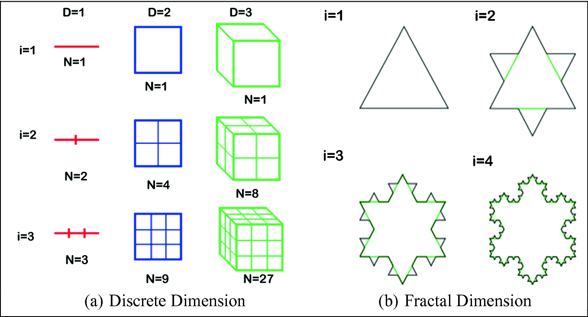 **Fig. 8.11. Discrete versus fractal dimension** $$N = \frac{1}{{\varepsilon^{D} }}\quad {\text{or}}\quad D = - \log (N)/{ \log }(\varepsilon )$$ (8.7) 

As shown in Fig. 8.12, when 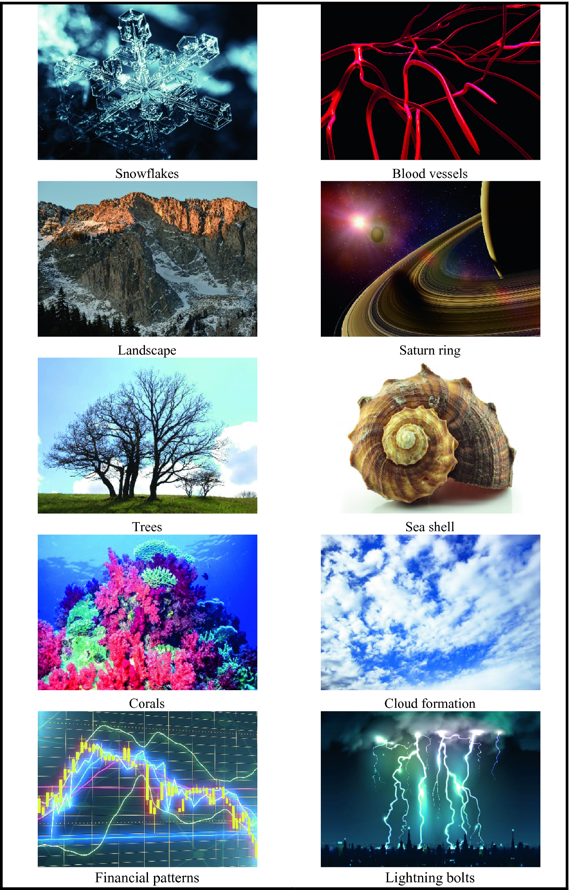 **Fig. 8.12. Fractals in nature (Tuchong2019a,b,c,d,e,f,g,h,i,j)** 

$\varepsilon = 1/3$, N = 27 => D = 3.

Using this method to calculate the fractal dimension of Koch fractal, we have

For i = 2:

$D_{koch} = \frac{ - \log (N)}{\log (\varepsilon )} = \frac{{ - { \log }(4)}}{{{ \log }\left( {\frac{1}{3}} \right)}} = 1.261859507$ 

Similarly, $D_{koch} = \frac{{ - { \log }(16)}}{{{ \log }\left( {\frac{1}{9}} \right)}} = 1.261859507$

### 8.3.5 Natural Phenomena with Fractal Features

How many natural phenomena can be found in fractals?

The answer is … many.

It is similar to the golden ratio on computational finance mentioned in Chap. [6](<480082_1_En_6_Chapter.xhtml>), fractals can be found anywhere in Mother Nature.

• Algae| • Blood vessels| • Brain waves  
---|---|---  
• Brownian motions| • Cloud formation| • Corals  
• Coastlines| • DNA and RNA| • Crystals  
• Financial patterns| • Heartbeats| • Lightning bolts  
• River networks| • Mountain ranges| • Sand and soil  
• Seashells| • Snowflakes| • Saturn rings  
• Trees and branches| • Turbulent flows| • Tornadoes and hurricanes  
  
Why?

The answer is obvious, if we are clever enough ….

Let’s come back to our old friend … quantum theory and subatomic world

Such one-to-many and many-to-one phenomena not only trigger modern graphics and CGI such as the fantasy in sci-fi motion pictures, but also …

Worlds of simulation ….!

## 8.4 Applications of Chaos Theory and Fractals in Quantum Finance 

### 8.4.1 Chaos Theory in Quantum Finance

Owing to the chaotic property of financial market, chaos theory becomes one of the hottest topics in financial engineering, especially on financial prediction.

In the second part of this book, we will study quantum finance application on worldwide financial prediction, explore how to integrate QPL; chaos theory, and neural oscillators for real-time financial prediction.

Figure 8.13 shows a snapshot of the chaotic deep neural network for time series financial prediction. 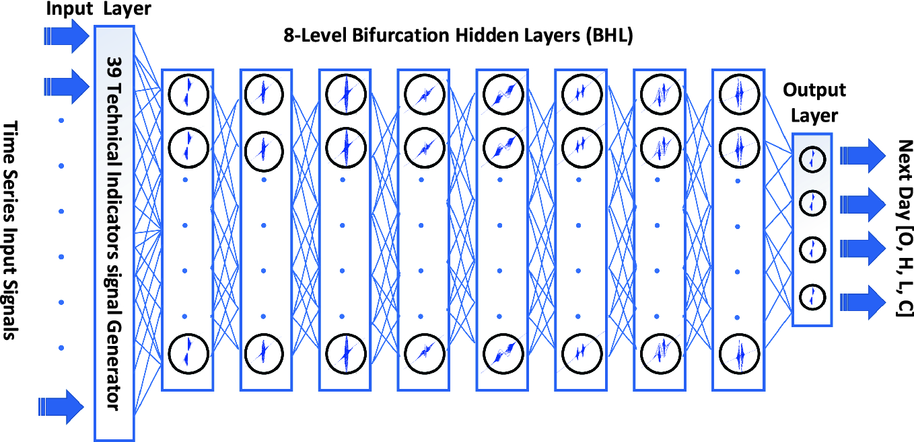 **Fig. 8.13. System architecture of CDNOMS chaotic deep supervised-learning (CDSL) network for time series financial prediction** 

### 8.4.2 Fractal Finance

Self-similarity and recursive property of fractals led to active study application in finance engineering since late 1980s.

As said, although fractals can generate very complex pattern, the interesting thing is, it can be (should be) originated from very simple pattern (equation).

Let’s review a simple example of how fractals can be applied to technical finance.

In the most fundamental case, basic financial fractals are composed of five or more bars as shown in Fig. 8.14. 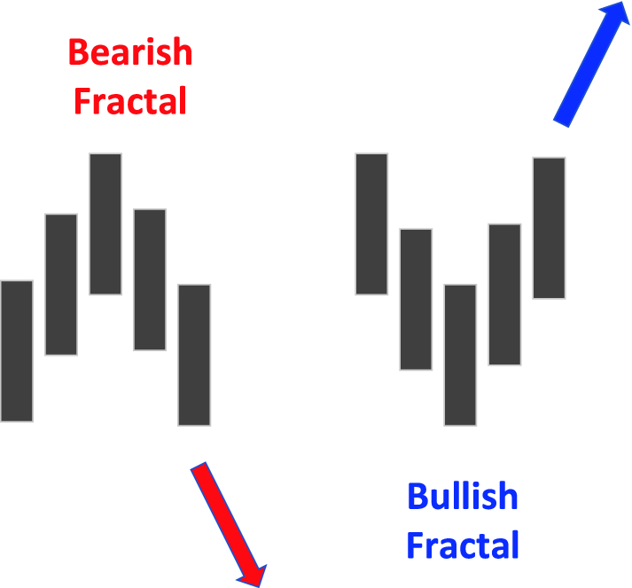 **Fig. 8.14. Bearish versus bullish fractals** 

The rules for identifying fractals are as follows:

1. A bearish turning point occurs when there is a pattern with the highest high in the middle and two lower highs on each side.

2. A bullish turning point occurs when there is a pattern with the lowest low in the middle and two higher lows on each side.

Actually, in standard MT platform, MQL already provides such indicator _iFractal_ s for real-time detection of bearish/bullish fractals.

Fractals are best used in conjunction with other indicators or forms of analysis such as alligators or MAs.

Figure 8.15 shows a long-term uptrend with price staying predominantly above the alligator’s teeth (middle moving average). Since the trend is up, bullish signals can be used to generate buy signals. 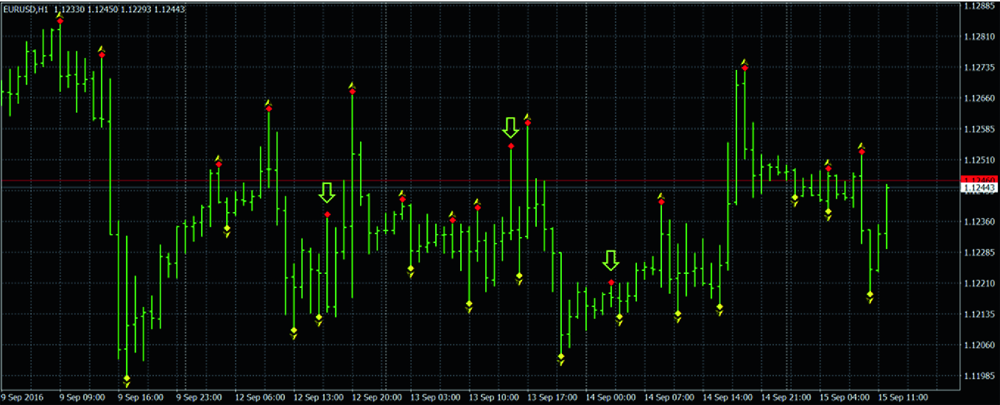 **Fig. 8.15. Fractals in financial pattern** 

In addition to identify buying and selling signals, can we use fractals to forecast financial market, say, stock markets?

The answer is yes!

Current research in financial forecast using fractals in two directions:

1. Integration of fractals (as technical signals) with chaotic neural network for financial prediction and

2. Simulation of multidimensional market pattern by fractal equations, if one may do this. We can probably predict the future. Why?

## 8.5 Conclusion 

In this chapter, we have learnt chaos and fractals—the two contemporary mathematical models with vast application on nonlinear dynamics and financial engineering.

As mentioned, chaos and fractals are sides of the same coin. They show us two ways of looking (modeling) the world’s dynamics and all physical phenomena.

Just like the particle–wave duality in quantum theory, we are talking about the same scenario in different (mathematical) languages.

But if we look at them from different perspective, chaos and fractals, in fact, can be considered as mathematical (and hence computational) way to describe the particle–wave duality in terms of nonlinear equations, which is totally coherent with our computational model of quantum finance and price level (QPL) evaluation to form an important component of quantum finance.

In fact, the entire _puzzle_ of quantum finance is almost complete, but with one piece of component—how to integrate chaos theory into neural network for chaotic modeling of financial time series?

In next chapter, we will study the last component of quantum finance—chaotic neural oscillator.

### Problems

1. 8.1

Why scientists always say chaos and fractals are two sides of the same coin? What is the logic behind it? Use two financial markets as examples to support your explanation.

2. 8.2

What is the meaning of deterministic chaos? Is it equivalent to random event? Why or Why not?

3. 8.3

What kind of systems or phenomena in nature are categories as chaotic systems? State five examples and explain why they are considered as chaotic systems.

4. 8.4

What is the relationship between chaotic flow versus chaotic map?

5. 8.5

What is butterfly effect in chaos theory? Can we find any examples of such phenomena in finance industry? Please give three typical examples of finance and explain how they work.

6. 8.6

Programing Exercise I—Lorenz attractor

     1. (i)

Write a MATLAB program to implement the Lorenz attractor by using the three Lorenz Eqs. (8.3a–8.3c);

     2. (ii)

Plot the 3D plot of the butterfly effect, as below.

     3. (iii)

What are the key parameters and their values in Lorenz equation in order to generate the 3D chart of butterfly effect in chaos?

     4. (iv)

Explain why such findings are important in the modeling of complex systems such as the modeling of weather or financial markets.

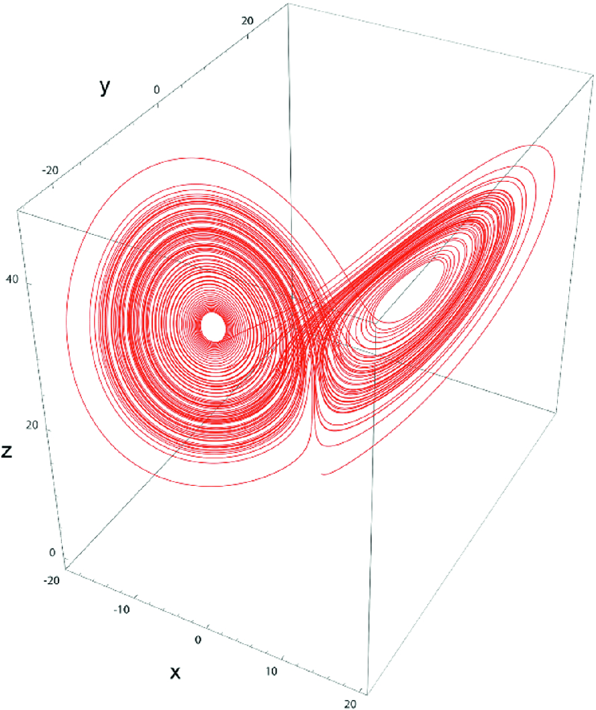 **** 

7. 8.7

State and explain the four major characteristics of chaotic systems. Use financial market such as forex market to explain these four characteristics in financial engineering.

8. 8.8

Programming exercise II—sensitivity to initial conditions of Lorenz system

     1. (i)

First, implement the MATLAB system in 8.6.

     2. (ii)

Make a very minor change of initial condition x say (a minor difference of 0.00001 of x), plot the result with the x-axis as time step and Y-axis as future value. See what happen.

     3. (iii)

Change the initial conditions of y and z and check the results.

     4. (iv)

Any interesting findings and explain why.

9. 8.9

What is bifurcation phenomenon in chaos theory? What is the importance of bifurcation in a complex system?

10. 8.10

Programming exercise III—logistic equation

     1. (i)

Write a MATLAB program to implement the logistic map using Eq. (8.4).

     2. (ii)

Plot the logistic map for x between 0 and 4.0, see whether you can obtain the result below.  **** 

     3. (iii)

Locate all the bifurcation zones.

     4. (iv)

What is the implication and importance for the discovery of chaotic phenomena and bifurcation zones in this simple logistic map equation?

11. 8.11

State any five applications of chaos theory in consumer electronics and health care. Explain how they work.

12. 8.12

State three applications of chaos theory in finance industry and explain how they work.

13. 8.13

What is the relationship between chaos theory and Heisenberg’s uncertainty principle in quantum theory? And discuss how such findings are important to quantum finance.

14. 8.14

What are fractals? State any five examples of fractals in nature.

15. 8.15

Programming Exercise III—fractals

     1. (i)

Write MATLAB programs to implement: (1) Koch snowflake fractals; (2) Julia set fractals; and (3) Mandelbrot set fractals.

     2. (ii)

What are the main properties and characteristics of fractals?

     3. (iii)

Calculate the fractal dimension for these three fractals.

16. 8.16

Programming exercise IV—fractals in MQL

     1. (i)

State and explain fractals in MQL.

     2. (ii)

In order to implement fractals in MQL, at least one other technical indicator is needed. What is this technical indicator? How it works.

     3. (iii)

Write a simple trading program using MQL on three financial products: (1) Dow Jones Index (DJI); forex product such as AUDCAD; gold or silver (i.e., XAUUSD or XAGUSD).

     4. (iv)

Compare their trading performances.

     5. (v)

State and design how can we integrate quantum finance with this fractal-based trading program.

     6. (vi)

Implement this hybrid system and compare it with fractal-based trading system.
