# 9\. Chaotic Neural Networks in Quantum Finance

 _If we look at the way the universe behaves, quantum mechanics gives us fundamental, unavoidable indeterminacy, so that alternative histories of the universe can be assigned probability_.

Murray Gell-Mann (1929–2019)

- _What would happen if time stopped?_

- _Would they like movies and TV shows: everything freezes when time stopped?_

In 1952, Professor Erwin Schrödinger addressed at a lecture with a witty remark to his audience what he was about to say might “seem lunatic” (Fig. 9.1).  **Fig. 9.1. What would happen if time stopped? (Tuchong2019a)** 

He stated that when his equations seemed to narrate several different histories, these were _not alternatives, but all really happen simultaneously_ —as we are now so-called _parallel universe_ /_multiverse theory_. The author was really and truly, enticed by this statement to take up theoretical physics especially on quantum mechanics and general relativity courses at Hong Kong University in 1986–89.

Current _cosmology_ (_superstring and M_ -_theory_) even tells us that we live in one of the many so-called _realities_ , as Professor Murray Gell-Mann, Nobel Prize winner for physics in 1969 mentioned in his famous quotation.

More importantly, is that all of these are coexisting realities and vibrating in different frequencies.

If we are clever enough, we should realize why Professor Schrödinger said so.

If it is true. If the entire universe with everything inside it is under continuous vibrations and oscillations in every single moment. If why we can percept the reality and our surroundings is because of these continuous vibrations and oscillations between our sensory organs and the external world—which means when time is really stopped, everything is stopped; or should it be rather disappeared and/or cannot be precepted instead?

In this chapter, we will study an interesting topic—chaotic neural oscillators in quantum finance. First, we will explore the quantum world of chaotic oscillation from the multiverse in quantum theory, chaos in the brain to our sensory of oscillations. Next, we will review chaotic neural oscillators, neuroscience motivation, Wang-oscillators, and the author’s latest research on Lee-oscillators; its neural dynamics and applications. After that, we will study quantum finance oscillators (QFO) using Lee-oscillators and different application of QFO in quantum finance including quantum financial prediction using chaotic neural networks, chaotic deep neural networks, and chaotic intelligent multiagent-based trading systems.

## 9.1 Quantum World of Chaotic Oscillation 

### 9.1.1 Multiverse and Quantum Theory

Cosmologist Professor Max Tegmark has provided a taxonomy of universes beyond the familiar observable universe (Tegmark 2014). In Tegmark’s chaotic inflation theory— _bubble universes_ in Fig. 9.2—every disk represents a bubble universe. 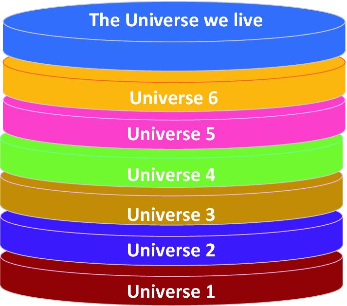 **Fig. 9.2. Illustration of Tegmark’s bubble universe** 

According to Tegmark’s bubble universe theory, our universe is just one of the many disks of universes. Universes 1–6 represent bubble universes. Five of them have different physical constants than our universe.

The four levels of the multiverse are the following:

1. Level I: an extension of our universe

2. Level II: universes with different physical constants

3. Level III: many-worlds interpretation of quantum mechanics

4. Level IV: ultimate ensemble.

Related to the many-worlds idea were originated from Professor Richard Feynman’s multiple histories theory, who used the theory to explain the existence of infinite path integrals of realities.

### 9.1.2 Chaos in Brain—Brainwave

Current neuroscience tells us that oscillations can not only be found in the physical world but also can be found at the core of our body—our brain.

If one takes a closer look at neural dynamics in our brain—the original of neural networks: What triggers the entire neural dynamics?

The stimulus, maybe, but how?

Current neurophysiology also tells us that all neurons in our brain exist in the state of _oscillations_ , _chaotic oscillation_ to be exact.

It is that such oscillations trigger the entire _thinking_ and _learning_ processes.

The oscillations of these neurons within our brain are collectively called _brain waves_ in layman’s terms as shown in Fig. 9.3. 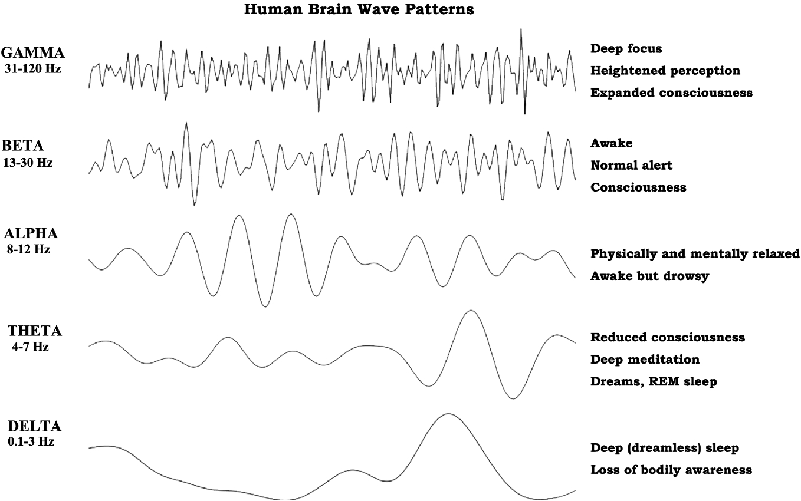 **Fig. 9.3. Illustration of human brain waves patterns** 

- Awake, conscious state—beta wave

- Insight and peak focus conscious state—gamma wave

- Relaxed, calm, lucid dream (but not thinking)—alpha wave

- REM dream state, deep relaxation and mediation—theta wave

- Deep, dreamless sleep—delta wave.

In fact, not only from our brain, chaotic oscillations can be easily found in the human body including our five senses:

- eye (sight)—visual nerves;

- nose (smell)—olfactory nerves;

- ear (sound)—auditory nerves;

- tongue (taste)—gustatory nerves;

- skin (touch)—somatosensory nerves;

- our heartbeats and others.

## 9.2 Chaotic Neural Oscillators 

### 9.2.1 An Introduction

We learnt from Chap. [7](<480082_1_En_7_Chapter.xhtml>) that classical artificial neural networks, ANN in Fig. 9.4 are composed of simple artificial neurons that emulate biological neural activities. 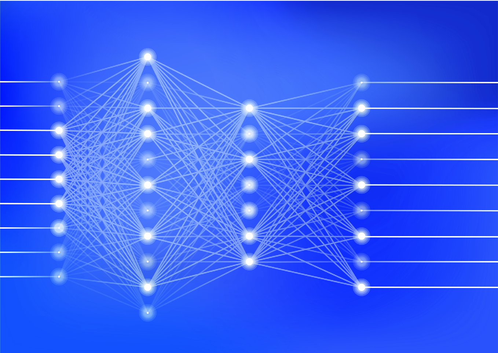 **Fig. 9.4. Artificial neural networks (Tuchong2019b)** 

These kinds of neural models have been strongly criticized as being far simpler than real neural models.

The latest studies in neuroscience and neurophysiology have examined such issues as functional properties of the hippocampus, neural activities in pyloric CPG (central pattern generator) of the lobster, and other human brain activities. For instance, hippocampus—a major component of the brain as shown in Fig. 9.5, plays important roles in the consolidation of information from short-term to long-term memory, and in spatial memory that enables navigation. 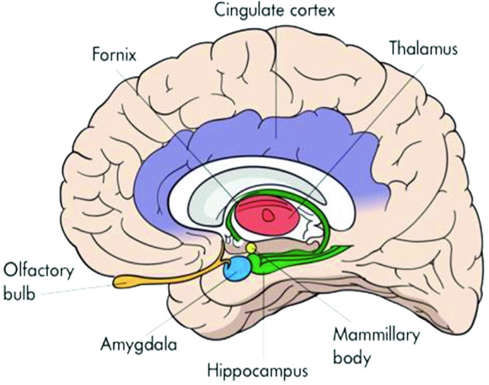 **Fig. 9.5. Hippocampus of human brain** 

In Alzheimer’s disease, the hippocampus is one of the first regions of the brain to suffer damage with short-term memory loss and disorientation. Studies have provided strong evidence of chaotic neural activities in these complex neural behaviors.

Researchers have also proposed various chaotic neural models over the past decades. Latest research include: chaotic oscillators proposed by Falcke et al. (2000) to model pyloric CPG neurons, cortical networks proposed by Hoshino et al. (2003) for recalling LTM (long-term memory), TCNN (transient chaotic neural network) proposed by Chen and Aihara (1995) for handling combinational optimization problems, and Zhou’s work (Zhou and Chen 2000) based on chaotic annealing technique for dynamic pattern retrieval.

### 9.2.2 Wang-Oscillator—The Structure

Most of the contemporary neural oscillators that developed theoretically from Wilson–Cowan model are focused on the time-continuous framework, which is in fact too complex for network modeling, let alone for actual computer implementation on actual applications.

Wang (1991) in his Ph.D. thesis, proposed a simple time-discrete neural oscillator model (namely, the Wang-oscillator).

Figure 9.6 shows the neural structure of Wang-oscillator. 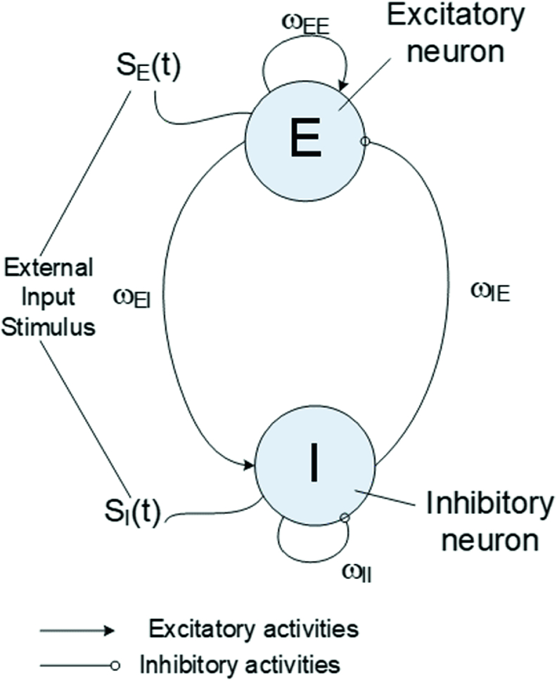 **Fig. 9.6. Wang-oscillator** 

Unlike its continuous model counterpart, the Wang-oscillator provided simple but remarkable neural dynamics ranging from fixed points (through quasi-periodicity) to chaos, as revealed by its bifurcation diagram.

This bifurcation diagram can be used as computational elements (called the BTU—bifurcation transfer unit) to replace traditional _sigmoid function_ for temporal information processing.

The Wang-oscillator is a neural oscillatory model consisting of two neurons, one _excitatory_ and one _inhibitory_ neuron.

Just like biological neurons, the excitatory neurons _promote_ chances of neural _firing_ while the inhibitory neurons _hinder_ neural activities.

Together, they form a simple but powerful _oscillatory couple_.

In Wang-oscillator, the time-discrete neural dynamics are given by $${\text{E}}\left( {{\text{t}} + 1} \right) = Sig\left[ {\omega_{EE} \cdot E\left( t \right) - \omega_{EI} \cdot I\left( t \right) + S_{E} \left( t \right) - \xi_{E} } \right]$$ (9.1) $${\text{I}}\left( {{\text{t}} + 1} \right) = Sig\left[ {\omega_{IE} \cdot E\left( t \right) - \omega_{II} \cdot I\left( t \right) + S_{I} \left( t \right) - \xi_{I} } \right]$$ (9.2) $${\text{W}}\left( {\text{t}} \right) = E\left( t \right) - I\left( t \right)$$ (9.3) where SE and SI are input stimulus; ω are weights; ξE and ξI are threshold values; the sigmoid function Sig() is given by $${\text{Sig}}\left( k \right) = \frac{1}{1 + e^{-k}}$$ (9.4) 

One important finding of Wang-oscillator is the bifurcation behavior of Wang-oscillator with the variation of input stimulus I.

### 9.2.3 Wang-Oscillator—Bifurcation Diagram

Figure 9.7 shows the bifurcation diagram of Wang-oscillator. 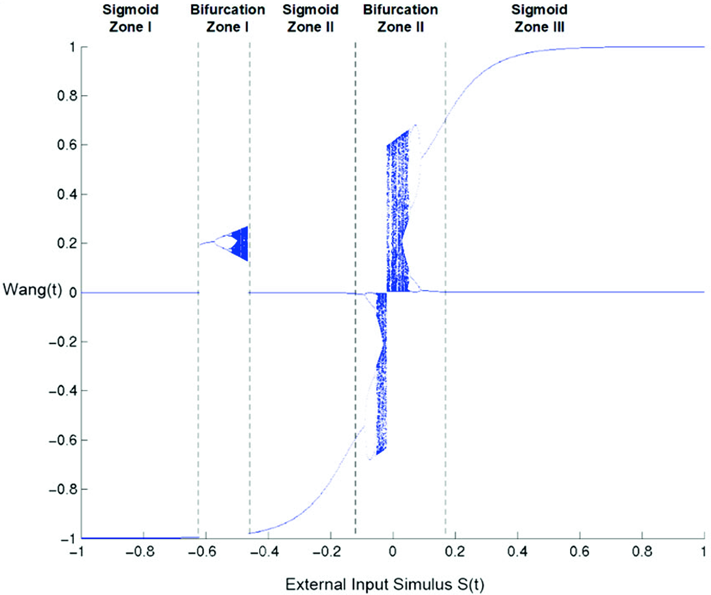 **Fig. 9.7. Bifurcation diagram of Wang-oscillator** 

As shown, the bifurcation diagram of a typical Wang-oscillator consists of _sigmoid_ and _bifurcation zones_.

The original idea is that the _sigmoid zone_ imitates the classical sigmoid function and _bifurcation zone_ imitates the chaotic property of a complex system during the sigmoid-transition period.

However, there are two intrinsic problems:

1. The existence of an extra _bifurcation zone I_ destructs the continuity of sigmoid curve in the initial period;

2. _The bifurcation zone II_ is “too chaotic” to model the chaotic-transition region in real-world problems.

A more transient progressive growth in terms of neural dynamics is needed to be achieved.

### 9.2.4 Wang-Oscillator—Major Contributions and Limitations

One important finding and contribution of Wang-oscillator is the property of change in neural dynamics according to the input stimulus.

In most classical neural network models for information encoding and association (e.g., Hopfield Network), the network model can be generalized as a nonlinear function operator which, based on various input stimuli, alters its internal states and _fires_ output according to the nonlinear transfer function.

The Wang-oscillator, on the other hand, encodes information (i.e., the input stimulus) and gives responses by altering the behavior of neural dynamics (from chaotic states to sigmoid growth), which is totally consistent with the latest findings on how the brain processes information (Freeman 2000, 2008, 2013). 

However, the Wang-oscillator has several major limitations in the bifurcation behavior of the model, preventing it from being used as an effective BTU or temporal information processing model.

As mentioned previously, the _undesirable_ chaotic region exists in _bifurcation zone I_ which not only affects the continuity of the BTU but also violates the original function of BTU, namely that of stimulating the temporal information processing for the brain.

So, we need to look for a _total solution_.

## 9.3 Lee-Oscillator 

### 9.3.1 The Motivation

After over 5 years of research and testing, the author created an ideal chaotic neural oscillator, now known as _Lee_ -_oscillator_ in 2004 and published in two major neural network journals _IEEE Transactions on Neural Networks_ (Lee 2004) for the introduction of _Lee_ -_oscillator_ and its transient chaotic behavior; and _Journal of Neural Networks_ (Lee 2006) for the exploration of _Lee_ -_oscillator_ on progressive memory recalling capability in visual psychology.

Different from _Wang_ -_oscillator_ , _Lee_ -_oscillator_ successfully emulates the transient chaotic progressive growth in its neural dynamics, which helps to shed light on acting as a perfect CTU to model complex and chaotic problems.

Figure 9.8 shows the neural structure of Lee-oscillator. 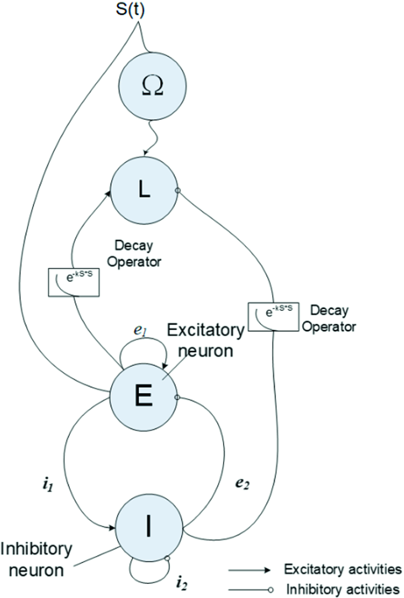 **Fig. 9.8. Lee-oscillator** 

Basically, Lee-oscillator consists of 4 neural elements: E, I, Ω, and L, which corresponds to _excitatory_ , _inhibitory_ , _input,_ and _output_ neurons.

The neural dynamics are given by $${\text{E}}\left( {{\text{t}} + 1} \right) = Sig\left[ {e_{1} \cdot E\left( t \right) - e_{2} \cdot I\left( t \right) + S\left( t \right) - \xi_{E} } \right]$$ (9.5) $${\text{I}}\left( {{\text{t}} + 1} \right) = Sig\left[ {i_{1} \cdot E\left( t \right) - i_{2} \cdot I\left( t \right) - \xi_{I} } \right]$$ (9.6) $$\Omega \left( {{\text{t}} + 1} \right) = Sig\left[ {S\left( t \right)} \right]$$ (9.7) $${\text{L}}\left( {\text{t}} \right) = \left[ {E\left( t \right) - I\left( t \right)} \right] \cdot e^{{ - kS^{2} \left( t \right)}} +\Omega \left( t \right)$$ (9.8) where e1, e2, i1, and i2 are weights; ξE and ξI are threshold values and S(t) is an external input stimulus.

The bifurcation diagram of Lee-oscillator is illustrated in Fig. 9.9. 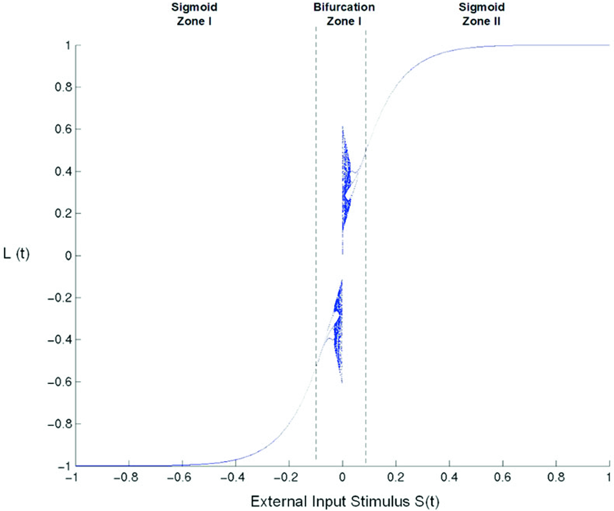 **Fig. 9.9. Bifurcation diagram of Lee-oscillator** 

### 9.3.2 Lee-Oscillator—Bifurcation Diagram

Unlike _Wang_ -_oscillator_ , the _Lee_ -_oscillator_ bifurcation diagram in Fig. 9.9 is composed of three main regions, _sigmoid zones I and II_ and single _bifurcation zone I_.

From neural dynamics point of view, _sigmoid zones I and II_ denote sigmoid-shape region, which corresponds to nonchaotic neural activities in the oscillators; and _bifurcation zone I_ is _hysteresis_ region; which corresponds to the area of chaotic behavior that results when a weak external input stimulus is received.

Such neural dynamics can be perfectly served as _chaotic transfer unit_ (CTU) to model complex and chaotic systems such as severe weather prediction, complex scene analysis, and real-time financial prediction such as quantum finance.

### 9.3.3 Lee-Oscillator—Potential Applications

Potential applications of _Lee_ -_oscillator_ include the following:

1. Basic chaotic neural elements for temporal information processing

     * Fundamentally, information processing is the overall process of encoding, recognizing, and discriminating various types of information (e.g., images, patterns, etc.).

     * Since a single Lee-oscillator can provide a two-state transient chaotic attraction from input space, it is suitable to serve as the basic element for the information processing unit for quantum computing.

     * In addition, owing to its unique chaotic features where neural dynamics change with variations in the input signal, the Lee-oscillator provides a good analog for simulating chaotic and temporal information processing behavior in brain science (Freeman 2000, 2008; Malsburg 1995; Fernandes and Malsburg 2015).

2. Transient chaotic auto-associator

     * As an extension and generalization of using Lee-oscillators for information processing, a two-dimensional (2D) layer of Lee-oscillators can be adopted as a pattern associator (Lee 2006).

     * As an analog of the classical _Hopfield Network_ (Hopfield 1984) as an auto-associator, a transient chaotic autoassociative network based on Lee-oscillators as its constituting neuron elements can be used to provide an innovative progressive memory association and recalling scheme (Lee 2004; 2006) to expand how human can recall memory and to explain an important phenomena—Gestalt psychology.

3. Chaotic neural oscillatory units for advanced applications

     * In fact, Lee-oscillators can be adopted and integrated with each other to form a complex chaotic neural oscillatory model to tackle problems such as scene analyses, robot vision, navigation, and of course, real-time financial prediction in quantum finance.

     * We will study this in detail in Part II of this book.

## 9.4 Quantum Finance Oscillators (QFO) 

### 9.4.1 The Concept

In Chap. [2](<480082_1_En_2_Chapter.xhtml>), quantum field theory, we mentioned that the quantum world can be modeled as quantum oscillators, influenced and oscillating like a ball over a trampoline as shown in Fig. 9.10a. 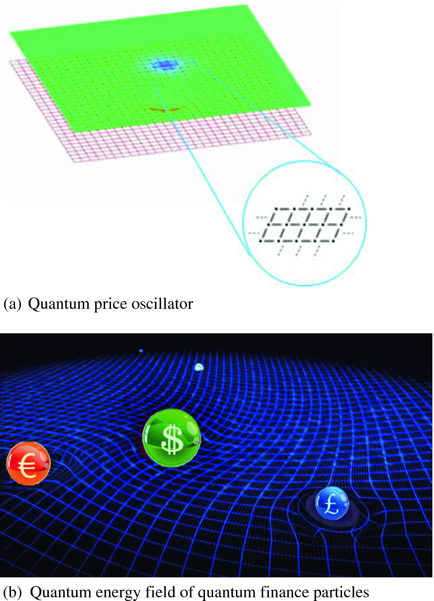 **Fig. 9.10. Quantum finance oscillators (QFO)** 

So, in terms of quantum finance, it is natural to analog the dynamic of every financial market as quantum oscillations of quantum financial particles influenced by quantum energy (price) field as shown in Fig. 9.10b.

But instead of simple quantum harmonic oscillators, we are talking about quantum anharmonic oscillator counterparts.

Such notion, in fact, is totally equivalent and coherent with our modeling of quantum dynamics as quantum anharmonic oscillations studied in Chap. [4](<480082_1_En_4_Chapter.xhtml>).

These quantum anharmonic oscillators are known as _quantum finance oscillators (OFO)_.

### 9.4.2 The Model

One of the most direct adoptions of the chaotic oscillator is the introduction of quantum finance oscillator—QFO by the replacement of Lee-oscillator with financial particle.

Figure 9.11 shows a typical USDX (USD Index) QFO model in the forex market. 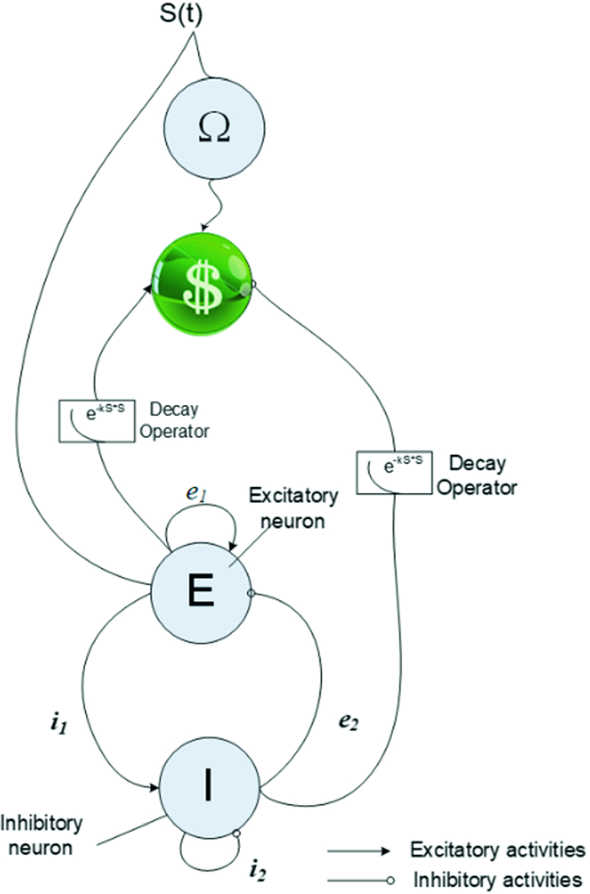 **Fig. 9.11. Quantum finance oscillator model** 

The neural dynamics is given by $${\text{E}}\left( {{\text{t}} + 1} \right) = Sig\left[ {e_{1} \cdot E\left( t \right) - e_{2} \cdot I\left( t \right) + S\left( t \right) - \xi_{E} } \right]$$ (9.5) $${\text{I}}\left( {{\text{t}} + 1} \right) = Sig\left[ {i_{1} \cdot E\left( t \right) - i_{2} \cdot I\left( t \right) - \xi_{I} } \right]$$ (9.6) $$\Omega \left( {{\text{t}} + 1} \right) = Sig\left[ {S\left( t \right)} \right]$$ (9.7) $$\left. {\text{QFO}} \right|_{USDX} \left( {\text{t}} \right) = \left[ {E\left( t \right) - I\left( t \right)} \right] \cdot e^{{ - kS^{2} \left( t \right)}} +\Omega \left( t \right)$$ (9.9) 

By using the same interpretation, practically speaking we can model any financial market using QFOs and investigate the chaotic oscillation dynamics of these financial markets.

More importantly, such modeling technique can be integrated with AI tools and technologies mentioned in Chap. [7](<480082_1_En_7_Chapter.xhtml>) to complex and highly chaotic phenomena, financial fluctuation in particular.

## 9.5 Applications of QFO in Quantum Finance 

### 9.5.1 The Concept

In Chaps. [7](<480082_1_En_7_Chapter.xhtml>) and [8](<480082_1_En_8_Chapter.xhtml>), we have learnt 3 basic AI tools/technologies that include the following:

- artificial neural network (ANN),

- fuzzy logic and fuzzy logic systems (FLS),

- genetic algorithms (GA),

- chaos theory, and

- fractals.

In fact, QFO (quantum finance oscillators) can be integrated into all these tools/technologies to tackle highly complex and chaotic phenomena—financial markets and forex markets in particular.

This section will study some typical QFO applications in quantum finance applications.

They are the following:

- QFO for real-time financial prediction using chaotic neural networks,

- chaotic fuzzy-neuro oscillators—quantum finance signals (QFS),

- chaotic deep neural networks in quantum finance, and

- chaotic multiagent trading system (Fig. 9.12). 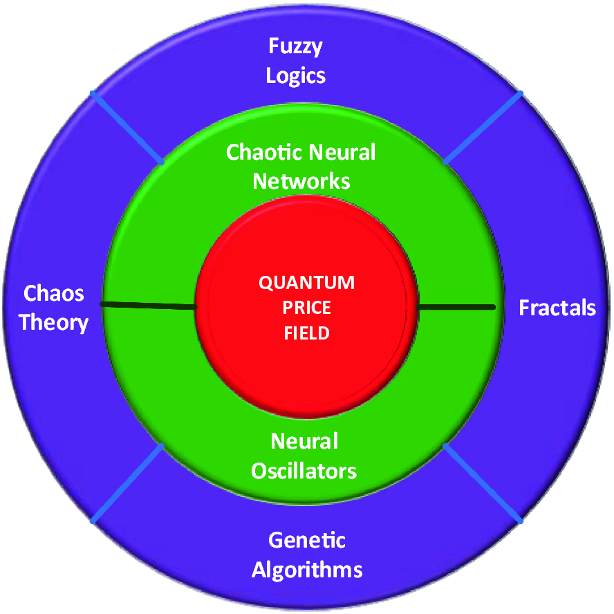 **Fig. 9.12. Concentric sphere model of quantum finance** 

### 9.5.2 QFO for Real-Time Financial Prediction Using Chaotic Neural Networks

As a direct adoption in artificial neural networks, QFO can be directly integrated with classical neural networks such as feedforward backpropagation networks (FFBPN) by replacing all simple neurons in input/hidden/output layers by Lee-oscillations.

By doing so, technically speaking, we convert a simple neural network system into a multilayer chaotic neural network as shown in Fig. 9.13. 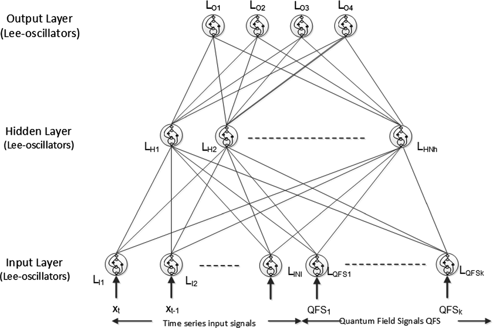 **Fig. 9.13. QFO for real-time financial prediction using chaotic neural networks** 

In the figure, two inputs types (time series input signals and technical index signals) are replaced by Lee-oscillators.

From neural dynamics point of view, such changes bring (1) chaotic oscillation dynamics during network training; (2) chaotic bifurcation transfer function (CBTF) into forecast system to resolve the network training _deadlock_ and _trapped by local minimum_ problems which usually occur during network training of highly complex patterns (e.g., financial patterns) using classical FFPBN.

Detail implementation will be studied in Chap. [11](<480082_1_En_11_Chapter.xhtml>).

### 9.5.3 Chaotic Fuzzy-neuro Oscillators—Quantum Finance Signals (QFS)

In Chap. [7](<480082_1_En_7_Chapter.xhtml>), we have studied fuzzy logic (FL) and fuzzy logic system (FLS).

A simple fuzzy logic membership function (also known as _type_ -_1 fuzzy logic_) of financial technical signal (RSI) is shown in Fig. 9.14a. 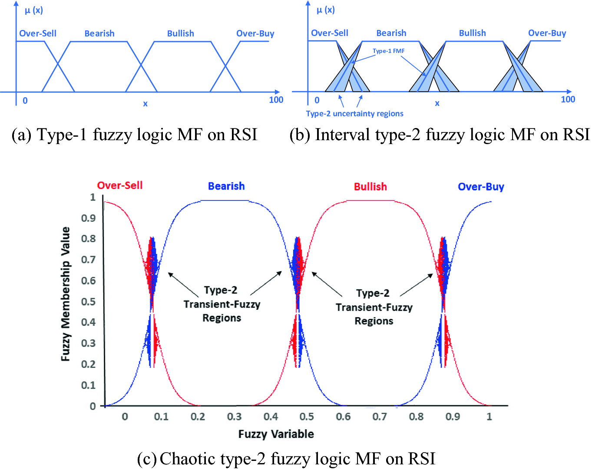 **Fig. 9.14. Chaotic fuzzy-neuro oscillators—quantum finance signals** 

Different from _type_ -_1 FL_ , a _type_ -_2 FL_ provides a higher degree of fuzziness by the adoption of _second_ -_tier fuzziness_ in overlapping regions of the primary fuzzy membership function.

Figure 9.14b shows a typical so-called _interval type_ -_2 MF f_ or RSI.

By QFO adoption, we technically can generate a chaotic overlapping region for any technical financial signals—quantum finance signals (QFS).

Figure 9.14c shows a typical chaotic type-2 fuzzy logic MF (membership function) for RSI QFO.

Detailed implementation will be studied in Chap. [12](<480082_1_En_12_Chapter.xhtml>).

### 9.5.4 Chaotic Deep Neural Networks in Quantum Finance

Latest neuroscience research discovered that neural dynamics for memory recall and learning existed as the so-called _retrograding signaling (RS)_ , a kind of delayed and feedback mechanisms of information processing.

Such an important finding leads to the latest development of LORS (LEE-oscillators with Retrograde Signals).

Between 2012 and 2017, the author had categorized 8 major types of LORS bifurcation signals (LORS#0-#7), which corresponded to 8 different kinds of chaotic bifurcations and neural dynamics.

More importantly, such findings can be adopted to DNN (deep neural network) technology for the conversion of single hidden layer FFBPN into CDNN (chaotic deep neural networks) with 8-level bifurcation hidden layers (BHL).

Figure 9.15 shows the system architecture of CDNN on quantum finance. Detail implementation will be studied in Chap. [12](<480082_1_En_12_Chapter.xhtml>). 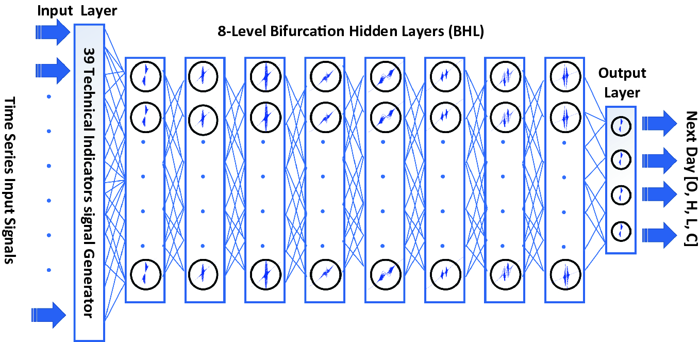 **Fig. 9.15. Chaotic deep neural networks in quantum finance** 

### 9.5.5 Chaotic Multiagent Trading System

Neural networks can be used in _supervised learning (SL)_ such as financial prediction, it can also be used on _unsupervised learning (UL)_ and _reinforcement learning (RL)_ as we learnt from Chap. [7](<480082_1_En_7_Chapter.xhtml>).

A multiagent financial trading system is a typical reinforcement-learning problem in which there are no well-defined output/target pairs in a typical SL system, e.g., financial forecast.

All we have (and need to do) is to _optimize_ the net-profit (or returns) at (fixed) period of time and _minimize_ the potential risks.

In that case, we can make use of reinforcement-learning (RL) neural networks such as actor-critic (AC) RBF-based RLN.

Again, by replacing simple neurons in the RBF-layer of the AC-RBFN, we technically convert this RLN into chaotic AC-RBFN which can significantly improve the RL efficiency.

Figure 9.16 shows the system architecture of chaotic AC RBF-based RLN. 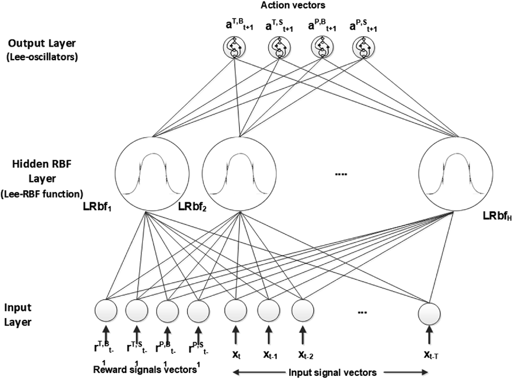 **Fig. 9.16. Chaotic multiagent-based trading system** 

Detail implementation will be studied in Chap. [13](<480082_1_En_13_Chapter.xhtml>).

## 9.6 Conclusion 

In this chapter, we have learnt the basic theory of chaotic neural oscillators.

Also, we have learnt how to integrate chaotic neural oscillators (Lee-oscillator) to effectively convert a typical neural network into chaotic neural networks to handle highly complex and chaotic phenomena—quantum finance in particular.

As we can see, chaotic neural oscillators can be adopted into almost any AI tools and technologies to improve efficiency and performance.

How can we do that?

As mentioned, all these various kinds of AI tools and technologies are just different tools and methods to model and handle real-world problems, finance in our case, which is highly complex and chaotic in nature.

More importantly, when we mentioned a (financial) market is highly chaotic or fuzzy in nature, we are just _seeing_ (_modeling_ in technical perspective) the problem with a particular _perspective_ , the problem never changes itself.

Just like we are talking about the particle–wave duality property of financial market in quantum finance.

The financial market always _as it is_ , we are just using different _angles_ and _perspectives_ to observe and investigate it.

In Part II of this book, we will study four major applications of quantum finance in financial prediction and intelligent trading systems.

### Problems

1. 9.1

Discuss and explain why Schrödinger in his 1952 lecture interpreted the quantum events such as Schrödinger’s cat as different coexisting realities instead of different alternative events, and what such notion is critical and related to Heisenberg’s uncertainty principle.

2. 9.2

Based on the brain waves shown in Fig. 9.3, please discuss and explain why our _perception of time_ is different in various brain wave states, and how it can be related to the understanding of time in: (1) human perception; and (2) financial markets.

3. 9.3

If all human sensory schemes are products of sensory oscillators and their interactions with neural networks in the brain, is it possible to have what we called _sensory interchange_ in theoretical perspective? And what is its implication?

4. 9.4

What is the importance of converting a traditional artificial neural network (ANN) into chaotic neural networks in terms of (1) network training; and (2) network performance?

5. 9.5

What are the physical evidence and explanations for the existence of chaotic neural dynamics in humans? And how such discoveries are vital to the future development of AI and intelligent systems?

6. 9.6

Based on Eqs. (9.1)–(9.4) and Eqs. (9.5)–(9.8), write two MATLAB programs to plot the normalized bifurcation diagrams of Wang-oscillator and Lee-oscillator (i.e., input and output in the range of [0 … 1]) and discuss how Lee-oscillator can be used to convert ANY artificial neural networks (ANN) or recurrent neural networks (RNN) into chaotic neural networks (CNN). 

7. 9.7

In both Wang-oscillator and Lee-oscillator, there are excitatory and inhibitory neurons in their neural models. Discuss and explain the biological and mathematical meanings of these neurons in a typical chaotic neural network, as compared with traditional ANN.

8. 9.8

For the modeling of forex market (say AUDCAD) using quantum finance oscillator (QFO):

     1. (i)

Draw the quantum finance oscillator model of QFO|AUDCAD.

     2. (ii)

Write down the formulation of QFO|AUDCAD.

     3. (iii)

What are the physical meanings of excitatory (E), inhibitory (I), and input stimulus (S) in QFO|AUDCAD model?

     4. (iv)

Discuss how QFO|AUDCAD can be integrated with chaotic neural networks for (1) short-term forex price prediction; (2) long-term trend pattern recognition.

9. 9.9

Programming Exercise I (bifurcation diagrams of Lee-oscillator and Wang-oscillator)

Below MATLAB program implements the Wang-oscillator and generates its bifurcation diagram. 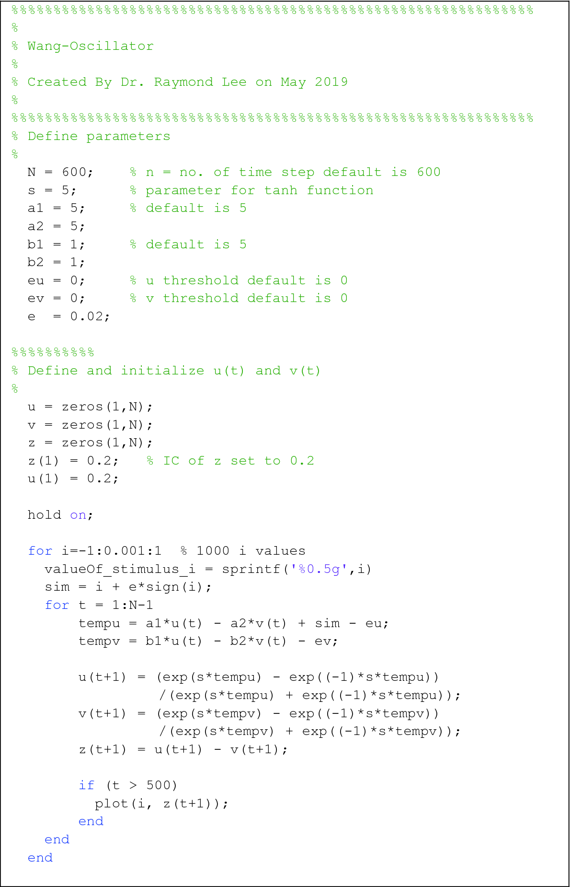 **** 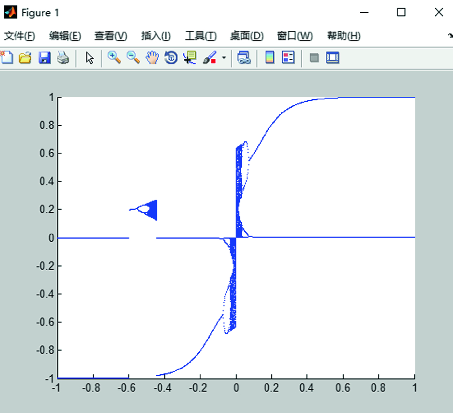 **** 

1. (i)

Copy this program script into MATLAB and run the program, you should see the bifurcation diagram as above.

2. (ii)

As shown in the MATLAB code, we only plot the output z when t > 500\. Why?

3. (iii)

Modify this MATLAB to implement the Lee-oscillator using Eqs. (9.5)–(9.8). You should obtain the below bifurcation diagram.

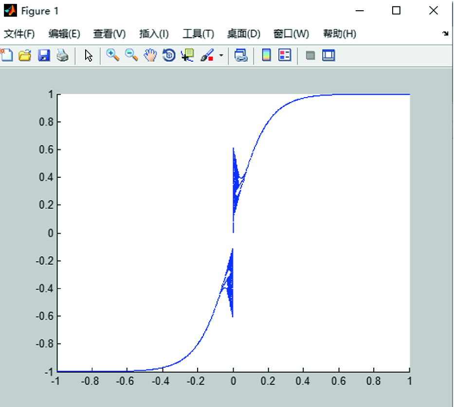 **** 

1. (iv)

From the bifurcation diagram of Lee-oscillator, identify the sigmoid zone and the bifurcation zone.

2. (v)

As shown in the bifurcation diagram, the x-axis and y-axis are both between [−1 … +1]. Modify the MATLAB program to convert the bifurcation diagram of Lee-oscillator to _Lee chaotic transfer function (LCTF)_ with normalized value between [0 … 1], as shown in the below figure.

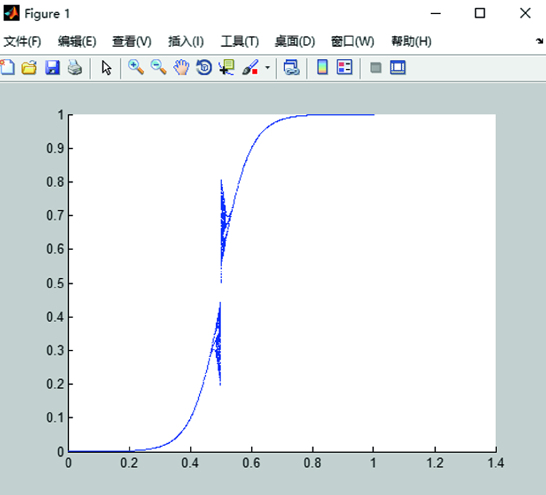 **** 

1. (vi)

Modify the MATLAB program by creating a 2-D array Lee() which contains the output values of Lee-oscillator for 1000 values of i between [1 … 1] and 100 time-step values of Lee-oscillator between 500–600. The definition of Lee() array as shown below:

Lee = zeros(1001,100);

2. (vii)

Store the LCTF-Lee() table array into a CSV data file for later use.

1. 9.10

Programming exercise II

     1. (i)

Start with 7.28 with the implementation of MQL-based FFPBN for the next-day forecast of at least 5 Forex products (e.g., AUDCAD, USDCAD, GBPUSD, USDJPY, EURUSD, etc.).

     2. (ii)

Implement the MATLAB program in 9.16 to obtain the CSV datafile of LCTF (Lee chaotic transfer function).

     3. (iii)

Modify the MQL FFBPN program in (i) by: (1) Read the LCTF array in the program initialization process; (2) Replace sigmoid function for the FFPBN program with the LCTF function array.

     4. (iv)

Compare these two neural networks in terms of: (1) training performance; and (2) forecast performance using five forex products mentioned in (i) by plotting the following charts:

        * Mean RMSE (root-mean-square error) in network training for 1000 iterations;

        * Mean standard deviation of RMSE in network training for 1000 iterations;

        * Mean forecast % Error for a test run (or simulation) of 100 trading days.

        * Mean standard deviation of forecast % Error for a test run (or simulation) of 100 trading days.
