# 10\. Quantum Price Levels for Worldwide Financial Products

 _The markets represent the aggregate interaction of many investors. Their attitudes, philosophies, and behavioral patterns on many levels are predictable… and repetitive._

Rick Santelli (Born in 1956)

Mr. Rick Santelli gave a vivid description of financial markets. As an old saying: _History repeats itself_.

As mentioned in Chap. [1](<480082_1_En_1_Chapter.xhtml>), humans are a species of _habit._ Under the same conditions, we will always respond in the same ways, no matter the consequences are. If we believe financial markets are the consequences of investors’ _collective conscious_ for market responses in every single moment. _Patterns_ exist will be a natural cause.

If we believe every single phenomenon (including financial market) happened among us no matter how _chaotic_ or _unpredictable_ at the very basic and microscopic level, are all governed by quantum mechanics under the influence of quantum energy levels generated by their own existence with neighboring quantum particles; thus, the existence of _financial energy levels_ ; or what we called _quantum price levels_ (_QPL_) should be a natural cause too.

In Part I of this book, we have studied the basic concept and theory of quantum finance with methods for the modeling and _quantum price levels (QPL)_ evaluation. In Part II, this chapter will begin on how to apply the theory and formulation of QPLs evaluation on worldwide _secondary financial markets_ which include: cryptocurrency, forex, commodity, and worldwide financial indices.

First, we will introduce financial market types and their importance to the worldwide economy.

Second, we will give a brief overview of traditional concepts and beliefs of _quantized market price levels_ —the _support and resistance (S &R) levels,_ and how they are related to our understanding of _quantum price levels (QPLs)_ in quantum finance.

Third, we will introduce the MetaTrader (MT) system and MQL (MetaQuotes Language)—the real-time worldwide financial program trading and system development platform.

After that, we will study the system architecture of QPL evaluation system and introduce two major MT4 platforms: [Forex.​com](<https://www.Forex.com>) (one of the biggest worldwide forex trading platforms) and [AvaTrade.​com](<https://AvaTrade.com>) (one of the major cryptocurrency trading platforms).

For the system implementation section, we will study in detail the MT4 program on automatic evaluation of worldwide 120+ financial products, based on the numerical formulations revealed in Chap. [5](<480082_1_En_5_Chapter.xhtml>).

In the last section, we will study QPL system implementation results; conclude its related works including the design; implementation of real-time financial prediction, and multi-agent-based trading system in Chaps. [11](<480082_1_En_11_Chapter.xhtml>)–[13](<480082_1_En_13_Chapter.xhtml>).

## 10.1 Financial Markets 

### 10.1.1 An Overview

A financial market is a broad term describing any marketplace where trading of securities including equities, bonds, currencies, and derivatives occurs.

Some financial markets are small scale with little activities, while some financial markets like the New York Stock Exchange (NYSE) trade trillions of dollars of securities daily.

Financial market prices may not indicate the true intrinsic value of stock due to macroeconomic forces like taxes. In addition, the prices of securities are heavily reliant on informational transparency to ensure efficient and appropriate prices are set by the market.

The stock market is a financial market that enables investors to buy and sell shares of publicly traded companies.

The primary stock market is where new issues of stocks are first offered. Any subsequent trading of stock securities occurs in the secondary market.

In terms of market pricing— _primary market prices_ are often set beforehand, while prices in the _secondary market_ are determined by the basic forces of supply and demand. If the majority of investors believe a stock will increase in value and rush to buy it, the stock’s price rises typically. If a company loses favor with investors or fails to post sufficient earnings, its stock price declines as demand for that security dwindles.

In _secondary markets_ , investors exchange with each other rather than with the issuing entity. Through a massive series of independent yet interconnected trades, the secondary market drives the price of securities toward their actual value. Moreover, the secondary markets create additional economic value by allowing more beneficial transactions to occur. The net result is that almost all market prices—interest rates, debt, houses, and the values of businesses and entrepreneurs—are more efficiently allocated because of secondary market activity.

### 10.1.2 Primary Versus Secondary Market

It is important to understand the distinction between the _primary market_ and the _secondary market_. When a company issues stock or bonds for the first time and sells those securities directly to investors, that transaction occurs on the _primary market_. Some of the most common and well-publicized primary market transactions are IPOs, or initial public offerings. During an IPO, a primary market transaction occurs between the purchasing investor and the investment bank underwriting the IPO. Any proceeds from the sale of shares of stock on the primary market go to the company that issued the stock, after accounting for the bank’s administrative fees.

If these initial investors later decide to sell their stakes of the company, they can do so on the _secondary market_. Any transactions on the _secondary market_ occur between investors, the proceeds of each sale go to the selling investor, not to the company that issued the stock or to the underwriting bank. The _secondary market_ is where securities are traded after the company has sold its offering on the _primary market_. It is also referred to as the _stock market_. The New York Stock Exchange (NYSE), London Stock Exchange, and Nasdaq are _secondary markets_.

Small investors have a much better chance of trading securities on the secondary market since they are excluded from IPOs. Anyone can purchase securities on the secondary market as long as they are willing to pay the asking price per share.

A broker typically purchases the securities on behalf of an investor in the secondary market. Unlike the primary market, where prices are set before an IPO takes place, prices on the secondary market fluctuate with demand. Investors will also have to pay a commission to the broker for carrying out the trade.

The volume of securities traded varies from day to day, as supply and demand for the security fluctuates. This has a great effect on the security’s price.

When an initial offering is completed, the issuing company is no longer a party to any sale between two investors, except in the case of a company stock buyback. For example, after December 12, 1980, Apple’s IPO on the primary market, individual investors were able to purchase Apple stock on the secondary market. Because Apple is no longer involved in the issue of its stock, investors would, essentially, deal with one another when they trade shares in the company.

The _secondary market_ (Kuznetsov 2006; Drayer et al. 2008) has two different categories: the _auction_ and the _dealer markets_. The _auction market_ is home to the open outcry system, where buyers and sellers congregate in one location and announce the prices at which they are willing to buy and sell their securities. The NYSE is one such example. In _dealer markets_ , though, people trade through electronic networks. Most small investors trade through _dealer markets_.

### 10.1.3 Types of Financial Markets

 _**Over**_**-**_**The**_**-**_**Counter Markets**_

The _over_ -_the_ -_counter_ (OTC) market is an example of a _secondary market_. An OTC market handles the exchanging of public stocks not listed on the Nasdaq, New York Stock Exchange, or American Stock Exchange. Companies with stocks trading on the _OTC market_ are usually smaller organizations, as this financial market requires less regulation and trading is less expensive.

_**Financial Markets for Bonds**_

A bond is a security in which an investor loans money for a defined period of time at a preestablished rate of interest. Bonds are not only issued by corporations but may also be issued by municipalities, states, and federal governments from around the world. They are also referred to as debt, credit, or fixed-income market. For example, the bond market sells securities such as notes and bills issued by the United States’ Treasury.

_**Money Markets**_

A money market is a portion of the financial market that trades highly liquid and short-term maturities. The intention of the money market is for short-term borrowing and lending of securities with maturity typically less than 1 year. This financial market trades certificates of deposit, banker’s acceptances, certain bills, notes, and commercial paper.

_**Derivatives Market**_

The derivatives market is a financial market that trades securities that derive its value from its underlying asset. The value of a derivative contract is determined by the market price of the underlying item. This financial market trades derivatives include forward contracts, futures, options, swaps, and contracts-for-difference.

_**Forex Market**_

The forex market is a financial market, where currencies are traded. This financial market is the most liquid market in the world, as cash is the most liquid assets. The interbank market is the financial system that trades currency between banks.

### 10.1.4 OTC Market and Market Makers

 _Over_ -_the_ -_counter (OTC)_ or off-exchange trading is done directly between two parties, without the supervision of an exchange (Arnett 2011; Atkeson et al. 2015; Huber et al. 2012).

It is contrasted with exchange trading, which occurs via _exchanges_.

In traditional security trading such as stock trading, a _stock exchange_ has the benefit of facilitating liquidity, providing transparency, and maintaining the current market price.

In an OTC trade, the price is not necessarily published for the public.

OTC trading, like exchange trading, occurs with commodities, financial instruments (including stocks), and derivatives of such products.

In 2008, approximately 16% of all U.S. stock trades were OTC trading, by April 2014 it has increased to about 40%.

A _market maker_ or _liquidity provider_ is a company or an individual that quotes both a buy and a sell price in a financial instrument or commodity held in inventory, hoping to make a profit on the bid-offer spread, or turn.

The U.S. Securities and Exchange Commission defines a market maker as a firm that stands ready to buy and sell stock on a regular and continuous basis at a publicly quoted price.

Most foreign exchange trading firms are market makers and so are many banks.

_Market makers_ both sell to and also buy from its clients and is compensated by means of price differentials for the services of providing liquidity, reducing transaction costs and facilitating trade.

They make a profit by the difference between the price at which a market maker is willing to buy a stock (the bid price) and the price that the firm is willing to sell it (the ask price) is known as the _market maker spread_ , or _bid_ – _ask spread_.

_Market makers_ also provide liquidity to their own firm’s clients for which they earn a commission.

### 10.1.5 Forex, OTC, and Market Maker

The foreign exchange market (forex, FX, or currency market) is a global decentralized or OTC market for currencies trading.

This market determines the foreign exchange rates.

It includes all aspects of buying, selling, and exchanging currencies at current or determined prices.

In terms of trading volume, it is by far the largest market in the world.

In retail forex trading, most foreign exchange trading centers/firms are market makers and so are many banks.

Unlike a stock market, the foreign exchange market is divided into levels of access.

At the top is the interbank foreign exchange market, which is made up of the largest commercial banks and securities dealers.

Key participants include the following:

- central banks,

- commercial banks,

- foreign exchange brokers,

- investment management firms,

- retail foreign exchange traders, and

- money transfer/remittance companies.

The main participants in this market are the larger international banks.

Financial centers around the world function as anchors of trading between a wide range of multiple types of buyers and sellers around the clock, with the exception of weekends.

Currencies are traded against one another in pairs.

Each currency pair thus constitutes an individual trading product and is traditionally noted XXXYYY or XXX/YYY, where XXX and YYY are the ISO 4217 international three-letter code of the currencies involved.

For instance, the quotation EURUSD (EUR/USD) 1.5465 is the price of the Euro expressed in US dollars, meaning 1 euro = 1.5465 US dollars.

Table 10.1 shows the list of the top 35 most traded currencies in 2016.

Table 10.1

Top 35 most traded currencies 2016

Rank| Country| Currency| Symbol| % of daily trades  
---|---|---|---|---  
1.| |  United States dollar| USD (US$)| 87.60  
2.| |  Euro| EUR (€)| 31.40  
3.| |  Japanese yen| JPY (¥)| 21.60  
4.| |  Pound sterling| GBP (£)| 12.80  
5.| |  Australian dollar| AUD (A$)| 6.90  
6.| |  Canadian dollar| CAD (C$)| 5.10  
7.| |  Swiss franc| CHF (Fr)| 4.80  
8.| |  Renminbi| CNY (元)| 4.00  
9.| |  Swedish krona| SEK (kr)| 2.20  
10.| |  New Zealand dollar| NZD (NZ$)| 2.10  
11.| |  Mexican peso| MXN ($)| 1.90  
12.| |  Singapore dollar| SGD (S$)| 1.80  
13.| |  Hong Kong dollar| HKD (HK$)| 1.70  
14.| | Norwegian krone| NOK (kr)| 1.70  
15.| | South Korean won| KRW (₩)| 1.70  
16.| |  Turkish lira| TRY (₺)| 1.40  
17.| |  Russian ruble| RUB (₽)| 1.10  
18.| | Indian rupee| INR (₹)| 1.10  
19.| | Brazilian real| BRL (R$)| 1.00  
20.| | South African rand| ZAR (R)| 1.00  
21.| | Danish krone| DKK (kr)| 0.80  
22.| | Polish złoty| PLN (zł)| 0.70  
23.| | New Taiwan dollar| TWD (NT$)| 0.60  
24.| | Thai baht| THB (฿)| 0.40  
25.| | Malaysian ringgit| MYR (RM)| 0.40  
26.| | Hungarian forint| HUF (Ft)| 0.30  
27.| | Saudi riyal| | 0.30  
28.| | Czech koruna| CZK (Kč)| 0.30  
29.| | Israeli shekel| | 0.30  
30.| | Chilean peso| CLP (CLP$)| 0.20  
31.| | Indonesian rupiah| IDR (Rp)| 0.20  
32.| | Colombian peso| COP (COL$)| 0.20  
33.| | Philippine peso| | 0.10  
34.| | Romanian leu| RON (L)| 0.10  
35.| | Peruvian sol| PEN (S/)| 0.10  
Other| 2.10  
Total| 200.00  
  
 _Note_

(1) _Source_ Triennial Central Bank Survey Foreign exchange turnover in April 2016. Triennial Central Bank Survey. Basel, Switzerland: Bank for International Settlements. 11 December 2016. p. 7

(2) The total sum is 200% because each currency trade always involves a currency pair; one currency is sold (e.g., US$) and another bought (€). Therefore, each trade is counted twice, once under the sold currency (US$) and once under the bought currency (€). The percentages above are the percent of trades involving that currency regardless of whether it is bought or sold, e.g., the U.S. Dollar is bought or sold in 87% of all trades, whereas the Euro is 31.4%

### 10.1.6 Forex Trading Characteristics

Forex trading is a huge trading volume, representing the largest asset class in the world leading to high liquidity due to its geographical dispersion.

Its continuous operation is 24 h a day except weekends, i.e., trading from 22:00 GMT on Sunday (Sydney) until 22:00 GMT Friday (New York) as Asia trading session ends, Europe session begins, followed by North America session and then back to the Asia session.

There are a variety of factors that can affect exchange rates.

The margins of relative profit are moderate as compared with other markets of fixed income.

There is no unified or centrally cleared market for the majority of trades, and there is very little cross-border regulation.

The main trading centers are London, New York, Tokyo, Hong Kong, and other prominent trading centers throughout the world.

The top 3 most heavily traded bilateral currency pairs were the following:

1. EURUSD: 23.0%;

2. USDJPY: 17.7%;

3. GBPUSD: 9.2%.

Different from stocks which are localized to the company’s financial situation, fluctuations in exchange rates are usually caused by actual worldwide monetary flows as well as by expectations of changes in monetary flows.

These are caused by changes in worldwide gross domestic product (GDP) growth, inflation (purchasing power parity theory), interest rates, budget and trade deficits or surpluses, large cross-border M&A deals, and other macroeconomic conditions.

Major financial reports, news, and indices from major financial/government institutions such as Federal Reserve Board (USA) and Organization of the Petroleum Exporting Countries (OPEC) are important factors, which are released publicly, often on scheduled dates.

Political conditions including internal, regional, and international political conditions and events can have a profound effect on currency markets.

Supply and demand is also a major factor.

### 10.1.7 Retail Forex Trading Platforms

Retail foreign exchange trading is a small segment of the larger foreign exchange market, where individuals speculate on the exchange rate between different currencies.

This segment has developed with the advent of dedicated electronic trading platforms and the internet, which allows individuals to access the global currency markets.

In 2016, it was reported that retail foreign exchange trading represented 5.5% of the entire foreign exchange market ($282 billion in daily trading turnover).

Prior to the development of forex trading platforms in the late 90s, forex trading was restricted to large financial institutions.

Nowadays, traders are able to trade spot currencies with market makers on margin. This means they need to put down only a small percentage of the trade size and can buy and sell currencies in seconds.

As both profit and loss will be _amplified_ by margin trading, risk management such as _stop_ -_loss_ strategy must execute in every trading transaction.

MetaTrader 4 (MT4) platform is the most popular retail forex trading platform.

By using _MetaQuotes Language_ (MQL), a trader can develop one’s own trading program for automatic program trading (Young 2015; Walker 2018).

Details of MT4 program trading will be studied in the next section.

Figure 10.1 shows a snapshot for forex trading over MT4 provided by Forex.com ([www.​Forex.​com](<http://www.Forex.com>)), one of the largest forex trading platforms in the world. 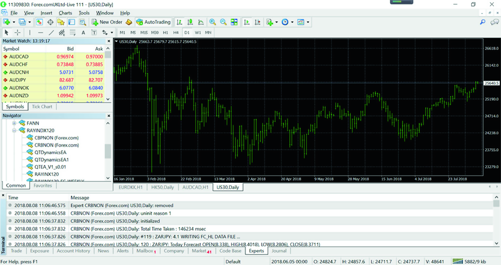 **Fig. 10.1. Snapshot for forex trading over MT4 platform provided byForex.​com** 

## 10.2 Supports and Resistances 

### 10.2.1 Introduction

The concepts of _support_ and _resistance_ are undoubtedly two of the most highly studied attributes of technical analysis. Part of analyzing chart patterns, these terms are used by traders to refer price levels on charts that tend to act as barriers, preventing the price of an asset from getting pushed in a certain direction (Bulkowski 2005; Kirkpatrick and Dahlquist 2015; Murphy 1999; De Angelis and Peskir 2016; Gomes and Waelbroeck 2010; Zapranis and Tsinaslanidis 2012). 

In the Wall Street environment, the terms _support and resistance_ are almost synonymous with _demand and supply_ respectively.

_Support_ is a price level at which there is adequate demand for security to stop its downward price movement and, normally, turn prices upward.

Typically, _support_ occurs at reaction lows.

_Resistance_ is a price level at which there is a significant supply of a stock causing prices to halt an upward move and turn prices down.

Typically, _resistance_ occurs at reaction highs.

Once an area or _zone_ of _support or resistance_ has been identified, it provides valuable potential trade entry or exit points. This is because, as a price reaches a point of support or resistance, it will do one of two things—bounce back away from the support or resistance level or violate the price level and continue in its direction—until it hits the next support or resistance level.

Most forms of trades are based on the belief that support and resistance zones will not be broken. Whether price is halted by the support or resistance level, or it breaks through, traders can _bet_ on the direction and can quickly determine if they are correct. If the price moves in the wrong direction, the position can be closed at a small loss. If the price moves in the right direction, however, the loss may be substantial. Figure 10.2 shows typical support and resistance lines. 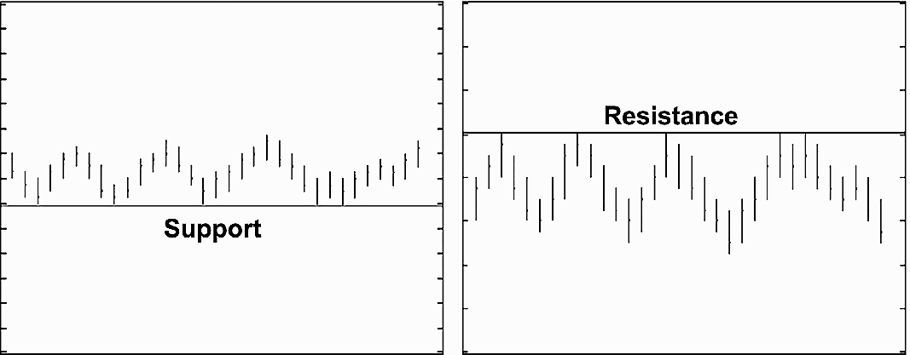 **Fig. 10.2. Typical supports and resistances** 

### 10.2.2 Rising and Declining Supports and Resistances

In an uptrend, both support and resistance levels rise as illustrated in Fig. 10.3. 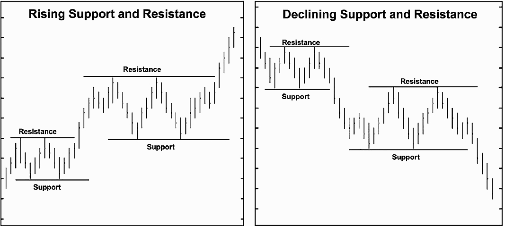 **Fig. 10.3. Rising and declining supports and resistances** 

Typically, support levels hold while resistance offers temporary halts to upward movements in prices. _Resistance levels_ are repeatedly broken until the uptrend is reversed. In a downtrend, both support and resistance levels move lower as illustrated in the right figure. Typically, _resistance levels_ hold while support levels temporarily stop downward price movements. _Support levels_ are repeatedly broken until the downtrend is reversed.

### 10.2.3 Role Reversal on Support and Resistance

In an uptrend, both support and resistance levels rise as illustrated in Fig. 10.4. 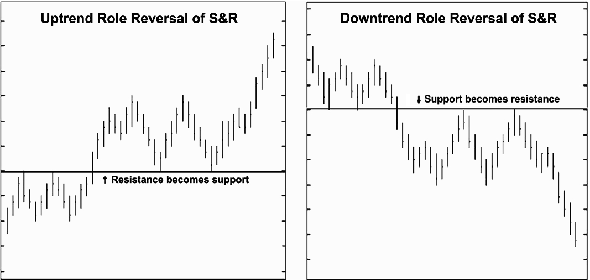 **Fig. 10.4. Role reversals in supports and resistance** 

Typically, support levels hold while resistance offers temporary halts to upward movements in prices.

Resistance levels are repeatedly broken until the uptrend is reversed.

In a downtrend, both support and resistance levels move lower as illustrated in the right figure.

Typically, resistance levels hold while support levels temporarily stop downward price movements.

Support levels are repeatedly broken until the downtrend is reversed.

### 10.2.4 Trend Reversal on Support and Resistance

Trend reversal at top: In an uptrend, a trend reversal occurs when prices are held at a resistance level. A double top or some other reversal formation develops at that point, and the trend changes direction.

Trend reversal at the bottom: A trend reversal occurs in a downtrend when prices are unable to penetrate a support level. In this case, a bottom reversal pattern is formed, and the trend changes direction to the upside.

Figure 10.5 shows typical trend reversal on support and resistance. 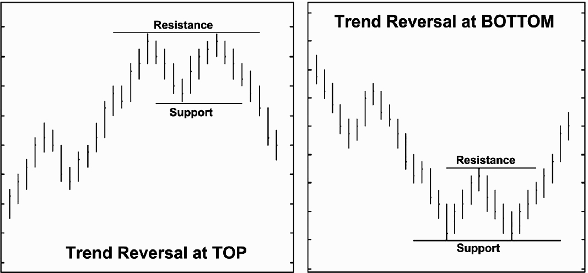 **Fig. 10.5. Trend reversals in supports and resistance** 

Keep in mind that a trend reversal is not signaled by the first failure to break through a resistance level (in an uptrend) or a support level (in a downtrend). A reversal pattern must fully develop before one gets the signal that the trend has changed. In other words, a trader should not rush to sell all of one’s securities or sell short just because prices have held at a resistance level.

### 10.2.5 Support and Resistance Versus QPLs

As mentioned in Chap. [5](<480082_1_En_5_Chapter.xhtml>), although we don’t know whether quantum price level (QPL) whether exists or not in financial market. But for many experienced analysts and traders, we all believe that _quantized price levels_ definitely exist in all financial markets such as _support (S) and resistance (R)_.

In fact, the basis of _technical analysis_ in the past 50 years is based on this fundamental concept.

The difference is that, with the exponential growth of program trading, especially HFPT (high-frequency-program-trading) (Durbin 2010). The financial markets become so complex and chaotic that we don’t believe one can observe (or locate) all these _hidden_ -_force_ -_levels_ manually.

However, different from the traditional understanding of support and resistance (S&R) levels, there is one major difference between them.

In traditional technical analysis, S&R levels are normally totally different price levels as they play different roles in the supply and demand _forces_ for market movements. However, in quantum finance, _quantum price levels (QPLs)_ are interpreted as discrete energy levels for the movements of the financial particles from one energy state to another, so basically there is no concepts either _support_ or _resistance_ , but just _energy states_. In other words, one QPL can be acted as a support level for a moment and then acted as _resistance level_ at another moment.

The truth is, such interpretation becomes more realistic and practical in nowadays financial markets, as we normally see a particular price level can be acted as both a support and resistance levels all the times within a day or a period of time, especially for highly fluctuated financial markets such as forex and cryptocurrency. The main reason is maybe due to the popularity of program trading and especially HFPT (Durbin 2010) in which trading programs normally define the same set of price levels as the thresholds to trigger _buying or selling_ signals, and seldom evaluate them as two separated price levels for automatic program trading. That’s why the frequent interchange of S&R roles is commonly found in nowadays financial markets include stock, forex, and cryptocurrency markets (Fig. 10.6). 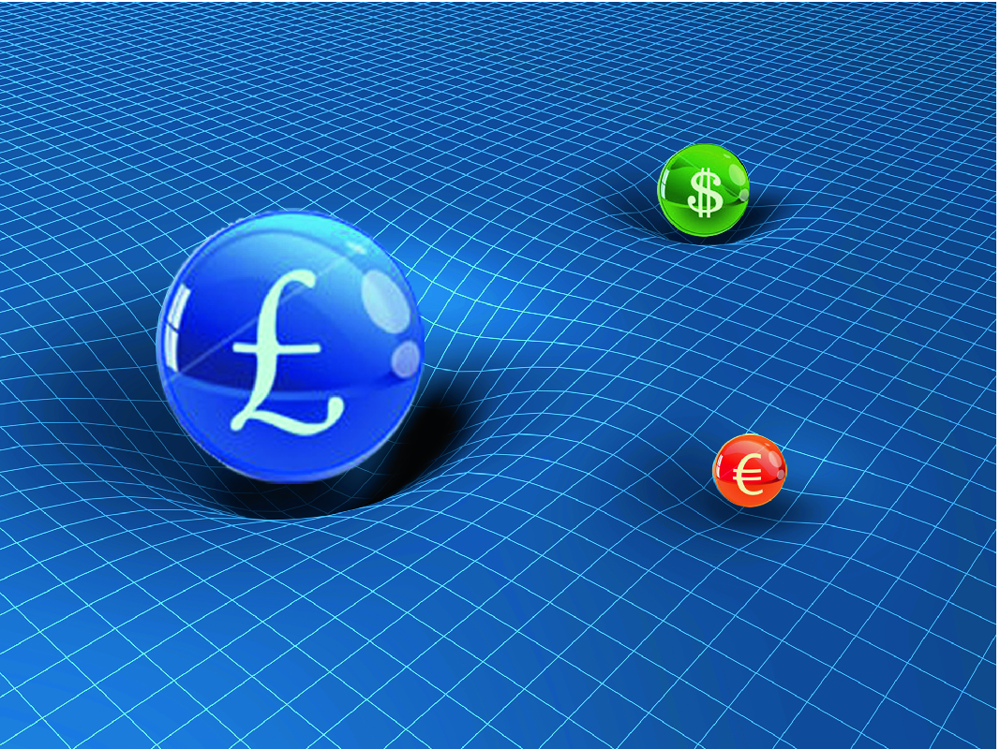 **Fig. 10.6. QPLs in financial markets** 

## 10.3 The MetaTrader (MT) Platform and MQL 

### 10.3.1 An Introduction

MetaTrader 4, also known as MT4, is an electronic trading platform widely used by online retail foreign exchange speculative traders (Brown 2016; Walker 2018; Young 2015). 

It was developed by _MetaQuotes software_ and released in 2005.

The software is licensed to foreign exchange brokers, who provide the software to their clients.

The software consists of both a client and server component. The server component is run by the broker and the client software is provided to the broker’s customers, who use it to see live streaming prices and charts; to place orders; to manage their accounts.

The client is a Microsoft windows-based application that became popular mainly due to the ability to end-users to write their own trading scripts and robots that could automate trading. Figure 10.7 shows a snapshot of MT4 in PC platform. 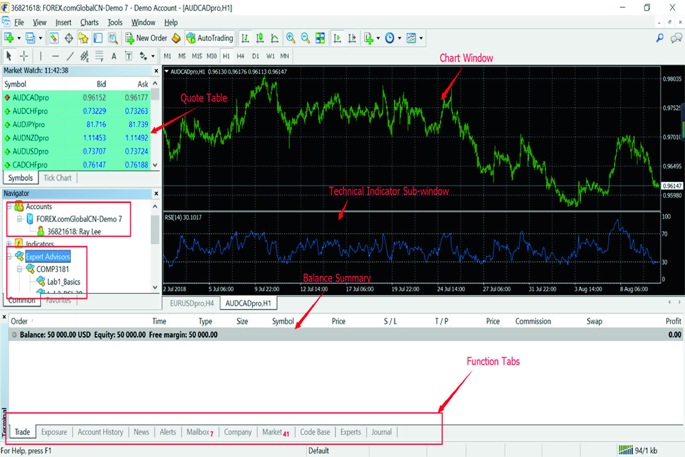 **Fig. 10.7. Snapshot of MT4 in a PC platform** 

In 2010, _MetaQuotes_ released a successor, MetaTrader 5. However, most traders and brokers keep on using MT4.

### 10.3.2 MQL—MetaQuotes Language

MetaQuotes Language 4 (MQL4) is a built-in language for programming trading strategies (Brown 2016; Walker 2018; Young 2015).

This language is developed by MetaQuotes Software Corp. based on their long experience in the creation of online trading platforms.

Using this language, we can create our own expert advisors that make trading management automated and are perfectly suitable for implementing our own trading strategies.

Besides, using MQL4 we can create our own technical indicators (custom indicators), scripts, and libraries.

MQL4 contains a large number of functions necessary to analyze current and previously received quotes, along with built-in basic indicators and functions to manage and control trade orders.

The _MetaEditor_ that highlights different constructions of MQL4 is used for writing the program code. It helps users to orientate themselves in the expert system text quite easily.

Although MQL5 had launched for years, most traders and brokers keep on using MQL4 over MT4 platform. As any MQL4 program can be compiled and run in MT4/MT5 platforms (but not the other way around). In this book, we focus on MT4 programming.

Programs written in MQL4 have different features and purposes:

1. expert advisor (EA)—is a mechanical trading system linked up to a certain chart. An expert advisor starts to operate when an event happens that can be handled by it: events of initialization and deinitialization, event of a new tick receipt, a timer event, depth of market-changing event, chart event, and custom events.

2. custom indicator—is a technical indicator written independently in addition to those already integrated into the client terminal. Like built-in indicators, they cannot trade automatically and intend to implement analytical functions only.

3. scripts—is a program that intends to a single execution of some actions. Unlike expert advisors, scripts do not process any actions, except for the start event.

4. library—is a set of custom functions that intend to store and distribute used blocks of custom programs frequently. Libraries cannot start executing by themselves.

5. include File—is a source text of the most frequently used blocks of custom programs like C++.

### 10.3.3 MQL—A Brief Overview

MetaQuotes Language 4 (MQL4) is a built-in language for programming trading strategies.

MQL4 is an OO-programming language intended to write automated trading strategies, custom technical indicators for various financial markets analyses.

It allows not only to write a variety of expert systems, designed to operate in real time, but also to create their own graphical tools to help users make trade decisions.

MQL4 is based on the concept of the popular programming language C++.

Like C++, MQL4 provides the OO-programming basics which include the following:

- Syntax,

- data types,

- operations and expressions,

- operators,

- functions,

- variables,

- preprocessor, and

- object-oriented programming.

(Details please refer to [https://​docs.​mql4.​com/​basis](<https://docs.mql4.com/basis>))

In addition to all C++-style programming fundamental tools and functions, MQL4 provides predefined variables, classes, and functions tailored for program trading in online financial markets which include the following:

- account information,

- checkup,

- market info,

- time series and indicators access

- chart operations,

- trade functions.

- trade signals,

- global variables of the terminal, and

- technical indicators.

### 10.3.4 MQL—Time Series and Indicators Access Functions

These are functions for working with time series and indicators.

A time series differs from usual data array by its reverse ordering—elements of time series are indexed from the end of an array to its start (from the most recent data to the oldest ones).

To copy the time series values and indicator data, it is recommended to use dynamic arrays only, because copying functions are designed to allocate the necessary size of arrays that receive values.

Commonly used functions include the following:

- iOpen

- iHigh

- iLow

- iClose

- iVolume

- iTime

Figure 10.8 shows the syntax and example of using time series and indicators access functions. 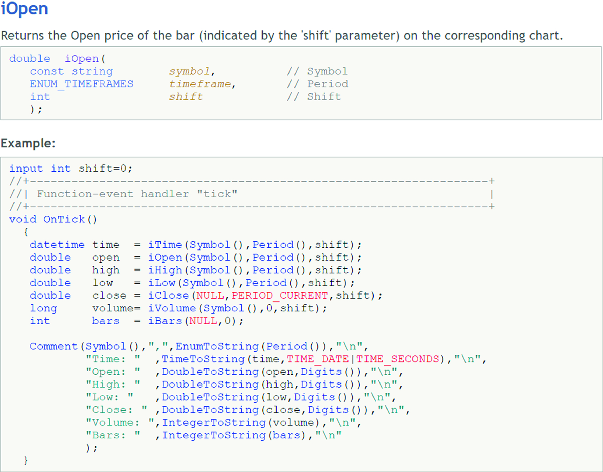 **Fig. 10.8. Syntax of iOpen() function and program example of using time series and indicators access functions** 

### 10.3.5 MQL—Trade Functions

This is the group of functions that intend to manage trading activities.

Major trade functions need to be used in EA are the following:

- OrderSend(),

- OrderClose(),

- OrderModify(), and

- OrderDelete().

A complete list of functions can be found at [https://​docs.​mql4.​com/​trading](<https://docs.mql4.com/trading>).

Figure 10.9a shows the syntax and program example of OrderSend(), one of the most important and frequently used in program trading. Besides, MT4 also provides six types of trading orders: Buy, Sell, Buy Limit, Sell Limit, Buy Stop, and Sell Stop (Kaufman 2013). 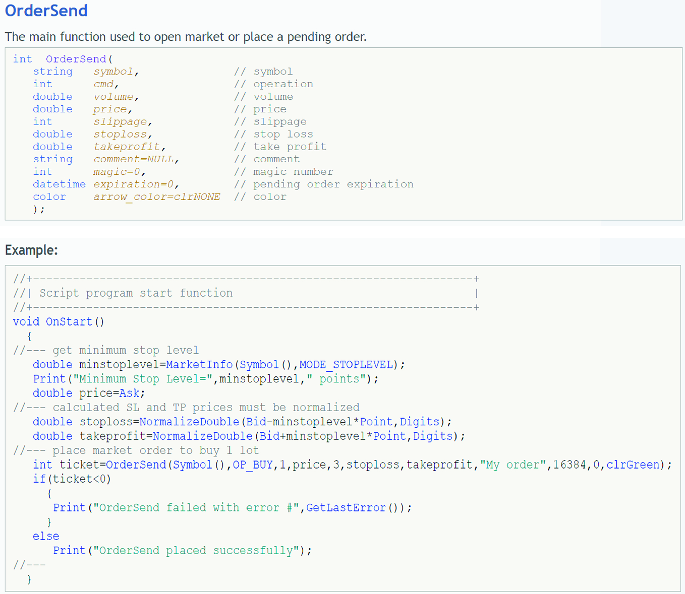 **Fig. 10.9. Syntax and program example of OrderSend() function** 

### 10.3.6 MQL—Technical Indicators

A group of functions that intend to standard and custom indicators’ calculations. Totally 39 technical indicator functions are provided.

Commonly used technical indicators include:

iBands
    

Bollinger Bands

iMomentum
    

Momentum

iMA
    

Moving Average

iMACD
    

Moving Averages Convergence-Divergence

iRSI
    

Relative Strength Index

iStochastic
    

Stochastic Oscillator

iFractals
    

Fractals

Figure 10.10 shows the syntax of two most commonly used technical indicators, iMA (moving average), and iRSI (relative strength index). Appendix B shows the list of 39 technical indicators functions implemented by MQL. 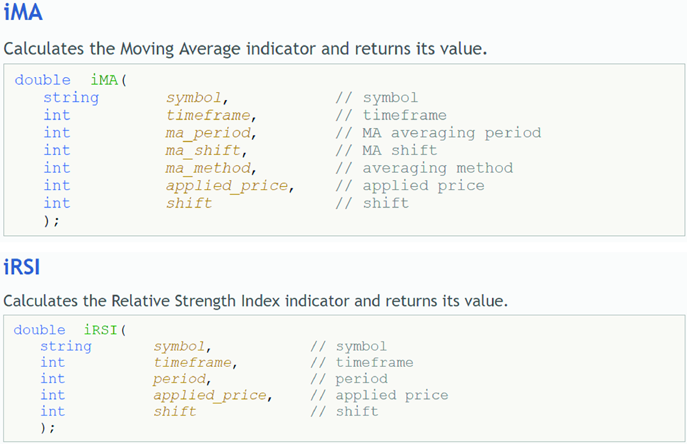 **Fig. 10.10. Technical indicator functions in MQL of iMA and iRSI** 

### 10.3.7 MQL Programming Tips

If the user is an experienced C++/Java programmer, it should be easy to pick up the skill set of writing EA programs using MQL.

All we need to do is the following:

- go through MT4 documentation site,

- refresh C++/Java program skills,

- learn about MT4 program trading with technical indicator functions and how they can be used, and

- understand file I/O techniques.

In learning new program languages, nothing is more useful than actual lab practice (Fig. 10.11). 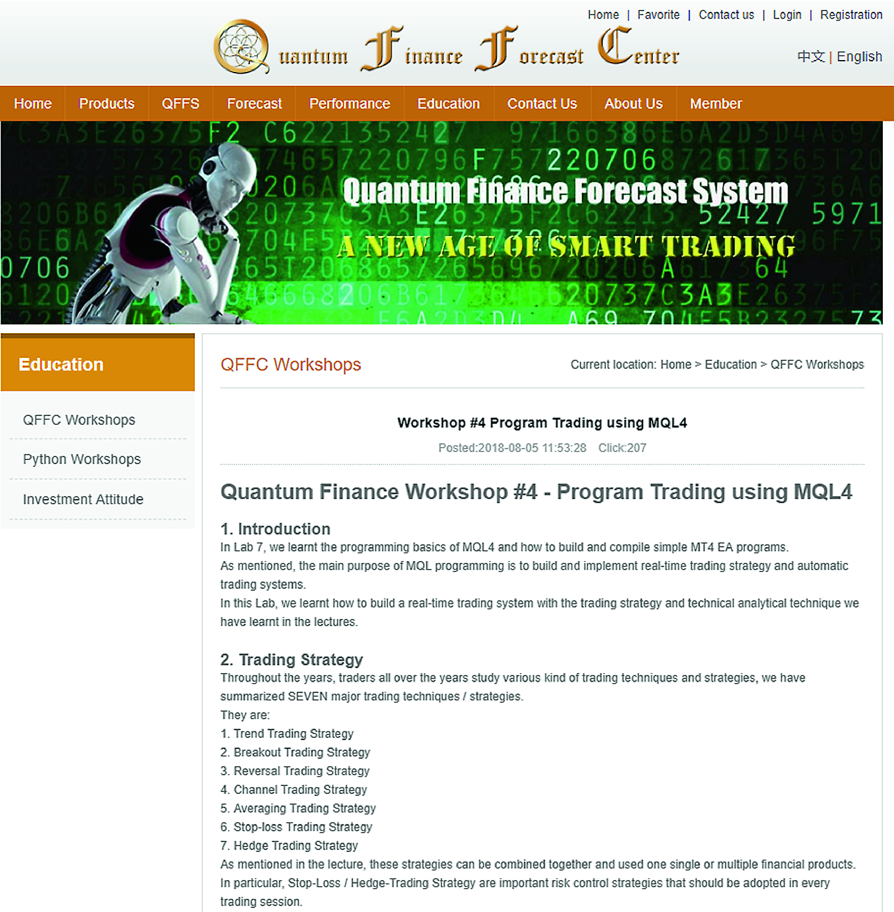 **Fig. 10.11. Quantum finance MQL programming workshop in QFFC.org** 

## 10.4 System Implementation—QPL Evaluation for Worldwide Financial Products 

From the implementation perspective, 129 financial products from [Forex.​com](<https://www.Forex.com>) (one of the biggest forex MT platform providers) and [AvaTrade.​com](<https://AvaTrade.com>) (major cryptocurrency MT platform providers) are used for QPLs evaluation.

They include the following:

- 9 Cryptocurrency,

- 84 Forex,

- 19 Financial Indices, and

- 17 Major Commodities.

Except cryptocurrency which has around 300–500 trading days information, all other financial products contain 2048 time series trading day information for QPLs evaluation.

Figure 10.12 shows a snapshot of the MT4 platform of cryptocurrency provided by [AvaTrade.​com](<https://AvaTrade.com>). 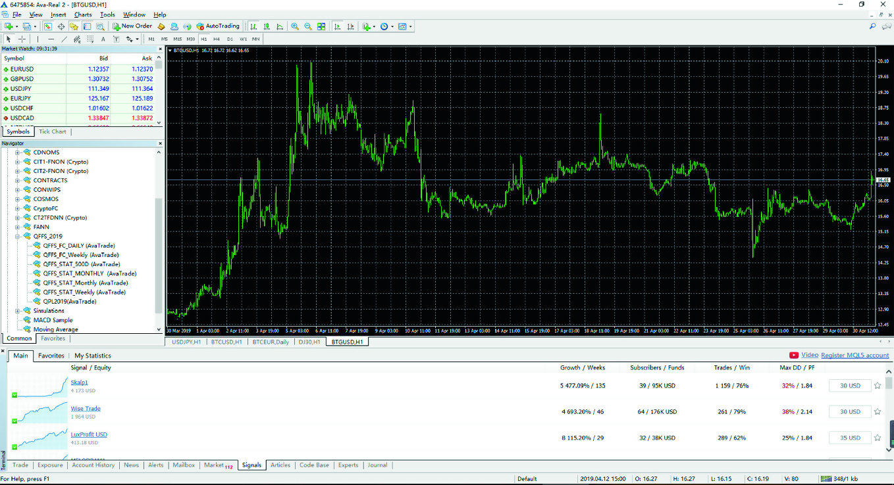 **Fig. 10.12. A snapshot of MT4 platform of cryptocurrency provided byAvaTrade.​com** 

Appendix A shows the list of 129 financial products provided by [Forex.​com](<https://www.Forex.com>) and [AvaTrade.​com](<https://AvaTrade.com>) for their MT4 platforms.

## 10.5 MQL Program for QPLs Evaluation of Worldwide Financial Products (QPL2019.mq4) 

### 10.5.1 System Flowchart and Main Program Logic

The main program logic for the evaluation of the first 21 QPLs of all 120+ worldwide financial product is shown in Fig. 10.13. 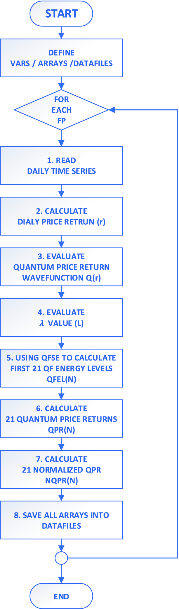 **Fig. 10.13. Flowchart for the determination of the first 21 QFELs and QPLs** 

For each financial product, do the following:

- Read the daily time series and extract (Date, O, H, L, C, V)

- Calculate daily price return r(t)

- Calculate quantum price return wavefunction Q(r) (size 100)

- Evaluate λ value for the wavefunction Q(r) using F.D.M. and Eq. ([5.​21](<480082_1_En_5_Chapter.xhtml>)) & evaluate other related parameters:

    * sigma (std dev of Q)

    * maxQPR (max quantum price return—for normalization).

- Once λ is found, using QFSE (numerical solution) by solving the depressed cubic equation using Cardano’s method Eq. ([5.​32](<480082_1_En_5_Chapter.xhtml>)a–c) to calculate first 21 quantum finance energy level, QFEL(n), n = [1 … 20]

- Calculate quantum price return, QPR(n) $$p = - (2n + 1)^{2}$$ (10.1) $${\text{QPR}}({\text{n}}) = \frac{QFEL(n)}{QFEL(0)}$$ (10.2) 

where n = [1 … 20]

- Calculate normalized QPR(n) $${\text{NQPR}}({\text{n}}) = 1 + 0.21*{\text{sigma}}*{\text{QPR}}({\text{n}})$$ (10.3) 

where n = [1 … 20]

- Save two level of data files:

    * For each financial product, save the QPL table contains QPE, QPR, NQPR for the first 21 energy levels

    * For all financial product, create a QPL summary table contains NQPR for all FP, which will be used for financial prediction using recurrent neural networks.

Figure 10.14 shows the program header with program logic listed for the QPL2019.mq4 program for QPLs evaluation of 120+ worldwide financial products. 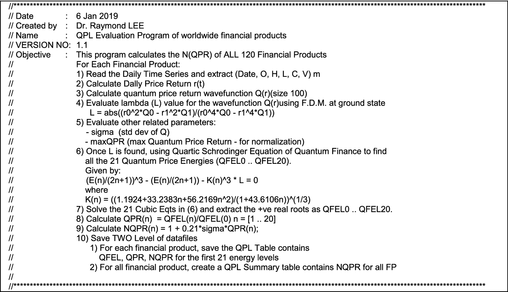 **Fig. 10.14. Main program logic of QPL evaluation program** 

### 10.5.2 Program Declaration

Program Declaration consists of the following three sections:

- declaration of program directories,

- declaration of global variables,

- declaration of timing variables, and

- declaration of financial products and related variables.

According to the numerical formulation revealed in Chap. [5](<480082_1_En_5_Chapter.xhtml>), daily returns of the time series for each financial product are evaluated to calculate the wavefunction values Qf.

The application of the finite difference method (F.D.M.) (Abreu et al. 2018; Guo 2018) is to evaluate the Lambda (_λ_) value.

Once the Lambda value is found, apply the quartic Schrődinger equation (Singh et al. 2009; Tichy et al. 2012) of quantum finance to find all 21 quantum price energies (QFEL0 .. QFEL20) and store in QFEL datafiles. Figure 10.15 shows the program declaration of QPL evaluation program. 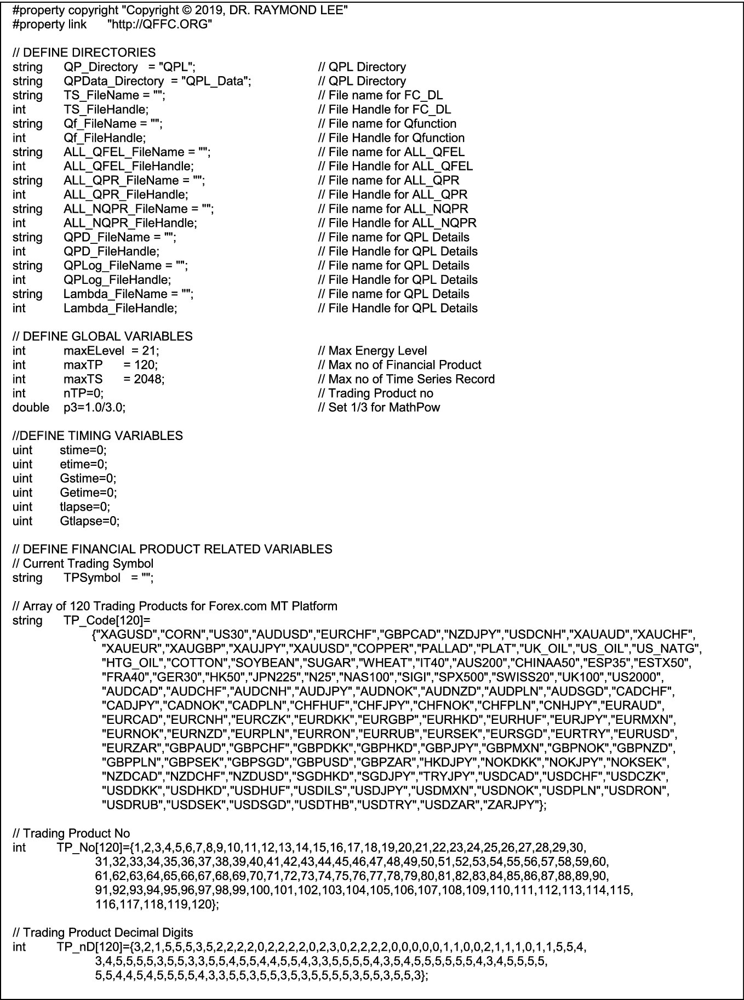 **Fig. 10.15. Program declaration of QPL evaluation program** 

### 10.5.3 Program Initialization: init()

As MQL is a real-time program trading development platform, init() is used to perform _one_ -_off process_ such as the system initialization or QPL calculation in our case, while start() is a _time_ -_step looping process_ to implement real-time function such as real time trading and hedging.

So, in our case, all QPL calculation process in this system are placed in init() class. In other words, to implement a real-time QPL evaluation and QPL-based trading program, one will implement QPL evaluation program in the init() class real time trading algorithm in the start() class. Figure 10.16 shows the program, data, and data file initialization process. 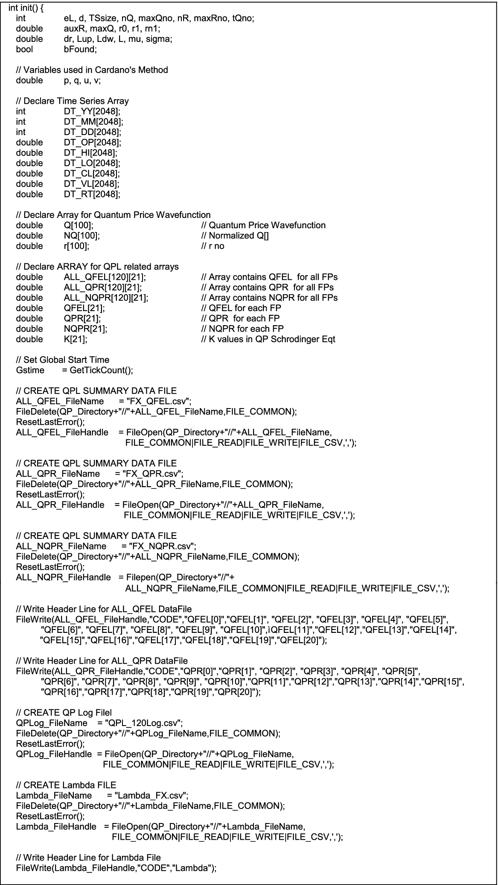 **Fig. 10.16. Program initialization of QPL evaluation program** 

### 10.5.4 Process 1: Calculate All K Values

The calculation is used in accordance with quantum anharmonic oscillation function from quantum finance revealed in Chap. [5](<480082_1_En_5_Chapter.xhtml>): $$\left( {\frac{E(n)}{2n + 1}} \right)^{3} - \left( {\frac{E(n)}{2n + 1}} \right) - \left( {K_{0} (n)} \right)^{3} \lambda = 0$$ (10.4) 

where $$K_{0} (n) = \left[ {\frac{{1.1924 + 33.2383n + 56.2169n^{2} }}{1 + 43.6196n}} \right]^{1/3}$$ (10.5) 

First, evaluate all $K_{0} (n)$ for the 20 energy levels (n).

Then open the file handles of the data files for the storage of the QPR, NQPR, QF values. Program codes of process 1 are shown in Fig. 10.17. 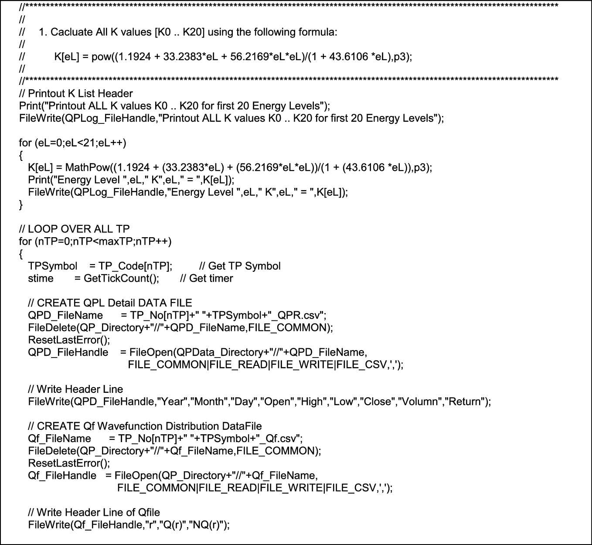 **Fig. 10.17. Process 1 calculate all K values of QPL evaluation program** 

### 10.5.5 Process 2: READ ALL Daily Time Series

For each financial product (FP), this process uses MQL time series data functions iOpen, iHigh, iLow, iClose to read the daily time series data and calculate the daily return by $${\text{DT}}{\\_}{\text{RT}}[{\text{d}}] = {\text{DT}}{\\_}{\text{CL}}[{\text{d}}]/{\text{DT}}{\\_}{\text{CL}}[{\text{d}} + 1]$$ (10.6) 

where DT_CL[d] and DT_CL[d+1] are the closing prices for d and d+1 day, respectively. As mentioned, except cryptocurrencies which have 300–500 trading day records, the other 120 financial products (forex, commodities and financial indices) have 2048-trading day records, which are sufficient for the evaluation on distribution function (wavefunction) of the price returns (r). Program codes of process 2 are shown in Fig. 10.18. 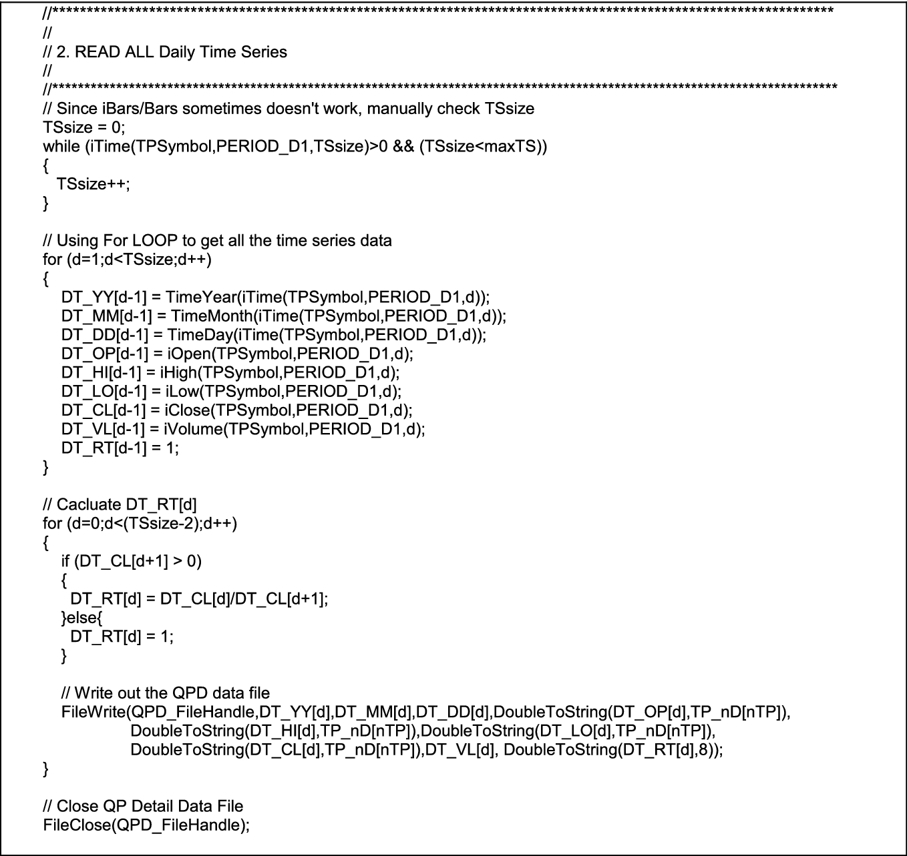 **Fig. 10.18. Process 2 read time series of QPL evaluation program** 

### 10.5.6 Process 3: Calculate Mean (mu) and Standard Deviation (sigma) of Return Array

After the evaluation of daily returns DT_RT[d] of the financial time series, this process evaluates the mean (mu, _μ_) and standard deviation (sigma, _σ_) of the return distribution function (_φ_).

The purpose for mu evaluation is to locate the central point of the distribution function, and sigma is used to calculate “ _dr_ ” term—the width of each slice of returns for the distribution function is an important factor to calculate Lambda using F.D.M., which is given by $$dr = 3*\frac{sigma}{50};$$ (10.7) 

For each QP distribution chart, 100 equal spacing slices with width _dr_ are used for to evaluate the distribution function values. Program codes of process 3 are shown in Fig. 10.19. 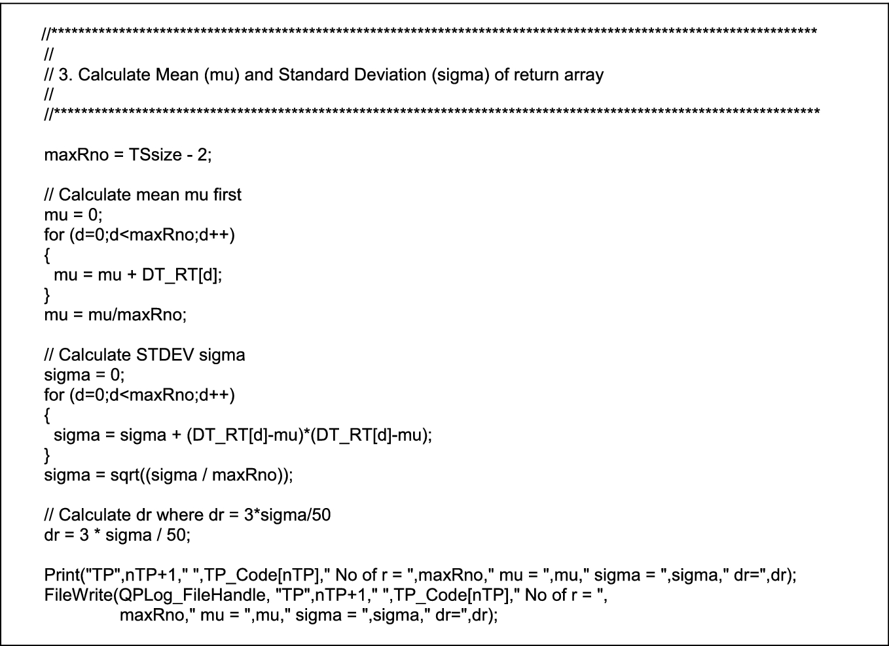 **Fig. 10.19. Process 3 calculate mean (mu) and standard deviation (sigma) of return array** 

### 10.5.7 Process 4: Generate the Returns Wavefunction Distribution

Based on dr value calculated in process 3, this process calculates the price returns wavefunction values Q[nQ], NQ[nQ] where nQ is the number of slice in distribution function, Q[nQ] is the pdf (probability density function values) within the particular slice nQ; and NQ[nQ] is the normalized pdf values of the returns wavefunction.

The NQ[nQ] is given by: $${\text{NQ}}[{\text{nQ}}] = \frac{no\;of\;trading\;days\;within\;the\;range\;of\;return\;value\;in\;nQ}{Total\;number\;trading\;day\;return\;values}$$ (10.8) 

Figure 10.20 shows the return wavefunction for Gold (XAUUSD) in 2048 financial time series. Program codes of process 4 are shown in Fig. 10.21. 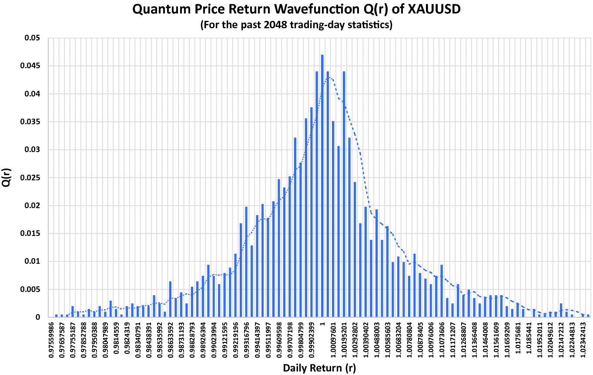 **Fig. 10.20. Process 4 quantum price return wavefunction of Q(r) of gold (XAUUSD)** 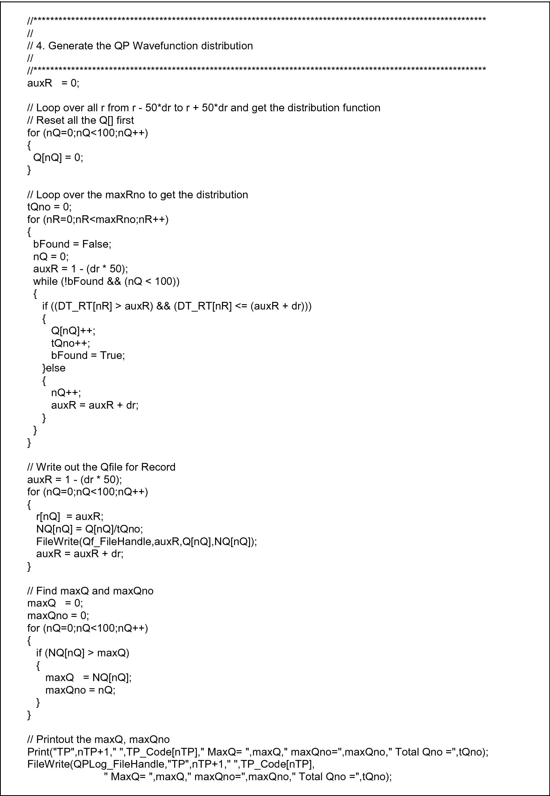 **Fig. 10.21. Process 4 generate the returns wavefunction distribution** 

### 10.5.8 Process 5: Evaluate Lambda Value for the Returns Wavefunction

Once all wavefunction values in each slice are evaluated, we make use of F.D.M., together with QFSE (Quantum Finance Schrödinger Equation) to evaluate the Lambda value (_λ_), which is given by: $$\lambda = \left| {\frac{{r_{ - 1}^{2} \varphi_{{r_{ - 1} }} - r_{ + 1}^{2} \varphi_{{r_{ + 1} }} }}{{r_{ + 1}^{4} \varphi_{{r_{ + 1} }} - r_{ - 1}^{4} \varphi_{{r_{ - 1} }} }}} \right|$$ (10.9) 

where $\varphi_{{r_{ - 1} }}$ and $\varphi_{{r_{ + 1} }}$ are wavefunction values (normalized) for the 1st left and right-hand side slice from the slice with max wavefunction value, normally is the central point with returns value = 1 as in Fig. 10.22. 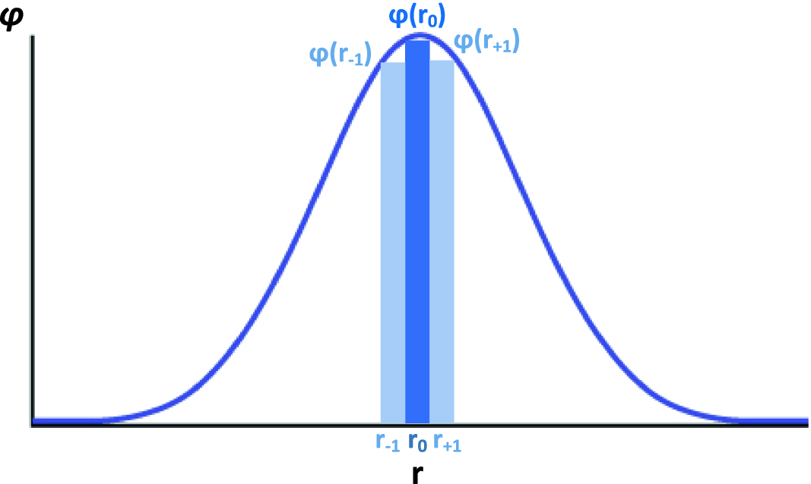 **Fig. 10.22. Illustration of F.D.M. scheme for evaluation of lambda value** 

Program codes of process 5 are shown in Fig. 10.23. 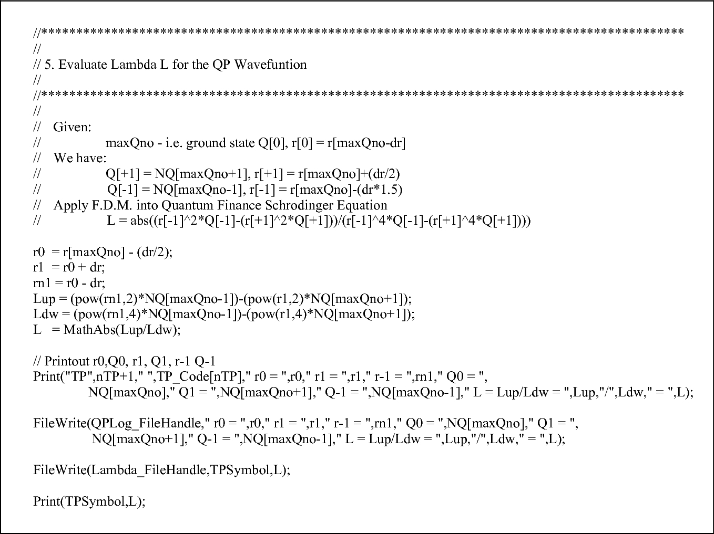 **Fig. 10.23. Process 5 Evaluate lambda value for the returns wavefunction** 

### 10.5.9 Process 6: Using QP Schrodinger Equation to FIND the First 21 Energy Levels

Once Lambda value is evaluated, we can apply the Cardano’s formula to solve the quantum price return Schrödinger equation, with formulation given by: $$E\left( n \right) = \sqrt[3]{{ - \frac{q}{2} + \sqrt {\frac{{q^{2} }}{4} + \frac{{p^{3} }}{27}} }} + \sqrt[3]{{ - \frac{q}{2} - \sqrt {\frac{{q^{2} }}{4} + \frac{{p^{3} }}{27}} }}$$ (10.10) 

where: $$p = - (2n + 1)^{2} ,q = - \lambda (2n + 1)^{3} \left[ {K_{0} (n)} \right]^{3}$$ 

Please refer to Chap. [5](<480082_1_En_5_Chapter.xhtml>) on detailed mathematical proof and derivations for the numerical evaluation of quantum price level.

In this program, we calculate the first 21 _quantum finance energy levels (QFEL)_ of every financial product (ground state 0 and 20 Energy Levels), which is sufficient for daily financial trading and analysis.

Figure 10.24 shows MQL codes for 21 energy levels evaluation. 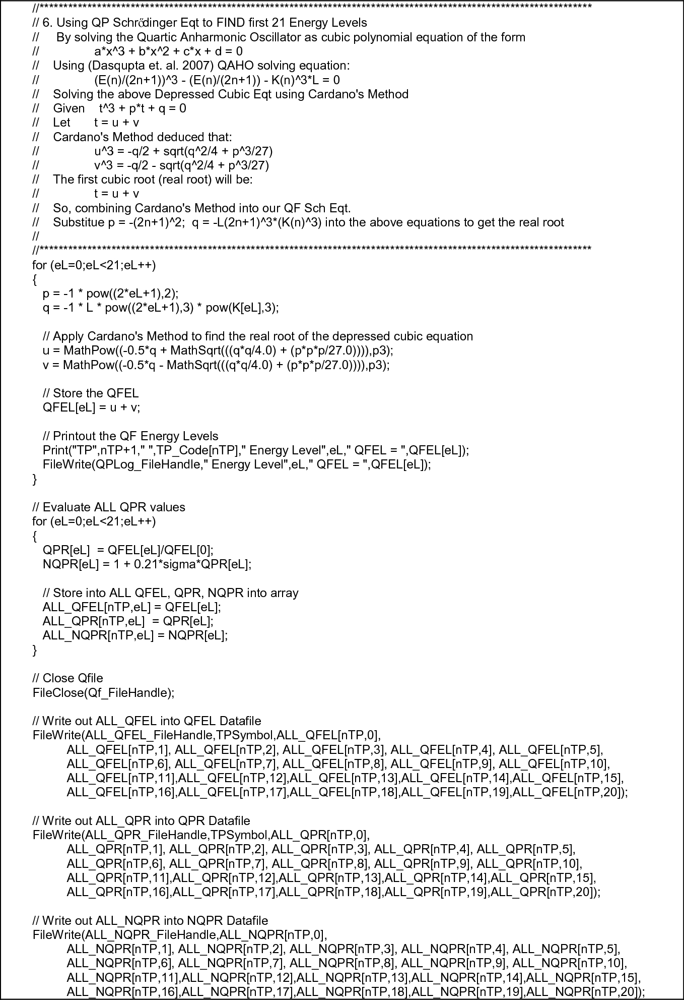 **Fig. 10.24. Process 6 using QP Schrodinger equation to find the first 21 energy levels** 

### 10.5.10 Process 7: Program End

This process closes all datafile handles, calculate total CPU time spent and report the total time taken to calculate QPLs of all financial products.

As shown in Fig. 10.25, MQL also provides start() class for developers to implement real time trading/hedging programs. 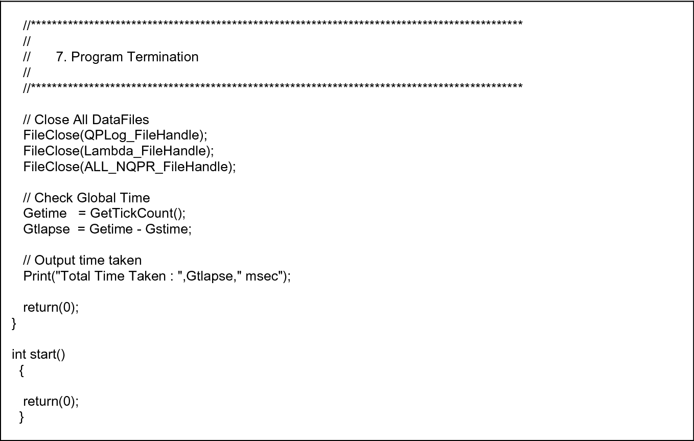 **Fig. 10.25. Process 7 program end** 

In other words, one can make use of the MQL learnt in this chapter to evaluate the QPLs for any financial product, and make use of it, say, as S&R lines to implement real time trading and hedging programs learnt in Chap. [6](<480082_1_En_6_Chapter.xhtml>).

Figure 10.26 shows a snapshot of implementation result of QPL evaluation program on [Forex.​com](<https://www.Forex.com>) MT4 platform for QPL evaluation of 120 financial products. 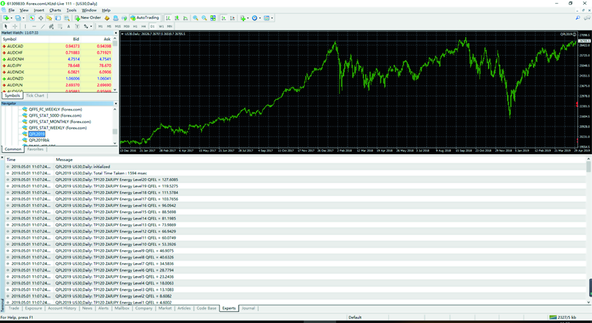 **Fig. 10.26. Implementation results of QPL2019.mq4 onForex.​comMT4 platform to calculate QPLs of 120 financial products** 

### 10.5.11 Implementation Results

Figure 10.26 shows snapshot of the implementation results of QPL2019.mq4 MQL program for QPLs evaluation of 120 financial products at the [Forex.​com](<https://www.Forex.com>) MT platform. As shown, it took only 1594 ms (i.e., less than 2 s) to evaluate the first 20 QPLs for 120 financial products, which was much faster and effective than using traditional Path Integral Techniques.

## 10.6 Conclusion 

Based on quantum finance concepts and theories in Chaps. [1](<480082_1_En_1_Chapter.xhtml>)–[4](<480082_1_En_4_Chapter.xhtml>), and numerical QPL (quantum price levels) evaluation learnt in Chap. [5](<480082_1_En_5_Chapter.xhtml>), this chapter we studied how to implement these methods and theories to evaluate QPLs of worldwide 120+ financial products including: worldwide forex, major cryptocurrencies, international finance indices and major commodities.

From the implementation perspective, we demonstrated how to use MQL (MetaQuotes Language) on MT4 Platform—one of the world’s biggest online program trading and development platform to develop real-time QPL evaluation system.

As mentioned in Chap. [6](<480082_1_En_6_Chapter.xhtml>) about quantum trading and hedging strategy, besides using QPL as S&R lines in program trading; QPL can also be incorporated with chaotic neural networks (CNNs), deep neural oscillatory network (DNON) for real-time financial predictions, which will be studied in Chaps. [11](<480082_1_En_11_Chapter.xhtml>) and [12](<480082_1_En_12_Chapter.xhtml>), respectively.

### Problems

1. 10.1

What is the financial market? Discuss and explain why financial market prices may not indicate the true intrinsic value, say, a stock which leads to the popularity of programming trading nowadays.

2. 10.2

What is the major difference between primary versus secondary financial markets? And what is the importance of Secondary markets in modern finance?

3. 10.3

What are the two different categories of secondary market? Give one example for each category and discuss the major characteristics.

4. 10.4

State and explain the five major types of financial markets. Give one example for each type of financial market and explain how it works.

5. 10.5

What are the two major roles and functions of market makers (MM) in a financial market, such as forex market?

6. 10.6

State and explain the five key participants in forex market, in the descending order of their importance and market shares.

7. 10.7

State and explain the five key forex trading characteristics.

8. 10.8

What are the major factors to affect the prices in forex market?

9. 10.9

What is retail forex trading platform? Give one example and discuss it is different from traditional forex trading platform.

10. 10.10

What are supports and resistance (S&R) analysis in technical analysis? Give one example in each case and discuss how it works.

11. 10.11

Discuss and explain how S&R analysis is related to supply and demand analysis and theory in technical analysis. Give an example by using the daily chart of DJI (Dow Jones Index) and explain how such theory works.

12. 10.12

What is the major difference between role reversal vs. trend reversal on S&R analysis by using simple charts to illustrate your explanation?

13. 10.13

How S&R analysis is related and interpreted by QPL (quantum price level) modeling in quantum finance?

14. 10.14

Discuss and explain why QPL (quantum price level) in quantum finance are critical for nowadays HFPT (High-Frequency-Program-Trading).

15. 10.15

What are the major functions and characteristics of MetaTrader system as compared with traditional financial trading platforms?

16. 10.16

State and explain the five categories of programs/systems generated by MQL of MT platform.

17. 10.17

State and explain six major components in MQL as compared with traditional programming languages which are critical for program trading in finance.

18. 10.18

State six types of OrderSend() in MQL and explain how they work for the design of trading and hedging systems.

19. 10.19

Give five commonly used technical indicators in technical analysis and explain how they works in MQL programming.

20. 10.20

MQL programming task 10.1 Design and implement a real-time trading program using MQL with the implementation of classical RSI (30-70) trading algorithm. Financial products: Using at least five forex products for trading (e.g., USDCAD, AUDJPY, etc.) Trading criteria: Using H1 as trading timeframe, trigger a sell order when RSI value hit 70, trigger a buy order when it hit 30.

Using (1) MQL built-in simulator; (2) Live test for at least 10 trading days using demo account and compared their results.

21. 10.21

MQL Programming Task 10.2

Similar to Task 10.1, but this time using two more technical indicators to generate automatic trading rules. Commonly used technical indicators such as: iBand (Bollinger Bands); iMomentum (Momentum); iMA (Moving Average); iMACD (MACD) and iStochastic (Stochastic Oscillator).

Compare the trading results with the one generated by Task 10.1.

22. 10.22

MQL Programming Task 10.3

Based on Workshop #2 (QPL2019.mq4), design and implement a real-time MQL trading program by combining QPLs (as S&R lines) and RSI trading program implemented in Task 10.1 to implement a simple quantum finance trading system.

Compare trading results with trading program implemented in Task 10.1.
