# 11\. Time Series Chaotic Neural Oscillatory Networks for Financial Prediction

 _A computer would deserve to be called intelligent if it could deceive a human into believing that it was human._

Alan Turing (1912–1954)

Financial prediction, ranging from stocks, commodities to forex forecast poses real challenges to researchers and quantitative analysts (a.k.a. _quants_) due to its highly chaotic and unpredictable nature. With the blooming of cryptocurrency trading which provides 24 × 7 online currency trading, the financial markets, especially the worldwide currency markets are more chaotic and fluctuating than before. An effective and reliable financial prediction system is profoundly required.

With the integration of _quantum price levels_ (QPL) evaluated by quantum finance technology, a _Time Series Chaotic Neural Oscillatory Network_ (_TSCNON_) for worldwide financial market prediction is devised to effectively resolve the system over-training and deadlock problems imposed by traditional recurrent neural networks using classical sigmoid-based activation functions.

In terms of system implementation, TSCNON coalesces into 2048-trading day time series financial data and 39 major financial signals as input signals for the real-time prediction of 129 worldwide financial products which includes: 9 major cryptocurrencies, 84 forex, 19 major commodities, and 17 worldwide financial indices.

In terms of system performance, past 500-trading day of average system performance attained less than 1% forecast percentage errors.

## 11.1 Introduction 

With the integration of _quantum price levels_ (_QPL_) discussed in Chap. [10](<480082_1_En_10_Chapter.xhtml>) and chaotic neural networks learnt in Chap. [9](<480082_1_En_9_Chapter.xhtml>), in this chapter, TSCNON (time series chaotic neural oscillatory networks) is devised to effectively resolve the system over-training and deadlock problems imposed by traditional recurrent neural networks using classical sigmoid-based activation functions (Lee 2004, 2006a; Li and Lee 2005; Wong et al. 2008). TSCNON coalesces 2048-trading day time series financial data with _quantum finance signals_ (_QFS_) based on QPL derived in Chap. [10](<480082_1_En_10_Chapter.xhtml>) into input signals for the real-time prediction of 129 worldwide financial products which includes: 9 major cryptocurrencies, 84 forex, 19 major commodities, and 17 worldwide financial indices. 

The chapter is comprised of (1) TSCNON system architecture and its chaotic neural network training algorithm in Sect. 11.2; (2) TSCNON system implementation framework for the real-time prediction of worldwide 129 financial products in Sect. 11.3; (3) Workshop #2—quantum finance forecast system (TSCNON.mq4) will be discussed in details in Sect. 11.4; (4) TSCNON system performance in Sect. 11.6; (5) TSCNON—system implementation results in Sect. 11.6 and followed by (6) conclusion in Sect. 11.7.

## 11.2 TSCNON—System Architecture 

TSCNON (time series chaotic neural oscillatory networks) is the integration of multilayer feedforward backpropagation networks (FFBPNs) (Fausett 1994; Patterson 1996) with Lee-oscillators (Lee 2004, 2005, 2006a, b) by replacing all simple neurons with chaotic neural oscillators. The network training algorithm of TSCNON is shown in Fig. 11.1. Figure 11.2 shows the system architecture of TSCNON for financial prediction. 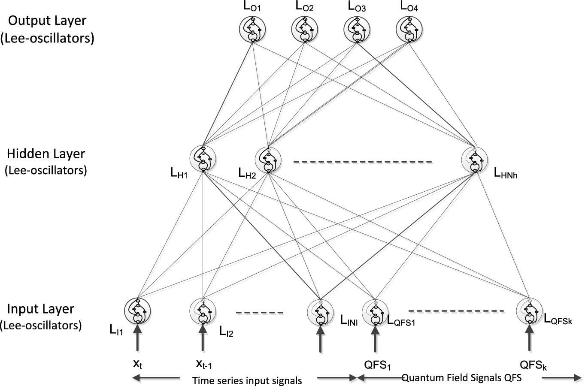 **Fig. 11.1. System architecture of TSCNON**  **Fig. 11.2. System training algorithm of TSCNON** 

As shown in Fig. 11.2, TSCNON consists of three neural network layers:

1. Input layer: consists of (1) 5-day time series input signal vector contains Open, High, Low, and Closing prices; (2) _quantum field signals_ (_QFS_) contain the 20 closest QPLs revealed in Chap. [10](<480082_1_En_10_Chapter.xhtml>). For each input node given by Lee-oscillator, totally we have 40 Lee-oscillators in the input layer (20 Lee-oscillators for time series signals, and 20 Lee-oscillators of QFS).

2. Hidden layer: consists of 40 Lee-oscillators as hidden nodes.

3. Output layer: consists of 4 Lee-oscillators which model the next-day forecasts of Open, High, Low, and Close, respectively.

Different from traditional neural networks (Fausett 1994; Patterson 1996), every neuron in the TSCNON is replaced by Lee-oscillator with neural dynamics given by Eqs. (11.1)–(11.4) mentioned in Chap. [9](<480082_1_En_9_Chapter.xhtml>), which effectively converts the recurrent neural network into a chaotic recurrent neural network to resolve the over-training and deadlock problems, which is usually occurred in training of massive data such as financial data we are conducted in this chapter.

The formulations of Lee-oscillator are given by $${\text{E}}\left( {{\text{t}} + 1} \right) = Sig\left[ {e_{1} \cdot E\left( t \right) - e_{2} \cdot I\left( t \right) + S\left( t \right) - \xi_{E} } \right]$$ (11.1) $${\text{I}}\left( {{\text{t}} + 1} \right) = Sig\left[ {i_{1} \cdot E\left( t \right) - i_{2} \cdot I\left( t \right) - \xi_{I} } \right]$$ (11.2) $$\Omega \left( {{\text{t}} + 1} \right) = Sig\left[ {S\left( t \right)} \right]$$ (11.3) $${\text{L}}\left( {\text{t}} \right) = \left[ {E\left( t \right) - I\left( t \right)} \right] \cdot e^{{ - kS^{2} \left( t \right)}} + \Omega \left( t \right)$$ (11.4) 

where e1, e2, i1, and i2 are the weights; ξE and ξI are the threshold values and S(t) is the external input.

Detail system performance analysis will be studied in the next section.

## 11.3 TSCNON—System Implementation Framework 

_Quantum finance forecast center_ ([http://​www.​QFFC.​org](<http://www.QFFC.org>)) is a nonprofit, self-funded AI-fintech R&D and worldwide financial forecast center aims at the R&D and provision of a fair and open platform for worldwide traders and individual investors to acquire free knowledge of worldwide 129 financial product forecasts based on state-of-the-art AI, intelligent agents, chaotic neural networks, and quantum field theory technologies.

With the adoption of TSCNON technology and the real-time data provided by [Forex.​com](<http://Forex.com>) (one of the major international forex trading platforms) and [AvaTrade.​com](<http://AvaTrade.com>) (one of the biggest worldwide cryptocurrency trading platforms) (Narayanan et al. 2016; Vigna and Casey 2016), QFFC launched the 129 financial products’ daily and weekly forecast services from January 1, 2018 for over 1000 worldwide traders and individual investors for testing and evaluation. Figure 11.3 shows the official site of _Quantum Finance Forecast Center_.  **Fig. 11.3. Quantum finance forecast center official site for TSCNON daily financial forecast on May 3, 2019** 

From the system implementation perspective, real-time and historical data of the worldwide 129 financial products provided by [Forex.​com](<http://Forex.com>) and [AvaTrade.​com](<http://AvaTrade.com>) are adopted in TSCNON for chaotic neural network training and prediction.

They include the following:

- major cryptocurrencies (9);

- major worldwide forex (84);

- major commodities (19);

- major worldwide financial indices (17).

Appendix A depicts the list of 129 financial products under these four categories.

As shown in Appendix A, owing to the short trading history of cryptocurrencies (300-trading day records are provided by [AvaTrade.​com](<http://AvaTrade.com>)), all other financial products consist of 2048 past trading day records for each financial product (data provided by [Forex.​com](<http://Forex.com>)), which provide sufficient training and test sets for TSCNON system testing and evaluation.

To provide a fully coherent and automation of TSCNON with both [Forex.​com](<http://Forex.com>) and [AvaTrade.​com](<http://AvaTrade.com>) trading platforms for the automatic acquisition of real-time and historical data, the whole TSCNON system is developed in MT platform (Walker 2018; Young 2015) using MetaQuotes Language (MQL) and Expert Advisor (EA) system for daily financial forecast. Figure 11.4 shows the system framework of TSCNON. 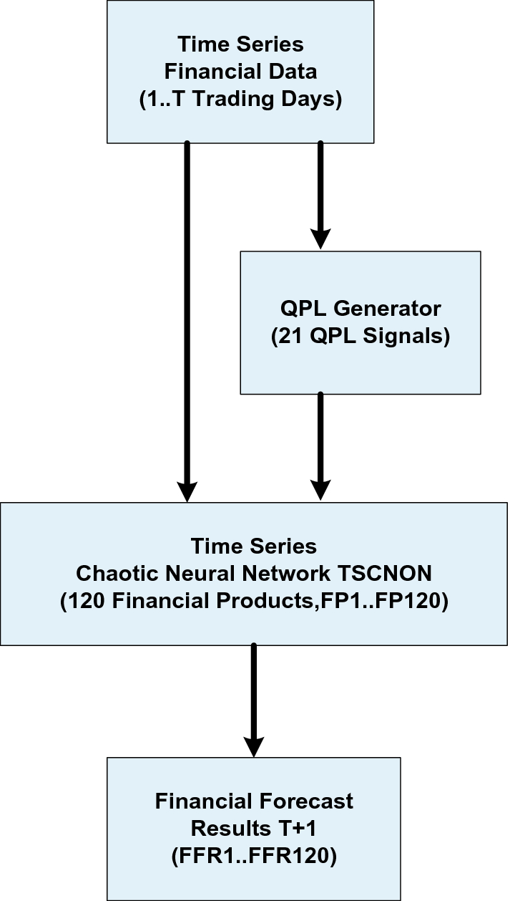 **Fig. 11.4. TSCNON System Framework** 

As shown in Fig. 11.4 each financial product has 2048-trading day data (except cryptocurrency which only have 300-trading day data) are automatically generated by the MT4 engines of [Forex.​com](<http://Forex.com>) and [AvaTrade.​com](<http://AvaTrade.com>) on a daily basis. Through the QPL (quantum price level) Generator revealed in Chap. [10](<480082_1_En_10_Chapter.xhtml>), 21 closed QPL signals are generated by TSCNON together with the previous 5-day time series patterns; they are fed into TSCNON for chaotic neural network training and testing.

## 11.4 Workshop #2—Quantum Finance Forecast System (TSCNON.Mq4) 

### 11.4.1 Introduction

In this section, we will explore the programming details of quantum finance forecast system (TSCNON) using MQL for real-time implementation on any MT4 platforms. For the _time series chaotic neural oscillatory network_ (_TSCNON_), we are using the QFFC SDK developed by [QFFC.​org](<http://www.QFFC.org>).

This section will study the complete MQL programming details for the design and development of _quantum finance forecast system_ by using TSCNON technology in this chapter. Users can base on the method and program learnt in this chapter to design and implement their own quantum finance prediction systems.

Since the entire TSCNON.mq4 consists of over 1000 program lines of coding, this section will focus on the main module implementation process. Complete program coding can be found in [QFFC.​org](<http://www.QFFC.org>) Workshop #2.

### 11.4.2 Main Program Logic

TSCNON.mq4 is a MQL4 program with the implementation of TSCNON system in this chapter for the daily forecast of 120 financial products provided by [Forex.​com](<http://Forex.com>) MT4 platform. To use this program for any other MT4 platforms, simply replace the product code array (TP_Code[]) with the ones adopted by users’ own MT4 system. The entire system flowchart is shown in Fig. 11.5. 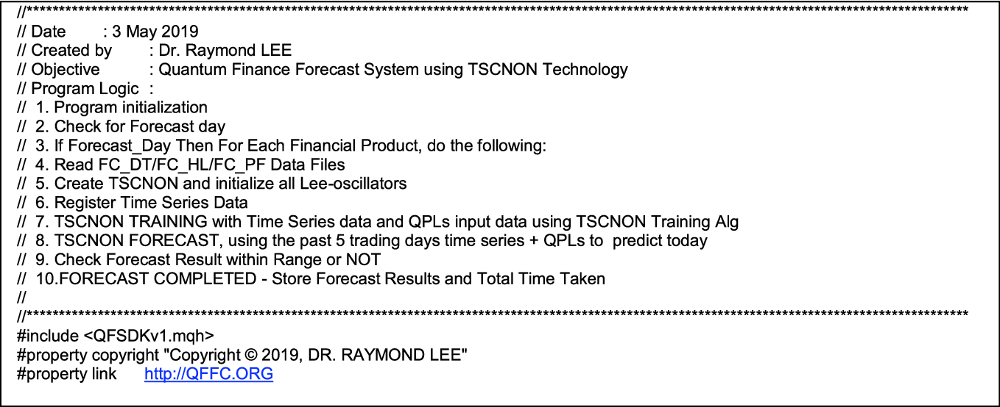 **Fig. 11.5. Main program logic of TSCNON.mq4** 

As shown in Fig. 11.6, quantum finance forecast center (a.k.a. QFFC) has implemented TSCNON system training and forecast functions and packaged into QFSDK software library. To use QFSDK software library, users should do the following: 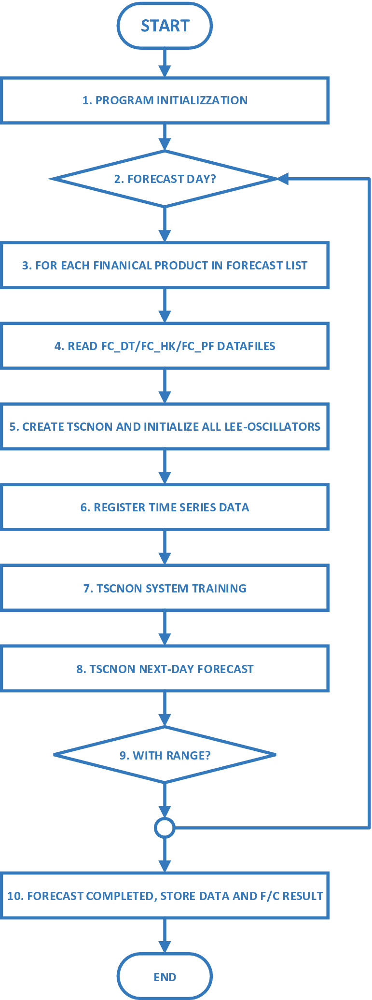 **Fig. 11.6. System flowchart of TSCNON system** 

1. Visit [QFFC.​org](<http://www.QFFC.org>) official site to download QFSDK;

2. Copy QFSDKv1.dll (or latest version) library file into your MT4 Libraries folder such as “MetaQuotes\Terminal\\..\MQL4\Libraries”;

3. Copy QFSDKv1.mqh (or latest version) header file into your MT4 Include directory such as “\MetaQuotes\Terminal\\..\MQL4\Include”;

4. In users’ individual TSCNON.mq4 program, add #include <QFSDKv1.mqh>, as shown in Fig. 11.5.

For the latest information about QFSDK, please visit [QFFC.​org](<http://www.QFFC.org>) official site.

In summary, TSCNON.mq4 is a real-time MQL-based multiple financial product daily forecast using TSCNON revealed in this chapter. It integrates QPL evaluation system studied in Chap. [10](<480082_1_En_10_Chapter.xhtml>) with TSCNON network construction, training, and forecast algorithm into QFSDK function library. Quantum finance developers only need to follow this system flowchart and call these QFSDK functions to build their own real-time quantum finance forecast systems.

Figure 11.6 shows TSCNON system flowchart. The entire TSCNON consists of 15 steps of programming process. As the entire program consists of over 1000 program codes, we will only discuss the core concepts and program fragment of each function process. For full and complete MQL source code, please visit [QFFC.​org](<http://www.QFFC.org>) official site—Workshop #2 quantum finance forecast system.

### 11.4.3 Process #1—Program Initialization

#### 11.4.3.1 Declaration of Data Files and Directories

The program initialization process consists of the following main modules:

1. declaration of data files and directories;

2. declaration of system parameters;

3. declaration of TSCNON forecast elements and variables;

4. creation of init() function class.

Actually, TSCNON is the first generation of quantum finance forecast system used in [QFFC.​org](<http://www.QFFC.org>) for real-time daily forecast and forecast performance analysis system of worldwide 129 financial products started from 2017. In other words, TSCNON not only performs the daily forecast but also analyses the previous trading day forecast performance, stored into the forecast performance data files for archive and upload to [QFFC.​org](<http://www.QFFC.org>) for public access. As shown in Fig. 11.7, four directories are used for data storage: 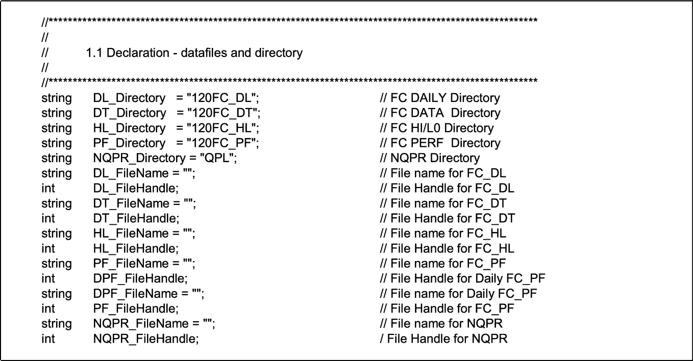 **Fig. 11.7. Declaration of data files and directories in TSCNON** 

1. 120FC_DL stores the daily forecast results of 120 financial products that include forecasts high/low and the closest 8 QPLs, which will also upload to [QFFC.​org](<http://www.QFFC.org>) official site every morning. This directory contains two data files: FC_DAILY and PF_DAILY. FC_DAILY contains the daily forecast table and PF_DAILY contains the daily forecast performance table. They are used for daily forecast archive and upload onto the [QFFC.​org](<http://www.QFFC.org>) official site. Figure 11.8 shows the daily forecast table for the first 20 financial products on May 3, 2019. Figure 11.9 shows the daily forecast performance table for the top 20 financial products on May 2, 2019 (sorted by the % errors). 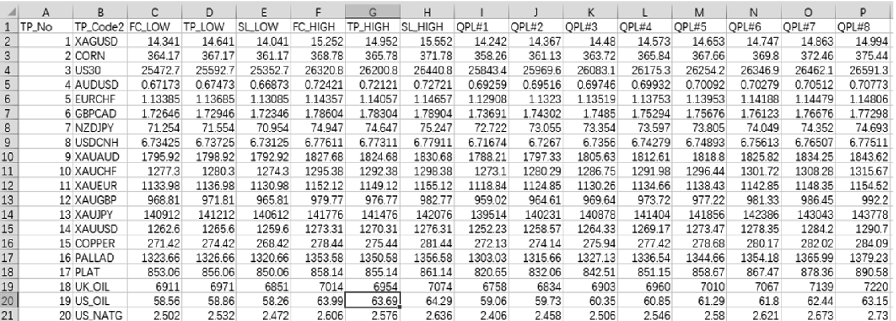 **Fig. 11.8. FC_DAILY—TSCNON daily forecast table of first 20 financial products on May 3, 2019** 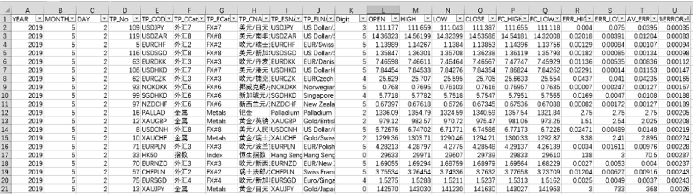 **Fig. 11.9. PF_DAILY—TSCNON daily forecast performance table of the top 20 financial products on May 2, 2019** 

2. 120FC_DT stores the normalized daily time series (DT) data (i.e., Open, High, Low, and Close) of the past 500-trading days. Totally 120 data files with each containing the time series of one trading product. For example, “1 XAGUSD_DT” contains the (normalized) time series of Silver/USD, where “1” is the product code number.

Figure 11.10 shows the (normalized) daily time series of XAGUSD. 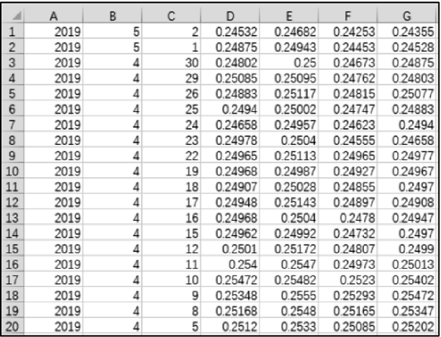 **Fig. 11.10. Normalized daily time series of XAGUSD** 

3. 120FC_HL contains previous 500-trading days forecast High/Low of each financial product. They are used for forecast archive and daily performance analysis. Figure 11.11 shows the normalized forecast H/L of XAGUSD. 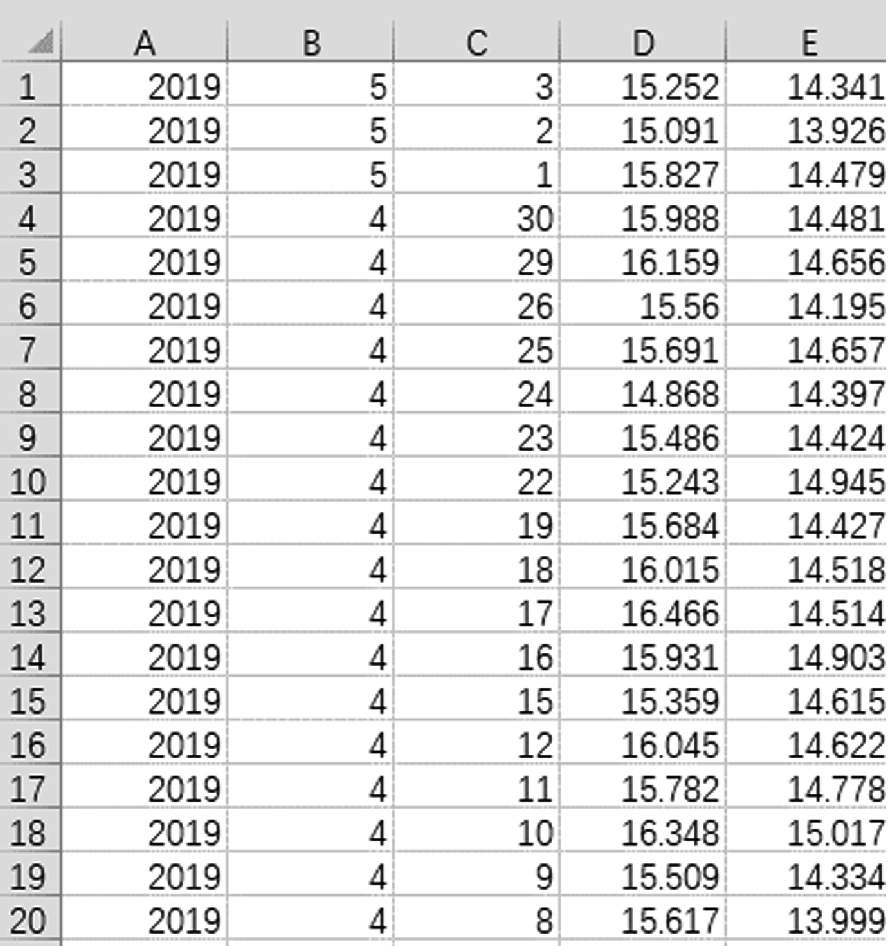 **Fig. 11.11. Normalized forecast H/L of XAGUSD** 

4. 120FC_PF contains daily forecast performance data files for each of the 120 financial products. As mentioned, TSCNON not only performs the daily forecast, but also performs the previous-day forecast performance analysis by calculating the forecast errors between previous-day forecast H/L with the actual H/L, stores into the 120FC_PF directory for the archive. Figure 11.12 shows the daily forecast performance table of XAGUSD. In which the first three columns are year, month, and day, columns D–G contain the actual Open, High, Low, and Close, columns H and I contain the forecast High and Low, columns J & K contain the forecast errors for High/Low and columns L and M contain their % errors. 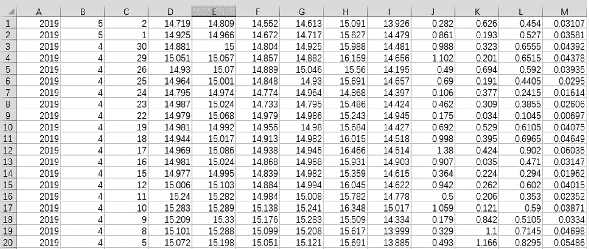 **Fig. 11.12. Daily forecast performance table of XAGUSD** 

#### 11.4.3.2 Declaration of System Parameters

This section declares the key parameters for the TSCNON system, they include the following:

- number of network layers;

- number of Lee-oscillators input, hidden and output layers;

- maximum training iterations (in case of deadlock);

- training and time series sizes;

- target RMSE (root-mean-square error);

- trading Product (TP) parameters include: TP code (only shown 5 for illustration purpose); TP code number (TP_No); TP number of digits (TP_nD); TP normalization value (TP_Norm); TP daily range between daily H/L (TP_range); stop loss (TP_SL), and target_price (TP_TP).

Figure 11.13 shows the declaration section of system parameters of TSCNON program. 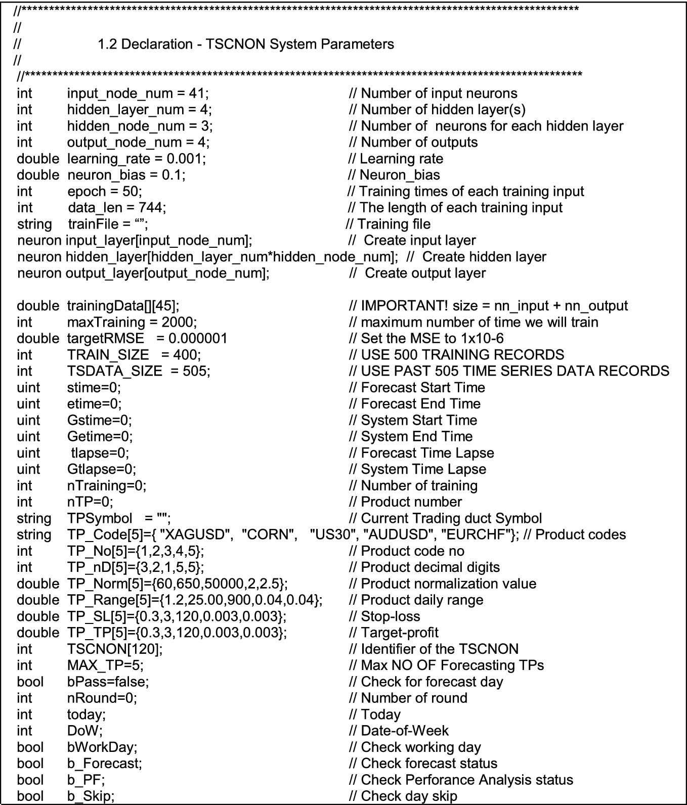 **Fig. 11.13. Declaration of system parameters** 

#### 11.4.3.3 Declaration of TSCNON Forecast Elements and Variables

This section declares the forecast elements and variables include: previous-day record elements for Open, High, Low, and Close (OHLC); today forecast elements for OHLC and QPL variables for the 8 closest QPLs as in Fig. 11.14. 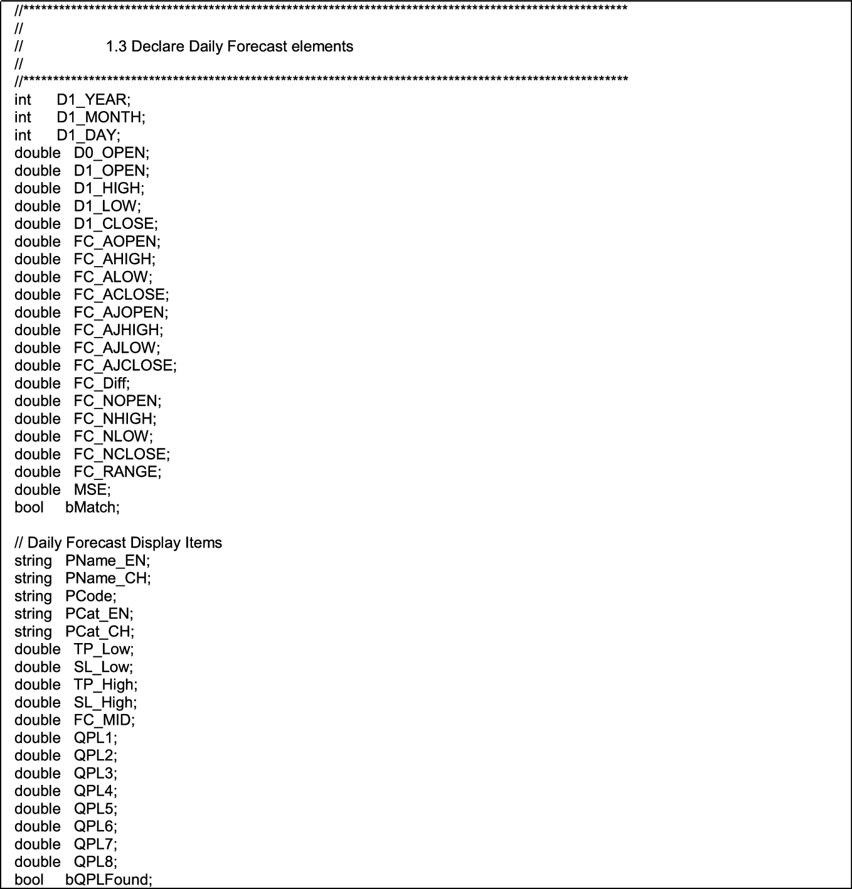 **Fig. 11.14. Declaration of forecast elements and variables** 

#### 11.4.3.4 Declaration of Variables in Init() Function Class

Declaration of variables in init() include the creation of init() and the declaration of all variables and arrays used in the program. As mentioned previously, init() instead of start() class is used as the forecast system is a “one-off” real-time system being used only once every morning of trading day; instead of trading program, which will be operated continuously throughout the entire trading day. Figure 11.15 shows the variables and arrays declaration section of the init() class. 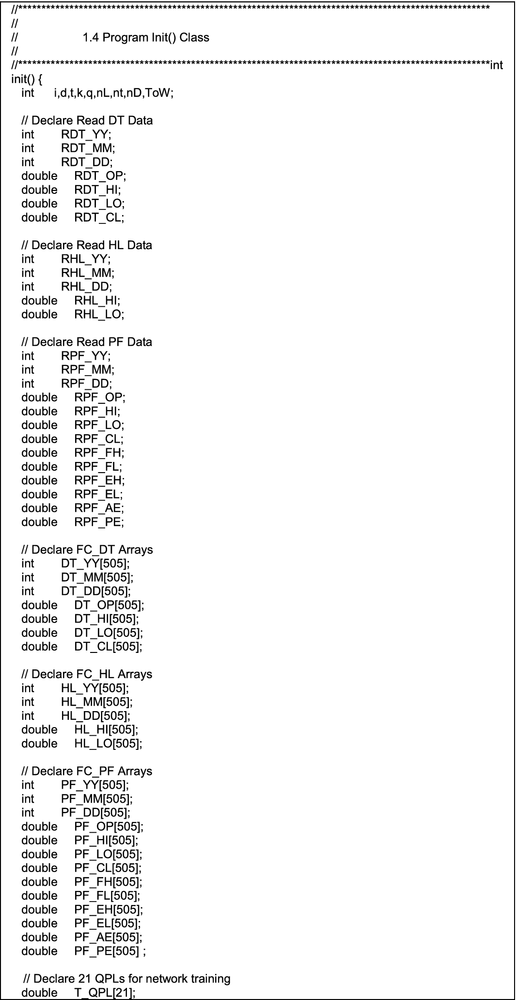 **Fig. 11.15. Declaration of variables in the init()** 

### 11.4.4 Process #2—Check for Forecast Day

As daily forecast will only perform during trading days from Monday to Friday (even though there are half-day trading in Saturday, but normally will not perform daily forecast as the half-day time period is too short for actual prediction).

This process will check whether today is a weekday (i.e., Mon–Fri) or not. If it is a weekday, b_Forecast will be set to _TRUE_ and the system will read FX_NQPR.csv data file. Actually, this file is the implementation results of the QPL evaluation program (QPL2019.mq4) revealed in Chap. [10](<480082_1_En_10_Chapter.xhtml>) for the QPLs evaluation of worldwide financial products, and NQPR.csv contains 21 NQPRs of 120 financial products.

By multiplying the _opening price_ for any trading day, users can calculate the 21 closest QPLs on both sides of the _opening price_ for TSCNON network training and the closest 8 QPLs evaluation for daily information update in the [QFFC.​org](<http://www.QFFC.org>) official site.

In addition, this section also prepares the file header for daily forecast file (FC_DAILY) and daily performance file (PF_DAILY), respectively. Figure 11.16 shows the program section of the checking for forecast day. 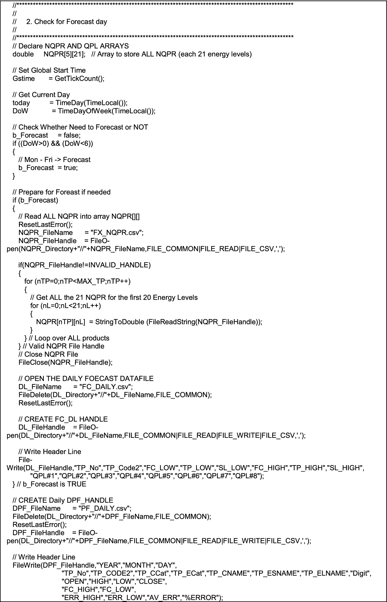 **Fig. 11.16. Process #2—Check for forecast day** 

### 11.4.5 Process #3—Loop over ALL Trading Products

This section will start the looping of ALL trading product data acquisition and forecasting. For every financial market, two cases exist. Either today _day_  _bar_ exists or not. If it does not exist, we set yesterday trading day closing as today opening to calculate the 8 closest QPLs and forecast result adjustment. In either case, the system will read and store the previous-day time series (i.e., O, H, L, C) for today forecast, archive, and calculation of yesterday performance (Fig. 11.17). 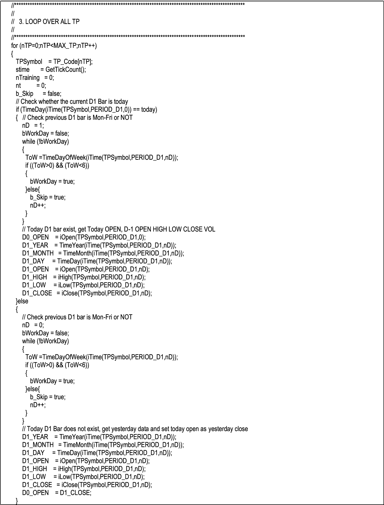 **Fig. 11.17. Process #3—Loop over all trading products** 

### 11.4.6 Process #4—Read FC_DT/HL/PF Data Files

This section will read three data source of previous time series, which are as follows:

- FC_DT—to read the previous 500-trading day normalized time series data, together with the previous-day OHLC for today forecast;

- FC_HL—to read the previous 500-trading day forecast H/L data, together with the previous-day actual H/L results to calculate yesterday forecast performance and stored into FC_PF file. The system will also store today’s forecast results after daily forecast;

- FC_PF—to open the previous 500-trading day daily performance data, and store yesterday forecast performance results.

#### 11.4.6.1 Process #4.1—Read FC_DT Data Files

This process will check whether the first data record is the current _D1 Bar_. If yes, there is no need to store it into the data array. In either case, the system reads all 500 previous-day time series into the DT data array for network training (Fig. 11.18). 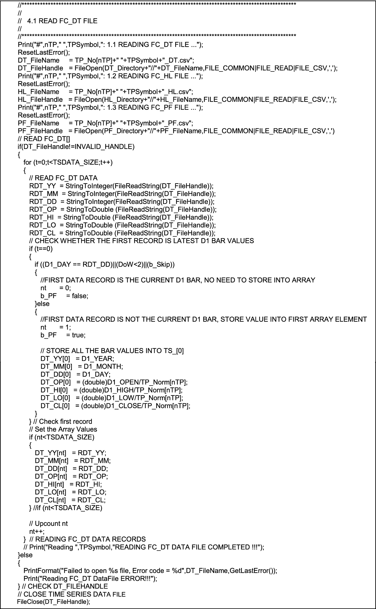 **Fig. 11.18. Process #4.1—read FC_DT file** 

#### 11.4.6.2 Process #4.2—Write FC_DT Data File if b_PF Is TRUE

This section checks whether b_PF is true or not. If it is true, record the previous-day time series into the FC_DT data file. Figure 11.19 shows the program code of Process #4.2. 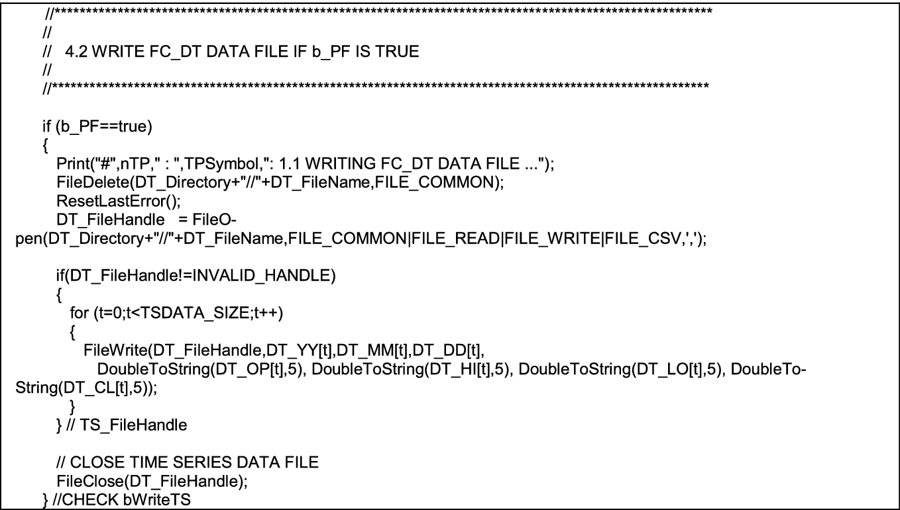 **Fig. 11.19. Process #4.2 write FC_DT data file if b_PF is TRUE** 

#### 11.4.6.3 Process #4.3—Read FC_HL Data Files

This section will read FC_HL data file, which stores the daily forecast H/L of the previous 500-trading day (Fig. 11.20). 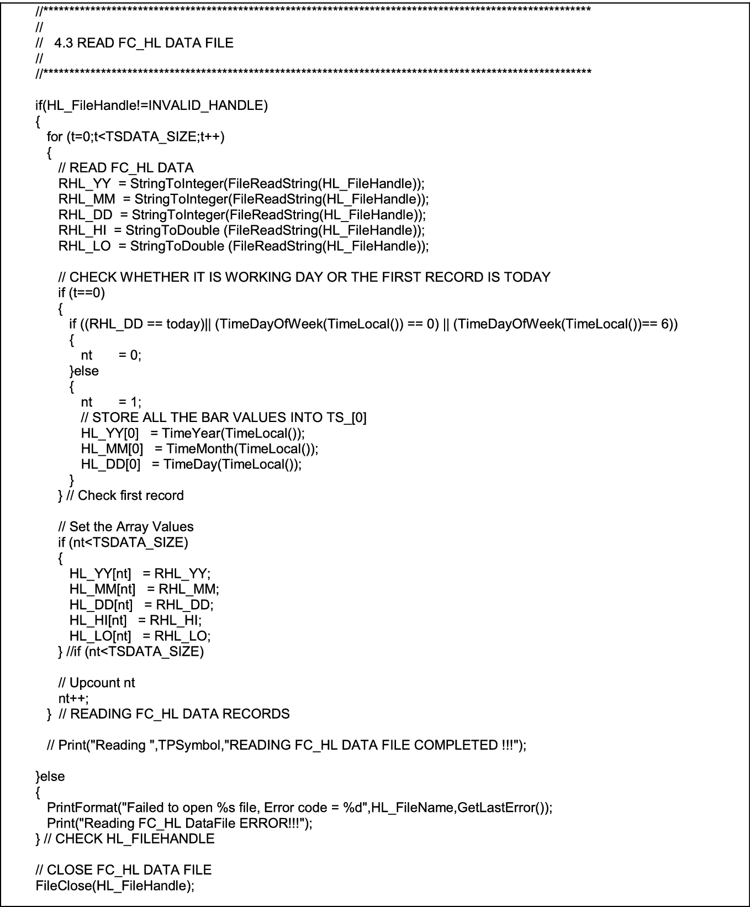 **Fig. 11.20. Process #4.3 read FC_HL data file** 

#### 11.4.6.4 Process #4.4—Read FC_PF Data Files

This section will read the FC_PF data file. This data file contains the previous 500-trading day daily forecast performance results (Fig. 11.21). 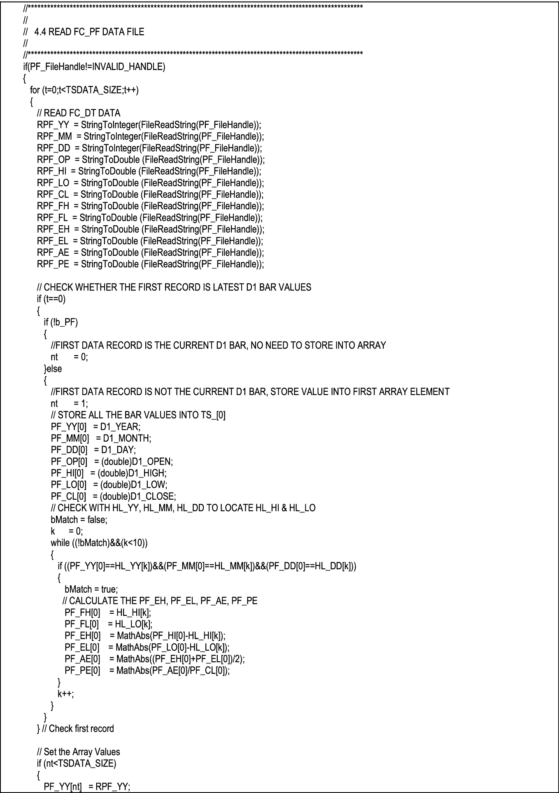 **Fig. 11.21. Process #4.4 read FC_PF data file** 

#### 11.4.6.5 Process #4.5—Write FC_PF Data File if bWrite Is TRUE

This section will check whether bWrite is TRUE. If it is true, calculate the yesterday forecast H/L errors, overall % errors, and store them into the FC_PF data file (Fig.11.22). 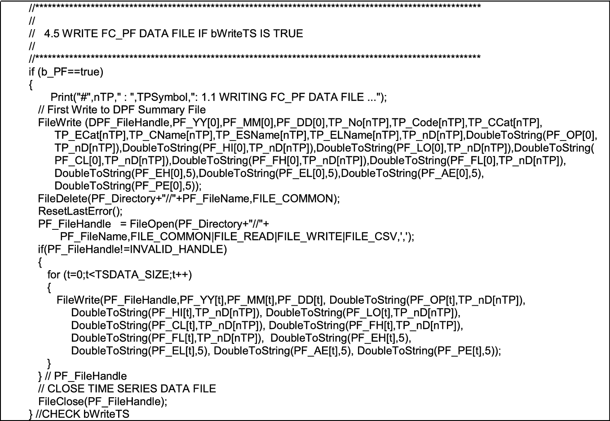 **Fig. 11.22. Process #4.5 write FC_PF data file if bWrite is TRUE** 

### 11.4.7 Process #5—Create TSCNON and Initialize ALL LEE-Oscillators

By using QFSDK, this process creates the TSCNON network and initial all the Lee-oscillator in different network layers (Fig. 11.23). 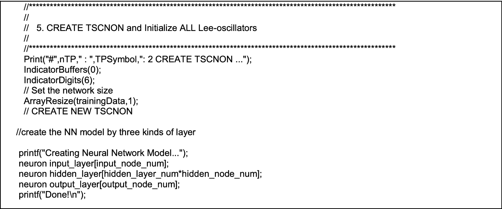 **Fig. 11.23. Process #5 Create TSCNON and Initialize ALL LEE-oscillators** 

### 11.4.8 Process #6—Register Time Series Data

This process calls prepareData() function to register the 500 time series input data one-by-one. Also, it makes use of NQPR array to generate all 21 QPLs for network inputs (Fig. 11.24).  **Fig. 11.24. Process #6 register time series data (SourceDr. Lee’s illustration, 2019)NoteTraining data file “Data_4_mix.csv” contains 744 records and for each record includes 40 data, the first 36 data presenting 9-days of O, H, L, C, and the last 4 data presenting next day of O, H, L, C** 

### 11.4.9 Process #7—TSCNON Training

This process performs network training with target RMSE defined in the declaration section (Fig. 11.25). 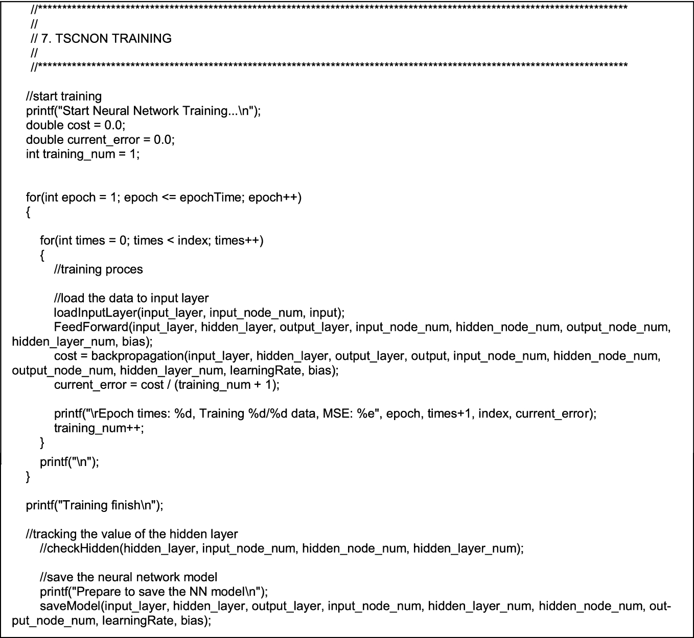 **Fig. 11.25. Process #7 TSCNON training** 

### 11.4.10 Process #8—TSCNON Forecast

This section registers the past 5-trading day time series and 21 QPLs to for next-day forecast (Fig. 11.26). 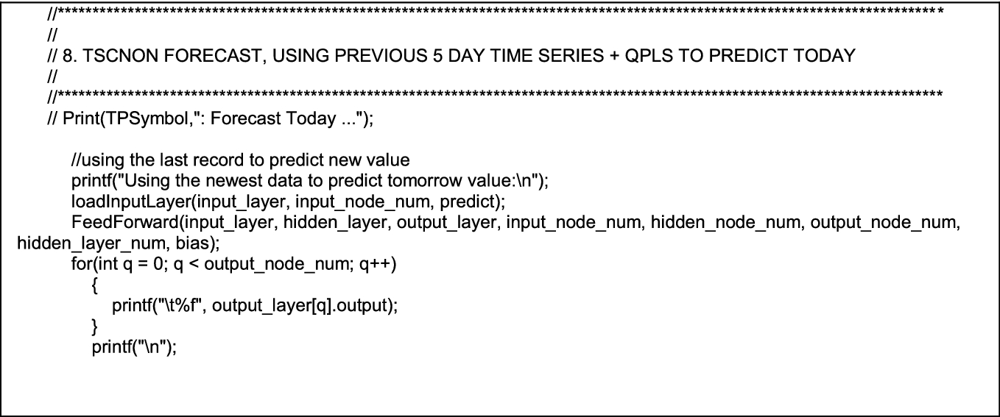 **Fig. 11.26. Process #8 TSCNON forecast** 

### 11.4.11 Process #9—Check Forecast Within Range or NOT

After TSCNON daily forecast, this process evaluates the range between forecast H and L can check whether it is within the acceptable range defined in the declaration section. It is to check whether the forecast OHLC are in logical values to decide whether it needs to forecast again (Fig. 11.27). 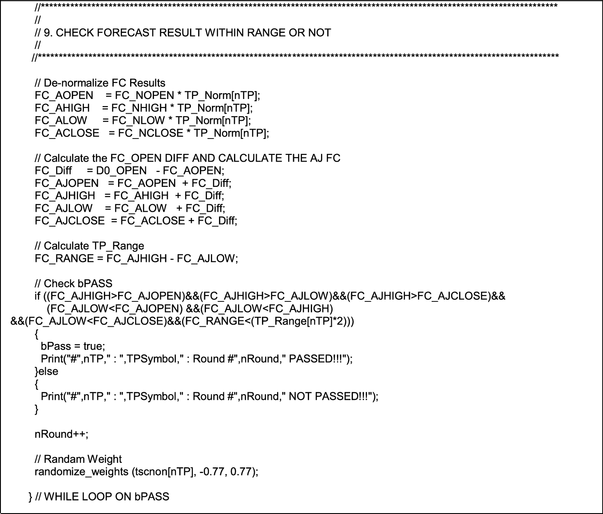 **Fig. 11.27. Process #9—check forecast within range or NOT** 

### 11.4.12 Process #10.1—Forecast Completed, Store Forecast Results and Total Time Taken

After the daily forecast is completed and within an acceptable range, this process calculates the total time taken, calculates the closest 8 QPLs and records the forecast results into FC_DAILY data file, for data archive and upload to [QFFC.​org](<http://www.QFFC.org>) official site (Fig. 11.28). 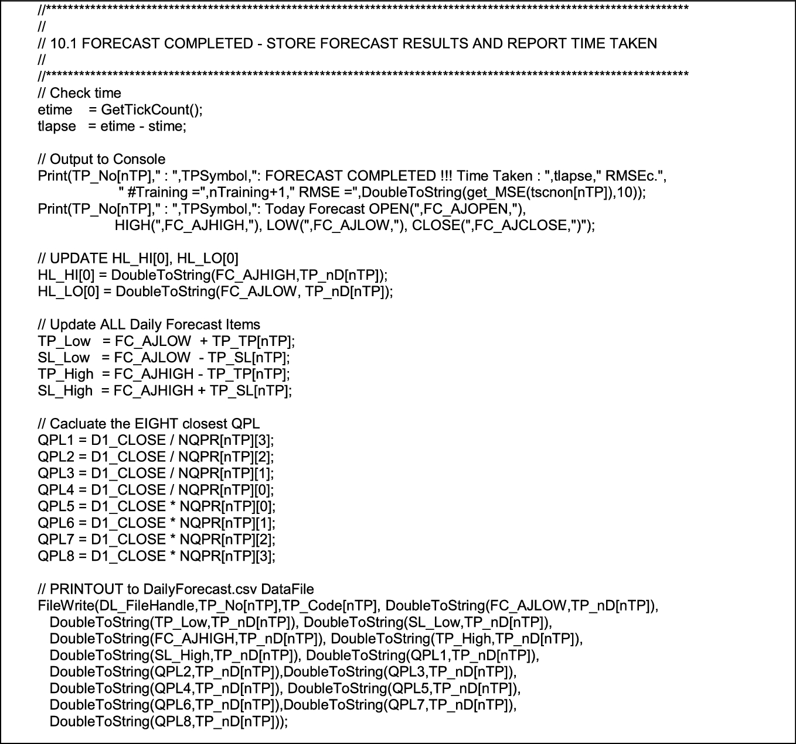 **Fig. 11.28. Process #10.1—forecast completed, store forecast results, and total time taken** 

### 11.4.13 Process #10.2—Write FC_HL Data File and Close All Files

This process writes the Forecast H/L into FC_HL data file and closes all data files (Fig. 11.29). 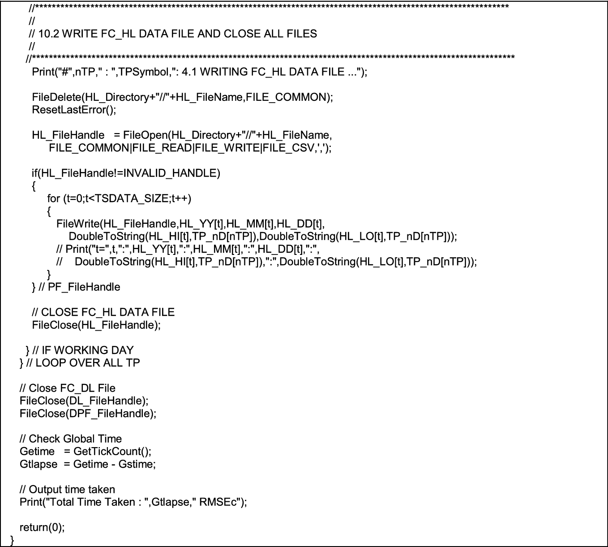 **Fig. 11.29. Process #10.2—write FC_HL data file and close all files** 

## 11.5 TSCNON—Implementation Results 

Figure 11.30 shows a snapshot of TSCNON system training and forecast process of 120 financial products of [Forex.​com](<http://Forex.com>) on May 6, 2019 in the server farm of quantum finance forecast center using Intel i5 CPU 2.39 GHz 32 MB RAM Dell Server. 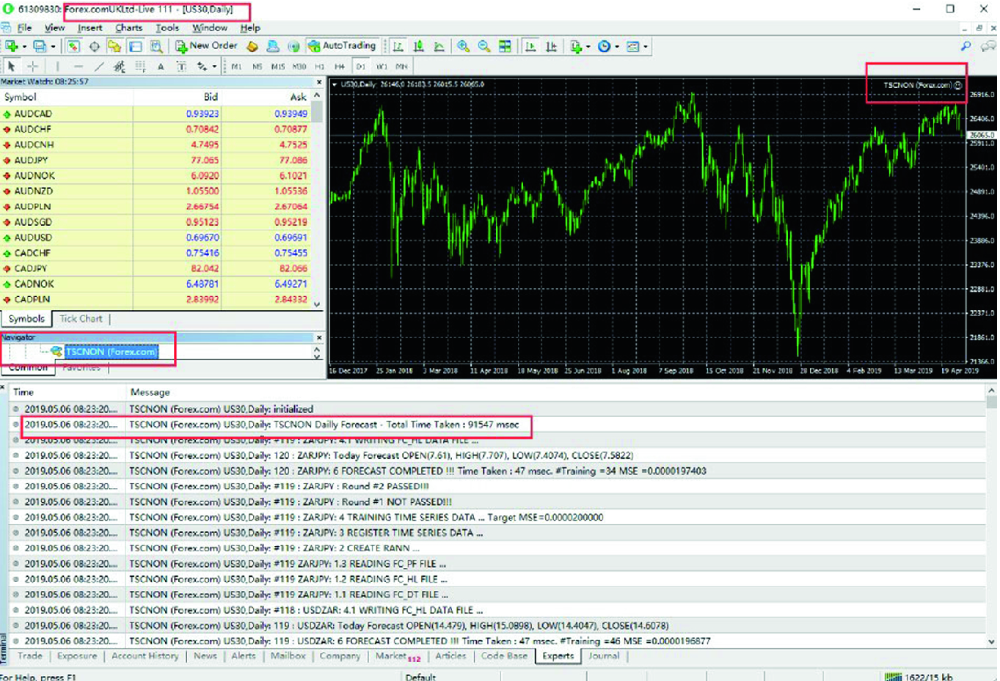 **Fig. 11.30. Snapshot of TSCNON (Forex.​com) for system training and forecast of 120 financial products forForex.​comMT4 platform on May 6, 2019** 

As shown in Fig. 11.30, in a typical daily forecast of 120 financial products on [Forex.​com](<http://Forex.com>) MT4 platform, the TSCNON system only took 91,547 ms (91.547 s) to finish the training and forecast of 120 financial products.

On average, it took 0.763 s (less than 1 s) to complete the network training and forecast process of a single financial product. Figure 11.31 shows the snapshot of TSCNON system for the system training and forecast of 9 major cryptocurrencies over [AvaTrade.​com](<http://AvaTrade.com>) MT platform on May 6, 2019. 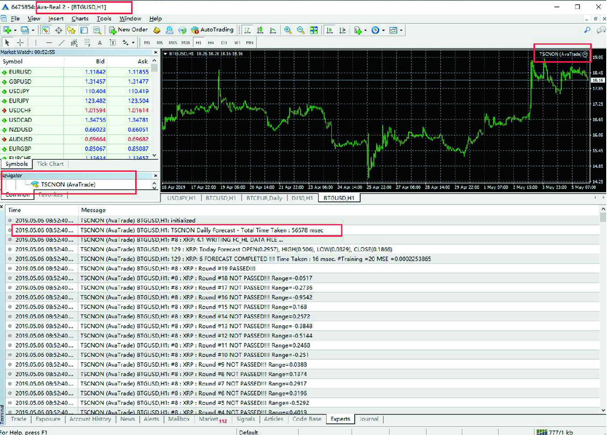 **Fig. 11.31. Snapshot of TSCNON (AvaTrade.​com) for system training and forecast of 9 major cryptocurrencies forAvaTrade.​comMT4 platform on May 6, 2019** 

As shown in Fig. 11.31, in a typical forecast day, TSCNON took 56,578 ms (56.578 s) to finish the training and forecast of the 9 cryptocurrencies. That is, on average it took 6.275 s to train and forecast a single cryptocurrency.

As compared with all those 120 non-cryptocurrency products, TSCNON took 8.22 times to predict cryptocurrency, even though cryptocurrency only have 300-trading day records while the other 120 financial products each have 2048-trading day records for system training. It may due to the fact that cryptocurrencies, in general, are much more chaotic and fluctuant in nature, which takes more time and iterations for TSCNON to learn the market pattern.

## 11.6 TSCNON—System Performance 

From the system performance and evaluation perspective, TSCNON system evaluated the daily forecast performance of the 129 financial products in four timeframes: daily, weekly average, monthly average, and past 500-day average. Figure 11.32 presents the past 500-day performance ranking list of the top 20 financial products.  **Fig. 11.32. Past 500-day system performance ranking chart of top 20 financial products (SourceDr. Lee’s illustration, 2019)Note1. High (Error) = Abs(HighForecast− HighActual) 2. Low (Error) = Abs(LowForecast− LowActual) 3. Average (Error) = Average(High(Error), Low(Error)) 4. % Error = Average(Error)/CloseActual** 

As shown, the 500-day average forecast % error of the top 20 financial products ranging from 0.011% to 0.227%, respectively, which is somewhat promising and significant as reflected by over 1000+ members of QFFC which consist of professional forex traders, quants, and investors.

To differentiate system performance with traditional FFBPN (feedforward backpropagation network), four categories of worldwide 129 financial products are tested using FFBPN and TSCNON systems with network training error rates ranging from 1 × 10−5 to 1 × 10−6, respectively.

Table 11.1 presents the system performance comparison chart of both systems.

Table 11.1

System performance comparison chart (FFBPN vs. TSCNON)

Product category| No. of products| FFBPNa| TSCNONa  
---|---|---|---  
Total STTb| Average STTc| Total STTb| Average STTc  
**Case I (Error rate = 1 × 10****−5**)  
Cryptocurrency| 9| 1,460,000| 162222.22| 15,783| 1753.67  
Forex| 84| 1,235,543| 14708.85| 19,126| 227.69  
Financial index| 19| 111,024| 5843.37| 2040| 107.37  
Commodity| 17| 109,142| 6420.12| 3100| 182.35  
Overall| 129| 2,915,709| 22602.40| 40,049| 310.46  
**Case II (Error rate = 1 × 10****−6**)  
Cryptocurrency| 9| DLd| –| 58,400| 6488.89  
Forex| 84| DLd| –| 72,679| 865.23  
Financial index| 19| 577,324| 30385.47| 6939| 365.21  
Commodity| 17| 687,595| 40446.76| 9922| 583.65  
Overall| 129| –| –| 147,940| 1146.82  
  
 _Note_

aResults are generated by 500 simulations of both FFBPN and TSCNON system training (in ms)

b“Total STT” denotes the total average system training time for 500 simulations of network training using FFBPN and TSCNON system for each category of financial products

c“Average STT” denotes the average system training time for a single financial product of each category

d“DL” denotes deadlock during system training

As shown in Table 11.1, system simulations using error rate 1 × 10−5 (Case I); the average total time taken for 129 financial products training using FFBPN and TSCNON were 2,915,709 ms (48.6 min) and 40,049 ms (40.05 s), respectively. TSCNON outperformed FFBPN by 72.8 times in terms of network training time to attain the same error rate. Also, system simulations in Case II using error rate 1 × 10−6, TSCNON completed the system training task in 147,940 ms (147.9 s) while FFBPN encounters “deadlocks” during system training for cryptocurrency and forex products; which clearly demonstrated the resolution of over-training and deadlock problems with sufficient improvement in system training efficiency by using TSCNON over traditional neural networks.

In terms of system performance across different financial products, the simulation results clearly showed that both cryptocurrency and forex are more chaotic and difficult for network training than other financial products as expected, which will be further explored in the future research of QFFC.

## 11.7 Conclusion 

TSCNON (time series chaotic neural oscillatory network) is for real-time financial prediction incorporated into quantum finance forecast center—a nonprofit making AI-fintech R&D and worldwide financial forecast center aims at R&D and provision of a fair and open platform for worldwide traders and individual investors to acquire free knowledge of worldwide 129 financial product forecasts based on state-of-the -art AI, chaotic neural networks and quantum field theory technologies.

If TSCNON is so effective to forecast worldwide financial markets, is it the end of story?

The truth is: For a professional trader and investor, a reliable and effective financial forecast system is only the beginning of the story. A good financial investment also needs: (1) good, effective trading and hedging strategies; (2) stable, logical with rational investment psychology, which are also the future R&D directions of quantum finance forecast center.

Current research of QFFC include the following:

1. Integration of TSCNON with fractal technology for market trends/patterns mining and prediction;

2. R&D on quantum entanglement of quantum finance system on severe financial event modeling and prediction;

3. Design and implementation of _chaotic type_ -_2 transient_ -_fuzzy deep neural oscillatory network_ for real-time financial prediction;

4. Design and develop intelligent agent-based hedging and trading systems as discussed in Chap. [13](<480082_1_En_13_Chapter.xhtml>) (Lee 2019).

### Problems

1. 11.1

What is a recurrent neural network (RNN)? How it is different from the traditional neural network in terms of network architecture.

2. 11.2

Explain how to integrate Lee-oscillator(s) into a recurrent neural network (RNN) to convert RNN into chaotic RNN.

3. 11.3

In TSCNON, we use the closest, say, 20 quantum price levels (QPLs) as quantum finance signals (QFSs) for network training.

     1. (i)

What is the ground state (i.e., QPL0) of QPL? Why?

     2. (ii)

Using numerical computational method learnt in Chap. [10](<480082_1_En_10_Chapter.xhtml>), work out the formulation of the closest 21 QPLs.

(i.e., QPL+10 … QPL0 … QPL-10)

4. 11.4

In TSCNON, we use normalized quantum price levels (QPLs) as input vectors of QFS, can we use the normalized quantum price return (QPRs) instead of QPLs as input signals? Why?

5. 11.5

The following figure shows the bifurcation diagram of Lee-oscillator discussed in Chap. [9](<480082_1_En_9_Chapter.xhtml>).

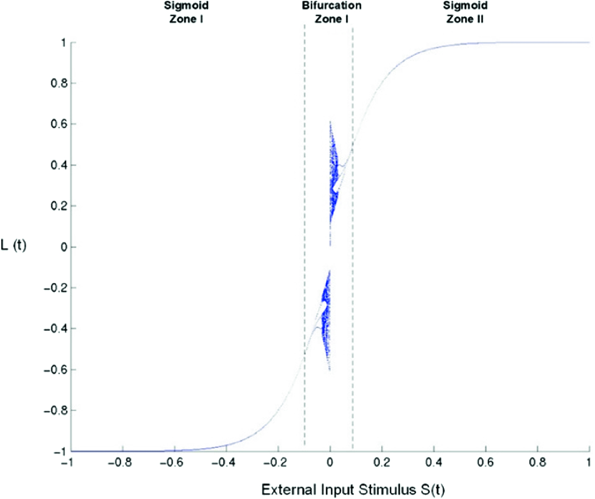 **** 

     1. (i)

Based on this bifurcation diagram and Eqs. (11.1)–(11.4), write a MATLAB program to generate the TCAF (transient chaotic activation function) with external input stimulus S(t) and L(t) in the normalization region [0, 1].

     2. (ii)

From the TCAF, identify the active bifurcation region.

     3. (iii)

During the normalization process of all input signals in the TSCNON, what is the optimal normalization region? Why?

6. 11.6

In TSCNON discussed in this Sect. 11.2, 5-day timeseries are used as input signal vectors with QPLs to forecast next-day high/low Prices. Why? Try to use more trading days, says 21 days to do next-day forecast and check the difference.

7. 11.7

In this chapter, we used TSCNON for daily financial prediction. Discuss and explain how we can use TSCNON for weekly and monthly prediction in terms of (1) time series input vectors; (2) time horizon for network training; and (3) QPLs being used. Do we need to recalculate all the QPLs? Why?

8. 11.8

In Chap. [8](<480082_1_En_8_Chapter.xhtml>), we learnt how initial conditions are critical for the prediction of complex and highly chaotic systems like weather and financial markets. Discuss why we can still use chaotic neural networks to perform financial prediction? What is the basic concept and logic behind?

9. 11.9

In [QFFC.​org](<http://www.QFFC.org>), four timeframes of daily system performance analysis are generated: daily, weekly, monthly, and 500-Day average daily performance. Discuss and explain physical meaning and importance of each type of performance results in terms of (1) system stability and (2) significance on different timeframes of trading. Which financial products are the best in terms of forecast performance? Why?

10. 11.10

Programming task 11.1

     1. (i)

Follow workshop #2 and implement the TSCNON system for at least 10 different Forex products, using 5-day time series and 21 closest QPLs to predict next-day high/low–system A.

     2. (ii)

Implement the same forecast system but this time without using QPLs as input QFS–system B.

     3. (iii)

Compare systems A and B in terms of (1) system learning performance in 1000 iterations; (2) next-day forecast performance.

11. 11.11

Programming task 11.2

     1. (i)

As an extension of task 11.1, this time change the number of closest QPLs from 10 to 30, with an increment of 2 QPLs (i.e.,one more QPL on each side). So totally we have 11 sets of systems for testing.

     2. (ii)

Modify TSCNON.eq4 program to automate system testing process of these 11 experiments.

     3. (iii)

Compare these 11 systems in terms of (1) System learning performance in 1000 iterations; (2) next-day forecast performance, and locate the optimal number of QPL values.

### Acknowledgements

The author wishes to thank [Forex.​com](<http://Forex.com>) and [AvaTrade.​com](<http://AvaTrade.com>) for the provision of historical and real-time financial data. The author also wishes to thank Quantum Finance Forecast Center of UIC for the R&D supports and the provision of the channel and platform [QFFC.​org](<http://www.QFFC.org>) for worldwide system testing and evaluation.
