# 12\. Chaotic Type-2 Transient-Fuzzy Deep Neuro-Oscillatory Network (CT2TFDNN) for Worldwide Financial Prediction

© Portions of this chapter are reprinted from Lee (2019a), with permission of IEEE.

In this chapter, the author proposed a chaotic type-2 transient-fuzzy deep neuro-oscillatory network with retrograde signaling (aka CT2TFDNN) for worldwide financial prediction. With the extension of the author’s original work on Lee-oscillator—a chaotic discrete-time neural oscillator with profound transient-chaotic property, CT2TFDNN provides: (1) effective modeling of Interval type-2 fuzzy logic with chaotic type-2 transient-fuzzy membership function (CT2TFMF); (2) effective time series network training and prediction using chaotic deep neuro-oscillatory network with retrograde signaling (CDNONRS). CT2TFDNN not only provides a fast chaotic fuzzy-neuro deep learning and forecast solution, but also it successfully resolves the massive data over-training and deadlock problems, which are usually imposed by traditional recurrent neural networks using classical sigmoid-based activation functions. From the implementation perspective, CT2TFDNN is integrated with 2048-trading day time series financial data and top-10 major financial signals as fuzzy financial signals (FFS) for the real-time prediction of 129 worldwide financial products which consists of: 9 major cryptocurrencies, 84 worldwide forex, 19 major commodities, and 17 worldwide financial indices.

Over the years, financial engineering ranging from the study of financial signals to the modeling of financial prediction is one of the most exciting topics for both academia and financial community. With the flourishing of AI technology in the past 20 years, various hybrid intelligent financial prediction systems with the integration of neural networks, chaos theory, fuzzy logic, and genetic algorithms were proposed. Interval type-2 fuzzy logic system (IT2FLS) with its remarkable capability for the modeling of highly uncertain events and attributes, provides a perfect tool to interpret various financial phenomena and patterns.

In this chapter, the author proposed a chaotic type-2 transient-fuzzy deep neuro-oscillatory network with retrograde signaling (aka CT2TFDNN) for worldwide financial prediction (Lee 2019a, b). With the extension of author’s original work on Lee-oscillator—a chaotic discrete-time neural oscillator with profound transient-chaotic property, CT2TFDNN provides: (1) effective modeling of Interval type-2 fuzzy logic with chaotic type-2 transient-fuzzy membership function (CT2TFMF); (2) effective time series network training and prediction using chaotic deep neuro-oscillatory network with retrograde signaling (CDNONRS). CT2TFDNN not only provides a fast chaotic fuzzy-neuro deep learning and forecast solution but also more prominently successfully resolves the massive data over-training and deadlock problems, which are usually imposed by traditional recurrent neural networks using classical sigmoid-based activation functions. From the implementation perspective, CT2TFDNN is integrated with 2048-trading day time series financial data and top-10 major financial signals as fuzzy financial signals (FFS) for the real-time prediction of 129 worldwide financial products which consists of: 9 major cryptocurrencies, 84 worldwide forex, 19 major commodities, and 17 worldwide financial indices.

## 12.1 Introduction 

This chapter introduces an innovative chaotic type-2 transient-fuzzy deep neuro-oscillatory network with retrograde signaling (aka CT2TFDNN) for worldwide financial time series prediction.

With the extension of author’s original work on Lee-oscillator—a discrete-time neural oscillator with profound transient-chaotic property on temporal information progressing (Lee 2004a, 2005, 2006a, b), together with the author’s latest works on the exploration of Lee-oscillator with retrograde signaling (LORS), which generalizes into eight categories of bifurcation transfer functions for deep learning, CT2TFDNN successfully integrates discrete-time chaotic neural oscillators (for chaotic neural activity modeling), chaotic deep neuro-oscillatory network with 8-hidden layers of neuro-oscillators with various degree of retrograde signaling (for chaotic time series deep learning and prediction) and chaotic type-2 transient-fuzzy logic (for high-order uncertainty modeling of financial signals) into: (1) effective modeling of type-2 fuzzy logic with chaotic type-2 transient-fuzzy membership function (CT2TFMF); (2) effective time series network training and prediction using chaotic deep neuro-oscillatory network with retrograde signaling (CDNONRS).

CT2TFDNN not only provides a fast chaotic fuzzy-neuro deep learning and forecast solution, more prominently it successfully resolves the massive data over-training and deadlock problems, which are usually imposed by traditional recurrent neural networks and fuzzy neural networks using IT2 fuzzy membership functions and/or hybrid neural networks using classical sigmoid-based activation functions.

From the implementation perspective, CT2TFDNN is integrated with 2048-trading day time series financial data and top-10 major financial signals as input signals for the real-time prediction and agent-based trading of 129 worldwide financial products which consists of: 9 major cryptocurrencies, 84 worldwide forex, 19 major commodities, and 17 worldwide financial indices.

The main contributions and originality of this system include:

1. The introduction of an innovative type-2 fuzzy logic system (T2FLS), which is inspired by the author’s original work on Lee-oscillators (Lee 2004). Different from the contemporary research on T2FLS which mainly focus on the R&D of the interval type-2 logic system (IT2FLS)—a simplified version of T2FLS due to its computational complexity, this chapter proposed a chaotic type-2 transient-fuzzy logic system (CT2TFLS)—a truly IT2LS with remarkable chaotic transient-fuzzy property to resolve the computational complexity problem.

2. The introduction of CT2TFDNN—an innovative fuzzy-neuro deep neural network, which is not only the integration of two AI technologies as two separate functional modules proposed by numerous hybrid fuzzy-neuro systems, the CT2TFDNN introduced in this chapter is constructed by LORS—chaotic neural oscillators invented by the author which serves as _transient_ -_fuzzy input neurons_ of the DNN and effectively converts it into CT2TFDNN system. In other words, the chaotic transient-fuzzification process is actually part of the neural model of CT2TFDNN.

3. The successful resolution of the massive data over-training and deadlock problems, which are usually imposed by traditional recurrent neural networks using classical sigmoid-based activation functions.

4. The successful design and implementation of real-time financial forecast system of worldwide financial products with state-of-the-art CT2TFDNN system.

This chapter is comprised of (1) literature review on (i) type-1 and interval type-2 fuzzy logic systems (FLS) on financial prediction; (ii) chaotic neural networks, Lee-oscillator, and the author’s latest work on Lee-oscillator with retrograde signaling (LORS) in Sect. 12.2; (2) system framework and methodology of CT2TFDNN for financial time series prediction which include: chaotic type-2 transient-fuzzification scheme, GA-based top-10 fuzzy financial signals (FFS) selection scheme and the chaotic deep neuro-oscillatory network learning algorithm in Sect. 12.3; (3) system implementation of CT2TFDNN for real-time prediction of worldwide 129 financial products in Sect. 12.4; (4) performance analysis of proposed CTSTFDNN and comparison with five forecast systems: (i) traditional time series feedforward backpropagation networks (FFBPN), (ii) support vector machine (SVM) provided by R Project—one of the most popular financial forecasting tools used in finance industry, (iii) deep neural network (DNN) with PCA (principal component analysis) model (Singh and Srivastava 2017), (iv) classical interval type-2 fuzzy-neuro network (IT2FNN), (v) chaotic type-1 fuzzy-neuro-oscillatory network (CT1FNON) in Sect. 12.5; and (5) conclusion in Sect. 12.6.

## 12.2 Literature Review 

In a typical financial prediction problem, there are two basic problems we must tackle with: (1) massive and highly uncertain financial patterns and signals; (2) massive time series data and information for system training and machine learning. fuzzy logic system (FLS) (Zadeh 1975; Ross 2016; Siler and Buckley 2004; Zadeh and Aliev 2019) with its intrinsic property of handling attributes of uncertainty, provides a viable solution for system modeling and data representations.

This section gives a general overview of type-1 and type-2 FLSs, their systems’ characteristics and limitations, and the current research of FLS in financial predictions. To tackle with highly chaotic and massive time series data such as severe weather information and financial data, data scientists, and AI researchers are now exploring the possibility of adopting chaotic neural oscillators into traditional recurrent neural networks—chaotic neuro-oscillatory networks (CNON, or chaotic neural networks, CNN in short) for chaotic time series modeling and forecast. This section gives a general overview of chaotic neural oscillator and the author’s original work on Lee-oscillator, its neural architecture, and the latest works on Lee-oscillator with retrograde signaling (LORS).

### 12.2.1 An Overview on Type-1 and Interval Type-2 Fuzzy Logic Systems on Financial Prediction

Like many real-world phenomena, the linguistic variables used to describe financial markets (or market patterns), ranging from worldwide financial indices and stocks, to highly volatile markets such as worldwide forex and cryptocurrencies are typical fuzzy logic systems (FLS) with high degree of uncertainty and fuzziness (Ross 2016; Siler 2004; Zadeh 1975; Zadeh and Aliev 2019).

For example, to describe a typical stock market (e.g., Nasdaq Index), financial professionals are usually using fuzzy linguistic variables such as: bearish, bullish, over-buy, or over-sell. More importantly, these fuzzy linguistic variables are usually coexisting and overlapping in nature. For instance, when a stock market (e.g., Dow Jones Index) appeared to be bearish (means short-sell), it is also having a certain degree of over-sell (means rebound—with just the opposite trading signal) simultaneously. The same case occurs in a bullish market. Besides, all these linguistic variables are _fuzzy_ in the sense that the meaning of _bearish_ or _bullish_ are highly subjective and different for different people, even for the same person the meanings of these linguistic variables are usually different at different times and scenarios.

In order to model these highly uncertain and fuzzy linguistic variables into a computer system (such as neural networks) for system modeling, FLS is one of the most viable solutions. A typical FLS consists of three main modules:

1. fuzzification module,

2. inference module, and

3. defuzzification module.

Figure 12.1 shows a typical type-1 fuzzy membership function (T1-FMF) of RSI (relative strength index)—one of the most commonly used financial indexes in financial engineering (Lee 2006b). 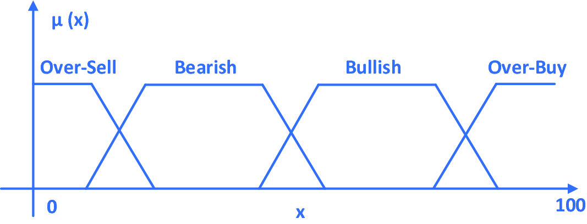 **Fig. 12.1. Type-1 fuzzy membership function of relative strength index (RSI)** 

Zadeh (1975) in his influential paper _The Concept of a Linguistic Variable and its Application to Approximate Reasoning_ introduced the concept of higher order type-n fuzzy logic system (Tn-FLS) as

>  _A fuzzy set is of type n, n_ =_2, 3, …, if its membership function ranges over fuzzy sets of type n_ -_l. The membership function of a fuzzy set of type 1 ranges over the interval [0, 1]._

For example, in a typical _type_ -_2 FLS_ , the membership function of each attribute of the system itself is also a fuzzy set with a fuzzy range over the interval [0, 1]. In other words, a higher order (n > 1) _type_ -_n FLS_ will increase the degree of uncertainty of each fuzzy variable substantially.

But it has an intrinsic problem of computational complexity. For a simple situation of a _T2_ -_FLS_ with _k_ fuzzy variables, each fuzzy variable has _m_ membership functions, and each membership function is quantized into _N_ different states. The total number of possible fuzzy rules/states will be $(N^{m} )^{k}$, which will be an astronomical number when such method is applied to real-world financial time series prediction problems which usually have over 50 fuzzy attribute signals (from different financial indicators and oscillators) to consider and each attribute has 4 membership functions, each can span up to 100 different states, which means $(100^{4} )^{50}$ possible states/fuzzy rules!

In order to solve this computational problem, _interval type_ -_2 fuzzy logic system_ (IT2FLS) is introduced. In a typical IT2FLS, only certain interval(s) of the T2 membership function (usually the intervals of the _state_ -_transition_ -_region_ , _STR_) are fuzzified to a second-order FMF. Figure 12.2 shows a typical interval type-2 fuzzy membership function (IT2-FMF) of relative strength index (RSI) for financial engineering. 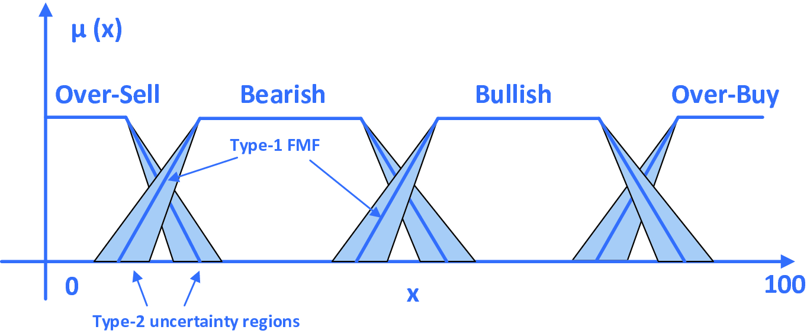 **Fig. 12.2. Interval type-2 fuzzy membership function (IT2-FMF) of RSI** 

A typical interval type-2 fuzzy set (IT2-FS), denoted by $\tilde{A}$ is formulated by $$\mu_{{\tilde{A}}} (x) = \int\limits_{{x}{\upepsilon}{X}} {\int\limits_{{u \in \left[ {\bar{\mu }_{{\tilde{A}}} (x),\underline{\mu }_{{\tilde{A}}} (x)} \right]}} {1/u} }$$ (12.1) 

where $\bar{\upmu}_{{{\tilde{\text{A}}}}} ({\text{x}})$ and $\underline{\upmu}_{{{\tilde{\text{A}}}}} ({\text{x}})$ denote the upper and lower membership functions for the IT2-FS (Ã).

As shown in Fig. 12.2, the IT2-FMF is characterized by the second-order FMF (the _grey areas_) in the fuzzy membership function, which are also known as FOU (_footprints of uncertainty_). Owing to this high uncertainty modeling capability of IT2FLS as compared with its T1-FLS counterpart, extensive researches have been done in the past 20 years, especially in the fields of fuzzy financial modeling and time series prediction.

Latest works of type-2 FLS in financial time series modeling and prediction include: Castillo et al. have done extensive research of IT2FLS and fuzzy-neuro systems on time series financial predictions including Mexican Stock Exchange and Taiwan Stock Exchange (Castillo et al. 2014; Melin et al. 2012; Gaxiola et al. 2017; Ontiveros et al. 2018; Pulido et al. 2018); Bhattacharya et al. (Bhattacharya et al. 2016; Konar and Bhattacharya 2017; Bhattacharya and Konar 2018) using self-adaptive IT2FLS for stock prediction; IT2FLS for chaotic time series prediction proposed by Lee et al. (2014); Multi-order fuzzy time series forecasting model proposed by Ye et al. (2016) and Yolcu et al. (2016); Compact Evolutionary Interval-Valued Fuzzy Rule-based system for real-time financial prediction proposed by Sanz et al. (2015); Interval Type-2 Mutual Subsethood Fuzzy Neural Inference System proposed by Sumati and Patvardhan (2018) for time series prediction and function approximation; Fuzzy time series forecast of Taiwan stock market based on two-factor second-order fuzzy-trend logical relationship groups (TSFTLRGs) with particle swarm optimization technique proposed by Chen and Jian (2017); IT2FLS for stock index forecast based on fuzzy logical relationship map proposed by Jiang et al. (2018); and type-2 neuro-fuzzy for stock price prediction based on self-constructing clustering method of fuzzy rules and particle swarm optimization technique by Liu et al. (2012).

Although IT2FLS provides a viable and computational feasible solution to model highly uncertain phenomena, the determination and formulation of FOU is still an area of interest in which the de facto usage of _triangular-shape_ formulation as FOU is also queried to be a bit _artificial_ in nature, which motivates the author to search for an integrated mathematical framework to model both interval type-2 fuzzy and type-1 fuzzy regions in IT2-FMF as a single continuous _transient-fuzzy_ membership function.

By the extension of the author’s original work on _Lee-oscillator_ s (Lee 2004a), this chapter proposed an innovative solution for the modeling of chaotic type-2 transient-fuzzy logic (CT2TFL) by using multiple composite _Lee-oscillator_ s.

The motivation for introducing CT2TFL is in three aspects, which are as follows:

1. Typical financial signals and indicators such as RSI and MACD coexist with multiple linguistic variables (over-sell, bearish, bullish, and over-buy), FLS is a viable solution for technical signal modeling;

2. These linguistic variables themselves exist with different degrees of uncertainty and fuzziness in nature, T2FLS is the best tool for handling such high-order degree of fuzziness;

3. If we can construct a chaotic neural oscillator model in which its transient-chaotic bifurcation diagram itself can directly model (simulate) a typical T2FLS with a transient-fuzzy property only appears in FOU, the computational complexity problem of T2FLS will be effectively resolved. More importantly, if such composite chaotic neural oscillators themselves are exactly input neurons of a deep neural network (DNN), the type-2 fuzzification process will become the _intrinsic property_ of the DNN itself; instead of _external_ fuzzification process in many contemporary fuzzy-neuro systems.

In the next section, we will study an overview of discrete-time neural oscillators and chaotic neural networks; and how it can be used to implement a type-2 chaotic fuzzy neural network for time series prediction. After that, we will explore how composite _Lee-oscillator_ s can be used to model _T2FMF_ for financial time series financial prediction.

### 12.2.2 Lee-Oscillators with Retrograde Signaling (LORS)

Latest research in neuroscience revealed that _retrograde signaling (RS)_ in neurons plays a vital role in temporal information processing and memory recalling in human brain (Faghihi and Moustafa 2017; Korkut et al. 2013; Naeem et al. 2015; Yoshihara et al. 2005), while abnormal retrograde signaling may lead to various types of memory disorders such as dementia, memory loss, Alzheimer disease, and Down syndrome (Sidoryk et al. 2011; Steinert et al. 2010; Verkhratsky et al. 2010; Volman et al. 2007).

Inspired by retrograde signaling in neurons, _chaotic Lee-oscillators with retrograde signaling_ (aka _LORS_) is the extension of the author’s previous works on _Lee-oscillator_ (Lee 2004a; 2006a) with the integration of retrograde feedback signals in the neural dynamics for the improvement of temporal information processing in neural oscillatory networks. Figure 12.3 shows the neural architecture of _LORS_. 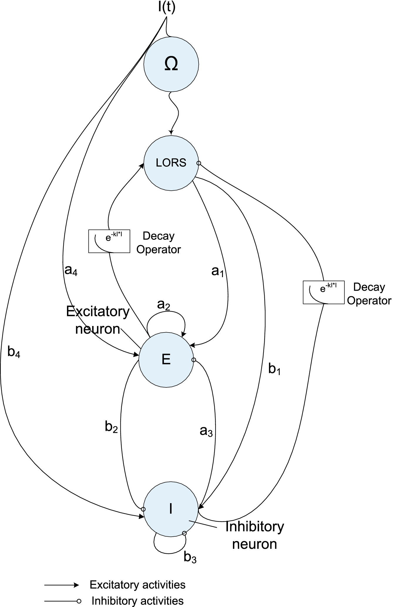 **Fig. 12.3. Neural architecture of LORS** $$E\left( {t + 1} \right) = Sig^{{\prime }} \left[ {a_{1} LORS(t) + a_{2} E(t) - a_{3} I(t) + a_{4} S(t) - \xi_{E} } \right]$$ (12.2) $$I\left( {t + 1} \right) = Sig^{{\prime }} \left[ {b_{1} LORS(t) - b_{2} E(t) - b_{3} I(t) + b_{4} S(t) - \xi_{I} } \right]$$ (12.3) $$\Omega \left( {t + 1} \right) = Sig^{{\prime }} \left[ {S(t)} \right]$$ (12.4) $$LORS(t) = \left[ {E(t) - I(t)} \right]e^{{ - kS^{2} (t)}} +\Omega (t)$$ (12.5) where ${\text{E}},\,{\text{I}},\,\Omega ,{\text{and LORS}}$ denote excitatory, inhibitory, input, and output neurons of LORS; ${\text{a}}_{\text{i}}$ and ${\text{b}}_{\text{i}}$ are the weights for excitatory and inhibitory neurons; $\upxi_{\text{E}} {\text{ and }}\upxi_{\text{I}}$ are the threshold values and ${\text{S}}({\text{t}})$ is the external input stimulus. 

After extensive experiments and research (2008–2018) on the bifurcation behaviors of _LORS_ with different parameter settings and conditions in Table 12.1, we categorize _LORS_ into 8 major categories (_LORS#0–LORS#7_), with _LORS#0_ corresponds to the original _Lee-oscillator_ without retrograde signals and _LORS#1_ – _LORS#7_ correspond to different degrees of bifurcations, from single to multiple bifurcation regions. Figure 12.4 illustrates the bifurcation diagrams for the 8 major categories of _LORS_.

Table 12.1

Parameter settings of 8 major categories of LORS

Parameters|  _Lee_ -_oscillator_ with retrograde signaling (LORS)  
---|---  
_LORS_ #0|  _LORS_ #1|  _LORS_ #2|  _LORS_ #3|  _LORS_ #4|  _LORS_ #5|  _LORS_ #6|  _LORS_ #7  
a1| 0.00| −0.50| −0.50| 0.50| 0.90| 0.90| 5.00| 5.00  
a2| 5.00| 0.55| 0.55| 0.55| 0.90| 0.90| 5.00| 5.00  
a3| 5.00| 0.55| 0.55| 0.55| 0.90| 0.90| 5.00| 5.00  
a4| 1.00| 0.50| 0.50| 0.50| 0.90| 0.90| 5.00| 5.00  
b1| 0.00| −0.50| 0.50| 0.50| −0.90| −0.90| −1.00| −1.00  
b2| −1.00| −0.55| −0.55| −0.55| −0.90| −0.90| −1.00| −1.00  
b3| 1.00| −0.55| −0.55| −0.55| −0.90| −0.90| −1.00| −1.00  
b4| 0.00| 0.50| −0.50| −0.50| −0.90| −0.90| −1.00| −1.00  
k| 1.00| 1.00| 1.00| 1.00| 1.00| 1.00| 1.00| 1.00  
$\mathbf{\xi}_{\mathbf{E}}$| 500| 50| 50| 50| 50| 300| 50| 300  
$\mathbf{\xi}_{\mathbf{I}}$| 0.00| 0.00| 0.00| 0.00| 0.00| 0.00| 0.00| 0.00  
**s**|  0.00| 0.00| 0.00| 0.00| 0.00| 0.00| 0.00| 0.00  
  
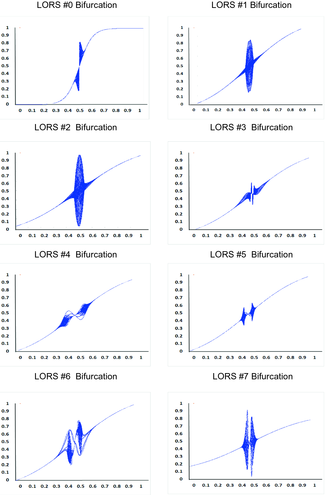 **Fig. 12.4. Eight major categories of bifurcations in LORS** 

## 12.3 CT2TFDNN—The System 

### 12.3.1 CT2TFDNN—System Framework

The _chaotic type-2 transient-fuzzy deep neuro-oscillatory network with retrograde signaling_ (aka _CT2TFDNN_) proposed in this chapter is a hybrid intelligent worldwide financial prediction system with the integration of the following:

1. chaotic neural oscillators (_Lee-oscillators_) as basic neural structure;

2. _chaotic type-2 transient-fuzzification_ of the financial signals (FS) for signal modeling;

3. _genetic algorithms_ (GA) for the selection of top-10 significant Fuzzy financial signals (FFS); and

4. _chaotic transient-fuzzy deep neuro-oscillatory networks with retrograde signaling_ for the chaotic financial time series deep learning and prediction.

Figure 12.5 depicts the system framework of _CT2TFDNN_ for worldwide financial prediction. 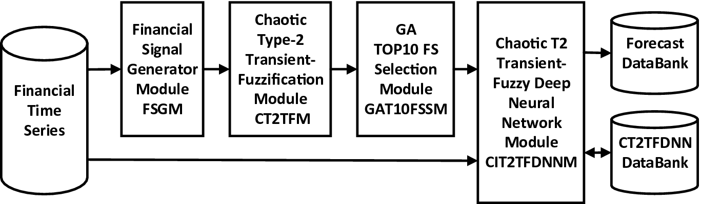 **Fig. 12.5. System framework of CT2TFDNN for worldwide financial prediction** 

### 12.3.2 Financial Signal Generator Module (FSGM)

In the financial signal generator module (FSGM), 39 worldwide commonly used financial indicators/oscillators are generated. They include moving averages (MA), relative strength index (RSI), Bollinger bands (BB), MACD, Stochastic oscillators, etc. Appendix B shows the list of 39 financial trading signals generated in the proposed system.

All the daily financial time series databank will be used to generate these 39 trading signals, which are used for type-2 transient-fuzzification process performs in the next module. Also, for the ease of fuzzification and network training, all the technical indicators/oscillators being generated in this module will be converted into the technical oscillator and normalize with values between 0 and 1. For instance, the MA (Moving Average) technical indicator will be converted into MA oscillator by evaluating the signal crossing between two MA signals, such as MA5 and MA13, the two most commonly used _Fibonacci numbers_ commonly used for technical signal crossing in financial engineering (Murphy 1999).

### 12.3.3 Chaotic Type-2 Transient-Fuzzification Module (CT2TFM)

1. **Chaotic Type-2 Transient-Fuzzy Membership Function (CT2TFMF)**

_CT2TFMF_ is the modeling of interval type-2 fuzzy logic by using the author’s devised time-discrete chaotic neural oscillator— _LORS_. The formulation of _CT2TFMF_ (normalized) is given by $$CT2TFMF\left( {x,t} \right) = \left\\{ {\begin{array}{*{20}l} {LORS\left( {2x,t} \right),\,x \le 0.5} \hfill \\\ {LORS\left( {2 - 2x,t} \right),\,x &gt; 0.5 \ge 1} \hfill \\\ \end{array} } \right.$$ (12.6) 

where x is the fuzzy variable value (e.g., RSI value) which corresponds to the input stimulus S(t) in the LORS formulations Eqs. (12.2)—(12.5); t is the type-2 fuzzy logic index; LORS(x, t) is the normalized LORS function given by Eq. (14). Figure 12.6 shows the _CT2TFMF_ by using LORS#0 with MATLAB simulation result of 1000 × 200 time-steps. 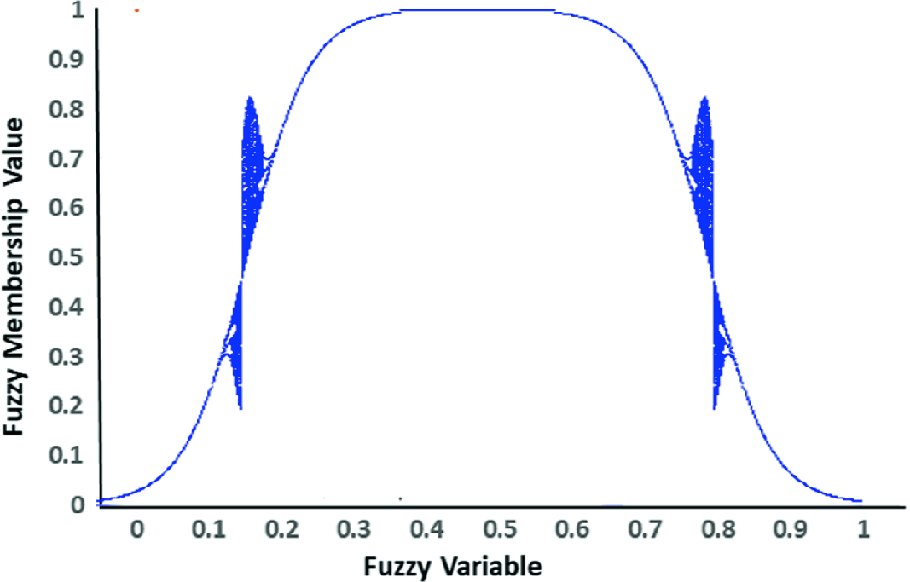 **Fig. 12.6. Chaotic type-2 transient-fuzzy membership function (CT2TFMF)** 

As shown, the _CT2TFMF_ generated by _LORS_ has certain special features:

1. (i)

The membership function generated is a typical type-2 fuzzy membership function with remarkable _transient-fuzzy_ FOU, which corresponds to the bifurcation regions of the chaotic oscillators.

2. (ii)

The whole type-2 fuzzy membership function can be modeled and generated by a simple time-discrete chaotic neural oscillator, which can be easily implemented to model various Interval type-2 fuzzy logic systems (IT2FLS).

3. (iii)

As the neural dynamics of FOUs generated by CT2TFMF is inherited from the Lee-oscillators, so it naturally converges to the two stable states at both ends, while exhibits progressive and controlled _fuzziness_ (bifurcation in chaos theory).

4. (iv)

By regulating various parameters (e.g., weights of inhibitory and excitatory neurons, threshold values _ξ_ _E_ _and ξ_ _I_ , decay constant _k_) in the _Lee-oscillator_ , the FOUs of _CT2TFMF_ can be adjusted and transformed to other chaotic patterns to tackle with different complex _IT2FLS_ problems.

2. **Chaotic Type-2 Composite Transient-Fuzzy Membership Function (CT2CTFMF)**

For the ease of modeling type-2 fuzzy logic for the 39 financial signals, chaotic type-2 composite transient-fuzzy membership function (aka CT2CTFMF) is constructed to model the following four type-2 fuzzy financial linguistic variables: over-sell (OSell), bearish (Bear), bullish (Bull), and over-buy (OBuy).

Figure 12.7 shows the MATLAB simulation of normalized CT2CTFMF for financial signal RSI (relative strength index) using 4 composite Lee-oscillators (LORS#0) with MATLAB simulation results of 1000 × 200 time-steps. 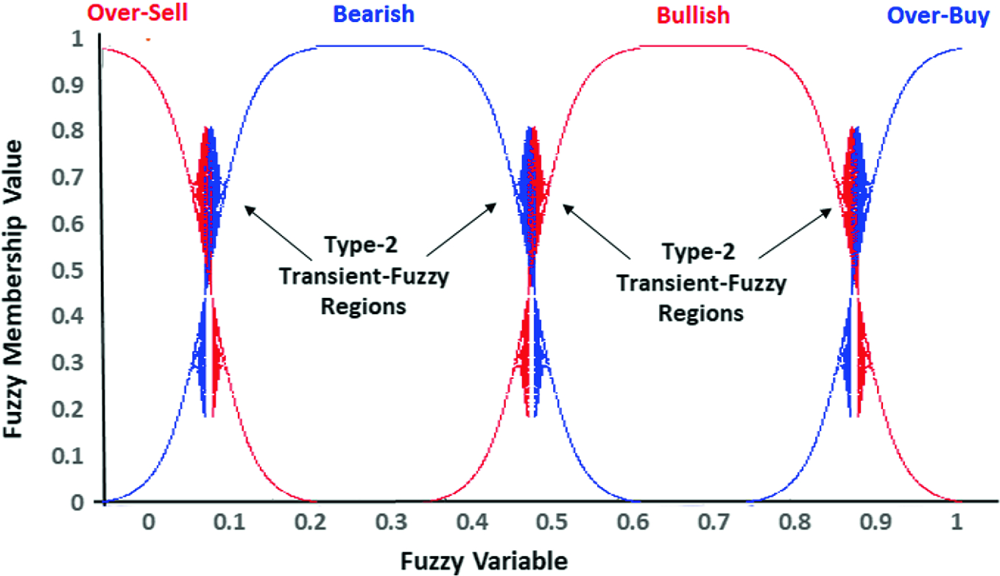 **Fig. 12.7. Chaotic T2 composite transient-fuzzy membership function (CT2CTFMF) of RSI** 

The _CT2CTFMF_ of these four linguistic variables are the following: $$CT2CTFMF _{Osell} \left( {x,t} \right) = \left\\{ {\begin{array}{*{20}l} {CT2TFMF\left( {2x + 0.5,t} \right),\,x \le 0.25} \hfill \\\ {0,\,x &gt; 0.25 \ge 1} \hfill \\\ \end{array} } \right.$$ (12.7) $$CT2CTFMF_{Bear} \left( {x,t} \right) = \left\\{ {\begin{array}{*{20}l} {CT2TFMF\left( {1.6x,t} \right),\,x \le 0.625} \hfill \\\ {0,\,x &gt; 0.625 \ge 1} \hfill \\\ \end{array} } \right.$$ (12.8) $$CT2CTFMF_{Bull} \left( {x,t} \right) = \left\\{ {\begin{array}{*{20}l} {0,\,x \le 0.375} \hfill \\\ {CT2TFMF\left( {1.6x - 0.6,t} \right),\,x &gt; 0.375 \ge 1} \hfill \\\ \end{array} } \right.$$ (12.9) $$CT2CTFMF_{OBuy} \left( {x,t} \right) = \left\\{ {\begin{array}{*{20}l} {0,\,x \le 0.75} \hfill \\\ {CT2TFMF\left( {2x - 1.5,t} \right),\,x &gt; 0.75 \ge 1} \hfill \\\ \end{array} } \right.$$ (12.10) 

From the fuzzy-neuro perspective, Fig. 12.7 is the bifurcation diagram of the composite Lee-oscillators with the superposition of four LORS#0 Lee-oscillators which model the membership function CT2CTFMF of the four type-2 fuzzy variables: over-sell, bearish, bullish, and over-buy with their neural dynamics governed by (12.7)–(12.10), respectively.

As shown in the above equations, the formulations of all type-2 fuzzy linguistic variables are continuous state functions with _transient-chaotic_ (named as _transient-fuzzy_ in _Type-n FLS_) properties within the state-transition regions, which correspond to FOUs in the type-2 FLS. Besides, since _CT2CTFMF_ is generated by _Lee-oscillator_ which is a discrete-time chaotic oscillator, all type-2 fuzzy states can be easily modified, implemented, and evaluated by adjusting the total number of first-order (x) and second-order (t) CTFMV (_composite transient-fuzzy membership values_) to fit for different requirements of granularity for any IT2FLS problems.

From the theoretical perspective, the chaotic bifurcation diagram of the composite Lee-oscillators is the transient-chaotic output states of these chaotic oscillators subjected to the input stimulus. In terms of type-2 fuzzy logic, the transient-fuzzy bifurcation at _type-2 transient-fuzzy regions_ shown in Fig. 12.7 are theoretically analog to the interval type-2 concept in fuzzy logic. The difference is that this chaotic transient-fuzzy membership function is not an additional or external _fuzzification engine_ that usually is applied by typical IT2 FLS, but rather it is an intrinsic property of the fuzzy-neuro network itself. In other words, the type-2 fuzzification process proposed in this system is just part of the neural dynamics of the input neurons by simply replaced each of the input neuron (financial signal) by 4 LORS#0 Lee-oscillators and automatically _inherited_ the transient-fuzzy capability during the system training and forecast process.

3. **Chaotic T2 Transient-Fuzzification Module (CT2TFM)**

In this module, all 39 normalized trading signals (oscillators) will undergo the chaotic interval type-2 fuzzification process by applying the _CT2CTFMF_ described in (12.7)–(12.10). The resulted 39 (each fuzzy financial signal has 4 second-order type-2 TFMV) fuzzified financial signals will enter to the GA selection module for top-10 financial fuzzy signals selection.

### 12.3.4 GA-Based TOP-10 Financial Signals Selection Module (GAT10FSSM)

_GA-based top-10 financial signals selection module_ (_GAT10FSSM_) is a vital process in this system to screen-out noncritical signals/data, as usually there are too many signals and time series data appeared in many financial engineering problems. If all related signals and time series are used for financial prediction, it will not only slow down the whole system training and prediction process but more importantly, it will cause serious system over-training and deadlock problems by being trapped in the local minima.

_Top10-FFSSM_ is a _GA_ (_genetic algorithms_) based module to select the best (top 10) fuzzy financial signals (FFS) generated in the _CT2TFM_. It consists of six functional modules shown in Fig. 12.8. 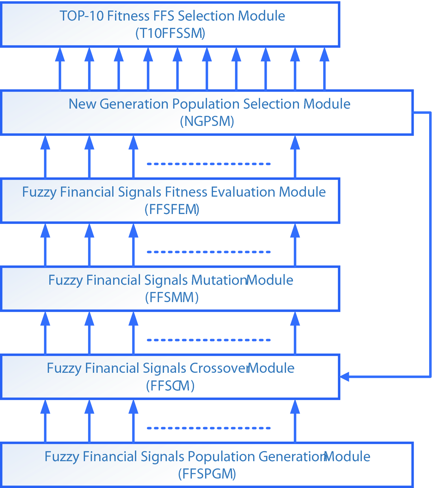 **Fig. 12.8. GA-based top-10 fuzzy financial signals selection scheme** 

1. **Fuzzy Financial Signals Population Generation Module (FFSPGM)**

In this module, a population of 1000 _fuzzy financial signal vectors FFSV_ (_s, w_) are generated, where _s_ and _w_ are the signal vectors of the 39 FFS and their weights with values between 0 and 1. Noted that _s_ is the composite fuzzy financial signal vectors with 4 dimensions correspond to the four type-2 fuzzy variables.

In the initialization stage, a random number generator is used to generate all the weights for these 1000 FFSVs. Note that these weights are also used as the initial weights used for the _CT2TFDNN_ for fitness evaluation. In fact, the objective of this GA-based signal selection scheme is to evaluate the best (fitness) FFSV and retrieve the top-10 FFS with highest weights for system training and prediction in _CT2TFDNN_.

2. **Fuzzy Financial Signals Crossover Module (FFSCM)**

The whole _FFSCM_ consists of the following steps:

     * Step 1. Randomly selects two FFSVs from the population.

     * Step 2. Perform a two-point crossover operation.

     * Step 3. Two new FFSVs offspring are generated.

     * Step 4. Perform steps 1–3 for 500 times until 1000 FFSV offspring are created.

3. 3)

**Fuzzy Financial Signals Mutation Module (FFSMM)**

In _FFSMM_ , a 5% (i.e., 0.05) mutation rate is adopted.

The whole _FFSMM_ consists of the following steps:

     * Step 1: For each 1000 FFSV offspring, generate a random number (between 0 and 100) for each of the 39 FFS.

     * Step 2: If the random generated for a particular FFS is less than 5, then the weight (_w_) for that FFS will be replaced by a new random number between 0 and 1.

     * Step 3: Repeat steps 1–2 until all 1000 FFSV offspring have to go through the FFS mutation operation.

4. **Fuzzy Financial Signals Fitness Evaluation Module (FFSFEM)**

In this module, each of the 1000 FFSV offspring will be used (in turn) with the time series financial data as input vectors for _CT2TFDNN_ deep training. Detailed training algorithm will be studied in the next section.

After 1000 iterations, the overall RMSE (Root-Mean-Square Errors) between the _target next-day close_ and the _actual-day close_ will be evaluated and stored as the _fitness value (FV)_ for that particular FFSV offspring.

5. **New Generation Population Selection Module (NGPSM)**

For 1000 FFSVs of the current population and their 1000 FFSV offspring, evaluate their FVs and choose the first 1000 best FFSV with the lowest RMSE as members for the new generation.

6. **TOP-10 Fitness FFS Selection Module (T10FFSSM)**

Repeat the above GA modules for 1000 generations. For the last generation, select the best (fit) FFSV with the highest FV (i.e., the lowest RMSE). Inspect the weights (_w_) of its 39 FFS and choose the top-10 FFS with the highest weights as the target top-10 FFS and use these weights as the initial for network training in the _CT2TFDNN_ module.

Table 12.2 shows the list of top-10 FFS after 1000 generations.

Table 12.2

List of TOP−10 fuzzy financial signals

No| FFS code| Fuzzy financial signals  
---|---|---  
1| AO| Awesome oscillator FFS  
2| Bands| Bollinger bands FFS  
3| Gator| Gator oscillator FFS  
4| Ichimoku| Ichimoku Kinko Hyo FFS  
5| Momentum| Momentum FFS  
6| OsMA| Moving average oscillator FFS  
7| MACD| MACD FFS  
8| RSI| Relative strength index FFS  
9| RVI| Relative vigor index FFS  
10| Stochastic| Stochastic oscillator FFS  
  
As shown, it is not surprising to find out that those popular financial signals such as: MACD, RSI, MA (OsMA), and Stochastic signals appeared in the top-10 list, mainly because these financial signals are so popular that many traders and investors are using them to design their trading strategies so that are more correlated with the forecast results than other financial signals.

### 12.3.5 Chaotic T2 Transient-Fuzzy Deep Neural Network Module (CT2TFDNNM)

In short, _CT2TFDNN_ is a multilayer deep supervised-learning neural oscillatory network with the replacement of all neurons all layers of the networks with _LORS_ with a _chaotic bifurcation transfer function (CBTF)_ as activation functions. Besides, eight chaotic bifurcation hidden layers (CBHL) which correspond to the 8 different modes of bifurcation in _LORS_ are used to facilitate chaotic deep learning in _CT2TFDNN_.

Figures 12.9 and 12.10 show the system architecture and the chaotic deep learning algorithm of _CT2TFDNN_ for worldwide financial prediction. 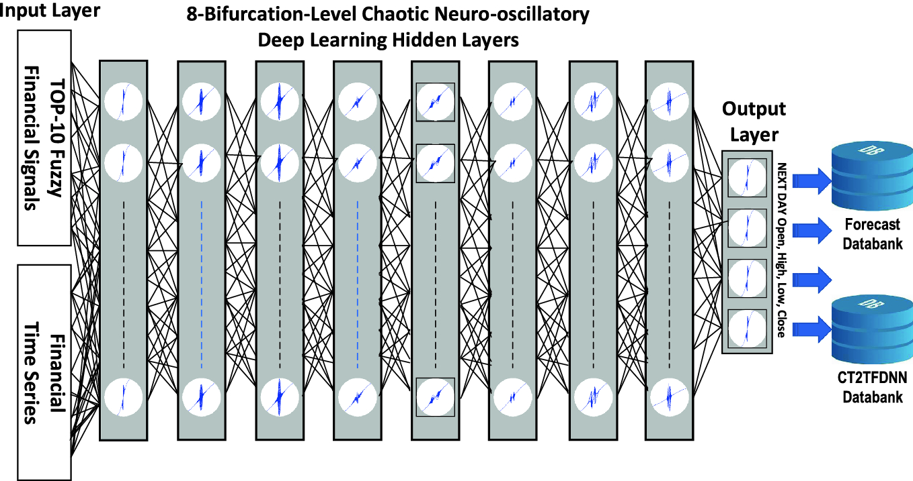 **Fig. 12.9. System architecture of CT2TFDNNM** 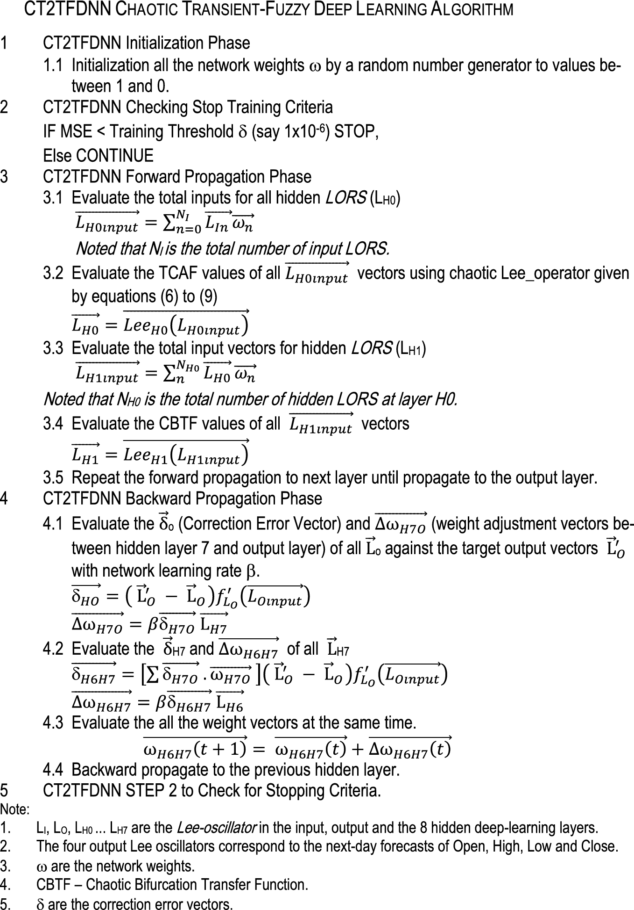 **Fig. 12.10. CT2TFDNN chaotic transient-fuzzy deep learning algorithm** 

As shown in Fig. 12.9, the input vectors of _CT2TFDNN_ include the following:

1. Top-10 T2 fuzzy financial signals (FFS), each consists of 4 fuzzy attributes indicate the T2 FMV of: _over-sell (OS), bearish (BR), bullish (BU), and over-buy (OB)_ ;

2. Time series financial data, each set consists of the _open (O), high (H), low (L), close (C), and volume (V)_ of 10-trading days normalized time series data, each is multiplied by time-step decay (_forgetting_) function fg() given by

$$fg(D) = e^{ - kD}$$ (12.11) 

where D is the time-horizon for time series and k = 0.5 is the decay factor.

Figure 12.11 shows the decay chart for financial time series data (Lee 2004b). 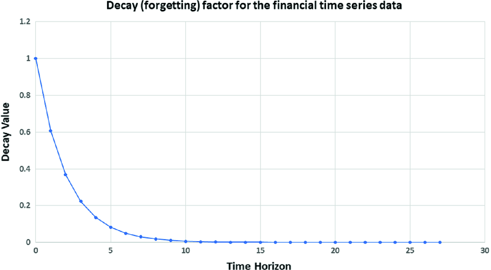 **Fig. 12.11. Decay (forgetting) factor for the financial timeseries data** 

As shown in Fig. 12.11 the decay function almost converges to 0 when _time horizon (TH)_ close to day-10. So, we set the time horizon for time series financial data to 10. As reflected from previous works (Lee 2004b), the introduction of decay (forgetting) factor is vital not only because it simulates time series relationships of the historical data, but also it can avoid over-training by effectively control the data size of time series input vectors and speedup the whole training process. Also, by replacing all neurons of _CT2TFDNN_ with _Lee_ -_oscillator_ s, the traditional FFPBN effectively transforms into a multilayer neuro-oscillatory network with inherited transient-chaotic neuron activation properties from _Lee_ -_oscillators_ , which not only significantly speedup the whole network training process, but more importantly it resolves the over-training and deadlock problems which commonly occurs in most recurrent neural networks with massive financial time series data. Detailed system performance analysis will be studied in Sect. 12.5.

## 12.4 CT2TFDNN—System Implementation 

### 12.4.1 Quantum Finance Forecast Center

As shown in Fig. 12.12, CT2TFDNN forecaster is a server-side intelligent forecast agent located at the MT4 server farm of QFFC using Dell precision T5820 tower workstation with Intel 6-Core 3.6 GHz Xeon processor. For each financial product, 2048-trading day time series (except cryptocurrency which only has 300-trading day data) include: open (O), high (H), low (L), close (C), and volume (V) are automatically generated by MT4 engines of [Forex.​com](<http://Forex.com>) and [AvaTrade.​com](<http://AvaTrade.com>). Through four functional processes studied in the previous section, the next-day forecasts of these 129 financial products are stored at the CT2TFDNN forecast database for CT2TFDNN trading agents to access and release for public access. 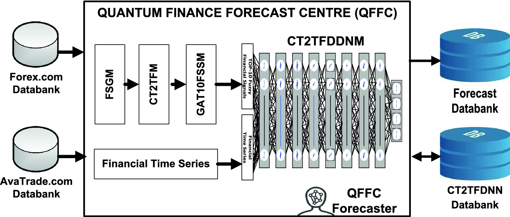 **Fig. 12.12. System architecture of quantum finance forecast center (QFFC)** 

### 12.4.2 129 Worldwide Financial Products

With the successful cooperation with [AvaTrade.​com](<http://AvaTrade.com>) (major cryptocurrency MT4 service provider) and [Forex.​com](<http://Forex.com>) (major forex MT4 service provider), QFFC launched the 129 financial products free daily and weekly forecast services from January, 2018 for worldwide traders and individual investors. They include the following:

1. 9 major cryptocurrencies;

2. 84 worldwide forex;

3. 19 major commodities;

4. 17 worldwide financial indices.

Appendix A shows the list of 129 financial products under these four categories.

As shown in Appendix A, owing to the short trading history of cryptocurrency, 300-trading day of historical time series are provided by [AvaTrade.​com](<http://AvaTrade.com>), while all other financial products consist of a 2048-trading day of historical time series for each financial product provided by [Forex.​com](<http://Forex.com>) which provide sufficient training and test sets for system implementation and performance analysis. Also, each time series record consists of daily information: open (O), high (H), low (L), close (C), and volume (V).

### 12.4.3 CT2TFDNN Network Parameter Settings

Table 12.3 shows parameter settings of CT2TFDNN for network training and forecast. As shown, 10 trading day time series are input into CT2TFDNN for network training, so totally we have 50 input nodes (LORS#0) for time series inputs and 100 fuzzy financial signals (FFS) inputs with totally 400 FFS input nodes (LORS#0). For each hidden layer, 400 LORS (LORS#0–LORS#7) hidden nodes are used for network training. For financial products with 2048-trading day time series data, 1228 (60%) time series dataset is used for training, 401 (20%) time series dataset is used for network testing and validation. For cryptocurrency with only 300 trading day time series data, same proportion of datasets are employed for the next training, testing, and validation.

Table 12.3

Parameter settings of CT2FDNN

Parameters| Values  
---|---  
No. of trading days for network input| 10  
No. of timeseries LORS in input layer| 50  
No. of input Fuzzy Financial Signals (FFS)| 100  
No. of FFS LORS in input layer| 400  
No. of LORS in each hidden layer| 400  
No. of output LORS| 4  
Network training stop criteria (RMSE)| 1 × 10−6  
Deadlock criteria| 10,000 epochs  
LORS parameter settings in input and output layers| LORS#0 settings(Table I)  
LORS parameter settings in 8 hidden layers| LORS#0-LORS#7(Table I)  
  
### 12.4.4 System Implementation and Pilot Run

From the implementation perspective, the whole CT2TFDNN system are implemented over MT4 (MetaTrader4) platform (Walker 2018; Young 2015)—the world’s biggest online financial program trading and development platform with over hundreds of participating financial institutions for the provision of online program trading and development services of all common worldwide financial products.

Since January 1, 2018, QFFC released daily financial forecast using CT1FNON (type-1 fuzzy chaotic neuro-oscillatory networks) as pilot run and open testing for worldwide traders and investors.

From October 1, 2018, after completing the system implementation of _CT2TFDNN_ , QFFC daily worldwide financial predictions are conducted by _CT2TFDNN_ system.

## 12.5 CT2TFDNN—Performance Analysis 

### 12.5.1 Introduction

From the system performance perspective, three types of system performance analysis were conducted. They were the following:

1. System training performance analysis;

2. System forecast simulation performance analysis;

3. Actual daily forecast performance analysis.

In all these performance analyses, the system performance of CT2TFDNN was compared with five forecast models:

1. Traditional time series feedforward backpropagation network (FFBPN);

2. Support vector machine (SVM) forecasting tool provided by R Project—one of the most popular financial forecasting tools used in the finance industry;

3. Deep neural network (DNN) with PCA (principal component analysis) model (Singh and Srivastava 2017);

4. Classical interval type-2 fuzzy-neuro network (IT2FNN);

5. Chaotic type-1 fuzzy-neuro-oscillatory network (CT1FNON).

### 12.5.2 System Training Performance Analysis

In CT2TFDNN training performance analysis, 60% of time series data of 129 financial products are employed for system training in two aspects. Figure 12.13 shows system performances of the six forecast models over 500 epochs of network training of the 129 financial products in terms of mean and standard deviations of RMSE (root-mean-square errors). 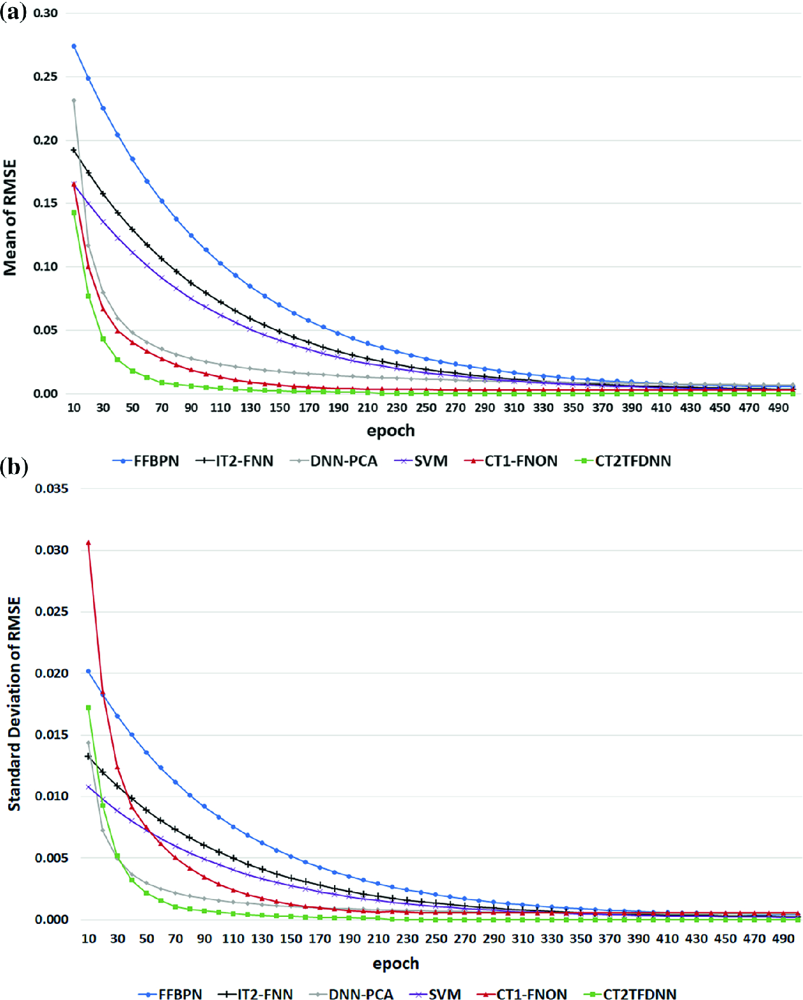 **Fig. 12.13. System training performance (over 500 epochs) of six financial forecast models for 129 financial products. (TOP) Mean of RMSE. (BOTTOM) Standard deviation of RMSE** 

As shown in Fig. 12.13, two observations can be found: (1) CT2FDNN outperformed the other five models in terms of both mean and standard deviation of RMSE; (2) CT2FDNN attained the promisingly low RMSE in 70 epochs while the RMSE of other networks especially FFBPN, SVM, and IT2FNN were still _half_ -_way_ of their lowest RMSE levels.

### 12.5.3 System Forecast Simulation Performance Analysis

In the system forecast simulation performance analysis, four categories of worldwide 129 financial products were tested with target RMSE (Root-Mean-Square Error) of the forecast next-day closing price ranging from 1 × 10−4 to 1 × 10−7, respectively. The test was done by applying 500 forecast simulations for each system. Table 12.4 presents the system forecast simulation performance test of these six systems. Certain interesting findings are revealed in Table 12.4:

Table 12.4

System forecast simulation performance analysis

Product category| FFBPN| SVM| DNN-PCA| IT2-FNN| CT1-FNON| CT2TFDNN  
---|---|---|---|---|---|---  
Total STT| Av. STT| Total STT| Av. STT| Total STT| Av. STT| Total STT| Av. STT| Total STT| Av. STT| Total STT| Av. STT  
 _Case 1 (RMSE = 1 × 10_ −4 _)_  
Cryptocurrency| 557,251| 61,916.78| 372,244| 41,360.41| 244,633| 27,181.47| 305,240| 33,915.56| 5720| 635.56| 1023| 113.67  
Forex| 508,453| 6053.01| 331,511| 3946.56| 291,344| 3468.38| 275,154| 3275.64| 6323| 75.27| 1128| 13.43  
Financial Index| 41,120| 2164.21| 26,152| 1376.44| 19,738| 1038.82| 21,183| 1114.89| 923| 48.58| 159| 8.37  
Commodity| 46,641| 2743.59| 29,384| 1728.46| 22,108| 1300.46| 25,564| 1503.76| 1223| 71.94| 231| 13.59  
Overall| 1,153,465| 8941.59| 759,291| 5885.98| 577,823| 4479.25| 627,141| 4861.56| 14,189| 109.99| 2541| 19.70  
 _Case 2 (RMSE = 1 × 10_ −5 _)_  
Cryptocurrency| 1,460,000| 162,222.22| 937,320| 104,146.67| 823,440| 91,493.33| 862,334| 95,814.89| 15,121| 1680.11| 2673| 297.00  
Forex| 1,235,543| 14,708.85| 841,405| 10,016.72| 720,322| 8575.26| 782,507| 9315.56| 17,231| 205.13| 2894| 34.45  
Financial Index| 111,024| 5843.37| 68,391| 3599.51| 50,627| 2664.58| 62,236| 3275.58| 2312| 121.68| 481| 25.32  
Commodity| 109,142| 6420.12| 71,925| 4230.86| 44,967| 2645.09| 64,733| 3807.82| 2640| 155.29| 551| 32.41  
Overall| 2,915,709| 22,602.40| 1,919,041| 14,876.29| 1,639,356| 12,708.19| 1,771,810| 13,734.96| 37,304| 289.18| 6599| 51.16  
 _Case 3 (RMSE = 1 × 10_ −6 _)_  
Cryptocurrency| DL| –| 6,102,255| 678,028.38| 3,601,307| 400,145.17| DL| –| 234,663| 26,073.67| 10,324| 1147.11  
Forex| DL| –| 5,477,816| 65,212.10| 4,184,833| 49,819.44| DL| –| 218,661| 2603.11| 13,234| 157.55  
Financial Index| 577,324| 30,385.47| 373,529| 19,659.40| 318,683| 16,772.78| 459,441| 24,181.11| 6623| 348.58| 1292| 68.00  
Commodity| 687,595| 40,446.76| 468,252| 27,544.25| 385,741| 22,690.64| 622,775| 36,633.82| 9126| 536.82| 1983| 116.65  
Overall| –| –| 12,421,852| 96,293.43| 8,490,564| 65,818.33| –| –| 469,073| 3636.22| 26,833| 208.01  
 _Case 4 (RMSE = 1 × 10_ −7 _)_  
Cryptocurrency| DL| –| 25,141,291| 2,793,476.73| 14,405,228| 1,600,580.89| DL| –| 1,928,929| 214,325.44| 51,213| 5690.33  
Forex| DL| –| 26,896,077| 320191.39| 17,785,540| 211732.62| DL| –| 1,600,598| 19054.74| 62,256| 741.14  
Financial Index| DL| –| 1,714,498| 90,236.74| 1,446,821| 76,148.46| 2,451,732| 129,038.53| 37,088| 1952.00| 6231| 327.95  
Commodity| DL| –| 2,088,404| 122,847.29| 1,917,133| 112,772.52| 2,756,693| 162,158.41| 48,641| 2861.24| 7132| 419.53  
Overall| –| –| 55,840,269| 432,870.30| 35,554,721.84| 275,618.00| –| –| 3,615,256| 28,025.24| 126,832| 983.19  
  
 _Note_

1\. Results are generated by 500 simulations of each neural network system (in msec)

2\. “Total STT” denotes the total average system training time for 500 simulations

3\. “Av. STT” denotes the average system training time for a single financial product

4\. “DL” denotes deadlock during system training

1. For case 1 simulation (RMSE 1 × 10−4), _CT2TFDNN forecaster_ outperformed FFBPN (453.94), SVM (298.92), DNN-PCA (227.40), IT2FNN (246.81), and CT1FNON (5.58) times. Similar findings can be found in case II simulation results. It clearly reflected the improvement of network learning rate achieved by the hybrid type-2 transient-fuzzy with deep chaotic neuro-oscillatory network system and GA-based top-10 FFS selection scheme.

2. Across the 3 cases with decreasing RMSE from 1 × 10−4(case 1), 1 × 10−5 (case 2), 1 × 10−6 (case 3) to 1 × 10−7 (case 4). All forecast systems achieved the target RMSE in cases 1 and 2. However, for cases 3 and 4 simulations using target RMSE 1 × 10−6 and 1 × 10−7, both FFBPN and IT2FNN (which were using sigmoid-based FFBPN for machine learning) encountered deadlock problems during the network training of cryptocurrency and forex products; while _CT2TFDNN forecaster_ could still complete the network training with promising training speeds. It clearly demonstrated the resolution of over-training and deadlock problems and improvement of system training efficiency by CT2TFDNN forecaster over traditional recurrent neural networks using classical sigmoid-based activation function.

3. Comparing CT2TFDNN against CT1FNON across the three cases, it was interested to reveal that CT2TFDNN outperformed its counterpart by 5.58 times (case 1), 5.65 times (case 2), 17.48 (case 3), and 28.50 (case 4) respectively. As shown in Table 12.4, the overall performance of the CT1FNON forecast system deteriorated substantially when the target RMSE was set to 1 × 10−6 and beyond, especially on cryptocurrency and forex, while CT2TFDNN still performed stable result. It clearly reflected the merits for the integration of type-2 transient-fuzzification scheme with chaotic neural oscillator technology with retrograde signaling for time series chaotic deep learning.

4. In terms of the system performance across different financial products, the simulation results clearly reflected that both cryptocurrency and forex were more chaotic and difficult for network training than other financial products as expected, which will be one of the future R&D directions of quantum finance forecast center.

### 12.5.4 Actual Daily Forecast Performance Analysis

Started from October 1, 2018, CT2TFDNN provides an official daily forecast of these 129 financial products via QFFC official site on every trading day at 08:00 HKT (00:00 UTC) and reports the previous day forecast performance. Figure 12.14 shows the actual daily forecast performance chart of the six forecast models between October 1, 2018 and March 15, 2019 (120 trading days). 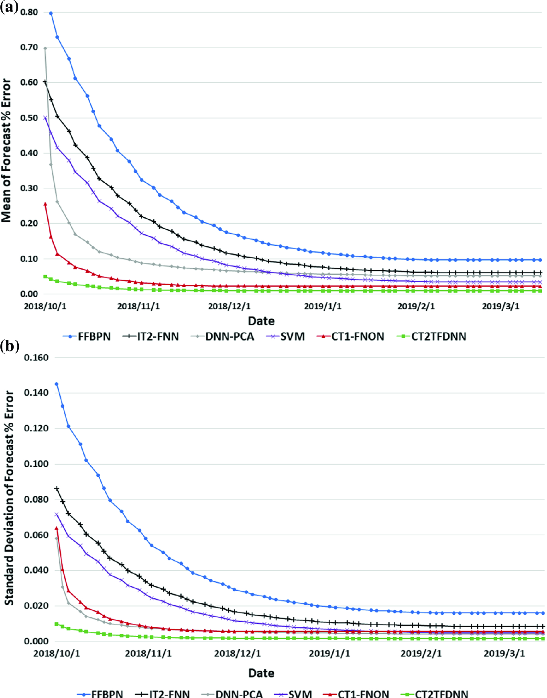 **Fig. 12.14. Actual daily forecast performance of six financial forecast models for 129 financial products between 10/1/2018 and 03/15/2019. (TOP) Mean of forecast % error. (BOTTOM) Standard deviation of forecast % error** 

The daily forecast % error (DFPE) is defined by $$DFPE = \frac{{Average\left( {DFErr(H),DFErr(L)} \right) }}{DClose} \times 100\%$$ (12.12) 

where $DFErr(H),DFErr(L)$ are the daily errors of _daily forecast high (low)_ with the _daily actual high (low),_ respectively, and $DClose$ is the daily closing price.

As shown in Fig. 12.14, the 120-trading day actual forecast performance of six forecast models were rather consistent with their system training results shown in previous tests, in which FFPBN performed the worst and CT2TFDNN performed the best.

But one interesting difference is that although the ranking of their performances were the same between system training performance against actual forecast performance, the _overall forecast performance gaps_ between these six forecast systems were more distinct in which CT2FDNN outperformed the other five forecast models significantly and it took less than 20-trading days to attain its stable forecast performance state while other forecast systems took 40–60 trading days to attain their stable forecast performance states.

Figure 12.15 shows the daily forecast performance of CT2TFDNN across the four different categories of financial products. As shown, owing to difference levels of chaotic behavior and disturbance between different categories of financial products, there were two interesting findings: (1) the forecast performance of cryptocurrency was significantly poorer than all other categories even though their differences in training performance were not so significant. This might due to the highly chaotic property of cryptocurrency and insufficient time series history data; (2) the forecast performance of forex was better than its performance in system training, which was rather consistent with the observations from the professional traders using the CT2TFDNN forecast service during this period of time also concluded that although forex products overall were highly chaotic in nature, CT2TFDNN provided a reliable daily forecast with rather a stable degree of accuracy. 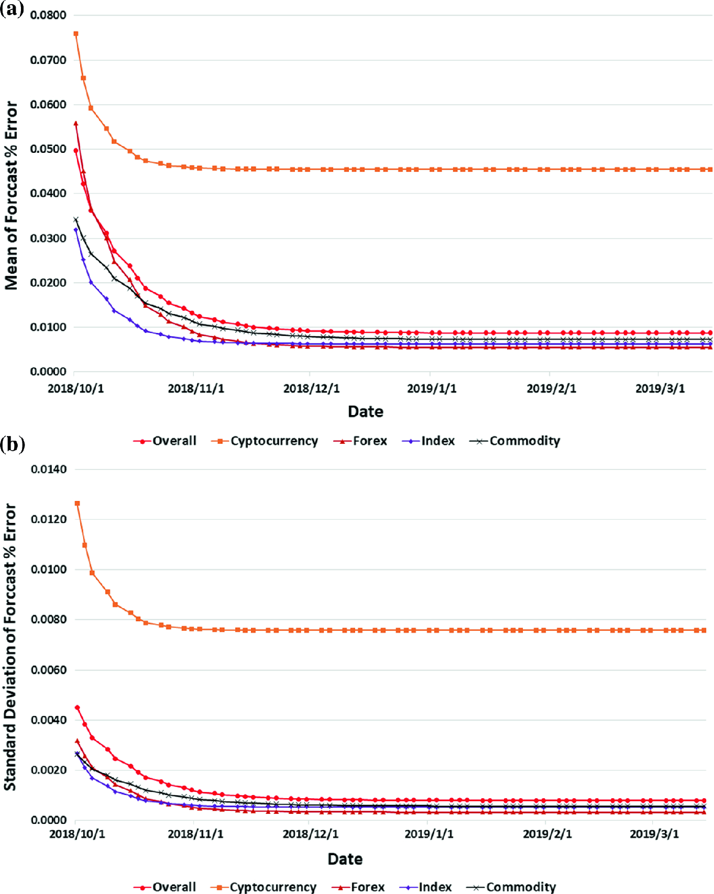 **Fig. 12.15. Actual daily forecast performance of CT2TFDNN of four different categories of financial products between 10/1/2018 and 3/15/2019. (TOP) Mean of RMSE. (BOTTOM) Standard deviation of RMSE** 

## 12.6 Conclusion 

The dawn of big data epoch has driven us to face new challenges from over-flooding data and information. This chapter devised an innovative chaotic type-2 transient-fuzzy deep neuro-oscillatory network (CT2TFDNN) to address the over-training and deadlock problems, which are commonly occurred during network training of massive data such as financial, weather, and biomedical big data.

For the system architecture perspective, CT2TFDNN provided integration of four different innovative AI technologies:

1. chaotic neural oscillator for the modeling of neural dynamics;

2. type-2 transient-fuzzy logic for the modeling of fuzzy financial signals;

3. genetic algorithm for the selection of the best fuzzy financial signals;

4. deep chaotic neural network for network training and prediction.

From the implementation perspective, CT2TFDNN has been adopted for the real-time prediction of 129 worldwide financial products. In comparison with five forecast systems ranging from traditional FFBPN, SVM, DNN with PCA, IT2FNN to CT1FNON, CT2TFDNN produced promising results in terms of system training performance and actual daily forecast performance.

The future and related works include the following:

1. Further research and study of CT2TFLS for the modeling, analysis, and data mining of other big data problems such as weather, biometric and biomedical engineering.

2. Further study of CT2TFDNN for the categorization of various CT2TFMF using neural retrograde signaling techniques.

3. R&D of intelligent agent-based hedging and trading systems based on CT2TFLS.

4. Integration of CT2TFDNN with quantum price level (QPL) study using quantum anharmonic oscillatory model (QAOM) for financial trend prediction and long-term investment.

### Problems

1. 12.1

What is fuzzy logic? Discuss and explain the difference between type-1 vs. type-2 fuzzy logic. Give two examples and explain how type-2 fuzzy logic can be applied in finance engineering and quantum finance.

2. 12.2

What are the major advantages and shortcomings of type-1 fuzzy logic? Use two applications of type-1 fuzzy logic on technical indicators in the financial market for illustration.

3. 12.3

What is interval type-2 fuzzy logic (IT2FL)? State and explain the major difference between type-2 fuzzy logic and IT2FL. Use two examples in real-world situation for illustration.

4. 12.4

The following figure shows the type-1 fuzzy membership function of RSI

*[Figure: Type-1 fuzzy membership function of RSI — image not available]*

     1. (i)

Use the same methodology, draw the type-1 fuzzy membership function to describe the fuzzy variable of _temperature_.

     2. (ii)

Compare these two fuzzy membership functions, discuss and explain why the fuzzy membership of RSI for the description of financial market is more meaningful and critical for fuzzification than traditional fuzzy variable such as temperature and humidity for the description of weather situation.

     3. (iii)

Based on the given type-1 membership function of RSI:

        * Draw the corresponding type-2 membership function and write the corresponding membership function formulation;

        * Draw the corresponding internal type-2 membership function and write the corresponding membership function formulation;

        * Contract their difference (i.e., pros and cons) and describe how they work;

        * Why they are more meaningful and useful than type-1 fuzzy membership?

5. 12.5

State and describe the formulation and logic behind the type-n fuzzy logic. Use two real-time examples (weather and finance) to illustrate your explanation.

6. 12.6

What are the major advantages and shortcomings of type-n fuzzy logic? Justify your explanation by using real-world example in finance engineering.

7. 12.7

What is retrograde signaling in biological neuroscience? State and discuss the latest research and findings on symptoms and illness in human memory related to this effect.

8. 12.8

What is Lee-oscillators with retrograde signaling? What is the mathematical formulation? How can it relate to biological neuroscience?

9. 12.9

State and explain the formulation of Lee-oscillator with retrograde signaling. Discuss how it works in real-world application on weather prediction and financial engineering.

10. 12.10

Discuss and explain the major differences between Lee-oscillator and Lee-oscillator with retrograde signaling in terms of (1) physical meaning in biological neuroscience; (2) mathematical formulation; physical meaning in chaotic neural network modeling.

11. 12.11

Fig. 12.4 shows the bifurcation diagrams of 8 major Lee-oscillators with retrograde signaling. Discuss and explain their major characteristic in terms of (1) bifurcation; (2) chaotic transfer function capability.

12. 12.12

Below figure shows the system framework of CT2TFDNN (chaotic type-2 transient-fuzzy deep neural network)

*[Figure: image not available]*

     1. (i)

Discuss and explain the major roles and functions of each functional modules of CT2TFDNN.

     2. (ii)

What is deep neural network (DNN)? What is different between DNN and ANN?

     3. (iii)

What are the major shortcomings of DNN for modeling a complex system such as real-time financial prediction systems?

     4. (iv)

What are the major advantages and characteristics of CT2TFDNN versus traditional DNN (deep neural networks)?

13. 12.13

Below figure shows the chaotic type-2 composite transient-fuzzy membership functions (CT2CTFMF) of RSI.

*[Figure: image not available]*

     1. (i)

Write down the formulation of CT2CTFMF of RSI.

     2. (ii)

In addition to RSI, assume we also need to model MA crossing of two MA signal lines (e.g., MA5 and MA21):

        * Draw the corresponding CT2CTFMF of MA-crossing indicator.

        * Write down the corresponding formulation for CT2CTFMF of MA-crossing indicator.

        * What is the advantage of using CT2CTFMF of MA-crossing indicator values instead of the MA-crossing signals as an input node in the DNN for system training?

14. 12.14

Discuss and explain why GA-based top-10 financial signals section module is critical in the CT2TFDNN system.

15. 12.15

Programming exercise I

     1. (i)

Draw the system flowchart for the implementation of CT2TFDNN system for real-time financial prediction.

     2. (ii)

Write the system training algorithms of CT2TFDNN.

     3. (iii)

Based on the MQL program skill learnt in QFFC.org, implement CT2TFDNN for at least five forex products using MQL on MT4 platform.

     4. (iv)

Compare their system training performance in terms of (1) RMSE (root-mean-square error) and (2) standard deviations in 1000 iterations using error rate 1 × 10−6.

     5. (v)

Compare their next-day forecast performance results in terms of (1) % Error and (2) Standard deviation of % error for at least 20 trading days (or 3 months MT4 simulation results).

     6. (vi)

Implement and perform the same performance test for three other categories of financial products: (1) financial indices; (2) major commodity and (3) cryptocurrency.

     7. (vii)

Compare their results in terms of different categories of financial products. Discuss and explain the experimental results.

16. 12.16

Figure 12.15 shows the actual daily forecast performance of CT2FDNN for four different categories of financial products: cryptocurrency, forex, financial indices, and major commodity.

     1. (i)

Discuss and explain why cryptocurrency is always the worst in terms of forecast performance. How can we improve it?

     2. (ii)

As compared with system training performance shown in Fig. 12.4, the forecast performance of forex products is significantly improved. Why?

     3. (iii)

What is a suggestion and conclusion in terms of a financial investment perspective?

### Acknowledgements

The author wishes to thank [Forex.​com](<http://Forex.com>) and [AvaTrade.​com](<http://AvaTrade.com>) for the provision of historical and real-time financial data. The author also wishes to thank Quantum Finance Forecast Center of UIC for the R&D supports and the provision of the channel and platform qffc.org for worldwide system testing and evaluation.
