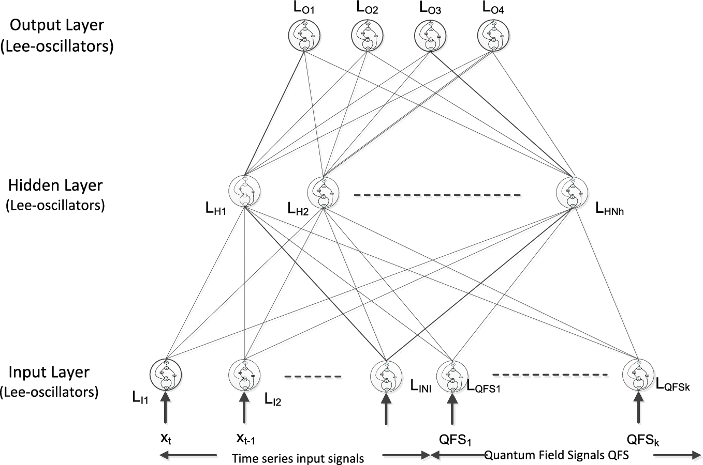
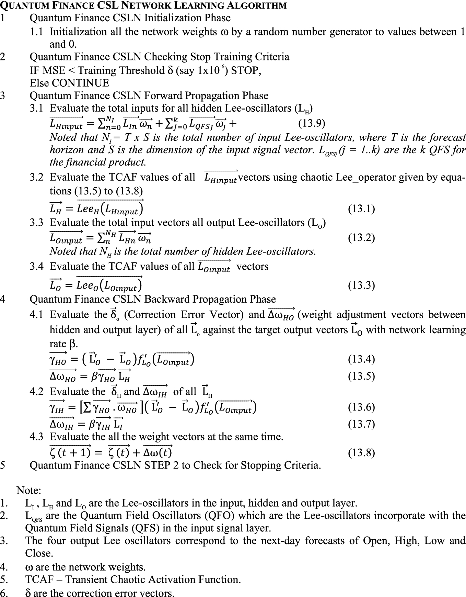
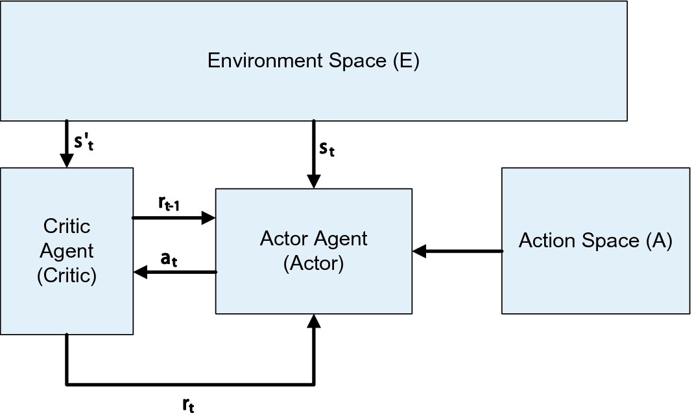
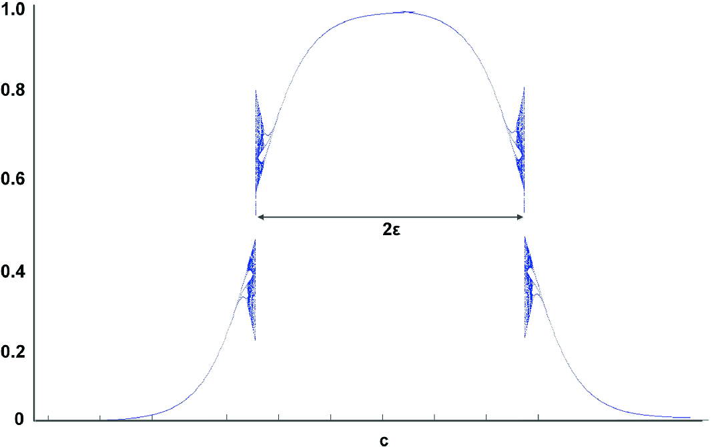
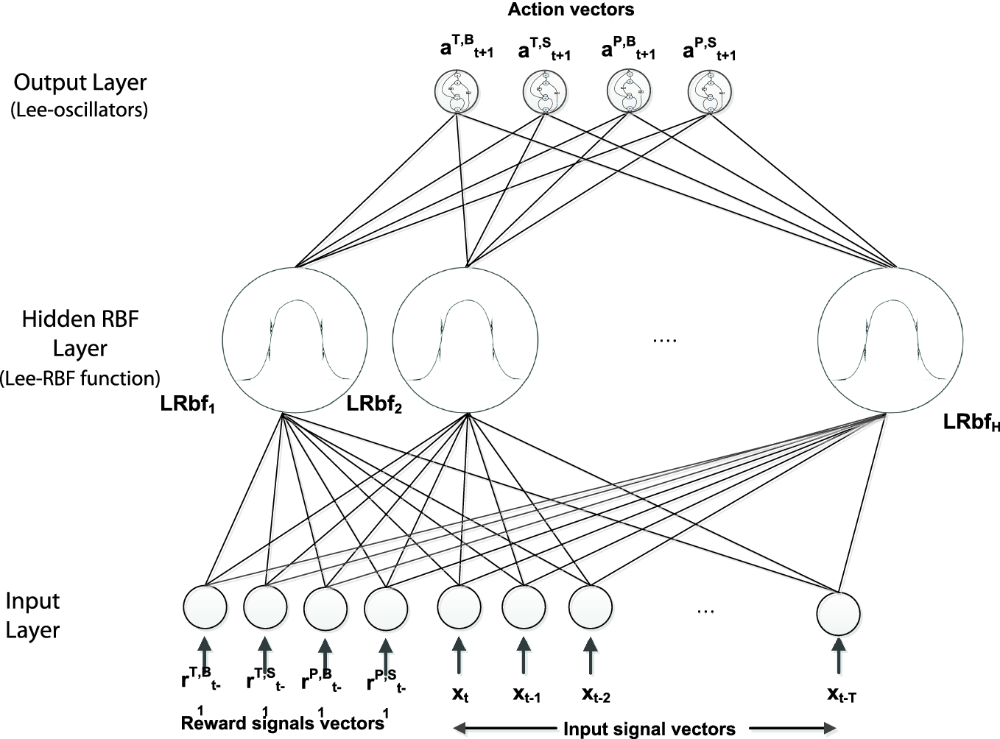
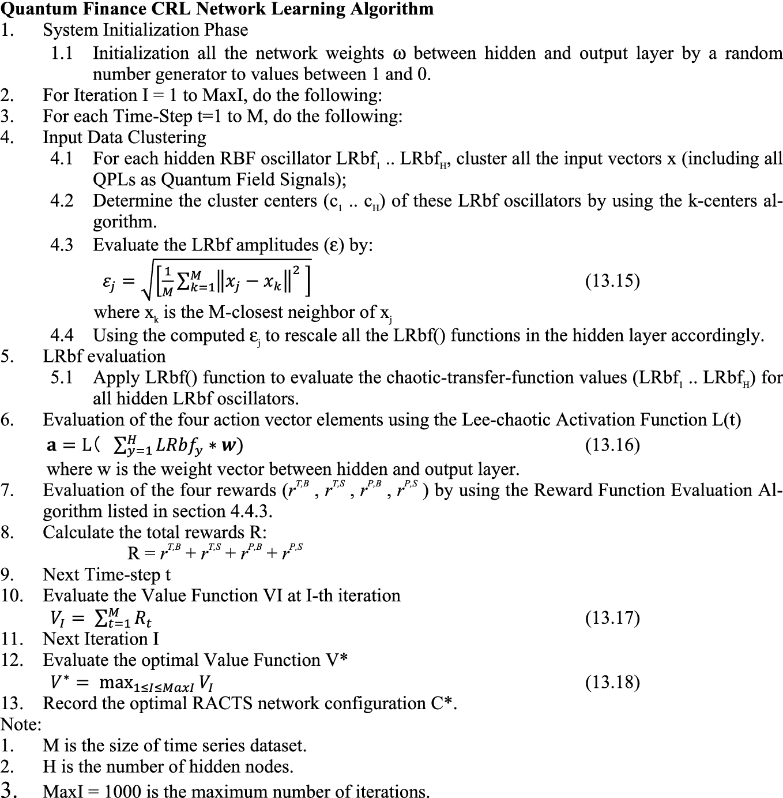
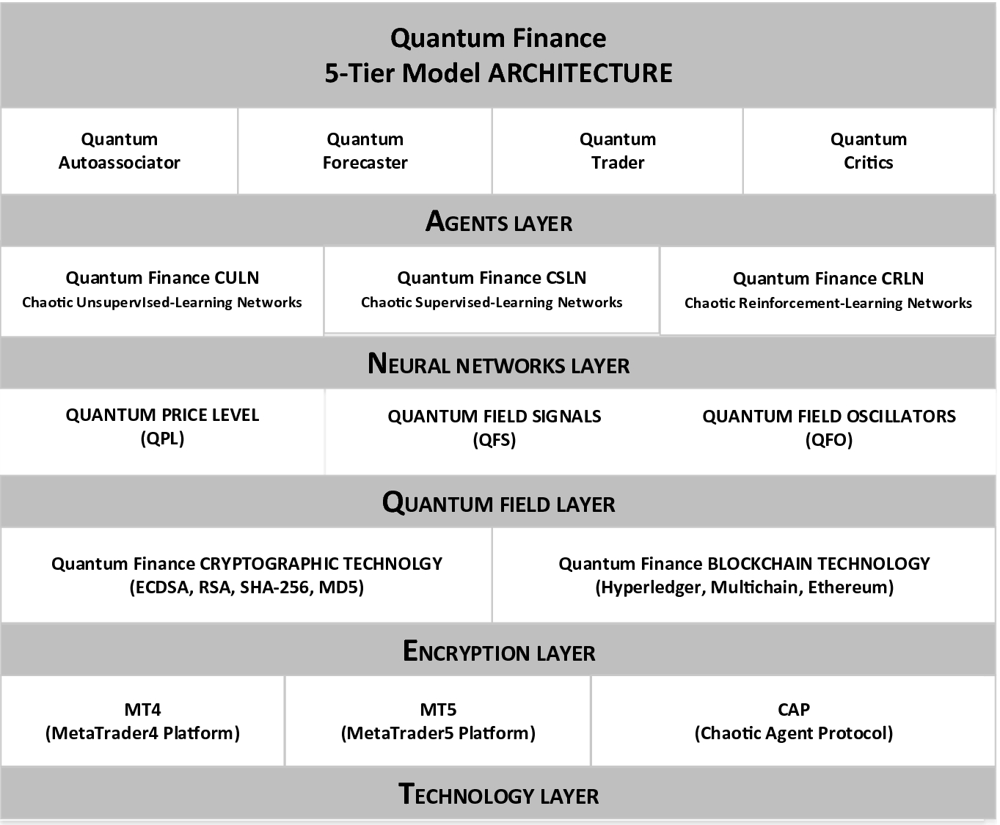
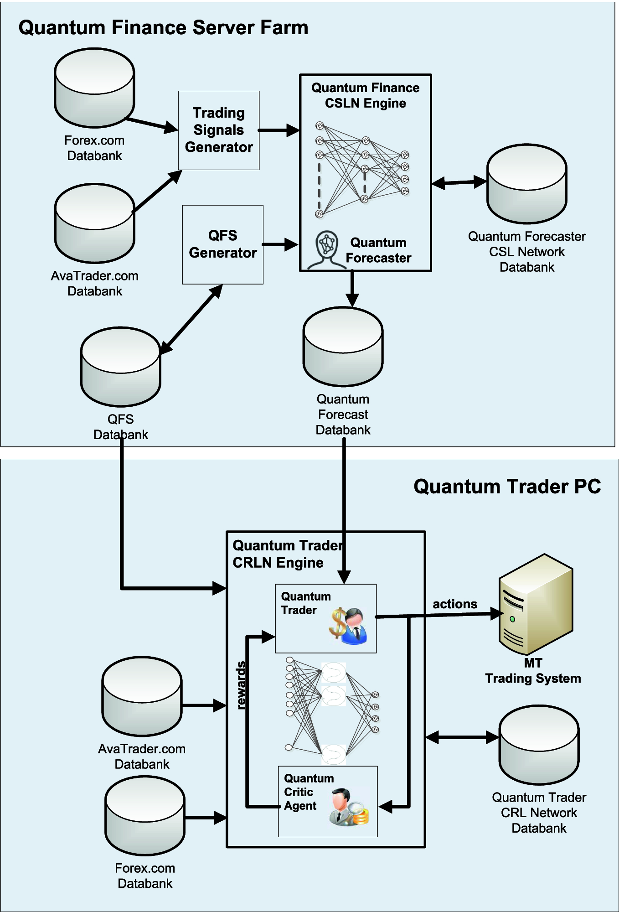
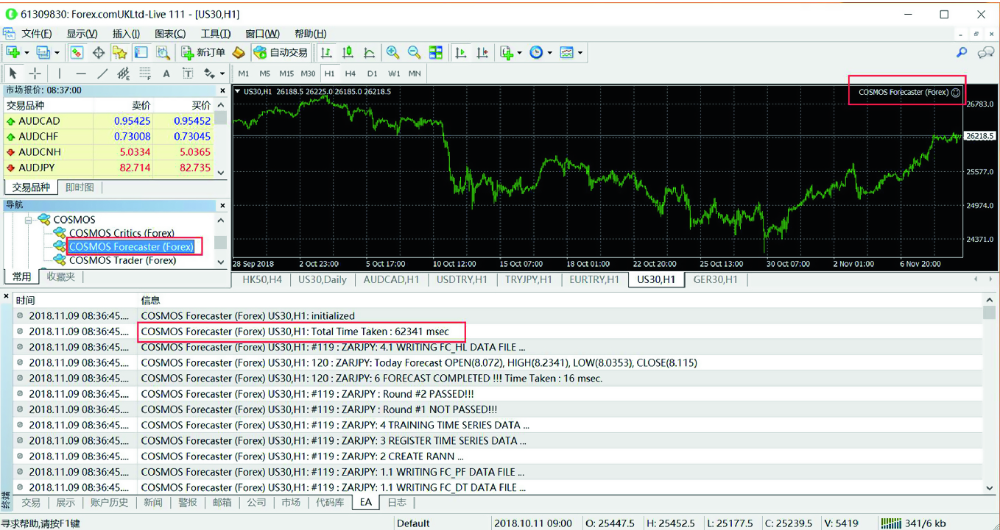
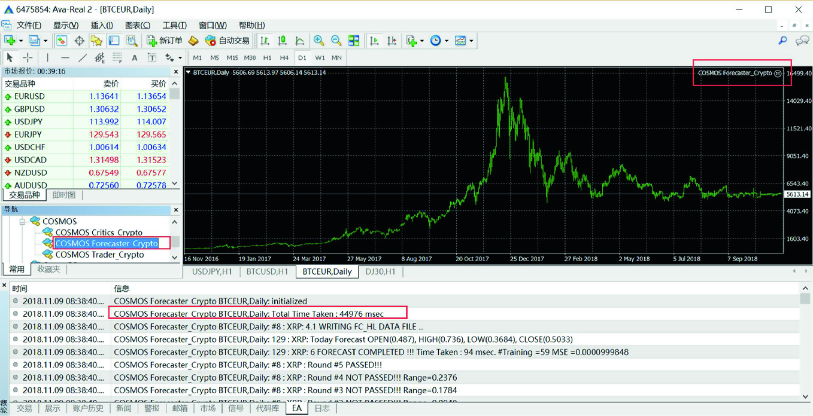

# 13\. Quantum Trader—A Multiagent-Based Quantum Financial Forecast and Trading System

© Portions of this chapter are reprinted from Lee (2019), with permission of KeAi Publishing Communications Ltd.

Over the years, financial engineering ranging from the study of financial signals to the modeling of financial prediction is one of the most stimulating topics for both academia and financial community. Not only because of its importance in terms of financial and commercial values, but also it vitally poses a real challenge to worldwide researchers and quants owing to its highly chaotic and almost unpredictable nature. This chapter devises an innovative multiagent-based quantum financial forecast and trading system (a.k.a. quantum trader) for worldwide financial prediction and intelligent trading. With the adoption of author’s theoretical works on Lee-oscillator with profound transient-chaotic property, quantum trader effectively integrates quantum field signals (QFS) and quantum field oscillators (OFS) studied in Part I for neural network training and prediction into: (1) quantum forecaster—chaotic FFBP-based time series supervised-learning agent for worldwide financial forecast and; (2) quantum trader—chaotic RBF-based actor-critic reinforcement-learning agents for the optimization of trading strategies. Quantum trader not only provides a fast reinforcement-learning and forecast solution, more prominently it successfully resolves the massive data over-training and deadlock problems which is usually imposed by traditional recurrent neural networks and RBF networks using classical sigmoid or Gaussian-based activation functions.

From the implementation perspective, the quantum trader is integrated with 2048-trading day time series financial data and 39 major financial signals as input signals for the real-time prediction and intelligent agent trading of 129 worldwide financial products which consists of: 9 major cryptocurrencies, 84 forex, 19 major commodities, and 17 worldwide financial indices. In terms of system performance, past 500-day average daily forecast performance of quantum trader attained less 1% forecast percentage errors and with promising results of 8–13% monthly average returns.

## 13.1 Introduction 

Conventional technical analysis and chart analysis methods probe various trading signals (e.g., K-lines, MAs, Bollinger-band index, KDJ and RSI indices) and chart patterns (e.g., major reversal and trend patterns, golden-ratio patterns, Fibonacci patterns, Elliot-wave patterns) that believe to affect the market price trends, trading patterns and individual reasonings to determine the best time to trigger buy or sell decisions (Borden 2018; Brown 2012; Bulkowski 2005; Murphy 1999). However, these numerous trading signals and chart-patterns are usually self-contradictory between different timeframes, let’s alone with the fact that they are highly subjective to the traders’ own judgment and psychological condition. 

With the advancement of computational capacity in past decades, the modeling of complex financial prediction systems ranging from artificial neural networks (ANNs) (Chang et al. 2012; Dai et al. 2012) to fractal-based financial forecast systems (Ling 2013) using ordinary desktop personal computers and workstations is no more a reverie.

Current research on financial prediction include: stock prediction using deep neural network (DNN) with principal component analysis (PCA) by Singh and Srivastava (2017); fuzzy models by Hwang and Oh (2010); Postfix-GP (Genetic Programming) models by Dabhi and Chaudhary (2016); SVM (Support Vector Machine) and hybrid SVR (Support Vector Regression) models by Henrique et al. (2018), Nahil and Lyhyaoui (2018) and Ouahilal et al. (2017).

Moreover, the popularity of free and open quantitative financial system development platforms such as MetaTrader (MT) platform provides an ideal environment for worldwide researchers and quants to test their trading algorithms, strategies and financial signals with real-time financial data streams which prosper the popularity of program trading, especially the high-frequency algorithmic program trading (HFAPT) in the past 10 years (Durbin 2010; Walker 2018; Young 2015).

From the financial market perspective, the blooming of cryptocurrency originated from bitcoin in 2009 had increased to more than 4000 cryptocurrencies in the worldwide financial market (Narayanan 2016; Vigna and Casey 2016). More importantly, major international fund houses and forex trading platforms integrate 24 × 7 electronic trading of cryptocurrency into their forex trading platforms since 2013. Together with the flourishment of HFAPT in the past 10 years, the worldwide financial markets; especially the international currency market becomes more volatile and unpredictable. An effective, open, and reliable worldwide financial prediction, trading and advisory system is profoundly required for worldwide traders and investors, especially independent investors than ever before.

This chapter devises an innovative multiagent-based quantum financial forecast and trading system (a.k.a. _Quantum Trader_) for worldwide financial prediction and intelligent trading. With the adoption of author’s theoretical works on Lee-oscillator with profound transient-chaotic property (Lee 2004), quantum trader effectively integrates quantum field signals (QFS) and quantum field oscillators (OFS) studied in Part I for neural network training and prediction into: (1) quantum finance forecaster (or _quantum forecaster_ in short)—chaotic FFBP-based supervised-learning agent for worldwide financial forecast and; (2) quantum finance trader (or _quantum trader_ in short)—chaotic RBF-based actor-critic reinforcement-learning agents for the optimization of trading strategies. Quantum trader not only provides a fast reinforcement-learning and forecast solution, more importantly, it successfully resolves the massive data over-training and deadlock problems, which usually imposed by traditional recurrent neural networks and RBF networks using classical sigmoid or Gaussian-based activation functions.

## 13.2 Quantum Forecaster—Chaotic FFBP-Based Time Series Supervised-Learning Neural Networks for Financial Prediction 

### 13.2.1 Time Series Prediction Using Supervised-Learning-Based Artificial Neural Networks

Time series prediction, ranging from weather forecast to stock prediction has been studied for over 50 years. With the improvement of computational speed, nonlinear models such as artificial neural networks (ANN) have proven success to tackle these problems. Traditional ANN such as feedforward backpropagation neural network (FFBPN) is a typical kind of supervised-learning (SL) neural network to tackle these problems with certain success.

However, when it comes to massive input data such as financial prediction with over thousands time series financial data and signals as input vectors, these conventional ANNs using classical sigmoid-based activation function are usually “trapped” in local minima during neural network training; which not only affects the efficiency (time cost), but also the accuracy of the forecast results (Lee 2006).

### 13.2.2 Quantum Finance CSL Network—Chaotic FFBP-Based SL Network for Time Series Financial Prediction with Quantum Field Signals (QFF)

Quantum finance chaotic supervised-learning (CSL) network is the integration of Lee-oscillator with classical FFBPN by replacing all neurons with Lee-oscillators. Besides time series signals, the most important characteristics of quantum finance CSL network is the adoption of all related quantum field signals (QFS) for the financial market studied in Part I as quantum field oscillators (QFO) for network training and financial prediction. Figures 13.1 and 13.2 show the system architecture and chaotic FFBP-based time series supervised-learning algorithm of quantum finance CSL network for financial prediction.  **Fig. 13.1. System architecture of quantum finance CSL network for time series financial prediction**  **Fig. 13.2. Quantum finance CSL network learning algorithm** 

## 13.3 Quantum Trader—Chaotic RBF-Based Actor-Critic Reinforcement-Learning Networks—Optimization of Trading Strategy 

### 13.3.1 An Overview of Reinforcement Learning (RL)

Different from the supervised-learning model with well-defined _input/target_ -_output_ pairs to train the network, there are many situations in which input/target-output pairs do not exist. For example, in stock investment, even though we have the best stock forecast to tell us when to set the buy/sell bid, _how much we should invest?_ or _when to close the bid?_ in order to get the highest returns is a typical optimization problem without an exact solution. In that case, we can make use of the reinforcement-learning (RL) method.

Reinforcement-learning (RL) theory is originated from behavior psychology. Its main concept is to train the neural network with the adoption of feedback signals, namely reinforcement signal (RS). For the right behavior, the network will respond with a positive RS to _award_ the RL network; while for the wrong behavior, the network will respond with a negative RS to _punish_ the RL network. As we can see, RL networks don’t need well-defined input/target-output pairs, all they need to do is to search for a set of optimal weights to minimize the negative reinforcement signals.

Classical RL model such as Markov decision process (MDP) using stochastic-based reinforcement-learning algorithms such as Q-Learning, dynamic-programming (DP) and TD-learning (TDL) with certain success (Kaelbling et al. 1996). However, when it comes with time series financial optimization problems with over thousands of input signals and possible trading strategies, these classical stochastic RL methods are either too computationally intensive or difficult to adopt for actual implementation.

With the flourishing of recurrent neural networks in the past decades, researchers began to explore how recurrent neural networks can be applied for RL on various optimization problems (Li et al. 2009; Liu et al. 2005); financial engineering include Deng et al. (2017) using deep direct reinforcement-learning network for financial signal representation and trading; Pendharkar and Cusatis (2018) applied reinforcement-learning agents for trading financial indices; Tan et al. (2011) used reinforcement-learning system for stocking trading with cycles; Chang et al. (2017) used asymmetric reinforcement-learning and conditioned responses technique to analyze global financial crisis; Carapuco et al. (2018) using reinforcement-learning system for short-term speculation in the foreign exchange market and Jeong and Kim (2019) using deep Q-Learning to improve financial trading decisions.

### 13.3.2 Discrete-Time Actor-Critic RL Model

DTAC-RLM is a multiagent system (Lee 2006) consists of four components: environment space (E), action space (A), actor agent (Actor), and critic agent (Critic). Different from its continuous-time AC model counterpart (such as MDP), DTAC-RLM visualizes its _world_ as a collection of _discrete_ -_time_ -_step states_ and _actions_. More vitally, all these states are related to time series events. The role of the actor is based on input signals provided at current state at time t (st) to respond with the _best_ available actions (at); whereas the role of the critic is to evaluate the reinforcement signal (RS, or _reward_ , _r_ _t_ in short) based on action(s) taken by the actor and signals provided by the new states (st+1). Then the reward signal rt feedbacks as input to the actor to decide the next action **a** at time t + 1 (Fig. 13.3).  **Fig. 13.3. Discrete-time actor-critic RL model** 

The formulations are given by $$\mathbf{s} \in \left\\{ \mathbf{S} \right\\} , \;\mathbf{a} \in \left\\{ \mathbf{A} \right\\} ,\;\mathbf{r} \in \left\\{ {\mathbb{R}} \right\\}$$ (13.9) $${\mathbf{\Pi}} = \left\\{ {\mathbf{a}_{\mathbf{t}} , \mathbf{t} = 1 \ldots \mathbf{T}} \right\\}$$ (13.10) $$\mathbf{V} = \sum_{{\mathbf{t} = 1}}^{\mathbf{T}} {\mathbf{r}_{\mathbf{t}} (\mathbf{s}_{\mathbf{t}} ,\mathbf{a}_{\mathbf{t}} )}$$ (13.11) $${\mathbf{V}}^{*} = \max_{\Pi} V^{\Pi }$$ (13.12) 

As shown in the above formulation: S and A denote the state space and action space, s and a denote the state and action vectors; r denotes the reward vector; Π denotes the action policy from time t = 1 to t = T (dimension of policy space); V denotes the value function which represents the total returns for a particular policy Π. For DRL with maxI iterations, there will be totally maxI policies Π being generated, and V* is the optimal returns obtained by the calculation of all possible return values $\mathbf{V}_{\mathbf{k}}^{{\mathbf{\Pi}}}$ (where k = 1… maxI) from these policies. So, the whole optimization problem is to find the best policy Π* via DRL in order to attain the optimal returns V*. Next section we will explore how to adopt CRBFN (chaotic radial basis function neural network) for DRL.

### 13.3.3 Radial Basis Function Neural Network (RBFN) for RL

Like FFBPN, a typical multilayer radial basis function neural network (RBFN) also consists of input, hidden, and output layers. Although network architectures between FFBPN and RBFN are highly similar, the network activations in RBF networks are localized RBF functions such as Gaussian functions, resulting in a much faster training rate (Markopoulos et al. 2016).

Unlike FFBPN, input vectors in RBFN distribute values to the hidden layer neurons uniformly, without multiplying them with weights. The neurons in the hidden layer are presented by RBF neurons using radial basis function such as Gaussian function as activation function, which is given by $$G\left( {\text{r}} \right) = exp\left[ { - \frac{r}{{2\sigma^{2} }}} \right]$$ (13.13) 

Different from FFBPN which is only tailored for supervised learning, experimental results revealed that RBFNs can basically approximate any functions. As a result, they are usually known as “universal-approximators”. In other words, RBFN can be used for both SL and RL by using RBFN to approximate the V-value function.

However, like FFBPNs, when it comes with handling massive input data and/or highly chaotic nature such as time series financial forecast using over thousands of input values and financial signals as network input vectors, RBFNs also encounter “over-training” and “deadlock” problems, which hinder further improvement of network accuracy and resulted in an expensive time costs from the computational perspective.

### 13.3.4 Quantum Finance CRL Network—Chaotic RBF-Based Actor-Critic RL Network for the Optimization of Trading Strategy

Quantum finance chaotic reinforcement-learning (CRL) network integrates the Lee-oscillator technology with conventional RBFN by: (1) replacing all Gaussian-based radial basis functions in the hidden layer of RBFN with Lee-oscillatory RBF functions (namely, _LRbf_); and (2) replacing output neurons with Lee-oscillator to facilitate transient-chaotic neural activations. Figure 13.4 shows LRbf() which served as the chaotic RBF activation function in the quantum trader.  **Fig. 13.4. Chaotic RBF activation function using Lee-oscillators** 

The formulation of LRbf is given by $$LRbf\left( x \right) = \left\\{ {\begin{array}{*{20}c} {L\left( x \right),} & {x &lt; c} \\\ {L\left( {2c - x} \right),} & {x \ge c} \\\ \end{array} } \right.$$ (13.14) 

_where L(x) is the Lee_ -_oscillator function as mentioned in Chap._ [9](<480082_1_En_9_Chapter.xhtml>) _and c is the center of LRbf()._

In contrast with the Gaussian function counterpart, the LRbf exhibits a progressive-transient-chaotic property in two RBF activation regions which provide some sort of _controlled_ -_hysteresis_ to sort out the over-training and deadlock problems during RL with massive input vectors.

### 13.3.5 Quantum Finance CRL Network System Architecture for the Optimization of Trading Strategy

As depicted in Fig. 13.5, quantum finance CRL network is a three-layer chaotic RBF-based neural network with input, hidden, and output layers. To accomplish actor-critic-based RL, the input layer consists of two classes of input vectors: the reward signal vector **r** and input signal vector **x**. The input signal vector **x** composes of all time series input signals together with the corresponding quantum price levels (QPLs) as quantum field signal (QFS) for reinforcement training. Reward signal vector **r** contains four reinforcement feedback signals which are generated by the critic agent in the previous time-step. These four reward signals rT,B, rT,S, rP,B, rP,S correspond to four actions aT,B, aT,S, aP,B, and aP,S which emulate de facto short-term trading strategies:  **Fig. 13.5. Quantum finance CRL network system architecture** 

1. Time-driven-buy strategy—trigger buy action aT,B when current price reaches forecast low, day-end harvest;

2. Time-driven-sell strategy—trigger sell action aT,S when current price reaches forecast high, day-end harvest;

3. Price-driven-buy strategy—trigger buy action aP,B when current price reaches forecast low, closing when reaching target price/stop-loss price;

4. Price-driven-sell strategy—trigger sell action aP,S when current price reaches forecast high, closing when reaching target price/stop-loss price.

The hidden layer of quantum finance CRL network consists of H LRbf nodes, which facilitate transient-chaotic RRB-based RL.

The output layer consists of four possible actions: aT,B, aT,S, aP,B, and aP,S as described above. Their scalar values are normalized values between 0 and 1 which represent the size (lot) of investment (“0” means _not invest_ ; “1” means to _invest one complete lot_).

### 13.3.6 Quantum Finance CRL Network Learning Algorithm

The overall quantum finance CRL network learning algorithm is presented in Fig. 13.6.  **Fig. 13.6. Quantum finance CRL network learning algorithm** 

As shown in Fig. 13.6, the Lee-oscillators are adopted into the algorithm in two aspects: (1) replacement of the Gaussian RBF with chaotic RBF (LRbf) in the hidden layer; (2) replacement of sigmoid-based activation function with Lee-transient-chaotic activation function L in output layer for the determination of action **a**. From the neural dynamic perspective, the adoption of chaotic RBF and activation function can be considered as the emulation of chaotic trading behaviors in the time series events and actions. While from the financial perspective, such adoption of transient-chaotic activation and RBF can be considered as the imitation of _transient_ -_hysteresis_ investors’ behavior during real-time trading.

For the value function V, the physical meaning of its optimal value V* in terms of financial investment is even more profound: while **r** t is total returns (rewards) at time-step t which represents the short-term returns in day trade; its value function V plainly represents the long-term returns of the whole investment policy Π; and its optimal V* directly represents the optimal long-term returns by using the optimal quantum trader network configuration and hence the optimal policy Π*.

## 13.4 System Implementation 

### 13.4.1 Quantum Finance—TEQNA 5-Tier Architecture

From the implementation perspective, quantum finance system model adopts a 5-tier system implementation architecture, namely, _TEQNA_ as shown in Fig. 13.7.  **Fig. 13.7. Quantum trader—TEQNA 5-layer system architecture** 

Quantum finance TEQNA system architecture consists of the following:

1. Technology layer—supports MT4/MT5 platforms and related programming technologies such as expert advisors (EAs), quantum trader agent protocol (CAP).

2. Encryption layer—supports critical cryptographical technologies include both encryption and blockchain technologies.

3. Quantum field layer—supports three basic components of quantum field modeling of financial markets: quantum price levels (QPL), quantum field signals (QFS), and quantum field oscillators (QFO) studied in Part I.

4. Neural networks layer—supports quantum finance chaotic supervised-learning (CSL) networks, quantum finance unsupervised-learning (CUSL) networks, and quantum finance chaotic reinforcement-learning (CRL) networks.

5. Agents layer—supports intelligent chaotic agent applications include quantum auto-associator, forecaster, trading and critic agents.

### 13.4.2 Quantum Trader System Implementation Using 129 Worldwide Financial Products

From the application perspective, real-time and historical data of worldwide 129 financial products provided by [Forex.​com](<http://Forex.com>) (major online Forex trading platform) and [AvaTrade.​com](<http://AvaTrade.com>) (the biggest cryptocurrency trading platform) are adopted for quantum trader system implementation. They include: major cryptocurrencies (9), worldwide forex (84), major commodities (19), worldwide financial indices (17). Appendix A shows the list of financial products under these four categories.

### 13.4.3 Quantum Trader—System Implementation

For the ease of fully integration and automation of quantum trader system with both real-time and historical financial data provided by [Forex.​com](<http://Forex.com>) and [AvaTrade.​com](<http://AvaTrade.com>), the whole intelligent agent-based system fully integrated with MT platforms. Figure 13.8 shows the system implementation framework of quantum trader.  **Fig. 13.8. System implementation framework of quantum trader** 

The whole quantum trader system consists of two main modules: (1) quantum forecaster using quantum finance CSL network for time series worldwide financial prediction; and (2) quantum trader and critic agents using quantum finance CRL network for the optimization of trading strategy.

The agent activities of these quantum finance agents are described as follows:

_**Quantum Forecaster Agent**_

Quantum forecaster is a server-side forecast agent located at the server farm of quantum finance forecast center (QFFC) using Intel i5 CPU 2.39 GHz 32 MB ram Dell servers.

For each financial product, 2048-trading day data (except cryptocurrency which only have 300-trading day data) include: open (O), high (H), low (L), close (C), and volume (V) are automatically generated by MT4 engines of [Forex.​com](<http://Forex.com>) and [AvaTrade.​com](<http://AvaTrade.com>). Through the trading signal generator, 39 most common trading signals are generated, together with the 2048-trading day data, they are fed into the forecast system for training and forecast of next-day open (O), high (H), low (L), and close (C). The predicted forecasts of these 129 financial products are stored at the quantum forecast database for the quantum trader trading agents to access. Appendix B shows the 39 trading signals generated by trading signal generator.

Besides input time series data and trading signals, one of the major characteristics of a quantum forecaster is to incorporate with quantum field signals (QFS) generated by quantum field signal generator (QFSG) as shown in Fig. 13.8 that was studied in Part I. These QFS are stored in QFS databank which will also be used by quantum traders and critic agents for reinforcement learning.

_**Quantum Trader Agents**_

The quantum trader receives inputs from four sources: (1) input signals from markets (stored at the input signal databanks of the quantum finance server farm) of current and past records; (2) quantum field signals (QFS) from QFS databank; (3) current forecasts stored at quantum forecast database of the quantum finance server farm; and (4) reward signals from previous time-step generated by quantum finance critic agent. By using the quantum finance CRL algorithm, it evaluates four possible actions a. Updates its trading policy and keeps track of the market movements in order to trigger the trading actions.

_**Quantum Finance Critic Agent**_

Quantum finance critic agent receives inputs from two sources: (1) input signals from the markets of current and past records; (2) quantum field signals (QFS) from QFS databank; (3) latest action a taken by the quantum trader. By using the reward evaluation algorithm, quantum finance critic agent evaluates the latest rewards r of four actions and feedback to the quantum trader as reinforcement signals for the determination of investment actions in the next time-step.

### 13.4.4 Quantum Finance Daily Forecast at QFFC

Figure 13.9 shows a snapshot of quantum finance forecaster (or _quantum forecaster_ in short) for the training and forecast of 120 financial products of [Forex.​com](<http://Forex.com>) on November 09, 2018. As shown, in a typical daily forecast, the quantum forecaster only took 62,341 ms (62.341 s) to finish the training forecast of 120 financial products. On average, it took 0.519 s (less than 1 s) to finish the network training and forecast process of a single financial product.  **Fig. 13.9. Snapshot of quantum forecaster for the training and forecast of 120 financial products forForex.​comMT4 platform on November 09, 2018** 

Figure 13.10 shows the snapshot of quantum forecaster for the system training and forecast of 9 major cryptocurrencies over [AvaTrade.​com](<http://AvaTrade.com>) MT platform on the same trading day.  **Fig. 13.10. Snapshot of quantum forecaster for training and forecast of 9 major cryptocurrencies forAvaTrade.​comMT4 platform on November 09, 2018** 

As shown, quantum forecaster took 44,976 ms (44.976 s) to finish the training and forecast of 9 cryptocurrencies. On average, it took 4.99 s to train and forecast a single cryptocurrency.

As compared with all those 120 non-cryptocurrency products, quantum forecaster took 9.62 times of computer time to predict cryptocurrency, even though cryptocurrency only have 300-trading day records while the other 120 financial products each have 2048-trading day records for system training. It might due to cryptocurrencies, in general, are much more chaotic and fluctuant in nature, which takes more time and iterations for the quantum forecaster to learn the market patterns.

### 13.4.5 Quantum Forecaster Performance Test

The forecast performance of quantum forecaster is compared with traditional FFBPN by applying 500 forecast simulations for each system. For the ease of comparison, four categories of worldwide 129 financial products are tested network MSE (mean-square-error) ranging from 1 × 10-4 to 1 × 10-6, respectively.

Besides traditional FFPBN, two state-of-the-art financial forecasting methods: (i) SVM (support vector machine) forecasting tool provided by R project, one of the most popular financial forecasting tools used in finance industry and (ii) deep neural network (DNN) with principal component analysis (PCA) model (Singh and Srivastava 2017) are contrasted with quantum forecaster for forecast performance comparison. Table 13.1 presents quantum finance forecast performance comparison chart of these four systems.

Table 13.1

Quantum forecaster forecast performance comparison chart

Product category| No. of PRD| FFBPN| SVM| DNN-PCA| Quantum forecaster  
---|---|---|---|---|---  
Total STT| Av. STT| Total STT| Av. STT| Total STT| Av. STT| Total STT| Av. STT  
**Case 1 (MSE = 1 × 10-4)**  
Cryptocurrency| 9| 557,251| 61916.78| 372,244| 41360.41| 244,633| 27181.47| 5720| 635.56  
Forex| 84| 508,453| 605\. 01| 331,511| 3948.56| 291,344| 3488.38| 6323| 75.27  
Financial index| 19| 41,120| 2184.21| 26,152| 1378.44| 19,738| 1038.82| 923| 48.58  
Commodity| 17| 46,641| 2743.59| 29,384| 1728.46| 22,108| 1300.46| 1223| 71.94  
Overall| 129| 1,153,465| 8941.59| 759,291| 5885.98| 577,823| 4479.25| 14,189| 109.99  
**Case** 2 **(MSE = 1 × 10-5)**  
Cryptocurrency| 9| 1,460,000| 162222.22| 937,320| 104148.67| 823,440| 91493.33| 15,121| 1680.11  
Forex| 84| 1,235,543| 14708.85| 841,405| 10016.72| 720,322| 8575.26| 17,231| 205.13  
Financial index| 19| 111,024| 5843.37| 68,391| 3599.51| 50,627| 2664.58| 2312| 121.68  
Commodity| 17| 109,142| 6420.12| 71,925| 4230.86| 44,967| 2645.09| 2640| 155.29  
Overall| 129| 2,915,709| 22602.40| 1,919,041| 14878.29| 1,639,356| 12708.19| 37,304| 289.18  
**Case 3 (MSE = 1 × 10-6)**  
Cryptocurrency| 9| DL|  | 6,102,255| 678028.38| 3,601,307| 400145.17| 57,235| 6359.44  
Forex| 84| D L|  | 5,477,816| 65212.10| 4,184,833| 49819.44| 71,243| 848.13  
Financial index| 19| 577,324| 30385.47| 373,529| 19659.40| 318,683| 16772.78| 6623| 348.58  
Commodity| 17| 687,595| 40446.76| 468,252| 27544.25| 385,741| 22690.64| 9126| 536.82  
Overall| 129| –|  | 12,421,852| 96293.43| 8,490,564| 65818.33| 144,227| 1118.04  
  
 _Note_

1\. Results are generated by 500 simulations of each neural network system (measured in ms)

2\. “Total STT” denotes the total average system training time for 500 simulations of network training

3\. “Av. STT” denotes the average system training lime for a single financial product of each category

4\. “DL” denotes deadlock during system training

Certain interesting findings were revealed:

1. (i)

For the case I simulation using MSE 1 × 10-4, quantum forecaster outperformed FFBPN, SVM, and DNN-PCA by 81.29, 53.51, and 40.72 times, respectively. Similar findings can be found in case II simulation results. It clearly reflected the improvement of network learning rate by the adoption of chaotic neural oscillators into traditional FFBPN.

2. (ii)

Across the 3 cases with decreasing MSE from 1 × 10-4 (case I), 1 × 10-5 (case II) to 1 × 10-6 (case III). All forecast systems achieved MSE in case I and case II. However, case III simulations using MSE 1 × 10-6, FFBPN encountered “deadlock” problems during the network training of cryptocurrency and forex products; while quantum forecaster could still finish the network training with promising training speeds. It clearly demonstrated the resolution of over-training and deadlock problems and sufficient improvement of system training efficiency by quantum forecaster over traditional neural networks using classical sigmoid-based activation function.

3. (iii)

In terms of system performance across different financial products, the simulation results clearly reflected that both cryptocurrency and forex were more chaotic and difficult for network training than other financial products as expected, which will be one of the future R&D directions of quantum finance forecast center.

### 13.4.6 Quantum Trader Trading Strategy Performance Test

In order to conduct a systematic test of quantum trader on intelligent trading, two more benchmark agents were implemented for comparison purposes:

1. time-driven trading agent (TmAgent);

2. price-driven trading agent (PrAgent).

These two agents simulated real-world traders by using quantum finance forecasts together with simple short-term trading strategies of:

1. day-end harvest strategy (time-driven strategy); or

2. target-profit and stop-loss strategy (price-driven strategy) with ratio 2:1 (i.e., target-profit = 2 × stop-loss).

For the 9 cryptocurrency products, 300-trading day simulations were performed for each trading agent; while 500-trading day simulations were performed for 120 non-cryptocurrency financial products. Table 13.2 summarizes the trading performance results for three trading strategies.

Table 13.2

Quantum trader trading strategy performance comparison chart

Product category| Time-driven strategy| Price-driven strategy| Quantum trader strategy  
---|---|---|---  
BUY (%)| SELL (%)| Overall (%)| BUY (%)| SELL (%)| Overall (%)| BUY (%)| SELL (%)| Overall (%)  
Cryptocurrency| 2.66| 3.17| 2.92| 3.12| 3.12| 3.47| 6.71| 9.37| 8.04  
Fores| 5.52| 7.22| 6.37| 6.32| 1.16| 7.04| 12.41| 13.83| 13.12  
Financial index| 5.72| 6.11| 5.92| 5.49| 6.71| 6.10| 9.56| 10.21| 9.89  
Commodity| 4.39| 6.01| 5.20| 5.12| 6.43| 5.7S| 10.43| 11.88| 11.16  
Average| 4.57| 5.63| 5.10| 5.01| 6.18| 5.60| 9.78| 11.32| 10.55  
  
 _Note_

1\. Results (Monthly Returns %) are generated by 300 trading day simulations of the 9 Cryptocurrencies and 500 trading day simulations of the 120 non-cyptocurrency products

Major findings can be concluded in three aspects:

1. (i)

Across the three trading strategies, overall speaking, quantum trader trading strategy outperformed time-driven strategy and price-driven strategy by 106.86% and 88.52%, respectively. It clearly reflected the effectiveness of the combined strategy in quantum trader by using the chaotic reinforcement-learning technique. Comparing time-driven strategy with price-driven strategy, it was interested to reveal that price-driven strategy was consistently outperformed its time-driven counterpart by around 9.73%. It can be explained by the fact that although the time-driven strategy was rather typical in automatic program trading for day trade, the closing-price normally wouldn’t be the optimal price for bid-closing, as compared with the 2:1 target-profit and stop-loss price-driven strategy which was more sensible in terms of short-term trading.

2. (ii)

Across the four different categories of financial products, the overall returns of cryptocurrency products were the worst as expected, since the forecast performance of cryptocurrency products were also the lowest as compared with the other three categories. However, for forex products, it was interested to find out that although the forecast performance of forex products was not as good as financial indices and commodities, their overall returns outperformed these two categories and rank no. 1. As reflected by experienced traders, it might be owing to the fact that although the daily patterns of forex products were highly chaotic, their price patterns were mostly (over 80% of the time) oscillations between the predicted high/low without trigger the stop-loss thresholds.

3. (iii)

As compared with the buy versus sell strategy, it was interested to find out that the overall returns from sell strategy were consistently higher than its buy strategy counterpart by around 16%, which was quite consistent with the comments from experienced traders that automatic program trading usually favors sell versus buy strategy.

### 13.4.7 Quantum Trader Worldwide Trading Strategy Evaluation

Started from January 1, 2018, 342 members of QFFC which consists of professional traders and quants from major fund houses are invited to join the quantum trader system evaluation focus group for a 1-year worldwide evaluation program of quantum trader trading system as compared with their own trading strategies.

They were all provided with free quantum finance daily forecasts for the 129 financial products and the two de facto agent trading programs (i.e., the time-driven and price-driven trading agents). Based on quantum finance daily forecasts, they are free to use either the de facto trading agents or their own trading strategies to do trading.

Table 13.3 presents the nine months (1.1.2018–9.30.2018) trading performance comparison chart for the worldwide evaluation scheme.

Table 13.3

Quantum trader trading performance comparison chart

Product| FFBPN (%)| SVM (%)| DNN-PCA (%)| ALL traders (%)| Top 15% traders (%)| Top 5% traders (%)| Quantum trader (%)  
---|---|---|---|---|---|---|---  
Cryptocurrency| 2.03| 5.08| 5.32| 2.76| 6.54| 8.76| 7.62  
Forex| 2.72| 7.91| 8.29| 5.32| 12.31| 16.71| 13.16  
Financial index| 3.65| 7.59| 7.89| 4.24| 11.22| 15.23| 11.37  
Commodity| 3.87| 9.52| 10.01| 4.12| 11.81| 16.71| 12.67  
Average| 3.07| 7.53| 7.88| 4.11| 10.47| 14.35| 10.55  
  
For the ease of comparison, quantum trader trading performance (overall 10.55%) was compared with the following:

1. Traditional FFBPN with day-trade algorithm (overall 3.07%);

2. SVM forecasting tool with day-trade algorithm (overall 7.53%);

3. DNN-PCA forecasting model with day-trade algorithm (overall 7.88%);

4. Overall average performance of the focus group (overall 4.11%);

5. Top 15% traders’ performance (overall 10.47%);

6. Top 5% traders’ performance (overall 14.35%).

As revealed from the performance analysis, it was clear that the overall trading performance of quantum trader outperformed FFBPN, SVM, and DNN-PCA by around 7.49%, 3.03%, and 2.67%, respectively (in terms of overall returns). On the other hand, as compared with professional traders, quantum trader trading performance was close to a typical top 15% trader, outperformed the average traders by over 6.44%, which was rather promising as feedback from professional traders.

## 13.5 Conclusion 

This chapter devised an innovative multiagent-based quantum finance forecast and trading system—quantum trader. From the implementation perspective, the quantum trader was integrated with quantum finance forecast center for the provision of worldwide 129 financial product forecasts and intelligent trading systems.

In fact, for a professional trader and investor, a reliable and effective financial forecast system is only the beginning of the story. A good financial investment also needs: (1) good and effective trading and hedging strategies; (2) stable, logical, and rational investment psychology.

### Problems

1. 13.1

What is an intelligent agent? What are the major differences between traditional computer programs and intelligent agents? Give two real-world examples on how to apply intelligent agent technology in finance engineering.

2. 13.2

Discuss and explain the major advantages of using intelligent agent technology for the implementation of intelligent trading systems.

3. 13.3

Discuss and explain why program trading become so popular in nowadays financial community. What are the major differences between traditional financial trading versus program trading? Give two examples of program trading and describe how they work.

4. 13.4

Describe and explain what is high-frequency algorithmic program trading (HFAPT). Give two examples of HFAPT in forex markets and describe how they work.

5. 13.5

Discuss and explain why nowadays AI become so popular in building program trading systems. Give two examples of financial product trading for illustration.

6. 13.6

Financial prediction nowadays becomes one of the hottest topics in financial engineering. Why now as AI prediction already exists for over half a century?

7. 13.7

State and discuss three contemporary AI-based financial prediction technologies and briefly explain how they work.

8. 13.8

As mentioned in Chap. [8](<480082_1_En_8_Chapter.xhtml>), chaos theory told us that the forecast of complex systems such as weather and financial markets are bounded by the initial condition. How can AI such as artificial neural networks or recurrent neural networks get around with this intrinsic problem? Use forex prediction system as an example for explanation.

### Acknowledgements

The author wishes to thank [Forex.​com](<http://Forex.com>) and [AvaTrade.​com](<http://AvaTrade.com>) for the provision of historical and real-time financial data. The author also wishes to thank Quantum Finance Forecast Center of UIC for the R&D supports and the provision of the channel and platform [Qffc.​org](<http://qffc.org>) for worldwide system testing and evaluation.
