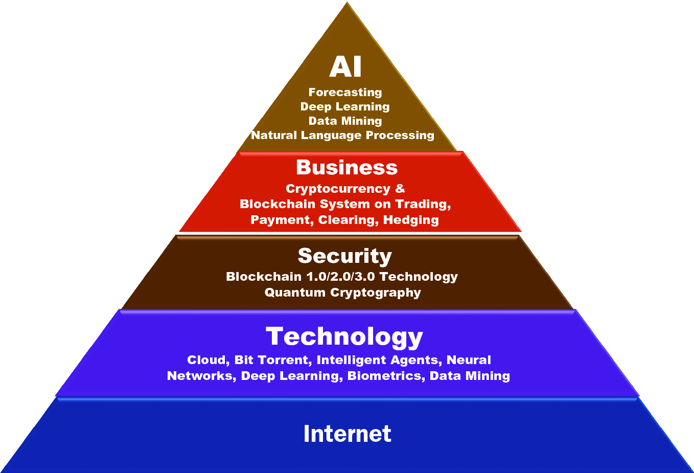
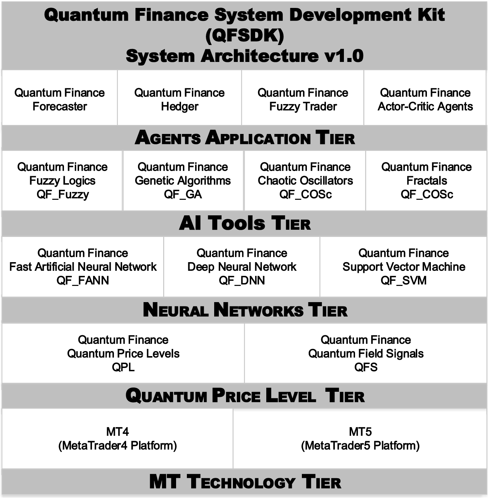

# 14\. Future Trends in Quantum Finance

 _The most important application of quantum computing in the future is likely to be a computer simulation of quantum systems, because that’s an application where we know for sure that quantum systems in general cannot be efficiently simulated on a classical computer._

David Deutsch (Born in 1953)

Professor David Deutsch in his famous quotation pointed out an important role and function of a quantum computer—the simulation of quantum systems and related applications, which cannot be efficiently simulated by classical computers. 

Is it really true?

The answer is yes and no. “ _Yes_ ” in the sense that the major objective of the quantum computer is to model quantum dynamics and simulate quantum applications with quantum computing technology—so-called _hard quantum computing_. “ _No_ ” in the sense that without the usage of quantum computers, technically we can still model quantum dynamics and quantum applications such as quantum finance model we have studied in this book—so-called _soft quantum computing_.

In this final chapter, we will explore the future of quantum finance and the new era of quantum computing. Similar to the history of artificial intelligence (AI) that has both hard AI and soft AI. Each of them focuses on different aspects and applications, but after over half a century; the boundary between them becomes obscure. In this chapter, we will study two disciplines of quantum computing and how they interact to shape the new age of intelligent computing.

As mentioned in previous chapters, quantum finance is a cross-discipline subject to challenge the utmost question of finance engineering—the exploration of the nature and dynamics of financial market activities in the quantum realm.

Quantum finance is one of the major research areas of quantum finance forecast center ([QFFC.​org](<http://QFFC.org>)). In this chapter, we will explore and introduce other aspects and active research of QFFC in terms of (1) AI-fintech—the integration of AI technology with state-of-the-art finance technology such as blockchains and digital ledgers; (2) quantum computing—the R&D of potential applications of quantum computing technology in various areas such as quantum entanglements in quantum finance, quantum cryptography, quantum holographic systems, etc.

## 14.1 Introduction—The Dawn of Quantum Computing 

Since the birth of AI and computing technology from over half a century ago, we are now coming to the historical moment of a new era on computing technology—quantum computing. With the official launch of IBM’s System Q—the first commercially available quantum computer at CES 2019 Las Vegas USA in January 2019 signify the dawn of quantum computing technology (Moran 2019; Silva 2018).

Different from traditional computers which use bits of 0s and 1s as the fundamental binary representation in data storage and program calculation, quantum computers use _qubits_ (stands for _quantum bits_)—quantum superpositions of the two states which allow for far greater flexibility than the traditional binary system in data representation and programming (Hirvensalo 2010; Scherer 2019; Zygelman 2018).

In general, a quantum computer technically would be able to perform calculations on a far greater order of magnitude than traditional computers. As mentioned by Professor David Deutsch in his famous quotation stated at the beginning of this chapter, quantum computing is the best solution tailored for the modeling of quantum systems with related highly complex and sophisticate quantum phenomena such as quantum cryptography and quantum finance in our case (Assche 2006; Bernhardt 2019; Jaeger 2018).

## 14.2 Two Sides of the Same Coin—Hard Quantum Computing Versus Soft Quantum Computing 

The origin of quantum computing can be traced back to 1959 a speech by Professor Richard Feynman in which he spoke about the effects of miniaturization, including the idea of exploiting quantum effects to create more powerful computers. However, before the quantum effects of computing could be realized, quantum computing is still a concept and idea in the scientific community. It was not until 1985, Professor David Deutsch proposed a new idea of _quantum logic gates_ in his paper _Quantum theory as a universal physical theory_ as a means of harnessing the quantum realm inside a computer. In fact, his paper on the subject showed that any physical process could be modeled by a physical quantum computer—so-called hard quantum computing (Deutsch 1985; Steane 1998).

The road of hard quantum computing was not an easy path. Owing to technical complexity and difficulty, after almost decades, Professor Peter Shor devised an algorithm in 1994 that could use only 6 qubits to perform basic factorization operations. Since then, a handful of quantum computers were built. The first, a 2-qubit quantum computer in 1998, could perform trivial calculations before losing decoherence after a few nanoseconds. In 2000, quantum computing teams including IBM and AT&T successfully built both a 4-qubit and a 7-qubit quantum computers.

IBM has showcased its IBM Q System One at CES 2019, which was claimed as the world’s first integrated quantum computing system designed for scientific and commercial use. The 20-qubit system by IBM, which was seen as one of the leaders in the field of quantum computing (Silva 2018; Moran 2019).

Just like hard AI versus soft AI in artificial intelligence (AI) realm, soft quantum computing refers to the modeling of quantum theory and its mathematical models by means of computing systems and programs, similar to the analog of soft AI with the focus of building computer models using artificial neural networks (ANN) to model human intelligence and learning process.

In other words, all quantum theory concepts and models we have studied in this book, ranging from Feynman’s path integral for the modeling of forward interest rate to quantum anharmonic oscillator model for the modeling of quantum price levels; along with quantum financial signals are components and frameworks of soft quantum computing.

If we can model quantum theory and related phenomena by means of traditional computers, why do we need to build quantum computers?

The answer is simple. If we can model quantum theory effectively using traditional computers with binary formulation and representations, integrating these quantum models with quantum computers will become more direct and effective while the fundamental construction of quantum computer itself totally conforms to quantum model and architecture. In other words, by implementing a quantum model, say quantum finance model into a traditional computer; technically speaking, we are converting a traditional financial computation system into a quantum financial computation machine!

## 14.3 From Quantum Finance to AI Fintech 

As mentioned earlier in this chapter, quantum finance is one of the major R&D projects of quantum finance forecast center ([QFFC.​org](<http://QFFC.org>))—a worldwide financial prediction and R&D center for the design and implementation of next generation of AI-fintech standards, toolkits and applications (Nicoletti 2017).

Figure 14.1 depicts the AI-fintech 5-layer architecture of QFFC.  **Fig. 14.1. AI-Fintech 5-layer architecture** 

1. AI-applications Layer

     * This layer focuses on AI-fintech-related systems and applications in four major areas: forecasts such as quantum finance forecast, deep learning/reinforcement learning such as multiagent-based trading agents; data mining and NLP (natural language processing) such as robo-advisor (Lim et al. 2011; Sironi 2016).

2. Business Layer

     * This layer focuses on the business applications and fintech systems including cryptocurrency, blockchain systems on financial trading, payment, clearing and hedging transactions (Antonopoulos 2017; Gaur 2018; Sironi 2016; Nielsen 2011, Swan 2015).

3. Security Layer

     * This layer focuses on the implementation of fintech security systems and technology include Blockchain 1.0/2.0/3.0 systems and quantum cryptosystems on crypto-payment and transactions (Assis 2012; Balygin 2017; Elliott 2004; Fehr 2010).

4. Technology

     * This layer focuses on all the fundamental and building blocks technology and standards for the implementation of AI-fintech applications.

5. Internet Layer

     * This layer provides the basic framework and backbone for AI-fintech intelligent agent communication technology, protocols, and technology.

## 14.4 Quantum Finance System Development Platform 

Besides the provision of various AI-fintech forecasts and applications, QFFC also actively developing a next-generation AI-fintech development kit—quantum finance development kit (QFDK), an easy to use C/C++ library with the implementation of all state-of-the-art AI-fintech functions and libraries; so that AI-fintech developers and data scientists can base on these functional libraries to design and develop their own quantum finance and AI-fintech systems and applications.

Figure 14.2 depicts the QFSDK 5-layers model of version 1.0, which will be launched officially in late 2019 at [QFFC.​org](<http://QFFC.org>) official site.  **Fig. 14.2. QFSDK 5-layer model** 

## 14.5 Conclusion 

In this final chapter, we studied the future trend in quantum finance—a cross-discipline subject that comprises quantum theory as a theoretical foundation; numerical computational theory as computer model; artificial intelligence as machine learning; prediction and trading optimization models; and finally quantum computing as the ultimate intelligence machine. In other words, the future R&D and growth of quantum finance technology not only depends on the development of quantum finance theory itself but also depends on future development and growth of related technologies such as AI and quantum computing technologies.

As mentioned in the introductory chapter, since Professor Heisenberg introduced the ground-breaking quantum mechanics’ idea to nowadays, we have concrete mathematical and computational models to model quantum dynamics and QPL of financial markets, along with the interpretation of path integrals of the forward interest rate. It is both a challenging and exciting path. The contribution is not only the credit of an individual but also is the collective contribution of intelligence, innovation, and R&D from many centuries.

In view of the advancements of technology and AI in the past decades, quantum finance, together with AI and quantum computing technology should work together to provide more scientific and intelligent applications, systems and services for worldwide investors and financial professionals.

### Problems

1. 14.1

What is a quantum computer? State and explain the major difference between a quantum computer and the traditional computer systems.

2. 14.2

State and explain the major challenges in quantum computing. Give two examples of illustrations.

3. 14.3

State and contrasts the major differences between hard quantum computing and soft quantum computing. Give two examples in each case for illustration.

4. 14.4

Discuss whether quantum computer in the future will or will not replace traditional computers. Why?

5. 14.5

What is finance technology (fintech)? State three typical fintech-related technologies and briefly explain how they work.

6. 14.6

What is a robo-advisor in fintech? State and explain the basic underlying technology. Give two examples of robo-advisor in fintech and explain briefly how they work.

7. 14.7

What is blockchain technology? State and explain the difference between Blockchain 1.0, 2.0, and 3.0 technologies. Give one example in each case for illustration.

8. 14.8

What is quantum cryptography? State and explain the major difference between traditional cryptosystem and quantum cryptosystem. What are the major challenges in quantum cryptography?
