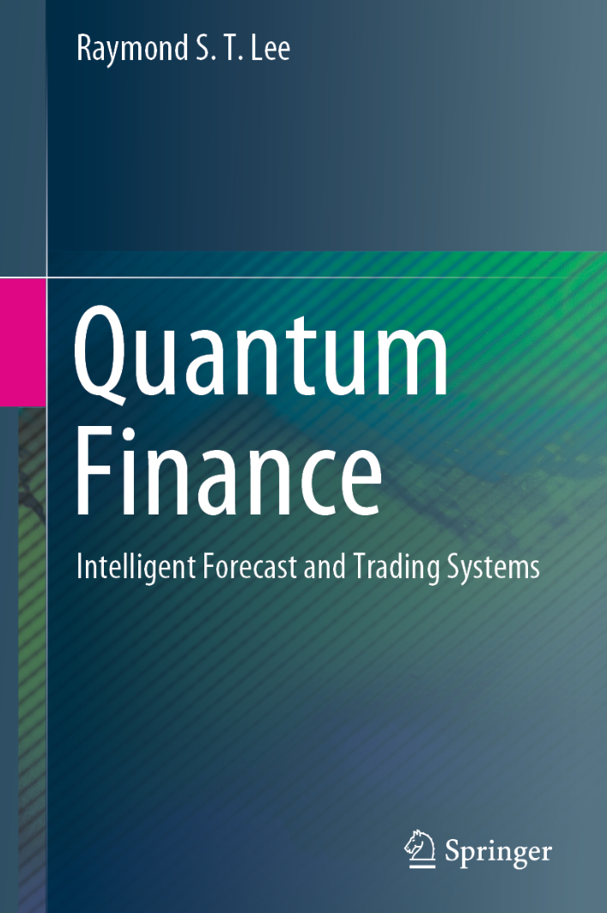

# Quantum Finance: Intelligent Forecast and Trading Systems

**Raymond S. T. Lee** (2020)

```bibtex
@book{Lee2020quantum,
  author    = {Lee, Raymond S. T.},
  title     = {Quantum Finance: Intelligent Forecast and Trading Systems},
  publisher = {Springer Singapore},
  year      = {2020},
  doi       = {10.1007/978-981-32-9796-8},
  url       = {https://doi.org/10.1007/978-981-32-9796-8},
}
```

## Chapters

1. [Introduction to Quantum Finance](ch-01.md)
2. [Quantum Field Theory for Quantum Finance](ch-02.md)
3. [An Overview of Quantum Finance Models](ch-03.md)
4. [Quantum Finance Theory](ch-04.md)
5. [Quantum Price Levels—Basic Theory and Numerical Computation Technique](ch-05.md)
6. [Quantum Trading and Hedging Strategy](ch-06.md)
7. [AI Powerful Tools in Quantum Finance](ch-07.md)
8. [Chaos and Fractals in Quantum Finance](ch-08.md)
9. [Chaotic Neural Networks in Quantum Finance](ch-09.md)
10. [Quantum Price Levels for Worldwide Financial Products](ch-10.md)
11. [Time Series Chaotic Neural Oscillatory Networks for Financial Prediction](ch-11.md)
12. [Chaotic Type-2 Transient-Fuzzy Deep Neuro-Oscillatory Network (CT2TFDNN) for Worldwide Financial Prediction](ch-12.md)
13. [Quantum Trader—A Multiagent-Based Quantum Financial Forecast and Trading System](ch-13.md)
14. [Future Trends in Quantum Finance](ch-14.md)

## Appendices

- [Appendix A: List of 139 Financial Products](ap-01.md)
- [Appendix B: List of 39 Financial Indicators](ap-02.md)
