```bibtex
@article{lee2021quantum,
  author    = {Lee, Raymond S. T.},
  title     = {Quantum Finance Forecast System with Quantum Anharmonic Oscillator Model for Quantum Price Level Modeling},
  journal   = {International Advance Journal of Engineering Research (IAJER)},
  volume    = {4},
  number    = {02},
  pages     = {1--21},
  year      = {2021},
  month     = feb,
  issn      = {2360-819X},
  url       = {https://www.iajer.com}
}
```

[Issue 4 Volume 2](https://www.iajer.com/volume-4-issue-2/)
[PDF](https://www.iajer.com/wp-content/uploads/2021/02/A420121.pdf)

# Quantum Finance Forecast System with Quantum Anharmonic Oscillator Model for Quantum Price Level Modeling

**Raymond S. T. Lee**

Division of Science & Technology, Beijing Normal University - Hong Kong Baptist University United International College, Zhuhai, Guangdong, China

**Published in:** International Advance Journal of Engineering Research (IAJER), Volume 4, Issue 02 (February 2021), PP 01-21. ISSN: 2360-819X

## Abstract

With the exponential growth of program trading in the worldwide financial industry, quantum finance and its underlying technologies including quantum field theory and quantum anharmonic oscillatory theory become one of the hottest topics in the fintech community. With the flourishing of AI technology in the past 20 years, various hybrid intelligent financial prediction systems with the integration of neural networks, chaos theory, fuzzy logic and genetic algorithms have been proposed. In this paper, the author proposed an innovative Quantum Finance Schrödinger Equation (QFSE) for the modeling of the quantum dynamics of worldwide financial markets using Quantum Anharmonic Oscillatory Model (QAOH). Based on the numerical computational technique using Finite Different Method (FDM), together with the evaluation of the price returns distribution of over 2000 trading-day timeseries of each financial product, the author devised an innovative method for the quantization of quantum price return of financial market – the Quantum Price Levels (QPL) as a new financial indicator for the modeling of the discrete quantum energy levels of financial markets. From the implementation perspective, Quantum Finance Forecast System (QFFS) with the integration of QPL and Chaotic Neural Oscillatory Network (QPL-CNON) is implemented for the daily financial forecasts of 129 worldwide financial products include: major cryptocurrencies, worldwide forex, international financial indices and major commodities. From the system performance perspective, QPL-CNON is compared with FOUR forecast systems, include: traditional Feedforward Backpropagation Network (FFBPN), Support Vector Machine (SVM), DNN-PCA model and Chaotic Neural Oscillatory Network without QPL (CNON).

**Keywords:** Quantum Finance; Quantum Anharmonic Oscillatory Model; Quantum Price Levels; Chaotic Neural Oscillatory Networks; Financial Prediction; Quantum Finance Forecast System.

## I. Introduction

Quantum finance is a newly developed interdisciplinary subject introduced in 1990's by applying quantum mechanics and quantum field theory to theoretical economics – so-called econophysics. Nevertheless, econophysics-style of R&D was established much earlier. In 1900, Professor Louis Jean-Baptiste Alphonse Bachelier (1870-1946), a French mathematician in his PhD thesis *Théorie de la speculation* [1] published by Annales Scientifiques de l'École Normale Supérieure which set the foundation of a mathematical model with Brownian motion in valuing stock options. It was historically the first paper to use advanced mathematics in the study of finance. He is also considered as the forefather of mathematical finance and also a pioneer in the study of stochastic processes. Owing to the above reasons, most mainstream econophysicists consider finance as an application of Brownian motion – the fundamental phenomenon of statistical physics for the modeling of financial market.

The first published work on Econophysics - *An Introduction to Econophysics - Correlations and Complexity in Finance* was written by Professors R. N. Mantegna and H. E. Stanley in 1999 [2]. This pioneering text explored the use of statistical physics concepts such as stochastic dynamics, short-and long-range correlations, self-similarity and scaling concepts financial systems description. These were the dynamic new specialty of econophysics. For the last two decades, various methods and theories were proposed for stock price/returns analysis, interest rate modeling, option pricing, and portfolio analysis.

Although statistical physics is the mainstream theory of Econophysics, active R&D with the adoption of quantum mechanics, quantum field theory (so-called Quantum Finance) with related concepts and frameworks such as Feynman's path integral model and quantum oscillator model to model financial markets. Latest R&D on Quantum Finance includes:

1. B. Baaquie's in his book *Quantum Finance* published in 2004 [3] reviewed the application of Feynman's path integral theory for option pricing and interest rate modeling. Professor Baaqui, is also the first scholar who consolidated a complete concept and theory of quantum finance using quantum field theory;
2. Other research works on path integral including the sensitivity analysis using path independent quantum finance model by Kim et. al. in 2011 [4];
3. Quantum anharmonic oscillator modeling on finance analysis included Gao & Chen [5] works on quantum anharmonic oscillator model for the stock market; Ye and Huang [6] works on non-classical oscillator model for persistent fluctuations in stock markets; Meng et. al. [7] works on quantum spatial-periodic harmonic model for daily price-limited stock markets;
4. Quantum wave function for stock market analysis by Ataullah et. al. [8];
5. Quantum statistical approach to simplified stock markets by Bagarello [9];
6. A finite-dimensional quantum model for the stock market by Cotfas [10];
7. Nakayama [11] works on gravity dual for Reggeon field theory and nonlinear quantum finance;
8. Piotrowski and Sładkowski [12] studied the quantum diffusion model of prices and profits;
9. Probability wave approach on security transaction volume-price behavior analysis by Shi [13];
10. Bohmian quantum potential approach on stock market credibility analysis by Nasiri et. al. [14];
11. Schaden [15] applied quantum theory to model secondary financial markets;
12. Zhang and Huang [16] defined wave functions and operators of the stock market to establish the Schrödinger equation for stock price.

Although these methods and models have certain success in modeling the quantum dynamics of the financial markets, due to the mathematically complexity and computationally intensive properties of these models together with the complexity of the financial markets, they are difficult to be applied in real world situation, let's alone with the adoption for the implementation of real time financial prediction systems.

As an extension to the previous works on Quantum Anharmonic Oscillatory Model (QAOH), in this paper, the author proposed an innovative Quantum Finance Schrödinger Equation (QFSE) [17] for the modeling of financial markets based on the modelling of the quantum dynamics of key-players in a typical secondary financial market with QAOH. More importantly, based on the numerical computational technique using Finite Different Method (FDM) and the study of the price return (r) distribution of financial time series, the author devised an innovative method for the evaluation of discrete quantum financial price energy levels known as Quantum Price Levels (QPLs). From the implementation perspective, Quantum Finance Forecast System (QFFS) with the integration of QPL and Chaotic Neural Oscillatory Network (QPL-CNON) is implemented for the daily forecast of High/Low price of worldwide 129 financial products, which include: 9 major cryptocurrencies, 84 forex, 19 major commodities and 17 worldwide financial indices. In terms of performance analysis, QPL-CNON is compared with FOUR forecast models: traditional Feedforward Backpropagation Model (FFBPN); Support Vector Machine (SVM); DNN-PCA model [18] and Chaotic Neural Oscillatory Network (CNON) without QPL.

This paper is organized as follow. Section 2 presents the Quantum Finance Model (QFM), it also discusses the quantum dynamics of typical secondary financial markets and the derivation of the Quantum Finance Schrödinger Equation (QFSE). Section 3 presents the solving of QFSE using $\lambda x^{2m}$ QAOH model, together with FDM method to calculate all quantum finance energy levels (QFEL) and hence the Quantum Price Levels (QPLs). This section also discussed the evaluation of QPL for the 129 worldwide financial products. Section 4 presents the QPL-CNON Model for the timeseries financial prediction. Section 5 presents the system implementation for the Quantum Finance Forecast System and performance analysis, which is followed by the conclusion in Section 6.

## II. Quantum Finance Model [17]

### 2.1 Quantum Finance – The Concept

In quantum finance, we model the dynamics of financial instruments (such as currencies, financial indices, cryptocurrencies) of worldwide financial markets as quantum financial particles (QFP) with wave-particle duality characteristics. The motions and dynamics significance of these quantum financial particles are subject to their intrinsic quantum energy fields so-called quantum price fields (QPF) and appear to us as Quantum Price Levels (QPLs) in financial markets. They are similar to quantum particles that are affected by the superposition of their own energy levels and the energy field generated by other neighboring quantum particle(s).

From technical finance perspective, these quantum price levels correspond to the Support & Resistance (S & R) levels as we know of. In other words, one of the major objectives of Quantum Finance Theory is to establish an effective and logical Quantum Finance model; help us to locate all these QPLs of worldwide financial markets using Quantum Mechanics and Quantum Field Theories. Such Quantum Finance model must be logically sound and should be a coherent body of classical finance concepts and models.

### 2.2 Quantum Finance – Schrödinger Equation

Let $r$ be the price return of a particular Quantum Financial Particle (QFP) at time $t$ (say USD/CAD or US Index). We can rewrite the traditional Schrödinger equation as:

$$i\hbar \frac{\partial}{\partial t} \psi(r, t) = H \psi(r, t) \tag{1}$$

and the corresponding Hamiltonian operator $H$ is given by:

$$H = \frac{-\hbar}{2m} \frac{\partial^2}{\partial r^2} + V(r, t) \tag{2}$$

Where $H$ comprises of the K.E. (kinetic energy, the first term) and P.E. (potential energy, the second term); $\hbar$ is the Planck constant representing the uncertainty of the financial behavior; $m$ is the mass represents the intrinsic potential of the financial market, such as the market capital of a particular financial product in the financial market.

### 2.3 Key Players in Secondary Financial Markets

Once we have the financial model, next step is to explore - the dynamics which means all the motions and activities occur inside the model. In other words, what are the major participants in a financial market? What are their behaviors? For example, in forex market – the biggest OTC (over the counter) market in the worldwide finance, what are the key participants? Fig. 1 shows a framework in a typical secondary financial market (SFM) such as worldwide Forex markets [19].

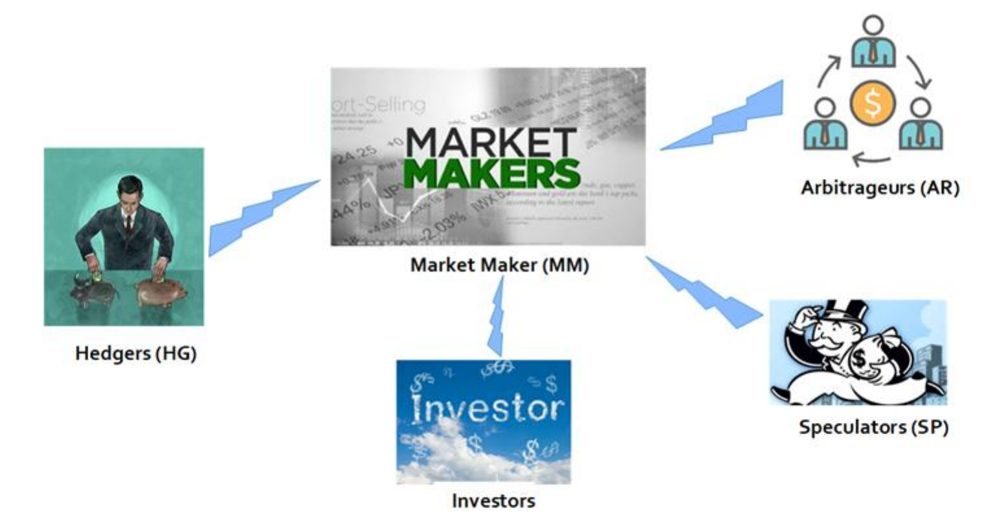

**Fig. 1** Key participants in a typical secondary financial market

These key-participants include:

1. **Market Maker (MM)**, also known as liquidity provider are companies or an individual that quotes both a buy and a sell price in a financial instrument or commodity held in inventory, hoping to make a profit on the bid-offer spread, or turn [19]. In terms of investment dynamics, the main function is to maintain healthy market liquidity or facilitate the efficient absorption of buy/sell orders.
2. **Arbitrageurs (AR)** are traders that take advantage of a price difference between two or more markets. However, in an efficient market nowadays with open information and high-speed trading, there are basically no rooms for arbitragers trading [20].
3. **Speculators (SP)** take risk on purpose by betting on future movements of the security's price [21]. In terms of investment behavior, speculators differ from common investors in the sense that they don't have any risk control mindset. In other words, there is no damping factor against market volatility in their investment strategies.
4. **Hedgers (HG)** trade so to reduce or eliminate the risk in taking a position on a security. The main goal is to protect the portfolio from losing value at the expense of lowering the possible benefits. Speculators and hedgers are different terms that describe traders and investors. Speculation involves trying to make a profit from a security's price change, whereas hedging attempts to reduce the amount of risk, or volatility, associated with a security's price change [22].
5. **Investors (IV)** are ordinary people that allocates capital with the expectation of a future financial return. In terms of investment dynamics, investors normally act as trend followers together with certain degree of sense-of risk control. In other words, they have certain degree of damping factor against market volatility in their investment strategies.

### 2.4 Financial Dynamics and Excess Demand

In classical finance and microeconomics, excess demand is a function expressing excess demand for a product - the excess of quantity demanded over quantity supplied - in terms of the product's price and possibly other determinants. In the mathematical perspective, it is the product's demand function minus its supply function. In a pure exchange economy, the excess demand is the sum of all agents' demands minus the sum of all agents' initial endowments [23].

At any time $t$, $z^+(t)$ and $z^-(t)$ denote the instantaneous demand and supply for the financial asset. The excess demand ($z$) at any instance is given by:

$$\Delta z = z^+ - z^- \tag{3}$$

Let $r(t)$ is the instantaneous returns, which is given by:

$$\frac{dp}{dt} = r(t) = F(\Delta z) \tag{4}$$

For small $\Delta z$, $F$ can be approximated by a scaling factor $\gamma$ and become:

$$r(t) = \frac{\Delta z}{\gamma} \tag{5}$$

where $\gamma$ can used to represent the market depth, the excess demand $z$ required to move the quantum price $p$ by one single quanta. Note that, when $\gamma$ is high, which means the market have a higher absorbability to excess demand $z$ against price changes.

So, we have:

$$\frac{dr}{dt} = \frac{d^2 p}{dt^2} = \frac{1}{\gamma} \frac{d(\Delta z)}{dt} \tag{6}$$

### 2.5 Quantum Dynamics of Key Participants in Financial Markets

According to investment behaviors of all these 5 key participants in financial markets, their corresponding quantum dynamics can be interpreted as follows:

#### 2.5.1 Market Makers (MM)

The quantum dynamics for market makers is given by [5]:

$$\frac{dz^+}{dt}\bigg|_{MM} = -\alpha^+ z^+ \quad \text{and} \quad \frac{dz^-}{dt}\bigg|_{MM} = -\alpha^- z^- \tag{7}$$

Note: Market makers (MM) provide market facilitator services to absorb ALL outstanding excess order $z^+$ and $z^-$; $\alpha^+$ and $\alpha^-$ are the market absorbability factors; In terms of quantum dynamics, basically it is a quantum harmonic oscillator (QHO) with $\dot{z}^\pm \propto z^\pm$.

Combining with equation (3), we have:

$$\frac{d\Delta z}{dt}\bigg|_{MM} = \frac{d(z^+ - z^-)}{dt}\bigg|_{MM} = \frac{dz^+}{dt}\bigg|_{MM} - \frac{dz^-}{dt}\bigg|_{MM} = -\alpha^+ z^+ + \alpha^- z^- \tag{8}$$

For an efficient market we can assume:

$$\alpha^+ = \alpha^- = \alpha_{MM} \tag{9}$$

So, we have:

$$\frac{d\Delta z}{dt}\bigg|_{MM} = -\alpha_{MM} \Delta z \tag{10}$$

Using equation (5) we have:

$$\frac{d\Delta z}{dt}\bigg|_{MM} = -\gamma \alpha_{MM} r \tag{11}$$

#### 2.5.2 Arbitrageurs (AR)

As mentioned, in an efficient market nowadays with open information and high-speed trading, there are basically no rooms for arbitrageurs' trading. So, assume principle-of-no-arbitrage is in every quantum time-step, there is no quantum dynamics for arbitrageurs.

#### 2.5.3 Speculators (SP)

Contradictory, speculators always emerge in every financial market. Their quantum dynamics are given by:

$$\frac{d\Delta z}{dt}\bigg|_{SP} = -\delta_{SP} r \tag{12}$$

Since speculators have no idea of risk control, their quantum dynamics only contain the harmonic oscillator term (the delta term, $\delta_{SP} r$); without any higher order volatility term. Note that, although speculators might happen to be trend follower ($+\delta_{SP}$), but most of the time their risk-taking nature will drive them to irrational speculation of market reversals and act against the market ($-\delta_{SP}$).

#### 2.5.4 Hedgers (HG)

As mentioned, hedgers (HG) represent experienced and skillful traders (also known as sophisticated traders) that apply sophisticated hedging strategies across different products and markets. Although they do not always act against the trend, but their skills usually demonstrated by reverse-trading, or prediction of market reversal and act before common investors. So, their quantum dynamics are given by:

$$\frac{d\Delta z}{dt}\bigg|_{HG} = -(\delta_{HG} - \upsilon_{HG} r^2) r \tag{13}$$

Note that, the quantum dynamics for a hedger has two terms: 1) the quantum harmonic oscillatory term (delta term) – proportion to return ($r$) and 2) the quantum anharmonic term ($\upsilon$) stands for the market volatility, risk control factor proportional to $r^2$.

#### 2.5.5 Investors (IV)

As mentioned, investors represent common investors and rational investors with certain degree of risk control. Their usual strategies are: 1) follow the trend to gain profit; 2) minimize the risk. So, their quantum dynamics are given by:

$$\frac{d\Delta z}{dt}\bigg|_{IV} = (\delta_{IV} - \upsilon_{IV} r^2) r \tag{14}$$

Note that, similar to hedgers, the quantum dynamics of an investor has two terms, 1) the quantum harmonic oscillatory term (delta term) – proportion to return ($r$) and 2) the quantum anharmonic term ($\upsilon$) stands for the market volatility, risk control factor proportional to $r^2$. But different from hedgers, common investors are usually trend followers (TF), so they are basically acting towards the returns ($r$).

#### 2.5.6 Overall Quantum Finance Dynamics - Quantum Finance Schrödinger Equation (QFSE)

$$\frac{d\Delta z}{dt} = \frac{d\Delta z}{dt}\bigg|_{MM} + \frac{d\Delta z}{dt}\bigg|_{SP} + \frac{d\Delta z}{dt}\bigg|_{HG} + \frac{d\Delta z}{dt}\bigg|_{IV}$$

$$= -\gamma\alpha_{MM} r - \delta_{SP} r - (\delta_{HG} - \upsilon_{HG} r^2)r + (\delta_{IV} - \upsilon_{IV} r^2)r$$

That is:

$$\frac{d\Delta z}{dt} = -\delta r + \upsilon r^3 \tag{15}$$

Combining equation (6), we have:

$$\frac{dr}{dt} = \gamma \frac{d\Delta z}{dt} = -\gamma\delta r + \gamma\upsilon r^3 \tag{16}$$

where:

$$\delta = \gamma\alpha_{MM} + \delta_{SP} + \delta_{HG} - \delta_{IV} \quad \text{(damping term)} \tag{17}$$

$$\upsilon = \upsilon_{HG} - \upsilon_{IV} \quad \text{(volatility term)} \tag{18}$$

The Brownian price return can be described by Langevin equation:

$$m_r \frac{d^2 r}{dt^2} = -\eta \frac{dr}{dt} - \frac{dV(r)}{dr} \tag{19}$$

Where $m_r$ = mass of the financial particle $p$; $\eta$ = damping force factor; and $V(r)$ = time independent quantum potential.

For the consistency of equations (18) and (19), i.e. overdamping case where the $\frac{d^2r}{dt^2} = 0$, we have:

$$-\frac{dV(r)}{dr} = \eta \frac{dr}{dt} = -\gamma\eta\delta r + \gamma\eta\upsilon r^3 \tag{20}$$

$$V(r) = \int (-\gamma\eta\delta r + \gamma\eta\upsilon r^3) \, dr = \frac{\gamma\eta\delta}{2} r^2 - \frac{\gamma\eta\upsilon}{4} r^4 \tag{21}$$

So, the time independent Schrödinger equation (1)–(2) of a quantum finance particle can be written as [17]:

**Quantum Finance Schrödinger Equation, QFSE:**

$$\left[\frac{-\hbar}{2m} \frac{d^2}{dr^2} + \frac{\gamma\eta\delta}{2} r^2 - \frac{\gamma\eta\upsilon}{4} r^4\right] \varphi(r) = E\varphi(r) \tag{22}$$

Noted that QFSE contains both KE and PE term. Different from classical quantum harmonic oscillator, the quantum finance oscillator is an anharmonic quantum oscillator which consists of two high-order PE terms that represent 1) damping (trading restoration and market absorption) potential and 2) volatility (risk control) potential. Although the market is visualized (observed) as the price, but the quantum dynamics are controlled by the price return ($r = dp/dt$), which is consistent with classical financial theory.

## III. Quantum Price Levels (QPL) and Quantum Anharmonic Oscillator (QAOH) Model

### 3.1 Quantum Price Level – The Concept

Quantum Finance Energy Levels (QFEL) can be considered as invisible energy levels that exist in every financial market; and Quantum Price Levels (QPL) can be interpreted as the realization of these financial energy levels shown in every secondary financial market. They are similar to quantum energy levels in an atom, these quantum price levels exist intrinsic in nature. In other words, they co-exist with the continuance of the financial particles in every financial market.

From the finance perspective such as forex market, which means when market opens, the quantum financial particles of various currency pairs (e.g. CADUSD, AUDEUR, JPYUSD) will automatically exist and generate their quantum energy field instantaneously, visualized as the quantum price levels (QPL) shown in every financial market and start their quantum finance anharmonic oscillations and motions. More importantly, these QPLs exist in discrete states with level 0 as ground-states ($E_0$) (during market open) and all the excited states $E_n$ in discrete energy levels.

### 3.2 Physical Meaning of Wave-Function in Quantum Finance

In quantum mechanics and quantum field theory, wave-function ($\psi$) is the most important component in the mathematical model, as it is the realization of the wave-particle duality of quantum particles in this unique subatomic world of reality. In classical quantum mechanics, the quantum wavefunction of a quantum particle can be evaluated by measuring pdf (probability distributed function, $\rho$) of the observations instead, which is given by:

$$\rho(x, t) = |\psi(x, t)|^2 = |\varphi(x)|^2 \tag{23}$$

In Quantum Finance, wave-function can be observed and evaluated by using similar method. For example, for a timeseries of 2048-trading day of Gold vs US Dollar (XAUUSD), we measure the daily closing price returns ($r$) of these 2048 time-step and plot the pdf of $r$ vs. pdf of occurrence $\in [0,1]$ to analog the Quantum Finance wavefunction $\psi$ of XAUUSD. That is:

$$\rho(r, t) = |\psi(r, t)|^2 = |\varphi(r)|^2 \tag{24}$$

Fig. 2 shows the quantum price return wavefunction $\varphi(r)$ of XAUUSD for the past 2048 trading-day timeseries. It is calculated by evaluating the distribution function of the daily price returns ($r$) and plot against the total number of occurrences, given by:

$$r = \frac{\text{no. of occurrences of event } r}{\text{total no. of events } E} \tag{25}$$

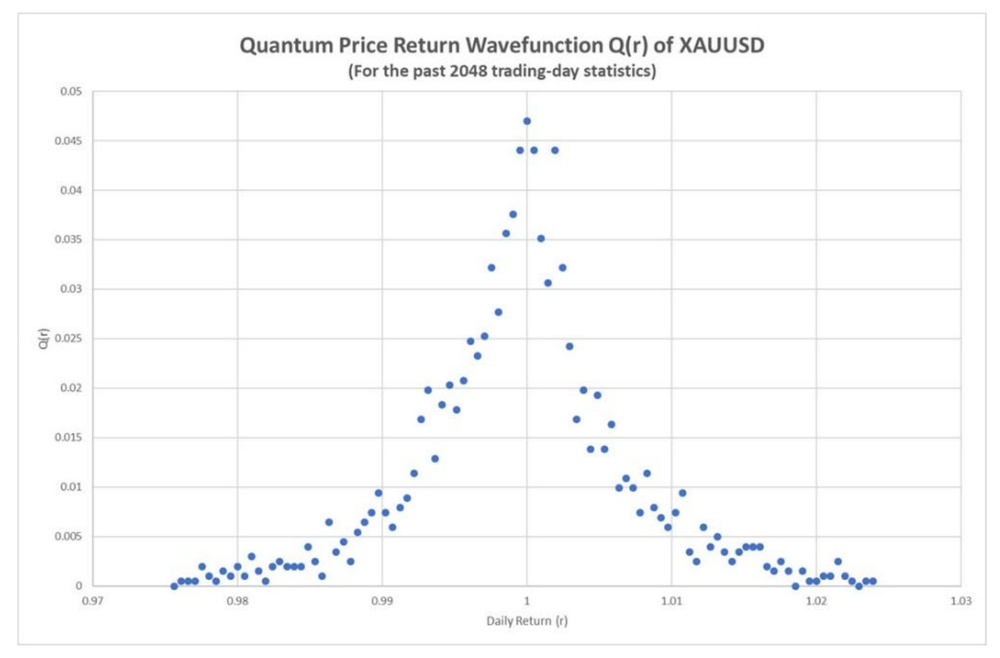

**Fig. 2** Quantum price return wavefunction $\varphi(r)$ of XAUUSD for the past 2048 trading-day

where $E$ is the total no. of events, 2046 events in our case (with the exclusion of the boundary cases).

### 3.3 Solving Quantum Finance Schrödinger Equation using Quantum Anharmonic Oscillator (QAOH) Model

Once we have the method to evaluate $\varphi(r)$, the center question is to find all corresponding quantum price levels (QPLs). That is, all the eigenenergy values in QFSE. Numerous physicists and mathematicians in the past 50 years had devised many methods and techniques to solve this important equation, such as: Hill determinant, Bargmann representation, coupled cluster method, variation–perturbation expansion [24-30]. However, most of them are either technically or mathematically complex in numerical computations. In 2007, Dasgupta et. al. in their paper *Simple systematics in the energy eigenvalues of quantum anharmonic oscillators* [31] provided an innovative numerical method to solve a class of Schrödinger equations known as "$\lambda x^{2m}$ quantum anharmonic oscillators".

A typical $\lambda x^{2m}$ quantum anharmonic oscillator (aka $\lambda x^{2m}$ QAHO) is given by [31]:

$$H^{(m)}_\lambda \psi = \left[-\frac{d^2\psi}{dx^2} + x^2 + \lambda x^{2m}\right] \psi = E\psi \tag{26}$$

in which the excited energy levels can be closely approximated by the following polynomials:

$$\frac{E^{(m,n)}}{(2n+1)^{\frac{(m+1)}{(m+1)}}} - \frac{E^{(m,n)}}{(2n+1)^{\frac{(m-1)}{(m+1)}}} = (K_0^{(m,n)})^{(m+1)} \lambda \tag{27}$$

where $E^{(m,n)}$ is the $n$-th excited state energy of the $\lambda x^{2m}$ QAHO and $K_0^{(m,n)}$ are constants.

If we look closely of the QFSE, it is in fact a typical quartic anharmonic oscillator with a quartic term in the P.E. dynamics.

So, we can convert QFSE (Eqt. 22) into a $\lambda x^{2m}$ QAHO:

$$\frac{d^2\varphi_r}{dr^2} + r^2 + \lambda r^{2m} \varphi_r = E\varphi_r \tag{28}$$

Put $m = 2$, we have:

$$\frac{d^2\varphi_r}{dr^2} + r^2 + \lambda r^4 \varphi_r = E\varphi_r \tag{29}$$

Note: We normalize the quadratic term $r^2$ with the quartic term $r^4$ and combine it to coefficient $\lambda$. Besides, the K.E. is also normalized with coefficient set to 1.

Once we have the QFSE in the form of equation (27), we can make use of the numerical solution of quantum energy levels by setting $m = 2$ and further simplify the equation into:

$$\frac{E(n)^3}{(2n+1)} - \frac{E(n)}{(2n+1)} = (K_0(n))^3 \lambda \tag{30}$$

or:

$$\frac{E(n)^3}{(2n+1)} - \frac{E(n)}{(2n+1)} - K_0(n)^3 \lambda = 0$$

where:

$$K_0(n) = \left(\frac{1.1924 + 33.2383n + 56.2169n^2}{1 + 43.6196n}\right)^{1/3} \tag{31}$$

In summary: once we know the coefficient $\lambda$, all the quantum energy levels (or quantum price levels) can be found. The question is: How can we find $\lambda$?

### 3.4 Finite Difference Method (FDM) to Evaluate Quantum Finance Wavefunction

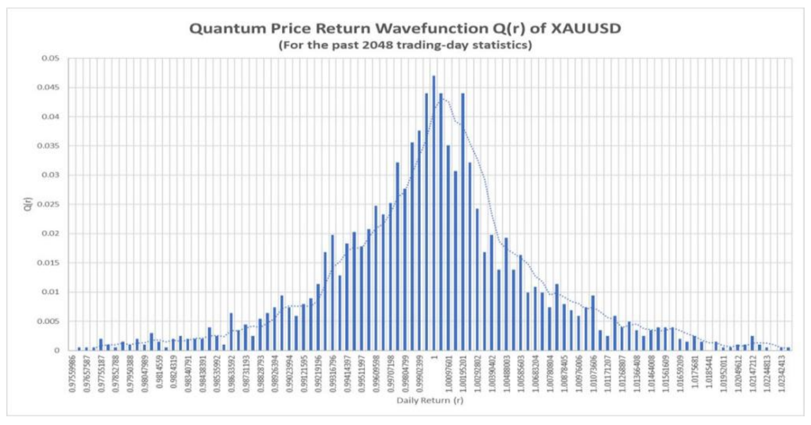

**Fig. 3** Quantum price return wavefunction $Q(r)$ of XAUUSD

Fig. 3 illustrates the quantum price return wavefunction $Q(r)$ ($\varphi_r$ in our QFSE). That is, the wavefunction distribution statistic of XAUUSD by plotting the pdf of the daily returns ($r$) in the past 2048-trading days. But the difference is that, this time we display this pdf function by dividing the x-axis ($r$) into 100 equal divisions, with each width $\Delta x$ given by:

$$\Delta x = \frac{3\sigma}{50} \tag{32}$$

where $\sigma$ is the standard deviation of $r$ for the past 2048-trading days (totally we have 2046 $r$ sample observations by excluding the boundary records). This figure also shows the regression curve of the wavefunction for illustration purpose.

Besides, certain important findings can be concluded from Fig. 3: $\varphi_{Max}$ at $r \cong 1$ (ground state, denotes as $r_0$); $\varphi_r = \varphi(r_0)$ is symmetric with $r \cong 1$ as symmetry-axis, especially when r-segment close to the symmetry-axis; so, we can take the 1st left and right r-segment for calculation, denote as $r_{-1}$ and $r_{+1}$ respectively.

Fig. 4 shows the three major r-segments in the QF wavefunction of $r$, they are: $r_0$, $r_{-1}$ and $r_{+1}$. It also corresponds to the ground state $\varphi(r_0)$ and the 1st +ve and –ve $r$ states, $\varphi(r_{-1})$ and $\varphi(r_{+1})$ respectively.

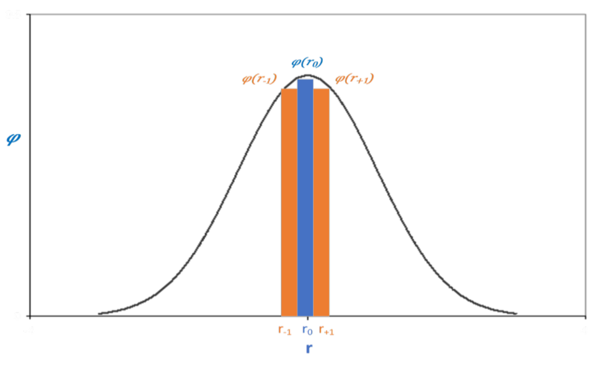

**Fig. 4** Illustration of FDM calculation in quantum finance

### 3.5 Example: Numerical Evaluation of $\lambda_{XAUUSD}$ using FDM

For illustration purpose, we use XAUUSD as an example to demonstrate how to evaluate $\lambda$ using FDM.

For the 2048-trading day of XAUUSD (as of 16 Jun 2019), we have the following statistics information in Table 1.

**Table 1.** Statistic results of the quantum price return wavefunction $Q(r)$ of XAUUSD (as of 16 Jun 2019)

| Parameter | Value | Parameter | Value | Parameter | Value |
|-----------|-------|-----------|-------|-----------|-------|
| Product | XAUUSD | $r_0$ | 0.999604 | $\varphi(r_0)$ | 0.047785 |
| No of $r$ | 2046 | $r_{+1}$ | 1.000396 | $\varphi(r_{+1})$ | 0.038825 |
| $\Delta r$ | 0.000793 | $r_{-1}$ | 0.998811 | $\varphi(r_{-1})$ | 0.039821 |
| $Max\,\varphi$ | 0.047785 | $\mu$ | 0.999821 | $\sigma$ | 0.013213 |
| $Max\,\varphi\,No$ | 50 | | | | |

Note: Timeseries data source from Forex.com MT4 System

As recalled from the QFSE, we have:

$$\frac{d^2\varphi_r}{dr^2} + r^2 + \lambda r^4 \varphi_r = E\varphi_r \tag{33}$$

Since QFSE is symmetric with respect to the central-axis $r_0$, when we consider quantum dynamics for the $r_{+1}$ and $r_{-1}$ segments, their K.E. terms can be cancel-out, so we have:

$$(r_{+1}^2 + \lambda r_{+1}^4)\varphi_{r_{+1}} = (r_{-1}^2 + \lambda r_{-1}^4)\varphi_{r_{-1}}$$

or:

$$\lambda = \frac{r_{-1}^2 \varphi_{r_{-1}} - r_{+1}^2 \varphi_{r_{+1}}}{r_{+1}^4 \varphi_{r_{+1}} - r_{-1}^4 \varphi_{r_{-1}}} \tag{34}$$

For XAUUSD, after calculation, we have $\lambda = 1.16813758$.

Table 2 shows the $\lambda$ values for all the 120 forex products using MQL program.

**Table 2** The $\lambda$ values for ALL the 120 forex products using MQL program.

| CODE | λ values | CODE | λ values | CODE | λ values |
|------|----------|------|----------|------|----------|
| XAGUSD | 1.16813758 | US2000 | 1.01691648 | GBPDKK | 0.50015095 |
| CORN | 0.98147439 | AUDCAD | 0.99800233 | GBPHKD | 0.49946476 |
| US30 | 1.00927814 | AUDCHF | 1.00650666 | GBPJPY | 1.02721719 |
| AUDUSD | 1.01090471 | AUDCNH | 0.99788161 | GBPMXN | 1.00743969 |
| EURCHF | 0.9922947 | AUDJPY | 1.01297607 | GBPNOK | 0.97866528 |
| GBPCAD | 0.98033867 | AUDNOK | 1.01297576 | GBPNZD | 1.01766392 |
| NZDJPY | 0.99409385 | AUDNZD | 0.99883417 | GBPPLN | 0.98982647 |
| USDCNH | 1.00129406 | AUDPLN | 0.99972703 | GBPSEK | 1.00541074 |
| XAUAUD | 0.97310053 | AUDSGD | 0.99145652 | GBPSGD | 0.99543469 |
| XAUCHF | 1.28307613 | CADCHF | 1.05615292 | GBPUSD | 0.99737283 |
| XAUEUR | 1.03339416 | CADJPY | 0.97655725 | GBPZAR | 0.99672306 |
| XAUGBP | 1.10858157 | CADNOK | 0.9981341 | HKDJPY | 1.01256568 |
| XAUJPY | 1.20798503 | CADPLN | 1.02762915 | NOKDKK | 1.00723481 |
| XAUUSD | 0.87114449 | CHFHUF | 0.99232627 | NOKJPY | 1.00878002 |
| COPPER | 0.98546677 | CHFJPY | 0.94512371 | NOKSEK | 0.99266368 |
| PALLAD | 0.97495035 | CHFNOK | 1.00053241 | NZDCAD | 1.0105619 |
| PLAT | 0.93898709 | CHFPLN | 1.00582673 | NZDCHF | 0.97178881 |
| UK OIL | 1.01219635 | CNHJPY | 1.00000253 | NZDUSD | 1.00708451 |
| US OIL | 1.07644811 | EURAUD | 1.00721165 | SGDHKD | 1.0028679 |
| US NATG | 1.76511177 | EURCAD | 0.96576866 | SGDJPY | 0.95994849 |
| HTG OIL | 0.90630263 | EURCNH | 1.01233192 | TRYJPY | 0.5018959 |
| COTTON | 1.02930805 | EURCZK | 0.99233097 | USDCAD | 1.00299693 |
| SOYBEAN | 0.50226883 | EURDKK | 0.99994162 | USDCHF | 0.96609929 |
| SUGAR | 0.99525331 | EURGBP | 0.99797319 | USDCZK | 0.99456678 |
| WHEAT | 0.99615377 | EURHKD | 1.00358691 | USDDKK | 0.99719426 |
| IT40 | 1.01850019 | EURHUF | 0.98265533 | USDHKD | 1.00178794 |
| AUS200 | 0.99426146 | EURJPY | 0.91939902 | USDHUF | 1.01153898 |
| CHINAA50 | 0.9806911 | EURMXN | 1.02025986 | USDILS | 1.0047121 |
| ESP35 | 0.93834053 | EURNOK | 0.99508525 | USDJPY | 0.50079764 |
| ESTX50 | 1.00351004 | EURNZD | 0.50156959 | USDMXN | 0.99266275 |
| FRA40 | 1.00704187 | EURPLN | 1.06863464 | USDNOK | 0.9984592 |
| GER30 | 1.03777101 | EURRON | 0.99952845 | USDPLN | 1.01260473 |
| HK50 | 0.99188819 | EURRUB | 0.99533066 | USDRON | 1.00335247 |
| JPN225 | 0.9884408 | EURSEK | 1.03002348 | USDRUB | 0.98921247 |
| N25 | 0.98915404 | EURSGD | 1.00701412 | USDSEK | 1.0196364 |
| NAS100 | 0.99279678 | EURTRY | 1.01094015 | USDSGD | 1.00527642 |
| SIGI | 1.0158226 | EURUSD | 1.01141223 | USDTHB | 0.9990309 |
| SPX500 | 1.00436699 | EURZAR | 1.04497648 | USDTRY | 1.02358136 |
| SWISS20 | 1.00564252 | GBPAUD | 1.0092642 | USDZAR | 0.9828679 |
| UK100 | 0.98794556 | GBPCHF | 0.99417175 | ZARJPY | 1.08799327 |

### 3.6 Numerical Computation of Quantum Energy Levels ($E_n$)

Once we have $\lambda$, we can use equations (30-31) to evaluate all the energy levels $E_n$.

$$\frac{E(n)^3}{(2n+1)} - \frac{E(n)}{(2n+1)} - K_0(n)^3 \lambda = 0 \tag{35}$$

$$K_0(n) = \left(\frac{1.1924 + 33.2383n + 56.2169n^2}{1 + 43.6196n}\right)^{1/3} \tag{36}$$

Note that equation (30) is a typical cubic polynomial which can be easily solved by MATLAB using "root" command.

For XAUUSD, by using $\lambda = 1.16813758$, we can write a simple MATLAB program to calculate all the first 21 energy levels. Table 3 shows the experimental results for the calculation of the first 21 quantum finance energy levels (QFEL) of XAUUSD.

**Table 3** K values and QFEL values of the first 21 quantum finance energy levels.

Product: XAUUSD ($\lambda = 1.16813758$)

| Energy Level | K | QFEL |
|---|---|---|
| 0 | 1.060410426 | 1.409932766 |
| 1 | 1.266594551 | 4.744287679 |
| 2 | 1.491211949 | 8.908118719 |
| 3 | 1.663522514 | 13.59094957 |
| 4 | 1.806129863 | 18.6925368 |
| 5 | 1.929228428 | 24.15086474 |
| 6 | 2.038364753 | 29.92294434 |
| 7 | 2.136927359 | 35.97686567 |
| 8 | 2.227155031 | 42.28781818 |
| 9 | 2.310613024 | 48.8358504 |
| 10 | 2.388443595 | 55.60450183 |
| 11 | 2.4615088 | 62.57991521 |
| 12 | 2.530477086 | 69.75023292 |
| 13 | 2.595878459 | 77.10517084 |
| 14 | 2.658141083 | 84.635708 |
| 15 | 2.717616385 | 92.33385484 |
| 16 | 2.77459678 | 100.1924762 |
| 17 | 2.829328496 | 108.2051536 |
| 18 | 2.882021043 | 116.3660765 |
| 19 | 2.932854345 | 124.6699548 |
| 20 | 2.981984198 | 133.1119479 |

### 3.7 Numerical Algorithm to Calculate QPL for 120 Forex Products using MQL

From the implementation perspective, 120 forex products provided by forex.com are used for the evaluation of QPLs using MQL (MetaQuotes Query Language) of MT4 platform (one of the biggest online program trading platform). Fig. 5 illustrates the flow chart and algorithm for the calculation of QPL for these 120 forex products.

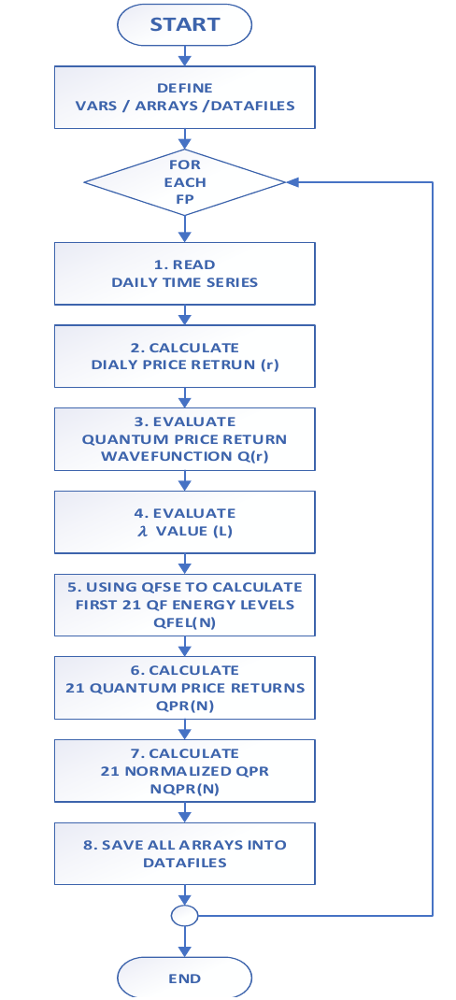

**Fig. 5** Flow chart for the determination of the first 21 QFELs and QPLs

**START** – For each financial product, do the following:

1. Read the daily time series and extract (Date, Open, High, Low, Close, Volume)
2. Calculate daily price return $r(t)$
3. Calculate quantum price return wavefunction $Q(r)$ (size 100)
4. Evaluate $\lambda$ value for the wavefunction $Q(r)$ using FDM and equation (34); evaluate other related parameters: sigma (std dev of $Q$), maxQPR (max quantum price return - for normalization)
5. Once $\lambda$ is found, using Quantum Finance Schrödinger Equation (numerical solution) by solving the depressed cubic equation using Cardano's method [17] to calculate first 21 quantum finance energy levels, $QFEL(n)$, $n = [1..20]$
6. Calculate quantum price return, $QPR(n)$:
   $$p = -(2n+1)^2 \tag{37}$$
   $$QPR(n) = \frac{QFEL(n)}{QFEL(0)} \quad \text{where } n = [1..20] \tag{38}$$
7. Calculate normalized $QPR(n)$:
   $$NQPR(n) = 1 + 0.21 \times \sigma \times QPR(n) \quad \text{where } n = [1..20] \tag{39}$$
8. Save two level of datafiles:
   - For each financial product, save the QPL Table contains QPE, QPR, NQPR for the first 21 energy levels
   - For all financial products, create a QPL Summary table contains NQPR for all FP, which will be used for financial prediction using recurrent neural networks

### 3.8 Example: QPLs for XAUUSD

Using XAUUSD as example, Table 4 shows the QPE, QPR and NQPR for the first 21 energy levels of XAUUSD by using the 2048 daily time series data from Forex.com. According to Quantum Finance Theory and the symmetric property of the QFSE, at the beginning of each trading day, the first 21 QPL+ is calculated by:

$$QPL_0 = P_{Open} \times NQPR(0) \tag{40a}$$

$$QPL_{+n} = P_{Open} \times NQPR(n), \quad n = [1..20] \tag{40b}$$

$$QPL_{-n} = P_{Open} / NQPR(n), \quad n = [1..20] \tag{40c}$$

In real application, every day at 08:00 HKT/00:00 UTC, Quantum Finance Forecast Center (QFFC) [32] will calculate the forecast H/L for worldwide 129 financial products, together with daily 8 closest QPL for each FP, upload onto QFFC official site for public access.

**Table 4** QPE, QPR and NQPR for the first 21 energy levels of XAUUSD by using the 2048 daily time series data from Forex.com.

Product: XAUUSD ($\lambda = 1.16813758$)

| Energy Level | QPE | QPR | NQPR |
|---|---|---|---|
| 0 | 1.40993277 | 1 | 1.00277473 |
| 1 | 4.7443013 | 3.36491314 | 1.00933673 |
| 2 | 8.90806181 | 6.3180756 | 1.01753097 |
| 3 | 13.590797 | 9.63932275 | 1.02674654 |
| 4 | 18.69227098 | 13.25756193 | 1.03678619 |
| 5 | 24.15047183 | 17.12881096 | 1.04752787 |
| 6 | 29.9224128 | 21.22258132 | 1.05888698 |
| 7 | 35.97618549 | 25.51624187 | 1.07080074 |
| 8 | 42.28698048 | 29.99219642 | 1.08322032 |
| 9 | 48.83484717 | 34.63629495 | 1.09610645 |
| 10 | 55.60332572 | 39.43686325 | 1.10942674 |
| 11 | 62.57855942 | 44.38407341 | 1.12315392 |
| 12 | 69.74869114 | 49.4695157 | 1.13726466 |
| 13 | 77.10343711 | 54.68589633 | 1.15173872 |
| 14 | 84.63377674 | 60.0268174 | 1.16655835 |
| 15 | 92.33172074 | 65.48661249 | 1.18170782 |
| 16 | 100.1901342 | 71.06022114 | 1.19717309 |
| 17 | 108.2025989 | 76.74309121 | 1.21294154 |
| 18 | 116.3633045 | 82.53110164 | 1.22900172 |
| 19 | 124.666961 | 88.42050054 | 1.24534322 |
| 20 | 133.108728 | 94.40785487 | 1.26195653 |

## IV. Implementation – Quantum Finance Forecast System using QPL-based Chaotic Neural Oscillatory Network

### 4.1 Introduction

With the integration of quantum price levels (QPL) discussed in Section 3 and the chaotic neural oscillatory network inspired by the author's previous work on Lee-oscillator, this section presents the Quantum Finance Forecast System using QPL-based timeseries chaotic neural oscillatory networks (aka QPL-CNON) which effectively resolve the system over-training and deadlock problems imposed by traditional recurrent neural networks using classical sigmoid-based activation functions. From the implementation perspective, QPL-CNON is coalesced 2048-trading daytime series financial data with quantum finance signals (QFS) based on QPL as input signals for the real-time prediction of 129 worldwide financial products which includes: 9 major cryptocurrencies, 84 forex, 19 major commodities and 17 worldwide financial indices.

### 4.2 Chaotic Neural Networks using Lee-oscillators

Over years, traditional Artificial Neural Networks (ANNs) based on simple artificial neurons as constituting elements are refuted to be oversimplification to simulate real-world problems. For problems with complex and highly chaotic behaviors such as severe weather situations like rainstorms or wind-shear, or highly fluctuated real-time forex markets, there is strong evidence that neural network with the adoption of neural oscillators (so-called "Chaotic Neural Oscillatory Networks" or "Chaotic Neural Networks" in short) seems to be a more suitable and viable solution [33].

Different from those computationally intensive neural oscillators using time-continuous-based architecture, Lee [34][35] proposed a simple but efficient time-discrete-based neural oscillator so-called Lee-oscillator. More importantly, Lee-oscillator successfully simulates the transient-chaotic-growth in its neural activities, which sheds new light to be adopted as a perfect chaotic-BTU to model complex and chaotic problems. Figs 6a and 6b show the neural model and bifurcation diagram of a single Lee-oscillator.

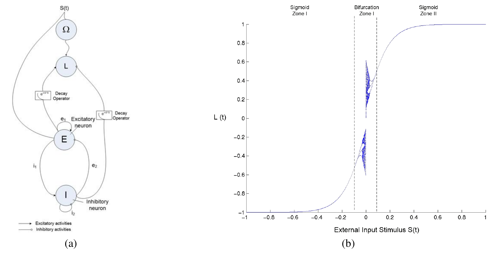

**Fig. 6** Neural models and bifurcation diagram of Lee-oscillator

Basically, Lee-oscillator composes of 4 neurons: E, I, and L which corresponds to the Exhibitory, Inhibitory, Input and Output neurons. The formulations of Lee-oscillator are given by:

$$E(t+1) = Sig(e_1 \cdot E(t) - e_2 \cdot I(t) + S(t) - \theta_E) \tag{41}$$

$$I(t+1) = Sig(i_1 \cdot E(t) - i_2 \cdot I(t) - \theta_I) \tag{42}$$

$$\Omega(t+1) = Sig(S(t)) \tag{43}$$

$$L(t) = (E(t) - I(t)) \cdot e^{-kS(t)^2} + \epsilon(t) \tag{44}$$

where $e_1$, $e_2$, $i_1$ and $i_2$ are the weights; $\theta_E$ and $\theta_I$ are the threshold values and $S(t)$ is the external input.

### 4.3 QPL-CNON – System Architecture

QPL-based Chaotic Neural Oscillatory Network (QPL-CNON) is the integration of 1) multi-layer feed-forward backpropagation networks (FFBPNs) as network kernel; 2) Lee-oscillators to replace all the simple neurons with the chaotic neural oscillators; 3) QPLs as additional quantum finance input signals. Figs. 7 and 8 depict the system architecture and network training algorithm of QPL-CNON respectively.

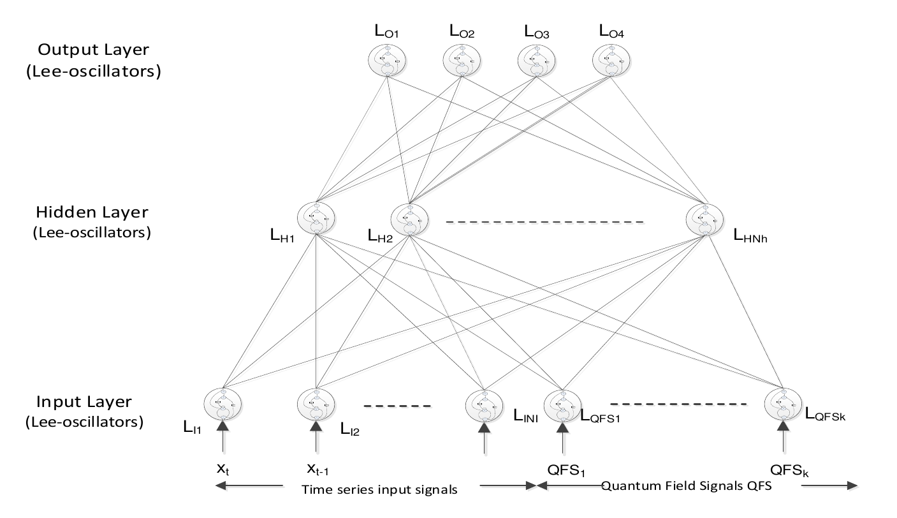

**Fig. 7** System Architecture of QPL-CNON

As shown in Fig. 7, QPL-CNON consists of three neural network layers:

1. **Input layer:** consists of 1) 5-day time series input signal vector contains Open, High, Low and Closing prices; 2) Quantum Field Signals (QFS) contain the 21 closest QPLs discussed in Section 2. For each input node are given by Lee-oscillator, totally we have 41 Lee-oscillators in the input layer (20 Lee-oscillators for time series signals, and 21 Lee-oscillators of QFS).
2. **Hidden layer:** consists of 41 Lee-oscillators as hidden nodes.
3. **Output layer:** consists of 4 Lee-oscillators which model the next-day forecasts of Open, High, Low and Close respectively.

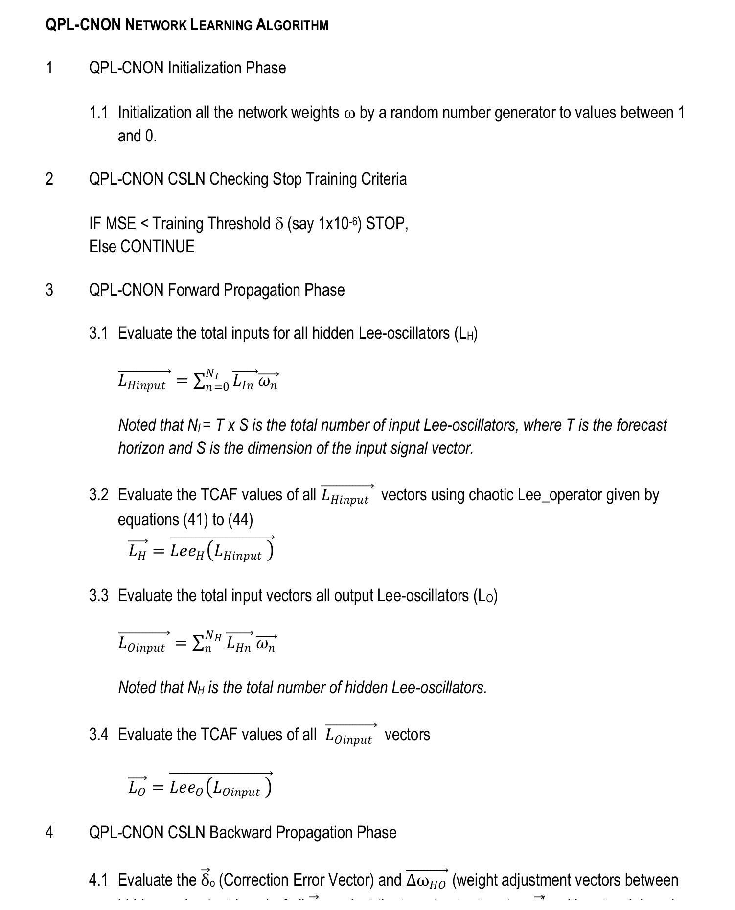

**Fig. 8** System training algorithm of QPL-CNON

### 4.4 System Implementation – Quantum Finance Forecast System

Quantum finance forecast center [32] is a non-profit, self-funded AI-Fintech R&D and worldwide financial forecast center aims at the R&D and provision of a fair and open platform for worldwide traders and individual investors to acquire free knowledge of worldwide 129 financial product forecasts based on state-of-art Quantum Finance, AI, intelligent agents and chaotic neural networks technologies.

With the adoption of QPL-CNON technology and the real time data provided by Forex.com [36] (one of the major international forex trading platform) and AvaTrade.com [37] (one of the biggest cryptocurrency trading platform), QFFC launched the 129 financial products' daily and weekly forecast services from 1 Jan 2018 for over 10,000 worldwide traders and individual investors for testing and evaluation. Fig. 9 shows the official site of Quantum Finance Forecast Center with daily forecast of BTCEUR on 3 July 2019.

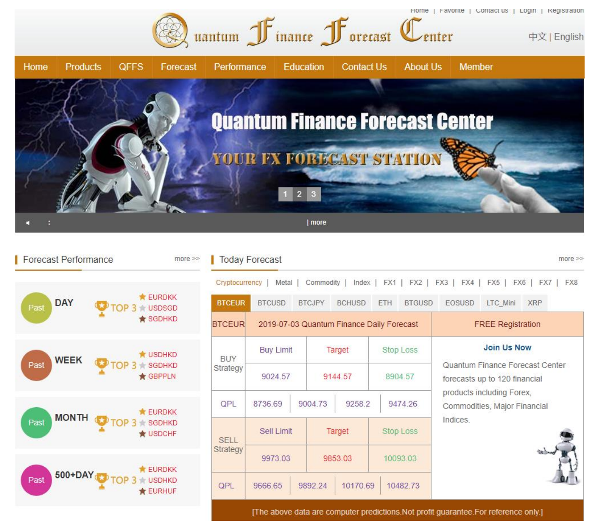

**Fig. 9** Quantum finance forecast center official site for QPL-CNON daily financial forecast on 3 July 2019

From the system implementation perspective, real time and historical data of worldwide 129 financial products provided by forex.com and avatrade.com are adopted in QPL-CNON for chaotic neural network training and prediction. They include: major cryptocurrencies (9); major worldwide forex (84); major commodities (19); major worldwide financial indices (17). Appendix shows the list of 129 financial products under these four categories.

As shown in Appendix, owing to the short trading history of cryptocurrencies (300 trading day records are provided by avatrade.com), all other financial products consist of 2048 past trading day records for each financial product (data provided by Forex.com) which provide sufficient training and test sets for QPL-CNON system testing and evaluation.

To provide a fully coherent and automation of QPL-CNON with both Forex.com and AvaTrade.com trading platforms for the automatic acquisition of real time and historical data, the whole QPL-CNON system is developed in MT platform [38][39] using MetaQuotes Language (MQL) and Expert Advisor (EA) system for daily financial forecast. Fig. 10 shows the system framework of QPL-CNON.

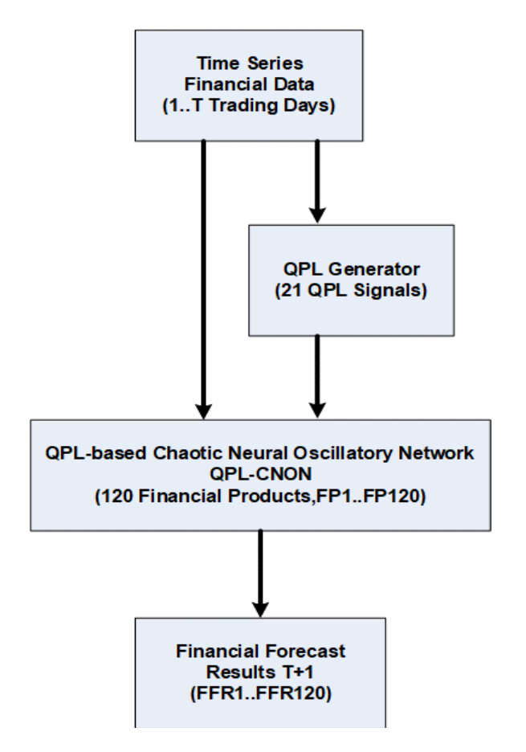

**Fig. 10** QPL-CNON System Framework

As shown in Fig. 10, each financial product has 2048 trading-day data (except cryptocurrency which only have 300-trading day data) are automatically generated by the MT4 engines of forex.com and avatrade.com on a daily basis. Through the QPL (quantum price level) Generator discussed in Section 2, 21 closest QPL signals are generated by QPL-CNON together with the previous 5-day time series patterns; they are fed into QPL-CNON for chaotic neural network training and testing.

## V. System Performance Analysis

### 5.1 QPL-CNON Implementation Results

Fig. 11 shows a snapshot of the QPL-CNON system training and forecast process of 120 financial products of forex.com on 3 July 2019 in the server farm of Quantum Finance Forecast Center using Intel i5 CPU 2.39 GHz 32MB RAM Dell Server.

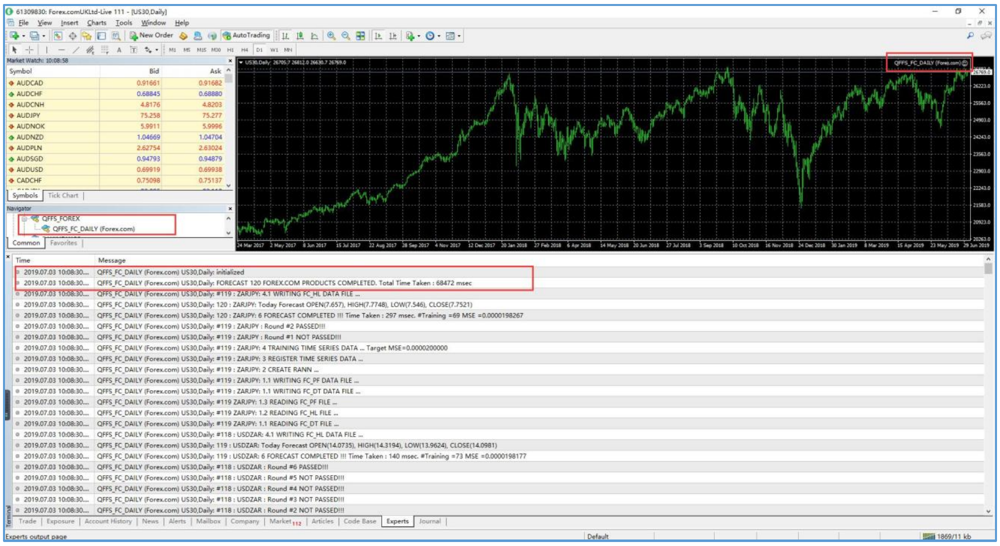

**Fig. 11** Snapshot of QPL-CNON (Forex.com) for system training and forecast of 120 financial products for Forex.com MT4 platform on 3 July 2019

As shown in Fig. 11, in a typical daily forecast of 120 financial products on forex.com MT4 platform, the QPL-CNON system only takes 68472 msec (68.472 sec) to finish the training and forecast of 120 financial products. On average, it takes 0.571 sec (less than 1 sec) to complete the network training and forecast process of a single financial product.

Fig. 12 shows the snapshot of QPL-CNON system for the system training and forecast of 9 major cryptocurrencies over AvaTrade.com MT platform on the same trading-day. As shown in Fig. 12, in a typical forecast day, QPL-CNON takes 42310 msec (42.310 sec) to finish the training and forecast of the 9 cryptocurrencies. That is, on average it takes 4.701 sec to train and forecast a single cryptocurrency.

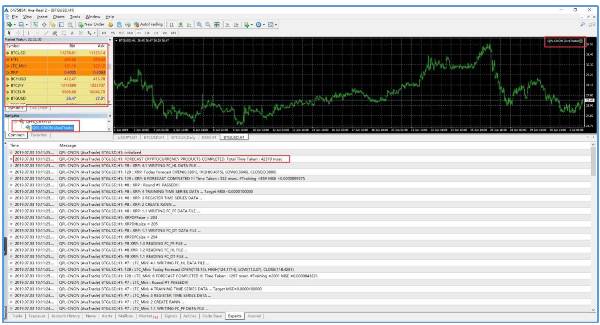

**Fig. 12** Snapshot of QPL-CNON (AvaTrade.com) for system training and forecast of 9 major cryptocurrencies for AvaTrade.com MT4 platform on 3 July 2019

As compared with all those 120 non-cryptocurrency products, QPL-CNON takes 8.23 times to predict cryptocurrency, even though cryptocurrency only have 300-trading day records while the other 120 financial products each have 2048-trading day records for system training. It may due to the fact that cryptocurrencies in general are much more chaotic and fluctuant in nature, which take more time and iterations for QPL-CNON to learn the market pattern.

### 5.2 QPL-CNON System Performance

From the system performance perspective, 3 types of system performance analysis are conducted. They are: System Training Performance Analysis; System Forecast Simulation Performance Analysis; and 500-Day Forecast Performance Analysis.

For the system training and forecast performance analysis, QPL-CNON is compared with FOUR forecast models, they are:

1. Traditional Time-series Feedforward Backpropagation Network (FFBPN);
2. Support Vector Machine (SVM) forecasting tool provided by R Project - one of the most popular financial forecasting tools used in the finance industry;
3. Deep Neural Network (DNN) with PCA (Principal Component Analysis) model [18];
4. Chaotic Neural Oscillatory Network without QPL (CNON).

#### 5.2.1 System Training Performance Analysis

In the Training Performance Analysis, 70% of time series data of the 129 financial products are employed for system training in two aspects. Fig. 13 shows the system performances of the six forecast models over 500 epochs of network training of the 129 financial products in terms of mean and standard deviations of RMSE (Root Mean Square Errors). As shown in Fig. 13, two observations can be found: 1) QPL-CNON outperforms the other FOUR models in terms of both Mean and Standard Deviation of RMSE; 2) As compared between CNON and QPL-CNON, QPL-CNON attains the promisingly low RMSE within the first 100 epochs while the RMSE of CNON is still "half-way" of their lowest RMSE levels.

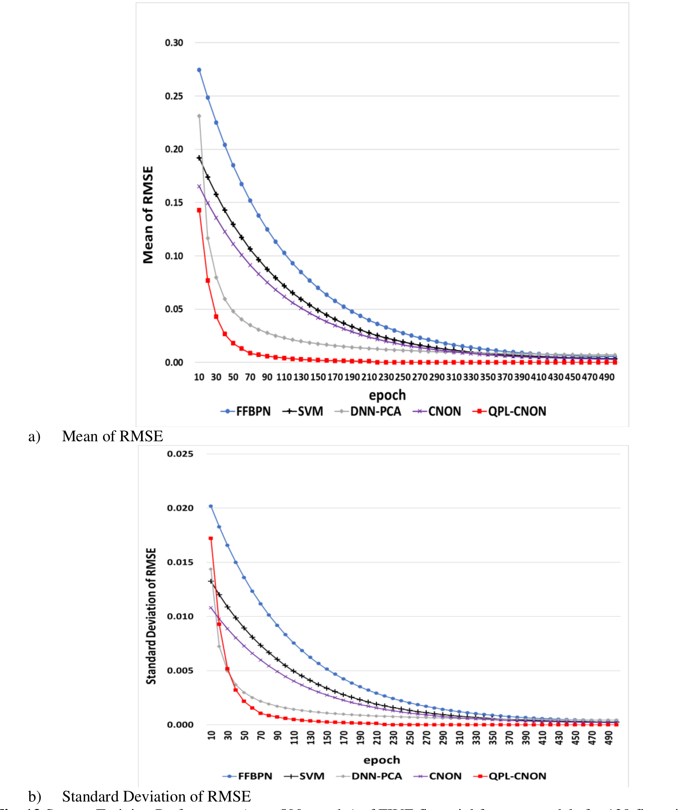

**Fig. 13** System Training Performance (over 500 epochs) of FIVE financial forecast models for 129 financial products. (a) Mean of RMSE (b) Standard Deviation of RMSE

#### 5.2.2 System Forecast Simulation Performance Analysis

In the System Forecast Simulation Performance Analysis, four categories of worldwide 129 financial products are tested with target RMSE (Root-Mean-Square-Error) of the forecast next-day closing price ranging from $1\times10^{-4}$ to $1\times10^{-7}$ respectively. The test is done by applying 500 forecast simulations for each system. Table 5 presents the System Forecast Simulation Performance Test of these FIVE systems.

**Table 5** System Performance Comparison Chart

| Product Category | FFBPN Total STT | FFBPN Av. STT | SVM Total STT | SVM Av. STT | DNN-PCA Total STT | DNN-PCA Av. STT | CNON Total STT | CNON Av. STT | QPL-CNON Total STT | QPL-CNON Av. STT |
|---|---|---|---|---|---|---|---|---|---|---|
| **Case 1 (RMSE = 1x10-4)** | | | | | | | | | | |
| Cryptocurrency | 55725 | 61916.78 | 37224 | 41360.41 | 244633 | 27181.47 | 1401 | 155.67 | 1078 | 119.78 |
| Forex | 50845 | 6053.01 | 33151 | 3946.56 | 291344 | 3468.38 | 1454 | 17.31 | 1031 | 12.27 |
| Financial Index | 41120 | 2164.21 | 26152 | 1376.44 | 19738 | 1038.82 | 242 | 12.74 | 169 | 8.89 |
| Commodity | 46641 | 2743.59 | 29384 | 1728.46 | 22108 | 1300.46 | 427 | 25.12 | 301 | 17.71 |
| Overall | 11534 | 8941.59 | 75929 | 5885.98 | 577823 | 4479.25 | 3524 | 27.32 | 2579 | 19.99 |
| **Case 2 (RMSE = 1x10-5)** | | | | | | | | | | |
| Cryptocurrency | 14600 | 162222.22 | 93732 | 104146.67 | 823440 | 91493.33 | 3934 | 437.11 | 2980 | 331.11 |
| Forex | 12355 | 14708.85 | 84140 | 10016.72 | 720322 | 8575.26 | 4524 | 53.86 | 3142 | 37.40 |
| Financial Index | 11102 | 5843.37 | 68391 | 3599.51 | 50627 | 2664.58 | 774 | 40.74 | 549 | 28.89 |
| Commodity | 10914 | 6420.12 | 71925 | 4230.86 | 44967 | 2645.09 | 1065 | 62.65 | 761 | 44.76 |
| Overall | 29157 | 22602.40 | 19190 | 14876.29 | 1639356 | 12708.19 | 10297 | 79.82 | 7432 | 57.61 |
| **Case 3 (RMSE = 1x10-6)** | | | | | | | | | | |
| Cryptocurrency | DL | - | 61022 | 678028.38 | 3601307 | 400145.17 | 1515 | 1683.89 | 1232 | 1369.00 |
| Forex | DL | - | 54778 | 65212.10 | 4184833 | 49819.44 | 2083 | 247.97 | 1456 | 173.42 |
| Financial Index | 57732 | 30385.47 | 37352 | 19659.40 | 318683 | 16772.78 | 1932 | 101.68 | 1342 | 70.63 |
| Commodity | 68759 | 40446.76 | 46825 | 27544.25 | 385741 | 22690.64 | 2887 | 169.82 | 2019 | 118.76 |
| Overall | - | - | 12421852 | 96293.43 | 8490564 | 65818.35 | 4005 | 316.32 | 3024 | 234.49 |
| **Case 4 (RMSE = 1x10-7)** | | | | | | | | | | |
| Cryptocurrency | DL | - | 25141 | 279347 | 1440522 | 160058 | 5542 | 6158.44 | 4231 | 4701.11 |
| Forex | DL | - | 26896077 | 320191.39 | 17785540 | 211732.62 | 9043 | 1076.61 | 6324 | 752.87 |
| Financial Index | DL | - | 17144 | 90236.74 | 1446821 | 76148.46 | 9068 | 477.26 | 6431 | 338.47 |
| Commodity | DL | - | 20884 | 122847.29 | 1917133 | 112772.52 | 11414 | 671.41 | 7872 | 463.06 |
| Overall | - | - | 55840269 | 432870.30 | 3555472 | 275618.00 | 16634 | 1289.48 | 11984 | 929.10 |

Note:
1. Results are generated by 500 simulations of each neural network system (measured in msec).
2. "Total STT" denotes the total average system training time for 500 simulations of network training.
3. "Av. STT" denotes the average system training time for a single financial product.
4. "DL" denotes deadlock during system training.

Certain interesting findings are revealed in Table 5:

1. For Case 1 simulation (RMSE $1\times10^{-4}$), QPL-CNON outperforms FFBPN (447.25), SVM (294.41), DNN-PCA (224.05), CNON (1.37) times. Similar findings can be found in Case II simulation results. It clearly reflects the improvement of network learning rate achieved by the QPL-CNON system.
2. Across the 3 Cases with decreasing RMSE from $1\times10^{-4}$ (Case 1), $1\times10^{-5}$ (Case 2), $1\times10^{-6}$ (Case 3) to $1\times10^{-7}$ (Case 4). All forecast systems can achieve the target RMSE in Case 1 and Case 2. However, for the Case 3 and 4 simulations using target RMSE $1\times10^{-6}$ and $1\times10^{-7}$, FFBPN (which are using sigmoid-based FFBPN for machine learning) encounter deadlock problems during the network training of Cryptocurrency and Forex products; while QPL-CNON can still finish the network training with promising training speeds.
3. Comparing QPL-CNON against CNON across the FOUR cases, it is interested to reveal that QPL-CNON outperforms its counterpart by 1.37–1.39 times respectively. It clearly reflects the merits for the integration of QPL as additional input vectors with chaotic neural oscillator technology for network training and deep learning.
4. In terms of system performance across different financial products, the simulation results clearly show that both cryptocurrency and forex are more chaotic and difficult for network training than other financial products as expected, which will be further explored in the future research of QFFC.

#### 5.2.3 QPL-CNON 500-Day Forecast Performance Summary

From the system performance and evaluation perspective, QPL-CNON system evaluated the daily forecast performance of the 129 financial products in four timeframes: daily, weekly average, monthly average and past 500-day average. Fig. 14 presents the past 500-day performance ranking list of the top 20 financial products.

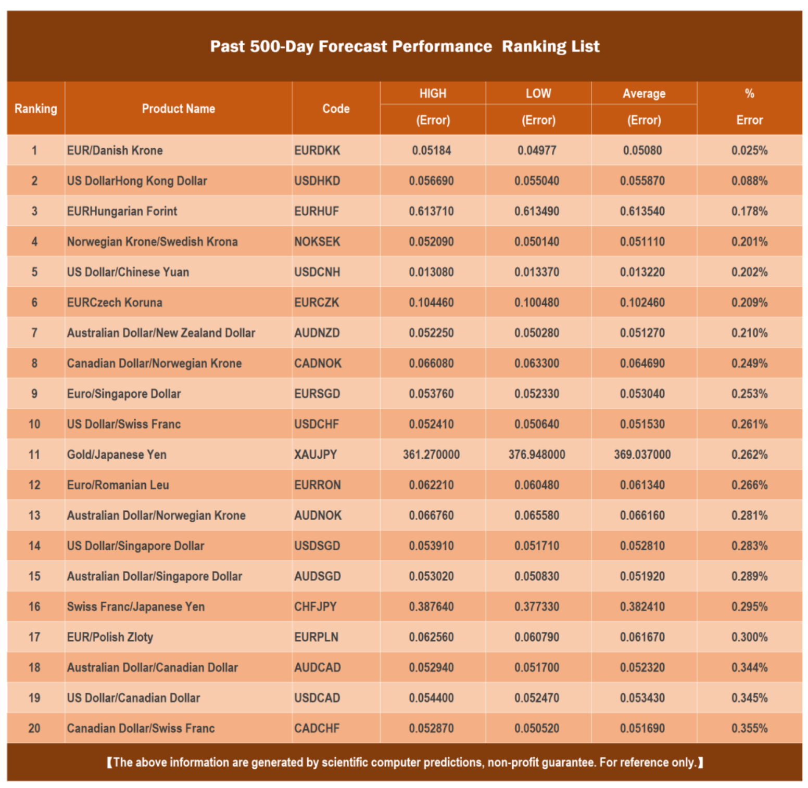

**Fig. 14** Past 500-day system performance ranking chart (Top 20 Financial Products)

Note:
1. High (Error) = Abs(HighForecast – HighActual)
2. Low (Error) = Abs(LowForecast – LowActual)
3. Average (Error) = Average(High(Error), Low(Error))
4. % Error = Average(Error) / CloseActual

As shown, the 500-day average forecast % error of the top 20 financial products ranging from 0.025% to 0.355% respectively, which is somewhat promising and significant as reflected by over 10,000 members of QFFC which consist of professional forex traders, quants and investors.

## VI. Conclusion

This paper devises an innovative method for the modeling of quantum dynamics of financial markets using quantum anharmonic oscillator model. The significance of this paper includes:

1. The successful modeling of Quantum Finance and Quantum Finance Schrödinger Equation (QFSE);
2. The successful resolution of QFSE with the adoption of latest research of Quantum Anharmonic Oscillator Model;
3. The successful devise of effective and computational feasible method for the evaluation of Quantum Price Levels (QPL) – a new type of financial indicator which based on the quantization of quantum energy levels of financial markets;
4. The successful implementation of QPL-CNON system with the integration of QPLs as quantum finance signals and the Chaotic Neural Oscillatory Model as the financial forecast kernel;
5. The successful implementation of Quantum Finance Forecast System (QFFS) into real world application in Quantum Finance Forecast Center (QFFC) for the execution of daily quantum finance forecast of worldwide 129 financial products.

In fact, for a professional trader and investor, a reliable and effective financial forecast system is only the beginning of the story. A good financial investment also needs: 1) good and effective trading and hedging strategies; 2) stable, logical and rational investment psychology.

Current research of QFFC includes:

1. Integration of QPL-CNON with fractal technology for market trends/patterns mining and prediction;
2. Further study of Quantum Finance Anharmonic Oscillatory Model and QPLs for mid-term financial trend prediction;
3. R&D on quantum entanglement of quantum finance system on severe financial event modeling and prediction;
4. Design and develop intelligent agent-based hedging and trading systems based on quantum finance forecast and QPLs.

## Acknowledgment

The author wishes to thank Forex.com and AvaTrade.com for the provision of historical and real time 120+ financial product data over their MT4 R&D and trading platforms. The author also wishes to thank Quantum Finance Forecast Center of UIC for the R&D supports and the provision of the channel and platform qffc.org for worldwide system testing and evaluation. This paper and research project is supported by Research Grant R202008 of Beijing Normal University-Hong Kong Baptist University United International College (UIC).

## References

[1] L. Bachelier, Théorie de la speculation, Annales Scientifiques de l'École Normale Supérieure 3(17) (1900) 21–86.

[2] R. M. Mantegna, H. E. Stanley, Introduction to Econophysics: Correlations and Complexity in Finance, Cambridge University Press, 1st edition, 1999.

[3] B. E. Baaquie, Quantum Finance, Cambridge University Press, 2004.

[4] M. J. Kim, S. Y. Kim, D. I. Hwang, S. Y. Lee, The sensitivity analysis of propagator for path independent quantum finance model, Physica A: Statistical Mechanics and its Applications 390(5) (2011) 847-863.

[5] T. Gao, Y. Chen, A quantum anharmonic oscillator model for the stock market, Physica A: Statistical Mechanics and its Applications 468 (2017) 307-314.

[6] C. Ye, J. P. Huang, Non-classical oscillator model for persistent fluctuations in stock markets, Physica A: Statistical Mechanics and its Applications. 387(5) (2008) 1255-1263.

[7] X. Meng, J. Zhang, H. Guo, Quantum spatial-periodic harmonic model for daily price-limited stock markets, Physica A: Statistical Mechanics and its Applications 438 (2015) 154-160.

[8] A. Ataullah, I. Davidson, M. Tippett, A wave function for stock market returns, Physica A: Statistical Mechanics and its Applications 388(4) (2009) 455-461.

[9] F. Bagarello, A quantum statistical approach to simplified stock markets, Physica A: Statistical Mechanics and its Applications 388(20) (2009) 4397-4406.

[10] L. Cotfas, A finite-dimensional quantum model for the stock market, Physica A: Statistical Mechanics and its Applications 392(2) (2013) 371-380.

[11] Y. Nakayama, Gravity dual for Reggeon field theory and nonlinear quantum finance, International Journal of Modern Physics A 24(32) (2009) 6197-6222.

[12] E. W. Piotrowski, J. Sładkowski, Quantum diffusion of prices and profits, Physica A: Statistical Mechanics and its Applications 345(1-2) (2005) 185-195.

[13] L. Shi, Does security transaction volume-price behavior resemble a probability wave? Physica A: Statistical Mechanics and its Applications 366 (2006) 419-436.

[14] S. Nasiri, E. Bektas, G. R. Jafari, The impact of trading volume on the stock market credibility: Bohmian quantum potential approach, Physica A: Statistical Mechanics and its Applications 512 (2018) 1104-1112.

[15] M. Schaden, Quantum finance, Physica A: Statistical Mechanics and its Applications 316(1-4) (2002) 511-538.

[16] C. Zhang, L. Huang, A quantum model for the stock market, Physica A: Statistical Mechanics and its Applications 389(24) (2010) 5769-5775.

[17] R. S. T. Lee, Quantum Finance - Intelligent Financial Forecast and Program Trading Systems, SpringerNATURE, Singapore (in printing), late 2019.

[18] R. Singh, S. Srivastava, Stock prediction using deep learning, Multimedia Tools and Applications 76(18) (2017) 18569-18584.

[19] K. Čekauskas, et al., The Effects of Market Makers and Stock Analysts in Emerging Markets: Market Makers and Stock Analysts, International Review of Finance 12(3) (2012) 305-327.

[20] B. G. Malkiel, The Efficient Market Hypothesis and Its Critics, The Journal of Economic Perspectives 17(1) (2003) 59-82.

[21] C. Brunetti, et al., Speculators, Prices, and Market Volatility, Journal of Financial and Quantitative Analysis 51(5) (2016) 1545-1574.

[22] B. Lin, et al., Who bets against hedgers and how much they trade? A theory and empirical tests, Applied Economics 41(27) (2009) 3491-3497.

[23] G. Tian, On the existence of price equilibrium in economies with excess demand functions, Economic Theory Bulletin 4(1) (2016) 5-16.

[24] H. Grosse, A. Martin, Particle Physics and the Schrödinger Equation (Cambridge Monographs on Particle Physics, Nuclear Physics and Cosmology). Cambridge University Press, 2005.

[25] P. Popelier, Solving the Schrodinger equation: has everything been tried? World Scientific Pub Co Pte, 2011.

[26] A. Bouard, E. Hausenblas, The nonlinear Schrödinger equation driven by jump processes, Journal of Mathematical Analysis and Applications 475(1) (2019) 215-252.

[27] G. J. Rampho, The Schrödinger equation on a Lagrange mesh, Journal of Physics: Conference Series 905 (2017) 12037.

[28] V. V. Kisil, Hypercomplex Representations of the Heisenberg Group and Mechanics, International Journal of Theoretical Physics 51(3) (2012) 964-984.

[29] M. R. M. Witwit, Energy Levels for Nonsymmetric Double-Well Potentials in Several Dimensions: Hill Determinant Approach, Journal of Computational Physics, 123(2) (1996) 369-378.

[30] T. Rohwedder, The continuous Coupled Cluster formulation for the electronic Schrödinger equation, ESAIM: Mathematical Modelling and Numerical Analysis 47(2) (2013) 421-447.

[31] A. Dasgupta, et al., Simple systematics in the energy eigenvalues of quantum anharmonic oscillators, Journal of Physics A: Mathematical and Theoretical 40(4) (2007) 773-784.

[32] Quantum Finance Forecast Center official site http://qffc.org (accessed 2 July 2019)

[33] R. S. T. Lee, Advanced Paradigms in Artificial Intelligence From Neural Oscillators, Chaos Theory to Chaotic Neural Networks. Australia: Advanced Knowledge International, 2005.

[34] R. S. T. Lee, A Transient-chaotic Auto-associative Network (TCAN) based on LEE-oscillators, IEEE Trans. Neural Networks 15(5) (2004) 1228-1243.

[35] R. S. T. Lee, LEE-Associator – A Transient Chaotic Autoassociative Network for Progressive Memory Recalling, Neural Networks 19(5) (2006) 644-666.

[36] Forex.com official site http://forex.com (accessed 2 July 2019)

[37] Avatrade.com official site http://avatrade.com (accessed 2 July 2019)

[38] W. Walker, Expert Advisor Programming and Advanced Forex Strategies. Independently published, 2018.

[39] A. R. Young, Expert Advisor Programming for MetaTrader 4: Creating automated trading systems in the MQL4 language. Edgehill Publishing, 2015.

## Appendix - List of 129 Financial Products

### 9 Cryptocurrencies (Data provided by AvaTrade.com)

| Code | Product Description |
|------|-------------------|
| BCHUSD | BitCoin Cash vs US Dollar |
| BTCEUR | BitCoin vs Euro |
| BTCJPY | BitCoin vs Japanese Yen |
| BTCUSD | BitCoin vs US Dollar |
| BTGUSD | Bitcoin Gold vs US Dollar |
| EOSUSD | EOS vs US Dollar |
| ETH | Ethereum |
| LTC | Litecoin |
| XRP | XRP |

### 17 Financial Index (Data provided by Forex.com)

| Code | Product Description |
|------|-------------------|
| AUS200 | AUSSIE 200 |
| CHINAA50 | China A50 Index |
| ESP35 | Spain 35 Index |
| ESTX50 | EURO STOXX 50 Index |
| FRA40 | CAC 40 Index |
| GER30 | DAX 30 Index |
| HK50 | Hang Seng Index |
| IT40 | Italy 40 Index |
| JPN225 | Nikkei Index |
| N25 | Netherlands 25 Index |
| NAS100 | Nasdaq Index |
| SIGI | Singapore Index |
| SPX500 | SP500 Index |
| SWISS20 | Switzerland Index |
| UK100 | FTSE 100 Index |
| US2000 | US Small Cap 2000 |
| US30 | Dow Jones Index |

### 19 Commodities (Data provided by Forex.com)

| Code | Product Description |
|------|-------------------|
| COPPER | Copper |
| CORN | Corn |
| COTTON | Cotton |
| HTG_OIL | HTG Oil |
| PALLAD | Palladium |
| PLAT | Platinum |
| SOYBEAN | Soybean |
| SUGAR | Sugar |
| UK_OIL | Brent Crude Oil |
| US_NATG | US Natural Gas |
| US_OIL | WTI Crude Oil |
| WHEAT | Wheat |
| XAGUSD | Silver vs US Dollar |
| XAUAUD | Gold vs Australian Dollar |
| XAUCHF | Gold vs Swiss Franc |
| XAUEUR | Gold vs Euro |
| XAUGBP | Gold vs British Pound |
| XAUJPY | Gold vs Japanese Yen |
| XAUUSD | Gold vs US Dollar |

### 84 Forex (Data provided by Forex.com)

| Code | Product Description |
|------|-------------------|
| AUDCAD | Australian Dollar vs Canadian Dollar |
| AUDCHF | Australian Dollar vs Swiss Franc |
| AUDCNH | Australian Dollar vs Chinese Yuan |
| AUDJPY | Australian Dollar vs Japanese Yen |
| AUDNOK | Australian Dollar vs Norwegian Krone |
| AUDNZD | Australian vs New Zealand Dollar |
| AUDPLN | Australian Dollar vs Polish Zloty |
| AUDSGD | Australian Dollar vs Singapore Dollar |
| AUDUSD | Australian Dollar vs US Dollar |
| CADCHF | Canadian Dollar vs Swiss Franc |
| CADJPY | Canadian Dollar vs Japanese Yen |
| CADNOK | Canadian Dollar vs Norwegian Krone |
| CADPLN | Canadian Dollar vs Polish Zloty |
| CHFHUF | Swiss Franc vs Hungarian Forint |
| CHFJPY | Swiss Franc vs Japanese Yen |
| CHFNOK | Swiss Franc vs Norwegian Krone |
| CHFPLN | Swiss Franc vs Polish Zloty |
| CNHJPY | Chinese Yuan vs Japanese Yen |
| EURAUD | Euro vs Australian Dollar |
| EURCAD | Euro vs Canadian Dollar |
| EURCHF | Euro vs Swiss Franc |
| EURCNH | Euro vs Chinese Yuan |
| EURCZK | Euro vs Czech Koruna |
| EURDKK | Euro vs Danish Krone |
| EURGBP | Euro vs British Pound |
| EURHKD | Euro vs Hong Kong Dollar |
| EURHUF | Euro vs Hungarian Forint |
| EURJPY | Euro vs Japanese Yen |
| EURMXN | Euro vs Mexican Peso |
| EURNOK | Euro vs Norwegian Krone |
| EURNZD | Euro vs New Zealand Dollar |
| EURPLN | Euro vs Polish Zloty |
| EURRON | Euro vs Romanian Leu |
| EURRUB | Euro vs Russian Ruble |
| EURSEK | Euro vs Swedish Krona |
| EURSGD | Euro vs Singapore Dollar |
| EURTRY | Euro vs Turkish Lira |
| EURUSD | Euro vs US Dollar |
| EURZAR | Euro vs South African Rand |
| GBPAUD | British Pound vs Australian Dollar |
| GBPCAD | British Pound vs Canadian Dollar |
| GBPCHF | British Pound vs Swiss Franc |
| GBPDKK | British Pound vs Danish Krone |
| GBPHKD | British Pound vs Hong Kong Dollar |
| GBPJPY | British Pound vs Japanese Yen |
| GBPMXN | British Pound vs Mexican Peso |
| GBPNOK | British Pound vs Norwegian Krone |
| GBPNZD | British Pound vs New Zealand Dollar |
| GBPPLN | British Pound vs Polish Zloty |
| GBPSEK | British Pound vs Swedish Krona |
| GBPSGD | British Pound vs Singapore Dollar |
| GBPUSD | British Pound vs US Dollar |
| GBPZAR | British Pound vs South African Rand |
| HKDJPY | Hong Kong Dollar vs Japanese Yen |
| NOKDKK | Norwegian Krone vs Danish Krone |
| NOKJPY | Norwegian Krone vs Japanese Yen |
| NOKSEK | Norwegian Krone vs Swedish Krona |
| NZDCAD | New Zealand vs Canadian Dollar |
| NZDCHF | New Zealand Dollar vs Swiss Franc |
| NZDJPY | New Zealand Dollar vs Japanese Yen |
| NZDUSD | New Zealand Dollar vs US Dollar |
| SGDHKD | Singapore vs Hong Kong Dollar |
| SGDJPY | Singapore Dollar vs Japanese Yen |
| TRYJPY | Turkish Lira vs Japanese Yen |
| USDCAD | US Dollar vs Canadian Dollar |
| USDCHF | US Dollar vs Swiss Franc |
| USDCNH | US Dollar vs Chinese Yuan |
| USDCZK | US Dollar vs Czech Koruna |
| USDDKK | US Dollar vs Danish Krone |
| USDHKD | US Dollar vs Hong Kong Dollar |
| USDHUF | US Dollar vs Hungarian Forint |
| USDILS | US Dollar vs Israeli Shekel |
| USDJPY | US Dollar vs Japanese Yen |
| USDMXN | US Dollar vs Mexican Peso |
| USDNOK | US Dollar vs Norwegian Krone |
| USDPLN | US Dollar vs Polish Zloty |
| USDRON | US Dollar vs Romanian Leu |
| USDRUB | US Dollar vs Russian Ruble |
| USDSEK | US Dollar vs Swedish Krona |
| USDSGD | US Dollar vs Singapore Dollar |
| USDTHB | US Dollar vs Thai Baht |
| USDTRY | US Dollar vs Turkish Lira |
| USDZAR | US Dollar vs South African Rand |
| ZARJPY | South African Rand vs Japanese Yen |
