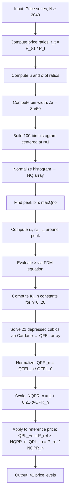

# Quantum Price Levels (QPL)

## Overview

Quantum Price Levels (QPL) is a financial indicator that computes discrete support and resistance price levels from first principles, using a quantum mechanics analogy. It models the financial market as a **quantum anharmonic oscillator** and solves for the discrete energy eigenvalues of the system — these eigenvalues map directly to price levels above and below the current price.

**Input:** Historical prices at consistent intervals (2048+ bars recommended)  
**Output:** 21 price levels above and 21 price levels below a reference price  
**Nature:** Static levels recomputed once per bar (like pivot points or Fibonacci levels)

The algorithm has two independent parts:
1. **Calibration:** Compute the anharmonic coefficient λ and NQPR multipliers from consecutive price ratios (the "return distribution"). Any consistent price series works (closes, settlements, etc.).
2. **Projection:** Multiply/divide a reference price by the NQPR multipliers to get concrete levels. The reference price can be today's open (for intraday S&R), the last close (for next-bar targets), or any anchor price.

---

## Theoretical Foundation

### The Quantum Finance Schrödinger Equation (QFSE)

The core idea: price returns in financial markets behave like a quantum particle oscillating in an anharmonic potential well. The "wavefunction" is the probability distribution of daily price returns, and the "energy levels" correspond to discrete price return magnitudes where the market tends to find equilibrium (support/resistance).

The Brownian price return is described by the Langevin equation:

$$m_r \frac{d^2 r}{dt^2} = -\eta \frac{dr}{dt} - \frac{dV(r)}{dr}$$

where $m_r$ = mass of the financial particle, $\eta$ = damping force factor, and $V(r)$ = time-independent quantum potential.

In the overdamping case ($d^2r/dt^2 = 0$):

$$-\frac{dV(r)}{dr} = \eta \frac{dr}{dt} = -\gamma\eta\delta r + \gamma\eta\upsilon r^3$$

Integrating:

$$V(r) = \frac{\gamma\eta\delta}{2} r^2 - \frac{\gamma\eta\upsilon}{4} r^4$$

where:
- $\delta = \gamma\alpha_{MM} + \delta_{SP} + \delta_{HG} - \delta_{IV}$ (damping/restoration term)
- $\upsilon = \upsilon_{HG} - \upsilon_{IV}$ (volatility term)

The time-independent Schrödinger equation for a quantum finance particle is therefore:

$$\left[\frac{-\hbar}{2m} \frac{d^2}{dr^2} + \frac{\gamma\eta\delta}{2} r^2 - \frac{\gamma\eta\upsilon}{4} r^4\right] \varphi(r) = E\varphi(r) \tag{1}$$

where:
- $r$ = daily price return (ratio of consecutive closes)
- $\varphi(r)$ = quantum price return wavefunction (the normalized pdf of returns)
- $E$ = quantum energy eigenvalue (what we want to find)
- The $r^2$ term represents market damping/restoration forces
- The $r^4$ term represents volatility/risk control potential

After normalization (setting $\hbar/2m = 1$ and absorbing constants into $\lambda$):

$$\frac{d^2\varphi_r}{dr^2} + (r^2 + \lambda r^4) \varphi_r = E\varphi_r \tag{2}$$

This is a **quartic quantum anharmonic oscillator** (QAHO) — a well-studied problem in quantum mechanics.

### The Wavefunction $\varphi(r)$

In quantum mechanics, the wavefunction of a quantum particle can be evaluated by measuring the probability distribution function (pdf) of observations:

$$\rho(r, t) = |\psi(r, t)|^2 = |\varphi(r)|^2 \tag{3}$$

In quantum finance, the wavefunction is observed by computing the distribution of daily price returns $r$ over the past 2048 trading days, divided into 100 equal bins of width:

$$\Delta r = \frac{3\sigma}{50} \tag{4}$$

where $\sigma$ is the standard deviation of returns. The normalized bin count gives $\varphi(r)$.

### Solving via Dasgupta et al. (2007)

Dasgupta et al. showed that for a general $\lambda x^{2m}$ quantum anharmonic oscillator:

$$H^{(m)}_\lambda \psi = \left[-\frac{d^2\psi}{dx^2} + x^2 + \lambda x^{2m}\right] \psi = E\psi \tag{5}$$

the excited energy levels can be closely approximated by:

$$\frac{E^{(m,n)}}{(2n+1)^{\frac{m+1}{m+1}}} - \frac{E^{(m,n)}}{(2n+1)^{\frac{m-1}{m+1}}} = (K_0^{(m,n)})^{(m+1)} \lambda \tag{6}$$

where $E^{(m,n)}$ is the $n$-th excited state energy and $K_0^{(m,n)}$ are constants.

For the quartic case ($m = 2$), this simplifies to a **depressed cubic** in $E(n)$:

$$E(n)^3 - (2n+1)^2 \cdot E(n) - \lambda(2n+1)^3 K_0(n)^3 = 0 \tag{7}$$

where:

$$K_0(n) = \left(\frac{1.1924 + 33.2383n + 56.2169n^2}{1 + 43.6106n}\right)^{1/3} \tag{8}$$

The coefficients 1.1924, 33.2383, 56.2169, 43.6106 are empirical constants from Dasgupta et al.'s numerical fitting of the QAHO energy spectrum.

> **Note on the denominator constant.** The published paper and book print this constant as `43.6196`, but that is a typo. Both deployed reference implementations on qffc.uic.edu.cn — the MQ4 `QPL_Calculation.mq4` (`1 + 43.6106*eL`) and the official Python tutorial (`1 + (43.6106*eL)`) — use **43.6106**. This was confirmed numerically: the reference K0 outputs match 43.6106 exactly, not 43.6196. We follow the deployed code.

### Finding $\lambda$ via Finite Difference Method (FDM)

The anharmonic coefficient $\lambda$ characterizes each financial product's quantum potential. It is evaluated from the symmetry of the QFSE around the ground state.

Key observations about the wavefunction (Fig. 3 in the paper):
- $\varphi_{Max}$ occurs at $r \approx 1$ (ground state, denoted $r_0$)
- $\varphi(r)$ is symmetric about $r_0$
- We use the first segments to the left ($r_{-1}$) and right ($r_{+1}$) of the peak

Since QFSE is symmetric about the central axis $r_0$, the kinetic energy terms cancel when comparing the $r_{+1}$ and $r_{-1}$ segments:

$$(r_{+1}^2 + \lambda r_{+1}^4)\varphi_{r_{+1}} = (r_{-1}^2 + \lambda r_{-1}^4)\varphi_{r_{-1}} \tag{9}$$

Solving for $\lambda$:

$$\lambda = \left|\frac{r_{-1}^2 \varphi_{r_{-1}} - r_{+1}^2 \varphi_{r_{+1}}}{r_{+1}^4 \varphi_{r_{+1}} - r_{-1}^4 \varphi_{r_{-1}}}\right| \tag{10}$$

where:
- $r_0$ = center of the peak bin minus half a bin width
- $r_{+1} = r_0 + \Delta r$
- $r_{-1} = r_0 - \Delta r$
- $\varphi_{r_{+1}} = NQ[\text{maxQno}+1]$ (normalized histogram value of the bin to the right of peak)
- $\varphi_{r_{-1}} = NQ[\text{maxQno}-1]$ (normalized histogram value of the bin to the left of peak)

### Solving the Depressed Cubic (Cardano's Method)

Equation (7) is already a depressed cubic in $E(n)$ (no $E^2$ term). Applying Cardano's method:

Let $t = E(n)$, $p = -(2n+1)^2$, $q = -\lambda(2n+1)^3 K_0(n)^3$:

$$t^3 + pt + q = 0 \tag{11}$$

The discriminant:

$$D = \frac{q^2}{4} + \frac{p^3}{27} \tag{12}$$

When $D > 0$ (which is always the case for typical $\lambda$ values), there is one real root:

$$u = \sqrt[3]{-\frac{q}{2} + \sqrt{D}} \tag{13}$$

$$v = \sqrt[3]{-\frac{q}{2} - \sqrt{D}} \tag{14}$$

$$E(n) = u + v \tag{15}$$

**Note on cube roots:** The argument of $v$ can be negative. The signed cube root is used: $\text{cbrt}(x) = \text{sign}(x) \cdot |x|^{1/3}$.

### Mapping Energy Levels to Price Levels

Once we have all 21 energy eigenvalues $QFEL(0)$ through $QFEL(20)$:

**1. Quantum Price Return (QPR):** Normalize each level relative to the ground state:

$$QPR(n) = \frac{QFEL(n)}{QFEL(0)}, \quad n = 0..20 \tag{16}$$

**2. Normalized QPR (NQPR):** Scale to actual price return magnitude using the standard deviation:

$$NQPR(n) = 1 + 0.21 \cdot \sigma \cdot QPR(n) \tag{17}$$

The constant 0.21 is an empirical scaling factor calibrated to match observed market behavior. It appears in all of Lee's implementations without further derivation.

**3. Quantum Price Levels:** Apply to a reference price $P_{ref}$ (e.g. today's open or last close):

$$QPL_0 = P_{ref} \times NQPR(0) \tag{18a}$$
$$QPL_{+n} = P_{ref} \times NQPR(n), \quad n = 1..20 \tag{18b}$$
$$QPL_{-n} = P_{ref} / NQPR(n), \quad n = 1..20 \tag{18c}$$

---

## Algorithm — Step by Step

### Step 1: Compute Consecutive Price Ratios

Given a series of $N$ prices $P_0, P_1, \ldots, P_{N-1}$ (oldest first):

$$r(t) = \frac{P(t-1)}{P(t)}, \quad t = 1, \ldots, N-1$$

This gives $N-1$ ratio values. Note: This is the *inverse* return ratio (previous/current), consistent with Lee's MQ4 and Python implementations. Any consistent price series works (daily closes, hourly bars, etc.).

### Step 2: Compute Statistics

$$\mu = \frac{1}{M}\sum_{i=0}^{M-1} r_i$$

$$\sigma = \sqrt{\frac{1}{M}\sum_{i=0}^{M-1}(r_i - \mu)^2}$$

where $M = N - 1$ is the number of returns. Note: population standard deviation (dividing by $M$, not $M-1$).

### Step 3: Build Wavefunction Histogram

Bin width:

$$\Delta r = \frac{3\sigma}{50}$$

Left boundary of bin 0:

$$r_{left} = 1 - 50 \cdot \Delta r$$

Bin $k$ covers the range $[r_{left} + k \cdot \Delta r, \; r_{left} + (k+1) \cdot \Delta r)$ for $k = 0..99$.

For each return value $r_i$:
- Compute bin index: $k = \lfloor(r_i - r_{left}) / \Delta r\rfloor$
- If $0 \le k \le 99$: increment $Q[k]$, increment total count

Normalize: $NQ[k] = Q[k] / \text{total\_count}$

### Step 4: Find Ground State

Find peak bin index `maxQno` = $\arg\max_k NQ[k]$

Compute position values:
- $r[\text{maxQno}] = r_{left} + \text{maxQno} \cdot \Delta r$ (left edge of peak bin)
- $r_0 = r[\text{maxQno}] - \Delta r / 2$ (center offset used in code — note this is one bin-center to the left)
- $r_{+1} = r_0 + \Delta r$
- $r_{-1} = r_0 - \Delta r$

### Step 5: Compute $\lambda$

$$L_{up} = r_{-1}^2 \cdot NQ[\text{maxQno}-1] - r_{+1}^2 \cdot NQ[\text{maxQno}+1]$$
$$L_{dw} = r_{+1}^4 \cdot NQ[\text{maxQno}+1] - r_{-1}^4 \cdot NQ[\text{maxQno}-1]$$
$$\lambda = \left|\frac{L_{up}}{L_{dw}}\right|$$

Guard: if `maxQno` is 0 or 99, the computation is invalid.

### Step 6: Compute $K_0(n)$ Constants

$$K_0(n) = \left(\frac{1.1924 + 33.2383n + 56.2169n^2}{1 + 43.6106n}\right)^{1/3}, \quad n = 0..20$$

### Step 7: Solve for Energy Levels (Cardano)

For each $n = 0..20$:

$$p = -(2n+1)^2$$
$$q = -\lambda \cdot (2n+1)^3 \cdot K_0(n)^3$$
$$D = \frac{q^2}{4} + \frac{p^3}{27}$$
$$u = \text{cbrt}\left(-\frac{q}{2} + \sqrt{D}\right)$$
$$v = \text{cbrt}\left(-\frac{q}{2} - \sqrt{D}\right)$$
$$QFEL(n) = u + v$$

### Step 8: Compute NQPR

$$QPR(n) = \frac{QFEL(n)}{QFEL(0)}, \quad n = 0..20$$
$$NQPR(n) = 1 + 0.21 \cdot \sigma \cdot QPR(n), \quad n = 0..20$$

### Step 9: Compute Price Levels

Given a reference price $P_{ref}$:

$$QPL_{+n} = P_{ref} \times NQPR(n), \quad n = 0..20$$
$$QPL_{-n} = P_{ref} / NQPR(n), \quad n = 0..20$$

---

## Calculation Flow



---

## Parameters

| Parameter | Type | Default | Valid Range | Description |
|-----------|------|---------|-------------|-------------|
| `lookback` | int | 2048 | 256–8192 | Number of daily close prices used to compute the return distribution. Larger = more stable λ. The paper uses 2048 exclusively. |
| `num_levels` | int | 21 | 1–50 | Number of quantum energy levels to compute (n=0..num_levels-1). The paper uses 21. Higher levels produce wider-spaced price levels. |
| `num_bins` | int | 100 | 50–500 | Number of histogram bins for the wavefunction. The paper uses 100. |
| `scale_factor` | float | 0.21 | 0.01–1.0 | Empirical scaling constant in the NQPR formula. The paper uses 0.21 for all products. |

### Notes on Parameters

- **lookback = 2048** is the only value validated in the paper. Using fewer bars will produce a noisier λ estimate. The paper notes 2046 actual return observations (boundary exclusion gives N-2, but the code produces N-1 returns from N closes).
- **num_levels = 21** produces levels 0–20. Level 0 is very close to the open price. Level 20 is the widest band.
- **scale_factor = 0.21** appears in all implementations without derivation. It may relate to some normalization condition but is treated as a universal constant.
- **num_bins = 100** with `Δr = 3σ/50` means the histogram spans ±3σ around r=1 (covers 99.7% of a normal distribution).

---

## Streaming Interface

The streaming class `QuantumPriceLevels` maintains a sliding window of price returns and recomputes QPL levels on every new price after the priming period.

### Constructor

```
QuantumPriceLevels(lookback=2048, num_levels=21, num_bins=100, scale_factor=0.21)
```

| Parameter      | Default | Description                                          |
|----------------|---------|------------------------------------------------------|
| `lookback`     | 2048    | Number of returns in sliding window                  |
| `num_levels`   | 21      | Number of energy levels (n = 0..num_levels-1)        |
| `num_bins`     | 100     | Histogram bins for wavefunction                      |
| `scale_factor` | 0.21    | Empirical NQPR scaling constant                      |

### Method: `update(price) -> result | None`

Feed one price. Returns `None` during the priming period (first `lookback` calls produce returns; first `lookback+1` prices total). After priming, returns a result dict:

| Key          | Type         | Description                                       |
|--------------|--------------|---------------------------------------------------|
| `lambda_`    | float        | Anharmonic coefficient                            |
| `sigma`      | float        | Std dev of returns in window                      |
| `nqpr`       | float[]      | Normalized QPR multipliers (length = num_levels)  |
| `qpl_upper`  | float[]      | Levels above current price                        |
| `qpl_lower`  | float[]      | Levels below current price                        |

### Priming

- The first `lookback+1` prices produce no output (NaN/None).
- The reference price for projection is always the current price passed to `update()`.

### Timescale Independence

The levels are valid at whatever bar interval you feed. Daily bars produce daily-scale support/resistance; 1-minute bars produce minute-scale levels. The σ (and therefore the NQPR multipliers) scales naturally with the timescale of the input data.

### Performance

Each `update()` call is O(lookback) because the histogram must be rebuilt from scratch — bin boundaries depend on σ which changes every bar. For lookback=2048 this is ~2048 additions + 2048 bin lookups, trivially fast in compiled languages (microseconds).

---

## Interpretation

- QPL levels act as **quantum support and resistance** — discrete price levels where the market has a higher probability of reversing or consolidating.
- Inner levels (1–5) represent the most probable intraday oscillation range.
- Outer levels (15–20) represent extreme move targets.
- The levels are **symmetric in return space** (not in price space) — upper levels are farther apart in absolute price terms than lower levels.
- $\lambda \approx 1.0$ for most forex pairs; metals (XAUUSD: 1.17, XAUCHF: 1.28) and some commodities deviate more.
- The levels recalibrate automatically as the lookback window shifts and as the open price changes each day.
- Typical values: for AUDUSD with σ≈0.0056, NQPR(20) ≈ 1.109, so QPL+20 is about 10.9% above Open and QPL-20 is about 9.8% below Open.

---

## References

1. Lee, R. S. T. (2019). *Quantum Finance: Intelligent Forecast and Trading Systems*. Springer, Singapore. ISBN 978-981-32-9796-8.
2. Lee, R. S. T. (2021). Quantum Finance Forecast System with Quantum Anharmonic Oscillator Model for Quantum Price Level Modeling. *International Advance Journal of Engineering Research (IAJER)*, 4(02), 1–21.
3. Dasgupta, S., Kar, S., & Kamal, C. (2007). Simple systematics in the energy eigenvalues of quantum anharmonic oscillators. *Physics Letters A*, 365(4), 337–340.
4. Bachelier, L. (1900). Théorie de la spéculation. *Annales Scientifiques de l'École Normale Supérieure*, 17, 21–86.

## BibTeX

```bibtex
@book{lee2019quantum,
  author    = {Lee, Raymond S. T.},
  title     = {Quantum Finance: Intelligent Forecast and Trading Systems},
  publisher = {Springer},
  address   = {Singapore},
  year      = {2019},
  isbn      = {978-981-32-9796-8}
}

@article{lee2021quantum,
  author    = {Lee, Raymond S. T.},
  title     = {Quantum Finance Forecast System with Quantum Anharmonic Oscillator Model for Quantum Price Level Modeling},
  journal   = {International Advance Journal of Engineering Research (IAJER)},
  volume    = {4},
  number    = {02},
  pages     = {1--21},
  year      = {2021},
  month     = feb,
  issn      = {2360-819X}
}

@article{dasgupta2007simple,
  author    = {Dasgupta, Swapan and Kar, Supriya and Kamal, Chandan},
  title     = {Simple systematics in the energy eigenvalues of quantum anharmonic oscillators},
  journal   = {Physics Letters A},
  volume    = {365},
  number    = {4},
  pages     = {337--340},
  year      = {2007}
}
```
