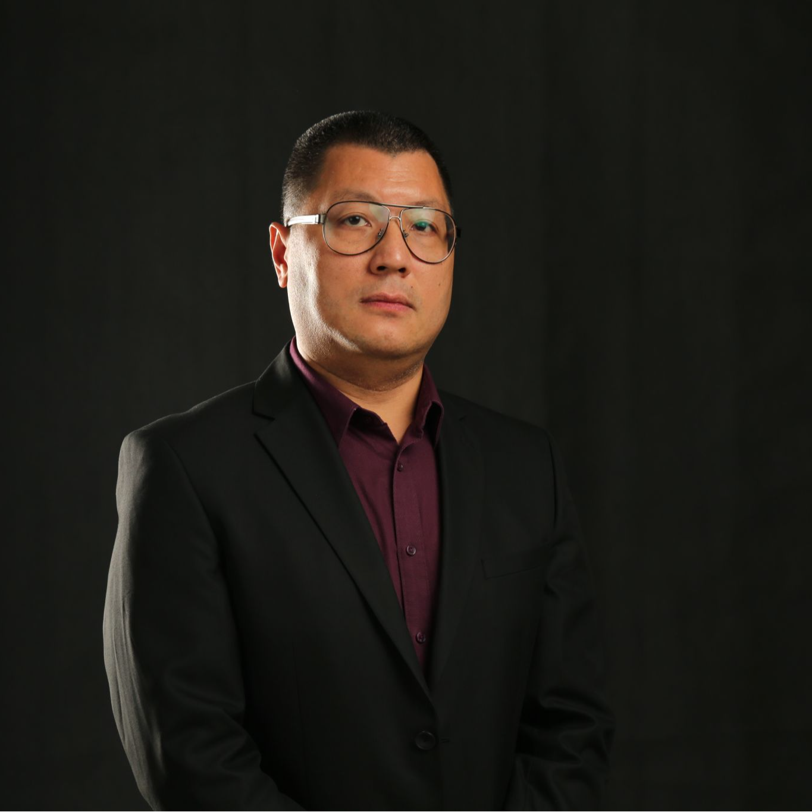

# Raymond Shu Tak Lee




[uic.edu](https://staff.uic.edu.cn/raymondshtlee/en)
[bnbu.edu](https://www.bnbu.edu.cn/en/info/1075/12798.htm)
[linkedin](https://hk.linkedin.com/in/dr-raymond-lee-690389151)

```bibtex
@misc{lee_uic_profile,
  author       = {Lee, Raymond S. T.},
  title        = {Dr. Raymond Shu Tak Lee - Associate Professor Profile},
  howpublished = {\url{https://staff.uic.edu.cn/raymondshtlee/en}},
  institution  = {United International College (UIC)},
  year         = {2026},
  note         = {Accessed: 2026-06-01. Research areas: Artificial Intelligence, Quantum Finance, Chaotic Neural Networks.}
}
@misc{lee_bnbu_profile,
  author       = {Lee, Raymond S. T.},
  title        = {Dr. Raymond S. T. Lee - Faculty Profile},
  howpublished = {\url{https://www.bnbu.edu.cn/en/info/1075/12798.htm}},
  institution  = {Beijing Normal-Hong Kong Baptist University (BNBU)},
  year         = {2026},
  note         = {Accessed: 2026-06-01. Position: Associate Professor, Division of Science and Technology. Research: Quantum Finance, AI-based Fintech, Chaotic Neural Networks.}
}
@misc{lee_linkedin_profile,
  author       = {Lee, Raymond S. T.},
  title        = {Dr. Raymond Shu Tak Lee - LinkedIn Profile},
  howpublished = {\url{https://hk.linkedin.com/in/dr-raymond-lee-690389151}},
  institution  = {LinkedIn},
  year         = {2026},
  note         = {Accessed: 2026-06-01. Position: Associate Professor at United International College (UIC). Research: AI, Quantum Finance, Fintech.}
}
```
