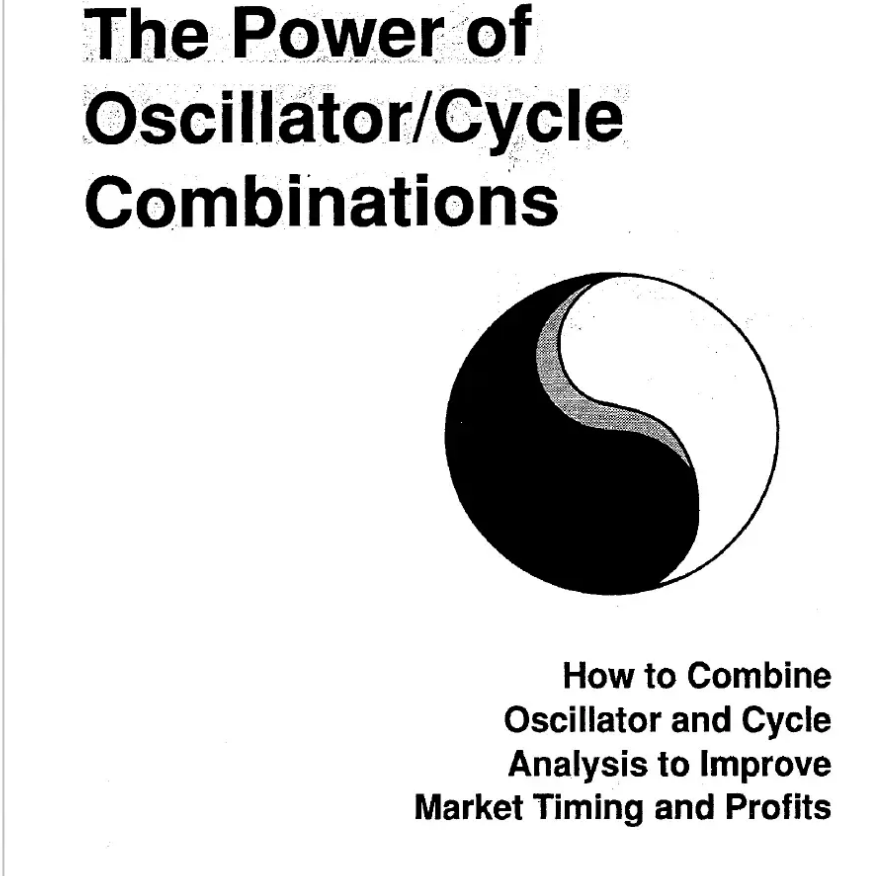
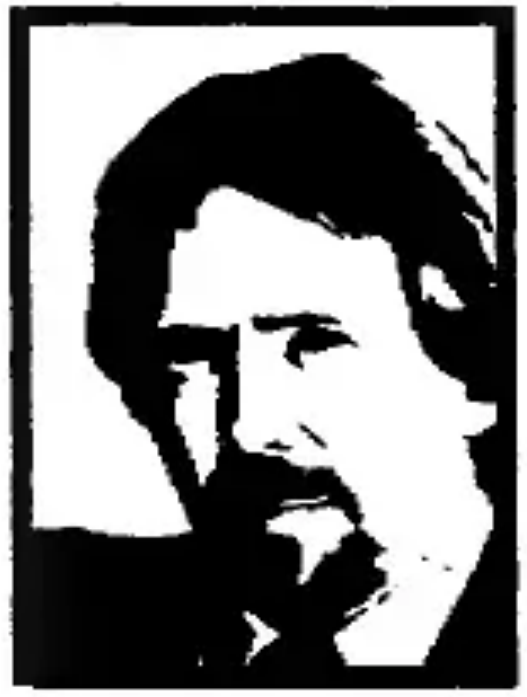

# The Power of Oscillator/Cycle Combinations

**How to Combine Oscillator and Cycle Analysis to Improve Market Timing and Profits**

By Walter Bressert

---

## Preface

The Power of Oscillator/Cycle Combinations outlines techniques to improve your timing for the buying and selling of stock indices, bonds, precious metals and agricultural commodities. Although examples are not given, Oscillator/Cycle Combinations can also be used for individual stocks and mutual funds.

Markets rise and fall in cycles, and oscillators help pinpoint the tops and bottoms of cycles. There is no one oscillator that will always work in a single market, nor an oscillator that will work in all markets or in all time dimensions. Such an oscillator does not exist in the dynamic world in which we live.

A group of oscillators, combined with the timing of cycles, will allow cycle highs and lows of most markets to be identified as they are occurring or shortly thereafter. Once a cycle high or low has been identified, time and price objectives can be established for both longer-term and shorter-term highs and lows.

The techniques and oscillators presented in this book will identify tops and bottoms of the markets as they are occurring -- not every top or bottom, but many of them. Oscillator/Cycle Combinations will allow you to enter and exit the markets when the odds are in your favor.

Whatever your profitability, it should greatly increase with the application of the principles outlined in this book.

Walter Bressert
January 1991

---

## Copyright

THE POWER OF OSCILLATOR/CYCLE COMBINATIONS: How to Combine Oscillator and Cycle Analysis to Improve Market Timing and Profits in the Futures Markets.

Published by Bressert Marketing Group, LLC, 135 South La Salle Street, Suite 2006, Chicago IL 60603

Copyright © 1991 Walter Bressert

All rights reserved. Reproduction or use of the text or pictorial content in any manner without written permission is prohibited.

While commodity trading has the potential for large profits, it also has the potential for large losses. To trade futures, you must be aware of the risks and be willing to accept them.

---

## Table of Contents

### Chapter One -- Focus on Cycles

THE USE OF CYCLES TO IDENTIFY TOPS AND BOTTOMS.

The Nature of Cycles...Basic Cyclic Concepts...Cyclic Interaction of Longer-Term and Shorter-Term Cycles in Bull and Bear Markets...Cyclic Time Periods...Measuring Cycles with 70% Timing Bands...Plotting Cycles on a Price Bar Chart...Trading Cycle and Primary Cycle Timing Bands on Daily Gold Chart.

### Chapter Two -- Technical Tools with Cycles

COMBINING TECHNICAL TOOLS WITH CYCLES TO ESTABLISH TIME AND PRICE OBJECTIVES.

Mid-Cycle Pause Price Objectives...60-40% Retracements...Speed Resistance Lines...Cyclic Support/Resistance Lines.

### Chapter Three -- Focus on Oscillators

CYCLIC HIGHS AND LOWS IDENTIFIED WITH OSCILLATORS.

Oscillators Defined...How to Research Oscillators...Seven Techniques to Enhance Oscillator Performance...Oscillator/Cycle Combinations.

### Chapter Four -- Detrending

THE PAST IS THE KEY TO THE FUTURE.

The Detrending Process...Using Detrending to Identify Cycles in the S&P Index, Gold, Swiss Franc, T-Bonds and Soybeans.

### Chapter Five -- The Detrend as an Oscillator

REAL-TIME DETRENDING FOR CURRENT-TIME MARKET ANALYSIS.

Centered, Real-Time and Half-Span Detrends compared and illustrated...Detrends that identify cycles in the S&P Index...Use of Detrends and Levels to identify Cycle Tops and Bottoms.

### Chapter Six -- Detrending Oscillators

DETRENDING OSCILLATORS IMPROVES IDENTIFICATION OF TOPS AND BOTTOMS.

Detrending the MACD...Use of the Moving Average of the Crossover...Setup and Entry Combinations to Identify Tops and Bottoms...The Kiss Pattern...3-10 Average with Detrend.

### Chapter Seven -- 3-Dimensional Analysis

IDENTIFY LONG-TERM, INTERMEDIATE-TERM, AND SHORT-TERM CYCLES.

3-D Analysis as an Aid in Determining the Trend and Identifying Tops and Bottoms...Use of Fibonacci Levels and Buy/Sell Lines to Gauge Oscillator Performance.

### Chapter Eight -- The Primary Cycle in Gold

FINE-TUNING CYCLICAL AND OSCILLATOR ANALYSIS IN GOLD.

Primary Cycle Table Showing Cyclical Characteristics of Gold in Bull and Bear Markets...Setup and Trigger Entry Patterns...The Oversold Pattern...The Kiss Pattern...The Hook Pattern...Setting Up a Pattern Research Table to Evaluate Patterns...Weekly Gold Chart with Primary Cycles in Bull/Bear Markets.

### Chapter Nine -- The MACD

GUIDELINES FOR USING THE MACD TO CREATE MECHANICAL ENTRY SIGNALS.

Use of the MACD with Primary Cycles and a Crossover to Identify Tops and Bottoms...Preliminary Research Table for Evaluation of Setup and Trigger Entry Patterns.

### Chapter Ten -- Relative Strength Index (RSI)

HIGH PROBABILITY INDICATOR OF CYCLE HIGHS AND LOWS.

Use of Buy and Sell Lines...Smoothing the RSI to Increase Accuracy...Timing Bands Improve Performance...Fibonacci Time Periods Used to Identify Highs and Lows.

### Chapter Eleven -- Commodity Channel Index (CCI)

IMPROVE THE CCI WITH VARIOUS COMBINATIONS OF SMOOTHING, CROSSOVERS, BUY/SELL LINES, AND SETUP/TRIGGER ENTRIES.

The CCI Confirms Every 4-Year Cycle Bottom in the S&P Index...Seasonal Highs and Lows of Soybean Oil Identified...4-Week Trading Cycle Bottoms in T-Bonds Confirmed with 90% Accuracy.

### Chapter Twelve -- The Stochastic

STOCHASTICS SHOULD BE PART OF ANY OSCILLATOR COMBINATION FOR IDENTIFICATION OF CYCLIC HIGHS AND LOWS.

Weekly Stochastic with Buy Line Identifies Primary Cycle Lows in T-Bonds...Daily Stochastics with Buy and Sell Lines are Good Indicators of Both Highs and Lows of the T-Bond Trading Cycle...Seasonal Highs and Lows in Soybeans are Identified by the Stochastics.

### Chapter Thirteen -- The 3-10 Oscillator

THE TWO STEP SELL (TSS) AND SMALL BUMP SELL (SBS): TWO POWERHOUSE PATTERNS THAT GENERATE HIGH PROBABILITY SELL SIGNALS AND CONFIRM PRIMARY CYCLE TOPS.

Research Tables with 'Sorts' of Primary Cycle and Patterns with explanation of how to use these patterns.

### Chapter Fourteen -- Trading and Money Management

RULES AND GUIDELINES TO OPTIMIZE YOUR SUCCESS AS A FUTURES TRADER.

The 12 Cardinal Mistakes of Futures Trading and How to Overcome Them...Controlled Risk Money Management...Entering and Exiting the Markets Like a Professional.

### Appendix

OSCILLATOR CALCULATIONS -- CCI...MACD...Moving Average...Exponential Moving Average...RSI...Stochastic.

ADDITIONAL INFORMATION ON CYCLES -- Workshops...Foundation for the Study of Cycles...HALCO Chart Service.

PRICE DATA DISKETTE -- Historical data for charts in book.

---

## About the Author

**Walter Bressert** is acknowledged as the man who brought cycle analysis to the futures markets in his original newsletter *HAL Commodity Cycles*. Published 1974 to 1985, it was profitable 10 of 12 years and rated #1 in Bull markets by *Futures* magazine.

Walter retired in 1985, and in 1991 published *"The Power of Oscillator/Cycle Combination"*. It is the only published work available today that shows how to sell tops and buy bottoms by combining oscillators with the timing of cycle analysis, and has sold thousands of copies.

From 1991 through 1995, he published the *CycleWatch* newsletter, which forecast time and price moves weeks and months into the future in the S&P Index, Bonds, Precious Metals, Currencies and the agricultural markets. *CycleWatch* was available as a daily fax-on-demand, and via DBC Signal, FutureLink, and DTN. Walter currently broadcasts an S&P/Bond commentary with intra-day charts and trading recommendations updated 4 times a day on the Internet and America-on-Line. His pre-opening comments are featured on the *Futures* magazine AllStar Advisor's Hotline.

Most recently Walter has developed *CycleTrader* software designed to identify and trade any market in any time-frame with mechanical buy/sell signals. *CycleTrader* is simply the most powerful cycle software program available for buying bottoms and selling tops. High probability, intra-day trading with CycleTrader is the focus of several 3-day CycleTrader trading intensives held each year. He also publishes a 9-lesson, hands-on, home study course on trading with cycles.

Walter currently manages hedge accounts in the S&P Index to provide "insurance" for stock portfolios against sizeable down moves, and also offers management for futures accounts (minimum $500,000).

He was one of the original founders of CompuTrac before it was purchased by Telerate/Dow Jones, and is a long-standing director of the non-profit Foundation for the Study of Cycles. He has lectured internationally for twenty-five years and written articles for the Wall Street Journal, Barron's, *Futures* magazine and the *Commodity Research Bureau Yearbook*. He was a contributing editor to the Financial News Network and appears on CNBC from time-to-time.
