# Chapter One: FOCUS ON CYCLES

## The Nature of Cycles

Everything in nature moves in cycles...our solar system moves in a cycle around the center of the Milky Way galaxy...the planets move in precise and predictable cycles around the sun...the cycle of the tilt of the earth causes the cycle of the seasons...the rotation of the earth produces the cycle of night and day...the full moon occurs with predictable regularity as do the rise and fall of the tides. Each year geese migrate, animals hibernate, and salmon swim upstream to spawn, to mention just a few of the Seasonal Cycles with which we are familiar.

Other cycles are such an intimate part of our daily life that it may be hard to think of them as cycles. The cycle of sleep is experienced by most of us every 16 hours or so. Both men and women experience a monthly cycle of emotional highs and lows. The cycle of a heartbeat is as regular as clockwork until disturbed by exercise or an emotional experience such as a margin call. These are all cycles we can understand and accept because we have an understanding of the underlying cause of these cycles.

Many other cycles affect our lives for which we do not know the cause. The non-profit Foundation for the Study of Cycles has been isolating and studying cycles since the 1930's, and has documented over three thousand cycles in weather, war, sunspots, drought, marriage, animal populations, inflation, bank failures, real estate, manufacturing, steel production, and stock prices, to name only a few. Of more immediate interest are cycles in the price of gold, silver, copper, the S&P index, interest rates, currencies, soybeans, corn, cattle, sugar and other agricultural and financial markets.

Knowing that cycles affect market prices is of little more than a passing interest for a market analyst and trader unless the cycles can be used to identify tops and bottoms of price movement, and to also give indications of future price activity in both time and price. Herein lies the challenge presented to the cycle analyst.

It is fundamentals that move the markets, but you have probably noticed that the fundamental picture is the most bullish at tops and the most bearish at bottoms. Cycle analysis of the futures markets assumes that at any point in time, the then current fundamental information available is relative only to the current price structure, and that fundamental events will occur to move prices in the direction of the cycle. Such an event may be a government report that greatly changes the supply or demand picture; money supply figures; utterances of Federal Reserve officials; foreign purchases; crop failure or freeze in any part of the world; war or the threat of war; unexpected political action such as embargoes, tariffs, or price controls which can change either the supply or demand picture. These and many other unforeseen factors can alter the prospects for the future. Cycle analysis does not pretend to forecast what will happen in the future, just that some event will occur to move prices in the direction of the cycle.

Unfortunately for the market analyst and trader, cycles can contract, expand and even skip a beat now and then. The use of Oscillator/Cycle Combinations are powerful tools that often allow for early identification of cycle highs and lows. Once a high/low has been identified, the component parts of the cycle are used to set up time expectations for the next high or low. Cycle analysis is an art that can be readily learned through the application of the principles outlined in this book. Despite its limitations, cyclical analysis is the one approach that can provide relatively accurate time and price projections weeks, months, and even years into the future.

## Basic Cyclic Concepts

### CYCLES IN PRICES

Success in the futures markets requires adhering to the old adage of "trade with the trend." If the trend is up, buy the dips; if the trend is down, sell the rallies. What the trend was is relatively easy to see on a chart; what the trend will be is often another question. Foreknowledge of the trend, or of a trend reversal, is every commodity trader's dream.

The use of cycles is one of the most powerful analytical tools for identifying trends and trend reversals. Once a cycle has bottomed, the trend will be up until the cycle tops; once the cycle has topped the trend will be down until the cycle bottoms. How long the trend will be up or down depends upon the length of the cycle.

Each market has an individual cycle profile which consists of several dominant cycles that visibly and measurably affect prices. Once these dominant cycles have been identified, future price expectations can be established and tops and bottoms identified as they occur. Therefore, the basic principle in cycle analysis is to identify the longest dominant cycle affecting price activity, and then to work down, cycle-by-cycle, to the smallest dominant cycle you wish to trade. When the dominant long-term cycles have been determined, they will provide an overview of expected price movement and trend.

Then weekly and daily short-term cycles can be used to determine when to enter and exit the markets, as well as to confirm tops and bottoms of the longer-term cycles.

Most markets have several dominant cycles, each with a trough and a crest, affecting price activity, any one of which can be isolated and measured. The length of the cycle is usually measured from trough-to-trough (low-to-low).

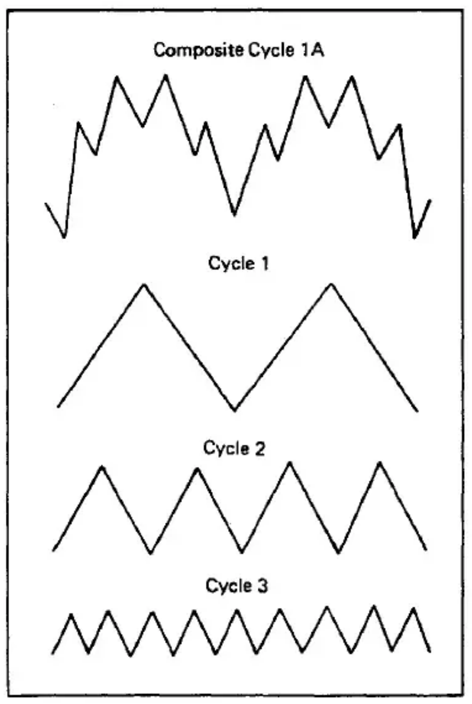
**Example 1-1: Composite Cycle**

In this simplified example, 3 cycles have been combined to form the Composite Cycle 1A.

Notice how the larger cycle (Cycle 1) seems to lose its actual crests to a combination of Cycles 2 and 3. This interaction allows the development of guidelines to analyze and trade the markets.

### DOMINANT CYCLES

Oscillator/cycle analysis involves the isolation and use of 4 dominant cycles (refer to Example 1-2).

1) Long-term **DOMINANT CYCLES** are longer than one year in length, and establish the longer-term trends of the markets. Long-term cycles for most markets range from 2 to 11 years.

2) The **SEASONAL CYCLE** is the yearly cycle that tends to have highs and lows occur at approximately the same time periods of the year. It is a very distinct cycle in agricultural markets and shows up as Seasonal tendencies in most other markets, including metals and the financials. Seasonal Cycles follow reliable patterns, and their highs and lows can be anticipated with an unusually high degree of accuracy.

3) The **PRIMARY CYCLE** is the dominant weekly cycle shorter than one year. Each market has its own Primary Cycle, and the average cycle length ranges from 9 to 22 weeks.

   A few markets have a smaller sub-cycle called the 1/2 Primary Cycle which averages one-half the length of the Primary Cycle. The Primary Cycle and 1/2 Primary Cycle will normally top and bottom with a concurrent Trading Cycle (see dotted lines in Example 1-2).

4) The **TRADING CYCLE** is usually measured in days. This cycle is used to enter and exit the market for short-term trades. Most Trading Cycle lengths are from 3 to 5 weeks in the agricultures and metals; the financials tend to have Trading Cycles of approximately 8 weeks. Within the Trading Cycle are two smaller sub-cycles, each normally one-half the length of the longer Trading Cycle. The Trading Cycle does not have its own crest. It will always crest at the same time as one of the shorter sub-cycles called the Alpha Cycle, and the Beta Cycle.

The **ALPHA CYCLE** is the first smaller cycle within the Trading Cycle. The Trading Cycle will always begin with a new Alpha Cycle.

The **BETA CYCLE** is the second smaller cycle within the Trading Cycle, and begins when the Alpha Cycle bottoms. The Beta Cycle will always bottom when the Trading Cycle bottoms (see dotted lines in Example 1-2).

An important characteristic of the Trading Cycle is its relationship with the next longer dominant cycle, usually the Primary Cycle, but on occasion, the 1/2 Primary Cycle. If this next longer cycle is moving up, the Trading Cycle tends to crest with the Beta Cycle Crest. If the Primary Cycle is moving down, then the Trading Cycle will tend to crest with the Alpha Cycle Crest.

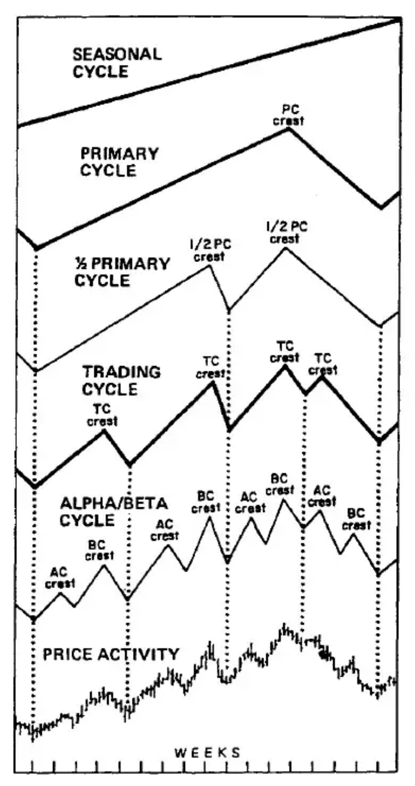
**Example 1-2: Dominant Cycles Hierarchy**

### RIGHT AND LEFT TRANSLATION

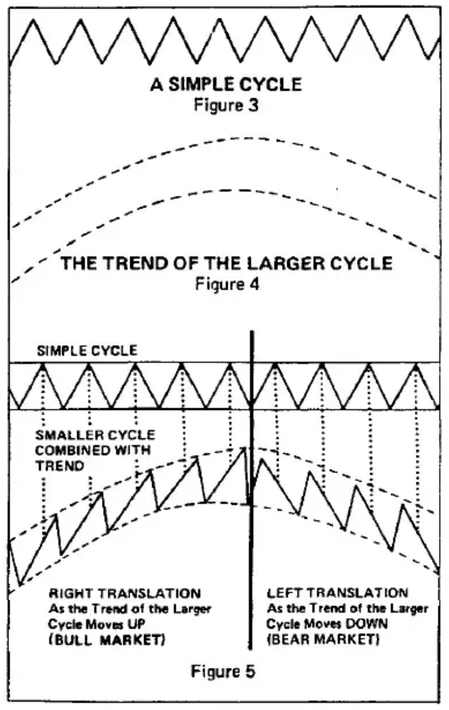
**Figures 3, 4, and 5: Right and Left Translation**

Dominant Cycles of different lengths interact in a predictable manner as each cycle is affected by the next larger cycle.

The simple cycle in Fig. 3 moves up and down from crest-to-trough, and trough-to-crest in a predictable rhythm with each high equidistant to the lows. When combined with a larger cycle this rhythm changes, but in a predictable and consistent manner.

In Fig. 4, the trend of the larger cycle is represented by the parallel dashed lines. Fig. 5 illustrates Right and Left Translation. As the market rises to the top of the larger cycle, the tops, or crests, of the smaller cycles shift to the right, exhibiting a cyclical characteristic called Right Translation (see dotted lines in Fig. 5). Also, the bottoms, or troughs, of the smaller cycle are above the previous troughs, and the crests are above the previous crests.

When the larger cycle is moving down, the crests of the smaller cycles shift to the left exhibiting Left Translation. Also, each trough is below the previous trough, and each crest is below the previous crest.

The following cyclic concepts can be applied to any two dominant cycles, one being longer than the other:

1) **Right Translation**--Higher crests and higher troughs tend to occur in a rising market as the next longer dominant cycle is moving up...as the trend is up.

2) **Left Translation**--Lower troughs and lower crests tend to occur in a falling market as the next longer dominant cycle is moving down...as the trend is down.

3) Each longer cycle determines the trend for the next shorter cycle.

4) If the direction of the longer cycle is known, then the trend is known for the shorter cycle.

The old adage---

> Trade with the trend--If the trend is up, buy the dips; if the trend is down, sell the rallies.

can be restated---

> If the longer-term cycle is moving up, buy the troughs of the shorter cycle; if the longer-term cycle is moving down, sell the crests of the shorter cycle.

## LONG-TERM CYCLES

When I first began trading the markets, I was interested in holding a position for several days and my long term perspective was about 3 weeks. Over the years this perspective has lengthened, and I now start my analysis of a market with a review of the cycles 2 to 11 years long. The position of a market relative to the longer-term cycle will often have an effect upon the Seasonal Cycle and Primary Cycle.

These long-term cycles account for the major highs and lows on all commodity charts, both agricultural and financial. The BIG moves up and down usually occur around the highs and lows of these cycles. Also, the long-term cycles set the trend for the next shorter Seasonal Cycle, which will act differently if the trend is up than if the trend is down. Listed on the following page are the long-term cycles for each of the markets.

| Market | Long-Term Cycle |
|--------|----------------|
| Stock Market | 4-Year Cycle |
| Bond Yields and Interest Rates | 4-Year Cycle |
| Wholesale Commodity Prices and the CRB Index | 3-Year and 9-11 Year Cycle |
| Currencies | 4-Year Cycle |
| Gold | 5 1/2-Year and 9-1/4 Year Cycle |
| Silver | 5 1/2-Year and 9 1/4-Year Cycle |
| Copper | 5-Year Cycle |
| Soybean Complex | 24-Month and 39-Month Cycle |
| Wheat | 4 1/2-Year and 9-Year Cycles |
| Corn | 3-Year and 9-11-Year Cycles |
| Cattle | 3 3/4-Year and 7 1/2-Year Cycles |
| Hogs | 3-Year and 9-Year Cycles |
| Pork Bellies | 3-Year and 9-Year Cycles |
| Cotton | 3-Year and 6-Year Cycles |
| Sugar | 7-Year Cycle |
| Cocoa | 3-Year Cycle |
| Coffee | 3-Year Cycle |
| Crude Oil | 6-Year Cycle |

## SEASONAL CYCLES

The long-term cycles always top and bottom with a Seasonal Cycle, and the Seasonal Cycle sets the trend for a large part of the year. For example, in a bull move out of a Seasonal low, a rise of 7 months or more is not uncommon. The trend, then, would be up for seven months. Conversely, in a bear move, the Seasonal can move down for 7 months or more from the Seasonal high, so identification of the Seasonal high would set an expectation for a prolonged bear market.

Seasonal Cycles are easy to accept in the agricultural markets because we know the cause. Generally, it is harvest which sets the lows, and prices move higher throughout the year until the next harvest with variations based on increases or decreases in demand, supply and expectations. But there are also Seasonal tendencies that show up in the metals, the stock market, interest rate markets, and currencies that are not as consistent as the agricultural markets.

Seasonal tendencies mean that a market will tend to top and bottom at certain times of the year, or in some cases have a fast market at certain times of the year.

My approach is to isolate the time periods in which Seasonal highs and lows have occurred 70% or more of the time, and call this the basic Seasonal Cycle. The time periods for the highs and lows of markets with distinct Seasonal Cycles are on the following page. Below them are listed the markets with Seasonal tendencies.

### Seasonal Cycles

| Market | Lows | Highs |
|--------|------|-------|
| Soybeans | June-October | April-July |
| Soybean Meal | February-March, or August-November | March-August, or December |
| Soybean Oil | January-April, or August-November | March-May, or July-November |
| Wheat | April-August | November-February |
| Corn | August-December | April-September |
| Cattle | June-October | March-August |
| Hogs | August-December | May-August |
| Pork Bellies | June-August, or January-March | February-May, or September-October |
| Cotton | December-March, or June-August | June-October |
| Sugar | June-September | March-July, or October-December |
| Cocoa | May-October | May-September |
| Coffee | April-October | January-June |
| Copper | July-November | March-May |
| Crude Oil | October-February | April-August |

### Seasonal Tendencies

- **S&P Index** - Lows tend to be made September through November, or February/March. Highs tend to be made August through October or April.
- **Interest Rates** - Lows tend to occur in the first or third quarter; highs tend to occur in the third or fourth quarter.
- **Precious Metals** - In bull markets, tendency to top in first quarter, and bottom in second quarter. In bear markets, tendency to bottom in third quarter and top in third or fourth quarter.
- **Currencies** - Lows tend to occur May-September; highs tend to occur November-April.

## THE PRIMARY CYCLE

The most consistent aspect of the markets is time, and the Timing Bands for the Primary Cycle tops and bottoms indicate when to look for specific patterns in Oscillators that will indicate a cycle top or bottom, or a high probability trade.

These Primary Cycles are of two types. The first is a simple up/down move similar to Example 1-3. There are only 3 measurable components:

1. trough to trough (T-T)
2. trough to crest (T-C)
3. crest to trough (C-T)

**Examples 1-3**

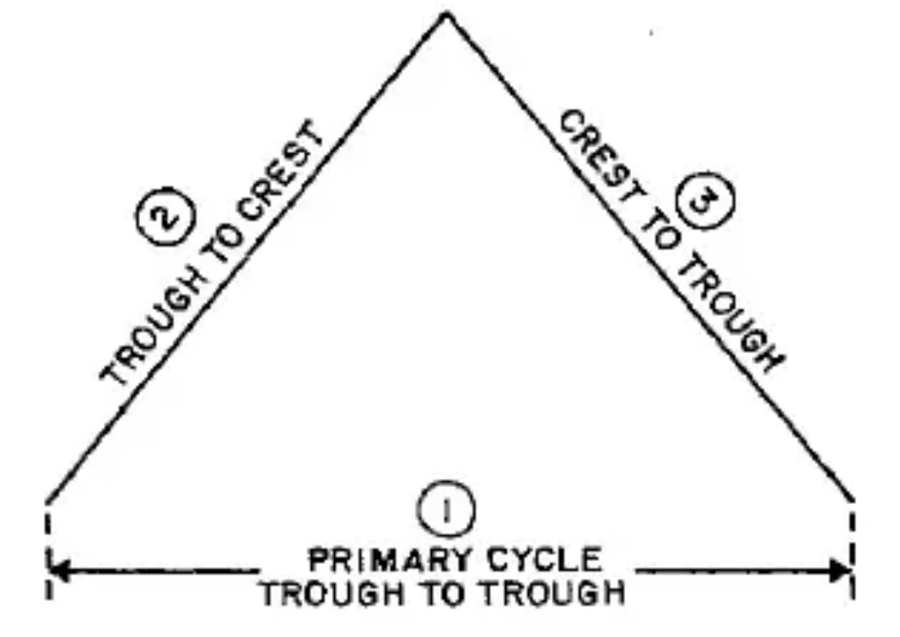

The second type, shown in Example 1-4, is more complex because it has within it a smaller cycle called the 1/2 Primary Cycle that causes the Primary Cycle to have two tops and an intervening low between Primary Cycle bottoms. The price moves of this 1/2 Primary Cycle are not always large, nor do they occur in every cycle. But the interaction of these cycles produce 7 measurable components:

1. PC T-T
2. First 1/2 PC T-T
3. First 1/2 PC T-C
4. First 1/2 PC C-T
5. Second 1/2 PC T-T
6. Second 1/2 PC T-C
7. Second 1/2 PC C-T

**Examples 1-4**

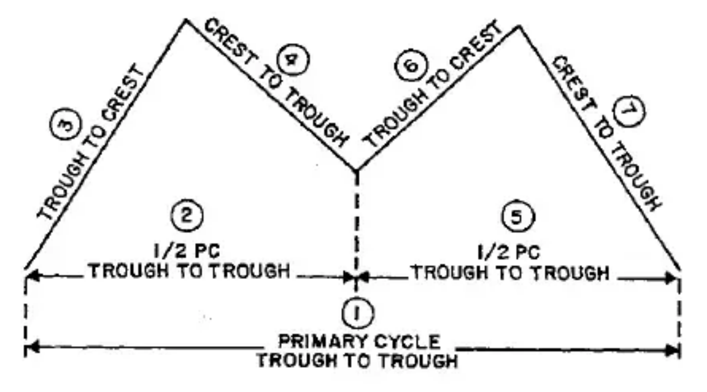

### CYCLIC COMPONENTS OF THE PRIMARY CYCLE

These components have been measured for each Primary Cycle. To eliminate unpredictable extremes and to narrow the time periods for future projections, only the middle 70% of the total samples measured are used for each cyclic component. These measurements are called 70% Cycle Timing Bands. Seven times out of 10, a cyclic component will top or bottom within a 70% Cycle Timing Band. Approximately 20% will occur before the Band, and 10% will occur after the Band.

#### PRIMARY CYCLE TIMING BANDS (Weeks)

| Commodity | PC T-T Avg | PC T-T Band | 1/2 PC T-T Avg | 1/2 PC T-T Band | 1/2 PC T-C Avg | 1/2 PC T-C Band | 1/2 PC C-T Avg | 1/2 PC C-T Band |
|-----------|-----------|-------------|----------------|-----------------|----------------|-----------------|----------------|-----------------|
| S&P INDEX | 22 | 16-25 | 10 | 6-14 | 5 | 2-10 | 5 | 1-9 |
| EURODLRS | 21 | 18-25 | 10 | 7-14 | 5 | 2-10 | 5 | 2-8 |
| T-BONDS (1) | 21 | 16-28 | 10 | 7-15 | 5 | 2-10 | 5 | 2-8 |
| CRUDE OIL | 25 | 15-35 | -- | -- | -- | -- | -- | -- |
| SWISS F (2) | 22 | 19-28 | 8 | 6-11 | 4 | 1-6 | 3 | 2-6 |
| D MARK (2) | 30 | 25-44 | 9 | 6-10 | 7 | 4-8 | 3 | 1-6 |
| J YEN (2) | 31 | 26-44 | 8 | 6-13 | 4 | 1-6 | 4 | 2-7 |
| BRIT P (2) | 26 | 18-35 | 7 | 6-11 | 4 | 2-7 | 3 | 1-5 |
| GOLD (3) | 18 | 16-23 | 10 | 9-12 | 8 | 6-10 | 2 | 1-6 |
| SILVER | 19 | 16-22 | 10 | 7-13 | 5 | 3-7 | 5 | 3-7 |
| COPPER | 15 | 9-18 | -- | -- | 7 | 5-12 | 7 | 2-11 |
| SOYBEANS | 14 | 11-20 | -- | -- | 5 | 2-12 | 7 | 3-12 |
| S MEAL | 16 | 15-21 | 9 | 6-11 | 5 | 2-8 | 4 | 2-7 |
| S OIL | 19 | 14-21 | 8 | 6-12 | 4 | 2-7 | 4 | 2-7 |
| WHEAT | 18 | 14-22 | -- | -- | 9 | 2-13 | 9 | 2-10 |
| CORN | 20 | 17-27 | 10 | 8-14 | 5 | 4-8 | 5 | 3-8 |
| L CATTLE | 8 | 4-13 | -- | -- | 5 | 1-9 | 4 | 1-7 |
| L HOGS | 11 | 9-14 | -- | -- | 4 | 3-8 | 6 | 3-8 |
| BELLIES | 16 | 12-20 | 8 | 5-11 | 4 | 2-7 | 3 | 1-6 |
| COTTON | 22 | 16-27 | 11 | 9-13 | 9 | 5-11 | 7 | 3-10 |
| SUGAR | 15 | 12-20 | -- | -- | 7 | 2-14 | 7 | 2-14 |
| COCOA | 17 | 14-25 | -- | -- | 7 | 4-14 | 8 | 2-18 |
| COFFEE | 15 | 12-22 | -- | -- | 9 | 4-14 | 7 | 2-12 |

Notes:
1. T-Bonds have 2 interactive Primary Cycles.
2. These markets do not have a 1/2 Primary Cycle. The Timing Bands for the 8-Week Trading Cycle are shown under the 1/2 Primary Cycle.
3. Gold has different Timing Bands for the first and second 1/2 Primary Cycles.

One problem with these measurements is that they do not differentiate between bull and bear markets, and as a result the time periods can be very broad, especially the Timing Bands from low-to-high and high-to-low. As a general rule, in a bull market, or uptrend, the Trough-to-Crest Band should be from the average to the end of the Timing Band; the Crest-to-Trough Band should be from the beginning of the Timing Band to the average. In a bear market, or downtrend, the T-C Band should be from the beginning of the Timing Band to the average; the C-T Band should be from the average to the end of the Timing Band.

For example--In the S&P Index the 1/2 Primary Cycle Trough-to-Crest Band is 2-10 weeks with an average of 5. In bull markets use a Timing Band of 5-10 weeks, and in bear markets use a Timing Band of 2-5 weeks. The Crest-to-Trough Band is 1-9 weeks, with an average of 5. In bull markets use a Timing Band of 1-5 weeks, and in bear markets use a Timing Band of 5-9 weeks.

These Timing Bands can be plotted on a chart to visually see when to anticipate highs and lows. Cycle highs and lows can be expected to occur within the Timing Bands about 7 out of 10 occurrences. When the oscillators complete the Setup/Trigger patterns within the Timing Bands, a cycle high or low is usually in place.

The trough-to-trough, and trough-to-crest Timing Bands are counted from the low that begins the cycle. The crest-to-trough Timing Band is counted from the high of the cycle.

The Trading Cycle also has 7 similar components.

## THE SEVEN CYCLIC COMPONENTS OF THE TRADING CYCLE

The interplay between the Trading Cycle and the Alpha and Beta Cycles has 7 cyclic components that project time periods for cyclic crests and troughs to occur. Most markets will follow the Trading Cycle, Alpha Cycle/Beta Cycle pattern shown in Example 1-5.

1. Trading Cycle Trough to Trough
2. Alpha Cycle Trough to Trough
3. Beta Cycle Trough to Trough
4. Alpha Cycle Trough to Crest
5. Alpha Cycle Crest to Trough
6. Beta Cycle Trough to Crest
7. Beta Cycle Crest to Trough

**Example 1-5**

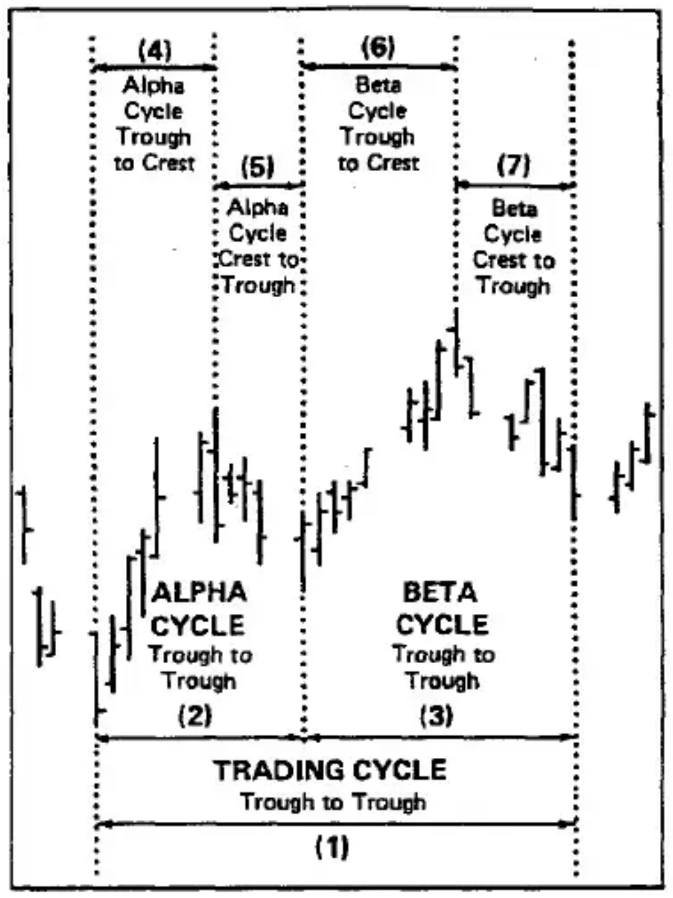

My personal preference is to use a calendar day count for the Trading Cycle and its components, and the bar chart examples that relate to the cycles are plotted on 7-day chart paper. Although the US markets are closed on weekends, the world does not stop making financial transactions over the weekend. Inter-bank currency transactions are made in various parts of the world, precious metals are bought and sold, business and government decisions are consummated. These and many other events that move markets continue to occur over weekends, as do many cycle highs and lows. These 'weekend' cycle highs and lows show up as Friday or Monday price highs or lows which are easily identified on 7-day charts. These charts also allow easy identification of the weekly ranges which are often used as Trigger entries.

However, when calculating oscillators, one can only use market days. So, there are 2 sets of components for the Trading Cycle in the Timing Band Tables that follow -- calendar days, which include weekends; and market days, which should be used for detrending and oscillator calculation, and can be plotted on regular 5-day chart paper.

### TIMING BANDS - Calendar Days

| | S&P INDEX | T-BONDS | EURO DLRS | CRUDE OIL | SWISS F (Weeks) |
|-----|-----------|---------|-----------|-----------|-----------------|
| | Avg / Band | Avg / Band | Avg / Band | Avg / Band | Avg / Band |
| T-T | 55 / 40-60 | 30 / 21-41 | -- / 41-53 | 25 / 18-32 | 8 / 6-11 |
| AT-T | 26 / 17-36 | -- / 14-22 | -- / -- | 13 / 8-13 | -- / -- |
| AT-C | 13 / 7-23 | 15 / 7-22 | -- / 3-14 | 8 / 4-12 | 4 / 1-6 |
| AC-T | 11 / 4-21 | 15 / 5-18 | -- / 3-13 | 4 / 2-7 | -- / 2-6 |
| BT-T | 25 / 18-35 | -- / 12-25 | -- / -- | 12 / 10-17 | -- / -- |
| BT-C | 9 / 4-20 | -- / 4-16 | -- / -- | 5 / 3-9 | -- / -- |
| BC-T | 13 / 7-21 | -- / 5-14 | -- / -- | 6 / 4-10 | -- / -- |

| | D MARK (Weeks) | J YEN (Weeks) | BRIT P (Weeks) | GOLD | SILVER |
|-----|----------------|---------------|----------------|------|--------|
| | Avg / Band | Avg / Band | Avg / Band | Avg / Band | Avg / Band |
| T-T | 9 / 6-10 | 8 / 6-13 | 7 / 6-11 | 21 / 18-28 | 35 / 28-43 |
| AT-T | -- / -- | -- / -- | -- / -- | 10 / 8-14 | 19 / 14-23 |
| AT-C | 7 / 4-9 | 4 / 1-6 | 4 / 2-7 | 7 / 4-10 | 10 / 7-15 |
| AC-T | 3 / 1-6 | 4 / 2-7 | 3 / 1-5 | 4 / 1-5 | 7 / 2-12 |
| BT-T | -- / -- | -- / -- | -- / -- | 11 / 7-14 | 18 / 12-21 |
| BT-C | -- / -- | -- / -- | -- / -- | 4 / 3-8 | 8 / 2-10 |
| BC-T | -- / -- | -- / -- | -- / -- | 6 / 3-9 | 11 / 5-14 |

| | COPPER | SOYBEANS | S MEAL | S OIL | WHEAT |
|-----|--------|----------|--------|-------|-------|
| | Avg / Band | Avg / Band | Avg / Band | Avg / Band | Avg / Band |
| T-T | 25 / 20-31 | 28 / 21-36 | 28 / 21-36 | 29 / 23-35 | 44 / 37-51 |
| AT-T | 13 / 8-13 | 14 / 10-18 | 14 / 10-18 | 14 / 10-18 | 24 / 18-37 |
| AT-C | 8 / 4-12 | 9 / 4-13 | 9 / 4-13 | 9 / 4-13 | 17 / 13-22 |
| AC-T | 4 / 2-7 | 4 / 1-8 | 4 / 1-8 | 4 / 1-8 | 7 / 5-12 |
| BT-T | 13 / 10-16 | 15 / 12-19 | 15 / 12-19 | 15 / 12-19 | 20 / 15-23 |
| BT-C | 5 / 3-9 | 6 / 3-10 | 6 / 3-10 | 6 / 3-10 | 10 / 4-16 |
| BC-T | 7 / 4-10 | 8 / 3-12 | 8 / 3-12 | 8 / 3-12 | 10 / 2-14 |

| | CORN | L CATTLE | L HOGS | PORK BELLIES | COTTON |
|-----|------|----------|--------|--------------|--------|
| | Avg / Band | Avg / Band | Avg / Band | Avg / Band | Avg / Band |
| T-T | 28 / 21-35 | 21 / 18-28 | 29 / 25-35 | 28 / 25-35 | 25 / 20-30 |
| AT-T | 14 / 9-17 | 11 / 9-14 | 15 / 12-19 | 14 / 11-19 | 13 / 8-16 |
| AT-C | 9 / 5-14 | 7 / 4-12 | 9 / 6-14 | 9 / 7-15 | 8 / 4-12 |
| AC-T | 4 / 1-6 | 4 / 1-7 | 6 / 3-8 | 4 / 2-8 | 3 / 1-6 |
| BT-T | 14 / 12-20 | 10 / 7-12 | 14 / 9-15 | 14 / 10-17 | 13 / 10-16 |
| BT-C | 6 / 4-10 | 4 / 2-6 | 6 / 3-9 | 5 / 2-8 | 4 / 3-10 |
| BC-T | 8 / 6-14 | 5 / 3-9 | 7 / 5-11 | 9 / 6-12 | 6 / 4-9 |

| | SUGAR | COCOA | COFFEE |
|-----|-------|-------|--------|
| | Avg / Band | Avg / Band | Avg / Band |
| T-T | 27 / 25-36 | 30 / 25-32 | 29 / 24-36 |
| AT-T | 15 / 14-19 | 15 / 13-19 | 15 / 13-19 |
| AT-C | 10 / 9-16 | -- / 4-12 | 9 / 3-13 |
| AC-T | -- / -- | 4 / 1-8 | 4 / 1-9 |
| BT-T | 12 / 9-19 | 14 / 12-17 | 14 / 9-19 |
| BT-C | -- / 2-8 | 6 / 3-10 | 6 / 2-10 |
| BC-T | 7 / 5-8 | 8 / 4-11 | 8 / 3-12 |

### TIMING BANDS - Market Days

| | S&P INDEX | T-BONDS | EURO DLRS | CRUDE OIL | SWISS F (Weeks) |
|-----|-----------|---------|-----------|-----------|-----------------|
| | Avg / Band | Avg / Band | Avg / Band | Avg / Band | Avg / Band |
| T-T | 39 / 29-43 | 21 / 15-30 | -- / 29-38 | 18 / 13-23 | 8 / 6-11 |
| AT-T | 19 / 12-26 | -- / 10-16 | -- / -- | 9 / 5-9 | -- / -- |
| AT-C | 9 / 5-16 | 11 / 5-16 | -- / 2-10 | 5 / 2-9 | 4 / 1-6 |
| AC-T | 8 / 3-15 | 11 / 3-17 | -- / 2-9 | 2 / 1-5 | 3 / 2-6 |
| BT-T | 18 / 13-25 | -- / 8-18 | -- / -- | 8 / 7-12 | -- / -- |
| BT-C | 6 / 3-14 | -- / 2-11 | -- / -- | 3 / 2-7 | -- / -- |
| BC-T | 9 / 5-15 | -- / 3-10 | -- / -- | 4 / 2-8 | -- / -- |

| | D MARK (Weeks) | J YEN (Weeks) | BRIT P (Weeks) | GOLD | SILVER |
|-----|----------------|---------------|----------------|------|--------|
| | Avg / Band | Avg / Band | Avg / Band | Avg / Band | Avg / Band |
| T-T | 9 / 6-10 | 8 / 6-13 | 7 / 6-11 | 15 / 12-20 | 25 / 20-30 |
| AT-T | -- / -- | -- / -- | -- / -- | 7 / 5-10 | 13 / 10-16 |
| AT-C | 7 / 4-9 | 4 / 1-6 | 4 / 2-7 | 5 / 2-7 | 7 / 5-11 |
| AC-T | 3 / 1-6 | 4 / 2-7 | 3 / 1-5 | 2 / 1-4 | 5 / 2-9 |
| BT-T | -- / -- | -- / -- | -- / -- | 8 / 5-10 | 13 / 8-15 |
| BT-C | -- / -- | -- / -- | -- / -- | 3 / 2-6 | 6 / 1-7 |
| BC-T | -- / -- | -- / -- | -- / -- | 4 / 2-7 | 8 / 3-10 |

| | COPPER | SOYBEANS | S MEAL | S OIL | WHEAT |
|-----|--------|----------|--------|-------|-------|
| | Avg / Band | Avg / Band | Avg / Band | Avg / Band | Avg / Band |
| T-T | 18 / 14-22 | 20 / 15-26 | 20 / 15-26 | 21 / 16-25 | 31 / 26-37 |
| AT-T | 9 / 6-11 | 10 / 7-13 | 10 / 7-13 | 10 / 7-13 | 17 / 12-20 |
| AT-C | 6 / 2-9 | 6 / 2-9 | 6 / 2-9 | 6 / 2-10 | 12 / 9-16 |
| AC-T | 3 / 1-5 | 3 / 1-6 | 3 / 1-6 | 3 / 1-6 | 5 / 3-9 |
| BT-T | 9 / 7-11 | 11 / 8-14 | 11 / 8-14 | 10 / 8-14 | 14 / 10-17 |
| BT-C | 3 / 2-6 | 4 / 2-7 | 4 / 2-7 | 4 / 2-8 | -- / 2-12 |
| BC-T | 5 / 3-7 | 6 / 2-9 | 6 / 2-9 | 6 / 2-9 | 7 / 1-10 |

| | CORN | L CATTLE | L HOGS | PORK BELLIES | COTTON |
|-----|------|----------|--------|--------------|--------|
| | Avg / Band | Avg / Band | Avg / Band | Avg / Band | Avg / Band |
| T-T | 20 / 15-25 | 15 / 12-20 | 21 / 17-25 | 20 / 17-25 | 18 / 14-22 |
| AT-T | 10 / 6-13 | 8 / 6-10 | 11 / 8-14 | 10 / 7-14 | 9 / 5-12 |
| AT-C | 6 / 3-10 | 5 / 2-9 | 7 / 4-10 | 7 / 5-11 | 6 / 2-9 |
| AC-T | 3 / 1-5 | 3 / 1-5 | 4 / 2-6 | 3 / 1-6 | 2 / 1-5 |
| BT-T | 10 / 8-15 | 7 / 5-9 | 10 / 6-11 | 10 / 7-13 | 10 / 7-12 |
| BT-C | 5 / 3-7 | 3 / 1-5 | 4 / 2-7 | 3 / 1-6 | 4 / 2-7 |
| BC-T | 6 / 4-10 | 4 / 2-7 | 5 / 3-8 | 7 / 4-9 | 5 / 2-7 |

| | SUGAR | COCOA | COFFEE |
|-----|-------|-------|--------|
| | Avg / Band | Avg / Band | Avg / Band |
| T-T | 19 / 17-26 | 21 / 17-23 | 20 / 17-26 |
| AT-T | 11 / 10-14 | 11 / 9-14 | 11 / 9-14 |
| AT-C | 7 / 6-12 | 6 / 2-9 | 7 / 3-10 |
| AC-T | 3 / 2-5 | 3 / 1-6 | 3 / 1-7 |
| BT-T | 9 / 5-14 | 10 / 8-13 | 10 / 6-14 |
| BT-C | 3 / 1-6 | 5 / 2-8 | 4 / 1-8 |
| BC-T | 5 / 3-6 | 6 / 2-8 | 6 / 2-9 |

## 7 STEPS TO PLOTTING THE TIMING BANDS

Each cyclic component has a special color, which differentiates the Timing Bands. This color code should be used when drawing the Timing Bands on your charts. The color code makes it possible to recognize cyclic patterns on your charts. It also enables you to tell at a glance where a market is within a cycle, and to compare previous cycles with current market activity.

### COLOR CODE

- **Red**--Trading Cycle Trough to Trough
- **Brown**--Alpha/Beta Cycle Trough to Trough
- **Green**--Alpha/Beta Cycle Trough to Crest
- **Orange**--Alpha/Beta Cycle Crest to Trough

### TIMING BANDS FOR OUR EXAMPLE

| Component | Avg | Band |
|-----------|-----|------|
| Trough-to-Trough | 28 | 21-36 |
| Alpha Trough-to-Trough | 14 | 10-18 |
| Alpha Trough-to-Crest | 9 | 4-13 |
| Alpha Crest-to-Trough | 4 | 1-8 |
| Beta Trough-to-Trough | 15 | 12-19 |
| Beta Trough-to-Crest | 6 | 3-10 |
| Beta Crest-to-Trough | 8 | 3-12 |

### STEP 1 - Trough-to-Trough of the Trading Cycle

To plot daily Timing Bands, you must determine when the last Trading Cycle low occurred for the market you wish to analyze. From any Trading Cycle low it is possible to anticipate the time period for the trough of the next Trading Cycle, and the trough of the Alpha Cycle. It is also possible to anticipate the next Alpha Cycle Crest with a 70% probability of being right.

Draw a red vertical line on the day of the last Trading Cycle Trough in the lower section of your chart. The red line now becomes 'Day Zero' for your count.

From Day Zero, count out horizontally 22-36 grids, or days, and with a red pencil draw a horizontal line on the chart connecting Day 22 up to and including Day 36.

Place a small vertical dash on Day 28 to show the average.

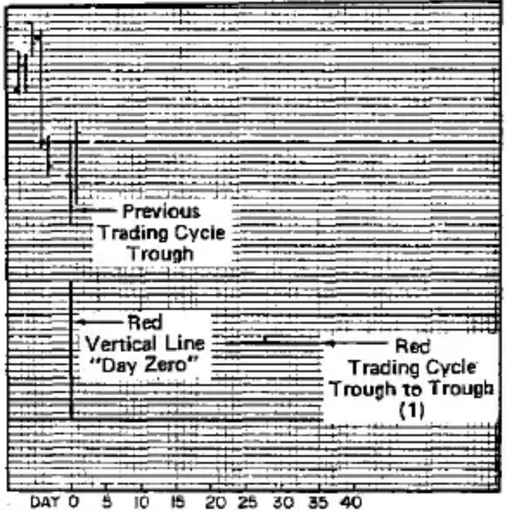

Seven times out of 10 in the past, the Trading Cycle has bottomed within this band. The time period may look large to you at this time, but as time marches on, and you put the other 6 bands on the chart, you will see how it is possible to make this time period much, much smaller.

### STEP 2 - Trough-to-Trough of the Alpha Cycle

The Trading Cycle and Alpha Cycle always begin together, so begin the Alpha Cycle count from the previous Trading Cycle Trough.

With the brown pencil, several vertical grids below the red Trading Cycle Band (1), draw in the trough-to-trough of the Alpha Cycle Band (2) from Day 10 up to and including Day 18.

Place a small vertical slash on Day 14 to show the average.

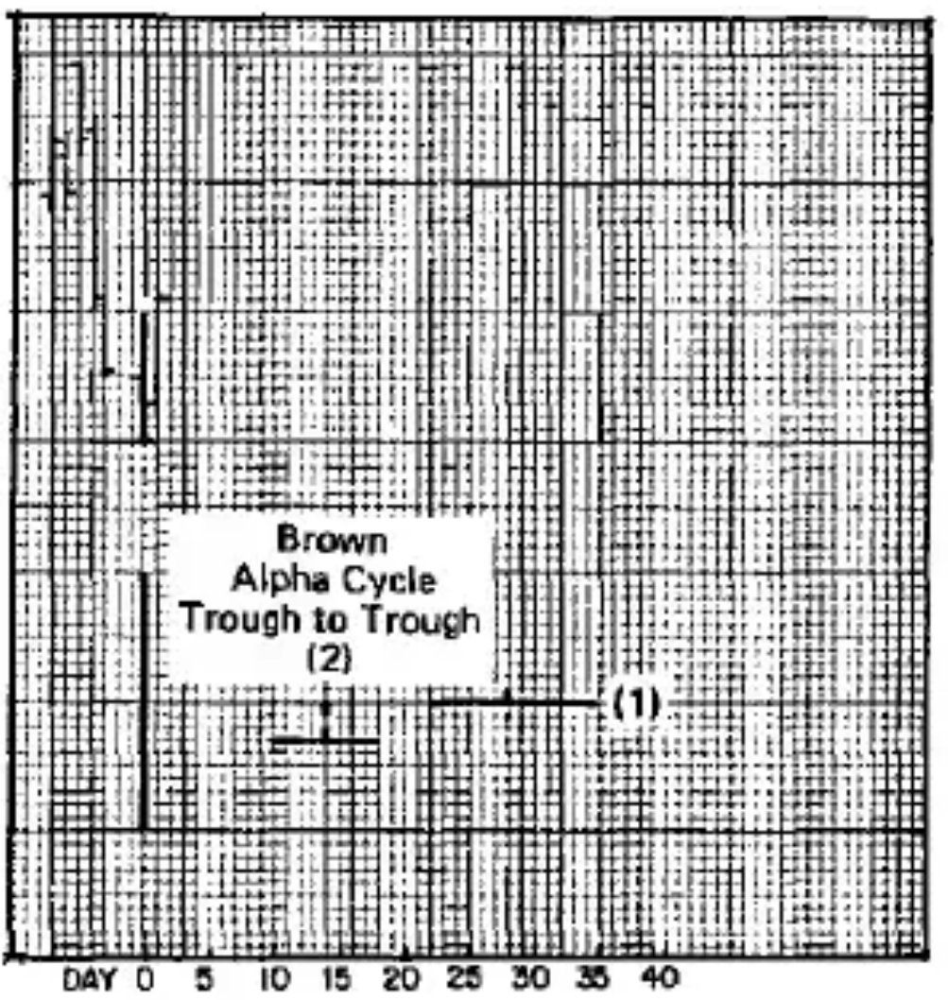

### STEP 3 - Trough-to-Crest of the Alpha Cycle

Once again, begin the count using the red vertical line, which represents the previous Trading Cycle Trough as Day Zero.

In green, about 6 to 8 vertical grids below the Alpha Cycle Trough to Trough Band (2), draw in the Trough to Crest Band of the Alpha Cycle from Day 4 to Day 13. 

Place a small vertical slash on Day 9 to show the average.

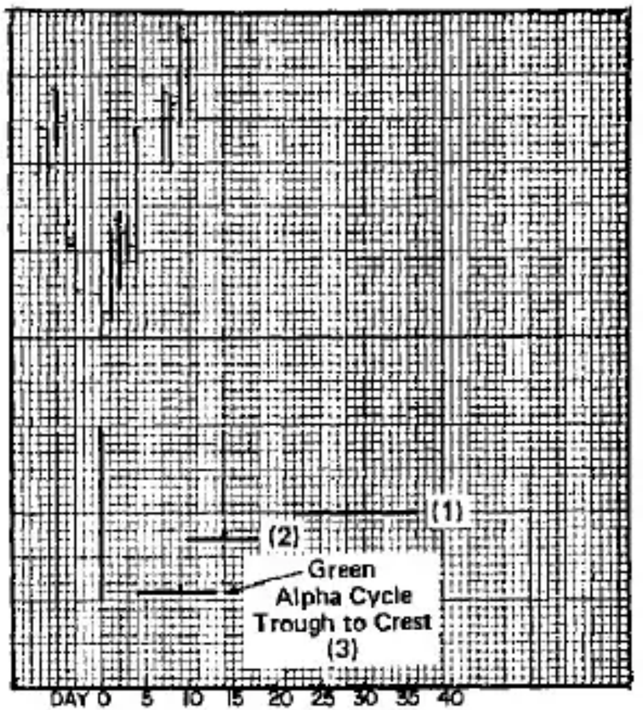

### STEP 4 - Crest-to-Trough of the Alpha Cycle

Because the Alpha Cycle Crest-to-Trough measurement begins with the Alpha Cycle Crest, it is necessary to wait until the Alpha Cycle Crest has occurred before charting the Crest-to-Trough Band (4).

Draw an orange vertical line through the green Alpha Cycle Trough-to-Crest Band (3), and extend this line up several grids to denote the Alpha Cycle Crest. This orange, vertical line now becomes Day Zero for the Alpha Cycle Crest-to-Trough Band.

With the Orange pencil, between Band 2 and 3, draw in the crest-to-trough of the Alpha Cycle Band from Day 1 up to and including Day 8.

Place a small vertical slash on Day 4 to show the average.

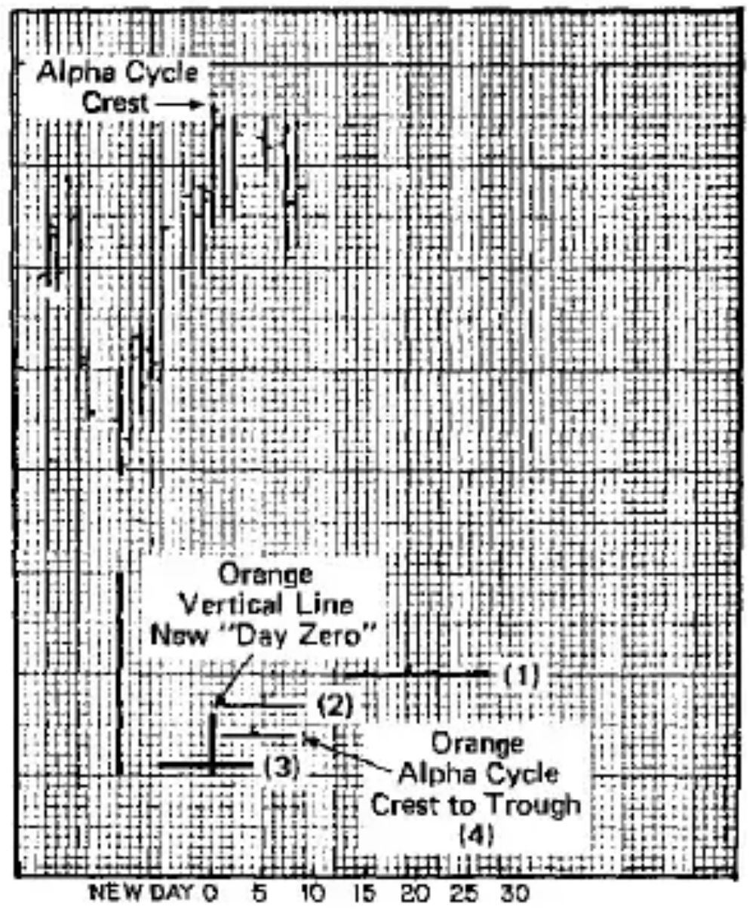

Note that there is now a time period during which the brown trough-to-trough of the Alpha Cycle (2), and the orange crest-to-trough of the Alpha Cycle (4) overlap. The Alpha Cycle Trough will frequently occur during this overlap area.

### STEP 5 - Trough-to-Trough of the Beta Cycle

Once the Alpha Cycle Trough has occurred, it is possible to draw in the Timing Bands for the Beta Cycle: trough-to-trough of the Beta Cycle (5) and trough-to-crest of the Beta Cycle (6).

Draw a brown vertical line through the Alpha Cycle Trough-to-Trough Band (2) and the Alpha Cycle Crest-to-Trough Band (4) to denote the Alpha Cycle Trough. Extend this line up to the same height as the previous red Trading Cycle Trough-to-Trough vertical line. This brown vertical line now becomes the new Day Zero for the Beta Cycle Bands (5 and 6).

With the brown pencil, draw in the Trough-to-Trough of the Beta Cycle Band at the same horizontal height as the top of the red and orange vertical lines from Day 12 up to and including Day 19.

Place a small vertical slash on Day 15 to show the average.

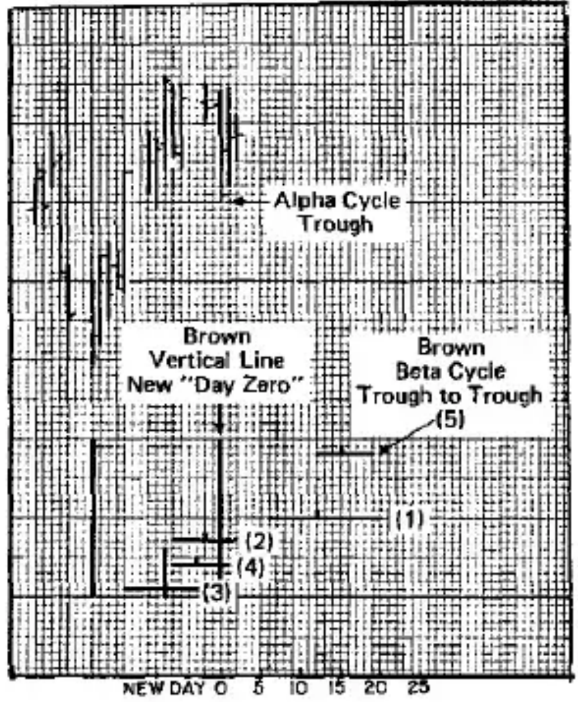

### STEP 6 - Trough-to-Crest of the Beta Cycle

Begin your count using the vertical brown line, which represents the Alpha Cycle Trough as Day Zero.

With a green pencil, draw in the trough-to-crest of the Beta Cycle Band several grids above the trough-to-trough of the Trading Cycle Band (1) from Day 3 to Day 10.

Place a small vertical slash on Day 6 to show the average.

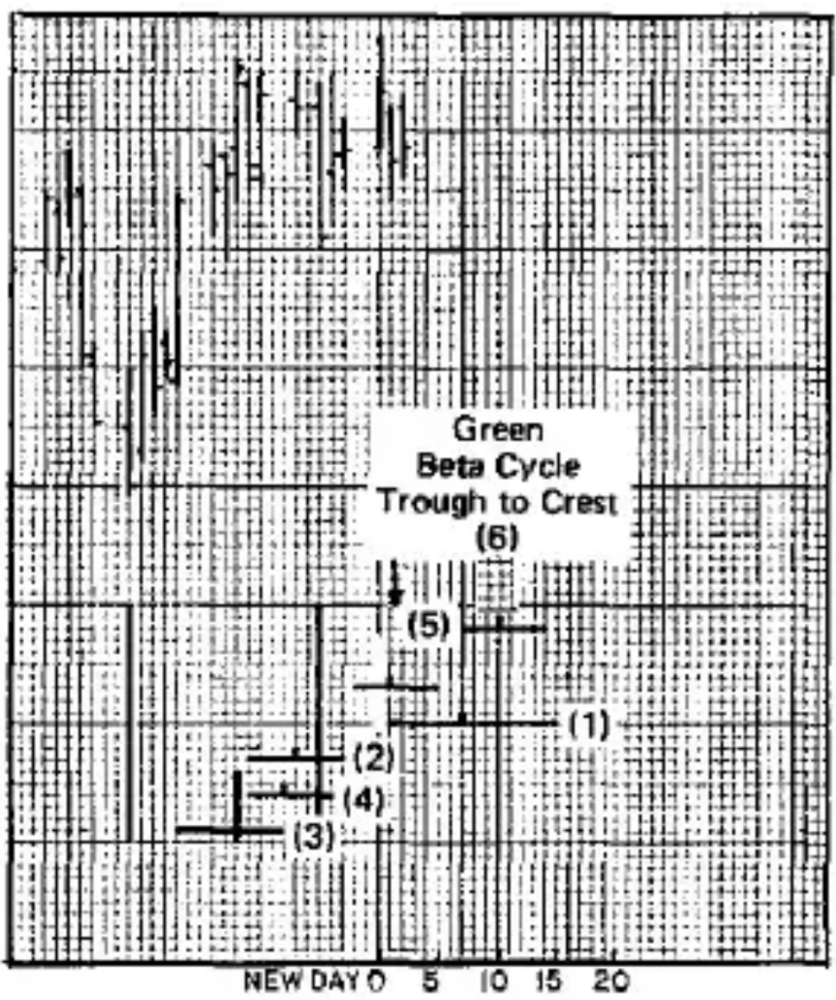

Once the Beta Cycle Crest has been located, it is possible to chart the last cyclic component; crest-to-trough of the Beta Cycle.

### STEP 7 - Crest-to-Trough of the Beta Cycle

Use the orange pencil to draw a vertical line through the trough-to-crest of the Beta Cycle Timing Band (6). Extend this line up several grids to denote the Beta Cycle Crest. This orange vertical line now becomes the new Day Zero for the crest-to-trough of the Beta Cycle Band.

In orange, between the green trough-to-crest of the Beta Cycle (6) and the brown trough-to-trough of the Beta Cycle (5), draw in the crest-to-trough of the Beta Cycle from Day 3 to Day 12.

Place a small vertical slash on Day 8 to show the average.

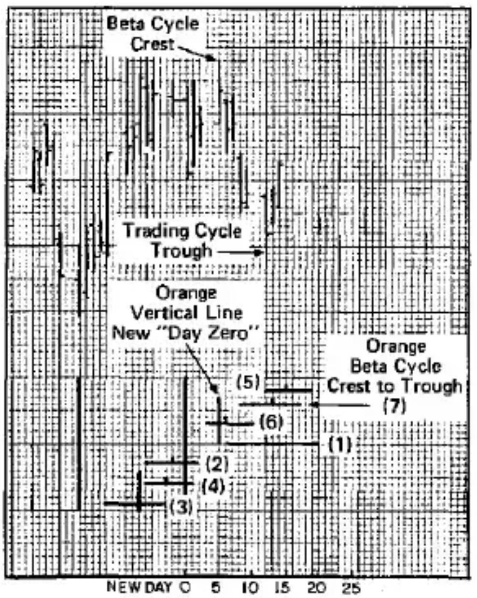

Now there are 3 overlapping lines to give the most probable time for the Trading Cycle Trough to occur:

- The red trough-to-trough of the Trading Cycle (1)
- The brown trough-to-trough of the Beta Cycle (5)
- The orange crest-to-trough of the Beta Cycle (7)

The Trading Cycle will frequently bottom within the overlap area of all three Timing Bands as shown in our example. Once it is confirmed, the Trading Cycle trough becomes the new Day Zero for Bands 1, 2 and 3 of the next Trading Cycle.

The same 7 Steps can be used to construct the Primary Cycle and 1/2 Primary Cycle Timing Bands, which can be plotted on weekly charts, and also daily charts.

## CHART CY-1: Primary Cycle and Trading Cycle Timing Bands For Gold

CHART CY-1 is a calendar day chart of DEC 1988 Gold with Timing Bands for the Primary Cycle and Trading Cycle below the prices.

The Primary Cycle bottom the week of March 4 is indicated by the solid rectangle. The 1/2 Primary Cycle Trough-to-Crest Band of 6 to 10 weeks is labeled T-C, and the average of 8 weeks is shown by the bump the week of April 29. The X the week of April 22 shows that the first 1/2 Primary Cycle has topped, and from that week the crest-to-trough band of 1-6 weeks with an average of 2 weeks (labeled C-T) was counted. The edges of this band are pointed down to show that the count is down, from high-to-low.

The 1/2 PC Trough-to-Trough Band of 9-12 weeks with an average of 10 weeks is labeled T-T. The overlap of the T-T and C-T Bands the weeks of May 6 through 27 is the most probable time period for the 1/2 PC to bottom, and it occurred the first week of the overlap. From this low the T-C Band of 1-4 weeks for the second 1/2 PC was counted. The X indicates the week of the high and from this high the C-T Band of 2-5 weeks was counted. The 1/2 PC Band of 5-11 weeks was counted from the first 1/2 PC low made the week of May 6.

The Primary Cycle T-T Band at the bottom of the chart is 16-23 weeks from the PC low made the week of March 4. The overlap of the 3 Timing Bands -- C-T, 1/2 PC T-T, and the 1/2 PC T-T is the most probable time period for the Primary Cycle to bottom, as it did the week of July 1. The next set of Timing Bands would be calculated from this low.

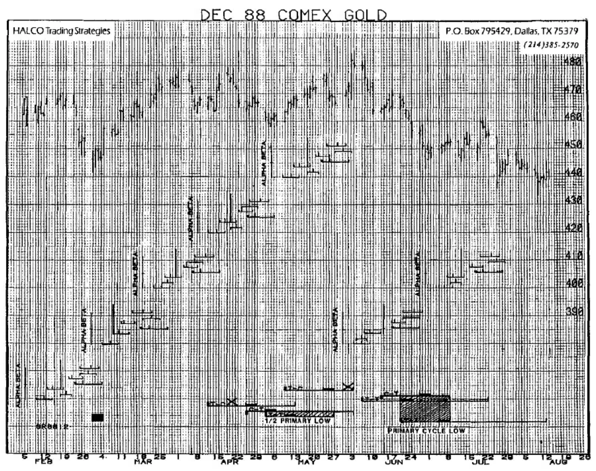

**Chart CY-1** Primary Cycle and Trading Cycle Timing Bands for Gold

The Trading Cycle Timing Bands are plotted above the PC Bands. The vertical lines labeled ALPHA BETA indicate the TC lows. The 3 lowest bands are the Alpha Cycle Bands, and the 3 highest bands are the Beta Cycle Bands. The darker middle band is the Trading Cycle Band of 18 to 28 calendar days. The other vertical line indicates the Alpha Cycle low, which begins the count for the Beta Cycle Timing Bands. The overlap areas of the C-T and T-T Bands are where most of the Alpha Cycle and Trading Cycle lows occur.

Oscillators are essential to the identification of the cycle highs and lows. It is the combination of time, price and oscillators that allows the early identification of cycle tops and bottoms that occur both within and outside of the Timing Bands.

---

> **THE PROBABILITY OF MAKING A SUCCESSFUL TRADE IS MUCH GREATER LATER IN THE TIMING BANDS THAN EARLIER**

While Timing Bands are ranges within which prices have topped better than 7 times out of 10 in the past, the probability of making a successful trade is much greater later in the Timing Bands than earlier.

Normally, 70% of the cyclic tops and bottoms will occur within the range of the Timing Band; 20% will occur before the Band, and 10% will occur after the Band. So, by the time the last day of the 70% Timing Band has been reached, 90% or more of the cycles would have already topped, or bottomed.

In a bottoming situation, on the last possible day of the overlap area of Bands 1, 5, and 7, once the market closes above the previous day's close and also the open, probabilities favor that day being the Trading Cycle low.

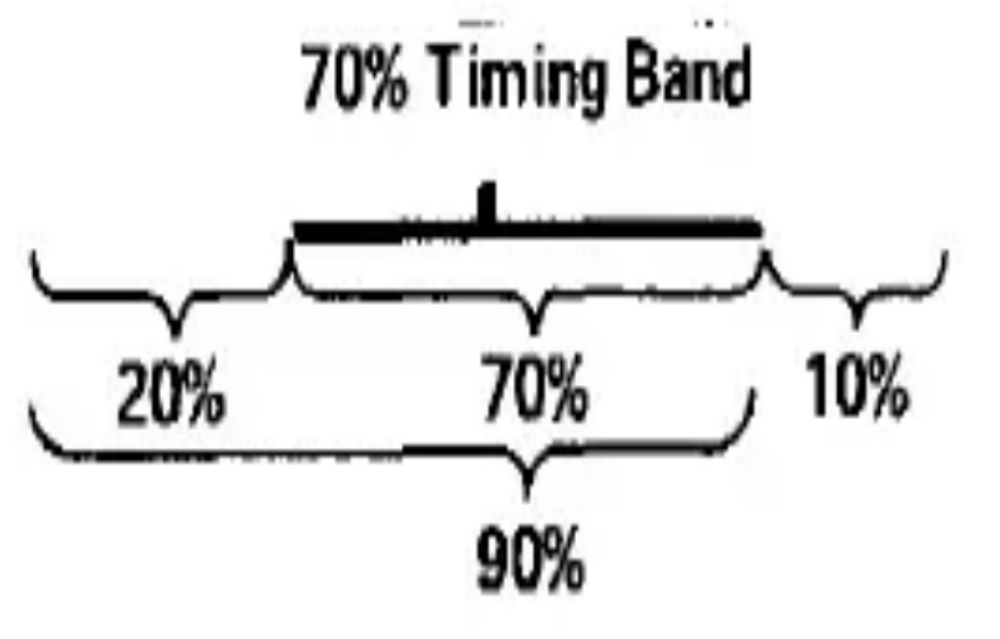

---

*If you are interested in obtaining 7-day charts, HALCO TRADING STRATEGIES provides a chart service on 11x17 calendar day chart paper with Timing Bands and market analysis. Also included are weekly and monthly charts showing the historical Primary Cycle and longer-term cycles. For more information write, or call--P.O. Box 795429, Dallas TX 75379, 1/800-527-0932.*
