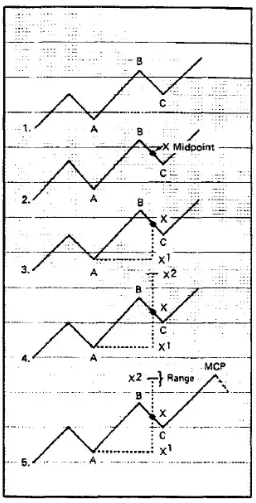
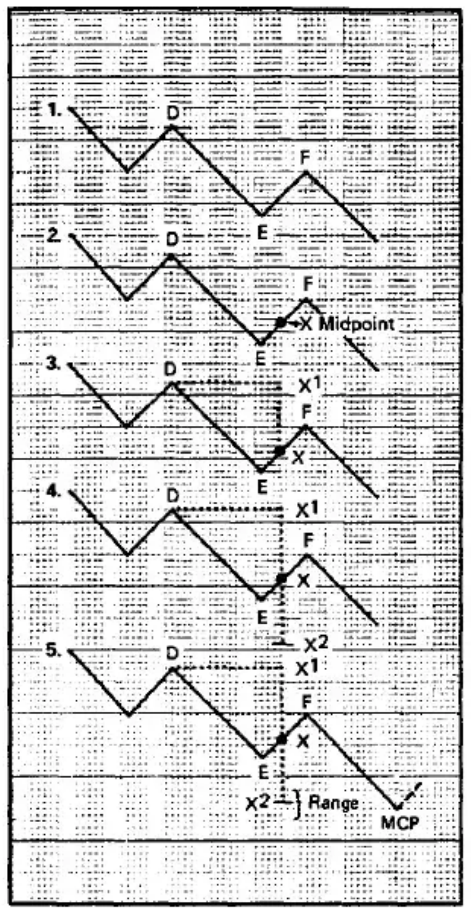
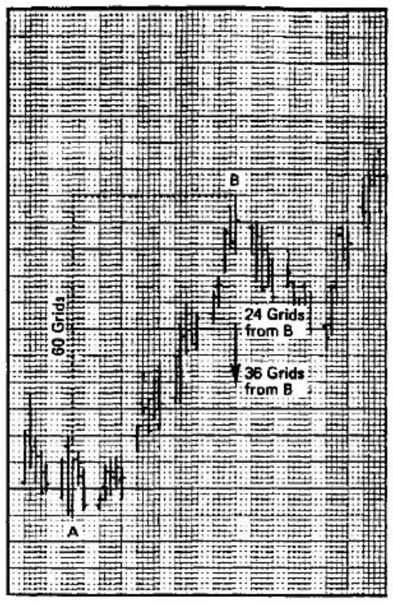
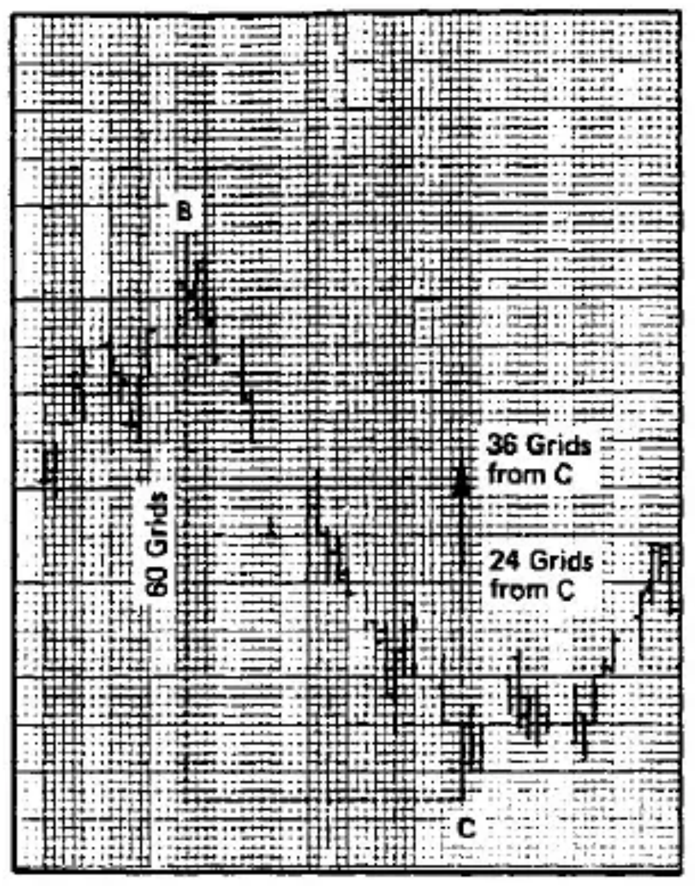
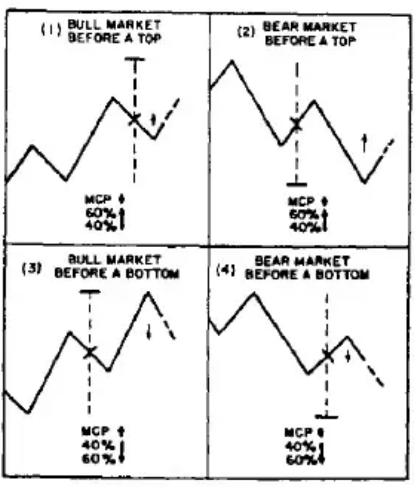
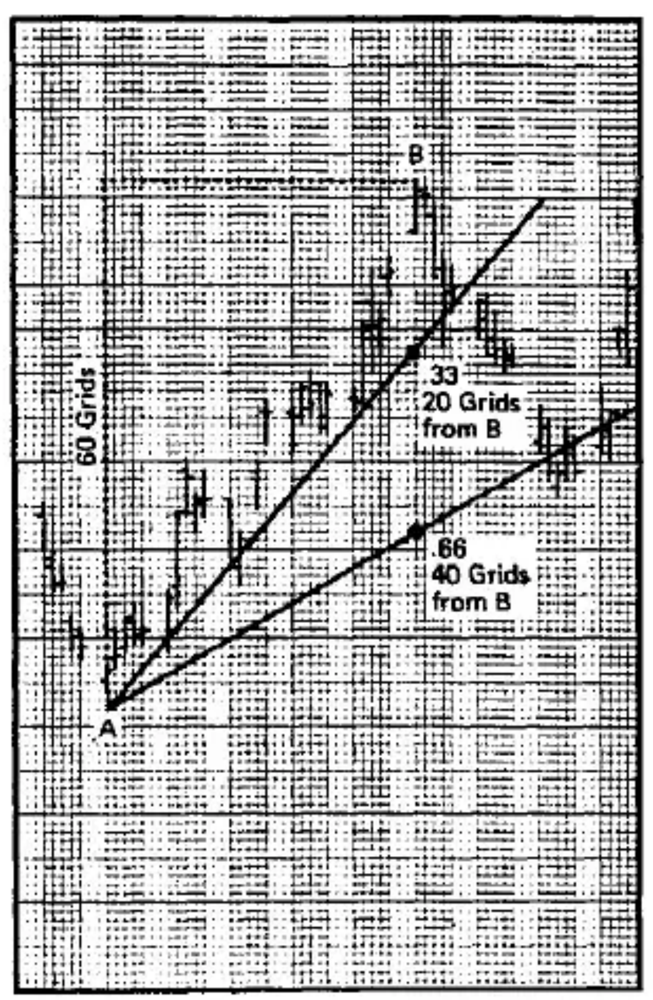
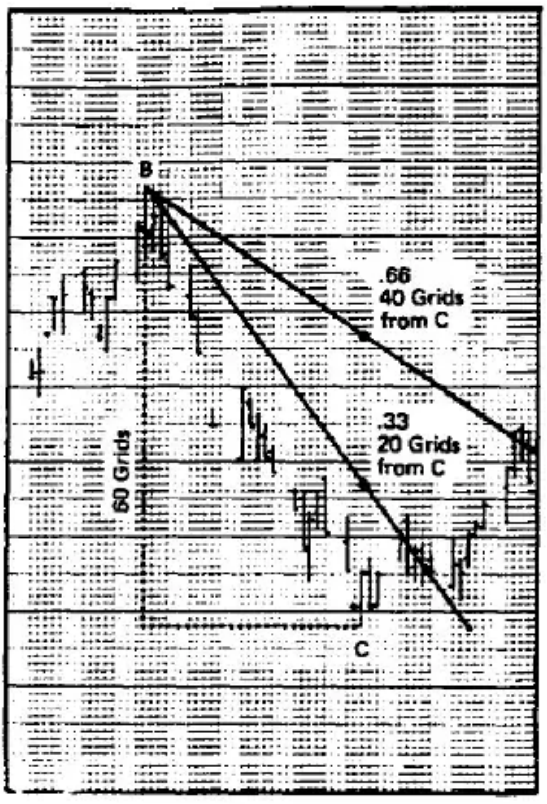
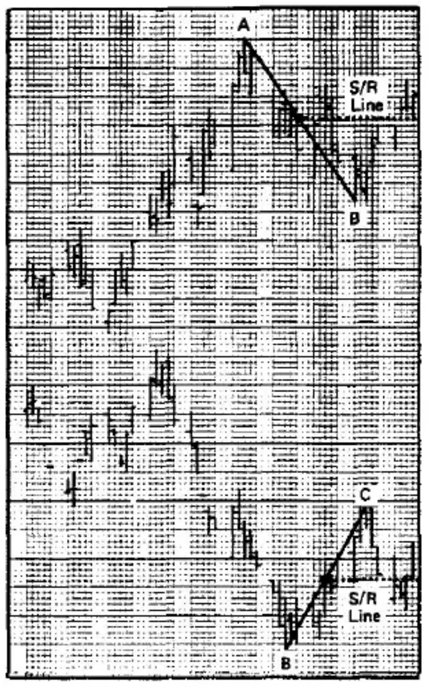

# Chapter Two: Technical Tools With Cycles

## Technical Analysis

Technical analysis enables an individual to analyze markets in which he has no fundamental expertise. While each market has its own individual characteristics, they must be isolated and identified through historical research. There is no single technical tool or grouping of tools that will work in all markets, and the use of cycles is simply another technical tool, but one that serves as the 'glue' that brings the technical picture into focus through the use of time.

The following technical tools provide time and price objectives. Performance of these tools are greatly improved when combined with cycles. For example, the Mid-Cycle Pause Price Objective is dependent upon the cycle, and once the cycle has ended and a new cycle begun, the price objective is no longer valid. Sixty-forty Percent Retracements are valid only for the cycle in which they occur. Support/Resistance Lines are always valid, and cycles will tend to top and bottom at, or near, the Support/Resistance levels.

Technical tools, combined with cycles and oscillators, give price levels that will provide support and resistance, often allowing you to anticipate Trends and Trend Reversals.

## Mid-Cycle Pause Price Objectives

Establishing a position without a price objective is like taking a bus trip without knowing your destination. How do you know where to get off?

Mid-Cycle Pause Price Objectives (MCP) are used to determine the distance prices will move to a cyclic top in bull markets or bottom in bear markets, and should be used in conjunction with other tools. They can be constructed for Beta Cycles, Trading Cycles, 1/2 Primary Cycles, and Primary Cycles.

A Mid-Cycle Pause Price Objective will only be met, or exceeded, if the next longer cycle continues to move in the same direction. For example, a MCP for a Trading Cycle will only be met if the 1/2 Primary Cycle or Primary Cycle continues to move in the same direction; a MCP for a Primary Cycle will only be met if the Seasonal Cycle continues to move in the same direction. A MCP will not be met in a trading range.

### Constructing a Mid-Cycle Pause Price Objective in a Bull Market

1. Measure the diagonal distance from the cyclic top B to the cyclic low C.
2. Mark the midpoint of the diagonal line BC as X.
3. Measure the vertical distance from the midpoint X to the price low of the preceding Cycle A. This distance is X-X1.
4. Measure the same distance as X-X1 above X to X2. The Mid-Cycle Pause Price Objective is X2.
5. Measure 10% of the total distance X1-X2, and plot this above and below X2. This is the range within which the next cycle of the same length that you are measuring should top.

### Constructing a Mid-Cycle Pause Price Objective in a Bear Market

1. Measure the diagonal distance from the cycle low E to the cyclic top F.
2. Mark the midpoint of the diagonal line EF as X.
3. Measure the vertical distance from the midpoint X to the price high of the preceding cycle D. This distance is X-X1.
4. Measure the same distance as X-X1 below X to X2. The Mid-Cycle Pause Price Objective is X2.
5. Measure 10% of the total distance above and below X2. This is the range within which the next cycle of the same length as you are measuring should bottom.

## 60-40% Retracements

One of the most consistent tools for determining price objectives is the 60-40% Retracement derived from the Fibonacci .618-.382 relationship. This is a general area---close to 60%, and close to 40%. 60-40% Retracements are used to determine a price range for cyclic highs to occur in bear markets, and cyclic lows to occur in bull markets. Like MCP Price Objectives, 60-40% Retracements are only valid if the next longer cycle continues to move in the same direction. This price range should be used in conjunction with 70% Cyclic Timing Bands.

Most Primary Cycles, Trading Cycles, and Alpha Cycles will retrace at least 40%. The 60-40% measurement can often be used to enter a market when a cyclical top or bottom is due. Often, if a buying or selling opportunity is missed, you can enter the market as it retraces and still catch a substantial part of the move.

### Constructing a 60-40% Retracement in a Bull Market

1. Measure the vertical distance (in grids) from the cyclic crest B to the trough C.
2. Multiply the number of grids by .40 and .60 (60 x .40 = 24 grids; 60 x .60 = 36 grids).
3. Directly below the price high B, plot the .40 and .60 numbers, measuring down from the high.
4. Connect the two points, and place an arrowhead pointing down at the bottom of the line.
5. This is the price range within which the cycle should bottom. Timing Bands will provide the time period for prices to bottom while in the price range.

### Constructing a 60-40% Retracement in a Bear Market

1. Measure the vertical distance (in grids) from the cycle crest B to the trough C.
2. Multiply the number of grids by .40 and .60 (60 x .40 = 24 grids; 60 x .60 = 36 grids).
3. Directly above the price low C, plot the .40 and .60 numbers, measuring up from the low.
4. Connect the two points and place an arrowhead pointing up at the top of the line.
5. This is the price range within which the cycle should top. Timing Bands will provide the time period for prices to top while in the price range.

This diagram illustrates four of the basic situations in which MCP Price Objectives and 60-40% Retracements are constructed. In situations (1) and (4), if the market continues to move in the same direction, it is expected to reach the MCP. But the 60-40% range may offer resistance and must be exceeded for the MCP to be reached. In situations (2) and (3), the MCP has already been met and the 60-40% Retracement in the other direction is expected to be reached. Prices should then reverse, and a new MCP will be generated as prices follow the direction of the longer term cycle.

## Speed Resistance Lines

Speed Resistance Lines were developed by Edson Gould, and brought to the public eye in the early 1970's by Gerald Appel in his excellent book, *Winning Market Systems*. Used with each individual cycle, Speed Resistance Lines become powerful analytical tools to help determine price objectives, cyclic tops and bottoms, and trend reversals. In fact, some of the most powerful and consistent buy and sell signals are generated when prices retrace 60-40% to meet the level of a Speed Resistance Line in the overlap area of Cyclic Timing Bands as one or more oscillators overextend.

Speedlines can be constructed for Trading Cycles, Alpha/Beta Cycles, Primary Cycles, 1/2 Primary Cycles, Seasonal Cycles and Long-Term Cycles. Construction is based on the distance from low to high or high to low of the individual cycle.

### Constructing Speed Resistance Lines in a Bull Market

1. Measure the vertical distance (in grids) from the cyclic trough A to the crest B.
2. Divide this distance by three, or multiply the number of grids by .33 and .66. (60 x .33 = 20 grids; 60 x .66 = 40 grids)
3. Directly below the crest B, place dots at the .33 and .66 points, measuring down from the high.
4. From the low A, draw a line through the .33 point. This is the upper Speedline.
5. From the low A, draw a line through the .66 point. This is the lower Speedline.

When the upper Speedline is decisively penetrated, prices will often drop to the lower Speedline. Prices dropping decisively below the lower Speedline will often test and/or drop below the low at A.

### Constructing Speed Resistance Lines in a Bear Market

1. Measure the vertical distance (in grids) from the crest B to trough C.
2. Divide this distance by 3, or multiply the number of grids by .33 and .66. (60 x .33 = 20 grids; 60 x .66 = 40 grids)
3. Directly above the trough C, place dots at the .33 and .66 points, measuring up from the low.
4. From the crest B, draw a line through the .33 point. This is the lower Speedline.
5. From the crest B, draw a line through the .66 point. This is the upper Speedline.

When the lower Speedline is decisively penetrated, prices will often rise to the upper Speedline. Prices rising decisively above the upper Speedline will often test and/or exceed the high at B.

### How to Determine Decisive Penetration

- The entire day's range is below the Speedline in a Bull Market, or above the Speedline in the Bear Market.
- Penetration of the Speedline is more than 1.5% of the price level at which the Speedline is penetrated. At 50 cents, multiply 50 cents by 1.5% (.50 x .015) which equals .0075. Then subtract that figure from the 50 cents (.50 - .0075), which equals .4925. If the close is below that figure, then the Speedline has usually been decisively penetrated.

## Cyclic Support/Resistance Lines

Cyclic Support/Resistance Lines are price levels that are likely to provide support in declining markets and resistance in rising markets. Cycles will often top and bottom around these lines, sometimes months or even years after the support or resistance line has been established.

Once a Support/Resistance level has been established, the same line can offer support in a declining market and resistance in a rising market. For example, declining prices may temporarily congest around a support level before it is finally penetrated to the downside. But when prices try to rally back up again, the same line may offer resistance to the rising market.

The strength of Support/Resistance levels is determined by how often prices have rebounded or become congested at these levels. Generally, the longer the cycle, the greater the effect of support or resistance. Cyclic Support/Resistance Lines are most effective when constructed for Trading Cycles, Primary Cycles, Seasonal Cycles, and other Long-Term Cycles.

A Support/Resistance Line on a Daily Chart may be drawn horizontally from the mid-point of the diagonal distance measured to construct a Mid-Cycle Pause Price Objective. Give newly constructed Support/Resistance lines some time to test its congesting and rebounding power before anticipating its effect on future price movement.

1. When a market is moving up, draw the line out from the midpoint of the diagonal distance from crest A to trough B.
2. When a market is moving down, draw the line out from the midpoint of the diagonal distance from trough B to crest C.

In Weekly and Monthly Range Charts 'old' highs and lows are frequent Support/Resistance Levels, especially those that have stopped prices more than twice.
