# Chapter Four: Finding Cycles with Centered Detrending

Detrending is a process that eliminates the trend of a market relative to a moving average or an oscillator. On a chart this process allows individual cycles and overextension levels to be identified. The detrending process for cycle identification is somewhat different than that used with oscillators, and these are examined separately.

## Detrending and Cycles

Each futures market is composed of many cycles. A combination of longer-term cycles and the Seasonal Cycle determines the trend of the markets. But to trade a market, it is necessary to analyze the shorter-term cycles which frequently enable the top or bottom of a cycle to be confirmed within days or weeks.

Smaller cycles are often hard to identify because the more powerful, longer cycles can obscure the pattern of the smaller cycle. The detrending process is used to eliminate the effects of cycles longer than the cycle for which you are searching. Each individual cycle can then be more accurately measured.

Detrending is a simple process. The first step is to have an idea of the approximate length of the cycle you wish to identify. Then run a moving average that is the same length as the suspected cycle calculated on the close. The moving average is then centered, or plotted, at the midpoint of the time period of the suspected cycle length. For example, a 20-Week Centered Moving Average would be plotted 10.5 weeks before the current week, which is more conveniently plotted 11 weeks before the current week.

## S&P Index

**CHART D-1**...The S&P Index has a 20-Week Cycle which shows up very clearly in the chart below. The top panel of Chart D-1 is a weekly plot of the cash S&P Index highlighting the 1982 low, with a Centered 20-Week Moving Average. The centered moving average then becomes a Zero Line as the bars of the chart are plotted relative to it, resulting in the actual Centered Detrend in the bottom panel of the chart.

The lows and highs of the 20-Week Cycle are identified by the dots in both the chart and the Detrend. While the cycle highs and lows that show up in the Detrend match the price highs and lows of the chart above it, this is not always the case.

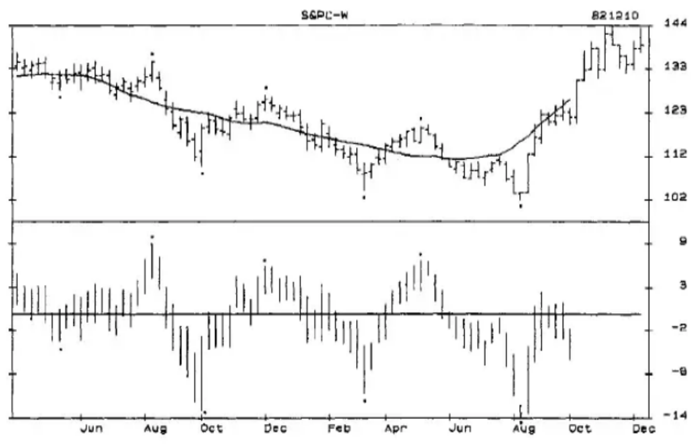

**Chart D-1** Weekly S&P Index 3/81 to 12/82 With Centered Moving Average and Centered Detrend

**CHART D-2**...is the weekly cash S&P from March 1983 to February 1990. This longer time period gives a better perspective of how accurate the Detrend is and highlights several important aspects of detrending. The Detrend lows of the 20-Week Cycle are marked by dots. Use a ruler to draw lines that match them to the price lows in the top panel.

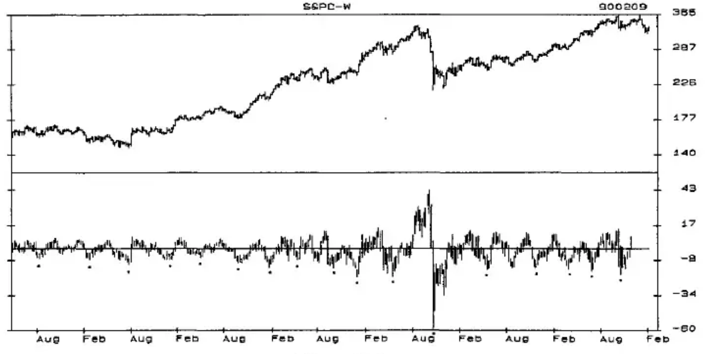

**Chart D-2** S&P Index Weekly Cash - 3/83 to 2/90 With 20-Week Centered Detrend

A complete cycle phasing should be done over the longest possible data time series, normally 20 to 30 years, but this 6.7-year period, which has a smaller sample base, will serve to illustrate the basic approach to cycle analysis and important characteristics of cycles. During this time period there were 16 cycles. The time periods from low-to-low are listed below from the longest to shortest time periods.

13 15 16 17 18 18 21 21 -M- 22 22 24 26 28 29 30 33

The median length, marked M, is between 21 and 22 weeks, or 21.5 weeks for this time period. Since 1950 the median length has been 22 weeks. Seventy-five percent of the lows occurred 15 to 26 weeks from the previous low, which is a 75% Timing Band that is very close to the 15-25 week Timing Band from the 1950 time series.

Every cycle low occurred below the 20-Week Centered Moving Average; every cycle high occurred above the moving average. Only in extremely rare situations will a cycle low occur above the centered moving average, or a cycle high below the centered moving average. So, a basic premise of detrending is that cycle lows occur below the centered moving average and that cycle highs occur above the centered moving average.

### Cycle Highs and Lows Are Not Always Price Highs and Lows

Trend, or the combination of longer-term cycles, can distort the shorter-term cycles that are so important to short-term trading and analysis. Detrending shows that cycle lows are not always price lows, nor are cycle highs always price highs. It is not uncommon, especially in an uptrending market, for the price low to occur before the cycle low, or even for the cycle to seemingly disappear. To fully integrate this concept into your market perspective, practice detrending several markets and study the highs and lows. The examples that follow will give some insight into this phenomena.

**CHART D-3**...shows the detrended cycle low at B, which is a higher price than the low 4 weeks earlier at C. This low occurred the week of 890301. The uptrend caused by the rising 4-Year and 8-Year Cycles prevents the weaker 20-Week Cycle from having a more substantial price decline.

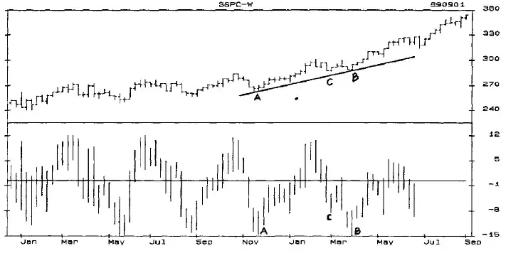

**Chart D-3** Weekly S&P Index 12/87-9/89 With 20-Week Centered Detrend

**CHART D-4**...shows a detrended cycle low made the week of 870522 at B, which is higher than the price low made 5 weeks earlier at C. At both this low and the low in Chart D-3, the AB Trendlines, which are not drawn at the price low are an indication that such a divergent cycle bottom may be occurring. Also notice the price/detrend divergency between the price highs at D and E, and the Detrend highs at D and E.

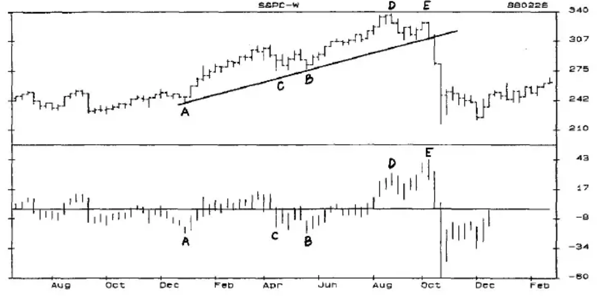

**Chart D-4** Weekly S&P Index 6/86-2/88 With 20-Week Centered Detrend

## Gold

**CHART D-5**...The top panel of Chart D-5 is a Weekly Gold Chart from 1981 through 1987. The dots indicate the lows of the 18-Week Primary Cycle. The bottom panel is the Detrend of an 18-Week Centered Moving Average. The two circled time periods, D-7 and D-6, illustrate some characteristics of detrending that will occasionally be encountered in most markets.

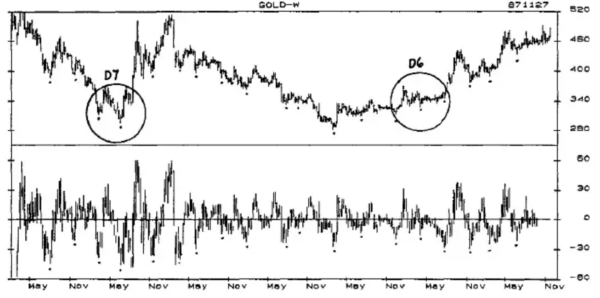

**Chart D-5** Weekly Gold Chart 1981-1987 With 18-Week Centered Detrend

In **CHART D-6**...the cycle lows at A and B show up quite distinctly in both the price chart in the top panel and the Detrend in the bottom panel. Simply using the price chart of gold would lead to the conclusion that the cycle must have bottomed at D. But the Detrend shows that the cycle low actually occurred the week of 860725 at C. The prolonged trading range from B to C was the result of a tug of war between the longer-term cycles moving up, and shorter-term cycles moving down. Once the Primary Cycle bottomed at C, gold was free to rapidly move higher.

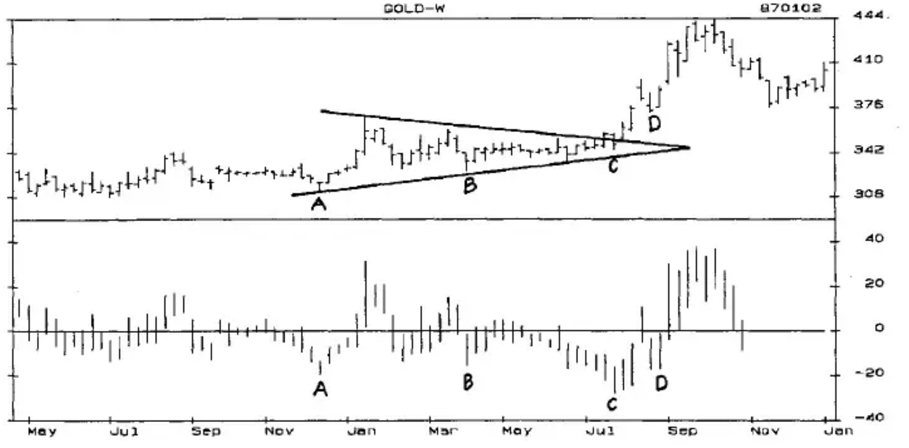

**Chart D-6** Weekly Gold 4/85-1/87 With 18-Week Centered Detrend

With a centered moving average, which lags prices by one-half the cycle, you would not be able to see this on a chart in time to do anything about it. But seeing the actual Detrend makes you aware of how such a phenomena can occur, and this experience can often be helpful in determining which direction a market will break out from a trading range or chart pattern such as the wedge drawn on the chart.

**CHART D-7**...A somewhat similar situation occurs in Chart D-7 following the 1982 low in gold. Notice that the price low at C was followed by a higher low at D that had a lower Detrend that was the real cycle low. This low was also followed by a breakout of a wedge, or triangle pattern, that had a substantial upmove. This same low at D will show up later in the book with an oscillator pattern that confirmed a Primary Cycle low and gave a low risk buy signal.

Lows A and B show a situation where the lower Detrend at B did not indicate the real cycle low. Obviously, nothing works all of the time. However, the low at B followed the lowest low since the 1980 high and did not occur in an uptrend where this pattern is most frequently seen.

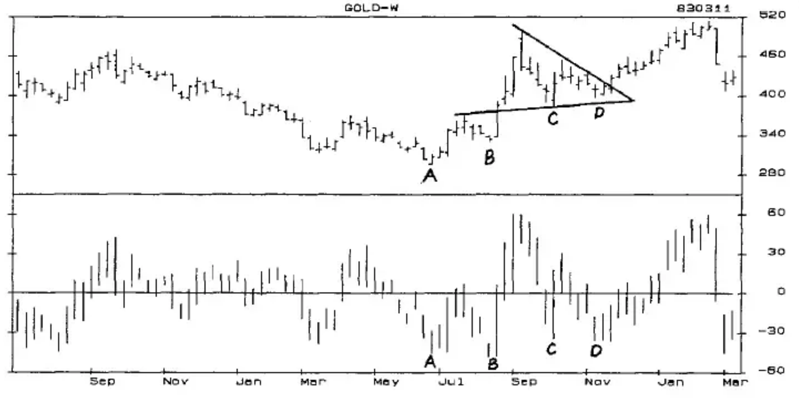

**Chart D-7** Weekly Gold 7/81-3/83 With 18-Week Centered Detrend

The dominant shorter-term daily cycles, or Trading Cycles, should also show up when detrended. Most of the time in most markets these cycles will bottom as the Primary Cycle bottoms. The lengths of the Trading Cycles and their cyclic components for most active futures markets are listed in Chapter One. Gold has a Trading Cycle that averages 15 market days from low-to-low, and since 1974 has had a 70% Timing Band of 13 to 20 market days.

**CHART D-8**...is a daily chart of the nearby contract of gold from 880918 through 890526. The top panel of the chart shows the lengths of the Trading Cycles, which are also identified in the 15-Day Centered Detrend in the bottom panel of the chart. The Primary Cycle lows are labeled PC.

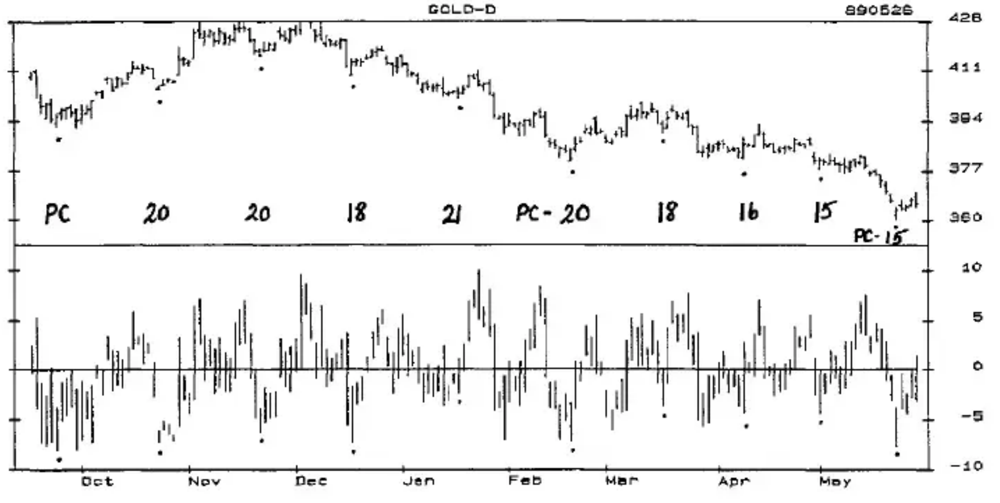

**Chart D-8** Daily Gold 9/88-5/89 With 15-Day Centered Detrend

## Swiss Franc

**CHART D-9**...The Swiss Franc is an example of a market that maintains a directional move for a long period of time. Monthly Chart D-9 shows a 4-Year Cycle that sets the trend for the shorter-term cycles.

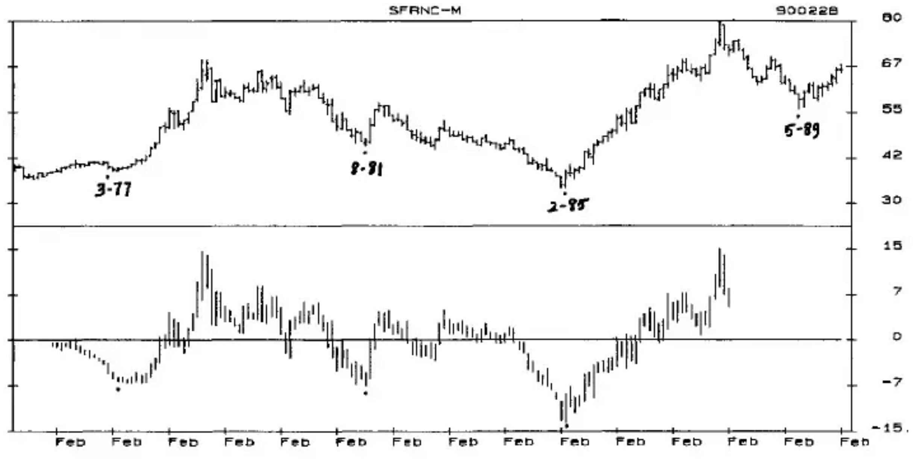

**Chart D-9** Monthly Swiss Franc 5/75-2/90 With 48-Month Centered Detrend

**CHART D-10**...is a weekly chart of the Swiss Franc from June 1986 to November 1989. The middle panel is a 50-Week Centered Moving Average Detrend that illustrates the Seasonal tendency to make lows in the May through September time period; and highs November through April. The fluctuations of the 22-Week Primary Cycle that can be seen in the 50-Week Detrend stand out much more clearly with the 22-Week Centered Detrend in the bottom panel.

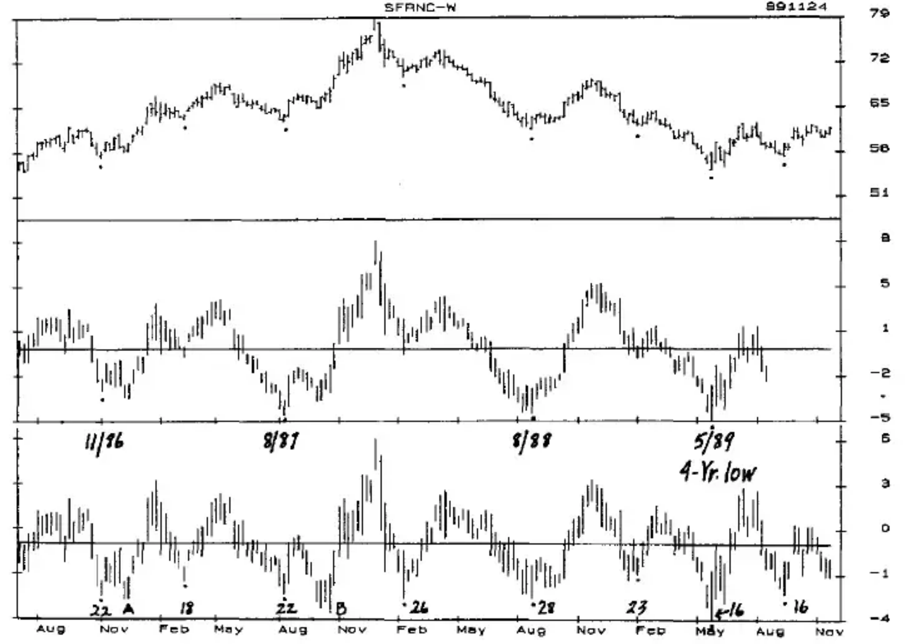

**Chart D-10** Weekly Swiss Franc 6/86-11/89 With 50-Week Centered Detrend and 22-Week Centered Detrend

The number of weeks from low-to-low are shown in the Detrend and fit the 80% Timing Band of 16-28 weeks.

Notice that at A and B the Detrend is lower than the cycle price low. This is somewhat unusual, and for want of a better explanation, I attribute it to the 8-Week Trading Cycle illustrated in Chart D-11.

**CHART D-11**...The cycle lows are indicated in the price chart in the top panel, and the weekly counts are shown in the 5-Week Centered Detrend in the bottom panel. While this cycle has a Timing Band of 6-11 weeks and is not always easy to spot, it often provides some of the lowest risk opportunities to trade the Swiss Franc, as well as the D-Mark and Japanese Yen.

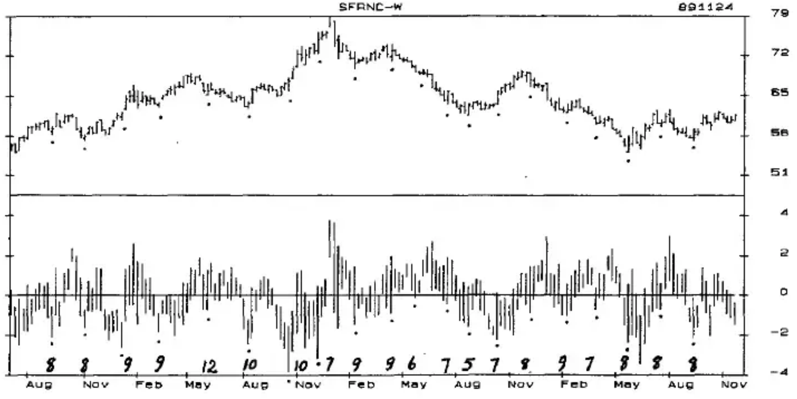

**Chart D-11** Weekly Swiss Franc 5/86 to 11/89 With 5-Week Centered Detrend

## T-Bonds

With all of the economic forces affecting interest rates and the bond market, including the release of government data and reports, it is not surprising that the Primary Cycle in this market is somewhat elusive. A phenomena that must be considered is that the Federal Reserve can, if it so chooses, move interest rates at its discretion for a prolonged period of time, extending the length of the Primary Cycle and keeping oscillators at overbought or oversold levels.

T-Bonds have 2 strong weekly cycles that move in and out of dominancy. One is a cycle that averages 21 weeks from low to low. It has a Timing Band of 18 to 28 weeks (see Chapter One) with two-thirds of the cycles occurring 18 to 22 weeks from the previous low when this cycle is dominant. The other cycle averages 14 weeks from low-to-low and has a 100% Timing Band of 12 to 16 weeks.

**CHART D-12**...shows a weekly T-Bond Chart of the nearby futures contract from March 1983 through January 1990 in the top panel, with a 21-Week Centered Detrend in the middle panel, and a 14-Week Centered Detrend in the bottom panel. The Primary Cycle highs and lows are indicated by the dots in all 3 panels (for greater visual clarity use a parallel ruler to draw vertical lines through all 3 panels at highs and lows; one color for highs, another for lows).

Many PC highs and lows are clear cut, but in questionable situations a judgment was made based on a number of factors, such as oscillator patterns, Right and Left Translation, and also to include some extremes of unusually long and short cycles to be prepared for these extremes in real-time trading. The time periods of the selected PC highs and lows are indicated in the middle panel. The numbers at the bottom are the number of weeks from low-to-low; the numbers at the top are the number of weeks from low-to-high.

The 21-Week Cycle, with 12 lows, usually makes more sizable bottoms than the 14-Week Cycle, which occurred 11 times. However, a close look at the 14-Week Detrend in the lower panel shows that most of the 21-Week Cycles are composed of 2 smaller cycles of which at least one is a 14-Week Cycle that begins or ends the larger 21-Week Cycle.

The moves from low-to-high, or trough-to-crest, for all cycles are 7 to 16 weeks for 17 of the cycles, with one cycle stretching to a 20-week high. Most of these occurred in bull markets. Only 4 cycles rose to a top in 3 to 5 weeks and these were definitely in bear moves.

The counts from high-to-low can be calculated by subtracting the low-to-high count from the low-to-low count. These counts, from 1 to 18 weeks, are so spread out that meaningful Timing Bands cannot be calculated. However, the 14-Week Cycles all bottomed 1 to 12 weeks from the high, and the 21-Week Cycles all bottomed 6 to 18 weeks from the cycle high. Generally, the shorter high-to-low counts will occur in bull markets, and the longer high-to-low counts will occur in bear markets. The combination of the Timing Bands from low-to-low and the Crest/Tress will be the most important factors in determining the PC lows.

To get the most out of this book I recommend that you reconstruct these charts for yourself on a more detailed scale. A complete study of this market would require weekly futures data from 1977, and cash data as far back as possible.

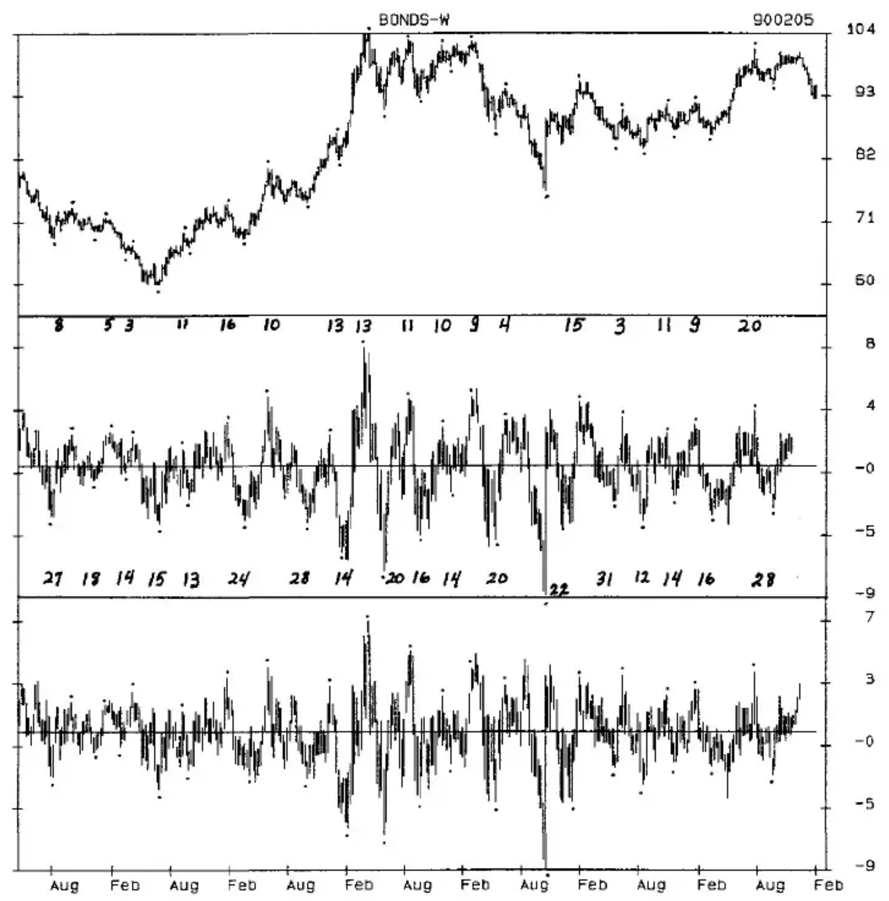

**Chart D-12** Weekly T-Bond 3/83-1/90 With 21-Week Centered Detrend and 14-Week Centered Detrend

**CHART D-13**...shows a daily bar chart of T-Bonds in the top panel from 880923 to 900209, and a 21-Day Centered Detrend in the bottom panel. With the Detrend, the cycles show up clearly. Every Trading Cycle low is made with the Detrend well below the moving average. The Detrend low is not always the same as the price low, but it is usually within 4 days of it. The detrended highs are not as exact as the lows, but are still helpful in identifying the cycle highs.

Of the 14 cycles in this time period 65% occurred 17 to 23 market days from the previous TC low; 35% occurred 28 to 30 days from the low. So, as a general guideline expect the TC low to occur 17 to 23 market days after the previous low, and if prices continue to decline after the twenty-third day a bottom is not likely until the twenty-eighth to the thirtieth day.

The distribution is not as tight for the count from low-to-high, but of the cycles that had a count of 14 to 22 days to the high, all made the TC low 28 to 30 days from the previous low. Information like this can be like 'money in the bank' if used at the right time. Of course these tendencies should be confirmed by a review of a much longer time period.

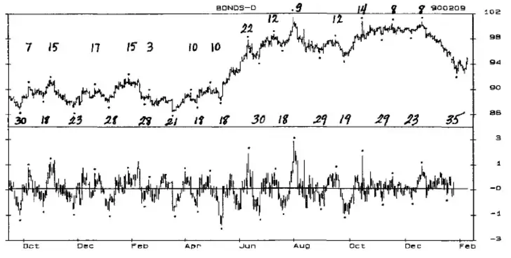

**Chart D-13** Daily T-Bond 9/88-2/90 With 21-Day Centered Detrend

## Soybeans

**CHART D-14**...The Seasonal Cycle in the soybean market, as in most agricultural markets, is a very powerful and dominant cycle which can set the intermediate-term trend for many months. Chart D-14 is a weekly chart of the nearby contract of soybeans from March 1983 to February 1990 in the top panel, and a 50-Week Centered Detrend in the lower panel. The dates above the Detrend indicate the Seasonal highs, and the dates below the Detrend the lows.

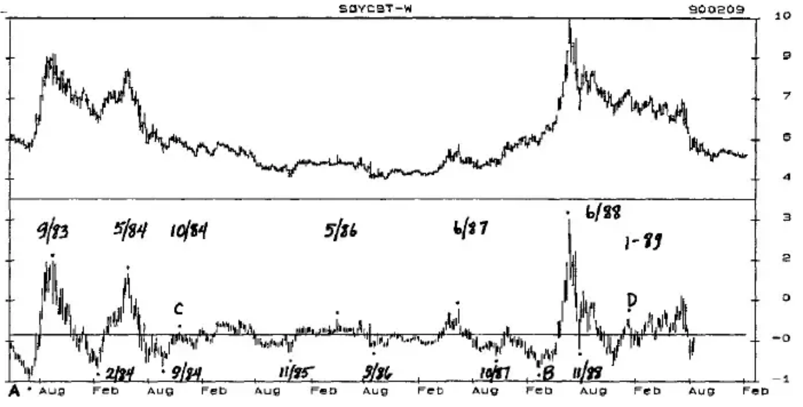

**Chart D-14** Weekly Soyabeans 3/83-2/90 With 50-Week Centered Detrend

The long-term trend in beans is determined by the direction of the 24 and 39-Month Cycles. Notice Lows A and B in the Detrend. These are not Seasonal lows, but exemplify the distorting power of the longer-term cycles as they move up to a top.

The Seasonal highs at C and D are so overpowered by the longer-term cycles that they show up as only short-term highs in the Detrend and in the chart. It is hard for most of us to accept that a Seasonal high can occur only weeks from a Seasonal low, but it frequently happens following the top of a 24 and/or 39-Month Cycle high.

**Chart D-15**...shows the weekly chart of the nearby contract of soybeans from March 1983 to February 1990 in the upper panel, and a Centered Detrend of a 14-Week Moving Average in the lower panel.

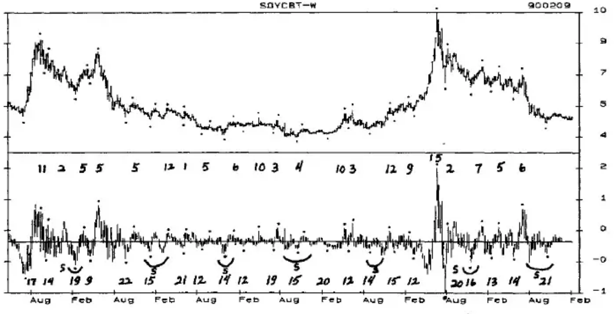

**Chart D-15** Weekly Soyabeans 3/83-2/90 With 14-Week Centered Detrend

The Primary Cycle count from low-to-low is at the bottom of the lower panel, and the count from low-to-high is at the top of the lower panel. The length of the PC averages 14 weeks from low-to-low, with a Timing Band of 11 to 22 weeks, which includes 85% of all cycles. This cycle tends to have a smaller 1/2 Primary Cycle within it that is not predictable in length, but shows up in most cycles as a drop below the Detrend.

A full 60% of the Primary Cycles bottom over a 5 week time period of 11-15 weeks from the previous PC low, and only 40% bottom over the 6-week time period of 16-22 weeks from the previous low. However, in about one-third of these longer cycles, one of the 1/2 Primary Cycles is 11 or 12 weeks long. This can be somewhat confusing, but the oscillators will help identify the lows as they occur.

The counts from low-to-high average 5 weeks with 87% of the highs occurring within a Timing Band of 1-12 weeks. A review of the relationship to the Seasonal Cycle shows that of the 15 cycles with a low to high of 6 to 17 weeks, 80% occurred as the Seasonal Cycle was moving up to the Seasonal high, and all counts of 10 or more weeks occurred as the Seasonal was moving up. After the Seasonal Cycle tops, very short counts from PC low to PC high of 1 to 3 weeks are not uncommon.

A guideline that can be developed here (and checked in earlier years) is to expect a PC high to be 10+ weeks from a PC low if the Seasonal Cycle is moving up, and that a count of 10+ weeks from low-to-high will confirm a Seasonal low.

The Centered Detrend works for identifying dominant cycles of all lengths in daily, weekly, monthly, quarterly and yearly charts. It also works with intra-day data of various time periods. Detrending will eliminate most of the effects of the longer-term cycles, but the cycles shorter than the one detrended will still show up and can cause some distortion. To have a valid Centered Detrend, the moving average must be reasonably close to the cycle length. Average cycle lengths for daily Trading Cycles and weekly Primary Cycles of most futures markets are given in Chapter One. The Seasonal Cycle can be detrended against a 40-Week or a 50-Week Moving Average. A starting place for intra-day cycles are 55 minute and 110 minute time periods.

Unfortunately, Centered Detrends must have a centered moving average, which means that the cycle prices will be well past the high or low before you can confirm it. This is where oscillator analysis and real time detrending come into play. While the Centered Detrend cannot be used in real-time trading, it can, and should be used to confirm the tops and bottoms after they have occurred. Remember, almost all cycle highs occur above the centered moving average, and almost all cycle lows occur below the centered moving average.
