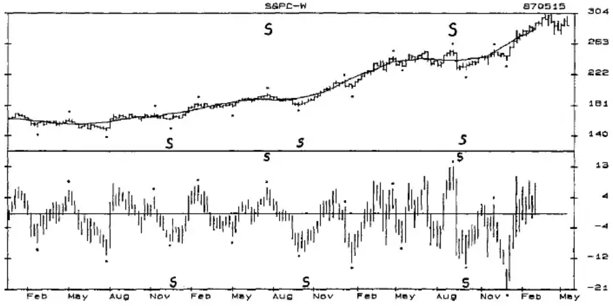
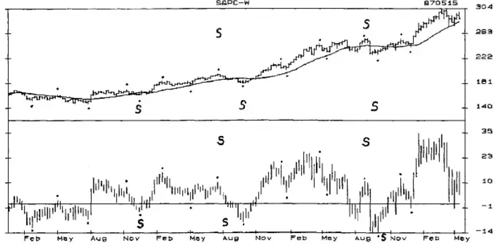
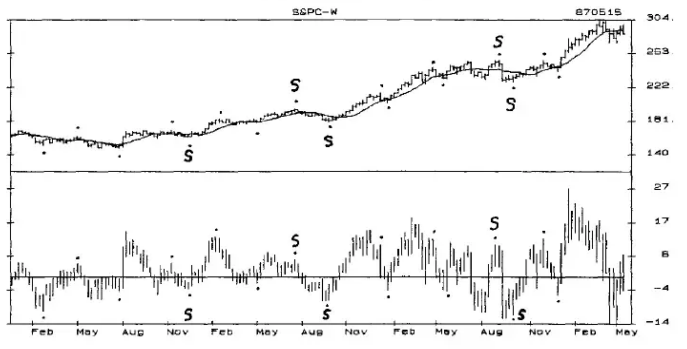
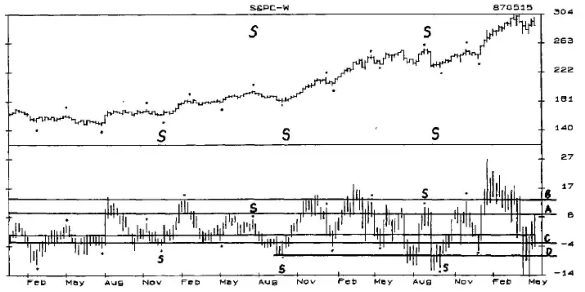
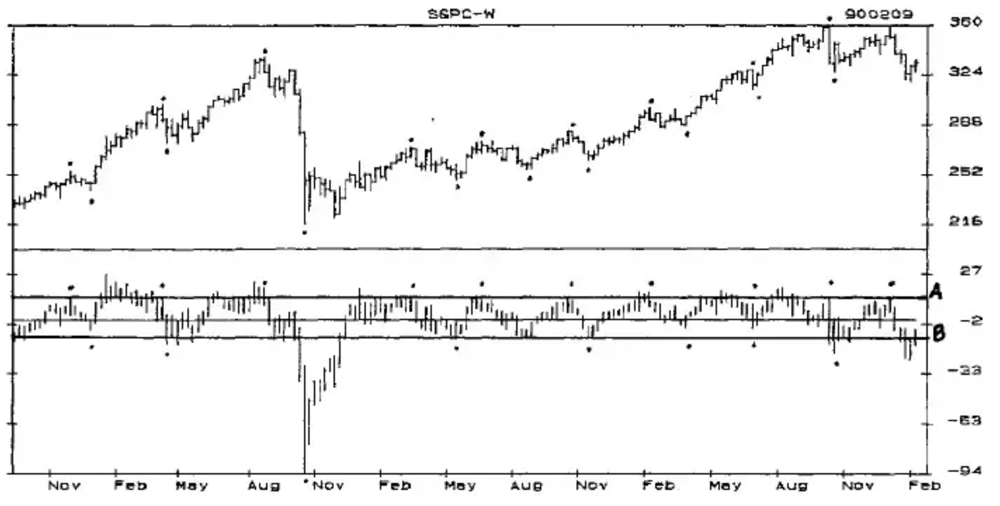
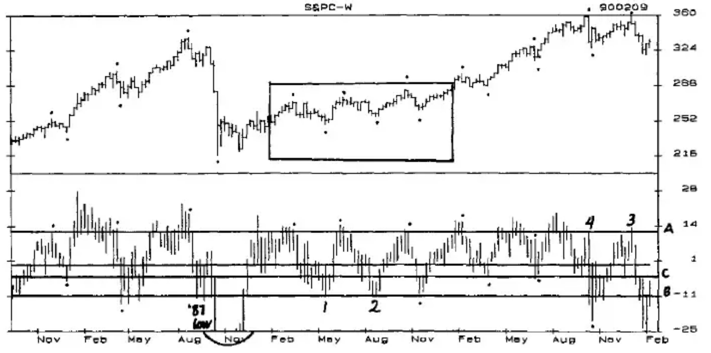
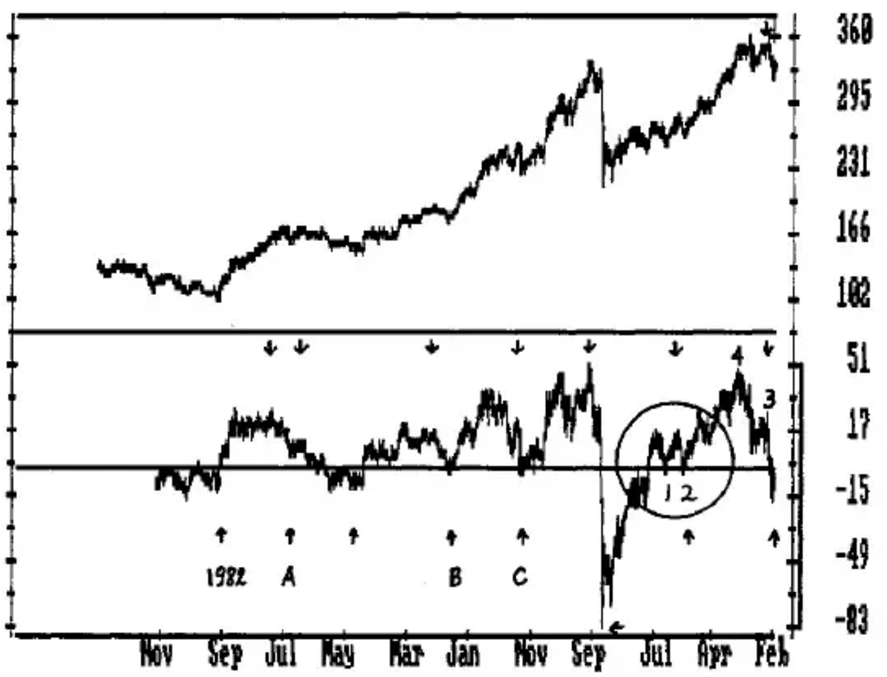
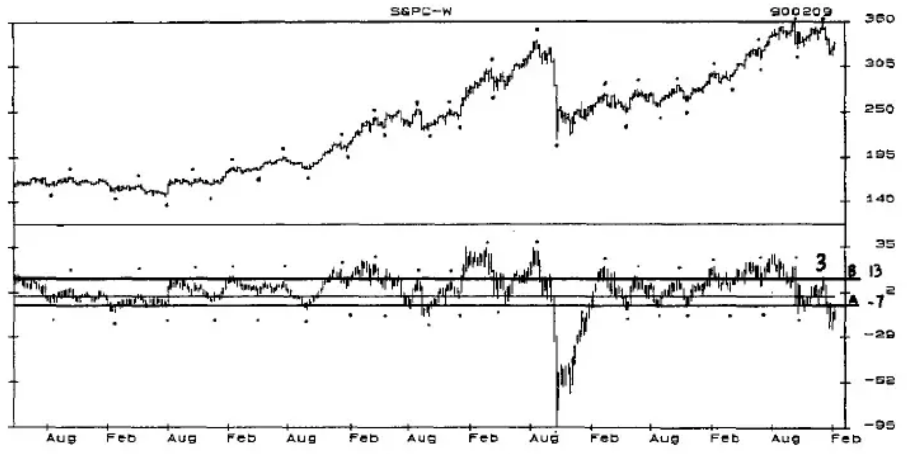
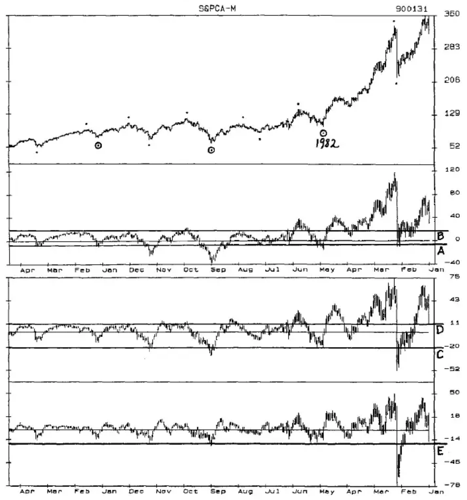
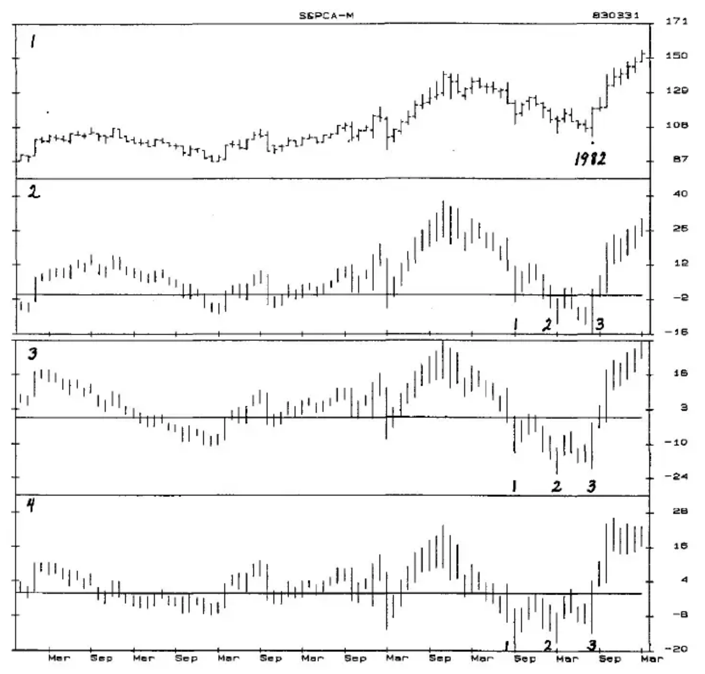

# Chapter Five: The Detrend as an Oscillator

The Centered Detrend is the most accurate way to identify cycle highs and lows. With it you can see Right and Left Translation and the flow of cycles. You can also readily see why price highs and lows are not always cycle highs and lows. But because the moving average is centered, this Detrend is not useful for real-time analysis.

A current-time Detrend in which prices are detrended around a moving average that is not centered can be used as a market oscillator to indicate overextended price levels and also to help identify cycle highs and lows.

CHART D-16...shows a centered 20-Week Moving Average running through prices of a weekly S&P Index chart from 831202 through 870515 in the top panel. The highs and lows of the 20-Week Primary Cycle and the Seasonal Cycle are indicated on the price chart. The lower panel is the 20-Week Centered Detrend with the Primary Cycle highs and lows also indicated. The 20-Week Cycle highs are all above the moving average and easy to identify. The 20-Week Cycle lows are all below the moving average and are also easy to identify.

**Chart D-16** Weekly S&P Index 12/83-5/87 With 20-Week Centered Detrend

CHART D-17...has a current time 20-Week Moving Average in the price chart. It is exactly the same shape as the centered average, but since it is plotted at the last time period used to calculate the moving average, it is 10 weeks ahead of the centered average. While the real-time Detrend looks very different, the Primary Cycle highs and lows can be identified. Unlike the centered Detrend, many of the lows are above the moving average. Because the 20-Week Moving Average is close to one-half the length of the Seasonal Cycle, it is the Seasonal lows that stand out in this Detrend.

**Chart D-17** Weekly S&P Index 12/83-5/87 With 20-Week Real-Time Detrend

CHART D-18...A moving average that is one-half the time span of a cycle will tend to highlight the highs and lows of that cycle somewhat the same as a Centered Detrend, and is called a Half-Span. As with the centered moving average the highs should be above the average, and the lows below it. Chart D-18, a weekly S&P chart for the same time period as Charts 16 and 17, shows a current 10-Week Moving Average in the top panel and the 10-Week Detrend below it. The highs and lows of the 20-Week Primary Cycle stand out clearly in the S&P Index. While this Half-Span shows the cycles clearly in the S&P Index, it does not always show the cycles as distinctly in other markets. In half of the cycles, the Detrend tops before prices top.

**Chart D-18** Weekly S&P Index 12/83-5/87 With 10-Week Detrend

Current-time Detrends have another characteristic that turns detrending into an important oscillator by itself. The Detrend highs and lows tend to move to "Levels" above and below the moving average that are often indicators that a cycle high or low is forming, or about to form.

CHART D-19...is Chart D-18 with 4 Levels drawn in.

**Chart D-19** Weekly S&P Index 12/83-5/87 With Levels and 10-Week Detrend

LEVEL A was met or exceeded following every Primary Cycle low but one in this chart. The expectation is that following a Primary Cycle low a Primary Cycle high will not be made until Level A is reached or exceeded.

LEVEL B was met or exceeded as 5 of the 8 Primary Cycle highs were made. When this overbought level is reached late in the timing for a cycle high it can be time to begin looking for a top.

LEVEL C was met or exceeded on the downside following every Primary Cycle top, and was the approximate level for 6 of the 9 Primary Cycle lows in this bull market. The expectation here is that following a Primary Cycle high, the Primary Cycle low will not occur until the Detrend drops to or below Level C. This Level would normally be expected to change in a bear market but become active again in another bull market.

A drop to, or below, LEVEL D would indicate that a bottom is imminent.

Similar types of Levels occur in Detrends of most markets and are often good indicators that a top or bottom is near, depending upon other oscillators and time periods.

CHART D-20...is a plot of a 10-Week Detrend (non-centered) from 860919 through 900209. The A and B Lines show the Levels for the upside and downside, but the magnitude of the October '87 low leaves little room to see the true fluctuations.

**Chart D-20** Weekly S&P Index 8/86-2/90 With 10-Week Detrend

CHART D-21...is of the same time period as D-20, but the October '87 low has been left out to show the consistency of the overbought and oversold levels. Many of the highs and lows at the A, B and C Levels were Primary Cycle tops and bottoms, some were not. Detrends of other time periods should also be used to indicate potential tops and bottoms, as well as Seasonal highs and lows.

**Chart D-21** Weekly S&P Index 8/86-2/90 With 10-Week Detrend

CHART D-22...on the following page shows a 40-Week Detrend in the bottom panel. The arrows indicate the Seasonal highs and lows of the S&P Index. Notice that 7 of 8 Seasonal lows occurred below the 40-Week Moving Average, and all of the Seasonal highs occurred above the Moving Average. Only the first Seasonal low at A, following the 8-Year Cycle bottom in 1982, was above the moving average. This illustrates a tendency seen in many oscillators to have greatly increased amplitude to the upside following a major low.

The rectangular area in D-21, and the circled area in D-22 illustrate how the 40-Week Detrend and the 10-Week Detrend can combine to indicate the timing for a bottom and the potential for a sizable upmove. In Chart D-22 the two previous Seasonal bottoms at B and C dropped only slightly below the 40-Week Moving Average. The low at 1, also slightly below the 40-Week Moving Average, combines with the 10-Week Detrend at Level B in Chart D-21 and the timing for a Primary Cycle low, to make this bottom picking relatively low risk. The low at 2 is the same type of situation.

The high at 3 in Chart D-22 offers the potential for a short at the top of the 22-Week Primary Cycle. You can see a much lower detrended high at 3 than at 4, indicating that a Primary Cycle top at this Level could have a sharp downside move. Also, in Chart D-21 the price high at 3 is below the previous Primary Cycle high at 4 and the Detrend high just barely reached Level A, which was reached or exceeded at every Primary Cycle top in the chart.

**Chart D-22** Weekly S&P Index 1/02/81-10/02/87 With 40-Week Detrend

CHART D-23...has a 20-Week Detrend in the lower panel. Level A at -7 was a bottoming Level for 7 Primary Cycles at the -7 to -9 range. Level B at 13 was a topping level for 6 Primary Cycle highs, and the 20-30 range was the upper level for most of the other highs. The high at 3 in this Detrend was at this Level indicating the potential for a top.

**Chart D-23** Weekly S&P Index 3/83-2/90 With 20-Week Detrend

In considering the possibility of having a cycle high and establishing a short position, both the 10-Week and 20-Week Detrends were at Level as the first lower price high since the 1987 low was occurring. The 40-Week Detrend would seem to indicate that a decline would be likely to at least drop below the Zero Line. Additional oscillators, both weekly and daily, would need to support this analysis and trigger a short sale, but as seen here the potential for a decline would look good.

## Monthly

The weekly charts and oscillators, including the Detrends are the most important and accurate for indicating Seasonal and Primary Cycle tops and bottoms. But the monthly charts show the longer-term cycles and the potential for the major tops and bottoms that are followed by the really big moves.

CHART D-24...shows the monthly chart of the cash S&P Index from 1960 through January 1990 in the upper panel. The dots mark the highs and lows of the 4-Year Cycle, and the circled dots indicate the lows of the 8-Year Cycle. The second panel is a Detrend using a 40-Month Moving Average. The third panel is a 20-Month Detrend, and the bottom panel is a 10-Month Detrend.

LEVEL A in the second panel of Chart D-24 is a -7 derived from the lows made in the 1960s. As viewed from this longer-term perspective, the 1987 low was not all that unusual. Level A is not a Level that can be expected to stop a market's decline. But 4-Year and 8-Year lows can be expected to make bottoms below this level.

LEVEL B, at 14, was exceeded by every 4-Year Cycle high. This Level is not of much use now, but may come back into play at some time in the future.

The third panel shows a 20-Month Detrend, and the bottom panel shows a 10-Month Detrend. Four of the last five 4-Year Cycle lows occurred as the 20-Month Detrend dropped below Level C at -20, and the next 4-Year Cycle low might also do so. Level D was about as high as the Detrends got until the early 70s, and then this Detrend saw each successive 4-Year top move higher than the previous one. Would it be possible that the 1987 Detrend highs will set the next Level, as the Detrend highs in the early 1960s set the Level for the '60s and '70s?

Ideally, when the 10-Month Detrend is below Level E, and the 20-Month is below Level C and the 40-Month drops below Level A, a 4-Year or 8-Year cycle bottom may be expected.

**Chart D-24** Monthly S&P Index 7/75-3/83 With 40, 20 and 10 Month Detrends

CHART D-25...The 1982 low is reproduced in a more detailed scale in Chart D-25. The 10-Month Detrend in Panel 4 made 2 lows at 9/81 and 3/82 before the third and final low on 8/82 at -13. The first low was the lowest low. The 20-Month Detrend in Panel 3 also made 3 lows, and the second low was the lowest low. The 40-Month Detrend in Panel 2 also made 3 lows with the lowest low on 8/82 at the actual price low of the 4-Year and 8-Year Cycles. These 3 Detrends indicate a pattern to watch for -- the shorter-term Detrends bottoming before the longer-term Detrends.

To discover Levels and find patterns that may help identify tops and bottoms, run 40, 20 and 10-term Detrends for monthly, weekly and daily charts in a condensed scale, as in Chart D-22, to include as much history as possible. Once you have determined the Levels and marked the patterns on these charts, use a much more detailed chart as with Chart D-25 of the '82 bottom. Keep a notebook with the Levels recorded and draw them on new charts. It is also profitable to review these long-term charts every quarter or so. You will be amazed at the insight they will often give you relative to current markets.

**Chart D-25** Monthly S&P Index 7/75-3/83 With 40, 20 and 10 Month Detrends
