# Chapter Six: Detrending Oscillators

The Detrend is both an oscillator and a tool to improve the performance of individual oscillators.

Initially, to see the effectiveness of the Detrend a long time period is necessary, and the following weekly charts are from 1981 through February 1989. Detail is lost, but this can be overcome by evaluating each top and bottom using expanded charts that cover less time and show more detail. Once Buy and Sell Levels have been established the more detailed charts can be used for your regular oscillator runs.

As a tool to improve oscillator performance, the Detrend should be plotted directly below the oscillator and evaluated using Buy/Sell Lines, the Zero Line, and divergence with the oscillator.

An Oscillator Detrend is the difference, or spread, between two values, or two components of an oscillator. In COMPUTRAC, the Spread Tool allows the detrending of oscillators.

The MACD, which is based on exponential moving averages, is detrended by subtracting one exponential moving average from the other. Chart DO-1 shows the Weekly Japanese Yen 810102 through 900209 in the top panel. The middle panel shows the COMPUTRAC MACD, and the Detrend of the MACD is in the bottom panel.

More Detrend analysis of the MACD is covered in Chapter 9. Several characteristics of the MACD are:

- A crossing by the solid line (the MACD) of the dashed slower line (the Crossover) often confirms tops and bottoms, usually well after the market has turned.

- A downturn in the MACD line often occurs at, or shortly after, a top; an upturn at, or shortly after, a bottom.

The Detrend tends to turn slightly before or at exact tops and bottoms, and the use of Buy/Sell Lines helps to identify major tops and bottoms. A move above a Sell Line followed by a downturn often indicates a top; a drop below a Buy Line followed by an upturn often indicates a sizable bottom.

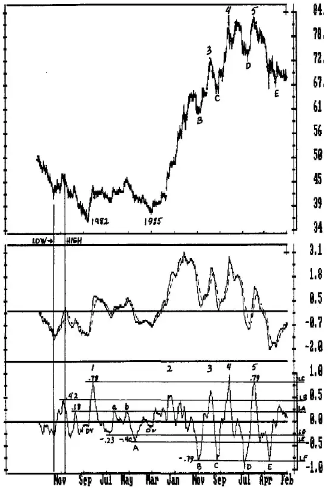

**Chart DO-1** Weekly Japanese Yen 1/2/81-2/9/90 With MACD and Detrend

Make several copies of Chart DO-1, and with a colored pencil draw horizontal lines from the important lows through the MACD and the MACD Detrend similar to the line marked 'low'. Then, using a different color, draw a horizontal line from the important highs similar to the line marked 'high'. This will allow you to get a feel for how the MACD and Detrend coincide with the highs and lows.

**CHART DO-1**...Notice in Chart DO-1 that the major tops and bottoms occur at, or before, turns of the MACD. Unfortunately, there are also a number of wiggles, or false turns, between these tops and bottoms. While the MACD does turn close to the major highs and lows, it does not give any indication of the Level at which a high or low might occur. The Zero Line seems to act as a Support/Resistance level, but unless the Crossover is used to setup a Trigger entry, the MACD itself does not indicate whether a top or bottom is likely to occur with the oscillator near the Zero Line.

Use of the Detrend will turn the MACD into a much more powerful oscillator that will frequently generate Trigger entries well before the MACD Crossover with a much smaller dollar risk.

One of the first things to do with an Oscillator Detrend is to determine Levels that will function as Buy and Sell Lines. A general guideline is that when a Buy Line is exceeded, the first downturn and Trigger entry will often confirm the high. The mirror image applies to the downside. Turning points of the Detrend that were made near major tops and bottoms often develop into valid Levels for years to come. 1982 was a major low in the Yen, and several Levels established from this time period were important as Buy/Sell Lines years later.

Important highs, lows and Levels are indicated in Chart DO-1.

**LEVEL LA**, taken from the Detrend high at .18 started out as a valid Sell Line for the highs at 'a' and 'b', then lost its effectiveness in the powerful bull market that followed until February 1987 when it slowed prices to form a Kiss Pattern described below.

**LEVEL LB** at .42, from the major reaction high preceding the 1982 low, was exceeded 5 times, and 4 of the 5 made sizable tops when the oscillator turned down at 1, 3, 4 and 5.

**LEVEL LC** at .78 was exceeded only twice, once by only .01 as the Detrend high at 5 was made at .79. Both turning points occurred the same week as the price high. This Level was set by the reaction high out of the '82 low. It is not uncommon for the first reaction following a big decline to dwarf the subsequent Detrend turning points, but it often does act as a resistance level at some point in the bull market that eventually follows.

**LEVEL LD** was set by the first major low following the 1982 low, at -.23. Of the 7 Detrend lows below it, 5 were sizable bottoms.

**LEVEL LE** was set at a sizable price bottom with a Detrend low at -.40. Level LF at -.79 was nearly twice the previous Detrend low at -.40.

All of these Levels are likely to be important in the future and should be drawn on current charts.

Another interesting aspect of this chart is that both the 1982 and the 1985 lows were made with price/oscillator divergence, indicated by the DV. This pattern may not repeat, but if it does show up following a major decline, you will be prepared for it if you record it in a notebook for future reference.

**CHART DO-2**...The overview comes from the longer-term charts; the detail work for analysis comes from the shorter-term but more detailed charts. Chart DO-2 includes the time period from September 1986 through January 1990. The Buy and Sell Levels from DO-1 are drawn in the chart and the highs and lows are labeled the same. A 5-term Crossover of the Detrend has been added to this chart. Draw another set of colored horizontal lines from the highs and lows in the price chart and it becomes apparent that the Detrend is much more exact in identifying the highs and lows as they occur than the MACD itself.

At HIGH 3, the Detrend high was the week of the high. The MACD high occurred 2 weeks after the high. The downside penetration of the Crossover by the MACD, which is easily seen in the Detrend as it crosses the Zero Line, was not even close to the price high.

At HIGH 4 the Detrend high was also the same week as the price high, as was the high of the MACD. The downside penetration of the Crossover by the MACD occurred well after the price high was made.

At HIGH 5 the Detrend high was again the same week as the price high, and the MACD high was made 2 weeks later. The downside penetration of the Crossover by the MACD was again well after the high.

The Detrend, at least for these 3 highs, is clearly the most exact indicator of the top when qualified that it requires a downturn above a specific Sell Line. Market entry will be discussed later.

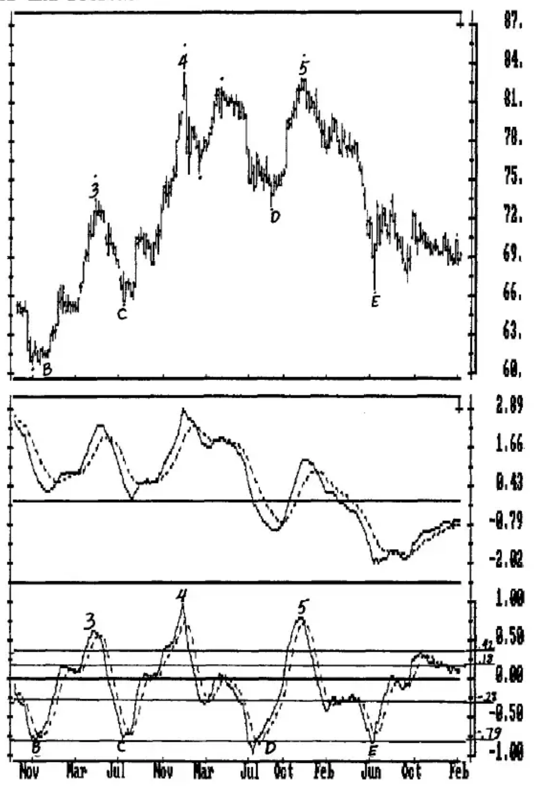

**Chart DO-2** Weekly Japanese Yen 9/86-1/90 With MACD and Detrend

The difference between the MACD and the Detrend in the identification of the lows shows even more clearly in this chart. Of the 4 lows at B, C, D and E, 3 made the price low the same week that the Detrend bottomed. The MACD low was made weeks following these lows, and the upside Crossover would actually have bought tops following 3 of the lows.

The potential exists for early top and bottom identification, but how can these turning points be confirmed and the market entered? A visual inspection of the Detrend shows 3 possible entry patterns.

1) Sell the low of the week of the Detrend downturn; or buy the high of the week of the upturn.

2) Sell the low of the week that completes the downside Crossover of the 5-term Moving Average of the Detrend; or buy the high of the week that completes an upside Crossover.

3) Following an overextended Detrend high or low, sell the week of the MACD downturn; or buy the high of the week of the upturn.

These entry patterns can be examined in greater detail in Charts DO-3 and DO-4.

**CHART DO-3**...shows the price low at B and the high at 3 in the top panel. The lower panel shows the Detrend as a solid line and the 5-term Moving Average of the Detrend (the Crossover) as a dashed line. A Detrend low was made at B the week of the price low at 60.73, and the Detrend turned up the following week, which had a high at 62.53. The upturn is the Setup, and the price high of that week is the Trigger to enter the market, which in this case, would have occurred 6 weeks later. Following entry, a protective sell stop would be placed just below the 60.73 low.

The day after the upturn actually made a slightly lower Detrend low, but the 60.73 price low was not taken out. In such a case, continue to use the price low as the protective sell stop.

Another Setup/Trigger combination is to use the upside crossing of the Crossover as the Setup and the price high of that week as the Trigger entry. In this case the Crossover week following B would have been the third week following the price low (indicated by the dashed vertical line) with a high at 61.88 that was exceeded the following week. The protective sell stop would have been placed just below the 60.73 price low.

The price high of 73.47 at 3 was followed by a downturn in the Detrend the following week. The low and Trigger entry of the downturn week at 72.32 was taken out the following week, which was also the Crossover week (dashed vertical line). The low of Crossover week at 72.09 was taken out the following week. The protective buy stop for both entries would have been the price high at 73.47.

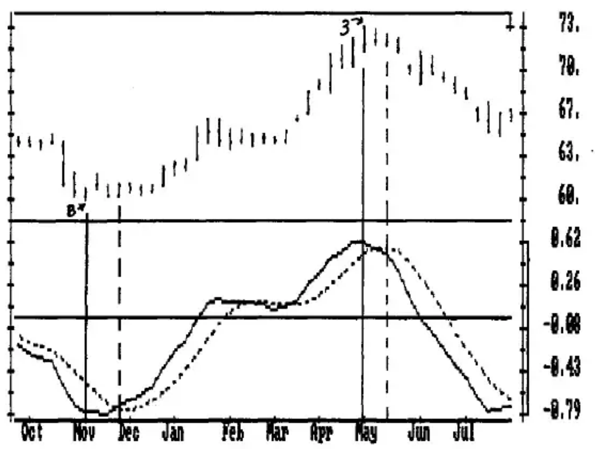

**Chart DO-3** Setup and Entry Combination From Chart DO-2

**CHART DO-4**...has an interesting situation at the Detrend low at 'a', with a price low at 74.27 made on 880715. The Detrend turns up the following week to form a Setup with a high at 77.06, which was not exceeded. The high of the Crossover 2 weeks after the low would have offered a lower entry price at 76.57, which was exceeded by .03 three weeks later at 'b', and promptly followed by a plunge to new lows. An entry and loss could have been avoided by a policy of placing the entry order 4 to 11 points above the high of the setup week, depending upon volatility.

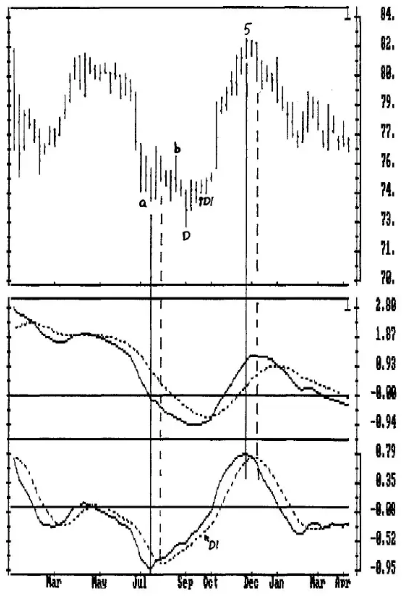

**Chart DO-4** Weekly Japanese Yen With MACD and Detrend

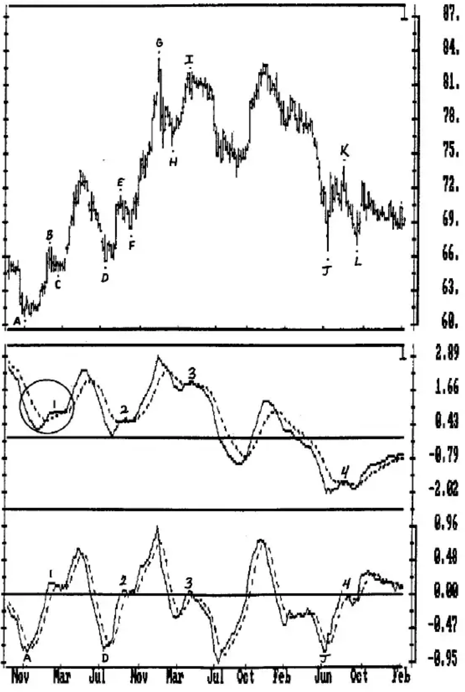

**Chart DO-5** Weekly Japanese Yen With MACD and Detrend

However, another Setup presented itself when the MACD turned up the week of D1, the third week following the actual price low at D. The high of the MACD upturn week at 75.34 was exceeded the following week and followed by a subsequent move of nearly 8 cents. The protective sell stop could have been placed below the low at D1, or the low of the week immediately following that low. Of course, other oscillators should also have been considered in the decision to take this trade.

The high at 5 provides an uncomplicated top with a selling opportunity that offers a risk of less than one cent. The Detrend high was made the same week as the price high at 82.88. The low of the downturn week at 81.98 was taken out the following week, which was also the Crossover week. Prices never came close to the initial protective buy stop above the 82.88 high.

## Kiss Pattern

The Kiss patterns form the appearance of the MACD bouncing off, or 'kissing', the MACD Crossover. The two basic Kiss patterns are bull patterns and bear patterns. Chart DO-5 has 4 Kiss patterns labeled in the MACD and Detrend chart that will be examined in detail.

Kiss Pattern 1 is a bull pattern because prices are rising from a price low at A that is above the previous price bottom. The Detrend is also at an extreme oversold Level at A in the Detrend chart. Because the Detrend peaked just below the Sell Line at .18 (see Chart DO-1) the formation of this pattern must also be evaluated as a possible top as the pattern is forming.

**CHART DO-6**...shows Kiss Pattern 1 in greater detail that will allow the formation to be more easily followed. The bottom panel shows the MACD Detrend as a solid line with the Crossover as the dashed line. Following a low at A, the Detrend rises above the Zero Line, then turns back down to test, or drop below, the Crossover. This sets up the Kiss pattern.

NUMBER 1 in the price chart indicates the week of 870206 that turned the Detrend down. The price low of this week was 64.60, which was not taken out. Had it been taken out, a short position might have been entered because of the proximity to the Sell Line at .18 in Chart DO-1.

NUMBER 2 is the week 870220, which made the downside Crossover in the Detrend chart. The price low of this week at 64.74 also held. Had it been taken out, a short position might also have been entered.

NUMBER 3 is the week of 870313, which was the Setup week of the Detrend upturn (the week the Detrend turned up). Exceeding the high of this week at 65.73 triggered a buy the following week which was also the week of the upside Crossover. The protective sell stop could have been placed below the downside Crossover week (2) at 64.74, or below the earlier oscillator downturn week (1) at 64.60.

This pattern could have produced a sell if the lows at 1 or 2 above had been taken out. They were not taken out, but if they had been and a short position established, it would have been liquidated as the long position was established.

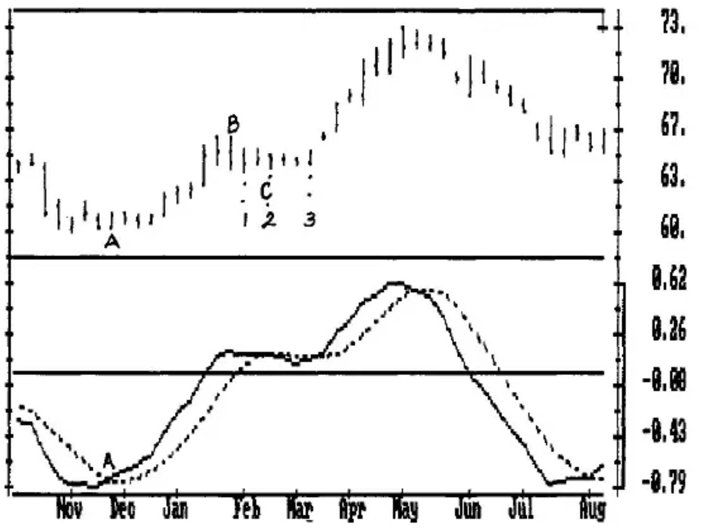

**Chart DO-6** Kiss Patern 1

**CHART DO-7**...KISS PATTERN 2 in Chart DO-7 is also a buy pattern as it followed price low D which was above the previous bottom at C. While it is not absolutely necessary that the price low before the Kiss pattern be above the previous price low, it is generally a more reliable signal in most markets.

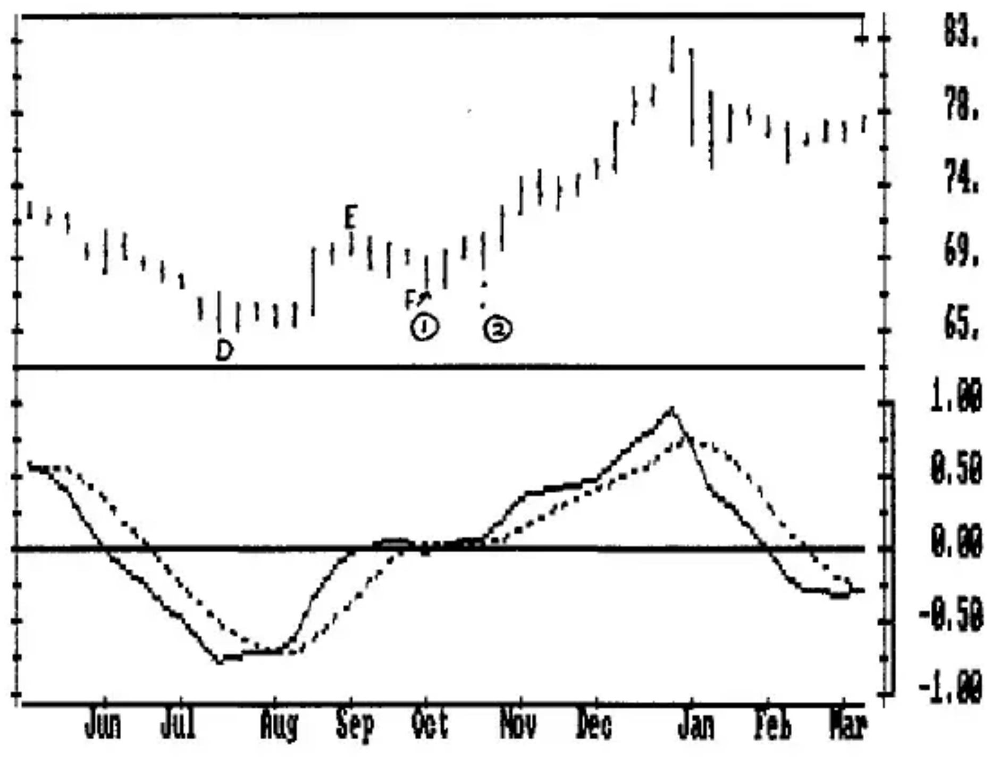

**Chart DO-7** Kiss Patern 2

NUMBER 1 in the price chart indicates the week of 871002 that turned the Detrend down and was also the week of the downside Crossover. The price low of this week was 68.40, which was not taken out. Had it been taken out, a short position might have been entered.

NUMBER 2 is the week of 871016 which was both the week the Detrend turned up and the week of the upside Crossover. Exceeding the high of this week at 71.10 triggered a buy the following week. The initial protective sell stop could have been below 68.40 and raised to 69.84, the low of the Detrend upturn week, after the highs of entry week were exceeded.

**CHART DO-8**...KISS PATTERN 3 in Chart DO-8 is a bear pattern because the price high at I in Chart DO-5 failed to exceed the previous high at G.

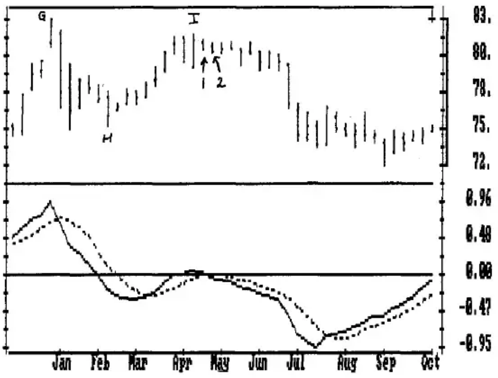

**Chart DO-8** Kiss Patern 3

NUMBER 1 in the price chart indicates the week of 880422 that turned the Detrend down. The price low and Trigger entry of this week was 81.13, which was taken out the following week (Week 2). The high at 82.10 made the week of 880415 would have been the initial protective stop.

NUMBER 2, which is the entry week, is also the week of the downside Crossover. The low of the week at 80.73 was taken out the following week, which was additional confirmation that a high had occurred.

**CHART DO-9**...KISS PATTERN 4 in Chart DO-9 is somewhat questionable, giving a sell pattern when the MACD is so overextended to the downside (see Chart DO-5). A decision to enter the market should be confirmed by other oscillators, and especially with a sell pattern at such an overextended level.

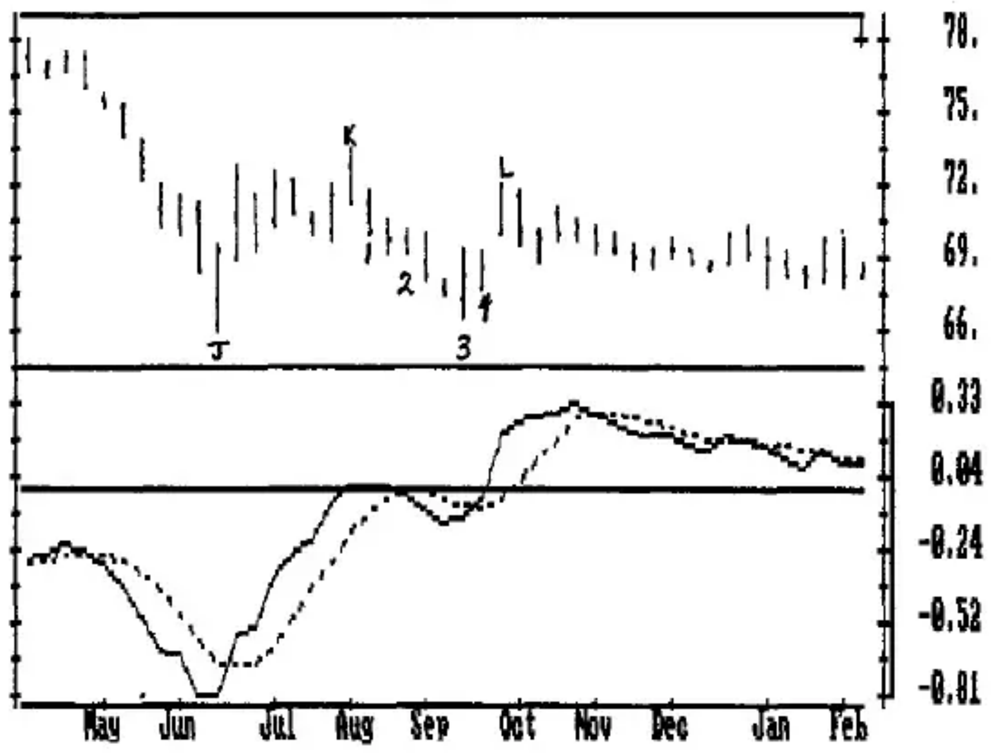

**Chart DO-9** Kiss Patern 4

NUMBER 1 in the price chart indicates the week of 890811, the Setup week that turned the Detrend down. The price low and Trigger entry of this week was 70.51, and was taken out the following week. The high at K, the week of 890804 at 73.90, would have been the initial stop.

NUMBER 2, the week of 890825, was the week of the downside Crossover. The low of the week at 69.66 was taken out the following week.

NUMBER 3 is the week of 890915, which was the Setup week of the Detrend upturn, and had a high of 69.85.

NUMBER 4 is the week of the upside Crossover with a high of 69.68 that was exceeded the following week, which was also the high of the move. The initial protective sell stop could have been placed below 67.14, which is the low of Week 3, or at 70.50, the low of the upside Crossover week.

As an indicator of longer-term tops and bottoms, this Detrend and Crossover of the COMPUTRAC MACD works well. You should research it with different input factors for the MACD, and on daily and monthly data.

**CHART DO-10**...illustrates a more sensitive oscillator, the 3-Day Average minus a 10-Day Average with a 16-Term Moving Average of the 3-10. The middle panel is the oscillator and the bottom panel is the Detrend. The time period of the chart and oscillators is the same as in the MACD detrend analysis.

The 3-10 Oscillator in the middle panel sets Levels much the same as the Detrend. Using the peaks made near the 1982 low gives 2 Levels to use as Sell Lines, 1.50 at S1 and 2.60 at S2. Buy Line B1 is at -1.50.

The Detrend Sell Lines are S4 at 1.29 and S5 at 2.44. The Buy Line is B2 at -1.50.

One aspect of powerful moves is that the 3-10 has a tendency not to drop below the Zero Line in a rising market as indicated by the up-pointing arrows. When this happens, because most of the previous lows were accompanied by a drop below Zero, there is a tendency to think that the downmove will continue after a brief rally...and the market roars up without you in it. The arrows in the Detrend show that 5 of the 6 did drop below the Detrend Zero Line, which is the 16-term Average for the 3-10. Two actually dropped to the Buy Line, which usually improves the odds of a sizable upmove.

So, a good rule to follow is that the Detrend low must drop below the Detrend Zero Line to have a bottom worth buying. The mirror image is true for the downside, as indicated by the single down-pointing arrow, which indicates the only high of significance that did not exceed the 3-10 Zero Line. Following this guideline you will miss few moves of consequence, and by waiting for a decline below the Buy Line, you will reduce the number of losing trades inherent in bottom picking. Different markets have different characteristics and you should thoroughly research this guideline before you use it.

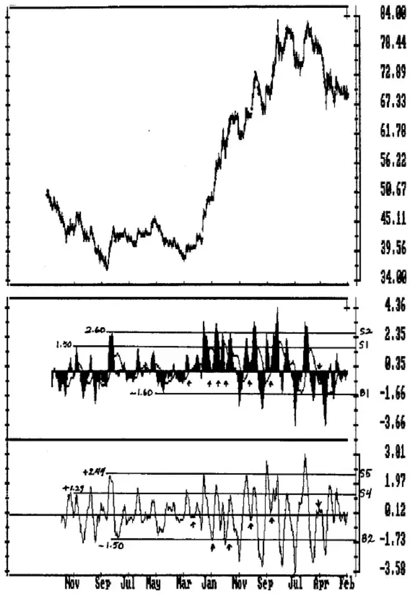

**Chart DO-10** Weekly Japanese Yen 1/2/81-2/9/90 With 3-10 Moving Average and 16-Term Crossover Detrend

**CHART DO-11**...on the following page shows the weekly Japanese Yen in Panel A with a 3-10 Detrend in Panel B, the MACD Detrend with a Crossover in Panel C, and a real-time 10-Week Detrend in Panel D.

In Panel B, every drop below Buy Line B2 indicated a bottom when the Detrend turned up. Every downturn above Sell Line S4 indicated a top.

Every high in the bull market saw the Detrend rise above Sell Line S4 until the high at X, which failed to rise above Sell Line S4 for the first time. Depending upon the position of other oscillators, this could be an indicator that the bull market was over and that prices would drop below the 3-point trendline to confirm the top.

The same Setup and Trigger entry rules used with the MACD can be used with this Detrend, and a Crossover line could also be added. In general, when the Detrend was above the Sell Lines, or below the Buy Line, a turn in the Detrend would indicate a top or bottom.

**PANEL C** is the Detrend of the same time period for the MACD with a 5-Term Crossover. Notice how the 3-10 Detrend highlights the shorter-term moves and combines with the MACD Detrend to help identify the more sizable highs and lows.

- The 3-10 Detrend supports the buy at Kiss Pattern 1 (K1) with an upturn following a drop below the Zero Line.

- In the MACD Detrend, the top at 3 is above the Sell Line at .42 (from Chart DO-1), indicating a top is due. The top at 3 is a divergent high in the 3-10 Oscillator, supporting the downturn in the MACD Detrend.

- In both the MACD Detrend and the 3-10 Detrend, the drop from the high at 4 to the C1 low is so sharp that both Detrends are slow in identifying the bottom. But the 3-10 Detrend turns up well before the MACD Detrend, as would be expected in a more sensitive oscillator. Also, the C1 low in the 3-10 Detrend is at the lowest Level reached, supporting the possibility of a bottom rather than a pause in a declining market.

- The K3 Kiss Pattern Sell in the MACD Detrend is confirmed by the downturn in the 3-10 Detrend being above the Sell Line.

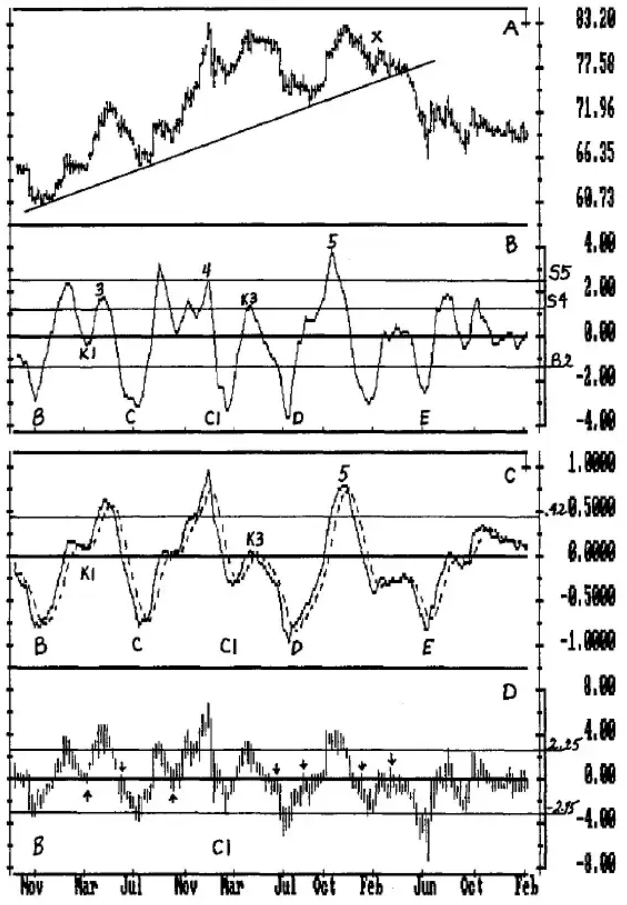

**Chart DO-11** Weekly Japanese Yen 9/86-1/90 With 3-10 Detrend, MACD Detrend, With Crossover and 10-Week Detrend

**PANEL D**--Now add the 10-Week Price Detrend with a Sell Line at 2.25 and a Buy Line at -2.75. These Levels were derived from turning points near the 1982 and 1985 lows. Several things stand out:

- The low at B, which was the first Detrend low for the 3-10 and MACD Detrends was at an existing Level in the Price Detrend, a potential indicator of a bottom by itself.

- The arrows show how the 10-Week Moving Average, which is the Zero Line in this Detrend, acts as a natural support and resistance level.

- The low at C1 at the Buy Line occurs just before the upturn in the 3-10 Detrend, lending support to the formation of a bottom rather than a short pause in a downmove.

On your own, continue to add in some of the other oscillators and Detrends described in other chapters, and you will get a true feeling for the use of multiple oscillator analysis in the 3-Dimensions of daily, weekly and monthly charts.
