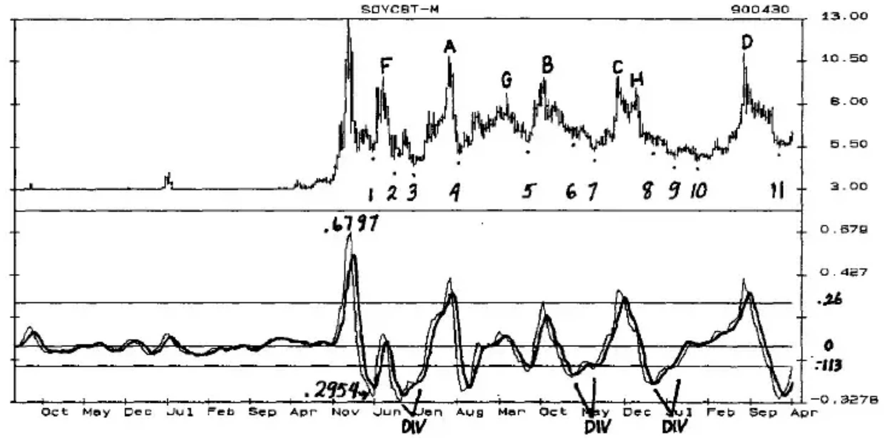
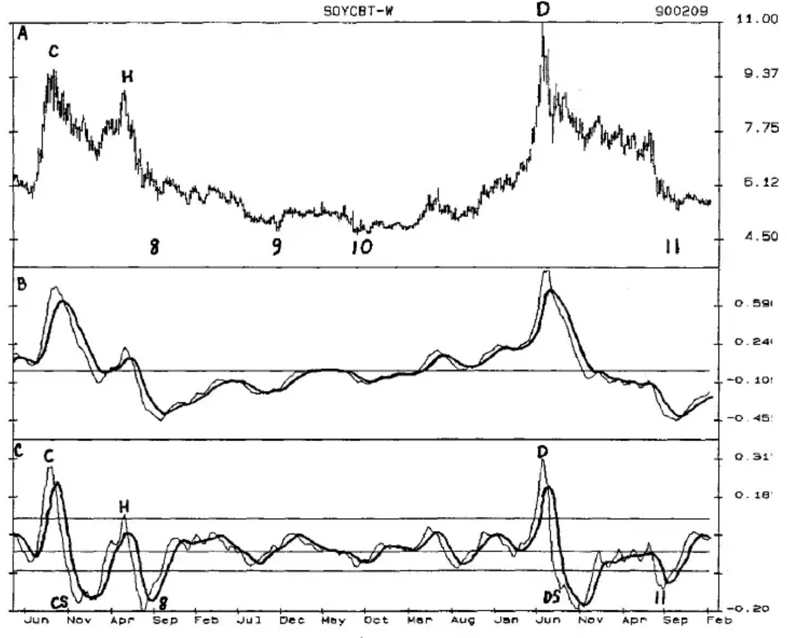
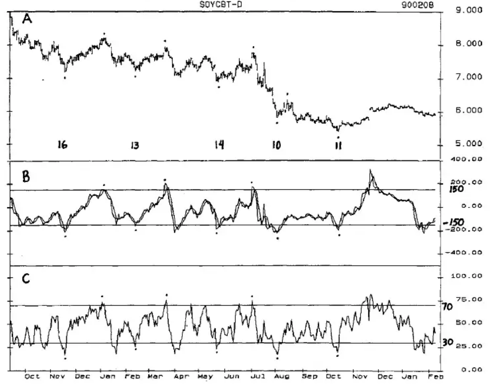

# Chapter Seven: 3-Dimensional Analysis

Three dimensional 3-D analysis involves the evaluation of markets on three levels: long-term, intermediate-term and short-term. When oscillators are run on 3 different time periods each level gives a different perspective. The longer-term time periods indicate the tops and bottoms of longer-term cycles; the shorter-term time periods give exit patterns with lower dollar risk than the longer time periods.

Monthly data is used for the long term, showing the highs and lows of cycles longer than one year, and is also useful for identification of the Seasonal Cycle. Weekly data is best for identification of the highs and lows of the Seasonal Cycle and also the weekly Primary Cycles. Daily data is used to identify the Primary Cycle and the daily Trading Cycles. Intra-day data can also be used to identify and trade the Trading Cycle, as well as shorter-term daily and intra-day cycles using the same concepts.

This book is oriented towards intermediate and long-term positions dependent upon the yearly cycles, Seasonal Cycles, Primary Cycles and Trading Cycles. However, for shorter-term traders the same concept--long-term, short-term, intermediate-term--can be applied on various short-term combinations such as weekly, daily, hourly; or daily, hourly, 13 minute time periods.

The following soybean charts illustrate the use of 3-D analysis to identify the long-term cycle highs and lows through the use of overbought and oversold levels of different time periods. The examples show one oscillator for each time period. In normal analysis at least several oscillators should be used for each time period, and some of these would have high probability Setup/Trigger entry combinations to eliminate judgment calls. To get the most from 3-D analysis:

1. Use the monthly oscillator to establish parameters that indicate overbought and oversold levels of longer-term cycles.

2. Use weekly oscillators to establish parameters that indicate overbought and oversold levels of the Seasonal Cycles and/or the weekly Primary Cycle.

3. Use daily oscillators to establish parameters that indicate the overbought and oversold levels of the Primary Cycle and/or the Trading Cycle.

## Monthly

The soybean market has long-term cycles of 24 and 39 months that combine to produce oversold bottoms followed by major bull markets and overbought tops followed by extended bear markets.

**CHART 3D-1**...shows a monthly chart of soybeans from 3/61 through 3/90 in the top panel. Specific tops and bottoms are identified and will be referenced below. The bottom panel is a Detrend of the COMPUTRAC MACD with a 5-term Crossover, which is the darker line.

**CHART 3D-1** Monthly Soyabean Chart With MACD Detrend

The Sell Line at .26 was determined by multiplying the 1973 oscillator high at .6797 by .618 and subtracting the result from .6797. Four major cycle highs at A, B, C, and D were made as the oscillator was above the Sell Line. Each high above the Sell Line was confirmed by a downturn of the Detrend and a drop below the low of the downturn month. Two other 24/39-Month Cycle highs occurred at F and G as the Detrend was above the Zero Line but below the Sell Line, and would need to be identified by other oscillators. The high at H was a Seasonal high in the same long-term cycle as the high at C.

The pattern that clearly identified the highs of the 24/39-Month Cycle was a rise above the Sell Line followed by a downturn in the oscillator, and the Trigger entry of a drop below the low of the downturn month. A rise above the Zero Line followed by a downturn may be a secondary indicator of a top identified by other oscillators, but would not be an indicator by itself.

The Buy Line at -.113 was determined by multiplying the first low following the 1973 high at -.2954 by .618 and subtracting the result from -.2954. Of the 11 major lows, 4 (1, 4, 5, and 11) were identified by an upturn of the oscillator below the Buy Line followed by a rise above the high of the upturn month. A secondary confirmation was made by the oscillator rise above the Crossover, and a price rise above the high of the month of the Crossover. Lows 2 and 6 would have been false indicators of the bottom and lost money. Low 8 was a non-performer as the Trigger entry of exceeding the high of the upturn month was not completed.

Lows 3, 7, and 9 were all divergent patterns of lower prices and a higher oscillator low that was also a Kiss pattern (described in Chapter Six on 'Detrending Oscillators'). Lows 3 and 7 were the cycle bottoms, but Low 9 was followed by one more Seasonal decline to new lows as a long-term cycle bottom was made.

Of the 7 major 24/39-Month Cycle bottoms indicated by the dots, 6 were identified by either an upturn and Trigger entry below the Buy Line, or a price/oscillator divergence with a Kiss pattern. Only the extended decline into the 1986 bottom that included Seasonal lows at 8, 9, and 10 was not identified by this approach.

As the monthly oscillator is at levels that would indicate a potential top or bottom, the weekly oscillators may complete entry patterns that would indicate or confirm the top or bottom before the monthly pattern is completed. Also, once a monthly pattern has been completed, weekly patterns can give additional high probability Trigger entries as the market trends to the next top or bottom.

## Weekly

**CHART 3D-2**...shows weekly soybean price data in the top panel from 5/83 through the week of 2/9/90. The highs and lows are labeled the same as in the monthly chart--C, D, and H for the highs; 8, 9, 10 and 11 for the lows.

The weekly COMPUTRAC MACD (26, 12 and 9 weeks) in Panel B clearly indicates that the highs at C and D are likely to be major ones by the height of the MACD above the Zero Line at the same time that the monthly Detrend in Panel C is above the Sell Line. At both C and D a simple downturn of the MACD followed by a Trigger entry at the price low of the downturn week would have confirmed the top of the long-term cycles. A downturn and Trigger entry would have also been a good indicator of the Seasonal high at H. But the MACD would not have been of much help in identifying the bottoms.

**CHART 3D-2** Weekly Soyabean Chart With MACD Detrend

The Detrend of the MACD and Crossover in Panel C has a Sell Line at .111 calculated by multiplying the oscillator high of .2900 at C by .618 and subtracting the result from .2900. The Buy Line at -.07 was calculated by multiplying the Detrend low of -.1840 at CS by .618 and subtracting the result from -.1840. In real-time analysis Buy and Sell Lines would have been established in earlier years by using this same method at an earlier high, or by using an earlier oscillator high as the Level. Unfortunately, price data of earlier years is not always readily available, and when in doubt Fibonacci calculations work reasonably well. In either case the oscillator highs at C and D would have been well above the Sell Line, and the high at H would probably have also been above it.

Our intent is to see if the highs of the weekly oscillator can be used, as the monthly oscillator is above the Sell Line, to indicate or confirm the top before the monthly oscillator confirms it. At Highs C and D a simple downturn followed by a Trigger entry of a drop below the low of the downturn week would have been an earlier indicator and entry than the monthly chart. Seasonal High H would also have been confirmed by a downturn and Trigger entry. Other oscillators would be used to identify and trade the other Seasonal highs that occurred with oscillator highs below the Sell Line, but you can see that the Seasonal highs and lows tend to occur near Detrend highs and lows.

Once a longer-term cycle high has been identified, Seasonal, Primary Cycle and Trading Cycle highs can be sold until the longer-term cycles bottom.

Guidelines for an early identification of the highs of the 24/39-Month Cycles are:

- A rise in the monthly oscillator above the Sell Line. At times this may require the assumption of a month-end close above or below a certain price level.

- A rise above the Sell Line in the weekly Detrend followed by a downturn in the oscillator, and

- A Trigger entry of a drop below the low of the week that turned the oscillator down.

This combination gave an earlier entry than the monthly chart at both C and D, and a downturn in the weekly MACD would have been additional confirmation of the cycle highs.

Of the lows in the monthly chart that occurred below the Buy Line, only 7, 8, and 11 are below the Buy Line in the weekly Detrend chart, offering an opportunity to anticipate an upturn and confirmation in the monthly chart. (The price low at 7 is not shown in the weekly chart, but can be seen by using the data in your own analytical program.)

The Detrend bottoms tend to occur before the actual price low, so an 8-term Crossover of the Detrend is used for the Setup. The Trigger entry of exceeding the price high of the week that made the Crossover identified the bottom in 7 and did not enter the market at 8 and 11, both of which had relatively small upside moves.

Using a drop below the Buy Line to identify the Seasonal lows at CS and DS would have confirmed the lows and resulted in profitable trades. Since the monthly oscillator was not below its Buy Line, these lows would not have been considered as potential 24/39-Month lows. Other oscillators would be used to identify the remaining lows.

When the weekly oscillator is at levels that would indicate a potential top or bottom, the daily oscillators may complete entry patterns that would indicate or confirm the top or bottom before the weekly pattern is completed. Also, once a weekly pattern has been completed, daily patterns can give additional high probability Trigger entries following a top or bottom.

## Daily

The highs and lows of the 14-Week Primary Cycle are relatively easy to identify through the use of the daily oscillators. The low of the 24/39-Month Cycle at 11 is also identified and could have been bought within days of the low.

**CHART 3D-3**...The top panel of Chart 3D-3 shows daily soybeans from 9/88 through 2/8/90 with the Primary Cycle highs indicated by the dots above the highs. The Primary Cycle lows are indicated by the number of weeks from low-to-low below each low.

The MACD was not a very good indicator of the Primary Cycle highs or lows, but two other oscillators described below combine exceptionally well to identify the highs and lows of the Primary Cycle and generate buy and sell signals. These patterns would not have helped identify the 1988 high at D, which was nicely identified and sold using the weekly MACD. However, they do give excellent sell signals at the Primary Cycle highs that followed the high.

Panel B shows a 40-day CCI with the Sell Line at 150 and the Buy Line at -150 instead of the normal +/- 100. A 4-term Crossover has been added because the lows of the CCI tend to occur early and often wiggle.

The Primary Cycle highs are identified by the following Setup:

- a rise above the Sell Line at 150,
- followed by a downturn in the oscillator,
- with a Trigger entry of a drop below the low of the downturn day.

A continued decline below the Crossover and a drop below the price low of Crossover day gives additional confirmation of the Primary Cycle top at the 3 highs which had a rise in the CCI above the Sell Line.

**CHART 3D-3** Daily Soyabean Chart With a 40-Day CCI, and an 8-Day RSI

The Primary Cycle lows are identified by the following Setup:

- Prices must bottom within the Timing Band of 11 to 20 weeks from the previous Primary Cycle low, and
- the CCI must decline below the Buy Line at -150,
- which must be followed by a rise above the Crossover,
- with a Trigger entry of a rise above the price high of Crossover day.

All 5 Primary Cycle lows were identified within days of the bottom, which would have allowed profits on short positions to be taken and/or long positions to be established. The low of the 24/39-Month Cycles and the Seasonal low at 11 could also have been bought only days from the price low.

Panel C shows an 8-day RSI that exceeds the Sell Line at 70 as each Primary Cycle high is made, and drops below the Buy Line at 30 as each Primary Cycle low is made. A requirement that a rise above the Buy Line or a drop below the Sell Line of this RSI should be added to the Setups above. By itself the RSI is not a powerful indicator of cycle highs and lows, but when combined with Timing Bands and one or more other oscillators it can increase both the probability of success and the confidence necessary to take a trade.

Another aspect of 3-D analysis is to run oscillators that are time dependent, such as the RSI, Detrend, Stochastics and Momentum in 3 different time lengths: 5, 8, and 13; or 10, 20 and 40. Use the longer-term time periods to help identify the major overbought and oversold levels, and use the shorter-term time periods to identify the shorter cycles and enter the market and to trade.
