# Chapter Eight: THE PRIMARY CYCLE IN GOLD

The dominant weekly cycle in gold is the 18-Week Primary Cycle, as measured from low to low. The Primary Cycle is actually a summation of many shorter term cycles, and as such it often contracts, extends and sometimes seems to skip a beat. Eighteen weeks is an average, and 90% of all Gold Primary Cycles since 1972 have bottomed within a Timing Band of 11 to 23 weeks from the previous low. While this is a broad period of time, there are ways to greatly improve the probability of identifying Primary Cycle lows and highs shortly after they occur.

Cycles can simply be counted on a weekly chart from low-to-low, or high-to-high; or a more accurate count can be obtained using the component parts of a cycle as described in the use of Timing Bands in Chapter One. The use of oscillators with historically researched patterns allows a more exact and timely identification of the highs and lows of this cycle. But first, a brief review of several important concepts will insure an understanding of how to work with cycles.

## RIGHT AND LEFT TRANSLATION

One of the many advantages of cycle analysis is that realistic expectations for time and price moves can be established. A basic understanding of the concept of Right and Left Translation provides additional input to determine your trading strategies and money management.

As a market is rising, prices tend to go up for a longer period of time than they go down. This is called Right Translation, and it can be restated that in a bull market the up-phase of the cycle will last longer than the down-phase.

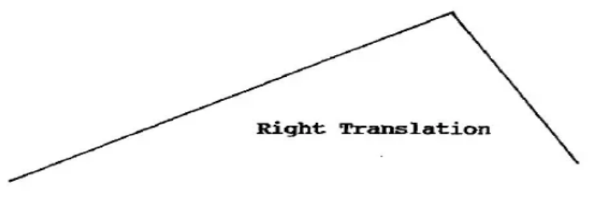

In a falling market, prices tend to go up for a shorter period of time than they go down. This is called Left Translation, and it can be restated that in a bear market the down-phase of the cycle will last longer than the up-phase.

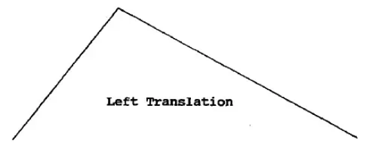

The weekly gold charts, G-1 and G-2, are from 3/81 through 2/90. The Primary Cycle highs and lows are shown by the dots, and the dashed vertical lines separate the bull market and bear market phases as determined by an oscillator described later in this chapter. Notice how most of the cycle highs in the bear phase lean to the left, and most of the highs in the bull phase lean to the right.

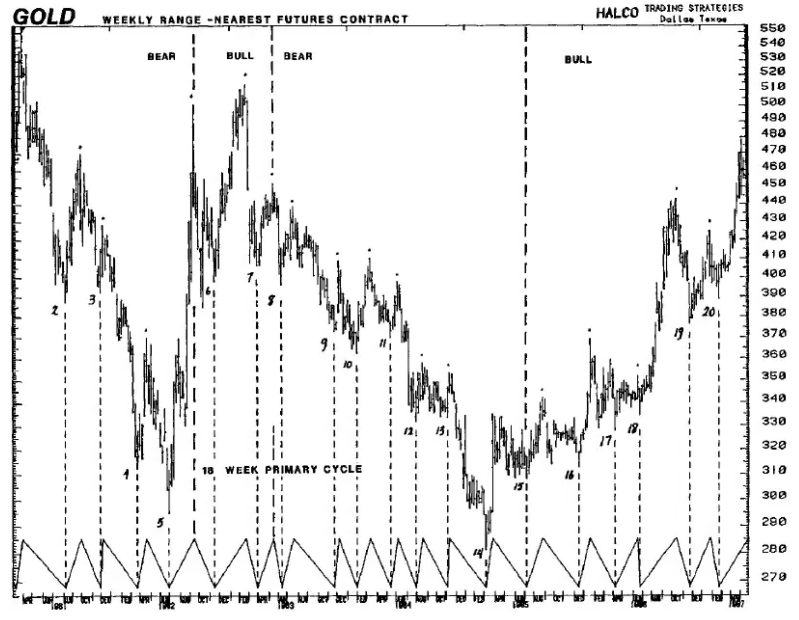

**Chart G-1** Weekly Gold

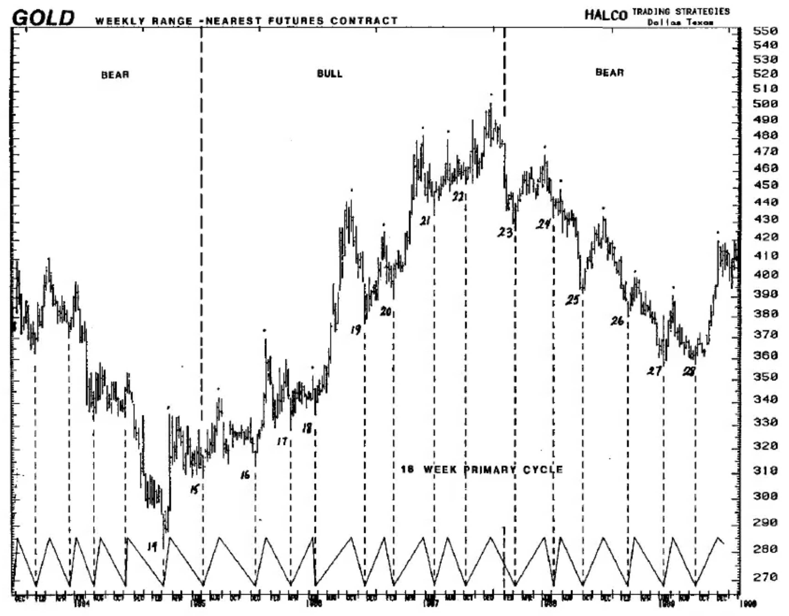

**Chart G-2** Weekly Gold

An analysis of the average time and price moves from the Primary Cycle lows to the highs and the highs to the lows shows a distinct difference between those cycles in bull markets and those in bear markets. Table GT-1 lists the 28 Primary Cycles for this time period, and the basic components of each cycle.

The column headings are fairly clear. Column 2 is the Friday date of the PC low, the date of the price high is in Column 4, and the following PC low is in Column 8.

**Gold Primary Cycle Time Count and Price Movement**

| # | DATE LOW | PRICE LOW | DATE HIGH | PRICE HIGH | %L-H | WEEKS L-H | DATE LOW2 | PRICE LOW2 | PT DIF | %H-L | WEEKS H-L | BULL/BEAR |
|---|----------|-----------|-----------|------------|------|-----------|-----------|------------|--------|------|-----------|-----------|
| 1 | 2 | 3 | 4 | 5 | 6 | 7 | 8 | 9 | 10 | 11 | 12 | 13 |
| 1 | 810306 | 453 | 810327 | 534 | 17.88% | 3 | 810807 | 387 | 147 | 27.5% | 19 | BEAR |
| 2 | 810807 | 387 | 810925 | 470 | 21.45% | 7 | 811127 | 392 | 78 | 16.6% | 9 | |
| 3 | 811127 | 392 | 811204 | 428 | 9.18% | 1 | 820319 | 312 | 116 | 27.1% | 15 | |
| 4 | 820319 | 312 | 820416 | 370 | 18.59% | 4 | 820625 | 295 | 75 | 20.3% | 10 | |
| 5 | 820625 | 295 | 820910 | 501 | 69.83% | 11 | 821112 | 398 | 103 | 20.6% | 9 | 820827 |
| 6 | 821112 | 398 | 830218 | 514 | 29.15% | 14 | 830325 | 406 | 108 | 21.0% | 5 | BULL |
| 7 | 830325 | 406 | 830513 | 452 | 11.33% | 7 | 830610 | 396 | 56 | 12.4% | 4 | 830603 |
| 8 | 830610 | 396 | 830715 | 439 | 10.86% | 5 | 831118 | 373 | 66 | 15.0% | 18 | BEAR |
| 9 | 831118 | 373 | 831202 | 408 | 9.38% | 2 | 840127 | 364 | 44 | 10.8% | 8 | |
| 10 | 840127 | 364 | 840309 | 410 | 12.64% | 6 | 840511 | 370 | 40 | 9.8% | 9 | |
| 11 | 840511 | 370 | 840601 | 398 | 7.57% | 3 | 840727 | 332 | 66 | 16.6% | 8 | |
| 12 | 840727 | 332 | 840817 | 358 | 7.83% | 3 | 841102 | 333 | 25 | 7.0% | 11 | |
| 13 | 841102 | 333 | 841109 | 353 | 6.01% | 1 | 850301 | 281 | 72 | 20.4% | 16 | |
| 14 | 850301 | 281 | 850322 | 335 | 19.22% | 3 | 850703 | 308 | 27 | 8.1% | 15 | |
| 15 | 850703 | 308 | 850823 | 342 | 12.04% | 8 | 851213 | 313 | 25 | 8.5% | 15 | 850809 |
| 16 | 851213 | 313 | 860117 | 369 | 17.89% | 5 | 860404 | 328 | 41 | 11.1% | 11 | BULL |
| 17 | 860404 | 328 | 860613 | 352 | 7.32% | 10 | 860620 | 334 | 18 | 5.1% | 1 | |
| 18 | 860620 | 334 | 861010 | 443 | 32.63% | 14 | 861121 | 376 | 67 | 15.1% | 8 | |
| 19 | 861121 | 376 | 870123 | 425 | 13.03% | 9 | 870220 | 389 | 36 | 8.5% | 3 | |
| 20 | 870220 | 389 | 870522 | 481 | 23.65% | 13 | 870626 | 434 | 47 | 9.8% | 5 | |
| 21 | 870626 | 434 | 870807 | 479 | 10.37% | 6 | 871002 | 452 | 27 | 5.6% | 8 | |
| 22 | 871002 | 452 | 871218 | 502 | 11.06% | 11 | 880304 | 425 | 77 | 15.3% | 11 | 880219 |
| 23 | 880304 | 425 | 880603 | 469 | 10.35% | 13 | 880701 | 432 | 37 | 7.9% | 4 | BEAR |
| 24 | 880701 | 432 | 880722 | 449 | 3.94% | 3 | 880930 | 391 | 58 | 12.9% | 10 | |
| 25 | 880930 | 391 | 881202 | 433 | 10.74% | 9 | 890217 | 380 | 53 | 12.2% | 11 | |
| 26 | 890217 | 380 | 890310 | 400 | 5.26% | 3 | 890609 | 356 | 44 | 11.0% | 13 | |
| 27 | 890609 | 356 | 890707 | 390 | 9.55% | 4 | 890915 | 357 | 33 | 8.5% | 10 | |
| 28 | 890915 | 357 | 891124 | 419 | 17.37% | 10 | 900105 | 394 | 25 | 6.0% | 6 | 891117 |

*Table GT-1*

## Table Summaries

**Average Number of Weeks and % Moves From Low to High and High to Low**

| | Weeks Low to High | % Low to High | Weeks High to Low | % High to Low |
|---|---|---|---|---|
| Bull Market | 9.5 | 21.5% | 6.4 | 11.6% |
| Bear Market | 4.4 | 11.3% | 11.6 | 14.4% |

In the bull markets the average number of weeks from low to high is more than twice the number of weeks in the bear markets, and the percentage rise is almost double that in a bear market. The number of weeks from high to low is about half the number of weeks in a bear market, and the percentage decline is 20% less than in a bear market.

Additional analysis of the Primary Cycles in this time period shows that 90% of the highs in bull markets were made 5-14 weeks from the Primary Cycle low. This establishes a minimum expectation of 5 weeks for a high to occur. And since the average number of weeks from low to high is 9.5 weeks, we can expect that about half of the cycles in a bull market will make the PC high 9-14 weeks, or more, from the low. This time factor alone would indicate that long-term positions in a bull market should have a relatively wide stop until Week 9, when it should be moved closer to the market each week until stopped out. The average rise of 21.5% would also indicate that sizable moneymaking moves should occur about half of the time.

In bear markets, 80% of the highs occur 1-6 weeks from the PC low, warning us to be prepared for a relatively quick top, and at an average rise of 11.3%, one that is not likely to be a big moneymaker. A long-term position should have a relatively close stop, which would be moved closer to the market beginning with Week 4 from the PC low. The bear market picture is actually saying that long positions are high risk, and that most of your effort should go into selling short at the PC tops.

Another aspect of cycles that is not part of Right and Left Translation, but is a characteristic of bull and bear markets, is the activity of the PC low at the end of a cycle. In bull markets the PC low tends to be higher than the previous PC low. Of course, all markets are somewhat different, but in the bull market phase in gold in these examples, every PC low was above the previous PC low until the market shifted into its bear phase, when about two-thirds of the PC lows were below the previous PC low. Again, this information is helpful in establishing expectations for the size and duration of a move, and the resulting changes in money management.

## MACD OSCILLATOR PATTERNS

The Moving Average Convergence-Divergence, or MACD, is in most analytical programs, and its construction is explained in the Appendix.

In gold, the standard COMPUTRAC MACD was used to determine the bull and bear phases to evaluate the performance of the PC. However, the standard approach of using the crossing of the Crossover by the MACD is neither quick enough to trade, nor slow enough to determine the bull and bear phases of the markets. In this market the upward crossing of the Zero Line by the MACD ends the bear phase and begins the bull phase, while the downward crossing of the Zero Line by the MACD ends the bull phase and begins the bear phase.

Chart G-3...for 810162-900209 shows the bull and bear phases of the market as determined by the MACD. The dates these phases begin and end are in Table GT-1, Column 13.

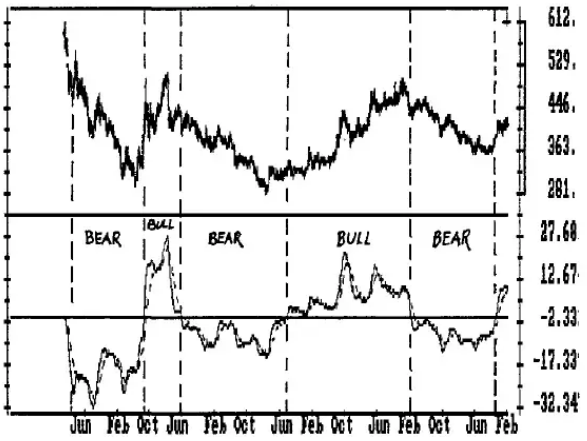

**Chart G-3** Weekly Gold 1/81-2/90 With MACD as Indicator of Bll/Bear Markets

The COMPUTRAC MACD is also the basis for an oscillator that has identified 80% of the PC lows and is shown in Charts G-4, G-5, and G-6. There are three steps to calculate it:

1. Run the COMPUTRAC MACD (26, 12, 9 days). Then erase it from the screen.
2. Use the Spread Study to detrend the MACD around the Crossover.
3. Calculate a 3-Term Moving average of the resulting Spread and use it as a Crossover line.

Simply using the turns of the oscillator and the Crossovers does not work well. But a combination of the 11-23 Week Timing Band and the use of 3 oscillator patterns turns this oscillator into an excellent indicator of the PC lows, and gives very good entry signals for a weekly chart.

The 3 oscillator patterns are called the Oversold, the Kiss and the Hook.

**The Oversold** is formed by:

1. A drop in the oscillator below -1. In the time period studied, all oscillator lows for this signal occurred at -1 to -11.
2. An upturn in the oscillator, which exceeds the Crossover and is followed by...
3. Prices exceeding the high of the Crossover Week.

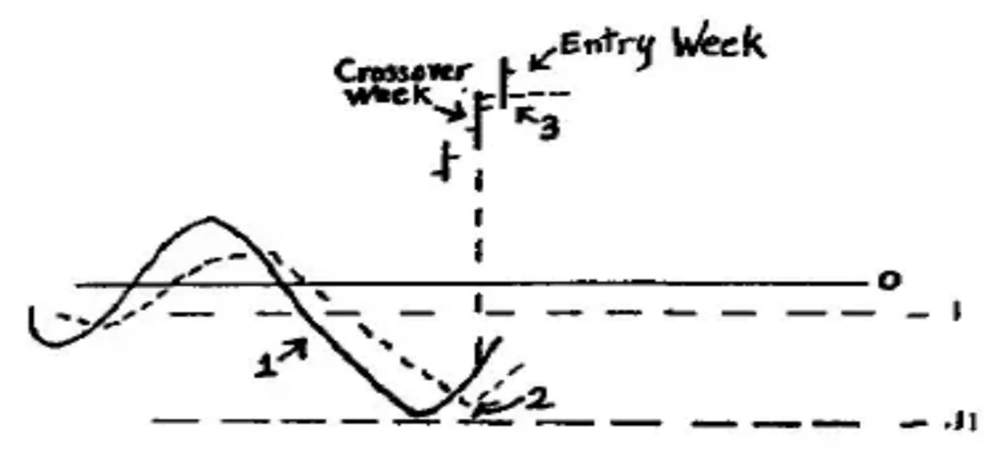

**The Kiss** is formed by:

1. Rising from below the Zero Line, the oscillator rises to a high above the Zero Line, then drops below the Crossover to .50 to -.99, and turns back up.
2. Exceeding the Crossover, and being followed by...
3. Prices exceeding the high of Crossover Week.

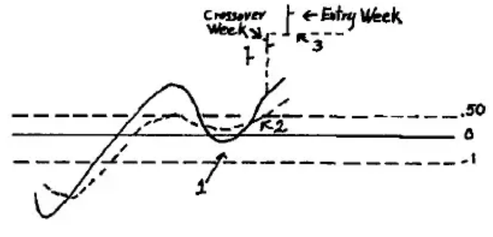

**The Hook** is formed by:

1. An oscillator low below -1 that rises to a level that is generally below 0, and then turns down.
2. Dropping below the Crossover line and rising back above it, followed by...
3. Prices exceeding the high of Crossover week.

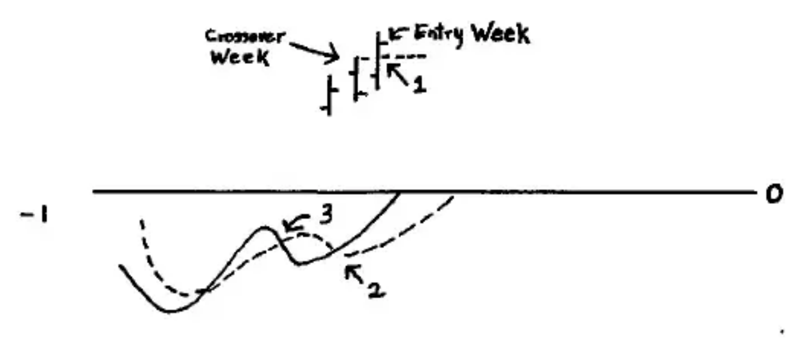

Charts G-4, G-5, and G-6 overlap and can be 'cut and pasted' together to have a continuous chart of gold from 810130 to 900209. The PC lows are numbered in the price chart. The bottom panel is the MACD Detrend with a 3-Term Moving Average Crossover. The type of pattern that occurred at the PC low, if any, is indicated.

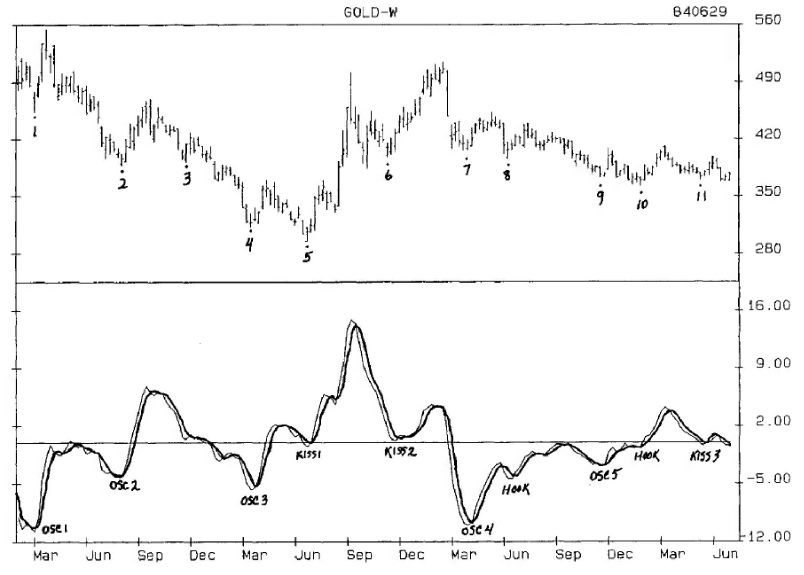

**Chart G-4** Weekly Gold

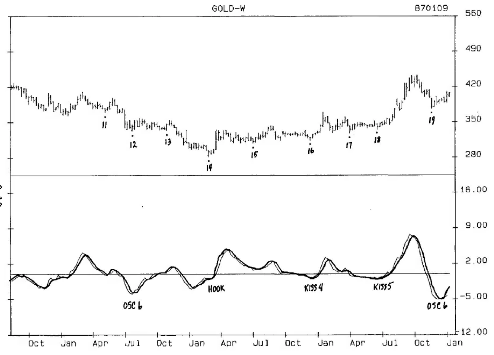

**Chart G-5** Weekly Gold

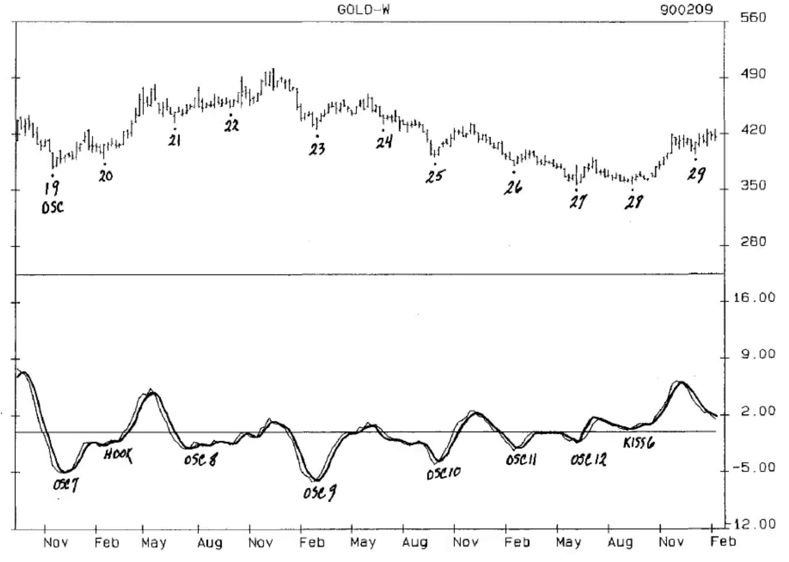

**Chart G-6** Weekly Gold

## RESEARCH TABLES

Unfortunately, few people take the time to evaluate the use of an oscillator. Most people seem to think that by simply having an analytical package they will have the 'edge' over other traders and automatically make money. Actually, the opposite is generally true until one learns the new skills necessary to combine the chart with the oscillators. And even then, one encounters the same pitfalls outlined in THE 22 CARDINAL MISTAKES OF COMMODITY TRADING (see Chapter Fourteen).

It is only through the sometimes tedious, but often rewarding process of thorough research that one develops groups of patterns that are reliable indicators of tops and bottoms, as well as moneymakers. No single oscillator or pattern will work all of the time, so a variety of oscillators should be researched and followed.

Table GT-2 is used to evaluate the Oversold, Kiss and Hook patterns identified in the charts. Guidelines are developed to utilize these patterns to identify the cycle lows and determine expectations for the cycle high. With more research, these patterns can be developed into mechanical buy patterns.

**Research Table for Charts G-4, G-5, and G-6 of Weekly Gold with Primary Cycle Analysis and MACD Detrend With a 3-Term Crossover.**

| # | DATE LOW | OSC LOW | PRICE LOW | PL/OSC | WKS/XVR | XO/EWK | DATE HIGH | PRICE HIGH | % | L-R | WEEKS | OSC | KISS |
|---|----------|---------|-----------|--------|---------|--------|-----------|------------|---|-----|-------|-----|------|
| 1 | 2 | 3 | 4 | 5 | 6 | 7 | 8 | 9 | 10 | 11 | 12 | 13 | 14 |
| 3 | 811127 | 0.53 | 392 | 0 | 1 | | 811204 | 428 | 9.18% | 1 | | | |
| 13 | 841102 | 0.79 | 333 | -1 | 1 | 1 | 841109 | 353 | 6.01% | 1 | | | |
| 24 | 880701 | | 432 | | | | 880722 | 449 | 3.94% | 3 | | | |
| 17 | 860404 | | 328 | | | | 860613 | 352 | 7.32% | 10 | | | |
| 15 | 850703 | 0.73 | 308 | 0 | 2 | 2 | 850823 | 342 | 12.04% | 8 | | | |
| 22 | 871002 | -1.56 | 452 | 0 | 1 | 1 | 871218 | 502 | 11.06% | 11 | 1 | | |
| 1 | 810306 | -10.72 | 453 | 0 | 1 | 1 | 810327 | 534 | 17.88% | 3 | 1 | | |
| 2 | 810807 | -3.93 | 387 | -1 | 1 | 1 | 810925 | 470 | 21.45% | 7 | 2 | | |
| 4 | 820319 | -5.68 | 312 | 0 | 2 | 1 | 820416 | 370 | 18.59% | 4 | 3 | | |
| 7 | 830325 | -9.74 | 406 | 1 | 0 | 1 | 830513 | 452 | 11.33% | 7 | 4 | | |
| 9 | 831118 | -2.87 | 373 | 0 | 2 | | 831202 | 408 | 9.38% | 2 | 5 | | |
| 12 | 840727 | -3.95 | 332 | 0 | 1 | 2 | 840817 | 358 | 7.83% | 3 | 6 | | |
| 19 | 861121 | -5.04 | 376 | 2 | 4 | 1 | 870123 | 425 | 13.03% | 9 | 7 | | |
| 21 | 870626 | -2.1 | 434 | 3 | 0 | 1 | 870807 | 479 | 10.37% | 6 | 8 | | |
| 23 | 880304 | -6.28 | 425 | -1 | 1 | 1 | 880603 | 469 | 10.35% | 13 | 9 | | |
| 25 | 880930 | -4.1 | 391 | 0 | 1 | | 881202 | 433 | 10.74% | 9 | 10 | | |
| 26 | 890217 | -2.32 | 380 | 0 | 1 | 1 | 890310 | 400 | 5.26% | 3 | 11 | | |
| 27 | 890609 | -1.42 | 356 | 0 | 1 | 1 | 890707 | 390 | 9.55% | 4 | 12 | | |
| 5 | 820625 | 0.44 | 295 | 0 | 1 | 1 | 820910 | 501 | 69.83% | 11 | | | 1 |
| 6 | 821112 | 0.29 | 398 | 2 | 2 | 1 | 830218 | 514 | 29.15% | 14 | | | 2 |
| 11 | 840511 | -0.3 | 370 | 0 | 2 | 1 | 840601 | 398 | 7.57% | 3 | | | 3 |
| 16 | 851213 | -0.92 | 313 | 0 | 0 | 1 | 860117 | 369 | 17.89% | 5 | | | 4 |
| 18 | 860620 | -0.95 | 334 | 0 | 0 | 1 | 861010 | 443 | 32.63% | 14 | | | 5 |
| 28 | 890915 | 0.25 | 357 | -1 | 0 | 1 | 891124 | 419 | 17.37% | 10 | | | 6 |
| 20 | 870220 | -1.74 | 389 | -1 | 0 | 1 | 870522 | 481 | 23.65% | 13 | | | 20 |
| 10 | 840127 | -0.65 | 364 | -2 | -1 | 2 | 840309 | 410 | 12.64% | 6 | | | 20 |
| 8 | 830610 | -4.38 | 396 | 0 | 2 | 2 | 830715 | 439 | 10.86% | 5 | | | 20 |
| 14 | 850301 | -2.9 | 281 | 1 | 2 | 1 | 850322 | 335 | 19.22% | 3 | | | 20 |

*Table GT-2*

COLUMN 1 is the number of the Primary Cycle bottom in the charts. This table is sorted according to the type of pattern indicated in Columns 12 and 13.

COLUMN 2 is the Friday date of the week of the Primary Cycle low.

COLUMN 3 is the value of the oscillator low at the PC bottom.

COLUMN 4 is the low price of gold at the PC bottom.

COLUMN 5 is the number of weeks that the oscillator turned up before, or after, the week of the price low. A minus (-) sign indicates the number of weeks before the PC low, a zero (0) indicates that the oscillator and the PC made a bottom the same week, and a plus (+) indicates the number of weeks the oscillator bottomed after the PC low. A good oscillator will generally turn up on, or close to, the same week the price low is made.

The cycles with no numbers are lows in which an oscillator/price pattern could not have been determined. The 6 cycles at the top of the table did not clearly complete one of the 3 patterns and are not included in the evaluations of Columns 5, 6 and 7.

Of the 22 lows that met all of the criteria for the patterns, 18, or 80%, made the oscillator low from 1 week before to 1 week after the PC low. Twenty, or 90%, made the oscillator low plus or minus 2 weeks of the price low.

**GUIDELINE:** Expect the oscillator to bottom plus or minus 2 weeks of the price low, with a strong tendency to bottom plus, or minus, 1 week of the low.

COLUMN 6 is the number of weeks from the price low to the week that the oscillator exceeded the Crossover Line. The weeks are counted the same as for Column 5. Nineteen of 22 weeks, or 85%, exceeded the Crossover from the week of the PC low to 2 weeks after the low.

**GUIDELINE:** Expect the Crossover to generally occur from the week of the PC low to 2 weeks after the PC low, but do not let one longer than that keep you out of trade.

COLUMN 7 is the number of weeks from Crossover week until the price high of Crossover week was exceeded. Twenty-one of 22 weeks saw prices rise above the high of Crossover week, and all did it by Week 2, with 85% doing it the first week.

**GUIDELINE:** Expect the high of Crossover week to be exceeded the first week after Crossover Week, but no later than the second. The Trigger entry should be exceeding the high of Crossover week.

COLUMN 8 is the Friday date of the week of the Primary Cycle high.

COLUMN 9 is the price of the Primary Cycle high.

COLUMN 10 is the percentage rise from PC low to PC high.

COLUMN 11 is the number of weeks from PC low to PC high.

COLUMN 12 lists the 12 oscillator/PC lows of the Oversold pattern, and allows the other columns to be scanned for additional information or patterns that might be helpful in identifying the pattern.

- For example, Column 3 shows that all oscillator lows for the Oversold were between -1.42 and -10.72. Rounded off, these numbers become -1 to -11 of our pattern description above.

- Column 10 shows that of 12 cycles, 9 rose 13% or less, with an average of 12.2% for all 12 cycles. Compared to the average rise of 21.5% in bull markets and 11.3% in bear markets, we would expect this pattern to occur most often in bear markets.

- Column 11 shows that 11 of the 12 Oversold patterns made the PC high in 9 weeks or less, averaging 5.8 weeks which is much closer to the 4.4-week of bear markets than the 9.5 of bull markets.

- As a general **GUIDELINE**, we would expect the Oversold to occur in the bear phase of the markets, rising 13% or less to a high 9 weeks or less from the PC low.

COLUMN 13 lists the Kiss patterns from 1 to 6, and the Hooks are all numbered 20.

- COLUMN 10 shows that Kiss is a powerful pattern, with 5 of 6 cycles rising 17% or more to the PC high, including the three biggest moves of the 28 cycles in the 8-year study.

- COLUMN 11 shows that 4 of the 6 patterns were followed by a rise of 10 or more weeks to the cycle high. Reviewing these entries on the chart shows that 5 of the 6 either occurred in a bull market or were major bottoms. This is clearly a pattern to be watched for and traded aggressively.

The Hook is also an interesting pattern with 3 of the 4 occurring in bear markets, yet all cycles rising 10% or more from the cycle low.

You can see how the combination of cycles and oscillators allows you to establish expectations for both time and price moves, and a high probability means of entering the market. What is not shown in this table are the price/oscillator lows that looked as though they could be PC bottoms, but were not. The Crossover, which is the Setup, and the Trigger entry of exceeding the high of Crossover week would have prevented many false entries and losses.

Daily and intra-day oscillators could have been used at many PC bottoms (as well as lows that were not PC bottoms) to get you in the market before the Trigger in this study. Your dollar risk would normally be lower than those in this study, but you would have been stopped out more often. By using the multiple contract approach (see Chapter Fourteen), you could have been well positioned by the time the PC low was confirmed, or taken profits on the shorter-term positions and been stopped out at relatively high levels in those situations in which the PC low was not confirmed.

## THE PRIMARY CYCLE TOPS

What works at PC bottoms does not always work at PC highs. The key to discovering high probability patterns is consistency, and this particular oscillator does not exhibit the same consistency at tops as at bottoms. The best that can be seen is that a type of Overbought pattern, similar to the Oversold, occurs at oscillator levels greater than 4.00. While these patterns do not occur often, they are usually good for a decline of 5 or more weeks in a bull market, and extended declines in bear markets.
