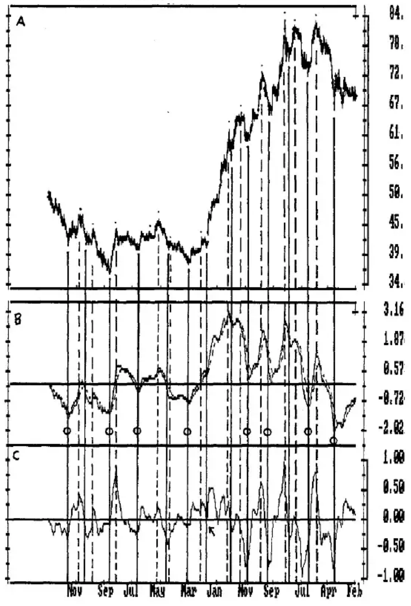
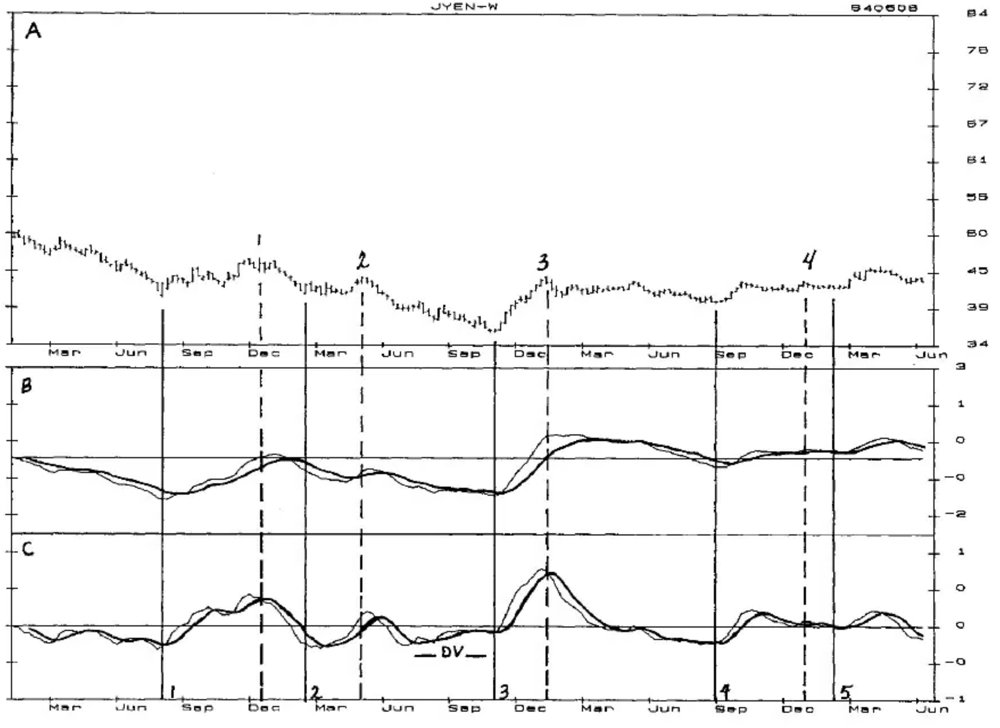
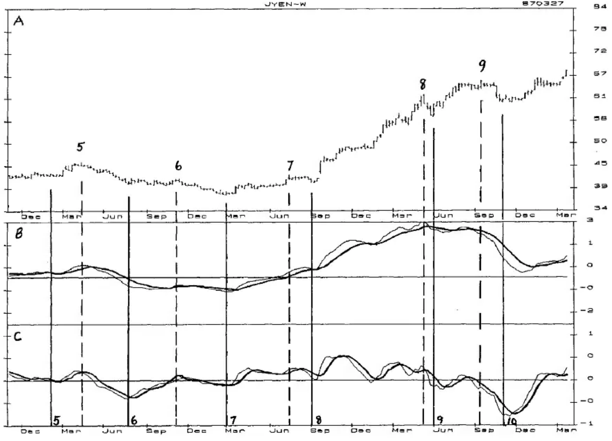
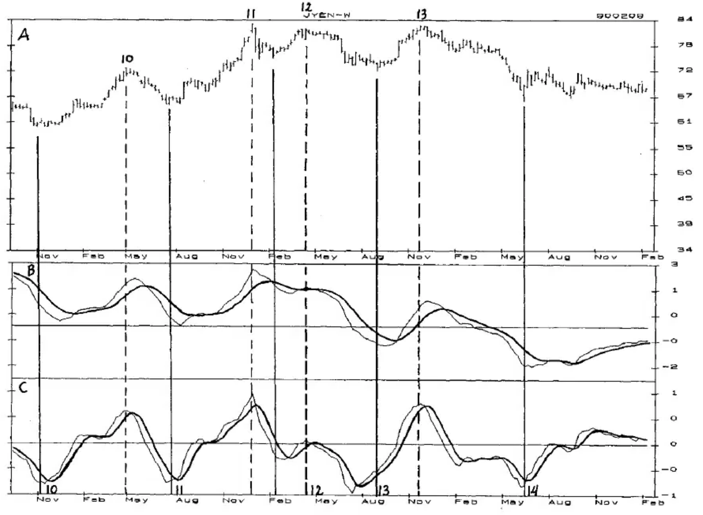

# Chapter 9: The Moving Average Convergence-Divergence (MACD)

The MACD is in most analytical packages available today. Invented by Gerald Appel, it is a powerful oscillator for identifying cycle highs and lows and for developing mechanical trades. It is constructed with three exponential moving averages that make it a flexible oscillator that can be adjusted for short, intermediate, or long-term analysis.

Several characteristics of the MACD are --

- A crossing of the slower line (the Crossover) often confirms tops and bottoms, usually after the market has turned.

- A downturn in the faster turning line often occurs at, or shortly after a top; an upturn often occurs at, or shortly after, a bottom.

- The Detrend between the fast line and the Crossover often indicates the tops and bottoms earlier and more accurately than the MACD alone, and works exceptionally well with Crossovers and Buy/Sell Lines.

The MACD was used as an example in the Japanese Yen for detrending an oscillator in Chapter Six, "Detrending Oscillators". Now let's add cycles into the analysis.

**CHART MACD-1**...is the same as Chart DO-1 in Chapter Six with the Primary Cycles indicated. The dominant weekly Primary Cycle in the Yen since 1977 has an 80% Timing Band of 26 to 44 weeks from low-to-low, with an average of 31 weeks. The highs and lows of this cycle are indicated by the dots above and below prices. In bull markets the rise from low-to-high tends to take 17 to 28 weeks; in bear markets, or in the rise to the final high of a bull market, the rise from low-to-high has been 1 to 12 weeks. Highs and lows of the Primary Cycle can be expected to occur within these Timing Bands in future years.

Below each Primary Cycle low a solid vertical line is drawn through the lower two panels. Below each Primary Cycle high is a dashed vertical line. Panel B is the COMPUTRAC MACD and Panel C is the Detrend of the two lines.

**Chart MACD-1** Weekly Japanese Yen Showing Primary Cycle Highs and Lows with COMPUTRAC MACD in Panel B, and a Detrend of the MACD in Panel C

Notice how each Primary Cycle low occurred at an upturn of the Detrend, and in 13 of the 14 lows the Detrend was below the Zero Line; the one that was not below the Zero Line, identified by the arrow, "kissed" it and exploded to the upside. A guideline for identifying the cycle lows is for prices to be 26-44 weeks from the previous cycle bottom, and to have the Detrend turn up following a drop below the Zero Line.

Another aspect worth noting is that 8 of the Primary Cycle lows, indicated by the circles, occurred following sizable declines in the MACD. All were followed by sizable price rises from the price levels at which they occurred. Six occurred below the Zero Line, and the two that were not below it occurred in the strong bull phase of the market, something that might recur in future bull markets. As a general guideline, expect Primary Cycle bottoms at MACD lows that follow sizable declines to be followed by sizable price rises to the next Primary Cycle high.

**CHARTS MACD-2, MACD-3, and MACD-4**...Based on these observations this combination of cycles and oscillators has enough promise to warrant a closer look. These charts are expanded versions of Chart MACD-1, and will allow the combination of price and oscillator activity to be seen more clearly. A 5-Term Crossover has been added to the Detrend in the bottom panel.

A visual inspection of each bottom shows that the Detrend wiggles too often at the bottoms to use a simple upturn as a Setup with a Trigger entry at the high of the upturn week. Using the Crossover as a Setup with a Trigger entry at the high of the Crossover week appears to work reasonably well. The Setup is that the price low must be 26 or more weeks from the previous low, and the Detrend must be below the Zero Line. This simple combination gives 10 confirmations of a bottom with the Trigger entry, eight of which would have been highly profitable; one would have been a serious loss and 3 did not enter. The lows at which the cycle bottoms were confirmed are 1, 2, 3, 4, 7, 9, 10, 11, 12, and 13.

Our first visual inspection determined that the Detrend looked as though an upturn would indicate a bottom, but a more detailed look showed too many wiggles at the lows to use the upturn. The use of the Crossover developed into the appropriate Setup for the cycle bottom and mechanical entry signal.

When a Crossover Setup is followed by a Trigger entry, the potential for identification of a cycle bottom and a profitable trade is good. But no single oscillator can be expected to identify every cycle low, and one or more other oscillators should combine with this MACD Detrend to confirm the Primary Cycle lows. Additional research on the MACD may also produce other bottoming indicators. For example, smoothing the Detrend with a 3-Term Moving Average may allow an oscillator upturn to be used as the Setup, and a 3 or 5-Term Crossover could also be researched as another Setup.

**Chart MACD-2** Weekly Japanese Yen - 1/81-5/84 Showing Primary Cycle Highs and Lows in Panel A, COMPUTRACK MACD in Panel B, Detrend of MACD with 5-Term Crossover in Panel C

**Chart MACD-3** Weekly Japanese Yen - 11/83-3/87 Showing Primary Cycle Highs and Lows in Panel A, COMPUTRACK MACD in Panel B, Detrend of MACD with 5-Term Crossover in Panel C

**Chart MACD-4** Weekly Japanese Yen - 10/86-2/90 Showing Primary Cycle Highs and Lows in Panel A, COMPUTRACK MACD in Panel B, Detrend of MACD with 5-Term Crossover in Panel C

## Identifying the Highs

An eyeball review of the MACD shows that a downside Crossover by the MACD is too late to be used to confirm the cycle highs. And a review of the Detrend shows that the Detrend line has too many false turns to be used as the indicator. However, visual inspection of each downside penetration of the Detrend Crossover indicates that this may be a reliable top indicator, and warrants a more in-depth review.

Table MACD-1 is a preliminary research table to simply and quickly determine if an oscillator pattern has the potential for mechanical confirmation and trading signals.

**MACD INITIAL PC HIGH RESEARCH WITH CROSSOVER AND TRIGGER ENTRY**

| A | B | C | D | E | F | G | H |
|---|---|---|---|---|---|---|---|
| CYCLE # | DATE | WKS | PC WEEKS | WEEKS | WEEKS | PC HIGH > | TYPE |
| HIGH | | L-H | H-X | X-E | E-PC LOW | PVS PCH | TRADE |
| 1 | 810218 | 7 | 1 | 4 | 7 | N | 3 |
| 2 | 820507 | 8 | 3 | 1 | 22 | R | 3 |
| 3 | 830114 | 10 | 1 | 1 | 28 | Y | 1 |
| 4 | 831007 | 5 | 4 | | S | | 0 |
| 4 | 831230 | 17 | 2 | 1 | 3 | Y | 0 |
| 5 | 840413 | 9/32 | 1 | 1 | 13 | Y | 3 |
| 6 | 841109 | 15 | 3 | 1 | 12 | R | 3 |
| 7 | 850410 | 7 | 2 | 1 | S | Y | 0 |
| 7 | 850719 | 20 | 1 | 2 | 1 | Y | 0 |
| 8 | 860321 | 28 | 1 | 1 | S | Y | 0 |
| 8 | 860516 | 36 | 1 | 1 | 1 | Y | 0 |
| 9 | 860919 | 10 | 4 | 5 | 2 | Y | 1 |
| 10 | 870130 | 12 | 3 | 0 | 0 | Y | NE |
| 10 | 870501 | 20 | 2 | 1 | 9 | Y | 3 |
| 11 | 871231 | 23 | 1 | 1 | 4 | Y | 0 |
| 12 | 880415 | 10 | 2 | 1 | 17 | | 3 |
| 13 | 881125 | 12 | 2 | 1 | 26 | Y | 3 |

*Table MACD-1*

The research table is to evaluate the following pattern, and develop an Oscillator/Cycle Combination to identify the Primary Cycle highs.

**THE SETUP**

1) The Detrend must be above the Zero Line, and

2) The Detrend must drop below the Crossover, and

**THE TRIGGER ENTRY**

3) A Trigger entry occurs when prices drop below the price low of the Crossover week.

Our expectations are that this pattern will be a reasonably accurate confirmer of the Primary Cycle high and also offer the potential for a mechanical entry signal. The element of time is not included in the pattern, and will be developed from our research.

This is a preliminary research table to help decide whether to spend time on a more detailed table. To quickly evaluate the profitability of the combination of the Setup and Trigger entry I use an 'eyeball' method that evaluates profitability with a 0 to indicate a probable loss, a 3 to indicate big profits, a 1 to indicate that a small profit would have been made, and a 2 for a profit that is better than small, but not big. This overview of profitability is shown in Column H. NE (no entry) means there was no completed Trigger entry.

**COLUMN A** is the cycle number on the chart. Those with two entries had two Setups. This occurred in 4 cycles, and in 3 of the 4, the first entry would have lost money as prices continued to rise to the Primary Cycle high. The 4th made money, but it followed a Setup that did not have an entry.

**COLUMN B** is the date of the Primary Cycle high.

**COLUMN C** lists the number of weeks from the Primary Cycle low to the PC high. For those cycles with 2 entries, it lists the number of weeks from the low to highest price before the downside Crossover. Cycle 5, in the heat of the market, could have been interpreted to be either 9 or 32 weeks from the PC low (it was 9).

Of the 12 PC highs that made (or seemed to be making) the PC high 17 weeks or less from the previous PC low, 8 were profitable with 6 of the 8 making big profits. One was a NE, and only 3 (25%) lost money.

Of the 5 entries that made the PC high 20 or more weeks from the PC low, only one made money while 4 lost money. This indicates that following a PC high of 20 or more weeks, the Trigger entry should be used only to confirm the top, waiting to go long at the PC bottom.

**GUIDELINE:** Be aggressive in selling the market as long as the Primary Cycle high is 17 weeks or less from the PC low. If more than 17 weeks, stand aside and wait to go long as the PC bottoms.

**COLUMN D** is the number of weeks from the PC high to the Crossover. Fifteen of 17 Crossovers (88%) were made by the 3rd week following the PC high, and all were made by the 4th week.

**GUIDELINE:** If a Crossover is not made by the 3rd or 4th week, the upmove can be expected to continue.

Only one Crossover was made before the high, but it was not at the PC high and did not make money; so do not trust a similar pattern in the future.

**COLUMN E** is the number of weeks from the Crossover to the Trigger entry. Seventy-five percent entered the week following Crossover, and all entered by the 5th week.

**GUIDELINE:** Expect entry the week following the Crossover, but no later than the 5th week.

**COLUMN F** is the number of weeks from entry to the PC low. An S indicates that the trade was entered before the PC top and that it was stopped out. Those that made the PC low 4 weeks or less following entry all lost money but one, which made only a small profit. Those that made the PC low 7 weeks or more from entry all made big profits but one, an unusual year in which prices traded sideways for over 6 months.

Another way to look at this aspect of time is that of the 8 trades that continued lower for more than 4 weeks after entry, 75% continued down into at least the 12th week following entry.

**GUIDELINE:** Depending on the number of weeks from the previous PC low and the oscillator picture, a decline past the 4th week following entry could be an indicator to establish more short positions. More research is obviously necessary here.

**COLUMN G** indicates whether or not the PC top exceeded the previous PC high. Five did not, and 4 of these were followed by big downmoves, 3 of them declining 12 weeks or more from entry. One was a false signal and was stopped out.

**GUIDELINE:** If a PC high does occur below the previous one, a sizable downside move can be expected in price and time.

Our brief research table does indicate that this Oscillator/Cycle Combination has the potential to confirm Primary Cycle highs and generate mechanical entry signals that can be followed by big downmoves. The performance of this pattern may be improved by more detailed research, beginning with the addition of the Sell Lines. Combining other Oscillator/Cycle Combinations should also improve performance.

A more detailed research table would include the exact entry price, stop price, method of exit, and exact price at exit. It would also include the prices of the high and low of the Primary Cycle, % moves to the cycle high and low, as well as the % decline from Trigger entry to the PC low, and anything else that would help improve profits or help determine time and price objectives.

We have learned quite a bit from our analysis that can be summarized as --

- About 25% of the cycles will have a Setup and Trigger before the cycle high (4 of 13 cycles), which are likely to lose money. A glance at each of these cycles in the table shows that the second entry, made at the PC high, is not likely to make money either, even though it does identify the cycle high. This would indicate that the uptrend is likely to continue.

- Cycle highs made 17 weeks or less from the PC low have the potential for big downmoves in price and time; but highs made 20 or more weeks from the low are likely to have a small downmove to the PC low and be followed by a continuation of the uptrend.

- Following a price high, if the detrend oscillator has not dropped below the Crossover by the 3rd or 4th week, the uptrend should continue and the earlier high be exceeded.

- Lower prices more than 4 weeks after the Trigger entry are likely to be followed by a downtrend into at least the 12th week following entry.

- If the PC high occurs below the previous PC high, expect a big downmove in both price and time.

More can be learned from additional research.
