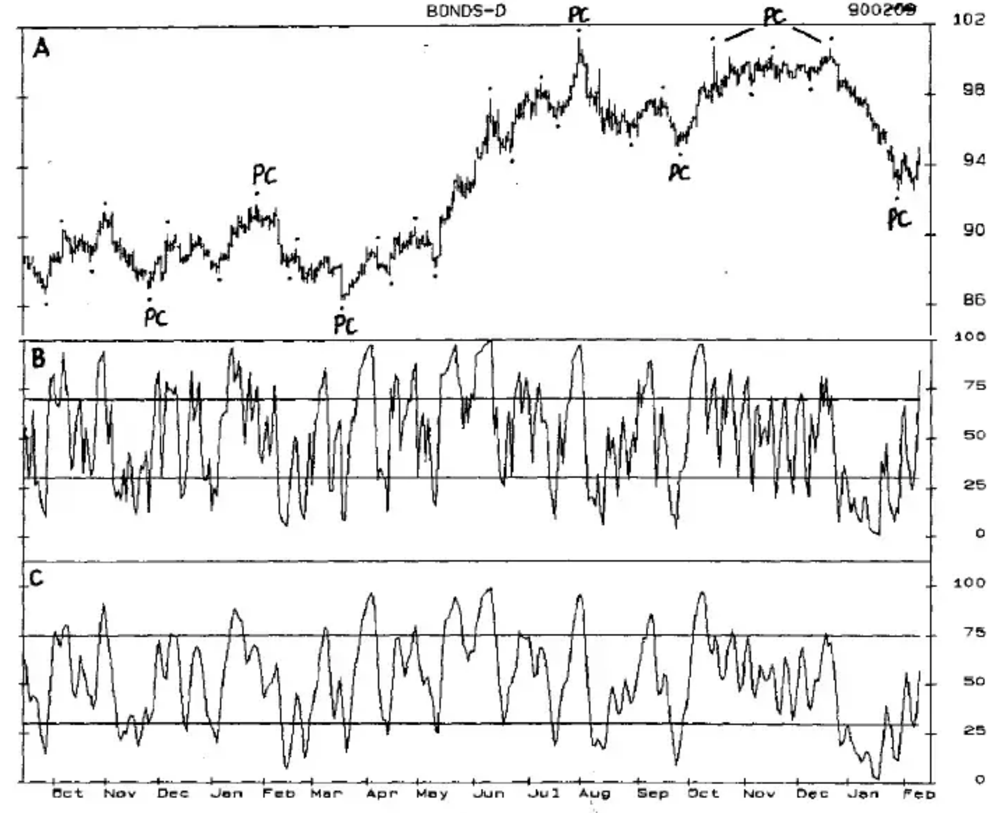
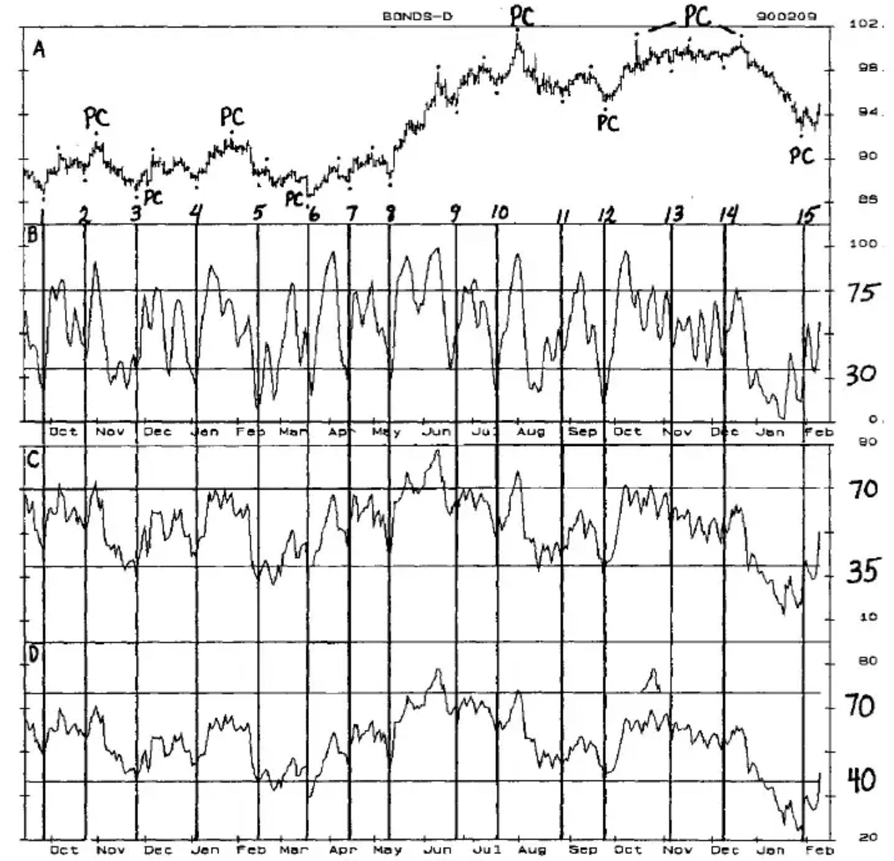
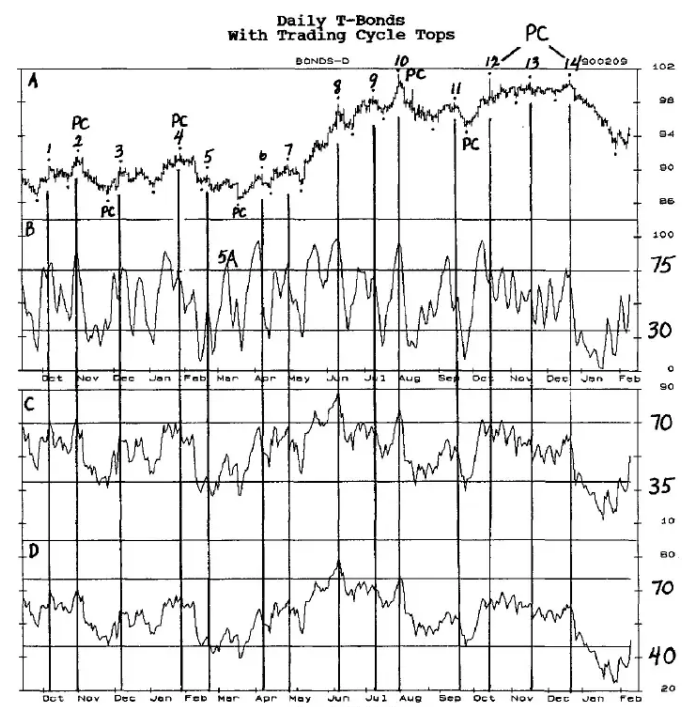

# Chapter Ten: Relative Strength Index (RSI)

The Relative Strength Index (RSI) can be an excellent indicator of cycle highs and lows. When properly 'tuned' to an individual market, it consistently establishes parameters which will keep you out of a market until a high probability top or bottom is ready to form. But, as with other oscillators, it takes 'trial and error' research to adapt the RSI to the individual markets.

The RSI fluctuates between an upper Sell Line that is normally 70, and a lower Buy Line that is normally 30. Some adjustments you might try in adapting it to the individual markets are:

1. Use different time periods to calculate the RSI.
2. Adjust the Buy/Sell Lines.
3. Smooth the oscillator.

One disadvantage of the RSI is that it tends to have sizable wiggles within it as prices move from cycle low to cycle high, and high to low. These wiggles also tend to occur at the actual cycle tops and bottoms. Unless the oscillator is smoothed, these wiggles eliminate the use of Trigger entries following turns in the oscillator or Crossovers.

**CHART RSI-1**...shows a daily T-Bond chart in the top panel with the highs and lows of the 4-Week Trading Cycle indicated by the dots above and below prices.

Panel B is a 3-term RSI with a Sell Line at 70 and a Buy Line at 30. A brief visual inspection shows that far too many wiggles occur above and below the Buy and Sell Lines for this RSI to be very useful. However, the result of smoothing the RSI with a 3-term moving average, shown in Panel C, turns this particular oscillator into a reasonably good indicator of highs and lows of the Trading Cycle. Declines below the Buy Line at 30 indicate that a cycle low is about to occur. Rises above the Sell Line at 75 indicate that a cycle high can form, although it could occur somewhat later than the oscillator high.

Running the RSI on Fibonacci time periods of 3, 5, 8, 13 and 21 will show the potential for identifying specific cycle highs and lows.

The shorter time periods of 3 and 5 will generally help indicate the highs and lows of the Trading Cycle, and the longer time periods will help identify the highs and lows of the Primary Cycle.

**Chart RSI-1** Daily T-Bonds With CCI and Smoothed RSI

In **CHART RSI-2**...the smoothed 3-term RSI is in Panel B, an 11-term RSI is in Panel C, and a 21-term RSI is in Panel D.

The vertical lines below the Trading Cycle bottoms show that the smoothed 3-term RSI appears to be a good indicator of the Trading Cycle lows when it drops below the Buy Line at 30 and turns up.

**Chart RSI-2** Daily T-Bonds With Trading Cycle Bottoms

The following guidelines will help identify the Trading Cycle bottom and determine the Setup and Trigger entry:

- The time from low-to-low should be within the trough-to-crest Timing Band of 15 to 30 market days. In bull markets expect a decline from the Trading Cycle high to be 3 to 11 days, and in a bear market look for a decline of 11 to 17 days, but if no low has been identified by day 17, extreme left translation may be taking place and the oscillator pattern can be used. Extended declines into a Primary Cycle bottom are not uncommon.

- The oscillator low must follow a Trading Cycle high that was ideally made with a rise above the Sell Line at 75; but if the earlier Trading Cycle highs and lows have been 'lost' or hard to identify, use other oscillators to help determine whether or not to buy the Trigger entry that develops.

- The oscillator must drop below the Buy Line at 30, either as the price low is being made, or before the low, and turn up.

- When the above conditions are met the Trigger entry is a rise above the price high of the upturn day. Table RSI-2 shows the preliminary research table to quantify this potential Oscillator/Cycle Combination.

## Research Table for Trading Cycle Bottoms

| A (No.) | B (High PC) | C (First) | D (Second) | E (Profit) | F (T-C Bull) |
|---------|-------------|-----------|-----------|-----------|-------------|
| A | B | C | D | E | F |
| 13 | UP | N | | | |
| 2 | UP | N | | | |
| 14 | UP | N | | | |
| 4 | UP | 1 | | 1 | 2 |
| 4 | UP | 1 | | 1 | |
| 1 | UP | 1 | | 1 | 2 |
| 8 | UP | 2 | | 2 | 3 |
| 9 | UP | 2 | | 2 | |
| 10 | UP | 3 | | 3 | |
| 11 | DN | 0 | | 0 | 0 |
| 5 | DN | 0 | | 0 | |
| 3 | BTM | 0 | 1 | 0 | |
| 15 | BTM | 0 | 0 | 0 | |
| 6 | BTM | 2 | | 2 | |
| 12 | BTM | 3 | | 3 | |

*Table RSI-2*

**COLUMN A** is the number of the Trading Cycle low for 15 cycles.

**COLUMN B** is the direction of the Primary Cycle as the Trading Cycle low was made. The table is sorted by Primary Cycle direction. With 13 of 15 Trading Cycles occurring at a Primary Cycle bottom or in the up-phase of the PC, the time period under study is obviously a bull market and the results should be interpreted accordingly. More research is needed in bear markets to balance this picture.

**COLUMN C** shows the result of the first (and in most cases, only) Setup and Trigger entry. If the market was entered the protective sell stop was the lowest low of the Trading Cycle preceding entry.

Profitability was determined by a visual inspection of the rise to the Trading Cycle high, assuming that the long position would be closed out with a Setup of a rise above the Sell Line followed by a downturn and a trigger entry of a drop below the price low of the downturn week. The profitability of a trade is indicated by:

- 0 being a loss
- 1 being a small profit
- 2 being an intermediate profit, and
- 3 being a big profit
- N indicates that there was no entry.

These classifications will vary according to the market, and are only guidelines to determine if the Oscillator/Cycle Combination can be used regularly, or improved.

- In all 3 Trading Cycle lows with an N the oscillator failed to drop below the Buy Line, so there was no Setup.

- The remaining cycle lows in the up-phase of the cycle were all profitable, and none had a second entry.

- The 2 Trading Cycle lows in the down-phase of the Primary Cycle both lost money.

- Of the 4 Trading Cycle lows that occurred at the Primary Cycle bottoms, only 2 were profitable.

**COLUMN D** shows the second entries that occurred when the oscillator wiggled. All 3 second entries occurred as the Primary Cycle was moving down, and 2 of these were at PC bottoms.

- A total of 15 trades would have been made, with 8 being profitable for a profitability ratio of 53%.

- Of the 8 profitable trades 5 had intermediate to big profits.

**COLUMN E** indicates the profitability of buying the Trading Cycle low, whether it took one or two entries to establish a long position. Eight of 12, or 67%, were profitable, and of the 8 profitable trades 5 had intermediate to big profits.

The profitability ratios of C and E are too low, and **COLUMN F** is an attempt to increase the size of the profits by holding the position into the bull part of the Trough-to-Crest Timing Band. The Timing Band is 5 to 16, with an average of 11 days, so the bull market part of the band is from the median to the end of the band, or 11 to 16 days. This tactic did increase the size of the profits, resulting in 7 of the 8 profitable trades having intermediate to big profits.

If the Primary Cycle low can be identified with reasonable accuracy the multiple contracts explained in Chapter Fourteen, "Trading and Money Management" will greatly increase the profitability of this Oscillator/Cycle Combination. The 2 longer-term RSI charts are helpful in determining the Primary Cycle tops and bottoms.

Panel C shows an 11-Day RSI. Every Primary Cycle high reached or exceeded the Sell Line at 70, and a guideline for identification of a PC top is that this RSI should reach or exceed the Sell Line before or at the Primary Cycle high.

All 4 Primary Cycle bottoms occur with this RSI dropping below the Buy Line at 30, although it was not unusual for the Buy Line to be penetrated a month or more before the Primary Cycle low was made.

Panel D shows a 21-Day RSI with the Buy Line raised to 40. Every Primary Cycle bottom occurred with this RSI very near to, or below, the Buy Line.

Guidelines to identify the Primary Cycle bottoms are:

- Prices must be within the Primary Cycle Timing Bands of 12-28 weeks from the previous Primary Cycle bottom.

- The 11-Day RSI must be below the Buy Line, and the 21-Day RSI must be below, or very close to, the Buy Line.

- The smoothed 3-Day RSI must have dropped below the Buy Line, turned up and generated a Trigger entry for a Trading Cycle low by exceeding the high of the upturn day.

- The high of the upturn week of the 3-Day RSI should be exceeded.

Other oscillators should also indicate, or confirm, a Trading Cycle and/or Primary Cycle bottom.

---

**CHART RSI-3**...is the same as Chart RSI-2, except that the vertical lines are drawn below the Trading Cycle highs. The same numbering is used for highs as for the Trading Cycle lows.

**Chart RSI-3** Daily T-Bonds With Trading Cycle Tops

Utilizing the smoothed 3-day RSI in Panel B, several guidelines must be established for the Setup to identify a Trading Cycle high and to also generate a short position.

- The time from low-to-high should be within the trough-to-crest Timing Band of 5 to 16 market days, which has an average of 11 days. In bull markets expect a rise of 11 to 16 days, but if no high has been identified by Day 16, extreme right translation may be taking place and the oscillator pattern can be used as in #8. This produced only a small profit but identification of the Trading Cycle high would have prepared you for the excellent buy at the Trading Cycle low that followed.

- In bear markets expect a rise of 5 to 11 days. Do not sell an oscillator downturn if the price high is less than 5 days from the Trading Cycle low. For one early top that makes money you will have several losses from false signals.

- The oscillator high must follow a Trading Cycle low that was ideally made with a drop below the Buy Line at 30; but a drop below 50 in a strong market is also allowed for this Setup.

- The oscillator high must have risen above the Sell Line at 70 either as the high is being made or shortly before the high, but in the same Trading Cycle.

- When the above conditions are met the Trigger entry is a drop below the price low of the downturn day of the oscillator high above the Sell Line or a second oscillator downturn. Table RSI-3 shows the preliminary research to quantify this potential Oscillator/Cycle Combination.

## Research Table for Trading Cycle Tops

| A (No.) | B (High PC) | C (First) | D (Second) | E (Profit) |
|---------|-------------|-----------|-----------|-----------|
| A | B | C | D | E |
| 1 | UP | 0 | 2 | 2 |
| 2 | UP | N | | |
| 3 | UP | 1 | | 1 |
| 4 | UP | 1 | | 1 |
| 7 | UP | 2 | | 2 |
| 8 | UP | 0 | 1 | 1 |
| 9 | UP | 2 | 2 | 2 |
| 13 | UP | N | | |
| 12 | TOP | 3 | 3 | 3 |
| 14 | TOP | 3 | 3 | 3 |
| 6 | TOP | 2 | 2 | 2 |
| 10 | TOP | 1 | | 1 |
| 5 | DN | 0 | 1 | 1 |
| 11 | DN | 2 | | 2 |
| 5A | DN | 0 | 2 | 2 |

*Table RSI-3*

**COLUMN A** is the number of the Trading Cycle high. There are 14 Trading Cycle highs. 5A was not a Trading Cycle high but has been included because the oscillator Setup was met and the high did not exceed the earlier high made 3 days after the Trading Cycle low.

**COLUMN B** shows the direction of the Primary Cycle. In most instances the highest price high should be classified as the Primary Cycle high, but attention must always be given to how the situation would look during the heat of the market, so Highs 12 and 14 are considered as 2 highs of a double top. Therefore, 12, 13 and 14 have been classified as in the up-phase of the Primary Cycle. In real-time trading, the identification of the Trading Cycle highs and lows at 13 and 14 would have been 'guesstimates', and the high at 14 would have been sold on the oscillator pattern.

With most of the entries in the up-phase of the Primary Cycle, more research is needed for bear market entries.

Six of the Trading Cycle highs were made at a second oscillator high that was either a higher oscillator high as in 1 and 8, or were lower oscillator 'bumps' that followed the oscillator rise above the Sell Line. These had 2 Setups at each Trading Cycle high.

**COLUMN C** lists the results of the first Setup of the 6 Trading Cycles with 2 oscillator highs and those with only a single high following a rise above the Sell Line. The Trigger entry was a drop below the price low of the day of the downturn of the oscillator. Those with an N did not have an entry either because the price high was less than 5 days from the Trading Cycle low, or because prices continued up and did not drop below the low of the downturn day.

If the market was entered, the protective buy stop was the highest high of the Trading Cycle preceding entry. Profitability was determined by a visual inspection of the decline from entry to the Trading Cycle low with:

- 0 being a loss
- 1 being a small profit
- 2 being an intermediate profit, and
- 3 being a big profit

Seven of the 11 patterns that entered were profitable, yielding a profit ratio of 60%.

**COLUMN D** lists the results of the second entry for the 6 with a second oscillator high or 'bump'. Five of 6 were profitable for a profit ratio of 80% indicating that the second Setup and entry should generally be taken.

Notice that the big profits indicated by a 3 in both C and D all came from selling the top of the Primary Cycle, indicating that special effort should be placed in selling the Primary Cycle top. More contracts could be committed with a high probability identification of the Primary Cycle top.

**COLUMN E** shows the profitability of selling a Trading Cycle high regardless of whether it required 1 or 2 entries. Eleven of 13 were profitable for a profit ratio of 85%, with 7 of the 11 having profits that were medium to big.

Combining these entries with those of the CCI should produce trades with a high probability of success.

This study was done over a relatively short period of time, and conditions will change in the future. Researching the past 10+ years and cataloging bull and bear markets will prepare you for many of the changes and questionable situations that will occur in real-time trading. The conditions for this Oscillator/Cycle Combination will have to be adjusted for different market conditions.
