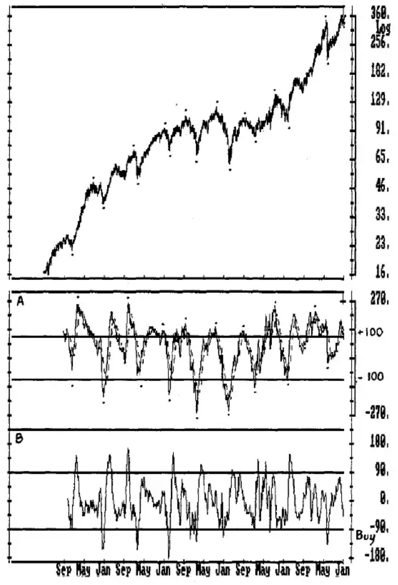
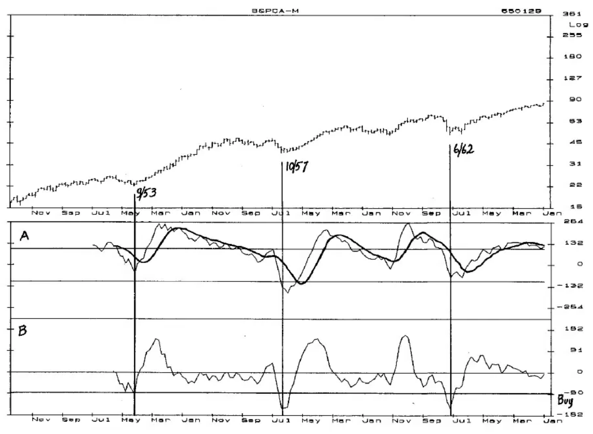
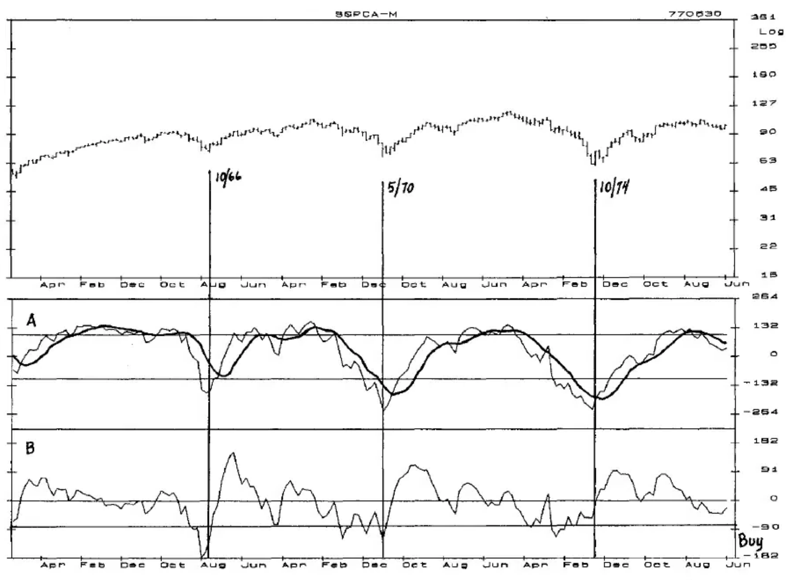
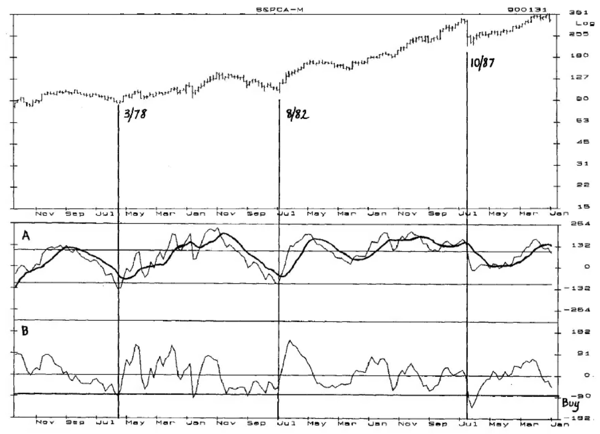
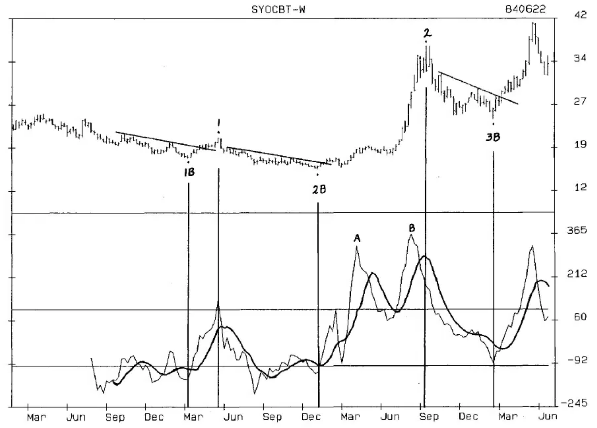
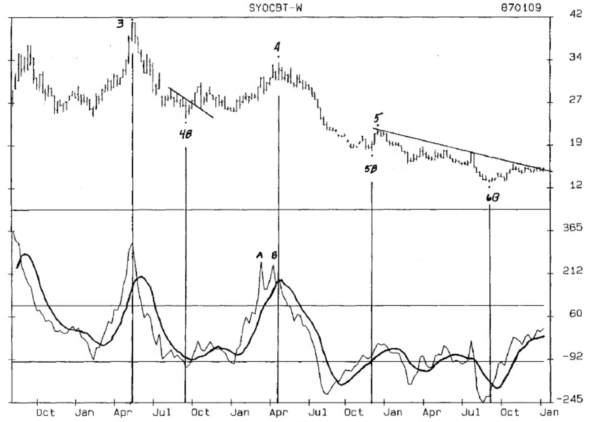
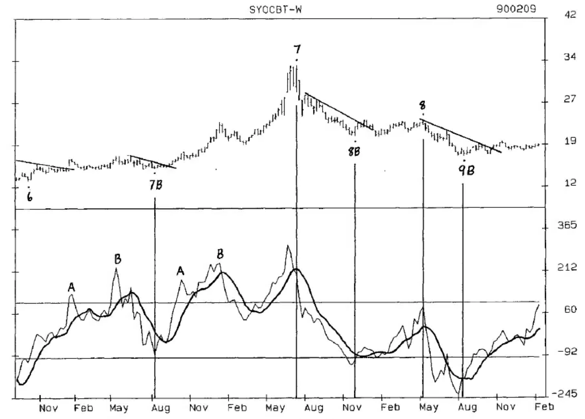
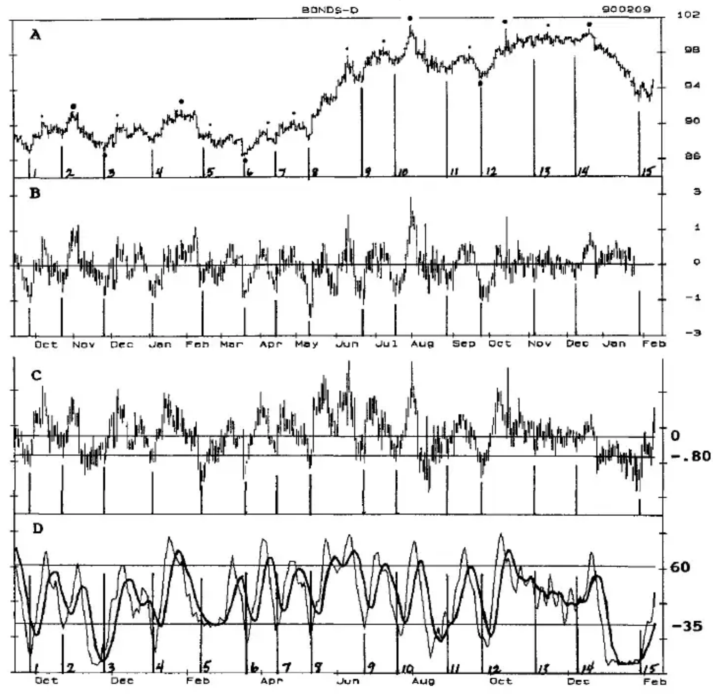
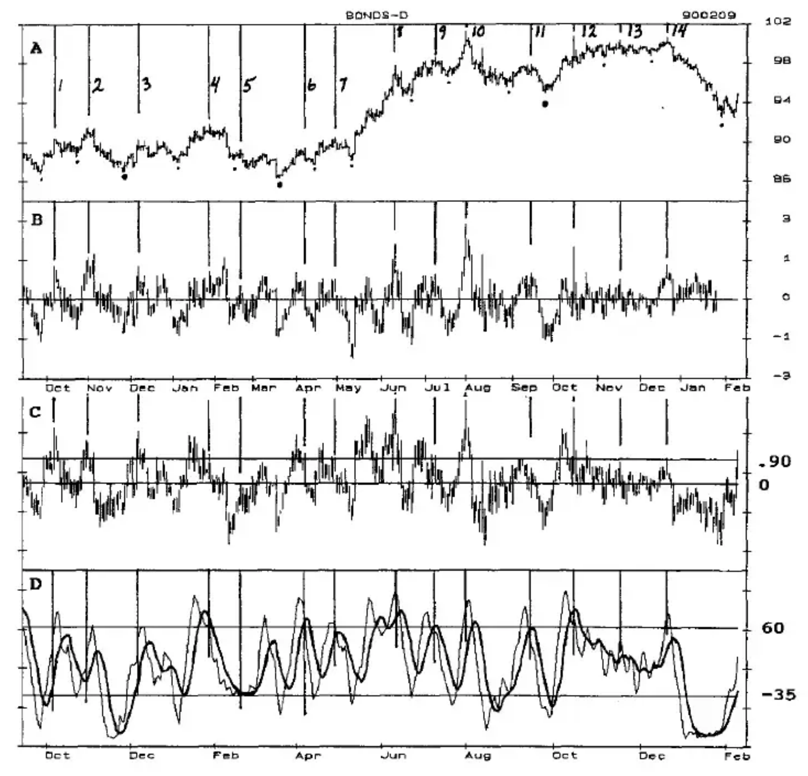

# Chapter Eleven: The Commodity Channel Index (CCI)

The Commodity Channel Index was first published in FUTURES magazine in 1980, and is in most analytical packages available today.

The oscillator, which can be calculated for short and long-term periods, moves between a Sell Line of 100 and a Buy Line of -100. It can be a powerful tool for identifying highs and lows by itself, but its performance is greatly improved with various combinations of smoothing, Crossovers, Buy/Sell Lines and Setup/Trigger entries.

The following examples show several different ways to use the CCI, and several research tables to evaluate its effectiveness.

## The CCI and the 4-Year Cycle in the S&P Index

CHART CCI-1...The 4-Year Cycle in the S&P Index is a powerful and dominant cycle. Monthly Chart CCI-1 on Page 11-2 shows 40 years of the cash S&P Index from January 1950 through January 1990. The highs and lows of the 4-Year Cycle are indicated by the dots above and below prices. A 30-Month CCI with an 8-Month Crossover is in middle Panel A, and a Detrend of the CCI and the Crossover is in bottom Panel B.

A glance at the CCI in Panel A shows that every 4-Year Cycle high exceeded the Sell Line at 100. Every 4-Year Cycle bottom dropped below zero, and 6 of the 9 cycle bottoms occurred below the Buy Line at -100. This allows a few general expectations to be established --

- Following a 4-Year Cycle bottom, expect the 4-Year Cycle top to occur only after the CCI has exceeded the Sell Line. Unfortunately, the oscillator can spend some time above the Sell Line and does not clearly indicate when the high occurs. However, following a cycle bottom there is a period of 'free time' until the oscillator exceeds the Buy Line. During this time period, market declines and Primary Cycle lows can be aggressively bought with a high probability that prices will continue to rise over the longer term until the Buy Line is exceeded by the CCI.

**Chart CCI-1**
MONTHLY CASH S&P INDEX SHOWING 4-YEAR CYCLES WITH 30-MONTH CCI AND 8-MONTH CROSSOVER (A) WITH DETREND (B)

- Following the high of the 4-Year Cycle, expect the CCI to drop below zero, with a 67% probability of a decline below the Buy Line at -100. This gives a time period of 'free time' until the CCI drops below zero.

- Every 4-Year Cycle high was followed by a decline in the Detrend below the Buy Line at -90.

The combination of --

- the timing of the low, plus
- the level of the Detrend low, plus
- the level of the CCI low, plus
- the completion of the CCI Crossover, plus
- the Trigger entry of exceeding the high of the month of the Crossover

forms an Oscillator/Cycle Combination that is a stellar indicator of 4-Year Cycle bottoms.

The Detrend shows that every 4-Year Cycle low had a decline below the Buy Line at -90. Of the 9 cycle lows, 6 made the downside penetration of the -90 level as, or after, the cycle bottomed; 3 penetrated the -90 level and turned up before the cycle bottomed. The important factor here is that every 4-Year Cycle bottom saw the Detrend drop below the Buy Line, either before, at, or after the price low. A second look at the CCI shows that every cycle bottom was followed by a rise above the Crossover.

The minimum length of the cycle since 1917 has been 32 months, with 15 of the 17 cycles (nearly 90%) bottoming 43 months or more from the previous bottom. So, the guideline for time is that the oscillator pattern should coincide with a price low 32 or more months from the previous cycle bottom, and will most likely be 43 or more months.

The Oscillator/Cycle Combination that confirmed the bottom of every 4-Year Cycle since 1950 has 5 requirements that must be met:

1) The price low must be 32 or more months from the previous 4-Year Cycle bottom.

2) The Detrend must drop below the Buy Line at -90 and turn up.

3) The CCI must drop below zero. A drop below the Buy Line at -100, which occurred at 6 of the 9 bottoms, would be comforting but is not necessary.

4) The CCI must then rise above the Crossover.

5) Following the requirements of 1 through 4 being met, the Trigger entry of prices exceeding the high of the Crossover month confirmed every 4-Year cycle bottom. It is the safest entry, but not always the one with the lowest dollar risk.

**CHARTS CCI-2, CCI-3, CCI-4**...An historical review of these charts, which begin on Page 11-6, shows this Oscillator/Cycle Combination to be an early and powerful confirmation of the bottoms of the 4-Year Cycle. Each chart has overlapping time periods that allows a single chart to be constructed. In the top panel the 4-Year Cycle lows are indicated by the dates and vertical lines. Panel A is the 30-Month CCI with the 8-Term Crossover, which is the darker line. The Detrend of the CCI and the Crossover is in Panel B.

Follow the development of these patterns as each of the 4-Year Cycle lows since 1953 is evaluated relative to the 5 requirements outlined above.

## 3/53 Low

1) The 9/52 low was 51 months from the previous 4-Year Cycle bottom.

2) The Detrend low of -91 was made in September with an upturn in October, below the Buy Line (-90).

3) The CCI dropped below zero and turned up in October.

4) The CCI exceeded the Crossover in November, only two months after the low.

5) Prices exceeded the November high in December to complete the Trigger entry and confirm the 4-Year Cycle bottom.

The 4-Year Cycle low would have been confirmed and long-term positions could have been safely established as the November high was exceeded. A higher risk position could have been established on the November close as the CCI exceeded the Crossover.

## 10/57 Low

1) The 10/57 low was 49 months from the previous 4-Year Cycle bottom.

2) The Detrend turned up in November at a level well below the Buy Line (-90).

3) The CCI turned up in November at a level well below the Buy Line at -100.

4) The CCI exceeded the Crossover in March.

5) The high of March was exceeded in April to complete the Trigger entry and confirm the bottom of the 4-Year Cycle.

The 4-Year Cycle low was confirmed in April as the March high was exceeded. Long-term positions could have been established in April, or higher risk positions could have been established on the March close. The upturns of the CCI and Detrend in November indicated a possible bottom, as both oscillators were well below their respective Buy Lines, and minimal positions could have been established; but waiting for the Crossover high to be exceeded was the safest signal. Weekly and daily oscillators may be used to establish positions before confirmation based on their own Oscillator/Cycle combinations.

## 6/62 Low

1) The 6/62 low was 56 months from the previous 4-Year Cycle bottom.

2) The Detrend turned up in July below the Buy Line (-90).

3) The CCI dropped below zero and turned up in July.

4) The CCI exceeded the Crossover in November, following the October double bottom.

5) The November highs were exceeded in December to complete the Trigger entry and confirm the bottom of the 4-Year Cycle.

Earlier positions could have been established --

- As the June high was exceeded in August. Both the CCI and Detrend turned up in July within the time period for the cycle low. Since July was an inside month, the June high was a safer entry than the July high.

- As the August high (the fulcrum point for the double bottom) was exceeded in November. This would have been a relatively low risk trade given the time period from the previous 4-Year low and the double bottom formation.

- At the month-end close for November as the CCI exceeded the Crossover.

However, the safest approach would have been to wait for confirmation of the bottom, which was not completed until the November highs (the month of the Crossover) were exceeded in December.

**Chart CCI-2** Monthly Cash S&P Index Showing 4-Year Cycle Lows With a 30-Month CCI and 8-Month Crossover, With a Detrend

**Chart CCI-3** Monthly Cash S&P Index Showing 4-Year Cycle Lows With a 30-Month CCI and 8-Month Crossover, With a Detrend

**Chart CCI-4** Monthly Cash S&P Index Showing 4-Year Cycle Lows With a 30-Month CCI and 8-Month Crossover, With a Detrend

## 10/66 Low

1) The 10/66 low was 52 months from the previous 4-Year Cycle low.

2) The Detrend turned up in October well below the Buy Line (-90).

3) The CCI turned up in October well below the Buy Line (-100).

4) The CCI exceeded the Crossover in January 1967.

5) The January highs were exceeded in February to complete the Trigger entry and confirm the bottom of the 4-Year Cycle.

The 4-Year Cycle low was confirmed in February, and long-term positions could have been established as the January highs were exceeded. Based on the time from the previous cycle low of 52 months, and the upturns in both the CCI and Detrend below their respective Buy Lines, long positions could have been established as the high of October, which was an outside up month, was exceeded in November. The entry price would have been much lower than the January high, but the risk of loss was greater.

## 5/70 Low

1) The 5/70 low was 43 months from the previous 4-Year Cycle low.

2) The Detrend turned up in June at -126, well below the Buy Line (-90).

3) The CCI turned up in June at -251, well below the Buy Line.

4) The CCI exceeded the Crossover in August.

5) The high of August, the Crossover month, was exceeded in September to complete the Trigger entry and confirm the 4-Year low.

Although both the CCI and Detrend turned up in June, an inside month often indicates a market searching for direction, as in February and March 1970 which were followed by lower prices. An inside month also occurred just before the 1966 low. Exceeding the May highs in August would have been the earliest possible buy on a monthly chart, and while it would have worked, the safe approach is to wait for the high probability confirmation of exceeding the high of Crossover week.

## 10/74 Low

1) The 10/74 low was 53 months from the previous 4-Year Cycle low.

2) The Detrend bottomed in December at -114, well below the Buy Line (-90).

3) The CCI turned up in October at -242, well below the Buy Line at -100.

4) The CCI exceeded the Crossover in October.

5) The October high was exceeded in November to complete the Trigger entry and confirm the bottom of the 4-Year Cycle.

This cycle bottom also offered a buying opportunity on the October close because October was an outside up month, and on the close --

- The CCI exceeded the Crossover, and
- Both the CCI and Detrend turned up.

A low risk buy could also have been made as the December high was exceeded in January. Completion of an Oscillator/Cycle Combination followed by a test of the lows does not occur often; but when it does occur the market should be bought against the earlier lows.

## 3/78 Low

1) The 3/78 low was 41 months from the previous 4-Year Cycle low.

2) The Detrend turned up at -90.44, below the Buy Line at -90.

3) The CCI turned up at -135, below the Buy Line of -100.

4) The CCI exceeded the Crossover in April.

5) The April high was exceeded in May to complete the Trigger entry and confirm the bottom of the 4-Year Cycle.

At 41 months from the previous low, this would have been the shortest cycle seen in this time period, but it was still longer than the 32 month minimum seen since 1917.

## 8/82 Low

1) The 8/82 low was 53 months from the previous 4-Year Cycle low.

2) The Detrend bottomed in September 1981 at -91.22, below the Buy Line of -90.

3) The CCI turned up in August at -103, below the Buy Line of -100.

4) The CCI exceeded the Crossover in August.

5) The August high was exceeded in September to complete the Trigger entry and confirm the bottom of the 4-Year Cycle.

Both the August close and the August high offered a buying opportunity, as the CCI exceeded the Crossover on the August close in an outside up month. You can see the safety of waiting for the CCI to exceed the Crossover, as the March 1982 low looked like a probable low. It was 48 months from the previous cycle bottom, the Detrend had dropped below the Buy Line of -90, and both the CCI and Detrend turned up in April, with the April high being exceeded in May. As tempting as it looked (and it looked good at the time), it would have cost you money.

## 10/87 Low

1) The 10/87 low was 50 months from the previous 4-Year Cycle bottom.

2) The Detrend turned up in December at -137, well below the Buy Line of -90.

3) The CCI turned up in December well below zero, but not below the Buy Line.

4) The CCI exceeded the Crossover in June 1988.

5) The June high was exceeded in October 1988, to complete the Trigger entry and confirm the bottom of the 4-Year Cycle.

The confirmation of this cycle low was a hard one to trust. Not only did the cycle stretch to the second longest cycle of the past 70 years, but the high of Crossover month was not exceeded until 12 months after the low, following a month in which the CCI dropped back below the Crossover. Although the Detrend did drop below the Buy Line, it was the only cycle in which it did so after the cycle had bottomed. Other oscillators would have been helpful to support the confirmation of this bottom, although it did prove to be accurate.

The Oscillator/Cycle Combination of:

1) The price low occurring 32 or more months from the previous 4-Year Cycle bottom.

2) A bottom in the Detrend below the Buy Line at -90.

3) A bottom in the CCI below zero and ideally below the Buy Line at -100.

4) The CCI exceeding the Crossover.

5) The Trigger entry of exceeding the price high of the Crossover month confirmed the bottom of every 4-Year Cycle low since 1953.

This Oscillator/Cycle Combination can be expected to confirm the bottom of the cycle due in 1991. In every cycle but 1987 the bottom was confirmed within months of the low, and barring a 1987 type crash, the 1991 bottom is also likely to be confirmed within months of the low.

---

## Seasonal Low Analysis in Soybean Oil

**CHARTS CCI-5, CCI-6, and CCI-7**...on Pages 11-13, 11-14, and 11-15 show soybean oil weekly prices from 810102 through 890202. Copies of these charts can be joined to produce a single continuous chart. The Seasonal highs and lows are indicated by numbers. The lower panel is a 30-week CCI with an 8-Term Crossover, which is the darker line. The vertical lines indicate the weeks of the Seasonal highs and lows.

All Seasonal lows occurred near, or below, the Buy Line; but not all lows below the Buy Line are Seasonal lows. In most cases in soybean oil, the Seasonal price low occurs as the CCI turns up, indicating that this oscillator might identify a Seasonal low and perhaps offer a low risk 'bottom picking' trade.

**Chart CCI-5** Weekly Soyabean Oil Showing Primary Cycle Highs and Lows With a 30-Week CCI and an 8-Week Crossover

**Chart CCI-6** Weekly Soyabean Oil Showing Primary Cycle Highs and Lows With a 30-Week CCI and an 8-Week Crossover

**Chart CCI-7** Weekly Soyabean Oil Showing Primary Cycle Highs and Lows With a 30-Week CCI and an 8-Week Crossover

The table below shows the results of basic research to establish guidelines for the identification and trading of future lows. (A longer sample size of 20-30 years should be researched before trading the pattern.)

| # | Date | CCI Level | CCI Lead/Lag | Crossover | Trigger | Entry | Divergence | Trendline | 20%+ Move |
|---|------|-----------|--------------|-----------|---------|-------|------------|-----------|-----------|
| 1 | 2 | 3 | 4 | 5 | 6 | 7 | 8 | 9 | 10 |
| 1B | 3/82 | -148 | 0 | +1 | +1 | XWK | DIV | YES | NO |
| 2B | 1/83 | -125 | -1 | +1 | +1 | XWK | DIV | YES | YES |
| 3B | 2/84 | -92 | 0 | +2 | +1 | XWK | — | YES | YES |
| 4B | 9/84 | -119 | 0 | +2 | +1 | XWK | — | YES | YES |
| 5B | 12/85 | — | — | — | — | — | — | — | — |
| 6B | 9/86 | -247 | -2 | +2 | +1 | XWK | — | YES | YES |
| 7B | 8/87 | -88 | 0 | +2 | +3 | XWK | — | YES | YES |
| 8B | 11/88 | -123 | -1 | +1 | +1 | XWK | DIV | YES | NO |
| 9B | 8/89 | -176 | -2 | 0 | +1 | XWK | — | YES | — |

**COLUMN 1** is the number assigned to each Seasonal low.

**COLUMN 2** is the date of each Seasonal low. Seasonal lows in soybean oil normally occur January through April, or August through November. Every low but 12/85 bottomed in the Seasonal low time periods, within which a minimum 70% of all Seasonal lows have occurred. The 1985 low would not have fit the pattern of the CCI and is not included in the analysis of the patterns.

**GUIDELINE:** The Seasonal low and the oscillator low should occur within the Seasonal time periods. Potential lows outside of the time periods would be suspect and require verification from other oscillators.

**COLUMN 3** is the oscillator value at the turning point closest to the price low. Of the 8 lows all 8 made the CCI low slightly above the Buy Line or below it. Five of the lows were below the -100 Buy Line, and 3 were no more than 12 points above it.

**GUIDELINE:** Seasonal lows are most likely to occur with the CCI below the Buy Line, but no more than 25 points above it. Price lows that do not meet this expectation are highly suspect.

**COLUMN 4** is the number of weeks the CCI turned up before, or after, the week of the price low. A minus sign (-) denotes the number of weeks before the price low, a zero (0) indicates that both the CCI and prices bottomed the same week, and a plus (+) indicates the number of weeks a CCI low occurred after the price low. None of the years saw the CCI turn up after the price low. Four had the CCI bottom 1-2 weeks before the price low, and all were below the Buy Line. Four saw the CCI bottom the same week of the price low, and interestingly, included both of those above the Buy Line.

**GUIDELINE:** The CCI should bottom from 2 weeks before the price low to the week of the low, with a tendency for those well below the Buy Line to have an early upturn of the CCI, and those above the Buy Line to turn up the week of the price low.

**COLUMN 5** shows the number of weeks from the price low that the CCI exceeded the Crossover. The weeks are counted the same as above. This shows that all 8 years had a Crossover within 0-2 weeks of the price low.

**GUIDELINE:** Following the week of the Seasonal low the CCI should exceed the Crossover 0-2 weeks from the low, with a tendency for the Crossover to occur in Weeks 1 or 2.

**COLUMN 6** shows the number of weeks from the week of the Crossover until the high of that week was exceeded. In 8 of 8 years the high of Crossover week was exceeded the following week.

**GUIDELINE:** Following a Crossover that meets the guidelines in Columns 3, 4 and 5, expect the high of Crossover week to be exceeded the week following Crossover.

**COLUMN 7** is an attempt to locate a mechanical means of entry: which in this case is to go long when the high of Crossover week is exceeded. Another option would be to go long on the close of Crossover week, as 8 of the 8 years exceeded the high of Crossover week the following week.

**COLUMN 8** indicates which Seasonal lows occurred with an oscillator/price divergence of lower price and higher oscillator. As a general rule this is a good indicator, and all 3 would have made money by going long when the high of the oscillator upturn week was exceeded. Seasonal Low Number 8 saw a slightly lower price low occur with a divergent oscillator pattern, and the second low could also have been traded as the Seasonal low.

**COLUMN 9** answers a question. Following entry, was the nearest overhead trendline exceeded? In all 8 years the answer was YES the trendline was exceeded, giving a minimum price objective for the upmove. In Seasonal Number 8, a second trendline could have been drawn following the double bottom.

**GUIDELINE:** Following entry, expect the nearest weekly downtrend line to be exceeded.

**COLUMN 10** answers another question. Was the move above the trendline followed by a move of more than 20% from the mechanical entry point, which was the high of the Crossover week? In 5 of the 7 years with trendline penetration, the answer was YES, and the upmove from the 1989 Seasonal low which, as this book is being written had not yet topped, is likely to make it 6 of 8 years.

**GUIDELINE:** Try to establish as many long-term positions as possible before, and shortly after, the trendline is penetrated.

The CCI, combined with the Buy Line and the Crossover, provides a high probability confirmation of the Seasonal low, as well as a mechanical means of entry. Once a Seasonal low has been confirmed the longer-term trend should be up until the Seasonal Cycle tops, which can be for 7 months or more if the long-term cycles are moving up; or a relatively short period of time if the longer-term cycles are moving down.

---

## Seasonal High Analysis in Soybean Oil

The CCI can be just as powerful a tool for the identification of the Seasonal highs in soybean oil. The patterns below identified 7 of the 8 Seasonal highs.

| # | Date | CCI Level | CCI Lead/Lag | Crossover | Trigger | Entry | Pattern | Trendline | Big Move |
|---|------|-----------|--------------|-----------|---------|-------|---------|-----------|----------|
| 1 | 2 | 3 | 4 | 5 | 6 | 7 | 8 | 9 | 10 |
| 1 | 5/82 | 135 | 0 | +2 | +2 | HWK | — | YES | YES |
| 2 | 9/83 | 365 | -5 | -2 | +4 | HWK | DBL | — | — |
| 3 | 5/84 | 322 | 0 | +2 | +1 | XWK | — | YES | YES |
| 4 | 4/85 | 255 | -6 | +1 | +1 | XWK | DBL | YES | YES |
| 5 | 12/85 | — | — | — | — | — | — | — | — |
| 6 | 5/87 | 226 | 0 | +2 | +4 | HWK | DBL | YES | NO |
| 7 | 7/88 | 306 | -3 | — | +1 | HWK | DBL | YES | YES |
| 8 | 5/89 | 87 | 0 | +1 | +1 | XWK | — | YES | YES |

**COLUMN 1** is the number assigned to each Seasonal high.

**COLUMN 2** is the date of each Seasonal high. Seasonal highs in soybean oil normally occur March through May, or July through November. Every high but 12/85 was within the Seasonal high time periods, within which a minimum 70% of all Seasonal highs have occurred, and this cycle is not included in our analysis.

**GUIDELINE:** The Seasonal high and the oscillator high should occur within the Seasonal time periods. Potential highs outside of the time periods would be suspect and require strong verification from other oscillators.

**COLUMN 3** is the oscillator value at the turning point closest to the price high. Of 8 highs, one (12/85) was sloppy and would have been so confusing it is not used in the research. Of the remaining 7 highs, 6 made the CCI high above the Sell Line, and one was within 15 points of it. Five of the highs were above 225, and 4 of these had some type of a double top form in the CCI, as indicated by the numbers A-B at the highs of the CCI in the bottom panel.

**GUIDELINE:** Seasonal highs are most likely to occur with the CCI above the Sell Line, and above 225. Double top formations occurred in 4 of the 5 above 225 and should be watched for in the future.

**COLUMN 4** is the number of weeks the CCI turned down before, or after, the week of the price high. A minus sign (-) denotes the number of weeks before the price high, a zero (0) indicates that both the CCI and prices topped at the same week, and a plus (+) indicates the number of weeks for a CCI high after the price high. None of the years saw the CCI turn down after the price high. Only 3 had the CCI top 3-6 weeks before the price high; all were above 225 and also had a double top in the CCI. Four saw the CCI top the same week of the price high, and only one of these had a double top in the CCI.

**GUIDELINE:** The CCI should top 3-6 weeks before the price high, or the week of the high. With a double top pattern, the second top in the CCI is likely to top 3-6 weeks before the price high. Those without a double top tend to make the CCI and price high the same week.

**COLUMN 5** shows the number of weeks from the price high to when the CCI dropped below the Crossover. The weeks are counted the same as indicated for Column 4. This shows that 5 of the 7 years had a Crossover 1-2 weeks after the price high, and two years had a Crossover 1-2 weeks before the price high.

**GUIDELINE:** Expect the Crossover within a time period of 2 weeks before, or after, the price high. The Crossovers before the Seasonal high will be traded differently than those after the Seasonal high, as discussed below. Crossovers outside of this time period may indicate that the high that is forming is not a Seasonal top.

**COLUMN 6** shows the number of weeks from the week of the Crossover until the low of that week was taken out. In all 7 years the low of Crossover week was taken out within 4 weeks, and 4 years did so the first week following the Crossover.

**GUIDELINE:** Following a Crossover that meets the guidelines in Columns 3, 4 and 5, expect the low of Crossover week to be taken out within 4 weeks of the Crossover, with about a 50% probability of taking it out the first week following the Crossover.

**COLUMN 7** is an attempt to locate a mechanical means of entry, which takes much of the emotion out of trading. Although the sample size is small, there are 3 types of patterns that should be researched in other time periods.

- When Crossover week occurs on, or after, the price high, place a sell stop to go short below the low of Crossover week. The stop should be filled the week following Crossover week. The years of these entries are indicated by XWK.

- If, in the above situation, prices go up following Crossover week a new sell order should be placed under the previous week's low of each higher week until a sell order is filled. This pattern occurred in two years, 1 and 6, and is indicated by HWK for high week.

- If the high of the week of the price high is exceeded, cancel all sell orders, as the Seasonal high has not occurred. Remember that these charts are on the nearby contract until expiration, and the actual sell order may be placed in the next distant contract.

- When the Crossover week occurs in a rising market before the price high, place a sell stop to go short below the low of Crossover week, and continue to raise the stop each week to just below the previous week's low until filled. This pattern occurred in Years 2 and 7 and is also indicated by HWK.

**COLUMN 8** indicates which oscillator patterns should be watched for as an indicator of a true Seasonal High Pattern. Four of the years saw double tops in the formation of the CCI as indicated by DBL, and are discussed in the comments on Column 4.

**COLUMN 9** answers a question. Following the Seasonal high, was the nearest uptrend line broken? In the 6 years in which a trendline could be constructed, the answer was YES. Completion of the oscillator pattern and entry may come before, or after, penetration of the trendline.

**GUIDELINE:** If it is a Seasonal top, a weekly trendline should be broken shortly before or after market entry.

**COLUMN 10** answers another question. Was the move below the trendline followed by a sizable downmove in time and price? In 5 of the 6 years with trendlines the answer was YES, indicating that long-term positions could be very profitable.

**GUIDELINE:** Try to establish as many long-term positions as possible before, and shortly after, the trendline is penetrated.

These Oscillator/Cycle Combinations for the CCI give high probability confirmations of the Seasonal highs and lows as well as mechanical entries. Seasonal oscillators should generally be researched over a minimum 20-30 year time period to verify their performance, and even then, in the heat of the market it is often hard to accept a single pattern as solid confirmation of a top or a bottom no matter how well it has performed in the past. But when other Oscillator/Cycle Combinations also give confirmations of a Seasonal high or low, you better pay attention, especially if the fundamental picture says exactly the opposite.

---

## The CCI and the 4-Week Trading Cycle in T-Bonds

With all of the economic factors and reports affecting the T-Bond market it may be surprising to see that it has a rather consistent 4-week Trading Cycle.

**CHART CCI-8**...shows the nearby contract of daily T-Bonds from 880923 through 900929 in Panel A. The Trading Cycle lows are numbered and indicated by the vertical lines which run through the chart to evaluate the accuracy of the oscillator overextensions at the lows. The cycle highs are indicated by the dots above prices. The larger dots above and below prices indicate the Primary Cycle highs and lows, which are also Trading Cycle highs and lows.

### The Centered Detrend

The cycle lows were determined by the 21-Day Centered Detrend in Panel B. With a Centered Detrend the cycle lows should be below the moving average (which is the Zero Line in the Detrend chart) and the highs above it. Each 4-Week Trading Cycle low in this chart was made with the Detrend well below the moving average and although the Detrend low was not always exactly the same as the price low, it was usually within 4 days of it. All of the Detrend highs are above the moving average and while they do not match the price highs as closely as the lows, are still helpful for identifying the cycle highs.

### The Timing of Cycle Lows

Because this Detrend is centered it is not useful for current time analysis, but it does help pinpoint the earlier cycle lows. Of the 14 complete cycles in this time period, approximately 60% bottomed 18 to 23 market days from the previous Trading Cycle low, and about 40% occurred 28 to 30 days from the low. The Trading Cycle Trough-to-Trough Timing Band (see Page 1-16) is 15-30 days, with an average of 21 days. So, as a general guideline, expect the 4-Week Trading Cycle to bottom 15 to 23 days from the previous low, and if prices continue lower after the 23rd day a bottom is not likely until the 28th to the 30th day.

### The Half-Span Detrend

Panel C is a plot of a Current-Time Detrend around a 10-Day Moving Average that is one-half the span of the 4-Week Trading Cycle. Such a Half-Span Detrend will often pinpoint the cycle highs and lows, especially when the Detrend has dropped below a Buy Line. Most cycle lows were made as, or after, the Detrend dropped below the Buy Line at -.80. A guideline for this oscillator is that following a cycle high this Detrend should drop below the Buy Line to make a 4-Week Trading Cycle bottom. Look for 70% of the bottoms to occur in the 15-30 day Timing Band.

### The Commodity Channel Index

Panel D shows a smoothed CCI with a Crossover. The lighter line is a 5-Day CCI smoothed with an 8-Term Moving Average of the CCI. This smoothed CCI will be called the CCI from here on. The darker line is the Crossover, which is an 8-Term Moving Average of the CCI. A Sell Line is at 60 and a Buy Line at -35.

There were fifteen 4-Week Trading Cycle bottoms and 14 declines in the CCI below the Buy Line. A visual inspection shows that following a drop from above the Sell Line to below the Buy Line, an upturn in the CCI seems to occur near most Trading Cycle bottoms; rises above the Sell Line often occur near Trading Cycle tops. This oscillator looks good enough to warrant more detailed research, and a closer inspection has developed the following Oscillator/Cycle Combination.

### The Oscillator/Cycle Combination for 4-Week Trading Cycle Bottoms

The buy pattern for this Oscillator/Cycle Combination is as follows:

1) Prices should normally be 15-30 days from the previous 4-Week Cycle low. They should be no less than 15, but could be more than 30 in an extended cycle.

2) The 10-Day Detrend must have dropped below the Buy Line at -.80.

3) The CCI must drop below the Buy Line at -35 and turn up. Ideally this would have followed a CCI high above 60, which occurred in most of the Trading Cycles in this time period. In other time periods it may be necessary to lower the Sell Line to 25.

4) The market should then be bought with a Trigger entry as prices exceed the high of the CCI upturn day.

5) A protective sell stop should be placed below the lowest price of the cycle before entry. Should the oscillator rise above the Crossover and then drop below the Crossover before rising above the Sell Line, raise the protective stop to under the price low of the Crossover day.

**Chart CCI-8** — DAILY T-BONDS (4-Week Cycle Lows)
(A) Daily T-Bond Prices, (B) 21-Day Centered Detrend, (C) 10-Day Half-Span Detrend, (D) With Smoothed CCI and Crossover

### Controlled Risk Money Management

Research Table CCI-8 incorporates the Oscillator/Cycle Combination with the multiple contract money management concepts in Chapter 14 under the sub-heading, "Controlled Risk Money Management". These money management concepts can greatly increase profits and turn a losing trade into one that breaks even or has a small profit. They can also keep you in a market for the really big moves. (Reading Pages 14-10 through 14-13 before proceeding will make the following table more understandable).

The profit objectives and stops for the 3 contracts could be handled a number of ways depending upon market conditions. A review of the chart shows that T-Bonds were in a bull market, and for this research table the assumption is made that our analysis would have identified the bullish uptrend and the Primary Cycle highs and lows. In real time we might not have been that brilliant.

Following market entry, profits should be taken on the Number 1 Position when prices rise $1000 (1 full point) above the entry price. This is a reasonable amount for a bull market, but would be too much for a bear market.

Once profits have been taken on the Number 1 Position, the protective sell stop for the remaining 2 positions should be raised to 1/2 point (.50) below the entry price. With a $1000 profit in hand, total exposure is now $500 for these 2 positions.

Profits for the Number 2 Position should be taken following a rise in the CCI above the Sell Line, and --

- a downturn in the CCI, followed by
- a drop below the price low of the downturn day.

Once profits have been taken on the Number 2 Position the protective stop for the Number 3 Position should be raised to break even plus commission, slippage, and a small profit. The trade is now guaranteed to be profitable.

Profits should be taken on the Number 3 Position when a sell signal is generated at the Primary Cycle high. For this example the sell signal will be a decline in the oscillator below the Crossover, followed by a drop below the price low of the Crossover day. Our example uses a single exit price for all Number 3 contracts, but with more than one contract profits should be taken at different price levels; some on strength before the top, and some after the top.

### Research Table CCI-8: 3 Contract Buys at Trading Cycle Bottoms

| TC# | PC Dir | Stop | Entry Price | Entry Date | No.1 Price | No.1 $ | Days | No.2 $ | No.3 $ | No.3 Date | Total $ |
|-----|--------|------|-------------|------------|------------|--------|------|--------|--------|-----------|---------|
| A | B | C | D | E | F | G | H | I | J | K | L |
| 1 | UP | 86.81 | 87.91 | 880930 | 88.91 | 1000 | 0 | 1150 | 1280 | 881109 | 3430 |
| 2 | — | 88.59 | 89.50 | 881026 | 90.50 | 1000 | 2 | 90 | 310 | 882209 | 1400 |
| 3 | BM | 87.06 | 88.03 | 881130 | 89.03 | 1000 | 4 | 1410 | 2350 | 890209 | 4760 |
| 4 | UP | 87.94 | 89.16 | 890112 | 90.16 | 1000 | 1 | 1340 | 1220 | 890209 | 3560 |
| 5 | DN | — | — | — | — | N | — | — | — | — | 0 |
| 6 | BM | 86.38 | 87.28 | 890323 | 88.28 | 1000 | 4 | 1560 | 10100 | 890810 | 12660 |
| 7 | UP | 87.78 | 89.06 | 890418 | 90.06 | 1000 | 2 | 440 | 10320 | 890810 | 11760 |
| 8 | UP | 88.22 | 88.91 | 890512 | 89.91 | 1000 | 0 | 3590 | 8470 | 890810 | 13060 |
| 9 | UP | 94.72 | 96.50 | 890626 | 97.50 | 1000 | 1 | 530 | 780 | 890810 | 2310 |
| 10 | UP | 96.63 | 97.56 | 890725 | 98.56 | 1000 | 2 | 2070 | 0 | 890810 | 3070 |
| 11 | — | 95.78 | 97.22 | 890817 | — | L | — | — | — | — | -4320 |
| 12 | BM | 95.09 | 95.75 | 890927 | 96.75 | 1000 | 5 | 2060 | 4130 | 891222 | 7190 |
| 13 | DN | — | — | — | — | N | — | — | — | — | 0 |
| 14 | DN | — | — | — | — | N | — | — | — | — | 0 |
| 15 | BM | — | — | — | — | N | — | — | — | — | 0 |
| | | | | | **TOTALS** | 10000 | | 14240 | 38960 | | 58880 |

**COLUMN A** is the number of the Trading Cycle low.

**COLUMN B** shows the direction of the Primary Cycle at the time of entry.

**COLUMN C** is the stop price, which is the price low of the decline preceding entry. Prices are in decimals, not 32nds.

The N indicates that there was no entry. Trading Cycles 5, 14 and 15 did not have an entry because the oscillator was too 'wiggly' or unclear to trust. A good guideline is that if an oscillator high is followed by a 1 or 2 day wiggle 3 times, it is unreliable for that cycle and an oscillator upturn should not be used for market entry. In some situations an upside penetration of the Crossover with a Trigger entry above the high of the Crossover day may be used for entry.

Trading Cycle 13 did not have an entry because the CCI did not drop below the Buy Line.

**COLUMN D** is the entry price which was the high of the upturn day (or the next day's open if it gapped higher). Notice that the dollar risk was less than $1500 per contract in 10 of the 11 trades, and 7 were around $1000. Normally this would be calculated in the table, but due to space limitations has been left out.

**COLUMN E** is the entry date for reference in checking the data.

**COLUMN F** is the price level for the Number 1 profit objective. Ten of the 11 trades reached this objective.

**COLUMN G** is the dollar amount from entry price to the Number 1 objective.

**COLUMN H** is the number of days from the entry day to the day the Number 1 profit was taken. All 10 ranged from the day of entry (0), to the 5th market day after entry, with 7 of the 10 taking profits by the second day. If the objective has not been met by Day 4 or 5, the profit objective should be lowered and consideration given to closing the position.

**COLUMN I** is the profit realized as the Number 2 Position was closed out as outlined above. Although only 6 of the 10 were substantially greater than the Number 1 profit, the total, at $14,240, was more than 40% greater than Number 1. These profits were normally taken about 2 weeks after entry.

**COLUMN J** is the profit realized in the Number 3 Contract. The big profits that came from the positions put on early in the Primary Cycle are one of the main reasons for the multiple contract approach. If a big move only happens once every 2 years it will more than make up for the extra losses incurred with a Number 3 Contract in losing trades.

Trading Cycle 12 did not give a good indication of the Primary Cycle high. The stop was raised to the low of the week of the blowoff and held at that price until the rise above the Sell Line at the high of Trading Cycle 14.

**COLUMN K** is the date the Number 3 Position was closed out. The sell signal used was a drop below the price low of the day of the downside penetration of the Crossover at the Primary Cycle high.

The purpose of the Number 3 Position is to ride the market to the Primary Cycle high. It is not always easy to identify that high and a balance must be made between the potential for greater profits versus lost profits. To ride a market to a Primary Cycle high a wide stop must be used that often means risking a give up of 20-30% of the open profits.

Using Timing Bands, oscillators and technical analysis a Primary Cycle top will hopefully be identified as it is occurring, and stops raised closer to the market. When several Number 3 positions have been established as in Trading Cycles 5 through 10, it is recommended that 2 or 3 be taken off on strength before the top. Such a move would have prevented the large give up of open profits in Trade 10.

**COLUMN L** shows the total profits for each trade. Total profits were $58,880, averaging $5350 per trade. With a risk from entry to stop of $3000 or more, this gives a relatively low reward/risk ratio of 1.8 which is somewhat deceiving because of the reduction in risk once the Number 1 profit is taken and the stops raised. This is also more than offset by 10 of the 11 trades being profitable. Although unusual, with Oscillator/Cycle Combinations, similar trades with 60% probability and higher can be developed by waiting for the right combination of time and price.

This Oscillator/Cycle Combination worked well for the time period researched, but a review of past years will show that there were many Trading Cycles in which the oscillator did not extend beyond the Buy and Sell Lines. In many cycles a Sell Line at 25 would have worked well for profit taking, and would have produced the same profits in this study as the Sell Line at 60. Before using this Oscillator/Cycle Combination, or any other, it should be researched in other time periods and market conditions. Modifications that could improve performance are the length of the CCI, the smoothing time period, the Crossover and the level of the Buy/Sell Lines.

---

## The Trading Cycle Highs

**CHART CCI-9**...is the same as Chart CCI-8, except that the vertical lines indicate cycle highs. The highs and lows of the 20-Week Primary Cycle are identified by the larger dots. Ideally, 4-Week Trading Cycle bottoms should be bought at the Primary Cycle low and each 4-Week Trading Cycle low until the Primary Cycle tops; 4-Week Trading Cycle highs should be sold at the Primary Cycle high and each Trading Cycle high until the Primary Cycle bottoms.

How this is implemented will depend upon how well the Oscillator/Cycle Combinations identify the tops and bottoms of the Primary Cycle. The assumption made for Table CCI-8 was that we were able to identify the highs and lows of the Primary Cycles and trade accordingly. In reality, the possibility always exists that the unexpected can happen, and any Trading Cycle could become the Primary Cycle high. Therefore, our assumption at each Trading Cycle high will be that it could develop into a Primary Cycle high and a 3-contract short position will be established when entering the market.

**Chart CCI-9** — DAILY T-BONDS (4-Week Cycle Highs)
(A) Daily T-Bond Prices, (B) 21-Day Centered Detrend, (C) 10-Day Half-Span Detrend, (D) With Smoothed CCI and Crossover

There were 14 Trading Cycle highs, of which only 1 (Trading Cycle 13) did not rise above the Sell Line. There were 14 highs in which the CCI rose above the Sell Line at 60 from below the Buy Line at -35. One of these highs was a double top in the oscillator that was treated as a separate oscillator pattern even though it did not follow a drop below the Buy Line (Trading Cycle 8). Although this does not strictly follow the parameters outlined below for the sell pattern, the extreme overextension of the 10-Day Detrend would have enticed many of us to go short, so it has been included. In Trading Cycle 5 the oscillator high occurred in what was a somewhat confusing cycle, and although it was not the price high of the cycle, it was a tradable pattern.

Of the 14 oscillator highs above the Sell Line, using the highest price of the cycle before entry as the protective stop, only 5 would have been profitable using the low of the CCI downturn day as the Trigger entry. Nine would have been losses, yielding a profit ratio of only 36%.

But by using a rise above the Sell Line, followed by a decline below the Crossover, with a Trigger entry of a drop below the price low of the downturn day, the profit ratio jumps to 82%. This would be a good ratio in any market situation, but is exceptional in a bull market.

### The Oscillator/Cycle Combination for Selling 4-Week Trading Cycle Tops

The sell pattern for this Oscillator/Cycle Combination is as follows:

1) The Timing Band for trough-to-crest is 5-16 days with an average of 11 days, and prices should be at least 5 days from the Trading Cycle low. In bull markets the highs tend to be made 11-16 days or more from the Trading Cycle low; in bear markets the Trading Cycle highs will tend to be made 5-11 days from the Trading Cycle bottom.

2) The 10-Day Detrend should have risen above the Sell Line at .90.

3) The CCI must have risen above the Sell Line at 60 and dropped below the Crossover. Ideally, the rise would have followed a drop below the Buy Line at -35, but this is not necessary since some Trading Cycle lows will be made above the Buy Line.

4) The market should then be sold with a Trigger entry when prices drop below the price low of the Crossover day. A rise above the highest price of the cycle before the Crossover would normally cancel the Setup and the Trigger entry.

5) Following entry a protective buy stop should be placed above the highest price of the cycle before entry.

The profit objectives and stops for the 3 contracts could be handled a number of ways depending upon market conditions. Based on our assumption that any Trading Cycle high could be the Primary Cycle high, a 3-contract position will be established at each Trigger entry.

Following market entry, profits should be taken on the Number 1 Position when prices drop $650 (.65 point) below the entry price. This is a reasonable amount for a bull market, or if uncertain of the longer-term trend, but should be increased to $1000 in a bear market.

Once profits have been taken on the Number 1 Position, the protective buy stop for the remaining 2 positions should be lowered to entry price plus commissions. With a small profit in hand, this trade is not likely to become a loss, and if the market does continue lower the remaining 2 positions could develop into large profits.

Profits for the Number 2 Position should be taken following a decline in the CCI below the Buy Line and --

- an upturn in the CCI, followed by
- a rise above the price high of the upturn day.

Profits should be taken on the Number 3 Position following a rise in the CCI above the Crossover and a rise above the price high of the Crossover day.

### Research Table CCI-9: 3 Contract Sells at Trading Cycle Tops

| TC# | PC Dir | Stop | Entry Price | Entry Date | No.1 Price | No.1 $ | Days | No.2 $ | No.3 $ | No.3 Date | Total $ |
|-----|--------|------|-------------|------------|------------|--------|------|--------|--------|-----------|---------|
| A | B | C | D | E | F | G | H | I | J | K | L |
| 1 | UP | — | — | — | — | N | — | — | — | — | 0 |
| 2 | TOP | 91.50 | 89.19 | 881109 | 88.47 | 720 | 4 | 1160 | 1060 | 881130 | 2940 |
| 3 | UP | 90.25 | 88.56 | 881215 | 87.91 | 650 | 1 | 0 | 0 | — | 650 |
| 4 | TOP | 91.63 | 90.38 | 890209 | 89.70 | 650 | 0 | 1540 | 2130 | 890224 | 4320 |
| 5 | DN | 88.88 | 87.88 | 890313 | 83.23 | 650 | 4 | 600 | 0 | — | 1250 |
| 6 | BOP | 89.47 | 88.22 | 890410 | 87.57 | L | 0 | 0 | 0 | — | -3750 |
| 7 | — | 90.53 | 89.31 | 890502 | 88.66 | 650 | 6 | 0 | 0 | — | 650 |
| 8 | UP | 93.47 | 92.69 | 890531 | 92.04 | L | 0 | 0 | 0 | — | -1780 |
| 8A | — | 97.78 | 95.38 | 890616 | 94.79 | 590 | 0 | 0 | 0 | — | 590 |
| 9 | UP | — | — | — | — | N | — | — | — | — | 0 |
| 10 | TOP | 101.28 | 97.38 | 890810 | 96.73 | 650 | 2 | 160 | 0 | — | 810 |
| 11 | DN | 97.84 | 96.88 | 890915 | 96.23 | 650 | 4 | 1130 | 660 | 891003 | 2440 |
| 12 | UP | — | — | — | — | N | — | — | — | — | 0 |
| 13 | TOP | — | — | — | — | N | — | — | — | — | 0 |
| 14 | TOP | 100.63 | 98.19 | 900103 | 97.54 | 650 | 3 | 2220 | 2220 | 901022 | 5090 |
| | | | | | **TOTALS** | 5860 | | 6810 | 6070 | | 13210 |

**COLUMN A** is the number of the Trading Cycle high.

**COLUMN B** shows the direction of the Primary Cycle at the time of entry.

**COLUMN C** is the stop price, which is the price high of the rise preceding entry. The T-Bond prices are in decimals, not 32nds.

The N indicates there was no entry. Trading Cycles 1, 9, 12, and 13 did not have an entry, because prices rose above the price high without completing the Trigger entry following the Crossover.

Trading Cycle 4 rose above the price high preceding the downside Crossover, but the Trigger entry was taken following the Head and Shoulders formation that developed at the Primary Cycle top.

**COLUMN D** is the entry price which was the price low of the day that made the downside Crossover. Notice that the dollar risk was less than $1500 per contract in 7 of the 11 trades, and 10 were $2500 or less.

**COLUMN E** is the entry date for reference in checking data.

**COLUMN F** is the price level for the Number 1 profit objective. Nine of the 11 trades reached this objective, which is the key to the high percentage of winning trades.

**COLUMN G** is the dollar amount from entry price to the Number 1 objective. Losing trades are shown with an L.

**COLUMN H** is the number of days from entry day to the day the Number 1 profit was taken. All 9 ranged from the day of entry (0), to the sixth market day after entry, with 8 of the 9 taking profits by the fourth day. If the objective has not been met by Day 4, consideration should be given to closing the position or raising the protective stop to break even.

**COLUMN I** is the profit realized as the Number 2 Position was closed out as outlined above. Only 6 of the 9 realized profits and they were all at, or following, the top of the Primary Cycle, a poignant reminder that it pays to do the research necessary to identify the highs and lows of the Primary Cycle. These profits were normally taken within 1 or 2 weeks of entry.

**COLUMN J** is the profit realized in the Number 3 Contract. Only 4 of the profitable cycles realized profits from this position, although in a bear market this percentage and the size of the profits would be much greater.

**COLUMN K** is the date the Number 3 Position was closed out.

**COLUMN L** shows the total profits for each trade. Total profits were $13,210 averaging $1200 per 3-contract trade. With a risk from entry to stop averaging about $3500, this looks terrible, and would have been worse without the short-term Number 1 Position, which allowed 80% of the trades to be profitable. This shows the value of the Number 1 Position, and highlights the concept of trading in the direction of the Primary Cycle and selling the Primary Cycle highs.

As good as this combination looks, the sample size is small and at least 10 years should be researched before putting your money on the line. Probabilities of correctly identifying and trading the Trading Cycle and Primary Cycle highs and lows will be greatly increased by simultaneous confirmations of one or more additional Oscillator/Cycle Combinations.
