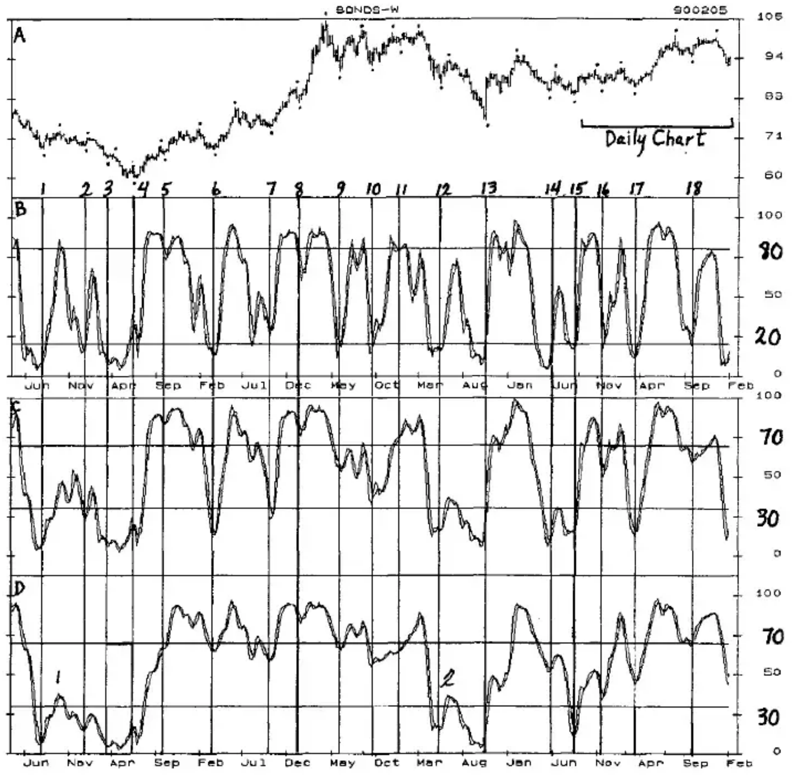
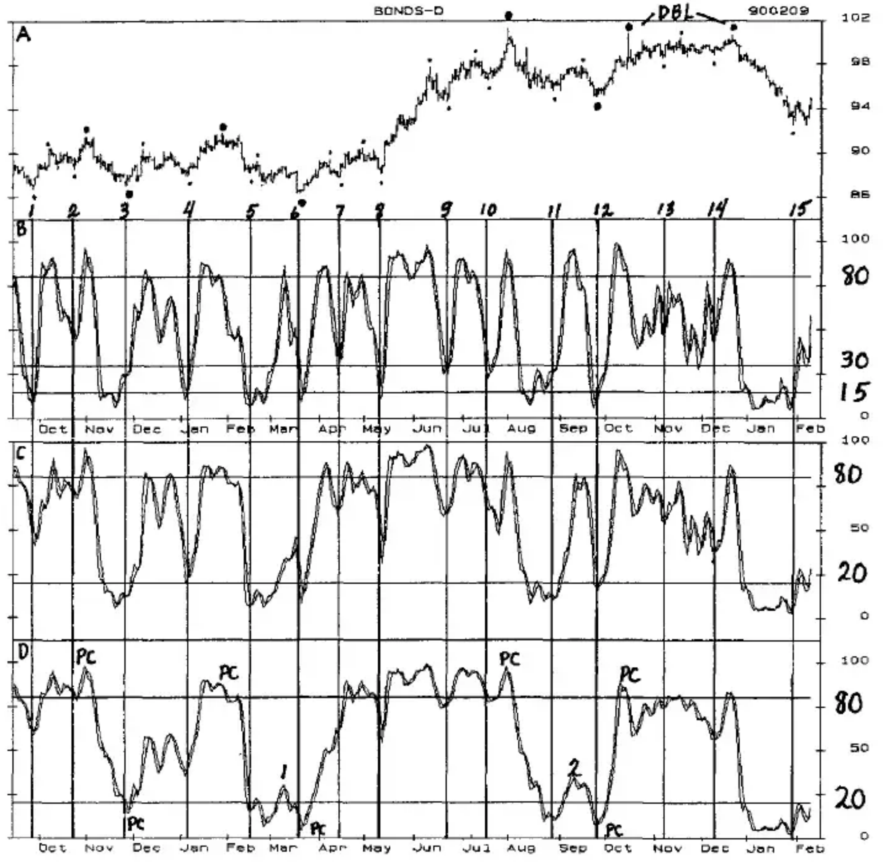
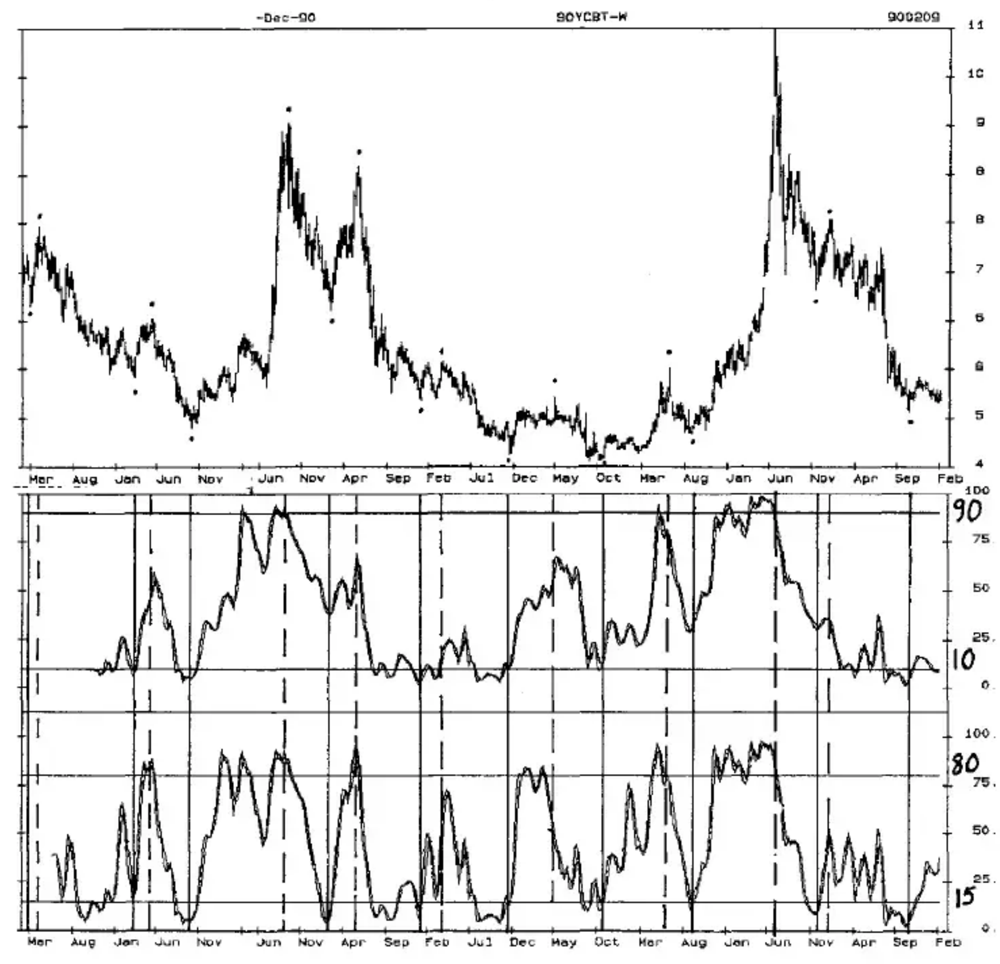

# Chapter Twelve: Stochastic

The Stochastic is one of the more widely watched oscillators because it usually tops and bottoms near the price highs and lows of the markets. Conventional wisdom has it that a market is overbought when the Stochastic is above 70 and oversold when it is below 30. In reality, the Stochastic has a tendency to stay above 70 for long periods of time in a bull market, and below 30 in a bear market. However, it is an excellent indicator of cycle tops and bottoms of various lengths.

The calculations for the Stochastic are in the Appendix. It can be calculated to turn very quickly and frequently, or in the slow Stochastic, to turn more slowly and less frequently, which is the one used here. The Crossover (%D) in this approach is kept only as a confirmation to be used in questionable situations.

**Chart STOCH-1** on Page 12-2 shows weekly T-Bond prices in the top panel with the dots indicating the 18 Primary Cycle highs and lows. The vertical lines below the PC lows allow the correlation between the Stochastic lows and the cycle lows to be easily seen.

The 10-Week Stochastic is an excellent indicator of Primary Cycle bottoms when certain conditions are met. Our intent is not to identify every PC bottom with this oscillator, but to structure the Setup so the Trigger entry will give a high probability confirmation of the PC low, and generate trades with a high probability of making money. It is better to miss a PC bottom once in a while than to have a pattern that requires judgment but lets you 'try' to trade every PC low. By using a variety of oscillators, other Oscillator/Cycle Combinations can usually be found that will identify the PC bottoms that this one misses.

The Buy and Sell Lines for the 10-Week Stochastic in Panel B have been changed from 70 and 30 to 80 and 20. Of the 18 PC lows, 15 occurred with the oscillator below the Buy Line at 20. In 12 of these, once the oscillator dropped below the Sell Line it continued down without an upturn until below the Buy Line. This indicates that once the PC has topped there is an 80% probability that the oscillator will drop below the Buy Line, and that if it is going to drop below the Buy Line, there is an 80% probability that it will do so in a line move down without a wiggle, which means without a sizable upmove between the high and the low.

**Chart STOCH-1** Weekly T-Bond Chart With 10, 20, and 40-Week Stochastics

The Setup for identification of the Primary Cycle bottom is as follows:

1. Prices should be 12 to 28 weeks from the previous PC low,
2. The Stochastic (%K) should drop below the Buy Line at 20,
3. The oscillator should then turn up to complete the Setup.
4. The Trigger entry is a rise above the price high of the upturn week. A drop below the lowest price of the cycle preceding entry would be the protective stop.

Of the 18 PC lows, 11 cycle bottoms were confirmed by the Trigger entry. Ten of the 11 were followed by upmoves that would have generated intermediate to big profits (Cycles 6, 7, 9, 10, 12, 13, 14, 16, 17, and 18). Only one would have made a profit of less than $1000 (Cycle 2).

Six cycle lows did not generate a Setup because the conditions were not met (Cycles 3, 4, 5, 8, 11 and 15). One Setup did not complete a Trigger entry (Cycle 1).

Most of the Primary Cycle lows were confirmed within 1 to 3 weeks of the bottom.

Panel C shows a slow 20-Week Stochastic, and several observations may be useful in the future:

- 6 Primary Cycle bottoms were made below the Buy Line at 30 following an oscillator high above the Sell Line at 70. An interesting aspect of these lows is that the declines from the Sell Line to the Buy Line did not have an upturn until after they dropped below the Buy Line. In such a declining market Trading Cycle highs can be sold against the possibility of a sizable rally that would turn the oscillator up before it drops below the Buy Line.

In each of the 6 cycles, an upturn and Trigger entry above the high of the upturn week confirmed the Primary Cycle low. Buying the market at this Trigger entry would have produced large profits in 3 trades at Cycles 6, 7 and 17, which bottomed in an uptrend or trading range. The other 3, which were followed by a lower Primary Cycle would have produced small profits or a loss.

From these we can infer that following a decline in the 20-Week Stochastic from above the Sell Line to below the Buy Line, when the PC bottom is above the previous PC low, a sizable upmove and rise above the previous PC high can be expected. While occurring in only 2 cycles, this pattern shows up in many markets. It does not occur often, but when it does the moves are big.

Of the 6 cycles that dropped below the Buy Line, 5 saw the Stochastic bottom below 15, indicating that similar declines are likely in future years.

Panel D shows a slow 40-Week Stochastic which illustrates the tendency for this oscillator to stay at high levels during a strong bull market.

The 2 major bottoms followed the pattern of:

- a drop from above the Sell Line to below the Buy Line, followed by
- a rise above the Buy Line to form highs at 1 and 2 that were below 50, followed by a drop well below the Buy Line, and
- rises above the highs at 1 and 2 that confirmed the major bottoms and were followed by major bull markets.

Additional research is needed to see if this pattern occurred at other major bottoms. If it did, it will be a useful indicator of major bottoms in the future.

Most of the PC tops occurred with the 10-Week Stochastic above the Sell Line at 80, but the Stochastic itself does not generate high probability confirmations of the PC highs or high probability trades. The best approach is to have the 10-Week Stochastic above 80 and use the daily Stochastic and other short-term daily oscillators such as the CCI, RSI or 3-10 to generate Setups and Trigger entries that will occur at the Primary Cycle highs.

The daily Stochastic is an excellent indicator of Trading Cycle highs and lows.

**Chart STOCH-2** on Page 12-5 is a daily chart of T-Bonds for the time period indicated by the bracket in the top right hand corner of the chart.

The highs and lows of the Trading Cycle are indicated by dots, and the larger dots are also Primary Cycle tops and bottoms.

Panel B shows the 10-Day Stochastic. Notice how consistently Trading Cycle highs tend to occur as the Stochastic is above the Sell Line at 80. Most Trading Cycle lows occur as the Stochastic is below the Buy Line at 30, with many occurring as it is below 15.

Using the Stochastics with the more sensitive oscillators such as the CCI or RSI will generate high probability Trigger entries that confirm the Trading Cycle highs and lows and are also profitable trades.

Many Primary Cycle highs can be sold within days of the tops when the 10-Week and 10-Day Stochastics are above the Sell Lines at 80 and another short-term oscillator generates a Trigger entry. The 20 and 40-Day Stochastics help to identify the Primary Cycle tops, but the key is the 10-Week Stochastic.

**Chart STOCH-2** Daily T-Bond Chart With 10, 20, and 40-Day Stochastics

The same concept works at Primary Cycle bottoms. When the 10-Week Stochastic is below the Buy Line at 20, and the 10-Day is at least below 30 and ideally below 15, a Trigger entry in a short-term Oscillator/Cycle Combination such as the RSI or CCI will often buy a Primary Cycle low within days of the bottom.

Notice how the 40-Day Stochastic, and to a lesser extent the 20-Day, overextend at the Primary Cycle bottoms. Notice also the similarity of the patterns at the PC lows in the 40-Day Stochastic to the patterns at the major cycle lows in the 40-Week Stochastic. In both, the longer-term cycle was confirmed by a rise above the highs at 1 and 2. This may be a pattern for all longer-term cycles.

The various Stochastics should be a part of any oscillator combination for identification of the Primary and Trading Cycles, and it can also help identify the Seasonal Cycle.

## The Stochastic and the Seasonal Cycle

**Chart STOCH-3** — Oscillators identify Seasonal highs and lows best with weekly data, and the top panel of Chart Stoch-3 on Page 12-7 shows the Seasonal tops and bottoms on a weekly soybean chart from 1981 through March 2, 1990.

In any year, there is about a 70% probability that the Seasonal high will occur April through August, and that the Seasonal low will occur June through October. Overextensions and turning points in the Stochastic and other oscillators during these time periods will help confirm a Seasonal high, which often begins a downtrend of 4 to 7 months, or more.

Panel B is a slow 40-Week Stochastic, and Panel C is a slow 20-Week. The solid vertical lines show the Seasonal lows, and the vertical dashed lines show the Seasonal highs. Compressing 9 1/2 years of data on a chart sacrifices detail for the bigger picture, but details can be gleaned by expanding the chart and by viewing daily charts at the desired time periods.

**Chart STOCH-3** Weekly Soyabean Chart With 40 and 20-Week Stochastics

### 40-Week Stochastic

The Seasonal tops and bottoms occur on, or near, the turns of the Stochastic. Notice that 5 Seasonal highs occurred with the Stochastic below the Sell Line at 90. All 5 were followed by Seasonal lows below the previous Seasonal low, which were accompanied by a drop in the Stochastic below the Buy Line at 10.

Also, notice that the 3 Seasonal highs that occurred above the Sell Line were all followed by Seasonal lows that bottomed above the previous Seasonal low. At these Seasonal lows the Stochastic low was well above the Buy Line at 10. From these observations, the following guidelines can be formulated:

- Seasonal highs that occur as the Stochastic remains below the Sell Line should be followed by a Seasonal low below the previous Seasonal low, and the Stochastic should drop below 10.
- Seasonal highs that occur as the Stochastic is above the Sell Line should be followed by a Seasonal low above the previous Seasonal low, and the Stochastic should bottom well above the Buy Line at 10.

### 20-Week Stochastic

The Seasonal Cycle stands out very clearly in the 20-Week Stochastic. Notice that 6 of 8 Seasonal highs occurred with the Stochastic having risen above the Sell Line at 80, and that 7 of the 8 exceeded 70. Also, every Seasonal low occurred below the Buy Line at 15. The following guidelines can then be formulated:

- A Seasonal high is most likely to occur April through August, and is not likely to be in place unless the Stochastic has exceeded 80, especially in a bull market.
- A Seasonal low is most likely to occur June through October, and is not likely to be in place unless the Stochastic has dropped below 15.

Other oscillators can be used for a more exact identification of the Seasonal bottom and a Trigger entry, similar to the way shorter-term cycles and oscillators were used with T-Bonds.
