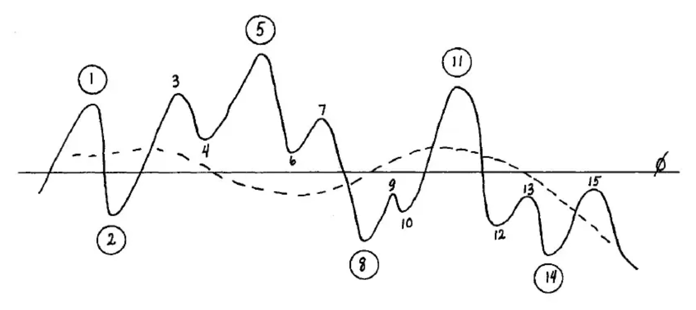
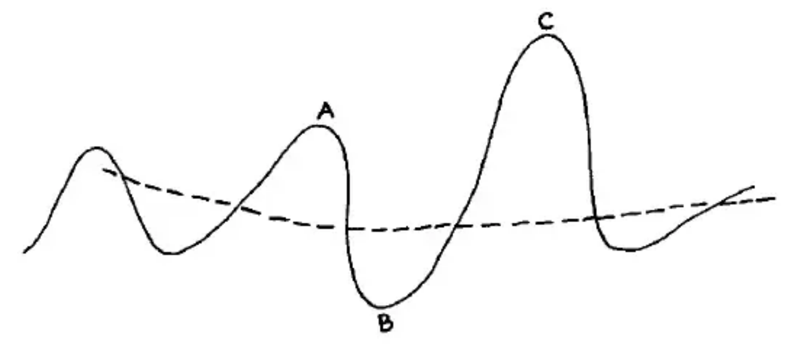
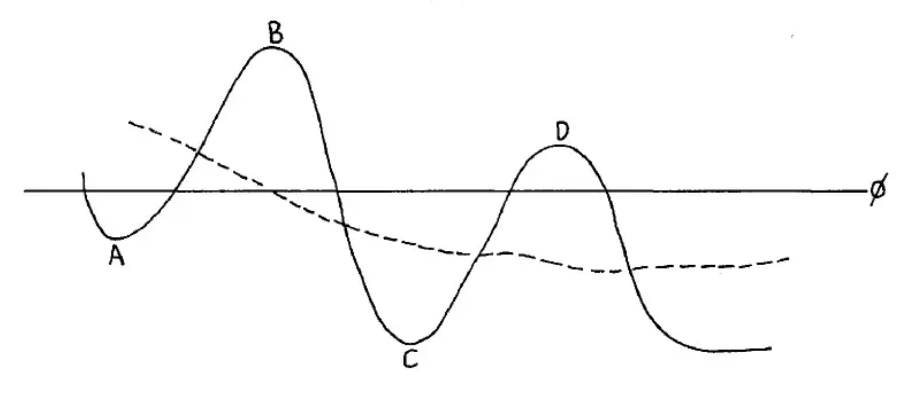
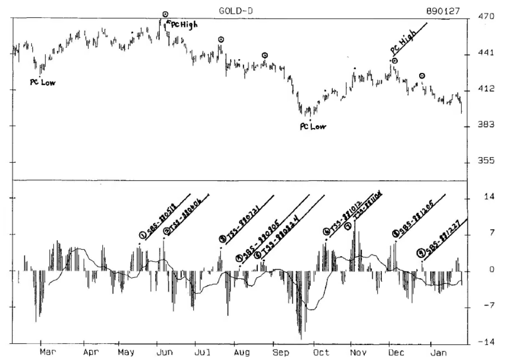
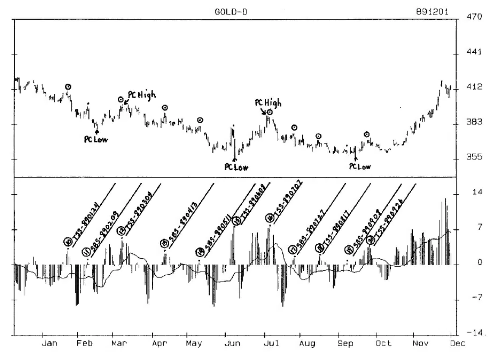

# Chapter Thirteen: 3-10 Oscillator

Oscillators based on daily data are more sensitive than oscillators based on weekly data, and will give many more indications of overbought and oversold levels. More entry signals are generated by daily oscillators, and one of these signals is almost always a Primary Cycle high...but which one?

The only way to determine whether or not an oscillator can determine a Primary Cycle high is through research. Simple turns in the oscillator seldom work, and each oscillator should be evaluated based on the individual patterns that occur in different markets.

A good daily oscillator is the 3-Day Moving Average minus a 10-Day Moving Average. The oscillator turns at overextensions often indicate highs and lows, but what really makes this oscillator a powerhouse is the patterns based on the fluctuations of the 3-10 Oscillator around the Crossover, which is a 16-Term Moving Average of the oscillator.

### Two Step Sell (TSS) and Small Bump Sell (SBS)

To construct this oscillator with the Crossover, plot a 3-10 Moving Average, and on the same chart plot a 16-Term Moving Average of the 3-10 Oscillator. Charts of daily gold and this oscillator from 2/88 through 11/89 are on Pages 13-5 and 13-7.

Primary Cycle highs and lows are indicated on the gold price chart in the top panel. The oscillator chart in the lower panel has oscillator highs marked for two specific patterns: the Two Step Sell (TSS), and the Small Bump Sell (SBS). The circled dots show the Setups that were followed by a Trigger entry. A description of both patterns follows. Page 13-7 shows the research table used to evaluate the effectiveness of these patterns.

The key to the TSS and SBS Oscillator Patterns is the Crossover. A high is valid only when it is above the Zero Line and the Crossover, and follows a low that was formed below the Crossover. A low is valid only when below the Crossover and following a high that was above the Crossover.

---

Example 1 shows the oscillator as a solid line and the Crossover as a dashed line. Each turn of the oscillator is numbered and the highs and lows that are valid for Setups are circled. Of the 15 oscillator turns only the 6 circled Setups would qualify to form the two patterns.

**Example 1** Formation of Oscillator Patterns

---

Example 2 illustrates the formation of the Two Step Sell (TSS). First, an oscillator high is made at A above the Crossover. This high can be above or below the previous oscillator high and the Zero Line. Then an oscillator low is formed below the Crossover at B, which can be above, or below, the previous low. The high at C then rises above the Crossover, and the high at A to form a higher 'second step'. A 2-day downturn in the oscillator completes the Setup stage, and the Trigger for market entry is a drop below the previous week's low, or the low of the current week as explained below.

**Example 2** Two Step Sell

In Example 1 the oscillator high at 5 is a Two Step Sell Setup. The high at 3 might also have been a TSS Setup, but would not normally have triggered a market entry, which usually occurs only at tops. If it had, you would have been stopped out and gone short at the Trigger entry following 5.

---

Example 3 illustrates the Small Bump Sell (SBS). Following an oscillator low below the Crossover at A, a high is formed at B above the Crossover and the Zero Line. The oscillator then forms a second oscillator low at C below the Crossover and the previous oscillator low at A. The Setup is formed at D by a 2-day oscillator downturn that must occur above the Crossover and the Zero Line, but below the oscillator high at B. The Trigger entry is a drop below the previous week's low, or the low of the current week as explained below.

**Example 3** Small Bump Sell

In Example 1 the oscillator high at 11 is a Small Bump Sell. The oscillator high at 15 is not a SBS because it was not above the Zero Line.

The following charts can be combined to form one continuous chart from 880201 to 891201. The charts are 7-day plots, with space left for weekends, which highlights the weekly price ranges.

---

**Chart 310-1** Gold 3-10 Oscillator

---

**Chart 310-2** Gold 3-10 Oscillator

---

### Research Tables for Gold Primary Cycle High Identification and Trading Patterns Using the 3-10 Oscillator

Table 1 is the result of using the patterns to trade gold and to identify the Primary Cycle highs.

**Table 1: TSS and SBS Patterns Sorted by Number**

| # | TYPE | OSC HIGH | PC HIGH | DATE ENTRY | PRICE ENTRY | PC? | WKS TO ENTRY | ENTRY TO PC LOW | PRICE PC LOW | AMT TO PC LOW | % TO PC LOW |
|---|------|----------|---------|------------|-------------|-----|--------------|-----------------|--------------|---------------|-------------|
| A | B | C | D | E | F | G | H | I | J | K | L |
| 1 | SBS | 880518 | | | | | | | | | |
| 2 | TSS | 880606 | 469 | 880610 | 453 | Y | 14 | 3 | 432 | 21 | 4.64 |
| 3 | TSS | 880721 | 449 | 880725 | 425 | Y | 4 | 9 | 391 | 44 | 10.11 |
| 4 | SBS | 880805 | | | | | | | | | |
| 5 | TSS | 880824 | 449 | 880829 | 430 | | 9 | 4 | 391 | 39 | 9.07 |
| 6 | TSS | 881012 | | | | | | | | | |
| 7 | TSS | 881104 | | | | | | | | | |
| 8 | SBS | 881205 | 433 | 881209 | 420 | Y | 10 | 10 | 380 | 40 | 9.52 |
| 9 | SBS | 881227 | 433 | 890106 | 409 | | 14 | 6 | 380 | 29 | 7.09 |
| 10 | TSS | 890124 | 433 | 890127 | 401 | | 17 | 3 | 380 | 21 | 5.24 |
| 11 | SBS | 890209 | | | | | | | | | |
| 12 | TSS | 890309 | 400 | 890327 | 391 | Y | 6 | 10 | 356 | 35 | 8.95 |
| 13 | SBS | 890413 | 400 | 890428 | 382 | | 10 | 6 | 356 | 26 | 6.81 |
| 14 | SBS | 890511 | 400 | 890515 | 376 | | 13 | 3 | 356 | 20 | 5.32 |
| 15 | TSS | 890608 | | | | | | | | | |
| 16 | TSS | 890707 | 390 | 890714 | 377 | Y | 5 | 9 | 357 | 20 | 5.31 |
| 17 | SBS | 890727 | 390 | 890807 | 365 | | 9 | 5 | 357 | 8 | 2.19 |
| 18 | TSS | 890817 | 390 | 890824 | 364 | | 11 | 3 | 357 | 7 | 1.92 |
| 19 | SBS | 890908 | | | | | | | | | |
| 20 | TSS | 890926 | XX | 891002 | 366 | | X | X | X | X | X |

**COLUMN A** is the number of the oscillator Setup in the charts on Pages 13-5 and 13-6.

**COLUMN B** is the type of pattern--TSS or SBS. Combining oscillators and cycles is not simply a matter of looking for profitable trades. It involves looking for the patterns, for the timing that occurs in the combinations. The sort function of a spreadsheet helps to see patterns and timing that might otherwise go unnoticed. Table 2 below is sorted by the type of pattern. Looking at the SBS group, there were only 5 of 9 Setups that triggered an entry. Although the sample size is small we can make a number of observations that will develop into trading guidelines if confirmed by research in other time periods that provide a larger and more diversified sample size.

**Table 2: TSS and SBS Patterns Sorted by Pattern Type - Column B**

| # | TYPE | OSC HIGH | PC HIGH | DATE ENTRY | PRICE ENTRY | PC? | WKS TO ENTRY | ENTRY TO PC LOW | PRICE PC LOW | AMT TO PC LOW | % TO PC LOW |
|---|------|----------|---------|------------|-------------|-----|--------------|-----------------|--------------|---------------|-------------|
| A | B | C | D | E | F | G | H | I | J | K | L |
| 9 | SBS | 881227 | 433 | 890106 | 409 | | 14 | 6 | 380 | 29 | 7.09 |
| 14 | SBS | 890511 | 400 | 890515 | 376 | | 13 | 3 | 356 | 20 | 5.32 |
| 13 | SBS | 890413 | 400 | 890428 | 382 | | 10 | 6 | 356 | 26 | 6.81 |
| 8 | SBS | 881205 | 433 | 881209 | 420 | Y | 10 | 10 | 380 | 40 | 9.52 |
| 17 | SBS | 890727 | 390 | 890807 | 365 | | 9 | 5 | 357 | 8 | 2.19 |
| 11 | SBS | 890209 | | | | | | | | | |
| 1 | SBS | 880518 | | | | | | | | | |
| 19 | SBS | 890908 | | | | | | | | | |
| 4 | SBS | 880805 | | | | | | | | | |
| 10 | TSS | 890124 | 433 | 890127 | 401 | | 17 | 3 | 380 | 21 | 5.24 |
| 2 | TSS | 880606 | 469 | 880610 | 453 | Y | 14 | 3 | 432 | 21 | 4.64 |
| 18 | TSS | 890817 | 390 | 890824 | 364 | | 11 | 3 | 357 | 7 | 1.92 |
| 5 | TSS | 880824 | 449 | 880829 | 430 | | 9 | 4 | 391 | 39 | 9.07 |
| 12 | TSS | 890309 | 400 | 890327 | 391 | Y | 6 | 10 | 356 | 35 | 8.95 |
| 16 | TSS | 890707 | 390 | 890714 | 377 | Y | 5 | 9 | 357 | 20 | 5.31 |
| 3 | TSS | 880721 | 449 | 880725 | 425 | Y | 4 | 9 | 391 | 44 | 10.11 |
| 20 | TSS | 890926 | XX | 891002 | 366 | | X | X | X | X | X |

Observations:

- All 5 SBS entries occurred 9 weeks or more following the PC low: so if a setup occurs before the 9th week an entry is not likely...consider the possibility of going long against the Trigger entry price.

- 4 of 5 were not PC highs and occurred after the high was made. These 4 dropped 3-6 weeks from entry, setting a guideline for when to expect the next PC low to occur.

- Of the 8 TSS patterns that entered the market, 4 occurred at PC highs, and 3 of the 4 obviously occurred in bear markets, as the weeks from PC low to entry were only 4-6 weeks from the PC low.

- Of those that were not PC highs, 3 entered after the PC high and made the PC low 3-4 weeks following entry. Only one occurred before the PC high. With 7 of 8 occurring at, or following, a PC high, this pattern is also a good indicator of a PC high.

**COLUMN C** is the date of the oscillator high.

**COLUMN D** is the price high of the Primary Cycle in which the pattern occurs, if it occurred at, or after, the PC high ... not before.

**COLUMN E** is the date market entry was triggered. The sell stop to enter should be placed after the second consecutive oscillator down day. In this study, the Trigger entry will be:

- A drop below the previous week's low, or

- If the oscillator turns down in a week following a price high week (the price high of the week of the downturn is below the price high of the previous week at the time of the downturn), the sell stop should be placed below the previous week's low after the second consecutive oscillator downturn day. But if the previous week's low has already been taken out, the sell stop should be placed below the low of the current week. A protective buy stop should be placed just above the high of the highest price high before entry.

The numbers in COLUMN E reference rules that eliminate losing trades. These rules should be evaluated when the oscillator is researched in other time periods. If a rule does not work when tested in other time periods of both bull and bear markets, the rule should be discarded and the trades cataloged as losers. Before putting your money on the line always test the patterns and rules in different types of markets, as there can be distinct differences between performance in bull markets and bear markets. 'N' means there was no possibility of entry.

1) **8-WEEK RULE** - Do not enter in an outside down week (the previous week's high is exceeded, then the previous week's low is taken out in the same week), in which the high of the outside week is the highest of the previous 8 weeks. In gold, prices often continue higher, especially in bull markets.

2) **6-WEEK RULE** - If the oscillator downturn occurs in less than 6 weeks from the PC low, and the price high of that week is exceeded, place the Trigger entry below the low of the week in which the oscillator turned down; if not entered within 3 weeks of the downturn, cancel the sell order.

3) **14-WEEK RULE** - Do not enter a market after the fourteenth week from the PC low. While some trades might be profitable as was #10, in general after the fourteenth week you want to be psychologically preparing to go long, which most traders find hard to do if short.

**COLUMN F** is the entry price activated by the Trigger entry.

**COLUMN G** indicates the signals that occurred at the 5 PC highs, which is the sort used in Table 3 below. Notice that every PC high was followed by a completed sell pattern, and that 4 of the 5 entered the market within 7 days of the top. It is also interesting that 4 of the 5 PC highs occurred with a TSS. Should this be consistent in other time periods it would be a valuable piece of information for identifying the PC tops.

**Table 3: TSS and SBS Patterns Sorted by PC Highs - Column G**

| # | TYPE | OSC HIGH | PC HIGH | DATE ENTRY | PRICE ENTRY | PC? | WKS TO ENTRY | ENTRY TO PC LOW | PRICE PC LOW | AMT TO PC LOW | % TO PC LOW |
|---|------|----------|---------|------------|-------------|-----|--------------|-----------------|--------------|---------------|-------------|
| A | B | C | D | E | F | G | H | I | J | K | L |
| 3 | TSS | 880721 | 449 | 880725 | 425 | Y | 4 | 9 | 391 | 44 | 10.11 |
| 8 | SBS | 881205 | 433 | 881209 | 420 | Y | 10 | 10 | 380 | 40 | 9.52 |
| 12 | TSS | 890309 | 400 | 890327 | 391 | Y | 6 | 10 | 356 | 35 | 8.95 |
| 16 | TSS | 890707 | 390 | 890714 | 377 | Y | 5 | 9 | 357 | 20 | 5.31 |
| 2 | TSS | 880606 | 469 | 880610 | 453 | Y | 14 | 3 | 432 | 21 | 4.64 |
| 5 | TSS | 880824 | 449 | 880829 | 430 | | 9 | 4 | 391 | 39 | 9.07 |
| 9 | SBS | 881227 | 433 | 890106 | 409 | | 14 | 6 | 380 | 29 | 7.09 |
| 13 | SBS | 890413 | 400 | 890428 | 382 | | 10 | 6 | 356 | 26 | 6.81 |
| 14 | SBS | 890511 | 400 | 890515 | 376 | | 13 | 3 | 356 | 20 | 5.32 |
| 10 | TSS | 890124 | 433 | 890127 | 401 | | 17 | 3 | 380 | 21 | 5.24 |
| 17 | SBS | 890727 | 390 | 890807 | 365 | | 9 | 5 | 357 | 8 | 2.19 |
| 18 | TSS | 890817 | 390 | 890824 | 364 | | 11 | 3 | 357 | 7 | 1.92 |
| 20 | TSS | 890926 | XX | 891002 | 366 | | X | X | X | X | X |

**COLUMN H** is the number of weeks from PC low to the Trigger entry, which is the sort used in Table 4 below. Notice that of the 4 that entered less than 9 weeks from the PC low, 3 were PC highs that occurred 4-6 weeks from the low. This would indicate that a completed signal that occurs less than 9 weeks from the PC low is likely to be a PC high. Since PC highs of less than 9 weeks tend to occur in bear markets this would also be an indicator that gold is probably in a bear market and that the previous PC low has a high probability of being taken out.

Notice also that of the 9 entries occurring 9-17 weeks from the PC low, 8 made the next PC low 3-6 weeks from entry (column I). This is a real jewel of an indicator (if it holds up in more extensive research) because it will keep you from taking profits too soon, and from trying to buy the market until at least the third week following entry. You will also have a high probability time period of 3-6 weeks for oscillator overextensions to identify the PC low.

**Table 4: TSS and SBS Patterns Sorted by PC-Weeks to Entry - Column H**

| # | TYPE | OSC HIGH | PC HIGH | DATE ENTRY | PRICE ENTRY | PC? | WKS TO ENTRY | ENTRY TO PC LOW | PRICE PC LOW | AMT TO PC LOW | % TO PC LOW |
|---|------|----------|---------|------------|-------------|-----|--------------|-----------------|--------------|---------------|-------------|
| A | B | C | D | E | F | G | H | I | J | K | L |
| 10 | TSS | 890124 | 433 | 890127 | 401 | | 17 | 3 | 380 | 21 | 5.24 |
| 9 | SBS | 881227 | 433 | 890106 | 409 | | 14 | 6 | 380 | 29 | 7.09 |
| 2 | TSS | 880606 | 469 | 880610 | 453 | Y | 14 | 3 | 432 | 21 | 4.64 |
| 14 | SBS | 890511 | 400 | 890515 | 376 | | 13 | 3 | 356 | 20 | 5.32 |
| 18 | TSS | 890817 | 390 | 890824 | 364 | | 11 | 3 | 357 | 7 | 1.92 |
| 8 | SBS | 881205 | 433 | 881209 | 420 | Y | 10 | 10 | 380 | 40 | 9.52 |
| 13 | SBS | 890413 | 400 | 890428 | 382 | | 10 | 6 | 356 | 26 | 6.81 |
| 5 | TSS | 880824 | 449 | 880829 | 430 | | 9 | 4 | 391 | 39 | 9.07 |
| 17 | SBS | 890727 | 390 | 890807 | 365 | | 9 | 5 | 357 | 8 | 2.19 |
| 12 | TSS | 890309 | 400 | 890327 | 391 | Y | 6 | 10 | 356 | 35 | 8.95 |
| 16 | TSS | 890707 | 390 | 890714 | 377 | Y | 5 | 9 | 357 | 20 | 5.31 |
| 3 | TSS | 880721 | 449 | 880725 | 425 | Y | 4 | 9 | 391 | 44 | 10.11 |
| 20 | TSS | 890926 | XX | 891002 | 366 | | 3 | X | X | X | X |

**COLUMN I** is the number of weeks from entry to PC low.

**Table 5: TSS and SBS Sorted by % to PC Low - Column L**

| # | TYPE | OSC HIGH | PC HIGH | DATE ENTRY | PRICE ENTRY | PC? | WKS TO ENTRY | ENTRY TO PC LOW | PRICE PC LOW | AMT TO PC LOW | % TO PC LOW |
|---|------|----------|---------|------------|-------------|-----|--------------|-----------------|--------------|---------------|-------------|
| A | B | C | D | E | F | G | H | I | J | K | L |
| 3 | TSS | 880721 | 449 | 880725 | 425 | Y | 4 | 9 | 391 | 44 | 10.11 |
| 8 | SBS | 881205 | 433 | 881209 | 420 | Y | 10 | 10 | 380 | 40 | 9.52 |
| 5 | TSS | 880824 | 449 | 880829 | 430 | | 9 | 4 | 391 | 39 | 9.07 |
| 12 | TSS | 890309 | 400 | 890327 | 391 | Y | 6 | 10 | 356 | 35 | 8.95 |
| 9 | SBS | 881227 | 433 | 890106 | 409 | | 14 | 6 | 380 | 29 | 7.09 |
| 13 | SBS | 890413 | 400 | 890428 | 382 | | 10 | 6 | 356 | 26 | 6.81 |
| 14 | SBS | 890511 | 400 | 890515 | 376 | | 13 | 3 | 356 | 20 | 5.32 |
| 16 | TSS | 890707 | 390 | 890714 | 377 | Y | 5 | 9 | 357 | 20 | 5.31 |
| 10 | TSS | 890124 | 433 | 890127 | 401 | | 17 | 3 | 380 | 21 | 5.24 |
| 2 | TSS | 880606 | 469 | 880610 | 453 | Y | 14 | 3 | 432 | 21 | 4.64 |
| 17 | SBS | 890727 | 390 | 890807 | 365 | | 9 | 5 | 357 | 8 | 2.19 |
| 18 | TSS | 890817 | 390 | 890824 | 364 | | 11 | 3 | 357 | 7 | 1.92 |
| 20 | TSS | 890926 | XX | 891002 | 366 | | 3 | X | X | X | X |

**COLUMN J** is the price of the PC low.

**COLUMN K** is the dollar amount from entry to PC low.

**COLUMN L** is the % decline from entry to PC low, which is the sort used in Table 5 above. The median decline is about 6%, and no decline exceeded 10.11%. These relatively small declines are a function of the price level. No entry occurred above 430, and the smallest declines followed entries at the 364 and 365 entries. The moves that followed entries at the 700, 600 and even 500 levels, were much greater.

Through 2 relatively simple patterns we have been able to identify the tops of the 18-Week Primary Cycle and develop high probability entry signals. The same process can be applied to intra-day data to give earlier entries in anticipation of triggering an entry in the TSS and SBS.

The 5.6-Year Cycle low, due the last quarter of 1990 or first quarter of 1991, is likely to be followed by a bull market that will take prices above the 1980 high in this decade. A little research now could be very profitable over the next 10 years.
