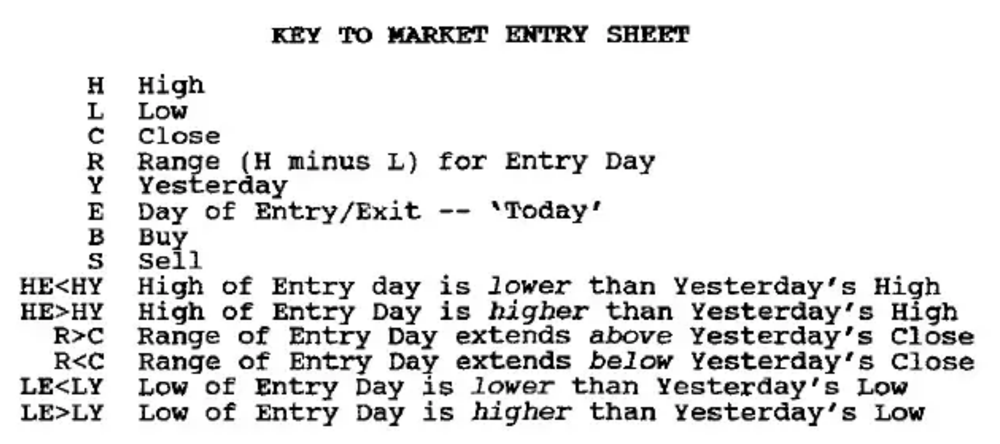
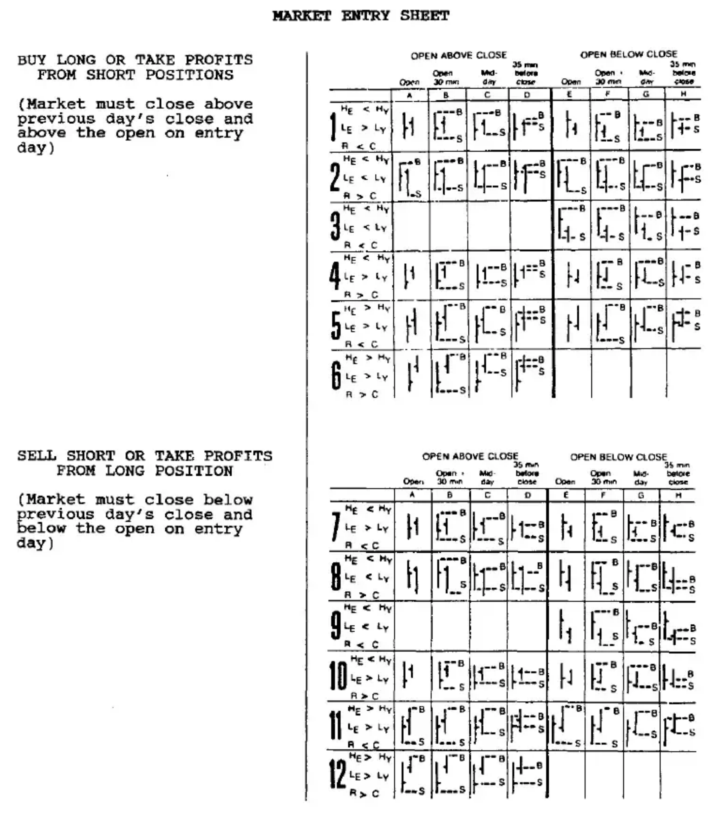

# Chapter Fourteen: Trading and Money Management

Successful futures trading involves four inter-related aspects of trading.

1. **MARKET ANALYSIS** -- determining market trend, topping/bottoming levels, and timing for tops and bottoms.

2. **MONEY MANAGEMENT** -- calculating risk/reward, size of positions and preservation of trading capital.

3. **MARKET ENTRY AND EXIT** -- actual time and price levels for buying and selling.

4. **A GAME PLAN** -- combining all of the above into a Trading Strategy that includes:
   - How and when you will enter the market.
   - How and when you will take profits.
   - Placement and adjustment of trailing stops.
   - Other strategies you wish to include in your Game Plan.

Most people learn to trade the futures markets on their own through actual trading in the futures markets. No one can tell you how to trade, but you can learn from the mistakes of others.

The single most important aspect of trading futures, or any highly leveraged market is money management. You will make mistakes, and you will lose money, but with the proper approach, you can turn futures into a profitable venture.

The rules and guidelines that follow comprise my own trading approach which was developed through years of trading the markets.

Although no two people will trade the markets exactly the same, I suggest you carefully consider these guidelines and incorporate them into your own trading style.

## Part I: 12 Cardinal Mistakes in Trading Futures and How to Overcome Them

### 12 Cardinal Mistakes

1. Lack of a Game Plan
2. Lack of Money Management
3. Failure to Use Protective Stop/Loss Orders
4. Taking Small Profits and Letting Your Losses Run
5. Overstaying Your Position
6. Averaging a Loss
7. Meeting Margin Calls
8. Increasing Your Commitment with Success
9. Overtrading Your Account
10. Failure to Remove Profits from Your Account
11. Changing Your Strategy During Market Hours
12. Lack of Patience, or Trading for Excitement, Not for Profit

In the 20+ Years that I have been trading the futures markets, I have made every possible mistake more often than I like to admit. The most common mistakes are 12 CARDINAL MISTAKES IN FUTURES TRADING. Each is listed with possible solutions to help you avoid repeating these mistakes time and time again.

### Introduction

**Self-Discipline**

It has been my experience in trading futures that the greatest cause of loss is lack of self-discipline. Lack of self-discipline to follow your game plan; lack of self-discipline to be patient; lack of self-discipline to take a loss or profit; lack of self-discipline to follow proven money management concepts. The list can go on and on...

**Fear and Greed**

With the tremendous leverage of the futures markets, you as a trader are intensely exposed to the basic emotions of fear and greed. At certain times, these emotions can make you completely and absolutely irrational, oblivious to what is really happening. It can make you rely on hope, hope that the market will do what you want it to do because it must! Otherwise you will lose all of your risk capital, and perhaps much more. Not surprisingly, that doesn't matter to the market.

**Danger of Success**

Each time I made one of these 12 CARDINAL MISTAKES, I promised myself not to repeat the mistake, but as I was once again successful, and made large amounts of money, I invariably became overconfident, sloppy and 'dangerous'. You are most likely to make these same mistakes when you are making money not losing it. After several losses, you naturally tighten up your discipline and become more conservative, or lose all of your risk capital. Following several losses you are likely to lose the least amount of money on a trade, and unfortunately, you are also likely to make the least amount of money because of the natural tendency to 'grab' the profit and avoid another loss.

**Overconfidence**

It is following a string of profitable trades that you are most likely to lose large amounts of money. If you began trading with $30,000, and limited yourself to 10% risk you could lose a maximum of $3000 per trade. With profits increasing your account to $100,000, you can now lose $10,000 per trade. This is the time you should reduce your risk to 5%; but flushed with success, you are more prone to break your rules, double up your positions and let your losses run when you should have been stopped out. Reviewing my records, I found that some of my largest losses have come from my smallest positions. After making large profits, I let these small positions run into extremely large losses because I was overconfident.

**Balance**

Trading futures is a game of psychology. It is a game of balance. Emotional extremes create an imbalance. In your elation at being successful, you make mistakes of greed. In your reluctance to take a loss you make mistakes of fear. The tremendous emotional release I have felt when I finally closed out a big losing position was amazing. Fighting the market, yet knowing it was going to go against me, but wanting it to go in my direction, pushing it, hoping for it, worrying about it. After a few days or a few weeks of that, it felt as though the weight of the world was taken off my shoulders when I finally took the loss, even when I knew it was the bottom.

**Hope**

One of the early signs that you have made a serious mistake is when you change your routine and begin to call your broker frequently for quotes and 'reasons' for the market to go your way. Things such as asking him to call the floor for advice, asking him what he thinks you should do (even though he told you 15 minutes earlier), hoping that some government action will bail you out. This is not futures trading -- it is hope. Hope is the most devastating of all emotions in trading futures because it can lull you into complacency. You know when you find yourself hoping that you are wrong, and should immediately get out of the market; but it takes an unusual amount of self-discipline to take that now very large loss.

**Take Profits**

Tremendous amounts of money can be made in the futures markets. Profits are there for the making, but the real key to trading futures is not making money; it is keeping it. It is not basking in the elation of success; it is taking your profits and looking over your shoulder.

**Profit/Loss Cycle**

Every experienced futures trader has a profit/loss cycle. I know mine, and most other professionals know theirs. Without exception, every trader I know has experienced a cycle of success, of over-commitment, of over-confidence, followed by losses and the feeling of failure. I have made and lost many millions of dollars and know that these 12 CARDINAL MISTAKES can be overcome through strict, unbending self-discipline, and mechanical rules that cannot be broken. Once aware of these mistakes, by adhering to the following rules and guidelines, your odds of making money are greatly increased.

### The 12 Cardinal Mistakes

#### (1) Lack of a Game Plan

Having published an advisory service for twelve years, I have had a lot of contact with the trading public. I am always amazed that year after year, trade after trade, I hear the same approach. A trader who thinks a market is about to start up will usually say something like, "I think gold is going to go up to $600. Where do you think I should buy it?" My response is always, "Well, where are you going to get out if you are wrong?" There is almost always silence, or perhaps a puzzled "huh?". They never thought about being wrong, they never thought about where to put their stop, and my next question, "Well, if it does go up, how and where are you going to get out?", often receives the same response.

Better than 90% of the futures traders that I have come in contact with had no game plan. That means they did not know what to do if they were wrong, and they did not know what to do if they were right. The large paper profits they made often turned into a large loss because they did not know where to get out.

One of the most important moves a trader can make is to develop a game plan consisting of basic guidelines:

- Know how and where you are going to enter a market.
- Know how much money you are going to risk on each and every trade.
- Know how and where you are going to get out if you are wrong.
- Know how and where you are going to take profits if you are right.
- Know how much money you are going to make if you are right.
- Have a Safety Stop in case the market does the unexpected.
- Have an approximate idea of when a market should meet your objectives; of when it should begin to make a move, and if it has not done so, get out.

#### (2) Lack of Money Management

Few traders have a workable concept of money management. Money management is controlling your risk through the use of stops, while balancing your potential for loss against your potential for profit.

Let me give you just one example of poor money management. Many traders refer to a trade that might lose $500 if they are wrong and make them $1500 if they are right as a three-to-one reward/risk ratio -- a 'decent' trade. Yet, that is misleading because the most important aspect of a trade is not how much you are going to make if you are right, but what the odds are of making money, of being right. What are your odds of losing money, of being wrong?

Good money management means you know your profit objective and the odds of being right or wrong, and controlling your risk with stops. You are better off with a trade in which you might lose $1000 if you are wrong, or make $1000 if you are right, that would work eight times out of ten, than to take a trade where you would make $1500 if you are right and lose only $500 if you are wrong, but which is profitable only one time out of three.

#### (3) Failure to Use Protective Stop/Loss Orders

This fits right in with a game plan and money management. It is the failure to use stop/loss orders once you enter the market -- not mental stops, but real stops that cannot be moved. All too often traders use mental stops because, in the past, they have been stopped out and then watched the market move in their direction. This does not invalidate the use of stops. It simply means that their stop was in the wrong place -- they did not have a good technical stop.

When a stop/loss order that was determined before you entered the market is hit, it means your analysis was wrong, your game plan was wrong. With a mental stop, as soon as the market has gone through your stop price, you no longer act like a rational human being. You are more likely to make mistakes because you are now operating on fear and hope. How many times have you had a mental stop and instructed your broker to call you when prices went through it. By the time he could call you, the market had run an extra $1000 against you. You probably decided to hold onto the trade in the hope that it would let you out on a retracement to your entry price. Unfortunately, it never touched that price again, and you took a larger loss.

Or you made the mistake of holding the trade overnight because you hoped it was going to go higher the next day. But the next day it was lower, and by then your loss was so large you couldn't 'afford' to get out -- and what should have been a small loss turned into a disaster.

There is an old saying that the first loss is the smallest. It is also the easiest to take even though it may seem hard at the time.

The only way to overcome this mistake is to have an unbreakable rule, (and the discipline to follow it!), that stop/loss orders must be placed each and every time the market is entered. I have found the easiest way to take a loss is to have the stop order waiting before the open or immediately after entering the market. Do your homework when the market is closed, and place a resting order before the open. Another rule should be that the initial protective stop/loss order cannot be changed to increase the risk, only to reduce it.

#### (4) Taking Small Profits and Letting Your Losses Run

A very common mistake among inexperienced traders is taking small profits and letting losses run. This is often the result of no game plan.

After one or two losing trades, you're very likely to take a small profit on the next trade, even though that trade could have turned into a large profit-maker that would have offset all your losses.

Letting your losses run often happens to new futures traders, but is not that uncommon among professional futures traders either. After entering a market, you don't know where to get out. Once you start losing money your tendency is to let your loss get larger and larger as you hope that the market will retrace to let you break even -- which, of course, it seldom does.

This mistake is overcome by using pre-determined stop/loss orders to prevent your losses from running, and a pre-determined game plan to take profits at your profit objective, or with a trailing stop.

#### (5) Overstaying Your Position

#### (6) Averaging a Loss

This is usually a holdover from trading stocks. In futures, with five or ten percent margin, averaging a loss can be disastrous.

A typical approach is that after you have bought a contract and it drops lower, you figure that since it was a good buy then, it is a better buy now. You can also justify averaging down by figuring you will have a lower average entry price and require a smaller move to break even. Unfortunately, you will lose twice as much if the market continues against you, as it almost always does.

There are approaches that will allow you to buy a market at one price level, add on at a lower level, and add on again at even a lower level, as long as this was your pre-determined game plan before you bought the first contract. And you must also have an unmovable stop/loss order that takes you out of all contracts.

This mistake is easily overcome by having a strict rule that you never average a loss unless your pre-determined game plan called for buying the market at lower levels with an unmovable stop/loss order to take you out of all contracts if it is hit.

#### (7) Meeting Margin Calls

Most often, meeting a margin call will only increase your loss. A margin call means you are wrong in the market, and your position should be closed out. Margin calls are met because people do not want to admit being wrong and take a loss; because they hope the market will eventually go in their direction.

Margin calls are the result of making one or more of the other 12 CARDINAL MISTAKES such as not having a game plan, not using stop/loss orders, overtrading and poor money management.

You should never have a margin call, much less meet one using the rules to overcome the 12 CARDINAL MISTAKES.

#### (8) Increasing Your Commitment with Success

One of the most dangerous mistakes you can make in trading is to increase your exposure as you become more successful. Just by being successful you will risk more dollars per trade because you have more money. But, because you have more money (and confidence) when successful, you are also likely to take larger percentage risks. Not surprisingly, this ruins more futures traders than a series of small losses.

You can overcome this mistake by not allowing your percentage commitment to increase as you realize profits (it should actually decrease), and by maintaining your stop/loss discipline.

#### (9) Overtrading Your Account

---or risking too large a percentage of equity on any single trade. Either with too large a dollar risk per contract or by trading too many contracts for any single trade, or by trading too many markets.

This often happens after a period of success when you 'know' that the market is going to do something. You are so certain that this is going to be a really big move, that you risk much more than the maximum 5-10% of your equity. Already emotionally out of balance, all it takes is a couple of limit moves against you and you are bust.

To prevent this mistake from occurring, you must have a hard and fast rule that you can risk no more than a certain percentage of your equity on any trade regardless of how good the trade looks, and should have a program for lowering that percentage as your equity increases.

#### (10) Failure to Remove Profits from Your Account

It seems to be a natural law that the futures markets, over a given period of time will allow you to make only so much money and then you are going to have to start giving some back. Yet, no more than a handful of the futures traders I know have a rule to take profits out of their account, (but most never fail to put more money into their accounts to meet margin calls). They leave profits in their account and go for the 'big trade', the one trade that will give them a real 'killing', and usually kills their profits.

This can be overcome by pre-determining an equity level at which you remove profits from your account. When you make profits in the futures markets, take some money out and put it somewhere else. The markets are not a cornucopia. If you chart your equity, you will see that it will also move in cycles. You will make some, lose some, make some, lose some. By taking money out of your account when you are profitable, you will not make the mistake of losing larger amounts of money when your down cycle begins.

#### (11) Changing Your Strategy During Market Hours

During market hours you are subject to emotional reactions of fear and greed much more than you are when the market is closed. Have you ever sat down in the quiet of the night before the trading day, and very calmly figured out what you wanted to do the next day; yet, shortly after the market opened you did exactly the opposite of what you had planned.

With rare exception, the best approach is to not change your trading strategy during market hours.

Overcome this mistake by developing your trading strategy before the market opens and having the discipline to not change your game plan during the day, unless it is to stand aside.

#### (12) Lack of Patience, (or Trading for Excitement, Not for Profit)

The average life of a futures trader is somewhere between five minutes and nine months. Not all traders trade because they want to make money. Many trade because they want the action. Think about it -- must you have a trade a day, or can you patiently wait for the high probability trades, even if it means standing aside for a week or two?

You must evaluate your own trading and determine whether you really trade to make money, or for the action and excitement. To overcome this mistake, you must develop patience, do your homework, and research the markets for high probability trades.

For those of you that do wish to learn how to make money in futures, rest assured you can. Do not expect to make money in each and every trade, but if you avoid the 12 CARDINAL MISTAKES, you must make money over an extended period of time. Certainly the market will do the unexpected, and at times you will lose more than you expected; but if you consciously try not to make these mistakes, you must make money.

By studying the past history of a market you can isolate high probability trades and situations that offer exceptionally large profits relative to the dollar risk...if you have the patience to wait for them.

## Part II: Controlled Risk Money Management

Most futures traders spend 99% of their time on analysis and the buying and selling of markets. Many of these traders ultimately join the legions of ex-futures traders because they ignored the most important aspect of speculation -- money management.

You can be a good analyst and lose money due to poor money management. But, if you have sound, market-proven money management concepts and the discipline to follow them, you will never lose all of your money.

Since developing the following money management concepts in the mid-1970's, I've had large profits as well as large losses -- but never a single margin call. There is no guarantee that you will make money using these money management rules, but you will never lose the farm.

### Rule 1: Before entering the market, determine a stop/loss as well as a profit objective.

Many traders often enter the market with a price objective, but without a clearly defined protective stop. When the market moves against them they are often forced out by the size of their margin call. They lose control, and the results are often disastrous. What should have been a relatively small loss becomes an extremely large loss.

With a pre-determined price objective and a pre-determined stop/loss, you know where you will get out if you are wrong and where you will get out if you are right. You have control. The stop/loss must be in the market, not in your mind.

If you have been stopped out only to have the market make the move without you, the problem was how you determined where to place your stop not whether to use stops.

### Rule 2: Never risk more than 10% of equity on any single trade. If possible, risk 5% or less. Never risk more than 20% in any one complex.

If you are like most traders, you always figure how much you could make. The question of how much you could lose if you're wrong is never quantified. You are out of control.

The most important question in trading leveraged markets is -- How much of your equity is at risk? On any given day, for any given trade, you must know how much you will lose if the market goes against you. You can maintain control by never risking more than 10% in any one trade, and by adjusting stops so you are never risking more than a maximum of 20% of open equity at any time.

In reality, the 20% risk factor should exist for only a few days at most, as explained in the following multiple contract approach which will greatly reduce your exposure within several days of entering the market.

### Trade in Multiple Contracts

One of the most important concepts is to trade multiples of three. Whether two, three, ten or a hundred contracts are traded, most traders make the mistake of entering and exiting all contracts at the same price level. They are going to be all right or all wrong. In using multiple contracts, no fewer than three contracts should be traded per position, and one-third of each position should have a different profit objective. If trading 3 contracts, each contract would have a different price objective; if trading 90 contracts, each grouping of 30 contracts would have a different price objective... With each one-third of a position having a different price objective you can be wrong on your expectations and still make money!

For example, a $30,000 account risking 10% of equity can afford to risk $3,000 on the overall position. If the dollar risk per contract from point of entry to stop/loss is $900, commissions and 'skiddage' might equal another $100; the dollar risk per contract is $1,000 with a total $3000 for the three contracts in the position.

#### Contract No. 1: The Money Contract

The first contract, called the Money Contract, is the most important. When possible, the profit figure for the Money Contract should equal the dollar risk, but should seldom be more than $1,000 under normal market conditions. In our example, the pre-determined dollar risk per contract, including 'skiddage' is $1,000, so our pre-determined profit objective for the Money Contract is also $1,000.

It is important to have all three contracts on before the market moves. All three contracts can be entered at once, or can be put on at different price levels. Once the three contracts are positioned, place an exit order for the money position at the pre-determined profit objective. This order should be placed every day before the open.

Profits on the money contract should be taken as quickly as possible. Normally, the money contract should be liquidated within five days. If not, you may be expecting too much from the market you are trading, or the market may be telling you that it is not going to move in your direction.

When the money contract is liquidated, the whole tone of the market changes because, now, your risk is lowered by two-thirds of your initial risk exposure, and best of all, you have $1,000 in closed profits in your account.

In our example of a $30,000 account risking 10%, a three-contract position was entered at $1,000 risking 10%, or 3-1/3% risk per contract. Once profits have been taken on the Money Contract, not only has its 3-1/3% risk of $1000 been eliminated, but the $1,000 profit in pocket effectively negates the exposure of the 3-1/3% risk of $1000 for the No. 2 Short-Term Contract, dropping the total dollar risk to about 3-1/3%, or $1000, for the two remaining positions -- your emotional commitment is similarly reduced.

#### Contract No. 2: The Short-Term Profit Objective Contract

The Short-Term Contract is also designed to take profits at a pre-determined profit objective. Normally, this can be the crest of a Trading Cycle in a Bull market, or the Trading Cycle trough in a Bear market. Either get out at this price objective; or, as prices approach your price objective, move stops closer and have the market take you out.

In our $30,000 account, if you make $2,000 on the Short-Term Contract, you now have $3,000 in closed profits and a third position that has a $2,000 open profit.

#### Contract No. 3: The Long-Term Profit Objective Contract

The purpose of the Long-Term Contract is to keep you in the market for the BIG moves. Assuming you liquidated the Short-Term Contract near the Trading Cycle top, the Long-Term Contract will give up some profit as the Trading Cycle bottoms. But, the purpose of the Long-Term Contract is to comfortably ride with the market until your long-term price objective is reached, which is often the price objective for the Primary Cycle or the Seasonal Cycle.

These money management concepts can be modified depending upon the position of the Trading Cycle and when the buy/sell signal is generated.

Shown in the example on the following page, is the first three-contract position, which is entered at the Trading Cycle bottom with a dollar risk of about $1000 per contract (point of entry to the Trading Cycle low, which is the stop; plus commissions and expected 'skiddage').

Within several days of entry, the No. 1 Money Contract should be liquidated with $1,000 profit. As the Trading Cycle moves up a $1000 profit is taken as the No. 2 Short-Term Profit Objective is met. The No. 3 Contract is held through the Trading Cycle bottom in anticipation of reaching the higher Primary Cycle or Seasonal Cycle price objective.

As the Trading Cycle bottoms, three more contracts are bought for a total of four contracts -- two Long-Term Contracts, the Money Contract and the Short-Term Profit Objective Contract. As the market moves up, the money contract is liquidated at the pre-determined price objective and a short-term profit is taken as the Trading Cycle tops. Both Long-Term Contracts are held, expecting higher prices as the long-term objective is met.

As the next Trading Cycle bottoms in this example, the market does not retrace as expected; so new contracts are not added. The market takes off without the additional three contracts, but leaves two Long-Term Contracts that can be liquidated at two different price levels as the Primary Cycle tops. Should the market fail to reach the long-term price objective, technically determined fail-safe stops must be maintained for the two remaining Long-Term Contracts. But, assuming all goes well, each of the two Long-Term Contracts can be liquidated at different price levels as the long-term objective is met. My own approach is to take one-half of the profits on strength, before the market tops.

## Part III: Entering and Exiting the Markets Like a Professional

Many trading systems and methods base entry and exit signals on the closing price. Yet, more often than not, actually entering on the close gives a poor entry price with a large dollar risk because a market on such a day frequently closes near the extreme of the day's range.

If you do not wish to trade on the close, you have only two alternatives: (1) Wait to enter until the day after the close signals a bottom (or top) to enter the market, taking a chance on incurring an even larger dollar risk, or missing the move should the market gap open the next day; or, (2) attempt to anticipate the close and enter before the close. While the second approach usually lowers the dollar risk per trade, the probability of incurring a loss is increased, especially when buying a bottom or selling a top.

In an effort to solve this dilemma, I spent two years in the early '70s hand-charting intra-day price movement. As I did this, I noticed price levels and time factors that were common to all markets. The following brief summary explains the basics on how to enter and exit the market before the close with a pre-determined dollar risk. This approach forces you to wait for the market to tell you that it is ready to go up (or down). Use of this approach assumes a reasonably reliable means of analysis to determine approximately when a bottom (or top) is due ... plus the discipline to follow your rules.

A consistent means of entering and exiting the market is one of the most important elements of success in the highly leveraged futures markets. Professionals let the market tell them when to get in and when to get out. Proper use of market entry and exit rules will increase profits and provide you with meaningful stops that take much of the guesswork out of getting in and out of the market. They give you a pre-determined dollar risk for the trade before the order is placed.

### Pivot Points

Seven key price levels called 'Pivot Points' are watched closely by all market professionals, and can be used in combination with four time periods during the day to determine when to enter or exit the market. The key price levels, or Pivot Points, are the previous day's high, low and close and today's (day of entry) open, high, low and close.

Price action on the day of entry often gives highly reliable clues about future direction by the way prices act relative to these Pivot Points. These points become more effective as the day progresses -- the later in the day a Pivot Point is taken out, the greater the probability of continued movement in that direction the following day. For example, today's price penetrating yesterday's high one-half hour after the open is not nearly as significant as today's price penetrating yesterday's high during the last 35 minutes of the trading session.

### Time is Important

The four time periods that have special significance in analyzing Pivot Points are:

1. The open.
2. Thirty minutes after the open of each market -- opening times range from 7:20 a.m. until 9:00 a.m. (Chicago time).
3. Mid-day -- about 11:20 to 11:45 a.m., Chicago time -- same for all markets.
4. Thirty-five minutes before the close.

### Market Entry Sheet

The accompanying Market Entry Sheet illustrates the placing of buy and sell orders at various Pivot Points, according to the times of the day. 'B' indicates the suggested place to have a buy stop resting; 'S' indicates the suggested spot for a resting sell stop. These stops could be as close as one tick from a Pivot Point or as far away as 1.5% of the price at the Pivot Point, depending upon volatility and market history.

The Market Entry Sheet includes a section for going long and a section for going short. Each section is further divided for an open above, or an open below, the previous day's close.

Let's assume that your analysis suggests it is time to go long or to close out a short position. Look at the section, 'Buy Long', Situation 1A, which shows price data where the opening price appears above the previous day's close.

Price has not exceeded the previous day's high (HE < HY) is translated as: high of entry day (HE) is less than (<) high of yesterday (HY). Price is above the previous day's low (LE > LY) is translated as: low of entry day (LE) is greater than (>) low of yesterday (LY). The range of the day extends below the previous day's close (R < C). While the same picture is given for all time sequences, note that the buy (B) and sell (S) signals move closer to price activity as the day progresses.

As a general rule of thumb, stand aside on the open and for the first 30 minutes after the open. If prices stay in the same range after 30 minutes of trading (1B), you can place a buy stop above the most distant Pivot Point -- the previous day's high, in this case. If prices move up and fill the buy order, place a protective sell stop below the most distant Pivot Point -- the previous day's low. This allows you to calculate your dollar risk for the trade before you enter the market.

### Move Stop Orders

If the range of the day stays the same, the buy stop could be lowered to the next closest Pivot Point after mid-day (1C). Our illustration maintains the buy stop at the previous day's high because the range is inside of the previous day.

Thirty-five minutes before the close (1D), the buy stop has been lowered to today's high, and the protective stop would be raised to today's open if the buy order is filled.

Other variations depend on price action: The buy order could have been kept at the previous day's high, moved down to the current day's open or lowered to the previous day's close; the sell stop also could have been placed at another Pivot Point.

Now, suppose prices opened as they did in 1A but moved higher during the first 30 minutes. Simply find the pattern that corresponds to actual price activity in the 'Open + 30 minutes' column -- Situation 5B, in this case -- and place your order at the indicated Pivot Point. Over the next two time periods, move your orders to the Pivot Points indicated in 5C and 5D.

While this Market Entry Sheet does not illustrate all possible situations, it does include the most common market configurations. The Pivot Points chosen are not necessarily the best places to have orders resting; placement of stops will depend upon the individual markets, so some judgment must be used during the day. The individual market volatility, distance of prices from the Pivot Point, penetration of other Pivot Points and follow through, or lack of it, after earlier penetrations of a Pivot Point are just a few of the factors that must be considered when deciding which Pivot Point to use.

A word of caution: Different markets have different characteristics; the profitable use of Pivot Points in one market will not necessarily produce similar results in other markets. Currencies, for example, have been known to knock out both high and low Pivot Points during the last 30 minutes of trading while such action is almost never seen in gold.

Before using Pivot Points in the markets, learn the characteristics of your favorite market by historical research or paper trading until you feel comfortable with both the concept and the application.

### Pivot Point Rules

1. Market entry/exit Pivot Points work best at cycle tops and bottoms, and oscillator overextensions. Prices move in cyclical patterns, and you should be in tune with these cyclical phases to use Pivot Point rules to catch market turns. However, price patterns on the Market Entry Sheet and Pivot Points can be used whenever oscillators indicate that a bottom or top is forming, whether you follow cycles or not.

2. The Pivot Points are excellent filters for intra-day trading systems or oscillators. If the trading signal is good, it should be followed by penetration of the nearest Pivot Point.

3. When using Pivot Points to establish a position, always enter a protective stop/loss order immediately after your initial order is filled.

4. If the market does not appear to be closing as expected, get out of the market. A good rule of thumb is the trading maxim: When in doubt, stay out; if in doubt, get out!

5. As with cycles, the use of Pivot Points is an art, not a science. Different markets have different characteristics, and Pivot Points work better in some markets than in others. Some markets work better at different times of the day than other markets. As you gain experience in using Pivot Points, you will be able to modify these guidelines to fit your own trading personality.

