# The Cycle Trading Pattern Manual

**By Walter Bressert**

> TIMING IS EVERYTHING
> …And the use of time cycles can greatly improve the accuracy and success of your trading and/or system.

There is no magic oscillator or indicator that will bring you success in the markets. Knowledge of trading techniques and tools to improve TIMING and determine TREND is the key to low risk high probability trades that can bring you success. Knowledge, self-discipline and persistence are the true keys to success in trading. Over time you will develop a trading style that fits your personality and trading skills. There are many tools to help improve your trading, but only cycles will allow you to add the element of TIME into your trading.

Simple buy and sell signals do not consider the whole picture. By combining mechanical trading signals with daily and weekly cycles (or two intra-day time periods and cycles, such as a 45-minute and 180-minute, or a 5-minutes and 20-minute), retracements, trend Indicators and trendlines into Cycle Trading Patterns, you can greatly improve your accuracy and odds of making money on a trade or with a system. The following charts and trading concepts are based on trading the long side of a market. The same techniques and concepts work in mirror image fashion for trading the short side.

www.walterbressert.com

## Table of Contents

| Section | Page |
|---------|------|
| **Identifying Cycle Tops and Bottoms Using Oscillators** | 2 |
| Detrending Takes the Mystery Out of Cycles | 3 |
| Oscillators Show Cycle Tops and Bottoms | 5 |
| **Oscillator/Price Patterns Generate Mechanical Trading Signals** | 6 |
| Detrended Oscillator Generates Trading Signals in Strong Trending Markets | 8 |
| **The Interplay of Cycles Within Cycles** | 9 |
| Right Translation in Bull Markets | 9 |
| Left Translation in Bear Markets | 10 |
| **Timing Bands** | 10 |
| **The Holy Grail: Trade With The Trend** | 12 |
| The Direction for the Primary Cycle Sets Trend for the Trading Cycle | 12 |
| Fibonacci Retracements | 13 |
| Most Successful Trades Occur in the Direction of the Trend | 15 |
| Trend Reversals | 15 |
| Trend Indicators | 16 |
| EMA Trend Indicator | 16 |
| EMA% Trend | 18 |
| MACD Trend Indicator | 19 |
| Keltner Channel | 20 |
| Trendlines | 22 |

---

*The Cycle Trading Pattern Manual*
*Copyright © Walter Bressert, Inc. 1997-1998*

---

# Identifying Cycle Tops and Bottoms Using Oscillators

**Chart 1** - This chart shows the ebb and flow of prices, but identification of the Trading Cycle bottoms and tops requires a little effort to be visible to the untrained eye.

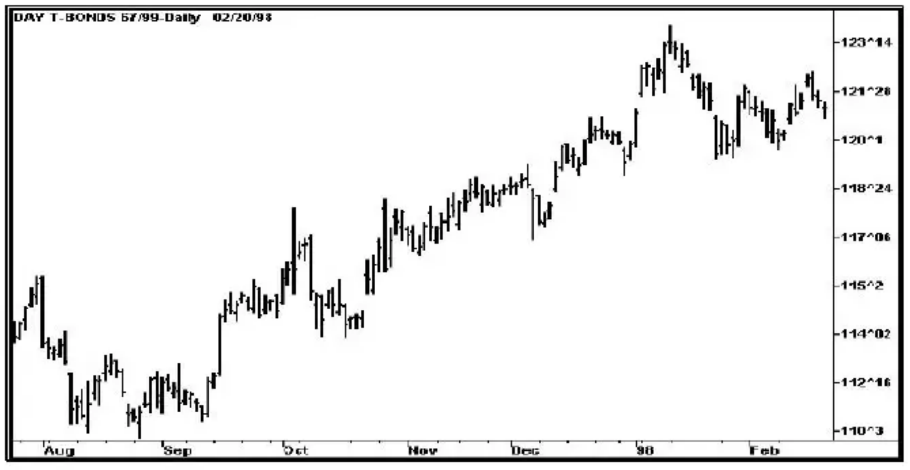

*Chart 1 – Do you see the cycles in this chart?*

**Chart 2** - Cycles are measured from bottom to bottom. Every time frame of every market has a dominant Trading Cycle averaging from 14 to 25 bars as measured in weeks, days, half days, hours, minutes or ticks. Most Trading Cycles in the stock and futures markets tend to cluster in the 18 to 22 bar range, averaging 20 bars from bottom to bottom. In Chart 2, T-Bonds exhibits a daily trading cycle of 21 days from bottom to bottom. The trading cycle tops and bottoms are indicated by the arrows.

*Chart 2 - The arrows indicate trading cycle bottoms and tops.*

## Detrending Takes the Mystery Out of Cycles

Historical cycles show great potential for low risk trades. But to make cycles tradable it is necessary to define the tops and bottoms so they can be identified and traded with mechanical buy and sell signals.

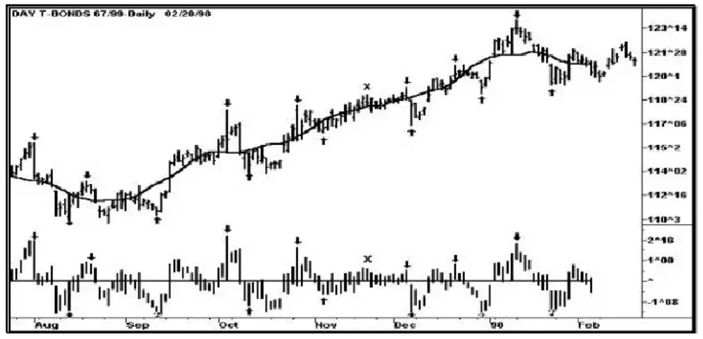

*Chart 3 – Centered Detrend - Trading Cycle tops and bottoms are easy to see in the centered detrend.*

For over 50 years the non-profit Foundation for the Study of Cycles has been using a simple procedure called centered detrending to identify cycle lengths in all natural phenomena, including economic activity. The advantage of centered detrending over Fourier analysis and Spectral analysis is that you can visibly observe the historical cycle bottoms and tops. This takes the "mystery" out of cycle trading and analysis. When you can look back over 20 years of price history and actually see the consistency and tradability of cycles, it is easy to have the confidence to trade them. After all, if you cannot see cycles in price activity how can you put your money on the line to buy a bottom or sell a top. We are not looking to trade the big bottoms and tops that occur as the trend reverses, but the bottoms and tops of the shorter-term cycles occurring in the direction of TREND.

The process to detrend a cycle is simple.

1. Calculate a moving average the same length as the potential Trading Cycle. For most markets use a 20-bar moving average of the close. But instead of plotting the moving average on the day of the last calculation, it is centered (or plotted) in the middle of the cycle. For example, the 20-day moving average is plotted back 10 days from the most recent close. This is called a centered moving average as it is plotted in the center of the cycle.
2. Subtract the moving average from the high and low of each price bar and plot the results around a zero line directly below each price bar. The zero line represents the centered 20-bar moving average.
3. The centered detrend at the bottom of Chart 3 mitigates the effects of trend and allows the highs and lows of the trading cycle to be easily seen.

This process can be easily programmed into many of the popular trading platforms. The two indicators for this detrending process can be downloaded from our website Download Page for TradeStation and SuperCharts users – WB_Cen-MA indicator, which calculates the moving average and centers it back one-half the length of the cycle as in Step 1. The actual centered detrend is plotted by the WB_CenDetrend indicator as in Step 2.

**Chart 4** - The chart below has been compressed to show more cycles. The highs and lows of the centered detrend correspond to the highs and lows of the trading cycle. Most cycle tops occur above the sell line at .80 and most cycle bottoms occur below the buy line at -.80. A rise above 2.0 indicates a top is imminent; a bottom is ready to occur if the detrend drops below –2.0.

If you are thinking that this is the indicator for which you have been searching… there is one problem. Because the centered detrend lags prices by one-half the length of the cycle, or 10 bars, the centered detrend is excellent for showing historical cycles, but cannot be used for real-time trading.

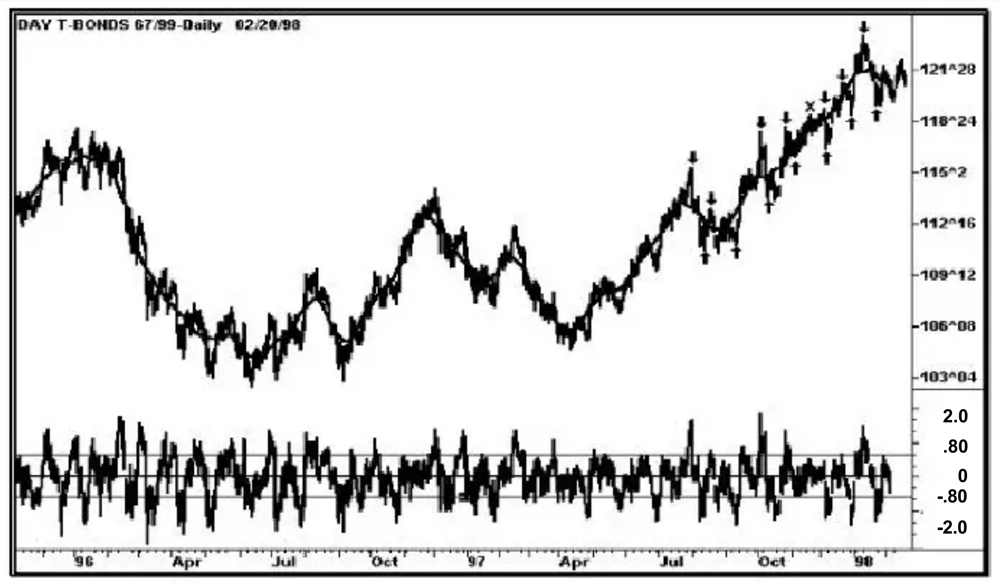

*Chart 4 – Compressed Chart with Centered Detrend – Cycle tops and bottoms occur at the highs and lows of the detrend which shows limits to how far prices can move above and below the centered moving average (which is the zero line in the bottom centered detrend).*

However, we now have something to look for -- A real-time oscillator that matches the centered detrend and the cycles.

## Oscillators Show Cycle Tops and Bottoms

**Chart 5** - The standard oscillators in TradeStation, SuperCharts or any charting package can be overlaid on the centered detrend (or on top of prices) in the search for an oscillator that tops and bottoms as the trading cycles top and bottom. Not surprisingly, the performance of these oscillators for identifying trading cycle tops and bottoms can be improved by a few simple techniques.

To use an oscillator to identify cycle tops and bottoms look for three characteristics:

1. The oscillator turns when prices turn
2. The oscillator does not "wiggle" much at cycle tops and bottoms
3. The oscillator has amplitude moves that take it to the extremes of an allowable range as the cycles bottom and top.

Overlaid on the centered detrend (CDT) is such an oscillator. It is a regular RSI 3 smoothed with a 3-bar moving average called the RSI3M3. It shows the bottoms and tops of the trading cycle almost as well as the centered detrend and can be used as a mechanical trading signal and cycle identifier… And the RSI3M3 is current to the most recent price bar, turning down in this chart to identify the most recent trading cycle top missed by the centered detrend.

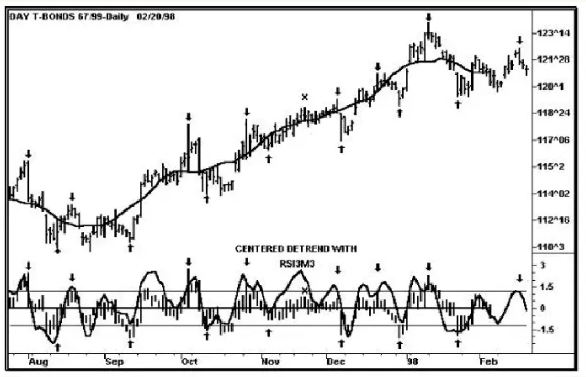

*Chart 5 – The RSI3M3 oscillator is current to the most recent price bar and shows cycle tops and bottoms as well as the centered detrend.*

---

# Oscillator/Price Patterns Generate Mechanical Trading Signals

**Chart 6** - There are four steps to construct a mechanical buy signal illustrated on the following chart with buy signals for an RSI3M3 oscillator:

1. The RSI3M3 drops below the buy line at 30. By dropping below the buy line the oscillator shows an oversold condition common at cycle bottoms.
2. The oscillator turns up to show the market momentum is reversing. The price bar that turned the oscillator up is colored or thickened to show that it is a setup bar.
3. A buy stop to go long is placed one tick above the high of the setup bar. By waiting for the high of the setup bar to be exceeded, instead of trading on the close, the accuracy of the buy signal is increased from 10% to 25%, depending upon market and time frame.
4. Once a market is entered a protective sell stop is placed one tick below the cycle bottom. Sell stops would be placed one tick below A and B. In A the setup bar was also the cycle bottom and entry occurred the following day. In B the setup bar occurs two days before the cycle bottom, but entry occurs the day following the cycle bottom.

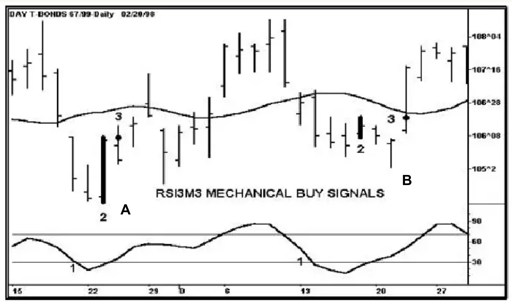

*Chart 6 – Mechanical Trading Signals … reduce judgement and put you in control because you always know the risk (entry price to protective stop).*

**Chart 7** - In this chart, the up arrows identify the seven trading cycle bottoms labeled 1 through 7 in the oscillator panel. The down arrows show the cycle tops. The setup bars are the thicker price bars, and the entry day and price are shown by the dots that follow them. There are eight buy signals, of which six (75%) could have made money. Four occurred at trading cycle (TC) bottoms; three followed the trading cycle bottoms and were followed by higher prices. Only one occurred before the trading cycle bottom.

But trading cycle bottoms 2, 4 and 6 were missed by this buy signal because the oscillator did not drop below the buy line. Simply raising the buy line would not have helped, as over the long term a higher buy line at 40 or 50 would have more losers than the lower buy line at 30.

But these bottoms can be identified and traded by detrending the RSI3M3.

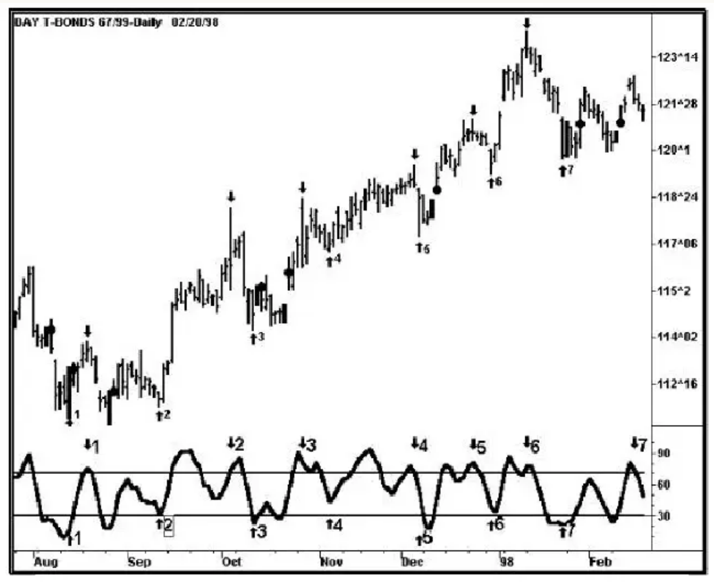

*Chart 7 – RSI3M3 Buy Signals – Four of seven trading cycle bottoms were identified with these buy signals. The dark setup bars are followed by entry at the big dots. Six of the eight signals could have made money.*

## Detrended Oscillator Generates Trading Signals in Strong Trending Markets

**Chart 8** - In this chart the RSI3M3 is in the middle of the chart and a crossover has been added. A crossover is simply a moving average of the oscillator. This crossover is a 5-bar moving average of the RSI3M3. To detrend the oscillator the crossover is subtracted from the RSI3M3 oscillator to produce the detrended oscillator at the bottom of the chart.

In a strong trending market this detrended oscillator will identify most trading cycle bottoms with the same type of mechanical buy signals as the RSI3M3. Since the most accurate buy signals occur in the direction of the trend, this detrend plays a very important role in successful trading. Since it is more sensitive than the RSI, it often gives buy/sell signals for the ½ trading cycle. (More on this later.)

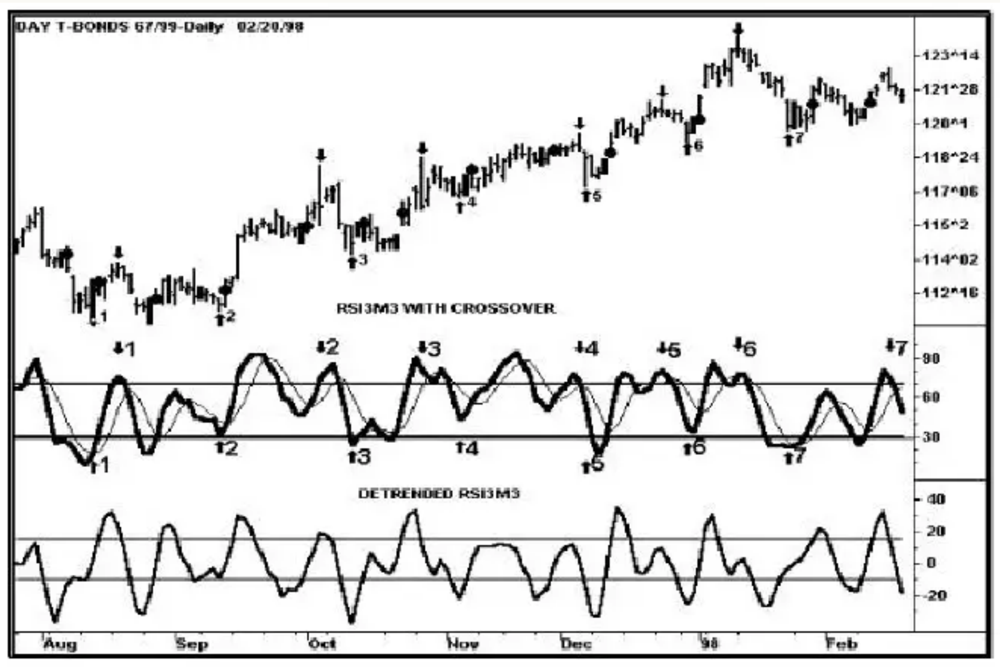

*Chart 8 – The RSI3M3 Detrend generated 12 buy signals with nine that could have made money.*

The RSI3M3 Detrend generated 12 buy signals (solid setup bar with entry dot), with nine (75%) that could have made money. Six of the seven trading cycle bottoms were identified by this buy signal… Most importantly, it identified and generated buy signals for trading cycle bottoms in a strong uptrending market that were missed by the RSI3M3. Six of the buy signals occurred at bottoms of the ½ trading cycle.

Between the buy signals of the RSI3M3 and the RSI3M3 Detrend all seven trading cycle bottoms were identified and followed by a buy signal. Six of the seven ½ trading cycle bottoms were also identified with buy signals.

---

# The Interplay of Cycles Within Cycles

The key to trading with cycles is an understanding of the interplay of cycles within cycles. Almost all trading cycles have a ½ trading cycle (see following illustration). A 20-day (bar) trading cycle has within it two 10-day (bar) cycles. One 10-day cycle begins as the 20-day cycle begins and bottoms halfway into the 20-day cycle. As the first 10-day cycle ends the second 10-day cycle begins, and it ends as the 20-day cycle bottoms. Therefore, a 20-day trading cycle always begins and ends with a 10-day cycle.

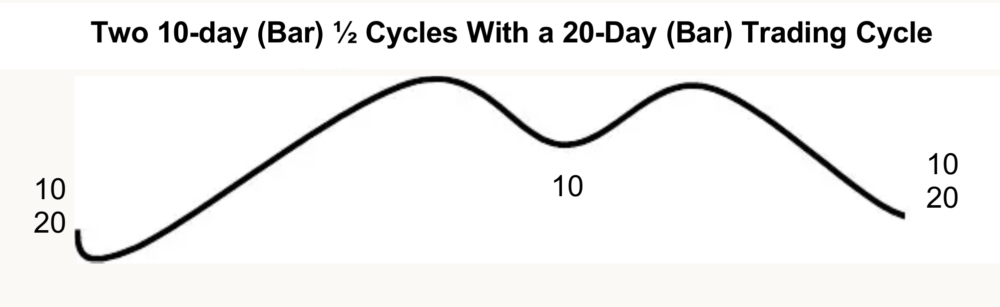

*Two 10-day (Bar) ½ Cycles Within a 20-Day (Bar) Trading Cycle*

Awareness of the ½ cycles makes it easier to accurately identify and trade the 20-day trading cycle. Once you identify the low of the first 10-day cycle you know the next 10-day cycle bottom will most likely be the bottom of the 20-day as well. Important to know, because the accuracy of identifying 10-day cycles with the RSI3M3 mechanical buy signal averages 85% in daily charts, and is often as high in intra-day charts. In most markets the accuracy of identifying the 20-bar trading cycle is only 60% to 70%. Knowledge of the ½ cycles can greatly increase your accuracy in buying bottoms and selling tops of the trading cycle.

## Right Translation in Bull Markets

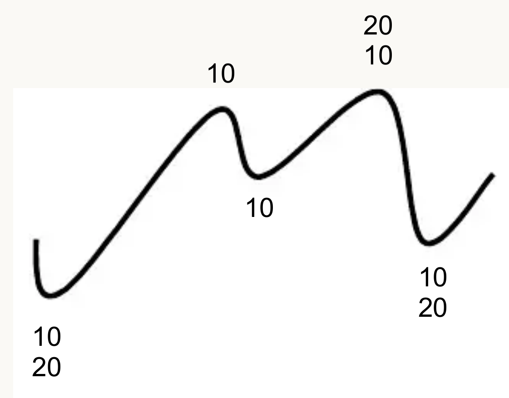

*Right Translation Bull Market diagram*

In bull markets showing right translation, the top of the 20-day cycle is most often the top of the second 10-day cycle. Right translation shows in the time periods for bottoms and tops of the trading cycle. On average the move from bottom to top will be three weeks, and the move from top to bottom, one week. Knowing this makes it easier to hold a long position through the decline into the bottom of the first 10-day cycle, or even add on to the long position, expecting to take profits as the second 10-day cycle tops, often with a mechanical sell signal.

## Left Translation in Bear Markets

In a bear market with left translation the top of the 20-day cycle is most often made as the first 10-day cycle tops. Left translation shows in the time periods for bottoms and tops of the trading cycle. On average the move from bottom to top will be one week, and the move from top to bottom, three weeks. Knowing this can give you the confidence to hold a short position through the rise into the high of the second 10-day cycle, or add on to the short position expecting to take profits as the 20-day and 10-day cycles bottom with a mechanical buy signal.

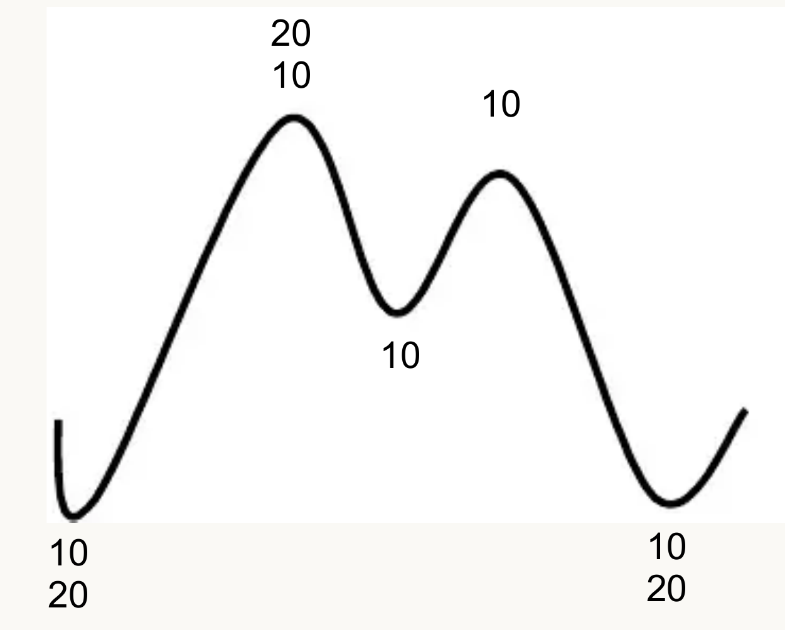

*Left Translation Bear Market diagram*

At times the 10-day cycle will show up very distinctly. At other times it may seem to disappear, or it can be a combination of a short cycle and a long cycle. For example, the first ½ trading cycle may contract to seven days and the second may stretch to 13 days. Or the first ½ trading cycle may stretch while the second contracts. The 20-day cycle also contracts and expands, and as the dominant cycle its activity will affect lengths of the two ½-trading cycles.

If the 20-day cycle contracts to 15 days, the 10-day cycle may seem to disappear, or there may be two smaller cycles close to the same length such as seven and eight days. There can also be an extreme of a short and a long, such as a four and 11. If it stretches to 28 days, the ½ trading cycles are likely to be longer as well.

With cycles stretching, contracting and disappearing they can be hard to identify at times, and the lows and highs of the sensitive RSI3M3 detrend oscillator is a big help in identifying and trading the 10-day (bar) cycles and also the 20-day (bar) cycles.

---

# Timing Bands

The chart below shows cycle timing bands that forecast time periods for cycle tops and bottoms with 70% accuracy. Knowing that a cycle is most likely to top or bottom in a timing band allows you to wait for a buy or sell signal to occur when prices are in a timing band. You can use the timing bands to forecast tops and bottoms and to enter and exit market positions.

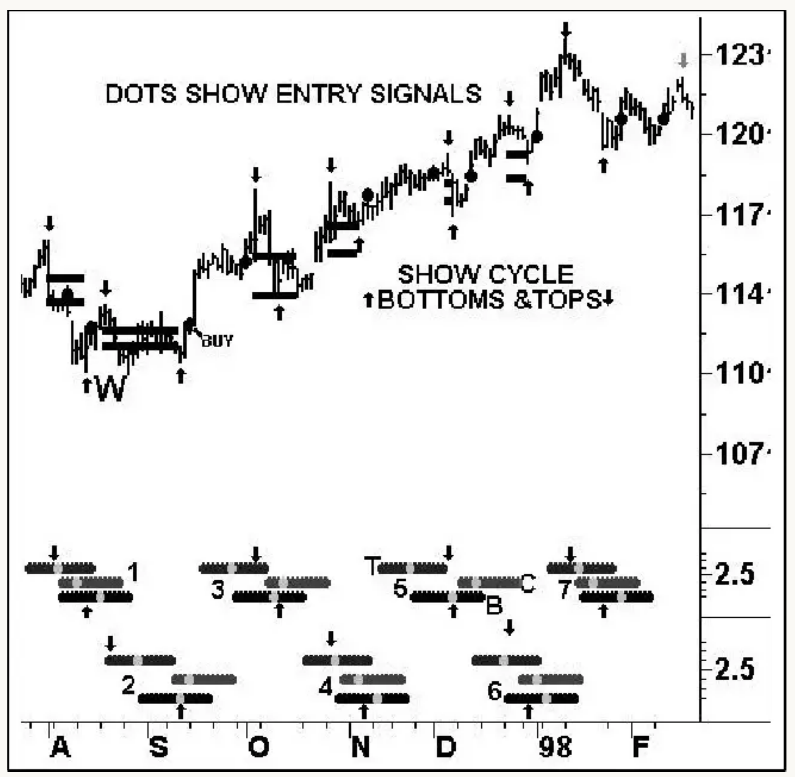

*Chart 9 – At least 70% of all cycle tops and bottoms occur within a top timing band, or a bottoming timing band. In this chart six of seven cycle tops occurred within the top timing band; six of seven cycle bottomed in the overlap of both bottoming timing bands; the seventh occurred in only one bottoming timing band. Cycle bottoms within timing bands followed by mechanical entry signals are frequently followed by sizeable moves.*

The arrows on the timing bands match the cycle arrows on the price bars. The down arrows show trading cycle tops, and the up arrows show trading cycle bottoms. In set #5 the topping band is labeled T, the bottoming bands are B and C. The same formation is followed for every cycle. Six of the seven cycles topped in the topping band for the cycle; and six of the seven cycles bottomed in the overlap of both bottoming bands.

The dots are the entry signals to go long. When a price low in the bottoming bands is followed by an entry signal, the trading cycle low is confirmed. In an uptrend the buy signal is usually followed by a cycle top in the top timing band two to three weeks after entry. Often this top is confirmed by a sell signal.

Timing bands work in all markets, all time frames, and are an integral part of all Cycle Trading Patterns and market forecasts.

---

# The Holy Grail: Trade With The Trend

But the key to trading any market in any time frame is TREND. If the trend is up, buy the dips (cycle bottoms); if the trend is down, sell the rallies (cycle tops). Easy to say, but how do you know what the trend is? How do you know when the trend has changed?

The trend is determined by the trading cycle in the next longer dominant time frame than the one you are trading. If you are trading a daily chart the trend is established by the direction of the 14 to 25-week cycle in the weekly chart. This cycle is called the primary cycle to differentiate it from the trading cycle being traded. It is thus named to remind you to trade with the trend. If you are trading a 5-minute trading cycle the trend is set by the primary cycle in the 20-minute chart.

## The Direction for the Primary Cycle Sets Trend for the Trading Cycle

**Chart 10** - The TBond market has a 21-week primary cycle. The 'W' shows the weekly cycle tops and bottoms in the chart below. The arrows identify the seven daily trading cycle tops and bottoms on both charts. When the weekly cycle is up the trend of the daily cycle is clearly up. And as the weekly cycle is rising, each daily trading cycle tends to have a higher cycle top and a higher cycle bottom than the previous trading cycle.

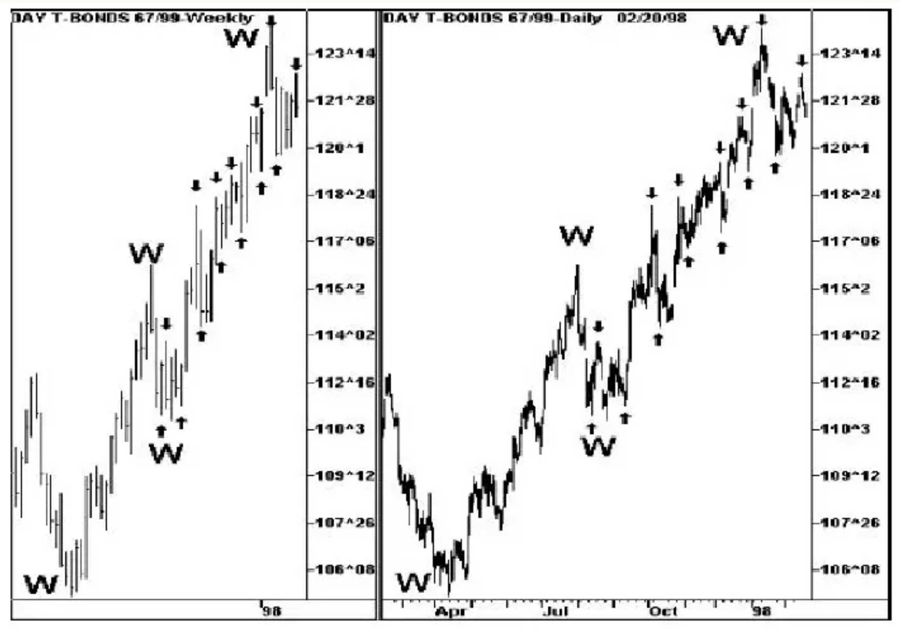

*Chart 10 - When the weekly cycle is up, as evidenced by the arrows showing the higher tops and bottoms of the primary cycle, the trend is clearly up for the daily cycle.*

However, in this strong market, there is no downtrend into the weekly cycle bottoms, just a sharp retracement into each weekly cycle bottom. A drop below the most recent trading cycle bottom in the daily chart could signal a trend reversal as the 21-week cycle bottoms in the weekly chart.

## Fibonacci Retracements

**Trading Cycles Often Bottom With a 38 – 62% Retracement**

The Fibonacci retracements of 38% – 62% are particularly significant as a support range when prices drop into trading cycle bottoms in uptrending markets (and as prices rise to cycle tops in downtrending markets). In a trending market waiting for prices to retrace into this range before taking a buy signal is often like stretching a rubber band. The further it is stretched, the more powerful the snap back.

**Chart 11** - The following chart shows that as the weekly cycles were rising from bottom to top, five of the six trading cycle bottoms retraced at least 38%. Only one retraced more than 62%.

This retracement range is significant in trending markets, in all markets and time frames, and can be used as a component of a Cycle Trading Pattern. But there is more to it.

After the two W tops, the trading cycle retracements were significantly greater than 62%. This is a common pattern. Following several 38% – 62% retracements in an uptrending market, a close below a 62% retracement will frequently signify a trend reversal. Therefore, you can use this retracement range to:

- Buy trading cycle bottoms in an uptrend within this range, and
- After an extended up move consider a close below a 62% as a strong warning that a trend reversal is occurring.

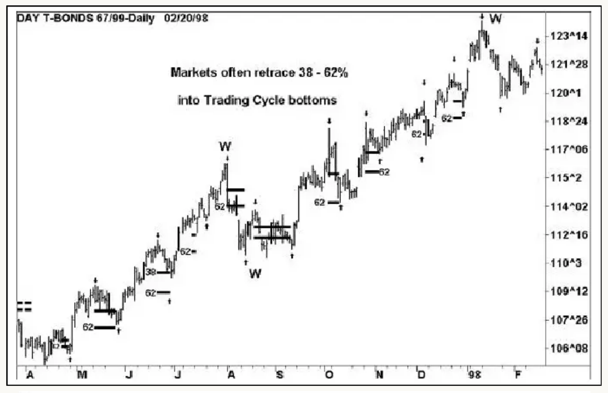

*Chart 11 - In an uptrend, markets most often retrace to at least 38% and not often more than 62%. At trend reversal tops and in the trading ranges that often occur at weekly cycle bottoms, retracements are most often much greater than 62%.*

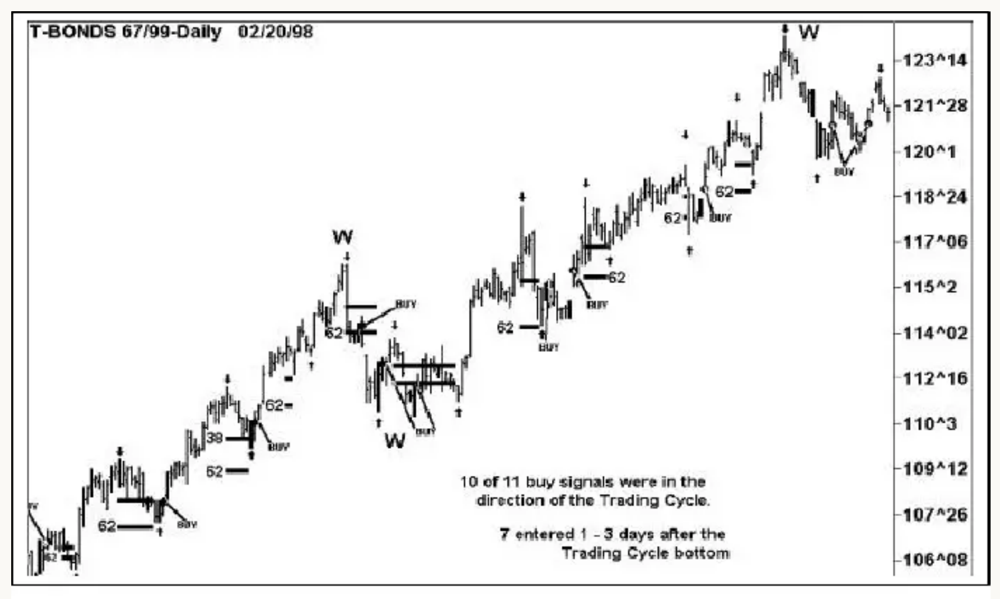

*Chart 11a - Buy signals combined with 38 – 62% retracements in trending markets.*

### Cycle Trading Pattern

A simple Cycle Trading Pattern illustrated in Chart 11a is:

1. A 38-62% Retracement followed by
2. A mechanical RSI3M3 setup and entry signal.

## Most Successful Trades Occur in the Direction of the Trend

The advantage of trading with the trend is that it is the direction traded by large scale traders and the momentum caused by new money entering the market is likely to continue moving prices in the direction of the trend until there is a good reason for it to turn around. The reason could be a fundamental event or simply profit taking. Below are several ways to determine trend direction.

## Trend Reversals

**Chart 12** - Since the trend is the direction of the next longer dominant cycle than the one you are trading, the beginning of an uptrend is often confirmed by a buy signal in the next longer time frame. In the weekly chart at the two lows indicated by W, the direction of trend for the daily chart was confirmed when prices exceeded the high of the weeks with the mechanical signal dots.

Another indicator of an uptrend is that the trading cycle highs and lows in the daily chart are above the previous trading cycle tops and bottoms. Following an uptrend, a drop below a previous trading cycle bottom will most often indicate the end of a trend and is likely to be followed by a period of consolidation or a downtrend.

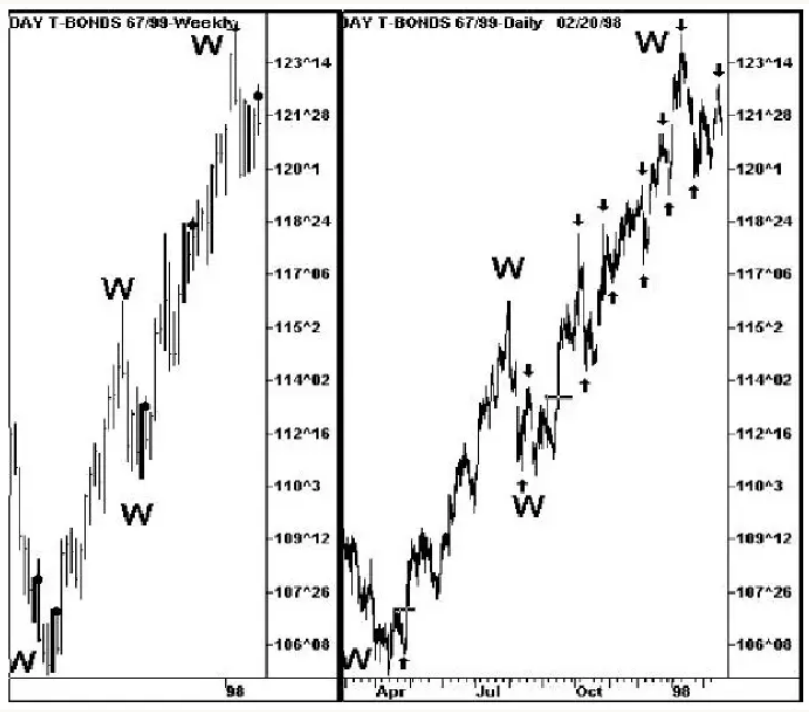

*Chart 12 - The weekly chart sets the trend for the daily chart.*

## Trend Indicators

### EMA Trend Indicator

**Chart 13** - Moving averages turn slowly, but can be reliable trend indicators that accurately show trend. These indicators will reverse direction slowly, but using them in a pattern with mechanical entry signals and 38% – 62% retracements can give high probability cycle trading pattern signals.

The weekly chart that follows shows two exponential moving averages (EMA). When the faster (thicker) moving average is moving up and above the slower (thinner) moving average the trend is up, and when it is below the slower moving average and moving down, the trend is down.

*Chart 13 (is missing in original document) – You can see on this weekly chart how following these exponential moving averages will keep you trading in the direction of trend and can also keep you in a long-term position for the big moves.*

**Chart 14** – The weekly moving averages plotted on a daily chart show trend. Six of the eight buy signals in the downtrend were losers, illustrating why you do not want to take buy signals in a downtrending market.

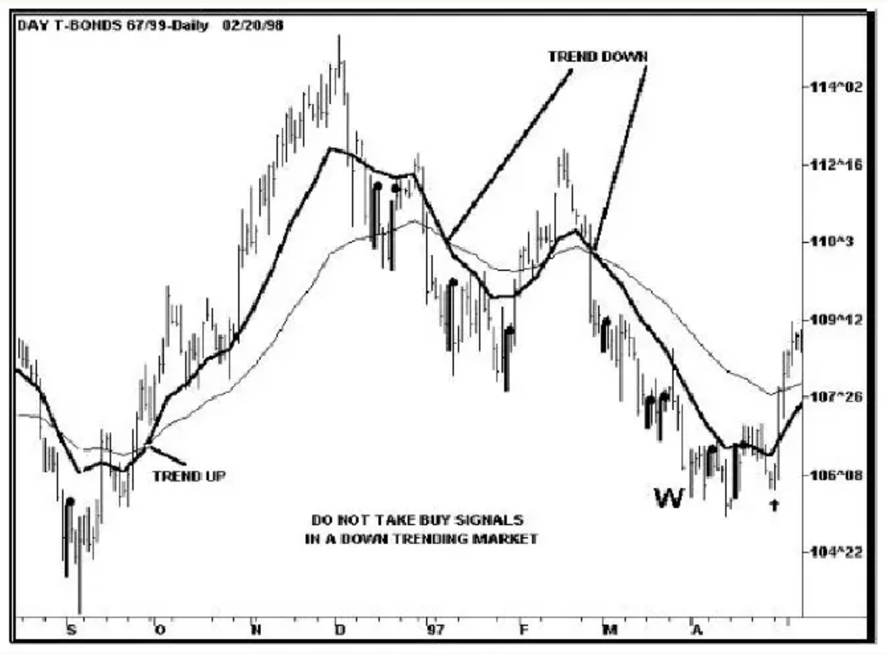

*Chart 14 – The weekly moving averages plotted on a daily chart show trend. Six of the eight buy signals in the downtrend were losers, illustrating why you do not want to take buy signals in downtrending markets.*

### EMA% Trend

**Chart 15** - An oscillator can be created by calculating the percentage difference between the thicker line and the thinner line. Plotted below prices it is also a trend indicator, showing a slowdown of the uptrend and indicating a trend reversal by the turn downs at A and B. Trend reversals can be followed by a downtrend as at A, or consolidation as at B as the weekly cycle drops into a bottom before continuing higher. While cycle bottoms in consolidation can be bought, the safer trades occur when the EMA% Trend is moving up.

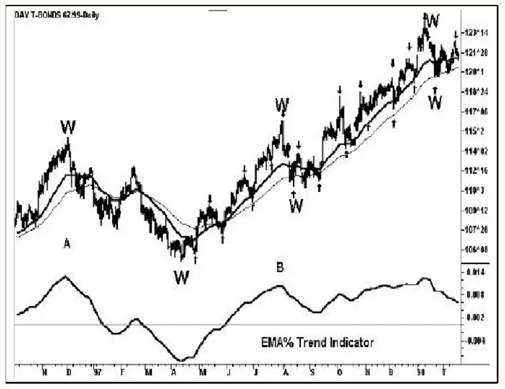

*Chart 15 - Following a strong uptrend a downturn in the EMA% Trend can be an early warning of a trend reversal, as at A and B.*

### MACD Trend Indicator

**Chart 16** - Another popular indicator that shows the trend well is the MACD. Plotted at the bottom of the chart below, the points where the thick line crosses the thin line show the potential for a trending move to continue. When both the MACD and the EMA trend indicators are moving in the same direction, the odds strongly favor a trending move.

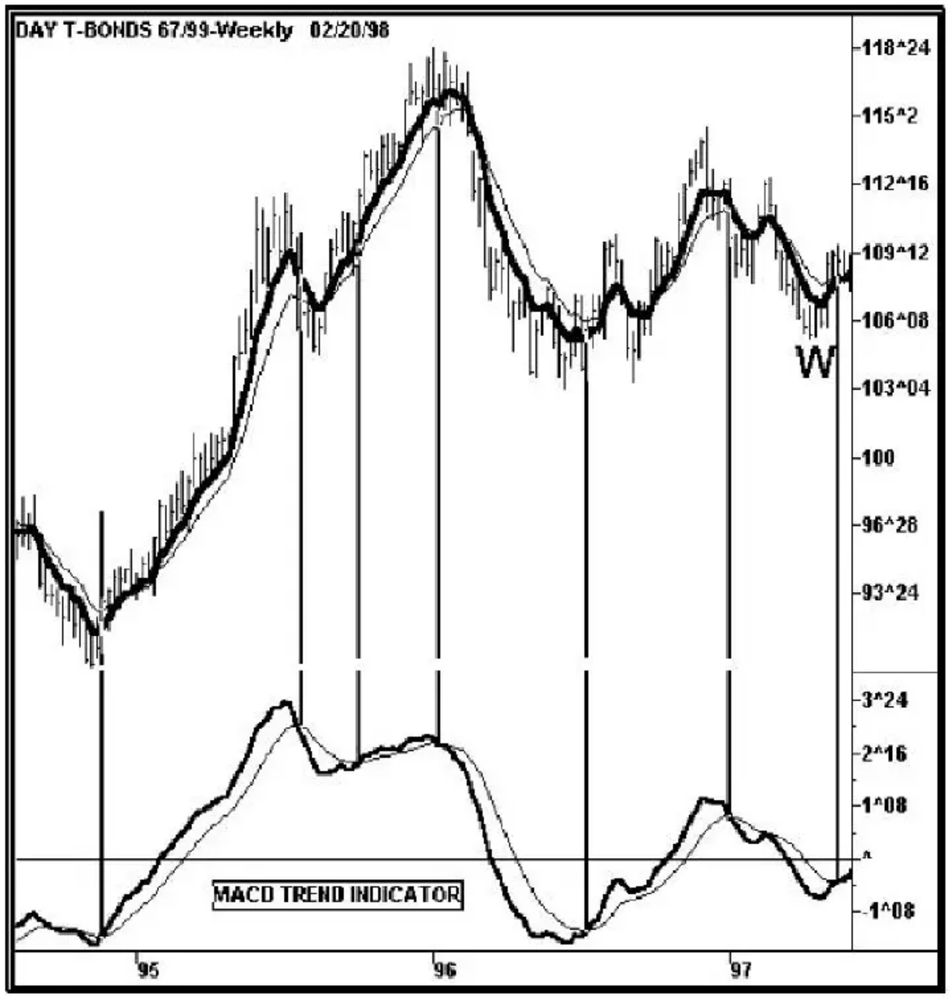

*Chart 16 - When both the MACD and the EMA averages are moving in the same direction the odds strongly favor a trending move.*

**Chart 17** - Plotting these weekly trend indicators on a daily chart gives a clear picture of the direction to trade. The chart below shows weekly trend indicators overlaid on a daily chart, with trading cycle tops and bottoms indicated by the arrows.

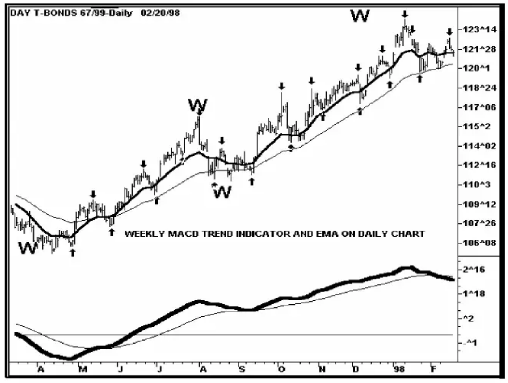

*Chart 17 - Trading Cycle bottoms that drop below the thicker EMA line offer low risk trades that are often followed by sizable up moves.*

### Keltner Channel

The Keltner Channel can be used on charts of any time frame, and is very useful as a component of a Cycle Trading Pattern when calculated in the time frame used to determine trend.

**Chart 18** - In the daily TBond chart below, the trading cycle tops and bottoms are indicated by the arrows; the weekly cycle tops and bottoms by the "W"s. A 5-week moving average is plotted on the daily chart and the Keltner Channel is plotted 1.1 standard deviations above and below this moving average. Both the moving average and the standard deviation can be modified.

When buying bottoms in the direction of trend the biggest moves often have a "rubberband" effect following an overextension to the downside. After meeting resistance at the upper channel line, a drop below the moving average would be an overextension if prices remain above the lower channel line basis the close. In our chart example, a drop below the moving average followed by an RSI3M3 mechanical buy signal above the lower channel line occurred at six trading cycle bottoms. All were followed by sizable upmoves. Notice that the price lows and trading cycle bottoms occurring above the moving average line had much smaller upmoves in price and often in time.

At times, an uptrend can be inferred by prices meeting resistance at the upper channel line, then dropping into a trading cycle bottom below the moving average, but above the lower channel line.

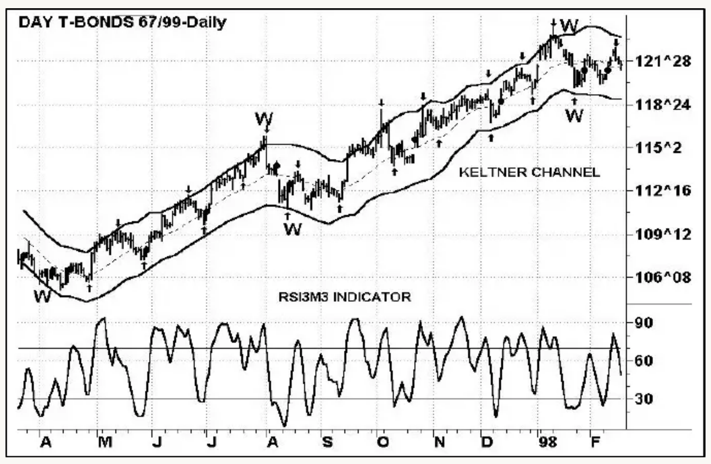

*Chart 18 - Following resistance at the upper channel a drop below the moving average as a trading cycle bottom is often followed by a sizable upmove.*

#### Cycle Trading Pattern

The combination of:

1. Trend up
2. A test of the upper band of the Keltner Channel
3. A decline below the channel midline, with prices remaining above the lower Keltner Channel
4. RSI3M3 buy signal to enter the market.

### Trendlines

Trends always end, and some of the same approaches used to determine trend can be used to confirm a trend reversal. Trendlines are also very powerful confirmers of trend reversals.

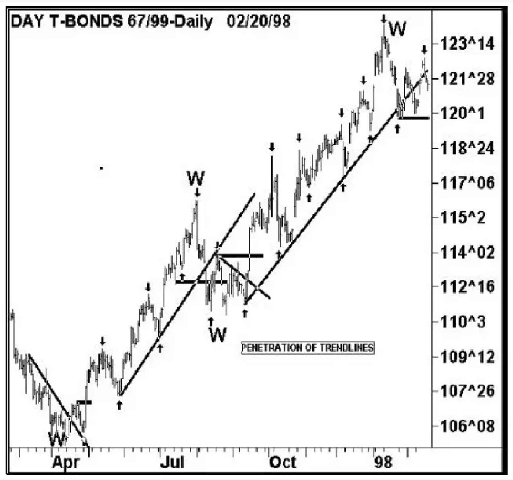

**Chart 19** - The Chart below shows trendlines on a daily chart. The two uptrend lines are drawn across Trading Cycle bottoms and their penetration confirms the top of the larger weekly cycles. Upside penetration of the downtrend lines confirms the bottom of the weekly cycle. The weekly cycle averages 21 weeks and once the downtrend lines are penetrated a sizable up move can be expected.

*Chart 19 - Trendlines drawn across trading cycle tops and bottoms often confirm bottoms and tops of the weekly cycles.*

Downside penetration of the uptrend lines is different because the cycles have moved up for close to 20 weeks (in bullish right translation), and a relatively short decline into the weekly cycle bottom would be expected.

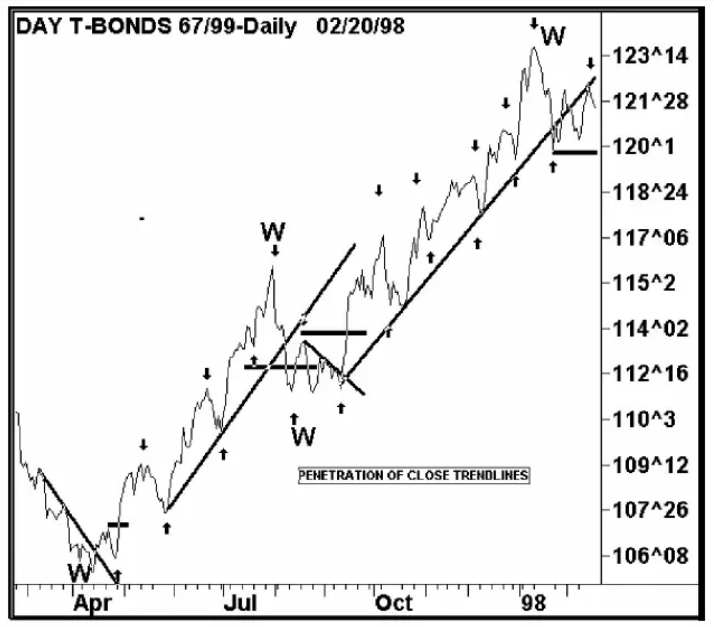

**Chart 20** – Close only chart with trendlines and cycles is very similar to a regular bar chart.

Most people use trendlines on regular bar charts, but a close below a close chart trendline is much more significant than simple price penetration of a bar chart trendline.

**Chart 21** - shows a typical combination of oscillators, trend indicators, retracements and mechanical entry signals. These combinations make patterns that are triggered by the mechanical buy signals.

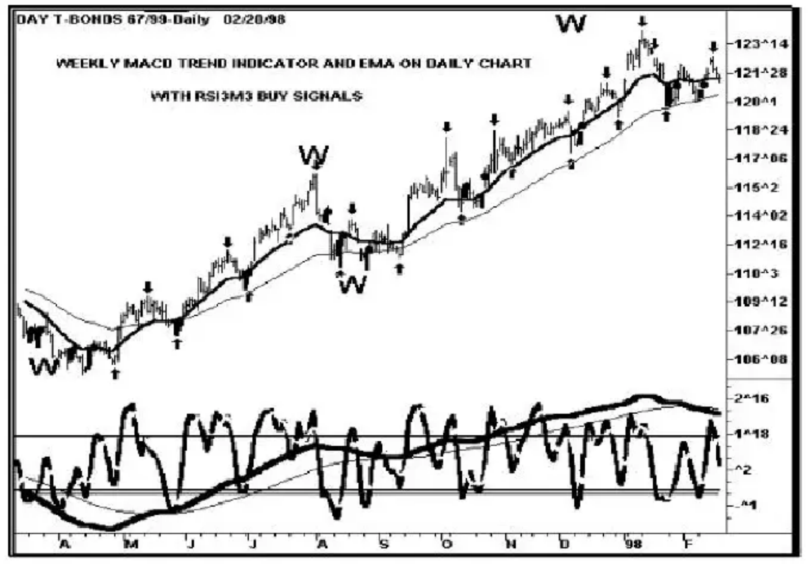

*Chart 21 – This is a Cycle Trading Pattern you can use in most markets and time frames. Watch for the cycle bottoms to occur in the timing bands shown in Chart 9, page 11 (not shown here to avoid "chart clutter").*

### Cycle Trading Pattern

A Cycle Trading Pattern of:

1. A drop below the thicker EMA line,
2. As the EMA line is moving up, and
3. As the thicker MACD line is above the thinner line and moving up as
4. A 20-day trading cycle is due to bottom.
5. The entry signal is the mechanical setup and buy signal. The thick bar is the setup bar; the dot, the entry price.

---

Stand-alone buy and sell signals do not consider the whole picture. By combining trading signals with daily and weekly cycles, retracements, trend indicators, channels, trendlines and other technical tools into Cycle Trading Patterns you can greatly reduce your dollar risk and improve your trading results.

These Cycle Trading Patterns have used only the RSI3M3 oscillator and detrend. Similar patterns can be traded with the 3-10 indicator, CCI indicator, long-term RSI, stochastic, MACD detrend, or any other oscillators that track prices.

---

*Walter Bressert, Inc.*
*http://www.walterbressert.com*
*All contents ©Copyright 1997 Walter Bressert, Inc.*
