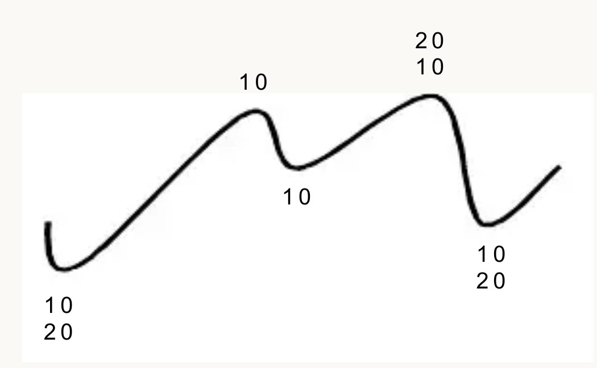
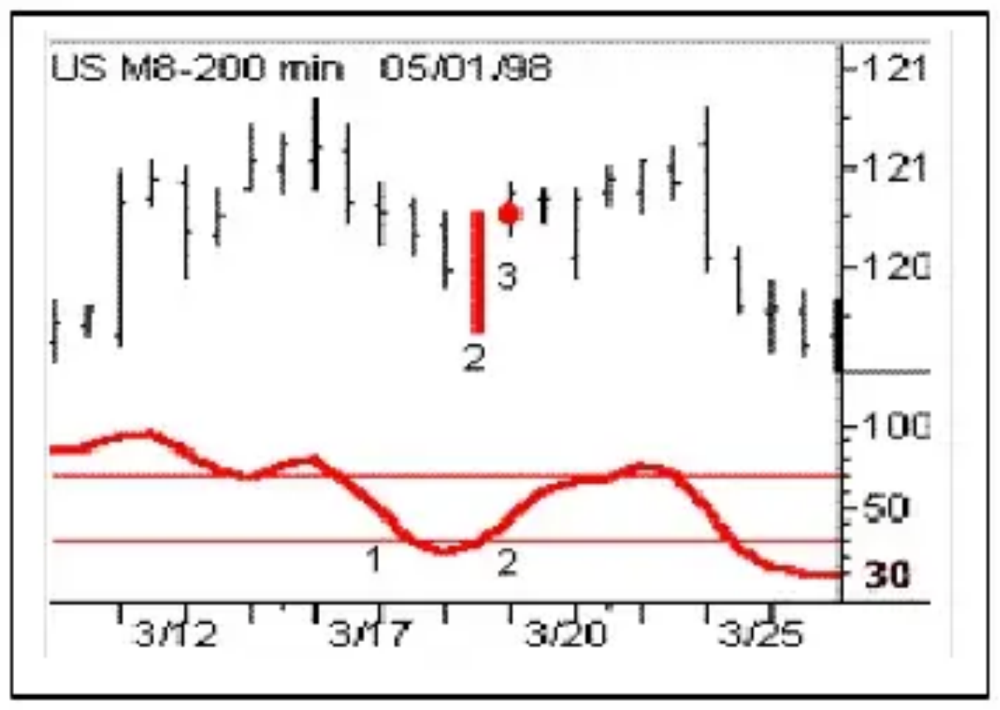
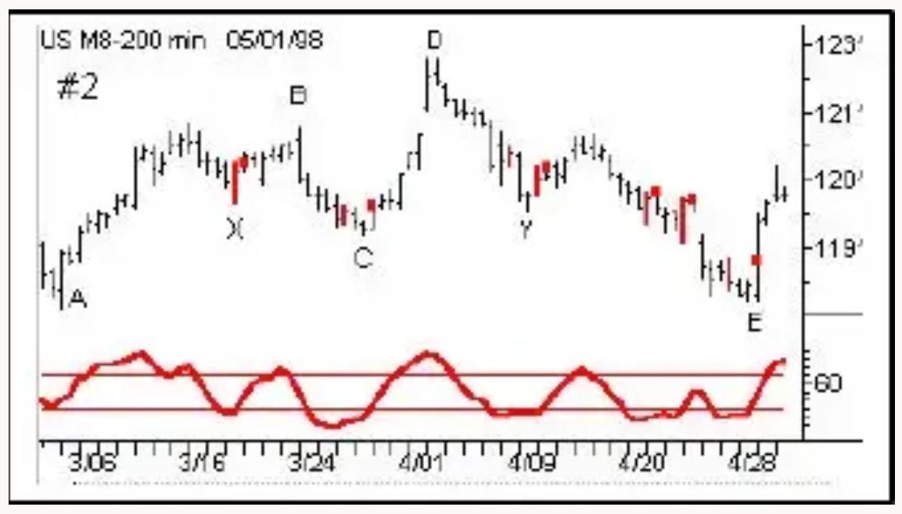
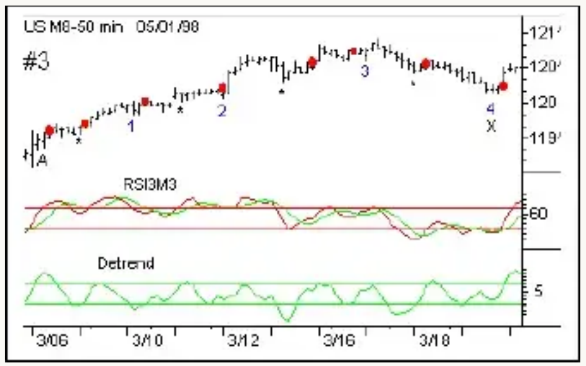
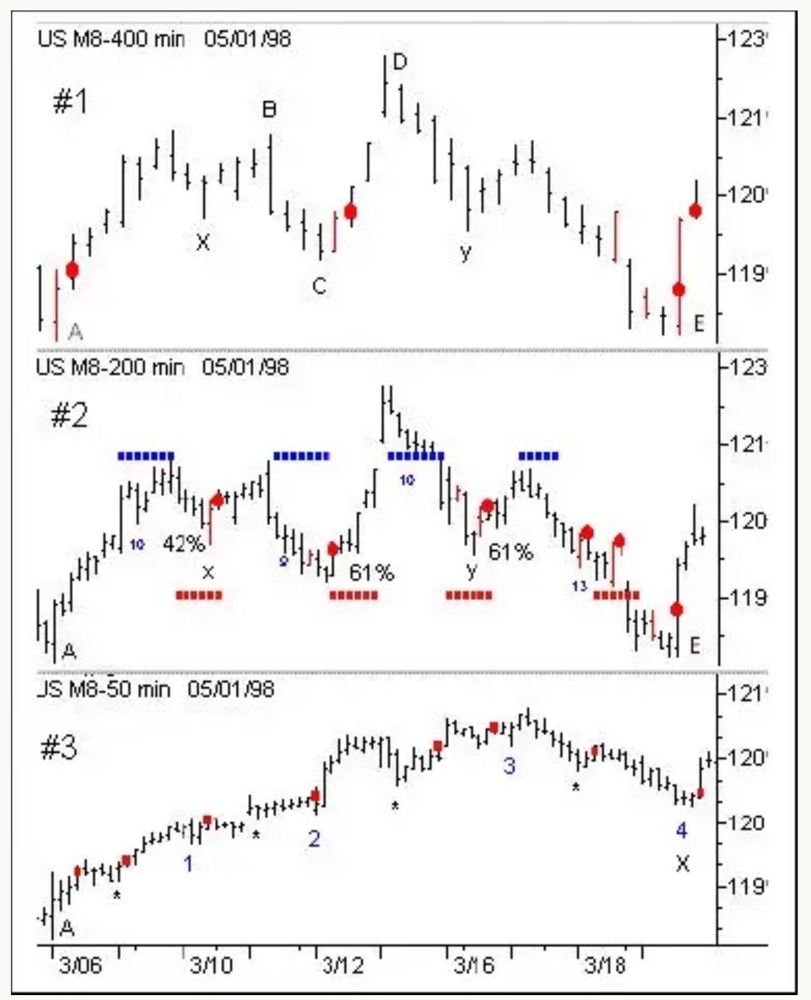
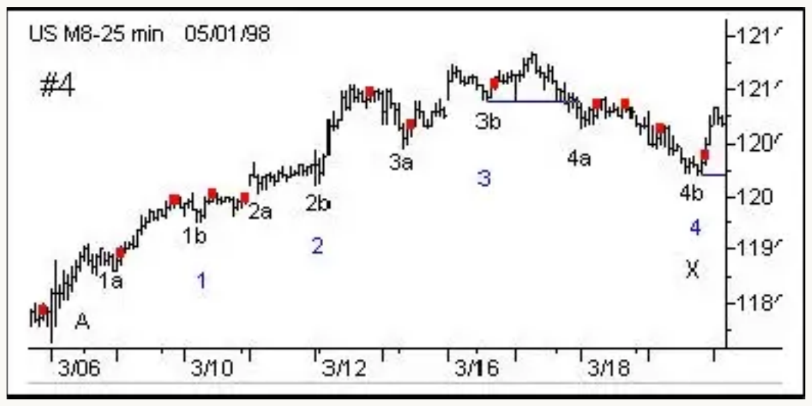
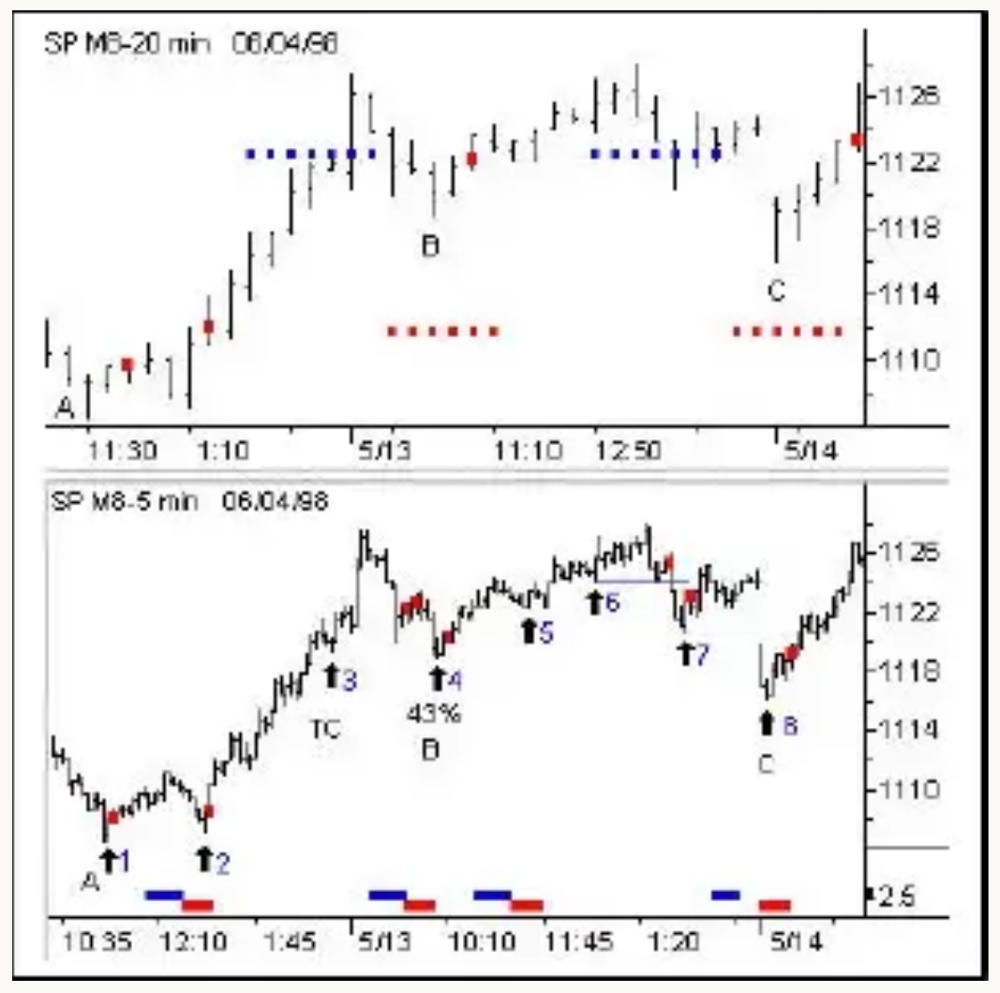

# Trading With Time Fractals to Reduce Risk and Improve Profit Potential

*A Special Report by Walter Bressert*
*June 16, 1998*

Time and price cycles in the futures markets and stocks "exhibit patterns in time and space that are orderly and self-similar in scale",(1) or fractal. To get a rough mental picture of fractals, draw a triangle with three equal sides. Divide each side into three equal parts and build another triangle on the outside of the middle one third of each side. The result is the Star of David. Now repeat this process on each of the new triangles, and then each of the newer triangles, and each of the newer triangles, and on and on and on. The resulting form is composed of smaller and smaller triangles of the exact same design and proportion as the original triangle. This is called a Koch Snowflake.

> **THE KOCH SNOWFLAKE.** "A rough but vigorous model of a coastline," in Mandelbrot's words. To construct a Koch curve, begin with a triangle with sides of length 1. At the middle of each side, add a new triangle one-third the size; and so on. The length of the boundary is 3 × 4/3 × 4/3 × 4/3 ... — infinity. Yet the area remains less than the area of a circle drawn around the original triangle. Thus an infinitely long line surrounds a finite area.
>
> — James Gleick, *Chaos* (2)

I first read James Gleick's book "Chaos" more than 10 years ago. As a futures trader looking for an edge to trade and forecast the markets, I was fascinated by the similarities in my research on cycles and technical analysis in the futures markets with chaos and fractals. In the Koch snowflake each smaller triangle has the same proportion as the larger triangle. Time cycles in the markets are linear and each proportionate time frame has a dominant trading cycle of approximately the same length. Could proportionally smaller time frames, which I call "time fractals", reveal meaningful market patterns in the way that fractals reveal the similarity of seemingly random objects of nature? At the time I was basing my analysis and trading mainly on cycles in daily and weekly charts. "Chaos" gave me a new perspective. In 1994 my research expanded to include multiple intra-day time frames in the futures markets.

## The Benefits of Trading with Time Fractals

Knowledge of the fractal nature of trading cycles can help improve your trading in at least four ways.

1. **Improving forecasts** of cycle tops and bottoms for daily and intra-day cycles.
2. **Developing mechanical buy and sell signals** to identify and trade the cycle tops and bottoms as they occur (based on a good oscillator). The RSI3M3 described below is a very good oscillator for this purpose, and it can be easily built on most popular analytical packages.
3. **Lowering your dollar risk per trade** — Smaller time frames have smaller price ranges from the entry price to the protective stop.
4. **Increasing the opportunities** to enter trending markets if you buy bottoms in an uptrend and sell tops in a downtrend — One 20-day cycle has two bottoms and one top to generate trading signals. Over the same time period a 50-minute bar chart has 9 cycle bottoms and 8 tops. And a 25-minute bar chart has twice that many.

## Time Fractals and Trading Cycles

A trading cycle is the cycle within each time frame of a market (from weekly down to one-minute) that has enough amplitude to buy and sell. All time frames have a trading cycle averaging from 14 to 25 bars. Cycles are measured from bottom to bottom. And most trading cycles in daily and intra-day time frames cluster in the 18 to 22-bar range.

The trading cycle, however, is not the only cycle affecting prices. The fractal nature of market cycles is such that every trading cycle is composed of two smaller half-cycles. This half-cycle is a trading cycle composed of price bars one-half the original time period. For example, a 20-bar cycle in a daily TBond chart composed of price bars of 400 minutes has within it two 10-day cycles. Each 10-day cycle in the 400-minute chart becomes a 20-bar trading cycle in a 200-minute bar chart. Each of these trading cycles has a half-cycle of 10-bars that becomes a 20-bar trading cycle in a 100-minute bar chart, and on and on as the cycles are divided by two.

> Every 20-bar trading cycle has within it two 10-bar half-cycles. The first 10-bar cycle begins a 20-bar cycle, and the second 10-bar cycle ends a 20-bar cycle.

## Oscillator/Cycle Combinations that Identify Trading Cycle Tops and Bottoms

Trading cycles show distinct tops and bottoms that are frequently accompanied by overbought and oversold levels of an oscillator that is derived from price activity. One of my favorite oscillators is the relative strength index (RSI). This oscillator shows the ebb and flow of market energy, or the buying and selling power as it tops and bottoms. Although not based on time, it quite frequently identifies cycle tops and bottoms with accuracy of 80-90% depending on the market and time frame. With this kind of accuracy the oscillator can be used to identify high probability trading situations at tops and bottoms of cycles. Even better, the oscillator can be used to generate mechanical buy and sell signals that take much of the judgment and stress out of trading.

### The RSI3M3 Oscillator

The RSI3M3 is a 3-bar RSI smoothed with a 3-bar moving average. The RSI3M3 mechanical buy signal is constructed in a 3-step process:

1. The oscillator drops below the buy line at 30.
2. The oscillator turns up, and the price bar that turned the oscillator up is colored red and called a setup bar.
3. A mechanical buy signal is generated when the high of the setup bar is exceeded. By waiting for the high of the setup bar to be exceeded, rather than buying on the close of the setup bar, the accuracy of the buy signal is increased from 5 to 15%, depending upon the market and time frame.

**Chart 1** — Illustrates the RSI3M3 buy signal construction.

**Chart 2** — In this 200-minute chart a red setup bar and entry signal, indicated by the red dot, follow the trading cycle bottoms at X, C, Y and E. These setup bars and entry signals are based on the RSI3M3 oscillator at the bottom of the chart. The entry signal can be used to buy the market or simply to confirm a trading cycle bottom. In the decline into Trading Cycle E two false signals occurred, which illustrates the importance of trading with the trend, or direction of the next longer dominant cycle.

### The 3M3 Detrend

**Chart 3** — In strong up trending markets the oscillator often does not drop below the buy line to generate a buy signal. The trading cycles at 1 and 2, and the one-half cycles are not identified by the RSI3M3 oscillator because it does not drop below the buy line. The RSI3M3 oscillator can be made more sensitive by plotting a 5-bar moving average (the green line) of the RSI3M3 and subtracting it from the oscillator. This is called detrending. The result is the green detrended RSI3M3 plotted below it. A buy signal for this more sensitive oscillator is constructed using the same pattern of a drop below the buy line, upturn and setup bar. The combination of the RSI3M3 and the 3M3detrend generated buy signals (at the red dots) following three of the four trading cycle bottoms, and several of the half-cycle bottoms.

### Lower Dollar Risk

An advantage of trading a 50-minute chart instead of a 200-minute chart is a greatly reduced dollar risk per trade, and more buying opportunities as the market trends up. Buy signals at the 10 and 20-bar cycle bottoms of the 50-minute chart have 80%+ accuracy in identifying cycle bottoms. The safest trades are buying the bottoms as the market trends up; the riskiest trades are at the trend reversals while the trading cycles in the longer time frames bottom.

### Adding on Timing Bands

Identifying historical cycle tops and bottoms allows the measurement of cycles. That allows forecasts of probable time periods during which future trading cycles will top and bottom. The blue bands on Chart #2, below, are calculated from a cycle low to forecast the approximate time period when the 20-bar trading cycle should top. The blue topping band is 8-14 price bars from the trading cycle bottom. Forty percent of all 20-bar cycles in all time frames top within this band. The red bottoming band is 15-22 bars from bottom to bottom. Approximately 70% of all 20-bar cycles bottom within this band or ±3 bars. The red band is the approximate time period when the 20-bar cycle (and second 10-bar cycle) should bottom.

### Creating High Probability Buy Signals

The combination of these indicators produces buy signals identifying 10-bar cycle bottoms with better than 80% accuracy. Throughout all time fractals, the accuracy for identifying a 10-bar cycle bottom usually ranges from 80% to 90%, depending on the market and time frame. Such a high percentage means that following this mechanical buy signal, prices are likely to rise to the top of the 10 and/or 20-bar cycle. If a cycle has dropped 38–62% into a cycle bottom there is often a rubber band effect as prices rise very quickly from the price low, often allowing a quick profit to be taken within several price bars of the low.

**The best buys occur when:**

1. Prices drop into a 38-62% retracement,
2. within the red bottoming band, and
3. a mechanical buy signal is generated.

## Time Fractals in the TBond Market

The charts below illustrate the fractal nature of the TBond market, how to forecast cycle tops and bottoms using timing bands, and mechanical entry signals that occur at cycle bottoms (oscillator/cycle combinations).

**Chart #1** is a daily TBond chart, which is a 400-minute price bar. The 20-day trading cycles are ABC and CDE. Within each trading cycle are two half-cycles, or fractal cycles. These cycles average 10 bars from low to low. The bottoms of these half-cycles are indicated by X, C, Y and E.

While these are half-cycles in the daily chart, they are trading cycles in a one-half day, or 200-minute chart. In **Chart #2**, the low at X is the trading cycle for the 200-minute chart. It is followed by trading cycle bottoms at C, Y, and E. Every second cycle bottom is also the bottom of a trading cycle in the 400-minute chart. We will examine the other items on this chart later.

Normally the next time fractal would be one-half the length of the 200-minute chart, or 100 minutes. However, the trading cycle in the 200-minute chart is so strong that it tends to flatten the cycles in the 100-minute chart. So, we are dropping down to the more tradable 50-minute chart. (**Chart #3**)

Each of these time fractals has a cycle length of approximately the same number of bars as the 20-day trading cycle. The time lengths for the price bars are proportionate to the full 400-minute trading session — 200-minutes, 50-minutes, 25-minutes. Using these time proportions in the Bond market is important because when a longer cycle bottoms the shorter cycles bottom at the same time. Going back to the Koch snowflake, smaller triangles on the sides of a larger one lead to a point where the apex of smaller triangles fits snugly into the apex of the larger. Often, shorter cycles will contract or extend to coincide with the bottom of the larger, more powerful cycles. Knowing a daily cycle is bottoming means a "nest" of all shorter fractal cycles are also bottoming.

Most importantly, the dominant longer-term cycle sets the trend for the shorter intra-day cycle(s). In the trendy TBond market, the 200-minute chart sets the trend for intra-day trading. Knowing the cycle bottoms will "nest", or bottom at the same time as the largest cycle can offer low dollar risk trades at bottoms of the 20-bar trading cycle of the 200-minute chart. And once this cycle has bottomed, knowing the trend allows you to buy bottoms in an uptrend (or sell cycle tops in a downtrend), which is the safest way to trade.

### Combining Mechanical Signals with Forecasts of Cycle Tops & Bottoms

**Chart #1 — Daily or 400-Minute Chart**

The red dots are mechanical buy entry signals generated by the RSI3M3 illustrated earlier. Notice that each of the buy signals occurs following a bottom of the 20-day cycle. The timing bands to forecast the cycle tops and bottoms have been left off this chart to cut down on "chart clutter".

**Chart #2 — The 200-Minute Chart**

- Timing bands that forecast cycle tops and bottoms are plotted over the price bars. The blue timing bands identify probable time periods for a cycle top from bottoms at A, X, C and Y.
- The red bands are also calculated from a cycle bottom and forecast a probable time period for the next cycle bottom. From the bottom at A, the time band is plotted for the next cycle bottom at X. The bottom at X begins the forecast for the time band for the cycle bottom at C, and from the bottom at C the time band is plotted for the bottom at Y, etc.
- The red dots on this chart show a buy signal based on the RSI3M3. Each buy signal identifies a 10-bar cycle bottom in this time frame with 80%+ accuracy. The sell signal is usually somewhat less accurate. Throughout all time frames, the accuracy for identifying the 10-bar cycle bottom usually ranges from 80% to as high as 90%. Such a high percentage means that following this mechanical buy signal, prices are likely to rise to the top of the 10 and/or 20-bar cycle.
- Use Fibonacci retracements to help qualify a high probability trading cycle bottom. If the cycle has dropped 38-62% into a cycle bottom, there is often a rubber band effect as prices rise very quickly from the price low, often allowing a quick profit to be taken within several price bars of the cycle bottom.

### Chart #3 — 50-Minute Chart

The trading cycle bottom at A begins a trading cycle in the 200-minute bar chart which ends at X. This cycle is also the half-cycle in Chart #1 at X. This 50-minute chart further illustrates the fractal structure of TBonds as each of the trading cycles in the 50-minute chart, labeled 1, 2, 3 and 4, average 20-bars from bottom to bottom. This is the same cycle length as in the daily, 200-minute and 100-minute charts. Each trading cycle in the 200-minute bar chart contains an average of four trading cycles in the 50-minute chart; each trading cycle in the daily chart, or 400-minute chart, averages eight trading cycles of the 50-minute chart.

### Chart #4 — 25-Minute Chart

**Chart #4 — 25-Minute TBond**

> A powerful advantage of trading cycles with time fractals is that the trend for the smaller cycle(s) is set by a known larger dominant cycle. In TBonds the intra-day trading trend is set by the direction of the trading cycle in the 200-minute chart.

With price bars one-half of those in the 50-minute bar chart, each 20-bar trading cycle in this time period is a 10-bar half-cycle in the 50-minute bar chart.

- The daily trading cycle and the trading cycle in the 200-minute chart bottomed at A.
- The blue numbers, 1 through 4 are the cycle bottoms of the 20-bar cycle in the 50-minute bar chart.
- The 25-minute 20-bar trading cycle bottoms are at A, 1a, 1b, 2a, 2b, 3a, 3b, 4a and 4b. Each of these cycles is a half-cycle of the 20-bar trading cycle in the 50-minute bar chart.

### Determining Trend with Time Fractals

From the 200-minute trading cycle low at A, every trading cycle bottom of the 25-minute chart has a higher cycle top and a higher cycle bottom until the 200-minute trading cycle tops in cycle 3b. This top is confirmed as the top of the longer dominant cycle by the price drop below the cycle bottom at 3b. This is the first time since the bottom at A that prices have dropped below a previous trading cycle bottom, and signals the beginning of a downtrend. The trend in the 25-minute is also the direction of the trading cycle in the 200-minute chart. From here every buy signal is bad, highlighting the old adage to "Trade with the trend".

### Using Timing Bands & Fibonacci Retracements to Find the Next Buy Zone

Normally, once the trading cycle low is taken out, no oscillator buy signals should be taken until prices enter the red bottoming band for the trading cycle of the 200-minute chart, and prices drop below a 38% retracement. The last and only successful buy signal in this decline on the 25-minute chart follows a 42% retracement and a price bottom in the first bar of the red bottoming band in the 200-minute chart.

## Trading the S&P Index with 20-Minute and 5-Minute Price Bars

The S&P is much more of a trading market than TBonds, and the trading trend is set by an average 18-bar cycle in a 20-minute chart, which is 1/20th of the 400-minute trading session of the cash S&P Index.

The trading cycle bottoms in these charts are at A, B and C. The dashed blue timing bands indicate when the cycle is most likely to top, and the red timing bands indicate when the cycle is most likely to bottom.

The red dots are the mechanical entry signals generated by the RSI3M3 oscillator. The entry signals have two functions: to identify cycle bottoms, and to generate high probability buy signals to trade the market. Oscillator signals must be linked with timing work to create the high probability buy signals. There are only certain times when the market should be traded.

### Time Fractals Reduce Risk: Using the 5-Minute Bar Chart to Trade Trend Reversals of the 20-Minute Chart

The trading time frame in the S&P Index is the 5-minute bar chart, one-fourth of the 20-minute chart. Short-term money trades this time frame aggressively. The 22-bar trading cycle in this 5-minute bar chart has eight trading cycle bottoms. Using the 5-minute bar chart to trade trend reversals of the 18-bar cycle in the 20-minute chart greatly reduces the dollar risk of trying to catch the trend reversal using the 20-minute chart alone. At all three bottoms the dollar risk from entry to protective stop on the 5-minute is less than half of the dollar risk incurred trading the buy signals on the 20-minute chart. Even better, the odds of buying a cycle bottom are much greater.

In this 5-minute chart the eight trading cycle bottoms are indicated by the arrows and numbered 1 through 8. The timing bands for the significant cycles are plotted along the bottom of the chart. The blue band is the time period in which the top is most likely to occur; the red band is the time period in which the bottom of the 22-bar cycle is most likely to occur. Higher probabilities for trend reversals occur when the timing band for the cycle bottom in the 5-minute bar chart coincides with the bottoming timing band for the trading cycle in the 20-minute bar chart.

When prices drop into a red bottoming timing band for an 11 and 22-bar cycle bottom, and a buy signal is generated, the historical odds of the signal identifying the trading cycle bottom are 80%+. That means the odds are over 80% that prices will move to the top of at least an 11-bar cycle, and possibly a 22-bar cycle, before moving lower.

Borrowing the Koch snowflake again, the apex of larger triangles coincides with the apex of smaller ones in the same way that cycles of various time fractals bottom simultaneously with the larger trading cycle. Prior to the apex of larger triangles are the peaks and troughs of several smaller ones, located on the side of larger triangle. Several cycle bottoms in the 5-minute chart are possible before getting to a cycle bottom in the 20-minute, which will most likely occur in the red timing band. A bottom in the 5-minute chart coinciding with 20-minute prices in a red timing band gives us a strong likelihood that the larger trading cycle is bottoming also.

### Increasing the Odds with Fibonacci Retracements

Waiting for price retracements of 38–62% increases the odds of identifying cycle lows. The bottom of the 18-bar cycle in the 20-minute time frame at B retraced 43% before generating the buy signal at trading cycle 4 in the 5-minute bar chart. An earlier buy signal to the left would not be taken because the market had only retraced 34%. Additionally that bottom was not in the timing band for the trading cycle low of the 5-minute bar chart.

There was no buy signal generated at Trading Cycle 3, 4 or 6 using the RSI3M3. Other oscillators, however, would have generated buy signals that could have been taken.

Following the bottom at 6, prices rose to test the earlier high (made following the bottom of cycle 3) then dropped below the trading cycle bottom at 6. This was the first time since the bottom at B that prices dropped below a trading cycle low on the 5-minute bar chart. This indicated the cycle in the 20-minute bar chart had topped. No new long positions would be taken until the cycle in the 20-minute bar chart bottoms at C. At C, Trading Cycle 8, prices bottomed in the red timing band for both the 5-minute bar chart and the 20-minute bar chart. The buy signal that followed this bottom gave 80%+ odds of a trading cycle bottom having occurred in a 5-minute bar chart, which was confirmed by the buy signal in the 20-minute bar chart.

## The Benefits of Trading with Intra-Day Time Fractals

Time fractals can help identify orderly patterns in trading markets. While this article focuses on the long side, the same principles hold for the sell side. Patterns for sell signals are mirror images of those for buy signals. The use of time fractals offers traders the tremendous advantage of applying cycles in smaller time frames to greatly reduce the dollar risk and increase accuracy of trading by using mechanical buy and sell signals at cycle bottoms and tops. Whether trading the trending TBond market or the quick reversing S&P Index, a working knowledge of cycles, time fractals and oscillators can help you reduce risk and improve your profit potential by:

- **Significantly reducing the dollar risk per trade.**
- **Increasing the accuracy of your forecasting** — for both daily and intra-day highs and lows.
- **Offering more high probability entry signals** at bottoms and tops.
- **Reducing the fear of a market taking off without you.** With so many intra-day cycle entry points, you can always look to buy or sell an intra-day retracement into a cycle bottom or top.

---

## References

1. James Gleick, *Chaos: Making a New Science* (New York: Penguin Books USA, 1987), p. 308.
2. Ibid., p. 99.

---

*My thanks to Doug Schaff who revised and edited the original report. — WB*

© 1998 Walter Bressert, Inc. All rights reserved.
Walter Bressert, Inc., 47 W. Division #395, Chicago IL 60610, 312-482-8880
