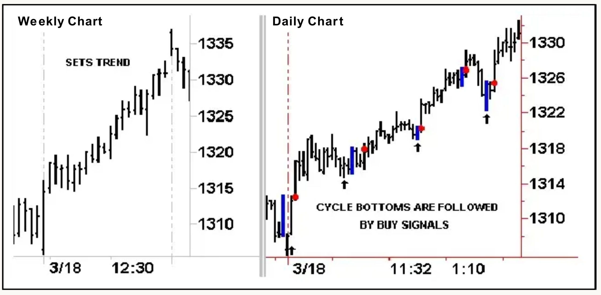
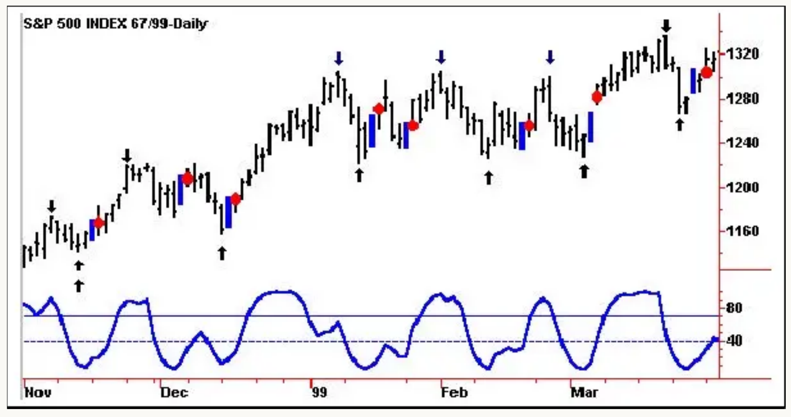
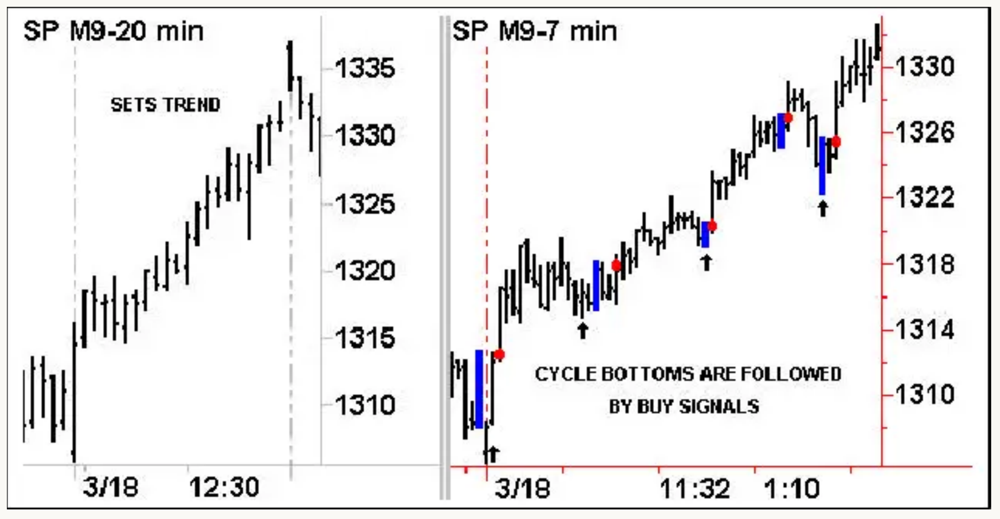
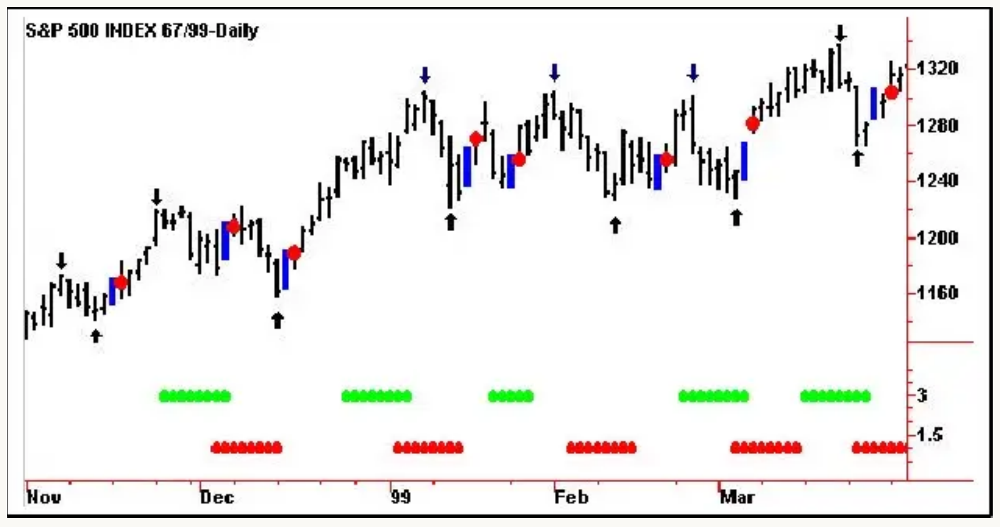
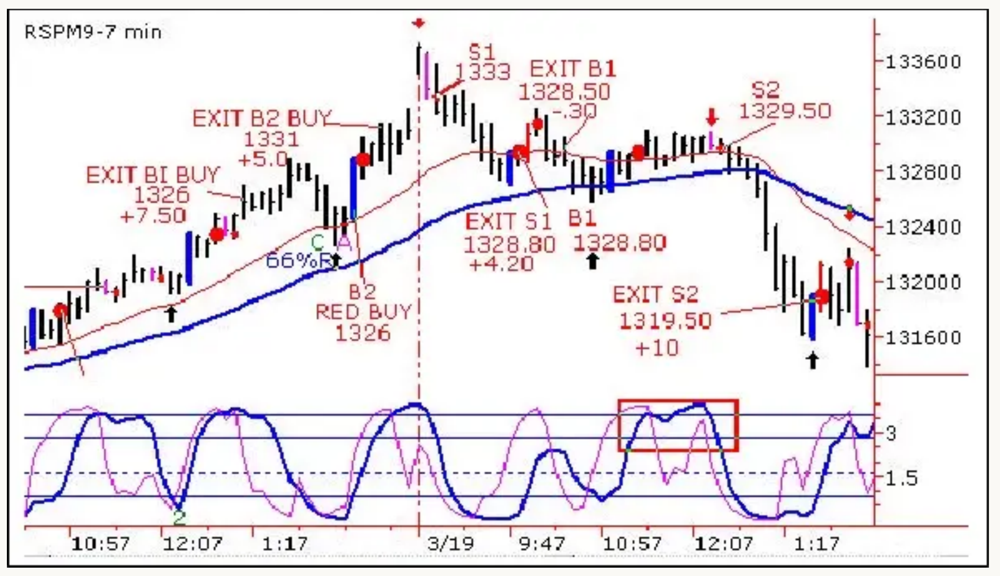
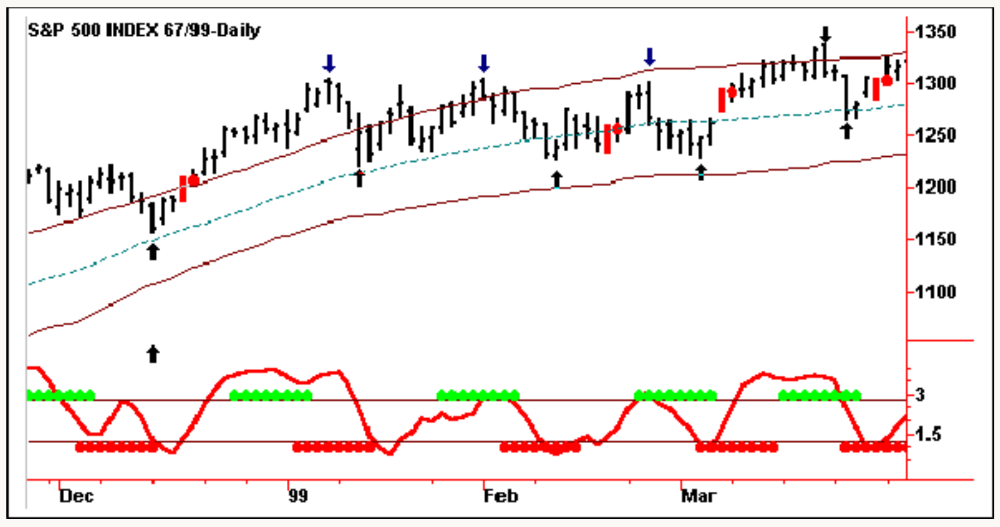

# Cycle Timing Can Improve Your Timing Performance

*by Walter Bressert, CTA*

**The HOLY GRAIL OF TRADING is:**
Trade with the trend; if up, buy the dips; if down, sell the rallies.

With cycles you can identify the trend plus forecast and confirm trend reversals. Whether you are trading weekly, daily or intra-day time frames, it is the cycle in the longer-term time frame that sets the trend for trading the shorter time frame. Knowing the direction of the longer cycle you will know the trend for trading the shorter cycle. Almost all trading approaches and systems can be improved with the cycle timing and trading tools that Walter Bressert has developed over his 25+ years as an analyst, trader and educator.

## Our Cycle Trading Approach is Simple

Trade with the trend. The trend for the time frame you are trading is determined by the next longer-term time frame. If the trend is up, buy the dips (cycle bottoms); if it is down, sell the rallies (cycle tops).

## The Longer-Term Cycle Sets the Trend for the Shorter-Term Cycle

**Chart 1** — The longer-term chart (weekly or intraday) sets the trend (direction) for trading the shorter-term chart (daily or intraday) based on the dominant cycle in the weekly time frame. When the trend is up, buy the daily cycle bottoms with mechanical buy signals; when the trend is down, sell the daily trading cycle highs with mechanical sell signals.

The combination of the weekly and daily charts gives a picture of the trend (weekly charts) and the trading signals (daily charts). The thick (blue) price bars are the setup bars; the up arrows, cycle bottoms. A rise above the setup bar generates a mechanical buy signal (indicated by the dots following the setup bars) with 70-90% accuracy and confirms a cycle bottom.

> NOTE: Our focus in this article is on the long side of the markets. The mirror image works for the short side.

## The Bressert Double Stochastic Generates Mechanical Buy/Sell Signals

The Bressert Double Stochastic, the best oscillator available for buying bottoms and selling tops, generates mechanical buy/sell signals that often occur at cycle tops and bottoms.

In Chart 2, the blue oscillator is a 10DS Bressert Double Stochastic, which tends to identify the tops and bottoms of the 20-bar cycle as the oscillator tops and bottoms.

- The thick bar (blue) is a **setup bar**, which occurs when the double stoch drops below the buyline at 40 and turns up.
- The red dot is the **mechanical entry signal** generated when prices rise above the high of the setup bar.
- The up arrows show the cycle bottoms; the down arrows show the cycle tops.

**Chart 2** — The Bressert Double Stochastic Oscillator generates the mechanical buy/sell signals at cycle tops and bottoms. A rise above the setup bar generates a mechanical buy signal (indicated by the dots following the setup bar) and confirms a cycle bottom.

The advantage of trading with mechanical buy and sell signals is that it takes much of the "judgement" out of your trading. With a specific entry price and a specific stop, you know your dollar risk, and you know where you will be wrong. Unlike the standard stochastic, the Bressert Double Stoc is constructed to have increased amplitude in strong trending markets, resulting in 50% more trading signals than the standard stochastic that are, on average, 10% more accurate.

## Mechanical Trading Signals for the Longer-Term Cycle Confirm Trend Reversals for the Shorter-Term Cycle

In intraday Chart 3, a mechanical trading signal is generated by a drop below the buy line, and an upturn. The upturn paints (or thickens) the price bar that generated the upturn, and the mechanical buy signal is to go long when prices exceed the high of the setup bar.

We do not trade the buy signals on the longer-term, 20-minute charts. They confirm a larger cycle bottom and trend reversal signaling the beginning of an uptrend. At tops, they confirm the end of an uptrend and the beginning of a downtrend. The mechanical buy/sell signals generated in the 7-minute chart are used to trade the market in the direction of the cycle in the 20-minute chart.

These mechanical buy signals are 70-90% accurate in cycle identification, and have low dollar risk relative to potential profits.

**Chart 3** — The 20-minute chart sets the trend for trading the 7-minute chart. These entry patterns take much of the judgment out of trading the S&P intraday.

The trading signals work as well, or better, in all time frames, all markets, and are particularly accurate in intra-day S&P trading.

## Timing Bands Forecast the Most Probable Time Periods for Future Cycle Tops and Bottoms

But there is more to cycles than just buying bottoms and selling tops with mechanical buy/sell signals. Cycle Timing Bands, calculated from historical price movement, are used to forecast the most probable time periods for future cycle tops and bottoms. Seventy percent of all cycle tops and bottoms occur in or following the timing band.

Each set of timing bands is generated from a cycle bottom to forecast the most probable time period for a cycle to top or bottom in the future.

**Chart 4** — The timing bands, generated from the cycle bottoms, indicate the most probable time periods for a cycle to top or bottom. The upper timing band (green) indicates when a top is most likely to occur; the bottom (red) timing band, when a bottom is most likely to occur.

When using the timing bands and Bressert Double Stochastic buy/sell signals, watch for prices to enter the timing band, then generate a mechanical buy signal for a bottom, or sell signal for a top. The best trades often occur when cycles bottom and top in the timing bands with the mechanical buy/sell trading signals.

## The EMA Trend Indicator Helps Determine Trend and Identifies High Probability Buy/Sell Signals

The determination of trend is so important that Walter has developed a trend indicator that plots on the trading chart to visually show the trend direction of the longer-term cycle that sets the trend. Walter's EMA trend indicator allows you to see the development of the trend on the chart you are trading with characteristics for fast trending markets, trading range markets and signals for the beginning and ending of trends. It also allows you to identify the highest probability trading signals to trade in the direction of trend.

**Chart 5** shows the EMA trend indicator on an S&P Intraday chart. The EMA trend indicator moving averages help determine trend and identify high probability buy/sell signals. When the thin EMA line (red) is above the thick EMA line (blue) and expanding, the trend is up; when the distance between the two lines narrows, the market is congesting or reversing directions. When the trend is up, the mechanical buy signals have the greatest probability of being followed by a sizeable upmove. In a downtrending market, the mirror image is true.

**Chart 5** — This is an actual chart taken from The S&P Intraday Review & Forecaster advisory service. Notice how the market changed direction as the distance between the EMA trend indicator lines narrowed.

## Keltner Bands Provide Support and Resistance in Trending Markets

Keltner Bands, when combined with oscillators and other technicals to identify cycle tops and bottoms, are an excellent analytical trading tool to determine support and resistance levels in trending markets either in the Keltner Band itself, or the midline that runs through the middle of the chart. They are also used to identify support/resistance levels and breakouts of congestion ranges.

**Chart 6** — Notice how the last three trading cycle tops occurred near the upper Keltner Band. Also, three trading cycle bottoms occurred near the midline.

The combination of the timing bands, the Bressert Double Stochastic oscillator, Keltner Bands, and the mechanical buy/sell signals make visual identification of cycle bottoms in any market, any time frame easy... and reduce much of the judgement in trading.

---

Walter Bressert Futures OnLine
Post Office Box 4088, Vero Beach FL 32964
Voice: (561) 567-1101
http://www.walterbressert.com

*There is a risk of loss in trading futures.*
*Copyright © 1999-2000 Walter Bressert, Inc. All Rights Reserved.*
