# Intraday Timing for Low-Risk Swing Trading

*A Live@TAG Workshop presentation by Walter Bressert*

Profitable trading, whether intraday, swing, or position trading requires knowing the direction of the trading trend and early identification of trend reversals. Intraday cycles and technical analysis combine to generate high probability, low dollar risk mechanical entry signals and trading patterns that can be used for intraday trading and/or the establishment of daily swing positions with a fraction of the exposure inherent in trading daily charts.

The S&P Index and most other actively traded markets have daily swings that are actually a short-term cycle usually bottoming 3-5 days from a previous swing low. The advantage of using shorter-term intraday time frames is that they allow traders to establish multi-contract positions with lower dollar risk than trading one contract in daily swings. With intraday multi-contract positions, you can have closed profits under your belt before daily swing traders have entered the market.

## The Key to Buying Bottoms & Selling Tops With Low Dollar Risk

Every time frame has a dominant trading cycle, and the integration of cycles within cycles within cycles within cycles in smaller time frames is the key to buying bottoms and selling tops with low dollar risk.

**Chart 1**

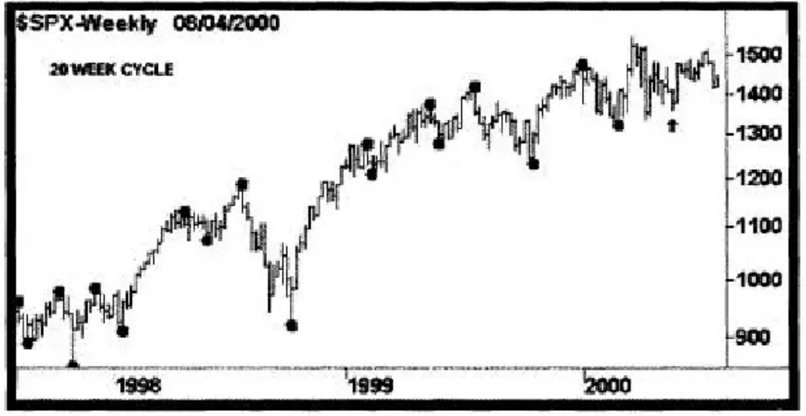

The tops and bottoms of the 20-week cycle in the S&P Index are indicated by the dots.

### Use Cycles Within Cycles Within Cycles to Lower Dollar Risk and Increase Profitability

**Chart 2**

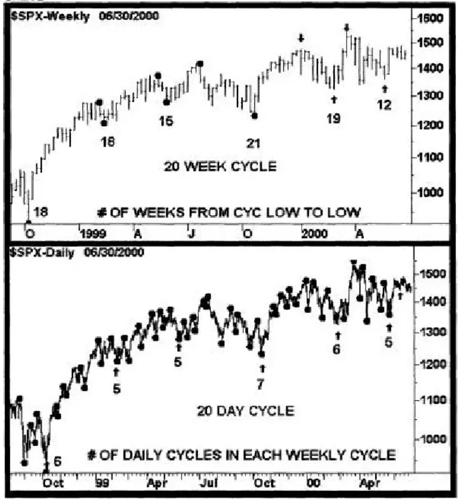

The cycle length is an average of cycles measured from bottom to bottom. But cycles contract and extend, and the 20-week cycle in the top panel is comprised of cycles of different lengths.

The 20-day cycle in the bottom panel is identified by the dots at the cycle tops and bottoms. A weekly cycle has within it a variable number of daily cycles. Each up arrow identifies a 20-week cycle bottom. The number below the up arrow shows the number of 20-day trading cycles within each 20-week cycle. In this chart, each 20-week cycle has five to seven 20-day trading cycles.

## The Weekly Cycle Sets the Trading Trend

The direction of the weekly cycle sets the trading trend for the daily cycles. When the weekly cycle is moving up, it can be profitable to buy each daily trading cycle bottom; when the weekly cycle is moving down, it can be profitable to sell each daily trading cycle top.

**Chart 3**

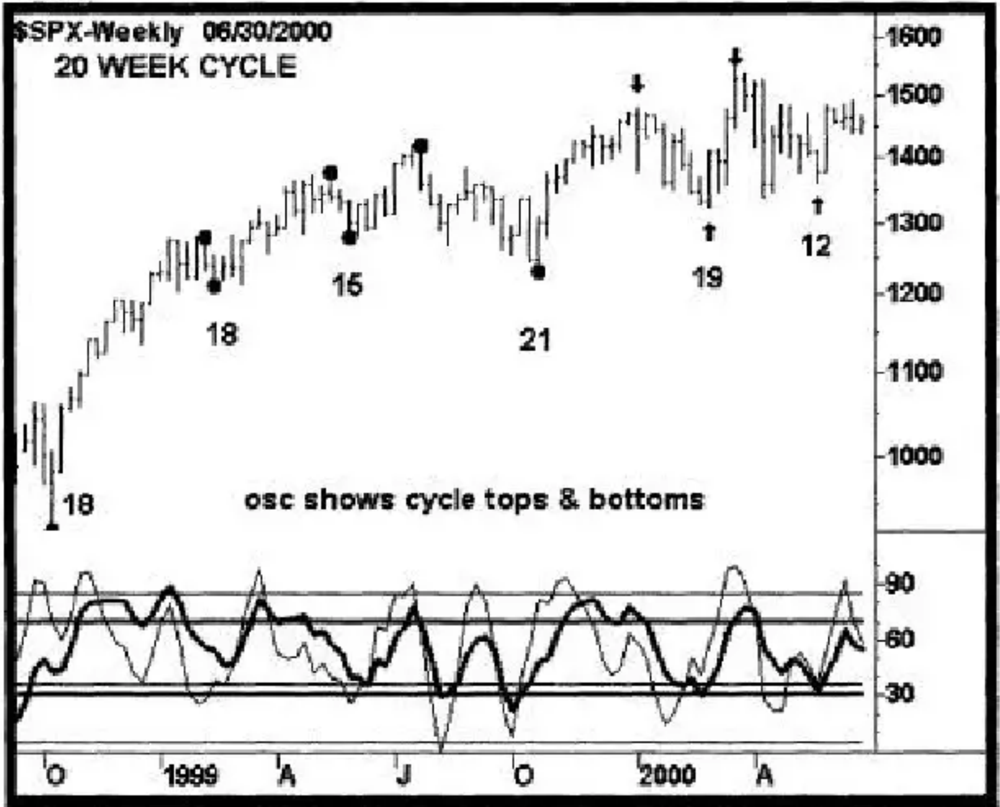

The oscillators at the bottom of the chart tend to top and bottom as the weekly cycle tops and bottoms. The thick red line is an RSI 3M3 oscillator — an RSI3 smoothed with a 3-bar moving average. The thin line is a detrend of the RSI 3M3 calculated by running a 5-bar moving average of the RSI 3M3 and subtracting it from the RSI 3M3.

**Chart 4** — High Probability Mechanical Buy/Sell Signals

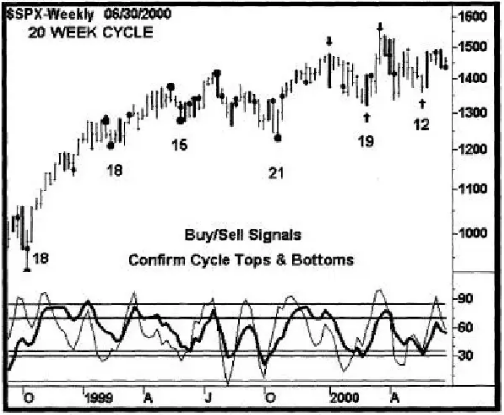

When the oscillators are below the horizontal buy lines, an upturn can be used to confirm a cycle bottom and to generate a mechanical buy signal. When the oscillators are above the horizontal sell lines, a downturn in the oscillator will confirm a cycle top and/or generate a mechanical sell signal.

- An upturn in the oscillator generates a **buy setup bar** and paints the bar red (thick bar) to identify a potential bottom. When the high of the setup bar is exceeded, the cycle bottom is confirmed.
- When the oscillator is above the sell line and turns down, a **sell setup bar** is generated and painted purple (thick bar). When the low of the sell setup bar is taken out, the cycle high is confirmed.

---

## Identification of Daily Cycles is Necessary for Trading in the Direction of Trend

**Chart 5** — Weekly & Daily Combined

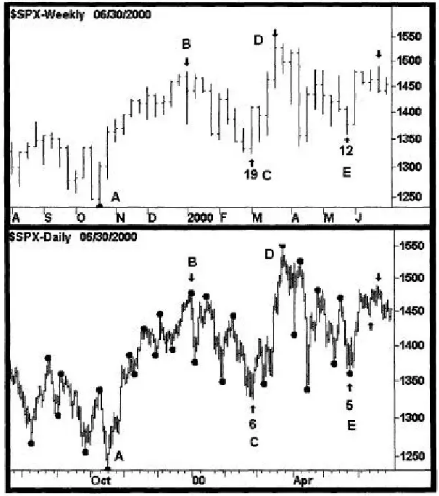

The top panel shows the weekly cycles identified by the up and down arrows, and the letters at the cycle tops and bottoms.

The bottom panel shows the daily cycles with the cycle tops and bottoms identified by the dots. Using the daily cycles within the weekly cycles gives the trader the advantage of:

1. Quickly identifying a trend reversal and knowing the trend direction
2. Anticipating future tops and bottoms of the daily cycle to buy dips in an uptrend and sell the rallies in a downtrend

**Chart 6** Oscillators Help Identify Cycle Tops and Bottoms as They Occur

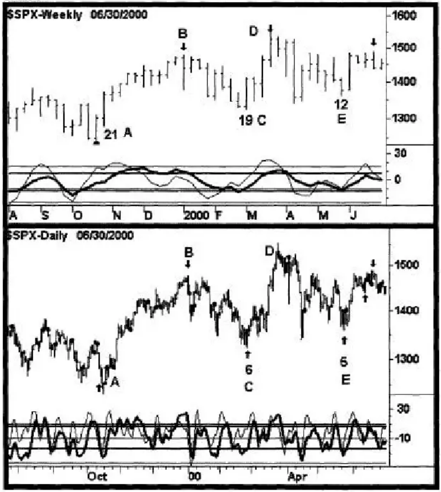

This chart adds oscillators to the weekly and daily charts; and adds mechanical buy/sell signals to the daily chart based on the oscillator. When the weekly cycle is moving up (as from A to B and C to D), buy signals will be profitable as the trading trend is up. When the weekly cycle is moving down (as from B to C and D to E), sell signals will be profitable as the weekly cycle — and trend — is down.

---

**Chart 7** Cycles Within Cycles Give High Probability, Low Dollar Risk Trades

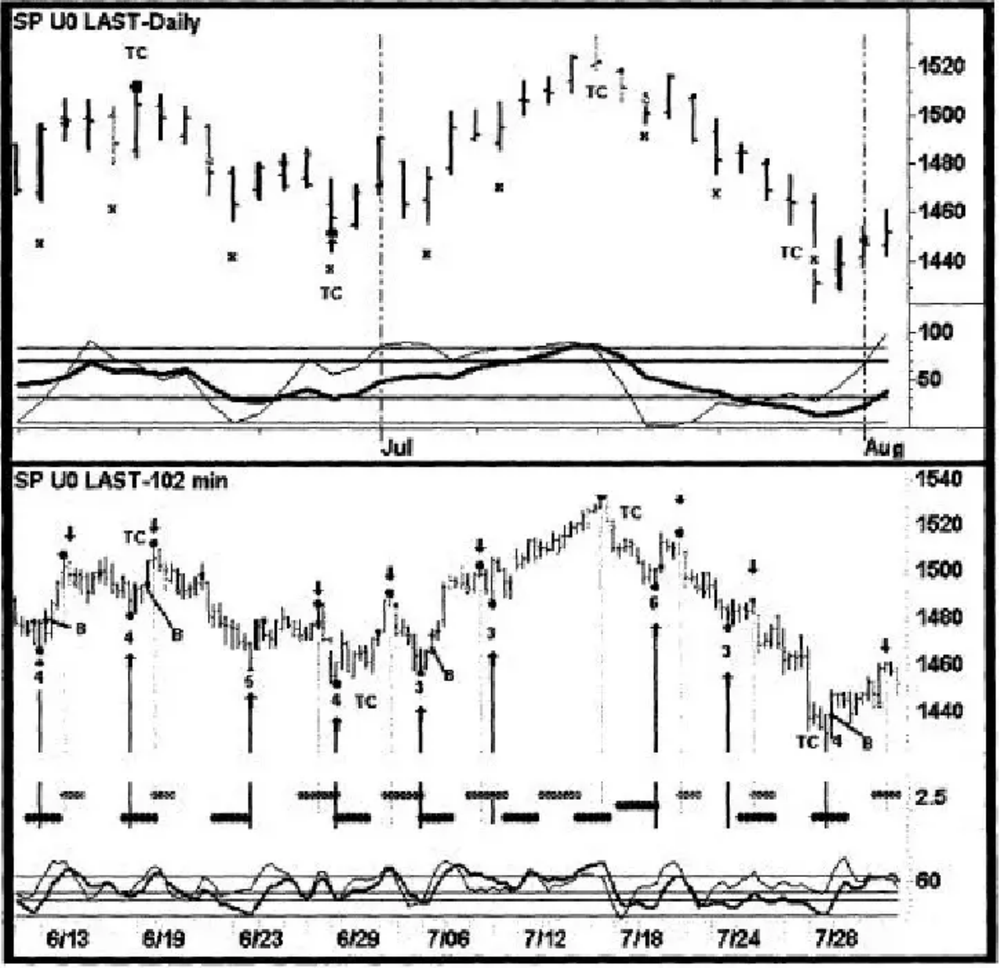

The top panel is a daily chart showing the daily trading cycle tops and bottoms indicated by TC. The X's indicate the bottoms of the daily swings within the trading cycle. These swing bottoms are generally three to five days apart.

The bottom panel shows the same chart plotted in quarter-day, 102-minute price bars. By dividing the day into four equal time periods of 102-minutes, you can see a distinct 18-bar cycle within the daily trading cycle. The tops and bottoms of the 18-bar cycle are identified by the dots, and the number of days from bottom-to-bottom are shown below each cycle bottom.

## The 4½-Day Cycle is 18-Price Bars in the 102-Minute Chart

The average cycle length is 18-bars from bottom-to-bottom, or 4½ days. The advantage of using the 102-minute chart is that the dollar risk in entering the market at daily cycle tops and bottoms with the 102-minute mechanical trading signals is substantially less than in the daily chart. Also, each daily trading cycle bottom will be followed by an 18-bar cycle bottom in the 102-minute chart as a daily swing low is made. These bottoms present an opportunity to add on additional positions.

The same pattern works following a daily trading cycle top in that the top of the next 102-minute, 18-bar cycle offers a lower risk sell signal and an opportunity to add on additional low-risk short positions.

**Chart 8** — Intraday Timing Bands Forecast Future Tops and Bottoms

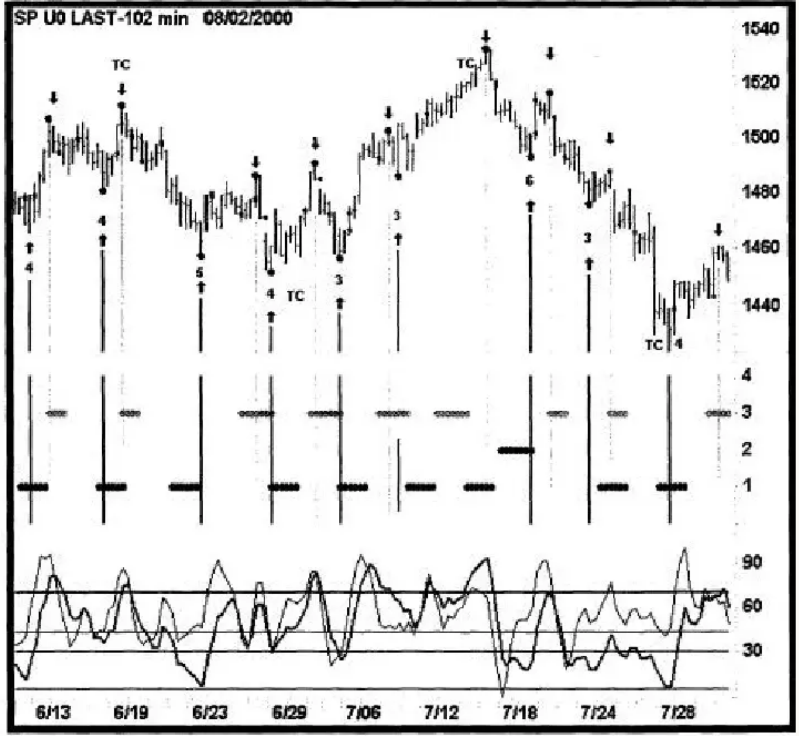

Using the 18-bar cycle in the 102-minute chart, the approximate time periods for the cycle to top and bottom can be anticipated as indicated by the Timing Bands at the bottom of the chart. The upper band (green) forecasts the next top from a cycle bottom, and the lower band (red) forecasts the next cycle low from the same bottom.

Intraday Timing Bands can be quite accurate:
- Of nine cycle bottoms, five were in or following the bottoming Timing Band, while two occurred before the Timing Band.
- Of nine cycle tops, all nine were in or following the Timing Band.
- Eight buy setup bars occurred on or one bar following the trading cycle low.
- Eight sell setup bars occurred on or one bar following the cycle high.

**Chart 9** — Timing Band Accuracy

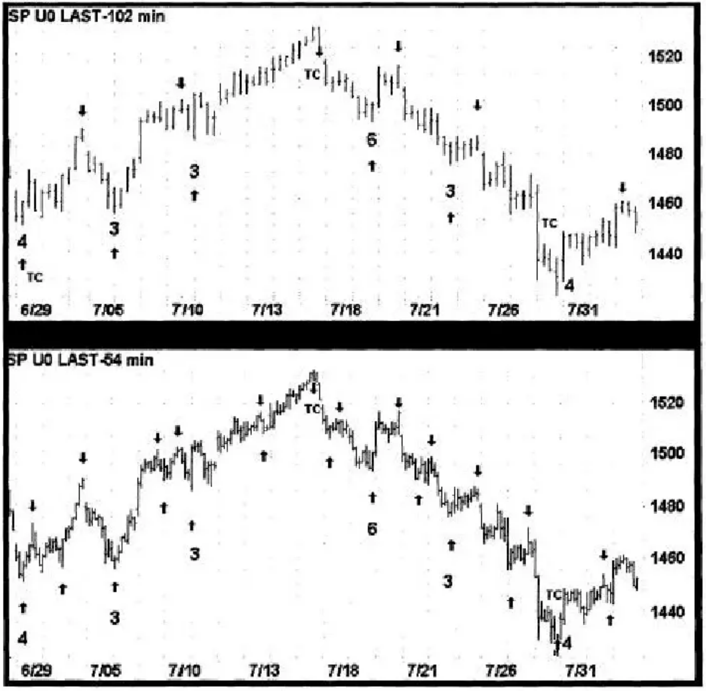

Just as the daily chart has 4½-day swings within it that are more clearly definable and tradable by using the 102-minute chart and 18-bar cycle, a drop to a shorter time period of 54 minutes, approximating an hourly chart, has additional cycles within the 102-minute, 18-bar cycle.

The top chart chows the daily swing highs and lows indicated by the up and down arrows. The number of days from bottom-to-bottom is indicated by each cycle low.

---

## 54-Minute Chart Increases Accuracy and Lowers Dollar Risk

The 54-minute chart shows the "cycles within cycles". This chart also has an 18-bar cycle and there tends to be two 54-minute, 18-bar cycles within one 102-minute, 18-bar cycle.

The up arrows show the lows of the 18-bar cycle in the 54-minute chart, and the 18-bar cycle bottoms in the 102-minute chart are identified by the daily numbers. There are two benefits to using the smaller intraday time frames:

1. The smaller price bars offer lower dollar risk
2. The concept of right translation in rising markets and left translation in declining markets can increase the accuracy of time and price forecasting and identification of cycle tops and bottoms

**Chart 10**

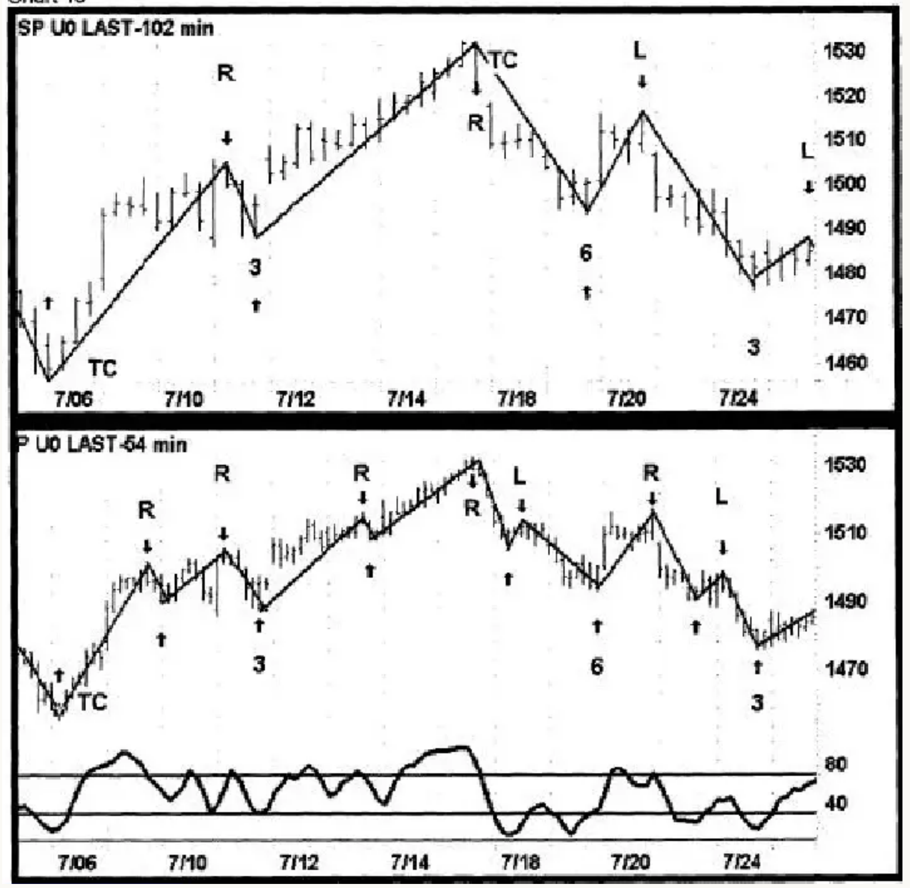

The 102-minute chart shows the 18-bar cycle identified by the arrows and the number of days between cycle bottoms.

## Right Translation in Bull Markets

In a rising market, prices tend to lean to the right going up for a longer period of time than they go down. From the trading cycle bottom on 7/6, prices moved up for 13 bars and down for two in extreme right translation that is typical of a bull market, bottoming on 7/12 three days from the trading cycle low.

The next 18-bar cycle lock prices up to the trading cycle top in a stretch that is not uncommon as larger cycles top dropping into a greatly extended 18-bar cycle bottom six days from the previous low. The trading has topped and the next cycle high has left *translation* as the trading trend for that 18-bar cycle is down. Prices rose for five bars and declined for eight bars into the 18-bar cycle bottom (which is not the trading cycle bottom).

The 54-minute chart in the bottom panel gives a clear picture of the cycle dynamics of cycles within cycles within cycles.

There are normally two 18-bar cycles in the 54-minute chart within the single 18-bar in the 102-minute chart. From the trading cycle bottom at the left of he chart, the 54-minute chart shows two 18-bar cycles with right translation that terminate in a 3-day swing bottom on 7/11. In such a cycle, the second trading cycle high can often be expected to be above the first cycle high. Prices had a very slight drop into the 3-day trading cycle on 7/11 indicating the market could move sharply higher into the next 18-bar cycle in both time frames. In the 54-minute chart, the 18-bar cycle shows extreme right translation moving up for 15 bars and down for two to make the first trading cycle bottom. The quick rise above the cycle high on 7/12 indicates that the 102-minute, 16-bar cycle has yet to top most likely with right transition in the second cycle, which topped on 7/15 at the trading cycle high. Once the trading cycle tops, the 18-bar cycle in the 54-minute chart experiences **left translation** as prices move up for two bars and down for 10 into a 6-day swing.

## This is where it het interesting

From the 6-day low on 7/19, the 102-minute chart rises for only four price bars to make a bearish left translation high below the trading cycle top, which is followed by a sharp and extended decline into the 3-day swing bottom on 7/24. But the 54-minute chart shows right translation in the first trading cycle moving up for eight price bars and down for six. Expecting left translation following the confirmed trading cycle top makes the high at R on 7/20 in the 54-minute chart an excellent short into the 3-day swing low on 7/24. Note the oscillator pattern on 7/20 of a divergent oscillator/price high, which sets up for a low-risk trade.

**Chart 11** — Cycles Within Cycles Within Cycles

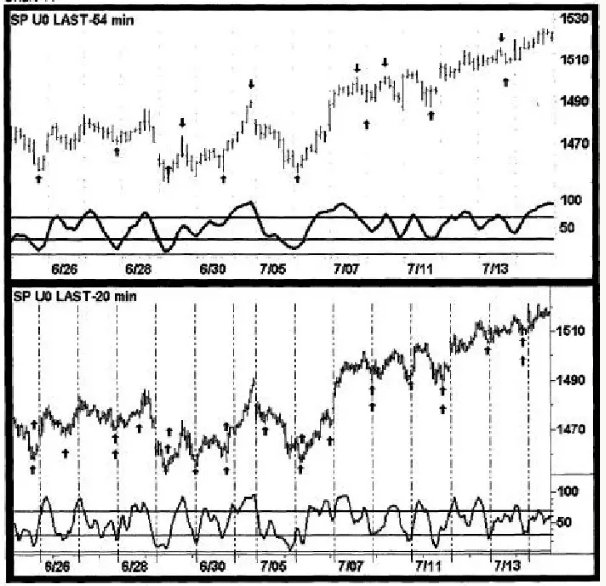

By dropping down to shorter-term cycles, the dollar risk for entry can be greatly reduced. A daily trading cycle low is a "Nest" of cycles in the smaller time frames, also making a 102-minute 18-bar cycle bottom, a 54-minute 18-bar cycle bottom, and a 20-minute 18-bar cycle bottom. Each smaller time frame in this Nest reduces the dollar risk of initial entry.

Cycle bottoms within the Nest are confirmed with mechanical buy signals from the cycle in the shortest time frame to the cycle in the longest time frame. Therefore, a 20-minute bar chart will confirm a cycle bottom before the 54-bar chart, which will confirm a bottom before the 102-minute chart, which will confirm a bottom before the daily chart, which will confirm a bottom before the weekly chart.

The interplay of these time frames allows high probability, low dollar risk trades at the intraday cycle bottoms and tops to position for trading the daily 4½-day swings. Theoretically, a one-minute bar chart would provide much lower dollar risk than even a 20-minute chart but the smaller the time frame, the greater the "noise". And the greater the noise, the more likely it is to have a false trading signal and losing trade. Therefore, 20-minute chart is about the smallest time for trading the 4½-day swings.

## Greater Profits With Multiple Contracts

By using multiple contracts at entry, you can take profits on strength as the market rises out of a cycle Nest. With good Trailing Stops, you can establish a position at a cycle bottom in a short-term time frame and follow prices up in the longer time frame to take advantage of the full move of a daily swing.

The cycle tops and bottoms of the 18-bar cycle in the 54-minute chart are indicated by the blue arrows for cycle bottoms; red arrows for cycle tops. The 20-minute chart also has an 18-bar cycle. There tends to be two 18-bar cycles in a 20-minute chart within one 18-bar cycle in a 54-minute chart.

Each 18-bar cycle in the 54-minute chart has within it two 18-bar cycles in the 20-minute chart. The interplay of cycles within cycles, right and left translation, oscillator direction and overbought/oversold levels allow the cycles in the 102-minute and daily charts to be micro-traded with low dollar risk at cycle bottoms and tops.

---

# Additional Chart Examples

The following charts illustrate the intraday timing techniques applied to live market examples in the S&P Index.

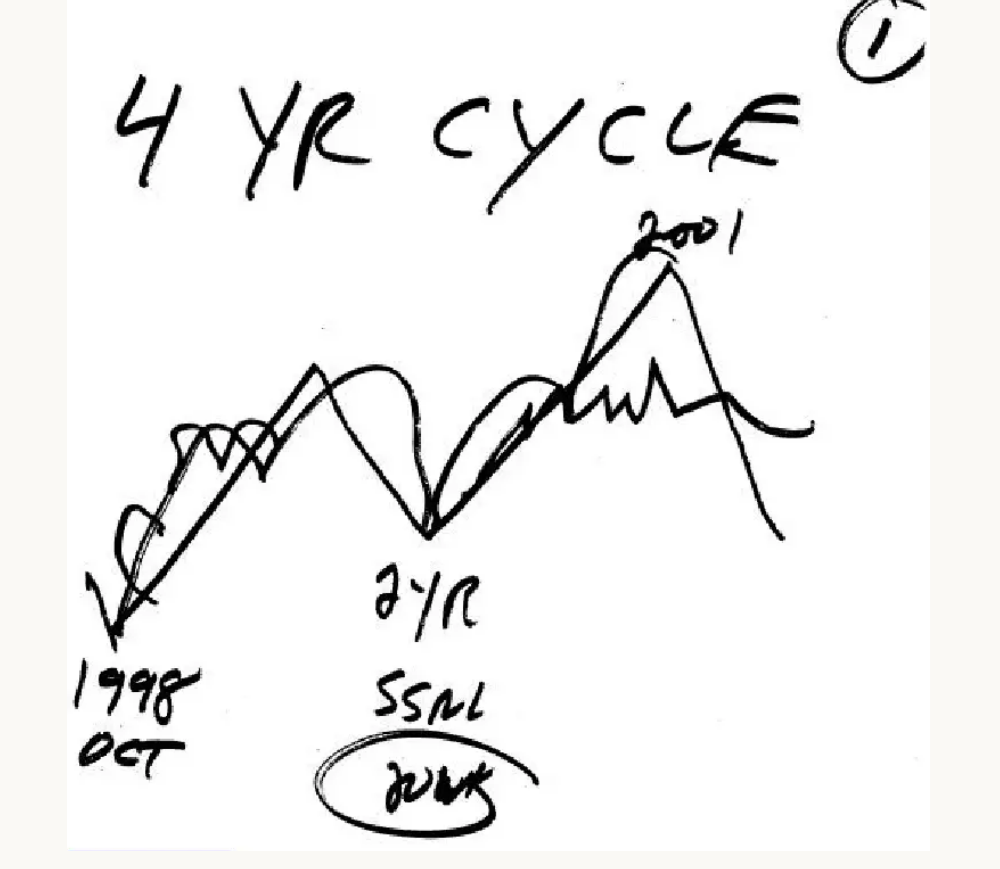

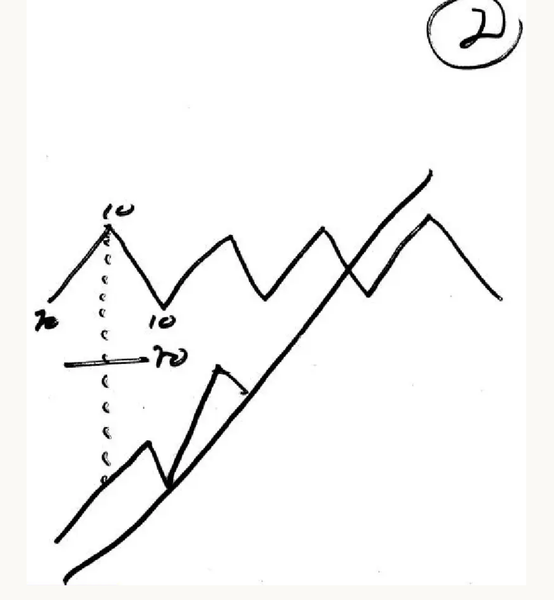

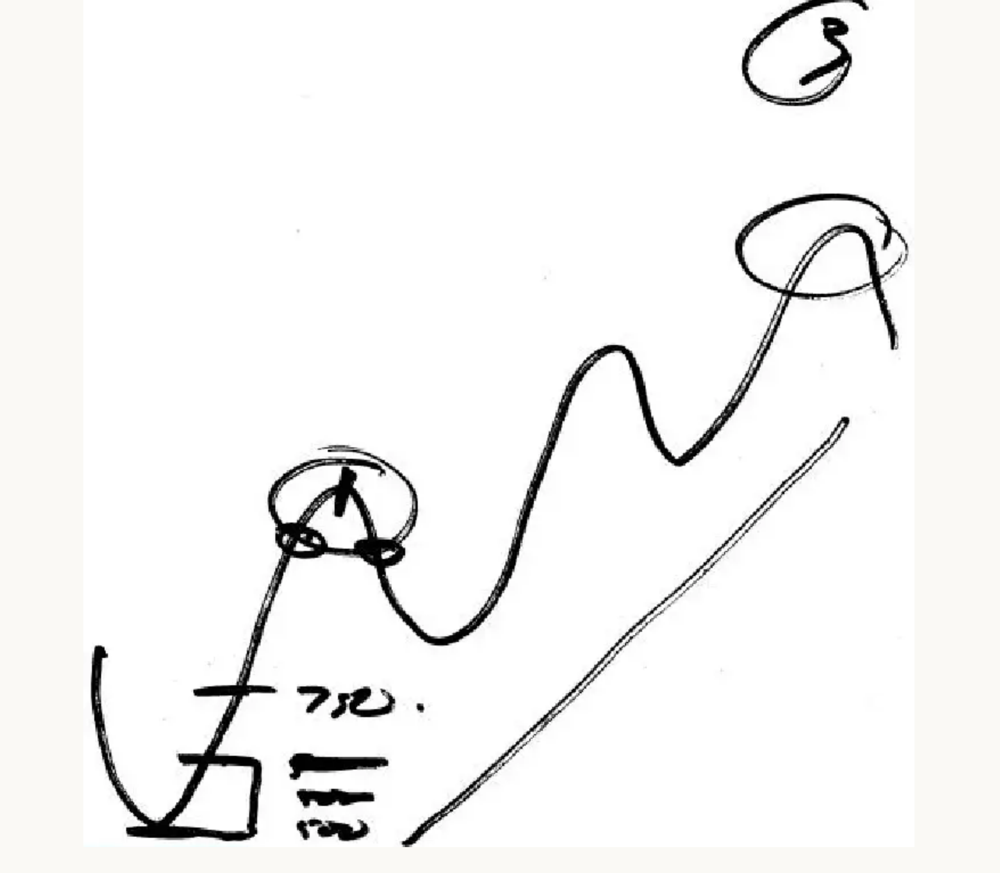

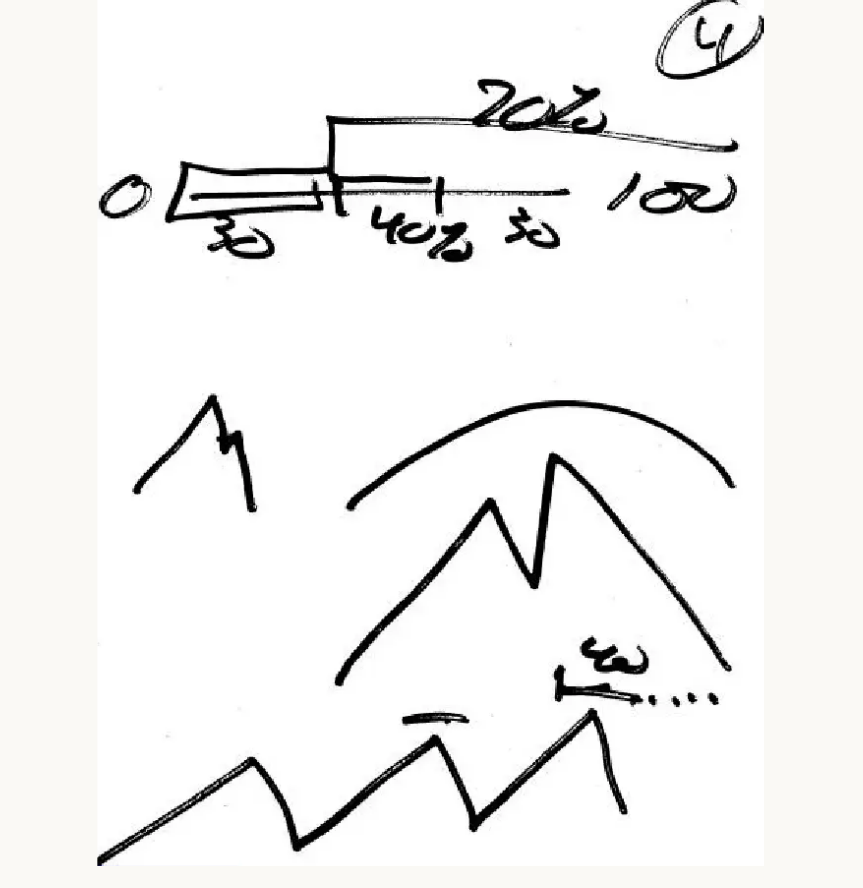

---

*Walter Bressert*
*Voice: 561.567.1101*
*www.walterbressert.com*
