# Overview of ProfitTrader 6.0 Indicators

## Contents

### Indicator list

#### OSCILLATORS

- The Bressert Double Stochastic
- The Bressert BLine
- HAL (High and Low) OB/OS Indicator

#### MECHANICAL BUY/SELL SIGNALS

- The Bressert Double Stochastic Oscillator Mechanical Buy/Sell Signals
- Bressert BLine Mechanical Buy/Sell Signals
- HAL OB/OS Mechanical Buy/Sell Signals

#### TRAILING STOPS

- Multi-Bar Trailing Stop and Entry
- Dynamic Short-Term (ST) Trailing Stop
- Dynamic Long-Term (LT) Trailing Stop

#### TIME FORECAST

- Cycle Length Indicator
- Timing Bands

#### PRICE FORECAST / SUPPORT AND RESISTANCE

- Fibonnaci Retracement
- Fibonnaci and Mid-Cycle Pause Price Forecaster

#### TREND

- Dynamic Trend Indicator (DTI)
- EMA Trend
- EMA % Diff
- MA% Diff

#### ADDITIONAL TOP AND BOTTOM INDICATORS

- Keltner Bands
- Real-Time Detrend

---

### Oscillators

Oscillators are mechanically derived lines that show oversold and overbought levels in a market. They are used to determine trend, and to generate mechanical buy/sell signals.

### Mechanical Buy/Sell Signals

Based on Oscillator and Price patterns the mechanical buy and sell signals are generally 70% to 90% accurate in identifying cycle bottoms and tops. The Buy/Sell Signals are generated in two steps:

1. When the oscillator turns above or below the oscillator Buy/Sell lines, a potential change in market momentum is indicated by a colored Setup bar.
2. When prices exceed the high of the Setup bar, a Buy "Trigger Entry" occurs. When prices drop below the low of the Setup bar, a Sell "Trigger Entry" occurs.

### Trailing Stops

Once you have determined trend, entered a market and placed your initial protective stop, you must decide where to take a profit. Reliable trailing stops can make the difference between big profits and small profits. All too often we nervously grab a small profit on the first reaction only to see the market take off once we are stopped out. The ProfitTrader trailing stops are designed to follow prices as closely or as far away as your trading temperament dictates. They provide the flexibility to follow prices into a trading cycle reversal with a tight stop to minimize profit give back, or to give a market room to let profits run in the really big moves.

The ProfitTrader Short-term Trail Stop Indicator is a fast moving mathematical stop to lock in a quick profit, often as a trading cycle reverses. The Long-term Trail gives a market more room for price fluctuation to trail the bigger moves. Using these stops eliminates the need to wait for a trading signal in the opposite direction, or the constant re-evaluation of mental trailing stops.

ProfitTrader Trailing Stops lock in profits from cycle tops and bottoms in all time frames, in all markets.

### Time Forecast

Cycles are the only technical tools that allow reasonably accurate forecasting of future tops and bottoms. The cycles used in our analysis are as long as 4 years for the Stock Market, and as short-term as minutes or ticks for intraday trading. Timing Bands are plotted on a chart, but since they do not show beyond the edge of the chart, the Expert Commentary gives the exact dates/times of the Timing Bands.

### Price Forecast / Support and Resistance

Cycles frequently top and bottom at support/resistance levels. Fibonacci ratios help confirm cycle retracement and determine price objectives. The Mid-Cycle Pause (MCP) calculation can forecast the approximate price level of the next cycle.

### Trend

The most important aspect in trading the market is trend. The only "Holy Grail" of trading is — Trade with the trend; if it is up, buy the dips; if it is down, sell the rallies. We use four indicators to help identify trend and trading trend. Once trend is identified, cycles are used to buy bottoms in the direction of trend, if up; or sell tops in the direction of trend, if down. Also, using cycles, we can anticipate trend reversals.

### Additional Top and Bottom Indicators

Most cycles top and bottom when a market is overbought or oversold. While the BLine and Double Stoc oscillators show these extremes when the oscillators are above 90 and below 10, the Keltner Bands and Real-Time Detrend will often show the extremes a market can reach. When the oscillators are overbought/oversold and the markets reach the extremes indicated by the Keltner Bands and Detrend, a trading signal in the opposite direction will frequently confirm a cycle top or bottom.

---

## Oscillators

### The Bressert Double Stochastic — Walter's Favorite Indicator

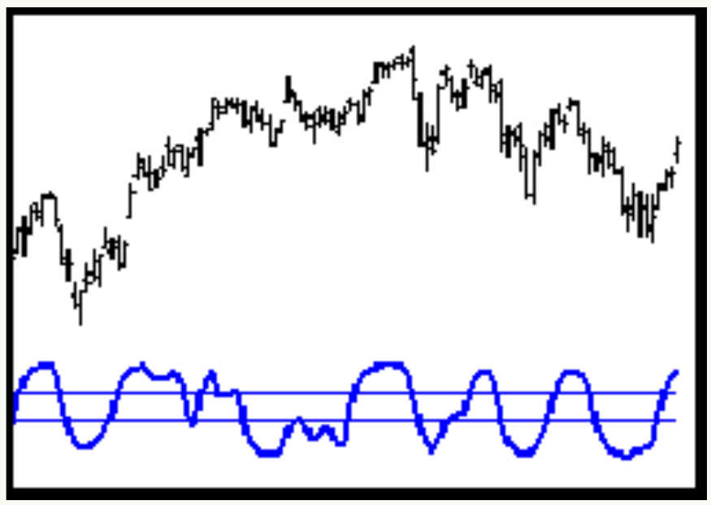

The Bressert Double Stoc oscillator is the backbone of ProfitTrader because it tops and bottoms with approximately 70% of all cycle highs and lows, in all time frames, in all markets — futures, commodities, stocks, bonds… anything that can be charted.

Therefore, many trading patterns are based upon an interaction with the Double Stochastic.

The Double Stoc indicator is used to identify tops and bottoms of the trading cycles in all time frames — intraday, daily, weekly, and monthly — and in all markets — stocks, indices, futures, commodities, options, foreign exchange.

The standard Stochastic often wiggles at tops and bottoms giving false buy/sell signals. The crossover (%D) is used in the regular stochastic to offset these wiggles by using a rise above the crossover as a buy signal, and a drop below the crossover as a Sell signal.

The Bressert Double Stoc reduces false signals and increases the accuracy of identifying cycle bottoms and tops with high probability Mechanical Buy/Sell signals that are 70-90% accurate.

The Bressert Double Stochastic shows market direction and overbought/oversold levels that coincide with cycle tops, bottoms and trend reversals. It plots in the oscillator sub-graph of the chart.

## The Bressert BLine

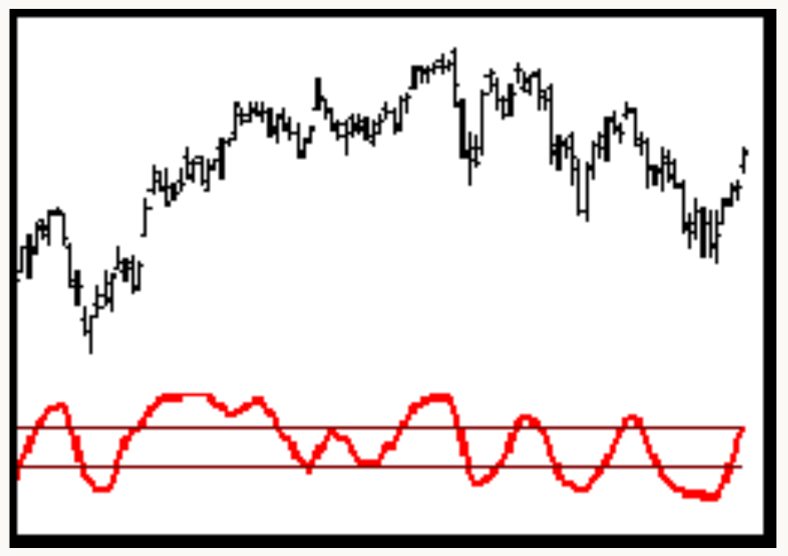

The Bressert BLine is an RSI-based indicator designed to identify trading cycles in all time frames. It turns somewhat slower than the Bressert Double Stochastic, but has a higher accuracy in identifying trading cycle tops and bottoms.

The Double Stoc Buy/Sell signal averages about 70% across all time frames; the BLine averages better than 80% across all time frames.

At times the Bressert BLine will generate a Setup Bar/Entry signal at the same time as the Double Stoc. At other times, it will generate a Setup Entry signal following the Double Stoc, confirming the Double Stoc signal.

The BLine plots in the oscillator sub-graph of the chart.

## HAL (High and Low) OB/OS Indicator

A market cycle is like an oscillator; constantly shifting from one extreme to another — extremes of being oversold to overbought to oversold. When these overbought and oversold levels occur, they often develop into trading cycle tops and bottoms. The HAL OB/OS Bands show when prices are at these extremes. When occurring within a Timing Band and as the oscillator(s) is at an overbought or oversold level for a top or bottom, this indicator will greatly improve your odds of entering trades in the right direction.

- The **A version** shows wide bands of OB and OS prices and seldom misses a cycle top or bottom.
- The **B version**, derived from more selective components, shows narrower bands but can completely miss some highs and lows that show in the A version. Try using both versions at the same time until you are comfortable with A, B or both versions. Walter's personal preference is the B version.

The HAL OB/OS indicator plots above the oscillator panel. The green band indicates an overbought level; the red, oversold level. The lower bands are the B version; the upper bands, the A version.

---

# Mechanical Buy/Sell Signals

## Bressert Double Stochastic Mechanical Buy/Sell Signals

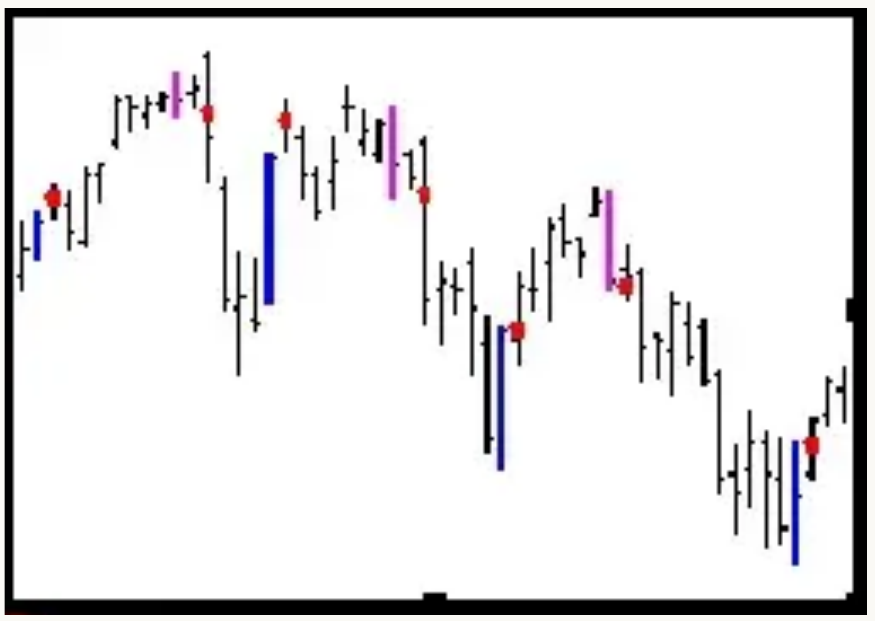

When the Double Stoc is above the sell line the market is often overbought, and a downturn in the oscillator can be followed by a downside move. When it is below the buy line the market is often oversold, and an upturn in the oscillator can be followed by an upside move. These turning points are most often trading cycle tops and bottoms. Such a turn will frequently indicate a daily, weekly or intraday trading cycle top or bottom. These trading signals average about 70% accuracy across all time frames.

Because the signals are oscillator generated, Buy Signals will be generated in a downtrending market; sell signals in an uptrending market. **These signals should be ignored when against the trading trend.** You can simply turn the sell signals off in an uptrend; and turn the buy signals off in a downtrend.

The purple sell Setup bar shows market entry with a red dot; the blue buy Setup bar, market entry with a red dot.

## Bressert BLine Mechanical Buy/Sell Signals

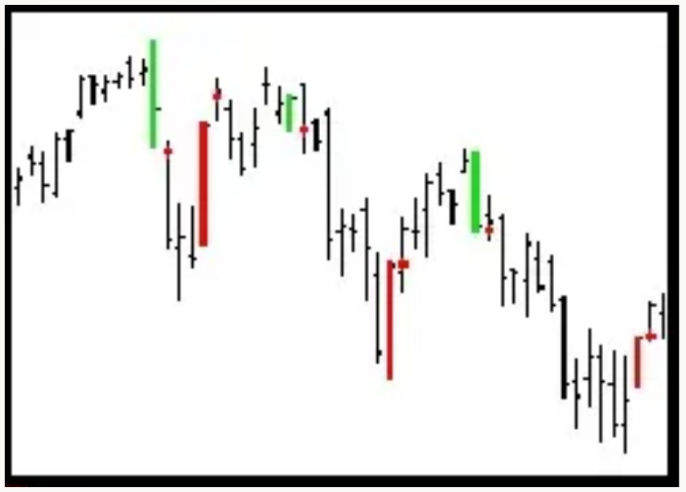

The BLine oscillator turns more slowly than the Double Stoc, and the BLine Buy/Sell signals tend to occur either a bar or more later than the Double Stoc, or on the same price bar. However, the BLine signals are more accurate, averaging **90% confirmation of cycle bottoms** and **80% confirmation of cycle tops** across all time frames.

Because the signals are oscillator generated, Buy Signals will be generated in a downtrending market; sell signals in an uptrending market. **These signals should be ignored when against the trading trend.** You can simply turn the sell signals off in an uptrend; and turn the buy signals off in a downtrend.

The green sell Setup bar shows market entry with a red dot; the red buy Setup bar, market entry with a red dot.

## HAL OB/OS Mechanical Buy/Sell Signals

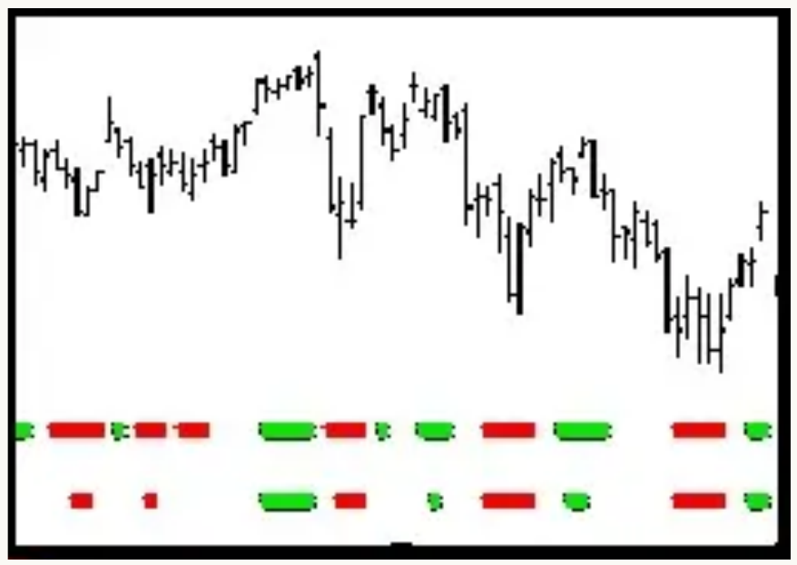

OB and OS mechanical trading signals are designed to trade when prices are in the HAL OB/OS Bands and follow the same pattern of a setup bar and trigger entry. Accuracy of cycle identification is about the same as the Double Stoc, but these signals will often occur a bar earlier than the Double Stoc signals resulting in lower dollar risk.

Because the signals are oscillator generated, Buy Signals will be generated in a downtrending market; sell signals in an uptrending market. **These signals should be ignored when against the trading trend.** You can simply turn the sell signals off in an uptrend; and turn the buy signals off in a downtrend.

The dark purple sell setup bar shows market entry with a dark purple dot; the dark red buy setup bar, market entry with a dark red Setup dot.

---

# Trailing Stops

## Multi-Bar Trailing Stop and Entry

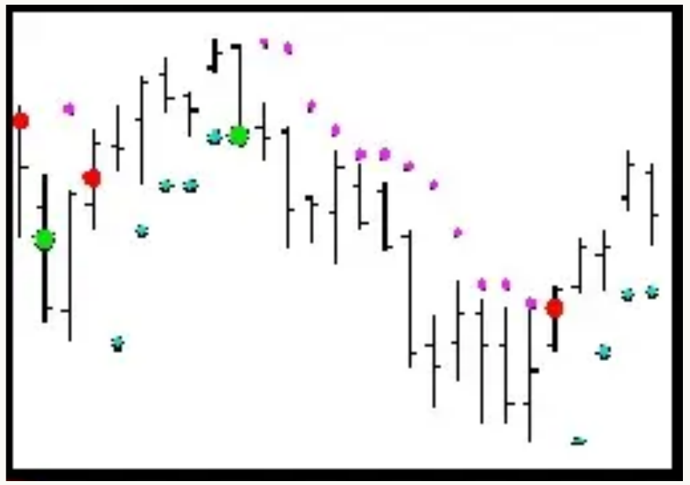

The Multi-bar reversal was initially designed as a trailing stop, but can also be used as an entry signal, or confirmation of a mechanical entry signal. Used with the HAL OB/OS Bands or at extremes of the Double Stochastic oscillator, the default 2-bar will stop out of an existing position close to a cycle bottom or top. It can also be used as a stand alone entry signal or as confirmation of a mechanical Double Stochastic, BLine or OB/OS trading signal.

The trailing stop prices for the current price bar show as colored dots that follow the market up and down during real-time trading. They can be turned off to show only the entries generated by the actual reversals.

The most significant Multi-bar reversals occur within the HAL OB/OS Bands, and at extremes of the Double Stoc oscillator.

When used to enter a trade at cycle tops and bottoms, a protective stop goes above the cycle top for trades on the short side; below the cycle low for trades to the long side.

- Cyan dots = stop out prices in a rising market
- Purple dots = stop out prices in a declining market
- Larger green dots = sell reversal
- Red dots = buy reversal

Walter has used 2-bar reversals in his trading for years as trailing stops in different markets and time frames. You may find a 3 or 4-bar, or longer, reversal to be more suited to your trading style.

The Multi-bar Trailing Stop and Entry plots as dots on the price bars. The cyan dots are the stop out prices in a rising market; the purple dots, the stop out prices in a declining market. The larger green dots show a sell reversal; the red dots, a buy reversal.

## Dynamic Short-Term (ST) Trailing Stop

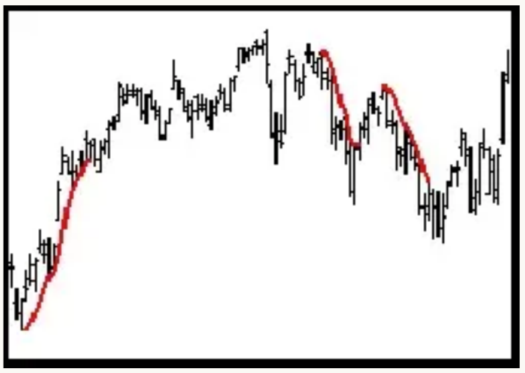

This stop is designed to stop out a position following a trading cycle top or bottom. When entering a market the initial protective stop should be placed below the trading cycle bottom if long, or above the trading cycle top if short. Once a market starts moving away from entry, the Short-Term Trailing Stop follows prices closely until the trading cycle reverses, often accelerating to stop the trade out near the extreme of the reversal.

## Dynamic Long-Term (LT) Trailing Stop

Designed to let prices back and fill, this slower trailing stop will follow a market for the bigger moves, often stopping out at the second trading cycle top/bottom, or simply trailing a market until the move is over. The Dynamic Long-term Trailing Stop defaults to a green line following prices up or down.

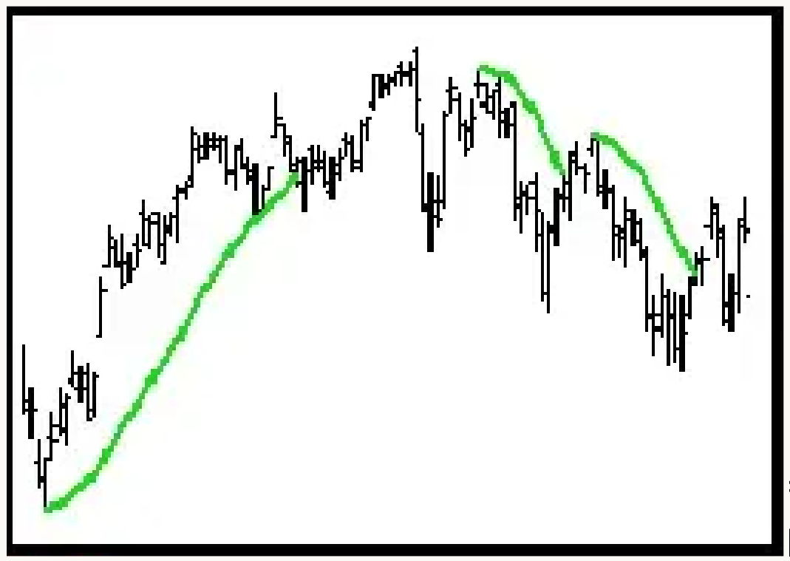

---

# Time Forecast — Cycle Length and Timing Bands

## Cycle Length Indicator

You cannot trade cycles unless you trust them, and you cannot trust them without some historical study, which might be as simple as reviewing several years of history to see the cycle tops and bottoms; or as in-depth as reviewing the mechanical buy/sell signals and combining them with multiple indicators.

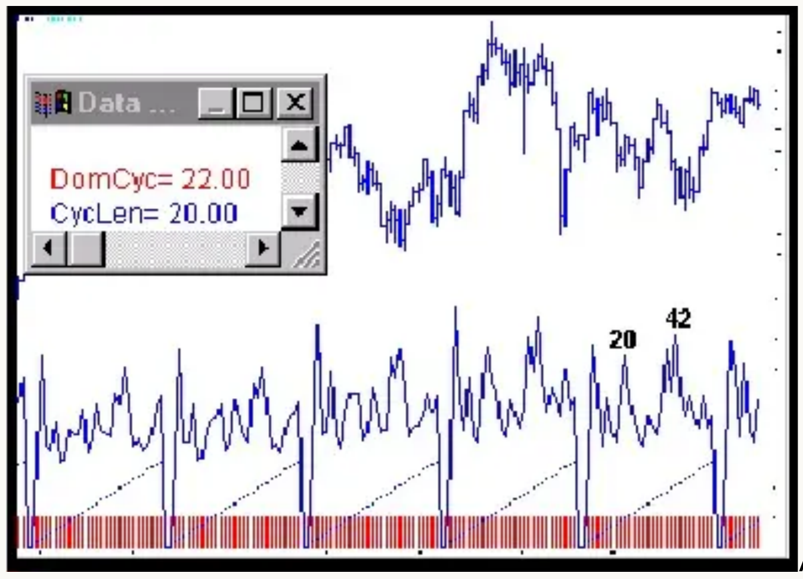

All markets have price cycles in all time frames — monthly, weekly, daily and intraday. The length of the cycle and amplitude of the cycle moves will differ from market to market, and in different time frames.

Cycle Length is a spectral analysis program that identifies cycles in any data stream; monthly, weekly, daily, hourly, minutes or ticks. The dominant trading cycle in each time frame — normally within the range of 14-25 price bars — is the cycle used to buy and sell a market, based on the mechanical buy/sell signals.

CycLen automatically selects the dominant trading cycle in red. The blue shows the current cycle length.

## Timing Bands

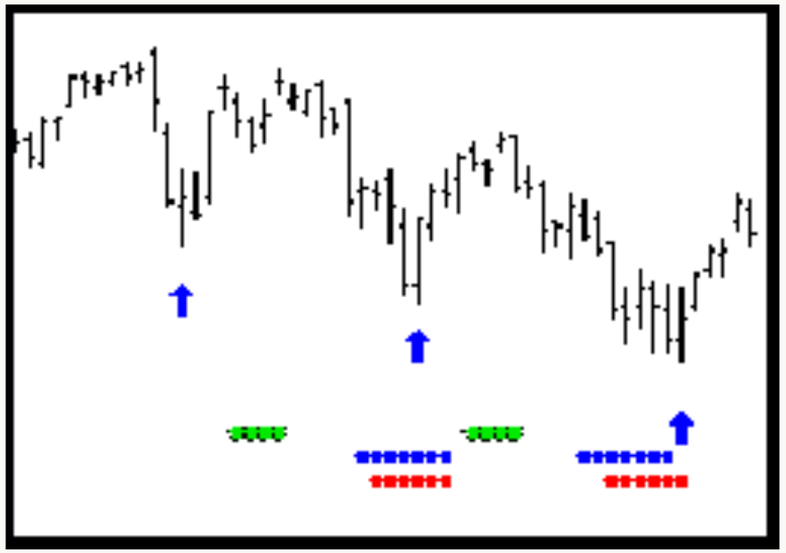

Timing Bands are based on historical cycles and are used to forecast future cycle tops and bottoms. When prices are within, or follow, a Timing Band, and a mechanical B/S signal is generated, the odds of having a true cycle top or bottom are very high. Timing Bands are used to anticipate cycle turning points and changes in momentum, and to increase the accuracy of the mechanical B/S signals.

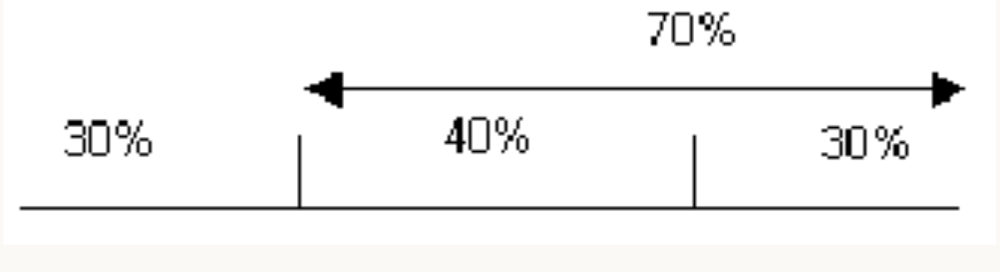

The green Timing Bands are a forecast of the most probable time for the trading cycle to top; the red and blue bands forecast the most probable time for a trading cycle to bottom. Plot them in either the oscillator panel or the price panel.

Clicking on the link below will open a new frame. To return to this page, use the back button on your browser.

**The Top & Bottom Forecaster**, recently included with the PT6.0 release, helps pinpoint and trade future tops and bottoms by showing the dates and times for expected cycle highs and lows on your charts in all time frames — weekly, daily, or intraday.

---

# Trend Indicators

## Dynamic Trend Indicator (DTI)

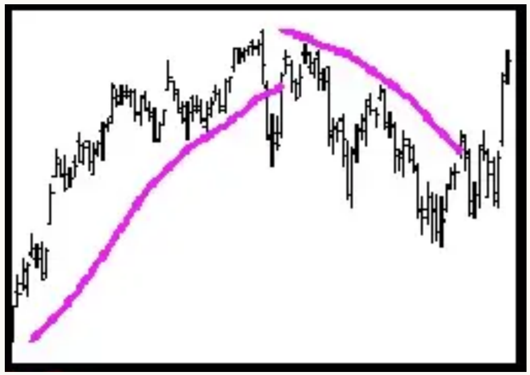

The Dynamic Trend Indicator is a longer-term trailing stop based on the next longer time frame, yet plotted on the chart you are trading. It shows the trading trend based on the next longer time frame. Trades should generally be entered in the direction of this trend indicator.

The Dynamic Trend Indicator defaults to a magenta line in the price panel showing the trend direction.

## EMA Trend

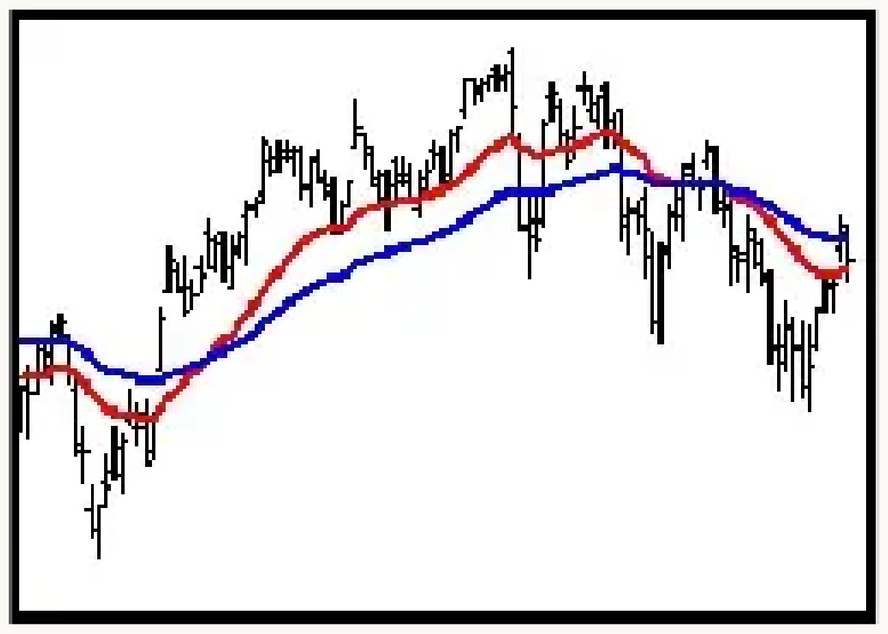

In trading, trend is all important. The direction of the longer-term cycle sets the trend for the shorter-term trading cycle. The EMA Trend indicator visually shows when market momentum is up and the longer-term trend is up. It also shows when a market is weak and longer-term trend is likely to continue down.

The safest trades most often occur in the direction of trend. When it is up, buy the dips (cycle bottoms); when it is down, sell the rallies (cycle tops). This indicator will help identify high probability Trade Entry Buy Signals in an uptrend, and high probability Trade Entry Sell Signals in a downtrend.

When the red line is above the blue EMA line the trend is up. When a cycle bottom is made and the red line remains above the blue EMA line as a Trade Entry Buy Signal is generated, an up move can often be expected into the cycle high.

When the red EMA line is below the blue EMA line, the longer-term trend is down. When a cycle top is made and the red EMA line remains below the blue EMA line as a Trade Entry Sell Signal is generated, a downmove can often be expected into the cycle bottom.

The EMA plots in the price panel as red and blue lines moving in and out of prices.

## EMA %Diff

The actual trading trend is best shown by the EMA %Diff, which is the percentage difference between the red and blue EMA lines. When the EMA %Diff is moving up, the trading trend is up; when moving down, the trading trend is down. The oscillator generated Mechanical Buy/Sell signals should generally be taken in the direction of the EMA %Diff. Certain patterns in the EMA %Diff can also help confirm trading cycle tops and bottoms.

The EMA %Diff plots as a thin red line in the price panel showing the direction of the trading trend. When this indicator is first plotted, it will often show in a separate sub-graph. Move it into the price panel by pointing the arrow prompt on the red line, left clicking and dragging it up to the price panel.

## MA%Diff

The calculation for this indicator is the same as the EMA %Diff, except the MA%Diff uses regular moving averages, which makes it less responsive than the EMA%Diff. The resulting divergent patterns help identify cycle tops and bottoms.

The MA%Diff plots as a green line in the price panel showing the direction of the trading trend. When this indicator is first plotted, it will often show in a separate sub-graph. Move it into the price panel by pointing the arrow prompt on the green line, left clicking and dragging it up to the price panel.

---

# Additional Top and Bottom Indicators & Price Forecast

## Keltner Bands

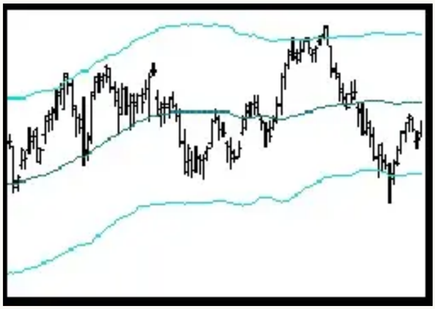

Keltner Bands are standard deviation based channels that often provide support/resistance at the channels or the center line. Keltner Bands are an excellent analytical trading tool to determine support and resistance levels in trending markets and to identify support/resistance levels and breakouts of congestion ranges. A Keltner Band is based on a 45-day moving average (day, week, month, intraday price bar, etc.), and a standard deviation move away from the 45-bar based on the average true range.

Combining Keltner Bands with the timing of cycles, the Bressert Double Stoc, and other technical indicators gives you price objectives for tops and bottoms, and support and resistance levels for trend reversals. The accuracy of top and bottom identification is greatly increased.

The Keltner Bands default to cyan bands above and below price activity.

## Real-Time Detrend

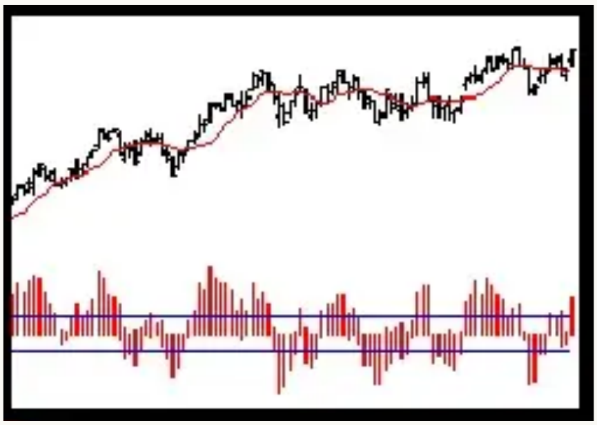

The Real-Time Detrend shows cycle tops and bottoms by subtracting a moving average one-half the length of the trading cycle from the price bar. To see highs and lows for a 20-day cycle, insert 10 into the Average Length Input.

This indicator can be used with the oscillators to help pinpoint cycle bottoms and tops.

The Real-Time Detrend subtracts a moving average one-half the length of the cycle from the price bar.

## Price Forecast

### Fibonacci Retracement

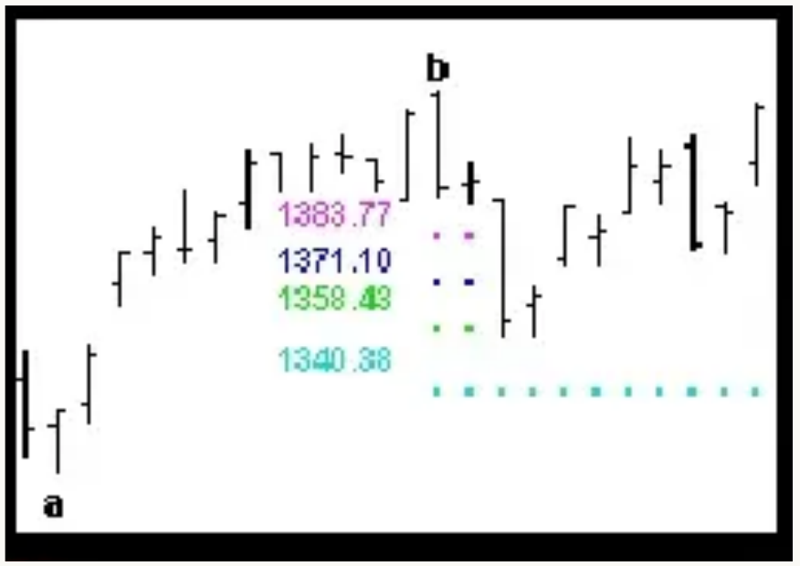

Cycles are based on time. Within the cycle time frame, support and resistance levels frequently coincide with cycle tops and bottoms. Fibonacci Retracements provide predictable support/resistance levels that often develop into cycle turning points.

When prices appear to be consolidating or reversing at a Fibonacci Retracement level, and the Double Stoc oscillator and/or HAL OB/OS indicator is also showing a potential reversal, the market is often making a trading cycle high or low, which should be confirmed by a Mechanical Buy/Sell Signal.

The Fibonacci Retracements plot as horizontal dotted lines in the price panel. Prices can be turned off to make the chart cleaner.

### Fibonacci and Mid-Cycle Pause Price Forecaster

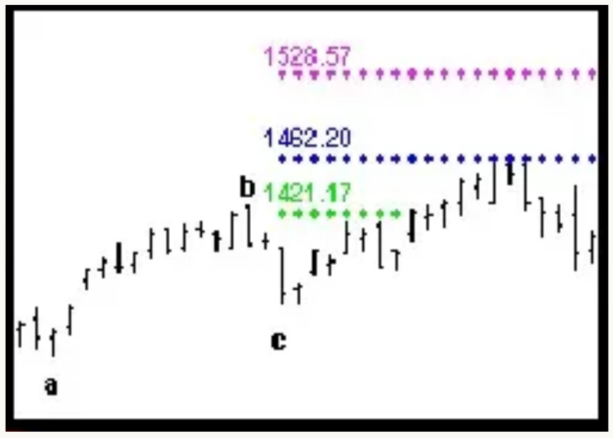

One of the advantages of identifying cycles is the ability to forecast the approximate time periods and price levels of the next cycle top or bottom. Using the previous trading cycle as a base, the MCP Objective forecasts the most probable price level for the next cycle top or bottom to occur.

But prices do not always reach or stop at the next MCP price objective. Often, prices will stop at a .618% move of the MCP; other times, prices will move well beyond the MCP, reaching a 1.618% move from the previous cycle top or bottom. Prices meeting support or resistance at these price levels when in a HAL OB/OS Band, and as the Double Stoc oscillator is at an extreme, or turning to generate a Mechanical Buy/Sell signal, will frequently indicate a trading cycle is topping or bottoming.

The Fibonnaci and MCP Price Forecaster plots three price objectives in the price panel showing price objectives. The green is a .618 price objective; the blue is a MCP price objective; the purple is a 1.618 price objective.

---

## 3 Steps to Successful Trading with ProfitTrader 6.0

*...You CAN Buy Bottoms & Sell Tops!*

Despite all the hype, the only Holy Grail to trading stocks and commodities is to trade with trend — if it is up, buy the dips; if it down, sell the rallies.

**How do you determine trend?**
When trading with cycles, the answer is simple — The trend for the trading cycle is determined by the dominant cycle (trend cycle) in the next longer time frame.

In a daily chart, the trend is determined by the cycle in the weekly chart. In a 5-minute chart, or a 7-minute chart, the trend is determined by the cycle in a 20-minute chart. The chart examples that follow show the weekly trend cycle/daily trading cycle relationship in the S&P500 Index. The same trading concepts and techniques work in all time frames, all markets.

### STEP 1 — Determine the Trading Trend

*The trading trend is set by the dominant cycle in the next longer time frame.*

The weekly cycle in the S&P Index averages 20 weeks from bottom to bottom. The weekly cycle sets the trend for the daily cycle; therefore, the tops and bottoms of the weekly cycle will be trend reversals for the daily trading trend.

The direction of the weekly 10DS oscillator is a prime indicator of the trading trend in the daily chart. A rising oscillator indicates an uptrend; a declining oscillator indicates a downtrend.

Cycle tops and bottoms tend to occur as the blue Bressert Double Stoc (DS) oscillator tops and bottoms, and trend reversals are usually confirmed by the 10DS Mechanical Buy/Sell Signals.

In Chart 1, the weekly cycle tops and bottoms are identified by the up and down arrows. The weekly cycle, and the daily trading trend, are up from cycle bottom A to cycle top B. From cycle top B to cycle bottom C, the weekly cycle and daily trading trend are down.

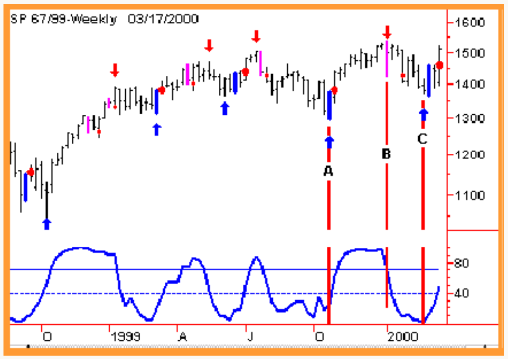

Other indicators also provide a visual picture of trend.

#### Chart 2 — The Dynamic Trend Indicator (DTI) Trailing Stop shows the downtrend

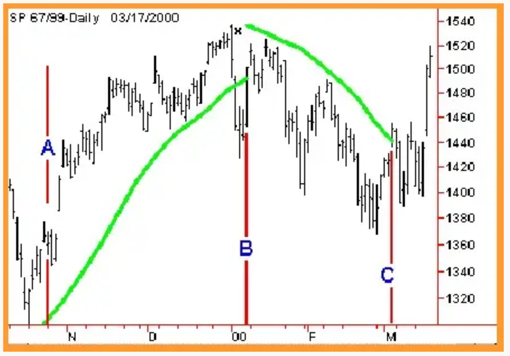

The Dynamic Trend Indicator plots a green weekly Trailing Stop on the daily chart from the weekly cycle bottom at A to show an uptrend. From the weekly cycle high at "X", the green DTI Trailing Stop shows the downtrend.

#### Chart 3 — The EMA Trend Indicator confirms the trading trend after a trend reversal

When the red EMA line rises above the blue EMA line, the trend is up. When it drops below the blue EMA line, the trend is down. This does show trend, but not until well after a trend reversal.

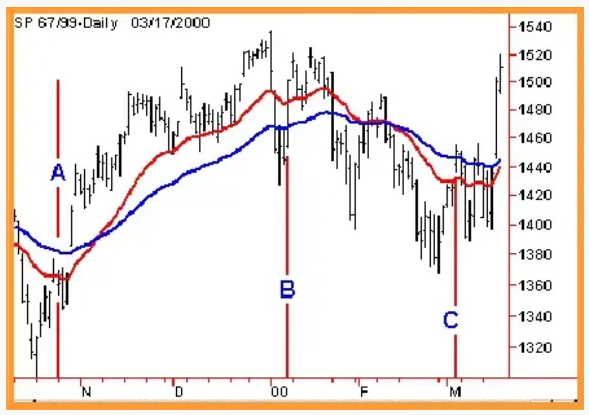

#### Chart 4 — EMA and MA %Diff divergence shows trend reversals

When both the EMA and MA %Diff lines are moving up, the trend is usually up; when both are moving down, the trend is usually down. A divergence in direction often shows trend reversals.

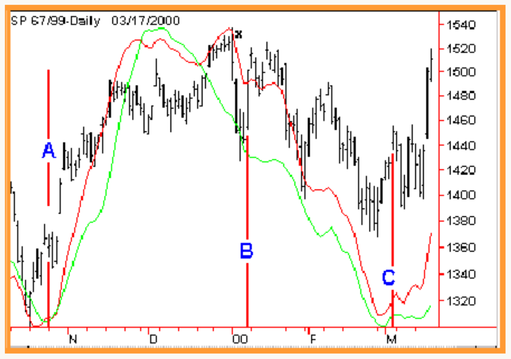

#### Chart 5 — Combining DTI with %Diff indicators

*Chart 5 - When the trend is up, downside retracements to the green DTI line can often be bought when the blue Double Stoc oscillator is oversold; when the trend is down, upside retracements to the green DTI line can often be sold as the Bressert Double Stoc oscillator is at a high level indicating the market is over bought.*

Chart 5 combines the EMA %Diff and MA %Diff with the DTI Trailing Stop. The combination of the two shows a fast up trend from the weekly cycle bottom. (A marks the Friday of the blue weekly buy setup bar in Chart 1; B, the Friday of the weekly purple sell setup bar; C, the Friday of the blue weekly buy setup bar). The green DTI lines also show trend. When the trend is up, downside retracements to the green Dynamic Trend Indicator line can often be bought when the blue Double Stoc oscillator is oversold; when the trend is down, upside retracements to the green DTI line can often be sold as the Bressert Double Stoc oscillator indicates the market is overbought.

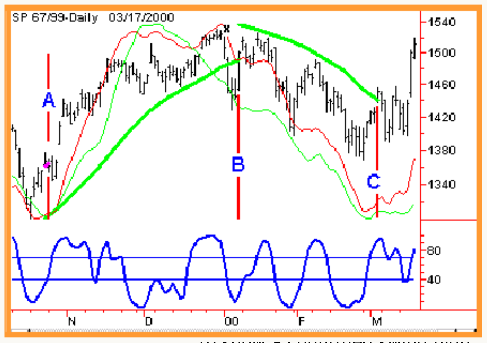

### STEP 2 — Use Mechanical Buy/Sell Signals to Enter the Market

*The ProfitTrader Mechanical Buy/Sell signals are generally 70-90% accurate in their identification of cycle bottoms and tops.*

When the trend is up, Mechanical Buy/Sell Signals in the Bressert Double Stochastic (blue setup bar; red entry dot) are taken at cycle bottoms, and sell signals (purple setup bar; red entry dot) are ignored or used to take profits. When the trend is down, Mechanical Sell Signals are taken at cycle tops and the Buy Signals ignored or used to lock in profits. When the weekly oscillator is moving up or is flat at a high level, the trend is up and we can buy the daily oscillator bottoms. When the weekly oscillator is moving down or is flat at a low level, we can sell the daily oscillator tops as the trading trend is down.

**Chart 6** - When the weekly Double Stoc is rising, or flat at a high level, the trend is up; when it is declining or flat at a low level, the trend is down.

Plotting the weekly Double Stoc in the same panel as the daily oscillator gives us a visual representation of trend and trend reversals. 

Chart 6 combines the daily Double Stoc with the weekly Double Stoc to show trend. The light blue oscillator line is the daily Double Stoc. The dark blue is the weekly Double Stoc. (Lines ABC are the same lines as in Chart 1. Line A is the Friday of the uptrend reversal week; line B is the Friday of the downtrend reversal week; line C shows the Friday of the uptrend reversal week.)

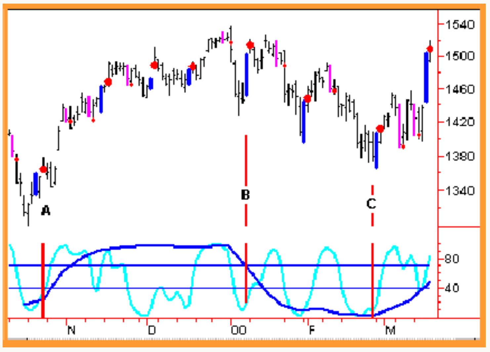

When the weekly oscillator is moving up, or at a high level, the Buy Signals generated by the daily oscillator (blue setup bar, red entry dot) should be taken; but in an uptrend, the Sell Signals (purple setup bar, red entry dot) should be ignored or used to take profits.

When the weekly oscillator is moving down, the Sell Signals should be used to short the market as the daily oscillator turns down generating the purple setup bar and red entry dot; but in a downtrend, the Buy Signals are ignored or used to take profits.

With the visual picture of trend shown by the weekly oscillator, our confidence level for trading in the direction of trend is greatly increased.

> PT Users: When using the PT Trailing Stops, the Sell Signals can be turned off in a rising market; in a declining market, the Buy Signals can be turned off.

#### Chart 7 — Buying in an uptrend

When a market is in an uptrend and prices retrace back towards the green Dynamic Trend Indicator line, trading cycle bottoms can be bought with the oscillator generated Mechanical Buy Signals.

Chart 7 shows an uptrend with oscillator generated buy setup/entry bars. The blue buy setup bars are generated by the daily blue Double Stoc oscillator. The red price bars are generated by the red BLine oscillator not shown on this chart. The green Dynamic Trend Indicator line shows a strong uptrend from the trend reversal at the bottom of the chart. With the green DTI line rising, and the weekly oscillator bullish, the Mechanical Buy Signals at 1 and 2 are high probability Buy Signals with small dollar risk (entry dot to price low), and high profit potential. As prices approach the green DTI line, the market could have been bought with the Mechanical Buy Signals at 1 and 2.

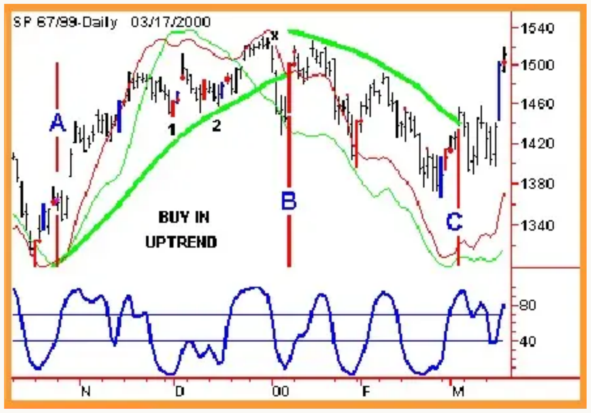

#### Chart 8 — Selling in a downtrend

In a downtrend, when prices retrace back up towards the green Dynamic Trend Indicator, the cycle highs can be sold with the oscillator generated Mechanical Sell Signals.

Chart 8 shows how the short side would be traded with the EMA %Diff and MA %Diff showing a strong downtrend, and the green Dynamic Trend Indicator line also showing a downtrend. The weekly oscillator in Chart 6 (not shown in this chart) would also be showing a down market. As the daily Double Stoc oscillator rises to a high level, and prices approach the green DTI downtrend line, the oscillators turned down to generate Sell Signals at 4 and 5. The earlier Sell Signal 3 at the cycle top was a high risk trend reversal Signal, not a trend following signal. But after prices dropped below the December lows in reversal week B to indicate a trend reversal, the lower cycle highs at 4 and 5 were low risk Sell Signals to be traded in the direction of trend. As the oscillators rise to a high level and prices test the green DTI downtrend line, sell signals aregenerated at 4 and 5.

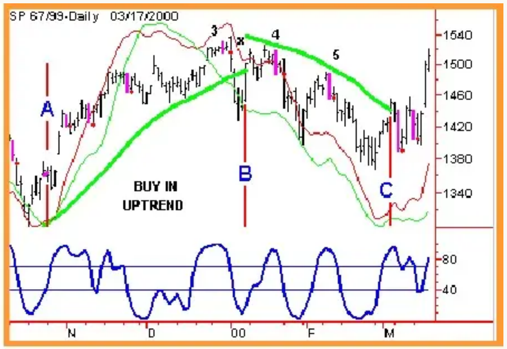

### STEP 3 — Follow the Market with Trailing Stops to Lock in a Profit

Trailing stops take much of the judgment and stress out of trading the market. Rather than evaluate your position as each price bar forms, you can simply follow the market with a mechanical trailing stop. But trailing stops are a two-edged sword. If too tight, they can stop you out early in the trade, leaving a lot of money on the table; if too wide, you can give back big profits before being stopped out.

**Chart 9** - Using Trailing Stops that closely follow the market,
yet give elbow room to move, takes much of the judgment
and stress out of trading. The protective stop for each price
bar is automatically calculated on the close of the previous
bar.

Chart 9 illustrates the use of the daily *Short-Term (ST) and Long-
Term (LT)* Trailing Stops.

The red ST Trailing Stop from the highs at 4 and 5 is designed to
closely follow prices down and stop out following a trading cycle
bottom (or closely follow prices up to a top in a rising market).

The green LT Trailing Stop is designed to give prices more leeway to
keep us in the market for a more sizeable move, often carrying into a
second trading cycle or weekly cycle bottom.

Using two trailing stops also highlights the advantage of trading in
multiple contracts. All too often with one contract it is an either/ or
situation that puts us in an uncomfortable bind wanting to lock in a
profit but worried that money will be left on the table.

## The "3 Steps to Successful Trading" are improved and enhanced by the use of other indicators

- **The Bressert BLine** is another indicator that generates Mechanical Buy and Sell Signals at cycle tops and bottoms.

- **The HAL OB/OS Indicator** shows visually when the market is overbought or oversold, and cycle tops and bottoms are often made within its bands. The HAL OB/OS indicator has its own Mechanical Buy and Sell Signals designed to enter on the long side within the red bands; on the short side within the green bands.

- **The Multi-bar Trailing Stop** is a powerful indicator for allowing your profits to run. It can also be used to confirm entries.

- **The Cycle Length Indicator** is a spectral analysis program that identifies the dominant trading cycle in any time frame, any market. Using the Cycle Length determined by this indicator, Timing Bands to forecast future tops and bottoms can be plotted on the chart and the dates/times reviewed in the Expert Commentary. When prices enter the Timing Bands, Mechanical Buy and Sell Signals are used to trade the markets and/or to identify the cycle highs and lows occurring within the Timing Bands. Trading within the Time Bands increases the probability of successful trading.

- **Fibonacci Retracements** are used to bring price into the cycle equation as are the Fibonacci and Mid-Cycle Pause Price Objectives generated by the **Fibonacci and MCP Price Forecaster**.

- **The Real-Time Detrend** can be used to give another view of cycle tops and bottoms occurring as the market moves.

---

## WB Swing Trades Program

All markets move in cycles — intraday, daily, weekly, monthly and yearly cycles. Every intraday time frame has its own dominant cycle, but one thing that all cycles have in common is they are composed of **Price Swings**. Swings are the "building blocks" of all markets, and knowing the characteristics of Swings opens the door to trend identification and low-risk trading. Walter's **WB Swing Trades Program™** will greatly improve your ability to recognize and trade cycle tops and bottoms.

### Identifying Swing Highs and Swing Lows

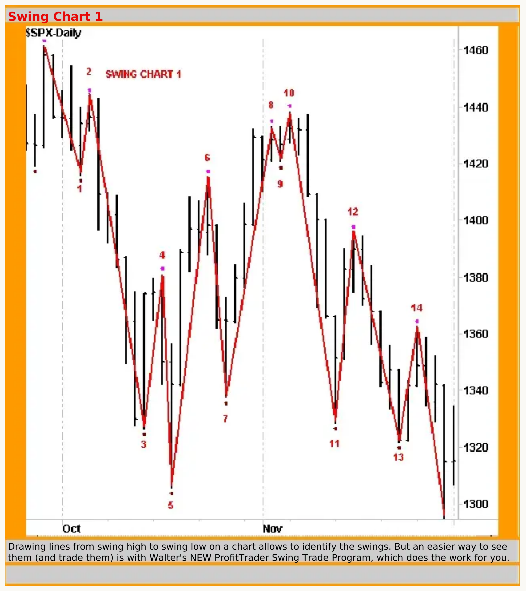

**Swing Chart 1** connects the swing lows and swing highs with a red line. Some swings have large amplitude; others, small amplitude.

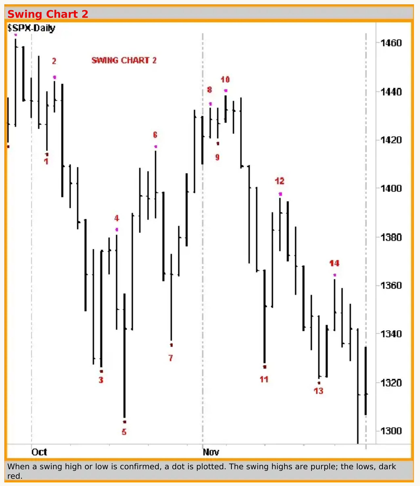

**Swing Chart 2** identifies the same swing highs and lows without the lines. The WB Swing Trades Program identifies the swing tops and bottoms with a dot. Purple dots = swing highs; dark red dots = swing lows.

### Use Swings to Determine Trend

Swing highs and lows show the trend for the time frame charted, and provide
guidelines for a continued trend, or a trend reversal..

*Uptrend*

Prices rising above a previous swing high, and remaining above a previous swing
low are an indicator of an uptrend.

- Swing #5 is a swing low, and the move from #5 to #6 exceeds a previous swing high, which shows enough buying energy to begin an uptrend.
- When prices drop from the swing high at #6 to the swing low at #7, the #7 swing low remains above the swing low at #5 to indicate a continued uptrend and potential rise above swing high #6.
- Higher swing low #5 is followed by a rise above swing high #6 to make a swing high at #8, clearly showing an uptrend.

*Uptrends tend to have higher swing highs and higher swing lows.*

*Downtrend*

Prices failing to exceed a previous swing high and dropping below a previous
swing low is a strong indicator of a downtrend.

- Following the swing high at #10, prices dropped to the swing low at #11, which was below the swing lows at #9 and #7, indicating the next swing high is likely to be below swing high #10.
- The market then moved up to swing low #12, topping below the swing high at #10 to show a downtrend.

*Downtrends tend is to have lower swing lows and lower swing highs.*

### How Are Swing Highs and Lows Identified With The WB Swing Trades Program ?

A swing high is identified when prices drop below a colored rising price bar to show a change in momentum.

- As soon as prices drop below price bar #10, a purple dot is plotted above the high to show it is a swing high.
- Prices continue to move lower into the swing bottom at #11, and when the high of the colored price bar is exceeded, a swing low is identified and a dark red dot is plotted below the swing low.
- Prices then move up to swing high #12, which is identified by a drop below the low of the colored price bar at #12, and a purple dot is plotted to show a confirmed swing high... and so on.

### How Can You Use Swings to Trade the Market?

With the **WB Swing Trades Program™**, you can see the swings in all markets, all time frames, and you can easily identify and trade overbought and oversold swing highs and lows.

A Swing is an energy reversal point. A larger swing reversal point is a cycle turning point, and cycles are comprised of sub-cycles, that also show up as swings. Every cycle top is a swing high, and every cycle bottom is a swing low, but as you see in Swing Chart 2, not every swing high or swing low is a cycle high or low.

Swings can be used to identify reversal points at cycle tops and bottoms. A swing high or low offering low dollar risk occurs at every cycle top and at every cycle bottom. Using oscillators, momentum indicators and cycle timing, the swings that form cycle tops and bottoms can be isolated and traded.

### Trend Reversal Swings/ Trend Following Swngs

Not all swings are equal. Swings that are overbought (OB) as measured by oscillators or momentum indicators are much more likely to produce a sizable downmove than a swing that is not overbought (OB). The same goes for bottoms. Swings that are oversold (OS) are much more likely to be followed by a sizable upmove. The two types of swings to trade are trend reversal swings, and trend following swings.

### What is a trend reversal swing?

In Swing Chart 3 you can see trend reversal swings at A, B, C, and D. These
reversal points had two or more higher swing highs and/or higher swing lows,
before being followed by lower swing lows and lower swing highs.

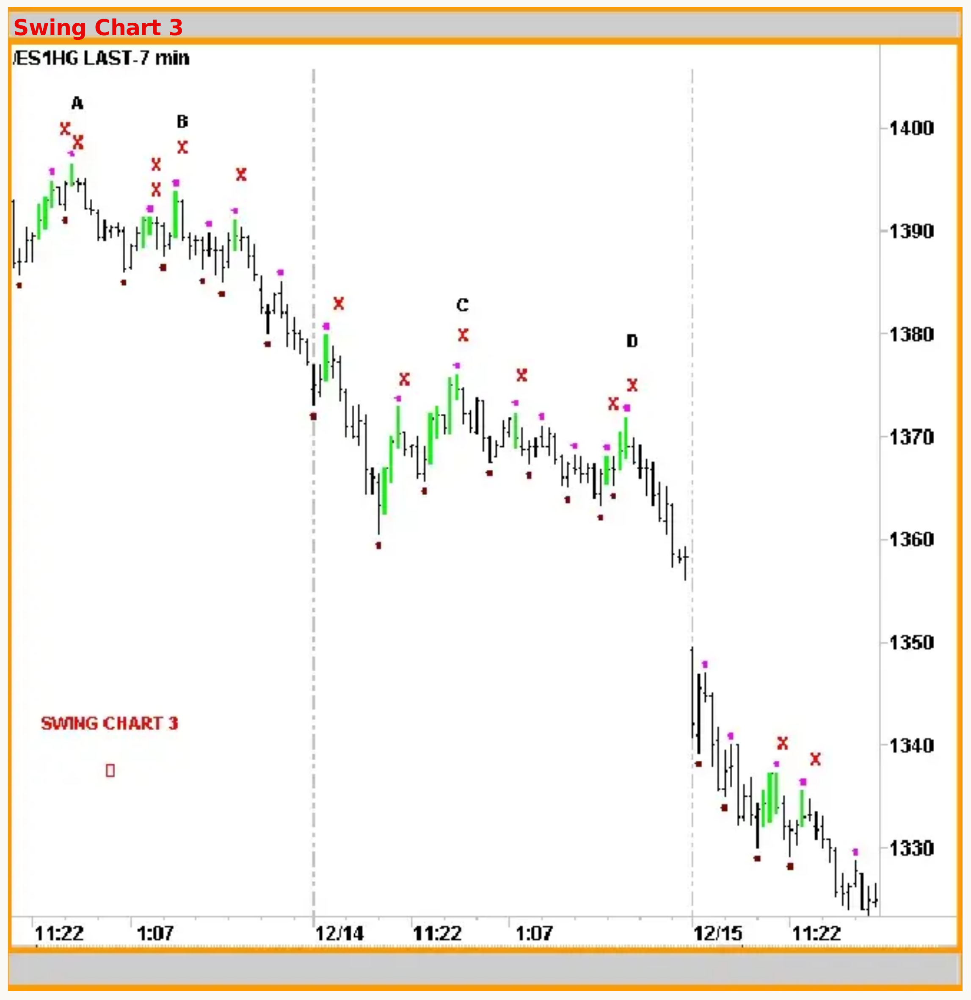

### What is a trend following swing?

The other swing highs indicated by the dots are continuation swings. When a swing high forms below a previous swing high it is usually followed by lower prices in a downside trend continuation move. On the upside, when a swing low is followed by a higher swing high and a higher swing low, the higher swing low is a continuation swing low that is likely to be followed by a rise above the previous swing high.

A real advantage of trading swings is that the dollar risk is small. The risk is the range of the price bar that made the swing high. The X's show the price bars that took out the low of the swing high bar to confirm that bar as the swing high.

### WB Swing Trades Trading Strategies

**Swing Chart 4** shows how continuation swing lows can be used to buy a market
with a high degree of reliability and low dollar risk.

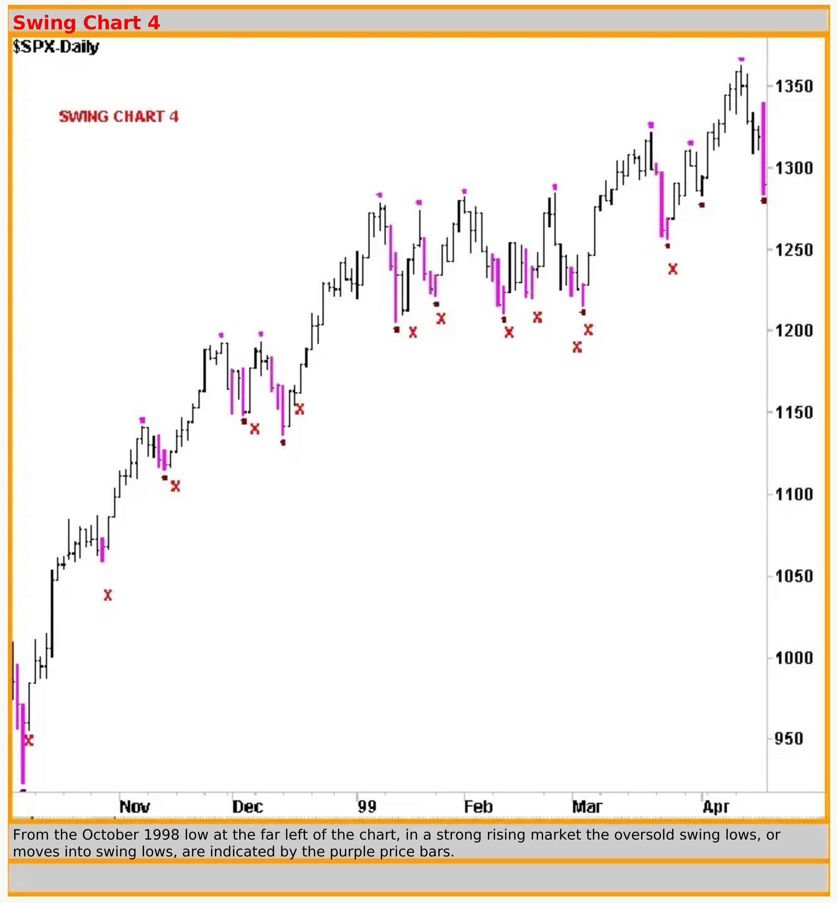

In an up market, when the high of a declining purple price bar is exceeded to form a swing low, the market frequently rises above the previous swing high. A swing low followed by a price rise that does not t ake out a previous swing high generates a stop out level when prices drop below the rising colored price bar. When prices drop below the low of that rising price bar, close out your long position.

This strategy of trading continuation swings allows multiple entries in up trending and downtrending markets, with low dollar risk and high profit potential, as at the October 1998 low and from the March 1999 low.

### Combining a Trend Indicator with Swing Identification

**Swing Chart 5** shows how to increase the odds of success even more by using a trend indicator and taking only those trades in the direction of the trend indicator. This tends to eliminate trend reversals, but puts you in the highest profitability swing patterns of tr end following . The red bars indicate a downtrend; the green bars, an uptrend. I t takes two successive bars to turn the trend indicator from bullish to bearish; from bearish to bullish.

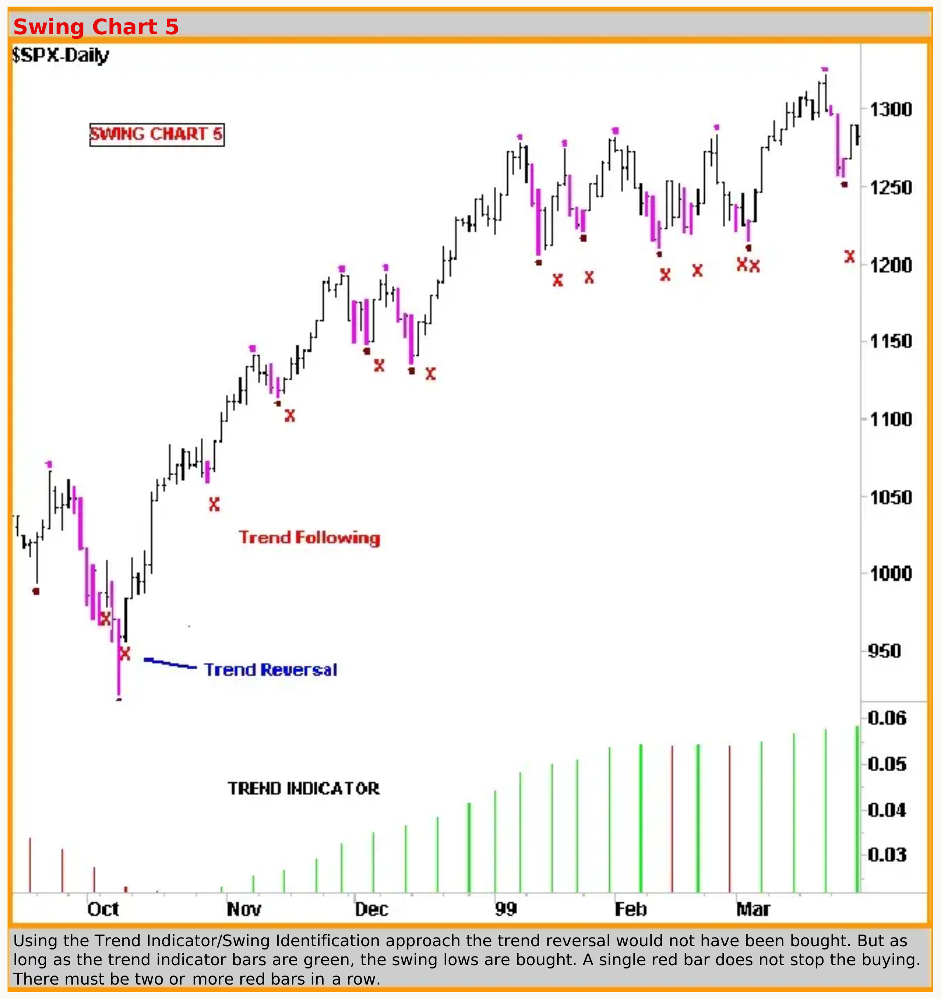

In this upmove you would have had a relatively small dollar risk at most swing bottoms because you place a buy stop above the high of each colored declining price bar, and when the high is exceeded to form a swing low you are long. You then place a protective sell stop below the swing low. Yes, you would have been stopped out once or twice, but the majority of the trades would have been profitable.

In the **WB Swing Trades Program™**, the overbought/ oversold levels for the swings are based on the powerful Bressert Double Stochastic. The trend indicator is based on the EMA %Diff. You can modify the parameters of the overbought/oversold levels for the swing and the composition of the trend indicator.

### What Can the WB Swing Trades Program Do For You?

- Generate low dollar risk entry signals
- Identify trend following and trend reversal signals
- Show trend direction
- Combine with the ProfitTrader methodology to generate low risk, high probability trades at cycle bottoms & cycle tops

## ProfitTrader 6.0 Racks Up 66 Points in S&P Roller Coaster Ride

Price activity on 5/24 in the June S&P500 7-minute bar chart illustrates the power and tradability of the ProfitTrader 6.0 indicators.

Our analysis and trading is based on a 20-minute chart (not shown) to set the trend for trading the 7-minute chart, which usually has a 16-bar trading cycle as measured from bottom-to-bottom.

First, let's look at the indicators from the bottom up. The 5 and 10DS are in the oscillator panel along with a Timing Band calculated from the first trading cycle low indicated by the blue up arrow.

This Timing Band is point 'n click, which means no date/time has to be entered by hand. Above the oscillators is the HAL OB/OS indicator. The green dots show when the market is overbought, often at a cycle top; the red dots, when the market is oversold, often at a cycle bottom. Notice the correlation between the HAL OB/ OS indicator and the tradable tops and bottoms.

The blue buy setup bars and buy signals are also generated by the blue 10DS; the purple sell setup bars and sell signals are generated by the Double Stoc. The white sell setup bar is generated by a new indicater that sometimes generates buy/ sell setup bars before the Double Stoc, at other times confirms the Double Stoc, and has buy/sell signals at tops and bottoms missed by the Double Stoc.

The red lines in the price panel are the Short-term Trailing Stop; the blue lines, the Long-term Trailing stop.

Let's review the market from the beginning of the day. Our data server had a glitch and missed the first few bars of the day, but prices dropped into a trading cycle low as indicated by the blue Double Stoc indicator. Approximately 70% of all cycle bottoms occur when a Double Stoc is bottoming. This bottom was not tradable, but used as an "anchor" to anticipate the time period for the next cycle high that occurred when prices were in the green toppingTiming Band plotted in the oscillator panel, and also in the green HAL OB/OS Band.

The 18-bar cycle in the 20- minute chart was moving down at the time, and the trading cycle top of the 16-bar cycle in the 7-minute chart offered a relatively low-risk sell signal. A drop below the white setup bar would confirm the trading cycle top. With a sell stop placed below the setup bar you would have gone short at approximately 1390.30.

From the cycle high the red Short-Term Trail Line follows prices down and is stopped out at A for a disappointing 2 point profit. However, the Long-term Trail, followed prices down, and at X everything was right for a 16-bar cycle bottom. Prices were in the red HAL OB/OS bottoming band, and also in the red Timing Band in the oscillator panel. The oscillator turned up generating a blue buy setup bar, but the market never rose above the high of the setup bar. Nor was the Long-term Trail stop significantly penetrated.

Here's something to write down -- when a trading cycle bottom is due, as indicated by Time Bands and oversold oscillators, and the market does no t rise, but moves lower, a waterfall decline can often occur into a longer term cycle bottom. I n this down move the cycle extended into the bottom of the 18-bar cycle in the 20-minute chart.

The Long-term Trail followed the market down to the cycle bottom and stopped out at 1370.10 for a 20 point profit as the setup bar was forming. Confirming this low as a significant bottom was the divergence in the 10D (prices dropped lower than the previous price low as the oscillator bottomed at a higher level than the previous price low).

The HAL OB/ OS indicator also showed the market as oversold with two red two dots. But buying new lows is often expensive,so we passed on the buy signal generated by a rise above the blue buy setup bar.

Prices moved higher for one bar, then lower to form a swing low and generate a 2-bar reversal -- which can be a very good stop/entry and is plotted in the new PT Multi-Bar stop indicator. This provided a low-risk buy coming out of the best possible setup, a sharp dive into a low, a move up, a retest of the low to form a swing bottom, and then an upmove. Unfortunately our oscillator based B/S signals seldom occur in this pattern. The Multi-Bar Stop remedies this.

Once long, the Trailing Stop is all important. If it is too tight it will stop you out with only a small profit.

From the swing low -- not the price low -- the Short-term and Long-term Trail Stops were plotted using point 'n click ( not date/time). The initial protective was placed below the swing low, and the Trail Stops were left at default values. The red Short-term Stop snaked its way up closely below the rising prices to stop out at 1392.50 with a 17 point profit. Prices then dropped into a 16-bar cycle bottom that was a small swing low.

The cyan Long-term Trail gave prices more room for fluctuation and followed prices up until the end of the day. Rather than wait for prices to stop out on the trailing stop the position was liquidated when prices dropped below the sell setup bar at 1402.75 for a 27 point profit.

The green and red dots in the price bars after the move began are 2- bar reversals. The green dot is a downside 2-bar reversal; the red dot, an upside 2-bar reversal. These reversals occur in the normal ebb and flow of the market. They become significant to our trading only when a cycle top or bottom is due.

These Trailing Stops make it easy to trade multi-contract positions. Watching the market throughout the day without these trailing stops it is necessary to make decisions to stay in a position or to get out with each price bar, and the fear of giving back a lot of money on a retracement often results in getting out too soon, then grinding your teeth as the market continues higher. With these trailing stops the need to make decisions with the formation of every price bar is gone... and the pressure of trading is greatly reduced.

Sixty-six points were locked in by entering with the high probability buy/sell entry signals, then having the patience (and confidence) to follow the old and profitable rule of "Let your profits run".

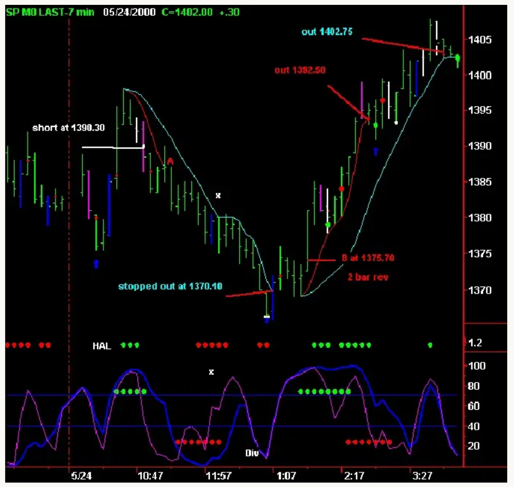

## FAQ: Q&A with Walter Bressert on ProfitTrader

### Is there a trial version or demo of ProfitTrader?

We don't have a demo version, per se. When you purchase the program, you have an unconditional, 30-day trial period that begins when you install the program. In the highly unlikely event you decide you want to return it, upon receipt of the program and manual, we issue a refund minus a 10% refund fee to cover merchant account in/out charges. If you pay by check, you receive a full refund.

### Is ProfitTrader a stand alone program?

No. It requires one of the Omega Research charting platforms. If it were a stand alone program, it would cost several thousand dollars.

### What data sources can be used by ProfitTrader?

All data sources that work with the Omega Research charting platforms.

### What are the system requirements for using ProfitTrader?

The same as those for the Omega Research charting platforms.

### How is ProfitTrader affiliated with CycleTrader?

Although both programs reflect my trading methodology, they are two separate programs marketed by two separate companies. I developed CycleTrader in 1994 and lost my copyrights to my ex-business partner in early 1998. Since that time, I have not been associated with CycleTrader in any manner.

In 1999, I developed the ProfitTrader software program. My goal was to improve the accuracy and ease of use of the indicators used in my oscillator/cycle timing methodology. About 50% of our buyers are previous CycleTrader users. Almost without exception they agree that ProfitTrader is indeed more user friendly and accurate in picking cycle tops and bottoms.

### I am currently using Cycle Trader 4.0 and have been notified that Cycle Trader 5.0 (upgrade) is now available. Is Profit Trader 6.0 the same as Cycle Trader 5.0? What is the upgrade cost?

ProfitTrader is different than CycleTrader. Though it has basically the same oscillators and buy/sell signals, the tools to identify and trade cycle bottoms and tops are more powerful. For example:

- The HAL OB/OS indicator visually identifies the most probable time periods for cycle tops and bottoms to occur
- The point 'n click Short-term Trailing Stop is designed to lock in a profit when the trading cycle reverses
- The point 'n click Long-term Trailing Stop is designed to remain in the market for the bigger and more profitable moves than the trading cycle
- The Dynamic Trend Direction indicator shows the trading trend so you can buy bottoms and sell tops in the direction of trend
- The point 'n click Multi-bar Trail is an excellent trailing stop, and also functions as a confirming indicator to trade cycle tops and bottoms
- The Timing Bands are point 'n click, eliminating the time consuming task of entering date and time for each cycle bottom and top. These timing bands are also more accurate in forecasting future tops and bottoms and in identifying cycle tops and bottoms as they occur.
- The EMA indicator shows the longer-term trend in any time frame
- The EMA %Diff indicator shows the trading trend
- Point 'n click Fibonacci price levels plot on the screen for specific cycles

### Does your software work with markets other than S&P intraday?

Yes — all markets, all time frames.

### Can ProfitTrader be back-tested?

*(Answer not included in source material)*

---

*Walter Bressert Futures OnLine*
*www.walterbressert.com*
