# ProfitTrader™ for MetaStock™ Manual

*Walter Bressert's ProfitTrader™ for MetaStock™*
*...the next generation of cycle trading software*

Walter Bressert, Inc.
http://www.walterbressert.com

Copyright © Walter Bressert, Inc. All rights reserved.

## ProfitTrader™ for MetaStock™ End-of-Day and Intra Versions

The EOD Indicators and Templates plot on monthly, weekly and daily data only; the Intra Indicators and Templates plot on all time frames — monthly, weekly, daily, intraday and tick.

The chart examples in this manual are plotted using EOD Indicators and Templates, except for the intraday Timing Bands.

### Support

- Technical Support: metasupport@walterbressert.com
- Methodology Support: question@walterbressert.com (directed to Walter Bressert)

### Installation Instructions

ProfitTrader is designed to work for 30 days after installation. The initial program, sold with a 30-day MBG, contains a date restriction. Before the program expires, at the end of your 30-day trial (whichever comes first) you will receive your permanent program key, which removes the date restiction, via email. If you hav not received the key from us and are having indicator problems, it is most probably because your program has expired.

## ProfitTrader™ for MetaStock™ Overview

**ProfitTrader™ for MetaStock™** is a powerful group of trading and analysis indicators based upon the market-proven concept of "trade with the trend". If the trend is up, buy the dips; if the trend is down, sell the rallies. What the trend was is relatively easy to see on the chart, what the trend will be is often another question. The ProfitTrader indicators show the direction of the trading trend and anticipate trend reversals.

The use of cycles is one of the most powerful analytical tools for identifying trends and trend reversals. Once a cycle has bottomed, the trend will be up untill the cycle has topped, once a cycle has topped, the trend will be down untill the cycle bottoms. How long the trend will be up or down depends upon the length of the cycle.

All markets — stocks, futures, and currencies — move in time cycles.
Each market has an individual cycle profile, which consists of dominant cycles in themultiple time frames - monthly, weekly,daily, and intraday - that visibly and consistently affect prices. Awareness of the longer-term cycles helpsanticipate trends and trend reversals. Knowledge of the shorter-term cycles will help you buy bottoms and sell tops in the direction of trend and at trend reversals.

- Longer-term cycles determine trend for shorter-term cycles.
- Longer-term cycle highs/lows are trend reversals.
- Shorter-term cycles are used for timing market entry and exit.

Cycle lengths for the stock indices are available on Page 52. Cycle lengths for individual futures or stocks are available by request for up to five market per request.

The ProfitTrader Indicators are unique group of oscillators and technical analysis tools that --

- Show trend direction
- Identify cycle tops and bottoms
- Generate Mechanical Buy/Sell trading signals at cycle tops and bottoms
- Forecast high-probability time periods for future tops and bottoms

## 5 Steps to Profitable Trading

Our trading approach is to enter a market in the direction of trend, buying cycle bottoms with mechanical trading signals when the trend is up, and selling cycle tops when the trend is down. Also, at anticipated longer-term cycle tops and bottoms, trade trend reversals. All trade entries should have protective stops.

Step 1) Determine the direction of the trading trend. The direction of the longer-term cycles set the trading trend for the shorter-term cycle. For example,the direction of the cycle in the weekly chart sets the trading trend for the cycle in the daily chart. Also, the direction of the weekly oscillator will often show the trading trend for a daily chart. And, the EMA Trend Indicator and EMA %Diff indicators also indicate trend direction.

Step 2) Anticipate the most probable time periods for cycles to top/bottom. These time periods are forecasted by the Timing Bands and can be used to take profits, and to trade reversals at cycle tops and bottoms with the mechanical buy/sell signals.

Step 3) In the expected time periods for cycles to top or bottom, watch for indications the market is overbought/oversold, based oscillators, and support or resistance levels such as old highs/lows, moving averages, and Fibonacci retracements or extension levels.

Step 4) Based on a combination of the above, use the mechanical trading signal(s) to indicate a high probability cycle tops or bottoms, and enter the market with an initial protective stop above the cycle high if selling, or below the cycle low if buying.

Step 5) Use trailing stops above swing highs and below swing lows to keep you in trades for the longer-term moves. An effective tighter trailing stop is a two-price bar reversal that stops you out whenever the high or low of the two previous price bars are taken out (highs if short, lows if long). Try it... it works.

## Table of Contents

- **Section I** — Profitable Trading with the PT Oscillators and Mechanical Buy/Sell Signals (p. 1)
  Twelve ProfitTrader™ for MetaStock™ indicators have been combined into eight templates with sub-templates to show how the ProfitTrader™ indicators combine to analyze and trade market based upon timing, trend, and Mechanical Buy/Sell Signals.
- **Section II** — Timing Bands (p. 28)
  An overwiev of Cycle Analysis and Forecasting using ProfitTrader™ Timing Band Indicators and Templates.
- **Section III** — Explorations (p. 53)
  ProfitTrader™ for MetaStock™ has 26 Explorations that will help you evaluate and trade securities, mutual funds and futurescontracts.
- **Section IV** — Reference (p. 57)
  Each ProfitTrader™ indicator is shown and explained with Styles and Inputs.

## ProfitTrader™ for MetaStock™ Templates

The MetaStock program does not allow control of the indicator styles and colors, and a consistent style of color and thickness cannot be set for individual indicators to plot the same on every chart.

Therefore, ProfitTrader™ for MetaStock™ makes extensive use of the Template feature to maintain the same identifiable styles for individual indicators and combinations of indicators.

**A word about Templates --**
**To Apply a Template:**

1. Create a chart with data
2. Right click in a blank space in the price chart
3. Choose "Apply Template" and locate the WB Templates Group
4. MetaStock will create a duplicate of the original chart and apply the Template to that duplicate
5. Delete the original chart and use the new chart

**NOTE:** A Template "erases" all indicators on the original chart, so do not try to apply more than one Template to a chart.

---

## Section I: Profitable Trading with the PT Oscillators and Mechanical Buy/Sell Signals

**Template 1 — DoubleStoc10 Oscillator with Mechanical Buy/Sell Signals** (p. 3)
The Double Stochastic oscillator (DBS10) is a powerful trading tool and trend indicator that generates high-probability Mechanical Buy/Sell Signals that also serve as identifiers of cycle bottoms and tops. The accuracy factor of the Bressert DoubleStoc10 Buy and Sell Signals is approximately 70%.

**Template 2 — DBS5 Oscillator With Mechanical Buy/Sell Signals** (p. 6)
The Bressert DoubleStoc 5 tends to show the smaller cycles and generates Buy and Sell Signals that are up to 90% accurate for the shorter-term cycles. It also interacts with the DoubleStoc10 to form Buy and Sell Patterns.

**Template 3 — BLine Oscillator and Buy/Sell Signals** (p. 7)
The Bressert BLine oscillator generates Buy/Sell Signals that are even more accurate than the Bressert DoubleStoc in identifying cycle tops and bottoms, 80% and higher depending upon the market and time frame. The BLine Buy/Sell Signals combine well with the DBS10 Buy/Sell Signals, often confirming a Double Stoc Signal with a BLine Signal in the following bar. A combined BLine/DBS10 Signal often occurs at significant tops and bottoms.

**Template 4 — DBS5 and 10 with Buy/Sell Setup Signals and Oscillator Patterns** (p. 9)
The DBS10 and DBS5 are powerful stand-alone oscillators that generate high-probability Mechanical Buy/Sell Signals. When the DBS10 and DBS5 Buy/Sell Signals and Trading Patterns are combined, they become even more powerful and are frequently followed by substantial moves, most often in the direction of trend.

**Template 5 — All (4) Buy/Sell Signals With the BLine Oscillator** (p. 14)
Four Mechanical Buy and Sell Signals are combined into one Template. The BLine Buy/Sell Signals give the strongest identification of cycle tops, bottoms and trend reversals, but the combination of two, three and four Trading Signals are often followed by significant moves in the direction of the signal.

**Template 6 — Trend Direction** (p. 16)
The most consistent path to profits is to trade in the direction of trend... and anticipate trend reversals. The EMA Trend Indicator is an excellent tool for determination of the trading trend, and when combined with the EMA %Diff and MA %Diff Indicators, the odds of catching trend reversals is greatly increased... by watching the direction of trend relative to the %Diff and the EMA lines, you can trade high-probability Oscillator Patterns based on the interaction of the DBS5 and the DBS10 in Templates 1-4.

**Template 6a — Trend Direction and Bull/Bear Markets** (p. 18)
The BLine Oscillator can be an indicator of the beginnings and/or endings of both bull and bear markets, especially when combined with the EMA%Diff and EMA Trend Indicator lines. The BLine Buy/Sell Signals are often followed by much more sizeable moves than the 5 and 10 DoubleStoc Oscillators, and by watching the direction of the %Diff and the EMA Lines relative to the BLine Buy/Sell Signals, you can often anticipate trend reversals.

**Template 7 — Keltner Bands and Buy/Sell Signals** (p. 19)
Keltner Bands are an excellent and powerful analytical trading tool to anticipate Support and Resistance levels in trending moves, and to also identify Support/Resistance levels of Congestion Ranges.

**Template 8 — Detrend Template Combines Trend With B-S Signals** (p. 22)
The PT Detrend Template combines the EMA Trend Indicator, %Diff lines, and Buy/Sell Signals to identify high probability trades that often occur at cycle tops and bottoms in a trending market.

**Template 9** (p. 35)
The #9 Templates include Timing Bands and are explained in Section II.

**Template 10** (p. 25)
This template plots the three oscillators, the four Buy/Sell Signals, Trend Indicators, %Diff and Keltner Bands on a single chart. Once you are familiar with the individual Buy/Sell Signals and the oscillators and Trend Indicators, this chart is the one you should use to trade. It shows the individual Buy/Sell Signals, and allows you to see the combinations of two, three and four signals occurring at once, plus the 1-2 Buy/Sell Signals.

**Expert Advisor** (p. 27)
For the Buy/Sell signals the Expert Advisor plots arrows on the Buy/Sell Setup Bars and has commentary on entry prices and protective stops. In the Timing Bands, it shows the most probable time periods for future cycle tops and bottoms (See Page 44).

### The Bressert DoubleStoc Oscillator

The Double Stochastic oscillator (DBS10), shown in Template 1, is a powerful trading tool and trend indicator generating high-probability Mechanical Buy/Sell Signals that also serve as identifiers of cycle bottoms and tops.

When trading any market, it is extremely important to be aware of cycle length and the expected time periods for cycle tops and bottoms. The ProfitTrader™ oscillators generate Mechanical Buy and Sell Signals that tend to occur at cycle tops and bottoms, and there is an accuracy factor to consider when using the Mechanical Buy and Sell Signals to both trade and identify cycle tops and bottoms.

The DBS10 tends to make highs and lows at cycle tops and bottoms of an average 17-23 day (or week) trading cycle (price bars for intraday). This cycle length, measured from bottom-to-bottom, occurs in most time frames — weekly, daily, one-half day, quarter-day, hourly, 20-minute; therefore, we often refer to cycle lengths in "price bars".

The shorter-term DBS5 tends to make highs and lows at cycle tops and bottoms of an average 8-12 day (or price bars) one-half trading cycle, and often combinations with the DBS10 to generate Buy/Sell Signals at cycle tops and bottoms.

The accuracy factor of the Bressert DoubleStoc10 Buy Signals is approximately 70%. Seven times out of 10, a Buy Signal will occur following a cycle bottom, which means the cycle is moving up and has yet to top. On the downside, the DBS10 generates Sell Signals that are approximately 65% accurate in that the signals occur following a cycle top, implying that prices will continue lower into the trading cycle bottom.

The Bressert DoubleStoc 5 generates Buy and Sell Signals that are up to 90% accurate for the shorter-term cycles.

The DoubleStoc greatly improves the reliability and performance of the standard stochastic oscillator, which wiggles too much to be used to generate high-probability trading signals. The standard stochastic oscillator also gets stuck at high levels in bull markets, and at low levels in bear markets. The Bressert DoubleStoc remedies those problems. Unlike the standard stochastic, the Bressert Double Stochastic is constructed to have increased amplitude in trending markets resulting in 50% more trading signals than the standard stochastic that are on average 10% to 25% more accurate than the standard stochastic.

### Template 1 — DoubleStoc10 Oscillator with Mechanical Buy/Sell Signals

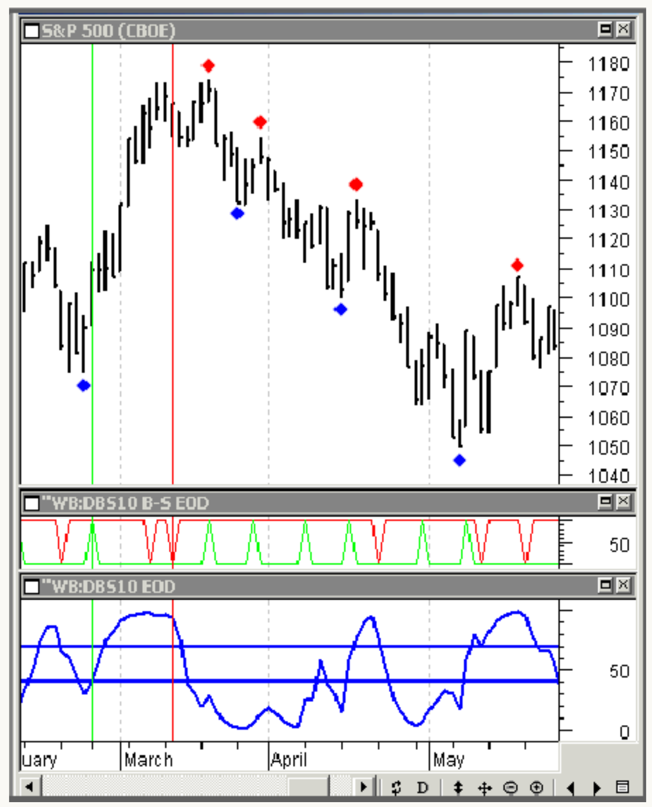

**Template 1** *Compare the oscillator highs and lows with the ccle bottoms (blue diamonds) and tops (red diamonds). The correlation of the oscillator tops and bottoms with the price cycle tops and bottoms is very high, allowing theoscillator to be used to generate high probability Mechanical Buy and Sell Signals.*

This chart shows Template 1 with a name explaining what it is: **_1 WB DBS10 B-S SIG.**

- **DBS** (green) stands for DoubleStoc oscillator
- **10** (black) is the length of the oscillator
- **B-S** /red) is a Buy/Sell Signal

This chart of the S&P500 has a 20-day trading cycle, and it could be any time frame of any market. Cycles of all time frames have similar characteristics, and move in such a manner that cycle bottoms and tops can be identified by the powerful ProfitTrader oscillators, Mechanical Buy/Sell Signals, Trading Signal combinations, and Timing Bands.

The blue DBS10 oscillator plotted in Window 3 at the bottom of the chart tends to get overbought at cycle highs and oversold at cycle lows. The oscillator is a stochastic of a stochastic, with another twist or two. It is smooth enough to generate Mechanical Buy and Sell Signals at cycle tops and bottoms.

Window 1 shows the daily price bars. The blue diamonds show 20-day trading cycle bottoms that tend to occur as the DBS10 oscillator makes an oscillator bottom. The red diamonds show the 20-day cycle tops.

Window 2 shows the Mechanical Buy and Sell Signal Setups. A red down-spike identifies the price bar for a Sell Setup, and a green up-spike identifies the price bar for a Buy Setup.

> The diamonds and vertical lines have been plotted by hand for illustration. The templates do not plot diamonds or vertical lines.

A Buy/Sell Setup is NOT a Buy/Sell Signal until it is entered by a rise above the high of the Buy Setup Bar, or a drop below the Sell Setup Bar. Buy/Sell Signals should be taken in the direction of trend, and at trend reversals. Ignore signals against the trend, or use them to take profits.

The vertical green line identifies a Buy Setup Bar generated by an upturn of the blue DBS10 oscillator. It is a Mechanical Buy Signal, and a buy stop to go long should be placed above the high of the setup price bar indicated by the green line — 1 tick to a point, or more, depending upon the market and time frame you are trading.

The vertical red line identifies a Sell Setup Bar generated by a downturn of the blue DBS10 oscillator, and a sell stop to go short should be placed below the downturn Sell Setup Bar indicated by the red line, 1 tick to a point, or more, depending upon the market and time frame you are trading.

The Mechanical Buy Signals for the DoubleStoc10 are generated by a drop below the lower horizontal blue line, called the Buy Line, which is set at 40, and an upturn in the oscillator. It is a 3-step process:

1. The DoubleStoc oscillator drops below the Buy Line;
2. The oscillator turns up to identify a BUY Setup Bar with a green up-spike;
3. Buy the high of the Setup Bar with a buy stop 1 tick to a point above it.

> Buy Signals should only be taken in the direction of trend and/or at trend reversals.

The Sell Signals are formed in a similar 3-step process:

1. The DoubleStoc oscillator rises above the Sell Line;
2. The oscillator turns down to identify a SELL Setup Bar with a red down-spike;
3. Sell the low of the Setup Bar with a sell stop 1 tick to a point below it.

> Sell Signals should only be taken in the direction of trend and/or at trend reversals.

#### Protective Stop

The Buy and Sell Signals follow cycle tops and bottoms, so the Protective Stops are placed 1 tick to a point or more below the apparent cycle low for a Buy Signal; and 1 tick to a point, or more, above the apparent cycle high for a Sell Signal. With Protective Stops you are always in "control" of your dollar risk.

### Template 2 — DBS5 Oscillator With Mechanical Buy/Sell Signals

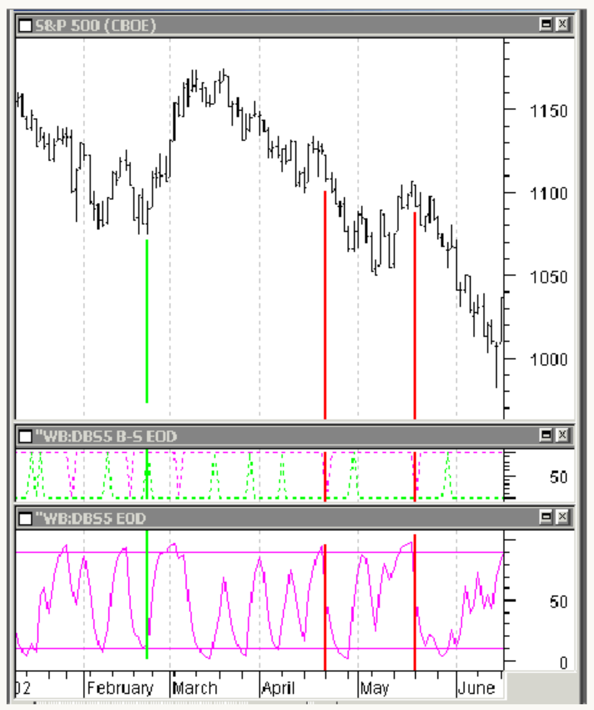

**Template 2** *The vertical lines have been plotted by hand for illustration. The templates do not plot vertical lines.*

**Buy and Sell Patterns** — The shorter-term, purple DoubleStoc5 oscillator tends to show the smaller cycles, and also interacts with the DoubleStoc10 to form Buy and Sell Patterns (shown later in this manual).

The DBS5 also generates a Mechanical Buy Signal.

**The Buy Signal is:**
1. A drop below 10 (can be raised as high as 30 to generate more signals)
2. ...followed by an upturn to generate a Buy Setup (shown by the dashed green up-spikes).
3. Place a Buy Stop to go long above the high of the Buy Setup Bar above the vertical green line.

**The Sell Signal is:**
1. A rise above 90 (can be lowered to as low as 70 to generate more signals)
2. ...followed by a downturn to generate a Sell Setup (shown by the dashed red down-spikes).
3. Place a Sell Stop to go short below the Sell Setup Bar, above the vertical red line.

### The Bressert BLine Oscillator and Buy/Sell Signals

The Bressert BLine oscillator generates Buy/Sell Signals that are even more accurate than the Bressert DoubleStoc in identifying cycle tops and bottoms.

Historically, across all markets and time frames, the accuracy of the BLine Buy and Sell Signals in identifying cycle bottoms and tops as they occur is greater than 80%. Better than 8 times out of 10, a BLine Buy/Sell Signal will occur following a cycle bottom/top. For example, in the weekly S&P Index, which has an average 20-week cycle, a completed Buy Signal is 86% accurate in identifying the weekly cycle bottom, implying higher prices into the cycle top, which will most often occur as the oscillator turns down. In the daily chart, which has a 20-day trading cycle, a BLine Mechanical Buy Signal is 84% accurate in that the signal occurs following a cycle bottom, implying a continued up move into the cycle top.

The BLine wiggles less than the DoubleStoc, generating fewer Trading Signals, but the Buy/Sell Signals often occur a bar or two after the DBS10 Signals. The price for greater accuracy of cycle top and bottom identification is entering the market a bar or two later with somewhat increased dollar risk.

The BLine Buy/Sell Signals combine well with the DBS10 Buy/Sell Signals, often confirming a Double Stoc Signal with a BLine Signal, the following bar. A combined BLine/DBS10 Signal often occurs at significant tops and bottoms.

As with the DoubleStoc oscillator, the signals must be traded in the direction of trend, or at anticipated trend reversals.

### Template 3 — BLine Oscillator and Buy/Sell Signals

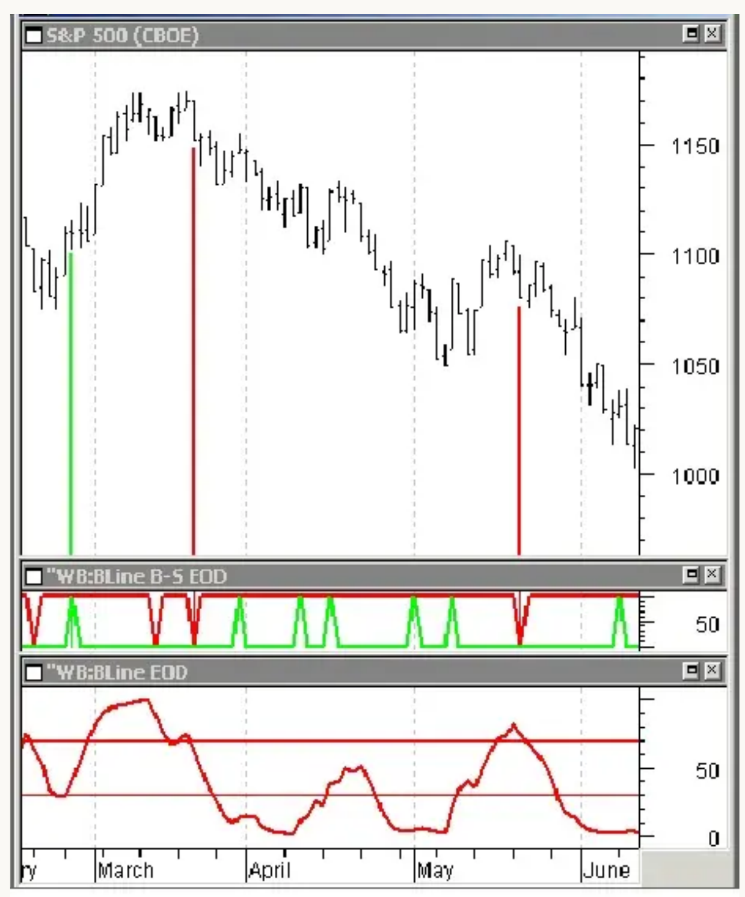

**Template 3** *The vertical colored lines are for illustration. They are not plotted in the Template.*

The BLine Chart shows a Buy Signal at a bottom; a Sell Signal at a top; a second Sell Signal as the market continues the downtrend.

As in the DBS Signals, the BLine B-S Signals are generated in a 3-step process:

**The Buy Signal is:**
1. A drop below the BuyLine at 30
2. ...followed by an upturn to generate a Buy Setup (shown by the green up-spikes).
3. Place a Buy Stop to go long above the high of the Buy Setup Bar (above the vertical green line).

**The Sell Signal is:**
1. A rise above the SellLine at 70
2. ...followed by a downturn to generate a Sell Setup (shown by the red down-spikes).
3. Place a Sell Stop to go short below the Sell Setup Bar (above the vertical red line).

Because of its accuracy, the BLine is a favorite of many stock traders.

### Template 4 — DBS5 and 10 with Buy/Sell Setup Signals and Oscillator Patterns

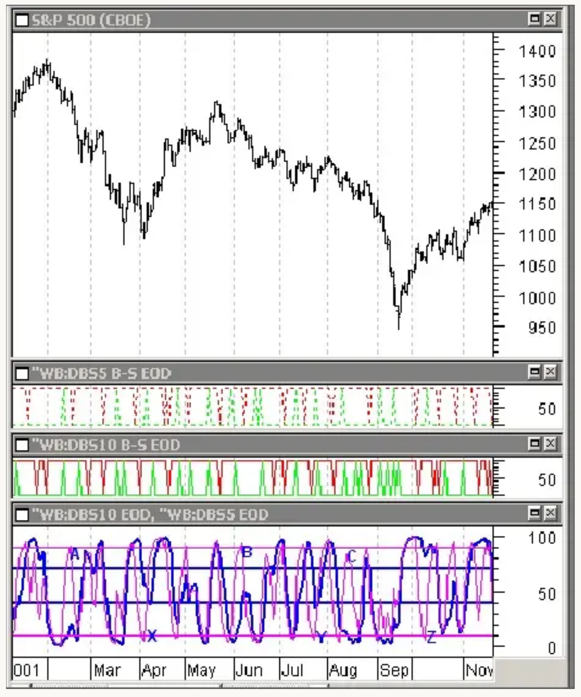

The DBS10 and DBS5 are powerful stand-alone oscillators that generate high-probability Mechanical Buy/Sell Signals. When the DBS10 and DBS5 Buy/Sell Signals and Trading Patterns are combined, they become even more powerful and are frequently followed by substantial moves, most often in the direction of trend.

The DBS5 Buy/Sell Setup Signals are plotted above the DBS10 Buy/Sell Setup Signals. A green up-spike indicates a Buy Setup Bar, and a rise above the high of that price bar will generate a Mechanical Buy Signal. A red down-spike indicates a Sell Setup Bar, and a drop below the low of that price bar will generate a Mechanical Sell Signal.

Trading Signals should only be taken in the direction of trend, and at trend reversals. Trading Signals against the trend should be ignored or used to take profits in an already established position in the direction of trend.

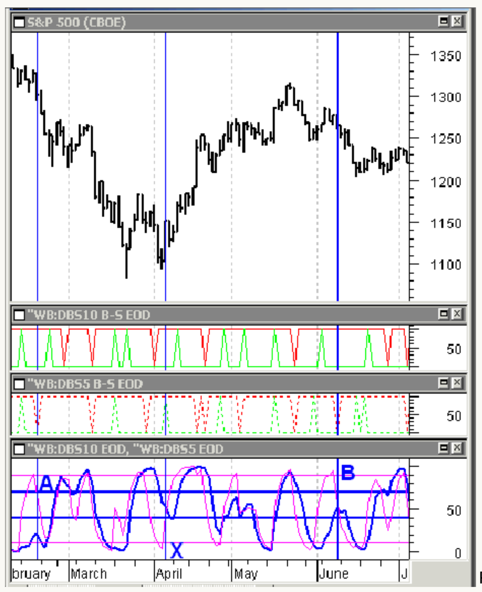

**Template 4** *The vertical lines have been plotted by hand for illustration. The templates do not plot vertical lines.*

#### High 5 Sell Trading Pattern

The High 5 Sell Trading Pattern, labeled A, B, and C in Window 4 on Chart 4 (previous page), is an excellent pattern for going short in a declining market. (In this enlarged segment of Chart 4, only A and B can be seen; C is in the chart on the following page).

1. The DBS10 is below 65.
2. The DBS5 is above 84.
3. The DBS5 turns down.
4. Sell the low of the downturn price bar. (Use the vertical line to determine the price low, and place a Sell Stop to go short 1 tick to a point, or more below it, depending upon the market and time frame).
5. Place a Protective Buy Stop above the swing high that preceded entry.

#### Low 5 Buy Trading Pattern

The Low 5 Buy Trading Pattern, labeled X, Y, and Z, is an excellent pattern for establishing long positions in a rising market. (In this enlarged segment of Chart 4, only X can be seen; Y and Z are in the chart on the following page).

1. The DBS10 is above 50 as...
2. ...the DBS5 drops below 10.
3. The DBS5 turns up.
4. Buy the high of the upturn price bar. (Use the vertical line to determine the price high, and place a Buy Stop to go long one tick to a point, or more above it, depending upon the market and time frame.)
5. Place a Protective Sell Stop below the swing low that preceded entry.

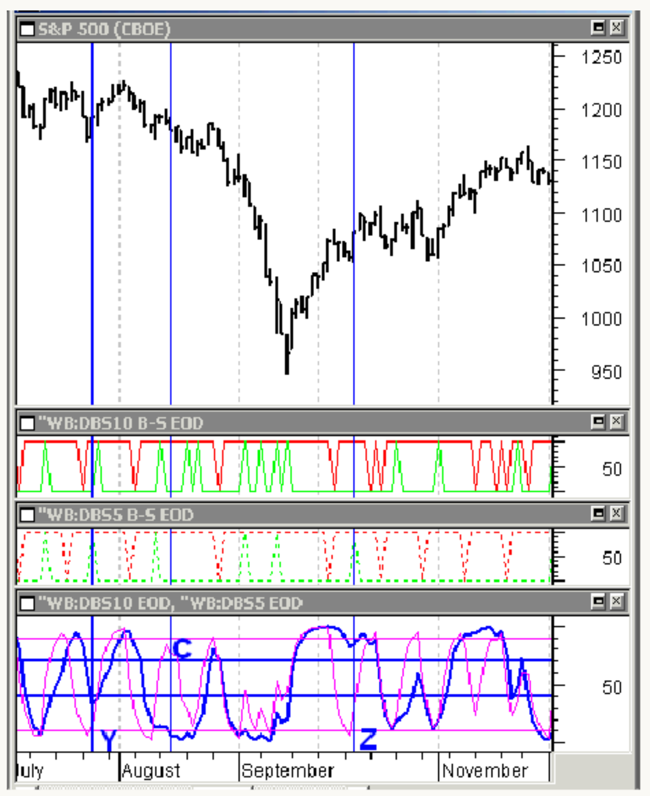

**Template 4** *The vertical lines have been plotted by hand for illustration. The templates do not plot vertical lines.*

#### High 5 Sell Trading Pattern (continued)

The High 5 Sell Trading Pattern, labeled A, B, and C in Window 4 on Chart 4 (previous page), is an excellent pattern for going short in a declining market. (In this enlarged segment of Chart 4, only C can be seen; A and B are in the chart on the previous page).

1. The DBS10 is below 65.
2. The DBS5 is above 84.
3. The DBS5 turns down.
4. Sell the low of the downturn price bar. (Use the vertical line to determine the price low, and place a Sell Stop to go short 1 tick to a point, or more below it, depending upon the market and time frame).
5. Place a Protective Buy Stop above the swing high that preceded entry.

#### Low 5 Buy Trading Pattern (continued)

The Low 5 Buy Trading Pattern, labeled X, Y, and Z, is an excellent pattern for establishing long positions in a rising market. (In this enlarged segment of Chart 4, only Y and Z can be seen; X is in the chart on the previous page).

1. The DBS10 is above 50 as...
2. ...the DBS5 drops below 10.
3. The DBS5 turns up.
4. Buy the high of the upturn price bar. (Use the vertical line to determine the price high, and place a Buy Stop to go long 1 tick to a point, or more above it, depending upon the market and time frame.)
5. Place a Protective Sell Stop below the swing low that preceded entry.

#### Swing Trading With the Double Buy/Sell and 1-2 Buy/Sell Patterns

The Mechanical Buy/Sell Signals are pretty good by themselves, but when Buy or Sell Signals occur at the same time in both the DBS10 and DBS5 oscillators (Double Buy/Sell), or when Buy or Sell Signals occur within two price bars of one another (1-2 Buy/Sell), there is often a sizeable move to a cycle or swing high/low.

See Charts 4A and 4B below.

> **Hands-on:** You can best see the interaction of these powerful Trading Patterns and Buy/Sell Signals by building an $SPX chart and applying Template 4. You can then expand the chart to full size to get maximum benefit from these patterns.

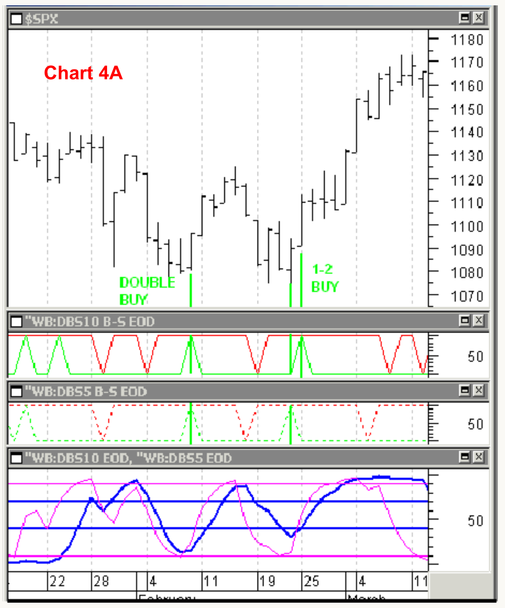

**Cart 4A: Double Buy/Sell Pattern** — A Double Buy/Sell Pattern occurs when a Buy or Sell Signal occurs in the direction of trend at the same time in both the DBS10 and DBS5 oscillators.

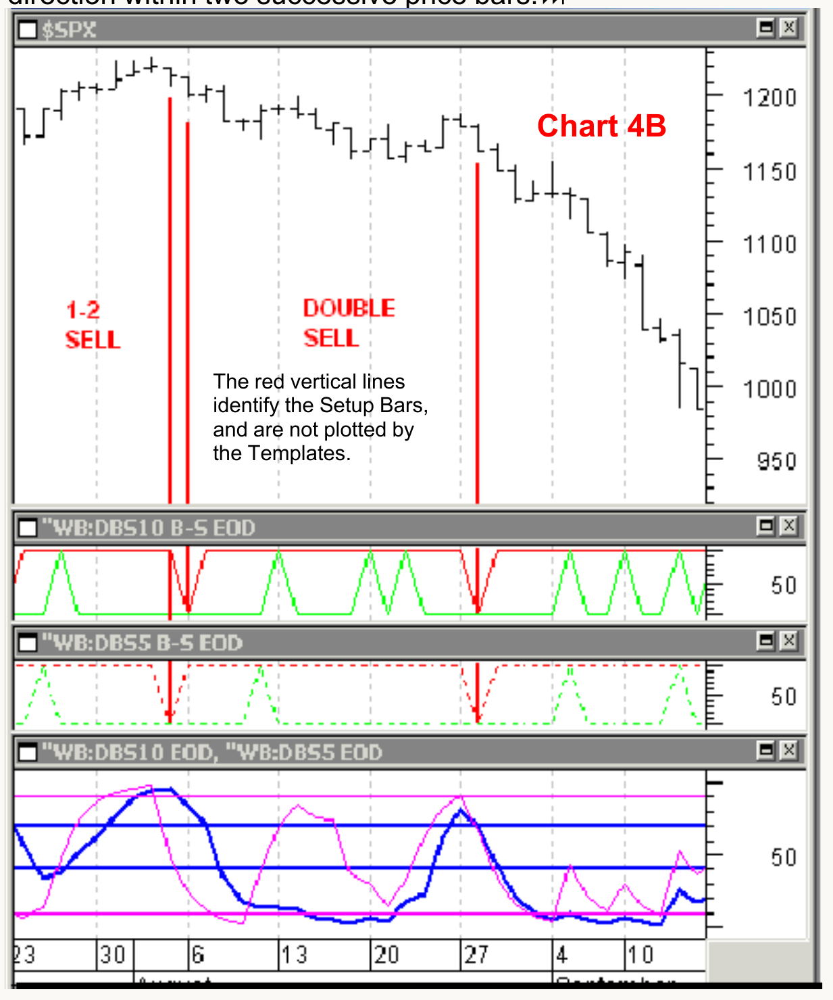

**Cart 4B: 1-2 Buy/Sell Pattern** — A Buy or Sell Signal occurs in both the DBS10 and DBS5 oscillator, most often in the direction of Trend, in a 1-2 Pattern in which one DBS (5 or 10) Signal is followed by the other DBS Signal in the same direction within two successive price bars.

> The red vertical lines are for illustration, and are not plotted by the Templates.

---

### Template 5 — All (4) Buy/Sell Signals with the BLine Oscillator

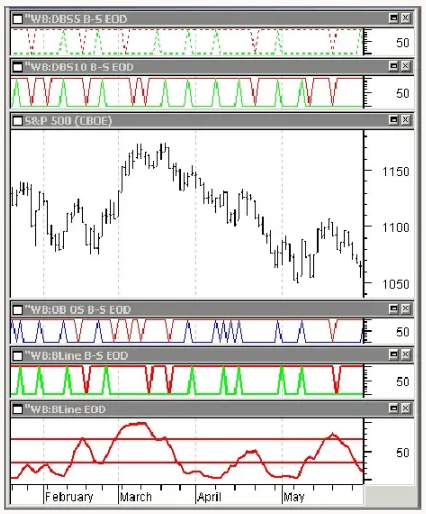

Template 5 combines the four Mechanical Buy and Sell Signals (DBS10, DBS5, BLine, OB/OS) in one chart with the BLine plotted at the bottom of the chart.

The Overbought/Oversold Buy/Sell Signals have been added to Chart 5. Based on a combination of indicators, the OB/OS Buy and Sell Signals, though not particularly impressive as a stand-alone, combine well with the DoubleStoc and BLine Trading Signals.

The BLine Buy/Sell Signals give the strongest identification of cycle tops and bottoms and trend reversals, but the combination of two, three and four signals are often followed by significant moves in the direction of the signal.

- In a strong downmove, the green up-spikes signaling Buy Setups will show up frequently as the oscillators are being pushed below the Buy Lines. These Buy Signals are not to be traded as they are against the trend, except at an anticipated trend reversal based on a longer-term cycle.
- In a strong upmove, the red down-spikes showing Sell Setups will show up frequently as the oscillators are being pushed above the Sell Lines. These Sell Signals are not to be traded as they are against the trend, except at an anticipated trend reversal based on a longer-term cycle.

#### Hands-On

To become familiar with the combination of signals and how they interact, use the vertical bar keeping in mind the objective is to trade with the trend except at anticipated trend reversals.

#### Pay Attention to Trend

Buy and Sell Signals should generally be traded in the direction of the trend, and at trend reversals.

#### The EMA Trend Indicator

The most consistent path to profits is to trade in the direction of trend... and anticipate trend reversals. The EMA Trend Indicator is an excellent tool for determination of the trading trend.

- The trading trend is down when the blue EMA line is moving down and the red EMA line is below it and moving down.
- The trading trend is up when the blue EMA line is moving up, and the red EMA line is above it and moving up.

This combination of the red and blue EMA Trend Indicator lines will have you trading in the right direction for much of a trending move; however, it tends to miss the beginning of new trending moves that often follow trend reversals. Fortunately, these moves can be picked up by the %Diff Indicator, which is the %Difference between the two EMA Trend Indicator lines, and is plotted on the chart as a dashed red line.

Trend direction can best be seen in a combination of the EMA Trend Indicator lines and the %Diff lines. The red EMA Trend Indicator line and the dashed red EMA %Diff line show trend direction when both are moving in the same direction. Use the combination of the direction of the red EMA %Diff and red EMA line as a filter to trade in the direction of trend. When these two lines are moving up, trade the Buy Signals; when these two lines are moving down, trade the Sell Signals.

- The trading trend is up when the red EMA line is moving up and the dashed red EMA %Diff line is also moving up.
- The trading trend is down when the red EMA line is moving down and the dashed red EMA %Diff line is also moving down.

The interaction of prices with the red and blue EMA lines can also be very helpful to determine trade direction.

- When the red EMA line is above the blue and prices drop down to the blue line, finding support as the oscillator is at an oversold low, a trading cycle is frequently making a bottom and Buy Signals can be taken.
- When the red EMA is below the blue and prices move up, meeting resistance at the blue EMA line as the oscillators are overbought a trading cycle top is frequently topping, and Sell Signals can be taken.

Also, by watching the direction of trend relative to the %Diff and the EMA lines, you can trade oscillator patterns based on the interaction of the purple DBS5 and the blue DBS10.

### Template 6 — Trend Direction

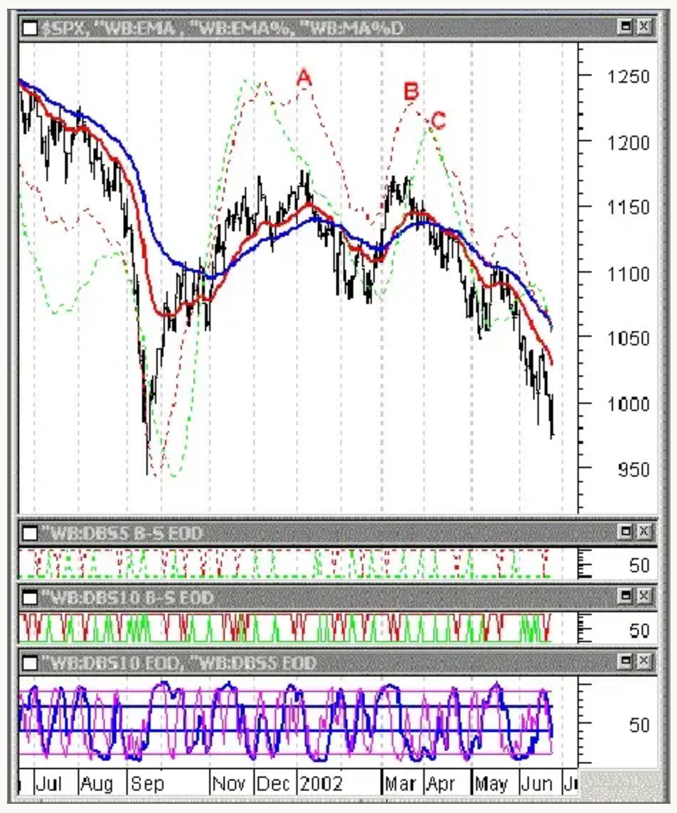

The green dashed line is the MA %Diff, which turns a little slower than the EMA %Diff, but combines with the EMA %Diff to show strong uptrends and strong downtrends. More than that, it can help identify tradable tops and bottoms.

From the September low in 2001, the EMA and MA %Diffs showed a strong uptrend into early December when both the red EMA %Diff and the green MA %Diff turned down. When the red EMA %Diff turned back up again, to be followed by a downturn at A, lower prices were indicated, and confirmed by a drop below the Sell Setup Bar for the DBS10 Sell Signal to show a probable trend reversal beginning at A.

Both %Diffs were now moving down, as was the red EMA line to show a continued downtrend into late February/early March, when both %Diffs were once again rising together to show an uptrend to another top the week of 3/18.

As both %Diffs were rising, the red EMA line was also rising, until the EMA %Diff turned down at B as prices confirmed a double top by taking out the swing low between the two highs.

As the red EMA %Diff, which is more sensitive than the MA %Diff, was turning down, the green MA %Diff continued up to turn down at C the first week of April as a DBS5 and DBS10 oscillator pattern also indicated a high.

From that point, both %Diffs and the red EMA line were moving down, showing a strong downtrend, and the blue EMA line was also moving down to heighten the anticipation of a continued downtrend.

In the week of 5/13, prices rose up to test the blue EMA line in a recognizable pattern of —

1. Prices are at a resistance level as...
2. The DBS10 and 5 oscillators are overbought...
3. Followed by a Mechanical Sell Signal and expectation of a continued downmove

#### The EMA Trend Indicator in a Downtrend

The blue EMA line is moving down, with the red EMA line below the blue and generally moving lower. And in a strong downtrend the %Diffs will also be moving down as the red EMA line is moving down... The trend is clearly down when both %Diffs and the red EMA are moving down at the same time.

The blue EMA line will often become a resistance level for a cycle top in a downtrend, and Sell Signals should be taken.

#### The EMA Trend Indicator in an Uptrend

The blue EMA line is moving up, and the red is above the blue and generally rising as shown by the %Diff indicators... The trend is clearly up when both %Diffs and the red EMA are moving up at the same time.

The blue EMA line will often become a support level for a cycle bottom in an uptrend, and buy signals should be taken.

Review these guidelines for trend direction in your favorite markets and time frames.

### Template 6a — Trend Direction and Bull/Bear

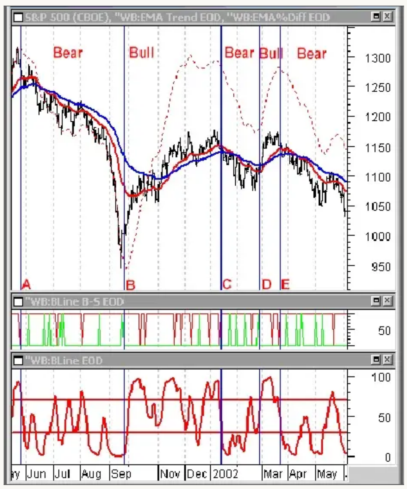

In this chart, the DBS5 and 10 oscillators and signals have been removed. Bull and bear markets are shown based upon the BLine oscillator and Buy/Sell Signals, combined with the EMA Trend and %Diff.

The Bressert BLine wiggles less than the DoubleStoc, generating fewer trading signals. But these signals are often followed by larger moves as seen in this chart.

The Bull and Bear trend directions noted on this chart are based upon a combination of the EMA Trend Indicator, and the %Diff line, which often shows a change in trend before the EMA Trend Indicator. (The Bull and Bear directions and vertical lines will not plot on your chart.)

The BLine Buy and Sell Signals are in Window 2, above the BLine oscillator in the bottom window. The green up-spikes are below the Buy Setup Price Bars, and red down-spikes are below the Sell Setup Price Bars.

The BLine often generates Trading Signals at trend reversals as at A, B, C, D and E; but also generates a number of trend following signals at smaller cycle tops and bottoms that are often followed by sizable trend following moves.

Trading Signals should not be taken against the trend unless a trend reversal is expected as a longer-term (and larger) cycle tops and bottoms. The BLine Oscillator can be an indicator of the beginnings and/or endings of both bull and bear markets, especially when combined with the EMA %Diff and EMA Trend Indicator lines.

The BLine Buy/Sell Signals are often followed by more sizeable moves than the 5 and 10 DoubleStoc Oscillators, and by watching the direction of the %Diff and the EMA Lines relative to the BLine Buy/Sell Signals, you can often anticipate trend reversals.

> The vertical lines have been plotted by hand for illustration. The templates do not plot vertical lines.

#### Keltner Bands

Keltner Bands are an excellent and powerful analytical trading tool to anticipate Support and Resistance levels in trending moves, and to also identify Support/Resistance levels of Congestion ranges.

A Keltner Band is based on a 45-bar moving average (day, week, month, intraday price bar, etc.), and a Standard Deviation move away from the 45-bar centerline, based on the average true range.

The Keltner Bands can be used for Support/Resistance levels, and can also be combined with Mechanical Buy/Sell Signals as in Template 7.

The Standard Deviation used in this chart is 1.95, but following the downside breakout would be increased to 6 or 8. Prices reaching a widely watched Standard Deviation of 6 or 8 will often end a move.

#### Hands-On

To get a "feel" for the Keltner Bands, change the STD DEV in monthly, weekly, daily (and intraday, if you have it) charts from 1 to 8 to see how the Bands change.

### Template 7 — Keltner Bands and Buy/Sell Signals - Combines Support/Resistance at Keltner Bands with B-S Signals

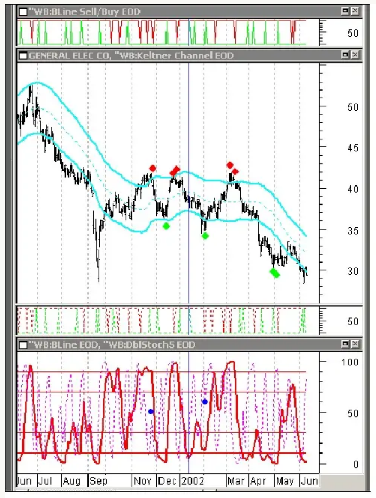

**Chart Legend:** The Keltner Bands are the thick cyan lines on either side of the dashed centerline. The BLine Buy/Sell Setups are in the top Window. The DBS5 Buy/Sell Setups are above the oscillators in Window 3. The BLine and DBS5 oscillators are in the bottom Window.

In the month of November, prices had risen above the Keltner Band and traded sideways until the BLine generated a Sell Setup Signal shown by the first red diamond. Significantly, the DBS5 did not generate a Sell Signal as the oscillator turned down well below 50. This trading pattern is worth watching, as it can be followed by continued lower prices.

This is a Sell Trading Pattern to watch for —

> The BLine turns down and generates a Sell Signal. The DBS5 Oscillator is below 50 and turns down at the same time as the BLine oscillator moves down. The lower DBS5 oscillator high shows weakness, and gives additional validation to the Mechanical BLine Sell Signal.

In December, prices dropped to test the lower Keltner Band, and the BLine generated a Buy Setup Signal indicated by the green diamond (the diamonds do not plot with the Template) below the price bar. This signal identified a daily trading cycle bottom that was followed by a line move up to test the upper Keltner Band. Reaching the upper Keltner Band, a combination of a DBS5 Sell Setup and BLine Sell Setup generated a 1-2 Pattern shown by the red diamonds.

One Sell Signal followed by a second Sell Signal is often an indicator of a top, especially with the oscillators at a high level as the Keltner Band is tested.

The market then declined into late January/early February when the BLine generated a Buy Signal following consolidation that tested the lower Keltner Band.

This is a reverse picture of the Sell Trading Pattern in November in that the BLine generated a good Buy Setup Signal, while the DBS5 turned up at a high level, just below the Sell Line as indicated by the blue dot.

The market then moved higher into March where, once again, there was a 1-2 Sell Pattern indicated by the red diamonds.

The DBS5 generated a Sell Setup Bar; then, the BLine generated a Sell Setup Bar as prices were testing the upper Keltner Band. This Pattern was again followed by a sizeable down move as prices first tested the lower Keltner Band; then broke through it and continued lower to make a final bottom with a 1-2 Buy Pattern of a DBS5 Buy Setup followed by a BLine Buy Setup, indicated by the green diamonds.

Keltner Bands can be used to see Support/Resistance levels as a market moves sideways; and using more sizeable Standard Deviation moves away from the centerline will often seem to stop a price move at a 6, 7, or 8 Standard Deviations move, as occurred at the 1-2 Buy in late April.

#### Hands-On

Plot GE yourself and change the Standard Deviation move from 1.95 to a 6 to see how it stopped the down move.

Additional PT indicators, such as Timing Bands and Trend Indicators would normally be applied to the chart (or perhaps to another chart to prevent "chart congestion").

### Template 8 — Detrend Template Combines Trend with B-S Signals

#### PT Detrend Template — Detrending Shows Trend with Cycle Tops and Bottoms

The PT Detrend Template with the EMA Trend Indicator, %Diff lines, and Buy/Sell Signals identifies high probability trades that often occur at cycle tops and bottoms in a trending market.

- The PT Detrend indicator shows over-extensions that can be used to help identify and trade cycle tops and bottoms as they occur, especially when combined with trend direction and Mechanical Buy/Sell Signals.

- The EMA Trend indicator is an excellent tool for the determination of trend as previously shown, but typically misses the early stages of a change in trend direction.

- The dashed red %Diff line often identifies the trend change as it occurs (thus, it combines well with the EMA Trend Indicator), and also shows strong trending moves that invite add-on positions at cycle turning points or swing highs/lows.


**Chart Legend:** The green vertical lines run through cycle bottoms, and the blue vertical lines run through cycle tops… Buy and Sell Signals for the DoubleStoc5 oscillator are at the bottom of the screen (90 SellLine; 15 BuyLine)… A green up-spike identifies a DBS5 Buy Setup Bar, and a red down-spike identifies a DBS5 Sell Setup Bar… The red BLine oscillator is below prices to combine with the DBS5 B-S SIGS and detrend to identify the tradable tops and bottoms.

**Detrend Template 8 Combines Trend With B-S Signals**
- DBS5 B-S;
- BLine EOD;
- EMATrend and %Diff;
- Detrend RT

The red Detrend at the top of the weekly GE chart shows a tendency for cycle tops and bottoms to occur above 7 and below -7. The uptrend is shown by the EMA Trend Indicator and the %Diff. In the EMA Trend Indicator, when the blue line is moving up and the red is above the blue, the trend is generally up; and when the blue is moving down and the red below it, the trend is generally down.

> The vertical lines run through cycle bottoms, and the blue vertical lines run through cycle tops.
>
> *These lines have been hand entered for illustration and are not automatically plotted by the template.*

Buy and Sell Setups for DBS5 Entry Signals are at the bottom of the screen. A green up-spike identifies a Buy Setup bar, and a red down-spike identifies a Sell Setup bar.

As GE is trending up the green cycle lines show the cycle lows on the price chart, and these lows coincide with downside extremes in the Detrend. The combination of a Detrend extreme and the Mechanical Buy Signal shows four high probability Buy Signals that were followed by sizable up moves.

As GE tops and moves down, the blue cycle lines show the cycle tops that occurred at the upside over-extensions. Using the extremes of the Detrend to qualify the red Sell Setup Signals resulted in four high probability Sell Signals that were followed by declines, as shown by the red down-spikes that followed the blue cycle lines.

> #9 Templates (9a, 9b, 9c, and 9 EOD Combo and 9 Intra Combo) are show in Section II, Page 35.

### Template 10 — All Indicators

#### Template 10 EOD — All Indicators

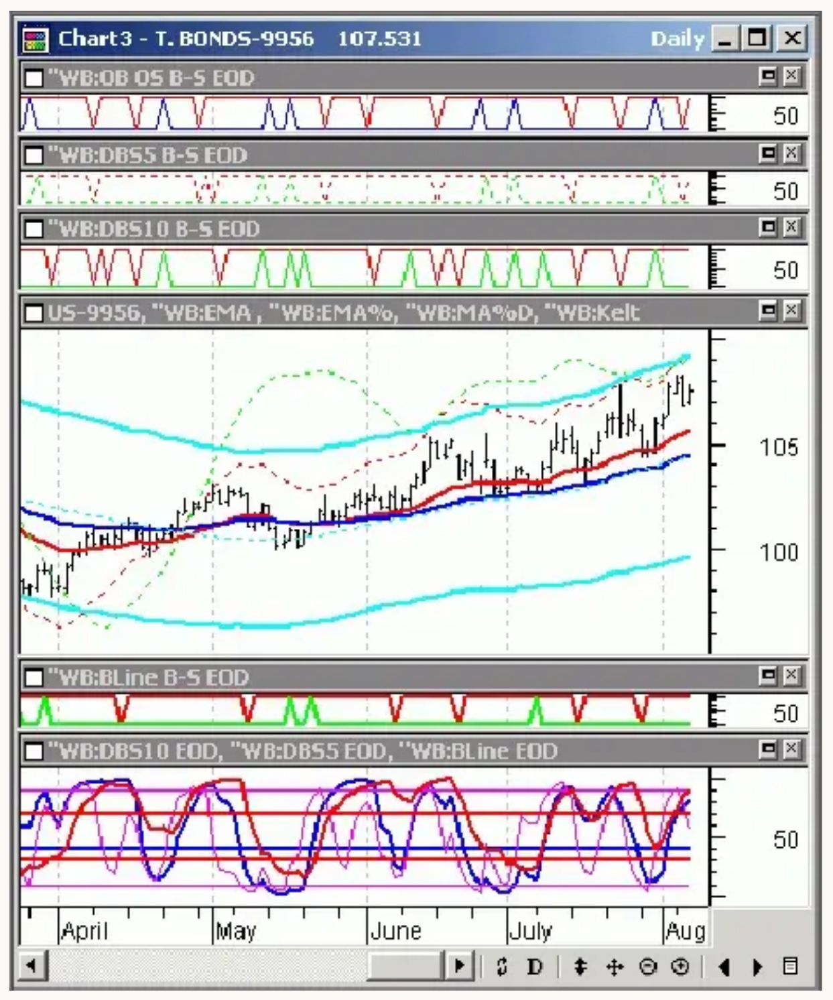

This template plots the three oscillators, the four Buy/Sell Signals, Trend Indicators, %Diff and Keltner Bands on a single chart. Once you are familiar with the individual Buy/Sell Signals and the oscillators and Trend Indicators, this chart is the one you should use to trade. It shows the individual Buy/Sell Signals, and allows you to see the combinations of two, three and four signals occurring at once, plus the 1-2 Buy/Sell Signals. It gives you a bird's eye view of what has happened in the past relative to the multiple signals and the oscillators while you keep a close eye on trend, both in the Trend Indicators and in the oscillators, because the oscillators themselves show trend. When a 10DBS is moving down on a weekly chart that is the trend for a daily chart.

#### Template 10 Intra — All Indicators

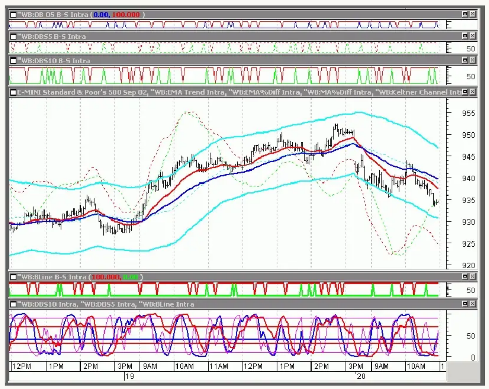

The Intraday Template plots all three oscillators at the bottom of the chart, and above the oscillators it plots the BLine Buy/Sell Signals, which are more significant for trending moves. The chart itself shows the Keltner Bands, EMA %Diff Lines, and %Diff Lines for trend direction. The 10DBS, 5DBS and OB/OS Buy/Sell Signals are shown at the top of the chart. Using the vertical lines, you can quickly identify multiple entry signals and 1-2 Buy/Sell Signals. As in the EOD chart, the oscillator for longer time periods show the trend for the shorter time period.

### Expert Advisor

#### ProfitTrader Provides Expert Advisor for Buy/Sell Signals and Timing Bands.

ProfitTrader provides Expert Advisor for Buy/Sell Signals and Timing Bands. The Buy/Sell Signals are designed to buy cycle bottoms and sell cycle tops. Review the use of the Buy/Sell Signals and the Templates in the Manual; then, bring them up on screen to become familiar with them.

The Expert Advisor explains how to determine the price for the Buy/Sell Signals and where to place the initial Protective Stops.

The Expert Advisor plots an arrow on the Setup Bar to alert you to a potential Buy/Sell Signal. Clicking on the arrow shows you the Expert Advisor, which explains where to place your orders to enter and exit the market. Only one Buy/Sell Signal with Expert Advisor can be plotted on a single chart, but the Buy/Sell Signals generated by the green/red "V's" can be seen on all charts. By plotting the four regular Buy/Sell Signals on one chart, you can see when the Buy/Sell Signals without an Expert Advisor match the Expert Advisor signal for a double, triple, or quad Buy/Sell, or a 1-2 Buy/Sell.

See Page 44 for additional information.

## Section II: Timing Bands

An overview of Cycle Analysis and Forecasting using the PROFITTRADER™ Timing Band Indicators and Templates.

| | Page |
| --- | --- |
| How Timing Bands are Constructed | 29 |
| Cycle Identification Will Greatly Improve Your Trading | 30 |
| Plot Timing Bands on Your Chart | 35 |
| Use Templates to Plot the Timing Bands | 36 |
| Template 9a, Trough-to-Crest Timing Band | 38 |
| Template 9b, Trough-to-Trough Timing Band | 39 |
| Template 9c, Crest-to-Trough Timing Band | 40 |
| Template 9 Combo – EOD Timing Bands | 41 |
| Template 9 Combo-Intra Timing Bands | 42 |
| MetaStock Expert Advisor | 44 |
| Timing Band Inputs EOD | 45 |
| Timing Bands Intra | 48 |
| Timing Band Practice Exercise | 51 |
| Cycle Lengths | 52 |

Cycle projections allow reasonably accurate forecasting of significant time periods for future tops and bottoms. The cycles used in our analysis are as long as four years for the Stock Market, and as short-term as minutes or ticks for intraday trading.

The ProfitTrader Timing Bands, a powerful forecasting and trading tool based on historical cycle tops and bottoms, forecast the most probable time periods for cycle tops and bottoms. Timing Bands for current time are plotted on a chart, but do not show beyond the edge of the chart. However, the exact dates/time periods for forecasting future Timing Bands may be viewed in the MetaStock Expert Advisor (page 38).

### How Timing Bands are Constructed

Seventy percent of all cycle tops and bottoms have occurred on, or after, the beginning of a Timing Band. Forty percent of the historical cycle tops and bottoms have occurred within the time parameters of a Timing Band. Thirty percent occurred before the beginning of the Timing Band, and 30% occurred after the end of the Band.

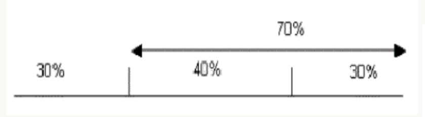

```text
   30%    |    40%    |    30%
```

Because price cycles are not exact and can contract and extend, a 20-day cycle will not bottom every 20 days. One cycle might be 15 days, another might be 26-days from bottom-to-bottom. Timing Bands quantify cycles and accommodate this shift in time. Generally, the most symmetrical, balanced and tradable cycles occur within the middle 40%, and the cycles that have a sizeable extension occur in the last 30%.

It is the 30% of cycle tops and bottoms occurring before the timing bands that are often the riskiest to trade because often a swing top or bottom can look like a cycle top or bottom until the market makes a quick reversal and stops you out.

When trading the markets, Timing Bands are a guideline to improve the accuracy of the Mechanical Buy/Sell Signals generated by the Bressert Double Stochastic. These Buy and Sell Signals have an average accuracy of identifying cycle tops and bottoms across all time frames of better than 70% that is increased when the signal occurs within a Timing Band.

### Cycle Identification Will Greatly Improve Your Trading

Understanding several basic concepts in cycle analysis and timing will help you determine trend, and to buy bottoms and sell tops.

#### 1) The Interplay of Cycles Within Cycles

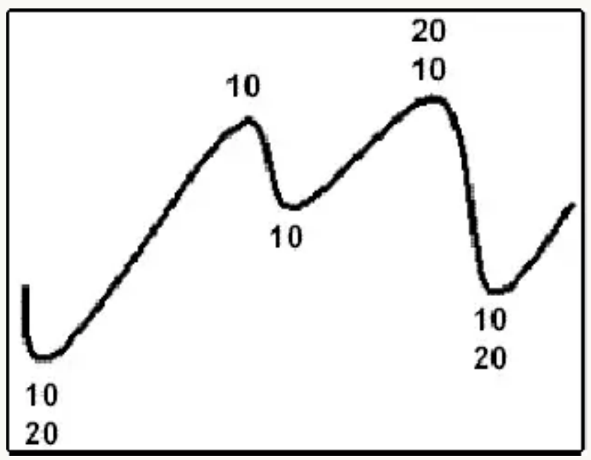

One of the keys to trading with cycles is an understanding of the interplay of cycles within cycles. Almost all trading cycles in all time frames have a one-half trading cycle as seen in the illustration below. A 20-day (bar) trading cycle has within it two 10-day (bar) cycles. One 10-day cycle begins as the 20-day cycle begins and typically bottoms halfway into the 20-day cycle. As the first 10-day cycle ends, the second 10-day cycle begins and it ends as the 20-day cycle bottoms. Therefore, a 20-day trading cycle always begins, and ends with a 10-day cycle.

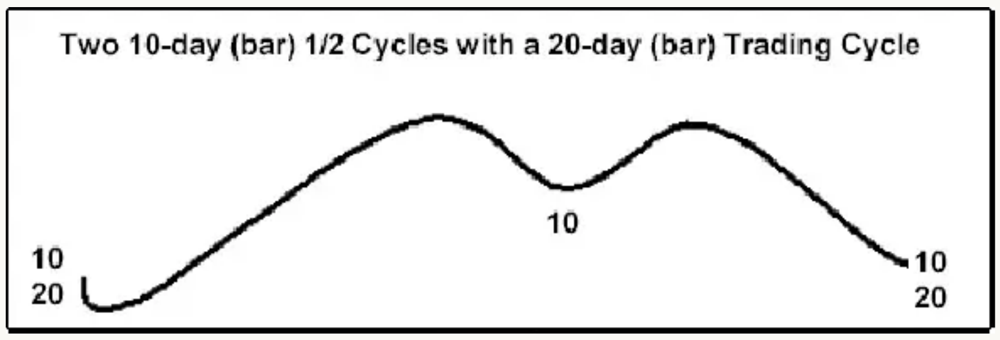

> Two 10-day (bar) 1/2 Cycles with a 20-day (bar) Trading Cycle

The Mechanical Buy and Sell Signals work well for identifying cycle tops and bottoms and generating trading signals, but utilizing knowledge of the half-cycle can improve the accuracy of trading cycle bottom selection and confidence in your trades. Using the 10-bar one-half cycle, accuracy of cycle identification can often be increased by 10% - 15%.

Awareness of the one-half cycles makes it easier to identify and trade the 20-day trading cycle. Once you identify the low of the first 10-day cycle, you know the next 10-day cycle bottom will be the low of the 20-day cycle as well. Important to know because the accuracy of identifying 10-day cycles with the Bressert Double Stochastic averages better than 80% in all time frames, all markets. The accuracy of identifying the 20-bar trading cycle averages about 70%, and awareness of the 10-bar cycle can increase the accuracy of buying bottoms and selling tops of the trading cycle.

#### 2) Longer-term Cycles Set the TREND for Shorter-term Cycles

This means that the cycle in the weekly time frame sets the trading trend for the daily time frame. It would be very easy to trade if we could simply say the weekly cycle is moving up; therefore, the trend is up. Or, the weekly cycle is simply moving down; therefore the trend is down... but it is not quite that simple.

#### The Weekly DoubleStoc Oscillator Shows the Trading Trend For The Daily Chart

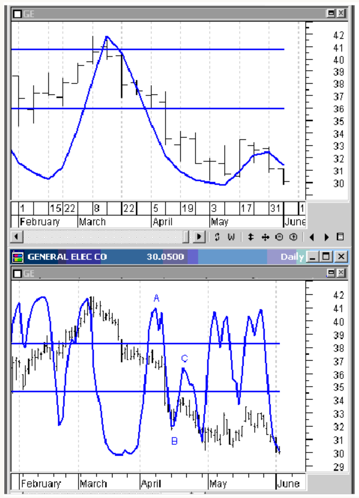

This stacked chart shows two time frames. The top weekly chart has a DBS10 oscillator that shows the trend direction for the daily chart below it.

From the high in March in the weekly chart, the oscillator is moving down.

During the month of March on the daily chart the DBS10 oscillator drops to a low level, and then turns up. Trading the upturn in the daily oscillator would have resulted in a loss because the trend was down based upon the longer-term weekly chart; and the daily Buy Signal would be trading against the trend.

But, when the DBS10 oscillator in the daily chart moves up to make an oscillator high at A in early April, the weekly oscillator is still moving down showing the trend is down, and the Sell Signal generated by the downturn at A would have been followed by a profitable drop into mid-April as the daily trading cycle bottomed.

On the daily chart, B looked like a potential buy based strictly on the oscillator in the daily chart in the bottom Window, but the weekly oscillator was still moving down, indicating the trend was down. Rather than buy against the trend, waiting for the DBS10 oscillator to move up and turn back down again would have generated a trade in the direction of trend into another trading cycle bottom.

Awareness of the longer-term cycles opens the door to using the oscillator in the longer-term time frame to show trend in the smaller time frames.

#### 3) Bull Markets And Bear Markets Have Different Characteristics

The most important aspect of trading is trend, and cycles in rising markets act differently than in declining markets. Timing Bands are divided into BULL, or UP Timing Bands for rising markets, and BEAR, or DN Timing Bands for downtrending markets.

#### Right Translation

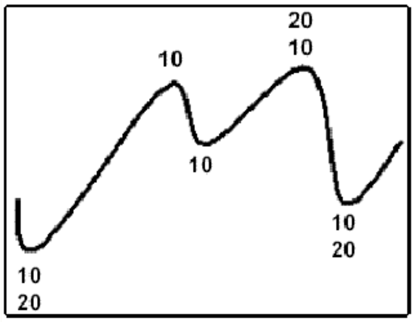

A weekly cycle moving up shows as a bull rising market on a daily chart, with the trading trend up. Therefore, the daily trading cycle will have Right Translation, meaning it leans to the right as the market is moving up (long upmove followed by a short downmove as shown in this chart). In bull markets showing Right Translation, the top of the 20-day cycle is most often the top of the second 10-day cycle.

Right Translation shows in the time periods for bottoms and tops of the trading cycle. On average the move from bottom-to-top will be three weeks, and the move from top-to-bottom, one week. Knowing this makes it easier to hold a long position through the decline into the bottom of the first 10-day cycle, or even making an add on to the long position, expecting to take profits as the second 10-day cycle tops, often with a Mechanical Sell Signal. Time forecasts for cycle tops and bottoms can be narrowed using the Timing Bands.

#### Left Translation

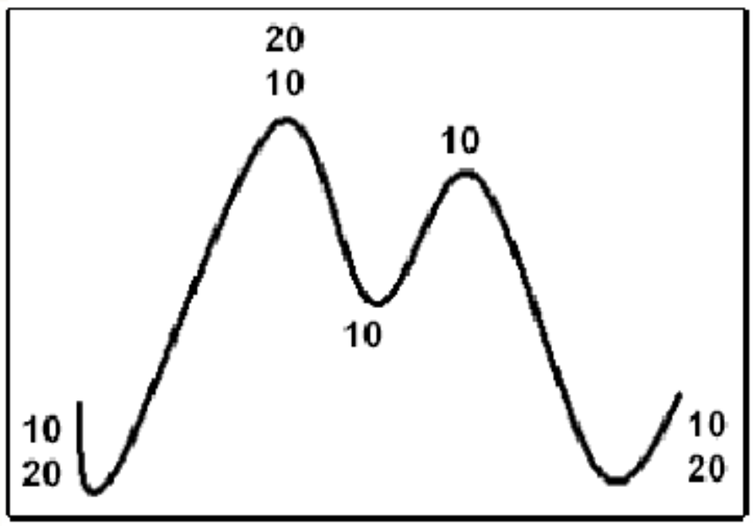

When the weekly cycle is moving down, the daily cycle has Left Translation, meaning it leans to the left (short upmove followed by an extended decline as shown in the chart.) In a bear market with Left Translation the top of the 20-day cycle is most often made as the first 10-day cycle tops.

Left Translation shows in the time periods for bottoms and tops of the trading cycle. On average the move from bottom-to-top will be one week, and the move from top-to-bottom, three weeks. Knowing this can give you the confidence to hold a short position through the rise into the high of the second 10-day cycle, or add on to the short position expecting to take profits as the 20-day and 10-day cycles bottom with a Mechanical Buy Signal.

Expecting Left Translation in a declining market, you can look to sell the second 10-day cycle top in a failure pattern if it fails to exceed the previous 10-day cycle top, as the market often drops sharply into the 20 and 10-day cycle bottom.

#### Be Prepared For The Unexpected

At times the 10-day cycle will show up very distinctly. At other times it may seem to disappear, or it can be a combination of a short cycle and a long cycle. For example, the first 1/2 trading cycle may contract to seven days and the second may stretch to 13 days. Or the first 1/2 trading cycle may stretch while the second contracts. The 20-day cycle also contracts and expands, and as the dominant cycle its activity will affect the lengths of the two one-half trading cycles.

If the 20-day cycle contracts to 15 days, the 10-day cycle may seem to disappear, or there may be two smaller cycles close to the same length such as seven and eight days. There can also be an extreme of a short and a long, such as a four and 11. If it stretches to 28 days, the 1/2 trading cycles are likely to be longer as well.

With cycles stretching, contracting and disappearing they can be hard to identify at times, and the lows and highs of the ProfitTrader oscillators often coincide with the 10-day (bar) cycles and also the 20-day (bar) cycles.

Knowing these characteristics, we can look for failure patterns that combine with the ProfitTrader Buy and Sell Signals to generate high-probability trades at cycle tops and bottoms. Also, using the timing of cycles, you will know approximately when to expect the daily cycles to top and bottom.

### Plot Timing Bands on Your Chart

Timing Bands will forecast the approximate time periods for future tops and bottoms, and will plot for daily, weekly and intraday cycles with lengths of 14-28 price bars shown as days, weeks, or intraday price bars.

Most markets and time frames have a tradable cycle of 14-28 bars, and the highs and lows of these cycles frequently show as highs at overbought oscillator tops, and lows at oversold oscillator bottoms.

There are three Timing Bands and four Templates that plot the Timing Bands --

1. The Trough-to-Crest (T-C) Timing Band forecasts the most probable time period for a cycle top (crest) from an identified cycle bottom (trough). (Template 9a — Wb T-C Tbands EOD)

2. The Trough-to-Trough (T-T) Timing Band forecasts the most probable time for the next cycle to bottom. (Template 9b — Wb T-T Tbands EOD)

3. The Crest-to-Trough (C-T) Timing Band also forecasts a time period for a cycle to bottom that frequently overlaps with the Trough-to-Trough Timing Band. (Template 9c — Wb C-T Tbands EOD).

Template 9 EOD (or Intra) - Wb Tbands T-t T-c C-t combines all three Timing Bands, and this is the Template used to trade.

The following pages introduce you to using Timing Band Templates to plot the Timing Bands, including a Practice Timing Band Exercise at the end of this Section on Page 51.

To view Inputs for the EOD Timing Bands, refer to Page 45.
To view Inputs for the Intra Timing Bands, refer to Page 48.
To view cycle lengths for the most popular markets, including how to do cycle phasing, refer to Page 52.

### Use Templates to Plot the Timing Bands — Getting Started

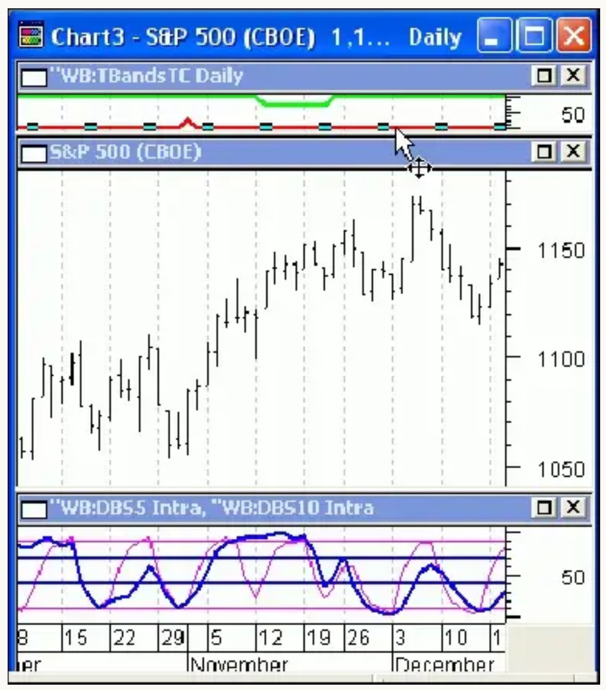

1. Load one of the Timing Band Templates. This is done by right clicking on a chart and choosing "Apply Template". Templates are used to obtain a consistent style/color of the Timing Bands and oscillators.

2. The starting dates should be entered.
   - The T-T is a bottom-to-bottom indicator, so a bottom date must be entered to project the time band for the NEXT cycle bottom.
   - The T-C is a bottom-to-top indicator, so enter the bottom date and it will project the time band for the NEXT cycle top.
   - The C-T is a top-to-bottom indicator, so it needs a top date and projects a Timing Band for the NEXT cycle bottom.

> Timing Bands are NOT automatic. They do require user input. Each Timing Band requires the input of a date as a starting point for the Timing Band to plot.

To enter or change dates or other inputs for any of the Timing Bands, right click on the indicator in the subgraph as shown by the arrow in the chart to the left, and the Properties Panel opens as shown on the following page.

The way to enter dates or modify input information is to right click on the indicator in the subgraph and go to inputs. Like this --

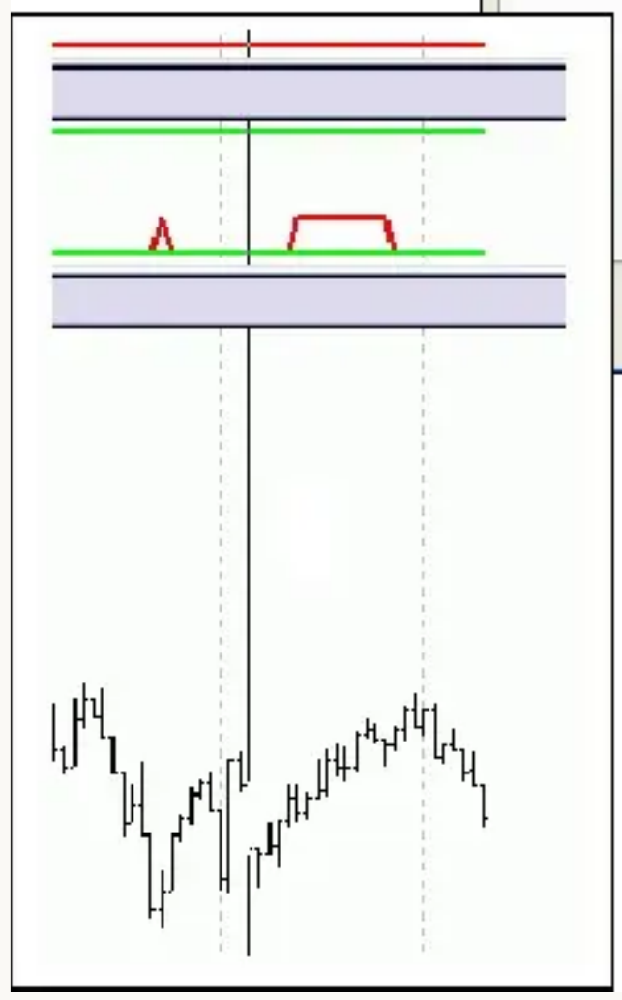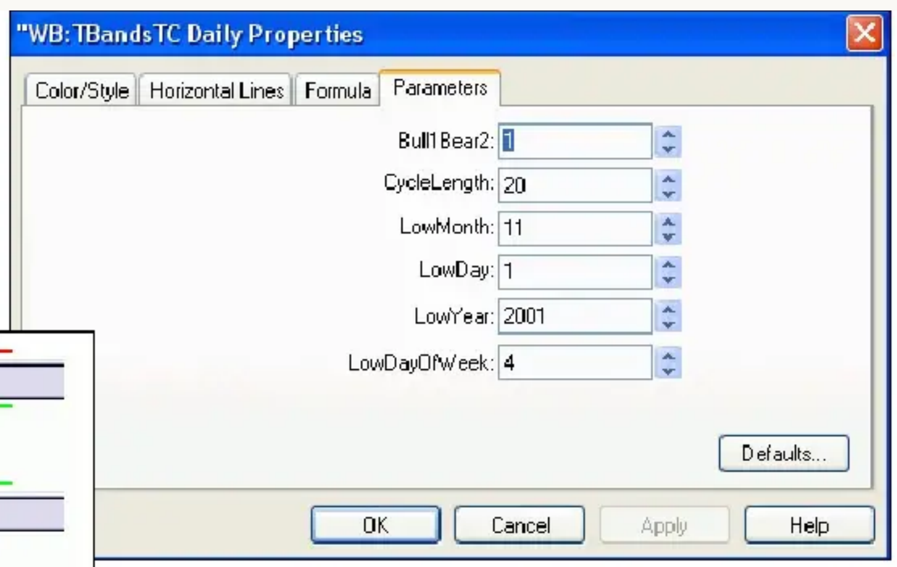

The Parameters tab of the Properties panel shows the inputs for the Trough-to-Crest (TBandsTC) Timing Band:

- **Bull/Bear?:** 2
- **CycleLength:** 20
- **LowMonth:** 11
- **LowDay:** 7
- **LowYear:** 2001
- **LowDayOfWeek:** 4

Now the Timing band should produce two blips. The first one is a single blip to identify the chosen starting point and the other, a longer blip, is the projected bottom. Do this for each Timing Band. The chart on the left shows what it should look like.

It is recommended that you study the manual and practice entering Timing Band dates. Once you are comfortable with entering dates, you will find the Timing Bands to be of great value.

> For trading the S&P Index intraday, the price data should be for the day session only.

### Template 9a — Trough-to-Crest Timing Band

**Template 9a — Wb T-C Tbands (EOD)**

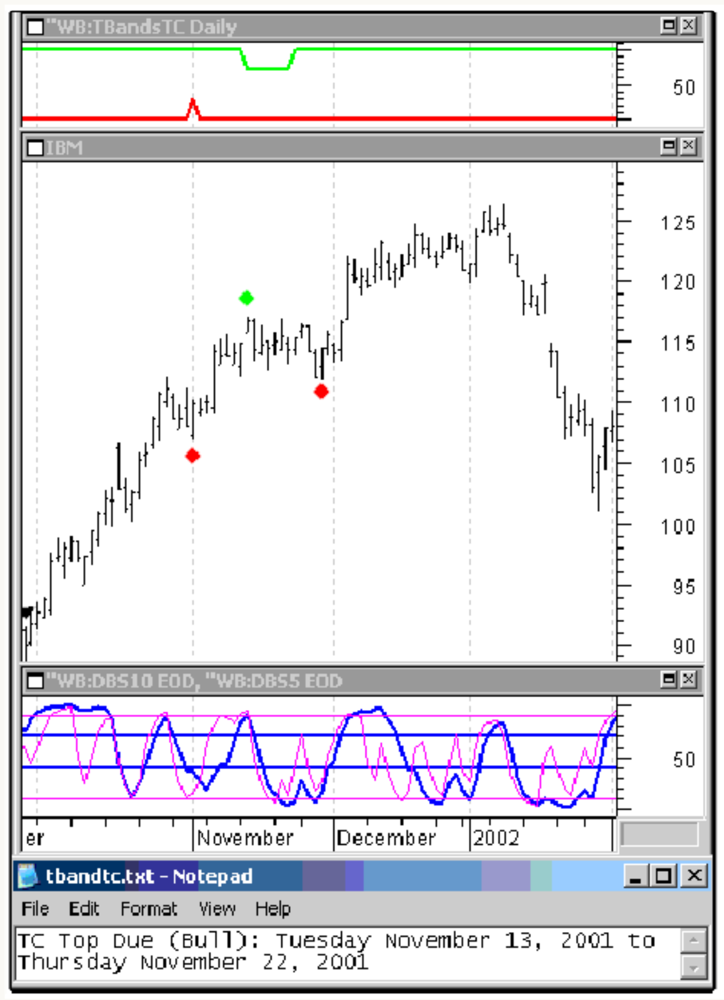

> **Expert Advisor — TC Top Due (Bull):** Tuesday November 13, 2001 to Thursday November 22, 2001

This chart shows the Trough-to-Crest Timing Band in a daily chart with the DBS5 and DBS10 oscillators plotted below prices.

The first trading cycle bottom is indicated by the red diamond; the trading cycle top by the green diamond; and the next trading cycle bottom by the red diamond.

In the Trough-to-Crest Time Band in the top Window, the red up-spike identifies the cycle bottom. The cycle bottom that starts the Trough-to-Crest count is identified in the price chart, either by visual inspection based on the oscillators, or a Mechanical Buy Signal.

Using the Expert Advisor (Page 44), the dates and days of the week that begin and end the Timing Band are forecasted, as at the bottom of the chart.

From that cycle low, the most probable time for the cycle to top is forecasted, and shows in the chart by the protrusion of the green line into the window, allowing you to watch for a Mechanical Sell Signal on your chart as prices enter into the Timing Band.

From the cycle low, identified by the first red diamond, the most probable time for the cycle to top is Tuesday, 11/13/01, thru Thursday, 11/22/02. This is the same time period shown by the green protrusion into the Window, but in real-time, you would not see the entire Band until it ends.

### Template 9b — Trough-to-Trough Timing Band

**Template 9b — Wb T-T Tbands (EOD)**

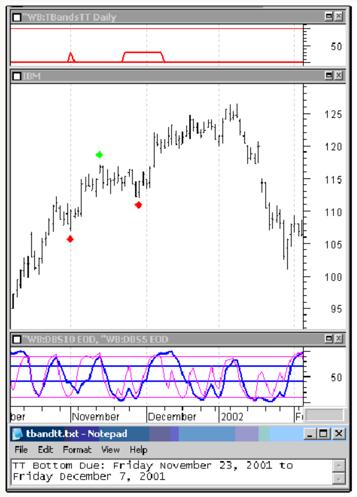

> **Expert Advisor — TT Bottom Due:** Friday November 23, 2001 to Friday December 7, 2001

At the time the Trough-to-Crest forecast is made from the cycle low, a Trough-to-Trough forecast can also be made from the same cycle low, allowing you to set an expectation for the approximate time period for the next cycle bottom.

The Trough-to-Trough Timing Band shows this time period by the protrusion of the red Band into the Window. The red up-spike identifies the cycle low from which the Timing Band is plotted.

Once the cycle low is confirmed by a Buy Signal, the days of the week, and dates for the beginning and end of the Trough-to-Trough Timing Band can be seen using the Expert Advisor. Therefore, from a cycle bottom, the approximate time periods for the cycle to top, and bottom can be anticipated.

As time progresses, the market will top and a third Timing Band can be plotted, called the Crest-to-Trough Band, which helps fine-tune the identification of the time period for the next cycle low.

### Template 9c — Crest-to-Trough Timing Band

**Template 9c — Wb C-T Tbands (EOD)**

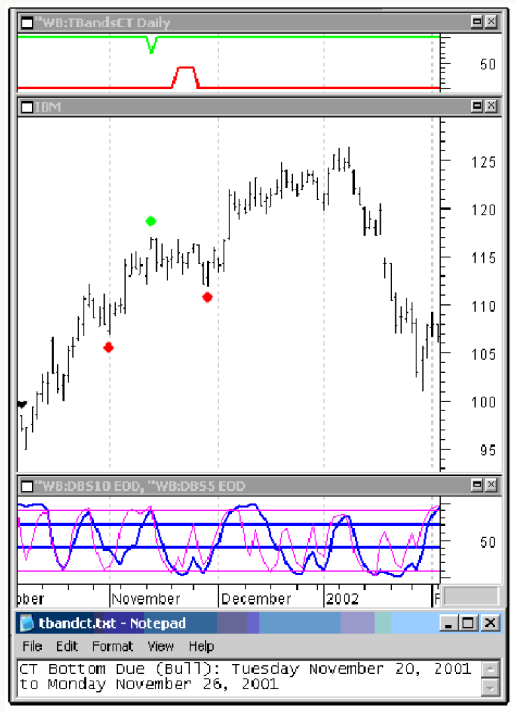

> **Expert Advisor — CT Bottom Due (Bull):** Tuesday November 20, 2001 to Monday November 26, 2001

The Crest-to-Trough Timing Band identifies the cycle high (crest) with a green down-spike. It is the same high as the green diamond shown on the price chart.

The upside protrusion of the red line shows the Crest-to-Trough Timing Band, and ideally a cycle will bottom in the overlap of the Crest-to-Trough, and Trough-to-Trough Timing Bands.

Using the Expert Advisor, the actual dates of the days and days of the week are shown at the bottom of the chart.

The Timing Bands can be plotted individually on separate charts as we have done here, but the most comprehensive picture can be seen with all three Timing Bands plotted on the same chart.

### Template 9 Combo — EOD Timing Bands

**Template 9 EOD — Wb Tbands_T-t_T-c_C-t**

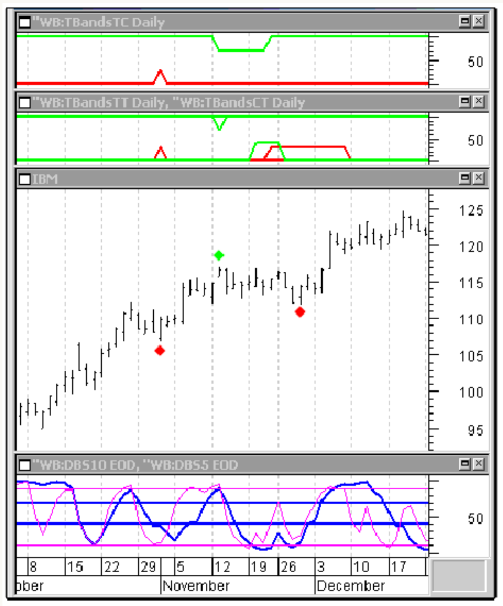

Each of the three Timing Bands has a Template, allowing the individual Timing Bands to be plotted on any chart. Template #9 plots all three Time Bands on the same chart.

Now that you have entered the Inputs and plotted the separate Timing Bands, this will be the template you use to forecast future Timing Bands from each cycle bottom/top as you are trading...

In this chart, the Trough-to-Crest Band and Trough-to-Trough Band would be plotted at the same time, as the cycle low is identified by the red up-spikes in the top window for the Trough-to-Crest Band, and in the Window below it for the Trough-to-Trough Band.

In the top Window, the time period for the cycle crest shows by the protrusion of the green line into the Window. The Expert Advisor can also be used to get the exact dates and days of the week.

In the second Window, the Trough-to-Trough Band would have been plotted when the cycle low was identified, providing an element of time for the next cycle bottom that can greatly enhance your timing and trading perspective.

Once the cycle top is identified by an oscillator or Mechanical Signal, the Crest-to-Trough Band is plotted in the second Window as a green line, allowing you to see the overlap area of the two Time Bands. Ideally, a cycle bottom will occur in the overlap area, but this does not always occur. The key is to watch for a Mechanical Buy Signal, or oscillator pattern to confirm the cycle low while prices are in, or following the Timing Bands. The diamonds have been hand entered to show the cycle top and bottoms and are not plotted by the template.

### Template 9 Combo — Intra Timing Bands

**Template 9 Intra — Wb Tbands Bull_T-t_T-c_C-t**

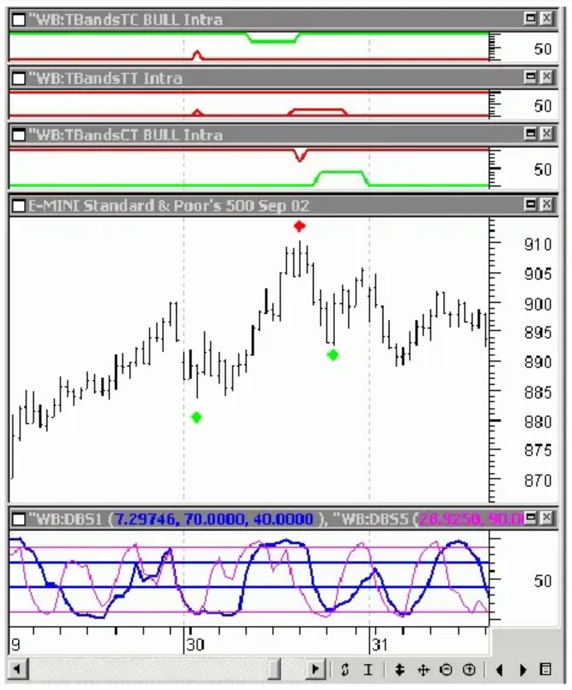

Template #9 plots all three Intra Time Bands on the same chart.

In this chart, the Trough-to-Crest Band and Trough-to-Trough Band would be plotted at the same time, as the cycle low is identified by the red up-spikes in the top window for the Trough-to-Crest Band, and in the Window below it for the Trough-to-Trough Band.

In the top Window, the time period for the cycle crest shows by the protrusion of the green line into the Window. Expert Advisor should also be used to get the exact intraday time periods for the forecasted future cycle tops and bottoms.

In the second Window, the Trough-to-Trough Band would have been plotted when the cycle low was identified, providing an element of time for the next cycle bottom that can greatly enhance your timing and trading perspective.

Once the cycle top is identified by an oscillator, or Mechanical Signal, the Crest-to-Trough Band is plotted in the third Window as a green line, allowing you to see the overlap area of the two Time Bands. Ideally, a cycle bottom will occur in the overlap area, but this does not always occur. The key is to watch for a Mechanical Buy Signal, or oscillator pattern to confirm the cycle low while prices are within, or following, the T-T, and/or C-T Timing Bands.

### In Summation

The Timing Bands are 40% Timing Bands, and 70% of the Bands occur in, or following the Timing Band as explained earlier.

A review of the Mechanical Buy/Sell Signals and trading patterns will show the cycle bottoms and tops in this example were identified by, and could have been traded by the ProfitTrader Mechanical Trading Signals.

The Timing Bands are not perfect, and cycle tops and bottoms do occur before and after the Bands; however, the Bands do give you an element of time not available through any other approach, and Mechanical Trading Signals that occur within the Timing Bands do generate high probability Buy/Sell Signals... But, as always, trade in the direction of trend, or at anticipated Trend Reversals.

> **TRADE WITH THE TREND** -- When the trend is UP, buy cycle and/or swing bottoms; when the trend is DOWN, sell cycle and/or swing tops.

The ProfitTrader EMA Trend Indicator lines and %Diffs, combined with the direction indicated by the longer-term oscillators will provide a confidence level for trend direction that is unique to cycle trading and ProfitTrader.

Developing this "confidence level" may take some study and experimentation to learn how to combine the ProfitTrader Trend Indicators with swings and the Mechanical Trading Signals that identify cycle tops and bottoms.

### MetaStock Expert Advisor

Expert Advisor will allow you to forecast the specific dates for the Timing Bands.

To forecast the time periods for future tops and bottoms, you can use the Timing Bands to visually show the time periods on the chart. However, you also have the option to use the Expert Advisor, which will give you the exact dates of the beginning and ending of each of the Timing Bands.

To use the Expert Advisor, have the TBand indicator on the chart with the required Inputs specified. With the TBand indicator on the chart and the Inputs specified, follow the steps below.

1. Right click on an open space in the price data chart and choose "Expert Advisor".
2. Then, choose "Attach".
3. Then, choose the appropriate commentary.
4. Next, right click in the Price Data Window again, and choose "Expert Advisor". This time, choose "Commentary", and a Window will pop up called "Commentary Window", with an icon of a box. Double click on the icon and the "Expert Commentary" text will come up projecting the beginning and ending dates/times for the cycle Timing Band.
5. Repeat the process for each of the other Timing Bands, recording them in a notebook as the Commentary text is erased when the next Commentary comes up.

### Timing Band Inputs — EOD

To help identify cycle tops and bottoms, the daily Timing Bands will forecast probable time periods for future tops and bottoms. The Timing Bands that plot on the daily charts in ProfitTrader for MetaStock show on your chart so you can also see when the cycle tops and bottoms are likely to occur. Using Expert Advisor, you can see and record the exact dates in which a cycle is expected to top and/or bottom.

- **Bull1Bear2:** A value of 1 in this Input will project the Bull Bands (with Right Translation); 2 will project the Bear Bands (with Left Translation).
- **Cyclelength:** Length of cycle. Cycle length can range from 14 to 27, or greater. Default is 20.

**Forecasting a Cycle Top (T-C)**

- **LowMonth:** The month number (January is 1; February is 2, etc.)
- **LowDay:** The day of the month (1 through 31)
- **LowYear:** The year (i.e., 2002)
- **LowDay of Week:** Day of week (Monday is 1; Tuesday, 2, etc.)

**Forecasting a Cycle Bottom (T-T)**

- **LowMonth:** The month number (January is 1; February is 2, etc.)
- **LowDay:** The day of the month (1 through 31)
- **LowYear:** The year (i.e., 2002)
- **LowDay of Week:** Day of week (Monday is 1; Tuesday, 2, etc.)

**Forecasting a Cycle Bottom (C-T)**

- **HighMonth:** The month number (January is 1; February is 2, etc.)
- **HighDay:** The day of the month (1 through 31)
- **HighYear:** The year (i.e., 2002)
- **HighDayOfWeek:** Day of week (Monday is 1; Tuesday, 2, etc.)

**Style:** Use Styles from Templates

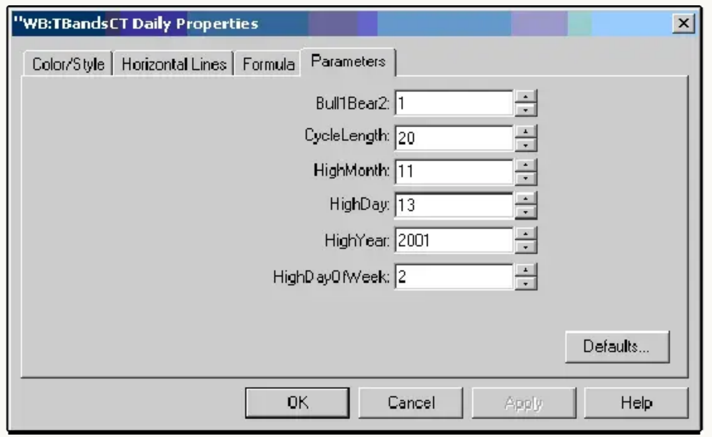

*MetaStock Daily Properties dialog box on the Formula Parameters tab. Crest-to-Trough (C-T) Example. WB:TBandsCT Daily Properties (Crest-to-Trough, C-T): Bull1Bear2 = 1, CycleLength = 20, HighMonth = 11, HighDay = 13, HighYear = 2001, HighDayOfWeek = 2.*

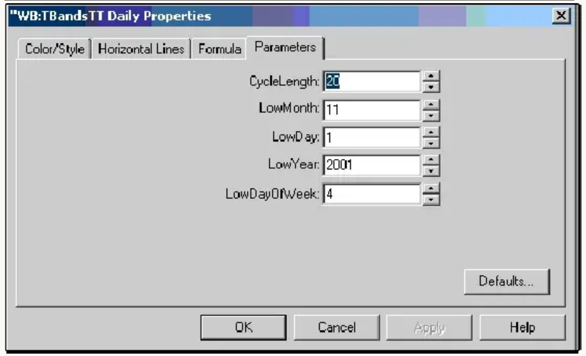

*MetaStock Daily Properties dialog box on the Formula Parameters tab. Trough-to-Trough (T-T) Example. WB:TBandsTT Daily Properties (Trough-to-Trough, T-T): CycleLength = 20, LowMonth = 11, LowDay = 1, LowYear = 2001, LowDayOfWeek = 4.*

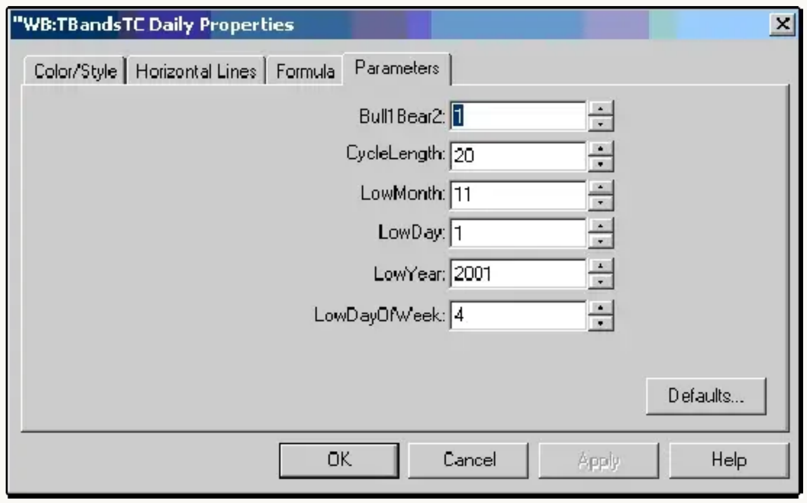

*MetaStock Daily Properties dialog box on the Formula Parameters tab. Trough-to-Crest (T-C) Example. Trough-to-Crest (T-C) example: Bull1Bear2 = 1, CycleLength = 20, LowMonth = 11, LowDay = 1, LowYear = 2001, LowDayOfWeek = 4.*

### Timing Band Inputs — Intraday

The Intra Timing Bands will plot on intraday charts. The Inputs are different than the EOD Timing Bands.

- **Interval:** The time period of the price bar; 15 for a 15 minute bar chart; 60 for a 60 minute bar chart, etc.
- **Date:** Must be entered as shown (month, day, year)
- **Time:** The time the price bar ends.
- **Day:** The DayOfWeek (1 for Monday — 5 for Friday)
- **CycleLen:** The length of the intraday cycle. There is a strong tendency for intraday cycle time periods to be 18 price bars (+/-4) for most intraday time periods exemplifying the fractal nature of the markets.

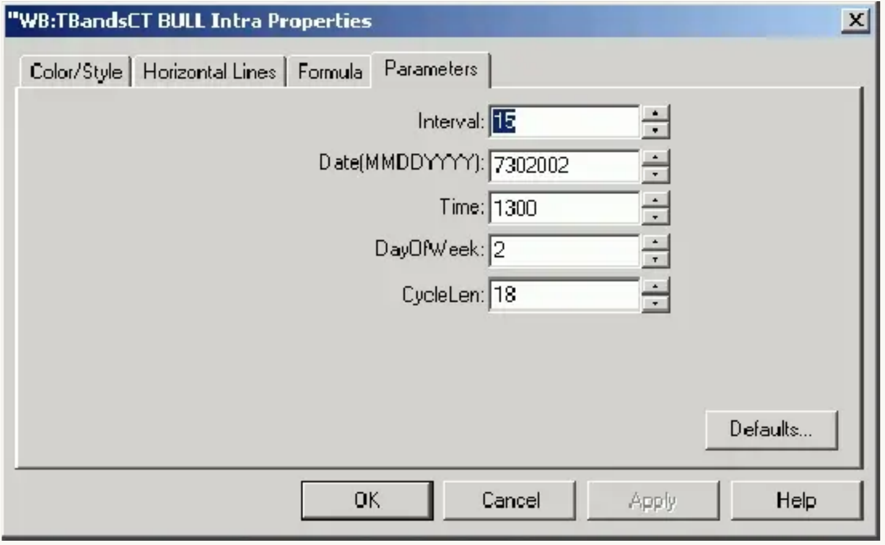

*MetaStock Intra Properties dialog boxe on the Formula Parameters tab. Crest-to-Trough (C-T) Example. WB:TBandsCT BULL Intra Properties (Crest-to-Trough, C-T): Interval = 15, Date(MMDDYYYY) = 7302002, Time = 1300, DayOfWeek = 2, CycleLen = 18.*

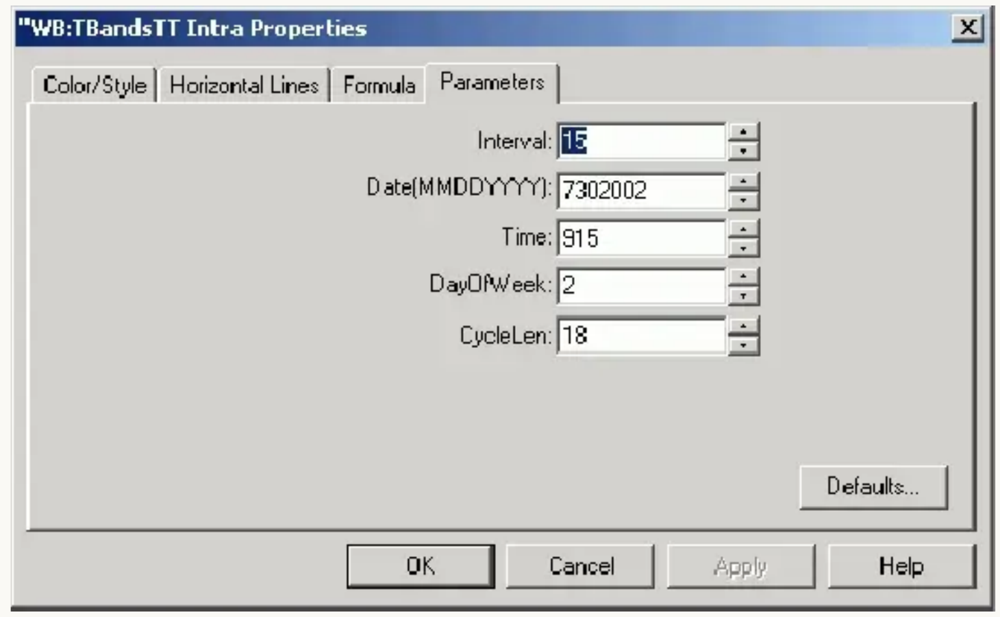

*MetaStock Intra Properties dialog boxe on the Formula Parameters tab. Trough-to-Trough (T-T) Example. WB:TBandsTT Intra Properties (Trough-to-Trough, T-T): Interval = 15, Date(MMDDYYYY) = 7302002, Time = 915, DayOfWeek = 2, CycleLen = 18.*

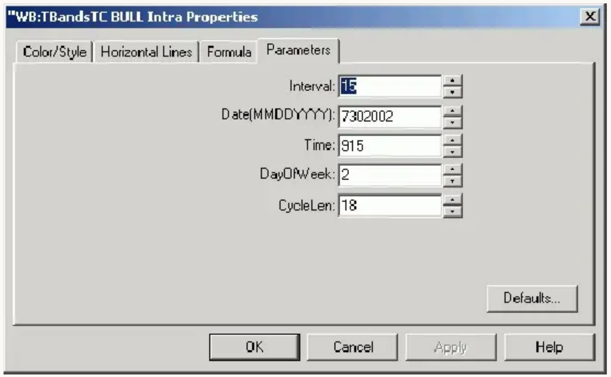

*MetaStock Intra Properties dialog boxe on the Formula Parameters tab. Crest-to-Trough (T-C) Example. WB:TBandsTC BULL Intra Properties dialog box on the Formula Parameters tab for the intraday Trough-to-Crest example: Interval = 15, Date(MMDDYYYY) = 7302002, Time = 915, DayOfWeek = 2, CycleLen = 18.*

### Timing Band Exercise

Follow these steps to use the Timing Bands to project time periods for future cycle tops and bottoms.

> When changing the year do NOT use the UP/DOWN ARROW. This will not work as it puts decimals in the year (2003.200). You must manually type in the year you want like "2003".

The best way to become familiar with the Timing Bands is to go back several months in a daily chart to forecast the cycle tops and bottom Timing Bands as they plot forward.

Putting the Timing Band indicators on the chart using the Templates included in ProfitTrader.

1. Right click on a chart | Click on "Apply Template" to view a list of templates | Choose Template 9a-Wb-T-C Tbands EOD (the EOD Trough-to-Crest Timing Band).

   You will see the Trough-to-Crest Band on the top, with prices below it, and the oscillators below prices.

2. Enter the date, etc., and you will see a "blip" on the chart showing the count start point. The projected time period will show as a "hump".

   If it is a historical projection, you do not need to use the Experts. But if the time projection is off the screen and into the future, then you must apply the TT Expert Advisor, then apply the commentary. This is explained on Page 44.

3. Right-click on the chart | Choose "Expert Advisor" | Choose "Attach" | Choose the "TBand TT Expert", "TC Expert" or "TT Expert".

4. Then, Right-click on the chart again | Choose Expert Advisor | Choose Commentary. You will see an icon to click on to give the future time projection.

Next, plot the Trough-to-Trough Timing Band with Template 9b_Wb T-T TBands (EOD) on Page 39. This will plot the Trough-to-Trough Timing Band. Then, when a cycle top has been identified, plot the Crest-to-Trough Timing Band Template 9c_Wb C-t TBands (EOD) on Page 40.

> The template you will use for trading is the EOD Timing Band Template 9 Combo that plots all three Timing Bands (Template 9 EOD_Wb Tbands_T-t T-c C-t). With the experience of using the three individual Templates, it will be easy to use this single Template.

### Cycle Lengths

| Market | Daily Cycle Length | Weekly Cycle Length |
| --- | --- | --- |
| DJIA | 20 | 20 |
| S&P Index | 20 | 20 |
| NASDAQ | 20 | 20 |
| TBonds | 20 | 21 |
| 10 Year Bonds | 20 | 21 |
| Gold | 18 | 18 |
| Silver | 25 | 19 |
| Copper | 18 | 15 |
| Euro | 20 | 20 |
| CRB Index | 20 | 20 |

To determine the cycle length for any market, follow these steps.

Cycles are measured from bottom-to-bottom and most markets have cycle lengths of 14-28 price bars (days, weeks and intraday time frames).

1. Plot the blue 10DoubleStoc oscillator below prices. This oscillator tops and bottoms with approximately 70% of all cycles.
2. Start at the far left of the chart, and on the chart identify the low price bar as the 10DoubleStoc oscillator bottoms.
3. Count the price bars from bottom-to-bottom for 20, 30 or 50 cycles.
4. Then, calculate the average length from bottom-to-bottom and you will have a reasonably accurate cycle length to use with the Timing Bands.
5. Once you have the cycle length you can plot the Detrend Indicator, under the DoubleStoc for a better picture of the cycles.

## Section III: Explorations

ProfitTrader for MetaStock has 26 Explorations that will help you evaluate and trade securities, mutual funds and futures contracts based on:

- Markets overbought (cycle tops), or oversold (cycle bottoms),
- Trend direction.
- Generating Mechanical Sell Signals at cycle tops in downtrends.
- Generating Mechanical Buy/Sell Signals regardless of trend.
- Trend reversals and cycle direction (cycle tops and bottoms of longer time frames become trend reversals for the shorter time frames.
- The cycle direction shows trend—the cycle and oscillator direction in the weekly chart sets the trend for the daily chart, monthly for the weekly chart.
- Rising trading cycles for any time frame.
- Falling trading cycles for any time frame.
- Explorer Combinations - You can only run one Explorer at a time and they cannot be combined UNLESS the user creates his own Explorers. The indicator calls have been left open for that purpose.

> By default, the MetaStock Explorer will choose to load "Minimum Records" for each Exploration. This is not enough data. To increase the data, go to the Explorer List, highlight one of them and choose the "Options" button. Click on "Load Minimum Records". Change to "Load xxx Records". We recommend at least 1000 bars, and as high as 10,000 bars. Then, run your tests to see results.

### Exploration Descriptions

**WB:BLine is Falling** — A falling BLine is generally followed by a decline into a trading cycle bottom and a Buy Signal.

**WB:BLine is OB (Overbought)** — The BLine is OB when prices rise above the SellLine, and can be expected to make a cycle top and generate a Sell Signal.

**WB:BLine is OS (Oversold)** — The BLine is OS when prices fall below the BuyLine, and can be expected to make a cycle bottom and generate a Buy Signal.

**WB:BLine is Rising** — A rising BLine is generally followed by a rise into a trading cycle top and a Sell Signal.

**WB:BLine Buy** — Depending upon the market and time frame, approximately 80-90% of the Buy Signals occur as the cycle is rising from the cycle bottom.

**WB:BLine Sell** — Depending upon the market and time frame approximately 80-90% of the Sell Signals occur as the cycle is falling from the cycle top.

**WB:DBS is Falling** — A falling DBS is generally followed by a decline into a trading cycle bottom and a Buy Signal.

**WB:DBS is OB (Overbought)** — The DBS is OB when prices rise above the SellLine, and can be expected to make a cycle top and generate a Sell Signal.

**WB:DBS is OS (Oversold)** — The DBS is OS when prices fall below the BuyLine, and can be expected to make a cycle bottom and generate a Buy Signal.

**WB:DBS is Rising** — A rising BLine is generally followed by a rise into a trading cycle top and a Sell Signal.

**WB:DBS is Falling** — A falling DBS is generally followed by a decline into a trading cycle bottom and a Buy Signal.

**WB:DBS Buy** — The DBS Buy Signal is based on a DBS10 oscillator and identifies the trading cycle bottom with approximately 70% accuracy.

**WB:DBS Sell** — The DBS Sell Signal is based on a DBS10 oscillator and identifies the trading cycle top with approximately 67% accuracy.

**WB:DBS5 is Falling** — A falling DBS5 indicates prices are likely to continue lower until the DBS5 drops below 10, often making a swing low and/or ½ trading cycle or trading cycle bottom.

**WB:DBS5 is Rising** — A rising DBS5 indicates prices are likely to continue higher until the DBS5 rises above 90, often making a swing high and/or ½ trading cycle or trading cycle top.

**WB:DBS5 is OB (Overbought)** — When the DBS5 is above the SellLine at 90, the DBS5 Sell Signal can be expected to form a swing high and be followed by lower prices.

**WB:DBS5 is OS (Oversold)** — When the DBS5 is below the BuyLine at 10, the DBS5 Buy Signal can be expected to form a swing low and be followed by higher prices.

**WB:DBS5 Buy** — The DBS5 Buy Signal most often occurs at a daily trading cycle bottom or at a ½ trading cycle bottom. A Buy Signal will be confirmation that a swing low is in place and quite possibly a trading cycle or ½ trading cycle bottom as well.

**WB:DBS5 Sell** — The DBS5 Sell Signal most often occurs at a daily trading cycle top or at a ½ trading cycle top. A Sell Signal will be confirmation that a swing high is in place and quite possibly a trading cycle or ½ trading cycle top as well.

**WB:EMA Trend Down and Falling EMA %** — This usually shows a strong downtrend, and Sell Signals generated are often followed by sizeable downmoves.

**WB:EMA Trend Up and Rising EMA %** — This usually shows a strong uptrend, and Buy Signals generated are often followed by sizeable upmoves.

**WB:EMA %Diff Falling** — This often shows a short-term down trend, and swing highs can often be sold.

**WB:EMA %Diff Rising** — This often shows a short-term uptrend, and swing lows can often be bought.

**WB:EMA Trend DN and Falling** — The red EMA line below the blue often shows a strong downtrend.

**WB:EMA Trend UP and Rising** — The red EMA line above the blue often shows a strong uptrend.

**WB:High5** — This sell pattern generally occurs in downtrends and is often followed by 1 to 3+ days down to a swing low. It can be followed by a trend reversal up, following the swing low.

**WB:Low5** — This buy signal generally occurs in uptrends and is often followed by 1 to 3+ days up to a swing high. It can be followed by a trend reversal down.

## Section IV: Reference

Reference — Profitable Trading With ProfitTrader™ Oscillators and Mechanical Buy/Sell Signals. Each ProfitTrader™ Indicator is shown and explained with Styles and Inputs.

| | Page |
| --- | --- |
| **OSCILLATORS AND MECHANICAL BUY/SELL SIGNALS** | 58 |
| Bressert DBS10 Oscillator | 59 |
| Bressert DBS10 Buy/Sell Signals | 61 |
| Bressert DBS5 Oscillator | 63 |
| Bressert DBS5 Buy/Sell Signals | 65 |
| Bressert BLine Oscillator | 67 |
| Bressert BLine Buy/Sell Signals | 69 |
| Overbought/Oversold Buy/Sell Signals | 71 |
| **TREND** | 73 |
| EMA Trend Indicator | 74 |
| EMA %Diff | 76 |
| MA %Diff | 78 |
| **ADDITIONAL TOP AND BOTTOM INDICATORS** | 80 |
| Keltner Bands | 81 |
| Real-Time Detrend | 83 |

### Oscillators and Mechanical Buy/Sell Signals

The ProfitTrader™ oscillators are unique, and show oversold and overbought levels in all markets and all time frames. They are used to identify tops and bottoms, determine trend, and to generate high-probability Mechanical Buy/Sell Signals.

Based on Oscillator and Price Patterns, the Mechanical Buy and Sell Signals are generally 70% to 90% accurate in identifying cycle bottoms and tops. The Buy/Sell Signals are generated in two steps.

When the oscillator turns above or below an oscillator Buy/Sell Line, a potential change in market momentum is indicated by a colored up-spike (green) or down-spike (red), which identifies the "Setup Bar".

When prices exceed the high of a Buy Setup Bar, a Buy "Trigger Entry" occurs. When prices drop below the low of a Sell Setup Bar, a Sell "Trigger Entry" occurs. This increases the accuracy of the Buy/Sell Signals by 5% to 15% more than entering on the close of the Setup Bar.

The trading signals are most profitable when trading in the direction of trend.

Multiple entries for a Buy/Sell Signal on a single price bar are often more reliable indicators of significant cycle tops and bottoms than a single entry.

### Bressert Double Stochastic 10 Oscillator

**Indicator:** "WB:DBS10 EOD"

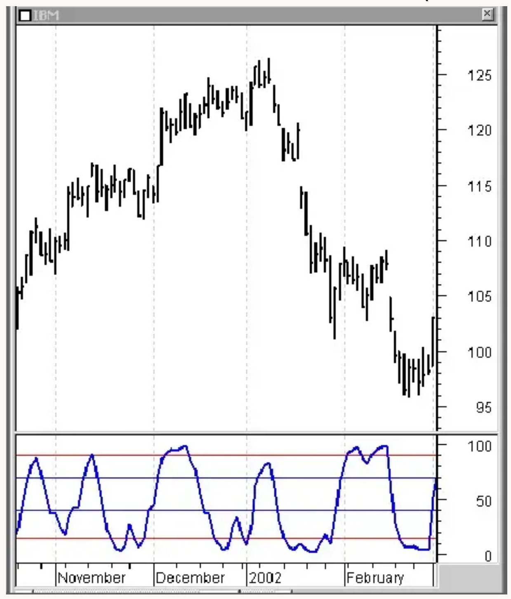

The Bressert DoubleStoc10 oscillator is the backbone of ProfitTrader™ because it tops and bottoms with approximately 70% of all cycle highs and lows, in all time frames, in all markets — stocks, bonds, currencies, futures, commodities, single stock futures, or... anything that can be charted. Many trading patterns are based upon an interaction with the Double Stochastic.

The default DoubleStoc10 (DBS10) is used to identify tops and bottoms of the "trading cycle"\* in all time frames. The DoubleStoc5 (5DBS) is used to help identify the one-half trading cycles and the trading cycle.

Most trading cycles average 14 to 27 price bars in days, weeks, and intraday time frames with a tendency to cluster around 18-20 price bars.

**The Original Stochastic vs. the Bressert DoubleStoc**

The original Stochastic often wiggles at tops and bottoms giving false buy/sell signals. The crossover (%D) is used in the original stochastic to offset these wiggles by using a rise above the crossover as a buy signal, and a drop below the crossover as a sell signal. Unfortunately, this often results in entry signals that have a sizeable dollar risk.

The Bressert Double Stoc reduces false signals and increases the accuracy of identifying cycle bottoms and tops with high probability Mechanical Buy/Sell signals.

*\*The "trading cycle" is the dominant cycle in any time frame that most often has cycle tops and bottoms accurately identified by the ProfitTrader oscillators and trading signals. These cycle lengths tend to be 14-27 price bars (days, weeks, and multiple intraday time periods).*

#### DBS10 Oscillator Styles and Inputs

**Indicator:** "WB:DBS10 EOD"

| Style | Color |
|-------|-------|
| DStoc | Blue |
| SellLine | Blue |
| BuyLine | Blue |

| Inputs | Default | Description |
|--------|---------|-------------|
| DSTLen | 10 | Strength of indicator; range 1-100 |
| SellLine | 70 | Adjusts the SellLine; range 70-100 |
| BuyLine | 40 | Adjusts the BuyLine; range 5-50 |

### Bressert Double Stoc 10 Buy/Sell Signal

**Indicator:** "WB:DBS10 B-S EOD"

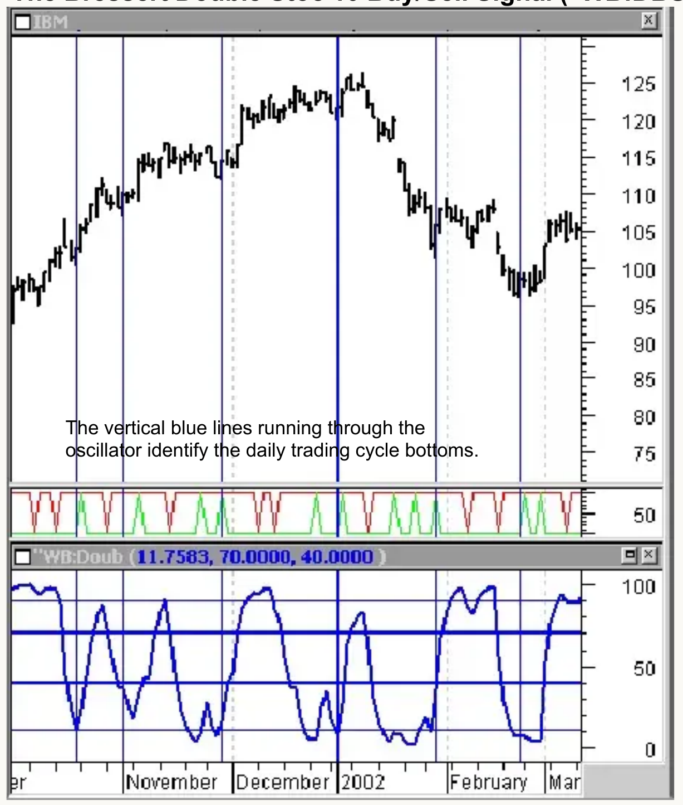

The Bressert Double Stochastic is a combination of a turn in the oscillator with a price move above/below the "Setup Bar", indicated by the colored up/down spikes.

When the DoubleStoc10 is above the Sell Line the market is often overbought, and a downturn in the oscillator can be followed by a downside move. When it is below the Buy Line the market is often oversold, and an upturn in the oscillator can be followed by an upside move. These turning points are most often trading cycle tops and bottoms. Such a turn will frequently indicate a daily, weekly or intraday trading cycle top or bottom. These trading signals average about 70% accuracy across all time frames.

An upturn in the oscillator below the Buy Line at 40 generates an up-spike to identify the Buy Setup Bar. A rise above the high of the Buy Setup Bar will trigger a Buy Entry Signal.

A downturn in the oscillator above the Sell Line at 70 will generate a down-spike to identify the Sell Setup Bar. A drop below the Sell Setup Bar will trigger a Sell Entry Signal.

The standard Buy and Sell Setup Bar lines are 70 for the Buy and 40 for the Sell. The OB/OS lines at 90 and 10 show when the oscillator is at extremes that often occur at cycle tops and bottoms.

The Expert Advisor identifies the Buy/Sell Setup Bars with up/dn arrows.

- **Down** — A red down-spike shows a Sell Setup Bar. A Sell Signal is generated when prices drop below the low of the Sell Setup Bar.
- **Up** — A green up-spike shows a Buy Setup Bar. A Buy Signal is generated when prices rise above the high of the Buy Setup Bar.

#### DBS10 Buy/Sell Signal Styles and Inputs

**Indicator:** "WB:DBS10 B-S EOD"

| Style | Color |
|-------|-------|
| DBS10 | Blue |

| Inputs | Default | Description |
|--------|---------|-------------|
| DSTLen | 10 | Strength of indicator; range 1-100 |
| SellLine | 70 | Adjusts the SellLine; range 70-100 |
| BuyLine | 40 | Adjusts the BuyLine; range 5-50 |

### Bressert Double Stochastic 5 Oscillator

**Indicator:** "WB:DBS5 EOD"

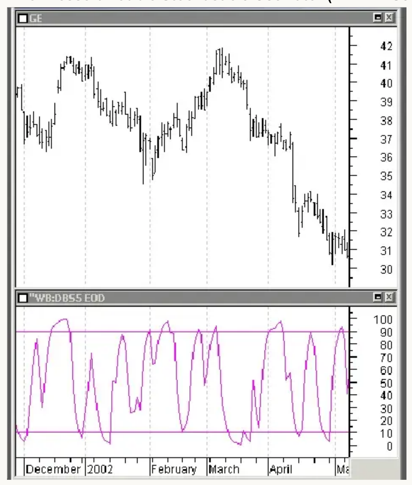

The DoubleStoc5 is a short-term oscillator used to help identify the one-half trading cycle tops and bottoms.

The DoubleStoc5 Buy Line is set at 10; the Sell Line, at 90, to identify the extremes often reached as the short-term cycles top and bottom.

This oscillator interacts with the DoubleStoc10 to help identify tops and bottoms of the full trading cycle, and also generates Buy and Sell Oscillator Patterns.

For more information on how to use this oscillator and the Buy/Sell Signals, see the DBS10 and DBS5 Buy/Sell Signals.

#### DBS5 Oscillator Styles and Inputs

**Indicator:** "WB:DBS5 EOD"

| Style | Color |
|-------|-------|
| DStoc | Magenta |
| SellLine | Red |
| BuyLine | Red |

| Inputs | Default | Description |
|--------|---------|-------------|
| DSTLen | 5 | Strength of indicator; range 1-100 |
| SellLine | 90 | Adjusts the Sell Line; range 70-100 |
| BuyLine | 10 | Adjusts the Buy Line; range 5-50 |

### Bressert Double Stoc 5 Buy/Sell Signal

**Indicator:** "WB:DBS5 B-S EOD"

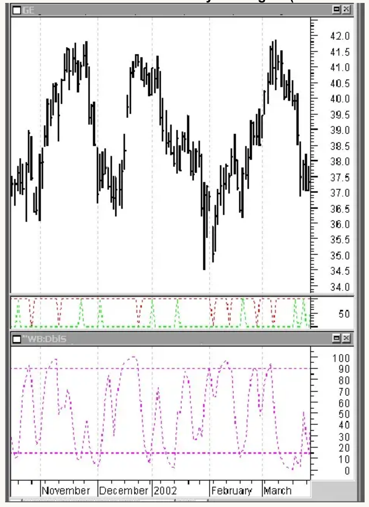

The Double Stoc oscillator generates a Sell Signal when prices are above the 90 Sell Line and turn down. It generates a Buy Signal when prices are below the 10 Sell Line and turn up.

The green up-spikes occur below the Buy Setup Bars, and a rise above the high of the Bull Setup Bar will generate an entry signal.

The red down-spikes occur below the Sell Setup Bars and a drop below the price low of a Sell Setup Bar will generate a sell signal.

Buy/Sell Signals are most profitable when traded in the direction of trend.

The Expert Advisor identifies the Buy/Sell Setup Bars with up/dn arrows.

- **Down** — A red down-spike shows a Sell Setup Bar. A Sell Signal is generated when prices drop below the low of the Sell Setup Bar.
- **Up** — A green up-spike shows a Buy Setup Bar. A Buy Signal is generated when prices rise above the high of the Buy Setup Bar.

#### DBS5 Buy/Sell Signal Styles and Inputs

**Indicator:** "WB:DBS5 B-S EOD"

| Style | Color |
|-------|-------|
| DBS5 | Magenta |

| Inputs | Default | Description |
|--------|---------|-------------|
| DSTLen | 5 | Strength of indicator; range 1-100 |
| SellLine | 90 | Adjusts the SellLine; range 70-100 |
| BuyLine | 10 | Adjusts the BuyLine; range 5-50 |

### Bressert BLine Oscillator

**Indicator:** "WB:BLine EOD"

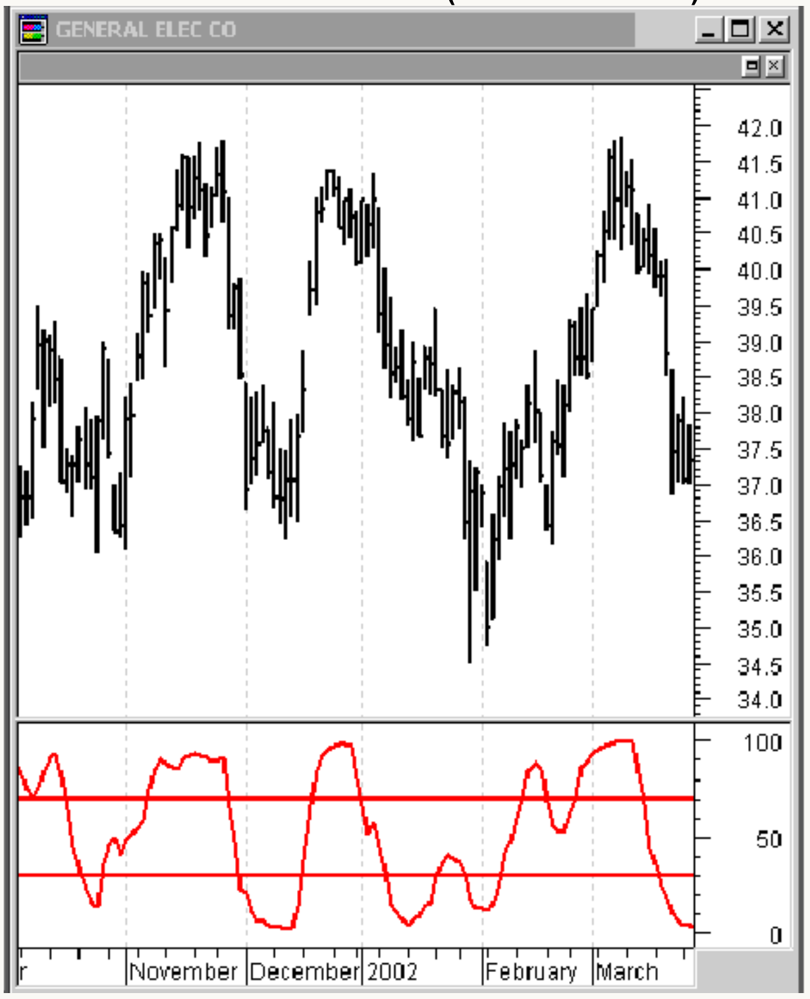

The Bressert BLine is an RSI based indicator designed to identify trading cycles in all time frames. It turns somewhat slower than the Bressert Double Stochastic, but has a higher accuracy in identifying trading cycle tops and bottoms. The Double Stoc Buy/Sell signal averages about 70% across all time frames; the BLine averages better than 80% across all time frames. This means that where the oscillator turns above or below a Buy Sell Line, odds are 80% that prices will continue to move in the direction of the B/S Signal.

At times the Bressert BLine will generate a Setup Bar/Entry signal at the same time as the Double Stoc. At other times, it will generate a Setup Entry signal following the Double Stoc, confirming the Double Stoc signal.

#### BLine Oscillator Styles and Inputs

**Indicator:** "WB:BLine EOD"

| Style | Color |
|-------|-------|
| BLine | Red |
| BLine_SL | Red |
| BLine_BL | Red |

| Inputs | Default | Description |
|--------|---------|-------------|
| SellLine | 70 | Adjusts the SellLine; range 70-100 |
| BuyLine | 30 | Adjusts the BuyLine; range 5-50 |

In most markets a single 50 Buy/Sell Line will give only slightly less accuracy (about 5%), but gives many more trading signals (20% to 100% more) depending upon the market and time frame.

### Bressert BLine Buy/Sell Signal

**Indicator:** "WB:BLine B-S EOD"

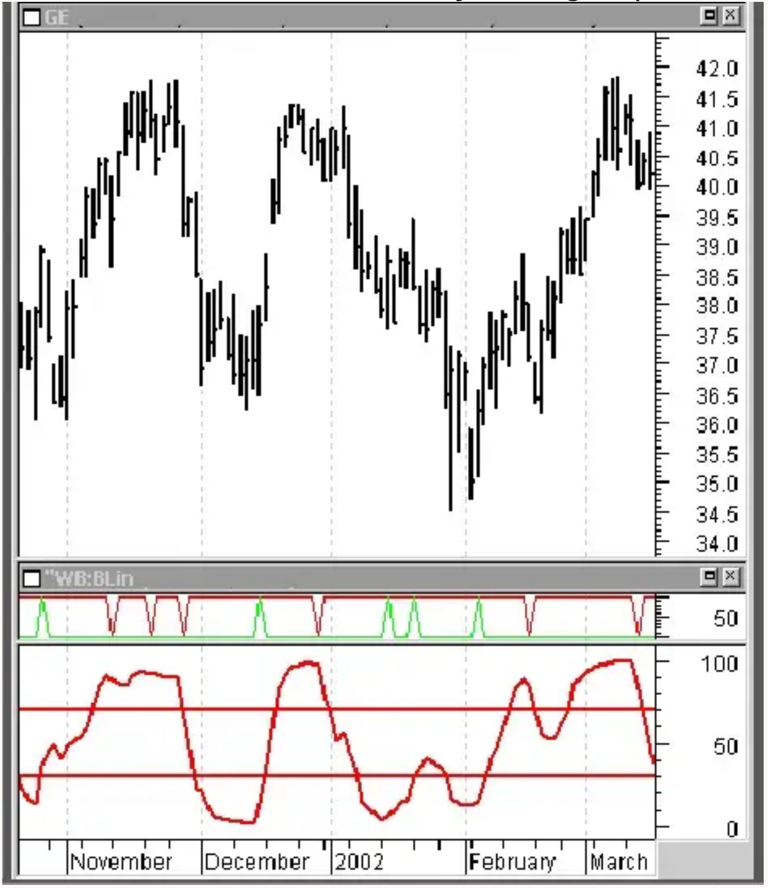

The BLine oscillator turns more slowly than the Double Stoc, and the BLine Buy/Sell signals tend to occur either a bar or more later than the Double Stoc, or on the same price bar. However, the BLine signals are more accurate, averaging 90% confirmation of cycle bottoms and 80% confirmation of cycle tops across all time frames.

Odds are 80%+ that following a Buy or Sell Signal prices will continue in the direction of the trade until the cycle tops or bottoms.

The Expert Advisor identifies the Buy/Sell Setup Bars with up/dn arrows.

- **Down** — A red down-spike shows a Sell Setup Bar. A Sell Signal is generated when prices drop below the low of the Sell Setup Bar.
- **Up** — A green up-spike shows a Buy Setup Bar. A Buy Signal is generated when prices rise above the high of the Buy Setup Bar.

#### BLine Buy/Sell Signal Style and Inputs

**Indicator:** "WB:BLine B-S EOD"

| Style | Color |
|-------|-------|
| Use style from templates | Red |

| Inputs | Default | Description |
|--------|---------|-------------|
| SellLine | 70 | Adjusts the SellLine; range 70-100 |
| BuyLine | 30 | Adjusts the BuyLine; range 5-50 |

### OB/OS Buy/Sell Signal

**Indicator:** "WB:OB OS B-S EOD"

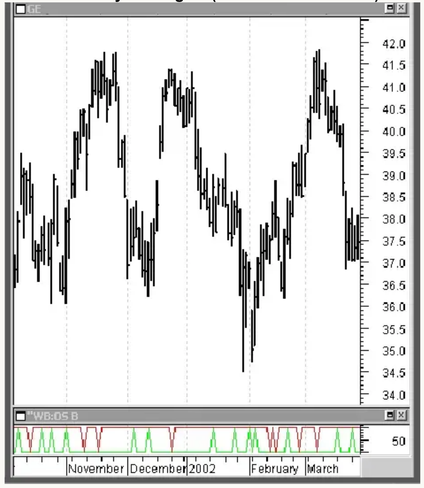

OB and OS Mechanical Buy/Sell Signals are designed to trade at cycle tops and bottoms, and follow the same pattern of a setup bar and trigger entry. Accuracy of cycle identification is about the same as the Double Stoc, but these signals will often occur a bar earlier the Double Stoc signals resulting in lower dollar risk.

The Expert Advisor identifies the Buy/Sell Setup Bars with up/dn arrows.

- **Down** — A red down-spike shows a Sell Setup Bar. A Sell Signal is generated when prices drop below the low of the Sell Setup Bar.
- **Up** — A green up-spike shows a Buy Setup Bar. A Buy Signal is generated when prices rise above the high of the Buy Setup Bar.

#### OB/OS Buy/Sell Signal Style and Inputs

**Indicator:** "WB:OB OS B-S EOD"

| Style | Color |
|-------|-------|
| Use style from templates | Red |

| Inputs | Default | Description |
|--------|---------|-------------|
| SellLine | 65 | Adjusts the SellLine; range 60-100 |
| BuyLine | 40 | Adjusts the BuyLine; range 5-50 |

### Trend Indicators

**PAY ATTENTION TO TREND**

Buy and Sell Signals should generally be traded in the direction of the trend, and at trend reversals.

The most important aspect in trading the market is trend. The only "Holy Grail" of trading is — Trade with the trend; if it is up, buy the dips; if it is down, sell the rallies. We use four indicators to help identify trend and trade trend. Once trend is identified, cycles are used to buy bottoms in the direction of trend, if up; or sell tops in the direction of trend, if down. Also, using cycles, we can anticipate and trade trend reversals.

The direction of the trading trend is explained in greater detail in Section II: Template Nos. 6 and 6A.

### EMA Trend Indicator

**Indicator:** "WB:EMA Trend EOD"

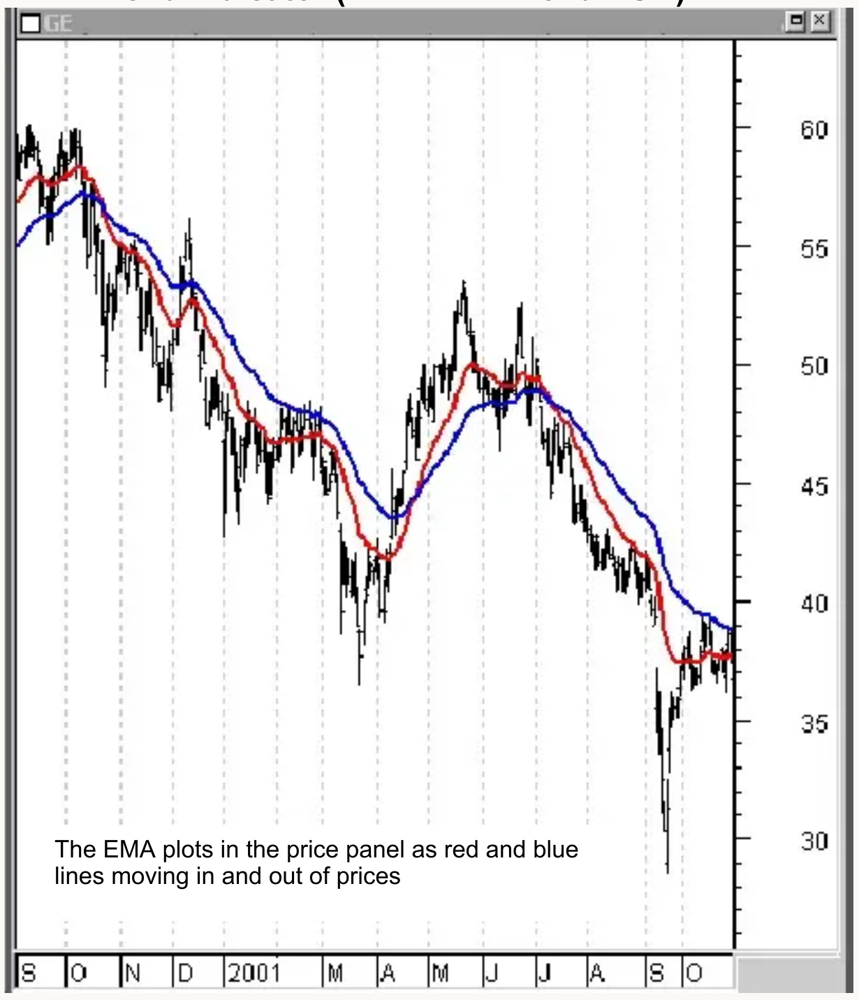

In trading, trend is all-important. The direction of the longer-term cycle sets the trend for the shorter-term trading cycle. The EMA Trend indicator visually shows when market momentum is up and the longer-term trend is up. It also shows when a market is weak and longer-term trend is likely to continue down.

The safest trades most often occur in the direction of trend. When it is up, buy the dips (cycle bottoms); and when it is down, sell the rallies (cycle tops). This indicator will help identify high probability Trade Entry Buy Signals in an uptrend, and high probability Trade Entry Sell Signals in a downtrend.

When the red line is above the blue EMA line the trend is up. When a cycle bottom is made and the red line remains above the blue EMA line as a Trade Entry Buy Signal is generated, an up move can often be expected into the cycle high.

When the red EMA line is below the blue EMA line, the longer-term trend is down. When a cycle top is made and the red EMA line remains below the blue EMA line as a Trade Entry Sell Signal is generated, a downmove can often be expected into the cycle bottom.

The EMA plots in the price panel as red and blue lines moving in and out of prices.

#### EMA Trend Indicator Styles and Inputs

**Indicator:** "WB:EMA Trend EOD"

Use this indicator to keep you on the right side of the longer-term trend. See Template 6 and 6A.

| Style | Color |
|-------|-------|
| SMA | Red |
| LMA | Blue |

| Inputs | Default |
|--------|---------|
| SEMA | 23 |
| LEMA | 50 |

### EMA %Diff Indicator

**Indicator:** "WB:EMA%Diff EOD"

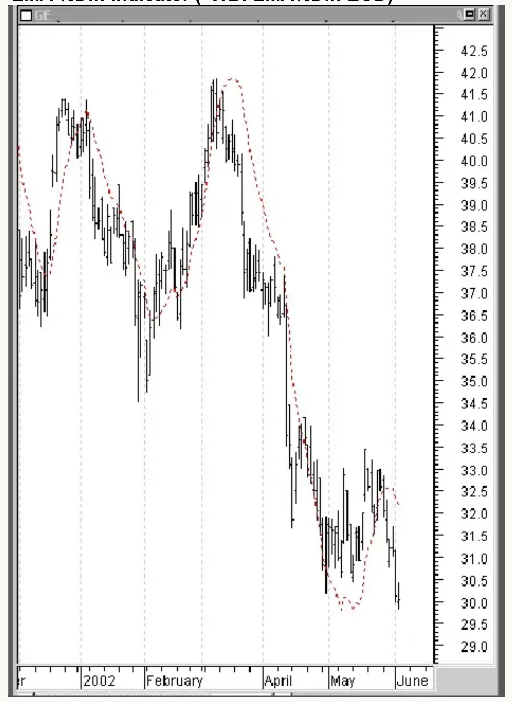

The trend is often shown by the EMA %Diff, which is the percentage difference between the red and blue EMA lines. When the EMA %Diff is moving up, the trading trend is up; when moving down, the trading trend is down. The oscillator generated Mechanical Buy/Sell signals can often be taken in the direction of the EMA %Diff. Certain patterns in the EMA %Diff can also help confirm trading cycle tops and bottoms.

The EMA %Diff plots as a thin red line in the price panel showing the direction of the trading trend.

#### EMA %Diff Indicator Style and Inputs

**Indicator:** "WB:EMA%Diff EOD"

Use this indicator to keep you on the right side of the trend. See Template 6 and 6A.

| Style | Color |
|-------|-------|
| %EMA | Red |

| Inputs | Default |
|--------|---------|
| SEMA | 23 |
| LEMA | 50 |

### MA %Diff Indicator

**Indicator:** "WB:MA%Diff EOD"

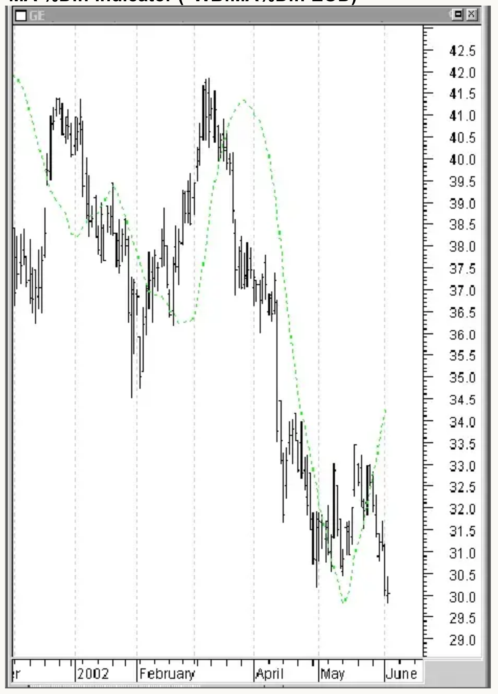

The calculation for this indicator is the same as the EMA %Diff, except the MA%Diff uses regular moving averages, which makes it less responsive than the EMA%Diff. The resulting divergent patterns help identify cycle tops and bottoms.

The MA%Diff plots as a green line in the price panel showing the direction of the trading trend.

#### MA %Diff Style and Inputs

**Indicator:** "WB:MA%Diff EOD"

Use this indicator to keep you on the right side of the trend. See Template 6.

| Style | Color |
|-------|-------|
| %MA | Green |

| Inputs | Default |
|--------|---------|
| SMA | 23 |
| LMA | 50 |

### Additional Top and Bottom Indicators

Most cycles top and bottom when a market is overbought or oversold. While the BLine and Double Stoc oscillators show these extremes when the oscillators are above 90 and below 10, the Keltner Bands and Real-Time Detrend will often show the extremes a market can reach. When the oscillators are overbought/oversold and the markets reach the extremes indicated by the Keltner Bands and Detrend, a trading signal in the opposite direction will frequently confirm a cycle top or bottom.

### Keltner Bands

**Indicator:** "WB:Keltner Channel EOD"

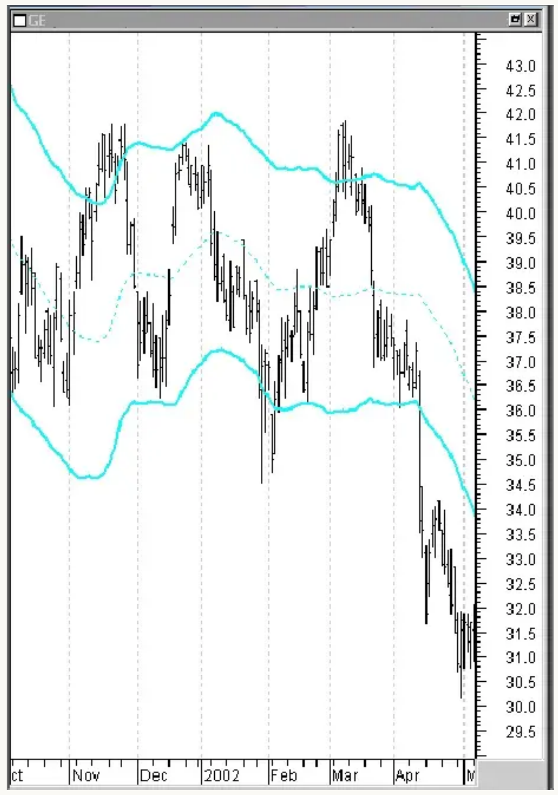

The Keltner Bands are the cyan bands above and below price activity.

Keltner Bands are standard deviation based channels that often provide support/resistance at the channels or the centerline.

Keltner Bands are an excellent analytical trading tool to determine support and resistance levels in trending markets and to identify support/resistance levels and breakouts of congestion ranges.

A Keltner Band is based on a 45-day moving average (day, week, month, intraday price bar, etc.), and a standard deviation move away from the 45-bar based on the average true range.

Combining Keltner Bands with the timing of cycles, the Bressert Double Stoc, and other technical indicators gives you price objectives for tops and bottoms, and support and resistance levels for trend reversals.

The accuracy of top and bottom identification is greatly increased.

#### Keltner Bands Style and Inputs

**Indicator:** "WB:Keltner Channel EOD"

| Style | Color |
|-------|-------|
| CentLine | Cyan |
| Upper | Cyan |
| Lower | Cyan |

| Inputs | Default | Description |
|--------|---------|-------------|
| EMALen | 45 | Range 1- 300 |
| StdDev | 4.2 | Range 2.0 - 15.0 |
| HighLow | 1 | Reserved for future development. |

### Real-Time Detrend

**Indicator:** "WB:Detrend RT EOD"

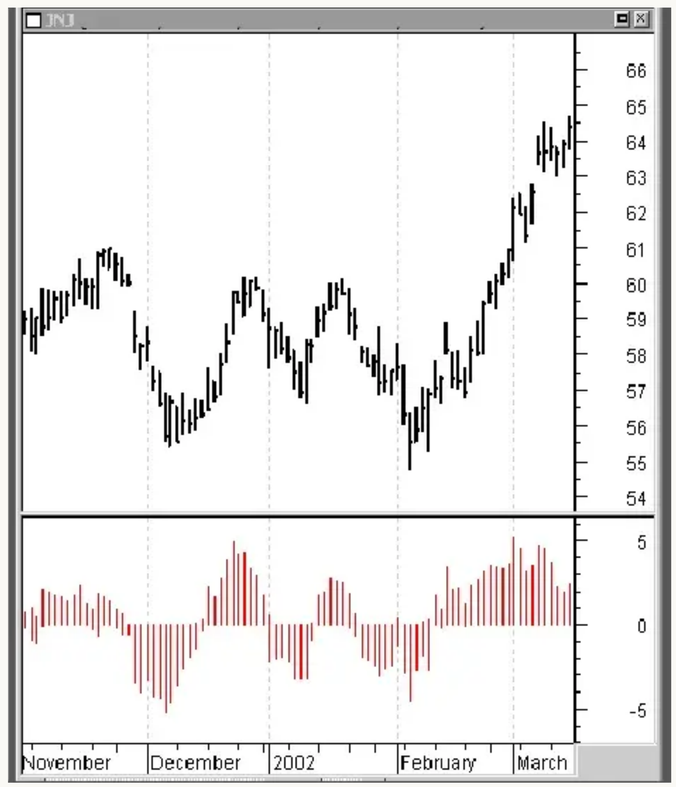

The Real-Time Detrend shows cycle tops and bottoms by subtracting a moving average one-half the length of the trading cycle from the price bar. To see highs and lows for a 20-day cycle, insert 10 into the Average Length Input.

This indicator can be used with the oscillators to help pinpoint cycle bottoms and tops.

#### Real-Time Detrend Style and Inputs

**Indicator:** "WB:DeTrend RT EOD"

| Style | Color |
|-------|-------|
| CMA High / CMA Low | Red Histogram |
| BuyLine / SellLine | Red Histogram |

| Inputs | Default | Description |
|--------|---------|-------------|
| DeTrend EMALen | 10 | Length |
