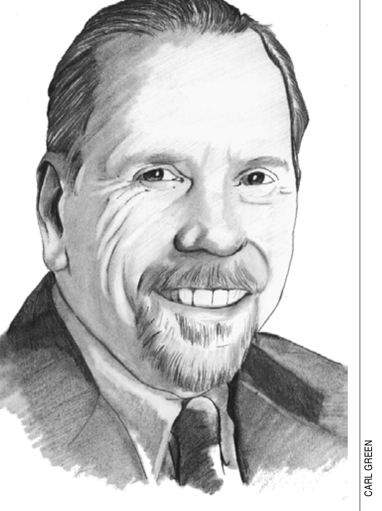
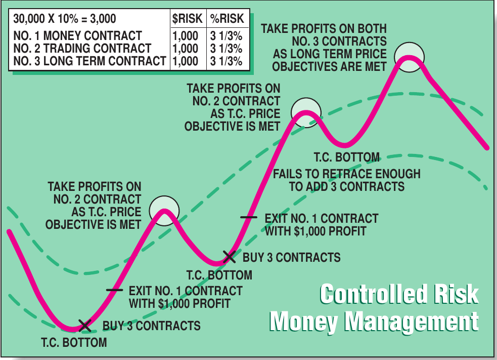
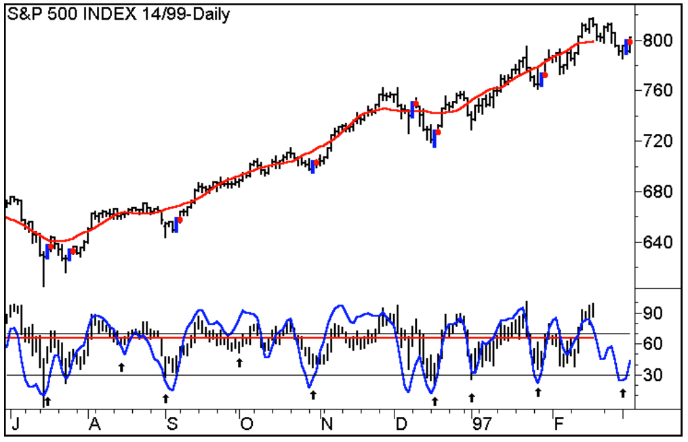
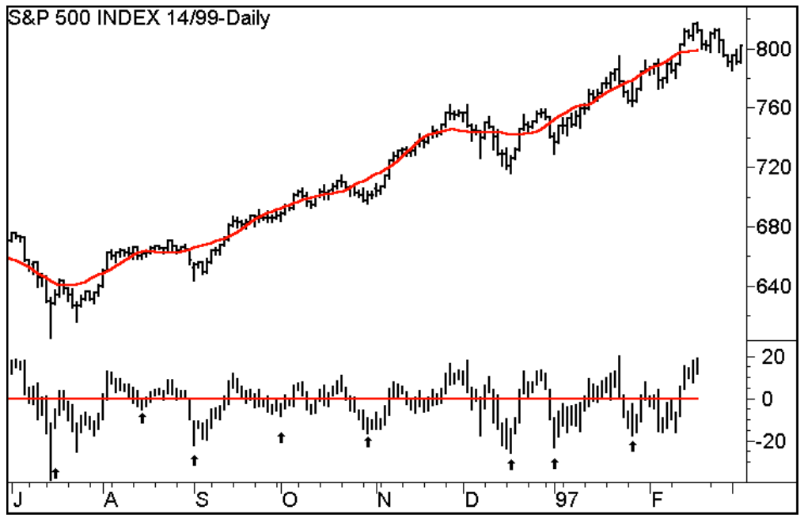
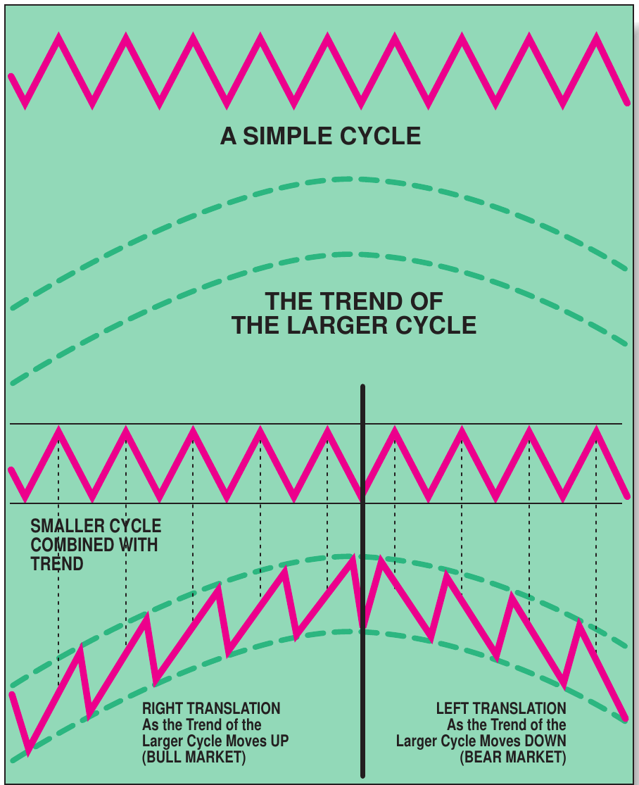
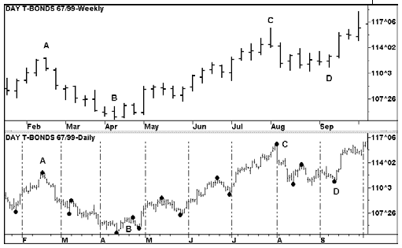

# Trading And Control: Walter Bressert

- **Interview by:** Thom Hartle (Editor, *STOCKS & COMMODITIES*)
- **Subject:** Walter Bressert
- **Publication:** Technical Analysis of STOCKS & COMMODITIES, Volume 16, Number 3 (March 1998), pp. 145--151
- **Format:** Interview
- **Portrait:** Carl Green
- **Article URL:** [Article PDF](https://technical.traders.com/archive/article.asp?file=\V16\C03\023INT.pdf)

---



For commodity and futures traders, the technique of using cycles as a trading strategy will undoubtedly bring to mind trader and analyst Walter Bressert. Bressert, who has been in the trading industry for nearly 30 years, was the publisher and editor of the well-regarded newsletter *HAL Commodity Cycles* for 12 years. In addition, he wrote *The Power of Oscillator/Cycle Combinations* and is today the president of The Bressert Group. His work and techniques are now available in the Cycle Trader software. STOCKS & COMMODITIES Editor Thom Hartle spoke to Bressert via telephone on December 22, 1997, about trading, being in control, cycles, oscillators and the 12 cardinal mistakes that traders make.

> *I went to work on the exchange floor, but I quickly realized that I still didn't know what I was doing. So I began to read everything that was available. I became interested in researching cycles. I could see a rhythm to the markets that could be tradable.* — Walter Bressert

---

***When did you start in the business?***

I first started out close to 30 years ago, with a mutual fund company. Unfortunately, that relationship was short-lived because the stock market fell apart and I was laid off. So I took some time away from the business and when I came back, I noticed an ad for a position as a commodity broker. The position was trading on the floor of what was then the West Coast Commodity Exchange. I had a little experience because I had traded commodities while I was in college, but I didn't really know what I was doing. I went to work on the exchange floor, and I got caught up in all of the excitement, but I quickly realized that I still didn't know what I was doing. So I began to read everything that was available. There wasn't much information available back then, but as I looked at everything, I became interested in researching cycles.

***Why cycles?***

I was looking for something that worked. I had been shown a few systems, but those methods simply churned accounts. But I could see a rhythm to the markets that could be tradable.

***What happened next?***

I found a couple of books published by Ned Dewey. Dewey had been hired by the US government back in the 1930s to determine what had caused the Great Depression.

***What was his conclusion?***

His conclusion was that it was cyclical in nature and there was nothing that the government could have done to stop it. After that, he left the government and started the Foundation for the Study of Cycles. The Foundation publishes a magazine, and has since the 1950s. So I read their research on cycles. Plus, I studied *The Catalogue of Cycles*, which lists about 20,000 different cycles. It became very clear to me that there are cycles all around us.

***How did you bring this to trade the markets?***

It made sense to me that if the long-term cycles existed, then short-term cycles should work, too. I set out to work with shorter cycles in the markets. Because cycles gave me an element of time, I started to make price and time forecasts based on the shorter-term cycles.

***And your newsletter HAL Commodity Cycles followed?***

Ultimately. Before I started the newsletter, I was doing my own research, and during that time, the classic *The Profit Magic of Stock Transaction Timing* was published. After the book was published, the book's author, J.M. Hurst, started holding workshops. Apparently, there were a lot of closet cycle technicians, and we all went to his workshops. I met a lot of people who were as intensely involved in the markets and cycles as I was. It was during that time that I decided to start *HAL Commodity Cycles*.

***How long did you publish the newsletter?***

I published it for 12 years, and it was profitable 10 out of 12. I wrote it as an educational newsletter because I realized that what people needed in the futures business was education. I wanted to demonstrate cycles to the public and show how cycles could be used as a forecasting tool for trading purposes.

***What does HAL stand for?***

High and low risk. However, I quickly discovered that everything was high risk. While I was very accurate in my early years, I tended to struggle later on, probably because I became too deeply involved in my new studies, of technical analysis.

***Why was that a problem?***

My work was and is a continuing evolution. My book, *The Power of Oscillator/Cycle Combinations*, was part of the progress. The Cycle Trader software was part of the evolution.

***How have you changed?***

Initially, all I did was project the periods for tops and bottoms. One of the first things that I realized I needed to do was to quantify the techniques. That's always been a real factor in what I do. I've got to quantify my methods because I want to eliminate the judgment. Using judgment is what causes losses.

***How so?***

You get so caught up in the excitement, the emotions of raw fear and greed. You can't use your judgment; it's impaired at that point. You really can't see what you're doing.

***What were the steps you were taking back then to quantify cycle analysis?***

I was doing all of this by hand at the time. There weren't any personal computers back then. I had nothing but charts. I plotted the charts by hand and I found what I thought were the cycle bottoms and tops. I counted all the measurements from low to low, low to high and high to low. I came up with these very long periods in which cycles had topped and bottomed and plotted them on a chart. I realized, of course, that the time periods were much too wide for trading.

***So what did you do?***

I believed that if I could just be right in my timing 70% of the time, I could make money. So I took the middle 70% of the time periods and, lo and behold, I had a relatively short period. I called that a timing band. With that timing band, I could forecast from the time that a bottom occurred when the next cycle top would occur. I could also forecast from that same bottom when the next bottom was going to occur. So now I was accomplishing what I wanted to do with cycles. I was, in essence, looking into the future. From there, I set out to find tools that would work better with cycles.

***What were some of the technical tools you looked at?***

Oscillators were one of the first approaches I tried. I wanted to identify important cycle tops and bottoms, not with just an element of time and a cycle count, but something that would say this was a cycle bottom or a cycle top. In addition, I was moving more and more toward making this analysis mechanical and eliminating the judgment.

***That's a little extreme!***

We're talking about the basic emotions of fear and greed, hope and love. At any rate, I realized I had to find a way to control my emotions, so I started looking for ways to mechanize my trading decisions — oscillators and cycle counts, all of the standard tools. I kept looking for ways to take the judgment out of trading and to make it more mechanical. That's when Tim Slater approached me about starting CompuTrac.

***The judgment issue appears to be a recurring theme.***

I found that in my own trading, I would make incredible profits with the tools I had developed. But I would give back the profit and sometimes more. Or at least I would always give back a large piece of it. Then, as I progressed in my profitability, I came to the point we all know: The King Kong complex!

***That feeling of invincibility.***

I was right about the markets and nobody could tell me anything different. I just knew that I was going to be right. I was a money-making machine for a while, but then I'd get slammed and I'd retreat.

***Then what?***

Each time, I would take notes about what worked and what didn't. Then, as I started trading, I would observe how cautious I would be this time, and follow my notes regarding what I should and shouldn't do.

***Did that work?***

Well, as I started making money, I would forget the notes. I'd get involved in the market and the same thing would happen again. I came to some important realizations.

> *I think that very few people have the temperament to be a trader. If they are born with it, then they probably have a hard time being a member of the human race.*

***Such as?***

I realized that I don't have the temperament to be a trader. I think that very few people have that temperament. If they are born with it, then they probably have a hard time being a member of the human race.

***[CompuTrac was] one of the first technical analysis software packages.***

Right. The beauty of CompuTrac was that it had oscillators. By this time, I was using three or four oscillators, but I tended to bounce from one to another. So I decided to take one oscillator, and I spent three months going over one market and detailing everything I could with that one oscillator.

***What did you look for?***

As a cycle person, I look to buy bottoms and sell tops. But the real key to buying bottoms and selling tops successfully is trading in the direction of the trend. I had to find an oscillator that would turn when prices turned. To do that, I had to find an oscillator that didn't wiggle.

***What would be one oscillator?***

The stochastic. It's an excellent cycle oscillator. Use a stochastic with a lookback period half the length of the cycle you are trading. The problem with the stochastic, though, is that it can wiggle. I like an oscillator to come down and turn up as prices turn up, but because the stochastic wiggles, you'll get false entry signals.

***Is there a way around that?***

Yes, there is. The fix is to use the stochastics with %D.† While that provides a very good advantage in that you eliminate the false signals, though, you will receive your entry signals into the market further from the bottom.

***After the bottom?***

You get in a number of bars after the bottom. I realized that one of my problems in my trading was that I was always trying to anticipate the exact bottom. I would think that I had hit it right, and then I would watch the market keep going down. I realized that in order for the trade to work, I had to get in after the bottom. After all, there's only one bottom. Even in a move that goes on for months, or one that goes on for days, there will be only one tick or price that is going to be the absolute top or bottom price.

***That's not easy to identify quickly.***

No. The odds of my getting that one tick or that one bar were really slim, but I kept trying. That led me to decide that I wanted an oscillator that's going to let me get into the market as close to the bottom as possible, but after the bottom. Because what kills you is hanging onto the losing trade. As a backup, you have to have that mechanical stop.

***So was that the next step? To add a risk management tool?***

Yes. To be in control, I had to control my risk. That's what I learned from trying to pick those bottoms. If I am not in control, I'm always under stress, and I am only in control when I have a stop in the market. So I had to find a way to get a stop in the market.

***How did you do it?***

The only way to get a market stop was to wait for the market to turn. I could do that with the oscillators I was using, but I would often get that turn signal two, three, four, five bars after the bottom, and the dollar risk was often too big to trade.

***Depending on the lookback period of the oscillator?***

The type of oscillator, yes, and some of the popular ones at the time didn't get you into a market until you were halfway through the cycle already. My focus became to get as close to that cycle bottom as possible, because by doing so, I would have as small a dollar risk as possible per contract. That led me to trade multiple contracts.



**FIGURE 1: CONTROLLED RISK MONEY MANAGEMENT.** In order to trade two contracts, or multiples of twos, a low dollar risk is necessary. Along the way, Bressert added a third contract, and that way he was in for a longer-term move. So the smaller the dollar risk, the more contracts Bressert could put on and the more he could take off of his number 1 contract at his first target.

***Why? Besides making more money per trade, I mean?***

Does this sound familiar? If I went long, the market almost always bounced and I'd be confident that I had bought at the bottom. Of course, then it might reverse and start trending down, and I wasn't about to get out, because I knew it was going to go higher. So I was just going to wait until it went back up again. And then it would go down and stop me out.

***So how did you figure for that possibility?***

I saw that I could trade that bounce. So I figured that if I traded with two contracts, I could trade the bounce, especially if I could forecast a minimum size of the bounce with 70% accuracy. In order to trade two contracts, or multiples of twos, I had to have a low dollar risk. Along the way, I added a third contract, and that way I was in for a longer-term move (Figure 1). So the smaller my dollar risk, the more contracts I could put on and the more I could take off of my number 1 contract at my first target, because I could get that with a high degree of reliability.

***So you'd at least capture some profit to reduce the risk over the full period of the trade.***

Yes, and that would balance me. As long as I am at risk, I'm under pressure. The more pressure I'm under, the poorer my decision-making is going to be. So what I found was that as soon as I took that number 1 contract off, it was like there was a bright light. It was as if the tunnel suddenly opened up and I was no longer under pressure.

***So you are managing your financial risk and you are managing your own emotional risk as well?***

Right. Staying with the topic of financial risk, and for the sake of argument, let's say you've got 10% of your money at risk with a three-contract position. Therefore, you've got 3 1/3% in each position. If I take that first contract off, that lops off 3 1/3% of my risk. That 3 1/3% in my hand also offsets the second 3 1/3%. So my exposure for that trade then drops from 10% to 3 1/3% by taking that one-third profit. This money management technique is a tool used by many professional traders. Just get that first one off real quick. Bring your stop up and you won't be hurt financially or mentally.

***About the technique for identifying the bottom. Did you narrow your method down to one oscillator?***

Yes, I did. At first, I was using the 3-10 oscillator and I was using the stochastic, although I was cautious with it because of the many false signals. A major disadvantage of the stochastics oscillator is that in a strong bull market, it will stay at very high overbought levels. In a sharp bear market, it will consistently produce very low readings. But after a while, I began using the relative strength index (RSI). I started working with the RSI and I did something unique.



**FIGURE 2: RSI.** Overlaid on the centered detrend is the RSI-M3, a 3 RSI smoothed with a 3 MA. Note how the oscillator flows with the detrend and makes a dip as the cycle bottoms, dropping below the buy line at 30 for the significant bottoms. The TEI pattern of a drop in the RSI-M3 below the buy line followed by an upturn causes the price bar of the upturn to be colored blue. This is the setup bar, and a rise above it is the trigger entry signal (a red dot).



**FIGURE 3: CENTERED DETREND.** Here is the centered detrend on the S&P index. The process is the same for any market in any time frame. Plot a centered moving average the same length as the suspected cycle. Most markets have a dominant daily cycle of 14 to 25 days, and a 20-day MA is a good cycle length to start with. The red line in the prices is a 20-day MA calculated to the most recent price close. However, it is plotted back the length of the cycle.

***What was that?***

In order to work with these oscillators and find things that work, the best thing somebody can do is just sit around in the middle of the night, when there is nobody around to disturb you, and start trying various things. I looked at extremely long lookback periods, or subtract one RSI from another to detrend it. I tried a lookback period of three, but it is so short-term that it looks like static. But I marked my chart where the cycles were.

***And how did that turn out?***

I saw that even though the RSI was volatile, it was still coming pretty close to where the cycle bottoms and tops were. To smooth the volatility, I applied a three-bar average of the three-period RSI. That smoothed the indicator's fluctuations. Suddenly, I had a very tradable oscillator that was better than the stochastic. So those were the three oscillators that I was using. They all met my criteria of showing me when a market was overbought/oversold, and seeing that the oscillators reversed when prices turn, and they didn't wiggle too much. I don't like to have to use crossover, because by its nature, it takes you further away from the cycle low. So the stochastic still required a crossover, but the other two didn't. Most important, each was constructed very differently.

***You use the three-period smoothed three-bar RSI?***

Yes. The reason I like this oscillator is that it doesn't wiggle much and you avoid the false signals. So if it turns up, that's often the bottom, and I put my buy-stop one tick above that high to enter into the long position. By using one tick above that high, I would increase my odds for buying the cycle bottom by 10% to 25%, depending on the market and the time frame.

***Compared with going long on the close of the setup bar?***

Right. And there are traders who like to buy on the close, and I did too, but I found that if I bought a market on close of an upturn, the market could slam down the next day.

***That's not uncommon.***

So to improve that setup entry pattern, you wait for the next day's trading, put a buy-stop in above the high of the day, and if the market moves higher, you're in. If I've got a cycle bottom in, say a 20-day cycle, I could put my sell-stop loss in one tick below the low.

***How do you go about deciding that there was a 20-day cycle in the market?***

Initially, I did it by hand. I used a process called centered detrending (Figure 3), which was the process initially used by the Foundation for the Study of Cycles, and they still use it today.

***What is it?***

It's pretty simple. You look at a chart and see if you can find what the cycle is. My method was to find the lowest low on the chart, and then start looking for the significant dips. I marked those. Then I counted the bars between those. Most often, I would come up with a cycle length that would average around 20 bars, or somewhere between 14 and 25.

***So there would be a range?***

Yes. Cycles can contract and expand and skip a beat. Sometimes, the 20-day cycle would drop even down to 10 for one cycle, and sometimes it would go up to 35, but that was infrequent. Sometimes they would seem to completely disappear for a beat. So I borrowed this technique from the Foundation, and I found that most markets tend to have around a 20-day cycle.

***So the steps are?***

You take a centered moving average,† which is the same length as the cycle, calculate it up to the last day and then plot it back half of the length of the cycle. Which means I would take a 20-period moving average and plot it back on day 10. Ideally, it should be between day 10 and day 11. I plot it back on the 10th day. Once it's centered like that, I detrend it.

***And the steps to detrend the data?***

I detrend it by subtracting the moving average from prices. Subtracting that difference between the moving average and the prices shows the cycle tops and bottoms much more clearly. It shows the cyclical nature of the markets very nicely. But here's where the problem came in, that the centered detrend lags back half of the length of the cycle. So you look at it and you find the historical cycle. And anyone doing this the first time will think that this is great, and that they've found the Holy Grail. But the data is back 10 bars from current time.

***What next?***

Next, I tried a real-time detrend. I found that if I took a 10- or 20-day real-time detrend, the real-time detrend was not as accurate as a centered detrend. That realization led me to oscillators. That's when I started using a detrend and the 3-10 oscillator over the detrends. I saw that the 3-10 often turned right at those cycle tops and bottoms.

***It did? Anything else you've found?***

That's right. And the three-period smoothed three-bar RSI does that very well too.

***When you plotted your detrend chart, that's where you came up with your bands for when you were in potential cyclical lows and highs, right?***

That's what I used to determine the bands. Once I had those bands, then I could forecast. As a matter of fact, once I had those cycles down, then I could quantify the technique. I could see how cycles skipped a beat, because when you do a centered detrend, that little cycle you don't see actually shows up with that centered detrend. And I could see left and right translation in a market.

***What's that? The right and left translation, I mean?***

A right translation occurs when a market is in a bull move. That's when the cycle highs lean to the right. A left translation is when the market is in a declining move. The cycle top leans to the left (Figure 4).



**FIGURE 4: THE CYCLES.** A right translation occurs when a market is in a bull move. That's when the cycle highs lean to the right. A left translation is when the market is in a declining move. The cycle top leans to the left.

***For example?***

For example, in a 20-day cycle, ideally it's 10 days up, 10 days down, 10 days up, 10 days down, but in a bull market it might be 15 days up and five days down, or 12 days up and eight days down, or 20 days up and three days down. Then when it shifts over to a bear market following a top, suddenly you might find it's five days up and 15 days down. Well, this is where bad habits catch up with you if you decide to hold onto a position because you are convinced that it's going to go up. You only have to live through a translation shift once to end that bad habit. So right and left translation tells you what kind of a market you're currently in. It tells you what to expect when the trend reverses. Trend is up, right translation. Trend is down, left translation.

***And this is important to a trader because—***

It's important to a trader because when you're getting into a market, it gives you a much better feel for what a market is likely to do. If you look at a chart and you see that the market's been moving up, you can see that right translation, and you can anticipate that it's going to continue to occur until it tops. If you're aware that once it tops, you're going to get a left translation, you're not surprised when it occurs, and so you can believe your oscillator.

***We've discussed the setup for an entry. What about exit rules?***

It's easy to get into a market. It's a lot harder to get out of it. We are afraid of leaving too much money on the table. That, again, is why I trade multiple contracts. Getting out of the first contract at a predetermined price gives me money in my pocket. The second contract is designed to look for the top of the trading cycle. The third contract is there for the longer-term move. But you've got to know what the trend is. This is one place where cycles give a very distinct advantage, in that the trend to the time frame you are trading is the dominant cycle in the next longer time frame.

***So that means —***

So if I'm trading a daily chart, the trend for that daily chart is set by the cycle in the weekly. This works for bull trends as well as bear trends, but to keep it simple I will refer to bull trends. I'm looking to get in at, let's say, a daily cycle bottom. I take my number 1 off on a daily chart, I've got to get that off within four days, five at the most, or the odds are very good that it's going to drop. By identifying the dominant cycle in the next longer time frame, I've got trend. By using my timing bands for the weekly chart (Figure 5), I can forecast a trend reversal, even though I don't go for what I think is going to be the trend reversal day.



**FIGURE 5: WEEKLY T-BOND TOP, DAILY ON BOTTOM.** The cycle in the weekly chart sets the trend for the cycle in the daily chart. The top is a weekly of the daily data below. The 21-week cycle topped at A, bottomed at B, topped again at C and then bottomed at D.

***What do you go for?***

I'll wait for a trade after the reversal. I'll look for a short-term pattern after the reversal day or look to get in at the next cycle bottom. I take my number 1 off, then I look to get out, as I think the trading cycle is topping. I get a 70% timing band, so I am not going to even consider getting out until I'm into that 70% timing band. Because only 15% of tops have occurred before that.

***So what takes you out of each contract?***

I'll do a number of things. I'll check how overbought the oscillator is. If it's extremely overbought, I might put a sell-stop below a previous bar low. I've developed mechanical trailing stops. Parabolic stops can be used. Swing highs and lows can be used. Weekly highs and lows can be used. I'll also look for an oscillator sell signal. If I am in the timing band and I get an oscillator sell signal, which is the mirror image of the buy signal, I'll put a sell-stop below that setup bar. So I'll reserve a number of techniques to get out.

***For the longer-term trade?***

Then for the longer term, keeping that number 3 position to let the daily cycle come down and start back up again. Hopefully, when I make that daily cycle bottom, I can buy three more contracts and ride up to the top of that weekly cycle. But in the meantime, I have one contract that I am holding from my earlier entry, just in case the market doesn't come down to give me a cycle buy.

***You've also written a book called The 12 Cardinal Mistakes. Would you like to talk about that?***

I wrote *The 12 Cardinal Mistakes* around 1981. I wrote it because I had just done an extensive review of my trading and realized all of the mistakes that I had made, and I realized that I had made them over and over again. So after I evaluated my trading, I put together a chart of my equity moves, and showed them to other traders.

***Pretty brave of you!***

I was kind of embarrassed to show them, but I would make money and give back so much, and sometimes a large profit would turn into a large loss. But these were usually campaign moves where I would build up what I thought was going to be a big move based on seasonals and cycles.

***What happened?***

To my surprise, many of the traders looked at what I had done and they said that it looked an awful lot like their own trading. That's when I realized that it wasn't just me.

***So there is a common ground among the traders?***

It's what's in everybody. It's the emotion. That's what prevents us from being good traders. That's when I really started doing some soul-searching and realized what the futures market does more than anything else is that it pushes our buttons of fear and greed, and goes right through to our weakest points. I decided to list those problems and explain them, because if they had occurred in me and the professionals I had talked to, they had to be happening to everybody (see sidebar, "12 Cardinal Mistakes").

> ### The 12 Cardinal Mistakes
>
> Here are the 12 cardinal mistakes that can send a trader to his or her doom, according to Walter Bressert:
>
> 1. Lack of a game plan
> 2. Lack of money management
> 3. Failure to use protective stop/loss orders
> 4. Taking small profits and letting your losses run
> 5. Overstaying your position
> 6. Averaging a loss
> 7. Meeting margin calls
> 8. Increasing your commitment with success
> 9. Overtrading your account
> 10. Failure to remove profits from your account
> 11. Changing your strategy during market hours
> 12. Lack of patience, or trading for excitement, not for profit

***Anything you'd like to wrap up with?***

Based on the years I've been trading and the traders I've interacted with, and I've probably taught several thousand traders how to use cycles and trade, I think there is a common thread among us.

***Which is?***

In order to make money in this business over time, you've got to develop structured trading, a game plan unique to your personality. One example that I can point to is the Orange County bond debacle. I received a call from a reporter who wanted to know what I thought about it when it happened, and we got to talking about technical analysis, and how I looked at the markets.

***Okay. What happened?***

She called me back about three months later and said that she had spoken to a dozen or more traders. She had been struck by how we all use completely different approaches to the market, but all the approaches seemed to work for us. She was amazed by how something so simple as the market can have so many different traders using approaches that don't come close to each other. The common thing is that we all find very basic approaches to controlling our risk, controlling fear, controlling our greed and being in control. It is unique to our personalities.

***So the key is to find something that you are intuitively comfortable with so you can implement it?***

That's right. You've got to be comfortable with the size of your risk. You've got to be comfortable with where you think the market's going to go. People who trade cycles tend to want to feel they have an idea as to where the market is going to go.

***What else?***

The years you're starting out can often be the worst. Sometimes you make money and you don't know quite how you made it.

***So early success can be bad?***

It's the worst thing that can happen to you, but it happens, and when the market turns, you're still using the same rules and you get destroyed. I've told this to people as long as I have been in the business. The best thing you can do in the futures markets is practice for months before you trade. Get a set of charts to study, read everything you can and come up with a method that you are comfortable with.

*Thanks, Walter.*

---

† See Traders' Glossary for definition.

## Related Reading, Resources

- Bressert, Walter [1991]. *The Power of Oscillator/Cycle Combinations*, Walter Bressert and Associates.
- Bressert Marketing Group, 312 867-8701, http://www.bressertgroup.com
- Foundation for the Study of Cycles, 900 West Valley Road, Suite 502, Wayne, PA 19087.
- Hurst, J.M. [1970]. *Profit Magic of Stock Transaction Timing*, Prentice-Hall.

---

*Copyright (c) Technical Analysis Inc. Originally published in Technical Analysis of STOCKS & COMMODITIES magazine, V16:3 (145--151). Source article: <https://technical.traders.com/archive/article.asp?file=\V16\C03\023INT.pdf>*

---

## BibTeX

```bibtex
@article{hartle1998bressert,
  author       = {Hartle, Thom},
  title        = {Trading and Control: {Walter} {Bressert}},
  journal      = {Technical Analysis of Stocks \& Commodities},
  volume       = {16},
  number       = {3},
  pages        = {145--151},
  year         = {1998},
  month        = mar,
  note         = {Interview with Walter Bressert},
  publisher    = {Technical Analysis, Inc.},
  url          = {https://technical.traders.com/archive/article.asp?file=\V16\C03\023INT.pdf}
}
```
